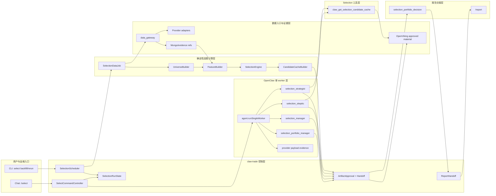
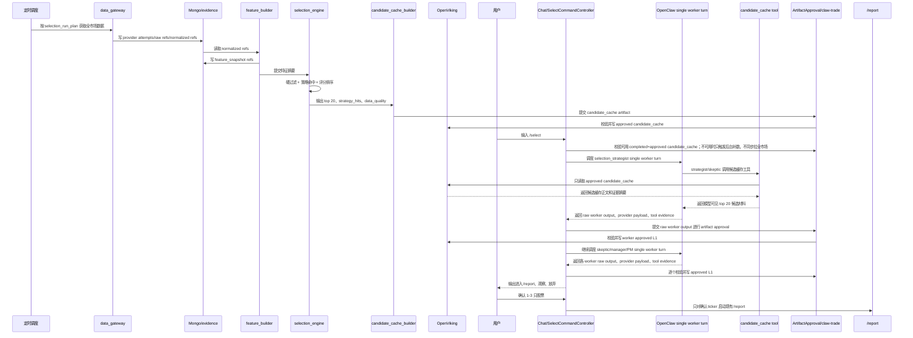
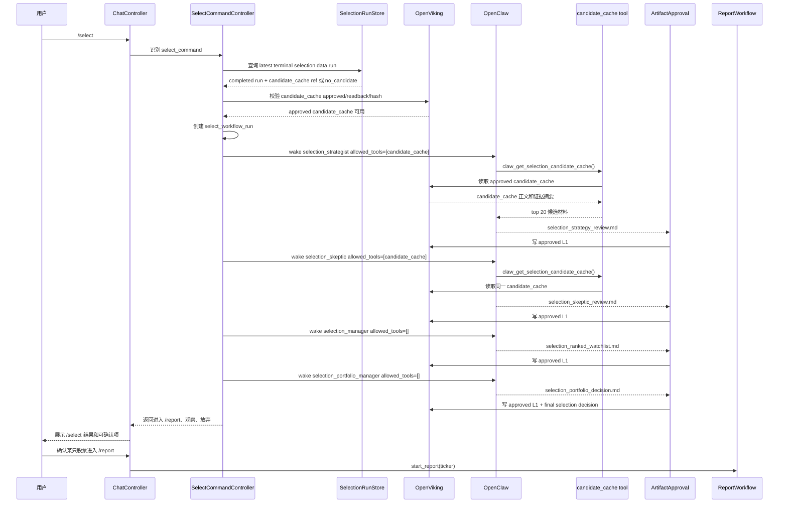

# A股选股总体设计

状态：总体设计草案，已有首版实现，本文按当前实现口径同步。
日期：2026-05-24  
依据：`AGENTS.md`、`docs/A股扩展方案.md`、`docs/A股扩展详细设计.md`、`docs/数据层详细设计.md`、`docs/数据层实施任务清单.md`、`docs/设置模块设计文档.md`，以及对 `myhhub/stock`、`ArvinLovegood/go-stock`、`sngyai/Sequoia-X` 的源码调研。旧 `docs/数据源removed_data_gateway引入方案.md` 只作为历史背景。

## 1. 总体结论

### Verdict

同意建设独立的 A股选股 workflow，但它不能把 `/report` 工作流简单放大到全市场。正确形态是：

```text
收盘后确定性批处理
  -> 拉全市场数据
  -> 计算特征
  -> 策略筛选和评分
  -> 生成 top 20 候选缓存

用户触发 /select
  -> OpenClaw selection workers 评审 top 20
  -> 选出 top 1-3
  -> 用户确认后进入 /report
```

大规模数据和计算归 `claw-trade` 确定性执行层；小规模候选判断归 OpenClaw worker。`/select` 不直接调用完整 12-worker report DAG，也不让 LLM 扫全市场。

### Pushback

- 全市场数据量不适合在用户点 `/select` 时实时拉取和计算。A股约 5000 只以上股票，260 个交易日回看约 130-150 万行日线数据；用户交互阶段只能读取已准备好的候选池。
- 300-500 只候选仍然不适合发给 LLM。这个阶段必须继续由本地策略评分引擎压缩到 top 20。
- `myhhub/stock`、`go-stock`、`Sequoia-X` 都没有让 LLM 直接获取和筛选全市场。它们共同证明：全市场选股首先是批量数据工程和确定性计算问题。
- 东财接口稳定性不足，第一版设计不绑定具体东财 endpoint。具体 provider 后续通过 data_gateway provider plugin/adapter 实测决定。

### 已确认事实

- `claw-trade` 当前架构中，工作流状态机、调度、artifact 权威、hard gate 和报告导出归 `claw-trade`。
- OpenClaw 负责单个 worker turn、真实 provider prompt、tool schema、tool call、LLM response 和 provider payload capture。
- data_gateway 是当前外部数据入口和 provider evidence 记录层；已删除数据网关 本体不是目标运行时依赖。
- Mongo 已用于保存 provider attempts、raw payloads、normalized results、cache entries、run provider plans 等证据。
- OpenViking 已用于 approved L1/L2 material、manifest、hash、lineage 和下游 handoff。
- 现有请求模型是单标的报告路径中心的 `RunRequest`，不是全市场或候选池中心的 selection 请求模型。
- 现有入口只有 `generic` 与 `report_command`；`WorkflowEntryPoint` 尚无 `select_command`。
- 现有 `Stage` 只覆盖 report workflow 阶段，尚无 selection review / selection decision / selection portfolio decision 阶段。
- 现有 run store / workflow state 只证明 report run 路径可用，不能直接当作 selection run、candidate pool run、用户确认幂等记录已经存在。

### 第一版新增/扩展合同

`/select` 第一版不是“直接复用现有 `/report` 代码路径”。它必须新增或扩展以下合同，且这些改变 workflow 调度和执行权限边界的部分属于本设计的已确认共识范围：

- 新增 selection 请求模型，例如 `SelectRequest` 或等价模型，表达 `market/profile/trade_date/latest_terminal_run/user_confirmation`，不得把它伪装成 ticker-centric `RunRequest`。
- 新增 `select_command` workflow entry point；普通 chat 不得静默进入 selection，`report_command` 也不得承担 selection 语义。
- 新增 selection 阶段枚举或等价阶段标识，至少覆盖 `selection_review`、`selection_decision`、`selection_portfolio_decision`、`selection_report_handoff`。
- 新增或扩展 run store，用于保存两类状态：后台候选池生成 run，以及用户触发的 `/select` worker workflow run。二者必须用 run id、trade date、market、candidate cache hash、status 和 lineage 关联。
- 新增 selection workflow state machine，由 `claw-trade` 按固定顺序调度 4 个 OpenClaw single worker turn。LLM 不决定下一位 worker，OpenClaw 不拥有完整 selection workflow。
- 新增 candidate cache approval/readback/hash/manifest 校验；未批准、过期或 hash/readback 不一致的候选缓存不得进入 worker prompt。
- 新增用户确认记录和幂等键，保证用户确认后只对确认 ticker 启动现有 `/report`，且重复确认不会重复创建同一 report run。

任何超出上述范围的调度权、执行权、worker 数量、市场扩展、provider fallback、OpenClaw 源码职责变化，都必须列为“需人工确认”，不能在实现时顺手扩大。

### 推断

- `/select` 应新增独立入口 `select_command`，不能偷用 `report_command`。
- `/select` 应复用 OpenClaw single-worker 运行机制、per-turn tool narrowing、provider payload capture、material target、OpenViking approved material 机制。
- `/select` 的 prompt 应参考 A股 report prompt 的中文报告感、A股市场约束、角色分工和证据边界，但任务目标应改为“候选评审和报告交接”，不是完整投资建议。
- 第一版选择 A股日频收盘后批处理，不做盘中高频选股。

### 未知

- 最终采用哪些 data_gateway provider adapter 接口，需要后续实测字段覆盖、限流、失败率、时效和许可边界。
- Tushare、AkShare、baostock、东财系接口在本项目运行环境中的真实吞吐和字段稳定性仍需 live evidence。
- UI 最终展示形式需要产品确认，例如普通消息、结果卡片或确认卡片；本文设计明确不自动触发 `/report`，必须等用户确认。

### Recommendation

先实现 A股日频选股闭环：

```text
交易日 16:30/17:00 定时任务
  -> 生成当日 selection candidate pool

用户 /select
  -> worker 评审 top 20
  -> 输出 top 1-3 / 观察 / 放弃

用户确认
  -> 对 top 1-3 逐只运行 /report
```

### 共识、推断与待确认分类

| 项目 | 分类 | 设计处理 |
|---|---|---|
| `/select` 是独立 workflow，不偷用 `report_command` | 已确认共识范围 | 第一版新增入口、请求模型、阶段和 run store 合同 |
| 第一版 worker 固定为 `selection_strategist`、`selection_skeptic`、`selection_manager`、`selection_portfolio_manager` | 已确认共识范围 | 必须是 OpenClaw-woken single worker turn |
| top 20 候选缓存 | 合理推断 | 作为第一版默认压缩目标；若要改成动态 N，需要人工确认 |
| 收盘后 16:30/17:00 定时 | 合理推断 | 写成建议默认窗口；具体 cron 和节假日策略需实现时配置 |
| strategist 与 skeptic 顺序评审 | 合理推断 | 第一版默认顺序，便于 skeptic 反驳 strategist；改并行需人工确认 |
| 第一版不开放 OpenViking 深读工具 | 已确认共识范围 | manager/PM 也无工具；增强材料应改 candidate cache 摘要 |
| provider payload 是工具可见性和 prompt 边界最终验收证据 | 已确认共识范围 | 静态渲染、日志和文档声明不算最终证据 |
| `myhhub/stock` 与 `Sequoia-X` 本地可复现策略 | 已确认共识范围 | 两个项目审计到的本地策略全部纳入 `/select` 优先实现清单；不得因当前数据字段未接好而裁剪策略 |
| v1 跨策略排序权重 | 已确认共识范围 | 使用本文 §4.3 的透明权重；参考项目没有统一跨策略权重，因此这是 claw-trade 第一版排序合同 |
| 硬过滤阈值 | 已确认共识范围 | 先按 SEL-00 审计到的来源阈值落地；若同类策略有不同阈值，保留为来源策略变体，不拍脑袋合并 |
| `select backfill/rerun` CLI | 合理推断 | 允许作为后台运维入口；命令名和权限模型需实现确认 |
| UI 状态和文案 | 合理推断 | 本文只定义状态语义；最终展示形态需产品确认 |
| 新 Stage 名 | 待确认实现名 | 语义必须存在；具体 enum 名可按代码风格调整 |
| `single_worker_minimal` | 合理推断 | 仅在现有 OpenClaw/system context 策略可支持时复用；不为此改 OpenClaw 业务职责 |
| `selection-candidate-review` shared skill | 待确认配置名 | 可作为共享方法说明；不得替代 worker prompt 权威 |
| manager/PM candidate facts 注入 | 有条件允许 | 只能注入已批准 candidate cache 摘要/表格 prompt variable，不得注入 raw/debug/provider envelope/Mongo/OpenViking 协议/refs/hash 文本 |
| HK/US/CRYPTO 复用 selection 模式 | 需人工确认 | 只能复用架构模式，不能 fallback 到 CN_A prompt 或 A股策略 |

## 2. 产品目标

### 2.1 目标

- 每个 A股交易日收盘后自动生成可审计的候选股票池。
- 用户在 `/select` 中快速获得 top 1-3 候选，而不是等待全市场计算。
- 候选入选、观察、放弃均有读者化来源摘要或明确数据缺口。
- `/select` 输出的是“是否值得进入 `/report`”，不是最终买卖建议。
- 可复用现有 data_gateway、Mongo、OpenViking、OpenClaw single-worker 机制。

### 2.2 非目标

第一版不做：

- 盘中实时选股。
- 全市场 LLM 扫描。
- 自动下单或自动交易。
- 把“买入/持有/卖出、目标价、止损价、交易计划”当作 `/select` runtime 失败 gate。
- 让 selection worker 调 data_gateway/provider 或直接抓外部数据。
- 把 `/report` 的 12 个 worker 跑在全市场或 top 20 上。
- HK、US、CRYPTO 自动复用 CN_A prompt、A股策略、A股阈值或 A股 provider 矩阵。

其它市场未来只能复用“后台确定性压缩候选池 + OpenClaw worker 评审 + 用户确认后 `/report`”这个架构模式。HK、US、CRYPTO 必须有独立市场策略、prompt、数据源和验收批准；未批准时 fail closed，不能 fallback 到 CN_A。

## 3. 模块划分与总体架构

人话解释：

```text
后台批处理负责把全市场压缩成 top 20。
OpenClaw worker 负责评审 top 20 值不值得进入完整投研。
/report 负责对入选个股做 12-worker 深度报告。
```

### 3.1 模块清单

| 模块 | 归属 | 主要职责 | 输入 | 输出 |
|---|---|---|---|---|
| `/select` 入口模块 | `claw-trade` | 接收用户 `/select`，读取最新可用 selection run，启动 selection worker DAG | 用户命令、market、trade_date 可选参数 | selection workflow run |
| 定时调度模块 | `claw-trade` | 收盘后触发日频选股，支持 backfill/rerun | 交易日历、market、date | `selection_run_plan` |
| 股票池模块 | `claw-trade` | 生成本轮全市场股票池，处理上市状态、ST、停牌、退市风险 | provider 股票列表、交易日历 | `universe_snapshot` |
| 数据入口模块 | data_gateway | 统一调用 provider plugin/adapter，记录 attempts/raw/normalized/cache 证据 | provider settings、data requests | normalized market/fundamental refs |
| 证据存储模块 | Mongo + evidence store | 保存 provider raw refs、normalized refs、feature refs、audit refs | data_gateway 输出 | 可追溯数据引用 |
| 特征计算模块 | `claw-trade` | 计算收益、趋势、RPS、波动、量能、风险、行业强弱 | normalized refs、universe | `feature_snapshot` |
| 策略筛选模块 | `claw-trade` | 硬过滤、策略命中、评分排序，把全市场压缩到 top 20 | `feature_snapshot`、规则配置 | `candidate_scores`、`strategy_hits` |
| 候选缓存模块 | `claw-trade` | 生成 worker 可读的候选事实缓存和审计引用 | top 20、features、strategy hits、data quality | `candidate_cache.md/json` |
| Artifact approval 模块 | `claw-trade` + OpenViking | 校验候选缓存和 worker L1，通过后写 approved material、manifest、hash、lineage | candidate cache、worker output | approved L1/L2 material |
| Selection tool 模块 | OpenClaw tool + `claw-trade` backend | 暴露 `claw_get_selection_candidate_cache` 给指定 worker，只读取 approved candidate cache | runtime context 中的 `selection_run_id` | 模型可见候选缓存 |
| OpenClaw selection worker 模块 | OpenClaw | 按 worker 身份、prompt、skill、tool schema 执行单个 agent turn | prompt variables、approved material、allowed_tools | worker L1 |
| Selection 决策模块 | OpenClaw workers | 由 strategist/skeptic/manager/PM 评审 top 20，输出进入 `/report`、观察、放弃 | candidate cache、上游 approved L1 | `selection_portfolio_decision` |
| `/report` 交接模块 | `claw-trade` | 把用户确认的 1-3 只股票交给现有 `/report` 流程 | selection decision、用户确认 | `/report <ticker>` run |
| 验收与观测模块 | `claw-trade` | 保存 provider payload、tool schema、artifact refs、run status，用于测试和审计 | runtime events | evidence bundle |

### 3.2 模块说明

#### 入口与控制模块

`/select` 入口模块只负责识别用户意图、选择 market/profile、检查是否已有可用 `completed + approved candidate_cache`，可用时启动 selection workflow；如果没有可用 completed candidate cache、最新终态为 no_candidate、run stale、candidate cache 尚未 approved 或 warehouse 证据不足，则触发后台 selection data refresh/job。它不直接调 provider，不直接读表，不同步跑全市场，不计算指标，不写入选理由。

定时调度模块负责交易日收盘后的自动运行，以及 `backfill/rerun` 和 `/select` 触发的后台 refresh。它生成本轮 `selection_run_plan`，并把 run 状态从 `planned` 推到 `completed`、`no_candidate` 或 `failed`。如果没有可用 completed candidate cache、最新终态是 no_candidate、run stale、candidate cache 尚未 approved 或 warehouse 证据不足，用户 `/select` 应得到“补数已启动/已有补数在跑/补数通道未配置”，而不是临时同步启动全市场实时计算。hash/readback/lineage 损坏仍 fail closed，不用后台补数隐藏完整性问题。

建议落点：

```text
src/claw_trade/workflow/
src/claw_trade/ui_backend/
src/claw_trade/cli/
```

#### 数据入口与证据模块

数据入口模块复用 data_gateway 的 provider plugin/adapter、settings、attempt capture、cache、normalized result 机制。它负责“从哪里拿数据”和“证据怎么留”，不负责选股结论。

Mongo/evidence store 保存 raw refs、normalized refs、feature refs 和 provider attempts。OpenViking 保存 approved candidate cache、worker L1、manifest、hash、lineage。模型可见材料只能来自 approved candidate cache 或 approved L1，不直接读取 raw/debug/provider envelope。

建议落点：

```text
src/claw_trade/data_gateway/
src/claw_trade/data_gateway/store/
src/claw_trade/artifacts/
```

#### 确定性选股计算模块

股票池、特征计算、策略筛选和候选缓存生成是一个后台批处理链路。它可以分文件实现，但第一版不需要拆成多个常驻 Python 进程。

这组模块的核心职责是把约 5000 只 A股压缩到 top 20：

```text
universe_snapshot
  -> feature_snapshot
  -> strategy_hits
  -> candidate_scores
  -> candidate_cache
```

确定性层只能写事实和机器可复算结果：

- 全市场取数结果和 normalized refs。
- 特征值、硬过滤结果、策略命中、确定性得分。
- 数据质量、provider/cache/attempt refs 的审计索引。
- top 20 排序事实和排序依据字段。

确定性层不得写：

- 自然语言入选理由。
- 投资判断或研究结论。
- 最终结论、目标价、止损价、交易建议。
- 买入/持有/卖出或类似最终交易动作。

candidate cache 可以是 Markdown/JSON，但 Markdown 只能是表格化事实和字段说明，不得把 Python 生成的文字包装成 worker 的投资观点。自然语言评审必须由 OpenClaw selection workers 产出。

建议新增落点：

```text
src/claw_trade/selection/
  scheduler.py
  data_job.py
  universe.py
  features.py
  strategies.py
  engine.py
  candidate_cache.py
  models.py
```

#### Selection tool 模块

`claw_get_selection_candidate_cache` 是 worker 可见工具，但它不是外部数据工具。它只按 runtime context 读取本轮 approved candidate cache，返回模型可见候选事实表、字段说明、数据质量和读者化来源摘要。

它不允许：

- 调 data_gateway/provider。
- 查 Mongo raw collection。
- 重新打分或改排序。
- 扩大 top 20。
- 返回 provider attempts/debug/cache/raw。
- 生成自然语言入选理由或投资判断。

建议落点：

```text
src/claw_trade/selection/tools.py
src/claw_trade/config/tool_names.py
agents/selection_*/STAGES.yaml
```

#### OpenClaw worker 与 agent 配置模块

selection worker 必须仍是 OpenClaw agent turn，不是 Python 函数。Python 只负责按 workflow 顺序叫醒 worker，并传入 approved prompt variables、allowed tools、material target。

worker 配置包括：

```text
agents/selection_strategist/
agents/selection_skeptic/
agents/selection_manager/
agents/selection_portfolio_manager/
```

每个 worker 至少需要：

- `IDENTITY.md`
- `prompts/CN_A.md`
- `STAGES.yaml`
- `SKILLS.md`

#### Artifact approval 与交接模块

artifact approval 模块负责验证 candidate cache 和 worker L1 是否可进入下游。通过后写 OpenViking material、manifest、hash、lineage。

`/report` 交接模块只做一件事：把用户确认的 ticker 交给现有 `/report`。它不把 `/select` 结论改写成最终买卖建议。

建议落点：

```text
src/claw_trade/artifacts/
src/claw_trade/workflow/
src/claw_trade/reports/
```

### 3.3 模块边界

| 边界 | 正确归属 | 禁止事项 |
|---|---|---|
| 全市场取数 | data_gateway + `claw-trade` 后台任务 | selection worker 直接拉全市场 |
| 全市场计算 | `feature_builder` + `selection_engine` | LLM 计算 300-500 只股票特征或排名 |
| 候选评审 | OpenClaw selection workers | Python 写自然语言入选理由或投资判断 |
| 工具暴露 | `STAGES.yaml` + `tool_names.py` + `allowed_tools` | prompt 临时要求 worker 调未批准工具 |
| 材料权威 | artifact approval + OpenViking | 未批准 artifact 进入下游 prompt |
| 外部 provider 证据 | Mongo/evidence store | raw/debug/provider envelope 进入模型可见 prompt |
| 最终交易建议 | `/report` 的 portfolio manager | `/select` 输出买入/持有/卖出或目标价 |
| OpenClaw 职责 | 单 worker turn、provider payload、tool schema | selection workflow、候选池生成、A股策略、投资业务逻辑 |

不得把 `/select` workflow、A股策略、candidate cache 生成、用户确认、report handoff 或任何 claw-trade 业务逻辑写进 `third_party/openclaw`。如果实现发现必须修改 OpenClaw，只能是通用 single-worker runtime seam，例如 per-turn tool narrowing 或 provider payload capture；超出该范围必须先人工确认。

### 3.4 模块架构图



### 3.5 数据流程图



这张图的 owner 边界是：Chat/SelectCommandController 负责调度每个 OpenClaw single worker turn；ArtifactApproval/`claw-trade` 负责校验 raw worker output 并写 OpenViking approved material；OpenClaw 只执行单个 worker turn，并返回 raw worker output、provider payload 和 tool evidence。OpenClaw 不写 approved L1，不拥有 selection workflow，也不决定下一位 worker。

### 3.6 分阶段数据流

#### 收盘后批处理

```text
SelectionScheduler
  -> SelectionDataJob
  -> data_gateway provider plugins/adapters
  -> Mongo raw refs / normalized refs
  -> FeatureBuilder
  -> SelectionEngine
  -> CandidateCacheBuilder
  -> ArtifactApproval
  -> OpenViking approved candidate_cache
```

这一段处理全市场数据。它可以很重，可以跑几分钟，但必须在用户 `/select` 前完成。

#### 用户 `/select`

```text
SelectCommandController
  -> check usable completed+approved candidate cache
  -> if no usable candidate cache / no_candidate / stale / warehouse evidence insufficient, trigger background selection data refresh/job and return refresh status
  -> wake selection_strategist with claw_get_selection_candidate_cache
  -> approve selection_strategy_review
  -> wake selection_skeptic with claw_get_selection_candidate_cache
  -> approve selection_skeptic_review
  -> wake selection_manager with approved upstream L1
  -> approve selection_ranked_watchlist
  -> wake selection_portfolio_manager with approved upstream L1
  -> output top 1-3 / watch / reject
```

这一段只评审 top 20，不触发外部 provider fetch，不重新计算全市场。

#### `/report` 交接

```text
selection_portfolio_decision
  -> 用户确认 ticker
  -> /report <ticker>
  -> 现有 A股 report workflow
```

`/select` 的结论只决定研究资源分配，不替代 `/report` 的完整投资研究结论。

### 3.7 关键接口与依赖

| 接口 | 调用方 | 被调用方 | 传递内容 |
|---|---|---|---|
| `run scheduled_selection_job(CN_A, trade_date)` | scheduler/backfill | selection batch | market、trade_date、lookback_days |
| `fetch_market_data(run_plan)` | `selection_data_job` | data_gateway | 股票池、日线、快照、估值/行业字段需求 |
| `read_normalized_refs(selection_run_id)` | `feature_builder` | Mongo/evidence | normalized data refs，不读模型 prompt |
| `build_candidate_cache(selection_run_id)` | `candidate_cache_builder` | selection artifacts | top 20 排序事实、候选摘要表、数据质量和审计引用 |
| `claw_get_selection_candidate_cache()` | OpenClaw worker | selection tool backend | 当前 run 的 approved candidate cache |
| `agent.runSingleWorker` | `claw-trade` | OpenClaw | worker id、prompt vars、allowed_tools、material_target |
| `approve_l1(worker_output)` | workflow control | artifact approval/OpenViking | worker L1、hash、manifest、lineage |
| `start_report(ticker)` | report handoff | `/report` workflow | 用户确认后的股票代码和市场 |

### 3.8 从 `/select` 命令发起后的完整流程

本节描述用户在聊天里输入 `/select` 之后的完整运行路径。前提是收盘后批处理已经生成可用的 completed selection run；如果最新终态是 no-candidate 或没有可用 completed run，`/select` 不临时拉全市场数据。

#### 3.8.1 总体时序



#### 3.8.2 步骤说明

| 步骤 | 执行者 | 做什么 | 产物 | 失败时 |
|---:|---|---|---|---|
| 1 | Chat 入口 | 识别用户输入是否为 `/select`，切换到 selection workflow | `select_command` | 非 `/select` 走普通 chat 或其他命令 |
| 2 | Select 控制器 | 解析 market/profile/date。第一版默认 `CN_A`，日期默认最新终态交易日 | `SelectRequest` | HK/US/CRYPTO 未批准时 fail，不 fallback |
| 3 | Select 控制器 | 检查可用 `completed + approved candidate_cache` | `selection_run_id` 或 refresh 状态 | 没有可用 completed candidate cache、最新 no-candidate、run stale 或 warehouse 证据不足：触发后台补数并返回补数状态 |
| 4 | Select 控制器 | 检查 run 时效、market/profile、candidate_cache approval、hash/readback | `SelectedCandidateCacheRef` | run 过期或 candidate cache 未 approved：触发后台补数并返回补数状态；hash/readback/lineage 不一致：停止 |
| 5 | Select 控制器 | 创建本次 `/select` workflow run，绑定 `selection_run_id` | `select_workflow_run_id` | run state 无法写入：停止 |
| 6 | Select 控制器 | 准备 `selection_strategist` 的 prompt vars、allowed_tools、material_target | OpenClaw single-worker request | 工具解析不等于 candidate cache：停止 |
| 7 | OpenClaw | 唤醒 `selection_strategist` | provider payload、tool schema、raw LLM output | provider/runtime 失败：记录失败并停止 |
| 8 | candidate cache tool | worker 调用 `claw_get_selection_candidate_cache()`，只读 approved cache | 模型可见 top 20 材料 | tool 发现 candidate cache 不可用：控制层记录明确错误并停止，不允许现场拉数 |
| 9 | Artifact approval | 校验 strategist L1，通过后写 OpenViking approved material | `selection_strategy_review.md` | L1 不合格：不进入 skeptic |
| 10 | Select 控制器 | 唤醒 `selection_skeptic`，仍只允许 candidate cache tool，并传入 strategist L1 | skeptic request | 上游 L1 缺失：停止 |
| 11 | Artifact approval | 校验 skeptic L1，通过后写 OpenViking | `selection_skeptic_review.md` | L1 不合格：不进入 manager |
| 12 | Select 控制器 | 唤醒 `selection_manager`，allowed_tools 为空，只传 approved 上游 L1 和 candidate cache 摘要 | manager request | payload 出现工具：停止 |
| 13 | Artifact approval | 校验 manager L1，通过后写 OpenViking | `selection_ranked_watchlist.md` | L1 不合格：不进入 PM |
| 14 | Select 控制器 | 唤醒 `selection_portfolio_manager`，allowed_tools 为空 | PM request | payload 出现工具：停止 |
| 15 | Artifact approval | 校验 PM L1，并生成最终 `/select` reader-facing 结果 | `selection_portfolio_decision.md` | PM 结论越界：不展示为有效结果 |
| 16 | Chat/UI | 展示“进入 `/report`、观察、放弃”三组结果 | selection result card/message | 无有效入选：展示本轮不建议进入 `/report` |
| 17 | 用户 | 选择是否对 1-3 只股票启动 `/report` | user confirmation | 未确认则只保存结果，不自动跑 report |
| 18 | Report handoff | 对用户确认的 ticker 启动现有 `/report` workflow | report task/run | report 失败按 `/report` 规则处理 |

#### 3.8.3 控制流状态机

```text
received
  -> resolving_request
  -> loading_completed_selection_run
  -> validating_candidate_cache
  -> select_run_created
  -> strategist_running
  -> strategist_approved
  -> skeptic_running
  -> skeptic_approved
  -> manager_running
  -> manager_approved
  -> portfolio_manager_running
  -> completed
  -> waiting_report_confirmation
  -> report_handoff_started
```

失败状态：

```text
no_completed_selection_run
stale_selection_run
candidate_cache_not_approved
candidate_cache_hash_mismatch
tool_schema_violation
worker_runtime_failed
artifact_approval_failed
selection_result_invalid
```

关键原则：

- `no_completed_selection_run`、`no_candidate_selection_run`、`stale_selection_run`、`candidate_cache_not_approved` 和 warehouse 证据不足不启动 worker；`/select` 只触发后台 selection data refresh/job 并返回“补数已启动/已有补数在跑/补数通道未配置”。
- `tool_schema_violation` 是硬失败，因为它说明 worker 看到的工具边界不可信。
- `artifact_approval_failed` 后的材料不能进入下游 prompt。
- `/select` completed 以后仍不能自动跑 `/report`，必须等用户确认。

#### 3.8.4 每个 worker 的输入输出

| worker | allowed tools | prompt 输入 | 输出 | 下游可见 |
|---|---|---|---|---|
| `selection_strategist` | `claw_get_selection_candidate_cache` | market、trade_date、selection_run_id、candidate cache 工具结果 | 策略评审 L1 | skeptic、manager、PM |
| `selection_skeptic` | `claw_get_selection_candidate_cache` | candidate cache 工具结果、strategist approved L1 | 反方审查 L1 | manager、PM |
| `selection_manager` | 无 | strategist L1、skeptic L1、经批准的 candidate cache 摘要/表格 prompt variable | ranked watchlist L1 | PM |
| `selection_portfolio_manager` | 无 | ranked watchlist、strategist L1、skeptic L1、经批准的 candidate cache 摘要/表格 prompt variable | 最终 `/select` 决策 | 用户和 report handoff |

`selection_manager` 与 `selection_portfolio_manager` 不重新查数据、不看工具、不读 raw。它们的主要材料是上游 worker 的 approved L1 自然语言正文。若决策需要候选事实，只能由 Python 把已批准 candidate cache 中的有限摘要/表格作为 prompt variable 注入；该注入材料不得包含 raw/debug/provider envelope、Mongo collection 内容、OpenViking/OpenClaw 协议文本、refs/hash/manifest/lineage 机器字段。

#### 3.8.5 用户可见结果

`/select` 完成后，用户看到的是研究资源分配结果：

```text
进入 /report:
  - 1-3 只股票
  - 每只股票为什么值得进入完整报告
  - /report 必须重点验证的问题
  - 读者化来源摘要

观察:
  - 暂不进入 /report 的原因
  - 后续触发条件

放弃:
  - 放弃原因
  - 主要风险或证据不足点
```

用户确认某只股票后，才进入：

```text
/report <ticker>
```

`/select` 自身是候选分流流程，最终只落到“进入 `/report`、观察、放弃”三分类，并进入等待用户确认。若 worker/PM 原文里出现买入/持有/卖出、目标价、止损、仓位或交易计划等表达，不作为 `/select` runtime 失败条件。

#### 3.8.6 `/select` 不做的事

用户触发 `/select` 后，不做这些事：

- 不实时获取全市场行情。
- 不在聊天请求里计算全市场特征。
- 不把 300-500 只股票发给 LLM。
- 不让 worker 调 data_gateway/provider 原子工具。
- 不让 Python 代 worker 写入选理由。
- 不在没有用户确认时自动启动 `/report`。
- 不把候选评审结论包装成最终交易建议。

## 4. 确定性执行层

确定性执行层是普通 `claw-trade` Python 代码，可以先作为一个后台任务中的三个阶段实现。它不是 OpenClaw worker，不调用 LLM。

### 4.1 `selection_data_job`

职责：

- 根据交易日历判断是否需要运行。
- 获取全市场股票池。
- 获取全市场日线、成交额、换手率、行业、上市状态、基础估值等数据。
- 写入 Mongo normalized collections。
- 保存 provider attempts、raw refs、normalized refs、data gaps。
- 生成本轮 `selection_run_plan` 和 `universe_snapshot`。

输入：

- market=`CN_A`
- trade_date
- lookback_days，默认 260 个交易日
- universe scope，默认全 A 或批准的 A股股票池

输出：

- `universe_snapshot`
- `market_snapshot`
- `provider_attempts`
- `normalized_refs`
- `data_quality_report`

### 4.2 `feature_builder`

职责：

- 从 normalized 日线和基础快照中计算特征。
- 生成全市场 feature snapshot。
- 不做投资判断。

第一版必须优先实现的特征：

- 收益：5日、20日、60日、120日收益率。
- 趋势：MA5、MA10、MA20、MA60、MA120、均线排列。
- 强度：RPS60、RPS120。
- 波动：ATR、20日波动率、回撤幅度。
- 量能：20日均成交额、成交额放大倍数、换手率。
- 形态：突破 20/60 日高点、平台突破、高窄旗形基础条件。
- 风险：ST/退市/停牌/上市时间过短/一字板/涨跌停识别/数据缺口。
- 行业：行业相对强弱、候选行业集中度。
- 事件：定向增发等事件窗口，作为事件策略输入；事件源未就绪时不得删除策略，只能记录本轮事件资料缺口。

数据原则：

- 缺字段不是裁剪策略的理由。实现时必须优先补 data_gateway 下的数据字段合同和 provider plugin/adapter。
- 运行时不得伪造策略命中。若某个策略所需字段在所有已配置真实来源中都不可得，候选缓存必须列出“该策略本轮数据不足”，而不是把策略从清单中静默移除。
- selection 层不直接接触具体数据源；它只消费 data_gateway 输出的标准化字段和证据。

输出：

- `feature_snapshot`
- `factor_snapshot_summary`
- `feature_data_quality`

### 4.3 `selection_engine`

职责：

- 执行硬过滤。
- 运行策略命中。
- 评分排序。
- 先保留每个来源策略的原始命中列表和命中证据，再用 `claw-trade` v1 合成评分把可评审候选压缩到最多 top 20。
- 生成 worker 可读的候选缓存。

硬过滤第一版：

- ST、退市风险、停牌剔除。
- 上市时间不足 120 或 250 个交易日剔除，阈值可配置。
- 20日均成交额低于阈值剔除。
- 关键日线字段缺失剔除或降级。
- 明显不可交易状态剔除或降级。

策略第一版优先实现清单：

- `myhhub/stock` 来源策略：
  - 放量上涨。
  - 30 日均线持续上行。
  - 涨停后平台整理。
  - 年线回踩。
  - 平台突破。
  - 低位回升。
  - 60 日海龟突破。
  - 高窄旗形。
  - 放量跌停/情绪极值。
  - 低 ATR / 低波动。
- `Sequoia-X` 来源策略：
  - 均线放量。
  - 20 日海龟突破。
  - 高窄旗形。
  - 涨停洗盘。
  - 上升趋势跌停。
  - RPS 强势突破。
  - 定向增发事件。

取舍规则：

- 重名或相似策略不强行合并，保留来源和变体。例如海龟突破保留 20 日版与 60 日版，高窄旗形保留 `myhhub/stock` 版本与 `Sequoia-X` 版本。
- 自然语言黑盒选股不进入本地算法；只可作为用户显式配置的外部 provider 信号，且不得反推出本地权重、阈值或排序规则。
- 事件策略不因当前事件源未接好而从设计中删除；必须补事件数据源，未取得真实事件数据时只记录数据缺口。

v1 透明排序权重（优先实现）：

```text
基础分 100 =
  30  策略命中覆盖：命中策略数量、来源多样性、是否跨趋势/形态/量能/事件策略
+ 25  策略内强度：每个命中策略的关键阈值超过幅度，例如 RPS、突破幅度、放量倍数、均线结构
+ 20  RPS/趋势强度：RPS60/RPS120、均线排列、20/60/120 日收益与趋势连续性
+ 15  流动性/可交易性：成交额、换手率、量能连续性、非一字板可交易性
+  5  行业/主题相对强弱：行业强弱、候选行业集中度、主题共振
+  5  证据完整度：字段覆盖、来源一致性、窗口完整性

扣分项：
- 最多 20 分  风险扣分：ST/退市/停牌/上市过短/涨幅过热/距离均线过远/异常成交不可持续
- 最多 15 分  数据缺口扣分：策略字段缺失、事件资料缺失、provider 只返回部分覆盖
```

说明：

- 这是 2026-05-28 人类批准后的第一版跨策略排序合同。参考项目提供了策略阈值和局部排序键，但没有统一跨策略权重；claw-trade 用上表做透明合成排序。
- top 20 是 `/select` 给 OpenClaw workers 评审的数量上限，不是参考项目原生输出，也不是必须凑满 20。若真实策略命中和硬过滤后不足 20，只能输出实际候选数；若没有真实候选，不得放宽条件、补假候选或伪造命中。
- 参考项目对齐的第一层证据是 per-strategy raw hits：每个 `myhhub/stock` / `Sequoia-X` 策略先产出自己的原始命中集合、命中字段和阈值证据；合并去重、统一打分和 top 20 排序属于 `claw-trade` 的第二层产品逻辑。
- 权重必须写入 approved strategy config，并进入候选缓存审计材料。生产代码不得再使用“当天涨幅 + 成交额”这类临时公式冒充完整选股。
- 若权重后续调整，必须更新本文和详细设计，并在候选缓存 manifest/evidence 中记录策略配置版本和权重版本。
- candidate cache 模型可见表必须显式包含总分、分项得分、策略来源、策略变体、命中字段、实际指标值、风险扣分、数据缺口扣分、排序 tie-break 字段、策略配置版本和权重版本；这些字段只能是可复算事实，不得写 Python 生成的入选观点。

风险项作为扣分项：

- 短期涨幅过大。
- 距离均线过远。
- 成交突然异常但无持续性。
- 流动性不足。
- 数据缺口。
- 行业过度集中。

输出：

- `strategy_hits`
- `candidate_scores`
- `candidate_cache`
- `selection_engine_audit`

## 5. OpenClaw Selection Workers

第一版新增 4 个 `/select` worker。它们都是 OpenClaw-woken single worker turn。

```text
selection_strategist
selection_skeptic
selection_manager
selection_portfolio_manager
```

### 5.1 调度顺序

```text
selection_review:
  selection_strategist
  selection_skeptic

selection_decision:
  selection_manager

selection_portfolio_decision:
  selection_portfolio_manager
```

`selection_strategist` 和 `selection_skeptic` 可以并行或顺序执行。第一版建议顺序执行，方便 skeptic 直接反驳 strategist。

### 5.2 Worker 输入边界

`selection_strategist` 与 `selection_skeptic` 可见材料：

- `claw_get_selection_candidate_cache` 返回的 top 20 候选事实缓存。
- `strategy_hits`
- `factor_snapshot_summary`
- `data_quality_report`
- 上游 selection worker 的 approved L1 正文。

`selection_manager` 与 `selection_portfolio_manager` 可见材料：

- 上游 selection worker 的 approved L1 自然语言正文。
- 经批准的 candidate cache 摘要/表格 prompt variable，仅限 top 20 排序事实、特征摘要、策略命中、数据质量和必要的读者化来源名称/日期。

worker 不可见材料：

- 全市场 OHLCV 明细表。
- provider raw JSON。
- Mongo raw payload。
- legacy 已删除数据网关 debug envelope。
- 5000 只股票完整数据。
- provider secret、token、HTTP headers。
- raw/debug/provider envelope、Mongo/OpenViking 协议、manifest/hash/lineage/receipt 机器字段正文。
- provider/cache/attempt refs 的机器对象；这些只能留在审计证据里，模型最多看到读者化来源摘要。

### 5.3 Tool 设计

`/select` 的 tool 设计应参考 `/report`，但要区分两类工具：

```text
report frontline 工具：
  从 data_gateway 获取单标的数据结果。

select review 工具：
  只读取已完成 selection run 的 top 20 候选缓存。
  不出网，不重新计算，不扩大股票池。
```

也就是说，`/select` worker 可以有模型可见工具，但这个工具不能是外部数据工具。

#### 5.3.0 与 `/report` 工具机制的对应关系

`/select` 不应另起一套工具体系。它应复用 `/report` 已确定的工具分层和验收方式：

| `/report` 机制 | `/select` 对应机制 | 关键约束 |
|---|---|---|
| `agents/<worker>/STAGES.yaml` 决定当前 worker 的 tool intent | `selection_*` worker 也用 `STAGES.yaml` 声明 tool intent | prompt 可说明已授权工具的用法，但不能成为工具授权来源；Python 不临时拼工具 |
| `src/claw_trade/config/tool_names.py` 把 intent 映射成 canonical provider-visible tool | 新增 `selection_candidate_cache -> claw_get_selection_candidate_cache` | provider payload 只允许出现 canonical tool 名 |
| `allowed_tools` 随 OpenClaw single worker wake 传入 | `/select` 每次 worker wake 同样传入精确 `allowed_tools` | worker 不共享上一轮或其他 worker 的工具 |
| frontline worker 可见领域 cache tool，下游 worker 不可见数据工具 | `selection_strategist` / `selection_skeptic` 可见 candidate cache tool，manager / PM 不可见工具 | 决策层只读 approved L1 和 candidate cache prompt variable |
| data_gateway 负责外部数据，OpenViking 负责 approved material | 后台 selection job 负责全市场取数，candidate cache tool 只读 approved selection artifact | selection worker 不能实时出网、不能扩大股票池 |
| 验收看 OpenClaw provider payload 的 `tools` | `/select` 同样以 provider payload 为准 | 静态渲染、日志、文档声明不算工具边界证明 |

#### 5.3.1 Tool 分层

| 层级 | 是否 model-visible | 负责内容 | 说明 |
|---|---:|---|---|
| `selection_data_job` | 否 | 全市场取数、provider attempts、normalized refs | 后台确定性任务，不是 OpenClaw tool |
| `feature_builder` | 否 | 指标和因子计算 | 后台确定性任务，不是 OpenClaw tool |
| `selection_engine` | 否 | 硬过滤、策略命中、评分、top 20 | 后台确定性任务，不是 OpenClaw tool |
| `claw_get_selection_candidate_cache` | 是 | 读取本轮 top 20 candidate cache | selection worker 可见的 canonical cache tool |
| `openviking_read_with_capability` | 可选，默认否 | 深读本轮 approved evidence | 仅未来需要时开启，不做第一版默认能力 |
| data_gateway/provider atomic tools | 否 | 外部数据抓取 | selection worker 禁止可见 |

#### 5.3.2 第一版 worker-visible tool matrix

| worker | model-visible tools | openviking_access | 主输入 |
|---|---|---|---|
| `selection_strategist` | `claw_get_selection_candidate_cache` | `none` | top 20 候选缓存、策略命中、因子摘要、数据质量 |
| `selection_skeptic` | `claw_get_selection_candidate_cache` | `none` | top 20 候选缓存、策略评审 L1、数据质量 |
| `selection_manager` | 无 | `none` | approved strategy review、approved skeptic review、经批准 candidate cache 摘要/表格 |
| `selection_portfolio_manager` | 无 | `none` | approved ranked watchlist、上游评审 L1、经批准 candidate cache 摘要/表格 |

设计理由：

- `selection_strategist` 与 `selection_skeptic` 是候选评审层，类似 `/report` 的 frontline：需要读取数据结果后写 L1。
- `selection_manager` 与 `selection_portfolio_manager` 是下游决策层，类似 `/report` 的 research manager / portfolio manager：只读取 approved 上游 L1，不重新查数。
- candidate cache 摘要/表格可以被 Python 作为 approved prompt variable 传给下游 worker，但不能包含 raw/debug/provider envelope、Mongo/OpenViking 协议、refs/hash/manifest 文本，也不能由下游 worker 自行扩大数据范围。

#### 5.3.3 `claw_get_selection_candidate_cache` 合同

工具名：

```text
claw_get_selection_candidate_cache
```

用途：

```text
读取当前 selection_run_id 对应的已完成 top 20 候选缓存。
```

调用参数：

第一版建议无业务参数。`market`、`trade_date`、`selection_run_id`、`profile`、`run_id` 由 runtime context 锁定。worker 不填写 ticker、日期、市场或数据源。

返回内容：

```text
candidate_cache_md:
  面向 worker 的候选事实表和字段说明。只陈列事实、特征、命中、排序和数据质量，不写入选理由或投资判断。

candidates:
  top 20 候选摘要表

strategy_hits_summary:
  每只候选触发的策略和关键阈值

factor_snapshot_summary:
  RPS、均线、成交额、波动、风险扣分等摘要

data_quality_report:
  数据完整性、时效、缺口和不可用字段

audit_evidence_index:
  只用于审计的可追溯引用索引；默认不得进入 provider-visible prompt 正文

selection_run_meta:
  market、trade_date、universe、generated_at、selection_engine_version
```

禁止返回：

- 全市场 OHLCV 明细。
- top 20 以外完整候选列表。
- provider raw JSON。
- provider attempt 完整对象。
- Mongo raw payload。
- token、HTTP headers、debug envelope。
- OpenClaw/OpenViking 工程协议块。
- 自然语言入选理由、投资结论、目标价、止损价、买入/持有/卖出、最终交易建议。
- Mongo collection 名、OpenViking URI、hash、manifest、lineage、receipt 等机器协议文本。

失败语义：

```text
no_completed_selection_run:
  当天没有可用 selection run。`/select` 不启动 worker，只触发后台补数并返回补数状态；不得临时拉数。

candidate_cache_not_approved:
  候选缓存未通过 artifact approval。worker 必须停止，不得使用半成品；`/select` 控制层可以触发后台补数/重建候选缓存。

candidate_cache_stale:
  候选缓存过期。`/select` 不启动 worker，只触发后台补数并返回补数状态；不能当作最新结论。
```

#### 5.3.4 Stage policy 示例

`selection_strategist/STAGES.yaml`：

```yaml
worker: selection_strategist
runtime: openclaw
stage: selection_review
profiles:
  CN_A:
    approved: true
    prompt: prompts/CN_A.md
    tools:
      - selection_candidate_cache
    openviking_access: none
tool_policy:
  owner: stage_profile
  python_calls_tools: false
```

`selection_skeptic/STAGES.yaml` 同样使用：

```yaml
tools:
  - selection_candidate_cache
openviking_access: none
```

`selection_manager` 与 `selection_portfolio_manager`：

```yaml
tools: []
openviking_access: none
```

#### 5.3.5 Tool registry 设计

`selection_candidate_cache` 是 intent，不是 provider-visible 名称。它应通过 tool registry 映射为 canonical 工具：

```python
"selection_candidate_cache": ("claw_get_selection_candidate_cache",)
```

验收以 OpenClaw provider payload 为准：

```text
selection_strategist visible tools == ["claw_get_selection_candidate_cache"]
selection_skeptic visible tools == ["claw_get_selection_candidate_cache"]
selection_manager visible tools == []
selection_portfolio_manager visible tools == []
```

任何 legacy 已删除数据网关 atomic/admin/discovery/provider tool、Mongo/debug/raw tool、OpenViking write tool 出现在 selection worker 的 provider payload 中，均判定不符合设计。

#### 5.3.6 Runtime 边界

`claw_get_selection_candidate_cache` 的实现边界必须保持简单：

- 调用方必须是 OpenClaw worker turn，不是 Python 预先代 worker 调用。
- 工具只根据 runtime context 读取当前 `selection_run_id` 的 approved artifact。
- 工具不得调用 data_gateway、EastMoney、baostock、Mongo raw provider collection 或任何外部 provider。
- 工具不得重新打分、重新排序、补股票、删除股票或生成投资结论。
- 工具返回分为两层：模型可见的候选事实表、字段说明、数据质量和读者化来源摘要；审计可见的 refs/hash/lineage。
- provider raw、attempt、cache、debug envelope、OpenViking 协议块只能留在 evidence/audit，不得进模型可见 tool result。
- 缺 run、run 未完成、artifact 未批准、artifact 过期时，工具硬失败并返回明确错误码；worker 不得现场拉数继续。

第一版不开放 OpenViking 深读工具。若后续发现 top 20 候选缓存不够，正确路径是增强后台 candidate cache 的字段和摘要，而不是让 selection worker 直接读 Mongo/raw/provider。

#### 5.3.7 Tool schema 验收辅助

验收规则可写成和 report 工具边界类似的合同测试：

```python
SELECTION_WORKER_VISIBLE_TOOLS = {
    "selection_strategist": {"claw_get_selection_candidate_cache"},
    "selection_skeptic": {"claw_get_selection_candidate_cache"},
    "selection_manager": set(),
    "selection_portfolio_manager": set(),
}

FORBIDDEN_SELECTION_TOOL_PATTERNS = (
    "provider.",
    "admin.",
    "discovery.",
    "removed_data_gateway",
    "eastmoney",
    "baostock",
    "mongo",
    "raw",
    "cache",
    "debug",
    "openviking_write",
)
```

这只是工具边界验收，不是新增投资判断 gate。它证明“谁能看见什么工具”，不证明“谁应该入选”。

## 6. Worker Prompt 设计

### 6.1 Prompt 总原则

`/select` prompt 参考 A股 report prompt，但目标不同：

```text
/report：单只股票完整投资研究
/select：候选股票池评审和报告资源分配
```

必须继承：

- 中文读者-facing 报告感。
- CN_A 中国A股市场约束。
- 人民币单位。
- 股票名称和代码不得混淆。
- 强角色分工。
- 基于证据，不编造。
- 输出结构清晰。
- 不输出过程话。

必须禁止：

- 新增候选股票。
- 调用全市场数据源。
- 编造 candidate_cache 之外的事实。
- 把缺失数据写成已确认事实。

### 6.2 共享 skill

新增共享 skill：

```text
selection-candidate-review
```

skill 负责规定 worker 的共同方法：

- 只能阅读 approved candidate materials。
- 只能围绕 top 20 评审。
- 必须区分已确认事实、推断、未知。
- 必须说明保留、观察、放弃原因。
- 必须引用候选缓存中的读者化来源摘要或明确说明证据缺口。
- 最终结论只能是进入 `/report`、观察、放弃。

skill 不负责：

- 拉全市场数据。
- 计算指标。
- 执行选股策略。
- 生成新候选。
- 调用 provider。

### 6.3 `selection_strategist` Prompt 草案

```text
你是一位中国A股选股策略分析师，负责从已筛出的候选股票池中识别最值得深入研究的标的。

当前任务不是生成完整投资报告，也不是给出买入/持有/卖出建议。你的职责是基于 claw-trade 已批准的 candidate_cache，判断哪些候选的入选逻辑最扎实，最值得进入后续 /report 完整投研流程。

可用工具：`claw_get_selection_candidate_cache`。
如果消息历史中没有候选缓存工具结果，请先调用 `claw_get_selection_candidate_cache` 获取本轮已批准候选缓存。
工具调用时不需要填写股票代码、市场、日期、数据源或候选数量；这些运行参数已由系统上下文锁定。

⚠️ 当前市场：中国A股（CN_A）
⚠️ 所有价格、成交额、市值和估值口径均使用人民币（¥）
⚠️ 不得新增 candidate_cache 之外的股票
⚠️ 不得调用外部数据源，不得编造指标、新闻、财务数据或策略命中

首轮 prompt variables 只包含运行上下文：
- market
- profile
- trade_date
- selection_run_id

候选材料获取方式：
- 候选股票缓存、策略命中明细、因子摘要、数据质量说明、读者化来源摘要必须来自你调用 `claw_get_selection_candidate_cache` 后得到的工具结果。
- Python 不会把完整 `{candidate_cache}`、`{strategy_hits}`、`{factor_snapshot_summary}`、`{data_quality_report}` 作为首轮 prompt 占位材料预注入。

请重点评估：
1. 趋势质量：中短期趋势是否清晰，是否只是单日脉冲。
2. 策略共振：RPS、均线、突破、成交额、波动率等信号是否互相支持。
3. 流动性与可交易性：成交额、换手、价格状态是否支持后续研究。
4. 行业和主题位置：是否具备相对强势，而不是孤立上涨。
5. 证据完整度：入选理由是否能从候选缓存和读者化来源摘要中追溯。

输出格式：

# A股候选策略评审

## 核心结论
列出你认为最值得进入下一轮评审的 5-8 只股票，并说明排序理由。

## 最强候选
按股票逐只分析：股票名称与代码、触发策略、核心指标、入选逻辑、读者化来源摘要、需要 /report 验证的问题。

## 次强候选
说明为什么有潜力，但证据或形态不如最强候选。

## 暂不优先候选
说明为什么暂不优先，不要只写“分数较低”。

## 数据限制与风险提示
只在本节说明数据缺口、时效限制和证据不足。
```

### 6.4 `selection_skeptic` Prompt 草案

```text
你是一位中国A股选股反方审查员。你的任务不是寻找机会，而是专门淘汰弱候选，识别 selection_engine 机械评分可能误判的股票。

你必须以反方视角审查 candidate_cache，但不能为了反对而编造事实。所有反对理由必须来自候选缓存、策略命中明细、数据质量说明或读者化来源摘要。

可用工具：`claw_get_selection_candidate_cache`。
如果消息历史中没有候选缓存工具结果，请先调用 `claw_get_selection_candidate_cache` 获取本轮已批准候选缓存。
工具调用时不需要填写股票代码、市场、日期、数据源或候选数量；这些运行参数已由系统上下文锁定。

⚠️ 当前市场：中国A股（CN_A）
⚠️ 不得新增股票
⚠️ 不得调用外部数据源
⚠️ 不得把缺失数据当成负面事实，只能说明“证据不足”

首轮 prompt variables 只包含运行上下文和上游 approved L1：
- market
- profile
- trade_date
- selection_run_id
- 策略评审报告：{strategy_review}

候选材料获取方式：
- 候选股票缓存、策略命中明细、因子摘要、数据质量说明、读者化来源摘要必须来自你调用 `claw_get_selection_candidate_cache` 后得到的工具结果。
- Python 不会把完整 `{candidate_cache}`、`{strategy_hits}`、`{factor_snapshot_summary}`、`{data_quality_report}` 作为首轮 prompt 占位材料预注入。

请重点攻击：
1. 假突破：突破是否缺少成交额、持续性或位置支持。
2. 过热风险：短期涨幅是否过大，是否追高。
3. 流动性陷阱：成交额、换手、盘口状态是否不支持进入报告。
4. 数据缺口：关键字段缺失是否削弱入选逻辑。
5. 策略冲突：趋势、波动、成交、估值信号是否互相矛盾。
6. 行业拥挤：候选是否集中在同一主题，导致组合风险过高。
7. A股特殊风险：ST、停牌、涨跌停、次新、壳概念、题材脉冲等。

输出格式：

# A股候选反方审查

## 核心反方结论
明确列出应淘汰、高风险保留、可继续观察三类名单。

## 应淘汰候选
逐只说明：股票名称与代码、原始入选理由、反方质疑、证据或数据缺口、淘汰原因。

## 高风险保留候选
说明为什么不能直接淘汰，但必须降低优先级。

## 对策略评审的反驳
直接回应 selection_strategist 的主要观点，指出过度乐观之处。

## 数据限制与风险提示
说明哪些风险来自证据不足，而不是已确认事实。
```

### 6.5 `selection_manager` Prompt 草案

```text
你是中国A股选股研究负责人，负责综合策略评审和反方审查，从 top 20 候选中形成可交给组合负责人的短名单。

你的任务不是写完整投资报告，也不是做最终交易建议。你要做的是：保留最值得进入 /report 的候选，放弃证据不足或风险收益不清晰的候选。

⚠️ 当前市场：中国A股（CN_A）
⚠️ 输出结论只能是：优先进入组合评审 / 观察 / 放弃
⚠️ 不得新增候选
⚠️ 不得改写上游证据

可用材料：
- 经批准候选摘要/表格：{candidate_cache_summary}
- 策略评审报告：{strategy_review}
- 反方审查报告：{skeptic_review}

`{candidate_cache_summary}` 可以包含必要的因子摘要、策略命中、数据质量和读者化来源名称/日期，但不得包含 raw/debug/provider envelope、Mongo/OpenViking 协议、refs/hash/manifest/lineage 文本。

请综合判断：
1. 哪些股票的策略命中最扎实。
2. 哪些股票虽有瑕疵但值得继续报告验证。
3. 哪些股票应因证据不足、形态弱、风险高而放弃。
4. 是否存在行业过度集中，需要做候选分散。
5. 每只保留股票进入 /report 后最应该验证什么。

输出格式：

# A股候选研究负责人结论

## 最终短名单
给出 5-8 只候选，按优先级排序。

表格字段：
- 排名
- 股票名称
- 股票代码
- 所属行业
- 核心入选理由
- 主要风险
- 进入 /report 需验证的问题
- 读者化来源摘要

## 保留理由
逐只说明为什么保留，必须同时回应正方和反方观点。

## 放弃名单与原因
逐只说明放弃原因，不要只写“综合评分低”。

## 观察名单
说明哪些股票暂不进 /report，但值得后续跟踪。

## 数据限制与风险提示
说明本次短名单受哪些数据覆盖或时效限制影响。
```

### 6.6 `selection_portfolio_manager` Prompt 草案

```text
你是中国A股选股组合负责人，负责从研究负责人给出的短名单中决定哪些股票进入完整 /report 投研流程。

你的职责不是做最终买卖决策。你的职责是决定研究资源如何分配：哪些股票值得立刻进入 /report，哪些进入观察池，哪些放弃。

⚠️ 当前市场：中国A股（CN_A）
⚠️ 最终结论只能使用：
- 进入 /report
- 观察
- 放弃
⚠️ 不得新增 candidate_cache 之外的股票

可用材料：
- 研究负责人短名单：{ranked_watchlist}
- 策略评审报告：{strategy_review}
- 反方审查报告：{skeptic_review}
- 经批准候选摘要/表格：{candidate_cache_summary}

`{candidate_cache_summary}` 可以包含必要的因子摘要、策略命中、数据质量和读者化来源名称/日期，但不得包含 raw/debug/provider envelope、Mongo/OpenViking 协议、refs/hash/manifest/lineage 文本。

决策原则：
1. 只选择 1-3 只进入 /report，除非证据明显不足。
2. 优先选择策略共振强、风险可解释、数据证据完整的候选。
3. 避免同一行业或同一题材过度集中。
4. 对高分但争议大的股票，可以列入观察而不是进入 /report。
5. 如果没有候选达到标准，可以明确建议本轮不进入 /report。

输出格式：

# A股选股组合负责人决策

## 最终决策
明确列出：
- 进入 /report：1-3 只
- 观察池
- 放弃名单

## 进入 /report 的理由
逐只说明：股票名称与代码、进入报告的核心理由、最大争议点、/report 必须验证的问题、读者化来源摘要。

## 观察池理由
说明为什么暂不进入 /report，以及后续触发条件。

## 放弃理由
说明放弃原因，避免泛泛而谈。

## 研究资源分配说明
解释为什么这 1-3 只比其他候选更值得消耗完整 12-worker report 成本。

## 数据限制与风险提示
说明本次决策的证据边界。
```

## 7. `/select` System Prompt 与 OpenClaw 处理

### 7.1 入口

新增 workflow entry point：

```text
select_command
```

`select_command` 与 `report_command` 一样，应使用：

```text
system_context_policy = single_worker_minimal
```

但不能偷用 `report_command`，因为两者的 artifact、stage、worker、prompt 和输出语义不同。

### 7.2 可复用的 OpenClaw 修改

`/select` 复用现有 OpenClaw single-worker runtime 能力：

- 单 worker turn。
- `agent.runSingleWorker`。
- `single_worker_minimal`。
- provider payload capture。
- visible tool schema capture。
- first response capture。
- allowed_tools 精确收窄。
- `material_target` 绑定 run/stage/worker/call。
- OpenViking write/read capability 权限边界。

本文不要求把 selection workflow 写进 OpenClaw，也不要求 OpenClaw 认识完整 selection DAG。OpenClaw 的边界仍是一次唤醒一个 worker，并捕获真实 provider payload。若缺少通用 runtime seam，只能按 AGENTS 的 OpenClaw runtime seam 规则修改 `third_party/openclaw`，不得加入 A股选股业务逻辑。

### 7.3 不能复用的内容

不能复用：

- report 的 12 个 worker prompt。
- report 的 stage 名义和 final investment decision 语义。
- trader/portfolio_manager 的买入/持有/卖出 prompt。
- 目标价、交易计划、止损价、最终交易建议。

## 8. Artifact 设计

### 8.1 确定性层 artifact

```text
selection_run_plan.json
universe_snapshot.json
market_snapshot_ref.json
feature_snapshot_ref.json
factor_snapshot_summary.json
strategy_hits.json
candidate_scores.json
candidate_cache.md
candidate_cache.json
data_quality_report.md
selection_engine_audit.json
```

确定性层 artifact 的 reader-visible 部分只允许表达排序事实、字段解释、数据质量和来源摘要。provider/cache/attempt refs、hash、manifest、lineage、raw refs 等机器证据必须保存在 audit/evidence 字段或独立证据文件中，默认不得进入 worker provider-visible prompt。

### 8.2 Worker L1 artifact

```text
selection_strategy_review.md
selection_skeptic_review.md
selection_ranked_watchlist.md
selection_portfolio_decision.md
```

### 8.3 最终 `/select` 输出

```text
进入 /report:
  - ticker
  - company_name
  - reason
  - report_questions
  - source_summary

观察:
  - ticker
  - reason
  - trigger_condition

放弃:
  - ticker
  - reason
```

## 9. 数据源与接口策略

本文不冻结具体外部接口。后续实测后再确认。

后台收盘后定时任务是 `claw-trade` 的确定性数据作业，数据层通过共享 data_gateway、Mongo、OpenViking approved material 机制生成 candidate pool。它不是 `/select` 聊天控制器现场抓全市场，也不是 OpenClaw worker 抓数。

外部数据入口优先复用 data_gateway 的 provider plugin/adapter、provider attempt、cache、normalized result、planner、限流闸和 readiness/data gap 机制。东财系接口只能作为正式 adapter 或官方目录 endpoint 的实测来源，不作为无证据 fallback；任何 provider 失败都必须在 attempts/gaps/readiness 中可见。

第一版数据需求类别：

```text
股票列表
日线历史
当日全市场快照
基础估值
行业分类
公司名称/证券简称
```

具体外部接口由 `DataNeed -> planner -> ProviderCallSpec` 结合官方接口目录、provider adapter、凭证、限流和真实返回证据决定。新增 baostock、东财或其它来源时，必须作为正式 provider adapter 或官方目录 endpoint 纳入 settings/provider registry/evidence 链，不得绕过 data_gateway，也不得把接口名写进选股计划当硬编码限制。

### 9.1 Selection DataNeed refresh plan

`/select` 远端补数必须由 selection data job 生成 `DataNeed`，再由统一 planner 生成 `ProviderCallSpec`。不得复用或扩展旧 `旧历史请求计划` 来生成固定全市场远端请求清单，也不能把 5000 只股票的全市场刷新伪装成某个 ticker 的 report plan。

selection data job 最低审计语义：

- `selection_run_id`、market、trade_date、lookback_days、universe scope。
- coverage group，例如股票列表、日线历史、当日快照、基础估值、行业分类。
- DataNeed id、ProviderCallSpec、attempt id、cache key、normalized ref、失败原因和 data gap。
- batch 粒度的 freshness/TTL、completed/failed 状态、lineage 和 rerun/backfill source。

它与 `/report` 的关系是“复用 DataNeed planner、provider evidence 和 warehouse 语义”，不是“复用单标的请求形状”。验收时必须能把 candidate cache 中的字段追溯回 selection data job、DataNeed/ProviderCallSpec、provider attempts、normalized refs 和 feature snapshot。

## 10. 调度策略

### 10.1 定时任务

CN_A 第一版：

```text
交易日 16:30 或 17:00
  -> run scheduled_selection_job(CN_A)
```

原因：

- A股 15:00 收盘。
- 数据源可能延迟。
- 16:30/17:00 更适合全市场日线和估值快照稳定落地。
- 用户触发 `/select` 时不等待全市场计算。

最低调度语义：

- 同一 `market + trade_date + profile` 同时只能有一个 active selection data job；必须有 lease 或等价互斥机制。
- lease 必须有过期时间，进程崩溃后允许后续任务接管，但接管必须写入 lineage。
- 并发启动同一交易日任务时，只允许一个任务进入 running，其余返回 already_running 或排队。
- completed run 不可被后台任务原地覆盖；rerun 必须生成新 run id，并通过 `supersedes_run_id` 或等价字段关联旧 run。
- backfill 只能生成指定历史交易日 run，不得改变 latest terminal 指针，除非该日期按 freshness 规则就是最新可用交易日。
- 每次任务必须记录 trigger source：scheduled、manual_backfill、manual_rerun。

### 10.2 手动补跑

允许后台手动补跑：

```text
select backfill --market CN_A --date YYYY-MM-DD
select rerun --market CN_A --date YYYY-MM-DD
```

手动补跑仍是后台任务，不是聊天中实时全市场计算。

`backfill` 与 `rerun` 最低差异：

- `backfill` 用于缺失历史日期；如果目标日期已有 completed run，默认拒绝，除非显式 rerun。
- `rerun` 用于重新生成同一日期；必须产生新 run id，不得修改旧 run 的 candidate cache、hash、manifest 或 provider evidence。
- 两者都必须复用 data_gateway provider plan 和 evidence 记录，不得用临时 provider 或隐藏 fallback。

### 10.3 `/select` 用户交互

详细控制流见 3.8。本节只规定用户交互表现。

```text
用户输入 /select
  -> 检查是否已有可用 completed + approved candidate cache
  -> 如果最新终态是 no_candidate、不存在可用 completed candidate cache、run 过期、candidate cache 尚未 approved 或 warehouse 证据不足，触发后台 selection data refresh/job，不启动 worker
  -> 如果 hash/readback/lineage 损坏，fail closed，不触发隐藏 fallback
  -> 不默认现拉全市场，不直接调 provider，不直接读表，不同步跑全市场
  -> 如数据可用，运行 selection_strategist / skeptic / manager / portfolio_manager
  -> 展示进入 /report、观察、放弃
  -> 等用户确认后才启动 /report
```

用户可见状态建议：

| 状态 | 用户看到什么 | 系统实际做什么 |
|---|---|---|
| `no_completed_selection_run` | “今日选股数据未准备好，补数已启动/已有补数在跑/补数通道未配置。” | 不启动 worker；只触发后台 refresh/job；不直接拉全市场 |
| `no_candidate_selection_run` | “本轮没有符合已批准策略条件的候选股票，已启动新一轮后台补数/已有补数在跑/补数通道未配置。” | 不启动 worker，不生成 fake candidate cache，不回退旧 completed run；只触发后台 refresh/job |
| `stale_selection_run` | “最近候选池已过期，补数已启动/已有补数在跑/补数通道未配置。” | 不启动 worker；只触发后台 refresh/job |
| `candidate_cache_not_approved` | “候选池事实包尚未批准，补数已启动/已有补数在跑/补数通道未配置。” | 不启动 worker，不使用半成品；只触发后台 refresh/job |
| `selection_running` | “正在评审候选池。” | 顺序唤醒 4 个 selection workers |
| `selection_completed` | 展示进入 `/report`、观察、放弃 | 保存 approved decision，等待用户确认 |
| `waiting_report_confirmation` | 提供可进入 `/report` 的股票列表 | 不自动创建 report task |
| `report_handoff_started` | “已开始生成该股票完整报告。” | 调用现有 `/report` workflow |

### 10.4 latest terminal run 与 TTL

`/select` 先检查 latest terminal selection data run 是否能提供 `completed + approved candidate cache`；只有可用 candidate cache 可以进入 worker，选择规则必须明确：

- market/profile 必须匹配当前 `/select` 请求。
- 若最新终态 run 是 `no_candidate`，直接进入 `no_candidate_selection_run` 并触发后台 refresh/job，不得回退到更旧的 completed run 凑候选。
- run status 必须是 `completed`，且 candidate cache approval、OpenViking readback、hash/manifest 校验全部通过，才可启动 selection workers。
- latest 的排序依据是交易日和 completed_at；failed、running、partial、artifact_approval_failed 的 run 不参与选择。
- UI runtime 启动时必须从真实 persisted terminal run（completed/no_candidate evidence）恢复 selection run store，禁止只用进程内临时字典导致 `/select` 恒为 no-run。
- TTL 第一版按交易日口径：CN_A 默认只接受最近一个已收盘交易日的 completed run。非交易日可继续使用最近交易日 run；跨过下一个交易日收盘数据窗口后，旧 run 视为 stale。
- 如果用户显式指定历史 trade_date，可读取该日期 completed run，但 UI/输出必须标明历史日期，不得说成今日选股。

失败语义：

- 无 completed run：进入 `no_completed_selection_run`，不启动 worker，只触发后台 refresh/job，不现场抓全市场。
- 最新终态 run 为 no-candidate：进入 `no_candidate_selection_run`，不启动 worker，不生成 fake approved cache，只触发后台 refresh/job。
- run 过期：进入 `stale_selection_run`，不启动 worker，只触发后台 refresh/job。
- candidate cache 未批准：进入 `candidate_cache_not_approved`，不启动 worker，只触发后台 refresh/job。
- candidate cache hash/readback/manifest/lineage 不一致：进入 `candidate_cache_integrity_failed`，不启动 worker。
- provider plan 或 feature snapshot lineage 缺失：进入 `candidate_cache_lineage_incomplete`，不启动 worker。

### 10.5 用户确认与 `/report` 幂等

`/select` completed 后只保存研究资源分配结论，不自动触发 `/report`。用户确认后：

- 只能对用户确认的 ticker 启动现有 `/report` workflow。
- ticker 必须来自本次 approved `selection_portfolio_decision` 的“进入 `/report`”列表。
- 每个 `select_workflow_run_id + ticker + user_confirmation_id` 必须幂等；重复点击或重复请求不得创建重复 report run。
- 若用户确认多个 ticker，第一版最多 1-3 只；超出 PM 结论范围必须拒绝或要求重新确认。
- `/report` run 使用现有 report workflow、现有 12-worker/CN_A 扩展规则和 PM 权威；`/select` 不向 `/report` 注入最终交易结论。

### 10.6 Worker 聊天边界

原“`/select` completed 后 selection worker 追问”设计已撤回，不再属于 A 股选股首版范围，也不得作为实现依据。

当前 worker 聊天是通用 UI 能力，见 `docs/worker聊天详细设计.md`。它分为普通 worker 聊天和报告阅读 worker 聊天：

- 普通 worker 聊天不绑定 `/select`、报告、标的或 workflow。
- 报告阅读 worker 聊天绑定已完成报告。
- 两种模式默认 `@组合经理`，但请求中必须显式带 worker。
- 两种模式都不得使用 `/report` workflow stage prompt，也不得改写报告、PM 结论或 `/select` 决策。

如果未来要支持“围绕 `/select` 结果和 selection worker 聊天”，必须另起设计并先确认它是否复用通用 worker 聊天框架；不得恢复旧 `A股选股 @worker 追问` 方案。

## 11. 测试与验收

### 11.1 单元测试

- Guard source: `docs/A股选股总体设计.md §2.2/§3.8.5/§11.1`。这里的语义限制只约束 `/select` 研究资源分配结果必须可机械解析为“进入 `/report` / 观察 / 放弃”，并保持候选池边界、确认后才 handoff。它不约束 `/report` 的 portfolio manager 投资表达，不改变 TradingAgents/TradingAgents-CN 报告口径，也不是新增 report 投资表达 runtime guard。
- `select_command` 不等于 `report_command`。
- `select_command` 使用 `single_worker_minimal`。
- `selection_strategist` 的 resolved tools 严格等于 `("claw_get_selection_candidate_cache",)`。
- `selection_skeptic` 的 resolved tools 严格等于 `("claw_get_selection_candidate_cache",)`。
- `selection_manager` 与 `selection_portfolio_manager` 的 resolved tools 严格等于空集合。
- `selection_candidate_cache` tool intent 映射到 canonical provider-visible tool `claw_get_selection_candidate_cache`。
- selection prompt 可以出现买入/持有/卖出、目标价、止损、交易计划等表达；不得用这些词面或模板做失败判定。
- reader-facing `/select` artifact 语义验收：最终结论只能是“进入 `/report` / 观察 / 放弃”，且 ticker 必须来自 candidate cache、不得重复；表达类措辞不作为 runtime 失败条件。
- `selection_engine` 对固定 fixture 输出稳定 top 20。
- `feature_builder` 对固定 OHLCV fixture 计算稳定特征。
- `/select` 无 completed selection run 时进入 `no_completed_selection_run`，不启动 worker，只触发后台 refresh/job。
- `/select` 最新终态是 no-candidate 时进入 `no_candidate_selection_run`，不启动 worker，不回退旧 completed run，只触发后台 refresh/job。
- `/select` run 过期时进入 `stale_selection_run`，不启动 worker，只触发后台 refresh/job。
- `/select` candidate cache 未 approved 时进入 `candidate_cache_not_approved`，不启动 worker，只触发后台 refresh/job。
- `/select` 完成后进入 `waiting_report_confirmation`，不自动创建 report task。
- Worker 聊天不属于 `/select` 首版单元测试范围；旧 selection worker 追问设计已撤回。

### 11.2 集成测试

- scheduled selection job 生成完整 artifact。
- Mongo 中有 provider attempts/raw/normalized refs。
- candidate_cache 的 audit evidence index、manifest、hash/readback 和 lineage 可解析。
- selection workers 只看到 top 20 candidate_cache，不看到全市场明细。
- `claw_get_selection_candidate_cache` 只读取已批准 selection artifact，不触发外部 provider fetch。
- provider payload 中 `selection_strategist` 与 `selection_skeptic` 只出现 `claw_get_selection_candidate_cache`。
- provider payload 中 `selection_manager` 与 `selection_portfolio_manager` 不出现任何 tool schema。
- provider payload 验收检查工具 schema 和材料边界：manager/PM prompt 只能包含上游 approved L1 正文和经批准 candidate cache 摘要/表格，不包含 raw/debug/provider envelope、Mongo/OpenViking 协议、refs/hash/manifest/lineage 文本。
- `/select` 输出 top 1-3、观察池、放弃名单。
- `/select` reader-facing 输出必须保持三分类与候选池约束；若理由中出现买入/持有/卖出、目标价、止损、仓位或交易计划表达，不单独触发失败。
- 用户未确认时，`/select` 不触发 `/report`。
- 用户确认后，只对确认的 ticker 启动现有 `/report` workflow。
- Worker 聊天不属于 `/select` 首版验收范围；旧 selection worker 追问设计已撤回。

### 11.3 OpenClaw 运行证据

每个 selection worker 必须有：

- real provider final prompt capture。
- visible tool schema capture。
- worker id、stage、run id、call id。
- raw LLM output。
- approved L1 material。

Provider payload 是 `/select` 工具可见性和 prompt 材料边界的最终验收证据。静态 prompt render、日志、导出结果或测试替身只能作为辅助证据，不能替代真实 provider payload。

如果未来改 OpenClaw source，必须按 OpenClaw runtime seam 规则 rebuild、restart、fresh live proof。本文当前不要求改 OpenClaw source。

## 12. 停止条件

必须停止并问人：

- 要让 worker 或 LLM 拉全市场数据。
- 要让 selection worker 调 data_gateway/provider fetch。
- 要把 300-500 只完整数据发给 LLM。
- 要把买入/持有/卖出、目标价、止损、仓位或交易计划等表达重新做成 `/select` runtime 失败 gate。
- 在 `/select` 或 selection worker 场景内，要让 `@worker` 在没有 completed/approved `/select` 上下文时自由聊天。通用 `generic_worker_chat` 另见 `docs/worker聊天详细设计.md`，不受本条禁止。
- 要让 `@worker` 改写 `/select` 正式结论、自动触发 `/report`，或替代 PM 正式决策。
- 要新增 fallback provider 绕过 data_gateway。
- 要把 baostock 或东财直连作为非批准隐藏路径。
- 候选缓存没有审计证据索引、manifest、hash/readback 或 lineage。
- Python 直接写最终投资结论。
- `/select` 自动触发 `/report` 且没有用户确认。
- 要让 HK/US/CRYPTO 复用 CN_A prompt、A股策略或 A股阈值。
- 要把 selection workflow、候选池生成或 A股策略写进 `third_party/openclaw`。

## 13. 第一版实施切片

### Phase 1：离线确定性闭环

- selection data job fixture。
- feature builder。
- selection engine。
- candidate_cache artifact。
- 不接 OpenClaw。

### Phase 2：`/select` OpenClaw 评审

- 新增 `select_command`。
- 新增 4 个 selection workers。
- 新增 CN_A prompts。
- 新增 `selection-candidate-review` skill。
- selection worker 读取 candidate_cache。

### Phase 3：调度与 UI

- 交易日收盘后定时任务。
- 手动补跑入口。
- UI 展示 selection run 状态、候选池、top 1-3。
- 通用 worker 聊天另见 `docs/worker聊天详细设计.md`，不作为 `/select` 首版完成条件。
- 用户确认后进入 `/report`。

### Phase 4：真实 provider 实测

- 实测 Tushare/AkShare/可选 baostock。
- 固化 provider matrix。
- 写 live evidence。
- 对失败率、限流、字段漂移做记录。

## 14. 最终形态

```text
每天收盘后：
  Python 批处理生成 A股候选池。

用户 /select：
  OpenClaw worker 用 A股 prompt 评审候选池。

用户确认：
  top 1-3 进入完整 /report。
```

核心原则：

```text
全市场是数据工程和确定性计算。
候选评审是投资判断。
完整结论属于 /report。
```
