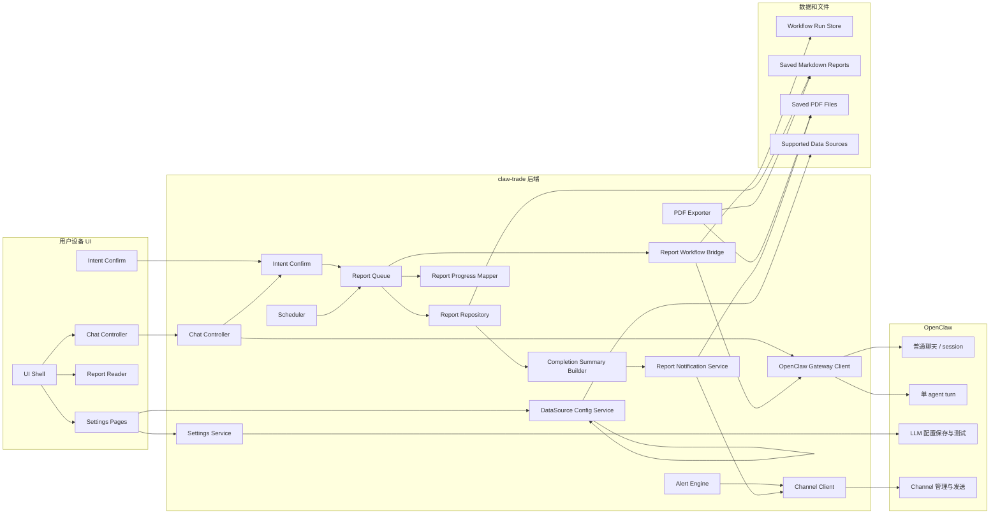
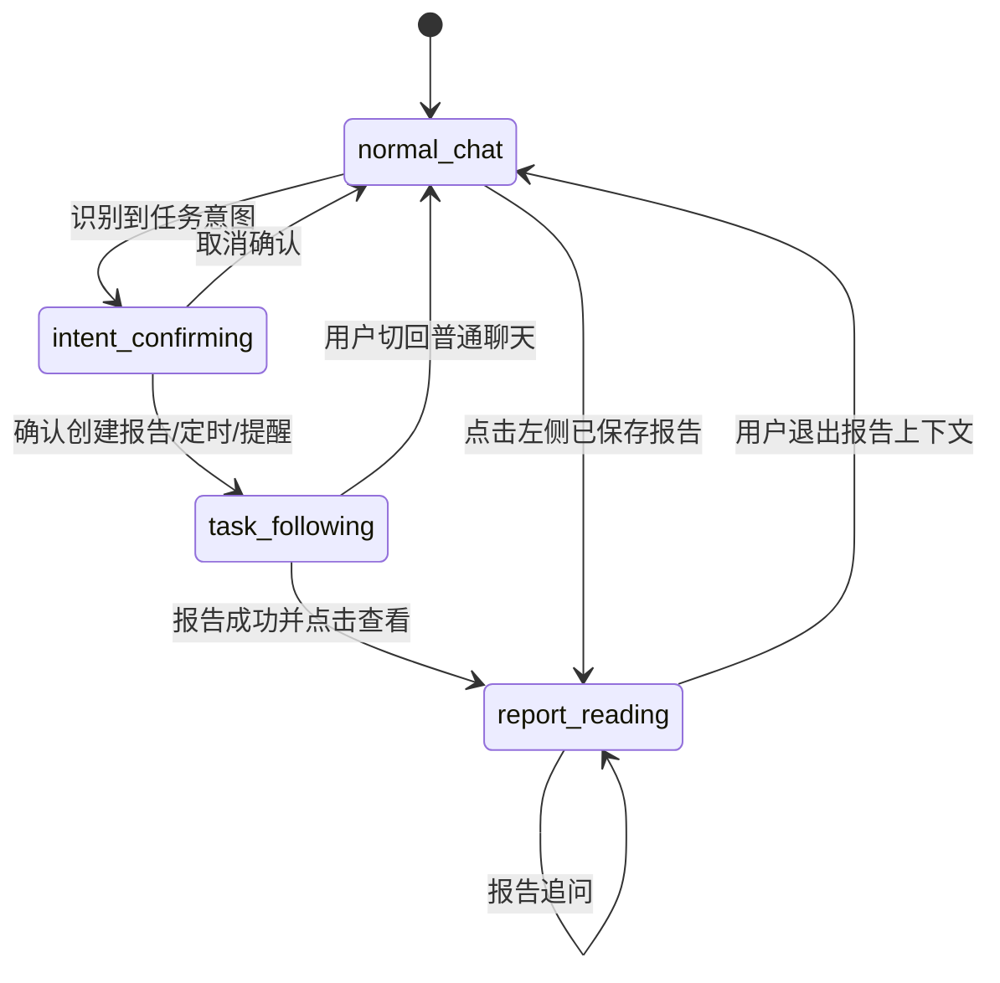
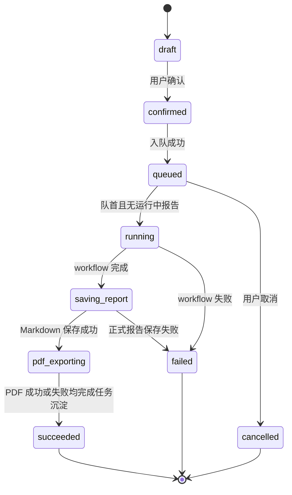
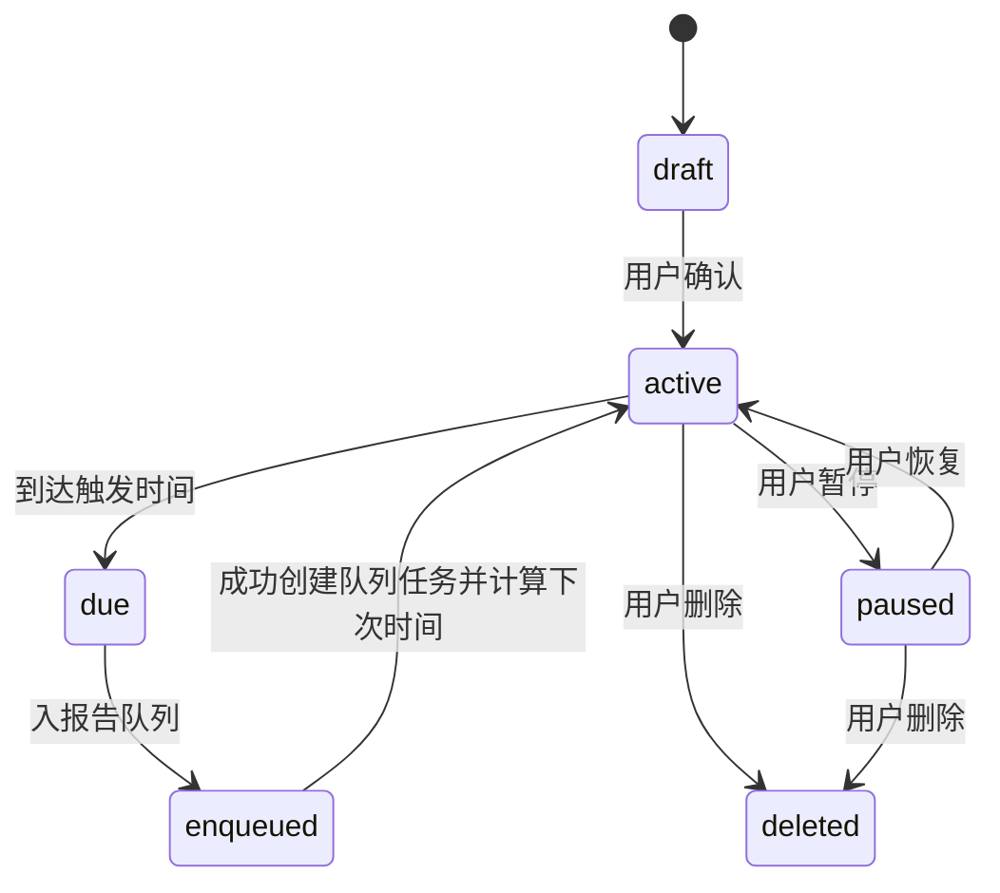
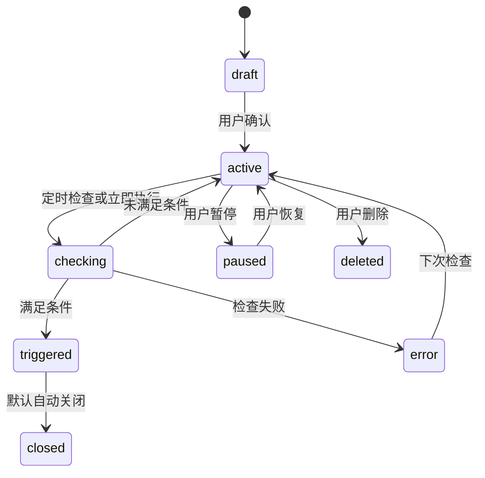
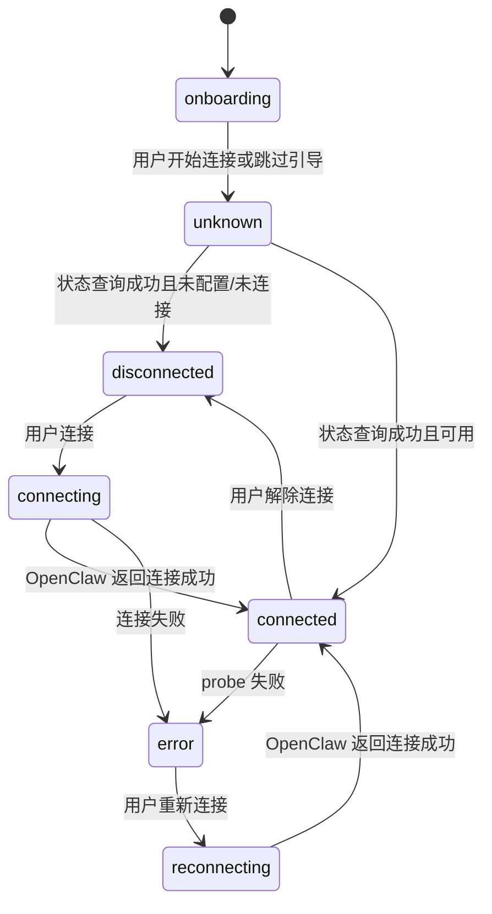
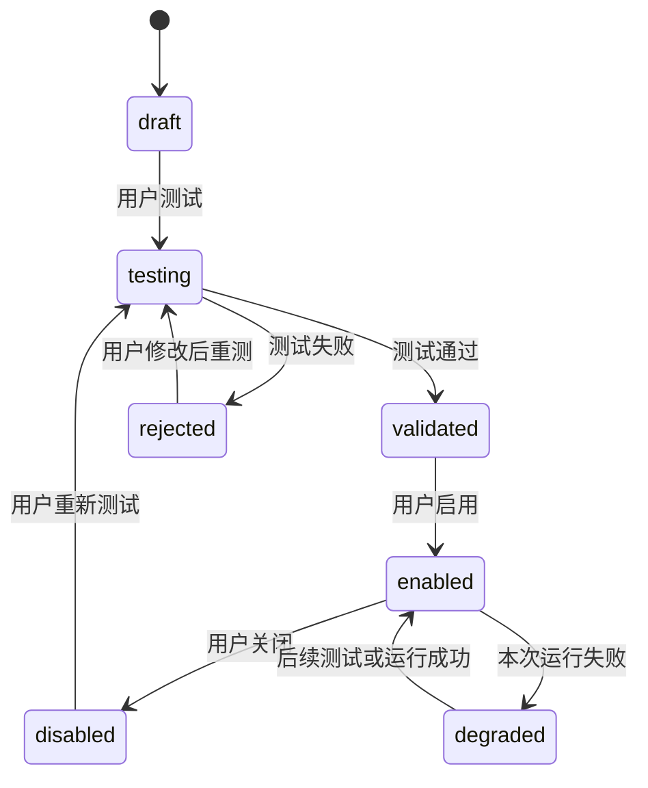
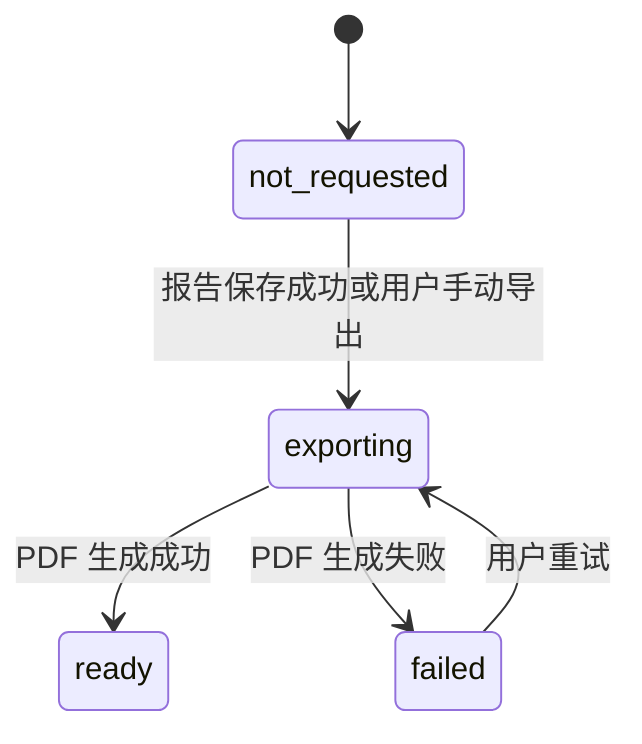

# claw-trade UI 详细设计

## 0. 设计依据与材料范围

本文档依据以下材料编写：

- `AGENTS.md`：确认 claw-trade / OpenClaw / OpenViking / workflow / artifact / provider payload 的职责边界。
- `docs/UI需求分析.md`：本次 UI 产品需求唯一主文档。
- `docs/report_workflow_env_and_rounds_design.md`：只采用未来 UI 设置模型、`RunRequest`、CLI/UI 参数边界相关结论。
- `.env.example`、`.env.local`：只提取配置项名称和分组；本文不记录真实值。
- `/home/frank/src/claw-invest`：优先参考并可直接复用兼容的 React/Vite 三栏工作台、通用前端组件、浅色投研终端风格，以及通用 web server / route / contract 组织方式；不得复用旧业务逻辑、direct LLM、alphaear reporter、旧 workflow 或旧启动脚本。
- `/home/frank/src/TradingAgents-CN`：只参考 Markdown 到 PDF 的导出流程、中文字体、横排、表格分页处理，不复用报告重组逻辑。

已确认的技术事实：

- 当前 `claw-trade` 主体是 Python 3.12 控制面，未发现本仓已有正式前端应用目录；首版前端已决策参考 `claw-invest/web/research-ui` 的 React/Vite/TypeScript 形态。
- 当前 workflow 请求模型已包含 `max_debate_rounds`、`max_risk_discuss_rounds`、`frontline_execution_mode`。
- OpenClaw gateway 已有通用方法：`chat.send`、`sessions.*`、`models.list`、`models.authStatus`、`channels.status/start/stop/logout`、`send`、`config.get/set/apply/patch/schema`、`config.schema.lookup`、`agent.runSingleWorker`。
- OpenClaw 官方微信文档和本仓 `third_party/openclaw/docs/channels/wechat.md` 已确认：微信通过外部插件 `@tencent-weixin/openclaw-weixin` 接入，OpenClaw Channel ID 是 `openclaw-weixin`，核心仓不内置微信协议代码；本仓还包含 WeCom/企业微信相关文档和 catalog 测试，但普通“微信 ClawBot”首版按 `openclaw-weixin` 映射。
- OpenClaw LLM 配置不需要 claw-trade 自造 `llm.save/test`：官方 config/models 文档和本仓 CLI 文档已确认使用 `config.schema.lookup` / `config.get` / `config.patch` / `models.list` / `models.status` 或等价 gateway 方法。
- OpenClaw 已有通用媒体发送和本地文件读取边界，官方微信文档声明微信插件支持私聊和媒体；首版发送 PDF 前仍必须按实际 Channel 能力探测，不能跳过探测直接假设发送成功。
- 2026-05-19 本机实现前探测：npm registry 返回 `@tencent-weixin/openclaw-weixin@2.4.3`，插件可安装并由 `plugins inspect` 识别为 Channel `openclaw-weixin`；插件源码声明 `chatTypes=["direct"]`、`media=true`、`blockStreaming=true`，并提供 `sendText`、`sendMedia`、QR 登录、长轮询入站 monitor。
- 同一轮探测还确认：`scripts/start-control-runtime.sh` 是 dev/fixed 测试 runtime，会重建测试用 OpenClaw config，当前不会把外部微信插件带入 Gateway。该脚本问题不能外推成生产级配置策略，只能说明这条测试路径不能作为微信已接通证据。当前本机/项目运行态仍未按官方路径完成 clean 验收，真实二维码登录、在线状态、文件发送和入站消息尚未实测。

设计假设：

- 首版 UI 使用 Web 工作台实现，前端参考 `claw-invest` 的 React/Vite/TypeScript 形态；后端参考 `claw-invest` 的通用 web server / route / contract 组织方式，能直接复用的非业务代码可直接复用。
- UI 后端是 `claw-trade` 的产品后端，不是 OpenClaw gateway 本身。
- UI 后端可以调用 OpenClaw gateway 的 JSON-RPC/CLI bridge，但不实现 Channel、LLM 保存、单 agent runtime。
- 数据源实例和 report workflow 默认值首版由 claw-trade 后端受控读写 `.env.local` 管理；浏览器不得直接读写 `.env.local`，普通 UI 响应不得暴露路径或真实密钥，workflow controller 仍只能读取确认时冻结生成的 `RunRequest`。

成功标准：

- 工程师可以按本文拆分模块、状态机、API、数据模型和伪码实现首版 UI。
- 普通聊天不会静默进入报告 workflow。
- 报告 workflow 显式确认后才入队，完整报告串行执行，队列默认最多 10 个。
- 报告摘要、PDF、文件发送均只使用已保存正式报告和 PM 最终结论，不新增简报 worker，不重写报告。
- 普通用户界面不暴露 MongoDB、OpenViking、OpenClaw Gateway、worker id、provider attempt、runtime marker 等内部概念。
- 普通用户 API 不返回 artifact/path/hash/local path；内部证据字段只用于后端诊断链路。

## 1. 设计摘要

一句话定位：claw-trade UI 是面向普通用户的极简中文投研工作台，让用户通过聊天创建、跟进、阅读和发送完整投研报告，而不是操作 OpenClaw 控制台。

本设计解决的问题：

- 把普通聊天、报告任务、报告阅读、定时任务、价格提醒、设置页统一到一个固定三栏工作台。
- 把“自然语言请求”转成“显式确认后创建任务”的产品流程，避免普通聊天误触发 report workflow。
- 给完整报告任务设计串行队列、状态机、进度映射、失败提示和成功沉淀规则。
- 给 OpenClaw Channel / LLM 配置设计调用边界：UI 只做入口和状态展示，实际保存、测试和消息发送归 OpenClaw。
- 给数据源配置、测试和“已配置但本次失效”提醒设计可实现的状态与判定规则。
- 给报告完成摘要、PDF 导出、文件发送设计不重写报告内容的实现路径。
- 给工程实现提供模块级、接口级、状态机级、函数签名级和关键伪码级设计。

首版不解决的问题：

- 不做移动端布局。
- 不做并行完整报告生成。
- 不做小时级完整报告定时任务。
- 不新增简报 worker。
- 不允许运行中 workflow 被用户插话改写。
- 不做失败任务管理页。
- 不做任意未知 HTTP/JSON 数据源接入。
- 不做数据源字段映射平台。
- 不在 claw-trade 内实现微信协议或任何 OpenClaw Channel。
- 不在普通 UI 暴露 OpenClaw、OpenViking、MongoDB、端口、缓存目录、内部路径。

## 2. 架构边界

### 2.1 职责表

| 领域 | 负责什么 | 不负责什么 | 主要输入 | 主要输出 |
|---|---|---|---|---|
| claw-trade UI | 三栏布局、聊天入口、确认卡、任务进度、报告阅读、设置页、用户文案、用户动作收集 | 不实现 OpenClaw Channel；不保存 LLM 密钥；不执行 worker；不改写报告内容 | 用户消息、点击、设置表单、任务状态快照 | UI 状态、用户确认、用户可读提醒 |
| claw-trade 后端 | 意图草稿、确认流程、报告队列、workflow 创建、状态映射、报告仓库、定时任务、价格提醒、数据源实例配置、PDF 导出编排 | 不运行单 agent turn；不决定 LLM provider prompt；不替 worker 写报告；不重写 PM 结论 | UI 请求、OpenClaw/数据源/PDF 结果、已保存报告 | API 响应、队列快照、报告记录、通知请求 |
| OpenClaw | 普通聊天运行时、单 agent turn、LLM 配置保存和测试、Channel 管理、消息发送、工具 schema 暴露、provider payload 捕获 | 不拥有 12-worker DAG；不做 claw-trade 报告队列；不保存 claw-trade 报告历史 | chat/session 请求、config 请求、Channel 请求、单 worker command | 聊天回复、配置状态、Channel 状态、单 worker 证据 |
| 数据源 | 已支持来源的连接、认证、请求、健康检查、数据证据、失败原因 | 不接受任意 HTTP/JSON 映射；不让未验证实例进入报告证据链；不伪造数据 | 数据源实例配置、报告运行请求 | 运行尝试记录、健康记录、数据缺口、可读失败原因 |
| PDF 导出 | 把已保存 Markdown 格式化为 PDF，处理中文字体、横排、表格分页、图片缩放 | 不总结、不重写、不补充报告；PDF 失败不影响报告保存 | 已保存 Markdown、报告元数据、图片文件 | PDF 文件、导出状态、错误原因 |

### 2.2 明确禁止事项

- 禁止 UI 自动把普通聊天识别成已确认投研 workflow。
- 禁止报告 workflow 未经确认直接创建。
- 禁止 UI 或 Python 在报告运行中把插话写入正在执行的 worker prompt。
- 禁止新增简报 worker 生成完成摘要。
- 禁止 PDF 导出重新组织、总结、补写或改写报告内容。
- 禁止把失败任务写入左侧历史。
- 禁止在右侧长期保留失败任务。
- 禁止把未配置、未使用、已关闭、不需要 key 的数据源显示为本次失效提醒。
- 禁止在普通 UI 显示内部词：MongoDB、OpenViking、OpenClaw Gateway、worker id、provider attempt、runtime marker、artifact、hash、receipt、本地端口、缓存目录。
- 禁止把 LLM 配置实际保存和测试迁入 claw-trade。
- 禁止把 Channel 实现迁入 claw-trade。
- 禁止用隐藏 fallback 替代真实报告、真实数据源、真实 Channel、真实 PDF 状态。

### 2.3 未知接口和已决策点

| 接口/决策点 | 当前证据 | 影响 | 保守设计 |
|---|---|---|---|
| 微信 ClawBot 的 OpenClaw Channel ID | 已查：普通微信使用外部插件 `@tencent-weixin/openclaw-weixin`，Channel ID 为 `openclaw-weixin`；npm 包 `2.4.3` 可安装，插件 inspect 能识别 Channel；官方接入流程是安装/启用/扫码/Gateway restart；企业微信是另一类 WeCom 插件，不等同普通微信 | 不能写成 `wechat`、`clawbot` 或 WeCom；不能把静态能力探测当成已扫码、已在线或已发送成功 | UI 文案显示“微信 ClawBot”；后端内部把 `wechat_clawbot` 映射到 `openclaw-weixin`；实现前必须用真实 Gateway/CLI 方法确认登录、状态、媒体发送能力 |
| OpenClaw LLM 配置入口 | 已查：OpenClaw 用 config/models 体系管理模型和鉴权；未发现必须依赖的 `llm.save/test` 专用 API | 设置页实现需要走 OpenClaw 配置模型 | 首版通过 `LlmSettingsBridge` 调用 `config.schema.lookup`、`config.get`、`config.patch`、`models.list/status/authStatus` 或等价 gateway 方法；UI 不感知 OpenClaw 原始配置路径 |
| OpenClaw 文件发送能力 | 已查：OpenClaw 有通用 media 发送/本地文件读取边界，微信插件源码声明 `media=true` 且 `sendMedia` 支持本地文件/远程 URL；但当前运行时未完成扫码登录、文件发送和大小限制实测 | 微信发送完整报告可能因 CLI/Gateway 未接通、未登录、文件能力关闭或大小限制失败 | `sendReportFileViaChannel` 每次发送前先看真实 Channel status 和媒体能力；不可用时返回 `FILE_SEND_UNSUPPORTED` 或 `NOTIFICATION_UNAVAILABLE`，不模拟成功 |
| 数据源实例首版配置存储 | 人类已决策首版后端受控读写 `.env.local`；当前有 data_gateway provider catalog / settings / store 相关代码，可参考其支持类型和校验 | 影响设置页保存、密钥替换和 `RunRequest` 设置快照 | 设计后端 allowlist env 写入层；前端不接触文件；controller 不直接读 env；后续如需 DB/secret store 再替换存储层 |
| “已配置但本次失效”的运行证据字段 | 当前有 provider status、data gap、run plan、attempt store 模型，但 UI 聚合字段未定 | 影响右侧提醒准确性 | 设计 `DataSourceHealthEvent` 聚合合同，必须包含 configured/enabled/used/status/impact |
| 报告完成摘要字段提取规则 | 人类已决策首版只做确定性摘取；UI 需求给出字段，但当前最终报告/PM 结构可能不稳定 | 影响完成卡稳定性 | 只从已保存报告、PM 结论和元数据摘取；缺字段则显示“完整理由请查看报告”，不补写 |
| 微信消息通知/回调桥接 | 已查：插件源码有长轮询入站 monitor，并依赖 Gateway 注入 `channelRuntime`；但 claw-trade 尚未验证当前 OpenClaw Gateway 是否能把入站微信消息转成 claw-trade 可消费的产品动作 | 微信内回复“报告”能否直达 claw-trade 取决于 OpenClaw 是否提供可接入的消息回调/路由扩展点 | 工程自己接 OpenClaw 的入站消息回调；若当前 gateway 不提供可接入口，不在 claw-trade 内补微信协议，只保留设备界面按钮和可读提示 |

### 2.4 微信官方 ClawBot 插件接入方案

首版只支持腾讯 `@tencent-weixin/openclaw-weixin` 这一路普通微信接入。它是 OpenClaw 外部 Channel 插件，不是 claw-trade 自己实现微信协议，也不是 Wechaty、逆向登录或企业微信 / WeCom。

安装和启用命令：

```bash
openclaw plugins install "@tencent-weixin/openclaw-weixin"
openclaw config set plugins.entries.openclaw-weixin.enabled true
openclaw gateway restart
openclaw channels login --channel openclaw-weixin
```

以上是官方文档/插件 README 给出的目标流程，不是本机当前已全部跑通的实现证据。2026-05-19 本机探测中，`plugins install "@tencent-weixin/openclaw-weixin@2.4.3"` 成功，`plugins inspect openclaw-weixin` 成功；但本机/项目运行态仍未按官方路径完成 clean 验收。真实扫码登录、账号在线和消息收发仍必须单独实测。

`npx -y @tencent-weixin/openclaw-weixin-cli install` 可作为用户手工路径，但 claw-trade 文档和实现基线优先使用 OpenClaw plugin install。npm registry 已确认该 CLI 包存在，当前版本为 `2.1.4`。

状态和能力检查命令：

```bash
openclaw plugins list
openclaw channels status --probe --json
openclaw channels capabilities --channel openclaw-weixin --json
```

2026-05-19 本机探测中，`channels status --probe --json` 在 Gateway 不可达时可返回 config-only 状态。当前不把本机 CLI 静态能力输出当成接通证据；发送前仍要看真实 Gateway status、登录态、媒体/文件限制和实际发送结果。

另一个实现前检查点：当前 `scripts/start-control-runtime.sh` 是 dev/fixed 测试 runtime，会删除并重建 `.runtime/dev-services/openclaw-state`，生成的 OpenClaw config 只包含 claw-trade 前线工具插件配置，不会保留外部微信插件安装/启用记录。生产级 UI runtime 不应照搬这种每次重建策略；若要用该脚本做测试证据，必须先让它能加载 `openclaw-weixin`，并重启 Gateway 后用真实 status 证明。

停问红线：默认接入路径是腾讯官方插件流程（安装、启用、扫码、Gateway restart）；未按官方流程在同一 profile/config/Gateway 下形成最小失败复现前，不得修改 OpenClaw 源码。若官方流程仍失败，必须先提交最小复现证据并由人类拍板后，才能考虑 OpenClaw 源码修复。

产品状态映射：

| OpenClaw 检查结果 | `ChannelStatusForUser.state` | UI 文案 | 可执行动作 |
|---|---|---|---|
| 插件未安装 | `disconnected` | 请先安装微信 ClawBot 插件。 | 显示安装指引 |
| 插件已安装但未启用 | `disconnected` | 请先启用微信 ClawBot 插件。 | 显示启用/重试 |
| 插件启用但未登录 | `disconnected` | 请用微信扫码连接 ClawBot。 | 触发或提示扫码登录 |
| probe 失败或灰度不可用 | `error` | 当前微信账号暂不可用 ClawBot，请在设备界面查看报告。 | 站内通知 |
| 已连接，可发文本，不可发文件 | `connected` | 微信文字通知可用，完整 PDF 暂不可发送。 | 只发完成摘要 |
| 已连接，可发文本和媒体/文件 | `connected` | 微信通知已连接。 | 发摘要；用户请求时发 PDF |

内部消息路径：

```text
微信用户
-> 微信 ClawBot 插件
-> OpenClaw Gateway
-> claw-trade UI 后端
-> claw-trade 报告队列 / 报告仓库 / PDF 服务
-> OpenClaw Gateway
-> 微信 ClawBot 插件
-> 微信用户
```

微信内首版命令映射：

| 用户输入 | claw-trade 行为 | 禁止事项 |
|---|---|---|
| `/report BTC` / `报告 BTC` | 生成报告确认卡 | 不直接创建 workflow |
| `确认` | 对当前确认卡创建完整报告任务 | 不绕过确认卡 |
| `取消` | 只取消 queued 任务；running 返回“报告正在生成，不能中途取消” | 不发 running abort |
| `进度` | 返回中文阶段进度 | 不显示 worker id / run id |
| `发送完整报告` | 发送已保存 PDF；不可用时返回可读失败 | 不发送未保存 Markdown，不暴露本地路径 |

PDF 文件发送前置条件：

1. 报告已成功保存。
2. PDF 状态为 `ready`。
3. `openclaw-weixin` 已安装、启用、登录。
4. `channels capabilities --channel openclaw-weixin --json` 或等价 gateway 能力显示支持媒体/文件。
5. PDF 大小在当前 Channel 限制内。

任一条件不满足时，返回 `FILE_SEND_UNSUPPORTED` 或 `NOTIFICATION_UNAVAILABLE`，用户文案为“完整报告文件暂不可发送，请在设备界面查看。”；不得模拟成功 message id。

### 2.5 微信消息通知/回调桥接

这里的“回调”说人话就是：微信里来了一条消息后，OpenClaw 通知 claw-trade 一声。它不是普通用户文案，也不是让 claw-trade 去连微信。

本节是 claw-trade 需要消费的产品动作合同。实现前必须用 OpenClaw gateway / Channel 能力复核当前运行时是否能把入站微信消息交给 claw-trade；若不存在，不得在 claw-trade 内补做微信协议，只能显示文件发送不可用或引导用户回设备界面。

- `claw-trade` 不实现微信协议，不监听微信 socket/webhook，不维护微信登录态。
- 入站消息先到 OpenClaw Channel，再由 OpenClaw 以统一回调合同转发给 `claw-trade`。
- `claw-trade` 只消费“产品动作通知”：
  - `kind="request_full_report"`：微信内回复“报告”或点击“发送完整报告”触发。
  - `kind="open_report_summary"`：请求查看摘要（可选）。

桥接回调合同（普通后端可实现为 HTTP/IPC；代码里仍可叫 event）：

```ts
interface OpenClawChannelInboundEvent {
  eventId: string;
  occurredAt: string;
  channelKind: "wechat_clawbot";
  kind: "request_full_report" | "open_report_summary";
  reportId: string;
  openClawSessionId?: string | null;
  openClawMessageId?: string | null;
}
```

桥接处理规则：

1. `request_full_report` -> 调 `requestFullReportFile(reportId, requestId=eventId)`。
2. 发送失败时只回可读文案，不泄露内部路径。
3. `claw-trade` 不反向调用微信协议接口；只调用 OpenClaw 的 `send`/session 能力。

## 3. 总体架构图



## 4. UI 信息架构

### 4.1 三栏布局

首版只针对集成在设备中的桌面工作台，不做移动端适配。

固定布局：

| 区域 | 建议宽度 | 产品含义 | 显示规则 |
|---|---:|---|---|
| 左侧 | 280px | 正式报告档案柜 | 只显示已完成且保存成功的正式报告 |
| 中间 | 自适应，最小 640px | 聊天、任务跟进、报告阅读的主工作区 | 三种上下文互斥显示，但底部输入框保持一致 |
| 右侧 | 320px | 当前任务状态或报告详情 | 随中间上下文切换 |

### 4.2 左侧：正式报告历史

只显示成功保存的报告：

- 显示：已完成、已保存 Markdown、可打开详情的报告。
- 不显示：排队中、运行中、失败、取消、普通聊天、定时任务、价格提醒。
- 每项展示：标的、报告标题、生成时间、核心结论摘要。
- 支持按标的和报告标题搜索。

组件树：

```text
ReportHistoryRail
  HistorySearchInput
  ReportHistoryList
    ReportHistoryItem
      InstrumentBadge
      ReportTitle
      GeneratedAt
      SummarySnippet
  EmptySavedReports
```

### 4.3 中间：三种上下文

#### 普通聊天

- 消息直接透传 OpenClaw。
- 不创建报告任务。
- 不进入 report workflow。
- 如识别到报告、定时报告、价格提醒意图，只生成确认卡，不自动执行。

组件树：

```text
ChatMainPanel
  ContextHeader("普通聊天")
  MessageStream
    UserMessage
    AssistantMessage
    SystemNotice
    ConfirmationCardMessage?
  ChatComposer
```

#### 任务跟进

- 用户确认后默认进入该任务上下文。
- 展示确认卡、入队消息、进度消息。
- 输入框允许问进度、记录补充需求、请求完成后重做。
- workflow 运行中不能被插话修改；新需求只能生成“完成后重新生成”的草稿。

组件树：

```text
TaskFollowPanel
  ContextHeader("报告生成跟进")
  MessageStream
    UserRequestMessage
    ConfirmationCardMessage
    QueueMessage
    ProgressMessage
    FailureNotice?
    CompletionCard?
  ChatComposer
```

#### 报告追问

- 点击左侧报告或完成卡后进入。
- 中间显示完整 Markdown 报告。
- 底部输入框围绕当前报告追问。
- 追问不改变报告内容，不影响正在运行的报告任务。
- 用户点击“普通聊天”或说“回到普通聊天”可退出。

组件树：

```text
ReportReaderPanel
  ContextHeader("报告阅读")
  ReportToolbar
    ExportButton
    SendFileButton
    RegenerateButton
  MarkdownReportViewer
    ReportTitle
    ReportMeta
    ReportBody
  ReportQuestionStream
  ChatComposer
```

### 4.4 右侧：三种状态

#### 普通聊天摘要

显示：

- 运行中和排队中的报告任务。
- 微信 ClawBot 状态摘要。
- 最近完成报告摘要。

不显示：

- 失败任务。
- 内部服务名、端口、路径。

组件树：

```text
RightRailChatSummary
  LiveTaskMiniList
  ChannelStatusCard
  RecentCompletedReportCard
```

#### 任务状态

显示：

- 状态：排队中、生成中。
- 标的、市场、队列位置。
- 当前阶段、当前角色中文名、当前操作。
- 进度条、已完成角色、等待角色。
- 操作：排队中显示取消；生成中不显示取消入口。

内部 worker id 只能作为后端字段，前端必须映射为中文角色名。

组件树：

```text
RightRailTaskStatus
  TaskHeader
  QueuePosition
  StageProgressBar
  CurrentStageLabel
  CurrentRoleLabel
  CurrentActionText
  CompletedRoleList
  WaitingRoleList
  CancelTaskButton
```

#### 报告详情

显示：

- 报告目录。
- 数据源状态。
- 图表状态。
- PDF 导出状态。
- 操作：导出、发送完整报告、重新生成、设为定时报告、添加价格提醒。

图表状态显示规则：

- 只显示 `ChartEvidenceForUser` 的 `title/status/userMessage/capturedAt`。
- `status=ready` 显示“已包含图表”，`missing` 显示“本次报告未检测到该图表”，`failed` 显示“图表处理失败，可查看完整报告正文”。
- 不允许静态占位图或写死“图表正常”；必须由 `getReportChartEvidence` 实时返回。
- 普通 UI 不显示 artifact id、hash、path、本地文件名。

组件树：

```text
RightRailReportDetail
  ReportToc
  DataSourceHealthPanel
  ChartEvidencePanel
  PdfExportStatusPanel
  ReportActions
```

## 5. 视觉设计规范

### 5.1 视觉方向

视觉基调：浅色、克制、专业、信息密度适中，更像投研终端而不是营销页或科技大屏。

从 `claw-invest` 保留：

- 浅色三栏工作台。
- 蓝灰主色。
- 左侧报告历史、中间消息流、右侧任务状态。
- 报告正文使用更正式的字体。
- 任务阶段、当前角色、进度、当前操作的活任务栏表达。

针对 claw-trade 调整：

- 减少背景渐变和装饰光效。
- 三栏之间用边框，不依赖强阴影。
- 右侧状态比旧 UI 更重要，数据源异常和 PDF 状态要清晰。
- 报告阅读和聊天追问共存，不跳离工作台。

### 5.2 颜色 token

```css
:root {
  --ct-bg: #f5f8fc;
  --ct-surface: #ffffff;
  --ct-surface-muted: #eef4fb;
  --ct-surface-subtle: #f9fbfe;
  --ct-text: #20364f;
  --ct-text-muted: #60758b;
  --ct-text-faint: #8a99a8;
  --ct-border: #d9e4ee;
  --ct-border-strong: #c5d3e0;
  --ct-primary: #334f6f;
  --ct-primary-hover: #263f5c;
  --ct-accent-gold: #b88a3d;
  --ct-success: #23835f;
  --ct-warning: #b7791f;
  --ct-danger: #b33a3a;
  --ct-info: #2f6fab;
  --ct-focus: #3b82f6;
}
```

状态色使用规则：

- 绿色只用于完成、连接成功。
- 红色只用于失败、数据源失效、风险提醒。
- 金色只用于最终结论、报告完成、重要提示。
- 蓝色用于进行中、队列、普通信息。

### 5.3 字体 token

```css
:root {
  --ct-font-ui: "Inter", "PingFang SC", "Microsoft YaHei", "Noto Sans CJK SC", sans-serif;
  --ct-font-report: "Noto Serif CJK SC", "Source Han Serif SC", "Songti SC", "SimSun", serif;
  --ct-font-mono: "SFMono-Regular", "Consolas", "Liberation Mono", monospace;
}
```

字体规则：

- UI 控件：无衬线中文字体，字号 12/13/14/16。
- 报告正文：中文衬线字体，正文 16px，行高 1.85。
- 面板标题：14px，600 或 700。
- 卡片标题：15px，600。
- 辅助信息：12px，颜色 `--ct-text-muted`。
- 不使用按视口宽度缩放的字体。

### 5.4 间距、圆角、边框

| token | 值 | 用途 |
|---|---:|---|
| `--ct-space-1` | 4px | 紧凑间距 |
| `--ct-space-2` | 8px | 控件内距 |
| `--ct-space-3` | 12px | 卡片内距 |
| `--ct-space-4` | 16px | 栏内距 |
| `--ct-space-5` | 20px | 大块间距 |
| `--ct-radius-sm` | 4px | 标签、状态点 |
| `--ct-radius-md` | 6px | 输入框、按钮 |
| `--ct-radius-lg` | 8px | 卡片、面板 |
| `--ct-border-width` | 1px | 默认边框 |

布局规则：

- 页面背景不做渐变，不放装饰光斑。
- 面板可以有 1px 边框和 6-8px 圆角。
- 不嵌套卡片；面板内重复项可以是卡片。
- 任务进度条高度 6-8px，不能因文本变化改变布局。

### 5.5 关键组件视觉规则

| 组件 | 视觉规则 | 禁止 |
|---|---|---|
| 报告卡 | 白底、左侧细状态线、标题一行、摘要最多两行、元信息弱化 | 不显示失败任务；不显示内部 ID |
| 确认卡 | 浅金或浅蓝边框，展示类型、标的、市场、频率/条件、通知方式、数据源摘要，底部确认/取消 | 不自动创建任务；不隐藏关键缺失 |
| 任务状态条 | 阶段名、角色中文名、细进度条、当前操作一句话 | 不显示 worker id、provider attempt、内部路径 |
| 数据源提醒 | 红色细边框或图标，列出来源、原因、影响范围 | 不显示未配置或未使用来源；不放快捷修改按钮 |
| 设置表单 | 分组清晰，密钥掩码，保存/测试分离，replace-only | 不显示真实密钥；不展示 `.env.local` 路径 |
| 报告阅读器 | 正文衬线字体、目录同步、图片自适应、表格横向滚动或分页 | 不把报告放进小卡片；不重排报告内容 |

## 6. 核心状态机

### 6.1 ChatContextState



| 状态 | 进入条件 | 退出条件 | 允许操作 | 禁止操作 |
|---|---|---|---|---|
| `normal_chat` | 首次进入、用户切回普通聊天 | 识别到任务意图并生成确认卡；点击报告 | 普通消息透传 OpenClaw；切换报告；打开设置 | 静默创建 report workflow |
| `intent_confirming` | 用户消息被识别为报告、定时报告或价格提醒意图 | 用户确认或取消 | 修改确认卡字段、确认、取消 | 未确认即入队 |
| `task_following` | 确认后创建任务或打开活任务 | 用户切回普通聊天、报告完成后查看报告、任务失败 | 查进度、取消、记录完成后重做意图 | 修改运行中 workflow 的请求、prompt、worker |
| `report_reading` | 点击左侧报告或完成卡 | 用户切回普通聊天或打开另一个任务/报告 | 阅读、追问、导出、发送、重新生成草稿 | 改写已保存报告 |

### 6.2 ReportTaskState



| 状态 | 进入条件 | 退出条件 | 允许操作 | 禁止操作 |
|---|---|---|---|---|
| `draft` | 意图草稿生成 | 确认或取消 | 编辑标的、市场、日期、通知方式 | 创建 run |
| `confirmed` | 用户点击确认 | 入队成功或失败 | 幂等确认 | 重复创建多个同请求任务 |
| `queued` | 队列未满，任务进入队列 | 开始运行、取消、被同标的去重合并 | 取消、查看队列位置 | 并行启动 |
| `running` | 串行队列启动该任务 | 成功或失败 | 查看进度、记录完成后重做 | 取消运行中 workflow、修改 workflow 输入 |
| `saving_report` | workflow 完成 | 保存成功或失败 | 保存 Markdown、元数据、PM 结论引用 | PDF 先于正式报告保存 |
| `pdf_exporting` | Markdown 已保存 | PDF 成功或失败 | 生成 PDF、记录状态 | 因 PDF 失败删除报告 |
| `succeeded` | 报告保存成功 | 终态 | 写入左侧历史、生成完成卡、通知 | 再改报告正文 |
| `failed` | workflow 或保存失败 | 终态 | 中间聊天显示可读失败 | 左侧历史显示、右侧长期保留 |
| `cancelled` | 排队任务被用户取消 | 终态 | 中间聊天提示取消 | 左侧历史显示、用于运行中任务 |

### 6.3 ScheduledReportState



| 状态 | 进入条件 | 退出条件 | 允许操作 | 禁止操作 |
|---|---|---|---|---|
| `draft` | 识别为定时报告意图 | 确认或取消 | 设置每天/每周、时间、通知方式 | 每小时完整报告 |
| `active` | 用户确认并保存 | 到点、暂停、删除 | 暂停、删除、立即执行 | 直接绕过完整报告队列 |
| `due` | 当前时间达到 next_run_at | 入队成功或队列满 | 创建手动/定时任务请求 | 并行执行完整报告 |
| `enqueued` | 到点任务已入队 | 更新下次触发 | 查看关联任务 | 生成简报 |
| `paused` | 用户暂停 | 恢复或删除 | 恢复、删除、立即执行 | 自动触发 |
| `deleted` | 用户删除 | 终态 | 无 | 恢复原记录 |

### 6.4 PriceAlertState



| 状态 | 进入条件 | 退出条件 | 允许操作 | 禁止操作 |
|---|---|---|---|---|
| `draft` | 识别价格提醒意图 | 确认或取消 | 设置阈值或百分比 | 技术指标触发、AI 解释 |
| `active` | 保存成功 | 检查、暂停、删除 | 暂停、删除、立即检查 | 自动生成报告 |
| `checking` | 到检查时间或立即执行 | 满足、不满足、失败 | 读取价格、比较条件 | 调用 report workflow |
| `triggered` | 条件满足 | 通知完成后关闭 | 发送通知 | 重复触发 |
| `error` | 数据源检查失败 | 下次检查 | 中间聊天可读提醒 | 把内部错误暴露给用户 |
| `paused` | 用户暂停 | 恢复或删除 | 恢复、删除 | 自动检查 |
| `closed` | 触发后自动关闭 | 终态 | 查看历史状态 | 再触发 |
| `deleted` | 用户删除 | 终态 | 无 | 恢复原记录 |

### 6.5 ChannelConnectionState



| 状态 | 进入条件 | 退出条件 | 允许操作 | 禁止操作 |
|---|---|---|---|---|
| `onboarding` | 首次启动且用户尚未处理微信引导 | 用户点击连接或跳过 | 显示引导、连接、跳过 | 强制阻断进入产品 |
| `unknown` | UI 启动尚未查询 | 查询完成 | 查询状态 | 显示内部 gateway 错误 |
| `disconnected` | 未配置或未连接 | 连接中 | 连接、跳过 | 阻止用户进入产品 |
| `connecting` | 用户点击连接 | 成功或失败 | 取消、等待 | claw-trade 保存 Channel 凭据 |
| `connected` | OpenClaw 状态可用 | 异常或解除 | 发送通知、测试 | 显示内部 Channel 配置路径 |
| `error` | OpenClaw 返回异常 | 重连或解除 | 重新连接、解除 | 把错误原文直接给普通用户 |
| `reconnecting` | 用户重连 | 成功或失败 | 等待 | 多次并发重连 |

首次启动引导与跳过行为：

- 首次进入设置或首页时展示“连接微信 ClawBot”引导卡。
- 用户点击“跳过”后写入 `wechat_onboarding_skipped_at`，本次会话不再弹阻断弹窗。
- 跳过不影响创建报告、查看报告、接收站内提醒；只影响微信通知可用性。
- 用户可在设置页随时重新连接。

### 6.6 DataSourceInstanceState



| 状态 | 进入条件 | 退出条件 | 允许操作 | 禁止操作 |
|---|---|---|---|---|
| `draft` | 新增实例未测试 | 测试 | 编辑名称、密钥、地址、请求头、优先级 | 启用进入报告证据链 |
| `testing` | 用户点击测试 | 通过或失败 | 等待、取消 | 保存为已验证 |
| `validated` | 测试通过 | 启用或修改 | 启用、保存 | 未启用时参与报告 |
| `enabled` | 用户启用已验证实例 | 关闭、运行失败 | 参与 provider plan | 无证据伪造成功 |
| `disabled` | 用户关闭 | 重测或启用 | 编辑、测试 | 失效提醒 |
| `degraded` | 已配置、已启用、本次使用失败 | 后续成功或用户关闭 | 提醒用户去设置页 | 把未用来源显示为失败 |
| `rejected` | 测试失败 | 修改后重测 | 编辑、重测 | 启用 |

### 6.7 PdfExportState



| 状态 | 进入条件 | 退出条件 | 允许操作 | 禁止操作 |
|---|---|---|---|---|
| `not_requested` | 报告尚未保存或未请求 PDF | 自动/手动导出 | 等待报告保存 | 对未保存报告导出 |
| `exporting` | 已保存 Markdown 进入导出 | 成功或失败 | 读取 Markdown、生成 HTML/PDF | 修改 Markdown 正文 |
| `ready` | PDF 文件保存成功 | 用户重导出 | 发送文件、下载、打开 | 把 PDF 当报告真相源 |
| `failed` | PDF 引擎失败 | 重试 | 显示“PDF 暂不可用” | 删除正式报告 |

## 7. 数据模型设计

说明：

- 当前前端技术栈未在 `claw-trade` 中确认，以下用 TypeScript 风格 schema 表达。
- 字段表中“持久化”指 claw-trade 产品后端是否持久化；OpenClaw 内部持久化不计入此列。
- “用户可见”指普通用户 UI 是否可直接展示该字段原值。

### 7.1 通用枚举

```ts
type MarketProfile = "CN_A" | "US" | "HK" | "CRYPTO";
type ChatContextKind = "normal_chat" | "task_following" | "report_reading" | "intent_confirming";
type IntentKind = "report" | "scheduled_report" | "price_alert";
type ReportTaskStatus =
  | "draft"
  | "confirmed"
  | "queued"
  | "running"
  | "saving_report"
  | "pdf_exporting"
  | "succeeded"
  | "failed"
  | "cancelled";
type UserVisibleSeverity = "info" | "success" | "warning" | "error";
```

`MarketProfile` 约束：

- `HK`、`CRYPTO` 必须存在已批准的 prompt/profile 策略映射。
- 未批准时在确认阶段返回 `PROFILE_STRATEGY_UNAPPROVED`，并提示用户调整市场或联系管理员。
- 禁止自动 fallback 到 `US` 或 `CN_A`。

### 7.2 ChatMessage

```ts
interface ChatMessage {
  id: string;
  contextId: string;
  contextKind: ChatContextKind;
  actor: "user" | "assistant" | "system";
  kind:
    | "plain"
    | "confirmation_card"
    | "task_progress"
    | "report_completed"
    | "report_failed"
    | "price_alert"
    | "file_send_failed";
  text: string;
  cardId?: string | null;
  reportId?: string | null;
  taskId?: string | null;
  createdAt: string;
  userVisible: boolean;
}

interface ChatMessageForUser {
  messageId: string;
  contextKind: ChatContextKind;
  actor: "user" | "assistant" | "system";
  kind: ChatMessage["kind"];
  text: string;
  cardId?: string | null;
  reportId?: string | null;
  taskId?: string | null;
  createdAt: string;
}
```

| 字段 | 用途 | 持久化 | 可空 | 用户可见 |
|---|---|---|---|---|
| `id` | 消息唯一标识 | 是 | 否 | 否 |
| `contextId` | 所属聊天上下文 | 是 | 否 | 否 |
| `contextKind` | 上下文类型 | 是 | 否 | 是，显示为中文标签 |
| `actor` | 发送方 | 是 | 否 | 是 |
| `kind` | 消息类型 | 是 | 否 | 间接可见 |
| `text` | 用户可读正文 | 是 | 否 | 是 |
| `cardId` | 关联确认卡 | 是 | 是 | 否 |
| `reportId` | 关联报告 | 是 | 是 | 否 |
| `taskId` | 关联任务 | 是 | 是 | 否 |
| `createdAt` | 创建时间 | 是 | 否 | 是 |
| `userVisible` | 是否进入普通消息流 | 是 | 否 | 否 |

`ChatMessage` 是内部消息记录。普通 UI/API 使用 `ChatMessageForUser`，只返回 `userVisible=true` 的消息。

### 7.3 ChatContext

```ts
interface ChatContext {
  id: string;
  kind: ChatContextKind;
  title: string;
  activeTaskId?: string | null;
  activeReportId?: string | null;
  lockedWorkflowRunId?: string | null;
  createdAt: string;
  updatedAt: string;
}

interface ChatContextForUser {
  contextId: string;
  kind: ChatContextKind;
  title: string;
  activeTaskId?: string | null;
  activeReportId?: string | null;
}
```

| 字段 | 用途 | 持久化 | 可空 | 用户可见 |
|---|---|---|---|---|
| `id` | 上下文唯一标识 | 是 | 否 | 否 |
| `kind` | 普通聊天、任务跟进、报告追问等 | 是 | 否 | 是，中文化 |
| `title` | UI 顶部上下文标题 | 是 | 否 | 是 |
| `activeTaskId` | 当前跟进任务 | 是 | 是 | 否 |
| `activeReportId` | 当前阅读报告 | 是 | 是 | 否 |
| `lockedWorkflowRunId` | 运行中 workflow 锁定标识，用于禁止插话修改 | 是 | 是 | 否 |
| `createdAt` | 创建时间 | 是 | 否 | 否 |
| `updatedAt` | 更新时间 | 是 | 否 | 否 |

`ChatContext` 是内部上下文记录。普通 UI/API 使用 `ChatContextForUser`，不得返回 `lockedWorkflowRunId`。

### 7.4 IntentDraft

```ts
interface IntentDraft {
  id: string;
  kind: IntentKind;
  sourceMessageId: string;
  instrumentCode: string;
  instrumentName?: string | null;
  market: MarketProfile;
  reportDateRange?: { startDate: string; endDate: string } | null;
  schedule?: { frequency: "daily" | "weekly"; timeOfDay: string; weekday?: number | null } | null;
  priceCondition?: {
    type: "price_threshold" | "percent_change";
    operator: "above" | "below" | "up_by" | "down_by";
    value: number;
    window?: "24h" | "intraday" | null;
  } | null;
  notification: { channel: "wechat_clawbot" | "in_app"; enabled: boolean };
  workflowSettings: ReportWorkflowSettingsSnapshot;
  status: "draft" | "confirmed" | "cancelled" | "expired";
  dedupeKey: string;
  createdAt: string;
  expiresAt: string;
}

interface IntentDraftForUser {
  draftId: string;
  kind: IntentKind;
  instrumentCode: string;
  instrumentName?: string | null;
  market: MarketProfile;
  reportDateRange?: { startDate: string; endDate: string } | null;
  schedule?: { frequency: "daily" | "weekly"; timeOfDay: string; weekday?: number | null } | null;
  priceCondition?: IntentDraft["priceCondition"];
  notification: { channel: "wechat_clawbot" | "in_app"; enabled: boolean };
  status: "draft" | "confirmed" | "cancelled" | "expired";
}
```

| 字段 | 用途 | 持久化 | 可空 | 用户可见 |
|---|---|---|---|---|
| `id` | 草稿 ID | 是 | 否 | 否 |
| `kind` | 意图类型 | 是 | 否 | 是 |
| `sourceMessageId` | 来源消息 | 是 | 否 | 否 |
| `instrumentCode` | 标的代码 | 是 | 否 | 是 |
| `instrumentName` | 标的名称 | 是 | 是 | 是 |
| `market` | 市场 | 是 | 否 | 是 |
| `reportDateRange` | 报告日期范围 | 是 | 是 | 是 |
| `schedule` | 定时设置 | 是 | 是 | 是 |
| `priceCondition` | 价格提醒条件 | 是 | 是 | 是 |
| `notification` | 通知方式 | 是 | 否 | 是 |
| `workflowSettings` | 创建报告时写入 `RunRequest` 的当前设置快照 | 是 | 否 | 部分可见 |
| `status` | 草稿状态 | 是 | 否 | 是，中文化 |
| `dedupeKey` | 幂等去重键 | 是 | 否 | 否 |
| `createdAt` | 创建时间 | 是 | 否 | 否 |
| `expiresAt` | 过期时间 | 是 | 否 | 否 |

`IntentDraft` 是内部识别草稿。普通 UI/API 使用 `IntentDraftForUser`，不得返回 `sourceMessageId`、`workflowSettings`、`dedupeKey`。

```ts
interface ReportWorkflowSettingsSnapshot {
  maxDebateRounds: number;
  maxRiskDiscussRounds: number;
  frontlineExecutionMode: "parallel";
  defaultProfile: MarketProfile;
  defaultMarket: MarketProfile;
  defaultCurrency: string;
  defaultCurrencySymbol: string;
}
```

### 7.5 ConfirmationCard

```ts
interface ConfirmationCard {
  id: string;
  draftId: string;
  title: string;
  summaryLines: string[];
  dataSourceSummary: "ready" | "partial" | "unknown";
  actions: Array<"confirm" | "cancel">;
  status: "active" | "confirmed" | "cancelled" | "expired";
  createdAt: string;
}
```

| 字段 | 用途 | 持久化 | 可空 | 用户可见 |
|---|---|---|---|---|
| `id` | 卡片 ID | 是 | 否 | 否 |
| `draftId` | 关联草稿 | 是 | 否 | 否 |
| `title` | 卡片标题 | 是 | 否 | 是 |
| `summaryLines` | 类型、标的、市场、频率/条件、通知方式 | 是 | 否 | 是 |
| `dataSourceSummary` | 数据源摘要状态 | 是 | 否 | 是 |
| `actions` | 可用操作 | 是 | 否 | 是 |
| `status` | 卡片状态 | 是 | 否 | 是 |
| `createdAt` | 创建时间 | 是 | 否 | 否 |

### 7.6 ReportTask

```ts
interface ReportTask {
  id: string;
  runId?: string | null;
  intentDraftId?: string | null;
  source: "manual" | "scheduled";
  priority: number;
  status: ReportTaskStatus;
  instrumentCode: string;
  instrumentName?: string | null;
  market: MarketProfile;
  profile: MarketProfile;
  companyName: string;
  currency: string;
  currencySymbol: string;
  startDate: string;
  endDate: string;
  currentDate: string;
  queuePosition?: number | null;
  progress?: ReportProgressUiState | null;
  reportId?: string | null;
  failure?: UserFacingFailure | null;
  dedupeKey: string;
  createdAt: string;
  startedAt?: string | null;
  finishedAt?: string | null;
}

interface ReportTaskForUser {
  taskId: string;
  source: "manual" | "scheduled";
  status: ReportTaskStatus;
  statusLabel: string;
  instrumentCode: string;
  instrumentName?: string | null;
  market: MarketProfile;
  companyName: string;
  currencySymbol: string;
  startDate: string;
  endDate: string;
  currentDate: string;
  queuePosition?: number | null;
  progress?: ReportProgressUiState | null;
  reportId?: string | null;
  failure?: UserFacingFailure | null;
  createdAt: string;
  startedAt?: string | null;
  finishedAt?: string | null;
}
```

| 字段 | 用途 | 持久化 | 可空 | 用户可见 |
|---|---|---|---|---|
| `id` | UI 任务 ID | 是 | 否 | 否 |
| `runId` | workflow run 标识 | 是 | 是 | 否 |
| `intentDraftId` | 来源确认草稿 | 是 | 是 | 否 |
| `source` | 手动或定时 | 是 | 否 | 是 |
| `priority` | 队列排序，手动高于定时 | 是 | 否 | 否 |
| `status` | 任务状态 | 是 | 否 | 是，中文化 |
| `instrumentCode` | 标的 | 是 | 否 | 是 |
| `instrumentName` | 标的名称 | 是 | 是 | 是 |
| `market` | 市场 | 是 | 否 | 是 |
| `profile` | prompt/profile | 是 | 否 | 否 |
| `companyName` | 传入 `RunRequest` | 是 | 否 | 是 |
| `currency` | 传入 `RunRequest` | 是 | 否 | 部分可见 |
| `currencySymbol` | 传入 `RunRequest` | 是 | 否 | 是 |
| `startDate` | 报告范围开始 | 是 | 否 | 是 |
| `endDate` | 报告范围结束 | 是 | 否 | 是 |
| `currentDate` | 报告生成日期 | 是 | 否 | 是 |
| `queuePosition` | 队列位置 | 否，可计算 | 是 | 是 |
| `progress` | UI 进度快照 | 是 | 是 | 是 |
| `reportId` | 成功报告 ID | 是 | 是 | 否 |
| `failure` | 可读失败 | 是，短期 | 是 | 是 |
| `dedupeKey` | 同标的去重键 | 是 | 否 | 否 |
| `createdAt` | 创建时间 | 是 | 否 | 是 |
| `startedAt` | 开始时间 | 是 | 是 | 是 |
| `finishedAt` | 结束时间 | 是 | 是 | 是 |

`ReportTask` 是后端内部队列记录。普通 UI/API 只能返回 `ReportTaskForUser`，不得返回 `runId`、`intentDraftId`、`profile`、`priority`、`dedupeKey`。

```ts
interface ReportProgressUiState {
  percent: number;
  stageLabel: string;
  roleLabel?: string | null;
  currentAction: string;
  completedRoleLabels: string[];
  waitingRoleLabels: string[];
}
```

### 7.7 ReportQueueSnapshot

```ts
interface ReportQueueSnapshot {
  runningTask?: ReportTask | null;
  queuedTasks: ReportTask[];
  queueLimit: number;
  queuedCount: number;
  isFull: boolean;
  updatedAt: string;
}

interface ReportQueueSnapshotForUser {
  runningTask?: ReportTaskForUser | null;
  queuedTasks: ReportTaskForUser[];
  queueLimit: number;
  queuedCount: number;
  isFull: boolean;
}
```

| 字段 | 用途 | 持久化 | 可空 | 用户可见 |
|---|---|---|---|---|
| `runningTask` | 当前运行中完整报告 | 否，可计算 | 是 | 是 |
| `queuedTasks` | 排队任务 | 否，可计算 | 否 | 是 |
| `queueLimit` | 队列上限，默认 10 | 配置 | 否 | 是 |
| `queuedCount` | 当前排队数 | 否，可计算 | 否 | 是 |
| `isFull` | 是否满 | 否，可计算 | 否 | 是 |
| `updatedAt` | 快照时间 | 否 | 否 | 否 |

`ReportQueueSnapshot` 是内部快照；普通 UI/API 使用 `ReportQueueSnapshotForUser`，不返回内部任务字段和快照时间。

### 7.8 ReportArtifact

```ts
interface ReportArtifact {
  id: string;
  reportId: string;
  kind: "markdown" | "pdf" | "image";
  path: string;
  mimeType: string;
  contentHash?: string | null;
  status: "ready" | "failed";
  errorCode?: string | null;
  createdAt: string;
}
```

| 字段 | 用途 | 持久化 | 可空 | 用户可见 |
|---|---|---|---|---|
| `id` | 文件记录 ID | 是 | 否 | 否 |
| `reportId` | 所属报告 | 是 | 否 | 否 |
| `kind` | 文件类型 | 是 | 否 | 是 |
| `path` | 本机文件路径 | 是 | 否 | 否 |
| `mimeType` | 文件 MIME | 是 | 否 | 否 |
| `contentHash` | 完整性校验 | 是 | 是 | 否 |
| `status` | 文件状态 | 是 | 否 | 是 |
| `errorCode` | 导出失败码 | 是 | 是 | 否 |
| `createdAt` | 创建时间 | 是 | 否 | 是 |

`ReportArtifact` 仅用于后端与诊断链路；普通 UI 不直接接收该结构。

```ts
interface ReportAssetForUser {
  kind: "markdown" | "pdf";
  available: boolean;
  status: "ready" | "failed" | "not_requested";
  userMessage?: string | null;
  updatedAt?: string | null;
}

interface SavedReportForUser {
  id: string;
  instrumentCode: string;
  instrumentName?: string | null;
  market: MarketProfile;
  title: string;
  generatedAt: string;
  summarySnippet: string;
}

interface ReportDetailForUser {
  report: SavedReportForUser;
  markdown: string;
  completionSummary: ReportCompletionSummary;
  dataSourceEvents: DataSourceHealthEventForUser[];
  chartEvidence: { summary: "ready" | "partial" | "missing"; items: ChartEvidenceForUser[] };
  assets: ReportAssetForUser[];
}
```

| 字段 | 用途 | 持久化 | 可空 | 用户可见 |
|---|---|---|---|---|
| `report` | 报告基础信息（已脱敏、无内部路径） | 否，可计算 | 否 | 是 |
| `assets` | 文件可用性摘要（不含内部路径） | 否，可计算 | 否 | 是 |
| `chartEvidence` | 图表状态摘要和条目 | 否，可计算 | 否 | 是 |
| `markdown` | 已保存正文 | 是 | 否 | 是 |
| `completionSummary` | 完成摘要 | 是 | 否 | 是 |

### 7.9 ReportCompletionSummary

```ts
interface ReportCompletionSummary {
  id: string;
  reportId: string;
  instrumentCode: string;
  generatedAt: string;
  finalConclusion: string;
  coreReasons: string[];
  mainRisks: string[];
  failedConfiguredDataSources: DataSourceHealthEventForUser[];
  fullReportAvailable: boolean;
  pdfAvailable: boolean;
  createdAt: string;
}
```

| 字段 | 用途 | 持久化 | 可空 | 用户可见 |
|---|---|---|---|---|
| `id` | 摘要 ID | 是 | 否 | 否 |
| `reportId` | 来源报告 | 是 | 否 | 否 |
| `instrumentCode` | 标的 | 是 | 否 | 是 |
| `generatedAt` | 报告时间 | 是 | 否 | 是 |
| `finalConclusion` | PM 最终结论或报告中已存在结论 | 是 | 否 | 是 |
| `coreReasons` | 从已保存报告确定性摘取的 2-3 条理由 | 是 | 否 | 是 |
| `mainRisks` | 从已保存报告确定性摘取的 1-2 条风险 | 是 | 否 | 是 |
| `failedConfiguredDataSources` | 已配置但本次失效来源 | 是 | 否 | 是 |
| `fullReportAvailable` | Markdown 是否可读 | 是 | 否 | 是 |
| `pdfAvailable` | PDF 是否可发送 | 是 | 否 | 是 |
| `createdAt` | 创建时间 | 是 | 否 | 否 |

### 7.10 DataSourceInstance

```ts
interface DataSourceInstance {
  id: string;
  supportedType:
    | "tushare"
    | "bocha_cn_news"
    | "tavily_cn_news"
    | "jina"
    | "newsnow"
    | "minimax_news"
    | "coingecko"
    | "coinglass"
    | "fred"
    | "defillama"
    | "cmc"
    | "cryptoquant"
    | "etherscan"
    | "thegraph"
    | "tavily"
    | "exa"
    | "brave_search"
    | "bocha"
    | "newsapi"
    | "serpapi";
  group: "cn_a_data" | "cn_a_news" | "crypto_data" | "crypto_news_search";
  displayName: string;
  enabled: boolean;
  credentialRef?: string | null;
  apiKeyMasked?: string | null;
  endpointUrl?: string | null;
  proxyUrl?: string | null;
  headerName?: string | null;
  priority: number;
  state: "draft" | "testing" | "validated" | "enabled" | "disabled" | "degraded" | "rejected";
  lastSuccessAt?: string | null;
  lastTestAt?: string | null;
  createdAt: string;
  updatedAt: string;
}

interface DataSourceInstanceForUser {
  instanceId: string;
  supportedType: DataSourceInstance["supportedType"];
  group: DataSourceInstance["group"];
  displayName: string;
  enabled: boolean;
  apiKeyMasked?: string | null;
  endpointUrl?: string | null;
  proxyUrl?: string | null;
  headerName?: string | null;
  priority: number;
  state: DataSourceInstance["state"];
  lastSuccessAt?: string | null;
  lastTestAt?: string | null;
}
```

| 字段 | 用途 | 持久化 | 可空 | 用户可见 |
|---|---|---|---|---|
| `id` | 数据源实例 ID | 是 | 否 | 否 |
| `supportedType` | 已支持类型 | 是 | 否 | 是，中文化 |
| `group` | 用户认知分组 | 是 | 否 | 是 |
| `displayName` | 实例名称 | 是 | 否 | 是 |
| `enabled` | 是否启用 | 是 | 否 | 是 |
| `credentialRef` | 密钥引用 | 是 | 是 | 否 |
| `apiKeyMasked` | 掩码密钥 | 否，可计算 | 是 | 是 |
| `endpointUrl` | 接口地址 | 是 | 是 | 是 |
| `proxyUrl` | 代理地址 | 是 | 是 | 是 |
| `headerName` | 请求头名称 | 是 | 是 | 是 |
| `priority` | 优先级 | 是 | 否 | 是 |
| `state` | 实例状态 | 是 | 否 | 是 |
| `lastSuccessAt` | 最近成功 | 是 | 是 | 是 |
| `lastTestAt` | 最近测试 | 是 | 是 | 是 |
| `createdAt` | 创建时间 | 是 | 否 | 否 |
| `updatedAt` | 更新时间 | 是 | 否 | 否 |

`DataSourceInstance` 是内部配置记录。普通 UI/API 只能返回 `DataSourceInstanceForUser`，不得返回 `credentialRef`、secret store 引用、原始测试 payload。

### 7.11 DataSourceHealthEvent

```ts
interface DataSourceHealthEvent {
  id: string;
  reportId?: string | null;
  taskId?: string | null;
  dataSourceInstanceId: string;
  displayName: string;
  configured: boolean;
  enabled: boolean;
  usedInRun: boolean;
  status:
    | "success"
    | "auth_missing"
    | "auth_invalid"
    | "unreachable"
    | "rate_limited"
    | "schema_invalid"
    | "empty"
    | "disabled"
    | "not_used";
  userMessage: string;
  impact: string;
  occurredAt: string;
}

interface DataSourceHealthEventForUser {
  displayName: string;
  status:
    | "auth_missing"
    | "auth_invalid"
    | "unreachable"
    | "rate_limited"
    | "schema_invalid"
    | "empty";
  userMessage: string;
  impact: string;
  occurredAt: string;
}
```

| 字段 | 用途 | 持久化 | 可空 | 用户可见 |
|---|---|---|---|---|
| `id` | 健康记录 ID | 是 | 否 | 否 |
| `reportId` | 关联报告 | 是 | 是 | 否 |
| `taskId` | 关联任务 | 是 | 是 | 否 |
| `dataSourceInstanceId` | 来源实例 | 是 | 否 | 否 |
| `displayName` | 数据源名称 | 是 | 否 | 是 |
| `configured` | 是否已配置 key/url/proxy | 是 | 否 | 否 |
| `enabled` | 是否启用 | 是 | 否 | 否 |
| `usedInRun` | 本次是否实际尝试 | 是 | 否 | 否 |
| `status` | 运行健康状态 | 是 | 否 | 间接可见 |
| `userMessage` | 可读原因 | 是 | 否 | 是 |
| `impact` | 影响范围 | 是 | 否 | 是 |
| `occurredAt` | 发生时间 | 是 | 否 | 是 |

`DataSourceHealthEvent` 是内部运行证据记录。这里的“Event”只是代码名，说人话就是“一次数据源健康记录”。普通 UI/API 只能返回 `DataSourceHealthEventForUser`，不得返回这条记录的内部 ID、任务 ID、报告 ID、数据源实例 ID。

### 7.12 ScheduledReport

```ts
interface ScheduledReport {
  id: string;
  instrumentCode: string;
  instrumentName?: string | null;
  market: MarketProfile;
  frequency: "daily" | "weekly";
  timeOfDay: string;
  weekday?: number | null;
  notification: { channel: "wechat_clawbot" | "in_app"; enabled: boolean };
  state: "draft" | "active" | "due" | "enqueued" | "paused" | "deleted";
  nextRunAt?: string | null;
  lastRunTaskId?: string | null;
  createdAt: string;
  updatedAt: string;
}
```

| 字段 | 用途 | 持久化 | 可空 | 用户可见 |
|---|---|---|---|---|
| `id` | 定时报告 ID | 是 | 否 | 否 |
| `instrumentCode` | 标的 | 是 | 否 | 是 |
| `instrumentName` | 标的名称 | 是 | 是 | 是 |
| `market` | 市场 | 是 | 否 | 是 |
| `frequency` | 每天或每周 | 是 | 否 | 是 |
| `timeOfDay` | 触发时间 | 是 | 否 | 是 |
| `weekday` | 每周几 | 是 | 是 | 是 |
| `notification` | 通知设置 | 是 | 否 | 是 |
| `state` | 状态 | 是 | 否 | 是 |
| `nextRunAt` | 下次触发 | 是 | 是 | 是 |
| `lastRunTaskId` | 最近关联任务 | 是 | 是 | 否 |
| `createdAt` | 创建时间 | 是 | 否 | 否 |
| `updatedAt` | 更新时间 | 是 | 否 | 否 |

普通 UI/API 只能返回 `ScheduledReportForUser`，不得直接返回内部 `ScheduledReport`。

```ts
interface ScheduledReportForUser {
  scheduledReportId: string;
  instrumentCode: string;
  instrumentName?: string | null;
  market: MarketProfile;
  frequency: "daily" | "weekly";
  timeOfDay: string;
  weekday?: number | null;
  notification: { channel: "wechat_clawbot" | "in_app"; enabled: boolean };
  state: "draft" | "active" | "due" | "enqueued" | "paused" | "deleted";
  nextRunAt?: string | null;
}
```

`toScheduledReportForUser(schedule)` 必须移除 `lastRunTaskId`、内部 `id`、`createdAt` 和
`updatedAt`，并把 `id` 映射为 `scheduledReportId`。

### 7.13 PriceAlert

```ts
interface PriceAlert {
  id: string;
  instrumentCode: string;
  instrumentName?: string | null;
  market: MarketProfile;
  condition: {
    type: "price_threshold" | "percent_change";
    operator: "above" | "below" | "up_by" | "down_by";
    value: number;
    window?: "24h" | "intraday" | null;
  };
  notification: { channel: "wechat_clawbot" | "in_app"; enabled: boolean };
  state: "draft" | "active" | "checking" | "triggered" | "error" | "paused" | "closed" | "deleted";
  lastCheckedAt?: string | null;
  triggeredAt?: string | null;
  lastErrorMessage?: string | null;
  createdAt: string;
  updatedAt: string;
}
```

| 字段 | 用途 | 持久化 | 可空 | 用户可见 |
|---|---|---|---|---|
| `id` | 提醒 ID | 是 | 否 | 否 |
| `instrumentCode` | 标的 | 是 | 否 | 是 |
| `instrumentName` | 标的名称 | 是 | 是 | 是 |
| `market` | 市场 | 是 | 否 | 是 |
| `condition` | 价格或涨跌幅条件 | 是 | 否 | 是 |
| `notification` | 通知设置 | 是 | 否 | 是 |
| `state` | 状态 | 是 | 否 | 是 |
| `lastCheckedAt` | 最近检查时间 | 是 | 是 | 是 |
| `triggeredAt` | 触发时间 | 是 | 是 | 是 |
| `lastErrorMessage` | 可读错误 | 是 | 是 | 是 |
| `createdAt` | 创建时间 | 是 | 否 | 否 |
| `updatedAt` | 更新时间 | 是 | 否 | 否 |

普通 UI/API 只能返回 `PriceAlertForUser`，不得直接返回内部 `PriceAlert`。

```ts
interface PriceAlertForUser {
  priceAlertId: string;
  instrumentCode: string;
  instrumentName?: string | null;
  market: MarketProfile;
  condition: PriceAlert["condition"];
  notification: { channel: "wechat_clawbot" | "in_app"; enabled: boolean };
  state: "draft" | "active" | "checking" | "triggered" | "error" | "paused" | "closed" | "deleted";
  lastCheckedAt?: string | null;
  triggeredAt?: string | null;
  lastErrorMessage?: string | null;
}
```

`toPriceAlertForUser(alert)` 必须移除内部 `id`、`createdAt` 和 `updatedAt`，并把 `id`
映射为 `priceAlertId`。

### 7.14 ChannelStatus

```ts
interface ChannelStatus {
  channelKind: "wechat_clawbot";
  providerChannelId?: string | null;
  onboardingState: "onboarding" | "skipped" | "completed";
  onboardingSkippedAt?: string | null;
  state: "unknown" | "disconnected" | "connecting" | "connected" | "error" | "reconnecting";
  displayName: string;
  accountLabel?: string | null;
  lastConnectedAt?: string | null;
  lastErrorMessage?: string | null;
  canSendText: boolean;
  canSendFile: boolean;
  updatedAt: string;
}

interface ChannelStatusForUser {
  channelKind: "wechat_clawbot";
  onboardingState: "onboarding" | "skipped" | "completed";
  state: "unknown" | "disconnected" | "connecting" | "connected" | "error" | "reconnecting";
  displayName: string;
  accountLabel?: string | null;
  lastConnectedAt?: string | null;
  lastErrorMessage?: string | null;
  canSendText: boolean;
  canSendFile: boolean;
}
```

| 字段 | 用途 | 持久化 | 可空 | 用户可见 |
|---|---|---|---|---|
| `channelKind` | 产品概念 | 是 | 否 | 是 |
| `providerChannelId` | OpenClaw 实际 Channel ID | 是 | 是 | 否 |
| `onboardingState` | 首次引导状态 | 是 | 否 | 否（仅用于是否展示引导） |
| `onboardingSkippedAt` | 最近跳过时间 | 是 | 是 | 否 |
| `state` | 连接状态 | 是/缓存 | 否 | 是 |
| `displayName` | 显示名 | 是 | 否 | 是 |
| `accountLabel` | 账号名或昵称 | 是/缓存 | 是 | 是 |
| `lastConnectedAt` | 最近连接 | 是/缓存 | 是 | 是 |
| `lastErrorMessage` | 可读错误 | 是/缓存 | 是 | 是 |
| `canSendText` | 是否可发文字 | 是/缓存 | 否 | 否 |
| `canSendFile` | 是否可发文件 | 是/缓存 | 否 | 否 |
| `updatedAt` | 更新时间 | 是/缓存 | 否 | 否 |

`ChannelStatus` 是内部桥接状态。普通 UI/API 只能返回 `ChannelStatusForUser`，不得返回 `providerChannelId` 或 OpenClaw 实际 Channel ID。普通微信的内部映射目标是 `openclaw-weixin`；企业微信/WeCom 不是普通微信 ClawBot，不能混用。

```ts
function toChannelStatusForUser(status: ChannelStatus): ChannelStatusForUser {
  return {
    channelKind: status.channelKind,
    onboardingState: status.onboardingState,
    state: status.state,
    displayName: status.displayName,
    accountLabel: status.accountLabel ?? null,
    lastConnectedAt: status.lastConnectedAt ?? null,
    lastErrorMessage: status.lastErrorMessage ?? null,
    canSendText: status.canSendText,
    canSendFile: status.canSendFile,
  }
}
```

### 7.15 LlmConfigDraft

```ts
interface LlmConfigDraft {
  provider: "deepseek" | "qwen" | "glm" | "kimi" | "minimax" | "doubao" | "ernie" | "hunyuan" | "openai_compatible";
  apiKeyReplacement?: string | null;
  apiKeyMasked?: string | null;
  endpointUrl?: string | null;
  defaultModel: string;
  status: "idle" | "saving" | "testing" | "saved" | "error";
  lastTestMessage?: string | null;
  updatedAt?: string | null;
}
```

| 字段 | 用途 | 持久化 | 可空 | 用户可见 |
|---|---|---|---|---|
| `provider` | 模型服务商 | 由 OpenClaw 保存 | 否 | 是 |
| `apiKeyReplacement` | 新密钥，只用于提交替换 | 不在 UI 后端持久化 | 是 | 否 |
| `apiKeyMasked` | 掩码显示 | 否 | 是 | 是 |
| `endpointUrl` | 接口地址 | 由 OpenClaw 保存 | 是 | 是 |
| `defaultModel` | 默认模型 | 由 OpenClaw 保存 | 否 | 是 |
| `status` | 设置状态 | UI 缓存 | 否 | 是 |
| `lastTestMessage` | 可读测试结果 | UI 缓存 | 是 | 是 |
| `updatedAt` | 更新时间 | UI 缓存 | 是 | 是 |

### 7.16 PdfExportRecord

`PdfExportRecord` 是后端内部导出记录，普通 UI 不直接接收该结构；UI 只能接收 `PdfExportForUser`。

```ts
interface PdfExportRecord {
  id: string;
  reportId: string;
  sourceMarkdownArtifactId: string;
  state: "not_requested" | "exporting" | "ready" | "failed";
  engine?: "pdfkit_wkhtmltopdf" | "weasyprint" | null;
  pdfArtifactId?: string | null;
  userMessage?: string | null;
  createdAt: string;
  updatedAt: string;
}

interface PdfExportForUser {
  reportId: string;
  state: "not_requested" | "exporting" | "ready" | "failed";
  available: boolean;
  userMessage?: string | null;
  updatedAt?: string | null;
}
```

| 字段 | 用途 | 持久化 | 可空 | 用户可见 |
|---|---|---|---|---|
| `id` | 导出记录 ID | 是 | 否 | 否 |
| `reportId` | 报告 ID | 是 | 否 | 否 |
| `sourceMarkdownArtifactId` | 源 Markdown 文件 | 是 | 否 | 否 |
| `state` | 导出状态 | 是 | 否 | 是 |
| `engine` | 使用的引擎 | 是 | 是 | 诊断页可见，普通页不显示 |
| `pdfArtifactId` | PDF 文件 | 是 | 是 | 否 |
| `userMessage` | 可读错误或提示 | 是 | 是 | 是 |
| `createdAt` | 创建时间 | 是 | 否 | 否 |
| `updatedAt` | 更新时间 | 是 | 否 | 否 |

| 用户 DTO 字段 | 用途 | 持久化 | 可空 | 用户可见 |
|---|---|---|---|---|
| `reportId` | 报告 ID | 否，可计算 | 否 | 否 |
| `state` | 导出状态 | 否，可计算 | 否 | 是 |
| `available` | PDF 是否可用 | 否，可计算 | 否 | 是 |
| `userMessage` | 可读错误或提示 | 否，可计算 | 是 | 是 |
| `updatedAt` | 更新时间 | 否，可计算 | 是 | 是 |

### 7.17 ChartEvidenceForUser

```ts
interface ChartEvidenceForUser {
  id: string;
  reportId: string;
  chartType: "kline" | "returns_curve" | "drawdown" | "volume" | "macd" | "rsi" | "other";
  title: string;
  status: "ready" | "missing" | "failed";
  userMessage: string;
  capturedAt: string;
}
```

| 字段 | 用途 | 持久化 | 可空 | 用户可见 |
|---|---|---|---|---|
| `id` | 图表状态记录 ID | 是 | 否 | 否 |
| `reportId` | 所属报告 | 是 | 否 | 否 |
| `chartType` | 图表类别 | 是 | 否 | 是 |
| `title` | 图表标题 | 是 | 否 | 是 |
| `status` | 图表状态 | 是 | 否 | 是 |
| `userMessage` | 普通用户可读状态 | 是 | 否 | 是 |
| `capturedAt` | 状态时间 | 是 | 否 | 是 |

图表状态说人话就是：这张图有没有生成、为什么没生成、用户能不能看。实现时只能从后端已经产生的图表资产和导出结果聚合：`ChartAsset` / `chart_assets`、相关 `DataGap`、`reports/export-result.json`、已保存 Markdown 中的图片引用。普通 UI 只接收 `ChartEvidenceForUser`，不得靠占位图或扫文件路径假装有图。

## 8. API / 服务契约

### 8.1 API 通用规则

- API 可实现为 HTTP REST、本地 IPC 或 WebSocket RPC；合同字段保持不变。
- 所有写 API 必须带 `requestId` 幂等键。
- 所有返回给 UI 的错误必须经过 `ErrorMessageTranslator`。
- 普通用户响应不得包含内部词或字段：MongoDB、OpenViking、OpenClaw、OpenClaw Gateway、worker id、provider attempt、runtime marker、artifact、path、hash、receipt、本地路径、端口、runId、lockedWorkflowRunId、dedupeKey、credentialRef、providerChannelId。
- API 错误码也按普通用户概念命名；OpenClaw、Channel、artifact 等内部异常只能在后端日志中保留，返回前必须映射为 `ASSISTANT_UNAVAILABLE`、`NOTIFICATION_UNAVAILABLE`、`FILE_SEND_UNSUPPORTED` 等产品错误码。
- API 返回内部 store 对象前必须先映射到 `*ForUser` DTO；禁止把内部模型直接序列化给普通 UI。
- 内部日志可记录详细原因，但必须掩码密钥和敏感 URL。

普通 UI 响应序列化必须经过以下映射族：

```ts
toChatMessageForUser(message)
toChatContextForUser(context)
toIntentDraftForUser(draft)
toReportTaskForUser(task)
toReportQueueSnapshotForUser(snapshot)
toScheduledReportForUser(schedule)
toPriceAlertForUser(alert)
toDataSourceInstanceForUser(instance)
toDataSourceHealthEventForUser(event)
toChannelStatusForUser(status)
toPdfExportForUser(record)
```

通用错误码：

| 错误码 | 含义 |
|---|---|
| `INVALID_INPUT` | 用户输入不完整或不支持 |
| `CONFIRMATION_REQUIRED` | 必须先确认 |
| `DRAFT_EXPIRED` | 意图草稿已过期 |
| `QUEUE_FULL` | 报告队列已满 |
| `DUPLICATE_TASK` | 同标的同配置任务已存在 |
| `TASK_NOT_FOUND` | 任务不存在 |
| `TASK_NOT_CANCELLABLE` | 当前状态不可取消 |
| `REPORT_NOT_FOUND` | 报告不存在 |
| `REPORT_NOT_READY` | 报告尚未保存 |
| `REPORT_CONTEXT_TOO_LONG` | 当前报告过长，暂时无法追问 |
| `NOTIFICATION_UNAVAILABLE` | 通知暂不可用 |
| `FILE_SEND_UNSUPPORTED` | 完整报告文件暂不可发送 |
| `ASSISTANT_UNAVAILABLE` | 助手服务暂不可用 |
| `DATASOURCE_TEST_FAILED` | 数据源测试失败 |
| `PDF_EXPORT_FAILED` | PDF 导出失败 |
| `PROFILE_STRATEGY_UNAPPROVED` | HK/CRYPTO 策略未批准，不能创建报告 |
| `SCHEDULE_NOT_FOUND` | 定时报告不存在 |
| `ALERT_NOT_FOUND` | 价格提醒不存在 |
| `UNAUTHORIZED` | 没有权限 |
| `CONFLICT` | 状态冲突或基线版本不一致 |

### 8.2 API 列表

#### sendChatMessage

| 项 | 内容 |
|---|---|
| 输入 | `{ requestId, contextId, text }` |
| 输出 | `{ context: ChatContextForUser, messages: ChatMessageForUser[], confirmationCard?, queueSnapshot?: ReportQueueSnapshotForUser, assistantReply? }` |
| 错误码 | `INVALID_INPUT`, `ASSISTANT_UNAVAILABLE` |
| 幂等性 | `requestId` 相同返回同一批追加消息，不重复发送 OpenClaw |
| 权限/安全 | 只能访问当前用户上下文；普通聊天透传时不得附加 report workflow 指令 |

#### createIntentDraft

| 项 | 内容 |
|---|---|
| 输入 | `{ requestId, sourceMessageId, text }` |
| 输出 | `{ draft: IntentDraftForUser, confirmationCard }` |
| 错误码 | `INVALID_INPUT`, `CONFIRMATION_REQUIRED` |
| 幂等性 | 同 `requestId` 返回同一草稿；同 `sourceMessageId` 不重复建卡 |
| 权限/安全 | 不创建任务，不调用 worker |

#### confirmIntentDraft

| 项 | 内容 |
|---|---|
| 输入 | `{ requestId, draftId, decision: "confirm" | "cancel", overrides? }` |
| 输出 | `{ status, task?: ReportTaskForUser, scheduledReport?: ScheduledReportForUser, priceAlert?: PriceAlertForUser, messages?: ChatMessageForUser[], queueSnapshot?: ReportQueueSnapshotForUser }` |
| 错误码 | `DRAFT_EXPIRED`, `INVALID_INPUT`, `QUEUE_FULL`, `DUPLICATE_TASK` |
| 幂等性 | 已确认草稿再次确认返回原资源；取消后再次取消返回取消状态 |
| 权限/安全 | 确认时冻结本次 `RunRequest` 设置快照 |

#### enqueueReportTask

| 项 | 内容 |
|---|---|
| 输入 | `{ requestId, taskInput, source: "manual" | "scheduled" }` |
| 输出 | `{ task: ReportTaskForUser, queueSnapshot: ReportQueueSnapshotForUser, deduped: boolean }` |
| 错误码 | `QUEUE_FULL`, `DUPLICATE_TASK`, `INVALID_INPUT` |
| 幂等性 | 以 `requestId` 和后端同标的去重规则双重幂等；同标的同日期同配置的 queued 任务复用 |
| 权限/安全 | 只创建完整报告任务；不创建简报 |

#### cancelReportTask

| 项 | 内容 |
|---|---|
| 输入 | `{ requestId, taskId }` |
| 输出 | `{ task: ReportTaskForUser, queueSnapshot: ReportQueueSnapshotForUser, message }` |
| 错误码 | `TASK_NOT_FOUND`, `TASK_NOT_CANCELLABLE` |
| 幂等性 | 已取消任务重复取消返回取消状态 |
| 权限/安全 | 首版只允许取消 queued；running 返回 `TASK_NOT_CANCELLABLE`，不发 abort，不伪造取消成功 |

#### getReportQueueSnapshot

| 项 | 内容 |
|---|---|
| 输入 | `{}` |
| 输出 | `ReportQueueSnapshotForUser` |
| 错误码 | 无业务错误；服务不可用返回 `ASSISTANT_UNAVAILABLE` 或 `UNAUTHORIZED` |
| 幂等性 | 只读 |
| 权限/安全 | 不返回失败终态任务；不返回内部 run 路径 |

#### listSavedReports

| 项 | 内容 |
|---|---|
| 输入 | `{ query?, market?, limit?, cursor? }` |
| 输出 | `{ items: SavedReportForUser[], nextCursor? }` |
| 错误码 | `INVALID_INPUT` |
| 幂等性 | 只读 |
| 权限/安全 | 只返回保存成功报告 |

#### getReportDetail

| 项 | 内容 |
|---|---|
| 输入 | `{ reportId }` |
| 输出 | `ReportDetailForUser` |
| 错误码 | `REPORT_NOT_FOUND` |
| 幂等性 | 只读 |
| 权限/安全 | 只返回普通用户 DTO，不返回 artifact/path/hash/local path |

#### askReportQuestion

| 项 | 内容 |
|---|---|
| 输入 | `{ requestId, reportId, text }` |
| 输出 | `{ text: string }` |
| 错误码 | `REPORT_NOT_FOUND`, `REPORT_NOT_READY`, `REPORT_CONTEXT_TOO_LONG`, `ASSISTANT_UNAVAILABLE` |
| 幂等性 | 同 `requestId` 不重复发送 |
| 权限/安全 | `claw-trade` 只做 wrapper：底层调用 OpenClaw 普通聊天/session，不触发 report workflow；报告过长时失败，不摘要压缩 |

#### createScheduledReport

| 项 | 内容 |
|---|---|
| 输入 | `{ requestId, instrumentCode, market, frequency, timeOfDay, weekday?, notification }` |
| 输出 | `ScheduledReportForUser` |
| 错误码 | `INVALID_INPUT`, `CONFIRMATION_REQUIRED` |
| 幂等性 | 同 `requestId` 返回同一记录；同标的同频率可提示重复 |
| 权限/安全 | 只支持每天/每周完整报告 |

#### pauseScheduledReport

| 项 | 内容 |
|---|---|
| 输入 | `{ requestId, scheduledReportId }` |
| 输出 | `ScheduledReportForUser` |
| 错误码 | `SCHEDULE_NOT_FOUND`, `INVALID_INPUT` |
| 幂等性 | 已暂停重复暂停返回当前记录 |
| 权限/安全 | 只改定时状态，不取消已入队任务 |

#### resumeScheduledReport

| 项 | 内容 |
|---|---|
| 输入 | `{ requestId, scheduledReportId }` |
| 输出 | `ScheduledReportForUser` |
| 错误码 | `SCHEDULE_NOT_FOUND`, `INVALID_INPUT` |
| 幂等性 | 已恢复重复恢复返回当前记录 |
| 权限/安全 | 恢复后重算 `nextRunAt`，不追补历史错过窗口 |

#### deleteScheduledReport

| 项 | 内容 |
|---|---|
| 输入 | `{ requestId, scheduledReportId }` |
| 输出 | `{ deleted: true, scheduledReportId }` |
| 错误码 | `SCHEDULE_NOT_FOUND` |
| 幂等性 | 已删除重复删除返回 `{ deleted: true }` |
| 权限/安全 | 软删除，不清理历史执行记录 |

#### runScheduledReportNow

| 项 | 内容 |
|---|---|
| 输入 | `{ requestId, scheduledReportId }` |
| 输出 | `{ task: ReportTaskForUser, queueSnapshot: ReportQueueSnapshotForUser }` |
| 错误码 | `QUEUE_FULL`, `INVALID_INPUT`, `DUPLICATE_TASK` |
| 幂等性 | 同 `requestId` 不重复入队 |
| 权限/安全 | 进入完整报告队列，不绕过串行执行 |

#### createPriceAlert

| 项 | 内容 |
|---|---|
| 输入 | `{ requestId, instrumentCode, market, condition, notification }` |
| 输出 | `PriceAlertForUser` |
| 错误码 | `INVALID_INPUT`, `CONFIRMATION_REQUIRED` |
| 幂等性 | 同 `requestId` 返回同一提醒 |
| 权限/安全 | 不生成报告，不调用 LLM 解释 |

#### pausePriceAlert

| 项 | 内容 |
|---|---|
| 输入 | `{ requestId, priceAlertId }` |
| 输出 | `PriceAlertForUser` |
| 错误码 | `ALERT_NOT_FOUND`, `INVALID_INPUT` |
| 幂等性 | 已暂停重复暂停返回当前记录 |
| 权限/安全 | 只改提醒状态，不改触发条件 |

#### resumePriceAlert

| 项 | 内容 |
|---|---|
| 输入 | `{ requestId, priceAlertId }` |
| 输出 | `PriceAlertForUser` |
| 错误码 | `ALERT_NOT_FOUND`, `INVALID_INPUT` |
| 幂等性 | 已恢复重复恢复返回当前记录 |
| 权限/安全 | 恢复后进入下一轮正常检查，不追补历史价格窗口 |

#### deletePriceAlert

| 项 | 内容 |
|---|---|
| 输入 | `{ requestId, priceAlertId }` |
| 输出 | `{ deleted: true, priceAlertId }` |
| 错误码 | `ALERT_NOT_FOUND` |
| 幂等性 | 已删除重复删除返回 `{ deleted: true }` |
| 权限/安全 | 软删除；删除后不再自动检查 |

#### runPriceAlertNow

| 项 | 内容 |
|---|---|
| 输入 | `{ requestId, priceAlertId }` |
| 输出 | `{ alert: PriceAlertForUser, triggered: boolean, message? }` |
| 错误码 | `INVALID_INPUT`, `DATASOURCE_TEST_FAILED` |
| 幂等性 | 同 `requestId` 不重复发送通知 |
| 权限/安全 | 只检查当前条件；满足后默认关闭 |

#### getReportChartEvidence

| 项 | 内容 |
|---|---|
| 输入 | `{ reportId }` |
| 输出 | `{ reportId, items: ChartEvidenceForUser[], summary }` |
| 错误码 | `REPORT_NOT_FOUND` |
| 幂等性 | 只读 |
| 权限/安全 | 不返回 artifact/path/hash/local path；仅返回图表可见状态与可读原因 |

#### listDataSources

| 项 | 内容 |
|---|---|
| 输入 | `{ group? }` |
| 输出 | `{ supportedTypes, instances: DataSourceInstanceForUser[] }` |
| 错误码 | `UNAUTHORIZED` |
| 幂等性 | 只读 |
| 权限/安全 | 返回掩码密钥；不返回真实密钥 |

#### testDataSource

| 项 | 内容 |
|---|---|
| 输入 | `{ requestId, instanceDraft }` |
| 输出 | `{ state, healthEvent: DataSourceHealthEventForUser, canEnable }` |
| 错误码 | `DATASOURCE_TEST_FAILED`, `INVALID_INPUT` |
| 幂等性 | 同 `requestId` 复用测试结果；手动重试需新 `requestId` |
| 权限/安全 | 测试失败不得启用；不把样本原始 payload 暴露给 UI |

#### saveDataSourceInstance

| 项 | 内容 |
|---|---|
| 输入 | `{ requestId, instance }` |
| 输出 | `DataSourceInstanceForUser` |
| 错误码 | `INVALID_INPUT`, `DATASOURCE_TEST_FAILED`, `CONFLICT` |
| 幂等性 | 同 `requestId` 不重复创建；更新用版本号防覆盖 |
| 权限/安全 | 密钥 replace-only；首版真实密钥只由后端 allowlist 写入 `.env.local`；普通 UI 不返回真实值、文件路径或内部引用 |

#### getChannelStatus

| 项 | 内容 |
|---|---|
| 输入 | `{ probe?: boolean }` |
| 输出 | `ChannelStatusForUser` |
| 错误码 | `NOTIFICATION_UNAVAILABLE` |
| 幂等性 | 只读 |
| 权限/安全 | 调 OpenClaw `plugins list`、`channels.status --probe`、`channels capabilities --channel openclaw-weixin` 或等价 gateway；不显示内部 Channel ID、插件包名或配置路径 |

#### saveChannelConfigViaOpenClaw

| 项 | 内容 |
|---|---|
| 输入 | `{ requestId, channelKind, configPatch }` |
| 输出 | `{ status: ChannelStatusForUser, restartRequired?: boolean }` |
| 错误码 | `NOTIFICATION_UNAVAILABLE`, `CONFLICT`, `INVALID_INPUT` |
| 幂等性 | 使用 OpenClaw 内部版本校验 + `config.patch`；无变化返回 noop |
| 权限/安全 | 安装/启用/登录均交给 OpenClaw CLI/gateway；claw-trade 不保存 Channel 密钥，不实现微信协议 |

#### loadLlmSettings

| 项 | 内容 |
|---|---|
| 输入 | `{ provider? }` |
| 输出 | `{ draft: LlmConfigDraft, schemaVersion, settingsVersion }` |
| 错误码 | `ASSISTANT_UNAVAILABLE`, `UNAUTHORIZED` |
| 幂等性 | 只读 |
| 权限/安全 | 只返回掩码密钥和用户可改字段；真实配置读取和解释归 OpenClaw，不返回 OpenClaw 原始配置路径 |

#### saveLlmConfigViaOpenClaw

| 项 | 内容 |
|---|---|
| 输入 | `{ requestId, draft: LlmConfigDraft, expectedSettingsVersion }` |
| 输出 | `{ status: "saved", updatedAt, settingsVersion }` |
| 错误码 | `ASSISTANT_UNAVAILABLE`, `CONFLICT`, `INVALID_INPUT` |
| 幂等性 | 同 `requestId` 不重复保存；设置版本冲突返回 `CONFLICT` |
| 权限/安全 | `claw-trade` 不保存真实密钥；只构造 OpenClaw config/models 可接受的补丁，实际保存动作归 OpenClaw |

#### testLlmViaOpenClaw

| 项 | 内容 |
|---|---|
| 输入 | `{ requestId, provider, model?, endpointUrl? }` |
| 输出 | `{ ok: boolean, userMessage, checkedAt }` |
| 错误码 | `ASSISTANT_UNAVAILABLE`, `INVALID_INPUT` |
| 幂等性 | 同 `requestId` 复用结果 |
| 权限/安全 | `claw-trade` 只调用 OpenClaw models 状态/探测能力；不直接调 provider，不返回 provider attempt 细节 |

#### sendReportFileViaChannel

| 项 | 内容 |
|---|---|
| 输入 | `{ requestId, reportId, channelKind, target? }` |
| 输出 | `{ sent: boolean, messageId?, userMessage }` |
| 错误码 | `REPORT_NOT_FOUND`, `REPORT_NOT_READY`, `NOTIFICATION_UNAVAILABLE`, `FILE_SEND_UNSUPPORTED` |
| 幂等性 | 同 `requestId` 不重复发送文件 |
| 权限/安全 | 只发送已保存 PDF；发送前先探测 `openclaw-weixin` 的 Channel 状态和媒体能力；不临时生成未保存内容，不暴露文件路径 |

#### exportReportPdf

| 项 | 内容 |
|---|---|
| 输入 | `{ requestId, reportId, force?: boolean }` |
| 输出 | `PdfExportForUser` |
| 错误码 | `REPORT_NOT_FOUND`, `REPORT_NOT_READY`, `PDF_EXPORT_FAILED` |
| 幂等性 | 已有 ready PDF 且 `force=false` 直接返回；同 `requestId` 不重复导出 |
| 权限/安全 | 只读取已保存 Markdown；不改 Markdown；不返回 artifact/path/hash/local path |

## 9. 模块级设计

| 模块 | 职责 | 不负责什么 | 依赖 | 对外函数 | 关键内部函数 | 错误处理 | 测试点 |
|---|---|---|---|---|---|---|---|
| AppShell / Layout | 三栏布局、全局上下文、路由、键盘焦点、设置入口 | 不解析意图、不调 workflow | 前端状态 store、API client | `renderAppShell`, `switchPanel` | `resolveRightRailMode`, `persistPanelSize` | API 失败显示可读 banner | 三栏固定宽度、上下文可见、失败任务不进历史 |
| ChatController | 处理用户消息、切换普通聊天/任务/报告追问 | 不执行 worker、不保存 LLM 配置 | IntentRecognizer、OpenClawGatewayClient、ReportQueue | `sendChatMessage`, `switchChatContext` | `appendMessage`, `routeMessageByContext` | 内部错误转可读文案 | 普通聊天透传；报告意图生成确认卡 |
| IntentRecognizer | 从文本识别报告/定时/价格提醒草稿 | 不创建任务、不调用 LLM worker | 规则解析、标的解析器、设置快照 | `classifyUserIntent`, `createIntentDraft` | `parseSchedule`, `parsePriceCondition`, `resolveInstrument` | 低置信度回普通聊天或提示确认 | 四类示例输入；小时级报告拒绝 |
| ConfirmationCardController | 构建、更新、确认、取消确认卡 | 不绕过确认、不入队运行中修改 | IntentDraft store、ReportQueue、Scheduler、PriceAlert | `buildConfirmationCard`, `confirmIntentDraft` | `applyOverrides`, `expireDraft` | 草稿过期提示重新输入 | 幂等确认、取消、重复点击 |
| ReportTaskQueue | 完整报告串行队列、上限、优先级、去重、取消 | 不运行 worker 细节、不并行完整报告 | ReportWorkflowBridge、Repository | `enqueueReportTask`, `cancelReportTask`, `getReportQueueSnapshotForUser` | `startNextReportTaskIfIdle`, `dedupeQueuedTask`, `toReportTaskForUser` | 队列满、不可取消可读提示 | 上限 10、手动优先、同标的去重 |
| ReportWorkflowBridge | 把任务输入转成 `RunRequest` 并驱动 claw-trade workflow | 不让 OpenClaw 拥有 DAG、不改 prompts、不取消 running workflow | workflow runner/store、OpenClawClient | `createWorkflowRun`, `pollWorkflowRun` | `buildRunRequest`, `loadWorkflowState` | workflow 失败转内部失败码 | `RunRequest` 字段完整、entry_point=report_command |
| ReportProgressMapper | 把 workflow 状态映射为 UI 进度 | 不显示内部 ID | workflow status、worker labels | `mapWorkflowProgressToUiState` | `translateStage`, `translateRole`, `estimatePercent` | 未知状态显示“处理中” | worker id 不泄露、阶段中文正确 |
| ReportRepository | 保存成功报告、读取报告详情、左侧历史 | 不保存失败任务、不重组报告 | run exporter、文件存储、元数据 store | `saveSucceededReport`, `listSavedReports`, `getReportDetail` | `writeMarkdownArtifact`, `indexReport` | 保存失败导致任务失败 | 成功才入历史、Markdown 原文不改 |
| ReportCompletionSummaryBuilder | 从已保存报告和 PM 结论构建完成摘要 | 不调用 LLM、不新增 worker、不补写缺失理由 | ReportRepository、PM material refs、DataSourceHealthService | `buildCompletionSummaryFromSavedReport` | `extractExistingConclusion`, `extractExistingBullets` | 缺字段降级为查看完整报告 | 摘要不含报告外事实 |
| ReportNotificationService | 发送完成摘要、失败提示、文件发送请求 | 不实现 Channel | ChannelBridge、ChatController、PdfExportService | `notifyReportCompletion`, `requestFullReportFile` | `buildCompletionMessage`, `showInAppNotice` | Channel 失败进入 UI 提醒 | Channel 不可用时显式站内提示 |
| OpenClawChannelInboundBridge | 消费 OpenClaw 转发的微信消息通知/回调 | 不监听微信协议、不维护微信连接 | OpenClawGatewayClient、ReportNotificationService | `handleOpenClawChannelInboundEvent` | `mapInboundEventToAction` | 回调重复按 eventId 幂等 | “报告”与“发送完整报告”都能触发发送流程 |
| ChannelBridge | 调 OpenClaw Channel 状态、配置、发送 | 不保存 Channel 密钥、不实现协议 | OpenClawGatewayClient | `getChannelStatus`, `saveChannelConfigViaOpenClaw`, `sendReportFileViaChannel` | `mapOpenClawChannelStatus`, `resolveClawBotChannelId` | OpenClaw 错误翻译 | 状态查询、文件能力未知时返回明确错误 |
| SchedulerService | 定时报告保存、tick 到点入队 | 不直接执行报告、不支持每小时 | ReportTaskQueue、时钟 | `createScheduledReport`, `tickScheduledReports`, `runScheduledReportNow` | `computeNextRunAt`, `rejectUnsupportedFrequency` | 队列满保留下次重试说明 | 每天/每周、立即执行、队列串行 |
| PriceAlertService | 价格提醒保存、检查、通知、触发后关闭 | 不生成报告、不做 AI 解释 | 数据源价格查询、ChannelBridge | `createPriceAlert`, `evaluatePriceAlert`, `runPriceAlertNow` | `fetchLatestPrice`, `compareCondition` | 数据源失败可读提醒 | 阈值、涨跌幅、触发关闭 |
| DataSourceSettingsService | 数据源实例增删改、replace-only 密钥、首版后端受控写入 `.env.local` | 不支持未知 HTTP/JSON、不让前端或 controller 直接读写 `.env.local` | DataSourceHealthService、env allowlist writer | `listDataSources`, `saveDataSourceInstance`, `testDataSource` | `validateSupportedType`, `maskSecret`, `buildProviderManifest`, `writeAllowedEnvKeys` | 测试失败不可启用 | 支持类型白名单、密钥掩码、env 写入原子性 |
| DataSourceHealthService | 聚合本次数据源健康、失效提醒 | 不提醒未配置/未使用/关闭来源 | 运行尝试记录、run plan、instances | `collectConfiguredFailedDataSources` | `isConfiguredFailure`, `translateProviderStatus` | 状态缺失只进日志 | 提醒判定四条件 |
| LlmSettingsBridge | 模型设置入口、调 OpenClaw 保存和测试 | 不保存真实 LLM 密钥、不直接调 provider | OpenClaw config/models APIs | `loadLlmSettings`, `saveLlmConfigViaOpenClaw`, `testLlmViaOpenClaw` | `buildConfigPatch`, `restoreMaskedSecret` | schema/版本冲突提示重试 | 密钥 replace-only、真实密钥不落 claw-trade |
| PdfExportService | Markdown 到 PDF 文件 | 不改写 Markdown、不影响报告保存 | ReportRepository、pdfkit/wkhtmltopdf、weasyprint | `exportSavedMarkdownToPdf` | `cleanMarkdownForPdf`, `renderMarkdownHtml`, `writePdfFile` | PDF 失败记录状态 | Markdown 原文 hash 不变、中文横排 |
| ErrorMessageTranslator | 内部错误转普通用户文案 | 不吞掉内部日志 | 错误码映射表 | `translateInternalErrorForUser` | `stripInternalTerms`, `classifyError` | 未知错误显示通用文案 | 禁止内部词泄露 |

## 10. 函数级设计和伪码

伪码使用接近 TypeScript/Python 的中性写法。所有函数的用户可见错误必须经过 `translateInternalErrorForUser`。

### handleUserMessage

输入：`contextId: string, text: string, requestId: string`

输出：`SendChatMessageResult`

前置条件：`text` 非空；`requestId` 未被其他请求占用。

后置条件：普通聊天透传 OpenClaw；任务意图只生成确认卡；运行中 workflow 不被修改。

副作用：追加消息；可能创建意图草稿；可能调用 OpenClaw 普通聊天。

错误：`INVALID_INPUT`, `ASSISTANT_UNAVAILABLE`

```ts
function handleUserMessage(contextId, text, requestId) {
  if (idempotency.exists(requestId)) return idempotency.result(requestId)
  if (trim(text) == "") throw userError("INVALID_INPUT", "请输入内容")

  context = ChatContextStore.get(contextId) ?? ChatContextStore.normal()
  userMessage = MessageStore.appendUser(context.id, text)

  if (isExitToNormalChat(text)) {
    nextContext = switchChatContext(context.id, { kind: "normal_chat" })
    result = chatResultForUser(nextContext)
    return idempotency.save(requestId, result)
  }

  if (context.kind == "report_reading") {
    if (looksLikeNewReportIntent(text)) {
      draft = classifyUserIntent(text, { sourceMessageId: userMessage.id })
      card = buildConfirmationCard(draft)
      MessageStore.appendSystemCard(context.id, card)
      return idempotency.save(requestId, chatResultForUser(context, { confirmationCard: card }))
    }
    reply = askReportQuestion({
      reportId: context.activeReportId,
      text,
      requestId,
      contextId: context.id,
    })
    MessageStore.appendAssistant(context.id, reply.text)
    return idempotency.save(requestId, chatResultForUser(context))
  }

  if (context.kind == "task_following") {
    task = ReportTaskStore.get(context.activeTaskId)
    if (task && task.status == "running") {
      if (looksLikeTaskMutation(text)) {
        notice = "当前报告正在生成，无法中途修改。是否在完成后重新生成一份包含该要求的报告？"
        draft = IntentRecognizer.createRegenerateDraftAfterCompletion(task, text, userMessage.id)
        card = buildConfirmationCard(draft)
        MessageStore.appendSystem(context.id, notice)
        MessageStore.appendSystemCard(context.id, card)
        return idempotency.save(requestId, chatResultForUser(context, { confirmationCard: card }))
      }
      if (looksLikeProgressQuestion(text)) {
        snapshot = getReportQueueSnapshotForUser()
        progress = ReportProgressMapper.currentTaskMessage(task)
        MessageStore.appendSystem(context.id, progress)
        return idempotency.save(requestId, chatResultForUser(context, { queueSnapshot: snapshot }))
      }
    }
  }

  draft = classifyUserIntent(text, { sourceMessageId: userMessage.id })
  if (draft.kind != null && draft.confidence >= INTENT_CONFIRM_THRESHOLD) {
    card = buildConfirmationCard(draft)
    MessageStore.appendSystemCard(context.id, card)
    nextContext = switchChatContext(context.id, { kind: "intent_confirming", draftId: draft.id })
    return idempotency.save(requestId, chatResultForUser(nextContext, { confirmationCard: card }))
  }

  // 普通聊天边界：没有确认卡时，只透传 OpenClaw，不创建 report workflow。
  reply = OpenClawGatewayClient.chatSend({ text, contextId: context.id, requestId })
  MessageStore.appendAssistant(context.id, reply.text)
  return idempotency.save(requestId, chatResultForUser(context))
}

function chatResultForUser(context, extra = {}) {
  return {
    context: toChatContextForUser(context),
    messages: MessageStore.listForUser(context.id).map(toChatMessageForUser),
    ...extra,
  }
}
```

### classifyUserIntent

输入：`text: string, meta: { sourceMessageId: string }`

输出：`IntentDraft | { kind: null; confidence: number }`

前置条件：文本已去首尾空格。

后置条件：只生成草稿，不创建任务。

副作用：可保存 draft。

错误：`INVALID_INPUT`

```ts
function classifyUserIntent(text, meta) {
  normalized = normalizeChineseText(text)
  instrument = InstrumentResolver.tryResolve(normalized)

  if (containsReportRequest(normalized)) {
    if (!instrument) return lowConfidence("缺少标的")
    if (containsHourlyFrequency(normalized)) {
      return rejectedDraft("scheduled_report", "当前只支持每天或每周生成完整报告。请选择每天或每周。")
    }
    if (schedule = parseSchedule(normalized)) {
      if (schedule.frequency not in ["daily", "weekly"]) {
        return rejectedDraft("scheduled_report", "当前只支持每天或每周生成完整报告。")
      }
      return DraftStore.create({
        kind: "scheduled_report",
        sourceMessageId: meta.sourceMessageId,
        instrument,
        schedule,
        workflowSettings: SettingsService.currentReportWorkflowSettings(),
        dedupeKey: buildScheduleDedupeKey(instrument, schedule),
      })
    }
    return DraftStore.create({
      kind: "report",
      sourceMessageId: meta.sourceMessageId,
      instrument,
      reportDateRange: defaultReportDateRange(),
      notification: defaultNotification(),
      workflowSettings: SettingsService.currentReportWorkflowSettings(),
      dedupeKey: buildReportDedupeKey(instrument, defaultReportDateRange()),
    })
  }

  if (priceCondition = parsePriceCondition(normalized)) {
    if (!instrument) return lowConfidence("缺少标的")
    return DraftStore.create({
      kind: "price_alert",
      sourceMessageId: meta.sourceMessageId,
      instrument,
      priceCondition,
      notification: defaultNotification(),
      dedupeKey: buildPriceAlertDedupeKey(instrument, priceCondition),
    })
  }

  return { kind: null, confidence: 0 }
}
```

### buildConfirmationCard

输入：`draft: IntentDraft`

输出：`ConfirmationCard`

前置条件：draft 状态是 `draft`。

后置条件：卡片只展示用户概念。

副作用：保存卡片。

错误：`INVALID_INPUT`

```ts
function buildConfirmationCard(draft) {
  if (draft.status != "draft") throw userError("INVALID_INPUT", "这个请求已经处理过")

  lines = []
  lines.push("类型：" + labelIntentKind(draft.kind))
  lines.push("标的：" + formatInstrument(draft.instrumentCode, draft.instrumentName))
  lines.push("市场：" + labelMarket(draft.market))

  if (draft.kind == "report") {
    lines.push("报告范围：" + formatDateRange(draft.reportDateRange))
  } else if (draft.kind == "scheduled_report") {
    lines.push("频率：" + formatSchedule(draft.schedule))
  } else if (draft.kind == "price_alert") {
    lines.push("触发条件：" + formatPriceCondition(draft.priceCondition))
  }

  lines.push("通知方式：" + formatNotification(draft.notification))
  dataSourceSummary = DataSourceSettingsService.summarizeReadinessFor(draft.market)

  card = {
    id: newId("card"),
    draftId: draft.id,
    title: "请确认是否创建" + labelIntentKind(draft.kind),
    summaryLines: lines,
    dataSourceSummary,
    actions: ["confirm", "cancel"],
    status: "active",
    createdAt: nowIso(),
  }
  ConfirmationCardStore.save(card)
  return card
}
```

### confirmIntentDraft

输入：`draftId: string, decision: "confirm" | "cancel", requestId: string, overrides?: object`

输出：`ConfirmIntentResult`

前置条件：草稿存在，未过期。

后置条件：确认后创建对应资源；取消后不创建资源。

副作用：可能入队、保存定时报告、保存价格提醒、追加消息。

错误：`DRAFT_EXPIRED`, `QUEUE_FULL`, `DUPLICATE_TASK`

`HK/CRYPTO` 约束：确认前必须执行 `assertApprovedProfileStrategy`；未批准直接失败，禁止 fallback。

```ts
function assertApprovedProfileStrategy(market, profile) {
  target = profile ?? market
  if (target not in ["HK", "CRYPTO"]) return
  approved = MarketProfilePolicyStore.isApproved(target)
  if (!approved) {
    throw userError(
      "PROFILE_STRATEGY_UNAPPROVED",
      "当前市场策略尚未批准，请改用已批准市场或联系管理员。"
    )
  }
}

function confirmIntentDraft(draftId, decision, requestId, overrides) {
  if (idempotency.exists(requestId)) return idempotency.result(requestId)

  draft = DraftStore.get(draftId)
  if (!draft || draft.status == "expired" || draft.expiresAt < nowIso()) {
    throw userError("DRAFT_EXPIRED", "这个确认已过期，请重新输入。")
  }
  if (draft.status == "confirmed") return existingConfirmedResource(draft)
  if (draft.status == "cancelled") return { status: "cancelled" }

  if (decision == "cancel") {
    DraftStore.update(draft.id, { status: "cancelled" })
    ConfirmationCardStore.markCancelled(draft.id)
    MessageStore.appendSystemForDraft(draft.id, "已取消。")
    return idempotency.save(requestId, { status: "cancelled" })
  }

  frozenDraft = applyAllowedOverrides(draft, overrides)
  validateDraftBeforeCreate(frozenDraft)
  assertApprovedProfileStrategy(frozenDraft.market, frozenDraft.workflowSettings?.defaultProfile ?? frozenDraft.market)
  DraftStore.update(frozenDraft.id, { status: "confirmed" })
  ConfirmationCardStore.markConfirmed(frozenDraft.id)

  if (frozenDraft.kind == "report") {
    task = enqueueReportTask(buildReportTaskInput(frozenDraft), "manual", requestId)
    context = switchChatContext(currentContextId(), { kind: "task_following", taskId: task.id })
    MessageStore.appendSystem(context.id, task.status == "queued" ? "报告已进入队列。" : "报告已开始生成。")
    return idempotency.save(requestId, {
      status: "confirmed",
      task: toReportTaskForUser(task),
      queueSnapshot: getReportQueueSnapshotForUser(),
    })
  }

  if (frozenDraft.kind == "scheduled_report") {
    schedule = createScheduledReport(buildScheduledReportInput(frozenDraft), requestId)
    MessageStore.appendSystemForDraft(frozenDraft.id, "定时报告已创建。")
    return idempotency.save(requestId, { status: "confirmed", scheduledReport: schedule })
  }

  if (frozenDraft.kind == "price_alert") {
    alert = createPriceAlert(buildPriceAlertInput(frozenDraft), requestId)
    MessageStore.appendSystemForDraft(frozenDraft.id, "价格提醒已创建。")
    return idempotency.save(requestId, { status: "confirmed", priceAlert: alert })
  }
}
```

### enqueueReportTask

输入：`taskInput: ReportTaskInput, source: "manual" | "scheduled", requestId: string`

输出：内部 `ReportTask`；对外 API 必须映射为 `ReportTaskForUser`

前置条件：完整报告请求已确认。

后置条件：任务进入串行队列或复用已有同标的排队任务。

副作用：写任务 store；可能启动下一任务。

错误：`QUEUE_FULL`, `DUPLICATE_TASK`, `INVALID_INPUT`

```ts
function enqueueReportTask(taskInput, source, requestId) {
  if (idempotency.exists(requestId)) return idempotency.result(requestId).task
  validateCompleteReportTaskInput(taskInput)

  snapshot = ReportTaskQueue.getReportQueueSnapshot()
  dedupeKey = buildReportDedupeKey(taskInput)

  existingQueued = ReportTaskStore.findQueuedByDedupeKey(dedupeKey)
  if (existingQueued) {
    if (source == "manual" && existingQueued.source == "scheduled") {
      ReportTaskStore.bumpPriority(existingQueued.id, MANUAL_PRIORITY)
    }
    MessageStore.appendSystemForTask(existingQueued.id, "已有同标的报告在队列中，已复用该任务。")
    return idempotency.save(requestId, { task: existingQueued, deduped: true }).task
  }

  runningSame = ReportTaskStore.findRunningByInstrument(taskInput.instrumentCode, taskInput.market)
  if (runningSame) {
    // 不打断运行中报告，不修改运行中 RunRequest。
    if (snapshot.queuedCount >= snapshot.queueLimit) throw userError("QUEUE_FULL", "报告队列已满，请稍后再试。")
  }

  if (snapshot.queuedCount >= snapshot.queueLimit) {
    throw userError("QUEUE_FULL", "报告队列已满，请稍后再试。")
  }

  task = ReportTaskStore.create({
    ...taskInput,
    id: newId("task"),
    source,
    priority: source == "manual" ? MANUAL_PRIORITY : SCHEDULED_PRIORITY,
    status: "queued",
    dedupeKey,
    createdAt: nowIso(),
  })

  startNextReportTaskIfIdle()
  return idempotency.save(requestId, { task, deduped: false }).task
}

function toReportTaskForUser(task) {
  return {
    taskId: task.id,
    source: task.source,
    status: task.status,
    statusLabel: translateTaskStatus(task.status),
    instrumentCode: task.instrumentCode,
    instrumentName: task.instrumentName ?? null,
    market: task.market,
    companyName: task.companyName,
    currencySymbol: task.currencySymbol,
    startDate: task.startDate,
    endDate: task.endDate,
    currentDate: task.currentDate,
    queuePosition: task.queuePosition ?? null,
    progress: task.progress ?? null,
    reportId: task.reportId ?? null,
    failure: task.failure ?? null,
    createdAt: task.createdAt,
    startedAt: task.startedAt ?? null,
    finishedAt: task.finishedAt ?? null,
  }
}

function toReportQueueSnapshotForUser(snapshot) {
  return {
    runningTask: snapshot.runningTask ? toReportTaskForUser(snapshot.runningTask) : null,
    queuedTasks: snapshot.queuedTasks.map(toReportTaskForUser),
    queueLimit: snapshot.queueLimit,
    queuedCount: snapshot.queuedCount,
    isFull: snapshot.isFull,
  }
}

function getReportQueueSnapshotForUser() {
  return toReportQueueSnapshotForUser(ReportTaskQueue.getReportQueueSnapshot())
}
```

### startNextReportTaskIfIdle

输入：无

输出：`ReportTask | null`

前置条件：队列锁可获得。

后置条件：最多一个完整报告运行中。

副作用：可能创建 workflow run 并更新任务状态。

错误：内部记录，用户通过任务失败消息看到可读结果。

```ts
function startNextReportTaskIfIdle() {
  withDistributedLock("report_queue_start", () => {
    running = ReportTaskStore.findRunning()
    if (running) return null

    next = ReportTaskStore.pickNextQueued({
      orderBy: ["priority desc", "createdAt asc"],
      statuses: ["queued"],
    })
    if (!next) return null

    try {
      runRequest = ReportWorkflowBridge.buildRunRequest(next)
      // 运行入口必须是 report_command，普通聊天不能进入这里。
      assert(runRequest.entry_point == "report_command")
      run = ReportWorkflowBridge.createWorkflowRun(runRequest)
      updated = ReportTaskStore.update(next.id, {
        runId: run.runId,
        status: "running",
        startedAt: nowIso(),
      })
      MessageStore.appendSystemForTask(updated.id, "报告已开始生成。")
      ReportWorkflowBridge.start(run.runId)
      return updated
    } catch (err) {
      failure = translateInternalErrorForUser(err)
      return handleReportFailed(next.id, failure)
    }
  })
}
```

### mapWorkflowProgressToUiState

输入：`workflowState, workerResults?`

输出：`ReportProgressUiState`

前置条件：workflow 状态可读取。

后置条件：不泄露内部 ID。

副作用：无。

错误：未知状态返回“处理中”。

```ts
function mapWorkflowProgressToUiState(workflowState, workerResults) {
  stageMap = {
    frontline_running: ["前线信息采集中", 18],
    investment_debate_running: ["投资辩论中", 38],
    investment_decision_running: ["投资决策中", 56],
    trade_decision_running: ["交易决策中", 72],
    risk_debate_running: ["风险辩论中", 86],
    portfolio_decision_running: ["风控裁决中", 94],
    final_report_running: ["报告生成中", 97],
    report_exporting: ["报告保存中", 99],
    completed: ["已完成", 100],
  }

  [stageLabel, basePercent] = stageMap[workflowState.status] ?? ["处理中", 12]
  activeWorkerId = resolveActiveWorkerId(workerResults)
  roleLabel = activeWorkerId ? ROLE_LABELS[activeWorkerId] ?? "相关角色" : null

  return {
    percent: clamp(refinePercent(basePercent, workerResults), 6, 100),
    stageLabel,
    roleLabel,
    currentAction: buildCurrentAction(stageLabel, roleLabel),
    completedRoleLabels: mapWorkerIdsToLabels(resolveCompletedWorkers(workerResults)),
    waitingRoleLabels: mapWorkerIdsToLabels(resolveWaitingWorkers(workflowState, workerResults)),
  }
}
```

### handleReportSucceeded

输入：`taskId: string, workflowResult`

输出：`ReportTask`

前置条件：workflow 完成，正式 Markdown 可保存。

后置条件：左侧历史出现报告；中间显示完成卡；PDF 尝试生成。

副作用：保存报告、生成摘要、导出 PDF、通知。

错误：保存 Markdown 失败转 `failed`；PDF 失败不转任务失败。

```ts
function handleReportSucceeded(taskId, workflowResult) {
  task = ReportTaskStore.get(taskId)
  if (!task || task.status == "succeeded") return task

  ReportTaskStore.update(task.id, { status: "saving_report" })

  markdown = ReportWorkflowBridge.loadSavedFinalMarkdown(workflowResult.runId)
  if (!markdown || trim(markdown) == "") {
    return handleReportFailed(task.id, userFailure("REPORT_SAVE_FAILED", "报告保存失败，请重新生成。"))
  }

  report = ReportRepository.saveSucceededReport({
    task,
    markdown,
    pmFinalConclusionRef: workflowResult.pmFinalConclusionRef,
    sourceRunId: workflowResult.runId,
  })

  ReportTaskStore.update(task.id, { status: "pdf_exporting", reportId: report.id })
  pdfRecord = exportSavedMarkdownToPdf(report.id, { requestId: newId("pdf") })
  summary = buildCompletionSummaryFromSavedReport(report.id)

  finalStatus = ReportTaskStore.update(task.id, {
    status: "succeeded",
    finishedAt: nowIso(),
    reportId: report.id,
  })

  MessageStore.appendCompletionCard(task.id, summary)
  notifyReportCompletion(report.id)
  startNextReportTaskIfIdle()
  return finalStatus
}
```

### handleReportFailed

输入：`taskId: string, failure: UserFacingFailure`

输出：`ReportTask`

前置条件：任务存在。

后置条件：失败任务不进左侧历史，不在右侧长期保留；中间聊天有可读提醒。

副作用：更新任务、追加消息、启动下一任务。

错误：无，内部异常只进日志。

```ts
function handleReportFailed(taskId, failure) {
  task = ReportTaskStore.get(taskId)
  if (!task) {
    log.warn("report task missing during failure", { taskId })
    return null
  }

  userFailure = translateInternalErrorForUser(failure)
  updated = ReportTaskStore.update(task.id, {
    status: "failed",
    failure: userFailure,
    finishedAt: nowIso(),
  })

  // 产品规则：失败任务只在中间聊天提醒，不进入历史，不长期保留在右侧。
  MessageStore.appendSystemForTask(
    task.id,
    "这次报告没有生成成功。原因：" + userFailure.message + "。请检查后重新生成。"
  )
  RightRailStore.removeTerminalFailedTask(task.id)
  ReportHistoryIndex.ensureNotIndexed(task.id)

  startNextReportTaskIfIdle()
  return updated
}
```

### buildCompletionSummaryFromSavedReport

输入：`reportId: string`

输出：`ReportCompletionSummary`

前置条件：报告 Markdown 已保存。

后置条件：摘要只使用报告和 PM 结论中已存在内容。

副作用：保存摘要。

错误：`REPORT_NOT_FOUND`, `REPORT_NOT_READY`

```ts
function buildCompletionSummaryFromSavedReport(reportId) {
  report = ReportRepository.get(reportId)
  if (!report) throw userError("REPORT_NOT_FOUND", "报告不存在。")
  markdown = ReportRepository.readMarkdown(report.markdownArtifactId)
  if (!markdown) throw userError("REPORT_NOT_READY", "报告尚未准备好。")

  pmText = ReportRepository.readPmFinalConclusion(reportId) ?? extractSection(markdown, ["最终裁决", "最终投资决策"])
  finalConclusion = extractExistingConclusion(pmText) ?? "最终结论已写入完整报告，请查看全文。"

  reasons = extractExistingBullets(markdown, {
    headings: ["核心理由", "投资理由", "结论依据", "主要依据"],
    maxItems: 3,
  })
  if (reasons.length == 0) reasons = ["完整理由请查看报告正文。"]

  risks = extractExistingBullets(markdown, {
    headings: ["主要风险", "风险提示", "关键风险"],
    maxItems: 2,
  })
  if (risks.length == 0) risks = ["主要风险请查看报告正文。"]

  failedSources = collectConfiguredFailedDataSources({ reportId }).map(toDataSourceHealthEventForUser)

  summary = SummaryStore.save({
    reportId,
    instrumentCode: report.instrumentCode,
    generatedAt: report.createdAt,
    finalConclusion,
    coreReasons: reasons,
    mainRisks: risks,
    failedConfiguredDataSources: failedSources,
    fullReportAvailable: true,
    pdfAvailable: PdfExportStore.readyForReport(reportId) != null,
  })
  return summary
}
```

### getReportDetail

输入：`reportId: string`

输出：`ReportDetailForUser`

前置条件：报告已保存。

后置条件：返回普通用户 DTO；不返回 artifact/path/hash/local path。

副作用：无。

错误：`REPORT_NOT_FOUND`

```ts
function getReportDetail(reportId) {
  report = ReportRepository.get(reportId)
  if (!report) throw userError("REPORT_NOT_FOUND", "报告不存在。")

  markdown = ReportRepository.readMarkdown(report.markdownArtifactId)
  summary = SummaryStore.getByReport(reportId) ?? buildCompletionSummaryFromSavedReport(reportId)
  dataSourceEvents = collectConfiguredFailedDataSources({ reportId }).map(toDataSourceHealthEventForUser)
  chartEvidence = getReportChartEvidence(reportId)
  pdf = PdfExportStore.latestForReport(reportId)

  assets = [
    { kind: "markdown", available: !!markdown, status: markdown ? "ready" : "failed", updatedAt: report.updatedAt },
    {
      kind: "pdf",
      available: pdf?.state == "ready",
      status: pdf?.state ?? "not_requested",
      userMessage: pdf?.userMessage ?? null,
      updatedAt: pdf?.updatedAt ?? null,
    },
  ]

  return {
    report: redactReportForUser(report),
    markdown: markdown ?? "",
    completionSummary: summary,
    dataSourceEvents,
    chartEvidence,
    assets,
  }
}
```

### getReportChartEvidence

输入：`reportId: string`

输出：`{ reportId, items: ChartEvidenceForUser[], summary }`

前置条件：报告存在。

后置条件：按真实证据返回图表状态，不用静态占位。

副作用：无。

错误：`REPORT_NOT_FOUND`

```ts
function getReportChartEvidence(reportId) {
  report = ReportRepository.get(reportId)
  if (!report) throw userError("REPORT_NOT_FOUND", "报告不存在。")

  fromMarkdown = ChartEvidenceStore.fromMarkdown(reportId)
  fromExport = ChartEvidenceStore.fromExportEvidence(reportId)
  merged = mergeChartEvidence(fromMarkdown, fromExport)

  items = merged.map(item => ({
    id: item.id,
    reportId,
    chartType: item.chartType,
    title: item.title,
    status: item.status,
    userMessage: mapChartStatusToUserMessage(item.status),
    capturedAt: item.capturedAt,
  }))

  summary = items.every(x => x.status == "ready")
    ? "ready"
    : items.some(x => x.status == "ready")
      ? "partial"
      : "missing"

  return { reportId, items, summary }
}
```

### askReportQuestion

输入：`params: { reportId: string; text: string; requestId: string; contextId: string }`

输出：`{ text: string }`

前置条件：报告存在，文本非空。

后置条件：只走 OpenClaw 普通聊天/session，不触发 report workflow。

副作用：可能创建或复用 report QA session。

错误：`REPORT_NOT_FOUND`, `REPORT_NOT_READY`, `REPORT_CONTEXT_TOO_LONG`, `ASSISTANT_UNAVAILABLE`

`ReportQaContextPolicy` 是 claw-trade 本地输入约束：只判断已保存 Markdown 是否能原文进入 OpenClaw 普通聊天上下文；不得摘要、截断或压缩报告正文。若无法从配置或 OpenClaw 模型 metadata 得到明确上下文预算，必须返回 false 并给出 `REPORT_CONTEXT_TOO_LONG`。

```ts
function askReportQuestion(params) {
  if (idempotency.exists(params.requestId)) return idempotency.result(params.requestId)
  report = ReportRepository.get(params.reportId)
  if (!report) throw userError("REPORT_NOT_FOUND", "报告不存在。")
  reportMarkdown = ReportRepository.readMarkdown(report.markdownArtifactId)
  if (!reportMarkdown) throw userError("REPORT_NOT_READY", "报告尚未准备好。")
  if (!ReportQaContextPolicy.fitsWithoutSummarizing(reportMarkdown, params.text)) {
    throw userError("REPORT_CONTEXT_TOO_LONG", "当前报告过长，暂时无法追问。")
  }

  sessionId = ReportQaSessionStore.getOrCreate({
    reportId: params.reportId,
    contextId: params.contextId,
    createBy: () => OpenClawGatewayClient.sessionsCreate({
      metadata: { scope: "report_qa", reportId: params.reportId },
    }).sessionId,
  })

  prompt = [
    "下面是已保存的正式报告正文。请只基于该报告回答追问。",
    "回答可以解释报告内容，但不得改写、覆盖或新增正式报告结论。",
    "",
    reportMarkdown,
    "",
    "用户追问：",
    params.text,
  ].join("\n")
  reply = OpenClawGatewayClient.chatSend({
    requestId: params.requestId,
    contextId: params.contextId,
    sessionId,
    text: prompt,
  })
  return idempotency.save(params.requestId, { text: reply.text })
}
```

### notifyReportCompletion

输入：`reportId: string`

输出：`NotificationResult`

前置条件：报告已保存，完成摘要可构建或已存在。

后置条件：中间聊天和可用 Channel 收到摘要；不推送全文。

副作用：发送 Channel 文本消息。

错误：Channel 失败落 UI 聊天提醒。

```ts
function notifyReportCompletion(reportId) {
  summary = SummaryStore.getByReport(reportId) ?? buildCompletionSummaryFromSavedReport(reportId)
  text = renderCompletionSummaryText(summary)
  MessageStore.appendSystemForReport(reportId, text)

  channel = ChannelBridge.getChannelStatus({ probe: false })
  if (channel.state != "connected" || !channel.canSendText) {
    MessageStore.appendSystemForReport(reportId, "微信通知暂不可用，已在设备界面显示完成摘要。")
    return { sent: false, delivery: "in_app_only" }
  }

  try {
    return ChannelBridge.sendText({
      channelKind: "wechat_clawbot",
      text,
      dedupeKey: "completion:" + reportId,
    })
  } catch (err) {
    log.warn("completion notification failed", err)
    MessageStore.appendSystemForReport(reportId, "微信通知发送失败，已在设备界面显示完成摘要。")
    return { sent: false, delivery: "in_app_only" }
  }
}
```

### requestFullReportFile

输入：`reportId: string, requestId: string`

输出：`SendFileResult`

前置条件：报告已保存；PDF ready 或可尝试导出。

后置条件：优先发送 PDF；失败时给可读提醒。

副作用：可能导出 PDF、调用 Channel。

错误：`REPORT_NOT_FOUND`, `REPORT_NOT_READY`, `NOTIFICATION_UNAVAILABLE`, `FILE_SEND_UNSUPPORTED`

```ts
function requestFullReportFile(reportId, requestId) {
  if (idempotency.exists(requestId)) return idempotency.result(requestId)
  report = ReportRepository.get(reportId)
  if (!report) throw userError("REPORT_NOT_FOUND", "报告不存在。")

  pdf = PdfExportStore.readyForReport(reportId)
  if (!pdf) {
    pdf = exportSavedMarkdownToPdf(reportId, { requestId: requestId + ":pdf" })
  }
  if (pdf.state != "ready") {
    msg = "完整报告文件暂不可用，请在设备界面中查看。"
    MessageStore.appendSystemForReport(reportId, msg)
    return idempotency.save(requestId, { sent: false, userMessage: msg })
  }

  try {
    result = ChannelBridge.sendReportFileViaChannel({
      reportId,
      artifactId: pdf.pdfArtifactId,
      channelKind: "wechat_clawbot",
      requestId,
    })
    return idempotency.save(requestId, result)
  } catch (err) {
    msg = "完整报告文件发送失败，请在设备界面中查看。"
    MessageStore.appendSystemForReport(reportId, msg)
    return idempotency.save(requestId, { sent: false, userMessage: msg })
  }
}
```

### handleOpenClawChannelInboundEvent

输入：`event: OpenClawChannelInboundEvent`

输出：`{ accepted: boolean, action }`

前置条件：回调来自 OpenClaw 转发层。

后置条件：只按产品语义处理，不处理微信协议细节。

副作用：可能触发发送完整报告。

错误：无未捕获错误，失败转可读消息并写日志。

该入口只有在 OpenClaw 明确提供入站桥接能力后才启用；如果能力不存在，claw-trade 不注册替代微信 webhook，不模拟入站回调。

```ts
function handleOpenClawChannelInboundEvent(event) {
  if (InboundEventStore.seen(event.eventId)) return { accepted: true, action: "deduped" }
  InboundEventStore.markSeen(event.eventId)

  if (event.kind == "request_full_report") {
    result = requestFullReportFile(event.reportId, "channel_inbound:" + event.eventId)
    return { accepted: true, action: "request_full_report", result }
  }

  if (event.kind == "open_report_summary") {
    summary = SummaryStore.getByReport(event.reportId) ?? buildCompletionSummaryFromSavedReport(event.reportId)
    ChannelBridge.sendText({
      channelKind: event.channelKind,
      text: renderCompletionSummaryText(summary),
      dedupeKey: "summary:" + event.eventId,
    })
    return { accepted: true, action: "open_report_summary" }
  }

  return { accepted: false, action: "ignored" }
}
```

### exportSavedMarkdownToPdf

输入：`reportId: string, opts: { requestId: string; force?: boolean }`

输出：内部 `PdfExportRecord`；API 层必须映射为 `PdfExportForUser`

前置条件：已保存 Markdown 存在。

后置条件：生成 PDF 或记录失败；Markdown 内容 hash 不变。

副作用：写 PDF 文件和导出记录。

错误：`REPORT_NOT_FOUND`, `REPORT_NOT_READY`, `PDF_EXPORT_FAILED`

```ts
function exportSavedMarkdownToPdf(reportId, opts) {
  if (idempotency.exists(opts.requestId)) return idempotency.result(opts.requestId)
  existing = PdfExportStore.readyForReport(reportId)
  if (existing && !opts.force) return idempotency.save(opts.requestId, existing)

  report = ReportRepository.get(reportId)
  if (!report) throw userError("REPORT_NOT_FOUND", "报告不存在。")
  markdownArtifact = ReportRepository.getMarkdownArtifact(reportId)
  if (!markdownArtifact) throw userError("REPORT_NOT_READY", "报告尚未准备好。")

  markdownBeforeHash = hashFile(markdownArtifact.path)
  record = PdfExportStore.create({ reportId, state: "exporting", sourceMarkdownArtifactId: markdownArtifact.id })

  try {
    markdown = readText(markdownArtifact.path)
    cleaned = cleanMarkdownForPdf(markdown)
    html = renderMarkdownHtml(cleaned, {
      forceHorizontalText: true,
      chineseFonts: true,
      tablePagination: true,
      imageScaling: true,
    })

    try {
      pdfBytes = PdfEngine.pdfkitWkhtmltopdf(html)
      engine = "pdfkit_wkhtmltopdf"
    } catch (pdfkitErr) {
      log.warn("pdfkit failed, trying weasyprint", pdfkitErr)
      pdfBytes = PdfEngine.weasyprint(html)
      engine = "weasyprint"
    }

    assert(hashFile(markdownArtifact.path) == markdownBeforeHash)
    pdfArtifact = ReportRepository.writePdfArtifact(reportId, pdfBytes)
    return idempotency.save(opts.requestId, PdfExportStore.update(record.id, {
      state: "ready",
      engine,
      pdfArtifactId: pdfArtifact.id,
      updatedAt: nowIso(),
    }))
  } catch (err) {
    userMessage = "PDF 暂不可用，完整报告仍可在设备界面查看。"
    failed = PdfExportStore.update(record.id, {
      state: "failed",
      userMessage,
      updatedAt: nowIso(),
    })
    return idempotency.save(opts.requestId, failed)
  }
}

function exportReportPdf(params) {
  internal = exportSavedMarkdownToPdf(params.reportId, {
    requestId: params.requestId,
    force: params.force,
  })
  return toPdfExportForUser(internal)
}

function toPdfExportForUser(record) {
  return {
    reportId: record.reportId,
    state: record.state,
    available: record.state == "ready",
    userMessage: record.userMessage ?? null,
    updatedAt: record.updatedAt ?? null,
  }
}
```

### createScheduledReport

输入：`input: ScheduledReportInput, requestId: string`

输出：`ScheduledReport`

前置条件：用户已确认。

后置条件：只保存每天/每周完整报告计划。

副作用：写计划 store。

错误：`INVALID_INPUT`

```ts
function createScheduledReport(input, requestId) {
  if (idempotency.exists(requestId)) return idempotency.result(requestId)
  if (input.frequency not in ["daily", "weekly"]) {
    throw userError("INVALID_INPUT", "当前只支持每天或每周生成完整报告。请选择每天或每周。")
  }
  validateInstrument(input.instrumentCode, input.market)
  nextRunAt = computeNextRunAt(input.frequency, input.timeOfDay, input.weekday)
  item = ScheduledReportStore.create({
    ...input,
    id: newId("schedule"),
    state: "active",
    nextRunAt,
    createdAt: nowIso(),
    updatedAt: nowIso(),
  })
  return idempotency.save(requestId, item)
}
```

### pauseScheduledReport

输入：`scheduledReportId: string, requestId: string`

输出：`ScheduledReport`

前置条件：定时报告存在且未删除。

后置条件：状态切为 `paused`，停止后续自动触发。

副作用：写定时任务 store。

错误：`SCHEDULE_NOT_FOUND`, `INVALID_INPUT`

```ts
function pauseScheduledReport(scheduledReportId, requestId) {
  if (idempotency.exists(requestId)) return idempotency.result(requestId)
  item = ScheduledReportStore.get(scheduledReportId)
  if (!item || item.state == "deleted") throw userError("SCHEDULE_NOT_FOUND", "定时报告不存在。")
  if (item.state == "paused") return idempotency.save(requestId, item)
  if (item.state not in ["active", "due", "enqueued"]) {
    throw userError("INVALID_INPUT", "当前状态不能暂停。")
  }
  updated = ScheduledReportStore.update(item.id, { state: "paused", updatedAt: nowIso() })
  return idempotency.save(requestId, updated)
}
```

### resumeScheduledReport

输入：`scheduledReportId: string, requestId: string`

输出：`ScheduledReport`

前置条件：定时报告处于暂停。

后置条件：状态回到 `active`，重算 `nextRunAt`。

副作用：写定时任务 store。

错误：`SCHEDULE_NOT_FOUND`, `INVALID_INPUT`

```ts
function resumeScheduledReport(scheduledReportId, requestId) {
  if (idempotency.exists(requestId)) return idempotency.result(requestId)
  item = ScheduledReportStore.get(scheduledReportId)
  if (!item || item.state == "deleted") throw userError("SCHEDULE_NOT_FOUND", "定时报告不存在。")
  if (item.state == "active") return idempotency.save(requestId, item)
  if (item.state != "paused") throw userError("INVALID_INPUT", "当前状态不能恢复。")

  nextRunAt = computeNextRunAt(item.frequency, item.timeOfDay, item.weekday, after=nowIso())
  updated = ScheduledReportStore.update(item.id, {
    state: "active",
    nextRunAt,
    updatedAt: nowIso(),
  })
  return idempotency.save(requestId, updated)
}
```

### deleteScheduledReport

输入：`scheduledReportId: string, requestId: string`

输出：`{ deleted: true, id }`

前置条件：定时报告存在。

后置条件：软删除，不再自动触发。

副作用：写定时任务 store。

错误：`SCHEDULE_NOT_FOUND`

```ts
function deleteScheduledReport(scheduledReportId, requestId) {
  if (idempotency.exists(requestId)) return idempotency.result(requestId)
  item = ScheduledReportStore.get(scheduledReportId)
  if (!item) throw userError("SCHEDULE_NOT_FOUND", "定时报告不存在。")
  if (item.state == "deleted") return idempotency.save(requestId, { deleted: true, id: item.id })
  ScheduledReportStore.update(item.id, { state: "deleted", nextRunAt: null, updatedAt: nowIso() })
  return idempotency.save(requestId, { deleted: true, id: item.id })
}
```

### tickScheduledReports

输入：`now: string`

输出：`TickResult`

前置条件：定时服务持有 tick 锁。

后置条件：到点定时报告进入完整报告队列；队列满则记录下次可重试。

副作用：可能入队。

错误：单个失败不阻断其他定时项。

```ts
function tickScheduledReports(now) {
  dueItems = ScheduledReportStore.listDue(now, { state: "active" })
  results = []
  for (item of dueItems) {
    try {
      ScheduledReportStore.update(item.id, { state: "due" })
      taskInput = buildReportTaskInputFromSchedule(item)
      task = enqueueReportTask(taskInput, "scheduled", requestIdForSchedule(item, now))
      nextRunAt = computeNextRunAt(item.frequency, item.timeOfDay, item.weekday, after=now)
      ScheduledReportStore.update(item.id, {
        state: "active",
        lastRunTaskId: task.id,
        nextRunAt,
        updatedAt: nowIso(),
      })
      results.push({ id: item.id, enqueued: true, taskId: task.id })
    } catch (err) {
      msg = translateInternalErrorForUser(err).message
      ScheduledReportStore.update(item.id, { state: "active", updatedAt: nowIso() })
      MessageStore.appendSystem("定时报告暂未进入队列：" + msg)
      results.push({ id: item.id, enqueued: false, message: msg })
    }
  }
  return { results }
}
```

### createPriceAlert

输入：`input: PriceAlertInput, requestId: string`

输出：`PriceAlert`

前置条件：用户已确认。

后置条件：保存提醒，不生成报告。

副作用：写提醒 store。

错误：`INVALID_INPUT`

```ts
function createPriceAlert(input, requestId) {
  if (idempotency.exists(requestId)) return idempotency.result(requestId)
  validateInstrument(input.instrumentCode, input.market)
  if (input.condition.type not in ["price_threshold", "percent_change"]) {
    throw userError("INVALID_INPUT", "当前只支持价格阈值或涨跌幅提醒。")
  }
  alert = PriceAlertStore.create({
    ...input,
    id: newId("alert"),
    state: "active",
    createdAt: nowIso(),
    updatedAt: nowIso(),
  })
  return idempotency.save(requestId, alert)
}
```

### pausePriceAlert

输入：`priceAlertId: string, requestId: string`

输出：`PriceAlert`

前置条件：提醒存在且未关闭/删除。

后置条件：状态切为 `paused`，暂停自动检查。

副作用：写提醒 store。

错误：`ALERT_NOT_FOUND`, `INVALID_INPUT`

```ts
function pausePriceAlert(priceAlertId, requestId) {
  if (idempotency.exists(requestId)) return idempotency.result(requestId)
  alert = PriceAlertStore.get(priceAlertId)
  if (!alert || alert.state in ["deleted", "closed"]) throw userError("ALERT_NOT_FOUND", "价格提醒不存在。")
  if (alert.state == "paused") return idempotency.save(requestId, alert)
  if (alert.state not in ["active", "error"]) throw userError("INVALID_INPUT", "当前状态不能暂停。")
  updated = PriceAlertStore.update(alert.id, { state: "paused", updatedAt: nowIso() })
  return idempotency.save(requestId, updated)
}
```

### resumePriceAlert

输入：`priceAlertId: string, requestId: string`

输出：`PriceAlert`

前置条件：提醒处于暂停。

后置条件：状态回到 `active`。

副作用：写提醒 store。

错误：`ALERT_NOT_FOUND`, `INVALID_INPUT`

```ts
function resumePriceAlert(priceAlertId, requestId) {
  if (idempotency.exists(requestId)) return idempotency.result(requestId)
  alert = PriceAlertStore.get(priceAlertId)
  if (!alert || alert.state in ["deleted", "closed"]) throw userError("ALERT_NOT_FOUND", "价格提醒不存在。")
  if (alert.state == "active") return idempotency.save(requestId, alert)
  if (alert.state != "paused") throw userError("INVALID_INPUT", "当前状态不能恢复。")
  updated = PriceAlertStore.update(alert.id, { state: "active", updatedAt: nowIso() })
  return idempotency.save(requestId, updated)
}
```

### deletePriceAlert

输入：`priceAlertId: string, requestId: string`

输出：`{ deleted: true, id }`

前置条件：提醒存在。

后置条件：软删除，停止自动检查。

副作用：写提醒 store。

错误：`ALERT_NOT_FOUND`

```ts
function deletePriceAlert(priceAlertId, requestId) {
  if (idempotency.exists(requestId)) return idempotency.result(requestId)
  alert = PriceAlertStore.get(priceAlertId)
  if (!alert) throw userError("ALERT_NOT_FOUND", "价格提醒不存在。")
  if (alert.state == "deleted") return idempotency.save(requestId, { deleted: true, id: alert.id })
  PriceAlertStore.update(alert.id, { state: "deleted", updatedAt: nowIso() })
  return idempotency.save(requestId, { deleted: true, id: alert.id })
}
```

### evaluatePriceAlert

输入：`alertId: string, requestId?: string`

输出：`PriceAlertEvaluation`

前置条件：提醒处于 active 或手动检查。

后置条件：满足条件则发送通知并默认关闭。

副作用：读取价格、发送通知、更新提醒。

错误：数据源失败转可读提醒。

```ts
function evaluatePriceAlert(alertId, requestId) {
  if (requestId && idempotency.exists(requestId)) return idempotency.result(requestId)
  alert = PriceAlertStore.get(alertId)
  if (!alert || alert.state in ["deleted", "closed"]) return { skipped: true }
  if (alert.state == "paused") return { skipped: true, reason: "paused" }

  PriceAlertStore.update(alert.id, { state: "checking" })
  try {
    quote = PriceDataService.getLatestQuote(alert.instrumentCode, alert.market)
    triggered = compareCondition(quote, alert.condition)
    if (!triggered) {
      updated = PriceAlertStore.update(alert.id, { state: "active", lastCheckedAt: nowIso() })
      return saveMaybe(requestId, { alert: updated, triggered: false })
    }

    text = renderPriceAlertMessage(alert, quote)
    notifyResult = ChannelBridge.trySendTextOrInApp(text)
    updated = PriceAlertStore.update(alert.id, {
      state: "closed",
      triggeredAt: nowIso(),
      lastCheckedAt: nowIso(),
    })
    return saveMaybe(requestId, { alert: updated, triggered: true, notifyResult })
  } catch (err) {
    msg = translateInternalErrorForUser(err).message
    updated = PriceAlertStore.update(alert.id, {
      state: "error",
      lastErrorMessage: msg,
      lastCheckedAt: nowIso(),
    })
    MessageStore.appendSystem("价格提醒检查失败：" + msg)
    return saveMaybe(requestId, { alert: updated, triggered: false, error: msg })
  }
}
```

### saveDataSourceInstance

输入：`input: DataSourceInstanceInput, requestId: string`

输出：`DataSourceInstanceForUser`

前置条件：类型在白名单内；启用前必须测试通过。

后置条件：密钥只替换不回显；未知 HTTP/JSON 被拒绝。

副作用：保存配置、密钥引用。

错误：`INVALID_INPUT`, `DATASOURCE_TEST_FAILED`, `CONFLICT`

```ts
function saveDataSourceInstance(input, requestId) {
  if (idempotency.exists(requestId)) return idempotency.result(requestId)
  if (!SUPPORTED_DATA_SOURCE_TYPES.includes(input.supportedType)) {
    throw userError("INVALID_INPUT", "当前只支持已内置的数据源类型。")
  }
  if (input.customJsonMapping || input.customScript) {
    throw userError("INVALID_INPUT", "当前不支持自定义数据映射或脚本。")
  }

  existing = input.id ? DataSourceStore.get(input.id) : null
  credentialRef = existing?.credentialRef ?? null
  if (input.apiKeyReplacement && trim(input.apiKeyReplacement) != "") {
    credentialRef = SecretStore.replace({
      oldRef: credentialRef,
      value: input.apiKeyReplacement,
      scope: "data_source",
    })
  }

  next = {
    ...input.without("apiKeyReplacement"),
    credentialRef,
    apiKeyMasked: maskSecretRef(credentialRef),
    updatedAt: nowIso(),
  }

  if (next.enabled && next.state not in ["validated", "enabled"]) {
    throw userError("DATASOURCE_TEST_FAILED", "请先测试连接，通过后再启用。")
  }

  saved = DataSourceStore.upsert(next)
  return idempotency.save(requestId, toDataSourceInstanceForUser(saved))
}

function toDataSourceInstanceForUser(instance) {
  return {
    instanceId: instance.id,
    supportedType: instance.supportedType,
    group: instance.group,
    displayName: instance.displayName,
    enabled: instance.enabled,
    apiKeyMasked: maskSecretRef(instance.credentialRef),
    endpointUrl: instance.endpointUrl ?? null,
    proxyUrl: instance.proxyUrl ?? null,
    headerName: instance.headerName ?? null,
    priority: instance.priority,
    state: instance.state,
    lastSuccessAt: instance.lastSuccessAt ?? null,
    lastTestAt: instance.lastTestAt ?? null,
  }
}
```

### testDataSourceInstance

输入：`instanceDraft: DataSourceInstanceInput, requestId: string`

输出：`DataSourceTestResult`

前置条件：类型支持；必要字段存在。

后置条件：通过才可启用。

副作用：可写健康记录和验证 receipt。

错误：`DATASOURCE_TEST_FAILED`

```ts
function testDataSourceInstance(instanceDraft, requestId) {
  if (idempotency.exists(requestId)) return idempotency.result(requestId)
  if (!SUPPORTED_DATA_SOURCE_TYPES.includes(instanceDraft.supportedType)) {
    throw userError("INVALID_INPUT", "当前只支持已内置的数据源类型。")
  }

  existing = instanceDraft.id ? DataSourceStore.get(instanceDraft.id) : null
  tempSecretRef = resolveTemporarySecret(instanceDraft.apiKeyReplacement, existing?.credentialRef)
  manifest = buildProviderManifest(instanceDraft, tempSecretRef)

  try {
    receipt = ProviderAdmissionValidator.validate(manifest, {
      actor: "ui",
      reason: "user_test_connection",
    })
    health = mapReceiptToHealthEvent(receipt, instanceDraft)
    canEnable = receipt.status in ["validated", "enabled_candidate"]
    state = canEnable ? "validated" : "rejected"
    return idempotency.save(requestId, {
      state,
      healthEvent: toDataSourceHealthEventForUser(health),
      canEnable,
    })
  } catch (err) {
    health = translateDataSourceTestError(err, instanceDraft)
    return idempotency.save(requestId, {
      state: "rejected",
      healthEvent: toDataSourceHealthEventForUser(health),
      canEnable: false,
    })
  }
}
```

### loadLlmSettings

输入：`provider?: string`

输出：`{ draft: LlmConfigDraft, schemaVersion, settingsVersion }`

前置条件：OpenClaw 可访问。

后置条件：返回掩码字段，不回传真实密钥。

副作用：无。

错误：`ASSISTANT_UNAVAILABLE`, `UNAUTHORIZED`

```ts
function loadLlmSettings(provider) {
  modelSchema = OpenClawGatewayClient.configSchemaLookup({ path: "agents.defaults.model" })
  providerSchema = OpenClawGatewayClient.configSchemaLookup({ path: "models.providers" })
  config = OpenClawGatewayClient.configGet({ paths: ["agents.defaults.model", "models.providers"] })
  models = OpenClawGatewayClient.modelsList({ provider })
  status = OpenClawGatewayClient.modelsStatus({ provider, json: true })
  draft = mapOpenClawModelConfigToLlmDraft(config, models, status, providerSchema)
  return {
    draft,
    schemaVersion: makeOpaqueSchemaVersion(modelSchema, providerSchema),
    settingsVersion: makeOpaqueSettingsVersion(config.revision),
  }
}
```

### saveLlmConfigViaOpenClaw

输入：`draft: LlmConfigDraft, expectedSettingsVersion: string, requestId: string`

输出：`{ status: "saved", updatedAt, settingsVersion }`

前置条件：草稿通过 schema 校验。

后置条件：由 OpenClaw 保存；`claw-trade` 不保存真实密钥。

副作用：调用 OpenClaw `config.patch`。

错误：`ASSISTANT_UNAVAILABLE`, `CONFLICT`, `INVALID_INPUT`

```ts
function saveLlmConfigViaOpenClaw(draft, expectedSettingsVersion, requestId) {
  if (idempotency.exists(requestId)) return idempotency.result(requestId)
  providerSchema = OpenClawGatewayClient.configSchemaLookup({ path: "models.providers" })
  modelSchema = OpenClawGatewayClient.configSchemaLookup({ path: "agents.defaults.model" })
  validateLlmDraftAgainstSchema(draft, providerSchema, modelSchema)

  patch = buildOpenClawModelConfigPatch(draft)
  result = OpenClawGatewayClient.configPatch({
    expectedSettingsVersion,
    patch,
  })
  out = {
    status: "saved",
    updatedAt: nowIso(),
    settingsVersion: makeOpaqueSettingsVersion(result.newHash),
  }
  return idempotency.save(requestId, out)
}
```

### testLlmViaOpenClaw

输入：`input: { provider: string; model?: string; endpointUrl?: string }, requestId: string`

输出：`{ ok: boolean, userMessage, checkedAt }`

前置条件：provider 已选择。

后置条件：连通性测试在 OpenClaw 执行。

副作用：调用 OpenClaw `models.authStatus`。

错误：`ASSISTANT_UNAVAILABLE`, `INVALID_INPUT`

```ts
function testLlmViaOpenClaw(input, requestId) {
  if (idempotency.exists(requestId)) return idempotency.result(requestId)
  if (!input.provider) throw userError("INVALID_INPUT", "请选择模型服务商。")

  status = OpenClawGatewayClient.modelsAuthStatus({
    provider: input.provider,
    model: input.model ?? null,
    probe: true,
  })

  result = {
    ok: status.ok == true,
    userMessage: status.ok ? "连接测试通过。" : normalizeAuthFailureMessage(status),
    checkedAt: nowIso(),
  }
  return idempotency.save(requestId, result)
}
```

### collectConfiguredFailedDataSources

输入：`params: { reportId?: string; taskId?: string }`

输出：`DataSourceHealthEvent[]`

前置条件：报告或任务运行证据可读取。

后置条件：只返回“已配置、已启用、本次实际尝试、失败”的来源。

副作用：无。

错误：证据缺失只进日志，普通 UI 不显示伪提醒。

```ts
function collectConfiguredFailedDataSources(params) {
  attempts = DataSourceHealthStore.listRunAttempts(params)
  instances = DataSourceStore.listInstances()
  out = []

  for (attempt of attempts) {
    instance = instances.find(x => x.id == attempt.dataSourceInstanceId)
    if (!instance) {
      log.warn("attempt has no data source instance", attempt.id)
      continue
    }
    configured = hasCredentialOrEndpoint(instance)
    enabled = instance.enabled == true
    used = attempt.usedInRun == true
    failed = attempt.status in ["auth_invalid", "unreachable", "rate_limited", "schema_invalid", "empty"]

    if (!configured) continue
    if (!enabled) continue
    if (!used) continue
    if (!failed) continue

    out.push({
      id: attempt.id,
      reportId: params.reportId ?? null,
      taskId: params.taskId ?? null,
      dataSourceInstanceId: instance.id,
      displayName: instance.displayName,
      configured,
      enabled,
      usedInRun: used,
      status: attempt.status,
      userMessage: translateDataSourceStatus(attempt.status),
      impact: resolveDataSourceImpact(instance.supportedType, attempt.domain),
      occurredAt: attempt.occurredAt,
    })
  }
  return out
}

function toDataSourceHealthEventForUser(event) {
  return {
    displayName: event.displayName,
    status: event.status,
    userMessage: event.userMessage,
    impact: event.impact,
    occurredAt: event.occurredAt,
  }
}
```

### translateInternalErrorForUser

输入：`err: unknown`

输出：`UserFacingFailure`

前置条件：任何内部错误。

后置条件：用户文案不含内部技术词。

副作用：记录内部日志。

错误：无。

```ts
function translateInternalErrorForUser(err) {
  internal = normalizeError(err)
  log.error("internal error", redactSensitive(internal))

  map = {
    "credential_missing": "密钥没填",
    "credential_invalid": "密钥无效",
    "provider_unreachable": "接口地址不可访问",
    "proxy_unreachable": "代理地址不可访问",
    "schema_invalid": "返回格式不符合要求",
    "rate_limited": "访问太频繁，被限流",
    "network_unreachable": "当前网络无法访问，建议使用代理地址",
    "queue_full": "报告队列已满，请稍后再试",
    "pdf_failed": "PDF 暂不可用，完整报告仍可在设备界面查看",
    "channel_unavailable": "微信通知暂不可用",
    "report_save_failed": "报告保存失败，请重新生成",
  }

  message = map[internal.category] ?? "系统暂时无法完成这次操作，请稍后重试。"
  message = stripInternalTerms(message)
  return {
    code: publicCodeFor(internal.category),
    message,
    severity: severityFor(internal.category),
  }
}

function publicCodeFor(category) {
  if (category in ["openclaw_unavailable", "chat_runtime_unavailable"]) return "ASSISTANT_UNAVAILABLE"
  if (category in ["channel_unavailable", "channel_send_failed"]) return "NOTIFICATION_UNAVAILABLE"
  if (category == "channel_file_unsupported") return "FILE_SEND_UNSUPPORTED"
  return PUBLIC_ERROR_CODE_BY_CATEGORY[category] ?? "INVALID_INPUT"
}
```

### switchChatContext

输入：`currentContextId: string, target: SwitchContextTarget`

输出：`ChatContext`

前置条件：目标上下文存在或可创建。

后置条件：UI 顶部上下文可见；不会改变运行中 workflow。

副作用：更新 active context。

错误：`REPORT_NOT_FOUND`, `TASK_NOT_FOUND`

```ts
function switchChatContext(currentContextId, target) {
  current = ChatContextStore.get(currentContextId)

  if (target.kind == "normal_chat") {
    next = ChatContextStore.getOrCreateNormal()
    UserSessionStore.setActiveContext(next.id)
    return next
  }

  if (target.kind == "task_following") {
    task = ReportTaskStore.get(target.taskId)
    if (!task) throw userError("TASK_NOT_FOUND", "任务不存在。")
    next = ChatContextStore.getOrCreateForTask(task.id, {
      kind: "task_following",
      title: "报告生成跟进：" + task.instrumentCode,
      lockedWorkflowRunId: task.status == "running" ? task.runId : null,
    })
    UserSessionStore.setActiveContext(next.id)
    return next
  }

  if (target.kind == "report_reading") {
    report = ReportRepository.get(target.reportId)
    if (!report) throw userError("REPORT_NOT_FOUND", "报告不存在。")
    next = ChatContextStore.getOrCreateForReport(report.id, {
      kind: "report_reading",
      title: "报告阅读：" + report.instrumentCode,
      activeReportId: report.id,
    })
    UserSessionStore.setActiveContext(next.id)
    return next
  }

  if (target.kind == "intent_confirming") {
    draft = DraftStore.get(target.draftId)
    next = ChatContextStore.create({
      kind: "intent_confirming",
      title: "请确认：" + labelIntentKind(draft.kind),
    })
    UserSessionStore.setActiveContext(next.id)
    return next
  }
}
```

## 11. 错误处理和用户文案

### 11.1 内部错误到用户文案映射

| 内部类别 | 用户文案 | 显示位置 | 是否进日志 |
|---|---|---|---|
| `credential_missing` | 密钥没填。请到设置里的数据源更新密钥。 | 设置页、数据源提醒 | 是 |
| `credential_invalid` | 密钥无效。请到设置里的数据源更新密钥。 | 设置页、数据源提醒、中间聊天失败 | 是 |
| `provider_unreachable` | 接口地址不可访问。请检查接口地址或网络。 | 设置页、数据源提醒 | 是 |
| `proxy_unreachable` | 代理地址不可访问。请检查代理地址。 | 设置页、数据源提醒 | 是 |
| `schema_invalid` | 返回格式不符合要求。该数据源本次无法使用。 | 数据源提醒 | 是 |
| `rate_limited` | 访问太频繁，被限流。请稍后再试。 | 数据源提醒、中间聊天失败 | 是 |
| `network_unreachable` | 当前网络无法访问，建议使用代理地址。 | 设置页、中间聊天 | 是 |
| `queue_full` | 报告队列已满，请稍后再试。 | 中间聊天 | 是 |
| `duplicate_task` | 已有同标的报告在队列中，已复用该任务。 | 中间聊天 | 是 |
| `workflow_failed` | 这次报告没有生成成功。请检查设置后重新生成。 | 中间聊天 | 是 |
| `report_save_failed` | 报告保存失败，请重新生成。 | 中间聊天 | 是 |
| `pdf_failed` | PDF 暂不可用，完整报告仍可在设备界面查看。 | 完成卡、右侧报告详情 | 是 |
| `channel_unavailable` | 微信通知暂不可用，已在设备界面显示。 | 中间聊天、设置页 | 是 |
| `channel_file_failed` | 完整报告文件发送失败，请在设备界面中查看。 | 中间聊天、微信可达时也发送 | 是 |
| `openclaw_unavailable` | 助手服务暂不可用，请稍后重试。 | 中间聊天、设置页 | 是 |
| 未知错误 | 系统暂时无法完成这次操作，请稍后重试。 | 中间聊天 | 是 |

### 11.2 只进日志的错误

- 内部 run 路径缺失。
- provider payload 具体路径。
- artifact URI/hash/receipt 错误。
- runtime marker 不一致。
- OpenClaw gateway 原始错误。
- MongoDB 连接细节。
- 本地端口、缓存目录、配置文件路径。

### 11.3 显示位置规则

中间聊天显示：

- 报告创建确认。
- 入队、开始、完成、失败、取消。
- Channel 通知失败。
- 价格提醒触发或检查失败。
- 用户输入不支持时的可读解释。

右侧报告详情显示：

- 已配置但本次失效的数据源。
- PDF 状态。
- 图表状态。
- 报告操作。

设置页显示：

- LLM、Channel、数据源连接状态。
- 数据源测试结果。
- 密钥掩码。

禁止暴露的词：

```text
MongoDB
OpenViking
OpenClaw Gateway
worker id
provider attempt
runtime marker
artifact
receipt
hash
L1 / L2
本地端口
缓存目录
```

## 12. 安全和隐私

### 12.1 密钥掩码

- 密钥字段只显示掩码，例如 `sk-****abcd` 或 `已配置`。
- UI 不接收真实旧密钥。
- API 响应不返回真实密钥。
- 日志必须对 `apiKeyReplacement`、URL 凭据、请求头值、token 做掩码。

### 12.2 密钥 replace-only

- 用户只能输入新密钥替换旧密钥。
- 空输入表示“不修改旧密钥”，不是清空。
- 清空密钥必须有显式“移除密钥”动作。
- 保存时 UI 后端把新密钥传给对应 owner：
  - LLM 密钥：OpenClaw。
  - Channel 密钥：OpenClaw。
- 数据源密钥：首版由 claw-trade 后端受控写入 `.env.local`，普通 UI 只看到掩码和 replace-only 状态；后续可替换为配置服务或 secret store。

### 12.3 `.env.local` 边界

- 本文只引用 `.env.example` / `.env.local` 中的配置项名称和分组。
- 不输出 `.env.local` 真实值、文件路径、本地目录或端口。
- 首版本机单用户形态允许 claw-trade 后端受控读写 `.env.local` 作为配置存储。
- “直接读写 `.env.local`”只允许发生在后端配置写入层：必须按 allowlist 写入已批准 key，做输入校验、掩码回显、replace-only 密钥更新、原子写入或备份，且尽量保留未知 key/comment。
- 浏览器、普通 UI API、OpenClaw bridge、workflow controller 不得直接读写 `.env.local`。
- dev/CLI 可继续从 `.env.local` 解析默认设置；UI/product 创建报告时必须先把当前设置冻结为 `ReportWorkflowSettingsSnapshot`，再生成 `RunRequest`。workflow controller 只读 `RunRequest`，不得在运行中重新读取 env 或 UI store。

当前读取到的配置项分组只作为工程映射依据，不代表普通用户设置页全部展示：

| 分组 | 配置项名称 | UI 处理 |
|---|---|---|
| A股数据 | `TUSHARE_TOKEN`, `TUSHARE_HTTP_URL` | 数据源设置页显示为 Tushare 密钥、接口地址 |
| A股新闻 | `CN_A_NEWS_ENABLE_BOCHA`, `CN_A_NEWS_BOCHA_API_KEY`, `CN_A_NEWS_ENABLE_TAVILY`, `CN_A_NEWS_TAVILY_API_KEY`, `CN_A_NEWS_ENABLE_JINA`, `JINA_API_KEY`, `CN_A_NEWS_ENABLE_NEWSNOW`, `CN_A_NEWS_NEWSNOW_API_KEY`, `CN_A_NEWS_ENABLE_MINIMAX`, `CN_A_NEWS_MINIMAX_API_KEY`, `CN_A_NEWS_MINIMAX_BASE_URL`, `CN_A_NEWS_MINIMAX_MODEL` | 数据源设置页按 Bocha、Tavily、Jina、NewsNow、MiniMax 分组 |
| 加密行情 / 链上 / 衍生品 | `COINGECKO_PRO_API_KEY`, `COINGECKO_DEMO_API_KEY`, `COINGLASS_API_KEY`, `COINGLASS_API_BASE`, `COINGLASS_API_HEADER_NAME`, `FRED_API_KEY`, `DEFILLAMA_API_KEY`, `CMC_API_KEY`, `CRYPTOQUANT_API_KEY`, `ETHERSCAN_API_KEY`, `THEGRAPH_ACCESS_TOKEN` | 数据源设置页按已支持类型新增实例 |
| 加密新闻 / 搜索 | `TAVILY_API_KEY`, `EXA_API_KEY`, `BRAVE_SEARCH_API_KEY`, `BOCHA_API_KEY`, `NEWSAPI_API_KEY`, `SERPAPI_API_KEY` | 数据源设置页按搜索/新闻来源分组 |
| 加密社交 / 观察源 | `LUNARCRUSH_API_KEY`, `X_BEARER_TOKEN`, `TWITTER_BEARER_TOKEN`, `REDDIT_BEARER_TOKEN`, `REDDIT_USER_AGENT`, `TELEGRAM_BOT_TOKEN`, `DISCORD_BOT_TOKEN`, `CRYPTO_SOCIAL_DISCORD_CHANNEL_IDS_JSON` | 首版仅在对应 supported type 已接入后展示；未接入时不做任意自定义数据源 |
| 加密运行调优 | `CRYPTO_PROVIDER_CACHE_ENABLED`, `CRYPTO_PROVIDER_CACHE_REQUIRED`, `CRYPTO_PROVIDER_CACHE_STALE_POLICY`, `CRYPTO_CACHE_TTL_*`, `CRYPTO_RATE_LIMIT_*`, `CRYPTO_MARKET_*`, `BB_*` | 普通设置页不展示；如需只进入诊断/高级配置 |
| 本地运行内部项 | `CN_A_MONGODB_URI`, `CN_A_MONGODB_DATABASE`, `CN_A_MONGODB_CACHE_COLLECTION`, `OPENVIKING_ENDPOINT`, `CLAW_TRADE_OPENVIKING_BASE_URI`, `CLAW_TRADE_OPENVIKING_AUTH_MODE`, `OPENVIKING_API_KEY`, `OPENVIKING_WORKSPACE` | 普通 UI 禁止展示 |
| OpenClaw / LLM | `DEEPSEEK_API_KEY` 以及 OpenClaw provider schema 中的其他服务商字段 | LLM 设置页只作为 OpenClaw 配置入口，实际保存和测试归 OpenClaw |
| report workflow 默认值 | `CLAW_TRADE_REPORT_MAX_DEBATE_ROUNDS`, `CLAW_TRADE_REPORT_MAX_RISK_DISCUSS_ROUNDS`, `CLAW_TRADE_REPORT_MAX_ROUNDS_HARD_LIMIT`, `CLAW_TRADE_REPORT_FRONTLINE_EXECUTION_MODE`, `CLAW_TRADE_REPORT_DEFAULT_PROFILE`, `CLAW_TRADE_REPORT_DEFAULT_MARKET`, `CLAW_TRADE_REPORT_DEFAULT_CURRENCY`, `CLAW_TRADE_REPORT_DEFAULT_CURRENCY_SYMBOL` | 首版后端受控写入 `.env.local`，确认创建报告时冻结为设置快照并写入 `RunRequest` |

### 12.4 Channel、LLM、数据源保存边界

| 配置 | 保存 owner | UI 行为 |
|---|---|---|
| Channel | OpenClaw | 调用 OpenClaw 配置/Channel API；只显示状态 |
| LLM | OpenClaw | 调用 OpenClaw config/models API；只做极简入口 |
| 数据源 | claw-trade 后端 `.env.local` allowlist 写入层（首版） | 只允许已支持类型实例；测试通过才启用；普通 UI 不显示真实 key/path |
| 报告 workflow 参数 | claw-trade 后端 `.env.local` allowlist 写入层（首版），创建任务时冻结并写入 `RunRequest` | UI 可显示简单设置，但 controller 只读 `RunRequest`；HK/CRYPTO 未批准时确认阶段直接失败 |

### 12.5 PDF 文件访问和发送边界

- PDF 只从已保存 Markdown 导出。
- PDF 路径不直接暴露给普通 UI。
- 文件发送只能发送后端内部 `PdfExportRecord.state == "ready"` 的文件。
- Channel 文件发送失败不能把本地路径发给用户。
- PDF 不是报告真相源；报告真相源仍是已保存 Markdown 和 workflow 证据。

### 12.6 普通 UI 响应红线

- 普通 UI API 只能返回用户 DTO，例如 `ChatMessageForUser`、`ChatContextForUser`、`IntentDraftForUser`、`ReportTaskForUser`、`ReportQueueSnapshotForUser`、`ScheduledReportForUser`、`PriceAlertForUser`、`SavedReportForUser`、`ReportDetailForUser`、`DataSourceInstanceForUser`、`DataSourceHealthEventForUser`、`ChannelStatusForUser`、`ReportAssetForUser`、`PdfExportForUser`、`ChartEvidenceForUser`。
- 内部记录如 `ReportArtifact`、文件路径、内容 hash、receipt、provider payload 路径、run 目录只能留在后端仓库、日志或隐藏诊断页。
- 任一普通 UI API 响应序列化后包含 `artifact`、`path`、`hash`、`receipt`、`OpenViking`、`MongoDB`、`OpenClaw`、`OpenClaw Gateway`、`runId`、`lockedWorkflowRunId`、`dedupeKey`、`credentialRef`、`providerChannelId`，测试必须失败。
- 诊断页如果未来需要展示内部信息，必须单独设计权限和脱敏规则；本首版普通 UI 不实现诊断页。

## 13. 测试计划

### 13.1 单元测试

| 场景 | 输入 | 预期输出 | 验收标准 |
|---|---|---|---|
| 普通聊天识别 | “今天天气怎么样” | `kind=null` | 不创建 draft，不入队 |
| 报告意图识别 | “帮我做一份 BTC 投研报告” | report draft | 标的 BTC，需确认 |
| 定时报告拒绝小时级 | “每小时给我 BTC 报告” | rejected draft | 文案提示只支持每天/每周 |
| 价格提醒识别 | “ETH 24 小时涨跌超过 5% 提醒我” | price alert draft | 条件为 percent_change |
| HK/CRYPTO 策略未批准 | 未批准 profile 创建报告 | `PROFILE_STRATEGY_UNAPPROVED` | 不入队、不 fallback 到 US/CN_A |
| 摘要构建不补写 | 报告缺核心理由标题 | 理由为“完整理由请查看报告正文” | 不生成报告外事实 |
| 错误翻译 | `provider_attempt failed` | 普通中文文案 | 不含内部词 |

### 13.2 组件测试

| 场景 | 输入 | 预期输出 | 验收标准 |
|---|---|---|---|
| 左侧历史 | 混合成功/失败/运行任务 | 只显示成功报告 | 失败任务不可见 |
| 确认卡 | report draft | 类型、标的、市场、通知方式 | 有确认/取消按钮 |
| 任务状态栏 | running progress | 中文阶段、中文角色、进度条 | 不显示 worker id |
| 数据源提醒 | 已配置且本次失败记录 | 显示来源、原因、影响 | 不显示未配置来源 |
| 报告阅读器 | Markdown 含表格/图片 | 正文完整显示 | 不重排、不截断 |
| 报告详情文件状态 | 后端有 markdown/pdf 内部记录 | 只显示可用性和提示 | 不显示 artifact、path、hash、本地文件名 |
| 图表状态面板 | ready/partial/missing evidence | 显示图表标题、状态、可读原因 | 不用静态占位，不显示内部证据字段 |

### 13.3 状态机测试

| 场景 | 输入 | 预期输出 | 验收标准 |
|---|---|---|---|
| ChatContext 切换 | 普通聊天 -> 确认 -> 任务 | 状态按图迁移 | 运行中锁定 workflow |
| ReportTask 成功 | queued -> running -> saved -> pdf -> succeeded | 左侧历史新增 | PDF 失败也 succeeded |
| ReportTask 失败 | running -> failed | 中间聊天失败提醒 | 左侧历史无记录，右侧不长期保留 |
| ScheduledReport 到点 | active due | 入完整报告队列 | 不并行 |
| ScheduledReport 暂停/恢复/删除 | active -> paused -> active -> deleted | 状态按图迁移 | 暂停不触发；删除后不恢复原记录 |
| PriceAlert 触发 | active + 条件满足 | triggered -> closed | 只发送提醒，不生成报告 |
| PriceAlert 暂停/恢复/删除 | active/error -> paused -> active -> deleted | 状态按图迁移 | 暂停不检查；删除后不触发 |

### 13.4 API contract 测试

| 场景 | 输入 | 预期输出 | 验收标准 |
|---|---|---|---|
| `sendChatMessage` 幂等 | 同 requestId 两次 | 同一响应 | OpenClaw 只调用一次 |
| `sendChatMessage` 用户 DTO | 普通聊天、任务跟进、报告阅读 | `ChatContextForUser` / `ChatMessageForUser` | 响应 JSON 不含 `lockedWorkflowRunId`、内部上下文锁 |
| `confirmIntentDraft` 幂等 | 重复确认 | 返回原任务 | 不重复入队 |
| `createIntentDraft` 用户 DTO | report draft | `IntentDraftForUser` + confirmation card | 响应 JSON 不含 `sourceMessageId`、`workflowSettings`、`dedupeKey` |
| `getReportQueueSnapshot` 用户 DTO | running/queued 混合任务 | `ReportQueueSnapshotForUser` | 响应 JSON 不含 `runId`、`profile`、`priority`、`dedupeKey` |
| `getReportDetail` 用户 DTO | 报告含内部文件记录 | `ReportDetailForUser` | 响应 JSON 不含 artifact/path/hash/local path |
| `getReportChartEvidence` | 图表证据缺失/失败 | 用户可读状态 | 不返回内部证据路径 |
| `list/saveDataSources` 用户 DTO | 内部记录含密钥引用 | `DataSourceInstanceForUser` | 响应 JSON 不含 `credentialRef`、真实密钥、原始 payload |
| `getChannelStatus` 用户 DTO | OpenClaw 状态含实际 Channel ID | `ChannelStatusForUser` | 响应 JSON 不含 `providerChannelId` |
| 公共错误码映射 | OpenClaw/Channel 内部错误 | 产品错误码 | 响应 JSON 不含 `OPENCLAW_*`、`CHANNEL_*` |
| 模型设置版本冲突 | 旧 `settingsVersion` | `CONFLICT` | 用户提示重新加载 |
| `load/save/testLlm` | 模型设置读取、保存、测试 | 只通过 OpenClaw | claw-trade 不持久化真实密钥 |
| `handleOpenClawChannelInboundEvent` | OpenClaw 已转发的微信消息通知/回调 | 触发 `requestFullReportFile` | claw-trade 不监听微信协议；桥接不存在时不伪造回调 |
| `exportReportPdf` 已有 ready | force=false | 返回 `PdfExportForUser` | 不重复生成；响应 JSON 不含 artifact/path/hash/local path |
| `sendReportFileViaChannel` 文件不支持 | 通知通道无文件能力 | `FILE_SEND_UNSUPPORTED` | UI 可读失败 |

### 13.5 队列测试

| 场景 | 输入 | 预期输出 | 验收标准 |
|---|---|---|---|
| 队列上限 | 11 个完整报告 | 第 11 个失败 | 错误码 `QUEUE_FULL` |
| 串行执行 | 2 个任务 | 同时最多 1 个 running | 第二个等待 |
| 手动优先 | 定时任务先排队，手动后排队 | 手动排在定时前 | 不打断当前 running |
| 同标的去重 | 两个同标的同配置 queued | 复用 existing | 不新增任务 |
| 运行中修改 | 任务 running 时输入新要求 | 生成完成后重做确认卡 | 原 `RunRequest` 不变 |
| 运行中取消 | 任务 running 时点取消或调用取消 API | `TASK_NOT_CANCELLABLE` 或无取消入口 | 原任务继续运行，状态不变 |

### 13.6 数据源配置测试

| 场景 | 输入 | 预期输出 | 验收标准 |
|---|---|---|---|
| 未知数据源类型 | custom_http | `INVALID_INPUT` | 不保存 |
| 未测试启用 | enabled=true, state=draft | `DATASOURCE_TEST_FAILED` | 不启用 |
| 密钥替换 | 新 key | 返回掩码 | 响应无真实 key |
| 已配置本次失败 | configured + enabled + used + rate_limited | 进入提醒 | 文案“被限流” |
| 未配置本次缺 key | configured=false | 不提醒 | 不进入右侧提醒 |

### 13.7 PDF 导出测试

| 场景 | 输入 | 预期输出 | 验收标准 |
|---|---|---|---|
| Markdown 导出 | 已保存 Markdown | ready PDF | Markdown hash 不变 |
| 导出 API 返回 | ready/failed 内部导出记录 | `PdfExportForUser` | 不返回内部 artifact id、文件路径、hash |
| pdfkit 失败 | wkhtmltopdf 不可用 | 尝试 weasyprint | 若成功 state=ready |
| 全部失败 | 两个引擎失败 | state=failed | 报告仍在历史 |
| 中文横排 | 中文报告 | PDF 横排 | 无竖排问题 |
| 表格分页 | 长表格 | 表头分页稳定 | 不截断 |

### 13.8 Channel 显式降级测试

| 场景 | 输入 | 预期输出 | 验收标准 |
|---|---|---|---|
| 未连接 Channel | 报告完成 | UI 显示完成摘要 | 不阻塞报告成功 |
| 微信插件未安装 | `plugins list` 无 `openclaw-weixin` | 设置页提示安装 | 不说已连接 |
| 微信插件未启用 | plugin installed but disabled | 设置页提示启用 | 不尝试发送 |
| 微信未扫码 | status disconnected | 设置页提示扫码 | 不保存登录态到 claw-trade |
| 文字发送失败 | Channel 报错 | UI 提示通知失败 | 不重发无限循环 |
| 文件发送不支持 | capabilities 无 media/file | `FILE_SEND_UNSUPPORTED` | 不暴露本地路径，不模拟 message id |
| Channel 状态错误 | OpenClaw status 失败 | 设置页显示连接异常 | 不显示 gateway 原文 |

### 13.9 端到端用户流程测试

| 场景 | 输入 | 预期输出 | 验收标准 |
|---|---|---|---|
| 普通聊天 | “解释一下市盈率” | OpenClaw 回复 | 无 report task |
| 手动报告 | “帮我做一份 BTC 投研报告” -> 确认 | 入队、运行、成功、历史出现 | 完成卡只摘要 |
| 报告追问 | 打开报告后提问 | 围绕报告回答 | 不改报告正文 |
| 定时报告立即执行 | 创建每天 8 点 BTC 报告，点立即执行 | 进入完整报告队列 | 串行 |
| 定时报告暂停后到点 | paused + 到达时间 | 不入队 | 恢复后按新 nextRunAt 触发 |
| 价格提醒触发 | 设置 BTC 高于 X 提醒，当前满足 | 发送提醒并关闭 | 不生成报告 |
| 价格提醒暂停后检查 | paused + 立即检查 | skipped | 不发送通知 |
| 数据源失效提醒 | 已配置 CoinGlass，本次代理不可达 | 右侧报告详情提醒 | 未配置来源不提醒 |
| 微信内请求完整报告 | 桥接可用时 OpenClaw 转发 request_full_report | 发送已保存 PDF 或可读失败 | 不暴露本地路径，不实现 Channel；桥接不可用时显示不可用提示 |
| 微信内 `/report BTC` | OpenClaw 转发报告请求 | 生成确认卡 | 不直接创建 workflow |
| 微信内 `取消` | 任务 running | 返回“报告正在生成，不能中途取消” | 状态不变，不发 abort |

## 14. 实施切分

执行任务清单见：[`docs/UI实施任务清单.md`](UI实施任务清单.md)。

### Phase 1：布局、状态模型、普通聊天透传

文件范围：

- `web/research-ui/**` 或新 UI 目录。
- `src/claw_trade/ui_contracts/**` 或等价合同目录。
- `src/claw_trade/ui_backend/chat_controller.py` 或等价后端入口。

主要函数：

- `handleUserMessage`
- `switchChatContext`
- `classifyUserIntent`
- `buildConfirmationCard`

验证命令：

```bash
uv run pytest tests/unit/ui/test_chat_controller.py tests/unit/ui/test_intent_recognizer.py
```

如果引入 React/Vite：

```bash
pnpm test
pnpm build
```

完成标准：

- 三栏布局可显示。
- 普通聊天调用 OpenClaw `chat.send` 或桥接方法。
- 报告意图只生成确认卡，不创建 workflow。
- UI 不显示内部技术词。

### Phase 2：报告队列和 workflow 接入

文件范围：

- `src/claw_trade/ui_backend/report_queue.py`
- `src/claw_trade/ui_backend/workflow_bridge.py`
- `src/claw_trade/ui_backend/progress_mapper.py`
- 前端任务状态组件。

主要函数：

- `confirmIntentDraft`
- `enqueueReportTask`
- `startNextReportTaskIfIdle`
- `mapWorkflowProgressToUiState`
- `handleReportSucceeded`
- `handleReportFailed`

验证命令：

```bash
uv run pytest tests/unit/ui/test_report_queue.py tests/unit/ui/test_workflow_bridge.py tests/unit/ui/test_progress_mapper.py
```

完成标准：

- 队列默认上限 10。
- 完整报告串行。
- 手动任务优先于定时任务但不打断 running。
- 同标的 queued 任务去重。
- 失败任务不进历史。

### Phase 3：报告仓库、阅读、完成摘要

文件范围：

- `src/claw_trade/ui_backend/report_repository.py`
- `src/claw_trade/ui_backend/summary_builder.py`
- 报告阅读器组件。

主要函数：

- `getReportDetail`
- `getReportChartEvidence`
- `buildCompletionSummaryFromSavedReport`
- `askReportQuestion`

验证命令：

```bash
uv run pytest tests/unit/ui/test_report_repository.py tests/unit/ui/test_completion_summary.py tests/unit/ui/test_report_chart_evidence.py
```

完成标准：

- 左侧只显示保存成功报告。
- 完成摘要只来自已保存报告和 PM 结论。
- 报告追问不修改报告，不触发 workflow。
- 报告详情响应不含 artifact/path/hash/local path。
- 图表状态来自真实证据聚合，不用静态占位。

### Phase 4：定时任务和价格提醒

文件范围：

- `src/claw_trade/ui_backend/scheduler_service.py`
- `src/claw_trade/ui_backend/price_alert_service.py`
- 设置/管理组件。

主要函数：

- `createScheduledReport`
- `pauseScheduledReport`
- `resumeScheduledReport`
- `deleteScheduledReport`
- `tickScheduledReports`
- `createPriceAlert`
- `pausePriceAlert`
- `resumePriceAlert`
- `deletePriceAlert`
- `evaluatePriceAlert`

验证命令：

```bash
uv run pytest tests/unit/ui/test_scheduler_service.py tests/unit/ui/test_price_alert_service.py
```

完成标准：

- 定时报告只支持每天/每周。
- 到点进入完整报告队列。
- 暂停的定时报告不到点入队，删除后不恢复。
- 价格提醒只发送提醒，触发后默认关闭。
- 暂停的价格提醒不检查，删除后不触发。

### Phase 5：设置页、数据源、LLM、Channel

文件范围：

- `src/claw_trade/ui_backend/settings_service.py`
- `src/claw_trade/ui_backend/data_source_settings.py`
- `src/claw_trade/ui_backend/channel_bridge.py`
- `src/claw_trade/ui_backend/llm_settings_bridge.py`
- 前端设置页。

主要函数：

- `listDataSources`
- `testDataSourceInstance`
- `saveDataSourceInstance`
- `collectConfiguredFailedDataSources`
- `getChannelStatus`
- `saveChannelConfigViaOpenClaw`
- `loadLlmSettings`
- `saveLlmConfigViaOpenClaw`
- `testLlmViaOpenClaw`

验证命令：

```bash
uv run pytest tests/unit/ui/test_data_source_settings.py tests/unit/ui/test_channel_bridge.py tests/unit/ui/test_llm_settings_bridge.py
```

完成标准：

- 密钥掩码和 replace-only。
- 只支持内置数据源类型。
- OpenClaw LLM/Channel 配置通过桥接调用。
- LLM 保存和测试实际由 OpenClaw 执行，claw-trade 不保存真实密钥。
- 已配置但本次失效来源才提醒。

### Phase 6：PDF、文件发送、端到端验收

文件范围：

- `src/claw_trade/ui_backend/pdf_export_service.py`
- `src/claw_trade/ui_backend/report_notification_service.py`
- 报告操作组件。

主要函数：

- `exportSavedMarkdownToPdf`
- `notifyReportCompletion`
- `requestFullReportFile`
- `handleOpenClawChannelInboundEvent`
- `sendReportFileViaChannel`

验证命令：

```bash
uv run pytest tests/unit/ui/test_pdf_export_service.py tests/unit/ui/test_report_notification_service.py tests/unit/ui/test_channel_inbound_bridge.py
uv run pytest tests/e2e/ui/test_report_user_flows.py
```

完成标准：

- PDF 只格式化已保存 Markdown。
- PDF 失败不影响报告保存。
- PDF 导出 API 只返回 `PdfExportForUser`，不返回内部 artifact/path/hash/local path。
- 完成通知不发送全文。
- 文件发送失败给 UI/Channel 可读提醒。
- 微信内“报告”消息只有在 OpenClaw 能把消息通知/回调交给 claw-trade 后才接入；claw-trade 只消费产品动作通知，不实现微信协议。

## 15. 已决策点、运行时检查点和剩余问题

| 项目 | 状态/影响 | 实施规则 | 不可越线 |
|---|---|---|---|
| 首版前端目录和框架是否采用 `claw-invest` 的 React/Vite 模式 | 已决策：参考 `claw-invest/web/research-ui`；能兼容复用的三栏 shell、通用组件、样式和构建配置可直接复用 | 采用 React + Vite + TypeScript；不得复用旧业务逻辑、旧 workflow、direct LLM 或旧启动脚本 | API contract 和静态组件合同先落地；复用代码必须通过当前 DTO/禁词/首版范围测试 |
| UI 后端 API 是 HTTP、IPC 还是 OpenClaw plugin route | 已决策：参考 `claw-invest` 通用 web server / route / contract 形态，优先由 claw-trade 提供本地产品 API | 前端只调 claw-trade；claw-trade 再桥接 OpenClaw；首版不把普通产品 API 做成 OpenClaw plugin route | service contract 仍保持传输无关，避免业务层绑定具体 server 实现 |
| 微信 ClawBot 的 OpenClaw Channel ID 和配置 schema | 已查：普通微信 Channel ID 是 `openclaw-weixin`；微信协议在外部插件，不在 OpenClaw 核心仓；npm 包 `2.4.3` 可安装；官方安装/启用/扫码/Gateway restart 路径已确认，dev/fixed 测试 runtime 仍不会自动加载外部插件 | 后端内部把 `wechat_clawbot` 映射到 `openclaw-weixin`；实现前继续确认 OpenClaw CLI 或等价 Gateway 的真实登录、状态和媒体发送方法；生产级 UI runtime 需要稳定保留并加载插件配置，不能照搬每次重建的测试脚本策略 | 未安装、未登录或不可发送时显示“微信通知暂不可用”，不写死 `wechat`、`clawbot`、WeCom；不得把未验证能力写成成功 |
| 本地 PDF 文件发送 | 已查：OpenClaw 有通用 media 发送/本地文件读取边界，微信插件文档声明支持媒体；当前运行时仍需能力探测 | 只发送已保存 PDF，发送前检查 Channel 文件/媒体能力、大小限制、登录状态 | 不支持时返回 `FILE_SEND_UNSUPPORTED` 或 `NOTIFICATION_UNAVAILABLE`，不暴露路径、不伪造 message id |
| 微信消息通知/回调如何接入 claw-trade | 影响微信里回复“报告”的体验 | 由 OpenClaw 微信插件接收微信消息；claw-trade 只接 OpenClaw 转来的产品动作通知 | 如果当前 gateway 没有可接入口，不在 claw-trade 内实现微信协议；只保留设备界面发送按钮和可读提示 |
| LLM 配置是否有专用保存/测试 API | 已查：不用等专用 API；OpenClaw config/models 已覆盖首版需要 | `LlmSettingsBridge` 使用 `config.schema.lookup`、`config.get`、`config.patch`、`models.list/status/authStatus` 或等价 gateway 方法 | UI 不感知 OpenClaw 原始配置路径；claw-trade 不保存真实 LLM 密钥 |
| 数据源实例存储位置 | 已决策：首版本机单用户形态由 claw-trade 后端受控读写 `.env.local` | 不引入 DB/secret store；必须使用 allowlist、原子写入/备份、密钥掩码、replace-only；普通 UI 不展示路径或真实值 | 后续如需多用户/部署化，再把后端 env writer 替换成配置服务/secret store |
| PDF 模板视觉样式 | 已决策：沿用浅色中文横排投研报告风格，参考 TradingAgents-CN 导出流程 | 只格式化已保存 Markdown，处理中文字体、横排、表格分页和图片缩放 | 不重写、不总结、不补写报告；PDF 失败不影响报告保存 |
| 完成摘要字段提取的稳定来源 | 已决策：首版确定性按标题/项目符号从已保存报告和 PM 结论摘取 | 后续 exporter/PM material 可增加结构化 metadata，但内容仍只能来自 PM/报告 | 缺字段显示查看全文提示，不新增简报 worker，不补写不存在事实 |
| 图表状态来源 | 已查：后端已有 `ChartAsset` / `chart_assets`、`DataGap`、`reports/export-result.json` 和 Markdown 图片引用 | 从这些已保存证据聚合成 `ChartEvidenceForUser` | 不扫本地路径给 UI，不用静态占位，不写“图表正常”伪成功 |
| 报告取消规则 | 已决策：首版不取消运行中 workflow | 排队任务可立即取消；running 不显示取消入口或返回 `TASK_NOT_CANCELLABLE` | 不发 running abort，不出现“已请求取消”，不伪造 running -> cancelled |
