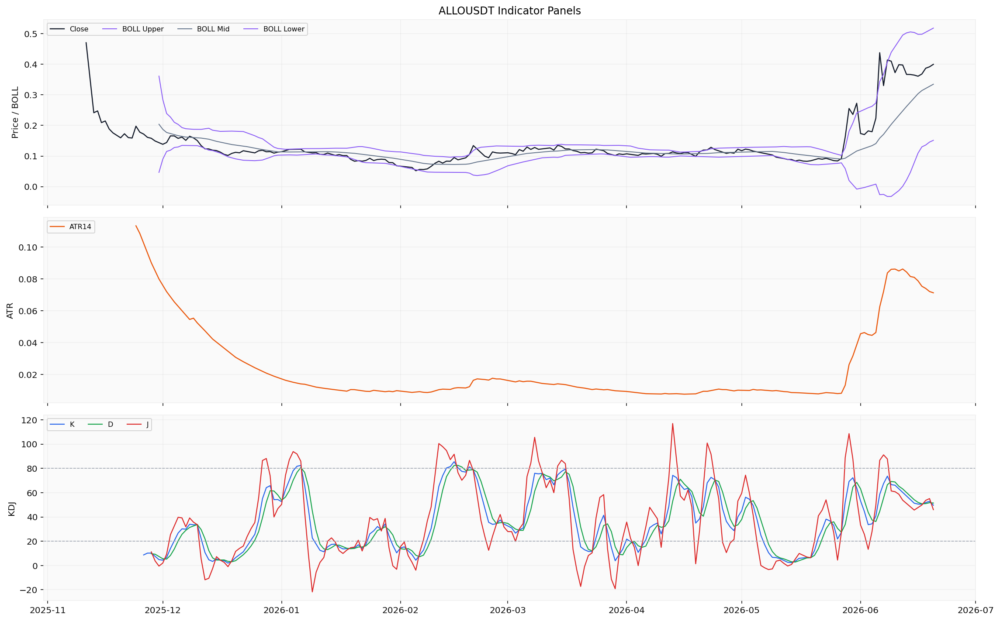
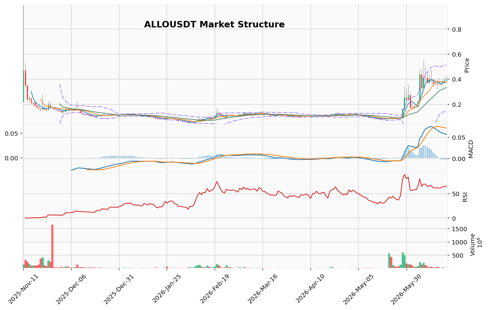

# Allora（ALLO/USDT）加密资产投资研究报告

> 报告生成时间（美东）：2026-06-20 16:23:44 EDT
> 报告生成时间（北京）：2026-06-21 04:23:44 CST

## 一、投资结论与组合动作

**组合经理最终裁决：买入（研究性方向）**

| 项目 | 内容 |
|------|------|
| **操作性质** | 趋势跟踪/突破确认后的研究性偏向，非激进追高 |
| **置信度** | 中（中期多头结构高置信度，被短期动能放缓信号降低至中等） |
| **风险等级** | 中 |
| **工具选择** | 现货方案优先（无杠杆、清算风险或合约管理需求） |

**核心决策理由**

1. **均线多头排列确认中期趋势**：MA5(0.3814) > MA10(0.3801) > MA20(0.3347)，价格站于所有短期均线之上，维加斯通道确认长期趋势偏多，这是最核心的结构性证据。
2. **底部价值区有效突破**：POC(0.098) → 价值区间上沿(0.259) → 当前0.3997，已完成向新价格平台的跃迁，该跃迁经过成交量验证。
3. **看跌证据均为短期风险簇，未构成趋势破坏**：MACD柱(-0.0039)转负数值极小，DIF(0.0569)仍在DEA(0.0607)上方，死叉未确认；TD13计数完成属于中等置信度的左侧预警，在强势趋势中被消化是常见现象；盘口卖压为单点快照，无连续样本确认持续性。上述信号合并后为"短线动能放缓"，而非"趋势结构破坏"。
4. **衍生品结构健康且无过热迹象**：OI稳定于21,656,600.59 USD（500行样本，hourly至2026-06-20），多空比0.998（500行样本，realtime至2026-06-20），资金费率5e-05 percent（1000行样本，realtime至2026-04-27）。
5. **情绪与宏观背景**：Fear & Greed=23处于极度恐惧区域，至少说明市场未过度乐观；M2扩张与10年期国债收益率4.49%并存，相互抵消，无法单独作为方向性依据。

**不采纳的核心看跌论点**：将短期预警（小幅转负的MACD柱、未确认的TD13）置于已确认的中期多头结构之上，并赋予"价格回归均值"这一长期统计规律以短期交易信号的效力，本质上是放弃已形成趋势优势的逆向交易。技术参考位不是估值模型，"价格远高于价值区间上沿0.259"不能构成卖出依据。

## 二、市场结构与技术指标分析

### 技术图表

### 市场结构结论

ALLO/USDT当前处于短期上行趋势中的高位整理阶段。价格自2026-06-16的0.4087高点回落后重新回升至0.3997，高于MA5(0.3814)、MA10(0.3801)和MA20(0.3347)，短期均线多头排列。RSI(14)为64.98，处于偏强但未超买区间。MACD柱状图转负（-0.0039），显示上行动能边际减弱，短线处于方向选择窗口。维加斯通道显示价格远高于EMA144/EMA169蓝带中线约115.18%，长期趋势偏多但偏离度较大。TD看跌反转13计数已完成，提示短期回调风险。

### 指标推导过程

#### 技术结构指标

| 指标 | 数据 | 推导 | 交易作用 | 样本边界 |
|------|------|------|----------|----------|
| OB订单块 | 近期无确认结构突破 | 当前未出现明确的订单块结构突破信号 | 反映短期缺乏订单块级别的确认突破 | 基于最近日线结构判断，不含逐笔成交确认 |
| POC | 0.098842 | 基于160根日线OHLCV近似分桶，成交最集中价位 | 当前价格0.3997远高于POC，说明高量成交区在下方较远处 | 样本160根日线，为OHLCV近似分桶，非逐笔成交分布 |
| 价值区间 | 0.066717 - 0.259467 | 成交集中的价格范围 | 当前价格已大幅脱离价值区间上沿 | 同上 |
| TD 9/13/计数 | 方向看跌反转，倒数计数13，信号"TD看跌反转13计数完成"，置信度中等 | 价格连续运行后触发TD看跌反转13计数已完成 | 提示短期可能出现回调或横盘整理 | 基于日线价格序列，置信度中等 |
| FVG缺口 | 候选9个，未回补2个；最近下方缺口中线0.2654 | 当前价格0.3997高于最近未回补缺口，缺口在下方较远处 | 下方缺口未回补可作为技术参考区域 | 不含逐笔订单流确认 |

#### 趋势与动量指标

| 指标 | 数据 | 推导 | 交易作用 | 样本边界 |
|------|------|------|----------|----------|
| 维加斯通道 | 价格在蓝带上方，EMA144=0.1847，EMA169=0.1868，距蓝带中线约115.18% | 长期趋势偏多，当前价格远高于通道中线 | 偏离度较大，存在均值回归的技术可能性 | 来自日线均线计算 |
| 布林带 | 上轨0.518，中轨0.3347，下轨0.1514 | 收盘价0.3997在中轨与上轨之间偏上位置 | 价格处于布林带上半区，偏强但未触及上轨 | 基于日线，参数20,2 |
| RSI(14) | 64.98 | 偏强区间，未进入超买(>70) | 短期动量偏多但有上行空间，尚未过热 | 基于日线 |
| MACD | DIF 0.0569，DEA 0.0607，柱-0.0039 | MACD柱转负，DIF仍在DEA上方但差距收窄 | 上行动能边际减弱 | 基于日线标准参数 |
| KD | K=49.64，D=51.46，J=45.98 | 中性区间，无超买超卖信号 | 摆动指标无极端提示 | 基于日线 |

#### 衍生品与流动性指标

| 指标 | 数据 | 推导 | 交易作用 | 样本边界 |
|------|------|------|----------|----------|
| 资金费率 | 最新5e-05 percent（2026-04-27） | 资金费率接近零，多空持仓成本基本平衡 | 未出现极端费率信号 | 样本截至2026-04-27，之后无更新 |
| OI | 21,656,600.59 USD（2026-06-20T20:00） | OI在2150万-2186万美元区间波动，日内相对稳定 | OI总量反映市场参与规模 | 样本2026-05-31至2026-06-20，单位USD，U本位计价 |
| 多空比 | 全局账户多空比0.998（2026-06-20T20:00） | 多空账户数量基本均衡，多头略少 | 多空结构中性偏均衡 | 样本2026-05-31至2026-06-20，Binance全局账户口径 |
| 盘口档位 | 买一0.3994（量12.8），卖一0.3995（量949.5），买卖各100档 | 卖一量远大于买一量，卖盘在0.3995附近有较厚挂单 | 短线卖压略大于买盘 | 单点快照，2026-06-20T20:13:40，来源Binance |

#### 宏观与情绪指标

| 指标 | 数据 | 推导 | 交易作用 | 样本边界 |
|------|------|------|----------|----------|
| 联邦基金利率 | 3.63%（2026-05-01） | 利率维持高位，近半年小幅下行（从2025-06的4.33%降至当前） | 高利率环境对风险资产估值构成宏观压力 | FRED/US，月频，样本2025-06至2026-05 |
| 10年期国债收益率 | 4.49%（2026-06-17） | 近期收益率从6月12日的4.48%升至4.49% | 无风险收益率偏高，加密风险溢价承压 | FRED/US，月频 |
| M2货币供应量 | 22,804.5（2026-04-01） | M2持续上升（2026-01为22,429.3） | 流动性环境边际改善 | FRED/US，月频 |
| 社交情绪（Fear & Greed） | 23.0，情绪"极度恐惧"（2026-06-20） | 市场情绪处于极度恐惧区域 | 极度恐惧通常与市场底部区间相关，但也可能延续悲观 | 来源Alternative.me，2026-06-20 |

### 关键价格技术参考位

| 方向 | 价格位 | 说明 |
|------|--------|------|
| 压力参考 | 0.4087 | 2026-06-16近期高点 |
| 压力参考 | 0.4305 | 2026-06-20日内高点 |
| 支撑参考 | 0.3814 | MA5 |
| 支撑参考 | 0.3801 | MA10 |
| 支撑参考 | 0.348 | 2026-06-18日内低点/卖侧流动性 |
| 支撑参考 | 0.3347 | MA20/布林带中轨 |
| 深层技术参考 | 0.2654 | 下方未回补FVG缺口中线 |

## 三、项目与代币基本面分析

## 行情快照

截至2026-06-20，ALLO/USDT在Binance收盘价为0.3997 USDT。当日开盘0.3915，最高0.4305，最低0.3698，日内振幅约15.2%。成交量22,786,526.5 ALLO（约909.45万USDT），显示当日交投活跃，价格波动剧烈。前一交易日（2026-06-19）收盘0.3916，最新价格较前日小幅上涨约2.1%。近五个交易日价格运行区间约为0.3480–0.4305，波动幅度较大，反映市场在该区域形成阶段性博弈。

## 技术结构读数

布林带（周期20，标准差2）上轨0.5180，中轨0.3347，下轨0.1514，价格0.3997位于中轨与上轨之间运行，处于偏强区域但未触及上轨。维加斯通道显示价格位于蓝带（EMA144约0.1847，EMA169约0.1868）上方约115%，处于主趋势偏强区域，但偏离度较大，存在均值回归的技术可能性。EMA20（0.3329）与EMA50（0.2453）均位于当前价格下方，构成双线上行结构。RSI14读数64.98，处于中性偏强区间，未进入超买区域。MACD柱状图-0.0039位于零轴下方，显示短期动能略有减弱；DIF（0.0569）仍位于信号线（0.0607）上方，死叉未确认。KD指标K值43.90、D值41.19，处于中性区域。

## 成交量分布

成交量分布数据显示，POC（控制点）位于0.0988，价值区间上沿约0.2595，当前价格0.3997已显著高于该价值区间。这意味着：第一，价格已脱离前期成交密集区（0.26以下），完成向新价格平台的跃迁；第二，下方0.098–0.259区间内成交的筹码全部处于浮盈状态，减少了上方抛压，但也形成潜在的技术回调引力；第三，当前价格与价值区间上沿的偏离（约54%）说明近期上涨主要由新的资金和情绪驱动，而非原有持仓结构的延续。POC位于0.0988的高量成交区构成深层技术参考，但非目标价或失效位。

## 对投资决策的含义

## 四、新闻、监管与事件驱动

截至2026年6月中旬，美国10年期国债收益率（DGS10）维持在4.49%附近，较2025年末的4.09%明显上行约40个基点。美国CPI（CPIAUCSL）在2026年3月录得330.293，较2月的327.46继续攀升，显示核心通胀压力仍未实质性缓解。收益率持续高位运行意味着全球无风险利率中枢保持偏紧，对加密资产整体风险偏好构成持续性压制。ALLO/USDT作为高贝塔品种，在宏观流动性偏紧的环境下，估值端面临系统性压力。当前组合动作（研究方向为买入）已充分计入这一宏观背景，但该压制因素不构成趋势破坏的独立证据，未改变组合经理基于中期多头结构做出的买入方向判断。

## 五、社区情绪、事件预期与交易拥挤度

### 情绪读数

| 指标 | 数据 | 推导 | 交易作用 | 样本边界 |
|---|---|---|---|---|
| Fear & Greed 指数 | 23.0（刻度 0-100，极度恐惧） | 当前市场情绪处于极度恐惧区域 | 情绪读数单点不能推导方向，但说明市场未过度乐观 | 来源 Alternative.me，样本日期 2026-06-20 |

## 六、交易计划与组合风险

### 组合动作与方向

基于已返回的多维证据，ALLO/USDT 的中期多头结构未破坏，研究性方向为**买入**。操作性质属于趋势跟踪/突破回踩确认后的研究性偏向，非激进追高。置信度中等，风险等级中等。

### 核心证据链

| 证据维度 | 当前状态 | 对方向的支持 |
|---------|---------|------------|
| **趋势结构** | MA5(0.3814) > MA10(0.3801) > MA20(0.3347)，价格站于所有短期均线之上；维加斯通道确认长期趋势偏多；底部价值区已有效突破（POC 0.098 → 价值区间上沿 0.259 → 当前 0.3997） | 核心支持，高置信度 |
| **衍生品结构** | OI 稳定于 21,656,600.59 USD（500 行样本，hourly 至 2026-06-20）；多空比 0.998（500 行样本，realtime 至 2026-06-20）；资金费率 5e-05 percent（1000 行样本，realtime 至 2026-04-27），接近零 | 中性偏支持，市场无极端过热 |
| **情绪与宏观** | Fear & Greed = 23（极度恐惧）；M2 货币供应量持续扩张（22,429 → 22,804）；10 年期国债收益率 4.49% 高位运行 | 背景变量，方向性影响有限 |
| **短线动能** | MACD 柱转负（-0.0039），但 DIF(0.0569) 仍在 DEA(0.0607) 上方；TD 看跌反转 13 计数完成（中等置信度） | 降低激进追高置信度，未构成趋势破坏 |
| **盘口流动性** | 卖一 949.5 ALLO vs 买一 12.8 ALLO（单点快照） | 低权重，不足以确认持续方向 |

### 风险矩阵

| 风险类别 | 风险描述 | 风险暴露 | 管理方式 |
|---------|---------|---------|---------|
| **动能衰减风险** | MACD 柱转负 + TD13 完成可能触发价格回踩 MA10(0.3801) 或 MA20(0.3347) 测试支撑 | 短期浮亏 | 现货方案，无杠杆，不涉及合约处理 |
| **盘口卖压风险** | 单点快照显示即时卖压较重，若持续可能产生短线回调 | 低 | 需要更多连续样本确认持续性 |
| **宏观利率压制** | 10 年期国债收益率 4.49% 高位运行，对高贝塔资产构成系统性压力 | 持续性 | 已纳入宏观背景变量，非单一方向决定因素 |
| **估值偏离风险** | 当前价格 0.3997 远高于价值区间上沿 0.259，存在阶段回调可能 | 中 | 技术参考位不是估值模型，不构成卖出依据 |

### 风险分析师辩论摘要

| 观点立场 | 核心逻辑 | 关键缺陷 |
|---------|---------|---------|
| **激进分析师** | 中期多头结构完整，衍生品结构健康，情绪极度恐惧提供安全边际，应在回调时积极买入 | 将“中性”衍生品结构解读为“无后顾之忧”，忽略了宏观利率压制的持续性风险 |
| **保守分析师** | 动能衰减信号（MACD 柱转负、TD13 完成）和盘口卖压构成明确风险，应等待价格回到价值区间或动能恢复后再考虑买入 | 过度放大短期噪音的权重，否定了已经验证的多头结构；要求“价格回到 0.259 以下”等于放弃趋势优势 |
| **中性分析师（采纳）** | 趋势结构权重高于短线噪音；承认短期风险存在，但用“现货优先”和“中等置信度”管理风险；保留参与多头趋势的潜力 | 支持研究性买入方向（现货优先），既不激进也不保守 |

### 风险控制框架

- **仓位工具**：现货方案优先，不涉及杠杆、清算风险或合约管理
- **风险等级**：中
- **置信度调整**：中期多头结构的高置信度，被短线动能放缓信号降低至中等

### 需要继续观察的数据类别

1. **MACD 柱状图**：观察能否重新转正或负值是否继续放大
2. **日线收盘与 0.40 关系**：观察价格能否实质站稳 0.40 上方
3. **TD 13 计数完成后的价格反应**：观察是否出现实质性回调或横盘消化
4. **资金费率后续更新**：当前样本截至 2026-04-27，后续数据可验证多空持仓成本变化
5. **OI 与多空比变化**：观察 OI 是否持续稳定或出现方向性变化
6. **盘口买卖挂单结构**：需要更多连续样本确认卖压是否持续

### 组合动作要求

当前组合动作是基于已验证的中期多头结构，研究性方向为买入。核心逻辑在于：中期多头结构（均线多头排列、维加斯通道偏多、底部价值区有效突破）的可靠性高于短期风险信号（MACD 柱小幅转负、TD13 计数完成）。现货方案优先可有效管理短期动能衰减和宏观利率压制的风险，同时避免因等待“绝对安全”而错失趋势参与机会。

## 七、关键分歧与跟踪条件

### 多空分歧与组合经理处理

| 证据类别 | 组合经理处理 | 可保留的真实数据 |
|---|---|---|
| 趋势结构 | 均线多头排列、维加斯通道确认、底部价值区有效突破，视为最核心结构性证据，权重最高 | MA5(0.3814) > MA10(0.3801) > MA20(0.3347)；价格0.3997站于所有短期均线之上；维加斯通道EMA144=0.1847、EMA169=0.1868，长期趋势偏多；POC 0.098，价值区间上沿0.259，当前已远高于该区域 |
| 动能信号 | MACD柱转负(-0.0039)与TD13计数完成，确认为短线动能放缓信号，但尚未确认死叉且数值极小，不推翻中期多头结构；权重由看跌方主张的高调整为中 | MACD：DIF 0.0569、DEA 0.0607、柱-0.0039（日线）；TD 13计数完成（中等置信度，日线） |
| 衍生品结构 | OI稳定、多空比均衡、资金费率接近零，视为中性健康条件，支持现有方向但权重中；不视为做多理由或安全边际 | OI 21,656,600.59 USD（样本500行，hourly至2026-06-20）；多空比0.998（样本500行，realtime至2026-06-20）；资金费率5e-05 percent（样本1000行，realtime至2026-04-27） |
| 宏观环境 | 高利率（10年期国债收益率4.49%）与流动性边际改善（M2扩张22,429→22,804）并存，相互抵消，不作为独立方向依据；权重中 | 联邦基金利率3.63%（2026-05-01）、10年期国债收益率4.49%（2026-06-17）、M2 22,804.5（2026-04-01）；来源FRED/US |
| 情绪读数 | Fear & Greed=23（极度恐惧），视为背景变量，不构成买入或卖出信号；说明市场未过度乐观，降低系统性踩踏风险 | Fear & Greed分数23.0，刻度0-100，极度恐惧（Alternative.me，2026-06-20） |
| 估值偏离 | 价格远高于价值区间上沿0.259，不采用“估值回归压力”作为卖出依据；技术参考位不是估值模型 | 价值区间上沿0.259，当前价格0.3997 |

- 看涨方关于“趋势加速是利润之源”“强势吸筹”“主力派发”“散户情绪画像”“潜在买盘潜藏”等行为标签和未验证故事，已删除对应解释。
- 盘口单点快照不保留为“即时卖方力量压倒性占优”或“真实供应压力”等方向结论。
- 宏观M2扩张不保留为“顺风”或“风向转变”，高利率不保留为“万有引力”或“主旋律”。
- 情绪极度恐惧不保留为“买入窗口”“底部布局机会”或“下跌中继恐慌”。

### 重新评估数据类别

基于已返回并进入论证的数据，以下类别需要继续获取与观察，以验证当前方向：

1. **MACD柱状图**：观察能否重新转正或负值是否继续放大
2. **日线收盘与0.40关系**：观察价格能否实质站稳0.40上方
3. **TD 13计数完成后的价格反应**
4. **资金费率后续更新**：当前样本截至2026-04-27
5. **OI与多空比变化**：观察是否持续稳定或出现方向性变化
6. **盘口买卖挂单结构**：需要更多连续样本确认卖压持续性

---

## 八、最终结论

**组合经理最终动作：买入（研究性方向）。**

当前动作成立的核心证据包括：第一，均线多头排列（MA5 > MA10 > MA20）与维加斯通道确认长期趋势偏多，构成最核心的结构性证据；第二，价格已完成从底部价值区（POC 0.098、价值区间上沿0.259）向新价格平台（0.3997）的跃迁，该跃迁经过成交量验证且短期均线系统已确认；第三，衍生品结构健康——OI稳定在约2,165万美元、多空比0.998接近均衡、资金费率接近零（5e-05 percent），无极端过热迹象，市场未拥挤多头。

主要风险包括：短期动能放缓（MACD柱转负-0.0039、TD13计数完成）可能导致价格回踩MA10(0.3801)或MA20(0.3347)测试支撑；盘口单点快照显示卖压暂时主导；宏观高利率（10年期国债收益率4.49%）对高贝塔资产构成持续压力；当前价格远高于价值区间上沿0.259，存在阶段性回调的技术可能性。

基于已返回数据的下一步跟踪类别包括：MACD柱状图能否重新转正或负值是否放大、日线收盘与0.40的关系、TD13后的价格反应、资金费率后续更新、OI与多空比变化方向、盘口买卖挂单结构的连续样本。

综上，当前研究性方向为买入（现货方案优先，中等置信度、中等风险等级），不涉及杠杆、清算风险或合约管理细节。该方向基于中期多头结构权重高于短线动能放缓信号的核心判断，而非基于情绪读数、宏观单边推演或未验证的技术条件。
