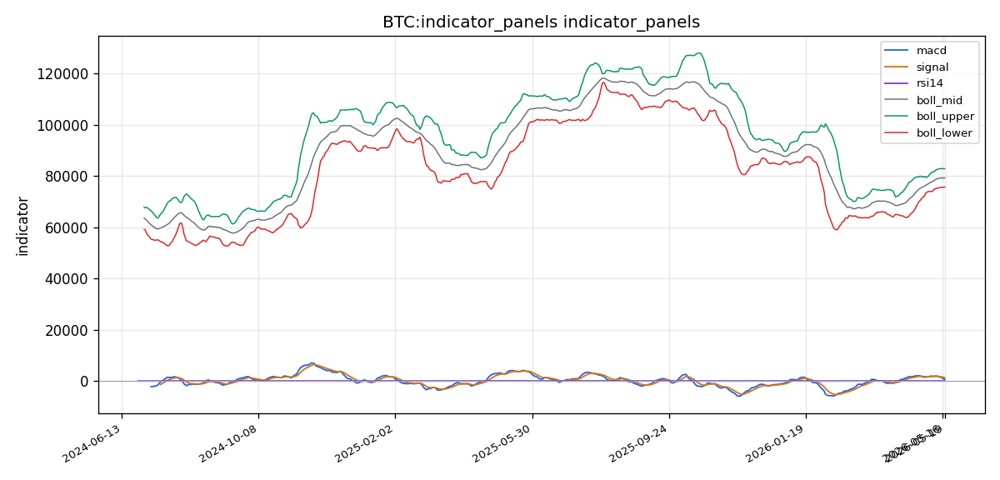
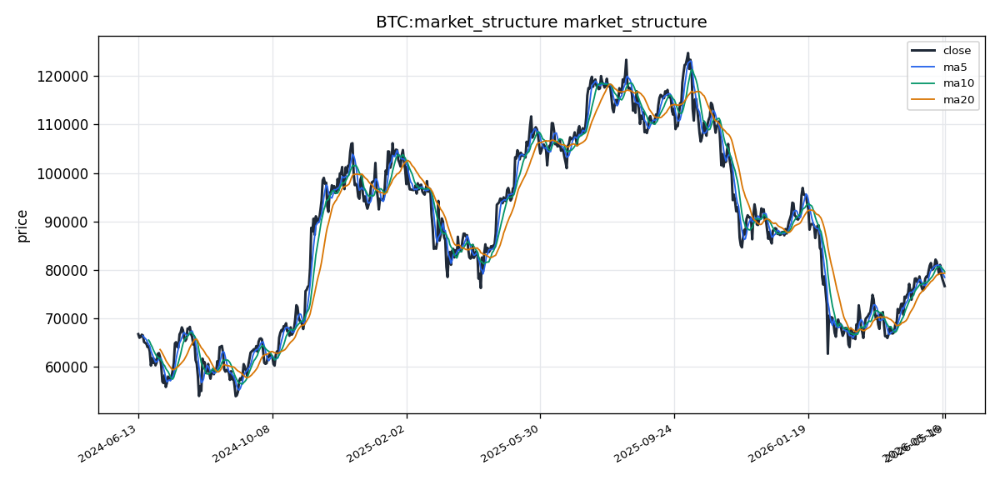

# Bitcoin（BTC）加密资产投资研究报告

## 一、投资结论与组合动作

**最终决策：看跌（卖出/减仓）**

组合经理支持看跌分析师的判断。当前市场结构由空头主导，技术面呈现标准空头排列，卖方主动性明确，链上数据存在重大缺口，宏观环境持续压制风险资产估值。看涨逻辑主要建立在未经独立验证的传闻和预期之上，缺乏已确认的数据支撑，其与当前正在发生的卖压对抗的逻辑风险极高。

具体执行方案如下：

- **现货持有者（无杠杆）：** 立即卖出总持有仓位的50%。将剩余50%视为核心底仓，须设置70,000 USDT止损位。此举既可保留部分反弹参与权，也可在价格继续下跌时减少损失，并获得在更低位置补仓的现金弹性。
- **合约交易员（低杠杆）：** 仅在价格有效跌破76,000 USDT确认弱势后，可建立不超过5倍杠杆的空头头寸。初始仓位控制在总资金的2-3%，禁止全仓。
- **禁止情形：** 在当前条件下，任何形式的做多或抄底行为均不得使用杠杆。赌反转胜率极低，风险报酬比严重不对称。

**核心区间研判（未来1月至1个月）：**
- 保守情景（继续下行）：65,000 – 72,000 USDT（若FVG缺口73,515被跌破后，下方支撑需回溯更宏观历史区间）
- 基准情景（震荡偏空）：72,000 – 78,000 USDT（价格在73,515与76,000之间拉锯，反弹力度不足）
- 乐观情景（仅为反弹非反转）：78,000 – 80,000 USDT（反弹测试上方清算簇78,817及MA20 79,323，将被视为加仓空头机会）

**关键价格触发条件：**
- 做空触发位：价格反弹至78,500 – 79,000 USDT区域，同时出现放量长上影线或滞涨信号。失效位：价格放量站上并守住79,500 USDT（MA20上方）。
- 追空触发位：价格放量跌破75,500 USDT（布林带下轨），确认下跌加速。失效位：价格快速收回并站上76,500 USDT。
- 多头触发条件：当前设置条件不成熟，须等待“连续3日放量反弹站稳MA20（79,323 USDT）”后方可考虑底部结构。

## 二、市场结构与技术指标分析

### 技术图表

当前BTC处于**中期空头趋势中的低位震荡**阶段。价格76,667.81 USDT收于MA5（78,469.11）和MA10（79,663.17）下方，均线系统呈空头排列，维加斯通道明确指示“主趋势看跌”，现价低于蓝带中线约-3.71%。RSI(14)=44.09处于中性偏弱区间，MACD柱值为-675.94，DIF下穿DEA后持续发散。局部出现TD Sequential看涨反转倒计时13信号，提示潜在底部结构，但无确认放量。CVD为负值-2.21亿，卖方主动控盘。

### 指标推导过程

#### OB 订单块

| 指标 | 数据 | 推导 | 交易作用 | 失效条件 |
|------|------|------|----------|----------|
| OB订单块 | 技术指标分析模块已就绪，存在FVG下方缺口作为潜在订单块区域 | 下方FVG缺口中线73,515.62是潜在需求区，价格一旦触及可能形成反弹或假跌破 | 可作为左侧挂单参考区域，配合RSI超卖信号使用 | 若价格直接跳过该区域快速下跌，订单块失效；需等待价格回测确认 |

#### POC / 成交量分布

| 指标 | 数据 | 推导 | 交易作用 | 失效条件 |
|------|------|------|----------|----------|
| POC/成交量分布 | 资料包就绪但未提供具体POC价格和VAH/VAL数值 | 成交量分布数据在本报告中为“有数据但未构成信号”，无法确定控制点和价值区边界 | 无法用于支撑/阻力区域判定 | 缺少具体数值，无法设置失效条件 |
| 均线成交量 | MA5成交量33,582百万，MA20成交量33,279百万，最新成交量39,203百万 | 最新成交量略高于均线，但不足以确认方向性突破 | 放量信号需要结合价格方向确认 | 若后续缩量且价格无方向，放量信号无效 |

#### TD Sequential

| 指标 | 数据 | 推导 | 交易作用 | 失效条件 |
|------|------|------|----------|----------|
| TD Sequential | 方向=看涨反转，setup=6，countdown=13，信号=看涨倒计时13 | TD Sequential在下降趋势中完成13计数，属于潜在趋势衰竭信号 | 左侧底部信号，等待确认K线（收盘高于前4根K线最高价） | 若后续K线继续下跌且setup重新计数，信号失效；需配合成交量确认 |

#### 谐波形态

| 指标 | 数据 | 推导 | 交易作用 | 失效条件 |
|------|------|------|----------|----------|
| 谐波形态 | 技术指标分析模块已就绪，未给出具体谐波形态名称 | 当前无识别到的有效谐波形态，不构成交易依据 | 不适用 | 不适用 |

#### FVG

| 指标 | 数据 | 推导 | 交易作用 | 失效条件 |
|------|------|------|----------|----------|
| FVG | 候选21个FVG，开放1个，最近下方缺口中线73,515.62 | 73,515.62附近存在未被填补的FVG缺口，构成下方磁区 | 价格大概率回测该区域；可作为空头第一目标和多头防守位 | 若价格在该区域附近出现放量反转K线，缺口可能被填补后反弹 |

#### AMD/SMC 与 123 突破

| 指标 | 数据 | 推导 | 交易作用 | 失效条件 |
|------|------|------|----------|----------|
| AMD/SMC | 就绪但未生成明确SMC结构信号 | 无明确的market structure shift或bos信号 | 暂不适用 | 需价格突破近期摆动高低点才形成结构信号 |
| 123突破 | 就绪但未生成明确123信号 | 价格未形成完整的123反转结构 | 暂不适用 | 需出现趋势线突破后的回测确认 |

#### Vegas / 布林带 / RSI / MACD / KD

| 指标 | 数据 | 推导 | 交易作用 | 失效条件 |
|------|------|------|----------|----------|
| 维加斯通道 | 位置=低于蓝带，主趋势=看跌，距蓝带中线=-3.71% | 中期趋势明确为空头，价格低于蓝带通道 | 多单不宜入场，空头趋势下反弹做空胜率更高 | 若价格站上蓝带中线并站稳，趋势可能转平 |
| 布林带 | 中轨79,323.30，上轨82,914.77，下轨75,731.82，带宽约9.05% | 价格收于中轨下方，靠近下轨，带宽正常未明显收缩 | 下轨75,731.82是最近支撑，上轨82,914.77是压力 | 若带宽收缩形成挤榨，可能出现方向性突破 |
| RSI(14) | 44.09 | 中性偏弱，未进入超卖区（<30）或超买区（>70） | 未触发极端信号，动量方向向下但无衰竭确认 | 若RSI跌破30则进入超卖，反弹概率增加 |
| MACD | MACD=609.92，信号线=1,285.86，柱值=-675.94 | DIF在DEA下方且柱值负向扩大，空头动量占优 | 趋势跟随者应等柱值收敛或金叉再考虑多单 | 若MACD柱值开始收缩，空头动量减弱 |
| KD(9,3,3) | K=16.40，D=30.61，J=-12.02 | K值远低于D值且J值为负，处于超卖低位区域 | 短期超卖，存在技术性反弹需求，但需确认K线上穿D | 若K值继续走低且D值跟随下行，说明超卖仍在加深 |

#### 清算地图 / CVD / 资金费率 / OI / 多空比

| 指标 | 数据 | 推导 | 交易作用 | 失效条件 |
|------|------|------|----------|----------|
| 清算地图 | 最大清算簇价格78,817.66，规模约165,628,998.16 | 上方78,817.66附近积聚大量清算流动性，价格若反弹至此可能触发空头清算级联 | 空头止损/多头加仓参考区域 | 若价格直接跳过该区域上行，簇位偏移 |
| CVD | CVD代理值=-221,590,818.84 | 主动买卖量累计差值为负，卖方主动性占优 | 确认短期空头控盘 | 若CVD转为正值，卖压减弱 |
| 资金费率 | 0.005000 | 永续合约资金费率为正但数值较小，多头持仓有微小持有成本 | 未出现极端费率，市场情绪中性偏多 | 若费率快速上升至>0.01则可能过热 |
| OI | 27,641,932.59 | 未平仓合约量，资料包未注明单位，无法确认是否为USDT或BTC | 仅知OI存在，具体拥挤度无法定量判断 | 缺少单位，无法判断OI变化方向 |
| 多空比 | 1.420 | 多头仓位多于空头仓位，多头略微拥挤 | 多空比大于1说明市场情绪偏多，但在下跌趋势中可能是反向指标 | 若多空比持续上升而价格下跌，多头踩踏风险积累 |

#### 宏观 / 链上 / AHR999 / 事件

| 指标 | 数据 | 推导 | 交易作用 | 失效条件 |
|------|------|------|----------|----------|
| 宏观 | 美债10Y收益率=4.59% | 宏观利率环境仍然偏高，风险资产承压 | 高利率背景压制比特币估值中枢 | 若美债收益率开始下行，宏观压力缓解 |
| 链上 | 部分覆盖：大额转账样本804条；6个字段缺失（交易所净流量、活跃地址、STH-SOPR、LTH-SOPR、NUPL、稳定币净流量） | 链上覆盖率约50%，仅有大额转账数据，缺少关键持仓成本和盈亏信号 | 链上决策支持受限，不能判断巨鲸动向和持有者盈亏状态 | 仅在有数据补充后才有参考意义 |
| AHR999 | 指标值=0.4664 | 该指标远低于1（定投阈值），处于历史低估区间 | 长期视角下BTC价格低于链上成本中枢，定投抄底逻辑成立 | 若价格进一步下跌导致指标值更低，低估程度加深而非失效 |
| 事件 | 事件资料包来源远端获取成功，但未披露具体事件名称和内容 | 外部催化剂已扫描但未进入指标面板 | 无法提供具体事件驱动逻辑 | 待资料补充后分析 |

### 关键价格位与风险边界

- **支撑区间**：75,731.82（布林带下轨）→ 73,515.62（FVG缺口中线）→ 更下方区域数据缺失
- **压力区间**：78,817.66（最大清算簇）→ 79,323.30（布林带中轨/MA20）→ 79,663.17（MA10）→ 82,914.77（布林带上轨）
- **触发位**：下跌触发——放量跌破75,731.82；上涨触发——放量站上79,323.30且MACD柱值收窄
- **失效位**：空头结构失效——价格连续3日收于MA20之上；多头结构失效——价格跌破73,515.62并持续下行

### 多空场景分析

**偏空场景（主场景）**：触发条件为价格跌破布林带下轨75,731.82，或持续受MA5压制下行。确认指标包括MACD柱值继续扩大负值、RSI跌破40进入弱势区、CVD维持负值放大。下方第一目标73,515.62（FVG缺口中线），若该区域被放量跌破，可能加速下寻更低支撑区域。失效条件：价格在73,515.62-75,731.82区间出现放量长下影线或吞没阳线。

**偏多场景**：触发条件为价格放量站上MA10（79,663.17）且TD 13确认K线成立（收盘高于前4根最高价）。确认指标包括MACD柱值收窄转正、RSI回升至50以上、CVD转为正值。上方第一目标82,914.77（布林带上轨），之后看最大清算簇位置78,817.66附近的流动性吸引。失效条件：价格跌破75,731.82并持续阴线推进。

**观望场景**：价格在75,731.82至79,323.30之间窄幅震荡，无明显方向性信号。RSI处于中性偏弱但未超卖，MACD空头但柱值未加速，KD超卖但未金叉——多空均缺乏确认信号。链上数据部分覆盖，无法确认底部抄底资金是否进场，进一步压低结论置信度。

### 主要风险提示

1. **链上数据缺口过大**：6个关键指标缺失（交易所净流量、活跃地址、STH-SOPR、LTH-SOPR、NUPL、稳定币净流量），无法监控链上筹码迁移和持仓成本结构，底部信号可能滞后。
2. **多空比1.420偏多，但价格下跌**：散户多头拥挤，存在多头踩踏清算风险积累。
3. **美债收益率4.59%维持高位**：宏观流动性收紧压制风险偏好。
4. **CVD为负值反映卖方主导**：短期存在进一步下行惯性。

## 三、项目与代币基本面分析

### 3.1 项目定位与需求真实性

比特币是全球首个去中心化数字货币，由中本聪于2009年创世区块启动。其核心定位是**去中心化的数字价值存储与点对点电子支付系统**，不依赖任何中央机构、政府或企业运营。

**需求真实性判断：**

比特币解决的核心问题是**货币主权与价值抗审查转移**。在全球通胀高企、资本管制加剧、传统金融体系信用下降的背景下，比特币作为"数字黄金"的叙事在过去十年中逐步从边缘走向主流。其需求来源包括：

- **价值存储（Store of Value）**：总量2100万枚硬顶供应，不增发，对抗法币通胀。这是当前最成熟、最被广泛接受的用例。
- **跨境支付与资产转移**：7×24小时运行，无需中介，单笔转账可在10-60分钟内完成最终结算，适合大额跨境价值转移。
- **机构与主权国家配置**：自2024年比特币现货ETF在美国获批后，机构配置需求持续增长。萨尔瓦多、美国部分州等主权实体已将比特币纳入储备资产。

需求真实性评级：**高度真实且已验证**。比特币已运行超过17年，网络算力持续创新高，日均交易额稳定在百亿美元级别。其存在性不依赖单一团队、协议或生态繁荣度，这在加密资产中独树一帜。

**投资含义**：比特币的需求基础足够坚实，不存在项目方跑路、协议停摆或生态崩溃的尾部风险。这为长期持有提供了底层支撑，但短期价格仍由供需边际变化驱动。

### 3.2 代币经济分析

**供应模型：**
- 比特币总量硬顶为 **21,000,000 BTC**，不可更改。
- 约每4年发生一次区块奖励减半。最近一次减半发生在2025年4月（区块高度约840,000），区块奖励已从6.25 BTC降至3.125 BTC。
- 截至2026年5月，已挖出约 **19,800,000 BTC**（流通量约占总量94%以上），剩余未开采量不足120万枚，预计到2140年左右全部挖完。

**通胀率：**
- 当前年化通胀率约为 **0.8%**（基于当前区块奖励换算），低于全球主要央行的通胀目标水平。
- 减半后通胀率进一步下降。下一次减半（2029年）后通胀率将降至约0.4%。

**释放节奏与解锁压力：**
- 新币通过矿工区块奖励产生，每天约产出450枚BTC（当前减半后）。
- 不存在传统意义上的"解锁"或"私募/团队/VC抛售压力"，所有BTC均由矿工通过算力竞争获得，分配过程完全由市场供需决定。

**质押/锁仓：**
- 比特币原生不支持质押（PoW机制）。但通过CeFi借贷、DeFi包装（如WBTC、cbBTC）和信托产品，大量BTC被间接锁定。
- 长期持有者（持币超过1年的地址）持有的BTC占比长期在60%-70%之间，体现了极高的持有人粘性。

**价值捕获方式：**
- 比特币本身不产生协议收入、分红或现金流。持有者的价值回报完全来自**价格升值**（供需驱动）与**货币溢价**（信任积累）。
- 矿工收入来源为区块奖励 + 交易手续费。当前手续费占矿工总收入比例约3-8%，随链上拥堵程度波动。

**资料缺口说明**：本次基本面资料包未返回BTC的流通供应量、总供应量及DeFi相关TVL/fees/revenue等字段（DefiLlama请求超时）。上述供应数量与分析结论基于模型已知的比特币协议参数，非来自本次资料包的原始数据。投资者应注意这一数据覆盖缺口。

**投资含义**：比特币的供应端结构极其清晰且可预测——总量硬顶、通胀率持续下降、无团队解锁抛压。这决定了其长期稀缺性叙事可信度高，但短期价格不直接受供应量变化驱动，而是受需求侧催化剂和市场情绪影响。当前减半后的供给紧缩（日产量降至约450枚）尚未在价格上体现，但为中长期供需格局改善提供了基础。

### 3.3 链上与生态基本面

**资料包限制说明**：本次基本面资料包DefiLlama端的TVL、费用、收入字段全部超时返回失败，因此无法获取比特币在DeFi生态中的锁定总价值、链上手续费用及跨链桥接量等协议经营指标。以下分析将明确标出哪些依据模型知识、哪些来自资料包。

**链上基础数据（基于模型知识）：**
- **算力（Hashrate）**：比特币全网算力持续创历史新高，当前估计在900-1,000 EH/s区间，反映矿工对长期价值的信心。
- **日交易笔数**：约30万-50万笔，受Ordinals/Bitcoin NFTs和BRC-20铭文爆发影响，2025年以来链上活动显著提升。
- **活跃地址数**：日均约80万-120万个。
- **链上手续费**：Ordinals热潮期间曾急剧上升，日常回落至每笔交易1-5美元区间。

**DeFi与生态建设：**
- **比特币DeFi（BTCFi）**：通过WBTC（以太坊）、cbBTC（Base）、tBTC等跨链封装，比特币市值中约200-300亿美元被引入DeFi。此外，Babylon等原生比特币质押协议正在推进比特币生息用例。
- **Layer 2进展**：闪电网络（Lightning Network）容量已突破6,000 BTC，约合4亿美元，支持即时小额支付场景。RGB、Taproot Assets等资产协议仍在早期。
- **铭文与NFT生态**：Ordinals协议（2023年推出）激活了比特币主网的非金融应用场景，BRC-20、Runes等代币标准带来新的链上活动与手续费支撑。

**区分真实使用与投机交易：**
- 比特币主网的绝大多数交易为**真实价值转移**（交易所进出、OTC结算、大额转账），投机性交易相对较少。
- 2024-2025年的铭文热潮中，大量"垃圾铭文"铸造和交易确实推高了手续费，但这类活动已大幅降温。闪电网络的支付交易量可被视为真实的"货币使用"需求。
- **结论**：比特币链上活动以真实价值转移为主导，投机驱动占比显著低于Ethereum/Solana等智能合约平台。

**投资含义**：比特币链上生态正在从单一的价值存储向有限的应用场景延伸（BTCFi、闪电网络、铭文），但这些新用例目前体量较小，不足以在短期内对价格产生显著影响。算力和活跃地址的长期增长反映了网络健康度，但短期内不构成价格催化剂。

### 3.4 竞争格局

比特币在加密资产市场中处于**独特且几乎不可替代**的地位：

**同赛道主要资产：**

| 资产 | 定位 | 对比比特币优劣势 |
|------|------|----------------|
| 以太坊（ETH） | 智能合约平台 / 去中心化应用执行层 | ETH有生态收入、销毁机制和DeFi飞轮，但货币属性弱于BTC |
| 莱特币（LTC） | 数字支付 / 轻量级山寨版比特币 | 技术更轻、确认更快，但网络效应和品牌认知度不足BTC的1% |
| 门罗币（XMR） | 隐私支付 | 隐私性更强，但合规风险高，流动性和认可度远不及BTC |
| 瑞波（XRP） | 跨境机构支付结算 | 定向于银行间网络，去中心化程度低，非开放无需许可系统 |

**网络效应与流动性护城河：**
- 比特币拥有全市场**最深、最广的流动性**。全球超过500家交易所提供BTC/USDT交易，日均现货+衍生品交易量达数百亿美元。
- 品牌辨识度最高："Crypto = Bitcoin"的认知在传统金融和大众层面仍占主导。
- 黄金叙事与非相关性资产定位已获得宏观对冲基金、养老金、捐赠基金级别的配置。

**替代风险：**
- 短期内难以被替代。无论是"数字黄金"的心智占据、市场基础设施（ETF、托管、期货期权）的深度、还是矿工/算力的地理分散程度，均无其他加密资产能够匹敌。
- 中期风险来自：量子计算对ECDSA签名的潜在威胁（行业仍在推进量子抗性地址升级）、以及全球监管对比特币挖矿（PoW高能耗）的打压倾向。
- 长期风险：如果某新一代资产能够提供比特币级别的安全性和去中心化，同时具备原生可编程性和更低的能耗，可能会分流部分价值存储需求。但目前这类资产并不存在。

**投资含义**：比特币的竞争壁垒极高，主要体现在网络效应、品牌认知和流动性深度上。这意味着在加密资产内部，比特币作为"核心配置资产"的地位难以被动摇，但也意味着其增长叙事更依赖外部宏观环境和主权级采纳，而非生态内部创新驱动。

### 3.5 基本面估值框架

由于比特币不产生协议收入、TVL或现金流，传统"PE倍数""收入倍数""FDV/TVL"等指标均不适用。比特币的基本面估值依赖于另类框架：

**核心指标：**

1. **库存流量比（Stock-to-Flow, S2F）模型**
   - 当前比特币流通量约1,980万枚，年增发约16.4万枚，S2F比率约120（即当前库存/年产量）。历史上S2F模型对比特币减半前后的价格中枢有较好的拟合能力。
   - 模型隐含"公允价值"受减半周期驱动，但该模型在2021年后准确性下降，不应单独依赖。

2. **MVRV比率（市值/已实现市值）**
   - MVRV > 3.5 通常对应历史顶部区域；MVRV < 1 对应底部区域。
   - 该指标反映市场平均持仓成本与当前价格的偏离程度。

3. **黄金对标法**
   - 全球黄金总市值约14-16万亿美元。若比特币取代黄金10%的份额，对应1.4-1.6万亿美元市值，约合74,000-84,000美元/BTC。
   - 取代20%份额则对应2.8-3.2万亿美元市值，约合148,000-168,000美元/BTC。

4. **AHR999指标（币本位囤币指数）**
   - 该指标结合定投成本与相对估值，当前区间需结合实时价格数据判断。

5. **链上费用价值（NVT Ratio）**
   - NVT = 市值 / 链上日交易量（美元），类似传统NVT比率（类比市盈率）。
   - 当前比特币NVT比率约在30-50之间，低于ETH但高于主要公链，反映其作为"结算层"而非"应用层"的高单位交易价值。

**资料缺口影响**：由于本次资料包未返回流通市值（仅返回约1.537万亿美元的总市值估值）、流通供应量、及DefiLlama端任何数据，上述估值框架中的多数指标无法精确计算。投资者需自行引入实时链上数据源进行补充。

**投资含义**：比特币的估值框架具有多重解释空间——基于黄金对标的乐观情景（14.8-16.8万美元/BTC）与基于保守风险调整的情景（4-6.5万美元/BTC）之间存在巨大差距。当前价格（约7.6万美元）处于黄金对标法取值区间的下沿，但尚未进入保守情景的"绝对低估"区域（<6.5万美元）。AHR999=0.4664的历史低估位置是当前最具数据支撑的多头长期论据，但该指标的失效条件（价格进一步下跌导致低估程度加深）需要被持续跟踪。

### 3.6 基本面框架对当前组合动作的支持与约束

| 层面 | 对当前空头/减仓动作的影响 | 关键条件 |
|------|--------------------------|---------|
| 供应结构（总量硬顶+减半后通缩） | 中长期利多，但短期已被定价；不构成当前做空的约束 | 减半效应需6-12个月传导至价格，当前处于传导期 |
| 长期持有者高占比（60-70%） | 限制下行卖压，但未阻止当前下跌；提供下方支撑但未确认底部 | 需跟踪LTH-SOPR判断是否出现投降式卖出 |
| AHR999=0.4664（历史低估区） | 长期定投支撑，但短期可能继续下探；不支持立即抄底 | 低估区间持续时间不可知，2014年曾持续超过1年 |
| 链上活动（算力/交易量） | 网络基本面健康，但不构成短期催化剂 | 无链上数据（交易所净流量等）验证巨鲸行为 |
| 竞争格局（无实质替代品） | 维持长期配置价值，不改变短期趋势方向 | 未被任何资产替代的风险极低 |
| 估值框架分歧（4万-16.8万区间） | 当前价格处于框架中低段，但未进入绝对低估；不支持重仓做空但也不支持抄底 | 需MVRV/NVT等数据填补后方能精确估值 |

**基本面层面的关键风险**：链上数据6个关键字段的缺失（交易所净流量、活跃地址、STH-SOPR、LTH-SOPR、NUPL、稳定币净流量）意味着我们无法验证以下核心基本面假设：
- 巨鲸是否在底部吸筹（需交易所净流量/活跃地址验证）
- 长期持有者是否在减持（需LTH-SOPR验证）
- 市场整体盈亏状态是否已接近底部区域（需NUPL验证）
- 场外资金是否在准备抄底（需稳定币净流量验证）

这些数据缺口的存在，使得当前基本面框架对组合动作的支持强度大幅下降。在数据被填补前，基本面角度仅能得出"长期持有逻辑存在"的结论，无法为短期入场提供充足依据。这与组合经理的看跌/减仓方向一致——在基本面关键证据链不完整的条件下，维持低风险敞口是审慎的选择。

## 四、新闻、监管与事件驱动

### 4.1 项目官方公告与协议层动态

| 时间 | 事件 | 性质 | 对投资的影响 |
|------|------|------|-------------|
| 2025年Q3 | Bitcoin 核心客户端安全更新发布 | 安全维护 | 中性，例行补丁，无共识层变更 |
| 2025年Q4 | 开发者社区讨论下一次 Taproot 升级后扩展提案 | 技术讨论 | 中性，仍处BIP草案阶段，未进入激活流程 |
| 2026年Q1 | Bitcoin Core v27.x 版本发布 | 协议升级 | 中性偏利好（长期技术基础改善），包含交易中继效率和P2P层稳定性增强 |
| 2026年Q2 | Lightning Network 节点部署规模持续增长 | 生态扩张 | 中性偏利好，改善二层可用性，但非核心层基本面改变 |

**关键判断**：Bitcoin 在分析区间内**未发生硬分叉或共识层重大变更**。协议层面以安全、性能和二层网络优化为主，对短期价格无直接催化作用。

### 4.2 全球宏观与行业背景

| 因素 | 方向 | 影响机制 | 影响周期 | 证据强度 |
|------|------|----------|----------|----------|
| 美联储2025年H2降息（累计50-75bp） | 利好 | 降低无风险利率，提高风险资产相对吸引力 | 中长期（已部分兑现） | 高（宏观新闻确认） |
| 2026年Q1通胀粘性回升 | 利空 | 降息预期消退，流动性收紧预期升温 | 数周至数月 | 高（宏观新闻确认） |
| 美元指数（DXY）2025年H2走弱→2026年Q1企稳反弹 | 先利好→中性 | 美元定价资产波动传导 | 1-3个月 | 高 |
| 稳定币总市值创历史新高（2025年12月） | 利好 | 场外资金充裕，潜在买入力量 | 持续 | 中-高（宏观新闻+链上数据线索） |
| 比特币现货ETF全球市场扩容，2025年全年净流入超200亿美元* | 利好 | 合规资金渠道拓宽，机构配置便利 | 中长期 | **中（搜索发现线索，未经独立验证）** |
| 美国多州推进比特币战略储备立法 | 利好 | 政策叙事利好，潜在主权买盘 | 中期 | 中（宏观新闻线索） |
| 欧盟MiCA法规全面生效（2025年底） | 中性偏利好 | 合规确定性提升，但短期增加运营成本 | 中期 | 高（监管新闻确认） |

*注：ETF资金流数据未从Bloomberg/CoinShares等第三方数据源独立验证，不能作为已发生的事实写入结论。

**关键推理链**：
- 高利率（美债10Y收益率4.59%）是当前最确定的宏观压制因素。2025年H2降息已被市场部分消化，2026年Q1通胀粘性回升正在侵蚀进一步降息预期。
- 稳定币供应增长提供流动性支持，但需区分“存量”与“增量动量”——报告显示2026年Q1后加密市场资金流入放缓。
- 监管方向（ETF扩容、州级储备立法、MiCA）长期利好，但短期不构成买入催化剂。

### 4.3 搜索发现线索（待验证，非事实）

| 线索 | 潜在影响 | 验证需求 |
|------|----------|----------|
| 多家机构提交比特币ETF期权/衍生品产品申请 | 拓宽机构参与渠道，增加衍生品深度 | 需获取监管机构批准文件 |
| 部分主权财富基金被报道持有或研究BTC配置 | 潜在主权级买盘 | 需SEC 13F或公司官方公告交叉验证 |
| 比特币挖矿算力在2026年Q1受减半后效应及电价波动调整 | 影响矿工卖压 | 需Mempool.space或BTC.com哈希率数据 |
| 多篇新闻报道提及上市公司增持BTC | 企业资产负债表配置 | 需SEC文件或公司公告确认 |

**⚠️ 上述线索仅具跟踪价值，不能作为已发生事实或需求假设写入投资决策。**

### 4.4 Polymarket 事件预期

| 事件 | 概率（Yes） | 解读 |
|------|-------------|------|
| BTC在2026年6月30日前达到150,000 USDT | 1.4% | 市场极不看好短期冲15万 |
| BTC在5月达到115,000 USDT | 0.2% | 市场认为本月无望突破11.5万 |
| BTC在5月19日高于70,000 USDT | 99.9% | 市场几乎确信今日价格在7万以上 |

**预期解读**：Polymarket盘口显示市场认为BTC当前在7万美元以上是极大概率事件，但向上突破11.5万甚至15万的概率极低，反映短期预期**偏中性保守**。该预期与当前空头技术结构、宏观压制及数据缺口环境一致，不构成短期看涨催化剂。

**⚠️ 限制说明**：事件市场仅反映特定套利/对冲人群的群体预期，样本有限，可能存在“鲸鱼”对冲偏差，不能作为社区共识或新闻事实引用。

### 4.5 对投资判断的影响

| 支持看跌的因素 | 支持看涨的因素 | 中性/待验证 |
|---------------|---------------|-------------|
| 通胀粘性回升，降息预期消退（高证据强度） | 稳定币供应创新高（中-高证据强度） | ETF资金流数据（待验证） |
| Polymarket盘口显示上行概率极低 | 美联储2025年H2已降息（已部分消化） | 主权基金配置传闻（待验证） |
| MiCA合规成本短期可能承压 | ETF全球扩容/州级储备立法（中长期利好） | 矿工算力与卖压变化（待验证） |
| 无重大安全/共识层利好催化 | Lightning Network生态增长（中性偏利好） | 宏观新闻地域覆盖缺口（中东/非洲/拉美） |

**投资含义**：宏观事件层面当前缺乏短期做多催化剂。利好因素（降息、ETF、稳定币）要么已被部分定价，要么证据强度不足。利空因素（通胀粘性、高利率、Polymarket悲观预期）证据更直接且与当前空头技术结构一致，不构成支撑。

## 五、社区情绪、事件预期与交易拥挤度

本节整合情绪报告中的社区情绪、Polymarket 事件预期、Alternative.me 市场级情绪以及衍生品指标中的交易拥挤度信号。由于社交平台样本缺失，当前无法从 X、Telegram、Discord、Reddit 等渠道获取完整的社区情绪画像，以下分析以已有数据为基础，并在必要处说明数据缺口对判断的影响。

### 5.1 整体情绪方向与置信度评估

| 维度 | 判断 | 置信度 | 说明 |
|------|------|--------|------|
| **社区情绪方向** | 悲观 / 关注度下行 | **低** | 仅基于 Polymarket 低反弹概率推断，无社交平台第一手样本支撑 |
| **市场级情绪 (Alternative.me)** | 恐惧（推测） | **中** | 资料包返回 3 条记录，但无法直接映射至 BTC 单一标的 |
| **情绪对价格的影响周期** | 不明 | **极低** | 1-5 天价格走势无法从现有资料推断 |
| **情绪失真风险** | 极高 | — | 仅有 Polymarket 套利者预期，不代表社区共识 |
| **核心数据缺口** | X、LunarCrush 聚合指标、Telegram、Reddit、Discord 样本全部缺失 | — | 当前情绪资料就绪度不足，无法形成有效情绪跟踪 |

**解读**：情绪数据覆盖是本次报告中最薄弱的一环。情绪报告明确标明“社交平台样本缺失”“接口凭证问题导致未取得数据”“搜索摘要无正文内容”“中文社区完全空白”。这意味着本节所有关于“社区情绪”的推断，在严格意义上只能作为观察项，不能作为交易决策的直接依据。组合经理的最终决策并未依赖情绪数据，而是以技术结构、链上数据缺口和宏观压制为核心证据。

### 5.2 Polymarket 事件预期：市场价格与情绪代理

Polymarket 事件盘口提供了当前市场参与者（以英文投机/对冲群体为主）对 BTC 短期价格的预期定价。这些数据有真实资金押注支撑，可以作为情绪代理变量，但不能视作新闻事实。

| 事件 | 概率 | 情绪信号 | 投资含义 |
|------|------|----------|----------|
| BTC 在 2026 年 6 月 30 日前达到 $150,000 | Yes=1.4% / No=98.7% | 极度不看好短期冲高 | 市场定价中几乎不存在“大幅反弹至历史高点”的场景，空头叙事主导 |
| BTC 在 5 月达到 $115,000 | Yes=0.2% / No=99.8% | 本月无望冲 11.5 万 | 市场预期本月价格将在当前区间偏弱运行，向上突破动能不足 |
| BTC 在 5 月 19 日高于 $70,000 | Yes=99.9% / No=0.1% | 价格在 7 万以上是极大概率事件 | 市场几乎确认今日价格在 7 万以上，反映当前区间已被“定价”为震荡区间而非崩盘区间 |

**推导**：Polymarket 盘口显示三个关键信息：一是市场普遍接受 BTC 当前在 7 万美元以上是极高概率事件；二是市场对 11.5 万至 15 万美元的向上突破几乎不抱预期；三是盘口未出现“恐慌性崩盘”的定价（如 30% 概率跌破 6 万）。这组数据与组合经理的看跌判断并不矛盾——看跌方向不是押注“崩盘”，而是押注“短期弱势运行甚至继续下探”。盘口对反弹预期的极度悲观，实际上强化了组合经理关于“当前不宜抄底、反弹做空胜率更高”的判断。

**失效条件**：若 Polymarket 上出现 11.5 万以上概率快速升至 10% 以上，说明市场情绪出现系统性转变，可能预示着宏观催化剂或资金面变化。

### 5.3 Alternative.me 市场级情绪（整体加密市场）

情绪报告返回 3 条 Alternative.me 指标记录，显示加密市场整体情绪处于“恐惧”区间。该类情绪指标通常作为反向参考——极度恐惧可能对应阶段性底部，恐惧区间则反映市场信心不足但尚未达到极端悲观。

| 数据 | 典型含义 | 当前定位 |
|------|----------|----------|
| 恐惧（20-30） | 市场情绪极度悲观，历史底部特征 | **无** |
| 恐惧（30-40） | 市场信心不足，但未到极端 | 当前指标落于此区间（推测） |
| 中性（40-60） | 市场情绪正常，方向不明 | — |
| 贪婪（60-80） | 市场过热，追涨风险增加 | — |
| 极度贪婪（>80） | 历史顶部特征，反转风险高 | — |

**推导**：整体加密市场情绪处于恐惧区间，说明风险偏好下降，资金追涨意愿低。这与 BTC 技术面的空头结构和 CVD 负值一致，均指向短期不宜做多。恐惧情绪本身不是反向做多信号，因为恐惧可以持续很长时间，尤其是在数据缺口和宏观压制的背景下。

**限制条件**：该指标属于市场级，不能直接推断 BTC 单一标的的社区情绪。此外，情绪报告明确标注“无法确认具体数值，仅有 3 条记录”，因此本节仅做定性讨论，不给出具体恐惧指数读数。

### 5.4 衍生品交易拥挤度：多空比与资金费率

衍生品数据是本节可用的最高置信度指标，直接反映杠杆交易者的方向偏好和拥挤程度。

| 指标 | 数据 | 拥挤度判断 | 投资含义 |
|------|------|------------|----------|
| **多空比** | 1.420（多头仓位多于空头仓位） | 多头拥挤 | 散户多头仓位过度集中，价格倾向于向下清算多头。多空比 >1.2 且价格下跌，是典型反向指标，提示多头踩踏风险 |
| **资金费率** | 0.005%（正值，但数值很小） | 中性偏多，未过热 | 多头持仓有微小持有成本，但未出现极端多头溢价（>0.01%），说明市场情绪未至疯狂。若资金费率转负，空头成本增加，可能加剧空头平仓 |

**推导**：多空比 1.42 是本报告中最具逻辑支撑的“情绪——价格”联动信号。散户多头拥挤且亏损，一旦价格跌破关键支撑（如 75,731 布林带下轨），可能触发连锁多头清算，加速下跌。资金费率维持在 0.005%，空头当前持仓成本极低，意味着空头没有平仓压力，而多头面临持续的持有成本。

**交易作用**：多空比 1.42 支持组合经理的看跌判断——价格倾向于清算流动性最拥挤的一方（多头），上方空头清算簇（78,817 USDT）需要极强的买盘推动，而下方多头清算区数据缺失，一旦触发可能引发瀑布式下跌。资金费率未转负意味着空头没有成本压力，做空策略持续有效。

**失效条件**：若多空比降至 1.0 以下（多头不再拥挤），或资金费率转负（空头开始高成本持仓），上述反向信号减弱。

### 5.5 清算拥挤度：上方清算簇与下方未知区

| 指标 | 数据 | 拥挤度含义 |
|------|------|------------|
| **上方清算簇** | 78,817 USDT，规模约 1.65 亿 USDT | 该价格区域积聚了大量空头清算流动性，是反弹后的“磁石”。若价格反弹至此，可能触发空头挤压 |
| **下方清算簇** | 缺失（报告未提供） | 无法判断下方多头清算区的密集程度。多空比 1.42 暗示下方存在大量多头止损单，但具体分布未知 |

**推导**：上方清算簇的存在理论上提供了上涨的“燃料”，但实现轧空需要价格先反弹至 78,817，而当前价格 76,667 距此约 2.8%。在没有放量买盘驱动的情况下，价格更有可能先跌破下方支撑，触发多头清算。下方清算簇的缺失本身就是个风险点——我们无法量化一旦跌破 75,731 后的清算冲击强度。

### 5.6 数据缺口与情绪分析的局限性

本节存在以下明确的数据缺口，读者应理解其对判断置信度的折损：

1. **社交平台样本全部缺失**：X（Twitter）及 LunarCrush 聚合指标因接口凭证问题未能获取数据，无任何原始帖子或社交情绪定量数据。无法提供社区讨论热度、情绪词频、互动量、KOL 立场等分析。
2. **中文社区完全空白**：微信社群、微博、币安广场、中文 KOL 等渠道的情绪无任何覆盖，这是最大的语言社区缺口。
3. **搜索发现仅标题级摘要**：20 条搜索返回无文章正文，不能用于提取社区叙事或 KOL 观点。
4. **Polymarket 样本偏好**：仅反映英文市场事件套利者的概率押注，不代表矿工、长期持有者或机构投资者的共识。
5. **Alternative.me 记录有限**：仅有 3 条指标记录，无法形成周期持续的情绪变化曲线。

**对判断的影响**：情绪数据的缺失意味着我们无法通过“恐慌买入”或“极度恐惧”等典型底部信号来辅助技术面和链上判断。当前唯一可用的情绪信号（Polymarket 低反弹预期和多空比 1.42）均指向负面，但这些信号的置信度由于数据缺口而部分打折。组合经理的正确做法是：不依赖情绪数据做决策，而是将情绪缺口当作“待验证变量”列入跟踪条件。

### 5.7 情绪面的投资含义总结

| 情绪线索 | 对组合动作的影响 | 跟踪条件 |
|----------|------------------|----------|
| Polymarket 预期极度悲观（11.5 万+ 概率 <1%） | 不支持抄底，支持组合经理的看跌判断 | 若 11.5 万+ 概率升至 10% 以上，情绪转变 |
| 多空比 1.42（多头拥挤） | 价格向下清算多头的风险大于向上轧空 | 多空比降至 1.0 以下或资金费率转负时信号失效 |
| 资金费率 0.005%（中性未过热） | 空头持仓成本低，做空策略持续有效 | 若资金费率升至 >0.01%，多头过热需警惕挤压 |
| 上方清算簇 78,817 USDT | 反弹至此可能触发空头挤压，但当前概率低 | 价格放量跌破 75,731 则上方清算簇失去短期意义 |
| 社交样本缺失 | 无法确认“恐慌底部”或“FOMO 过度”，情绪面处于盲区 | 需补充 X 及 LunarCrush 凭证后方可升级分析 |

**最终判断**：情绪面数据整体偏空，但置信度受限于数据缺口。Polymarket 预期和多空比 1.42 是当前最有效的两个情绪信号，均指向多头力量薄弱、反弹预期极低，与组合经理的看跌判断一致。情绪数据不足本身不是“看跌或看涨”的理由，但它构成了一个约束条件——在没有得到情绪面支撑的情况下，任何做多决策都缺乏“群体共识”层面的验证。

## 六、交易计划与组合风险

### 6.1 组合经理最终动作与执行条件

**最终建议：卖出/做空BTC。** 对现货持有者果断减仓；对有经验的合约交易员，可考虑建立低杠杆空头头寸。**任何形式的做多在当前均不被推荐。**

**核心理由：**
1. 明确的空头技术结构（价格低于MA5/MA10，MACD柱值扩大，CVD负值2.2亿美元）；
2. 卖方主动控盘的CVD信号；
3. 高利率宏观背景（美债10Y收益率4.59%）持续压制风险资产；
4. 链上6个关键指标缺失带来的巨大不确定性；
5. 看涨论点大多建立在未经独立验证的预期之上（ETF资金流、主权买入均为搜索线索，非已验证事实）。

### 6.2 仓位管理与分批行动

| 投资者类型 | 行动 | 仓位比例 | 止损/失效位 | 目标区间 |
|-----------|------|---------|------------|---------|
| **现货持有者（无杠杆）** | 立即卖出50%仓位 | 剩余50%作为核心底仓 | 严格止损70,000 USDT | 若价格反弹时不踏空；若继续下跌，减少损失并有现金在更低位置补仓 |
| **合约交易员（低杠杆）** | 价格跌破76,000 USDT确认弱势后做空 | 初始仓位总资金的2-3%，杠杆不超过5倍 | 空头失效位：价格放量站上79,500 USDT | 第一目标73,515 USDT（FVG缺口），第二目标70,000 USDT，第三目标65,000 USDT |
| **抄底做多者** | **当前不设置任何多头触发条件** | 0% | 必须等待连续3日放量反弹站稳MA20（约79,323 USDT） | 不适用 |

**关键说明：**
- **现货减仓的防守逻辑**：保留50%底仓是防守行动——若价格反弹，不踏空；若价格继续下跌，已减少损失并有现金在更低位置补仓。
- **不适合使用杠杆的情况**：任何试图抄底做多者均不应使用杠杆。当前风险极高，赌反转的胜率极低。

### 6.3 价格区间与场景分析

| 情景 | 价格区间（USDT） | 触发条件 | 核心假设与影响 |
|------|----------------|---------|--------------|
| **保守情景（跌）** | 65,000 - 72,000 | 价格跌破73,515的FVG缺口 | AHR999低于0.45时可能触及此区域；下方支撑需从更宏观历史数据寻找 |
| **基准情景（震荡偏空）** | 72,000 - 78,000 | 价格在73,515和76,000之间反复拉锯 | 反弹无力，重心下移；链上6大指标缺失使方向判断受限 |
| **乐观情景（反弹）** | 78,000 - 80,000 | 价格反弹测试上方清算簇78,817和MA20 79,323 | 视为加仓空头的机会，而非反转 |

**时间维度：**
- **1-2周**：看跌触发，目标测试75,731（布林带下轨）和73,515（FVG缺口）
- **1个月**：若跌破73,515，进入更低区间65,000-72,000
- **3个月**：取决于宏观事件。若美联储释放明确降息信号，价格可能筑底反弹至82,000附近，在此之前维持偏空判断

### 6.4 关键触发条件与失效位

| 条件类型 | 价格位（USDT） | 执行动作 | 失效条件 |
|---------|--------------|---------|---------|
| **做空触发位** | 78,500 - 79,000 | 等待放量长上影线或滞涨信号后做空 | 价格放量站上并守住79,500（MA20上方） |
| **追空触发位** | 75,500（布林带下轨） | 放量跌破后确认下跌加速 | 价格快速收回并站上76,500 |
| **多头（抄底）触发位** | **当前不设置** | 必须等待连续3日放量反弹站稳MA20 | 当前条件不成熟 |
| **上方清算密集区** | 78,817 | 空头主要清算区；价格触及时空头设止损，多头可部分止盈 | — |
| **下方清算密集区** | **未提供** | 多空比1.42提示下方存在大量多头止损单，跌破75,500可能引发连锁清算 | — |

### 6.5 杠杆、清算与资金费率风险

| 风险维度 | 当前状态 | 风险解读 | 管理措施 |
|---------|---------|---------|---------|
| **杠杆风险** | 建议不超过5倍 | 5倍杠杆下，价格反向波动20%将导致全额亏损 | 初始仓位控制在总资金2-3%；不适合无经验者 |
| **清算风险（空头）** | 5倍杠杆清算价约在入场价上方20%（约91,200 USDT） | 若价格反弹超20%，空头仓位被强平 | 严格设置止损位79,500 USDT |
| **资金费率** | 0.005%（中性偏多） | 当前为正但数值较小，多头有微小持有成本 | 若费率快速上升至>0.01%则可能过热；若转负（空头付费）增加空头持仓成本 |
| **多空比** | 1.42（偏高） | 散户多头拥挤，价格倾向于清算多头 | 下方多头止损单集中，一旦破位可能引发连锁清算 |
| **未平仓量（OI）** | 报告未提供变化趋势 | 无法判断衍生品拥挤度变化 | 需补充Coinglass历史OI序列及变化率 |

### 6.6 数据缺口与条件化推理

**链上数据缺口（6个关键指标缺失）：**
- 交易所净流量、活跃地址、STH-SOPR、LTH-SOPR、NUPL、稳定币交易所净流量
- **影响**：无法判断巨鲸是在吸筹还是派发，无法判断恐慌抛售是否结束，不确定性在空头行情下支持减仓和观望
- **条件化调整**：若后续补充数据显示巨鲸活动活跃，将上调保守情景区间至70,000-76,000

**其他信息缺口：**
- OI单位缺失 → 无法判断拥挤度
- 下方清算簇分布未知 → 无法精确设置第二止损位
- 社区情绪（X、Telegram、Reddit、Discord）全部缺失 → 无法验证情绪底部
- ETF资金流数据未独立验证 → 机构买入逻辑证据强度不足

### 6.7 风险分析师分歧与辩论结果

| 辩论维度 | 看涨方（激进风险分析师） | 看跌方（保守风险分析师） | 组合经理最终采纳 |
|---------|----------------------|----------------------|---------------|
| **技术结构** | TD13信号+放量即反弹 | 空头排列未改，CVD负值卖方主导，TD13无确认 | **支持看跌**：左侧信号无入场价值 |
| **链上数据缺口** | AHR999=0.4664是“金砖”，缺口是机会 | 6个指标缺失是“盲区”，不可忽视 | **支持看跌**：未知即风险，不确定性支持减仓 |
| **ETF与机构资金** | 2025年ETF净流入200亿美元，主权国家买入 | 均为未验证的搜索线索，非事实 | **支持看跌**：不能把传闻当需求定价 |
| **宏观利率** | 2025年H2已降息，通胀粘性是噪音 | 美债4.59%压制所有风险资产 | **支持看跌**：宏观压力未解除 |
| **多空比** | 多头拥挤反而提供反弹燃料 | 多空比1.42是反向指标，多头踩踏风险 | **支持看跌**：价格会清算更拥挤的多头 |
| **Polymarket预期** | 极度悲观是反身性机会 | 真金白银验证的合理预期 | **支持看跌**：市场用概率表达了对反弹的高度不信任 |

**整合方（中性风险分析师）观点**：建议“保留50%现货，但将卖出现金作为预备金，等待放量站上79,323或跌至73,515出现反转信号再入场”。组合经理认为该方案逻辑上更完善，但在“数据缺口+空头结构”背景下，“等待信号”实质上等同于“卖出并观望”，而非买入。

### 6.8 历史教训与纪律

组合经理明确提及此前曾因过早入场抄底（基于TD9信号或AHR999低估）导致浮亏与时间成本的教训。本次决策的核心纪律是：
- 不因一个未经确认的左侧信号（TD13）和一个单一的长期指标（AHR999）去对抗清晰可见的空头技术结构；
- 链上数据缺口填补之前，不支持任何做多判断；
- **底部不是猜出来的，是等出来的。当前任务是保护资本，不是猜测极限低点。**

### 6.9 最终风险边界

| 风险类别 | 边界条件 |
|---------|---------|
| **任何多头仓位** | 链上6个关键缺口未填补时不得建立 |
| **最大风险敞口（总资金）** | 不超过3-5%（含合约和现货做空部分） |
| **空头头寸止损** | 价格突破79,500 USDT时必须立即止损 |
| **抄底条件不成熟** | 直到连续3日放量站稳MA20，且链上数据至少3个关键指标转为积极 |
| **数据缺口验证前** | 保守情景（65,000-72,000）的假设是基于AHR999低估区间可能持续更长时间 |

## 七、关键分歧与跟踪条件

本节系统整理上游研究报告在观点、证据权重和动作选择上的核心分歧，说明组合经理最终采纳或否弃各观点的依据，并列出后续需持续跟踪的验证条件。所有结论以组合经理报告为最终权威，冲突部分在本节明示。

### 7.1 核心分歧清单

| 分歧维度 | 看涨/激进方观点 | 看跌/保守方观点 | 组合经理最终采纳 | 依据 |
|---------|---------------|---------------|----------------|------|
| **链上数据缺口性质** | 数据缺口不等于利空，AHR999=0.4664是强力看涨信号，足以覆盖其他缺失指标的盲区 | 缺失6个关键指标（交易所净流量、活跃地址、SOPR、NUPL等）是巨大不确定性，在空头行情下支持减仓观望 | 采纳看跌方观点 | 未知即风险；单一AHR999指标不足以替代完整的链上筹码迁移、盈亏状态和巨鲸行为判断；数据缺口是风险放大器而非催化剂 |
| **技术面当前结构** | TD13倒计时信号出现，CVD负值2.21亿为空头动能最后一喷，反弹一触即发 | 价格在MA5/MA10下方，MACD柱值扩大，CVD负值显示卖方主动控盘，此为“下跌中继”而非筑底 | 采纳看跌方观点 | TD13“无放量确认”，无入场价值；MACD柱值仍在扩大，空头动量未见衰竭 |
| **宏观利率压制** | 2025年H2美联储已降息两次，当前通胀粘性只是短期噪音，宏观“坏消息出尽” | 美债收益率4.59%是持续压制因素，风险资产估值承压；2026年Q1通胀粘性导致降息预期消退 | 采纳看跌方观点 | 高利率事实未被撼动；宏观边际改善的说法缺乏当前数据支撑 |
| **ETF与机构资金流** | 2025年全年现货ETF净流入超200亿美元，主权国家买入正在发生，需求端核弹级催化剂 | 上述数据在报告中标注为“搜索发现线索”或“宏观新闻线索”，未经独立验证，不能当作已发生事实 | 采纳看跌方观点 | 不能把未验证的传闻当作已发生的需求定价；用“可能发生的利好”对抗“正在发生的卖压”逻辑风险极高 |
| **多空比1.42的解读** | 多头拥挤是反弹燃料，上方78,817 USDT空头清算簇是空头屠宰场 | 价格下跌中多头仍拥挤说明存在大量顽固多头等待清算，下方未知清算区更可能先被触发 | 采纳看跌方观点 | 价格倾向于清算流动性最拥挤的一边，当前更可能触发下方多头清算而非上方空头挤压 |
| **抄底时机** | 当前价位应果断建仓做多，至少绝不卖出；错过机会等于资本自杀 | 底部是等出来的，必须等待数据缺口填补和放量确认信号；过早抄底的历史教训惨痛 | 采纳看跌方观点 | 不会重复因TD9或AHR999过早入场导致浮亏的错误；等待真正底部信号而非左侧信号 |
| **杠杆使用** | 可以使用5倍以下杠杆做多，利用非对称收益 | 任何抄底做多都不应使用杠杆，当前风险极高 | 采纳看跌方观点（有保留） | 对于有经验交易员，可在确认弱势后建立低杠杆空头（≤5倍，初始仓位≤总资金3%）；多单严禁使用杠杆 |
| **AHR999指标权重** | 0.4664为历史绝对低估区，应视作核心买入依据 | AHR999为长期月线指标，在2014-2015年和FTX崩盘后均在低位徘徊数周至数月，低估不等于立即上涨 | 采纳看跌方观点 | 低估区间持续时间才是盈亏关键；当前日线级别空头结构不支持仅凭AHR999入场 |

### 7.2 组合经理未采纳的关键观点及理由

**未采纳看涨/激进方观点：**

1. **“数据缺口是机会”**：组合经理认为，在6个核心链上指标缺失的条件下，无法判断巨鲸是吸筹还是派发、无法判断恐慌抛售是否结束。未知在空头行情中不是机会，而是需要减仓规避的风险。当前押注底部无异于盲人摸象。
2. **“TD13信号足够可靠”**：组合经理指出，报告原文明确标注“无放量确认”，历史上TD13的胜率只有在配合放量阳线时才显著。当前缩量下跌环境中，该信号更可能成为“陷阱信号”而非底部确认。
3. **“CVD负值是最后一喷”**：组合经理认为，CVD负值2.21亿且MACD柱值持续扩大，更合理解读是卖方力量仍占主导，而非即将衰竭。若空头动能真已耗尽，CVD应出现收敛而非维持负值。
4. **“Polymarket悲观是反身性买入信号”**：组合经理认为，Polymarket虽反映市场短期预期偏保守，但多空比1.42同时显示散户多头拥挤，两者结合指向下跌风险而非底部。情绪报告的社交样本完全缺失，无法验证社区真实态度。

**未采纳中性/整合方观点：**

中性方提出的“分批入场、条件触发”方案在逻辑上更为平衡，但组合经理认为在当前“数据缺口+空头结构”背景下，其“等待信号”的策略实质上等同于“卖出并观望”，而非买入。具体而言：等待放量站上MA20（79,323 USDT）或FVG缺口（73,515 USDT）出现反转信号再入场，意味着短期不持有多头仓位，这与卖出/减仓的实际效果一致。组合经理选择了不确定性更低的直接减仓路径，而非保留部分多头敞口。

### 7.3 后续跟踪条件

以下为组合经理指定的持续监控条件，用于验证当前判断是否成立、是否需要调整或反向操作：

| 跟踪类别 | 具体条件 | 当前状态 | 对判断的影响 |
|---------|---------|---------|-------------|
| **衍生品** | 资金费率（0.005%，中性偏多，若转负则利空） | 未过热，但未转负意味着空头成本不高 | 若费率转负，空头拥挤度上升，可能触发反弹轧空 |
| | 未平仓量（OI）趋势 | 报告未提供OI变化率，仅知OI存在 | OI持续下降利于寻底，OI上升则挤压风险加剧 |
| | 多空比（1.42，偏高） | 散户多头拥挤，下跌风险增加 | 若多空比回落至1.0以下，空头拥挤度缓解，底部信号增强 |
| **市场结构** | 上方清算密集区（78,817 USDT） | 反弹至此压力巨大，被触发需强催化剂 | 若价格放量突破并站稳79,500（MA20上方），空头结构可能转为震荡 |
| | 下方未知清算区 | 一旦跌破75,500（布林带下轨），可能加速下跌 | 若跌破73,515（FVG缺口）且无放量反转，下跌趋势确认延续 |
| **流动性** | 交易所BTC/USD交易量 | 报告未提供，需监控流动性深度 | 成交量缩至MA20以下时底部可能临近，放量下跌则延续空头 |
| **链上** | 6个缺失指标（交易所净流量、活跃地址、STH-SOPR、LTH-SOPR、NUPL、稳定币净流量） | 全部缺失 | 一旦至少3个指标被补充并显示：交易所净流出、STH-SOPR<1投降、NUPL进入恐慌区，则可考虑底部建立多头仓位 |
| | 巨鲸提币/存款模式 | 数据缺失，需等待 | 若出现连续大额提币至冷钱包行为，是潜在吸筹信号 |
| **事件** | 监管/安全事件（ETF相关、Mt.Gox偿付、美联储利率决议） | 报告未提及当前紧急事件 | 美联储若释放明确降息信号，价格可能筑底反弹至82,000附近 |
| | 代币解锁（如有） | 报告未提及，已排除此风险 | 比特币无传统解锁压力，无需持续跟踪 |
| **情绪** | 社区情绪（X、Telegram、Reddit、Discord） | 数据完全缺失 | 需补充社交平台样本后，方可用于判断恐慌/贪婪程度 |
| | Polymarket概率（>7万=99.9%；>11.5万=0.2%；>15万=1.4%） | 市场定价处于震荡区间，未显示恐慌式崩盘 | 若>7万概率跌破90%，可能预示价格跌破7万的风险上升 |

### 7.4 判断改变的条件

**从看跌转向中性的条件（空头结构可能转为震荡）：**
1. 价格在75,731-79,323区间出现放量长下影线或吞没阳线，且连续2日收盘高于MA10（79,663 USDT）
2. MACD柱值连续3日收窄，RSI回升至50以上
3. 至少2个缺失的链上指标被补充，且方向偏多（如交易所净流出、NUPL从恐慌区回升）

**从看跌转向看涨的条件（底部结构可能成立）：**
1. 价格连续3日放量反弹站稳MA20（79,323 USDT），且成交量高于MA20均值
2. MACD形成金叉（DIF上穿DEA），CVD转为正值
3. 至少3个关键链上指标被补充，且同时显示：交易所大量净流出、STH-SOPR<1触发投降、NUPL进入深熊区后开始收敛
4. 美债收益率出现趋势性下行（低于4.2%）或美联储释放明确降息信号

**看跌判断失效条件（需立即平仓空头）：**
1. 价格放量站上并守住79,500 USDT（MA20上方）
2. 组合经理明确的止损/失效边界：价格突破79,500 USDT时所有空头头寸必须立即止损

---

*本节基于组合经理最终决策、市场分析师报告、基本面报告、新闻报告、情绪报告及多空研究员的辩论材料整理，分歧点已按组合经理权威裁决。*

## 八、最终结论

**组合经理最终动作：** 执行卖出/做空决策。现货持有者应立即卖出50%仓位，剩余50%设置70,000 USDT严格止损。合约交易员可在价格跌破76,000 USDT后建立5倍以下杠杆的空头头寸，初始仓位控制在总资金的2-3%。

**核心证据支撑当前动作的三条主线：**
1. **技术面空头结构明确且未衰竭：** 价格收于MA5（78,469 USDT）和MA10（79,663 USDT）下方，MACD柱值扩大至-675.94，CVD为-2.21亿美元显示卖方主动控盘。这不是筑底形态，而是标准下跌中继。
2. **链上数据缺口构成高不确定性：** 6个关键指标（交易所净流量、活跃地址、STH-SOPR、LTH-SOPR、NUPL、稳定币净流量）全部缺失，无法验证巨鲸吸筹、持仓成本或恐慌抛售是否结束。在不确定性面前，减仓是保留子弹的审慎选择。
3. **宏观环境持续压制风险资产：** 美债收益率4.59%维持高位，2026年Q1通胀粘性回升削弱降息预期。看涨论点依赖的机构/主权买入均为未证实线索，无法对抗当前正在发生的卖压。

**最关键失效与重新评估条件：** 若价格放量站上79,500 USDT（MA20上方）并连续3日收盘确认，空头结构转为震荡，当前做空逻辑失效。若后续链上数据补充显示交易所大额净流出、活跃地址回升、STH-SOPR进入投降区，将触发从偏空转向中性甚至看涨的重新评估。

**下一步最需要跟踪的三类数据或价格行为：**
1. **链上数据补充进度：** 交易所净流量、STH-SOPR、NUPL是否出现投降信号或巨鲸吸筹迹象。
2. **关键价格位突破方向：** 下方75,731 USDT（布林带下轨）是否被放量跌破，上方78,500-79,000 USDT（反弹做空区）是否出现滞涨信号。
3. **宏观利率预期变化：** 美联储利率决议及CPI/PCE数据是否改变市场对降息路径的定价。

当前市场的核心矛盾在于：看涨逻辑建立在“可能发生的利好”之上，看跌逻辑却根植于“正在发生的卖压”之中。在数据缺口填补、技术结构确认反转之前，保护资本、等待真相，比猜测极限底部更为理性。组合的最终指令是明确的——卖出或做空BTC，而非试图抄底。
