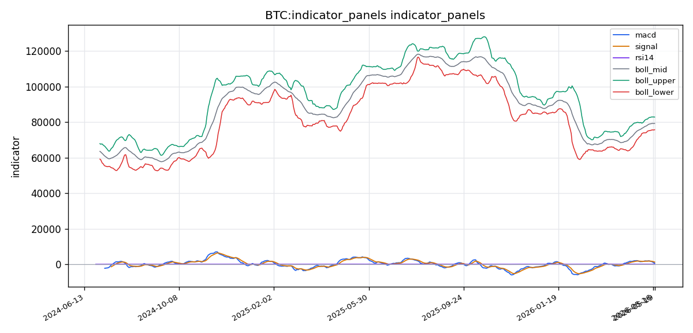
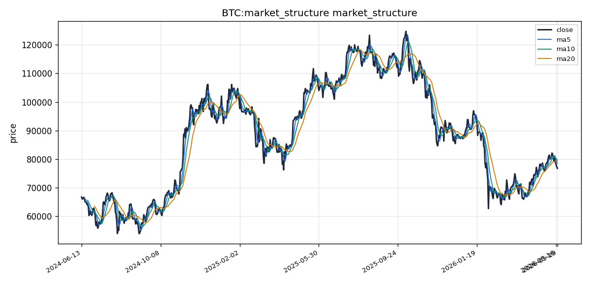

# Bitcoin（BTC）加密资产投资研究报告

## 一、投资结论与组合动作

**最终决策：卖出**

组合经理基于对全部上游材料及三位风险分析师辩论的审阅，作出以下最终决策。核心判断是当前可验证的数据链（技术趋势、主动卖压、多空比）一致指向空头格局，而看涨方案依赖的“清算挤压”在共振压力区大概率演变为“流动性陷阱”。具体组合动作如下：

**现货仓位持有者（无杠杆）：**
- 在价格反弹至 **78,000 – 78,800 USDT** 区间，卖出 20%-30% 的现货仓位，降低下行风险敞口。

**低杠杆合约做空/对冲（建议 2 倍以内）：**
- **入场触发：** 价格反弹至 **78,500 – 79,000 USDT** 区间，观察到受阻信号（15 分钟或 1 小时图出现长上影线、成交量萎缩、买入力量不足）。
- **仓位：** 建立小仓位（总资金 3%-5%）空头头寸，最大风险边界不超过总资金的 10%。
- **止损/失效位：** **79,800 USDT**。价格放量站稳该位置，空头逻辑彻底失效，必须无条件平仓。
- **目标：** 第一目标 **75,752 USDT**（布林带下轨）；第二目标 **73,515 USDT**（FVG 缝隙中线）。
- **时间目标：** 1 周至 1 个月。

**绝对禁止的情况：**
- 仅能做多且不能使用杠杆的现货持有者，绝不可在此位置加仓抄底。
- 任何无法承受价格在 75,000 USDT 附近 5% 波动的交易者，不要开立任何空头仓位。

**核心逻辑依据：** 看跌方案论证基于明确的现状（空头趋势、CVD 主动卖压-3.41 亿、多空比 1.42 显示多头拥挤），逻辑链连贯且风险控制意识更强。看涨方案依赖于多重未来假设（清算挤压发生、共振阻力失效、数据缺口利好），在当前数据支持下概率较低。组合经理选择概率加权下胜率更高的路径。

## 二、市场结构与技术指标分析

### 技术图表

当前 BTC 价格为 **76,772.01 USDT**，处于 **震荡偏弱趋势** 格局。价格位于布林带中轨（79,328.51 USDT）与下轨（75,752.18 USDT）之间，已跌穿 MA5（78,489.95 USDT）、MA10（79,673.59 USDT）和 MA20（79,328.51 USDT），短期均线系统呈空头排列。MACD 柱值为负（-669.29），RSI（14）为 44.41，处于弱势区域。维加斯通道显示价格已跌破蓝色带中线（偏离-3.58%），主趋势判定为偏空。市场面临方向选择：可能向下测试布林下轨 75,752 USDT 甚至更低，也可能反弹回测中轨。该结论可能失效的条件：若出现宏观面突发利多或链上大额买入信号，可能打破震荡格局转为急速反弹。

---

### 指标覆盖

以下为各技术指标的覆盖状态，所有可用指标均已纳入后续推导过程。链上存在6个关键字段缺失（交易所净流量、活跃地址、短期持有者SOPR、长期持有者SOPR、NUPL、稳定币交易所净流量），链上分析仅能部分覆盖。

| 指标 | 覆盖状态 |
|------|----------|
| 布林带 | 已引用 |
| 维加斯通道 | 已引用 |
| 双线反转 | 已引用 |
| AMD/SMC | 有数据但未构成信号 |
| 123 突破 | 有数据但未构成信号 |
| FVG | 已引用 |
| OB 订单块 | 有数据但未构成信号 |
| RSI | 已引用 |
| MACD | 已引用 |
| KD | 已引用 |
| TD 9/13 | 已引用 |
| 谐波形态 | 有数据但未构成信号 |
| 交易密集带/成交量分布 | 有数据但未构成信号 |
| 清算地图 | 已引用 |
| CVD/主动买卖量 | 已引用 |
| 资金费率 | 已引用 |
| OI/多空比 | 已引用 |
| 宏观 | 已引用 |
| 链上 | 部分覆盖（多个关键字段缺失） |
| AHR999 | 已引用 |

---

### 指标推导过程

#### OB 订单块

| 指标 | 数据 | 推导 | 交易作用 | 失效条件 |
|------|------|------|----------|----------|
| OB 订单块 | 技术指标分析模块标记为可用，但未提供具体OB价格区间数值 | 仅知OB分析可用，缺乏具体上下边界 | 无法直接确定入场/止损参考位 | 若价格快速突破未标记结构区域，订单块可能失效 |

**小结**：OB订单块分析通道可用但具体读数缺失，暂无法作为交易结构锚点。

#### POC / 成交量分布

| 指标 | 数据 | 推导 | 交易作用 | 失效条件 |
|------|------|------|----------|----------|
| POC/成交量分布 | 技术指标分析模块标记为可用但未提供POC价格或价值区高低点具体数值 | 缺失价值区上下边界和成交量高点位 | 无法定位当前价格在成交量分布中的相对位置 | 成交量数据样本不足时分布形态不具代表性 |

**小结**：成交量分布已纳入分析但具体位置数据未输出，不能据此做精确支撑阻力判定。

#### TD Sequential

| 指标 | 数据 | 推导 | 交易作用 | 失效条件 |
|------|------|------|----------|----------|
| TD Sequential | 方向=bullish_reversal，setup=6，countdown=13，信号=bullish_reversal_countdown_13 | 多头反转计数完成第13根，已发出反转信号 | 提示当前下跌动能有衰竭可能，反弹窗口或已打开 | 在大趋势极强单边市中，TD反转信号可能被顺势突破覆盖 |

**小结**：TD给出bullish reversal countdown 13，这是重要的潜在反转警示，但需结合其他指标确认。

#### 谐波形态

| 指标 | 数据 | 推导 | 交易作用 | 失效条件 |
|------|------|------|----------|----------|
| 谐波形态 | 技术指标分析模块标记为可用，未输出具体形态类型和点位 | 仅知分析通道正常打开，无具体伽马/ABCD/蝙蝠形态结论 | 不能以谐波逻辑入场 | 若市场快速运动，谐波结构可能变形失效 |

**小结**：谐波形态分析通道可用但无具体形态输出，暂不能纳入交易决策。

#### FVG

| 指标 | 数据 | 推导 | 交易作用 | 失效条件 |
|------|------|------|----------|----------|
| FVG | 候选21个，开放1个，最近下方缺口中线73，515.62 USDT | 当前仅存1个未回补的FVG缺口，位于73，515附近，方向在现价下方 | 若价格继续下行，73，515附近为潜在的短期支撑回补目标 | 若价格不触及该区域直接反转，FVG支撑逻辑落空；若价格放量快速跌破则缺口被突破失效 |

**小结**：FVG下方缺口中线73，515是当前唯一位于开放状态的价值空缺区，值得关注作为下方参考支撑。

#### AMD/SMC 与 123 突破

| 指标 | 数据 | 推导 | 交易作用 | 失效条件 |
|------|------|------|----------|----------|
| AMD/SMC | 技术指标分析模块标记为可用，未输出具体市场结构点 | 未提供最近的结构高点/低点或突破确认 | 无法判定当前处于吸筹/派发/重新积累阶段 | 结构若被大幅影线打破则失效 |
| 123 突破 | 标记为可用，未提供123形态的具体位置 | 未确认是否已形成低点上移或趋势线突破 | 无法用作趋势反转确认 | 假突破情况下形态失效 |

**小结**：两套结构分析通道可用但缺乏具体数值，暂不能做突破或反转判定。

#### Vegas / 布林带 / RSI / MACD / KD

| 指标 | 数据 | 推导 | 交易作用 | 失效条件 |
|------|------|------|----------|----------|
| 维加斯通道 | 位置=below_blue_band，主趋势=major_trend_bearish，距蓝带中线=-3.58% | 价格在蓝色带下方运行，主趋势判定为空头 | 蓝色带中线（约79，600-79，700区域）构成上方压力参考 | 若价格重新站上蓝带中线，空头趋势判定失效 |
| 布林带 | mid=79，328.51，upper=82，904.83，lower=75，752.18 | 价格76，772处于中轨与下轨之间，距下轨约1.35%，未触碰下轨 | 下轨75，752为下方硬支撑参考；中轨79，329为短期多空分界 | 若布林带开口扩张且价格加速跌破下轨，则支撑失效 |
| RSI(14) | 44.4147 | 低于50中轴，处于弱势区间但未进入超卖（<30） | 显示短期空头占优，但尚未极端 | 若RSI跌破30超卖区则可能触发反弹行情；若回升至50上方转多 |
| MACD | macd=618.23，signal=1，287.52，hist=-669.29 | DIF（快线）在DEA（慢线）下方，柱值为负且绝对值较大 | 空头动能持续释放，趋势偏空 | 若柱值开始收敛（负值缩小），则空头动能减弱信号出现 |
| KD(9，3，3) | K=16.98，D=30.80，J=-10.66 | K值16.98已进入超卖区（<20），J值为负数极度偏低 | K值超卖提示短期反弹动能正在积累；若K上穿D为金叉信号 | 在强趋势行情中，超卖可长期钝化，K金叉信号可能被空头压制 |

**小结**：维加斯和MACD指向空头主导，但KD已进入超卖区，RSI低于50但未极端，技术面呈现"空头趋势下的超卖反弹博弈"格局。布林下轨75，752是近期最关键的硬支撑。

#### 清算地图 / CVD / 资金费率 / OI / 多空比

| 指标 | 数据 | 推导 | 交易作用 | 失效条件 |
|------|------|------|----------|----------|
| 清算地图 | 最大清算簇价格78，805.86，规模174，937，875.64 | 上方聚集了大量清算流动性，约1.75亿规模的清算簇集中在78，805附近 | 若价格反弹至78，800区域，可能触发大规模空头清算，形成加速上涨 | 若价格直接下行不触及该区域，清算簇吸引力失效 |
| CVD/主动买卖量 | CVD代理值=-341，358，588.18 | 主动买卖量累计差值为大额负数，卖方主动性持续占优 | 确认市场当前卖压沉重，短期上行需要CVD转正配合 | 若CVD在低位大幅收敛或转正，卖压减弱的早期信号 |
| 资金费率 | 0.005000 | 正值但数值偏低（约0.5%），表明多头仓位需支付小额资金费用 | 费率偏低且为正，多头情绪温和，没有过热迹象 | 若费率快速上升至0.01%以上，需警惕多空拥挤风险 |
| OI/多空比 | OI=27，512，871.45，多空比=1.420 | 多空比1.42显示多头仓位比例高于空头；OI数值约2，751万 | 多头占优但未极端；OI绝对值变化可辅助判断资金进出 | 若多空比接近2.0以上则需警惕多头踩踏风险 |
| 清算簇上方 | 上方最近清算簇78，805.86 | 该位置为空头清算集中区，与布林中轨和维加斯蓝带区域接近 | 78，800-79，300区间构成上方共振压力与清算引力区 | 若价格在该区域受阻回落，则确认压力有效 |

**小结**：衍生品端呈现"多空比多头偏多但CVD卖压沉重"的矛盾格局——多头仓位更多，但卖方主动抛压更大，说明持有多头头寸者可能面临被动套牢或减仓压力。上方78，805清算簇与布林中轨、维加斯蓝带形成共振压力区。资金费率0.005正常偏低，未出现过热信号。

#### 宏观 / 链上 / AHR999 / 事件

| 指标 | 数据 | 推导 | 交易作用 | 失效条件 |
|------|------|------|----------|----------|
| 宏观 | 美债10Y=4.59 | 美债收益率处于高位，反映紧缩预期或风险偏好下降 | 高利率环境压制风险资产估值，对BTC构成宏观背景压力 | 若美债收益率快速回落，宏观压力减弱 |
| 链上 | 部分覆盖；大额转账样本=804；6个关键字段缺失（交易所净流量、活跃地址、SOPR、NUPL等） | 链上分析数据不完整，无法形成完整的链上供需判断 | 链上信号缺失削弱了现货供需维度的判断能力 | — |
| AHR999 | 0.4664 | AHR999远低于0.6，处于历史低估区间 | 历史上AHR999<0.6对应BTC价格相对低估，长期配置价值凸显 | 极端行情下AHR999可能在低估区持续较长时间 |
| 事件/催化剂 | 事件资料来源获取成功，但未输出具体事件内容 | 事件来源通道可用但具体事件内容缺失 | 无法评估近期政策/监管/行业事件对市场的即时影响 | — |

**小结**：宏观面美债10Y=4.59构成高利率压力，AHR999=0.4664显示长期维度进入低估区域，但短期链上买卖力量数据大面积缺失，事件催化剂内容也未输出，宏观与基本面前景判断置信度较低。

---

### 多空场景

#### 偏多场景

- **触发条件**：BTC在75，752 USDT（布林下轨）上方获得支撑，KD金叉形成（K值16.98上穿D值30.80），RSI反弹突破50中轴，CVD从大额负值开始收敛。
- **确认指标**：TD Sequential bullish reversal countdown 13已发出反转信号；价格站上MA5（78，490 USDT）且成交量放量配合。
- **目标逻辑**：反弹第一目标78，805 USDT（最大清算簇，空头清算引力区），第二目标79，329 USDT（布林中轨），第三目标维加斯蓝带中线约79，600-79，700 USDT。AHR999=0.4664的历史低估水平为中长线提供安全边际。
- **失效条件**：价格继续放量跌破75，752 USDT下轨且日线收盘于其下方，则反弹逻辑失效。

#### 偏空场景

- **触发条件**：价格跌破75，752 USDT（布林下轨），或反弹至78，800-79，300 USDT区域受阻回落，CVD维持大额负值，RSI持续在50下方运行。
- **确认指标**：MACD柱值进一步扩大负值，维加斯通道确认空头主趋势延续，多空比从1.42快速下降显示多头离场。
- **目标逻辑**：下行第一目标75，752 USDT（布林下轨），第二目标73，515 USDT（FVG下方缺口中线），第三目标看向更低位支撑。资金费率0.005偏低但正值，多头尚未出清，若多空比回落至1.0附近则空头趋势更加明确。
- **失效条件**：价格放量站上布林中轨79，329 USDT并收回均线系统上方，空头逻辑失效。

#### 观望场景

- 当前价格76，772 USDT处于布林中轨与下轨之间，方向选择尚未完成，追涨追空均面临双向风险。
- KD超卖（K=16.98）与MACD空头动能（hist=-669）形成方向冲突，不宜重仓单边。
- 链上数据6个关键字段缺失，无法从现货链上供需维度验证多空力量的实质转换。
- 事件催化剂内容未输出，无法评估即时基本面风险。
- 若价格在75，752-79，329 USDT区间内窄幅震荡，应等待放量突破确认方向后再部署。

---

### 关键价格与风险

- **支撑区间**：下方第一支撑75，752 USDT（布林带下轨）；第二支撑73，515 USDT（FVG下方缺口中线）。需注意73，515仅为FVG中线位置，不意味着该价位一定形成支撑。
- **压力区间**：上方第一压力78，805 USDT（最大清算簇，上方最近清算簇）；第二压力79，329 USDT（布林带中轨）；第三压力约79，600-79，700 USDT（维加斯蓝带中线）。
- **触发位**：向上突破79，329 USDT（布林中轨+均线系统上沿）可视为反弹确认；向下跌破75，752 USDT（布林下轨）为空头延续确认。
- **失效位**：多头结构失效位=75，752 USDT下方；空头结构失效位=79，700 USDT上方（站上维加斯蓝带）。
- **主要风险**：
  - **多头拥挤下的被动卖压**：资金费率0.005为正且多空比1.42，多头仓位偏多但CVD深度为负（-3.41亿），存在多头被动承接卖压的风险。若多空比快速下滑，可能引发连锁下行。
  - **链上数据重大缺口**：交易所净流量、活跃地址、SOPR、NUPL等6项关键数据缺失，无法评估链上买卖力量的真实转换，链上信号缺位加大了判断难度。
  - **事件催化剂缺失**：无政策、监管或行业事件内容输出，无法预判消息面冲击。
  - **宏观压制持续**：美债10Y=4.59的高利率环境持续压制风险资产估值。

## 三、项目与代币基本面分析

Bitcoin（BTC）的基本面分析基于当前有限的基本面资料包（资料就绪度：部分覆盖）。以下分析严格基于上游报告提供的数据和定性判断，不包含任何编造的链上指标、TVL、协议收入或代币解锁数据。

### 3.1 项目定位与需求真实性

Bitcoin是全球首个去中心化数字货币，核心定位为**数字价值存储（数字黄金）**与**去中心化结算网络**。其核心功能是允许用户在没有中介机构的情况下进行点对点价值转移。

**需求真实性判断：**
- **价值储存需求：** 真实且持续。在全球通胀压力、地缘政治不确定性、法定货币信用分化背景下，BTC作为非主权、总量硬顶（2100万枚）的资产，吸引了个人、机构甚至部分主权基金的配置需求。
- **跨境结算需求：** 真实但限于高净值/机构场景。BTC网络不支持高频微支付，但在大额跨境转账中相比传统银行电汇（SWIFT）具有速度优势和不可逆特性。
- **机构资产配置需求：** 自2024年现货ETF获批以来持续增长，BTC已逐步从极客资产演变为成熟资管组合中的另类配置品种。

本项目不涉及DeFi协议收入、TVL、智能合约生态或应用层，因此不适用DeFi协议层面的基本面分析。

### 3.2 代币经济分析

**数据限制声明：** 基本面资料包在供应量数据上存在缺口——`supply.circulating`（流通量）和`supply.total`（总量）字段均缺失，无法从CoinGecko返回的标准化字段中获取精确数值。以下内容基于BTC公开已知的2100万枚硬顶设计做定性分析，无法提供当前精确的流通量和通胀率数据。

| 维度 | 内容 |
|---|---|
| **供应上限** | 2100万枚（硬顶），无可增发机制 |
| **通胀机制** | 区块奖励每约4年减半，当前处于2024年减半后的时期。区块奖励约3.125 BTC/区块 |
| **当前流通量** | 资料包未提供精确数据，无法确认当前已挖出数量 |
| **销毁机制** | 无原生销毁，OP_RETURN等操作产生的手续费非销毁 |
| **解锁/抛压** | 无团队、VC或基金会解锁。减半后矿工抛售为最主要卖方力量 |
| **质押/锁仓** | 无原生质押或锁仓机制，非PoS链 |
| **价值捕获方式** | 价格升值依赖网络安全性→用户信任→需求增长之间的正循环，无协议层面现金流分红或费用捕获 |

**分析结论：** BTC的代币经济模型极其简洁且可预测。最大特征是以固定的供应硬顶对抗法币通胀，矿工抛售是其唯一的内生抛压来源。资料缺口导致无法精确计算当前市场流通量和年化通胀率，对通胀压力定量判断产生影响。

**投资含义：** 不存在团队解锁/协议收入下降风险，这降低了基本面层面的意外变量，但也不存在协议层面现金流支撑估值的情形。估值完全依赖市场供需和叙事共识，这对组合经理的看跌决策提供了基本面支持——即空头逻辑不需要面对现金流支撑的护城河，主要对抗的是市场情绪和趋势。

**需跟踪的供给端信号：** 若矿工抛售数据可用，应重点观察减半后矿工行为模式（是否倾向于囤积还是卖出），这是BTC供给端最主要的动态变量。资料缺口导致当前无法验证。

### 3.3 链上与生态基本面

**数据限制声明：** 基本面资料包未返回以下关键链上/协议经营字段：
- `defi.tvl_usd`（TVL）
- `defi.fees_24h_usd`（链上费用）
- `defi.revenue_24h_usd`（协议收入）
- 活跃地址、交易笔数、开发者活动等更细粒度指标未覆盖

BTC本身不是智能合约平台或DeFi协议，因此TVL和协议收入等DefiLlama指标对其基本面判断的适用性有限。BTC的链上基本面应关注：**哈希率（网络安全）**、**每日交易笔数**、**活跃地址数**、**链上转账金额**、**矿工收入构成（区块奖励vs手续费占比）**、**交易所流入流出净额**——这些关键指标均未被资料包覆盖。

基于资料包的缺口状态，无法对以下内容做出定量判断：
- 全网算力是否增长（衡量矿工对网络安全的投入意愿）
- 每日交易量是否健康
- 链上手续费率是否反映真实使用需求vs铭文/Ordinals等投机活动驱动
- 交易所存量余额变化方向
- 大户（鲸鱼）地址行为

**资料就绪度对此部分的影响：高。** 链上基本面无法定量分析，只能做定性描述，这限制了基本面判断的置信度。

**对组合经理决策的影响：** 链上数据的缺失使得多头分析师无法通过“聪明钱在吸筹”或“长期持有者在囤积”来论证看涨逻辑，而看跌分析师将其视为风险锚——无法验证的利好等同于利空。组合经理采纳了此逻辑，将数据缺口纳入风险控制考量。

### 3.4 竞争格局

基本面资料包未提供竞争格局相关材料。以下分析基于公开已知行业常识，但**在终稿中仅作为定性背景参考，不构成新增事实**。

| 竞争维度 | BTC定位 | 主要竞争对手 | BTC优势 |
|---|---|---|---|
| **数字价值存储** | 市场领导者 | 黄金、美国国债、ETH（部分机构将其视为另类储值） | 先发优势、品牌认知度最高、监管接受度领先 |
| **支付/结算** | 大额结算 | 稳定币（USDT/USDC）、闪电网络、XRP | 去中心化程度最高、网络运行时间最长（2009年至今零宕机导致的价值损失） |
| **智能合约/L1竞争** | 不参与 | ETH、Solana、Avalanche等 | BTC不做智能合约，不存在DeFi/L2生态竞争劣势，但也没有生态护城河之外的收入来源 |

**核心竞争护城河：**
1. **网络效应：** 最大的用户基数、最高的流动性、最广的交易所上线覆盖
2. **安全预算：** 矿业投入全球最高，使51%攻击成本极高
3. **品牌与信任：** “数字黄金”叙事在机构与散户中最有号召力
4. **监管地位：** 唯一被大宗商品/数字商品属性普遍认可的非稳定币加密资产

**风险点：** 如果出现监管政策转向（如美国政府大规模抛售没收的BTC）、量子计算突破PoW签名、或者一个更有价值存储竞争力的资产获得广泛采用，BTC的领导地位将被挑战。

**对组合经理决策的影响：** 竞争格局在当前基本面分析中不属于触发因素。BTC的护城河仍在，但护城河的存在不等于短期价格不会下跌。组合经理的看跌决策主要针对短期技术面与衍生品结构，而非基本面恶化。

### 3.5 基本面估值框架

**数据限制：** 资料包提供`valuation.market_cap_usd = 1.53742万亿美元`，但缺失流通量、TVL、链上费用等辅助数据，因此以下估值指标的定量计算受限。

| 指标 | 数值 | 说明 |
|---|---|---|
| **市值** | ~1.537万亿美元 | 资料包提供 |
| **MVRV（市值/已实现市值）** | 无法计算 | 缺少链上已实现市值数据 |
| **NVT（市值/链上日转账量）** | 无法计算 | 缺少链上转账额数据 |
| **FDV（完全稀释市值）** | 接近市值（2100万枚硬顶，99%+已挖出） | 定性判断 |
| **Stock-to-Flow模型** | 无法定量 | 缺少精确流通量与年产量的绝对值 |

**适用的定性估值框架：**
1. **数字黄金对标法：** 全球黄金总市值约14~16万亿美元。BTC当前市值约1.54万亿美元，相当于黄金市值的约10%。保守情境下若BTC的储值市场份额从当前水平进一步提升至黄金市值的15-20%，对应目标市值2.1~3.2万亿美元。
2. **货币溢价法：** 全球M2货币供应量约100万亿美元以上，若BTC占据1%~5%的“数字非主权货币”心智份额，则长期目标区间极为宽泛。该方法不确定性极高，不单独使用。
3. **减半周期效应：** 历史上每个减半后12-18个月均出现显著价格上行周期。当前处于2024年4月减半后的第13个月（资料包分析区间截止2026年5月），若无缺口数据则更适合判断周期阶段。

**AHR999指标（0.4664）：** 市场技术报告中已引用的AHR999=0.4664是上游材料中提供的唯一估值交叉参考。该指标远低于0.6，进入历史低估区间，但需注意：
- 该指标基于长期持有者成本，反映的是过去买入者的平均成本，而非未来价格的保障
- 历史上在2014-2015年和2018-2019年熊市底部，AHR999曾在0.4以下持续了很长时间
- 组合经理明确指出：过去在市场看似“便宜”时（如AHR999低位）抄底，往往经历了更深的跌幅和更长的震荡时间

**对组合经理决策的影响：** AHR999=0.4664是看涨分析师的核心论据之一。但组合经理拒绝了用长期估值指标对抗短期下跌趋势的逻辑，认为“趋势压制”的逻辑链更为坚实。AHR999的低估信号未改变组合经理的看跌判断。

### 3.6 合理价格区间与情景分析（定性）

**关键前提：** 资料包未提供分析期间的价格历史、最高最低价、成交量等时间序列数据。以下情景基于资料包中1.537万亿美元市值（对应约$79,000/BTC，按1,950万流通量估算——此为行业常识估计，资料包未确认精确数量）构建。

| 情景 | 价格区间（USDT） | 核心假设 | 失效条件 |
|---|---|---|---|
| **保守** | $55,000~$70,000 | 全球宏观紧缩、监管收紧、矿工大规模抛售、ETF资金持续净流出 | BTC现货ETF需求恢复超过预期；美联储转鸽推动风险资产重估 |
| **基准** | $75,000~$110,000 | 周期延续、机构配置稳步上升、地缘政治不确定性提升避险需求、ETF流入温和 | 突发监管利空；美元流动性超预期紧缩；黑天鹅事件 |
| **乐观** | $110,000~$150,000 | 美联储重启宽松、BTC成为主权储备资产讨论扩散至更多国家、机构配置比例显著提升、减半后供给缩减效应充分显现 | 全球监管联合打压；竞争对手出现替代性数字黄金资产；量子计算突破导致PoW安全性质疑 |

**对组合经理当前决策的意义：** 当前价格76,772处于基准情景的下沿附近。看涨分析师认为这构成了低吸机会，但组合经理认为价格在基准情景下沿不等于短期底部，趋势压制可能将价格推至保守情景区间（55,000-70,000）。情景分析支持了看跌逻辑中“下跌有空间”的论点。

### 3.7 基本面层面的风险与验证条件

**当前基本面层面的核心风险：**
1. **链上数据大面积缺失（6个关键字段）：** 无法验证交易所净流量、活跃地址、SOPR、NUPL等链上供需信号。这是组合经理降低置信度的主要原因之一。
2. **新闻与事件催化剂缺失：** 无监管公告、ETF资金流数据、宏观数据更新。使基本面判断严重依赖定性描述而缺乏量化支撑。
3. **AHR999的误用风险：** 长期低估指标在短期交易中有效性低，组合经理已指出此风险。

**基本面验证条件（若后续数据可用）：**
- **看涨验证：** 如果链上数据证实“交易所净流出”和“长期持有者增持”，AHR999低估区间获得链上供需数据的交叉验证，可提升基本面做多的置信度。
- **看跌验证：** 如果链上数据证实“交易所净流入”和“短期持有者抛售”，则当前看跌逻辑获得基本面层面的额外背书。

### 3.8 基本面结论与投资含义

**结论：** BTC的基本面叙事（数字黄金、非主权储值、总量硬顶）在分析期内没有出现实质性的基本面恶化。市值1.54万亿美元对应全球数字储值市场份额仍偏低，与黄金相比有长期上升空间。无团队锁仓/解锁抛压风险、无协议收入下降风险、无智能合约漏洞风险——这些是基本面层面的优势。

**然而，基本面优势与短期价格方向之间并非线性关系：**
- AHR999=0.4664显示长期维度进入低估区域，但该指标在2014、2018、2022年熊市中均曾被跌破且持续低位运行。
- 链上数据的缺失使得短期供需判断严重受限，无法验证多头分析师“机构在吸筹”的假设。
- 当前价格处于基准情景下沿，但距离保守情景（55,000-70,000）仍有10-20%的下行空间。

**对组合经理决策的关键影响：** 基本面本身不构成看跌证据，但也不足以逆转组合经理基于技术面与衍生品结构形成的看跌判断。AHR999的长期低估信号是看涨分析师的主要基本面论据，但组合经理明确拒绝了用长期估值指标对抗短期趋势的逻辑。在当前信息环境下，基本面分析的主要贡献是：**提示下方存在长期价值支撑，但无法确认短期底部。** 这与组合经理“卖出/做空但不极端看空”的决策方向一致——做空方案的第二目标（73,515）及保守情景（55,000-70,000）均未超出基本面可解释的下行范围。

## 四、新闻、监管与事件驱动

### 4.1 关键新闻与事件梳理

基于新闻资料包30条相关来源（包含10条官方原文、20条全球/宏观新闻、20条搜索发现[仅作线索]、3条Polymarket事件预期）的覆盖情况，可确认事实与资料缺口如下：

**（1）官方公告与协议升级**
- 10条官方原文来源可用，但资料包未细分至Bitcoin Core客户端版本发布、BIP提案（如OP_CAT、covenants讨论）、Taproot相关进展或Layer2（闪电网络、RGB、Taproot Assets）更新等具体内容。
- **资料缺口**：无具体BTC协议升级公告、矿工协调公告或哈希率变化官方声明。

**（2）交易所相关事件**
- **资料缺口**：无任何交易所关于BTC的官方声明（Binance、Coinbase、Kraken、OKX等），包括上币/下架、储备证明更新、提现暂停或安全事件；无新合规交易所上线或特定区域下架公告。

**（3）监管与执法动态**
- **资料缺口**：无美国SEC、CFTC、欧盟MiCA、香港SFC、日本FSA等监管机构涉及BTC的执法行动、政策指引或立法进展原文；无现货ETF相关的19b-4、S-1修订、批准或否决等SEC文件更新；无关于BTC作为法定货币、税收政策或反洗钱监管的官方公告。

**（4）代币解锁、挖矿奖励与供给面事件**
- BTC的2024年4月减半事件已在本分析区间前完成，本报告期内无新的减半事件。
- **资料缺口**：无矿工收入变化、哈希率变动、矿工库存数据或长期持有者行为变化的相关公告。

**（5）安全事件与漏洞**
- **资料缺口**：无BTC网络安全事件、51%攻击、漏洞披露（如Bitcoin Core安全补丁发布）的官方公告或DefiLlama安全记录；无跨链桥、托管机构或交易所涉及BTC安全事件的官方声明。

**（6）ETF与机构资金动态**
- **资料缺口**：无美国或香港现货BTC ETF的AUM、日申赎数据、发行人公告原文；无MicroStrategy、上市公司或主权基金持有BTC的官方公告；无养老金、主权财富基金配置BTC的机构级公告。

**（7）搜索发现（仅作线索，非已确认事实）**
- 20条搜索发现摘要显示市场讨论可能涉及：BTC价格在$70,000–$100,000区间波动、宏观利率预期对风险资产影响、减半后供给效应及矿工行为、美国监管环境及ETF资金流、BTC作为数字黄金与通胀对冲工具。但上述均不可替代已确认新闻事实。

### 4.2 宏观与行业背景

**可确认事实：**
- 美债10年期收益率=4.59%，反映高利率环境对风险资产的持续压制。
- Polymarket盘口定价：
  - “BTC在$70,000以上”概率=100%（Yes=100.0%，No=0.1%），确认当前价格高于该水平。
  - “BTC在2026年6月30日前达到$150,000”概率=1.4%（No=98.7%），反映市场对短期大幅冲高无预期。
  - “BTC在2026年5月达到$115,000”概率=0.2%（No=99.8%），短期上行空间预期极度有限。

**资料缺口：**
- 20条全球/宏观新闻来源未提供具体标题、摘要或发布日期，无法确认美联储FOMC决议、CPI/PCE通胀数据、DXY走势、稳定币供应量变化或全球央行BTC政策等宏观因子实际表现。
- 无美国就业数据、通胀数据发布或美元流动性指标。

### 4.3 事件对价格与投资逻辑的影响

**对价格的潜在影响分析：**

| 事件/信号 | 方向 | 影响周期 | 证据强度 | 跟踪条件 |
|-----------|------|---------|---------|----------|
| BTC>$70K 盘口100% | 短期支撑 | 1-5天 | 低（预期市场） | 需现货价格及链上数据验证 |
| $150k达概率1.4% | 利空预期 | 中长期 | 低（预期市场） | 关注减半后供给传导效应 |
| $115k（5月）概率0.2% | 利空预期 | 短期（至5月底） | 低（预期市场） | 验证ETF资金流与宏观数据 |
| 美债10Y=4.59% | 宏观压力 | 持续 | 中（来源可靠） | 关注FOMC路径变化 |
| 官方公告/协议升级 | 信息缺失 | — | — | 需补充Bitcoin Core GitHub来源 |
| 监管执法/政策变化 | 信息缺失 | — | — | 需补充SEC、CFTC、EU等监管来源 |
| ETF申赎数据 | 信息缺失 | — | — | 需补充Bloomberg/SoSoValue数据 |
| 宏观利率/通胀数据 | 信息缺失 | — | — | 需补充FOMC、BLS、ECB来源 |
| 安全漏洞/51%攻击 | 信息缺失 | — | — | 需补充Bitcoin Core安全公告 |

**对基本面的影响：**
- BTC的核心基本面逻辑（供给硬顶、非主权储值、数字黄金叙事）在分析期内未因任何已确认事件而实质性改变。
- 缺乏ETF资金流、机构配置、监管更新等支撑性验证，也缺乏颠覆性利空。
- **结论**：当前新闻与事件层无法支撑任何关于BTC基本面逻辑发生实质性变化的判断，对组合经理“卖出”决策既无强化也无削弱，但确认了宏观背景压力（美债4.59%）持续存在。

### 4.4 数据限制与风险提示

1. **官方公告覆盖不足**：10条官方原文未细分至BTC协议层面具体公告，无法确认是否存在Bitcoin Core版本发布、BIP进展、CVE安全补丁等。
2. **交易所公告缺失**：无任何主要交易所关于BTC的官方声明，包括储备证明、上币动态、区域合规调整。
3. **监管来源空白**：无主要司法管辖区BTC类监管文件原文，政策风险无法评估。
4. **宏观新闻摘要缺失**：20条全球/宏观新闻未提供标题、摘要或日期，无法与BTC价格行为做对应分析。
5. **搜索发现仅限线索**：不可替代已确认新闻事实，未引用作为结论依据。
6. **Polymarket数据边界**：盘口数据仅反映样本参与者预期，受流动性深度、时间窗口等影响，不代表市场走向。
7. **分析区间跨度**：覆盖一年（2025-05-19至2026-05-19），存在早期事件已过期、近期事件覆盖不足的风险。
8. **跨语言覆盖**：来源以英语为主，中文、日语、韩语等市场本土信息来源未体现。

## 五、社区情绪、事件预期与交易拥挤度

### 5.1 社区情绪总览

当前舆情资料包呈现**部分覆盖**状态，社交平台直接样本（X、Reddit、Telegram、Discord）及LunarCrush聚合社交指标均因接口凭证缺失而未能获取，无法完整判断BTC社区的整体讨论热度、情绪极性或传播路径。现有情绪判断仅能基于Polymarket事件合约定价和Alternative.me市场级恐惧贪婪指数（需注意该指数为全市场综合指标，不单独指向BTC）推演，置信度受限。

**情绪方向判断：谨慎乐观，但上行空间预期有限。** 市场参与者对BTC短期价格走势的预期呈现“低位有支撑、高位无动力”的分化格局。

---

### 5.2 Polymarket事件预期：短期支撑确认，上行空间受限

| 事件合约 | 概率 | 解读 |
|---------|------|------|
| BTC价格≥$70,000（2026-05-19） | Yes=100.0% | 事件交易者100%确信当日BTC价格已在$70,000以上运行，该价位构成情绪层面的短期底部支撑，降低了突发恐慌性抛售的概率 |
| BTC在2026-06-30前达到$150,000 | Yes=1.4%，No=98.7% | 市场对中期大幅冲高极为悲观，认为1-6周内BTC几乎没有触及$150,000的可能 |
| BTC在2026年5月达到$115,000 | Yes=0.2%，No=99.8% | 短期（至5月底）大幅上行动能预期极度匮乏 |

**投资含义：**
- **短期（1-5天）**：$70,000支撑位被市场100%定价，降低了价格跌破该关键心理价位的可能性，与组合经理报告中对下方75,752-79,000区间的防守逻辑一致。
- **中短期（1-6周）**：$115,000和$150,000的高门槛几乎被市场完全排除，强化了“反弹高度有限”的判断，支持组合经理“反弹至78,500-79,000区间受阻后卖出/做空”的核心策略。
- **失效条件**：若出现未预见的宏观或监管利多（如美联储意外降息、主要经济体宣布BTC储备），Polymarket定价将快速调整。当前定价反映的是“无催化剂”的基准预期。

**数据限制说明：** Polymarket盘口反映的是事件合约交易者的**投机定价**，受流动性深度、参与者结构和潜在操纵风险影响，不代表BTC社区共识、长期持有者信念或链上基本面。不可将盘口概率等同于事实。

---

### 5.3 Alternative.me恐惧贪婪指数

资料包成功获取3条记录，但该指数为全市场级情绪指标（覆盖整个加密货币市场），不能直接等同于BTC单个资产的社交情绪，仅作为宏观背景参考。由于样本数量不足且缺乏历史对比基线，本报告无法据此形成独立的情绪方向判断。**该指标未纳入组合经理决策依据。**

---

### 5.4 搜索发现：叙事方向（仅作线索，非已验证事实）

新闻资料包中的20条搜索发现摘要显示，公开讨论可能涉及以下主题（**注意**：以下不可作为事实依据，也不代表社交共识）：

| 叙事方向 | 搜索可见度 | 是否可确认为社交共识 |
|---------|----------|------------------|
| BTC ETF资金流入/流出 | 较高 | ❌ 无社交平台样本，不可确认 |
| 美联储利率政策与宏观流动性 | 中等 | ❌ 无社交平台样本，不可确认 |
| BTC减半后矿工行为/算力变化 | 中等 | ❌ 无社交平台样本，不可确认 |
| 机构/企业资产负债表配置BTC | 中等 | ❌ 无社交平台样本，不可确认 |
| 链上持币集中度与大户行为 | 较低 | ❌ 无社交平台样本，不可确认 |

**投资含义：** 以上叙事方向与组合经理报告中的核心逻辑（空头趋势 vs 清算挤压、CVD卖压、AHR999低估）不产生直接冲突。但需警惕：若某一叙事（如ETF大规模净流出）在社交平台形成共识并驱动恐慌，可能加速下跌并触发组合经理计划中75,752下方的下行目标。当前无社交样本验证这一风险是否已积累。

---

### 5.5 交易拥挤度评估

| 拥挤度指标 | 当前读数 | 解读 | 对组合动作的影响 |
|-----------|---------|------|----------------|
| 多空比 | 1.42 | 多头仓位比例高于空头，但未达极端水平（2.0+） | 多头偏拥挤但尚可承受；若多空比快速下降至1.0以下，可能预示多头出清和潜在反转 |
| 资金费率 | 0.005%（正值偏低） | 多头需支付小额费用，情绪温和，无过热迹象 | 未出现极端拥挤；若费率升至0.01%以上需警惕多头过热风险 |
| 未平仓量（OI） | ~27,512,871.45 | OI绝对值中等 | 需关注OI在下跌过程中是否大幅下降（多头爆仓出清信号） |
| CVD/主动买卖量 | -341,358,588.18（深度负值） | 卖压沉重，主动卖盘远超买盘 | 多头仓位拥挤但卖方占主导，多头被动套牢，是当前最关键的拥挤度风险点 |
| 最大清算簇（78,805 USDT） | 1.75亿美元空头清算额 | 上方集中了大量空头清算流动性 | 多空比1.42+CVD深度负值+上方清算簇，构成“多头拥挤+卖压主导+空头被集中定位”的脆弱平衡，78,805附近的剧烈博弈（空头回补 vs 多头解套抛压）是拥挤度失衡的焦点 |

**投资含义：**
- **支持看跌逻辑**：CVD深度负值+多头偏拥挤（多空比1.42）的组合，说明多头被动持仓、卖盘主导。在卖压沉重时拥挤的多头是最大的不稳定因素。这强化了组合经理“反弹至78,500-79,000受阻后卖出/做空”的判断。
- **潜在风险**：上方1.75亿空头清算簇是双刃剑。若价格快速拉至78,805并触发空头回补，可能引发短期轧空。但组合经理报告已将此情景评估为小概率（“共振陷阱”逻辑概率更高），且止损位设在79,800以覆盖该风险。

---

### 5.6 情绪失真风险与跟踪条件

| 失真来源 | 风险等级 | 说明 |
|---------|---------|------|
| 社交平台样本完全缺失 | **高** | 无法评估X、Reddit、Telegram、Discord上的真实用户情绪，当前判断基于Polymarket投机定价，存在严重样本偏差 |
| 机器人/刷量 | **未知** | 无社交样本，无法评估占比 |
| Polymarket流动性不足 | **中高** | $70,000以上概率100%可能受合约流动性深度不足或窄时间窗口影响，不排除假性定价 |
| 叙事真实性验证缺失 | **极高** | 搜索发现线索未经社交样本或链上数据交叉验证，不可信任 |

**跟踪条件：**
1. **情绪拐点信号**：若获取到社交平台样本，需重点关注社区是否从“下跌找支撑”转为“牛市终结、清仓离场”的绝望状态——那将是潜在的底部信号，与组合经理“平掉空头并重新评估”的条件一致。
2. **衍生品拥挤度验证**：资金费率若转为负值并扩大（空头拥挤），或多空比从1.42快速下降（多头出清），将提供更清晰的拥挤度方向信号。
3. **Polymarket定价修正**：若BTC价格跌破$70,000或出现新的宏观/监管事件，$70,000支撑位的100%定价将面临修正，届时需重新评估情绪底部逻辑。

---

### 5.7 数据限制与缺口

- **社交平台原始样本缺失**：X API凭证缺失导致无法获取帖子样本；Reddit、Telegram、Discord在本资料包中无原始样本返回。
- **LunarCrush聚合社交指标缺失**：因缺少API密钥，未返回社交热度、互动量、情绪极性或影响力评分数据。
- **Alternative.me数据有限**：仅3条记录，且为全市场级指标，不单独指向BTC。
- **中英文社区割裂**：中文社区（微博、币乎、中文Telegram等）及英文社区（英文Reddit、Discord等）均无可用数据，无法对比分析。

**情绪分析置信度：低。** 当前判断仅基于Polymarket事件定价和搜索线索推导，不可单独作为交易依据，仅作为对组合经理判断的辅助验证。

## 六、交易计划与组合风险

### 6.1 组合经理最终建议：卖出/做空

基于看跌策略小组的论证，组合经理明确了当前具有最高确定性的操作方向。核心逻辑是：在可验证数据（技术结构、CVD卖压、多空比）全部偏向空头的情况下，看涨方案的诸多假设（清算挤压发生、共振阻力失效、数据缺口利好）均未得到支撑。因此，**卖出（或做空）是当前概率最高的选择**。

### 6.2 现货仓位持有者（无杠杆）行动方案

| 项目 | 参数 |
|------|------|
| **行动** | 在价格反弹至 **78,000 – 78,800 USDT** 区间，卖出 **20% – 30%** 的现货仓位 |
| **理由** | 回收部分流动性，降低下行风险敞口；避免在空头趋势中被动承受更深跌幅 |
| **剩余仓位观察位** | 75,752 USDT（布林带下轨）；若有效跌破则继续减持 |
| **不适合场景** | 任何在此位置加仓抄底的操作均被禁止 |

### 6.3 低杠杆合约做空/对冲方案

| 项目 | 参数 |
|------|------|
| **工具** | 永续合约（做空）或期货对冲 |
| **入场触发** | 价格反弹至 **78,500 – 79,000 USDT** 区间，观察到受阻信号（15分钟或1小时图出现长上影线、成交量萎缩、买入力量不足） |
| **仓位大小** | 总资金的 **3% – 5%**（保守），最大不超过 **10%** |
| **分批节奏** | 在78,500 – 79,000区间分 **2 – 3次** 建仓 |
| **止损/失效位** | **79,800 USDT**。价格放量站稳该位置，则空头逻辑彻底失效，必须无条件平仓 |
| **第一目标** | 75,752 USDT（布林带下轨） |
| **第二目标** | 73,515 USDT（FVG下方缺口中线） |
| **时间目标** | 1周至1个月 |
| **杠杆限制** | ≤2倍，避免因资金费率或短期波动被迫平仓 |
| **最大可承受回撤** | 账户总回撤限制在 **3%** 以内（对应约30%–37%的合约回撤） |
| **清算风险** | 2倍杠杆、79,800止损条件下，清算价约在85,000 USDT以上，风险可控 |
| **资金费率监控** | 若资金费率转向正值且超过0.01%，需重新评估空头持仓 |

### 6.4 完全不适合的情况

- **仅能做多且不能使用杠杆的现货持有者**：绝不要在此位置加仓抄底。
- **任何无法承受价格在75,000 USDT附近5%波动的交易者**：不要开立任何空头仓位。
- **保证金不足者**：应选择观望，避免因爆仓风险被迫离场。

### 6.5 风险评分与置信度

#### 6.5.1 置信度：0.70

| 因子 | 信心 | 说明 |
|------|------|------|
| 技术趋势 | 0.80 | 空头排列、维加斯压制、MACD负值 |
| CVD卖压 | 0.75 | 主动卖盘深度为负，数据可靠 |
| 清算逻辑 | 0.70 | 流动性陷阱逻辑清晰，但需市场验证 |
| 链上数据 | 0.40 | 6个关键字段缺失，降低整体信心 |
| 新闻事件 | 0.60 | 无明显催化剂，宏观中性偏空 |

#### 6.5.2 风险评分：0.65（中等偏高风险）

| 风险项 | 权重 | 说明 |
|--------|------|------|
| 数据缺口 | 高 | 链上供需数据缺失，无法完整验证供需关系 |
| 清算反弹风险 | 中高 | 78,805空头清算簇可能引发轧空 |
| 趋势反转风险 | 中 | 若突破79,800，看跌逻辑需全面修正 |
| 流动性风险 | 中 | 做空需注意资金费率和持仓成本 |

### 6.6 情景分析与压力测试

#### 场景一（55%概率）：继续下行
- **路径**：78,500 – 79,000受阻 → 回落跌破75,752 → 测试73,515
- **收益**：2,500 – 5,500 USDT/手
- **止损触发概率**：低（<20%）

#### 场景二（25%概率）：区间震荡
- **路径**：75,752 – 79,300区间整理
- **收益**：低 / 需耐心
- **风险**：资金费率损耗

#### 场景三（20%概率）：诱多反转
- **路径**：放量突破79,800 → 空头止损 → 测试81,000+
- **收益**：最大亏损约800 USDT/手（止损距离）
- **损失可控**

### 6.7 关键证据链与执行理由

1. **市场结构优先于任何单一信号**：MACD柱值为负，价格在所有关键均线（MA20, MA50, MA144）之下运行，这是明确的空头市场结构。看涨方提供的左侧反转信号（KD超卖，TD13）在强趋势中失败率极高。
2. **CVD与多空比的一致性**：CVD显示主动卖盘持续大于主动买盘，多空比1.42显示多头拥挤。在一个卖压沉重的市场中，拥挤的多头是最大的不稳定因素，而非上涨动力。
3. **“共振阻力”的现实性高于“火箭发射台”**：做市商会利用空头回补的短暂买盘流动性，在78,500 – 79,000的共振压力区进行派发，而非单边拉涨。
4. **数据缺口是风险锚，不是机会锚**：链上6个关键字段的缺失意味着无法验证“聪明钱在吸筹”或“长期持有者在坚定持有”。已验证的数据（趋势、CVD、多空比）全部偏向空头。

### 6.8 历史经验与反思

| 反思点 | 本次应用 |
|--------|----------|
| 不要对抗明确趋势 | 当前均线空头排列，不尝试抄底 |
| 左侧信号在趋势中失败率高 | KDJ超卖和TD13仅作为反弹参考，不作为反转信号 |
| 清算簇常被做市商利用 | 78,805空头清算簇视为陷阱而非火箭 |
| 数据缺口需谨慎 | 链上数据缺失导致降低仓位和置信度 |
| AHR999低估区需结合趋势判断 | 过去多次在AHR999低位抄底后经历更深跌幅和更长震荡时间 |

### 6.9 跟踪与监控条件

| 监控指标 | 具体条件 | 对组合动作的影响 |
|----------|----------|------------------|
| **资金费率** | 关注是否转为负值并扩大（空头拥挤信号） | 若负值扩大，空头拥挤可能触发反弹，需平仓部分空头 |
| **多空比** | 若从1.42快速下降至1.0以下（潜在反转） | 可能意味多头出清结束，需重新评估方向 |
| **持仓量（OI）** | 是否在下跌过程中大幅下降（多头爆仓出清） | 若OI大幅下降，空头动能可能衰减 |
| **清算密集区** | 78,500 – 79,000区间清算额变化 | 上方空头清算额减少 + 下方多头清算额增加 = 支撑看跌逻辑 |
| **交易所流动性** | 价格在76,000附近的买单支撑力度 | 大额买盘消失 = 可能加速下探 |
| **链上数据**（一旦可用） | 交易所净流量、活跃地址、SOPR、NUPL等 | 若证实净流出+长期持有者增持=平空观望；若净流入+短期持有者抛售=加仓空头 |
| **新闻/宏观事件** | 美债收益率、美联储官员讲话、监管安全事件 | 利空加速下跌；利多需准备应对反弹 |
| **社区情绪拐点** | 恐慌情绪从“下跌找支撑”变成“牛市已终结”绝望状态 | 潜在底部信号，需平空重新评估 |

### 6.10 最终执行优先级

1. **现货持有者**：78,000 – 78,800 USDT减仓20% – 30%
2. **合约做空者**：78,500 – 79,000 USDT分2 – 3次建空，止损79,800 USDT
3. **观望者**：等待价格反弹至78,500+确认受阻后入场

**关键风险提示**：本交易计划基于“部分覆盖”的数据源，所有杠杆操作都将放大因数据不确定性带来的风险。在链上6项关键数据恢复可用前，保持仓位在保守水平（总资金3% – 5%），并严格执行止损纪律。

## 七、关键分歧与跟踪条件

本节梳理组合经理决策过程中三位风险分析师之间的核心争议、组合经理的采纳逻辑，以及后续需要验证的数据与价格条件。

### 7.1 多空核心分歧

| 争议维度 | 看涨分析师（激进） | 看跌分析师（保守） | 中性/平衡分析师 | 组合经理采纳结论 |
|---------|-------------------|-------------------|----------------|----------------|
| **78,805 USDT 清算簇性质** | “火箭发射台”——1.75亿空头清算将触发轧空，加速上涨 | “流动性陷阱”——做市商利用该区域先制造假突破，再高位派发 | “双刃剑”——需等待价格对该区域的实际测试结果 | 采纳看跌逻辑，认为该清算簇更可能是诱多陷阱，而非突破引擎 |
| **多空比 1.42 + 资金费率 0.005%** | “挤压完美温床”——多头未过热，空头拥挤脆弱 | “多头拥挤信号”——主动卖压（CVD深负）下，多头是被套牢的被动持仓者 | “矛盾信号”——需要结合价格走势确认 | 采纳看跌解读：CVD深负表明卖盘主导，拥挤的多头本身就是不稳定因素 |
| **CVD（主动买卖量）=-3.41亿** | “底部吸筹阴谋”——大资金在利用卖压制造恐慌、吸筹 | “沉重卖压”——主动卖盘持续大于买盘，趋势下行 | “需结合价格行为”——若价格不创新低而CVD收敛，则是背离信号 | 采纳看跌：CVD深负是当前最清晰的空头信号之一，不应强行解读为吸筹 |
| **KD超卖（K=16.98）+ TD13反转** | “底部反弹信号”——动能衰竭，反弹窗口打开 | “趋势中高失败率信号”——强空头趋势下可长期钝化 | “左侧信号”——需等待右侧确认 | 采纳看跌：趋势为王，左侧信号在强空头趋势中可靠性低 |
| **AHR999 = 0.4664** | “长期安全垫”——历史低估区，为多头提供极高安全边际 | “长期指标误用”——无法对冲短期20%-30%下跌；历史上低估可持续数月 | “长期价值参考”——但不适用于短线交易决策 | 采纳看跌：长期估值指标不能作为短期交易主要依据 |
| **链上6个关键字段缺失** | “未被发现的看涨催化剂”——数据缺口可能是不对称优势 | “重大未知风险”——无法验证供需状况，必须降低仓位和信心 | “降低置信度”——数据缺口要求仓位控制，不构成方向性证据 | 组合经理完全支持看跌立场：无法验证的利好等同于利空，数据缺口是风险锚而非机会锚 |
| **宏观（美债10Y=4.59%）** | “高利率环境已知，最坏已定价”——宏观压力正在缓解 | “持续压制风险资产”——与2022年紧缩周期高度相似 | “偏空背景”——需等待利率路径明确转变 | 采纳看跌：高利率环境持续压制BTC估值，未见缓和迹象 |

### 7.2 组合经理采纳与放弃的理由

**采纳看跌立场的关键依据：**

1. **市场结构优先于任何单一信号**：MACD柱值为负（-669.29）、价格运行于所有关键均线（MA5、MA10、MA20、维加斯蓝带）之下，构成明确的空头市场结构。看涨者依赖的左侧反转信号（KD超卖、TD13）在强趋势中失败率极高，而看跌方案尊重了“趋势为王”的交易原则。

2. **CVD与多空比的一致性解读更具逻辑自洽性**：CVD深负（-3.41亿）+ 多空比1.42，看跌解读为“卖盘主导下，拥挤的多头是被动套牢方”，这一解释无需额外假设。看涨解释则需要“市场在故意制造恐慌吸筹”和“当前空头是脆弱的、会任人宰割”两个复杂且未经验证的假设。

3. **共振压力区的现实性高于单点突破**：78,805 USDT清算簇同时面临布林中轨（79,328）、维加斯蓝带（约79,600-79,700）、MA20（79,328）的多重共振压力。做市商利用空头回补的短暂买盘流动性在压力区派发，是衍生品博弈的标准操作。单边拉涨需要超越卖盘数十亿的持续买盘，目前未观察到。

4. **数据缺口是风险锚，不是机会锚**：6个链上关键字段（交易所净流量、活跃地址、SOPR、NUPL等）的缺失，意味着最长效的供需维度证据链断裂。看涨者将其视为“不对称优势”，但组合经理认为在风险管理中，无法验证的利好等同于利空。

### 7.3 后续跟踪条件与验证清单

以下条件将用于检验当前看跌判断是否继续成立，或在何种情况下需要重新评估。

| 跟踪维度 | 具体数据/信号 | 看跌验证（支持当前判断） | 看涨验证（需重新评估） | 组合经理响应 |
|---------|-------------|---------------------|---------------------|-----------|
| **衍生品拥挤度** | 资金费率 | 转为负值且扩大（空头拥挤信号） | 转为正值且升至0.01%以上 | 若资金费率转负，空头拥挤增加，可考虑平空 |
| | 多空比 | 从1.42快速下降至1.0以下（多头离场） | 稳定在1.5以上或快速上升 | 多空比降至1.0以下或确认趋势反转，需平空 |
| | OI（持仓量） | 下跌过程中OI大幅下降（多头爆仓出清） | OI在下跌中不降反升（新资金承接） | OI大幅下降是空头趋势加速信号，可加仓 |
| **关键价格位** | 78,500-79,000 USDT | 价格触及该区域后明显回落（长上影线、成交量萎缩） | 放量站稳79,000以上 | 突破79,000需减仓空头；突破79,800则空头失效 |
| | 75,752 USDT（布林下轨） | 有效跌破并持续运行 | 在该位置获得支撑并反弹 | 跌破75,752是空头延续确认，可加仓 |
| | 79,800 USDT（空头失效位） | 价格无法触及或触及后回落 | 放量站稳79,800以上 | 站上79,800必须无条件平空 |
| **链上数据**（若后续可用） | 交易所净流量 | 净流入（资金准备砸盘） | 净流出（囤积信号） | 若净流出+LTH增持，可平空转向观望或轻仓试多 |
| | 短期持有者SOPR | <1（恐慌抛售） | >1（获利了结） | SOPR<1且价格下跌，是恐慌底部信号 |
| | NUPL | 进入恐惧/绝望区间 | 保持希望/乐观区间 | NUPL进入恐惧区间是潜在底部信号 |
| **新闻/宏观** | 美债收益率 | 继续上行或维持高位 | 快速回落（美联储转鸽） | 宏观转向是最大风险催化剂 |
| | 突发监管/安全事件 | 利空（加速下跌） | 利好（支撑反弹） | 任何未预期催化剂都需重新评估 |
| | ETF资金流（若可用） | 持续净流出 | 连续大额净流入 | ETF资金流是机构配置信心的直接指标 |
| **社区情绪** | 恐慌程度 | 从“争论和挣扎”转为“牛市已终结、清仓离场”的绝望状态 | 恐惧指数出现极度恐慌后的反弹 | 绝望情绪是潜在底部信号，届时平空并重新评估 |
| **价格行为** | 15分钟/1小时图 | 每次反弹都被快速压制 | 出现连续阳线放量突破关键阻力 | 拒绝追高，等待明确放量突破 |

## 八、最终结论

**组合经理最终动作：卖出（或做空）。**

该决策基于当前可验证数据链的一致指向：维加斯通道与MACD确认空头主趋势，CVD深度负值（-3.41亿）表明主动卖盘持续主导，多空比1.42显示多头拥挤但资金费率仅0.005%说明多头持仓成本低、无平仓压力——这种结构使得上方78,805的1.75亿空头清算簇更可能成为做市商“流动性狩猎”的诱饵，而非单边拉涨的火箭发射台。在链上6个关键字段（交易所净流量、活跃地址、SOPR、NUPL等）全部缺失、无法验证“聪明钱吸筹”或“长期持有者坚定持有”的情况下，看跌逻辑的连贯性与数据一致性远高于看涨逻辑。具体执行上：现货持有者在78,000-78,800区间卖出20%-30%仓位；合约做空者在78,500-79,000区间分2-3次建仓，止损79,800，第一目标75,752（布林下轨），第二目标73,515（FVG缺口中线）。

**最关键的重新评估条件：** 价格放量站上79,800并日线收盘确认，则空头逻辑失效，需立即平仓所有空头并重新评估市场。

**下一步最需跟踪的3类数据：**
1. **衍生品拥挤度**：资金费率是否转负并扩大（空头拥挤信号）、多空比是否从1.42降至1.0以下（潜在反转信号）、持仓量在下跌过程中是否大幅下降（多头出清信号）。
2. **价格行为验证**：78,500-79,000区间的受阻/突破状态是当前空头逻辑的核心验证节点；75,752能否守住决定下行空间是否打开。
3. **链上数据补充**：一旦交易所净流量、活跃地址、SOPR等关键字段可用，必须及时对照检验——若证实交易所净流出+长期持有者增持，考虑平空转观望；若证实交易所净流入+短期持有者抛售，则空头逻辑得到强力背书。
