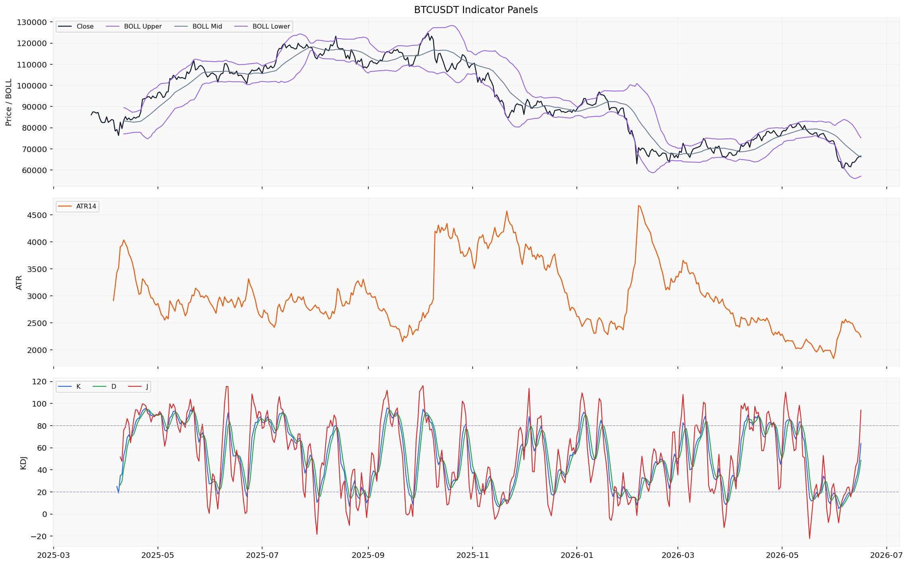
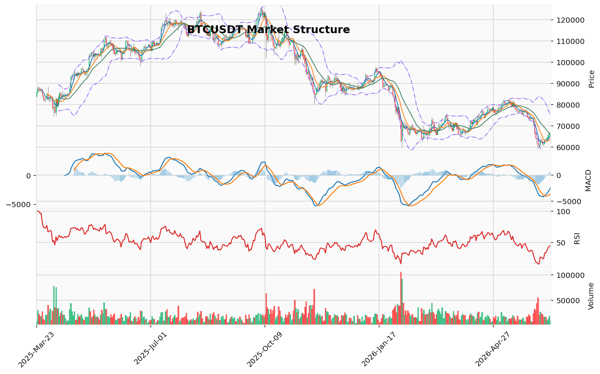

# Bitcoin（BTC）加密资产投资研究报告

> 报告生成时间（美东）：2026-06-16 08:26:03 EDT
> 报告生成时间（北京）：2026-06-16 20:26:03 CST

## 一、投资结论与组合动作

**当前组合动作：** 持有/观望。当前不新增买入或卖出、不新开仓、不加杠杆。

**核心判断依据：** 多空信号势均力敌，任一方向都无法提供压倒对方的决定性证据。看涨方有123突破结构确认、MACD柱状图转正、AHR999指数处于历史低位（0.354）的估值支撑；看跌方有TD13完成、KD超买（K值81.80）、CVD大幅负值（-61.6亿美元）的短期风险警示。双方均受限于关键数据缺口（分钟级CVD、持仓量加权多空比、交易所净流量日频序列、ETF资金流连续数据），无法形成方向性交易条件。

**当前没有入场、目标、止损或执行价位。** 所有提及的技术位（如123突破位64,234.68、POC 68,021.11、MA20 66,136.44等）均为技术参考，并非可执行交易条件。未提供真实持仓参数，无法给出真实持仓调整建议；未提供合约持仓、保证金模式和保证金参数，无法审计合约风险。

**主要资料限制：** 置信度低至中等（40-55%）。分钟级衍生品数据缺失、持仓量加权数据不可用、交易所净流量仅1个实时快照、ETF资金流最新读数为零、宏观数据滞后约1个月——这些缺口既限制了看涨论证中的“积累叙事”验证，也限制了看跌论证中的“卖压持续性”确认，无法作为方向性交易依据。

**需要补充验证的核心数据类别：** 资金费率连续方向、OI日级变化方向、持仓量加权多空比、CVD持续性趋势、交易所净流量日频序列、交易所余额多日趋势、ETF资金流连续方向。待上述数据类别补充验证后，方可重新评估。

## 二、市场结构与技术指标分析

### 技术图表

本节整合市场分析报告中的价格趋势、技术参考位、成交量、波动率、资金费率、OI、多空比、清算地图、CVD、链上与宏观变量。所有指标均基于已返回的日线、小时级及部分链上数据，标的为 BTC（Bitcoin）。

### 2.1 当前价格结构

截至 2026 年 6 月 16 日，BTC 日线收盘价 66,554.01 美元，24 小时涨幅约 +0.34%。当前价格位于 MA20（66,136.44）上方但紧贴该均线，同时远低于 Vegas 蓝带（EMA144/169 约 75,591–76,976 美元）约 -12.75%，显示长期主趋势尚未确认转多。123 突破结构已给出看涨上破信号（突破位 64,234.68），但 TD 看跌反转 13 计数已完成，提示短期上行衰竭风险。

整体结构可解读为下跌减速后的横向整理，缺乏资金费率方向、OI 趋势、宏观催化与链上持仓成本等维度的协同确认，限制了对趋势方向的判定置信度。

### 2.2 趋势与震荡状态

- **中短期**：震荡偏弱。价格处于 MA20 上方但紧贴，RSI 14 为 44.7（低于 50 中轴），MACD 柱状图转正但 DIF/DEA 仍在零轴下方。
- **长期**：下行趋势未确认反转。Vegas 蓝带压制明确，价格偏离幅度约 -12.75%，未出现有效突破信号。
- **多空信号冲突**：看涨有 123 突破 + MACD 转正 + 站上 MA20；看跌有 TD13 完成 + KD 超买 + CVD 负值 + 长期均线压制。

### 2.3 技术参考位

以下价位均为基于已返回数据的技术参考，非可执行交易条件。

| 参考方向 | 价位 | 说明 |
|----------|------|------|
| 上方参考 | 75,210.16 | 布林带上轨 |
| 上方参考 | 75,591.63–76,976.19 | Vegas 蓝带（EMA144/169） |
| 上方参考 | 68,021.11 | POC（成交量分布控制点） |
| 上方参考 | 67,474.59 | 最近上方未回补 FVG 中心 |
| 当前价格 | 66,554.01 | 日线收盘价 |
| 下方参考 | 66,136.44 | MA20 / 布林带中轨 |
| 下方参考 | 64,234.68 | 123 突破位 |
| 下方参考 | 62,829.81–63,626.00 | 订单块区间 |
| 下方参考 | 65,478.66 | 最近下方未回补 FVG 中心 |
| 下方参考 | 57,062.72 | 布林带下轨 |
| 下方远距 | 49,935–51,233 | 清算密集簇（远低于当前价格约 15,300–16,600 点） |

### 2.4 清算簇读数

最新清算地图（BTC 专用口径，样本起始 2025-12-19）显示密集清算簇集中在 49,935–51,233 区间，远低于当前价格。下方清算簇距离较远，短期直接触及概率低。本次样本未显示上方密集簇。

| 清算簇价格 | 规模 |
|------------|------|
| 49,935.58 | 3,816,866.4 |
| 50,368.10 | 6,623,492.82 |
| 50,584.36 | 5,302,677.02 |
| 51,016.88 | 3,816,456.29 |

注：清算簇价格为点位，规模单位未确认。

### 2.5 资金费率与 OI 当前读数

| 指标 | 读数 | 时间 | 样本粒度与覆盖 |
|------|------|------|----------------|
| 资金费率 | 0.000977% | 2026-06-16 12:00 | 小时级，覆盖 2025-12-11 至 2026-06-16（4500 行） |
| OI | 49,553,352,178.11 USD | 2026-06-16 | 小时级，覆盖同上（4500 行） |
| 多空比（账户数） | 1.38 | 2026-06-16 12:00 | 小时级，覆盖同上（4500 行） |
| 清算额 | 99,124.39 | 2026-06-16 | 小时级，覆盖同上（4500 行） |
| CVD | -6,166,092,056.74 USD | 2026-06-16 | 小时级，覆盖同上（4500 行） |
| 主动买卖量 | 买 46,567,345.21 USD，卖 36,545,036.75 USD | 2026-06-16 | 小时级 |

- **资金费率**：最新值为正但绝对值极低（0.000977%），接近中性，显示永续合约多空持仓成本接近平衡，无明显资金偏向。
- **OI**：计价为 USD（U 本位），未标注趋势方向，无法判断多空持仓结构分解。
- **多空比**：账户数口径多头略多（1.38），但缺乏持仓量加权数据，不能反映资金量结构。
- **CVD**：负值代表主动卖出量大于主动买入量，短期卖压偏强。缺乏分钟级数据判断持续性。

### 2.6 动量与波动指标

| 指标 | 读数 | 推导 | 资料限制 |
|------|------|------|----------|
| RSI(14) | 44.70 | 中性偏弱区域，低于 50 中轴 | 单一读数，不含回测或统计结论 |
| MACD | DIF -2,517.75，DEA -3,190.86，柱状图 +673.12 | 柱状图转正显示下跌动能减速，但 DIF/DEA 仍在零轴下方 | 不含趋势持续或反转的统计结论 |
| KD | K=81.80（超买区），D=67.97（中性），J=109.44 | K 值进入超买区域，短期摆动指标发出超买警示 | 超买阈值仅供参考，不构成确定反转信号 |
| 布林带 | 上轨 75,210.16，中轨 66,136.44，下轨 57,062.72 | 价格位于中轨附近；通道宽度约 18,147 点，反映波动性较高 | 不含目标价或回测结论 |
| TD 9/13 | 看跌反转 13 计数已完成（中等置信度） | 提示该周期内多头上行动能耗尽的风险 | 不含回测统计，不能作为确定性的反转条件 |
| 123 突破 | 上破已确认（突破位 64,234.68），方向看涨 | 三点结构完成，价格已突破 | 只反映最近摆动结构，不能确认趋势延续 |

### 2.7 链上与宏观变量

链上数据（截至 2026-06-15 或 2026-06-16）：

| 指标 | 读数 | 说明 |
|------|------|------|
| 交易所余额 | 2,510,117.93 BTC（2026-06-16） | 日频，样本 2025-06-17 起（349 行），小幅下降约 5,186 BTC |
| 交易所净流量 | -33,062,337 USD（实时快照） | 仅 1 个快照，时间覆盖极窄 |
| AHR999 | 0.3536（2026-06-16） | 无量纲指数，日频，样本 2011-02-01 起（365 行），历史分位约 5% |
| 活跃地址 | 667,375（2026-06-15） | 日频，回升但处于月度中间水平 |
| LTH-SOPR | 0.746（2026-06-15） | 低于 1，长期持有者在亏损状态下卖出 |
| STH-SOPR | 1.007（2026-06-15） | 接近 1，短期持有者盈亏平衡 |
| NUPL | 0.193（2026-06-15） | 正值，市场整体轻度盈利 |
| 稳定币市值 | 2,670.8 亿美元（2026-06-15） | 维持高位 |
| 大额转账 | 多次 1,700 万–1.18 亿美元级别转账 | 计数/笔数口径，不含方向判断 |

宏观数据（来源 FRED/US）：

| 指标 | 最新读数 | 时间 | 说明 |
|------|----------|------|------|
| 美联储基金利率 | 3.63% | 2026-05 | 月频，滞后约 1 个月 |
| 10 年期国债收益率 | 4.48% | 2026-06-12 | 日频，呈上升趋势 |
| 美联储总资产 | 6,725,397 | 2026-06-10 | 周频，缩表节奏平缓 |
| M2 货币供应量 | 22,804.5 | 2026-04 | 月频，滞后约 2 个月 |

事件日历（2026-06-16）：日本央行加息至 1%（1995 年以来最高水平），该事件已验证，影响周期日内至 1–5 天；Bitcoin Core 客户端版本发布（31.0、30.2 等），属常规技术维护，无显著价格影响；其余宏观数据发布事件（贸易数据、制造业指数等）对 BTC 直接影响有限。

社交情绪（2026-06-16）：Coinglass 市场级情绪刻度 22.0（0–100 刻度），处于恐惧区间，近一周在 13–22 之间徘徊。该读数仅为市场级聚合指标，未覆盖社交平台原文样本。

### 2.8 资料限制与待确认条件

1. **衍生品数据**：资金费率、OI、多空比、清算、CVD 均为小时级样本（4500 行，2025-12-11 至 2026-06-16），缺乏分钟级数据判断持续性趋势。
2. **清算地图**：样本起始 2025-12-19，仅为 BTC 专用口径；最新簇集中在下方的远距区间，未显示上方密集簇。
3. **交易所净流量**：仅 1 个实时快照（2026-06-16），无法形成趋势判断。
4. **多空比**：仅为账户数口径，缺乏持仓量加权数据，不能反映资金量结构。
5. **ETF 资金流**：最新读数为 0.0 USD，连续多日方向不可知。
6. **宏观数据**：美联储基金利率和 M2 月频更新，滞后约 1–2 个月；6 月美联储利率决议数据缺失。
7. **链上数据**：缺少交易笔数、转账总值、手续费总量、矿工收入、算力等基础指标，影响对网络经济强度的完整评估。
8. **社交情绪**：来源单一（Coinglass 市场级刻度），未覆盖 Twitter/X、Reddit、Telegram 等平台原文样本，无法区分语言社区或参与者结构。

以上缺口共同限制了对趋势方向的判定置信度，当前无法形成方向性交易条件。需等待对应数据补充验证后重新评估。

## 三、项目与代币基本面分析

### 3.1 项目定位与需求真实性

Bitcoin（BTC）是全球首个去中心化加密货币，由化名中本聪于2009年创建，核心定位为点对点电子现金系统。项目基于工作量证明（PoW）共识机制和 SHA-256 加密算法，通过每四年一次的减半事件自动降低矿工区块奖励，设计上属于固定供应上限的价值储存工具，常被称为“数字黄金”。

**需求真实性判断：** 从已返回的项目资料层面，Bitcoin 的需求来自于其去中心化、抗审查和供应固定的价值储存定位，该定位存在超过 15 年的运行历史。但基本面数据结果未返回具体的链上使用数据（如交易笔数、转账价值、活跃地址的经济使用场景），无法从需求端的使用频率和真实经济活动维度做更细致的确认。

### 3.2 代币经济分析

基本面数据结果返回的供应数据如下：

| 指标 | 读数 | 时间 |
|------|------|------|
| 流通供应量 | 20,043,515 BTC | 2026-06-16 |
| 总供应量 | 20,043,515 BTC | 2026-06-16 |
| 最大供应量 | 21,000,000 BTC | 项目资料定义 |

当前流通供应量与总供应量相等，均为约 2004.35 万枚，距硬顶 2100 万枚尚有约 95.65 万枚未产出。按当前区块发行节奏推断，剩余供应将在未来通过矿工区块奖励逐步发行至约 2140 年全部完成。

**估值快照：** 截至 2026-06-16，BTC 报价 66,556.52 美元，市值约 1.33 万亿美元。由于流通供应量等于总供应量，完全稀释估值（FDV）与市值在当前快照上相等。但基本面数据结果未返回解锁计划、质押率、代币分配历史等更细致的发行材料，无法判断近期是否存在未来集中发行压力以外的结构性稀释风险。

**通缩机制：** 项目资料提及区块奖励减半设计，但基本面数据结果未返回具体的减半时间表、当前区块奖励率或最近减半生效日期，无法量化当前年化发行率的变化趋势。

### 3.3 链上与生态基本面

基本面数据结果返回的链上指标如下（截至 2026-06-15）：

| 指标 | 最新读数 | 说明 |
|------|----------|------|
| 活跃地址数 | 667,375（2026-06-15） | 日级别 |
| 长期持有者 SOPR（LTH-SOPR） | 0.746（2026-06-15） | 无量纲读数；低于 1 反映长期持有者在亏损状态下卖出 |
| 短期持有者 SOPR（STH-SOPR） | 1.007（2026-06-15） | 无量纲读数；约在 1 附近 |
| 未实现净利润/亏损比（NUPL） | 0.193（2026-06-15） | 无量纲读数 |
| 稳定币总市值 | 2,670.8 亿美元（2026-06-15） | 单位为 USD |
| 大额转账（whale transfer） | 1,188 万（2026-06-16，计数/笔数口径） | 链上大额移动 |

**活跃地址：** 日活跃地址约 66.7 万个，与前几日（53.8 万~71.4 万）相比处于月度中间水平，网络使用保持一定活跃度。

**盈利/亏损状态：** LTH-SOPR 为 0.746，表明长期持有者在最近的卖出行为中整体处于亏损状态（卖出价格低于其买入成本）。STH-SOPR 为 1.007，短期持有者盈利水平接近 1，基本盈亏平衡。NUPL 为 0.193，处于正值区间，表明网络总体仍处于未实现盈利状态。

**稳定币流动性：** 稳定币总市值约 2,670 亿美元，近期波动较小，可作为 Crypto 生态系统潜在购买力的侧面参考。

**交易所余额：** 交易所余额约 251.0 万 BTC（截至 2026-06-16），与上周数据（251.1 万~251.6 万）相比略有下降，但变化幅度较小。

**交易所净流量：** 实时数据显示交易所当日净流出约 3,306 万美元（单位为 USD），反映短线维度有一定规模的 BTC 从交易所转出。

**链上数据覆盖不足：** 基本面数据结果返回了交易所余额、活跃地址、SOPR、NUPL、大额转账等指标，但未返回链上交易总笔数、转账总值、手续费总量、矿工收入、算力等基础指标，影响对网络经济安全和实际使用强度的完整评估。

### 3.4 机构资金与 ETF 资金流

基本面数据结果返回了 BTC ETF 资金流数据。最近一次记录（2026-06-16）为 0.0 USD，即当日空值或暂无统计更新。ETF 数据系列从 2024-01-11 开始，覆盖至 2026-06-16，但最新读数为零，无法据此判断近期的机构 ETF 资金方向，缺少连续多日净流入/净流出的汇总数据。

**公司新闻方面：** 返回的 20 条新闻中有一条提及 Coinbase 与 AWS 合作推出 x402 协议允许 AI 代理付费访问内容，涉及加密货币支付应用场景；另有一条提到 India 对一宗冒充 Coinbase 的诈骗案提起诉讼。但整体来看，缺少针对 BTC 现货 ETF 持仓变化、主权国家/企业资产负债表配置或大型金融机构新增产品线的具体新闻。

### 3.5 AHR999 指数估值

基本面数据结果返回的 AHR999 指数（无量纲/指数读数）如下：

| 日期 | AHR999 读数 |
|------|-------------|
| 2026-06-16 | 0.354 |
| 2026-06-15 | 0.347 |
| 2026-06-14 | 0.334 |
| 2026-06-13 | 0.324 |
| 2026-06-12 | 0.325 |

在返回的 365 个样本中，当前读数处于约 15.1% 的分位水平。该指标为综合估值参考，该方向缺少统计或回测证据支持具体的买入/卖出阈值结论，仅作为当前相对位置参考。

### 3.6 数据限制与风险提示

1. **供给与发行数据不足：** 未返回当前区块奖励数量、距离下次减半的时间、年化通胀率、已产出比例等细化发行数据，无法量化 BTC 的供给增速变化。
2. **链上使用深度不足：** 缺少交易笔数、转账总金额、手续费收入、算力、矿工收入、MVRV 等指标，限制了对网络实际经济活跃度和安全性的全面评估。
3. **机构资金数据有限：** ETF 资金流最新读数为零，且缺少连续多日净流入/净流出汇总，无法判断机构资金的方向性趋势。
4. **缺乏生态应用与竞争格局数据：** 未返回关于 BTC L2 生态、闪电网络使用量、与其他加密资产（如 ETH）的横向对比材料。
5. **AHR999 及其他估值指标：** 该指数仅为综合参考，该方向缺少统计或回测证据，不能独立作为估值充足或低估的判断依据。
6. **新闻影响不可量化：** 返回的新闻标题涉及 Polymarket 预测市场交易、Coinbase 合作等，均非直接影响 BTC 基本面的重大事件，新闻情绪层面需更多样本才能形成判断。

### 3.7 基本面分析对组合动作的影响

基于已返回的基本面数据：
- **供应结构与估值层面**，AHR999 处于历史较低分位区域，提供了长周期定价参考，但缺少短期价格预测能力。
- **链上使用层面**，活跃地址数量保持活跃，LTH-SOPR 低于 1 与 NUPL 正值并存，网络整体处于轻度盈利状态，未进入极端恐慌区间。
- **机构资金层面**，ETF 资金流最新读数为零，无法确认机构方向性配置。

上述数据不足以形成买入或卖出的基本面结论，当前组合动作维持“不新增买入或卖出、不新开仓、不加杠杆”，等待下列数据补充验证后重新评估：供给与发行数据（区块奖励、减半时间表）、链上使用深度指标（交易笔数、转账总值、算力）、机构资金流向（ETF 连续多日数据、持仓结构变化）。

## 四、新闻、监管与事件驱动

### 1. 已验证来源事件

**（1）日本央行加息至31年高位**

- **事件内容**：日本央行将关键利率上调25个基点至1%，为1995年以来最高水平。该事件由可靠媒体于2026-06-16报道。
- **与BTC的关联**：日本央行加息引发全球套利交易（carry trade）资金流向变化预期，BTC作为全球流动性敏感型资产随之出现短期波动。
- **对当前组合动作的影响**：短期价格层面偏利空（利率上升收紧日元流动性，可能触发套利头寸平仓），但BTC当日表现为上涨，说明市场已提前消化或在定价中计入该预期。该事件对当前“持有/观望”组合动作构成约束，但不改变方向判断——需持续观察日元汇率走势与套利交易平仓规模。
- **资料限制**：仅单一媒体报道，需观察更多市场反应数据。影响周期为日内至1-5天，当日BTC上涨不能证明影响已完全消化。

**（2）Bitcoin Core 客户端版本发布（项目/协议事件）**

- **Bitcoin Core 31.0**（2026-04-20 发布，来源官方代码仓库）
- **Bitcoin Core 30.2**（2026-01-13 发布）
- **Bitcoin Core 30.1**（2026-01-02 发布）
- **Bitcoin Core 29.3**（2026-02-11 发布）
- **Bitcoin Core 28.4**（2026-04-06 发布）
- **与BTC的关联**：以上均为比特币核心客户端正式版本发布，内容包括安全修复、功能改进与网络协议优化，属常规技术维护范畴，对当前组合动作无直接影响。
- **资料限制**：版本发布不涉及协议分叉或共识变更，无显著价格影响。

### 2. 宏观背景

**美国利率环境**

| 时间节点 | 美国10年期国债收益率（DGS10） |
|---|---|
| 2026-06-12 | 4.48% |
| 2026-06-10 | 4.55% |
| 2026-06-03 | 4.49% |
| 2026-05-01 | 4.39% |
| 2026-04-01 | 4.33% |
| 2025-12-01 | 4.09% |

**趋势判断**：美国长端利率自2025年12月的4.09%逐步攀升至2026年6月的4.48%附近，整体利率环境偏紧。高利率环境对BTC等风险资产构成估值压力，但从区间走势来看，BTC在此期间并未持续下行，说明市场已在定价中消化了高利率预期，或存在其他对冲逻辑（如通胀对冲叙事、机构配置需求）。该宏观状态对当前“持有/观望”动作构成约束——利率环境偏紧削弱多头叙事，但已被部分定价，不足以单独构成卖出条件。

**资料限制**：宏观数据来源为FRED/US，FEDFUNDS和M2SL月频更新滞后约1个月，DGS10日频覆盖完整。6月美联储利率决议数据缺失，可能影响对利率环境的完整判断。

### 3. 宏观事件日历

事件日历中返回了日本、美国、新西兰、英国、澳大利亚等国的宏观经济数据发布日程，包括贸易数据、制造业指数、服务业指数、钻井数等。这些常规经济指标对BTC的直接影响有限，主要通过影响美元指数和风险偏好间接传导。

### 4. 媒体/搜索线索（待核验）

新闻数据结果返回了多条来自媒体搜索聚合的线索，涉及ETF资金流入、交易所上币预期、世界杯预测市场等主题。这些内容以搜索摘要形式呈现，未返回原文正文，因此不能作为已确认的新闻事实写入本报告。相关线索中包含的具体机构名称、产品名称、法案名称等均不能作为新闻事实。

**资料限制**：搜索线索未核验，不能作为事实源；相关事件类型缺少已验证来源。

### 5. 交易所公告与监管事件

在分析区间内，新闻数据结果未返回经交易所官方、监管机构官方或已读取原文的可靠媒体验证的交易所上币公告、退市公告、监管执法行动、政策立法节点或安全事件。相关类型缺少已验证来源。

### 6. 对当前组合动作的影响评估

| 事件类别 | 已验证事件 | 对组合动作的影响 | 后续跟踪数据类别 |
|---|---|---|---|
| 宏观事件 | 日本央行加息至1%（2026-06-16） | 短期利空，但已被部分定价；不改变持有/观望动作 | 日元汇率走势、套利交易平仓规模、日本央行后续会议路径 |
| 协议事件 | Bitcoin Core版本发布（2025-06至2026-04） | 中性，常规维护；不改变组合动作 | 节点升级率、网络算力变化 |
| 利率环境 | 美国10年期国债收益率4.48%（2026-06-12） | 偏紧，但已被市场定价；不改变组合动作 | 美联储利率决议、通胀数据发布时间 |
| 媒体/搜索线索 | ETF流入传闻、交易所上币预期等（待核验） | 无法判断；不作为当前证据 | 需核验原文后方可判断 |
| 监管/安全/机构资金 | 缺少已验证来源 | 无法评估方向性事件风险 | 监管、交易所、机构资金类别缺少已验证来源 |

### 7. 资料限制与风险提示

1. **新闻数据覆盖存在缺口**：分析区间为2025-06-16至2026-06-16，但新闻数据结果仅在2026年6月15-16日返回了有限的可读事件；2025年6月至2026年5月期间的重大事件（如美国现货ETF审批进展、减半后市场结构变化、主要监管执法行动、交易所安全事件等）未以已验证来源形式返回，不代表这些事件未发生。

2. **搜索线索未核验，不能作为事实源**：多条媒体搜索聚合线索仅以搜索摘要形式存在，未返回原文正文，无法验证内容真实性。其中涉及的机构名称、产品名称、法案名称等均不能作为新闻事实写入报告。

3. **宏观数据时效滞后**：部分宏观序列（如CPI）截至2026年3月，6月的美联储利率决议数据缺失，可能影响对利率环境的完整判断。

4. **交易所公告、监管文件、机构资金、安全事件缺少已验证来源**：分析区间内未返回经交易所官方、监管机构官方或已读取原文的可靠媒体验证的相关事件，因此无法对上述维度做出任何方向性判断。

5. **单一事件依赖问题**：当前报告的主要内容依赖于日本央行加息这一单一事件，以及Bitcoin Core的版本发布，样本量有限，需警惕以偏概全。

6. **潜在误读风险**：“BTC在日本央行加息后上涨”不能直接推演出“加息利好BTC”的结论，可能是市场提前定价、其他因素共振或短期噪音所致，需要更多交易数据和持仓数据交叉验证。

7. **若可靠来源恢复并验证方向性事件，需要重新评估**当前结论。缺新闻不被解释为“没有负面消息”或“存在潜在利好”，仅表示新闻维度无法做出充分判断。

## 五、社区情绪、事件预期与交易拥挤度

本节整合 Coinglass 市场级情绪刻度数据（样本 364 条，覆盖 2025-06-16 至 2026-06-16）以及上游舆情材料的可用内容。由于缺少真实社交平台原文样本、叙事内容、叙事传播路径和参与者结构数据，本节仅能基于已返回的聚合情绪刻度和来源边界进行分析，并明确标注各项限制。

| 指标/维度 | 当前读数与数据状态 | 解读 | 投资含义 | 资料限制与重评依据 |
|---|---|---|---|---|
| 市场级情绪刻度 | 22.0（0-100 刻度，分数越低越恐惧），2026-06-16；近 5 日：13–22，呈低位窄幅回升 | 当前处于恐惧区间边缘，近一周持续低位（最低 13.0），从 13 回升至 22 但幅度有限，方向为谨慎修复而非趋势反转 | 极端恐惧区间本身不含方向必然性；缺乏统计或回测证据支持情绪低位=反弹或下跌 | 单一来源，仅 Coinglass 市场级聚合指标；未覆盖 Twitter/X、Discord、Reddit、Telegram、微信等社交平台原文样本；语言社区差异不可知；情绪样本无更高频日内数据 |
| 事件预期 | 宏观日历覆盖 776 条（US/Japan/UK 等官方来源），GitHub 项目事件 30 条（Bitcoin Core 版本发布），Google News 新闻线索 50 条（仅摘要） | 宏观数据发布日程覆盖完整，可用于识别潜在宏观催化节点；BTC 协议层面有常规版本发布记录；但新闻线索仅为聚合摘要，非完整原文 | 宏观事件（利率决议、通胀数据）可影响风险偏好，但当前时效性滞后约 1 个月，无法判断短期催化窗口 | 事件日历不含监管、ETF 流量或特定加密交易所事件分类；新闻线索缺少原文验证；所有具体机构名称、产品名称、法案名称均不可作为事实写入 |
| 叙事内容与传播路径 | 未返回真实社交平台原文样本 | 无法判断当前社区讨论的核心议题、叙事热度变化或信息扩散渠道 | 叙事维度不可用，不能从社区讨论层面佐证或反驳任何方向判断 | 无 Twitter/X、Reddit、Discord、Telegram 或中文社区的直接样本 |
| 参与者结构 | 不可用 | 零售 vs. 机构、短线 vs. 长持、不同语言社区之间的情绪分化完全不可知 | 参与者结构不可知，无法判断多空力量的真实分布 | 无社交平台用户分类数据，也无持仓量加权多空比数据辅助判断 |

### 情绪读数的市场含义与风险

- **当前状态**：市场级情绪刻度（22.0）处于历史刻度的恐惧区间低位，近 5 日窄幅波动且未突破 25 以上的中性分界线。情绪从 13.0 回升至 22.0，属于低位修复，但修复力度微弱。
- **对组合动作的影响**：情绪读数本身不构成买入或卖出信号。极端恐惧刻度常被市场参与者视为反向指标，但上游材料明确注明“该方向缺少统计或回测证据支持短期必然反弹”。因此，在情绪维度上，当前不产生任何可执行交易条件。
- **与基本面/技术面信号的交叉验证**：情绪低位与 AHR999 历史低位（0.354）同时出现，是长周期估值和情绪维度的共振，但如上文所述，这种共振无法单独验证方向性交易（详见本节开头表格）。两个维度的共同低位只能说明当前处于长期偏低位置，不能证明短期价格会向哪个方向运动。
- **情绪失真与样本局限**：
  - 来源单一：仅 Coinglass 市场级情绪刻度，未覆盖主要社交平台原文样本，情绪全貌不可知。
  - 聚合指标的信息损失：0-100 分数是对海量文本情绪的均化处理，交易细节、争议分歧、叙事分化等微观信息被抹平，失真风险无法量化。
  - 缺少更高频样本：情绪是否有日内剧变或重大事件窗口内的快速翻转，无数据支持。
  - 语言社区缺失：无法区分英文、中文、韩文等不同社区的情绪分歧，可能存在部分语言社区的极端情绪被整体指标稀释。

### 事件预期维度

- **可核验的事件**：宏观日历中日本央行加息（2026-06-16，利率上调至 1%，31 年高位）已发生，BTC 当日收涨约 0.34%。验证来源（CoinDesk 媒体正文）可信度中等偏高。该事件影响周期为“日内至 1-5 天”，当前时间窗口仍在影响范围内，但单日上涨不能推导出“加息利好 BTC”或“压力测试通过”等方向性结论，需更多交易数据和持仓数据交叉验证。
- **不可核验的事件**：Google News 新闻线索中的交易所上币传闻、ETF 资金流预测、世界杯预测市场等主题仅以搜索摘要形式存在，未返回原文正文，不能作为新闻事实使用。相关具体机构名称、产品名称、法案名称等均不可写入报告。
- **缺少的事件类型**：分析区间（2025-06-16 至 2026-06-16）内未返回经交易所官方、监管机构官方或已读取原文的可靠媒体验证的交易所上币/退市公告、监管执法行动、政策立法节点、安全事件或重大协议升级。上述事件类型缺少已验证来源，无法评估其影响。

### 交易拥挤度与衍生品信号交叉验证

| 衍生品指标 | 当前读数 | 能否反映拥挤度 | 与情绪读数的交叉验证 | 资料限制 |
|---|---|---|---|---|
| 多空比 | 1.38（账户数口径） | 多头账户数多于空头，但缺乏持仓量加权数据 | 多头人数占优但合约成本（资金费率 0.000977%）极低，两者结合未显示极端拥挤 | 仅账户数口径，无持仓量权重；无法区分机构与散户结构 |
| 资金费率 | 0.000977%（正费率极低） | 永续合约多空持仓成本接近中性 | 未出现极端正费率（多头拥挤）或负费率（空头拥挤） | 小时级样本，无分钟级或年化口径 |
| OI | 49,553,352,178.11 USD | 当前 OI 为单点读数，无方向趋势 | 无法判断 OI 处于扩张还是收缩周期 | 仅当日快照，缺少日级变化趋势 |
| 清算地图 | 下方密集簇 49,935-51,233（远低于现价） | 下方清算簇距离较远，短期直接触及概率低 | 上方未显示清算密集簇，无法判断多头杠杆方向 | 仅下方清算簇可用，上方数据缺失 |

- **拥挤度判断**：当前多空比（1.38）和资金费率（接近 0）均未显示极端拥挤。市场情绪处于恐惧低位但衍生品持仓成本中性，该组合通常意味着市场分歧较大且方向未定，而非一边倒的拥挤或脆弱。
- **对组合动作的含义**：未出现拥挤平仓或强制清算的风险触发信号，因此拥挤度维度当前不构成卖出或减仓的理由，也不构成顺势做空的依据。需要继续获取多空持仓量加权数据和 OI 的日级变化方向，以更准确地判断拥挤度演变。

### 情绪与事件维度的当前总结

| 类别 | 核心判断 | 对组合动作的影响 | 关键限制 |
|---|---|---|---|
| 市场级情绪 | 恐惧低位（22/100），近一周窄幅修复，但仍处于悲观区间 | 不构成买入或卖出信号；极端读数本身不含方向必然性 | 单一来源；无社交平台原文样本；语言社区不可分；无更高频数据 |
| 可核验事件 | 日本央行加息已发生，影响周期 1-5 天，市场短期反应为上涨 | 中性偏利空预期已被部分消化，但影响未完全结束 | 仅单一事件，样本量有限；不能反推方向性结论 |
| 不可核验事件 | Google News 摘要、搜索线索未验证 | 无法使用 | 缺少原文正文，所有具体名称不可保留 |
| 交易拥挤度 | 未显示极端拥挤，衍生品指标中性 | 拥挤度维度不触发方向性动作 | 多空比为账户数口径，缺持仓量加权；OI 无趋势方向 |
| 整体置信度 | 低 | 情绪与事件维度当前不足以支持方向性判断；情绪低位与估值低位虽形成长周期共振，但缺乏短期催化验证，不能作为交易依据 |

**本节结论**：当前社区情绪处于历史低位恐惧区间，但样本单一且缺乏叙事和参与者结构信息，无法做方向性解读。事件层面仅有日本央行加息一项可核验事件，影响周期未完全结束但已被部分消化。交易拥挤度未显示极端状态。综合来看，情绪与事件维度当前不能为看涨或看跌提供足够证据，也不独立触发任何组合动作调整。需要补充真实社交平台原文样本、持仓量加权多空比、OI 趋势方向及更多可核验事件来源后，才能重新评估情绪与拥挤度对组合的含义。

## 六、交易计划与组合风险

### 当前组合动作

**当前不新增买入或卖出、不新开仓、不加杠杆。**

未提供真实持仓参数，无法给出真实持仓调整建议。未提供真实合约持仓、保证金模式和保证金参数，无法审计合约风险。

### 价格执行条件

**当前没有入场、目标、止损或执行价位。** 以下仅为技术参考位（非可执行交易条件）：

| 类型 | 参考位 | 说明 |
|------|--------|------|
| 上方参考 | POC 68,021.11 / 上方 FVG 中心 67,474.59 / Vegas 蓝带 75,591-76,976 | 技术参考，不含执行条件 |
| 下方参考 | MA20 66,136.44 / 123 突破位 64,234.68 / 订单块区间 62,829-63,626 / 布林下轨 57,062.72 | 技术参考，不含执行条件 |
| 清算密集区 | 49,935-51,233（下方远距，短期直接触及概率低） | 反映合约清算分布，不含方向性结论 |

上述价位未附带订单簿、清算执行机制或历史回测支持，不能改写成入场、目标、止损或执行条件。单个当前价格快照（66,554.01 USD）不能推导风险观察位、目标区间或整数关口。

### 工具选择与风险控制

现货方案或观望在当前环境下更为合适，理由如下：

1. **多空信号冲突，无一方占优**：看涨有123突破+MACD转正+AHR999低位，看跌有TD13完成+KD超买+CVD负值+维加斯蓝带压制，两者都缺乏压倒对方的决定性证据。
2. **关键数据缺口限制了方向性判断**：缺乏分钟级CVD数据判断卖压持续性、多空持仓量加权数据、交易所净流量日频序列、ETF资金流连续数据，使得任一方向下注都面临较高不确定性。
3. **未提供真实持仓与保证金参数**：无法审计合约风险或计算清算价。

### 风险等级评估与来源

| 风险类型 | 描述 | 当前评估 |
|---------|------|---------|
| 价格结构风险 | TD13完成+KD超买提示上行衰竭，但价格仍站上MA20，短期方向不明 | 中等 |
| 数据缺口风险 | 缺失关键数据限制方向性判断，任一方向下注不确定性较高 | 中等偏高 |
| 流动性风险 | CVD负值显示主动卖压偏强，但缺乏分钟级数据确认持续性 | 中等 |
| 事件风险 | 宏观事件（日本央行加息影响周期1-5天，但当前时间窗口已过；美联储利率决议滞后1个月） | 低至中等 |

### 风险控制措施

- 当前不新开仓、不加杠杆，避免在方向不明时暴露头寸。
- 等待数据补充验证后重新评估，不预设方向动作或执行条件。

### 需要继续观察的数据类别（重评条件）

- 资金费率的连续方向
- OI的日级变化方向
- 多空持仓量加权数据（区分账户数与持仓量结构）
- CVD的持续性趋势（是否从负值收敛或转正）
- 交易所净流量日频序列（是否形成持续净流出）
- 交易所余额的多日趋势
- ETF资金流连续方向
- 宏观事件日历（利率决议、通胀数据发布时间）
- 可靠新闻与真实社交样本（验证外部事件风险）

### 资料限制与置信度

**置信度：低至中等（40-55%）。** 主要受限于：多空信号矛盾且缺少决定性数据（分钟级衍生品数据缺失、持仓量加权数据不可用、交易所净流量仅1个实时快照、ETF资金流最新读数为0、宏观数据滞后约1个月）。上述缺口不是看涨或看跌事实，仅说明当前无法形成方向性交易条件。数据补充验证后需重新评估，但不得提前预告任何未来开仓、减仓或方向性动作安排。

## 七、关键分歧与跟踪条件

本报告的多空分歧核心在于“中长期结构性低估”与“短期动能衰竭信号”之间的冲突。组合经理在审阅所有上游证据后，裁定当前多空信号势均力敌，缺乏决定性数据支持任一方向的下注。以下表格列出被否决的论点类型及其处理依据。

| 被否决论点类型 | 不采纳理由 | 可保留的真实数据 | 需要继续验证的数据类别 |
| --- | --- | --- | --- |
| 把单点读数外推为方向性交易 | AHR999 0.3536 处于历史低位分位，但上游材料未提供统计或回测证据支持“短期必然反弹”或“历史性底部配方”的结论；该方向性解释未由数据结果验证。 | AHR999 当前读数 0.3536（无量纲，历史分位约 5%）；市场级情绪刻度 22/100。 | AHR999 的统计回测证据；分钟级 CVD；日频交易所净流量序列。 |
| 把单点读数外推为资金主体意图 | LTH-SOPR 0.746 反映长期持有者在亏损状态下卖出，但将其解读为“底部筹码从弱手转向强手”或“系统性去风险化”均缺乏上游数据验证，不能作为方向性证据。 | LTH-SOPR 当前读数 0.746（日频，2026-06-15）。 | LTH-SOPR 的统计回测证据；交易所余额日频趋势；链上大额转账的地址类型分类。 |
| 把参考位外推为执行方案 | 技术参考位（如 123 突破位 64,234.68、POC 68,021、Vegas 蓝带等）不含订单簿、清算执行机制或历史回测支持，不能改写为入场、止损、目标或失效条件。 | 123 突破结构已确认（突破位 64,234.68）；价格站上 MA20（66,136.44）；MACD 柱状图转正（+673）；TD13 已完成；KD K 值 81.80（超买区域）；CVD -61.6 亿美元（小时级）。 | 订单簿深度变化；清算地图的日内变化；站上/跌破后的成交量确认数据。 |

**跟踪条件（需补充验证的数据类别）：**

- 资金费率的连续方向
- OI 的日级变化方向
- 多空比持仓量加权数据（区分账户数与持仓量结构）
- CVD 的持续性趋势（是否从负值收敛或转正）
- 交易所净流量日频序列（是否形成持续净流出趋势）
- 交易所余额的多日趋势（是否继续下降）
- 活跃地址的日频趋势
- 宏观事件日历（利率决议、通胀数据发布时间等）
- 可靠新闻/监管来源对 BTC 需求叙事或监管框架的实质影响
- 真实社交平台样本（验证社区叙事与情绪分化程度）

**重新评估条件：**

仅当上述数据类别中形成足够清晰的、一致的趋势信号后，组合经理才能重新评估当前方向性判断。在此窗口内，所有关于“底部确认”或“暴跌风险”的结论均保持为待验证假设。

---

## 八、最终结论

**组合经理最终动作：**

当前不新增买入或卖出、不新开仓、不加杠杆。所有提及的技术参考位（如 123 突破位 64,234.68、MA20 66,136.44、POC 68,021、Vegas 蓝带、清算密集簇 49,935–51,233 等）均为技术参考，并非可执行交易条件。未提供真实持仓与保证金参数，无法审计合约风险。

**当前动作成立的核心证据：**

1. **多空信号冲突，无一方占优**：看涨有 123 突破确认、MACD 柱状图转正、AHR999 低位提供长周期估值参考；看跌有 TD13 完成、KD 超买、CVD 负值显示主动卖压偏强、Vegas 蓝带长期压制未解除。两者均无法提供压倒对方的决定性证据。
2. **短期风险明确但未构成强制交易条件**：TD13 完成和 KD 超买提示上行衰竭风险，CVD 负值显示卖压偏强，但价格仍站上 MA20（66,136.44），短期技术结构未被破坏。这些是风险预警，而非强制卖出或买入条件。
3. **缺失数据限制方向性判断置信度**：分钟级 CVD、持仓量加权多空比、交易所净流量日频序列、ETF 资金流连续方向、宏观数据时效性（滞后约 1 个月）等关键数据类别缺失，使得任一方向的下注都面临较高不确定性，不能形成可执行交易条件。

**最关键的重新评估数据类别：**

- 资金流向：CVD 的持续性趋势、交易所净流量日频序列、ETF 资金流方向性变化
- 衍生品结构：持仓量加权多空比、OI 日级方向、资金费率连续变化
- 价格结构：123 突破位（64,234.68）与 MA20（66,136.44）的保持情况，以及 Vega s蓝带区域的接近程度

**下一步最需要跟踪的 3 类数据：**

1. **交易所净流量日频序列**：当前仅 1 个实时快照（净流出 3,306 万美元），需连续日频数据验证资金流出趋势是否持续，这是看涨“积累叙事”的关键验证项。
2. **CVD 的持续性趋势**：当前小时级 CVD 为 -61.6 亿美元，需更长时间序列（分钟级或日级连续样本）判断主动卖压是持续恶化还是收敛，这是看跌“卖压持续”论证的核心验证项。
3. **ETF 资金流连续方向**：最新读数为 0，需连续多日净流入或净流出数据验证机构资金的方向性态度，这是判断长期配置需求是否激活的关键约束。

当前所有关于“底部构建”或“反弹动能耗尽”的叙事，均需在上述数据类别补充验证并获得一致趋势信号后，才能转化为方向性判断。在此之前，组合经理坚持持有/观望立场，等待市场用自己的数据给出最终答案。
