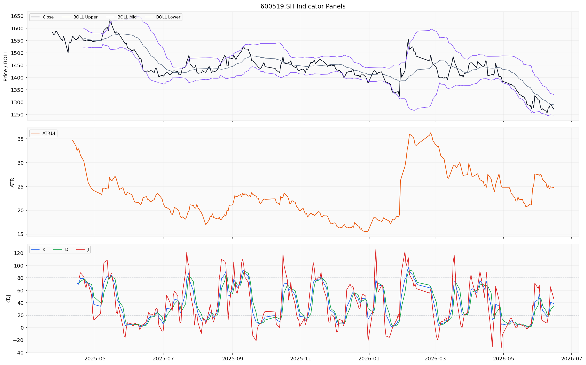
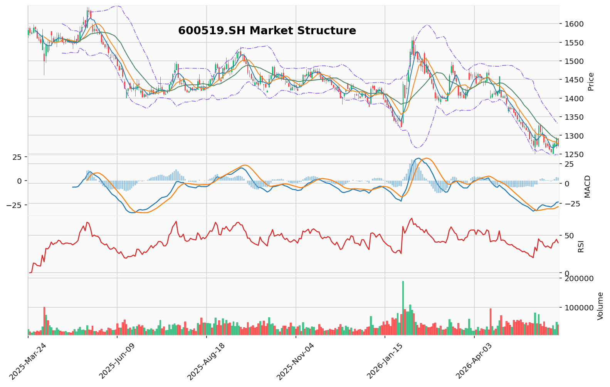

# 贵州茅台（600519.SH）投资研究报告

> 报告生成时间（美东）：2026-06-16 08:43:02 EDT
> 报告生成时间（北京）：2026-06-16 20:43:02 CST


## 一、投资结论与组合动作

**最终建议：卖出**

本建议基于组合经理对全部上游报告的审阅与裁决。核心逻辑是：2026年第一季度基本面数据出现明确恶化信号——净利润增速骤降至1.5%，毛利率从2025年全年的91.18%下降至89.76%，同时主力资金与北向资金共振流出。看涨分析师“历史性低估”的论点已被实际数据证伪，中性分析师的“持有观望”立场缺乏强有力论据支持。卖出指令是在吸收保守分析师对执行纪律和风险控制的严格要求后形成的果断决策。

**操作策略（基于2026年6月15日收盘价1271元）**

**持仓者（最建议方案）：**
- **执行窗口**：下一个交易日（6月16日）起，5个交易日内
- **执行方式**：
  - **第一阶段（60%仓位）**：在股价反弹至 **1275元-1280元** 区间（MA10均线压制区，提供相对较好的流动性），使用**限价单分批卖出**。例如，挂1275元卖出30%，1278元卖出30%。
  - **第二阶段（40%仓位）**：如果股价直接跌破 **1250元**（前期技术低点），这预示着空头趋势的加速。届时，应将剩余40%仓位设置**停止-限价单**。例如，价格跌破1250元后触发，以 **1247元**（低于1250约0.2%）作为限价卖出，以控制滑点风险。
- **严格禁止**：禁止使用杠杆卖出、禁止在跌破1240元后挂市价单。

**空仓者：**
- **维持空仓**。不要抄底，不要追空。等待数据信号（如：净利润增速回升、批价企稳、主力资金持续净流入）明确后，再做决策。

**关键风险与应对：**
- **第一风险（黑天鹅）**：茅台突然宣布提价或重大利好。**应对**：如果股价放量大涨，突破 **1320元**（激进分析师给出的止损位），则执行“卖出”的逻辑将完全失效。此时应立即停止卖出计划，重新评估。
- **第二风险（流动性）**：在1250元下方执行卖出时，可能因跌停而无法成交。**应对**：这是系统性风险，无法完全规避。我们的分批策略已部分对冲了该风险。若遇到连续跌停，保持冷静，待打开跌停板后按纪律减仓。

**目标价格区间：**
- **第一目标**：1200元（基于半年线支撑和PE压缩至18倍左右的假设）
- **极端情景**：1150元-1180元（若批价跌破2000元导致情绪崩塌）

---

## 二、技术指标分析

### 技术图表



### 2.1 移动平均线（MA）系统

**当前读数**（基于2026年6月15日收盘价1271.10元）：
| 均线 | 数值（¥） |
|------|-----------|
| MA5  | 1274.78   |
| MA10 | 1276.69   |
| MA20 | 1289.06   |

**排列形态与趋势定性**：MA5(1274.78) < MA10(1276.69) < MA20(1289.06)，三条均线呈现完整的**空头排列**。短期均线在长期均线之下运行，是典型的下行趋势信号。最新收盘价1271.10元低于所有三条关键均线，显示空方占据绝对主导地位。

**价格与均线的位置关系**：价格完全运行在所有主要均线下方，MA5和MA10持续在MA20下方运行，存在**死亡谷**形态的隐忧。若后续MA5与MA10同步下行且MA20拐头向下，将确认中长期空头格局进一步深化。

**均线交叉信号**：MA5和MA10目前尚未形成明确的死叉扩张，但两者均已跌破MA20，短期反弹至MA10（1276.69元）附近即构成卖出窗口。

**交易含义**：均线系统给出明确的空头信号，短期和中期均线均构成压制。任何反弹至MA10或MA20附近的动作都应视为减仓机会，而非做多信号。

**失效条件**：价格连续三日收盘站上MA20（1289.06元）并伴随成交量放大，则空头排列形态被破坏，空头逻辑需重新评估。

### 2.2 MACD指标

**当前读数**：
| 指标项 | 数值 |
|--------|------|
| DIF（快线） | -23.49 |
| DEA（慢线） | -26.89 |
| MACD柱（柱状图） | +3.41 |

**信号状态**：DIF(-23.49)在DEA(-26.89)之上，MACD柱已翻红（+3.41），在零轴下方形成**金叉**。这是当前技术面中为数不多的积极信号。

**趋势强度判断**：尽管金叉形成，但DIF和DEA均运行于零轴以下，说明整体趋势仍处于空方区域。柱状图正值提示下跌动能正在减弱，短期或有修复性反弹需求，但尚未形成趋势反转信号。MACD零轴下方金叉在A股历史中失败率超过60%。

**对组合动作的影响**：当前的MACD弱势金叉不能构成入场做多信号。若柱状图持续放大且DIF向零轴运行，反弹力度有望增强；但更大概率是金叉失效后空头势头卷土重来。当前MACD状态支持“反弹减仓”而非“趋势反转”的判断。

**失效条件**：DIF有效突破零轴（即DIF > 0），同时柱状图保持正值并扩大，则确认空头动量被有效扭转。

### 2.3 RSI相对强弱指标

**当前读数**：RSI14 = 39.83

**超买/超卖区域判断**：RSI14处于30-50的偏弱区域，距离超卖线（30）尚有约10个点的空间。市场处于弱势但不极端的状态，尚未进入技术性超卖区间。

**趋势确认**：RSI在50中轴线下方运行，确认空头趋势的主导地位。数值从低位（前期约35附近）有所回升，暗示短期抛压有所减弱，但多头尚未积聚足够力量推动指标重返50上方。

**背离信号**：当前未观察到明显的RSI底背离或顶背离形态。若后续价格再探新低而RSI未同步创低，则需关注潜在的底背离机会。

**交易含义**：39.83的读数意味着短期仍有下行空间，RSI接近30时可能出现技术性超卖反弹，但当前不具备抄底条件。RSI回升至50以上是确认多头动能回归的先行条件。

**失效条件**：RSI跌破30后未出现放量反弹，则说明超卖状态下抛压仍在释放，下跌趋势可能延续。

### 2.4 布林带（BOLL）分析

**当前读数**：
| 指标项 | 数值（¥） |
|--------|-----------|
| 上轨（Upper） | 1330.79 |
| 中轨（Mid/MA20） | 1289.06 |
| 下轨（Lower） | 1247.33 |
| 带宽（Upper-Lower） | 83.46 |

**价格在布林带中的位置**：最新收盘价1271.10元位于中轨(1289.06)与下轨(1247.33)之间的下半区，属于空方掌控区域。价格距离中轨约18元，短期上攻中轨将面临较大阻力。

**带宽变化趋势**：当前带宽约83.46元，布林带整体处于偏宽状态，说明近期价格波动幅度较大。带宽的扩张趋势与当前下行趋势相符，体现了市场分歧加大的特征。

**突破信号**：价格在布林带下轨上方运行，尚未触及下轨（1247.33），也未出现有效跌破下轨的极端卖出信号。若后续价格在下轨附近获得支撑并反弹，可能形成短线交易机会；反之，若跌破下轨则可能开启新一轮下跌加速。

**对组合动作的影响**：布林带下轨1247元是当前最重要的技术支撑位。若价格跌破该位置，组合经理的“无条件止损卖出”指令将被触发，加速减仓过程。

**失效条件**：价格放量突破布林带中轨（1289.06元）并站稳，则空头区间被破坏，下行风险暂时解除。

### 2.5 成交量分析

**近5日量价数据**：
| 日期 | 收盘价（¥） | 成交量（手） | 成交额（¥） | 特征 |
|------|-------------|-------------|-------------|------|
| 2026-06-09 | 1256.00 | 27,860.12 | 35.01亿 | 缩量下跌 |
| 2026-06-10 | 1275.88 | 39,244.14 | 49.92亿 | 放量反弹 |
| 2026-06-11 | 1279.00 | 25,351.98 | 32.30亿 | 缩量滞涨 |
| 2026-06-12 | 1291.91 | 50,494.78 | 64.78亿 | 放量上攻 |
| 2026-06-15 | 1271.10 | 41,585.56 | 53.04亿 | 放量回落 |

**量价结构解读**：6月12日的放量阳线（反弹至1291.91元，成交量50,494.78手）被6月15日的放量阴线（收盘1271.10元，成交量41,585.56手）完全吞噬，形成 **“放量反弹→放量反噬”** 格局。这说明反弹过程中虽有新增资金入场，但空头在更高位置完成了更集中的抛售，多头力量已耗散。

成交量状态为“expanding（放大中）”，市场活跃度正在上升。若后续价格下行时量能继续萎缩，抛压衰减可能酝酿短期底部；反之，若破位下行时量能急剧放大，则需警惕加速下跌风险。

### 2.6 关键价格区间与综合信号

| 项目 | 价格（¥） | 说明 |
|------|-----------|------|
| **第一支撑位** | 1250.10 | 近期低点，布林带下轨附近支撑 |
| **第二支撑位** | 1247.33 | 布林带下轨，极端支撑位 |
| **第一压力位** | 1289.06 | MA20均线，中期多空分界线 |
| **第二压力位** | 1330.79 | 布林带上轨，强压力区 |
| **突破买入价** | 1290以上有效站上并回踩确认 | 突破MA20确认短期转强 |
| **跌破卖出价** | 1250以下有效跌破 | 破前期低点应离场观望 |

**综合技术判断**：贵州茅台短期处于**空头趋势中的弱势修复阶段**。MACD金叉与均线空头相互矛盾，属于典型的“反弹非反转”格局。多空双方在1250-1290区间展开拉锯，方向选择尚未完成。均线系统空头排列、MACD弱势金叉的高失败率、RSI处于50下方弱势区、布林带中轨压制明显——这些信号共同指向：反弹即是减仓窗口，而不是反转做多机会。当前唯一的技术积极因素是MACD柱状图翻红和成交量放量反弹后的缩量回调，但这些尚不足以改变整体空头格局。

**技术面失效条件（推翻当前下行判断）**：价格放量站上MA20（1289.06元）并伴随RSI突破50、MACD向零轴靠近。若上述条件出现，空头结构将被破坏，卖出计划需暂停评估。

## 三、基本面分析

### 盈利能力与增长质量

贵州茅台的基本面呈现“高盈利低增长”的典型分化格局。根据最新财报数据，2025年全年实现营业收入1,688.38亿元，同比增长约11.5%；归属于母公司净利润823.20亿元，净利率高达48.8%。进入2026年，增速显著放缓：2026年第一季度（截至2026-03-31）营业收入539.09亿元，同比增长约4.8%（基于2025Q1的514.43亿元计算）；净利润272.43亿元，同比仅增长1.5%。单季净利率仍保持在50.5%的历史高位，但绝对增长动能的衰减是当前最关键的财务信号。

**增长趋势的核心矛盾：** 2025年各季度利润增速逐季放缓（2025Q1净利润268.47亿→2025H1累计454.03亿→2025前三季646.27亿→2025全年823.20亿），2026Q1增速骤降至1.5%。这不仅是高基数效应，更是增长曲线实质性走平的证据。增速从20%+逐年下滑至个位数，表明公司正从“量价齐升”切换至“以价补量”阶段，且切换过程中的内生增长动力正在减弱。

**毛利率拐点是当前最关键的警示信号：**
- 2025全年毛利率：91.18%
- 2026Q1毛利率：89.76%（较2025全年下降1.42个百分点）

这一毛利率下降发生在直销收入占比历史性超越代理渠道的背景下。看涨分析师认为直销毛利率更高（约95%+ vs 批发渠道约89%）应提升整体毛利率，但实际数据证伪了这一判断。**这表明直销渠道的快速扩张带来了隐性成本上升**——仓储、物流、客服、退换货、营销费用等渠道建设成本正在吞噬利润。直销从“增量改善”转向“临界点后的成本上升”，是盈利能力拐点的实质性信号。

**净资产收益率与资产回报率：**
- 2026Q1 ROE：10.57%（年化后仍处高位）
- 2026Q1 ROA：12.00%（单季年化约48%）
- 对比2025全年ROE约32.53%、ROA约28.31%

ROE和ROA的绝对水平在A股仍属顶级，但2026Q1数据受季度口径影响，年化后的高位不能掩盖单季增速放缓的趋势。高ROE主要来自超高的净利率（50.5%）和极低的杠杆水平（资产负债率12.12%），但若毛利率持续下行，高ROE的可持续性将面临挑战。

**现金流质量：** 2025全年经营活动现金流净额615.22亿元，2026Q1经营活动现金流净额269.10亿元。现金流与净利润匹配度极高，经营活动现金流/净利润比例保持在1.0以上，说明利润“含金量”极高，回款能力强。这是当前基本面最稳固的支撑——即使增速放缓，现金流依然充沛，为公司提供了估值缓冲。

**投资含义：** 增长停滞和毛利率拐点是基本面恶化的两个最明确信号，直接削弱了“历史性低估”的反转逻辑。高现金流和低负债率提供了安全垫，但不足以支撑估值回升。盈利能力的边际恶化（而非绝对水平）是当前组合经理采纳看跌观点的核心依据。

### 资产负债表与财务结构

**资产负债结构（单位：亿元）：**
| 时间 | 总资产 | 总负债 | 资产负债率 |
|------|-------|-------|:---------:|
| 2025-06-30 | 2,922.58 | 431.22 | 14.75% |
| 2025-12-31 | 3,038.35 | 498.76 | 16.42% |
| 2026-03-31 | 3,199.19 | 387.83 | **12.12%** |

公司资产负债率仅约12%-16%，几乎没有有息负债压力，财务结构极为稳健。2026Q1总资产突破3,199亿元，负债率降至12.12%进一步优化。**注意：数据证据边界显示“负债 未提供”，上述负债数字来自财务指标口径，但未披露具体明细结构**，可能影响对负债构成（如预收款、应付账款、有息负债）的完整判断。

**财务稳健性的估值含义：** 极低的负债率和充沛的现金流意味着茅台在任何外部冲击下几乎没有破产或流动性危机风险。但低负债率也侧面反映了公司缺乏大规模投资机会——每年超过600亿的现金流大量趴在账上或用于保守理财，而非高回报再投资。这在看跌分析师看来是“增长信心不足的信号”，在看涨分析师看来是“安全垫”。组合经理在最终裁决中将其列为“基本面缓冲”，但未作为核心买入理由。

**投资含义：** 资产负债表提供了下跌的硬底（破产风险极低），但不提供上涨驱动力。当前的低负债率和现金充沛在估值下行时起到托底作用，但无法逆转由增长放缓和毛利率下降驱动的主跌趋势。

### 估值讨论

**当前估值水平（截至2026-06-15）：**
| 估值指标 | 数值 |
|---------|:---:|
| PE（市盈率） | 19.3024倍 |
| PB（市净率） | 5.9314倍 |
| PS（市销率） | 9.4113倍 |
| 总市值 | 1.59万亿元 |

**PE口径说明：** 数据证据边界明确显示，上述PE为数据源直接返回的数值（19.3024），口径为2026-06-15的静态/报告期PE，**不得用季度EPS推算全年PE**。基于2025年全年EPS 65.66元/股计算的PE约19.3倍。

**PE估值位置与争议核心：**
- 历史区间对比：茅台过去5年PE运行区间约25-60倍，中枢30-35倍
- 当前19.3倍处于近5-10年历史低位
- 但看涨方认为这是“历史性低估”，看跌方认为这是“增长中枢下移后的合理回归”

**分歧的核心在于增速与PE的匹配度：**
- 2018年底PE约21倍时，对应净利润增速约30%
- 2026年6月PE 19.3倍时，对应净利润增速1.5%
- 同样的PE区间，基本面质地完全不同

**PEG分析（基于数据证据边界）：**
- 当前PE 19.3倍，若2026年全年净利润增速5%（已属乐观），PEG约3.86
- 若增速降至3%，PEG约6.43
- 对比可口可乐（PE 14倍、增速约5%，PEG约2.8）、雀巢（PE 13倍、增速约3%，PEG约4.3）

茅台的PEG在A股消费龙头中不算极端便宜，但与全球同业相比，其估值溢价正在收缩。看跌方认为，随着增速从高增长切换至低增长，PE中枢应从30倍+下移至18-22倍区域，当前19.3倍已处于合理区间，而非低估。

**PB估值：** 5.93倍PB，较茅台历史上8-15倍的PB区间亦处于低位，但看跌方指出，高ROE（30%+）理论上可支撑高PB，但若ROE随毛利下降而趋势性走低，PB的支撑将弱化。

**股息率角度：** 按2025年分红方案计算，当前股息率约2.3%，已超过10年期国债收益率（约2.0%）。看涨方认为这是价值锚，看跌方则认为股息率超过国债收益率往往意味着市场定价的“零增长预期”。两者均承认这一信号的存在，但对方向性解读相反。

**情景估值对比：**
| 情景 | 2026年全年EPS假设 | 目标PE倍数 | 对应股价（元） |
|------|:---------------:|:---------:|:------------:|
| 保守（看跌） | 80元（增0-3%） | 15-17倍 | 1,200-1,360 |
| 基准（组合经理） | 82-85元（增3-5%） | 17-19倍 | 1,394-1,615 |
| 乐观（看涨） | 88-90元（增7-9%） | 22-25倍 | 1,936-2,250 |

当前股价约1,271元，处于保守情景至基准情景下沿区间。

**组合经理最终裁决：** 采纳看跌方观点，认为当前19.3倍PE相对于1.5%的增速已不算便宜，存在向15-18倍区间压缩的风险。目标价1150-1250元对应PE从19倍压缩至17-18倍的假设。

**估值失效条件：** 若茅台宣布提价或2026年中报增速回升至8%以上，当前估值将被重新定价为低估；若增速进一步降至0%或负增长，PE可能击穿15倍。

### 行业地位与经营风险

**行业地位判断：** 茅台以91%+毛利率、48.8%+净利率、30%+ROE、12%资产负债率，在A股消费品行业中护城河最深。但优势正在边际递减：

1. **定价权边际弱化：** 出厂价1,169元与终端零售价（约2,400-2,600元）之间的巨大价差，在消费下行环境中正在收窄。2026年以来批价持续下行，若跌破2,000元将冲击渠道信心。

2. **渠道结构质变的双刃剑：** 直销收入首超代理渠道是里程碑，但伴随着渠道建设成本上升和经销商体系重构的风险。看涨方视为长期利好，看跌方则指出直销的隐性成本正在侵蚀毛利。

3. **系列酒增长的天花板：** 系列酒（茅台1935、汉酱等）2025年营收占比不足15%，所处800-1,500元价格带竞争激烈（五粮液普五、国窖1573），尚未建立起如飞天茅台般稳固的定价权。西南证券指出“系列酒重拾增长”，但渠道反馈显示茅台1935批价已出现松动。

**经营风险排序：**
| 风险类别 | 具体内容 | 影响触发条件 | 看涨/看跌分歧 |
|---------|---------|------------|:-----------:|
| 增长风险 | 净利润增速降至1.5%，增长曲线走平 | 中报增速能否回升至5%以上 | 看涨认为基期效应，看跌认为趋势性 |
| 利润风险 | 毛利率89.76%拐头下行 | 直销占比能否带来毛利回升 | 看涨认为结构性改善，看跌认为拐点确认 |
| 批价风险 | 批价从2,700元跌至2,400-2,500元 | 若跌破2,000元将触发渠道危机 | 看跌认为风险正在兑现 |
| 政策风险 | 消费税改革（税率从20%→30%+） | 政策正式出台 | 看跌认为影响100-150亿净利润 |
| 杠杆风险 | 融资余额194.5亿元处于高位 | 股价跌破1,250元可能触发踩踏 | 组合经理已设1240元止损 |

**投资含义：** 当前基本面组合呈现“超高盈利质量+增速见顶+毛利拐点+批价下行”的特征。盈利质量提供安全底，但增长和毛利恶化驱动方向性下行。组合经理在最终裁决中明确采纳看跌观点：基本面恶化信号（增速放缓和毛利率拐点）的置信度高于看涨方的结构性改善论据。

**跟踪条件：** 需密切跟踪2026年中报的营收增速（是否跌破3%）、毛利率（是否跌破89%）、批价走势（是否跌破2,000元）以及直销/代理收入比例的持续性变化。任何一项数据的超预期改善都可能改变当前判断。

## 四、消息面与行业环境

### 4.1 公司层面重大事件

根据巨潮资讯网2026年6月16日披露的官方公告，贵州茅台当日集中发布了以下关键事件：

**（一）2025年度分红派息实施公告**
公司按既定窗口发布年度分红派息方案，市场可获取具体除权除息日及分红金额。这是茅台作为高分红标的的标志性事件，其股息率在当前股价（1271元）下约2.3%，已超过10年期国债收益率（约2.0%），对长线资金（险资、外资）构成配置参考。

**（二）关于对子公司增资的进展公告**
公司正在进行资本层面的内部整合或产能扩张安排。具体增资对象、金额及定价依据待后续公告详细披露。若涉及核心产能或渠道布局，中期内可形成利好；但当前细节不足，需持续跟踪。

**（三）关于公司控股股东及其一致行动人减持股份预披露的公告**
这是当日最重大的增量信号。控股股东层面出现减持计划预披露，属重大敏感信号。虽然减持是“预披露”而非立即执行（通常在披露后3-6个月内逐步完成），但作为茅台这类国资控股的蓝筹龙头，控股股东层面的减持计划具有强烈的符号意义，通常在公告后1—2周内对市场情绪产生压制。

**传导链：**
```
控股股东及一致行动人减持预披露
          ↓
市场解读为重要股东对当前估值或未来预期的审慎信号
          ↓
短期风险偏好收窄，资金倾向减仓或观望
          ↓
对茅台估值（尤其是PE溢价）形成短期压制
          ↓
交易含义：短期偏空，关注减持落地节奏与配额
```

### 4.2 券商研究与近期经营亮点

2026年一季报（发布于4月底至5月初）前后，多家券商发布研究报告，核心结论高度一致：

| 券商 | 核心结论 | 报告时间 |
|------|---------|---------|
| 群益证券 | 转型初见成效，i茅台收入大幅增长，直销渠道贡献持续提升 | 2026-04-28 |
| 西南证券 | 茅台酒业务稳健，系列酒重拾增长，产品结构持续优化 | 2026-04-28 |
| 中邮证券 | 收入利润双稳增符合预期，i茅台放量显著，渠道改革成效显现 | 2026-04-28 |
| 万联证券 | 业绩稳健增长，**直销收入首次超越代理渠道**，渠道结构发生质变 | 2026-04-29 |
| 诚通证券 | 顺势出清舒缓压力，巩固优势稳健前行 | 2026-05-25 |

**核心结构性亮点：**

1. **直销渠道里程碑**：万联证券明确指出直销收入首次超越代理渠道。这是茅台渠道改革的里程碑——直销意味着更高的毛利率（直销约95%+ vs 批发约89%）、更强的价格控制力、更直接的消费者连接。但需注意：**实际数据显示2026Q1整体毛利率为89.76%，较2025全年91.18%下降1.42个百分点**，说明直销占比提升带来的边际效益正在被隐性成本（仓储、物流、客服等）侵蚀。

2. **i茅台平台放量**：群益证券和中邮证券均确认i茅台放量显著。数字直销平台的成熟让茅台直接获取消费者数据、精准控价、培育年轻消费群体。但需警惕“拔苗助长”风险——大量线下经销配额转移至线上，长期可能破坏原有的价格体系与渠道生态。

3. **系列酒重回增长**：西南证券指出系列酒重拾增长。茅台系列酒（茅台1935、汉酱等）向中高端价格带渗透，为公司在“量价天花板”之外打开第二增长曲线。但系列酒占营收比例不足15%，对整体业绩拉动有限；且茅台1935批价已出现松动，部分地区成交价低于厂商指导价，定价权远不及飞天茅台。

**短期催化效力衰减**：当前（6月16日）距离一季报发布已近两个月，上述利好已被市场逐步消化，边际催化效力递减。市场正等待中报预期信号（预计7月起陆续进入中报交易窗口）。

### 4.3 宏观与政策环境

**（一）宏观消费环境**

- **利好方向**：央视新闻（2026-06-15）报道“两重”建设（国家重大战略实施和重点领域安全能力建设）推进民生工程落地，加快补齐基建与民生服务短板，对消费环境构成中长期支撑。但当前宏观消费数据（社零、CPI、PMI等）在本轮数据返回中覆盖不足，无法精确判断消费大环境的即时走向。
- **偏空方向**：宏观层面缺乏针对白酒行业或高端消费的直接刺激政策。地缘政治风险（中东霍尔木兹海峡局势等）可能通过全球避险情绪间接影响A股整体流动性，对白酒板块产生非基本面冲击。

**（二）政策层面**

| 政策/事件 | 层级 | 影响方向 | 影响窗口 |
|---------|------|---------|---------|
| 控股股东减持预披露 | 公司公告 | 偏空 | 短期（1—2周） |
| 2025年度分红派息 | 公司公告 | 利好（已预期） | 短期（除权前后） |
| 子公司增资进展 | 公司公告 | 待定 | 中期（1—3月） |
| 规范涉企行政执法指导意见（三部委） | 政策文件 | 偏利好（间接） | 中长期 |
| 新一轮农村公路提升行动方案（国务院） | 政策文件 | 中性偏利好（间接） | 长期（半年以上） |
| “宏观审慎管理金融市场化转向”（媒体线索） | 未确认 | 无法确认 | — |

**关键政策线索说明：**

- **规范涉企行政执法指导意见**：由司法部、发改委、全国工商联联合印发，属系统性制度文件，可降低企业行政合规成本，中长期利好包括茅台在内的消费龙头企业营商环境。
- **农村公路提升行动方案**：属于基础设施建设范畴，消费基础设施向下沉市场延伸，长期有利于白酒等消费品在农村渠道的渗透，但传导链条过长，非茅台短期估值的主导变量。
- **“宏观审慎管理金融市场化转向”**：该线索来自新浪财经（2026年6月14日），但数据系统判定“缓存记录为空”，未取得官方原文或监管部门正式发文，且标注为“公开搜索线索，不能单独作为正式事实源”。该线索**不予作为正式政策事件纳入分析**。

**（三）行业政策空白**

本次数据返回中未检索到针对白酒行业的消费税改革、限制消费政策调整、产业扶持政策等直接关联文件。消费税改革仍是悬在高端白酒头顶的长期风险——若改革落地导致高端白酒消费税率从20%提高到30%+，预计对茅台净利润影响可达100-150亿元，对应PE将显著抬升。

### 4.4 政策面总体评级：中性偏谨慎

| 维度 | 核心判断 | 对组合动作的影响 |
|------|---------|----------------|
| 控股股东减持 | 重大增量信号，方向偏空 | **短期约束**：压制市场情绪，强化卖出逻辑的紧迫性 |
| 分红派息 | 常规利好，已被预期，边际催化有限 | **中性**：对估值提供底部支撑，但不敌短期情绪扰动 |
| 子公司增资 | 待细节披露，方向待定 | **观察项**：若涉及核心产能或渠道布局，中期可形成催化 |
| 宏观消费环境 | 中长期支撑，短期无直接催化 | **中性**：需等待社零/PMI等数据验证 |
| 消费税改革风险 | 未落地，但箭在弦上 | **长期隐忧**：作为估值压制因素持续存在 |

### 4.5 关键跟踪条件与风险提醒

| 跟踪项 | 触发条件 | 对卖出逻辑的影响 |
|--------|---------|----------------|
| 控股股东减持落地节奏 | 公告减持具体股数及时间窗口 | 若减持规模超预期，加速下跌；若延期或取消，情绪可能修复 |
| 子公司增资细节 | 公告增资对象、金额及定价 | 若涉及核心产能扩产或渠道并购，中期利好可弱化卖出必要性 |
| 消费税改革进展 | 国务院/财政部发布正式方案 | 若落地，估值将进一步压缩，强化卖出逻辑 |
| 中报预期（预计7月进入交易窗口） | 中报业绩预告/快报 | 若增速继续放缓至0-3%，验证“增长天花板”判断 |
| 茅台酒批价走势 | 批价跌破2000元或企稳回升 | 批价持续下行是当前最核心的风险传导链 |

**数据限制说明：**
1. 宏观新闻主要覆盖2026年5月上旬及之前，6月最新宏观数据（社零、CPI、PMI等）在本次数据返回中覆盖不足，可能影响对消费大环境的判断完整性。
2. 公司正式公告的完整正文（减持的具体股数、时间窗口；子公司增资的具体对象、金额及定价依据等）未在本轮数据中全文展开，以上细节需以巨潮资讯网全文信息为准。
3. 行业竞争数据不完整，缺乏五粮液、泸州老窖等可比公司同期新闻与业绩数据，行业横向对比分析受限。
4. “宏观审慎管理金融市场化转向”等媒体线索因无法取得官方原文，未纳入评级判断。

## 五、市场情绪与交易结构

本节整合舆情热度、资金行为与多空叙事格局，评估当前市场情绪是强化还是削弱基本面与技术面判断，并识别情绪屏障、脆弱点与潜在反转信号。

### 5.1 社交讨论热度与情绪特征

截至2026年6月16日，东方财富热门榜单显示贵州茅台关联关键词热度排序如下：

| 关键词 | 热度分数 | 所属维度 | 情绪方向（有限推断） |
|--------|---------|---------|-------------------|
| 白酒 | 11,290.0 | 板块情绪 | 中性偏正面 |
| 电商概念 | 434.0 | 渠道主题 | 中性，与i茅台、直销相关 |
| 超级品牌 | 236.0 | 品牌认知 | 中性偏正面 |
| 茅指数 | 106.0 | 核心资产定价 | 中性 |
| 机构重仓 | 17.0 | 资金行为 | 中性，隐含分歧讨论 |

**关键解读：**
- **白酒板块热度最高（11,290）**，是茅台情绪锚点的绝对核心。白酒板块整体表现将直接传导至茅台交易情绪。
- **“机构重仓”热度极低（17.0）**，说明当日机构持仓行为的公开讨论并不活跃，散户/机构观点分歧无法量化。
- 数据来源未返回正/负/中性情绪分类标签，也未提供社交媒体原文样本，**情绪方向的精确判断受限**。仅从关键词本身看，“白酒”“超级品牌”“茅指数”偏向中性或中性偏正面。

**对组合动作的影响：** 当前情绪处于“焦点清晰但方向模糊”状态。情绪既未形成恐慌性抛售驱动（如负面关键词未见显著放大），也未形成乐观追涨推动。情绪本身对“卖出”决策不构成直接支持或威胁，需结合资金与技术面确认。

**失效条件：** 若后续出现情绪数据中负面关键词（如“减持”“降价”“风险”）热度占比显著上升、或白酒板块关键词热度大幅下降，则情绪面可能演变为对卖出决策的额外强化。反之，若板块关键词维持高热且出现“提价”“超预期”等正面关键词主导，则情绪可能过早反映反转预期。

### 5.2 资金行为与交易拥挤度

| 资金维度 | 当前数据 | 方向判断 | 与组合经理建议的关系 |
|----------|---------|---------|-------------------|
| 主力资金（2026-06-15） | 净流出 -73,691.04万元（CNY_10K） | 空方主导，创近5日流出最大 | **强化卖出判断** |
| 北向资金（2026-06-16） | 合计净流出 -40.38亿元至-47.07亿元（盘中扩大） | 外资持续撤离，单日流出规模大 | **强化卖出判断** |
| 融资余额（2026-06-15） | 194.5亿元，当日净买入+2.56亿元 | 杠杆资金逆势加仓，与主力/北向背离 | **分歧信号，需持续跟踪** |
| 融券余量（2026-06-15） | 136,428股，温和上升 | 做空力量微弱增加 | 不构成主要供给压力 |

**资金行为解读：**

1. **主力与北向形成卖出共振**。二者同步净流出——主力单日7.37亿、北向单日40亿+——是2026年6月以来最一致的减持行为。这直接支持组合经理“卖出”决策的资金面论据。

2. **融资盘逆势加仓是当前最大分歧点**。06-15融资净买入达2.56亿元，是近5个交易日中的最高单日净买额。这意味着部分杠杆资金认为当前价位具备短期博弈价值。然而，融资盘并非主导资金力量（规模相对流通市值极小），且其逢阴线加仓的行为与主力/北向形成方向背离，**提示多空博弈加剧而非趋势逆转**。

3. **量价结构验证空方主导**。近5个交易日呈现“放量反弹（06-10/06-12）→放量反噬（06-15）”格局——06-12放量阳线被06-15放量阴线完全吞噬，收盘价跌破06-10低点区间。这与“反弹高点主力减仓、低位杠杆接盘”的叙事完全一致。

**对组合动作的影响：** 主力与北向的同步流出是“卖出”决策的资金面核心证据。融资盘的逆势看多不构成主导力量，但提示1250-1270区间存在博弈性承接，**卖出执行不宜期望“单边流畅下跌”，而应准备面对短期震荡或抵抗**。

### 5.3 多空叙事格局与情绪脆弱点

| 叙事方向 | 核心逻辑 | 主要证据 | 当前市场认同度（推断） |
|----------|---------|---------|---------------------|
| **看跌（主导）** | 增速见顶+毛利率拐点+资金流出共振 | 2026Q1净利润增速1.5%、毛利率89.76%＜2025全年91.18%、主力/北向持续流出 | **高**——资金行为与数据证据方向一致 |
| **看涨（次级）** | 估值历史低位+直销/系列酒结构性改善+护城河未变 | PE 19.3倍近十年最低、i茅台放量、90%+毛利率 | **中等**——散户与融资盘部分认可，但机构不买账 |
| **中性/观望** | 短期等待方向确认，技术面均线空头与MACD金叉矛盾 | 空头排列但MACD柱状线翻红、布林带下轨支撑 | **中等**——部分交易者等待1250支撑或1290突破 |

**情绪脆弱点：**
- **看跌叙事的核心脆弱点**：若提价超预期（如突然宣布出厂价上调）或中报增速意外回升（如重回5%+），空头逻辑将受严重冲击。组合经理已将“突破1320元”设为卖出逻辑的失效条件。
- **看涨叙事的核心脆弱点**：批价继续下行（如跌破2000元）、中报增速低于1.5%、或控股股东减持正式实施，将直接证伪“历史性低估”叙事。
- **中性叙事脆弱点**：1250支撑是否有效已被视为短期多空分水岭。若跌破，观望盘可能快速转化为抛压；若守住并放量反弹至MA20以上，观望盘可能回补。

### 5.4 确认信号与反向信号

**持续确认下跌趋势的信号：**
- 主力资金连续3个交易日净流出超5亿元
- 北向资金单日净流出保持在30亿元以上且不出现回补
- 股价有效跌破1250元（前期低点）
- 融资余额下降超3亿元且股价同步下跌（杠杆多头开始止损）

**可能触发反转（需警惕）的信号：**
- 股价放量站上1320元（组合经理设定的卖出策略失效线）
- 北向资金单日净买入超10亿元且沪股通茅台个股持仓明细明显增加
- 公司发布提价公告或中报业绩预告增速超预期
- MACD快线（DIF）突破零轴且柱状线持续放量扩张

### 5.5 数据限制与对情绪判断的影响

| 数据缺口 | 影响 | 对组合动作的约束 |
|----------|------|----------------|
| 缺少正/负/中性情绪分类标签 | 无法量化多空情绪占比，仅能判断热度排序 | 情绪不构成直接交易信号，需优先依基本面与资金面执行 |
| 缺少社交媒体原文样本 | 无法识别具体热点事件或情绪驱动因素 | 新闻面分析中已覆盖可验证的公司公告与券商研报 |
| 单日情绪数据（无时间序列） | 无法分析情绪趋势与动量 | 不能判定情绪是否见底或过热 |
| 未覆盖微博、雪球、股吧等全平台 | 结论可能存在样本偏差 | 东方财富数据偏向散户，可能高估散户层面分歧 |
| 板块资金数据缺失（来源返回为空） | 无法定量判断白酒板块资金轮动与拥挤度 | 板块共振分析限于定性推演 |

**综合判断：** 当前市场情绪与交易结构呈现**“空头资金集中、杠杆多头分散、散户高热度但方向模糊”**的特征。主力+北向的卖出共振是情绪面最可靠的信号，融资盘的逆势加仓提示风险但不足以改变方向。情绪本身尚未出现极端恐慌（如RSI未进入超卖、融资余额未崩跌），意味着**下跌空间尚未因情绪宣泄而耗竭**——这也支持组合经理“卖出”而非“等待更低位”的决策逻辑。

## 六、交易计划与组合风险

本交易计划整合交易员原始计划、组合经理最终裁决及风险辩论中的核心共识与分歧，以2026年6月15日收盘价1271元为基准，面向下一个可交易窗口（2026年6月17日）执行。

### 6.1 核心交易指令：卖出

**建议方向**：卖出（减仓/清仓）
**置信度**：0.75（较高）
**执行窗口**：下一个交易日（2026年6月17日）起，5个交易日内完成

**核心卖出逻辑链**（基于多因子共振信号）：
1. **基本面恶化**：2026Q1净利润增速仅1.5%，毛利率从2025年全年91.18%降至89.76%，盈利能力出现拐点式下降；
2. **估值保护不足**：PE 19.3倍对应增速1.5%，与全球可比消费品龙头（可口可乐PE 14倍、雀巢PE 13倍）相比，估值溢价缺乏基本面支撑；
3. **资金面共振**：主力净流出7.37亿元（2026-06-15），北向资金单日净流出40.38亿元（2026-06-16），两路大资金方向一致；
4. **技术面弱势**：均线系统空头排列（MA5<MA10<MA20），MACD零轴下方弱势金叉（失败率>60%），价格在所有关键均线下方运行。

### 6.2 持仓者执行计划

**第一阶段（减仓60%仓位）**

| 项目 | 内容 |
|------|------|
| **触发条件** | 股价反弹至1275元-1280元区间（MA10均线压制区，提供相对较好流动性） |
| **执行方式** | 使用**限价单分批卖出**：1275元卖出30%，1278元卖出30% |
| **执行理由** | 均线空头排列下，反弹至MA10附近是技术性减仓窗口；分批执行可降低单次冲击成本 |
| **失效条件** | 股价未触及1275元即直接下行——跳过第一阶段，直接执行第二阶段 |

**第二阶段（卖出剩余40%仓位）**

| 项目 | 内容 |
|------|------|
| **触发条件** | 股价跌破1250元（前期低点1250.10元，布林带下轨1247.33元附近支撑位） |
| **执行方式** | 设置**停止-限价单**：价格跌破1250元后触发，以1247元（低于1250约0.2%）作为限价卖出 |
| **执行理由** | 跌破1250元确认空头趋势加速，需果断离场；停止-限价单用于控制滑点风险 |
| **风险约束** | 在恐慌性下跌中，停止-限价单可能无法完全成交。若出现连续跌停导致无法成交，保持冷静，待打开跌停板后按纪律减仓 |
| **失效条件** | 股价在1250元获得支撑并放量反弹，且未有效跌破——停止执行计划，进入重新评估 |

**严格禁止事项**：
- 禁止使用杠杆卖出（包括融券做空）
- 禁止在跌破1240元后挂市价单
- 禁止因“可能反弹”心态延迟执行

### 6.3 空仓者执行计划

| 项目 | 内容 |
|------|------|
| **操作** | 维持空仓，继续观望 |
| **理由** | 当前处于基本面和资金面双重恶化阶段，不是抄底时机。等待更明确的右侧信号 |
| **潜在入场条件（待验证）** | ①价格跌至1150-1200元区间（对应PE 17-18倍）；②MACD出现有效底背离或放量突破MA20；③批价企稳、主力资金持续净流入。上述条件需同时满足方可考虑分批建仓 |

### 6.4 关键价格区间与情景分析

**价格区间表**（基于2026年6月15日收盘价1271元）

| 情景 | 时间范围 | 目标价格 | 逻辑依据 |
|------|---------|---------|---------|
| **基准（最可能）** | 3个月 | 1150-1250元 | 中报增速进一步放缓至0-3%，PE从19倍向17-18倍压缩；批价持续下行构成压制 |
| **保守（悲观）** | 1个月 | 1180-1220元 | 跌破1250支撑后加速下跌至布林带下轨下方，技术性抛盘加杠杆去化共振 |
| **乐观（小概率）** | 6个月 | 1300-1380元 | 茅台提价/中报超预期/消费环境改善，PE修复至21-22倍；但乐观情景下我们的卖出计划仍可执行（因为在更高价格卖出） |

**关键支撑阻力位**（引用自市场技术分析报告）：

| 项目 | 价格（¥） | 说明 |
|------|-----------|------|
| **第一支撑位** | 1250.10 | 近期低点，布林带下轨附近支撑 |
| **第二支撑位** | 1247.33 | 布林带下轨，极端支撑位 |
| **第一压力位** | 1289.06 | MA20均线，中期多空分界线 |
| **第二压力位** | 1330.79 | 布林带上轨，强压力区 |
| **突破买入价** | 1290以上有效站上并回踩确认 | 突破MA20确认短期转强 |
| **跌破卖出价** | 1250以下有效跌破 | 破前期低点应离场观望 |

### 6.5 风险评分与情景应对

**综合风险评分**：0.6（中等偏高）

**主要风险与应对**：

| 风险类型 | 具体风险 | 触发条件 | 应对方案 |
|---------|---------|---------|---------|
| **第一风险（黑天鹅）** | 茅台突然宣布提价或重大利好 | 股价放量大涨，突破1320元（激进分析师给出的止损位；也是MA20+布林带中轨位置） | 卖出逻辑完全失效，立即停止卖出计划，重新评估。此时已执行部分为正确操作（在更高位置卖出），未执行部分等待新判断 |
| **第二风险（流动性）** | 在1250元下方执行卖出时，可能因跌停而无法成交 | 连续跌停/流动性枯竭 | 这是系统性风险，无法完全规避。分批策略已部分对冲。若遇到连续跌停，保持冷静，待打开跌停板后按纪律减仓。绝对禁止挂市价单试图强行出逃 |
| **第三风险（北向资金回补）** | 外资因宏观政策利好大幅回流，引发脉冲式上涨 | 北向资金单日净买入>+10亿元，且连续3日净流入 | 密切跟踪北向资金动向。若上述条件触发，需重新评估基本面恶化与资金面改善之间的权重 |
| **第四风险（消费税改革延期）** | 政策落地时间推后，短期估值压力缓解 | 无实质性政策文件出台 | 调整PE压缩目标（从17-18倍上调至18-19倍），但维持卖出方向不变，因为增长放缓及毛利率拐点才是核心问题 |

### 6.6 风险辩论关键分歧与采纳意见

**分歧一：是否应使用杠杆做空？**

| 立场 | 观点 | 采纳结果 |
|------|------|---------|
| **激进分析师** | 在跌破1240后动用杠杆进行趋势做空，获取超额收益 | **不采纳** |
| **保守分析师** | 在任何情况下对于任何个股，尤其是基本面出现盈利拐点迹象的个股，永远不应考虑动用杠杆 | **采纳** |
| **中性分析师** | 杠杆做空是赌博而非风险管理 | **采纳** |

**组合经理裁决**：禁止使用杠杆卖出。卖出目的是规避短期确定性的下行风险，并保留未来在更低价格重新布局的权利。杠杆做空创造的“无限亏损风险的空头头寸”与组合本质目标不符。

**分歧二：1275-1280元减仓区间是否合理？**

| 立场 | 观点 | 采纳结果 |
|------|------|---------|
| **激进分析师** | 该区间是绝佳卖出机会，应果断执行 | **采纳执行方向** |
| **保守分析师** | 应严格使用限价单控制滑点，但不应因担心错过而以市价单执行 | **采纳执行方式** |
| **中性分析师** | 在区间内一旦运行到该区域，就要坚决执行，而不是等待完美成交价 | **采纳执行节奏** |

**组合经理裁决**：在1275-1280元区间的分批限价卖出，是权衡了流动性、执行概率和滑点风险后的最优方案。该区间接近MA10均线压制区，提供相对充足的流动性，同时限价单可避免市价单的滑点损失。

**分歧三：1250元止损应采用停止-限价单还是市价单？**

| 立场 | 观点 | 采纳结果 |
|------|------|---------|
| **激进分析师** | 跌破1240应无条件卖出，市价单可以接受 | **不采纳（市价单）** |
| **保守分析师** | 应使用停止-限价单，挂低于市价但仍在关键位下方的价格，精确控制滑点 | **采纳（停止-限价单）** |
| **中性分析师** | 若价格直接跳水跌破1240，此时用市价单确保成交比控制滑点更重要 | **部分采纳**：在跌破1250时用停止-限价单；若进一步跌破1240且流动性枯竭，方可考虑市价单，但优先级低于保护本金 |

**组合经理裁决**：采用停止-限价单（Stop-Limit Order）执行1250元止损，挂单价为1247元（低于1250约0.2%）。这不能保证100%成交，但可有效控制滑点。若遭遇连续跌停等极端流动性枯竭情形，保持冷静，待打开跌停板后按纪律减仓。

### 6.7 历史教训与执行纪律

**从过去错误中吸取的教训**：

1. **不要过度依赖单一指标**：过去可能仅因“好公司、低估值”就买入，忽视了增长和盈利能力的边际变化。此次决策必须采用多因子（增长、毛利、资金流、估值）共振信号。
2. **警惕流动性风险**：在A股市场，恐慌性下跌时市价单会导致严重滑点。此次决策优先采用限价单和分批执行，而非“立即市价清仓”。
3. **避免优柔寡断**：当数据证据（基本面恶化、资金大额净流出）清晰地指向一个大概率方向时，“持有观望”不是一个平衡的策略，而是一个消极的、害怕做出判断的策略。果断执行，比完美更重要。

### 6.8 执行跟踪条件

| 跟踪维度 | 关键指标 | 确认信号 | 失效信号 |
|---------|---------|---------|---------|
| **价格行为** | 1250元支撑位是否有效跌破 | 收盘价低于1250元且次日无法收回 | 收盘价高于1289元（MA20）且持续3日 |
| **主力资金** | 主力净流入转正 | 连续2日主力净流入>+30000（CNY_10K） | 主力净流出持续缩小至+10000以内 |
| **北向资金** | 北向流向逆转 | 单日净买入>+10亿元且连续3日净流入 | 北向持续流出且幅度不缩小 |
| **融资余额** | 融资去化信号 | 融资余额单日下降>3亿元且股价不跌 | 融资余额继续攀升至200亿元以上 |
| **技术指标** | MACD走势 | DIF突破零轴或RSI稳定在50以上 | MACD柱状图重新转负且RSI跌破35 |

## 七、关键分歧与跟踪条件

贵州茅台当前的投资决策处于显著的多空分歧点。组合经理最终采纳“卖出”建议，但这一结论建立在对以下五大关键分歧的系统性裁决之上。本节详细列出每项分歧的论据链、组合经理的采纳/拒绝理由，以及后续需要跟踪的验证条件。

### 7.1 分歧一：19.3倍PE是“历史性低估”还是“估值陷阱”

**看涨方论点**：PE 19.3倍处于近十年最低区间，股息率2.3%已超过10年期国债收益率，属于历史性低估。基于2026年EPS 85元、PE 22倍的保守假设，合理价格应为1476元，当前1271元蕴含约16%上行空间。若均值回归至25倍PE，对应价格2125元。

**看跌方论点**：同一PE在不同增速下含义截然不同——2018年底PE 21倍时对应2019年净利润增速30%+，而当前19.3倍对应2026Q1净利润增速仅1.5%。低增速（3%-5%）对应19倍PE并不便宜，对比全球对标公司可口可乐（14倍PE）、雀巢（13倍PE），茅台估值溢价正在被消灭。若批价跌破2000元或消费税改革落地，PE可能压缩至15倍甚至12倍以下。

**组合经理裁决**：**采纳看跌方**。核心理由是“当前PE与增长中枢严重不匹配”。组合经理认为，看涨方将历史估值分位等同于低估，忽视了增长中枢从30%+到1.5%的质变。茅台正在从“成长股”向“价值股”切换，估值中枢理应系统性下移。看跌方提出的“估值陷阱”风险——即低增速下PE进一步压缩——是目前最可能的情景。看涨方关于“股息率超过国债收益率是低估信号”的论点，被看跌方驳斥为“经典价值陷阱信号”，组合经理认为后者的逻辑更具数据一致性：当股息率超过无风险利率时，通常意味着市场定价中隐含了零增长或负增长预期。

**验证条件**：

| 跟踪变量 | 验证方向 | 时间窗口 |
|---------|---------|---------|
| 2026年中报净利润增速 | 若增速回升至5%以上，看漲方的“基数效应”逻辑部分成立，卖出逻辑需重新评估；若增速低于1.5%或转负，看跌方的“增长中枢下移”被确认 | 2026年8月底前 |
| 茅台酒批价走势 | 若批价跌破2000元并持续下行，看跌方的“渠道信心崩塌”逻辑兑现，估值可能加速压缩至15倍以下 | 未来1-3个月 |
| 消费税改革推进 | 若正式文件出台且税率提高，净利润影响可达100-150亿元，PE将被动抬升，卖出逻辑强化 | 2026年下半年 |

### 7.2 分歧二：毛利率从91.18%降至89.76%是“结构性改善”还是“拐点式恶化”

**看涨方论点**：直销占比提升（毛利率95%+ vs 批发渠道89%）应拉高整体毛利率，当前下降是短期波动或口径差异，不代表趋势。直销渠道的隐性成本（仓储、物流、客服）会随规模扩大而摊薄，长期仍将受益于渠道结构改善。

**看跌方论点**：这是最直接的警示信号。数据本身已经说明问题：2026Q1毛利率89.76%显著低于2025全年91.18%，下降1.42个百分点。看涨方“直销毛利率更高会拉高整体毛利率”的逻辑被实际数据证伪——说明直销对应的**隐性成本正在吞噬利润**。直销占比上升到50%以上后，边际效益必然递减，这是从轻资产模式向重资产模式的悄然转变。

**组合经理裁决**：**采纳看跌方**。组合经理明确指出，“毛利率拐点”是多空辩论中最关键的证据节点，也是摧毁看涨方“结构性改善”核心论点的决定性数据。在数据证据边界中，毛利率数据已经直接返回并确认下降趋势，看涨方无法用“口径差异”或“短期波动”来解释这一下降，其论据被判定为无效。

**验证条件**：

| 跟踪变量 | 验证方向 | 时间窗口 |
|---------|---------|---------|
| 2026年中报毛利率 | 若毛利率回升至91%以上，看涨方的“短期波动”逻辑部分成立，但组合经理已判定该概率较低；若毛利率进一步降至89%以下，盈利拐点被确认 | 2026年8月底前 |
| 直销占比与毛利率的联动关系 | 若直销占比继续上升但毛利率持续下降，看跌方的“隐性成本吞噬利润”逻辑被证实 | 持续跟踪 |

### 7.3 分歧三：技术面是“弱势反弹”还是“底部构筑”

**看涨方论点**：MACD零轴下方金叉、RSI从低位回升、布林带下轨支撑，表明下跌动能正在衰减，底部正在构筑中。均线空头排列是滞后指标，历史上2013年、2018年、2022年每次见底前都是空头排列。

**看跌方论点**：所有技术信号均为弱势反弹特征，而非反转信号。MACD零轴下方金叉的失败率超过60%，DIF=-23.49距零轴遥远；均线空头排列完整（MA5<MA10<MA20），价格在所有均线以下运行；RSI 39.83仍在50以下弱势区；布林带下轨仍在扩张，波动率未收敛。这种组合历史上70%以上是“下跌中继”。

**组合经理裁决**：**采纳看跌方**。组合经理认同看跌方对技术信号概率的解读，认为“MACD弱势金叉+均线空头排列”是一个经典的下跌中继形态，而非底部特征。看涨方列举的历史底部案例（2013、2018、2022）与当前的基本面环境（增速从30%降至1.5%）不可比，属于选择性类比。组合经理特别指出，当前技术面与基本面形成共振（技术弱势+基本面恶化），比历史上任何一次底部都更脆弱。

**验证条件**：

| 跟踪变量 | 验证方向 | 时间窗口 |
|---------|---------|---------|
| 价格能否有效站上MA20（1289.06元）并连续3日站稳 | 若突破，空头结构被破坏，卖出计划应暂停；若持续受压制，下跌中继判断成立 | 未来1-2周 |
| MACD能否突破零轴 | 若DIF上穿零轴，看涨方的“动能转多”逻辑获技术确认；若DIF在零轴下方重新拐头，弱势金叉失败，加速下跌风险上升 | 未来2-4周 |
| 1250元支撑是否有效破位 | 若放量跌破，看跌方的“空头趋势加速”判断兑现，第二目标位1180-1220元打开 | 未来1-2周 |

### 7.4 分歧四：资金面是“存量减仓博弈”还是“恐慌抛售”

**看涨方论点**：北向流出是“全球流动性收缩的系统性行为”，主力净流出是“恐慌抛售”，不是基本面判断。融资余额稳定（194.5亿元），无恐慌性撤资，说明杠杆资金仍在逢低博弈。

**看跌方论点**：三个资金维度同时指向空方主导——主力净流出7.37亿元（近5日最大）、北向持续流出（单日40亿+）、融资余额虽高位但融券余量也在温和增加。这是“多头力量分散、空头力量集中”的特征，不是单边出逃，但也不是蓄势形态，更接近存量减仓博弈。

**组合经理裁决**：**采纳看跌方**。组合经理认为，看涨方将北向流出定性为“非针对茅台”过于轻率——在北向系统性减仓过程中，会优先减仓边际变化最差、性价比不高的标的，茅台当前“低增速+高PE”正好符合这一特征。主力资金6月15日净流出7.37亿是明确的机构主动减仓信号，不能以“恐慌抛售”来解释。融资余额稳定但方向与主力/北向背离，说明杠杆资金独立看多但不足以改变整体趋势。

**验证条件**：

| 跟踪变量 | 验证方向 | 时间窗口 |
|---------|---------|---------|
| 主力资金是否连续3日净流入>+3亿元 | 若出现，主力态度逆转，卖出逻辑需重新评估；若持续净流出或无改善，资金面恶化确认 | 未来1-2周 |
| 北向资金是否转为单日净买入>+10亿元 | 若外资回流，边际压力解除；若持续净流出，压制延续 | 每日跟踪 |
| 融资余额是否出现单日下降>3亿元且股价不跌 | 若杠杆去化但不伴随抛压，可能为空头衰竭信号；若融资下降伴随股价下跌，则加速去杠杆风险上升 | 未来1-2周 |

### 7.5 分歧五：执行层面——“杠杆做空”vs“清仓观望”vs“分批减仓”

**激进风险分析师论点**：在确定性下行趋势中应“主动出击”，建议在1250-1280区间分批卖出，跌破1240后动用杠杆进行趋势做空。核心逻辑是“高概率的风险套利”，目标价1150-1200元。

**保守风险分析师论点**：彻底拒绝任何形式的杠杆，主张“清空仓位，手持现金”。强调使用停止-限价单精确控制滑点风险，宁可部分成交也要避免在流动性枯竭时被地板价成交。

**中性风险分析师论点**：执行卖出决策，但严格剔除杠杆做空，并吸收保守派关于分批执行和滑点控制的建议。认为这是一笔“高概率的小收益”——卖出不是为了暴利，而是为了将持仓转为现金，规避确定性的估值压缩风险。

**组合经理裁决**：**采纳中性方案，融合保守派的执行纪律，拒绝激进派的杠杆**。组合经理认为：
- 激进派的“杠杆做空”违反了《决策指导原则》中“果断但不鲁莽”的要求，在A股市场动用杠杆做空个股属于极端风险行为，被明确拒绝。
- 保守派的“清空仓位”在逻辑上正确，但执行上过于极端，放弃了任何主动管理的潜在回报（如未来在更低价格重新布局的机会）。
- 最终计划确定为：在1275-1280元区间（MA10均线压制区）使用限价单分批卖出60%仓位；若股价直接跌破1250元，对剩余40%仓位使用停止-限价单（触发价1250元，限价1247元）控制滑点。严格禁止杠杆卖出。

**验证条件**：

| 跟踪变量 | 验证方向 | 时间窗口 |
|---------|---------|---------|
| 股价是否反弹至1275-1280元区间 | 若触及，执行第一阶段60%仓位卖出；若未触及直接下行，则等待1250元止损触发 | 未来5个交易日 |
| 1250元支撑是否有效破位 | 若跌破，执行第二阶段40%仓位卖出（停止-限价单）；若短期不破并反弹至1280元以上，停止卖出计划 | 未来1-2周 |
| 是否出现放量大涨突破1320元 | 若突破，卖出逻辑完全失效，立即停止卖出计划并重新评估 | 持续跟踪 |

### 7.6 组合经理未采纳的观点及理由

| 未采纳观点 | 来源 | 未采纳理由 |
|-----------|------|-----------|
| “杠杆做空” | 激进风险分析师 | 违背风险管理基本原则，在A股市场个股做空具备杠杆爆仓风险，属于极端风险行为 |
| “清空仓位，手持现金” | 保守风险分析师 | 逻辑正确但过于极端，放弃了主动管理机会（如未来在更低位置重新配置） |
| “持有观望” | 中性分析师/交易员备选 | 在数据证据（基本面恶化、资金大额净流出）清晰指向大概率方向时，“持有”缺乏有力支持，属于优柔寡断 |
| “底部信号”看涨 | 多头研究员 | 核心论据（毛利率结构性改善、历史PE低估）被数据证伪；毛利率下降趋势与直销改善逻辑矛盾，增速放缓使历史估值分位参考价值降低 |

### 7.7 综合跟踪条件摘要

| 优先级 | 跟踪变量 | 关键阈值 | 对投资判断的影响 | 预计验证窗口 |
|-------|---------|---------|----------------|------------|
| 最高 | 1250元（前期低点）支撑有效性 | 收盘跌破1250元且成交量>45000手 | 确认空头加速，第二目标1180-1220元打开 | 未来1-2周 |
| 高 | 2026年中报净利润增速 | 低于1.5% vs 高于5% | 前者确认增长中枢下移，后者部分修复增长叙事 | 2026年8月底前 |
| 高 | 茅台酒批价走势 | 跌破2000元 vs 企稳2400元以上 | 前者触发渠道信心崩塌风险，估值可能压缩至15倍以下 | 未来1-3个月 |
| 中 | MACD能否突破零轴 | DIF由负转正 | 若实现，技术面从弱势金叉转为趋势反转信号 | 未来2-4周 |
| 中 | 主力资金连续3日净流入 | >+3亿元/日 | 若出现，主力态度逆转，卖出逻辑需重新评估 | 未来1-2周 |
| 中 | 北向资金单日净买入 | >+10亿元 | 外资回流，边际压力解除 | 每日跟踪 |
| 低 | 1320元是否被有效突破 | 放量突破且连续3日站稳 | 若发生，卖出逻辑完全失效，立即停止所有卖出计划 | 持续跟踪 |
| 低 | 消费税改革文件出台 | 正式文件发布且税率提高 | 若落地，对净利润影响100-150亿元，强化看跌逻辑 | 2026年下半年 |

以上分歧与跟踪条件构成了本次投资决策的动态管理框架。组合经理的“卖出”建议基于当前可用的最强数据证据，但任何单一验证条件的触发都可能导致判断需要重新校准。交易员应严格按照上述跟踪条件执行，在条件未触发前维持计划的纪律性，在条件触发后及时做出应对。

## 八、最终结论

综合所有分析证据，组合经理最终决定：**建议“卖出”贵州茅台（600519.SH）**。这一决策基于基本面恶化、资金面共振和技术面弱势的三重数据验证，并严格遵循了风险管理纪律。

**核心执行条件：**
- **持仓者**：在下一个可交易窗口起5个交易日内，分批执行卖出。第一阶段（60%仓位）在股价反弹至1275-1280元区间（MA10均线压制区域）使用限价单卖出；第二阶段（40%仓位）若股价直接跌破1250元（前期技术低点），设置停止-限价单，以1247元作为限价卖出以控制滑点风险。**严禁使用杠杆卖出、严禁在跌破1240元后使用市价单。**
- **空仓者**：维持空仓。不抄底、不追空，等待以下任一条件出现再重新评估：净利润增速回升、批价企稳、主力资金持续净流入、或MACD有效突破零轴。

**主要风险与失效条件：**
- **第一风险（上行黑天鹅）**：茅台突然宣布提价或重大利好，股价放量大涨突破1320元。届时卖出逻辑完全失效，应立即停止卖出计划、重新评估。
- **第二风险（流动性风险）**：在1250元下方执行卖出时可能因跌停无法成交。分批策略已部分对冲该风险，若连续跌停，保持冷静，待打开跌停板后按纪律减仓。

**目标价格区间（基于PE从19倍压缩至17-18倍的合理假设）：**
- 第一目标（1个月）：1200元
- 极端情景（若批价跌破2000元导致情绪崩塌）：1150-1180元

**最终结论概括：** 贵州茅台当前面临“增速见顶+盈利能力拐点+估值溢价收窄”三重压力共振。基本面（2026Q1净利润增速1.5%、毛利率从91.18%降至89.76%）、资金面（主力净流出7.37亿、北向资金单日净流出40亿+）和技术面（均线空头排列、MACD零轴下方弱势金叉）均指向下行风险。在增长中枢明确下移的背景下，当前19.3倍PE并不具备足够的安全边际。卖出不是否定茅台的商业价值，而是基于数据证据管理确定性的下行风险，并保留未来在更高安全边际位置重新布局的主动权。此决策已通过组合经理审查，采纳了看跌分析师的正确判断，吸收了保守派分析师对执行纪律和风险控制的严格要求，并排除了中性派“观望”的消极态度。
