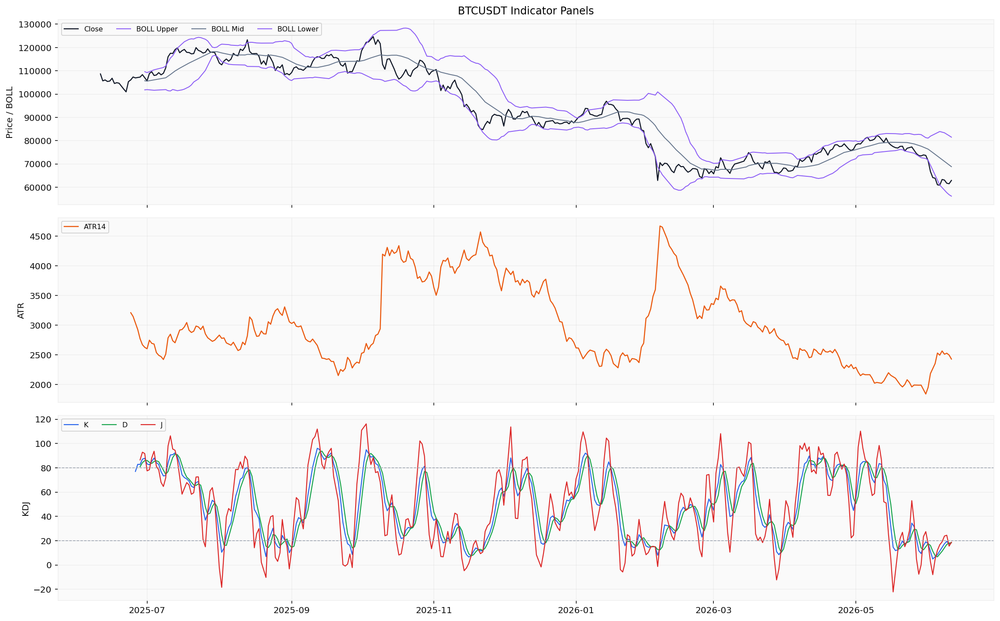
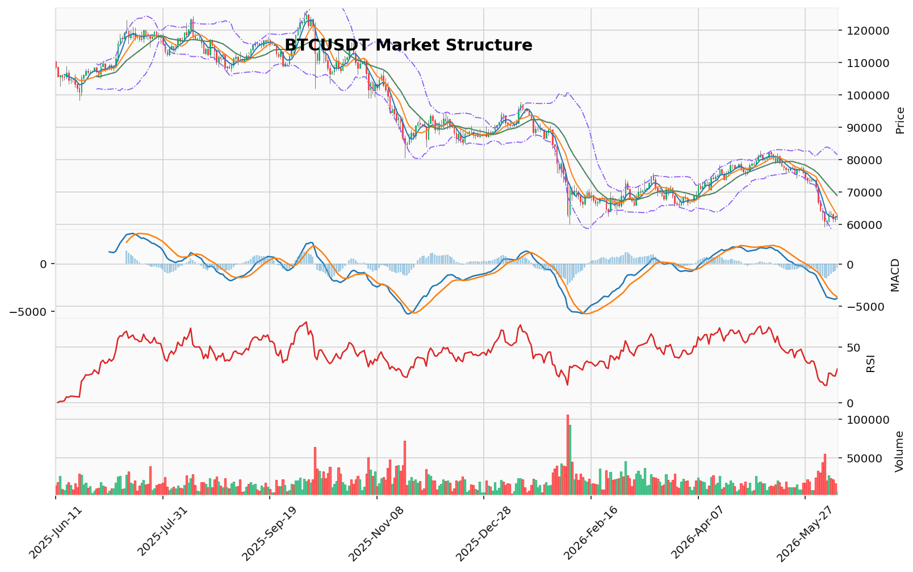

# Bitcoin（BTC）加密资产投资研究报告

> 报告生成时间（美东）：2026-06-11 05:48:51 EDT
> 报告生成时间（北京）：2026-06-11 17:48:51 CST

## 一、投资结论与组合动作

**最终组合动作：持有/观望**

**执行细则：**
- **禁止新开仓（无论多空）**：当前多空逻辑均有重大缺口，缺少上游数据验证，不具备任何方向的可执行条件。
- **不加杠杆**：未提供真实持仓参数，无法审计合约风险；当前价格波动受情绪驱动可能剧烈，杠杆风险不可控。
- **已持有现货者：维持现状，不减仓也不加仓。** 减仓缺乏迫在眉睫的上游证据（如放量破位），加仓则违背“等待确认”原则。在数据恢复和明确方向信号出现前，维持现状是最优风控方案。

**关键风险约束：**
- 所有方向性交易方案（做多或做空）均因数据缺口被否决。当前可执行动作仅限于持有/观望，直至成交量放量确认或关键数据恢复。
- 链上、宏观、事件数据大量缺失，进一步抑制了任何方向性判断的置信度。
- 具体执行价位、止损/失效条件需等待行情与技术资料恢复后确认，当前由资料包明示的可审计执行条件缺失。

**核心证据链（支撑“持有/观望”的3条关键论据）：**
1. **成交量收缩是决定性中性信号**：上游技术报告明确验证当前成交量处于收缩状态，证明价格波动的动能缺失。这既不能支持买入（反弹缺乏买盘确认），也不能支持卖出（下跌缺乏放量破位确认），只能支持等待。
2. **多空信号极端冲突**：中期看空结构（123突破确认、维加斯通道下方、MACD负值）与短期技术超卖（KD超卖、RSI接近超卖、TD13完成）形成方向性拉扯，任何单边押注均面临重大对立证据。
3. **空头核心证据被缺口削弱**：安全分析师引用的“中期看空”结构是客观事实，但资料包未提供可审计的执行条件（如跌破某价位则加速下行），因此不能直接转化为“立即卖出”指令。同样，面对情绪极值（Fear & Greed 12.0），多方证据也缺少统计回测基础，无法构建可执行偏多场景。

## 二、市场结构与技术指标分析

### 技术图表

### 2.1 市场结构总览

截至 2026-06-11 数据时间，BTC 当前价格为 62,933.09 USDT，24h 涨跌幅 +2.679%，24h 成交量 16,751.48 BTC（约 10.39 亿 USDT）。日线行情覆盖完整（366 行，一整年），小时行情覆盖 1,000 行但仅从 2026-04-30 开始，未覆盖完整分析区间。衍生品日频数据（资金费率、多空比、CVD 代理）与技术指标均完整返回；链上指标样本极少（8 笔大额转账、仅 1 日 AHR999 读数）；清算热力图覆盖 360 天但同样未覆盖完整分析区间。整体资料就绪度中等，局部缺口不影响核心技术分析，但链上与微观结构证据受限。

当前 BTC 处于**中期下降趋势（downtrend）结构**：
- 日线 MACD 柱线持续为负，价格运行于 MA20（68,844.35 USDT）下方超过一个月；
- 维加斯通道显示价格在 EMA144/EMA169 蓝带下方约 18.42%；
- 短期出现技术性企稳信号：日线 RSI14 为 30.29（接近超卖）、KD K 值 18.45（进入超卖区）、TD Sequential 完成看涨反转 13 计数（中等置信度）；
- 成交量处于 contracting 状态，表明企稳尚未获得成交量确认。

市场处于趋势偏空与短期技术超卖之间的拉扯窗口，结论受小时行情覆盖不完整和链上证据稀疏的限制。

### 2.2 指标覆盖状态

| 指标 | 覆盖状态 |
|:---|:---|
| 布林带 | 已引用、可分析 |
| 维加斯通道 | 已引用、可分析 |
| 双线反转 | 已引用、可分析 |
| AMD/SMC | 已引用、可分析 |
| 123 突破 | 已引用、可分析 |
| FVG | 已引用、可分析 |
| OB 订单块 | 已引用、可分析 |
| RSI | 已引用、可分析 |
| MACD | 已引用、可分析 |
| KD | 已引用、可分析 |
| TD 9/13 | 已引用、可分析 |
| 谐波形态 | 已引用、可分析（未匹配有效候选） |
| 交易密集带/成交量分布 | 已引用、可分析 |
| 清算地图（BTC 专用） | 已引用、可分析（BTC 专用口径） |
| CVD/主动买卖量 | 已引用、可分析（主动买卖量差代理） |
| 资金费率 | 已引用、可分析 |
| OI/多空比 | 已引用、可分析 |
| 宏观 | 缺失/不可用（市场资料包未涵盖宏观判断） |
| 链上 | 已引用、样本限制（仅 1 日 AHR999 和 8 笔链上事件） |
| AHR999 | 已引用、样本限制（仅 1 日读数） |
| 事件 | 缺失/不可用 |

### 2.3 指标推导过程

#### 2.3.1 OB 订单块

| 指标 | 数据 | 推导 | 交易作用 | 失效条件 |
|---|---|---|---|---|
| OB 订单块 | 近期没有确认的结构突破 | 当前 OB 候选区域尚未被价格有效测试或突破 | 可观察订单块区间参考价值有限，等待价格进入候选区间后的成交反馈 | 需订单簿或逐笔成交数据恢复后再评估 |

#### 2.3.2 POC / 成交量分布

| 指标 | 数据 | 推导 | 交易作用 | 失效条件 |
|---|---|---|---|---|
| 成交量分布 POC | POC 68,021.11 USDT，价值区间 65,596.51–80,144.10 USDT，样本 160 | 当前价格 62,933 USDT 已低于价值区间下沿，处于低成交量区域 | 偏低成交区价格可能缺乏稳定支撑，价格回升至价值区间（65,596 USDT 以上）才能进入高成交密度区域 | POC 为日均线近似分桶结果，非逐笔成交量分布数据 |
| 交易密集带 | 基于日线 OHLCV 近似分桶 | 当前价格处于价值区间下方，市场活动密度较低 | 非可执行交易条件，仅用于观察高成交密度区域相对位置 | 无明示执行条件 |

#### 2.3.3 TD Sequential

| 指标 | 数据 | 推导 | 交易作用 | 失效条件 |
|---|---|---|---|---|
| TD 看涨反转 13 | 方向：看涨反转，启动计数 1，倒数计数 13 已完成，置信度中等 | 13 计数完成意味着当前下跌推动阶段可能出现衰竭或反转 | 可作为短期企稳的技术线索，但中等置信度意味着需要其他指标交叉验证 | 等待资料包给出可审计条件后再评估 |

#### 2.3.4 谐波形态

| 指标 | 数据 | 推导 | 交易作用 | 失效条件 |
|---|---|---|---|---|
| 谐波形态 | 未匹配到有效候选，AB/XA=1.469，BC/AB=2.404，CD/BC=0.381 | 当前摆动比例未形成已知谐波形态的收敛条件 | 无有效信号，不支持谐波交易框架内的方向性结论 | 需新的摆动结构形成后再匹配 |

#### 2.3.5 FVG

| 指标 | 数据 | 推导 | 交易作用 | 失效条件 |
|---|---|---|---|---|
| FVG（未回补缺口） | 候选 21 个，未回补 5 个，最近上方缺口中线 65,478.66 USDT | 上方存在 65,478.66 USDT 附近的未回补 FVG，价格目前在其下方 | 仅作为技术参考，非方向性交易触发 | 等待资料包给出可审计条件后再评估 |

#### 2.3.6 AMD/SMC 与 123 突破

| 指标 | 数据 | 推导 | 交易作用 | 失效条件 |
|---|---|---|---|---|
| AMD/SMC | 结构：高点下移、低点下移；阶段：下跌推进阶段；买侧流动性 64,234.68 USDT（2026-06-07），卖侧流动性 59,130.91 USDT（2026-06-05） | 当前处于下跌推进结构，上方 64,234.68 为近期买侧流动性池，下方 59,130.91 为卖侧流动性池 | 下跌结构未被破坏，需价格清除买侧流动性（64,234.68）才看结构转向 | 无明示执行条件，仅反映摆动结构 |
| 123 突破 | 状态：下破已确认，方向看跌，突破位 74,289.6 USDT | 价格已跌破中期摆动低点（74,289.6）确认看跌方向 | 看跌结构持续有效，直到价格收复突破位（74,289.6） | 等待资料包给出可审计条件后再评估 |

#### 2.3.7 Vegas / 布林带 / RSI / MACD / KD

| 指标 | 数据 | 推导 | 交易作用 | 失效条件 |
|---|---|---|---|---|
| 维加斯通道 | 价格在蓝带（EMA144/169）下方，距蓝带中线 -18.42%；EMA144=76,407.21，EMA169=77,878.18 | 中期趋势偏空，价格与蓝带偏离幅度较大（约 18.42%） | 价格处于蓝带下方，中期趋势结构为空方主导 | 需价格回升至蓝带区域（76,400+）才可能改变趋势结构 |
| 布林带 | 上轨 81,501.15，中轨 68,844.35，下轨 56,187.55 | 当前价格 62,933.09 位于中轨与下轨之间，略偏下轨半程 | 通道宽度正常，价格未触碰下轨，未出现极端通道外运行 | 等待资料包给出可审计条件后再评估 |
| RSI14 | 30.29 | 接近超卖阈值（30），动量偏弱但尚未进入极端区域 | 可作为短期超卖信号的参考，但接近阈值不等于已触发 | 等待资料包给出可审计条件后再评估 |
| MACD | MACD -4,041.36，信号线 -3,515.77，柱线 -525.59 | 负值 MACD 且柱线为负，动能持续偏空；柱线幅度不大，未出现加速放大 | 中期动能偏空，尚无动能衰竭或反转信号 | 需要柱线收窄或 MACD 上穿信号线才可能改变 |
| KD | K 18.45，D 18.35（超卖），J 18.66 | K、D 均低于超卖阈值（20），进入超卖区 | 短期摆动指标显示超卖，可能酝酿技术性反弹 | 等待资料包给出可审计条件后再评估 |

#### 2.3.8 清算地图 / CVD / 资金费率 / OI / 多空比

| 指标 | 数据 | 推导 | 交易作用 | 失效条件 |
|---|---|---|---|---|
| 清算地图 | 最大清算簇价格 112,975.1 USDT，规模 438,024,103.93 USD；多头强平总额 440,211,871.85 USD，空头强平总额 240,743,882.52 USD | 最大清算簇在极高价位，与当前价格（62,933 USDT）距离较远；历史多头强平额大于空头 | 清算簇位置距离当前价格甚远，短期直接清算驱动概率低 | 清算地图按 BTC 专用口径使用，不可平移至其他币种 |
| CVD 代理（主动买卖量差） | 买量 150,806,922.89 USD，卖量 157,876,216.32 USD，买卖比 0.9552（2026-06-11 日度数据） | 当日主动卖量略大于买量，买卖比小于 1 | 无单边强势方向，日内买卖力量基本均衡 | CVD 标准字段未返回，当前以主动买卖量差代理 |
| 资金费率 | 0.001861 percent | 正费率但数值较低，多头持仓成本不高 | 衍生品市场无明显拥挤或极端情绪 | 等待资料包给出可审计条件后再评估 |
| OI（未平仓量） | 29,931,134.95 USD（单位：USD） | 未平仓量与近期量级相当，无异常骤增或骤降 | 持仓总量处于常规水平，未出现极端建仓或清仓 | 等待资料包给出可审计条件后再评估 |
| 多空比 | 1.73 | 多头账户数高于空头账户数，但较前几日（2.09）有所下降 | 多头偏多但并未极端（最高曾达 2.09） | 等待资料包给出可审计条件后再评估 |

#### 2.3.9 宏观 / 链上 / AHR999 / 事件

| 指标 | 数据 | 推导 | 交易作用 | 失效条件 |
|---|---|---|---|---|
| 宏观 | 市场资料包未涵盖宏观判断 | 宏观/新闻由新闻资料包负责，行情资料包不重复判断 | 当前不纳入市场结构结论 | 需回看新闻/宏观资料包 |
| 链上（交易所净流量） | 13,906,879.0 USD（单日读数） | 单日交易所净流量为正，但仅 1 日样本，无法判断趋势 | 不能作为链上资金流向的依据 | 需链上日频指标恢复足够样本后才能判断 |
| 链上（大额转账） | 8 笔，覆盖 2026-06-04 至 2026-06-11 | 样本极少（8 笔/7 天），计数/笔数口径 | 样本不足，不能推导资金流向或主体意图 | 需更多链上事件数据恢复后再评估 |
| AHR999 | 0.3036（无量纲/指数读数） | 当前读数处于历史低位区域（通常小于 0.45 被视为低估区间） | BTC 估值参考指数，属于偏低范围 | 仅 1 日读数，无法判断趋势变化 |
| 事件 | 事件日历缺失/不可用 | 无法判断相关事件类型是否构成驱动 | 不能作为当前交易依据 | 需事件数据提供方恢复 |

### 2.4 指标小结

价格结构（AMD 高点下移/低点下移、123 下破确认、维加斯通道下方）共同指向中期偏空格局；但短期摆动指标（KD 超卖、RSI 接近超卖、TD 看涨反转 13 完成）和估值指数（AHR999 偏低）提供技术性反弹或企稳的线索。多空信号出现分歧，市场处于趋势延续与短期超卖修复之间的观察窗口。

### 2.5 关键价格与风险

- **支撑区间**：
  - 60,746–60,755 USDT（近期日线低点区域，含 2026-06-07 最低 60,746、2026-06-10 最低 60,755）
  - 59,130.91 USDT（AMD 卖侧流动性池）
  - 56,187.55 USDT（布林带下轨）

- **压力区间**：
  - 64,234.68 USDT（AMD 买侧流动性池/近期高点）
  - 65,478.66 USDT（未回补 FVG 缺口中心）
  - 68,844.35 USDT（MA20/布林带中轨）
  - 68,021.11 USDT（POC 区域）

- **技术参考位**：
  - MA5：62,518.42
  - MA10：62,932.27
  - MA20：68,844.35
  - 布林带中轨：68,844.35
  - 维加斯 EMA144：76,407.21
  - 维加斯 EMA169：77,878.18
  - 123 突破位：74,289.6 USDT

### 2.6 多空场景

#### 2.6.1 偏多场景

当前无法构建可执行偏多场景。虽然 KD 超卖、TD 看涨反转 13 完成、AHR999 偏低这些元素均倾向于偏多方向，但资料包未给出任何可审计的触发条件（如价格站上某均线、成交量放大确认、MACD 柱线翻红等明示条件）。需要恢复的资料类别：本地技术指标模块的明示执行条件表、成交量放量确认触发、MACD 动能反转的量化阈值。

#### 2.6.2 偏空场景

当前无法构建可执行偏空场景。中期趋势结构虽偏空（123 下破、维加斯通道下方、MACD 负值），但短期 KD 超卖和 TD 看涨反转完成表明下跌速度可能放缓，且资料包未给出继续追空的可审计触发条件。需要恢复的资料类别：下方清算簇的动态触发阈值、成交放量破位的明示条件、MACD 柱线加速放大的量化阈值。

#### 2.6.3 观望场景

鉴于多空指标出现分歧——中期趋势偏空但短期超卖——当前不宜追多也不宜追空。以下数据缺口进一步压低结论置信度：
- 小时行情仅覆盖 2026-04-30 以来（2025-06-11 至 2026-04-29 的高频数据缺失）；
- 链上大额转账仅 8 笔，无法判断资金主体动向；
- 宏观/事件资料缺失，重大催化因素不明。

等待价格在现有技术区间（60,746–64,234 USDT）内出现更明确的方向信号后再做判断。

### 2.7 数据限制与下一步

1. **小时行情覆盖不完整**：1,000 行仅覆盖 2026-04-30 至 2026-06-11，前期 2025-06-11 至 2026-04-29 的高频数据缺失，限制了短线结构（如近期摆动点、小级别 FVG 和订单块）的完整识别。
2. **链上数据样本极少**：AHR999 仅 1 日读数，交易所净流量仅 1 日读数，大额转账仅 8 笔/7 天。无法形成链上趋势判断，AHR999 的偏低读数虽可提及但不能作为定投或抄底依据。
3. **清算热力图覆盖 360 天**：但未覆盖完整分析区间（缺口 2025-06-11 至 2025-06-16 共约 6 天），对结论影响有限，但应在高精度分析前补齐。
4. **宏观/事件资料缺失**：无法判断当前宏观政策、监管事件或重大供给/需求催化剂对市场的影响。
5. **资金费率、多空比、OI、CVD 代理等衍生品数据日频完整**：未发现极端信号，这部分资料可用度高。
6. **本地技术指标（RSI、MACD、KD、布林带、维加斯等）全部计算成功**：为市场结构判断提供了扎实的技术证据，但缺少明示执行条件表，无法将指标读数转换为可执行交易条件。
7. **下一步建议**：补充宏观/新闻资料包以判断事件驱动环境；增加链上日频数据获取（至少 30 天连续样本）；补齐小时行情至完整分析区间；获取本地指标模块的明示执行条件表以将技术读数转化为可审计交易框架。

## 三、项目与代币基本面分析

### 3.1 已返回基本面数据摘要

截至2026年6月11日，基本面资料包返回了部分可引用的核心数据，主要覆盖市值、供应快照、机构资金流和单点估值读数。但关键维度（链上使用、供给发行、收入费用、生态扩展等）存在明显缺口，限制了基本面维度的完整评估。

| 数据维度 | 当前读数 | 单位/说明 |
| :--- | :--- | :--- |
| **价格** | 62,933.09 | USDT |
| **市值** | ≈1.259 万亿 | USD |
| **流通供应量** | 20,040,441 | BTC |
| **总供应量** | 20,041,215 | BTC |
| **完全稀释估值** | 1.2588 万亿 | USD |
| **现货ETF净流入（近4日累计）** | -7.08 亿 | USD（净流出） |
| **AHR999 指数** | 0.3036 | 无量纲/指数读数 |
| **交易所净流量** | +1,391 万 | USD（单日净流入） |
| **DeFi 总锁仓量** | 单行记录，无时间序列 | — |

### 3.2 供给与发行：当前快照无法判断未来稀释压力

当前快照显示流通供应量与总供应量接近（相差约774 BTC），完全稀释估值与市值几乎相等。但资料包未返回矿工发行计划、解锁安排、供应曲线或未来发行节奏等供给端材料。**不能仅凭该快照得出"无未来稀释压力"或"供应已接近上限"的结论。** 该缺口影响对BTC长期通胀结构和稀缺性叙事（如减半周期）的评估。若后续数据恢复，需关注发行窗口、矿工补贴变动或任何解锁事件。

### 3.3 链上使用与网络活动：数据不足，无法评估

核心链上基本面指标（活跃地址数、交易笔数、链上转账价值、手续费收入、MVRV、SOPR、已实现市值等）均未返回。**无法分析网络实际使用强度、矿工经济结构或网络安全预算。** 交易所净流量仅1日读数（+1,391万美元），大额转账仅8笔（覆盖7天），均不能推导资金流向或主体意图。若后续恢复至少30天的连续样本，才能形成链上趋势判断。

### 3.4 生态与协议数据：未覆盖

缺少BTC Layer2、闪电网络、侧链等二层扩展的链上经营数据，无法评估生态对主链使用量和价值捕获的贡献。DeFi总锁仓量仅单行记录，缺少时间序列和多链分解，不足以分析协议层面的资金使用活跃度。

### 3.5 机构资金方向：近期信号偏空

现货ETF资金流（2025-06-11至2026-06-10，共253行数据）显示，最近四个交易日累计净流出约7.08亿美元，具体流水为：

| 日期 | ETF净流入（USD） |
| :--- | :--- |
| 2026-06-10 | -213,900,000 |
| 2026-06-09 | -77,400,000 |
| 2026-06-08 | -91,400,000 |
| 2026-06-05 | -325,700,000 |
| 2026-06-04 | +3,200,000 |

该数据覆盖不完整（部分日期缺失），且仅覆盖现货ETF产品维度，不包括期货ETF、信托产品、场外交易或链上巨鲸行为。近四日累计净流出7.08亿美元显示机构资金在近期出现较明显的撤出倾向，但**仅凭4个交易日样本不能判断该趋势将持续**。若后续数据恢复后显示连续净流入，需要重新评估该维度的影响。

### 3.6 估值维度：单点读数缺乏统计背景

AHR999指数为0.3036（单日无量纲读数）。该方向缺少历史统计或回测证据，**无法据此形成估值高低判断或抄底/逃顶信号**。即使读数处于历史偏低区间（通常低于0.45被视为低估区域），但缺少序列样本和回测支持，只能作为待验证的估值线索，不能作为买入依据。

### 3.7 基本面维度对当前组合动作的意义

| 维度 | 对方向判断的影响 | 数据限制 |
| :--- | :--- | :--- |
| 供给与发行 | 无法判断未来稀释或发行压力 | 缺少矿工发行计划、解锁安排、供应曲线 |
| 链上使用 | 无法评估网络活跃度或采用趋势 | 缺少活跃地址、交易笔数、手续费收入等 |
| 机构资金 | 近期偏空（ETF流出），但样本限制 | 仅4个交易日，部分日期缺失 |
| 估值 | 单点偏低读数，但无回测支持 | AHR999仅1日读数，缺少序列与统计 |
| 生态与协议 | 无法评估 | Layer2、闪电网络、DeFi数据均缺失 |

**结论**：当前基本面资料包仅能支撑"机构资金近期有撤离迹象"这一偏空信号，以及"AHR999和交易所净流量均为单点读数"的可用性说明。**不足以支撑从基本面角度给出买入/持有/卖出建议，也无法评估当前价格相对于基本面是否合理。** 若后续链上使用数据、供给发行材料和估值指标恢复连续样本，需要重新评估基本面维度对组合动作的影响。

## 四、新闻、监管与事件驱动

### 4.1 新闻资料包可用性说明

本次分析调用了 CRYPTO 市场 BTC 新闻资料包。资料包返回的数据状态为**部分可用**：

- **项目新闻**：返回 35 条记录，时间覆盖 2025-06-26 至 2026-05-23，未覆盖完整分析区间（2025-06-11 起点至 2026-06-11 终点均存在缺口）。
- **宏观新闻**：返回 70 条记录，时间覆盖 2025-12-03 至 2026-06-08，同样未覆盖完整分析区间。
- **已验证的可靠来源**：资料包中绝大多数条目来源于“媒体聚合搜索线索”和“公开搜索线索”，按写作规则，搜索线索不能作为已确认新闻事实。唯一一条非搜索线索的记录为：**GitHub:bitcoin/bitcoin** 于 2026-04-20 发布 Bitcoin Core 31.0 版本。

### 4.2 可靠来源事件梳理

#### 已验证的可靠事件

**1. Bitcoin Core 31.0 版本发布**
- **来源**：GitHub 官方仓库（bitcoin/bitcoin）
- **发布时间**：2026-04-20
- **内容摘要**：Bitcoin Core 31.0 版本已可从 Bitcoin Core 官方网站获取，发布说明详见 Git 仓库。
- **事件性质**：比特币核心客户端例行协议升级与维护发布。

**方向**：中性偏利好（长期技术维护证明开发活跃）  
**影响周期**：中长期（版本迭代影响节点运营与安全基础设施）  
**证据强度**：高（直接来自 GitHub 官方发布渠道）  
**后续需要跟踪**：该版本是否包含安全补丁、功能升级或共识变更；节点升级率及矿工/交易所适配进度。

---

#### 搜索线索（未核验，不能作为事实源）

项目新闻与宏观新闻中大量记录（包括 2026-05-23、2026-05-19、2026-05-04、2026-04-09 等项目新闻条目，以及 2026-06-08、2026-06-07、2026-06-05、2026-06-03、2026-05-29 等宏观新闻条目）均为媒体聚合搜索线索或公开搜索线索。这些线索提示存在监管、机构资金、宏观或行业相关的待核验主题，但在获得官方公告、交易所公告、监管文件或已读取原文的可靠媒体正文确认之前，不能作为新闻事实写入报告。

### 4.3 宏观与行业背景

由于宏观新闻来源全部为搜索线索，未返回任何经官方、交易所、监管或可靠媒体原文验证的宏观事件、货币政策公告、监管机构声明或地缘政治新闻，因此本报告无法确认任何宏观背景事件作为已发生的新闻事实。对于宏观维度存在的影响，需等待可靠来源数据补充后重新评估。

**资料缺口说明**：宏观新闻数据覆盖存在明显的时间窗口限制——最早记录始于 2025-12-03，也即分析区间前 6 个月（2025-06-11 至 2025-12-02）的宏观新闻资料完全缺失。

### 4.4 来源可靠性与时效性评估

| 来源类型 | 状态 | 说明 |
|---|---|---|
| 官方公告（项目方/GitHub） | 1 条已验证 | Bitcoin Core 31.0 版本发布，来源可靠 |
| 监管文件 | 0 条 | 无任何监管原始来源返回 |
| 交易所公告 | 0 条 | 无任何交易所官方来源返回 |
| 可靠媒体报道（已读原文） | 0 条 | 未读到原文，无法确认 |
| 搜索线索/媒体聚合 | 大量返回 | 不能作为事实源，仅作为待核验线索 |
| 社区/KOL 传闻 | 未单独返回 | 未形成可引用的数据集 |

时效性方面：项目新闻最新记录为 2026-05-23，距报告日约 19 天；宏观新闻最新记录为 2026-06-08，距报告日约 3 天。但所有近期记录均属搜索线索，不构成可验证事实。

### 4.5 对价格与市场情绪的短中期影响判断

由于可确认的新闻事件仅有 Bitcoin Core 31.0 版本发布这一项常规技术维护事件，该事件对短期（日内至 5 天）价格影响较小，属于“噪音”级别事件；对中长期（数周至数月）的影响取决于版本中是否包含影响矿工博弈、交易处理规则或安全假设的关键变更。目前资料包未返回对应详细发布说明内容，无法做出进一步判断。

对于整体分析区间，**缺少可靠新闻来源意味着无法从新闻事件驱动维度对 BTC 价格方向做出有效判断**。若后续可靠来源恢复并验证方向性事件（如监管政策落地、机构配置变动、链上安全事件或宏观冲击），需要重新评估。

### 4.6 对项目基本面与投资逻辑的潜在影响

Bitcoin Core 版本发布是比特币网络基础设施维护的常规流程。从投资逻辑角度，持续的客户端更新说明核心开发团队保持活跃，技术上不存在明显停滞信号。但该事件本身不涉及需求端驱动力、供给端变化（如减半）、监管风险变动或生态扩张等基本面因子。

**缺少已验证的监管事件、机构资金动态、交易所政策变化、链上重大事件及安全事件素材**，不能对 BTC 基本面投资逻辑（如作为价值存储、机构配置资产、监管合规演化等核心叙事）做出基于新闻事件的评估。

### 4.7 数据限制与风险提示

1. **覆盖区间不完整**：项目新闻最早记录为 2025-06-26，宏观新闻最早记录为 2025-12-03，分析区间起点（2025-06-11）至最早记录之间存在数据空白，且终点（2026-06-11）附近无已验证来源。
2. **搜索线索未核验**：大量返回的媒体聚合/搜索线索不能作为事实源，其中涉及的机构名称、法案名称、产品名称、政策名称或事件标题均不能进入报告正文。
3. **缺乏监管原始来源**：整个分析区间未返回任何监管机构（如 SEC、CFTC、各国央行、财政部等）的官方文件或声明。
4. **缺乏交易所公告**：未返回任何交易平台上架、下架、政策调整或安全事件公告。
5. **缺乏链上/安全事件验证**：所有链上活动、黑客攻击、协议更新的线索均未经原始数据验证。
6. **市场情绪指标不能作为新闻源**：报告未引用任何市场级情绪指标作为新闻依据。
7. **语言与翻译限制**：资料包中部分线索来源于非中文语境，可能存在跨语言信息遗漏。
8. **潜在误读风险**：仅凭一条版本发布事件，不能得出“开发活跃，利好”或“无负面消息，潜在利好”的结论。缺新闻不等于无风险，也不等于存在利好。

## 五、社区情绪、事件预期与交易拥挤度

**数据可用性**：舆情资料包返回的唯一可用市场级情绪指标为 Alternative.me Fear & Greed 指数，当前读数 **12.0**（“极度恐惧”区间）。该指数为全市场综合情绪分数，非 Bitcoin 专属情绪指标，且仅提供当日单点读数，无法反映情绪变化趋势或社区内部情绪分裂。资料包未返回任何真实社交平台（Twitter/X、Reddit、Telegram、Discord 等）的帖子样本、互动数据或情绪分类结果；未返回事件预期类材料；未提供样本偏差、刷量或失真风险的量化依据。来源尝试记录共 11 条，最终仅形成 2 个标准化数据引用，大量潜在数据源未成功返回可用样本。

**当前情绪读数**：
- **Fear & Greed 指数**：12.0（极度恐惧）。属单点市场级情绪分数，无时间序列、无历史回测、无 BTC 专属修正。
- **社区讨论热度与情绪方向**：无可用数据。
- **主要叙事与传播路径**：无可用数据。
- **参与者结构**：无可用数据。
- **事件预期线索**：无可用数据。

**情绪对当前组合动作的限制**：
- 单一 Fear & Greed 指数（12.0）是已返回的市场级情绪读数，但上游报告明确声明“仅凭单一指数…缺少真实社交样本、事件预期材料及统计回测依据，短期情绪对 BTC 价格 1-5 天走势的潜在影响无法判断”。该方向缺少统计或回测证据，不能作为方向性交易依据。
- 极端恐惧读数本身不能构成买入或卖出信号。组合经理保留的“持有/观望、不新开仓、不加杠杆”动作平衡了情绪极值可能带来的短期反弹机会与数据缺口导致的判断置信度限制。
- **待恢复数据类别**：社交平台样本（帖子数、互动量、情绪倾向分布）、事件预期材料的量化指标、情绪失真来源的识别数据；上述数据恢复后需重新评估情绪是否支持“拥挤/脆弱、预期过满或反身性风险”的判断。

**交易拥挤度参考（衍生品层面，来自市场技术报告）**：
- 资金费率：0.001861%（正常偏低水平，多头持仓成本不高）
- 多空比：1.73（多头账户数偏多但非极端，且从前值 2.09 有所回落）
- OI：29,931,134.95 USD（常规量级，无异常骤增或骤降）
- 当前衍生品市场无明显单边过热或极端拥挤；多空比显示多头偏多，但未触发历史极端阈值，故不能作为方向性交易依据。

**数据缺口对情绪判断的影响**：
1. **社交平台样本缺失**：无法评估社区情绪方向、叙事识别、参与者结构或语言社区差异。
2. **事件预期材料缺口**：市场对监管、宏观经济、链上协议等方向性事件的预期态度不可知。
3. **Fear & Greed 单一读数**：仅为全市场综合情绪分数，非 BTC 专属，且仅当日快照，无法反映情绪趋势或社区内部情绪分裂。
4. **失真风险未量化**：无法判断样本是否存在刷量、机器人活动或空投噪音。
5. **限制结论**：无法从情绪维度支撑买入或卖出决策，亦无法判断情绪是否增强或削弱技术面/基本面判断。

## 六、交易计划与组合风险

基于对多空双方证据的权衡，组合经理给出以下最终交易计划与风险约束：

### 6.1 当前持仓动作

| 持仓类型 | 动作 | 理由 |
|---------|------|------|
| **新开仓（多/空）** | 禁止 | 多空逻辑均有重大数据缺口，缺乏成交量确认的可执行条件；上游资料包未给出任何可审计触发条件 |
| **杠杆使用** | 禁止 | 未提供真实持仓与保证金参数，无法审计合约风险；当前价格受情绪驱动波动不可控 |
| **已持有现货者** | 维持现状，不减仓，不加仓 | 减仓缺乏迫在眉睫的上游证据（如放量破位），加仓违背"等待确认"原则；极端情绪和技术超卖区域强制减仓可能造成低位交出筹码 |

### 6.2 市场状态与证据边界

**当前市场结构**：
- **中期趋势**：偏空（123突破确认下破、维加斯通道下方18.42%、MACD柱线持续为负）
- **短期技术状态**：极度超卖（RSI 30.29、KD K值18.45、TD13看涨反转计数完成）
- **动能**：成交量**收缩**，方向不明，缺乏确认信号
- **情绪**：极度恐惧（Fear & Greed指数12.0）

| 证据维度 | 指向 | 置信度限制 |
|---------|------|-----------|
| 中期趋势结构（123突破、维加斯、MACD） | 看空 | 三重验证，但结构点仅为技术参考位，无可审计执行条件 |
| 机构资金（ETF近4日净流消耗约7.08亿美元） | 看空 | 4日样本，缺历史分位，不能确认趋势持续 |
| 短期技术超卖（RSI/KD、TD13） | 可能反弹 | 未获成交量确认，该方向缺少统计或回测证据 |
| 极端情绪（Fear & Greed 12.0） | 潜在反向信号 | 单点读数，缺少统计回测，无法判断短期走势 |
| 衍生品市场（多空比1.73、资金费率0.001861%） | 健康 | 无极端信号，但空头不拥挤限制逼空空间 |

### 6.3 多空论证冲突与组合经理判断

| 争议点 | 激进看多方 | 安全看空方 | 组合经理结论 |
|--------|-----------|-----------|-------------|
| **极度恐惧（12.0）的含义** | 强烈的反向情绪信号，抛售尾声 | 恐惧可加深至更低读数，不能作为买入依据 | 该方向缺少统计或回测证据，无法判断短期走势；极端情绪是观察项，非执行条件 |
| **成交量收缩的解读** | 筑底信号，市场正在吸筹 | 下跌中继，多方证据不足的中性信号 | 成交量收缩是**中性信号**，不能支持买入也不能支持卖出，只能支持等待 |
| **多头风险回报比** | 动态计算显示潜在收益高于止损风险 | 静态计算显示下行空间（6-11%）远大于上行（2-4%） | 多头上方第一阻力位64,234 USDT（约4%），下方近期低点60,746 USDT（约3.5%），但破位后下方卖侧流动性池59,130 USDT和布林带下轨56,187 USDT打开更大下行空间；**多头的不对称风险大于收益** |
| **空头回补潜力** | 极度恐惧下空头回补弹性大 | 多空比1.73表明多头多于空头，缺乏逼空燃料 | 空头不拥挤，即使反弹也难以形成剧烈逼空；该方向无法作为方向性交易依据 |
| **"已持有现货者建议减仓50%"** | 不采纳，可能踏空反弹 | 采纳，认为结构偏空且资金流出 | **否决**：在极端情绪和超卖区域强制减仓是过度防御，可能导致低位交出筹码；无迫在眉睫的失效信号 |

### 6.4 可执行价位与触发条件

根据上游资料包状态，**当前无法设定任何可执行价位、触发条件、目标位或失效位**。原因：
- 成交量收缩，价格波动缺乏动能基础
- 资料包未给出可审计执行条件表
- 具体执行价位需等待行情与技术资料恢复后确认

**需要恢复的数据类别**：
- 日线或4小时成交量放量确认触发条件（至少2倍于近期均值）
- MACD动能反转的量化阈值
- 清算簇动态触发阈值
- 链上日频指标（持仓变化、交易所净流量）连续样本
- 宏观/事件资料

### 6.5 风险边界

| 风险类型 | 等级 | 说明 |
|---------|------|------|
| **价格结构风险** | 中 | 中期下降趋势明确，但短期超卖可能引发有限反弹 |
| **流动性风险** | 低 | BTC为主要资产，流动性充足 |
| **事件风险** | 中 | 宏观/事件资料缺失，无法评估外部催化因素 |
| **数据缺口风险** | 中 | 链上、宏观、事件数据大量缺失，降低方向性判断置信度 |
| **杠杆/合约风险** | 不适用 | 禁止开立新合约头寸，未提供真实持仓与保证金参数 |
| **清算风险** | 低 | 最大清算簇在112,975 USDT，远离当前价格62,933 USDT；多头强平额远高于空头，但短期直接清算驱动概率低 |

**核心风控原则**：在不具有方向性确认证据的情况下，**不交易就是当前最好的交易**。已持有现货者维持现状，既不加仓扩大风险暴露，也不减仓踏空潜在的情绪修复反弹。

### 6.6 数据缺口导致的执行限制

| 缺失数据 | 对交易计划的影响 |
|---------|-----------------|
| 链上日频指标（持仓变化、交易所净流量）仅1日样本 | 无法形成链上趋势判断，不能作为持仓调整依据 |
| 小时行情覆盖不完整（缺失2025-06-11至2026-04-29高频数据） | 短线微观结构判断受限，无法识别小级别FVG和订单块 |
| 宏观/事件资料缺失 | 无法评估外部催化因素，关注宏观冲击的不可见风险 |
| AHR999仅1日读数，无历史序列或回测 | 不能作为估值判断或定投依据 |
| 市场级情绪指标缺乏社交样本支撑 | Fear & Greed指数12.0为全市场综合指标，非BTC专属数据 |

**方向性证据限制**：当前多空信号极度冲突，但缺乏任何被成交量验证的方向性确认。中期结构偏空与短期超卖之间的矛盾，在成交量收缩的环境下，任何方向押注的风险回报比均不具吸引力。

## 七、关键分歧与跟踪条件

当前报告的核心分歧在于：中期下降趋势结构与短期极度超卖信号之间的冲突，以及不同分析师对同一证据链的不同权重分配。组合经理的最终判断“持有/观望、不新开仓、不加杠杆”是综合考量证据质量、数据缺口和风险约束后的最优解。本节列出主要争议点、组合经理的采纳逻辑，以及需要等待数据恢复后评估的跟踪条件。

### 7.1 关键分歧对照

| 争议维度 | 激进/多方向 | 保守/空方向 | 中性方向 | 组合经理最终采纳 |
| :--- | :--- | :--- | :--- | :--- |
| **情绪极值（Fear & Greed 12.0）** | 视为强烈反向信号，是短期反弹的“情绪燃料” | 恐惧可以更加恐惧，单点读数无回测支撑，不能作为买入依据 | 是重要信号但非进场条件，需其他维度交叉验证 | **不采纳为方向性证据**。上游材料明确该方向“无法判断短期走势”且“缺少统计回测”。单点情绪读数不能外推为交易触发。 |
| **技术超卖（RSI/KD/TD13）** | 视为“高概率技术性博弈”，风险回报比有利，应小仓位试多 | 在已确认下降趋势中，超卖是陷阱而非机会，成交量收缩说明反弹缺乏基础 | 是潜在机会窗口，但需成交量放量确认后方可参与 | **部分采纳为待验证线索**，但拒绝转化为操作依据。上游材料指出“无法构建可执行偏多场景”，且“该方向缺少统计或回测证据”。超卖信号仅作为企稳的线索，不能作为买入条件。 |
| **机构ETF流出（4日约7.08亿美元）** | 视为“恐惧性抛售尾声”，可能是反向指标 | 视为趋势性撤资，最安全的假设是流出将持续 | 是看跌证据，但缺少历史分位，不能判断持续性 | **采纳为看跌辅助证据**。连续大额净流出是明确资金面负面事实，但样本仅4日，不能外推为“流出现象会持续”。同时，该证据不足以单独构成减仓指令。 |
| **成交量收缩** | 解释为“筑底”信号 | 解释为“下跌中继休整”，等待下一波放量下跌 | 视为中性信号，方向不明 | **采纳为核心约束条件**。上游材料明确成交量收缩为中性事实，不能支撑买入或卖出。这是当前最关键的缺失信号，也是“持有/观望”的核心理由。 |
| **多头风险回报比** | 静态计算忽略情绪驱动的反弹弹性，实际赔率更优 | 下行空间（6-11%）远大于上行空间（2-4%），对多头不利 | 方向不明时，静态比例本身不应作为方向依据 | **部分采纳风险警示**，但拒绝作为减仓的独立依据。上游材料未提供可审计的失效触发条件，静态比例在成交量收缩环境下不能作为方向性交易依据。 |

### 7.2 组合经理采纳与放弃的论据链

**采纳的关键证据：**
1. **中期下降趋势已确认**：123突破确认下破、维加斯通道下方约18.42%、MACD柱线持续为负。三重技术结构验证，证据强度中等偏高。
2. **成交量收缩为中性信号**：明确标注为“方向不明”，不能支持买入或卖出，只能支持等待。
3. **机构资金近期净流出**：连续4个交易日累计净流出约7.08亿美元，为明确的资金面负面事实。
4. **衍生品市场无极端拥挤**：多空比1.73（多头偏多但非极端）、资金费率0.001861%（正常范围）。这虽不直接导向看空，但削弱了“空头挤压/逼空”的反弹叙事。

**放弃的未验证说法：**
1. **将“极度恐惧”外推为反弹触发**：该方向缺少统计回测，情绪极值不能作为方向性交易依据。
2. **将“超卖”外推为高概率反弹**：该方向缺少统计或回测证据，上游材料标注“无法构建可执行偏多场景”。
3. **将“成交量收缩”解读为“筑底”**：该方向性解释未由资料包验证，成交量收缩是中性信号，不能作为看涨依据。
4. **基于存量技术参考位设定未来执行方案**：上游材料未给出可审计的行权条件或失效触发，所有通过技术位推导的交易方案均被拒绝。

### 7.3 需要跟踪的验证条件

以下数据类别恢复后，需重新评估当前持有/观望立场。**所有条件仅为观察类别，不预设方向动作，待可审计数据返回后再做判断。**

| 数据类别 | 当前状态 | 需要恢复的最小样本 | 恢复后对决策的影响 |
| :--- | :--- | :--- | :--- |
| **成交量** | 收缩（中性） | 日线或4小时成交量显著高于近期均值（至少2倍） | 若放量站上关键位（如64,234 USDT），可重新评估偏多场景；若放量跌破近期低点（60,746-60,755 USDT），可重新评估偏空场景 |
| **价格结构** | 中期偏空，短期超卖 | 价格能否放量站上64,234 USDT（AMD买侧流动性池） | 放量站上则短期结构可能转向；不能站上则中期看空结构仍占主导 |
| **机构资金** | 连续4日净流出 | 现货ETF净流向能否由连续净流出转为连续净流入 | 若转为净流入且持续，可提升做多置信度；若流出扩大或持续，维持看跌权重 |
| **链上数据** | 仅1日交易所净流量、8笔大额转账 | 至少连续30日的交易所净流量、持仓变化、巨鲸动向 | 可验证“恐惧抛售”叙事是否成立，或是否存在积累行为 |
| **情绪数据** | 仅Fear & Greed 12.0 | 恢复社交平台样本量化分析（情绪方向、叙事识别、参与者结构） | 可交叉验证情绪极值是否与社区真实情绪一致 |
| **宏观/事件数据** | 缺失 | 恢复可验证的宏观政策、监管事件、供给/需求催化剂 | 可评估外部催化剂对当前结构的冲击方向 |

### 7.4 数据缺口对判断的限制

1. **链上与宏观数据大量缺失**：当前无法判断资金实质流向、网络使用强度、宏观催化剂。该缺口直接降低了任何方向性判断的置信度，也是“持有/观望”而非“做空”或“做多”的重要原因。
2. **小时行情覆盖不完整**：仅覆盖2026-04-30以来，前期高频数据缺失，限制了短线微观结构的完整识别。
3. **事件催化剂不明确**：唯一可验证的新闻事件（Bitcoin Core 31.0版本发布）为常规维护事件，无法形成对短期价格的方向性驱动。
4. **供给与发行材料不足**：虽流通供应量与总供应量接近，但缺少协议层面的发行节奏或解锁计划数据，无法判断未来稀释压力。

### 7.5 跟踪条件的使用边界

- 上述跟踪条件均**不预设方向动作**。当前组合动作已锁定为“持有/观望、不新开仓、不加杠杆”，不会因为价格是否站上某均线或成交量是否放大就自动执行买入或卖出。
- 仅当对应数据类别恢复并形成可审计条件（如上游报告给出明示的执行条件表或失效触发规则）后，组合经理才启动重新评估流程。重新评估后可能延续当前立场，也可能调整为等待放量后入场、等待破位后减仓等更具体的动作。
- 数据恢复后的重评当前写为“重新评估”，不预设任何未来开仓、减仓、对冲或方向性动作安排。

## 八、最终结论

**组合经理最终动作：持有/观望（不新开仓、不加杠杆，已持有现货者维持现状，不建议减仓）**

当前可执行动作建立在以下核心证据与约束之上：

1. **中期趋势偏空但无法转化为立即卖出指令**：123突破、维加斯通道下方（-18.42%）、MACD负值三重验证下降趋势，但上游资料包未提供基于这些结构点位的目标位或失效位，这些技术参考位不能直接作为可审计的执行条件。
2. **短期超卖信号缺乏成交量确认**：日线RSI 30.29（接近超卖）、KD 18.45（超卖）、TD 13完成，然而成交量处于收缩状态，该方向缺少统计或回测证据，无法构建可执行偏多场景。
3. **成交量收缩是中性的决定性矛盾**：该信号被上游技术报告明确验证并定性为中性，既不能支持买入，也不能支持卖出，只能支持等待方向信号出现。
4. **机构资金流出为短期事实但缺乏持续性判断**：现货ETF近四日累计净流出约7.08亿美元，但样本限制为单一产品维度、部分日期缺失，不能得出"流出现象会持续"的结论。
5. **多头不对称风险在成交量收缩环境下被放大**：下行空间约6-11%（59,130-56,187 USDT），上行空间约2-4%（64,234-65,478 USDT），但在成交量不足时价格快速向两个方向移动的概率均降低，真正的风险是噪音交易而非方向性突破。

**最关键的重新评估数据类别**：成交量放大确认（日线或4小时成交量需显著高于近期均值）、链上日频指标（交易所净流量、持仓变化的连续样本）、宏观/事件资料恢复后的外部催化评估。

**下一步最需要跟踪的3类数据**：
- **成交量与价格结构**：价格能否放量站上64,234 USDT（AMD买侧流动性池），这是当前最关键的缺失信号。
- **机构资金流向**：现货ETF净流入能否从连续净流出转为连续净流入，以验证机构资金行为是否出现拐点。
- **链上与宏观数据恢复**：交易所BTC净流量、巨鲸钱包动向的连续样本，以及宏观政策/监管事件的可验证来源，这些将决定重启方向性评估的时点。

当前持有/观望并非消极不作为，而是在多空信号极度冲突、核心证据缺失（成交量）且数据缺口众多（链上、宏观、事件）的情况下，基于风险管理原则的最优选择。在成交量出现明确放大或关键数据恢复前，任何方向的主动开仓都可能被市场证明为错误。
