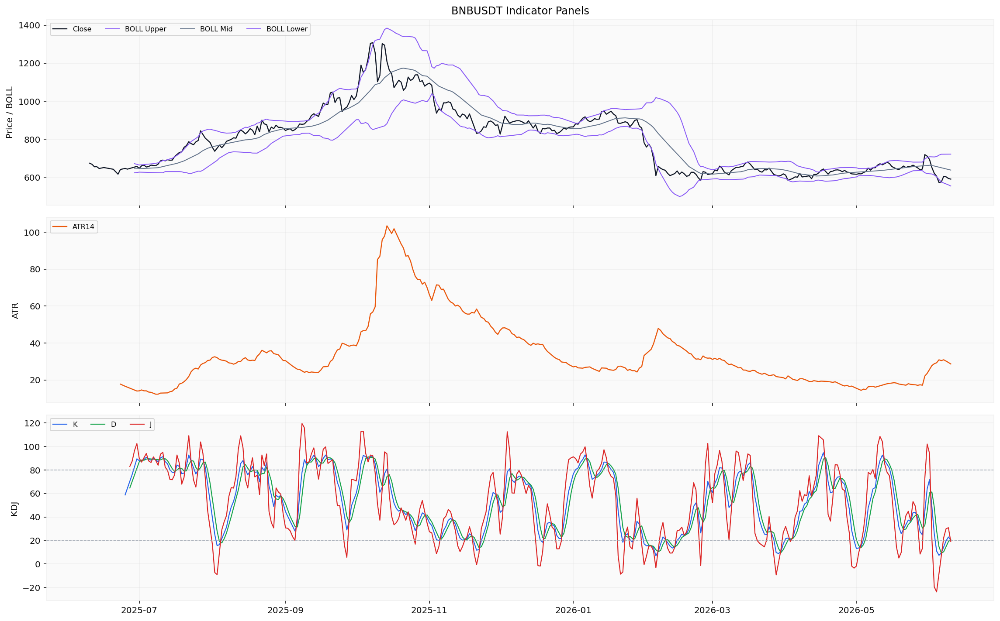
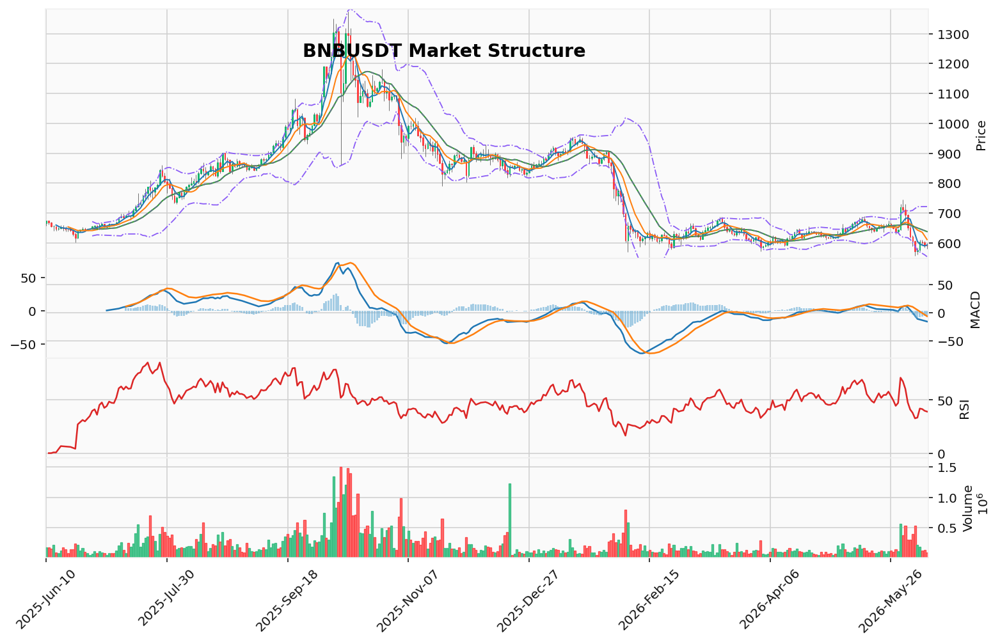

# BNB（BNB）加密资产投资研究报告

> 报告生成时间（美东）：2026-06-10 15:20:45 EDT
> 报告生成时间（北京）：2026-06-11 03:20:45 CST

## 一、投资结论与组合动作

**组合经理最终建议：持有/观望，不新开仓，不加杠杆。**

**执行动作：**
- **已有现货持仓者：** 维持现有仓位，不增持也不恐慌性减仓。可利用技术性反弹（如向599.945 USDT的FVG缺口回补时）评估是否需降低风险暴露，但不清仓。**未提供真实持仓参数，无法审计具体仓位大小。**
- **无持仓者：** 不建立新多头仓位。不追空做空。
- **合约方案：** **未提供真实合约持仓、保证金模式和保证金参数，无法审计合约风险。** 任何杠杆操作均不推荐。

**置信度：中**

**信心来源：**
- 技术面空头证据一致性高：四个独立信号（均线空头排列、维加斯通道压制、AMD/SMC低点下移、MACD负向放大）全部指向下跌
- TD13完成计数提供潜在的衰竭假设，但未经统计或回测验证
- 资金费率读数可用但仅为单点数据

**信心提升/降低条件：**
- **提升：** OI与多空比数据恢复后若显示空头拥挤度未极端，则增强做空信心；CVD恢复后若主动卖盘持续，则增强下行趋势可持续性判断；链上净流量恢复后若显示资金持续流出交易所，则增强看跌信心
- **降低：** OI与多空比显示空头过度拥挤，可能面临轧空风险；CVD显示主动买盘回升，与价格趋势背离；出现已验证的利好新闻/基本面事件

**数据恢复后的重评规则：** 只能写“重新评估”。不得提前预告或设计任何未来开仓、减仓、对冲、期权、具体执行价位或方向性动作安排。

**当前不新开仓、不加杠杆、等待数据恢复后重评。**

---

## 二、市场结构与技术指标分析

### 技术图表

### 2.1 当前价格结构

**当前价格：** 589.73 USDT（2026-06-10 19:00快照）
**24h涨跌幅：** -0.68%
**24h成交量：** 112,707.226 BNB（成交额66,467,195.92 USDT）

**趋势状态：** 日线收盘价589.74 USDT低于MA5（592.802）、MA10（610.518）和MA20（637.375），均线系统呈空头排列。本地技术摘要标记趋势为downtrend，成交量处于contracting状态。维加斯通道显示价格在蓝带（EMA144/EMA169）下方约-13.85%，EMA20与EMA50构成死叉，AMD/SMC结构为高点下移、低点下移的下跌推进阶段。

**数据质量限制：** 日线行情完整覆盖全年（366行），小时行情仅覆盖2026-04-30至2026-06-10，未覆盖完整分析区间起始端。衍生品仅返回资金费率，OI、多空比、CVD、主动买卖量、订单簿深度均因来源限流而缺失。链上仅返回交易所净流量单行数据。清算地图为BTC专用口径，对BNB不适用。

### 2.2 指标推导过程

#### OB订单块

| 指标 | 数据 | 推导 | 交易作用 | 失效条件 |
|------|------|------|----------|----------|
| OB订单块 | 近期没有确认的结构突破，未输出具体候选区间价位 | 当前摆动结构未形成清晰的可确认订单块突破信号 | 不能作为当前交易依据 | 需订单块候选区间及结构突破位数据恢复后再评估 |

#### POC/成交量分布

| 指标 | 数据 | 推导 | 交易作用 | 失效条件 |
|------|------|------|----------|----------|
| 成交密集带/成交量分布 | POC 632.03375 USDT，价值区间573.254167–892.343333 USDT，样本160根 | POC位于当前价格上方（589.74 < 632.03），价值区间下沿573.25接近当前价格 | POC提供上方阻力参考，价值区间下沿提供下方技术参考 | 样本基于近似分桶，需恢复完整成交量分布数据以提高置信度 |

#### TD Sequential

| 指标 | 数据 | 推导 | 交易作用 | 失效条件 |
|------|------|------|----------|----------|
| TD 9/13 | 方向看跌反转，启动计数2，倒数计数13，信号为TD看跌反转13计数完成，置信度中等 | 看跌反转13已完成计数，表明当前下行推动结构在TD框架下可能进入衰竭阶段 | 可以提示下行趋势可能接近阶段性完成，但不能作为反转交易入场依据 | 需等待资料包给出可审计的衰竭确认条件后再评估 |

#### 谐波形态

| 指标 | 数据 | 推导 | 交易作用 | 失效条件 |
|------|------|------|----------|----------|
| 谐波形态 | 未匹配到有效候选，AB/XA=2.62029，BC/AB=1.610619，CD/BC=0.285714 | 当前摆动比例未通过谐波形态筛选条件，无有效信号 | 不能作为当前交易依据 | 等待资料包给出可审计的形态匹配条件后再评估 |

#### FVG

| 指标 | 数据 | 推导 | 交易作用 | 失效条件 |
|------|------|------|----------|----------|
| FVG | 候选18个，未回补3个，最近上方缺口中线599.945 USDT | 上方存在未回补缺口区域，中线599.945位于当前价格上方约1.73% | 可作为上方价格吸引力区域的技术参考 | 缺口回补并非必然事件，需订单流和成交量配合才能评估回补概率 |

#### AMD/SMC与123突破

| 指标 | 数据 | 推导 | 交易作用 | 失效条件 |
|------|------|------|----------|----------|
| AMD/SMC | 结构高点下移、低点下移，阶段为下跌推进阶段；买侧流动性610.54@2026-06-07，卖侧流动性556.46@2026-06-05 | 当前结构为标准的下跌趋势推进结构，买侧流动性集中于610.54附近，卖侧流动性在556.46 | 流动性池位置可作为价格可能吸引区域的技术参考 | 不包含逐笔订单流确认，不能作为必然回归的支撑或压力 |
| 123突破 | 状态为下破待确认，方向看跌，突破位556.46 USDT | 三点结构已形成下破候选，若价格跌破556.46则确认看跌突破形态 | 556.46可作为结构突破确认位 | 需等待资料包给出可审计的突破确认条件后再评估 |

#### Vegas/布林带/RSI/MACD/KD

| 指标 | 数据 | 推导 | 交易作用 | 失效条件 |
|------|------|------|----------|----------|
| 维加斯通道 | 价格在蓝带下方，主趋势未确认，EMA144=678.50，EMA169=690.65，距蓝带中线-13.85% | 价格大幅低于长周期均线组，主趋势偏空 | 作为长周期空头结构的技术参考 | 等待资料包给出可审计条件后再评估 |
| 双线反转 | EMA20=625.32，EMA50=636.20，价格在双线下方，置信度低 | EMA20已下穿EMA50，且价格位于两条均线之下，呈现空头排列 | 作为中周期空头排列的技术参考 | 需资料包明确执行条件后才能作为交易触发 |
| 布林带 | 上轨721.29，中轨637.38，下轨553.46 | 当前价格位于中轨与下轨之间偏下区域，布林带宽度167.82 | 下轨553.46可视为极端超卖区域的价格参考 | 下轨支撑不是必然保护，需恢复成交量与订单簿数据 |
| RSI 14 | 39.11 | 低于50中线，处于偏弱区间，但尚未进入超卖区（<30） | 反映当前动量偏弱 | 等待资料包给出可审计条件后再评估 |
| MACD | MACD -16.06，信号线 -8.48，柱线 -7.58 | MACD与信号线均为负值且柱线负向放大，下行动能持续 | 反映下行动能尚未收敛 | 等待资料包给出可审计条件后再评估 |
| KD | K=20.37，D=20.98，J=19.14 | K值与D值接近超卖阈值（<20），但尚未明确跌破 | 提示进入技术性超卖边缘区域 | 等待资料包给出可审计条件后再评估 |

#### 清算地图/CVD/资金费率/OI/多空比

| 指标 | 数据 | 推导 | 交易作用 | 失效条件 |
|------|------|------|----------|----------|
| 清算地图 | 不适用 | BNB不适用清算地图；当前口径为BTC专用 | 不作为本标的市场结构依据 | 当前清算地图按BTC专用口径使用 |
| CVD/主动买卖量 | 缺失/不可用 | 来源限流，未返回 | 无法评估主动买卖方向是否与价格趋势一致 | 需来源恢复后重新评估 |
| 资金费率 | -0.002961 percent（2026-06-10） | 当前费率为负值，绝对值较小，表明空头持仓略占优势但未极端 | 可作为持仓情绪的技术参考 | 需OI和多空比数据联动分析才能判断拥挤度 |
| OI/多空比 | 缺失/不可用 | 来源限流，未返回 | 无法评估持仓结构和多空力量对比 | 需来源恢复后重新评估 |

#### 宏观/链上/AHR999/事件

| 指标 | 数据 | 推导 | 交易作用 | 失效条件 |
|------|------|------|----------|----------|
| 宏观 | 宏观/新闻由新闻资料包负责，行情资料包不重复判断 | 未返回宏观事件相关材料 | 不能作为当前交易依据 | 需回看新闻/宏观资料包 |
| 链上 | 交易所净流量116,838.0 USD（2026-06-10），链MULTI_CHAIN | 单日净流入交易所，样本限制为单行数据 | 单样本不能推导资金流向趋势 | 需恢复多日净流量及交易所余额数据 |
| AHR999 | 缺失/不可用 | 未取得 | 无法评估BTC估值区间对整体市场情绪的参考 | 需数据源恢复 |
| 事件 | 事件日历缺失/不可用 | 无法判断相关事件类型是否构成驱动 | 不能作为当前交易依据 | 需事件数据提供方恢复 |

### 2.3 技术参考位汇总

以下为上游材料返回的技术参考位，但**未明确标注为可执行交易条件**，不得改写入场、退出、止损或目标条件：

| 类型 | 价格区间 | 说明 |
|------|----------|------|
| 下方技术参考区间 | 553.46 - 556.46 USDT | 布林带下轨与AMD/SMC卖侧流动性重合区 |
| 上方短期压力参考 | 592.80 - 610.52 USDT | MA5/MA10均线压制 |
| 上方目标参考 | 599.945 USDT | 未回补FVG缺口中线 |
| 长周期压制 | 678.50 - 690.65 USDT | 维加斯通道蓝带中线 |
| POC参考 | 632.03 USDT | 成交量分布中心 |
| 123突破候选 | 556.46 USDT | 若跌破则确认看跌突破形态 |

### 2.4 多空场景与资料限制

**偏多场景：** 当前无法构建可执行偏多场景。资料包未明示任何可审计的偏多触发条件。需恢复OI与多空比以判断空头拥挤度是否可能触发轧空；CVD以判断主动买盘是否开始回补；多日交易所净流量以判断链上资金是否转向净流出交易所；KD与RSI是否明确进入超卖区并以可审计条件定义超卖阈值；已完成的TD看跌反转13是否具备衰竭确认条件。

**偏空场景：** 当前无法构建可执行偏空场景。尽管价格结构、均线、MACD、维加斯通道等技术面均指向偏空，但资料包未明示任何可审计的执行条件。需恢复具体可审计的突破确认条件（如123突破结构确认556.46跌破后的跟进条件）；OI与多空比以判断空头拥挤度是否支持趋势延续；CVD以判断主动卖盘是否持续主导；订单簿深度以判断下方流动性承接情况。

**观望场景：** 在以下情况下不应追空：KD指标接近超卖且TD看跌反转13已完成计数，提示技术性衰退可能正在接近，此时追空面临逆向波动风险。数据缺口压低结论置信度：OI与多空比缺失，无法评估当前空头拥挤度是否已过度集中；CVD缺失，无法确认主动卖盘持续状态；链上仅有单行净流量数据，缺乏跨日趋势验证。

### 2.5 数据限制与待恢复条件

| 缺口类别 | 具体缺失 | 对结论的影响 |
|----------|----------|--------------|
| 衍生品 | OI、多空比、CVD、主动买卖量、订单簿深度 | 无法验证空头拥挤度，无法区分“供应枯竭”与“流动性断层” |
| 链上 | 多日交易所净流量、余额、活跃地址 | 无法判断资金流向趋势 |
| 宏观/事件 | 事件日历及宏观事件材料 | 无法判断相关事件类型是否构成驱动 |
| 小时行情 | 仅覆盖2026-04-30至2026-06-10 | 无法进行完整的高低时间框架联动分析 |
| AHR999 | 缺失 | 无法评估BTC估值区间对整体市场情绪的参考 |
| 清算地图 | 不适用BNB | 不作为本标的市场结构依据 |

**技术指标小结：** 技术指标维度的覆盖相对完整，价格结构、均线系统、动量与摆动指标均指向下行趋势或偏弱状态。KD与RSI接近但未确认超卖，TD看跌反转13已完成计数。主要缺失集中在衍生品拥挤度（OI、多空比、CVD、订单簿深度）和链上多日趋势数据，这些缺口限制了从资金行为角度验证当前趋势可持续性的能力。

## 三、项目与代币基本面分析

### 资料包状态

基本面资料包本次返回结果为**部分可用**。已形成的标准化数据引用共2个，原始或元数据引用共2个，来源尝试记录共24条。资料包返回了BNB在2026年6月10日的单日价格、市值与成交量快照，但多个关键维度均未形成可引用的数据集。

### 已返回数据摘要

| 维度 | 数值 | 单位 |
|:---|:---|:---|
| 价格（2026-06-10） | 589.59 | USD |
| 市值 | 79,357,059,409 | USD |
| 成交量 | 644,308,222 | USD |

以上为资料包在单日时间戳下返回的唯一已就绪数据集。无历史序列，无更多维度。单点快照不足以支持代币经济分析、链上基本面判断、估值框架构建或方向性投资建议。

### 资料缺口与无法判断的问题

#### 1. 供给与发行材料不足

**当前快照：** 市值与价格可计算隐含流通量约1.345亿枚，但这仅为基础算术，非真实来源数据。资料包未返回总供应量、流通供应量、最大供应量、解锁计划、销毁记录或发行节奏等任何供给端数据。

**无法判断：** 未来稀释压力、供应上限是否已接近、代币发行节奏、销毁机制的实际执行情况。**当前快照显示二者相等；未返回供给与发行材料，无法判断未来稀释或发行节奏。**

#### 2. 链上使用数据缺失

DeFi经营数据（总锁仓量TVL、协议收入、费用）均因仓库无记录或来源调用失败而未返回。链上日频指标因粒度不匹配且未覆盖完整分析区间而未形成可用数据。

**无法判断：** BNB链的链上活跃度、DeFi生态规模、BNB作为燃料代币的实际使用频次、协议层面的价值捕获能力。

#### 3. 机构资金数据缺失

ETF资金流数据因来源限流和不适用而未返回。

**无法判断：** 机构资金对BNB的配置方向、ETF相关资金流入流出情况。

#### 4. 估值数据不足

资料包仅返回单日市值，未返回FDV、TVL、协议收入、市值/收入比等加密资产常用的估值口径。AHR999等链上估值指标也未返回。

**无法判断：** 当前估值水平的历史分位、相对于链上活动规模的合理区间。

#### 5. 竞争格局与生态经营数据缺失

未返回同类资产对比、生态项目数量、开发者活动、治理提案或跨链数据。

**无法判断：** BNB在公链赛道中的竞争地位及其可持续性。

### 数据限制与投资含义

1. **供给与发行材料不足**：无法判断未来稀释或发行节奏，代币经济模型不可评估。
2. **链上使用数据缺失**：无法判断BNB链的实际网络活跃度与价值捕获能力。
3. **机构资金数据缺失**：无法判断机构配置方向与资金流向趋势。
4. **估值数据不足**：无法构建可比估值框架或判断当前估值合理性。
5. **竞争格局与生态经营数据缺失**：无法判断公链赛道的相对位置与生态健康度。

**对组合动作的影响：** 当前无法从基本面维度为任何方向性判断提供支撑。技术面的空头证据无法被基本面验证或证伪，进一步强化了“持有/观望”的基础立场。若后续基本面数据恢复（尤其是供给、链上使用、估值维度），需要重新评估其对组合动作的约束或支持。

### 数据恢复后的重评方向

若后续基本面资料包能够返回以下五类数据，可进行全面更新：

1. **币种基础元数据**——确认总供应量、最大供应量、流通供应量等供给端参数及其来源。
2. **链上使用数据**——获取BNB链的日活跃地址、交易笔数、Gas消耗、TVL等链上经营指标。
3. **供给与发行数据**——获取解锁时间表、销毁记录、质押参与率等代币经济动态数据。
4. **机构资金数据**——获取交易所净流量、持仓分布、ETF资金流等机构维度的资金来源。
5. **估值数据**——获取FDV、市值/TVL比、AHR999等加密资产估值读数，形成可比估值框架。

**当前组合动作：** 持有/观望，不新开仓，不加杠杆。基本面数据不足无法为方向性判断提供支持，但不改变技术面与情绪面信号所构成的决策框架。

## 四、新闻、监管与事件驱动

### 资料状态与核心限制

新闻与事件资料包（项目新闻 11 条、宏观新闻 69 条）在本分析周期内 **未返回任何已被读取原文的官方公告、监管文件、交易所公告或可靠媒体正文**。所有返回内容均为媒体聚合搜索线索与公开搜索线索，其证据强度为 **低**，不可作为已验证事实源写入投资决策。

- **项目新闻覆盖范围：** 2025-07-16 至 2026-06-10，未覆盖分析区间开头（2025-06-10 至 2025-07-15）。
- **宏观新闻覆盖范围：** 2025-12-03 至 2026-06-08，未覆盖分析区间开头（2025-06-10 至 2025-12-02）。
- **已验证来源：** 无。来源尝试记录共 19 条，但均未产出可引用的原文正文或官方原文。

**核心结论：** 当前资料包无法梳理出任何一条经过官方、交易所或监管确认的具体新闻事件或宏观事件。新闻维度当前 **无法做出任何方向性判断** 或影响评估。

---

### 待核验线索（非事实，不可用于方向性判断）

资料包中存在两类待核验线索，均属于“搜索线索”级别，未经可靠来源验证，不能作为投资依据：

1.  **项目新闻线索（方向待验证，影响周期无法判断，证据强度低）：** 媒体聚合搜索提示存在与 BNB 相关的待核验主题。线索中包含的具体机构名称、协议升级名称、链上活动名称等均未被官方确认。
2.  **宏观新闻线索（方向待验证，影响周期无法判断，证据强度低）：** 媒体聚合搜索提示存在宏观相关待核验主题，同样缺乏权威来源验证。具体宏观政策、机构资金动向或监管节点均不得视为已发生事件。

**市场预期线索：** 资料包中存在事件预期类线索，但仅能表达为“市场预期线索”，不能理解为已发生事件或市场共识结论。

---

### 对投资决策的影响

- **无法评估外部事件风险：** 缺少已验证新闻来源，无法区分任何利好、利空或中性事件对 BNB 需求侧、供给侧、监管风险、安全假设、生态扩张、流动性或叙事层面的影响。
- **新闻维度空白对组合动作的影响：** 当前新闻维度既不能强化看跌论点（如监管打击或安全事件），也不能削弱看跌论点（如生态激励或合作公告）。该空白本身不构成看涨或看跌信号，仅意味着事件驱动因素在当前无法被评估。
- **若可靠来源恢复并验证方向性事件，需重新评估。** 当前组合动作（持有/观望）不预设方向性动作。

---

### 关键数据恢复条件

待以下新闻/事件资料恢复后，需重新评估其对组合动作的影响：

| 待恢复数据类别 | 重评目标 |
|---------------|----------|
| 项目方官方公告（代币解锁、销毁、生态升级、合作等） | 判断供给侧与需求侧是否有已验证的方向性驱动 |
| 监管原始来源（政策、法律行动、交易所合规变化） | 判断监管风险是否实质性影响 BNB 持有条件 |
| 已读取原文的可靠媒体正文（行业趋势、机构资金、交易所动态） | 判断宏观与行业背景是否支持或削弱当前技术面判断 |
| 事件日历与供给日历 | 判断是否有可预见的催化剂或风险节点 |

**数据恢复后的重评只能写“重新评估”。当前不预设任何未来开仓、减仓或方向性动作安排。**

## 五、社区情绪、事件预期与交易拥挤度

**核心判断：当前情绪维度仅提供全市场极度恐惧（Fear & Greed 9.0）这一单点读数，社区讨论、叙事方向、参与者结构及事件预期均因数据缺失无法评估。该读数既不能作为交易方向依据，也不能与任何基本面或价格结构信号形成交叉验证。**

---

### 5.1 市场级情绪：单一指标与严重边界限制

**数据：**
- **Fear & Greed Index：** 9.0（极度恐惧区间），2026-06-10 快照。
- **覆盖边界：** 该指数为全市场级指标，并非 BNB 专属；仅返回当日单点读数，无历史趋势、阶段变化或均值回归参考。

**解读与投资含义：**
- 极度恐惧读数本身不构成方向性交易依据。组合经理报告已明确指出（参见“一、投资结论与组合动作”），将该指数作为“反向指标”直接推导入场结论（如“别人恐惧我贪婪”）缺乏统计或回测验证，属于将情绪读数替代缺失基本面数据的误用。
- 该读数的唯一作用是提示当前市场整体风险偏好处于历史低位，但这既不能确认价格底部，也无法预测极点持续时长。在市场流动性紧缩或基本面/新闻维度出现恶化时，极度恐惧状态可能延续甚至加深。

**限制与待确认条件：**
- 恐惧指数对 BNB 个体标的的适用性未经上游资料包验证。无法判断该指数的历史有效性是否适用于 BNB 当前的价格结构和市场环境。
- 缺少 BNB 专属情绪指标（如社交主导度、正负面讨论比例、异常互动量等），无法将市场级情绪关联至 BNB 社区共识或资金流向。

---

### 5.2 社交平台讨论与叙事：数据完全缺失

**判断：无任何真实社交平台样本返回，社区情绪方向、讨论热度、叙事传播路径及参与者结构均无法评估。**

| 维度 | 数据状态 | 对投资含义的影响 |
|:---|:---|:---|
| 帖子数量与互动量（X/Twitter、Telegram、Discord、Reddit、中文社区等） | 缺失/不可用 | 无法判断 BNB 社区当前讨论热度的方向（升温/降温）、情绪极性（乐观/悲观/分歧）及关注度趋势 |
| 叙事内容与传播链 | 缺失/不可用 | 无法验证是否存在围绕 BSC 生态、代币销毁、协议升级、交易所关联或竞争格局的主要叙事，无法判断叙事驱动能力 |
| 参与者结构（零售/大户/机构/不同语言社群） | 缺失/不可用 | 无法区分不同群体之间的情绪差异，无法判断是否存在价格敏感型资金或长线持有者的行为变化 |
| KOL 或意见领袖观点 | 缺失/不可用 | 无法判断是否存在影响力人物引导社区共识或造成方向性影响 |

**投资含义：**
- 社交维度的空白使得任何基于“叙事驱动反弹”“共识重建”或“社区分歧”的判断均无法形成。当前 BNB 的价格行为在情绪层面仅能依靠全市场恐惧指数这一个孤立读数。
- 该缺口本身既不是看涨理由（不能假设“恐慌意味着底部临近”）也不是看跌理由（不能假设“沉默意味着失去关注度”），而是使整个情绪维度的分析链无法建立。

---

### 5.3 事件预期与叙事预期：无可用材料

**判断：预期事件相关的市场讨论、盘口或线索均未返回可靠来源，无法判断事件预期是否已计入当前价格。**

- 新闻资料包中的“市场预期线索”为搜索摘要级别，来源为媒体聚合与公开搜索，未包含官方公告、监管文件或已核实的事件日历，不能作为事实源。
- 任何与 BNB 相关的代币销毁计划、BSC 生态升级、交易所政策变化、监管节点或竞争链事件，均因缺少已验证来源而无法纳入分析。
- 无法判断当前价格是否已定价了任何潜在利好（如供应紧缩、协议更新）或利空（如监管升级、解锁压力）。

---

### 5.4 情绪失真与挤兑风险：无法量化

| 风险类型 | 数据状态 | 对投资的影响 |
|:---|:---|:---|
| 刷量/机器人活动 | 缺失/不可用 | 无法判断 Fear & Greed 指数是否被人为情绪操纵影响 |
| 人为恐慌/FUD 扩散 | 缺失/不可用 | 无法判断当前极度恐惧是否存在非理性放大成分 |
| 空投噪音或诱导内容 | 缺失/不可用 | 无法判断 BNB 社区是否存在特定利益导向的叙事引导 |
| 交易所关联风险 | 缺失/不可用 | 无法判断 CEX 关联的信任度变化是否已通过情绪渠道发酵 |

**投资含义：**
- 情绪失真风险在当前资料条件下无法量化或规避。对于组合决策的唯一启示是：在社交数据恢复前，不能仅凭恐惧指数就假设市场情绪“过度悲观”或“即将反转”。

---

### 5.5 情绪维度的综合投资含义

| 情绪证据 | 当前结论 | 对组合动作的影响 |
|:---|:---|:---|
| Fear & Greed 9.0（极度恐惧） | 提供全市场情绪极值信号，但缺乏 BNB 专属验证和统计回测 | 不能作为交易方向依据；仅作为“待验证的反向线索”保留 |
| 社交平台讨论叙事 | 完全缺失 | 情绪维度无法形成与价格结构、基本面或事件维度的交叉验证 |
| 事件预期 | 未返回已验证来源 | 无法判断预期是否计入当前价格 |
| 情绪失真风险 | 无法量化 | 组合无法基于情绪“超卖”或“过度恐慌”做出调整 |

**当前组合动作不受情绪维度影响：** 无任何情绪线索足以改变“持有/观望、不新开仓、不加杠杆”的决策。极度恐惧读数既不能提供入场理由（如激进分析师所主张的“情绪极值+衰竭信号”），也不能提供明确降风险理由（如安全分析师所担忧的“恐慌未至极值”），因其独立性证据强度不足以支撑方向性调整。

---

### 5.6 需要跟踪的类别（数据恢复后重新评估）

| 数据类别 | 恢复后的分析目标 | 重新评估条件 |
|:---|:---|:---|
| BNB 专属社交讨论极性（正负面比例、互动量） | 判断社区情绪是否已进入极度悲观区间，或仍处于分歧/观望状态 | 需要至少 7 日跨平台样本数据，覆盖 X、Telegram、Discord 等主要平台 |
| 叙事内容与关键词聚类 | 识别是否存在主导叙事（如 BSC 生态/销毁/交易所竞争），判断叙事是否具有驱动共识的能力 | 需恢复叙事分析工具或平台 API 数据 |
| 事件预期盘口/搜索聚合 | 判断市场是否已定价特定事件（如代币解锁、监管裁决），以及事件的不确定性是否已反映在价格中 | 需恢复已验证的来源（官方公告、监管文件、交易所公告）而非仅搜索线索 |
| 情绪失真检测指标 | 量化恐惧指数受机器人/刷量影响的程度，避免将伪情绪视为真实市场共识 | 需恢复数据源如 LunarCrush 账户分类或互动质量评分 |

## 六、交易计划与组合风险

### 6.1 核心交易决策：持有/观望

基于组合经理最终裁决与多空辩论综合评估，当前交易计划的核心动作为：**持有/观望，不新开仓，不加杠杆。** 对于已有现货持仓者，维持现有仓位，不增持也不恐慌性减仓；对于无持仓者，不建立新多头仓位，不追空做空。

该决策建立在以下证据链上：技术面存在均线系统空头排列、维加斯通道压制、AMD/SMC低点下移、MACD负向放大四个独立看跌信号，一致性高；而看涨论点仅依赖TD13完成计数、KD/RSI接近超卖、资金费率微负、上方FVG缺口等技术性衰竭假设，这些假设在当前数据环境下即为待验证条件，未经统计或回测佐证。因此，技术面空头证据在当前信息集下更为充分，但衍生品与链上数据的缺失也使做空面临不确定性，追空与抄底均不可取。

### 6.2 多空辩论核心冲突与评估

| 辩论维度 | 看跌观点（更充分的技术证据） | 看涨观点（条件化的衰竭假设） | 组合经理评估 |
|---|---|---|---|
| 趋势结构 | MA5/10/20空头排列，AMD/SMC低点下移，维加斯通道压制(-13.85%)，四个独立技术信号一致指向下跌 | TD13已完成计数，暗示下行推动结构可能进入衰竭阶段 | TD13完成不构成反转保证，强劲趋势中可能出现连续多组13计数；四个技术信号的一致性高于单一衰竭假设 |
| 动量指标 | MACD柱线负向放大(-7.58)，下行动能未衰竭 | RSI 14(39.11)偏低，KD接近超卖(20.37/20.98)，动量空间呈结构性耗竭信号 | RSI/KD接近超卖是待验证的衰减条件，MACD仍在放大说明下行动能尚未确认收敛 |
| 成交量 | 成交量呈contracting状态，接盘意愿不足 | 成交量收缩可能是供应枯竭的前兆，而非买盘不足 | 无CVD数据，无法区分“供应枯竭”与“流动性断层”，缩量市场中向上反弹与向下断裂的风险并存 |
| 资金费率 | 微负(-0.002961%)，空头持仓不极端，缺乏空头止损盘推动反弹 | 微负费率暗示空头内部缺乏信心，潜在空头回补力量可随时触发 | 资金费率微负是中性信号，不拥挤的空头意味着无大量空头止损盘可推动快速上涨，反弹将是纯买方驱动，动力有限 |
| 情绪 | Fear & Greed 9.0极度恐惧，但该指数是市场级而非BNB专属，无回测证明其为反转触发器 | 极度恐惧是典型的逆向指标，历史上该读数往往对应市场底部区域 | 极度恐惧是反身性信号，但不能替代缺失的基本面数据；其作为反向指标的有效性需要统计回测支持，而上游未提供 |
| 数据缺口 | OI/多空比/CVD缺失，使做空也面临不确定性 | OI缺失无法验证轧空可能性，但微负费率本身提供了低拥挤度证据 | 数据缺口使多空双方都无法获得充足的验证，追空与抄底均面临未量化风险 |

### 6.3 现货与合约方案

**现货方案：**
- **对于已有现货持仓：** 维持现有仓位，不增持也不恐慌性减仓。可利用技术性反弹（如向599.945 USDT的FVG缺口回补时）评估是否需要降低风险暴露，但不清仓。**未提供真实持仓参数，无法审计具体仓位大小。**
- **对于无持仓：** 不建立新多头仓位，不追空做空。

**合约方案：**
**未提供真实合约持仓、保证金模式和保证金参数，无法审计合约风险。** 任何杠杆操作均不推荐。资金费率当前为-0.002961 percent，但单一读数不构成交易方向依据；清算价无法由现有材料审计计算；最大亏损控制因缺乏持仓参数而无法设计。

### 6.4 技术参考位与执行限制

上游报告提供了以下技术参考位，但**资料包未将其明确标注为可执行的交易条件**，因此不得改写为入场、加仓、减仓、止损、退出或方向性动作的触发条件：

| 类型 | 价格区间（USDT） | 说明 |
|---|---|---|
| 下方技术参考区间 | 553.46 - 556.46 | 布林带下轨与AMD/SMC卖侧流动性重合区 |
| 上方短期压力参考 | 592.80 - 610.52 | MA5/MA10均线压制 |
| 上方目标参考 | 599.945 | 未回补FVG缺口中线 |
| 长周期压制 | 678.50 - 690.65 | 维加斯通道蓝带中线 |
| POC参考 | 632.03 | 成交量分布中心 |

**具体执行价位需等待行情与技术资料恢复后确认。** 当前无法建立任何可执行的入场、出场或止损条件。激进分析师提出的“在553-556 USDT区间用1-2%仓位试多、止损550 USDT”策略，缺乏订单簿、清算执行数据支撑这些价位作为交易条件，且其“高赔率”假设未经统计或回测验证，因此不采纳。该方向性解释未由资料包验证，只能作为待验证条件。

### 6.5 风险来源与约束

| 风险类别 | 具体风险 | 说明 |
|---|---|---|
| 价格结构风险 | 下行趋势可能加速或衰竭 | 技术面偏空但TD13可能引发短期反弹，趋势方向具有双重可能 |
| 数据缺口风险 | 衍生品、链上、基本面、新闻数据缺失 | 无法全面评估市场结构和外部驱动因素，任何方向性押注的置信度均受约束 |
| 流动性风险 | 成交量萎缩，contracting状态 | 接盘意愿不足，可能放大价格波动，向上反弹与向下断裂的风险并存 |
| 事件风险 | 未验证的潜在新闻/基本面事件 | 无法判断是否存在利好或利空驱动，当前新闻资料包仅返回搜索线索级别内容 |

**主要风险是价格结构风险与数据缺口风险的叠加。** 技术面明确偏空，但缺乏衍生品和链上验证，限制了对趋势可持续性的判断能力。追空可能面临突然反弹风险，抄底则可能面临趋势延续风险。资金费率(-0.002961 percent)绝对值极小，未出现极端值，但单独解读具有双向性。

### 6.6 等待数据恢复后的条件化重评

需要以下数据恢复后才能重新评估方向，当前不预设方向性动作：

1. **OI与多空比：** 判断空头拥挤度是否已极端，以验证空头是否面临轧空风险。
2. **CVD/主动买卖量：** 判断主动买卖方向是否与价格趋势一致，区分“供应枯竭”与“流动性断层”。
3. **多日交易所净流量：** 判断链上资金流向趋势，为看跌或看涨提供行为层面的验证。
4. **新闻/基本面事件：** 判断是否存在已验证的方向性驱动因素，弥补当前新闻资料包的来源缺口。
5. **KD与RSI超卖确认：** 若明确进入超卖区（K<20），可增加衰竭信号的可信度，但仍需其他维度数据配合。

**数据恢复后的重评只能写“重新评估”。** 不得提前预告或设计任何未来开仓、减仓、对冲、期权、收益押注、具体执行价位或方向性动作安排。

## 七、关键分歧与跟踪条件

本节汇总多头与空头观点之间的核心争议、组合经理对争议证据的评估与取舍，以及后续需要恢复的数据类别。

### 7.1 核心分歧：衰竭性下跌 vs 趋势中继

本次研究中最关键的分歧在于如何解读当前的技术面信号组合——即均线空头排列、MACD 负向放大、成交量收缩、TD13 完成计数、KD/RSI 接近超卖边缘的共存状态。

| 争议点 | 激进/看涨论点 | 安全/看跌论点 | 组合经理评估 |
|:---|:---|:---|:---|
| TD13 完成计数的含义 | 完成12根K线的推动结构，标志着当前下行可能进入衰竭阶段 | 在强劲单边行情中可能出现连续多组13计数，不能作为反转保证 | TD13 完成仅提示结构完成，不构成反转保证。当前MACD柱线仍在负向放大（-7.58），表明下行动能未确认衰竭。看涨方将“可能的减速信号”等同于“确认的逆转信号”，证据强度不足。 |
| 成交量收缩的解读 | 是“供应枯竭”的前兆，卖压正在减弱 | 可能是“流动性断层”——缩量下行时，买盘同样稀缺，价格可能向下断裂 | 在没有CVD/主动买卖量数据的情况下，无法区分“供应枯竭”与“流动性断层”。向上弹的潜力与向下断裂的风险并存，不能单独作为方向性依据。 |
| 资金费率 -0.002961% 的含义 | 空头持仓不拥挤，一旦反弹，追空止损盘可能形成轧空 | 不拥挤的空头意味着没有大量止损盘可推动快速上涨，反弹将是纯买方驱动，动力有限 | 该信号本质上是中性的，不能单独支持方向性结论。激进方的轧空逻辑缺少OI与多空比数据验证空头持仓规模，属于待验证条件。 |
| 极度恐惧指数（9.0）的用法 | 是逆向指标，历史上对应市场底部区域，应视为潜在机会信号 | 是市场级指标，非BNB专属；上游未提供统计回测，不能作为入场依据 | 该指数为全市场级情绪快照，且未提供统计回测支持其作为反向指标的有效性。激进方用情绪数据替代缺失的基本面数据，方向性解释未由资料包验证，不能作为当前证据。 |

**评估结论：** 技术面空头证据有四组独立信号支撑（均线空头排列、维加斯通道压制、MACD负向放大、AMD/SMC低点下移），一致指向下跌。看涨方仅依赖一个待验证的TD13假设加一个中性资金费率读数，在证据强度上远低于看跌方。**四个信号 vs 一个假设，后者不能被采纳为当前方向性依据。**

### 7.2 被放弃的观点与理由

| 观点 | 提出方 | 放弃理由 |
|:---|:---|:---|
| 在553.46-556.46 USDT区间以1-2%仓位试多，止损550 USDT | 激进/看涨分析师 | 该策略属于方向性交易方案。看涨逻辑依赖的资金费率轧空、成交量收缩的“供应枯竭”解释、情绪指数的反向效应，均未由资料包验证。553.46-556.46为技术参考位，缺少订单簿、清算执行数据支持其作为交易条件。在当前数据缺口下，任何方向性新开仓都是鲁莽的。 |
| 利用技术性反弹（如向599.945 FVG回补时）降低风险暴露 | 安全/看跌、研究经理 | 未提供真实持仓参数，无法给出具体的现货减仓比例或时间窗口。该陈述隐含“已有持仓应调整”的动作建议，但上游材料未明示仓位大小与减仓条件，因此不采纳为执行指令。 |

### 7.3 关键跟踪条件

当前组合动作是“持有/观望，不新开仓，不加杠杆”。后续不需要价格触发或时间窗口，而依赖于以下数据类别恢复后的重新评估。

**1. 衍生品类（优先恢复）**

- **OI与多空比：** 当前缺失。恢复后判断空头拥挤度是否已极端，以验证“轧空风险”与“趋势持续性”哪一个假设更可信。
- **CVD/主动买卖量：** 当前缺失。恢复后判断主动买卖方向是否与价格趋势一致，以区分“供应枯竭”与“流动性断层”。
- **订单簿聚合深度：** 当前缺失。恢复后评估下方流动性承接能力，验证553-556区间是否具备支撑参考价值。

**2. 链上类（补充恢复）**

- **多日交易所净流量：** 当前仅能获取单行数据。恢复多日序列后，判断资金流向趋势是否与价格趋势一致。
- **交易所余额：** 当前缺失。恢复后评估潜在供应压力。

**3. 新闻/基本面/事件类（独立恢复）**

- **已验证的新闻事件：** 当前仅能获取搜索线索。恢复官方公告、监管文件或可靠媒体原文后，判断是否存在方向性驱动因素。
- **供给与发行材料：** 当前缺失。恢复后可判断未来稀释或发行节奏。
- **项目公告与安全事件：** 当前缺失。恢复后评估外部事件风险。

**4. 技术指标补充条件（仅作观察，不作为触发）**

- **KD与RSI：** 若明确进入超卖区（K<20），可增加衰竭信号的可信度，但不能作为开仓条件。
- **MACD柱线：** 若开始收窄，可能预示动能有衰减迹象，但不能作为交易触发。

**数据恢复后的重评：** 当上述任一关键数据类别恢复至可审计状态时，需要重新评估当前所有技术面、情绪面信号，综合判断趋势可持续性或反转概率。重评只能写“重新评估”，不得提前预告或设计任何未来开仓、减仓、对冲、期权、具体执行价位或方向性动作安排。

## 八、最终结论

**组合经理最终动作：** 持有/观望，不新开仓，不加杠杆。对于已有现货持仓者，维持现有仓位，不增持也不恐慌性减仓。未提供真实持仓参数，无法审计具体仓位大小；未提供真实合约持仓、保证金模式与参数，无法审计合约风险，任何杠杆操作均不推荐。

**当前动作成立的核心证据：**
1. **技术面空头证据一致性高**——均线系统（MA5/10/20）空头排列、维加斯通道压制（-13.85%）、AMD/SMC 低点下移、MACD 柱线负向放大（-7.58）等四个独立信号一致指向下跌，这是当前最有力的证据组合。
2. **看涨论点的核心缺陷**——看涨证据仅依赖 TD 看跌反转 13 完成计数、KD/RSI 接近超卖、资金费率微负等条件化指标组合，但 TD13 在强劲趋势中可连续出现，成交量收缩无法区分“供应枯竭”与“流动性断层”，资金费率微负说明空头不拥挤意味着缺乏轧空驱动力，这些信号均未经统计或回测验证，不能构成反转保证。
3. **数据缺口严重制约方向性判断**——衍生品（OI、多空比、CVD）、链上（多日交易所净流量、余额）、基本面（供给、TVL、协议收入、估值数据）、新闻事件（已验证来源）关键维度全面缺失，使趋势可持续性无法验证，追空与抄底均面临不可量化风险。

**最关键的重新评估数据类别：** OI 与多空比（判断空头拥挤度是否极端）、CVD/主动买卖量（判断主动买卖方向是否与价格趋势一致）、多日交易所净流量（判断链上资金流向趋势）。

**下一步最需要跟踪的 3 类数据：**
1. **衍生品数据恢复**——OI、多空比、CVD、订单簿深度，以验证空头拥挤度与主动资金方向。
2. **链上数据补充**——多日交易所净流量及余额序列，以判断机构资金流向趋势。
3. **基本面与新闻事件数据**——供给与发行材料、TVL、已验证新闻来源，以评估外部驱动因素与估值合理性。

**综合判断：** 技术上明确偏空，但数据缺口使做空也面临不确定性；看涨假设存在理论可能性但缺乏经验证据。在关键数据恢复前，保持静止、避免任何方向性新开仓，是当前信息环境下唯一同时兼顾资金安全与未来机会的理性选择。数据恢复后重新评估，当前不预设方向动作。
