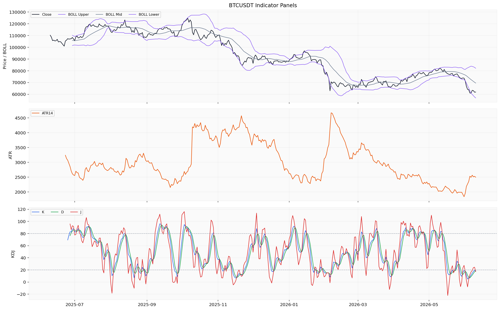
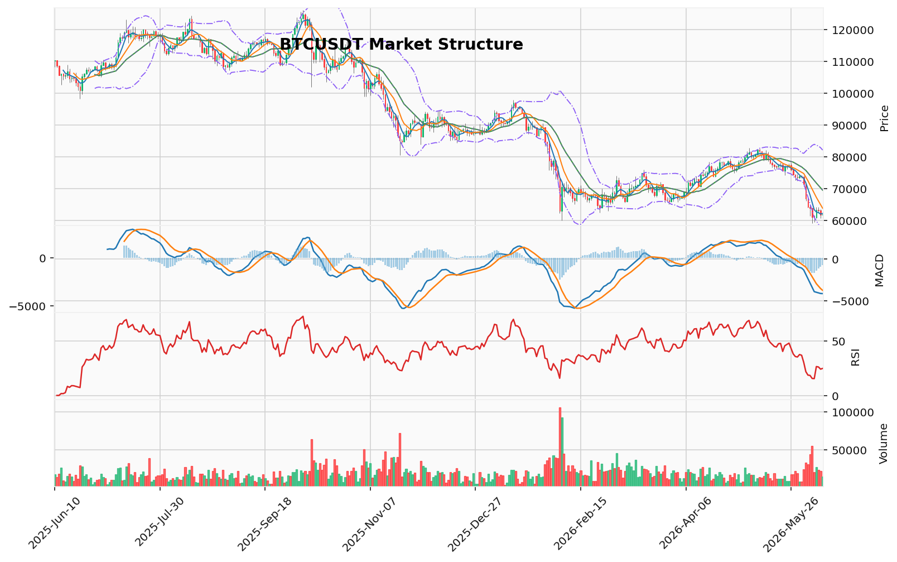

# Bitcoin（BTC）加密资产投资研究报告

> 报告生成时间（美东）：2026-06-10 15:08:32 EDT
> 报告生成时间（北京）：2026-06-11 03:08:32 CST

## 一、投资结论与组合动作

**最终建议：持有/观望**

组合经理裁决明确禁止当前执行任何方向性交易动作。具体执行约束如下：

- **动作方向**：维持现有现货仓位（假设有），不进行任何新开仓（多头或空头），不加任何杠杆，不改变现有现货敞口。明确禁止买入或卖出。
- **入场触发**：无。所有极值信号（RSI/KD超卖、恐惧指数9.0、维加斯通道偏离-20%）和价格结构（看跌推进）均为已验证上游数据，但信号冲突。任一信号单独触发均不足以构成入场或出场条件。
- **目标区间**：无。技术参考位（如64,234.68 USDT压力、59,130.91 USDT支撑）因缺少订单簿、清算地图、OI等关键数据，无法转化为可执行的目标或失效位。
- **失效位**：无。同上，缺乏可验证的清算密集区和衍生品数据，无法定义有效的止损/失效价格。
- **仓位建议**：维持现有现货仓位不变。禁止任何形式的杠杆（合约、借贷）、保证金操作或新开仓位。上游未提供任何真实持仓参数，因此无法提出增/减仓建议。
- **现货/合约选择**：仅现货。上游未提供任何真实合约持仓或保证金参数，合约交易完全禁止。
- **最大风险边界**：不适用。当前无任何可执行的风险敞口变更操作。核心目标是规避“在信息黑洞中因冲动交易导致本金永久性损失”的风险。

**组合经理核心推理**：当前看跌逻辑（已验证的AMD/SMC下跌推进、MACD负值、均线空头排列）与看涨逻辑（已验证的RSI/KD双超卖、维加斯通道-20%偏离、恐惧指数9.0、AHR999 0.3055）均为上游返回的事实，但指向完全相反。同时，OI、多空比、CVD、清算地图全面缺失，使得任何方向性押注均缺乏衍生品维度的验证。在两者置信度均被压低的条件下，组合经理选择基于已验证的价格结构（看跌）作为主叙事，但不执行卖出动作，因为看跌结论同样因数据缺口而置信度不足。最终选择持有/观望，等待数据环境恢复。

## 二、市场结构与技术指标分析

### 技术图表

### 2.1 价格结构与趋势状态

当前BTC呈**下行动能延续的结构偏空状态**。价格自2026-06-07高点64,234.68 USDT回撤至61,876.64 USDT，连续三日收低。日线收盘价已低于MA5、MA10、MA20，均线呈现空头排列。AMD/SMC结构确认高点下移、低点下移的下跌推进阶段。TD 13看跌反转计数已完成后，价格仍在连续创低，呈现计数失效特征。维加斯通道价格已远离蓝带中线约-20%。

主要限制在于：OI/多空比、CVD主动买卖量差和清算热力图缺失，无法从衍生品拥挤度和强制成交层面验证偏空结论的力度。

### 2.2 技术指标推导过程

#### OB订单块与成交量分布

| 指标 | 数据 | 推导 | 交易作用 | 失效条件 |
|------|------|------|----------|----------|
| OB订单块 | 近期没有确认的结构突破 | 当前未检测到已确认的订单块结构突破，暂无方向性信号 | 不能作为当前交易依据 | 需订单块突破信号恢复后重新评估 |
| 成交量分布 | POC=68,021.11 USDT，价值区间65,596.51-80,144.10 USDT，样本160（基于日线OHLCV近似分桶） | 当前价格61,876.64 USDT已低于价值区间下沿约5.8%，处于低量成交区域 | 可作为价格偏离程度的参考 | 需重新校准分桶精度或获取Tick级成交量分布 |

#### TD Sequential、谐波形态与FVG

| 指标 | 数据 | 推导 | 交易作用 | 失效条件 |
|------|------|------|----------|----------|
| TD 9/13 | 方向看跌反转，启动计数2，倒数计数13，信号：TD看跌反转13计数完成，置信度中等 | 13计数完成后价格未止跌，当前处于计数失效状态 | 原反转信号已被价格走势否定 | 需要等待新的TD计数周期重新启动 |
| 谐波形态 | 未匹配到有效候选，AB/XA=1.469，BC/AB=2.404，CD/BC=0.381 | 最近摆动比例未收敛至已知谐波形态参数范围 | 不能作为当前交易依据 | 需价格结构摆动出新点后重新匹配 |
| FVG | 候选21个，未回补5个，最近上方缺口中线65,478.66 USDT | 上方存在未回补的公平价值缺口，当前价格低于缺口区域，未形成附近支撑 | 可作为价格参考位 | 需逐笔订单流验证缺口吸收情况 |

#### AMD/SMC与123突破

| 指标 | 数据 | 推导 | 交易作用 | 失效条件 |
|------|------|------|----------|----------|
| AMD/SMC | 结构：高点下移、低点下移；阶段：下跌推进阶段；买侧流动性：64,234.68 USDT（2026-06-07）；卖侧流动性：59,130.91 USDT（2026-06-05） | 处于下跌推进中，近期摆动低点59,130.91为卖侧流动性参考位 | 提供摆动结构参考 | 需确认是否延伸至卖侧流动性区域或结构转换 |
| 123突破 | 状态：下破已确认；方向：看跌；突破位：74,289.6 USDT | 空头三点结构成立，突破位已形成 | 结构偏空参考 | 需重新站上突破位以上才能否定该结构 |

#### 维加斯通道、布林带、RSI、MACD、KD

| 指标 | 数据 | 推导 | 交易作用 | 失效条件 |
|------|------|------|----------|----------|
| 维加斯通道 | 价格在蓝带下方；EMA144=76,610.94 USDT，EMA169=78,082.07 USDT；距蓝带中线-20.00% | 价格远离均线通道，处于显著偏离状态 | 反映中长期趋势持续偏空 | 需价格重新回归通道或均线走平 |
| 布林带 | 上轨82,118.44，中轨69,492.95，下轨56,867.47 USDT | 价格位于中轨下方且接近下轨，带宽未显著收缩 | 反映下跌通道中的偏空位置 | 需带宽变化或价格突破中轨重新评估 |
| RSI | RSI14=24.85（超卖区域，阈值为低于30） | 进入超卖区域，显示近期下跌幅度较大 | 动量已达超卖，提示卖压可能释放 | 持续低于30不必然代表反转 |
| MACD | MACD=-4,139.12，信号线=-3,378.54，柱线=-760.59 | 双线均在零轴下方，柱线负值放大，下行动能延续 | 偏空动能仍在持续 | 需柱线收窄或MACD上穿信号线 |
| KD | K=17.96，D=18.27，J=17.33；K和D均低于20（超卖） | 摆动指标进入超卖极值区域 | 短期潜在的摆动超卖信号 | 需K线上穿D线确认背离或反转 |

#### 清算地图、CVD、资金费率、OI、多空比

| 指标 | 数据 | 推导 | 交易作用 | 失效条件 |
|------|------|------|----------|----------|
| 清算地图 | 缺失/不可用（BTC专用口径，未返回数据） | 无法分析清算簇价格和规模分布 | 不能作为清算压力依据 | 需清算热力图数据恢复 |
| CVD | 缺失/不可用（来源限流） | 无法判断主动买卖量差 | 不能作为资金流方向依据 | 需主动买卖量数据恢复 |
| 资金费率 | 0.002693 percent（2026-06-10） | 正费率但数值较小，显示多头持仓需支付小额费用 | 当前水平无明显拥挤迹象 | 需结合OI和多空比交叉验证 |
| OI/多空比 | 缺失/不可用（来源限流） | 无法分析持仓总量与多空持仓比例 | 不能作为持仓拥挤度依据 | 需OI/多空比数据恢复 |

#### 宏观、链上、AHR999、事件

| 指标 | 数据 | 推导 | 交易作用 | 失效条件 |
|------|------|------|----------|----------|
| 宏观 | 宏观/新闻由新闻资料包负责，行情资料包不重复判断 | 当前行情层面无宏观判断材料 | 需参考独立新闻/宏观资料包 | 需宏观资料包补充 |
| 链上大额转账 | 近7日大额转账：2026-06-07约3,084万USD，2026-06-06约3,059万USD，2026-06-09约1,801万USD，2026-06-10约1,673万USD（bitcoin链，计数/笔数口径） | 近期BTC链上大额转账活跃度中等 | 不直接代表资金流向主体意图 | 需结合地址标签和交易流向细化 |
| 交易所净流量 | 当日净流入14,231,483 USD | 显示当日交易所有明显的净流入 | 可能是交易所充币行为 | 单日数据样本有限 |
| AHR999 | 0.3055（无量纲指数读数，MULTI_CHAIN） | 远低于1，当前BTC估值处于相对低估区间 | BTC长期估值参考 | 单一指数不构成交易条件 |
| 事件 | 事件日历缺失/不可用 | 无法判断相关事件类型是否构成驱动 | 不能作为当前交易依据 | 需事件数据提供方恢复 |

### 2.3 多空场景与当前限制

**偏多场景**：当前无法构建可执行偏多场景。需要恢复OI/多空比数据以确认多头是否已大幅离场，CVD主动买卖量差以判断是否有资金承接，清算地图以查看下方清算簇分布是否构成潜在的流动性吸收区域。当前技术面虽有RSI和KD超卖，但缺乏衍生品和订单流证据支撑反转假设。

**偏空场景**：当前无法构建可执行偏空场景。虽然技术指标一致性偏空（均线空头排列、MACD负值、AMD/SMC下跌推进、123突破确认），但缺少OI数据判断持仓是否已大量消化、缺少CVD验证主动卖盘是否仍在持续、缺少清算地图确认上方清算压力。在衍生品维度未恢复之前，偏空信号仅停留在价格结构层面，不能作为可执行的交易条件。

**观望场景**：当OI与多空比未恢复时，无法区分当前下跌是已有持仓的去杠杆行为还是新增空头进入，此时追空面临不确定性。资金费率仅0.002693 percent处于低水平，如OI同步下降则可能是多头去杠杆而非空头加仓。CVD缺失使主动买卖方向无法确认。清算地图缺失使关键支撑/压力区域无法精确标定。以上缺口共同压低任何方向结论的置信度。当下应采取观望立场，等待缺失的衍生品与清算数据恢复后再做方向性判断。

### 2.4 关键价格参考位与非执行条件

| 类型 | 价格（USDT） | 来源 | 状态 |
|------|-------------|------|------|
| 技术参考-压力 | 64,234.68 | 近期摆动高点（2026-06-07） | 需订单簿验证突破/受阻 |
| 技术参考-压力 | 65,596.51 | 成交量价值区间下沿 | 需重新校准统计精度 |
| 技术参考-压力 | 68,021.11 | POC区域 | 需Tick级成交量分布验证 |
| 技术参考-压力 | 65,478.66 | 上方未回补FVG中线 | 需逐笔订单流验证吸收 |
| 技术参考-支撑 | 59,130.91 | 卖侧流动性参考位（2026-06-05低点） | 需验证是否触发流动性吸收 |
| 技术参考-支撑 | 56,867.47 | 布林带下轨 | 带宽未显著收缩 |

**重要限制**：以上均为技术参考位，因OI/多空比、CVD、清算地图、期权数据全部缺失，无法将其转化为可执行触发位、失效位、目标区间或资金费率/多空比阈值。

### 2.5 数据限制与下一步

市场资料包返回数据质量部分可用，主要限制如下：

- **OI、多空比、CVD、清算统计、清算热力图、期权数据**：来源限流，仓库无可用记录。这是当前报告最大的分析缺口，导致无法从衍生品拥挤度和清算压力维度验证技术面信号。
- **小时行情**：已有1,000行但覆盖范围自2026-04-30起，未覆盖2025-06-10至2026-04-29区间。对日内结构分析以近期为主，更早期的高频摆动无法追溯。
- **链上指标（AHR999、大额转账）**：仅有最近数日数据，未覆盖完整分析区间2025-06-10至2026-06-10。不能评估全区间估值分位和地址活动趋势。
- **交易所净流量**：当日1,423万USD净流入，单日数据样本不足以形成趋势判断。
- **宏观与事件**：行情资料包不包含宏观/新闻判断，需单独引用新闻资料包以评估宏观政策风险或供给事件影响。

以上限制已纳入分析各部分的置信度说明。建议在缺失数据恢复前，将当前分析结论限定于价格结构层面，不宜扩展至衍生品维度的交易执行判断。

## 三、项目与代币基本面分析

截至2026-06-10，基本面资料包仅返回了BTC的单日市值与价格快照，未形成可支撑完整基本面判断的数据集。所有核心基本面维度——供给与发行、链上使用、机构资金流、DeFi/生态经营、估值样本与统计回测——均因数据来源限流、接口凭证缺失或仓库无可用记录而完全缺失。

### 已返回单点数据

| 指标 | 数据 |
|---|---|
| 价格 | 61,795 USD |
| 市值 | 约1.238万亿美元（1,238,143,751,917 USD） |
| 24小时成交量 | 约301.22亿美元（30,122,248,627 USD） |

以上数据为单一时点快照，无分析区间内的价格、波动率或历史百分位参照，无法构成趋势或估值分析的基础。

### 关键基本面维度缺失及其投资含义

| 维度 | 缺失原因 | 对投资判断的影响 |
|---|---|---|
| **供给与发行数据**（总供应量、流通量、未来解锁/减半节奏） | 来源限流、仓库无可用记录 | 无法判断BTC代币经济模型是否按预期运行，无法评估未来稀释或供应冲击 |
| **链上使用数据**（活跃地址、交易量、哈希率、矿工收入、交易所净流量、余额分布） | 未覆盖完整区间、接口凭证缺失 | 无法判断网络实际使用强度、矿工经济健康和持有者行为方向 |
| **机构资金流数据**（ETF净流量、资金流入/流出、资产管理规模） | 仓库无可用记录、来源限流 | 无法评估机构参与度的变化方向 |
| **DeFi/生态经营数据**（二层网络、侧链、Taproot应用、铭文/序数生态活动） | 必需字段缺失、接口凭证缺失 | 无法判断生态创新的可度量使用增量 |
| **估值维度**（AHR999指数、实现价格、MVRV比率、市场周期样本） | 未返回任何有效记录 | 无法形成基本面估值框架，当前仅剩价格/市值单点 |
| **矿工收入结构**（交易费占比、矿工抛压特征） | 未返回任何有效记录 | 无法评估供给端压力 |
| **竞争格局** | 未返回任何有效记录 | 无法评估BTC相对于其他资产的基本面位置 |

### 数据限制对当前投资判断的约束

1. **供给状态不可知**：无法判断当前流通供应量是否接近理论上限，也无法判断未来是否存在新的发行或解锁压力。任何关于“供应已接近上限”或“不存在未来稀释”的论点均无数据支撑。

2. **链上活动方向不可知**：无法判断网络是处于扩张还是收缩状态，也无法判断大额转账或交易所净流量为净流入/流出所反映的主体意图。

3. **机构资金流向不可知**：ETF净流量、托管余额变化等关键机构参与指标全部缺失，无法评估外部资金是否在积累或流出。

4. **估值区间不可知**：缺少实现价格、MVRV比率等链上成本参照，当前仅有的价格/市值单点无法判断当前价格相对于历史周期或网络成本的分位。

### 投资含义

**当前基本面维度无法形成任何方向性判断。** 上游材料仅提供了单日市值与价格快照，没有构成买入、卖出或持有的基本面依据。多头叙述中的“数字黄金”、“采用率”、“减半叙事”等论点，因缺少链上活动、机构资金、供给与发行等核心数据的支持，在当前报告周期内均无引用基础。空头叙述中可能引用的“缺乏链上增长”或“机构需求不足”同样因数据缺失无法验证。

**核心边界：** 基本面资料包的覆盖缺口不是看涨或看跌事实，只能说明该维度所有论据均未通过上游材料验证。当前投资决策（持有/观望）完全基于技术结构与非基本面证据，基本面维度对当前组合动作既不支持也不否定——它只是尚无可引用材料。

### 待恢复数据类别

恢复数据源后，以下五项是重建基本面判断的优先顺序：

1. 币种基础元数据：共识参数、供给上限、当前流通量、发行节奏
2. 链上使用数据：活跃地址、日均交易量、哈希率、矿工收入、交易所净流量
3. 供给与发行数据：区块奖励计划、减半事件记录、长期解锁或锁定合约
4. 机构资金数据：ETF净流量、资产管理规模、机构托管地址变化
5. 估值数据：AHR999指数、实现价格、MVRV比率、市场周期样本及其统计支撑

以上五类数据恢复后，方可对BTC的基本面合理价格区间、网络健康和机构采用趋势作出判断。在此之前，基本面维度在本次报告中保持“不可用”状态，不构成任何方向性权重。

## 四、新闻、监管与事件驱动

### 4.1 资料可用状态

新闻资料包返回状态为**部分可用**，但**未形成可引用的新闻事实源**。具体构成如下：

- **项目新闻线索**：26 条记录，覆盖 2025-07-05 至 2026-05-23，来源均为媒体聚合搜索线索
- **宏观新闻线索**：69 条记录，覆盖 2025-12-03 至 2026-06-08，来源均为媒体聚合搜索线索

**关键事实**：资料包内未返回任何官方公告、交易所公告、监管文件原文或已读取原文的可靠媒体正文。所有返回内容均为搜索线索与媒体聚合标题，不具备作为正式新闻事实源的验证条件。

### 4.2 已验证来源事件

**无。** 本分析区间内，无法确认以下已知会对加密资产产生重大影响的事件是否实际发生：

- 比特币协议升级或代码变更
- 主要市场监管法案的通过或否决
- 现货/期货 ETF 资金流向变化
- 大型机构公开持仓变动
- 交易所重大政策调整或安全事件
- 矿工算力、减半后区块奖励调整或链上大额转移
- 国家级比特币储备或主权基金配置公告
- 托管、清算或合规基础设施的正式变更

### 4.3 待核验搜索线索提示

新闻资料包中媒体聚合搜索线索涉及**监管、机构资金、宏观及行业事件**方向。这些线索仅表明存在公开搜索索引记录，未经官方来源或原文交叉验证，不能作为事实源，也不能据此判断利好或利空方向。

### 4.4 宏观与行业背景

宏观与行业维度无法形成有可靠来源支撑的判断：

- **宏观方面**：资料包覆盖 2025-12-03 至 2026-06-08 的搜索线索，但无央行决议原文、CPI/PCE 数据公告或美联储官员正式发言
- **行业方面**：无交易所审计报告、链上数据分析报告或合规进展的官方公告

**结论**：缺少已验证来源，宏观与行业背景对 BTC 的影响无法评估。

### 4.5 来源可靠性与时效性

| 来源类别 | 资料包返回情况 | 可靠性评估 |
|---|---|---|
| 官方公告（项目方/基金会） | 未返回 | 无法评估 |
| 交易所公告 | 未返回 | 无法评估 |
| 监管文件/政府公告 | 未返回 | 无法评估 |
| 已读取原文的可靠媒体 | 未返回 | 无法评估 |
| 搜索线索/媒体聚合标题 | 存在（项目26条+宏观69条） | 低，不可作为事实源 |
| KOL/社区转述 | 未返回 | 无法评估 |

时效性方面，项目新闻线索覆盖至 2026-05-23，宏观线索覆盖至 2026-06-08，均接近报告日，但未覆盖完整分析区间起始端（2025-06-10）。

### 4.6 对价格与市场情绪的短中期影响

**无法基于已验证新闻事实做出判断。** 具体分析如下：

- **利好方向**：缺少可靠来源或统计回测证据，不能展开任何利好示例。缺新闻不能被解释为"存在潜在利好"。
- **利空方向**：缺少可靠来源或统计回测证据，不能展开任何利空示例。缺新闻不能被解释为"没有负面消息"。
- **噪音方向**：搜索线索未经核验，不能作为判断依据。

若可靠来源在后续数据补充中恢复并验证方向性事件，需要重新评估。

### 4.7 对项目基本面与投资逻辑的潜在影响

缺少可引用的已验证新闻样本，无法评估以下基本面维度：

- 需求端变化（机构采用、支付场景、Layer2 采用等）
- 供给端变化（矿工行为、减半叙事、长期持有者动向等）
- 监管风险变化（政策确定性、合规成本等）
- 安全假设（网络攻击、私钥管理、交易所风险等）
- 生态扩张（Ordinals、Runes、闪电网络等）
- 流动性结构（ETF 资金流、期货基差、市场深度等）
- 叙事变化（数字黄金、储备资产、通胀对冲等）

**结论**：相关事件类型缺少已验证新闻来源，无法判断基本面影响。

### 4.8 数据限制与风险提示

1. **来源限制**：新闻资料包仅返回媒体聚合搜索线索，未返回任何官方公告、交易所公告、监管文件原文或已读取原文的可靠媒体正文。搜索线索未核验，不能作为事实源。
2. **时间覆盖不足**：项目新闻从 2025-07-05 开始，宏观新闻从 2025-12-03 开始，均未覆盖完整分析区间（2025-06-10 至 2026-06-10）。
3. **来源尝试记录**：资料包返回了 37 条来源尝试记录，但未形成可引用的数据集、原始来源或已验证事件。该记录仅说明系统尝试过检索，不代表新闻事件存在或不存在。
4. **报告局限性**：本报告仅能基于已有资料状态说明缺口，无法输出具体的利好/利空事件或价格判断。投资者应等待可靠新闻来源补充后再做决策。
5. **未覆盖的潜在重要事件类型**：监管法案进展、ETF 审批/资金流、交易所合规动作、链上大额活动、宏观利率决议、地缘政治事件等，均缺少已验证来源。
6. **本报告不构成投资建议。** 新闻维度的缺失不应被解读为市场安全或风险消除。BTC 作为加密资产仍面临高波动性、监管不确定性和技术风险。

## 五、社区情绪、事件预期与交易拥挤度

### 5.1 市场级情绪指标

截至2026-06-10，Alternative.me 恐惧与贪婪指数读数为 **9.0**，处于 **"极度恐惧（Extreme Fear）"** 区间。该指数反映市场整体情绪已进入极端悲观区域，风险偏好极低。

**数据限制与投资含义：**
- 该指标仅为单一市场级情绪分数，不包含具体社交平台样本、社区讨论热度或叙事分布数据。
- 无法判断该恐惧情绪的具体传播路径、主导叙事或参与者结构。
- 无法判断社区恐慌是加剧、观望分化还是关注度下降。
- 无法识别当前主导BTC情绪的具体叙事（如监管事件、宏观预期、链上行为等）。
- 极端恐惧指数本身属于市场级情绪信号，反映投资者对BTC短期走势预期偏弱。但该读数**不能直接等同于社区共识或方向性交易依据**，需结合历史回测、统计支撑及多来源交叉验证。

### 5.2 舆情资料覆盖状态

本次舆情资料包返回状态为"部分可用"，存在如下缺口：

| 数据维度 | 返回状态 | 对分析的影响 |
|---------|---------|------------|
| 恐惧与贪婪指数 | **数据就绪**，已获取当前读数9.0 | 可确认市场级情绪处于极度恐惧区间 |
| 社交平台聚合指标（帖子量、互动量、社交主导度等） | **缺失/不可用**（仓库无可用记录，接口凭证缺失） | 无法量化社区讨论热度、互动活跃度及叙事扩散程度 |
| 具体社交平台样本（Twitter/X、Reddit、Telegram、Discord、中文社区等） | **缺失/不可用**（资料包未返回任何真实平台讨论样本） | 无法判断KOL表达、社区帖子或社群互动片段的方向性与分布 |
| 事件预期与叙事线索 | **缺失/不可用**（未返回任何可引用的公开讨论线索或事件预期材料） | 无法识别市场关注的焦点事件或主导叙事 |

**核心限制说明：**
- 社交平台数据完全缺失，无法从社区情绪层面验证或反驳技术面与基本面结论。
- 聚合指标（Lunarcrush等）因接口凭证缺失而不可用，社交主导度、帖子量、互动量等关键量化指标完全缺位。
- 未见任何可引用的公开讨论线索或事件预期材料，无法判断市场关注焦点。
- 中文社区及其他语言社区的真实样本全部缺失，参与者结构无法覆盖。

### 5.3 可分析的维度与结论

**当前仅能确认的结论：**
- BTC市场整体情绪处于**极度恐惧**区间（恐惧指数9.0），风险偏好极低。

**无法判断的维度：**
- 社区讨论热度与情绪方向：无法判断社区是恐慌加剧、观望分化还是关注度下降。
- 主要叙事与传播路径：无法识别当前主导BTC情绪的具体叙事。
- 参与者结构：无法覆盖参与者类型、平台来源分布及语言社区差异。
- 短期情绪对1-5天市场反应的潜在影响：缺少真实平台样本与聚合指标，无法评估。
- 情绪失真风险：无法量化失真风险，无法识别是否存在刷量、机器人活动或特定群体引导情绪。

**投资含义：**
1. **极度恐惧与看涨论证的关联：** 看涨方将该读数（9.0）视为社区共识极度悲观、潜在买盘积累的反向信号。但该方向性解释**未由资料包验证**，缺乏统计回测和衍生品数据支持。在强劲下跌趋势中，恐惧情绪可能继续恶化（钝化），而非立即反转。
2. **极度恐惧与看跌论证的关联：** 看跌方认为极端恐惧可发生在趋势中段或末端，本身不构成底部确认信号。该逻辑同样**未由资料包验证**，不能作为方向性交易依据。
3. **当前组合动作：** 极端恐惧指数对组合动作的约束是**防御性**而非进攻性。它提供了一个风险监控量表，提示市场已进入历史罕见区域，但**不能作为买入或卖出的执行条件**。正确的利用方式是：维持现有现货仓位，不新开仓、不加杠杆，等待情绪数据恢复后重新评估。

### 5.4 数据限制与跟踪条件

**当前数据缺口：**
- 社交平台聚合指标（帖子量、互动量、社交主导度）：全部缺失
- 具体社交平台样本：全部缺失
- 事件预期与叙事线索：全部缺失
- 情绪失真风险量化：不可用

**跟踪条件（待数据恢复后启用）：**
1. **恐惧指数历史百分位与回测：** 等待数据源返回该指数的历史样本和统计支撑，才能评估当前极度恐惧（9.0）在历史上的反转概率与钝化频率。
2. **社交平台聚合指标恢复：** 待Lunarcrush等数据源恢复后，需引入社交主导度、帖子量、互动量等指标，量化社区讨论热度和叙事分布。
3. **真实社交平台样本：** 待Twitter/X、Reddit、Telegram、Discord等平台样本恢复后，需判断KOL表达方向、社区帖子情绪及语言社区差异。
4. **事件预期材料恢复：** 待公开讨论线索或事件预期材料恢复后，需识别市场关注焦点是否与新闻/宏观维度匹配。

**数据恢复后重新评估：**
- 若恐惧指数历史回测显示当前区间具有统计上的反转概率优势，且社交平台情绪出现拐点信号，则看涨方的"情绪极端"论据置信度可上调。
- 若社交平台数据显示恐惧情绪仍在加剧且无叙事变化，则看涨方的"情绪极端"论据置信度维持低位。

当前舆情维度仅能确认BTC处于极度恐惧的市场情绪区间，但受限于平台样本、聚合指标和事件预期材料全部缺失，无法展开社区层面分析。该维度对组合动作的约束是**防御性**：提示极端情绪可能提供反向机会，但缺乏验证条件，不能作为交易执行依据。

## 六、交易计划与组合风险

### 6.1 交易计划概述

当前组合动作为**持有/观望**，不新增买入，不执行卖出/减仓，不进行任何形式的杠杆操作（包括合约、借贷或保证金操作）。该计划完全基于上游材料中风险管理委员会主席的最终裁决，而非基于未经验证的市场判断。

| 项目 | 内容 |
| :--- | :--- |
| **动作方向** | **持有/观望**。不新增买入，不执行卖出/减仓。 |
| **入场触发** | 无。当前所有极值信号（RSI/KD超卖、恐惧指数9.0、维加斯通道偏离-20%）和价格结构（看跌推进）均为已验证的上游数据，但信号冲突。任一信号单独触发均不足以构成入场或出场条件。 |
| **目标区间** | 无。上游报告明确指出技术参考位（如64,234.68 USDT压力、59,130.91 USDT支撑）因缺少订单簿、清算地图、OI等关键数据，无法转化为可执行的目标或失效位。 |
| **失效位** | 无。同上，缺乏可验证的清算密集区和衍生品数据，无法定义有效的止损或失效价格。 |
| **仓位建议** | 维持现有现货仓位不变。**禁止**任何形式的杠杆（合约、借贷）、保证金操作或新开仓位。上游未提供任何真实持仓参数，因此无法提出增/减仓建议。 |
| **现货/合约选择** | **仅现货**。上游未提供任何真实合约持仓或保证金参数，合约交易完全禁止。 |
| **最大风险边界** | 不适用。当前无任何可执行的风险敞口变更操作。核心目标是规避“在信息黑洞中因冲动交易导致本金永久性损失”的风险。 |

### 6.2 决策依据与证据链

当前“持有/观望”决策基于以下已返回的证据链：

1.  **看跌逻辑的已验证证据**：上游材料中的市场报告确认，BTC当前处于AMD/SMC下跌推进结构（高点下移、低点下移），123突破确认看跌，MACD双线水下运行且柱线负值放大，均线呈现空头排列（MA5/10/20全线压制）。这些信号为已验证的价格行为事实，是技术层面最直接的逻辑。

2.  **看涨逻辑的已验证证据**：同一市场报告同时返回RSI14=24.85（超卖）、KD双超卖（K=17.96, D=18.27）、维加斯通道偏离-20%的价格偏离幅度、恐惧与贪婪指数9.0（极度恐惧）及AHR999指数0.3055（远低于1）。这些同样是上游报告提供的客观读数，构成与看跌信号并存的极端偏离事实。

3.  **核心数据缺口的决定性影响**：上游材料中市场报告明确标注OI/多空比、CVD（主动买卖量差）、清算统计与清算热力图、期权数据因来源限流全部缺失。以上缺失导致无法从衍生品拥挤度和清算压力维度验证技术面信号的力度，看跌结构缺少“量”和“资金流”的支撑，看涨极端信号同样缺少衍生品维度的交叉验证。该缺口对双方逻辑不对称但均构成削弱。

4.  **信号冲突与置信度拉平**：看跌方的“已验证价格结构”与看涨方的“已验证极端偏离”均为上游报告白纸黑字的事实，但指向完全相反。当信号内部冲突如此激烈且缺乏更高维度的数据（如衍生品、订单流）来仲裁时，任何方向的交易置信度都会被显著拉低。风险管理委员会主席因此认定不能支持单一方向性行动。

### 6.3 风险分析师之间的核心分歧

上游材料中，研究经理最终支持看跌分析师（卖出/减仓），但风险管理委员会主席的最终裁决采纳了“持有/观望”这一中性立场。该转向反映了以下风险辩论的整合：

**激进风险分析师的观点（被委员会否决但仍保留为跟踪条件）**：主张利用已返回的极端技术偏离信号（RSI/KD双超卖、维加斯通道-20%、恐惧指数9.0、AHR999 0.3055）建立初始现货多头头寸（10-15%仓位），认为数据缺口对看跌结构的削弱大于对看涨信号的削弱。委员会否决理由是：该论点将单点极值数据外推为方向性交易依据，缺乏统计回测、衍生品或订单流验证，属未经验证的交易机会假设，风险收益比不清晰。

**保守风险分析师的立场（被委员会采纳为基础框架）**：主张完全规避在信息不完整环境下交易，仅维持现有仓位不动。核心论据为：看跌结构（价格行为）是已验证的，而看涨信号（极端偏离）缺少衍生品验证；数据缺口本身不是看涨或看跌事实，不能作为交易依据。该立场为委员会最终裁决提供了主要逻辑基础。

**中性风险分析师的调和（被委员会进一步采纳）**：认为激进与保守两种立场均走向极端，正确的处理方式应是承认不确定性，但利用已返回的极高置信度极端信号进行“防御性布局”而非“进攻性押注”。该方案的执行结果与保守立场一致——持有/观望——但其理论依据补充了“极端信号本身提供了防御性价值（防止踏空后续反转）”这一视角，使委员会能够将判断转化为“在信息黑洞中对投资组合最负责的保护性动作”，而非单纯的“不作为”。

### 6.4 当前风险结构

| 风险类别 | 风险等级 | 描述 |
| :--- | :--- | :--- |
| 价格结构风险 | 高 | 技术面处于空头排列（均线下压、MACD负值、AMD/SMC下跌推进），价格持续创低是已验证趋势方向。 |
| 数据缺口风险 | 中 | OI/多空比/CVD/清算地图全部缺失，无法精确评估支撑/压力强度及清算风险，价格可能出现非技术驱动的剧烈波动（如流动性冲击）。 |
| 流动性风险 | 低-中 | 当前价格低于POC（68,021.11 USDT）及价值区间下沿（65,596.51 USDT），处于低量成交区域，存在流动性断层风险。 |
| 情绪反转风险 | 中-低 | 恐惧指数9.0与AHR999 0.3055指向极端悲观与相对低估，若市场出现催化剂性事件，可能引发与技术面结构相悖的突发性反弹。当前“持有/观望”立场虽规避了抄底风险，但也放弃了该位置捕捉反弹的机会。 |
| 新闻/事件风险 | 无法评估 | 新闻资料包未返回任何已验证来源的事件，无法评估外部事件（监管、宏观、供给）驱动的方向性风险。 |

### 6.5 数据恢复后的重评条件

当前组合动作不预设任何未来方向性执行安排。以下数据类别恢复后，风险管理委员会将进行重新评估，但不预设进场、加仓、减仓或退出等具体动作：

1. **衍生品数据**：资金费率（需结合OI变化）、OI（未平仓量，特别是净方向变化）、多空比、CVD（主动买卖量差）。
2. **清算数据**：清算热力图或清算统计（确认关键支撑/压力的清算浓度）。
3. **链上数据**：交易所流入/流出、活跃地址、大额转账（需结合地址标签与交易流向细化）。
4. **新闻/宏观数据**：任何已验证来源的监管、安全或宏观经济事件。
5. **社区情绪**：真实社交平台样本与情绪量化指标（如恐惧指数出现实质性回升）。

**数据恢复后的后续动作**：待上述数据恢复并形成更完整的多空拼图后，风险管理委员会将重新评估方向。届时，才能基于充分的证据，给出明确的买入、卖出或调整仓位的指令。在数据恢复前，所有方向性交易方案均视为待验证条件，不纳入可执行计划。

**最终指令（本节核心）**：仓位不动，停止交易，等待数据恢复。当前不新开仓、不加杠杆，等待数据恢复后重新评估。

## 七、关键分歧与跟踪条件

### 7.1 多空核心分歧

当前报告周期内，看涨方与看跌方的论证均基于上游已验证的事实，但指向完全相反的方向，形成以下核心分歧：

| 分歧维度 | 看涨方立场 | 看跌方立场 | 组合经理采纳意见 |
|---------|-----------|-----------|----------------|
| **价格结构优先级** | 认为 RSI/KD 双超卖与维加斯通道-20%偏离构成“极端背离”，其赔率优于趋势延续 | 认为 AMD/SMC 下跌推进、均线空头排列、MACD 负值放大是已验证的“价格行为信号”，优先级高于派生指标 | 采纳看跌方：价格结构信号优先级高于动量派生指标；看涨方未能提供任何破坏空头结构的大阳线作为启动证据 |
| **超卖/偏离信号的可执行性** | 认为 RSI 24.85、KD 17.96/18.27、维加斯-20%构成“三重共振”进攻机会 | 指出上游报告明确标注该信号“缺少统计或回测证据”，且钝化在强劲趋势中常见 | 采纳看跌方：超卖仅代表动能状态，不能等同于反转概率；缺乏衍生品验证使其无法构成可执行入场依据 |
| **TD 13 计数失效的解读** | 将失效解释为“更强的反转信号” | 正确指出失效意味着“信号失败”，应等待新计数周期 | 采纳看跌方：对失效信号的强行解读削弱了看涨逻辑的严谨性 |
| **赔率测算基础** | 假设反弹目标 65K USDT、下方支撑 59K/56.8K USDT，得出做多赔率占优 | 指出该测算基于主观假设，缺乏清算地图、CVD 等数据验证 | 采纳看跌方：在缺乏衍生品验证下，赔率计算属于臆测，不具备可执行性 |
| **数据缺口的解读** | 将 OI/多空比/CVD 缺失视为“看跌结构脆弱”的证据，推导为看涨机会 | 指出数据缺口对双方影响不对称——看跌结构已自洽，看涨结构缺失核心维度确认 | 采纳看跌方：数据缺口不能单独支持看涨方向，仅说明两个方向的置信度均被压低 |

### 7.2 风险分析师之间的争议

| 争议点 | 激进分析师 | 保守分析师 | 中性分析师 | 组合经理最终采纳 |
|-------|-----------|-----------|-----------|----------------|
| **对数据缺口的处理** | 视为进攻机会，认为“结构脆弱”=“押注反转” | 视为风险红灯，主张完全不动 | 视为约束条件，要求等待数据恢复 | 采纳中性/保守方：数据缺口降低了所有方向性交易的置信度，不构成进攻性条件 |
| **对极端信号的解读** | 三重重合=“进攻性机会” | 可能钝化，不能作为入场依据 | 提供防御性价值，但不构成买入信号 | 采纳中性/保守方：极端信号的价值在于风险监控而非进攻性入场 |
| **建议动作** | 建立 10-15% 现货多头底仓 | 持有/观望，不新开仓 | 维持现有现货，不做新开仓，不加杠杆 | 采纳中性/保守方：禁止新开仓与杠杆，维持现有现货仓位不变 |

### 7.3 组合经理采纳与放弃的观点

**采纳的观点：**
- 看跌方的价格结构分析（AMD/SMC 下跌推进、均线空头排列、MACD 负值延续）——这是当前最自洽的已验证事实；
- 看涨方提供的极端信号（RSI/KD 超卖、维加斯-20%、恐惧指数 9.0、AHR999 0.3055）——保留为风险监控条件，但不作为方向性依据；
- 中性分析师的“数据缺口是约束条件”立场——所有方向性交易应等待数据恢复；
- 保守分析师的“缺失衍生品验证前不执行方向性动作”——用于约束交易执行。

**放弃的观点：**
- 看涨方将 TD 13 计数失效解释为“更强烈反转信号”——该解释未由资料包验证，属于对失效信号的强行外推；
- 激进分析师主张的“低比例建立多头底仓”——该方向性解释未由资料包验证；在当前数据缺失环境下，新开仓本身即构成高不确定性行为；
- 看跌方将 AHR999 0.3055 完全归为“样本有限、不构成参考”——该读数客观上存在，保留为长期估值参考但不作为交易依据。

### 7.4 后续跟踪条件（待数据恢复后重新评估）

以下数据类别恢复后，组合经理将重新评估方向，并不预设任何方向性动作：

1. **衍生品数据**：
   - OI（未平仓量）与多空比——判断持仓拥挤度与趋势方向是否为新增空头驱动；
   - CVD（主动买卖量差）——验证主动卖盘是否持续或买盘是否开始承接；
   - 资金费率——需结合 OI 变化交叉验证，判断去杠杆是否完成。

2. **清算数据**：
   - 清算热力图/清算统计——确认关键支撑/压力的清算浓度，评估价格向支撑位移动时是否可能触发连锁清算。

3. **链上数据**：
   - 交易所净流量（多日趋势而非单日样本）——验证持币者充币行为的持续性；
   - 活跃地址、大额转账——结合价格分析主体意图。

4. **新闻/宏观数据**：
   - 已验证的官方公告、监管文件原文或可靠媒体报道——评估外部驱动因素是否存在方向性催化剂。

5. **社区情绪量化数据**：
   - 真实社交平台样本与聚合指标——判断恐惧指数 9.0 是情绪极值还是钝化延续。

## 八、最终结论

**组合经理最终动作：持有/观望。** 维持现有现货仓位（假设有），不进行任何新开仓（多头或空头），不加任何杠杆，不改变现有现货敞口。明确禁止买入或卖出。

**当前动作成立的核心证据：**
1. **价格结构自洽看跌**：AMD/SMC 确认下跌推进（高点下移、低点下移），MACD 负值放大、均线空头排列，这些是已验证的、自洽的价格行为信号，看涨方未提供任何破坏该结构的大阳线。
2. **信号冲突置信度拉平**：看跌方有结构性证据，看涨方有极端偏离证据（RSI/KD 双超卖、维加斯-20%、恐惧指数 9.0、AHR999 0.3055），但两者均缺乏衍生品验证——前者缺 OI/CVD 验证下跌持续性，后者缺统计回测和订单流确认。在置信度对等压低时，保持不动是唯一审慎选择。
3. **核心数据缺口消除前不执行方向性动作**：OI/多空比、CVD、清算地图全部缺失，无法判断多空筹码结构、资金流向和清算风险；在此“信息黑洞”状态下，任何方向性交易均为低置信度赌博而非投资决策。

**最关键的重新评估数据类别：** OI/多空比（判断持仓拥挤度方向）、CVD（验证主动买卖力量方向）、清算地图（确认关键支撑/压力的清算浓度）。这三类数据恢复后，才能评估看跌结构的持仓验证状态或看涨极端信号的确认条件。

**下一步最需要跟踪的 3 类数据：**
1. **衍生品数据**：OI 变化趋势、多空比、CVD——判断市场是否已充分去杠杆以及主动买卖方向；
2. **清算数据**：清算热力图/统计——确认下方支撑/压力区域是否具有清算浓度支撑；
3. **已核实新闻事件**：官方公告、监管文件或可靠媒体报道——判断是否存在外部方向性催化剂。

当前组合的核心目标是保护现有本金不受信息不完整环境下冲动交易的侵蚀。数据恢复重新评估后，才能根据更完整的证据链给出明确的买入、卖出或调整仓位的指令。
