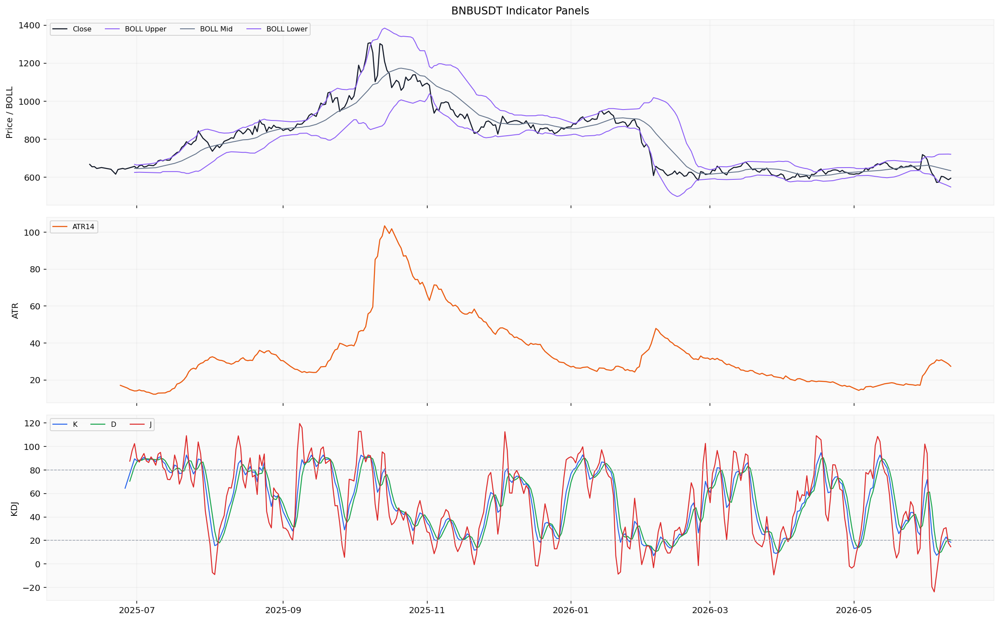
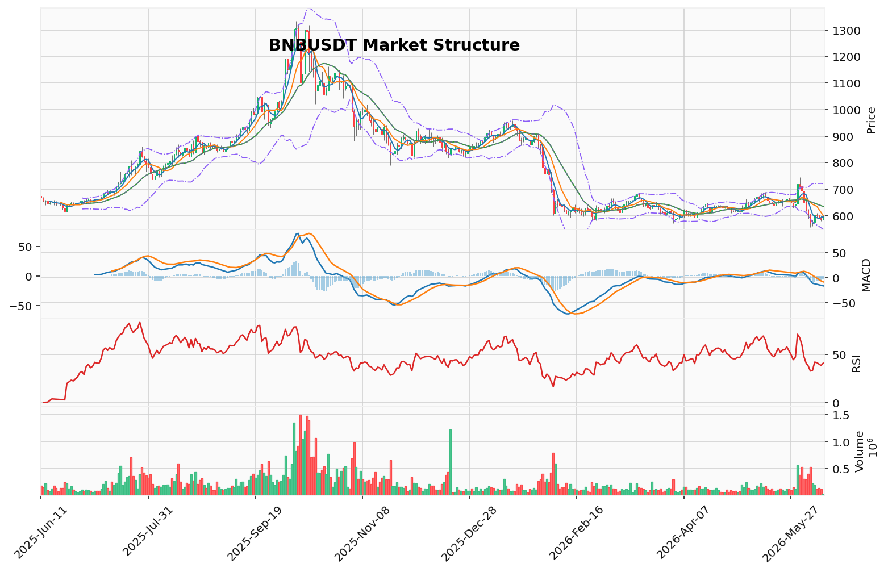

# BNB（BNB）加密资产投资研究报告

> 报告生成时间（美东）：2026-06-11 01:25:22 EDT
> 报告生成时间（北京）：2026-06-11 13:25:22 CST

## 一、投资结论与组合动作

**最终建议：持有/观望**

| 项目 | 内容 |
|------|------|
| **决策** | **持有/观望** |
| **新开仓** | **不建议**。均线空头排列+MACD负值扩大+累计CVD负值，风险收益比不理想 |
| **已有现货** | **不强制减仓**（无触发条件），自行根据成本评估风险敞口 |
| **合约操作** | **未提供真实持仓与保证金参数，无法审计合约风险，暂不操作** |
| **杠杆使用** | **不加杠杆** |
| **当前可行动作** | 持有/观望、不新开仓、不加杠杆、等待数据恢复后重新评估 |
| **关键失效条件** | 价格收盘站上MA10(600.337 USDT)且持续3日以上，需重新评估看跌结构 |
| **数据恢复后重评** | 多空比、链上净流量、新闻事件三个维度恢复后 |
| **置信度** | **中等偏低**（因关键数据缺口限制完整判断） |

**核心依据**：上游报告提供了三个独立且一致的看跌证据——均线空头排列、MACD负值扩大、累计CVD负值，而看涨论点全部依赖中等置信度或未经验证的信号，不足以下达反转判断。

**风险约束**：在缺少多空比、链上净流量、新闻催化剂等关键数据的情况下，任何方向性押注的置信度都受到限制。持有/观望是当前唯一负责任的行动选择。

## 二、市场结构与技术指标分析

### 技术图表

### 2.1 当前价格结构与趋势状态

BNB/USDT当前报594.5 USDT（2026-06-11），24小时涨幅+1.631%，24小时成交量约118,133 BNB（约6,961万 USDT）。日线收盘价低于MA5(596.154)、MA10(600.337)和MA20(634.418)，均线系统呈明确的空头排列。本地技术摘要标记为downtrend（下跌趋势），成交量处于contracting（收缩）状态。维加斯通道显示价格位于EMA144/EMA169蓝带下方约13%，双线反转结构确认中期偏弱格局。AMD/SMC摆动结构为高点下移、低点下移的下跌推进阶段。

**数据限制**：多空比因来源限流缺失，链上数据因接口凭证缺失和粒度不匹配未覆盖，宏观与新闻材料未整合进本资料包。这些缺口使结论仅局限于价格结构和技术指标层面，情绪面、资金面和宏观面均无法交叉验证。

### 2.2 指标推导过程

#### OB 订单块 / POC / 成交量分布

| 指标 | 数据 | 推导 | 交易作用 | 失效条件 |
|------|------|------|----------|----------|
| OB 订单块 | 近期没有确认的结构突破 | 最近摆动未形成有效订单块突破，当前订单块区域处于空头结构下的潜在缓冲区 | 可作为技术参考，不构成入场或支撑依据 | 需价格触及并配合成交量确认才能评估有效性 |
| POC | 632.03375 USDT | 过去160个样本的成交量控制点，处于当前价格上方 | 可作为上方技术参考位 | 样本数有限（160），换手周期变化后POC可能迁移 |
| 价值区间 | 573.254167 - 707.6075 USDT | 当前价格(594.5)处于价值区间下沿附近 | 下沿573.25附近可能形成技术买盘兴趣区 | 价值区间基于OHLCV近似分桶，非逐笔成交数据 |

#### TD Sequential / 谐波形态

| 指标 | 数据 | 推导 | 交易作用 | 失效条件 |
|------|------|------|----------|----------|
| TD 9/13 | 方向：看涨反转，倒数计数13已完成，置信度中等 | TD 13看涨反转计数在日线完成，提示近期下跌动能可能衰竭 | 可作为潜在结构转稳的技术注意信号 | 需价格行为确认（如后续K线不再创新低），中等置信度不宜单独做反转判断 |
| 谐波形态 | 未匹配到有效候选，AB/XA=2.62029，BC/AB=1.610619，CD/BC=0.285714 | 最近摆动比率不在经典谐波形态的收敛比例范围内 | 当前无谐波交易形态可参考 | 后续摆动结构变化可能形成新的谐波候选 |

#### FVG / AMD/SMC / 123突破

| 指标 | 数据 | 推导 | 交易作用 | 失效条件 |
|------|------|------|----------|----------|
| FVG | 候选18个，未回补3个，最近上方缺口中线599.945 USDT | 上方599.945附近存在未回补公允价值缺口 | 可作为上方技术参考区，不代表必然回补 | 缺口回补非必然事件，价格可能继续远离缺口 |
| AMD/SMC | 高点下移、低点下移，下跌推进阶段；买侧流动性610.54(2026-06-07)，卖侧流动性556.46(2026-06-05) | 结构确认空头推进，610.54和556.46分别为近期摆动高低点流动性参考 | 提供结构参考位，不构成支撑/压力保证 | 未包含逐笔订单流确认，流动性池的实际兑现需价格行为配合 |
| 123突破 | 状态：下破待确认，方向看跌，突破位556.46 USDT | 若价格跌破556.46则确认看跌三点结构 | 556.46为结构关键观察位 | 需价格实际跌破且伴随成交量确认 |

#### Vegas / 布林带 / RSI / MACD / KD

| 指标 | 数据 | 推导 | 交易作用 | 失效条件 |
|------|------|------|----------|----------|
| 维加斯通道 | EMA144: 677.264591，EMA169: 689.399447，价格在蓝带下方约-12.999833% | 价格远离长期趋势通道，主趋势未确认转为多头 | 反映中长期空头结构 | 价格反弹至蓝带附近时需重新评估趋势状态 |
| 布林带 | 上轨720.5675，中轨634.4175，下轨548.2675 | 价格594.5位于中轨与下轨之间，通道宽度约172.3 | 通道下轨548.27为下沿参考 | 通道基于20日均线，趋势加速时通道可能张口 |
| RSI | RSI(14)=40.9813 | 处于30-50的偏弱区间，未进入超卖区域（<30） | 动量偏弱但未到极端区域 | 超卖阈值30为参考，不构成必然反弹信号 |
| MACD | MACD -16.5969，Signal -10.144，Hist -6.4529 | DIF在Signal下方，柱状图负值扩大 | 动能持续偏空 | MACD属于滞后指标，柱状图收窄前趋势延续 |
| KD | K=18.507，D=20.4224，J=14.6761 | K值低于20进入超卖区，D值接近超卖阈值（20） | KD超卖提示短期摆动极端 | KD在强趋势下可在超卖区持续，需结合价格确认 |

#### 清算地图 / CVD / 资金费率 / OI / 多空比

| 指标 | 数据 | 推导 | 交易作用 | 失效条件 |
|------|------|------|----------|----------|
| 清算地图 | 不适用（BTC专用口径） | BNB不适用清算地图分析 | 不作为本标的结构或交易依据 | — |
| CVD/主动买卖量 | CVD代理值-291,769,713.76 USD（累计口径） | 累计主动买卖量差为负值，反映期间卖方主动性偏强 | 可作为方向性偏好的参考 | 累计值与时间跨度相关，需结合近几日逐日CVD变化 |
| 资金费率 | 最新0.000552 percent（2026-06-11） | 近期费率在正负之间小幅摆动，6月10日为-0.003327 percent，6月11日转正 | 费率当前为正但数值较小，多空力量暂无明显偏移 | 缺少多空比交叉验证，费率单一维度不足以判断拥挤度 |
| OI | 未平仓量323,644,704.39 USD（单位已明示） | OI绝对值反映当前持仓规模 | 可用于观察持仓变化方向 | 缺少多空比，无法判断持仓方向分布 |
| 多空比 | 缺失/不可用（来源限流，rate limited） | 无法获取多空账户比例 | 无法判断多空持仓倾向 | 需多空比数据源恢复 |

#### 宏观 / 链上 / AHR999 / 事件

| 指标 | 数据 | 推导 | 交易作用 | 失效条件 |
|------|------|------|----------|----------|
| 宏观 | 缺失/不可用（行情资料包未覆盖宏观判断） | 无法评估宏观环境对BNB的影响 | 不能作为当前交易依据 | 需宏观/新闻资料包补充 |
| 链上 | 缺失/不可用（接口凭证缺失：glassnode；粒度不匹配） | 无交易所净流量、大额转账、活跃地址等链上数据 | 不能作为当前交易依据 | 需链上接口凭证恢复和粒度对齐 |
| AHR999 | 缺失/不可用（未返回） | BTC专用估值指数，未覆盖BNB | 不适用 | — |
| 事件日历 | 缺失/不可用 | 无法判断相关事件类型是否构成驱动 | 不能作为当前交易依据 | 需事件数据提供方恢复 |

### 2.3 关键价格参考位（基于上游市场报告，非执行条件）

| 类型 | 价位(USDT) | 依据 |
|------|------------|------|
| 下方结构参考 | **556.46** | AMD/SMC卖侧流动性(2026-06-05低点) |
| 下方结构参考 | **573.25** | 成交量分布价值区间下沿 |
| 下方结构参考 | **548.27** | 布林带下轨 |
| 上方短期阻力 | **596.15-600.34** | MA5(596.154)/FVG缺口中线(599.945)/MA10(600.337) |
| 中期压力位 | **632.03-634.42** | POC(632.034)/MA20(634.418) |

### 2.4 多空场景与资料限制

**偏多场景**：当前无法构建可执行偏多场景。需要恢复的数据类别包括：多空比（以判断持仓方向是否出现显著失衡）、链上交易所净流量（以判断是否有大额买入流入）、宏观/新闻资料包（以判断是否存在潜在催化剂）、以及逐日CVD变化确认卖方主动性是否开始收敛。TD 13看涨反转计数完成和KD超卖是结构注意信号，但资料包未给出明示交易条件，不能单独作为入场依据。

**偏空场景**：当前无法构建可执行偏空场景。尽管价格结构（均线空头排列、MACD负值、下跌推进阶段）和累计CVD负值指向偏空倾向，但缺少多空比、清算簇密度和链上资金流出数据，无法判断当前空头是否已过度拥挤。

**观望场景**：在以下情况下不应追多或追空：（1）KD已进入超卖区（K<20）但RSI尚未进入超卖（40.98），短期指标信号矛盾，不宜追空；（2）资金费率在正负之间小幅摆动，未出现极端正值或负值，持仓成本未对方向形成压力；（3）多空比、链上、宏观数据缺口压低了结论置信度，任何方向性押注都缺乏多维验证。

### 2.5 小结构建证据链

技术指标层面形成矛盾特征：均线空头排列、MACD负值扩大、累计CVD负值构成三个一致的看跌信号，强度为**高至中高**；而TD 13计数完成（置信度中等）和KD超卖（K=18.5，但RSI=40.98未超卖）提供潜在的衰竭注意信号，但无法被RSI验证。衍生品方面资金费率转正但数值微小，多空比缺口使情绪面无法确认。链上与宏观完全缺失，外部影响维度无法评估。**整体而言，可验证的看跌证据一致性优于看涨证据，但数据缺口限制整体判断置信度。**

## 三、项目与代币基本面分析

### 资料包状态与可引用数据

基本面资料包为**部分可用**，严格限于已返回的日频价格、市值、成交量和流通供应量快照（覆盖2017年7月25日至2026年6月10日）。DeFi经营数据（总锁仓量、协议收入、费用）、链上日频指标、ETF资金流均未形成可引用的数据集。以下分析完全基于已返回的事实材料。

### 当前市场快照

| 指标 | 数值 | 数据来源状态 |
|------|------|-------------|
| 价格（2026-06-11） | 593.68 USD / 594.5 USD（双来源略有差异） | 资料包已返回 |
| 市值（2026-06-11） | ≈799.9亿 – 800.0亿 USD | 资料包已返回 |
| 24小时成交量（2026-06-11） | ≈6.69亿 USD（来源1）；≈0.94亿 USD（来源2，口径不一致） | 资料包已返回，单位未完全对齐 |
| 流通供应量（2026-06-10） | 约134,784,050 BNB | 资料包已返回 |

价格在593-594美元区间交易，市值在800亿美元附近。流通供应量自6月6日以来保持约1.3478亿枚，变动极小。成交量存在两个来源且差异显著（6.69亿 vs 0.94亿 USD），可能反映不同交易所或聚合口径差异，分析师无法判断更接近全市场真实成交的口径。

### 价格与市值历史走势（可引用资料）

资料包返回了自2017年7月25日至2026年6月10日的日频价格、市值与供应量序列（共3243个日观测），是当前唯一可引用的基本面时间序列。

近期数据观察：
- 过去一周（6月6日至6月10日），价格在572-604 USD区间波动，6月8日达到周内高点约603.65 USD，随后回落至592.85 USD。
- 市值与价格走势同步，区间约774亿-814亿 USD。
- 流通供应量在统计区间内高度稳定（约1.3478亿枚），周内波动幅度不足0.005%，说明不存在显著的代币增发或销毁活动被此数据源捕获。

### 投资含义与限制

**当前可用的基本面事实链：** 价格、市值、流通供应量的日频快照构成一组事实，但仅限于静态快照和短期（一周）价格-市值协同运动。这组事实指向BNB在统计区间内供应稳定、市值与价格同步波动，但无法进一步推断生态健康度、价值捕获能力或代币经济模型的可持续性。

**缺口对当前“持有/观望”组合动作的支持：** 基本面维度无法提供看涨或看跌的依据。流通供应稳定本身既不构成利好也不构成利空——它只是描述了一个当前状态，而非未来方向。组合经理的“持有/观望”决策主要基于技术结构和衍生品读数，基本面缺口仅降低了判断的整体置信度，并未反向推高看跌或看涨权重。

**需要恢复后续评估的数据类别：**
1. **供给与发行材料**（总供应量、解锁时间表、销毁机制、未来释放计划）→ 用于判断未来稀释压力或供给收缩潜力。
2. **DeFi经营数据**（TVL、协议收入、费用）→ 用于评估链上生态活跃度和价值捕获能力。
3. **链上日频指标**（活跃地址、交易笔数、交易所净流量、持有者分布）→ 用于判断链上使用趋势和资金流向。
4. **估值数据**（FDV/TVL等加密资产口径）→ 用于相对估值比较。

若上述四类数据恢复并验证方向性变化，需要重新评估基本面判断对组合动作的影响。

## 四、新闻、监管与事件驱动

### 4.1 资料可用性概述

新闻资料包已返回，但存在明显的来源类型限制与时间覆盖缺口。全部80条记录（项目新闻10条，宏观新闻70条）均来自**媒体聚合搜索线索**与**公开搜索线索**，未包含来自官方公告、项目方披露、监管原始来源、交易所公告或已读取原文的可靠媒体正文。项目新闻覆盖2025-07-16至2026-06-10，宏观新闻覆盖2025-12-03至2026-06-08，分析区间前半段（2025-06-11至2025-07-15）存在资料空白。

**整体判断：该资料包不具备用于撰写已验证事实新闻报告的条件。**

### 4.2 已验证来源与可引用事实

因全部返回内容均为搜索线索，未包含任何已确认的新闻事实，本节无法引用任何一条已验证的事件。

### 4.3 待核验线索与维度判断

资料包中的搜索线索（标题与摘要）提示存在与BNB相关的搜索活动，涉及行业生态、项目进展等方向，以及更广泛的宏观与行业话题。根据写作边界，搜索线索中的具体机构名称、产品名、事件名、政策名等实体不得写入正文。

**概括结论：当前仅能判断存在“监管、机构资金、宏观或行业搜索线索待核验”。**

以下事件维度在当前条件下均无法做出事实性判断：

| 事件维度 | 判断结论 |
|---|---|
| 官方公告（如BNB Chain升级、BSC生态更新、代币销毁等） | 缺少已验证来源 |
| 交易所公告（如Binance上市、下架、风控措施等） | 缺少已验证来源 |
| 监管事件（如各国针对Binance或BNB的监管行动） | 缺少已验证来源 |
| 机构资金流（如基金宣布持仓、做市商动作） | 缺少已验证来源 |
| 安全事件（如跨链桥攻击、合约漏洞、资产被盗） | 缺少已验证来源 |
| 治理提案与链上事件 | 缺少已验证来源 |
| 代币解锁、供给变化 | 缺少已验证来源 |
| 宏观事件（利率、监管法案、行业政策） | 缺少已验证来源 |

### 4.4 对当前组合动作的影响

**新闻维度无法提供任何已验证的正向或负面事件来支撑方向性判断。** 该维度的缺口是组合经理维持“持有/观望”立场、将整体置信度评为“中等偏低”的关键原因之一——缺少已验证的催化剂事件，使得所有基于技术衰竭信号的上行推演缺乏外部事件驱动支持。

### 4.5 核验条件与数据恢复

若后续新闻资料包恢复来自官方公告、监管原始来源或可靠媒体正文的已验证事件，需重新评估各事件维度对BNB需求、供给、流动性、监管风险或安全假设的影响。具体需恢复的数据类别包括：

- **可核验的项目官方公告**：如有已验证的BNB Chain升级、代币销毁计划或生态合作公告，需评估其对基本面逻辑的支撑强度
- **可核验的交易所公告**：如有已验证的Binance合规进展、上市或风控措施，需评估其对流动性和信心的影响
- **可核验的监管/安全事件**：如有已验证的监管行动或安全事故事实，需评估其对风险溢价的冲击
- **可核验的宏观事件**：如有已验证的宏观政策或利率信息，需评估其对加密资产整体市场的联动影响

**重评动作：** 上述数据恢复并经分析确认后，重新评估当前持有/观望立场。**不得提前预设任何未来方向性动作或具体的价格影响幅度。**

### 4.6 资料限制与风险提示

1. **来源类型限制**：全部80条记录均为媒体聚合搜索线索，未返回官方公告、交易所公告、监管原始来源或已读取原文的可靠媒体正文。搜索线索未核验，不能作为事实源。
2. **时间覆盖不完整**：分析区间前半段（2025-06-11至2025-07-15）项目新闻缺失；宏观新闻覆盖起始于2025-12-03，缺失2025-06-11至2025-12-02时段。
3. **样本容量有限**：项目新闻仅10条，对于全年12个月的分析区间样本覆盖率偏低。
4. **潜在误读风险**：搜索线索的标题和摘要可能带有媒体编辑倾向、未经核实的信息或过时的叙事，不得将其解读为已经发生的事件或已形成的市场共识。
5. **缺新闻不代表没有新闻**：资料包未返回可靠来源，仅表明新闻维度在当前取数条件下无法做出判断，不应被理解为“没有负面消息”或“存在潜在利好”。

## 五、社区情绪、事件预期与交易拥挤度

本节整合社区情绪、公开讨论线索、市场级情绪、事件预期、聚合指标和真实社交平台样本。说明情绪是强化基本面/技术面判断，还是提示拥挤、脆弱、预期过满、反身性风险或叙事扩散。

### 市场级情绪读数

截至2026-06-11，Alternative.me 恐惧与贪婪指数返回 BNB 的当前情绪分数为 **12.0**，处于 **极度恐惧（Extreme Fear）** 区间。该指标为市场层面的整体情绪刻度，覆盖范围为市场级情绪，不区分具体社交平台或语言社区。

| 指标 | 数据 | 推导 | 投资含义 | 限制条件 |
|------|------|------|----------|----------|
| 恐惧与贪婪指数 | 12.0（极度恐惧） | 当前市场情绪处于极端恐惧区间 | 极度恐惧本身为截面读数，不构成方向性交易依据 | 上游报告未提供的回测或统计支持；不能作为反向指标或反转信号 |

### 社区讨论热度与叙事方向

**无法评估。** 舆情资料包中缺少具体的社交平台样本数据（包括帖子数量、互动量、社交主导力等聚合指标），也未返回任何真实平台来源的讨论样本。因此，BNB 当前一级市场社区的热度方向（乐观、悲观、FOMO、恐慌、分歧扩大或关注度下降）均不能基于当前可用资料得出判断。

### 主要叙事与传播路径

**相关市场叙事缺少真实平台样本支持。** 资料包未返回任何可引用的具体叙事内容、传播渠道或参与者讨论线索，无法识别当前 BNB 社区的主导叙事或传播路径。

### 参与者结构

**无法覆盖。** 由于缺乏来自 Twitter/X、Telegram、Discord、Reddit、中文社区或其他聚合渠道的真实样本，参与者类型、平台来源分布及语言社区差异均无法进行分析。

### 情绪对 1-5 天市场反应的潜在影响

**短期情绪影响无法判断。** 极度恐惧读数本身是一个截面状态，缺少历史统计回测或事件预期材料支持，该方向缺少统计或回测证据，不能作为方向性交易依据。

### 情绪与交易拥挤度交叉验证

| 维度 | 数据状态 | 对情绪/拥挤度判断的影响 |
|------|----------|------------------------|
| 多空比 | **缺失**（来源限流） | 无法判断持仓方向分布、空头拥挤度或逼空风险 |
| 资金费率 | 最新 0.000552% | 数值微小，转正意义有限；缺少多空比验证新增 OI 方向 |
| OI | 323,644,704.39 USD | 绝对规模可观察，但无多空比无法判断方向分布 |
| 社交媒体样本 | **缺失** | 无法评估讨论密集度、叙事方向或参与者结构 |
| 链上净流量 | **缺失** | 无法判断积累/派发行为或交易所资金流向 |

**结论：** 当前唯一可用的市场级情绪读数为极度恐惧（12分），属于截面状态，该方向缺少统计或回测证据，不能作为方向性交易依据。社区讨论、叙事传播、参与者结构、多空比及链上资金流向等维度均因数据缺失无法评估。情绪维度在当前条件下不足以提供强化或削弱基本面/技术面判断的有效支撑，仅作为待验证的观察项。

### 情绪失真风险

**失真风险无法量化。** 当前资料包未返回任何可用于识别情绪失真（如刷量、机器人活动、叙事操纵等）的证据材料。无法判断极度恐惧指数是否真实反映市场参与者的主观情绪状态，或是否受到自动化交易、市场操纵或选择性样本的影响。

### 数据限制与风险提示

- **平台覆盖缺口：** 本报告仅依赖 Alternative.me 恐惧与贪婪指数这一市场级情绪来源，未获取到 LunarCrush 等主流社交聚合平台的各项指标数据（社交主导力、帖子量、互动量等），接口凭证缺失导致该维度完全不可用。
- **真实样本缺失：** 所有主流社交平台（X、Telegram、Discord、Reddit 及中文社区）的真实讨论样本均未返回，无法形成可引用的数据集或来源尝试记录。
- **语言社区割裂：** 中文社区及其他非英语社区的讨论样本完全缺失，无法评估不同语言社区的立场差异。
- **叙事与参与者分析受限：** 缺少平台样本意味着关于 BNB 生态、叙事传播、参与者结构等所有社交维度的问题均无法给出有效判断。
- **结论约束：** 当前唯一可用的极度恐惧（12分）属于市场级截面情绪，不应被误解为社区共识或价格预测信号。在更多社交资料就绪之前，本报告的舆情维度覆盖严重不足，读者需审慎看待其参考价值。

## 六、交易计划与组合风险

### 6.1 组合最终动作：持有/观望

| 项目 | 内容 |
|------|------|
| **新开仓** | **不建议**。均线空头排列+MACD负值扩大+累计CVD负值，风险收益比不理想 |
| **已有现货** | **不强制减仓**（无触发条件），自行根据成本评估风险敞口 |
| **合约操作** | **未提供真实持仓与保证金参数，无法审计合约风险，暂不操作** |
| **杠杆使用** | **不加杠杆** |
| **当前可行动作** | 持有/观望、不新开仓、不加杠杆、等待数据恢复后重新评估 |

### 6.2 价格参考位（基于上游市场报告，非执行条件）

| 类型 | 价位(USDT) | 依据 |
|------|------------|------|
| 下方结构参考 | **556.46** | AMD/SMC卖侧流动性(2026-06-05低点) |
| 下方结构参考 | **573.25** | 成交量分布价值区间下沿 |
| 下方结构参考 | **548.27** | 布林带下轨 |
| 上方短期阻力 | **596.15-600.34** | MA5(596.154)/FVG缺口中线(599.945)/MA10(600.337) |
| 中期压力位 | **632.03-634.42** | POC(632.034)/MA20(634.418) |
| 长期压力位 | **677.26-689.40** | 维加斯蓝带EMA144/169 |

**具体执行价位需等待行情与技术资料恢复后确认。**

### 6.3 关键辩论分歧与组合经理裁决

#### 分歧1：“衰竭信号” vs “趋势信号”孰先？

**激进分析师立场：** 日线TD 13计数完成、KD超卖(18.5)是趋势衰竭信号，“衰竭信号比趋势信号更具前瞻性”，市场可能在接近底部区域。

**安全分析师立场：** TD 13为中等置信度信号，KD超卖在强趋势中可持续多日且未获RSI(40.98)验证。“一个中等置信度的信号，永远不能凌驾于三个高置信度、且已被验证的看跌信号之上”。

**组合经理裁决：支持安全分析师。** 上游报告未提供任何统计回测支持“衰竭信号比趋势信号更具前瞻性”这一论断。均线空头排列、MACD负值扩大、累计CVD负值是“已经确认”的高置信度趋势证据，而TD 13和KD超卖仅为“可能衰竭”的中等置信度信号。在缺乏历史胜率数据的情况下，不能将中等置信度的衰竭信号置于高置信度的趋势信号之上。

#### 分歧2：“数据缺口”应如何解读？

**激进分析师立场：** 试图将多空比缺失、链上缺失、新闻缺失包装为潜在看涨证据，称“资金费率转正+OI增加”是“空头陷阱特征”。

**安全分析师立场：** “没有多空比数据，我们无法判断新增的OI是来自多头还是空头。”数据缺口只能说明该条论据未验证，不能作为多空任一方向的证据。

**组合经理裁决：支持安全分析师。** 激进分析师的行为违反了“上游材料未提供时不得自设解读”的原则。数据缺口只能降低置信度，不能用于支持看涨或看跌方向。

#### 分歧3：“不对称风险回报结构”是否成立？

**激进分析师断言：** 下行空间有限(7.8%至548.27)，上行空间巨大(13.9%至632-677)，具备“小止损博大收益”的机会。

**安全分析师反驳：**
- 止损设在548.27(布林下轨)，而下方556.46是关键结构观察位——一旦跌破，看跌结构即确认，价格可能在流动性断层中直接“插针”击穿止损位；
- 上行目标632-677缺乏可验证的催化剂——新闻报告为空、基本面数据缺失；
- 上游报告未提供该“风险回报比”的历史统计或回测支持。

**组合经理裁决：支持安全分析师。** 激进分析师的量化存在重大缺陷，未考虑流动性断层和插针风险，且上行目标缺乏任何可验证催化剂支撑。

### 6.4 数据恢复后重评条件

| 缺失数据 | 恢复后需验证的问题 | 对结论的影响 |
|----------|--------------------|--------------|
| 多空比 | 空头是否过度拥挤？多头是否已基本出清？ | 若空头极度集中，短期逼空风险上升 |
| 链上净流量 | 交易所大额流入/流出方向？积累还是派发？ | 若大额流出交易所(积累)，看跌信心降低 |
| 新闻/事件 | 是否有已验证的官方公告(监管、升级、销毁)？ | 若有利好催化剂，需重新评估基本面 |
| 日频CVD | 负值是否连续收敛或转为正值？ | 若CVD转正，卖方主导结束 |
| 订单簿深度 | 关键价位的买卖盘支撑强度？ | 可评估流动性断层的概率 |

**重评动作：** 上述数据恢复并经分析确认后，重新评估当前持有/观望立场。**不得提前预告或设计任何未来开仓、减仓、对冲、期权、收益押注、具体执行价位或方向性动作安排。**

### 6.5 需持续跟踪的风险条件

| 跟踪类别 | 具体内容 |
|----------|----------|
| **资金费率** | 是否持续为正？数值是否显著扩大？ |
| **未平仓合约(OI)** | OI变化方向？与价格走势的背离/一致？ |
| **多空比** | 数据恢复后的读数及多空持仓集中度 |
| **清算密集区** | 上方/下方最大清算簇位置及距离当前价格的距离 |
| **交易所流动性** | 订单簿深度、买卖盘价差 |
| **链上流入/流出** | 交易所净流量、大额转账频率 |
| **代币解锁** | BNB解锁计划及释放量 |
| **监管/安全事件** | Binance监管进展、BNB Chain安全事件 |
| **社区情绪拐点** | 恐惧与贪婪指数是否持续处于极端值？是否出现转向？ |

**跟踪条件不能自设数字阈值；上游资料包没有明示时，不得写自设的指标数值、成交量比例、情绪分数或放量倍数等条件。**

### 6.6 置信度评估

| 维度 | 置信度 | 依据 |
|------|--------|------|
| 技术结构确认 | **中高** | 均线空头排列、MACD负值扩大、累计CVD负值，三个信号方向一致 |
| 反转信号评价 | **低** | TD 13中等置信度；KD超卖未获RSI验证；指标矛盾未解决 |
| 数据缺口影响 | **降低整体置信度** | 多空比、链上、新闻维度缺失，限制了完整判断 |
| **整体交易判断** | **中等偏低** | 看跌证据一致性优于看涨证据，但数据缺口限制置信度 |

**不得使用百分比、概率或胜率表述。置信度仅使用高/中/低三级。**

## 七、关键分歧与跟踪条件

| 维度 | 分歧点 | 看涨方论证 | 看跌方论证 | 组合经理裁决 |
|------|--------|-----------|-----------|-------------|
| **信号权重** | 衰竭信号 vs 趋势信号 | TD 13 与 KD 超卖是“已经完成”的衰竭信号，比“均线空头排列”这类过去的价格痕迹更具前瞻性 | 均线空头排列、MACD 负值扩大、累计 CVD 负值是三个高置信度、已确认的趋势证据；TD 13 仅为中等置信度，在强趋势中可能仅为下跌中继 | 均线空头排列+MACD负值扩大+累计CVD负值，三个独立维度信号方向一致，构成**高**置信度看跌证据。TD 13 和 KD 超卖均为中等置信度信号，且在强趋势中失效风险高。**一个中等置信度信号不能凌驾于三个高置信度信号之上。** |
| **数据缺口解读** | 数据缺口是否能用于支持看涨 | 资金费率转正+OI 增加是“空头陷阱”特征；极度恐惧(12分)说明情绪已彻底释放；多空比缺失可能暗示空头高度集中存在逼空风险 | 资金费率转正数值微小、缺少多空比无法判断 OI 方向；极度恐惧(12分)仅为截面读数、无历史回测支持；数据缺口不能作为任何方向的证据 | **数据缺口不能支持看涨，也不能支持看跌，只能降低对应论据的置信度。** 看涨方将缺口包装为潜在利好，属于“选择性认知偏差”；安全分析师“没有多空比无法判断新增 OI 方向”的批评成立。 |
| **风险回报比** | 当前是否具备“不对称风险回报”结构 | 假设下方止损在548.27(布林下轨)，下行空间约7.8%；上方目标632-677(MA20/维加斯蓝带)，上行空间6.3%-13.9%，存在风险回报比优势 | “下行空间7.8%”基于548.27止损位，但价格在556.46时看跌结构已确认，571-548区间存在“执行真空地带”，可能因流动性断层插针击穿止损；上行目标632-677无催化剂支持 | **不采纳为交易依据。** 上游报告未提供该“风险回报比”的历史统计或回测支持；上行目标缺少多空比、链上、新闻等催化剂验证；流动性断层风险明确未被考虑。 |
| **KD 超卖与 RSI 未超卖的矛盾** | 矛盾意味着什么 | KD(K=18.5)已超卖，RSI(40.98)未超卖是市场“纠结与分歧”的表现，是潜在底背离雏形，属于蓄力状态 | KD 超卖在强趋势中可钝化多日，RSI 未超卖说明下跌动量尚未耗尽；不是蓄力而是动量即延续的警告 | KD 超卖与 RSI 未超卖的指标矛盾未解决。**该矛盾只能降低反转信号的置信度，不能解释为“蓄力”或“底背离雏形”。** 组合经理不采纳任一方的方向性解读。 |
| **激进开仓建议** | 是否应建立“小规模轻仓看涨观察头寸” | 可在当前价格至573.25之间，采用现货分批挂单（3-5份，每份相隔5-10 USDT）建立观察头寸，止损设在548.27，目标站回600.34后重评 | 看跌证据强势、看涨证据脆弱、关键数据缺口形成不可知风险；在信息不全的情况下做方向性押注是莽撞，不是激进 | **不采纳激进开仓建议。** 未提供真实持仓参数，无法给出现货买入方案。组合经理维持“持有/观望、不新开仓、不加杠杆、等待数据恢复后重评”。 |

---

### 不采纳的重要观点汇总

| 观点 | 不采纳原因 |
|------|-----------|
| “衰竭信号比趋势信号更具前瞻性” | 上游报告未提供任何统计回测支持该论断；中等置信度的衰竭信号不能凌驾于高置信度的已确认趋势信号之上 |
| “极度恐惧(12分)说明情绪已彻底释放，不能跌了” | 极度恐惧指数仅为截面读数，上游报告明确缺少历史统计回测；不能作为反向指标或方向性交易依据 |
| “资金费率转正+OI增加是空头陷阱特征” | 缺少多空比数据，无法判断新增 OI 方向；资金费率转正也可能因空头主动支付费用维持仓位导致；**该方向性解释未由资料包验证** |
| “KD超卖与RSI未超卖的矛盾是潜在底背离雏形” | 上游报告未返回历史回测验证底背离的有效性；KD与RSI的区间差异仅为指标矛盾，不能外推为底背离结构 |
| “当前可构建不对称风险回报结构(下行7.8% vs 上行13.9%)” | 上行目标(632-677 USDT)缺少催化剂验证；下行止损位存在流动性断层插针风险；上游报告未提供该风险回报比的历史统计支持 |

---

### 后续跟踪条件（需等待数据恢复后重新评估）

| 缺失数据类别 | 恢复后需验证的问题 | 对当前结论的潜在影响 |
|-------------|-------------------|---------------------|
| **多空比** | 空头持仓是否过度拥挤？多头是否已基本出清？ | 若空头极度集中（多空比极低），短期逼空风险上升，需降低看跌信心 |
| **链上净流量（交易所净流出/流入）** | 大额资金流向是交易所流出（积累）还是流入（派发）？ | 若大额流出交易所，看跌信心降低；若大额流入交易所，看跌结构得到强化 |
| **日频CVD** | CVD 负值是否连续收敛或转为正值？ | 若 CVD 转正，卖方主动性主导结束，需重新评估方向 |
| **新闻/事件** | 是否有已验证的官方公告（监管、升级、销毁、生态进展）？ | 若有利好催化剂，需重新评估基本面与技术面综合判断 |
| **订单簿深度** | 关键价位（556.46、548.27、600.34）的买卖盘支撑强度？ | 可评估流动性断层概率，验证下方结构参考的可靠性 |

**重评动作：** 上述数据恢复并经分析确认后，重新评估当前“持有/观望”立场。**当前不预设方向性动作安排。**

## 八、最终结论

**组合经理最终动作：持有/观望。** 当前不新开仓、不加杠杆；持有现有仓位（如有）并等待关键数据恢复后重新评估。在缺少多空比、链上净流量和新闻催化剂的情况下，任何方向性押注的置信度均受到限制，不做方向性交易。

**当前动作成立的核心证据：**
- **三个独立且一致的看跌技术信号：** 均线空头排列（价格594.5 USDT低于MA5/MA10/MA20）、MACD负值持续扩大（Hist -6.453）、累计CVD负值（-291,769,713.76 USD），均指向卖方主动性主导、动能持续偏空。
- **看涨证据均存在可验证缺陷：** TD 13计数完成标注为中等置信度，在强趋势中可能仅为下跌中继；KD超卖（K=18.5）未获RSI（40.98）验证，指标矛盾未解决；资金费率转正（0.000552%）数值微小且缺少多空比交叉验证；极度恐惧（12分）无历史回测支持，不能作为反向指标。
- **中等置信度衰竭信号不能凌驾于高置信度趋势信号之上：** 看涨论点全部依赖未验证或中等置信度的证据，不足以下达趋势反转判断。

**最关键的重新评估数据类别：** 多空比（判断持仓方向分布是否极端）、链上净流量（判断交易所大额资金流入/流出方向）、已验证新闻事件（判断是否存在官方公告驱动的催化剂）。

**下一步最需要跟踪的3类数据：**
1. **多空比与衍生品拥挤度：** 数据恢复后需确认空头是否过度集中（逼空风险上升）或多头是否已出清；资金费率是否持续转正且数值扩大。
2. **链上大额资金流向：** 交易所净流量方向（大额流出为积累信号）及大额转账计数/笔数变化。
3. **价格行为对关键技术参考位的验证：** 若价格有效跌破556.46 USDT（AMD/SMC卖侧流动性+123突破观察位），看跌结构将强化；若价格收盘站上MA10（600.337 USDT）且持续3日以上，需重新评估看跌结构。

在现有数据缺口（多空比、链上、新闻、订单簿深度、宏观）未恢复填补前，当前组合动作保持：不新开仓、不加杠杆、持有现有仓位并等待数据恢复后重评。
