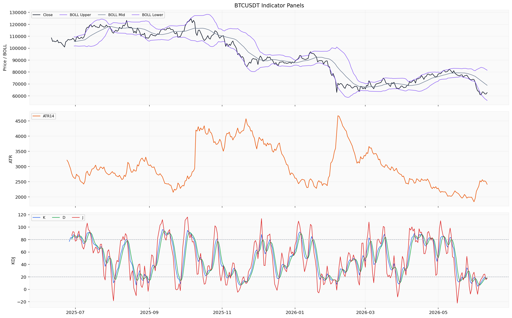
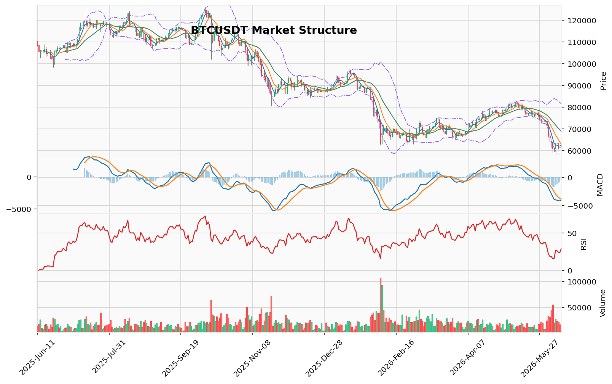

# Bitcoin（BTC）加密资产投资研究报告

> 报告生成时间（美东）：2026-06-11 01:10:32 EDT
> 报告生成时间（北京）：2026-06-11 13:10:32 CST

## 一、投资结论与组合动作

**最终组合动作：持有/观望。当前不新开仓、不加杠杆，保持现有资产不变，等待核心数据恢复后重新评估。**

**执行理由：** 上游所有方向性报告（市场技术分析、基本面、交易员计划）均明确指出，当前数据缺口巨大，无法构建任何方向的可执行交易方案。看涨方依赖的技术衰竭信号（RSI超卖29.37、TD序列看涨反转13计数完成）缺少回测统计支持，且无资金流入、链上或宏观共振；看跌方虽拥有已验证的空头技术结构（123突破有效、Vegas蓝带压制、POC上方套牢盘）和ETF资金流净流出证据（6月2-8日累计-13.3亿美元），但同样缺少资金费率、多空比、清算簇等衍生品数据来验证追空的安全边际和潜在逼空风险。在双方均无法提供可执行条件的前提下，唯一负责任的决策是**承认数据缺口，并让缺口成为决策的核心参数**，而非用叙事填补。

**关键约束条件：**
- **入场触发：** 全部待定。需等待资金费率、多空比、清算热力图、交易所BTC净流量、AHR999指数等核心数据恢复，并经重新评估后方可建立任何方向触发条件。
- **目标区间：** 无。上游报告未提供基于已确认支撑/压力的具体价格区间。
- **止损/失效位：** 无。在缺少关键数据的情况下，无法设定可验证的失效位或止损位。
- **仓位建议：** 新开仓为0。未提供真实持仓参数，无法给出任何仓位大小、分批节奏或最大可承受回撤数据。对于任何新开仓，建议为零。
- **现货/合约选择：** 暂不选择。未提供真实合约持仓、保证金模式和保证金参数，无法审计合约风险，故不进行任何合约处理。
- **最大风险边界：** 未知。当前最大的风险是因信息不足而做出错误决策的风险，“持有/观望”正是管理这一风险的最优策略。

**数据恢复后的重评方向：** 等待资金费率、多空比、清算数据、交易所净流量、AHR999等核心数据恢复后，重新评估市场结构的完整性和趋势的可执行性。

## 二、市场结构与技术指标分析

### 技术图表

当前 BTC 价格报 62,712.59 USDT，24 小时涨幅 +2.378%，成交量 17,367.24 BTC（约 10.73 亿 USDT）。行情数据覆盖完整（日线 366 行覆盖整年，小时线 1000 行覆盖约 43 天），本地技术指标已成功生成。但衍生品与链上维度存在多处数据缺口：资金费率来源限流且粒度不匹配，多空比仓库无可用记录，清算热力图与强平统计均因限流或粒度不匹配未能获取，链上数据与 AHR999 也未取得。数据整体为"部分可用"，技术面分析可信度中等，衍生品与链上维度分析深度受限。

### 价格结构与趋势状态

价格自 2026 年 6 月 7 日触及 64,234.68 局部高点后快速回落至 60,755.0，随后小幅反弹至 62,712.59。日线 MA5（62,474.32）略低于 MA10（62,910.22），MA20（68,833.32）远高于当前价格，呈短期均线走平、中期均线压制结构。Vegas 通道显示价格在蓝带下方约 18.7%，双线反转系统中 EMA20 和 EMA50 均线均在价格上方，整体空头结构维持。AMD/SMC 摆动显示高点下移、低点下移，处于下跌推进阶段，上方 64,234.68 和下方 59,130.91 分别构成买侧与卖侧流动性代理。123 突破结构已确认向下突破 74,289.6 颈线位，维持看跌结构。成交量分布控制点（POC）位于 68,021.11 USDT，价值区间 65,596.51–80,144.10 USDT，当前价格 62,712.59 明显低于 POC 和价值区间下沿，处于密集成交区下方。上方存在未回补 FVG 缺口中线 65,478.66 USDT，距当前价格约 4.4%。

### 指标推导过程

#### OB 订单块 / POC 成交量分布 / TD Sequential / 谐波形态 / FVG

| 指标 | 数据 | 推导 | 交易作用 | 失效条件 |
|------|------|------|----------|----------|
| OB 订单块 | 近期没有确认的结构突破；候选订单块区间已在材料中记录 | 当前无确认的订单块结构被价格突破，订单块提供的价格参考尚未被验证 | 不能作为当前交易依据；仅提示近期结构未触发有效订单块反应 | 需价格实际测试并验证订单块区域的反应后再评估 |
| POC / 成交量分布 | POC=68,021.11 USDT，价值区间 65,596.51–80,144.10 USDT，样本 160 | 当前价格 62,712.59 明显低于 POC 和价值区间下沿，处于密集成交区下方 | 当前价格在成交量分布下方运行，说明近期成交重心在上方，下方缺乏成交密集区支撑 | 若价格返回 65,596.50 上方，则当前位置的意义需要重新评估 |
| TD Sequential | 方向看涨反转，计数启动 1，倒数计数 13，信号为 TD 看涨反转 13 计数完成，置信度中等 | TD 序列在近期下跌后触发了看涨反转 13 计数，提示潜在的下跌衰竭窗口 | 可作为技术参考观察，但不构成介入信号 | 需 TD 9 实际重置或价格跌破当前计数启动位才失效 |
| 谐波形态 | 未匹配到有效候选，方向看跌，AB/XA=1.4688，BC/AB=2.4035，CD/BC=0.3814 | 最近摆动比例未形成标准谐波模式，形态匹配失败 | 当前不能作为交易依据 | 需新的摆动结构形成完整谐波比例后再做判断 |
| FVG | 候选 21 个，未回补 5 个，最近上方缺口中线 65,478.66 USDT | 上方存在未回补缺口，当前价格距该缺口中线约 4.4% | 缺口位置可作为上方技术参考区域 | 若价格到达并回补缺口区域，该技术参考随之失效 |

#### AMD/SMC 与 123 突破

| 指标 | 数据 | 推导 | 交易作用 | 失效条件 |
|------|------|------|----------|----------|
| AMD/SMC 摆动 | 高点下移、低点下移，下跌推进阶段；买侧流动性 64,234.68（2026-06-07），卖侧流动性 59,130.91（2026-06-05） | 当前处于明确的下跌推动结构中，上方 64,234.68 和下方 59,130.91 分别构成流动池代理 | 摆动结构确认空头推进，但无订单流确认 | 若价格突破上次高点（64,234.68）则当前下跌推动结构受到挑战 |
| 123 突破 | 下破已确认，方向看跌，突破位 74,289.6 USDT | 三点结构已确认向下突破 74,289.6 颈线位，维持看跌结构 | 作为技术参考，提示空头结构维持 | 若价格重新站上 74,289.6 则 123 看跌结构失效 |

#### Vegas / 布林带 / RSI / MACD / KD

| 指标 | 数据 | 推导 | 交易作用 | 失效条件 |
|------|------|------|----------|----------|
| 维加斯通道 | 价格在蓝带下方 18.7%；EMA144=76,404.16，EMA169=77,875.58，主趋势未确认 | 蓝带价格远高于当前价格，整体结构偏空 | 不能作为入场依据，仅反映空头趋势结构 | 需要更多时间维度确认趋势恢复后再评估 |
| 布林带 | 上轨 81,512.17，中轨 68,833.32，下轨 56,154.48 | 当前价格 62,712.59 位于中轨与下轨之间，近中轨偏下位置 | 说明价格处于布林带下半区，空头动能主导 | 若价格回到中轨以上，需重新评估动能方向 |
| RSI | RSI(14)=29.37 | 低于 30 的传统超卖阈值，动能上处于空头极端区域 | 反映卖盘动能已到技术性极端区域，但极端不等于反转 | 需等待 RSI 回到 30 上方或形成底背离结构才能提升反转概率 |
| MACD | MACD=-4,058.95，信号线=-3,519.29，柱=-539.66 | MACD 与信号线均负值，柱状图持续负向扩大，空头动能持续 | 空头动能仍有延续能力 | 若 MACD 柱开始收窄，提示空头动能边际减弱 |
| KD | K=27.09（中性），D=21.04（接近超卖），J=39.19 | D 值接近 20 超卖水平，K 与 D 差值较小，摆动动能偏弱 | 接近超卖但尚未确认超卖状态 | D 值跌破 20 明确进入超卖或向上金叉时可重新评估 |

#### 清算地图 / CVD / 资金费率 / OI / 多空比

| 指标 | 数据 | 推导 | 交易作用 | 失效条件 |
|------|------|------|----------|----------|
| 清算地图 | 缺失/不可用 | 因来源限流且仓库无可用记录，未获取清算簇数据 | 无法判断清算密集区的价格参考 | 需清算数据源恢复后重新评估 |
| CVD/主动买卖量 | CVD（差额）= -1,132,768,542.12 USD（单位已明示），来自 taker buy/sell volume 差额 | 主动卖盘大于买盘，净主动卖出方向 | 反映主动卖方占优，与当前价格下跌方向一致 | 若 CVD 转正或大幅收窄，提示主动买卖量方向可能改变 |
| 资金费率 | 缺失/不可用 | 来源限流且粒度不匹配，未获取 | 无法判断永续合约资金面的拥挤度或偏斜方向 | 需资金费率数据源恢复 |
| OI | 未平仓量 6,292,064,742.47 USD（单位已明示） | OI 水平反映了当前合约市场持仓规模 | 可作为参考规模，但缺少历史分位无法判断相对高低 | 需 OI 历史序列补充后才能评估持仓变化趋势 |
| 多空比 | 缺失/不可用 | 仓库无可用记录，来源限流 | 无法判断多空开仓方向偏斜 | 需多空比数据源恢复 |

#### 宏观 / 链上 / AHR999 / 事件

| 指标 | 数据 | 推导 | 交易作用 | 失效条件 |
|------|------|------|----------|----------|
| 宏观 | 宏观/新闻由新闻资料包负责，本行情包不重复判断 | 本资料包未包含宏观判断材料 | 不能作为当前交易依据 | 需综合新闻资料包结果 |
| 链上 | 缺失/不可用 | 未取得链上数据 | 无法分析链上流动、大额交易或持有者行为 | 需链上数据源恢复 |
| AHR999 | 缺失/不可用 | 未取得 AHR999 指数 | 无法评估 BTC 相对估值位置 | 需 AHR999 数据源恢复 |
| 事件 | 事件日历缺失/不可用 | 未返回任何事件数据 | 无法判断相关事件类型是否构成驱动 | 需事件数据提供方恢复 |

### 多空场景与观望立场

**偏多场景**：当前无法构建可执行偏多场景。需要恢复以下资料类别后重新评估：资金费率数据（判断永续合约是否出现负费率支撑）、清算簇数据（寻找下方潜在流动性池形成支撑）、链上数据（判断交易所净流出或囤积行为是否构成持有者惜售）、多空比数据（判断多空开仓方向是否开始向多头倾斜）、AHR999 估值指数（判断价格相对历史估值的位置）。

**偏空场景**：当前无法构建可执行偏空场景。虽然空头技术结构完整（RSI 超卖、MACD 负值、Vegas 压制、123 看跌），但缺少衍生品拥挤度和资金费率数据来验证追空的安全边际。需要恢复以下资料类别：资金费率（确认是否处于极端多空失衡状态）、多空比（观察开仓方向是否过度集中）、清算簇（判断上方是否存在密集空头清算区）、链上数据（确认是否有大额交易所流入压制价格）。在上述数据恢复之前，空头结构仅作为方向参考，不具备可执行条件。

**观望场景**：当前最合适的立场是观望。主要原因：（1）价格处在空头趋势中，但 RSI 处于超卖区，追空存在技术性反弹风险；（2）衍生品方向多数数据缺失，无法评估拥挤度是否已到极端水平；（3）成交量处于 contracting 状态（本地技术摘要注明），近期下跌动能在量能上未显著放大；（4）TD 看涨反转 13 计数完成提示存在潜在的衰竭窗口。在没有资金费率、多空比、清算簇和链上补充信息之前，不宜偏执于单一方向操作。

### 关键价格位与资料限制

- **支撑区间**：近期低点 59,130.91（2026-06-05，来自 AMD/SMC 卖侧流动性代理）；布林带下轨 56,154.48 USDT。下方缺乏成交密集区支撑。
- **压力区间**：上方未回补 FVG 缺口中线 65,478.66 USDT；MA10（62,910.22）；MA20（68,833.32）；123 突破位 74,289.6 USDT；Vegas 蓝带中线约 77,139 USDT 附近。
- **技术参考位**：局部高点 64,234.68（AMD/SMC 买侧流动性代理）；POC 68,021.11；价值区间下沿 65,596.51；布林带上轨 81,512.17。
- **待确认条件**：需要恢复的数据类别包括资金费率、多空比、清算簇、链上数据、AHR999 指数和强平统计数据。仅靠现有价格结构和本地指标不足以构建可执行条件。
- **主要限制**：资金费率和多空比的缺失导致无法判断合约市场的资金偏斜和投机拥挤度；清算簇缺失导致无法识别价格敏感区域；链上缺失导致无法评估大额持有者行为；AHR999 缺失限制了相对估值判断。上述缺口共同导致结论置信度处于中等偏低水平。

## 三、项目与代币基本面分析

### 3.1 数据可用性说明

基本面资料包仅返回部分数据：价格/市值/成交量的单日快照（2026-06-11）及ETF资金流历史序列（2025-06-11至2026-06-08，共251个交易日）。链上数据（活跃地址、交易笔数、转账量、哈希率）、供给与发行数据（流通供应量、总供应量、发行节奏、解锁日程）、DeFi经营数据（TVL、协议收入、费用）、估值指标（AHR999、FDV、市值/链上指标比率）均未返回。**整体评估：部分覆盖，不足以支撑完整基本面判断。**

### 3.2 已返回数据分析

#### 3.2.1 价格与市场规模（单日快照，2026-06-11）

| 指标 | 数值 | 单位 | 分析含义 | 对组合动作的限制 |
|------|------|------|----------|-----------------|
| 价格 | 62,674.0 | USD | 单日快照，缺乏历史比较序列 | 无法判断价格趋势方向或市值变动历史分位 |
| 市值 | 1,257,204,398,654.0 | USD | 单日静态读数 | 无法评估市值相对历史估值的位置 |
| 成交量 | 29,853,480,337.0 | USD | 单日静态读数 | 无法判断成交量活跃度的历史分位 |

**解读**：上述数据为单日截面数据，无法提供任何趋势判断或估值参考。当前价格62,674 USD与市场技术报告中的62,712.59 USDT存在细微差异，系数据源统计口径不同，不影响基本面分析结论。

#### 3.2.2 机构资金流向：ETF资金流

资料包返回2025-06-11至2026-06-08共251个交易日的BTC ETF资金流（单位：USD）。最近数日数据如下：

| 日期 | ETF资金流（USD） | 累计净流量（近5日） |
|------|-----------------|-------------------|
| 2026-06-08 | -91,400,000 | -13.3亿（6月2-8日） |
| 2026-06-05 | -325,700,000 | — |
| 2026-06-04 | +3,200,000 | — |
| 2026-06-03 | -396,600,000 | — |
| 2026-06-02 | -519,100,000 | — |

**观察与解读：**
- **方向**：在可获取的最新样本期内（6月2日至8日），ETF资金流呈净流出状态，合计约-13.3亿美元，仅6月4日出现少量净流入（+320万美元）。
- **时效性限制**：该序列最后数据日为2026-06-08，最近3个交易日（6月9日-11日）数据缺失。无法确认抛售是否仍在持续，或是否已趋缓/逆转。
- **投资含义**：ETF净流出是当前已验证的最直接的基本面信号，与市场技术面空头结构形成共振。但**缺少更长时间序列的ETF累计流量统计和与价格的对应关系，无法将该信号直接定性为持续趋势或短期波动**。该信号不能单独作为方向性交易依据，只能作为需要持续跟踪的待验证条件。

### 3.3 数据缺口对基本面判断的影响

资料包未能返回以下关键维度，导致基本面分析在多个方向上无法做出判断：

| 缺失维度 | 具体内容 | 对基本面判断的影响 |
|----------|----------|-------------------|
| 供给与发行数据 | 流通供应量、总供应量、发行节奏、解锁日程 | **无法判断未来稀释或发行节奏**；当前快照显示流通供应量与总供应量关系未知，但缺少发行材料，不能判断是否存在未来稀释压力 |
| 链上使用数据 | 活跃地址、交易笔数、链上转账量、哈希率、矿工经济 | **无法评估网络实际使用强度**、经济安全性和持有者行为 |
| DeFi/生态经营数据 | TVL、协议收入、费用、生态项目规模 | **无法评估网络经济活动和价值捕获能力** |
| 估值数据 | AHR999、FDV、市值/链上指标比率 | **无法构建系统性的估值参考框架**，判断当前价格相对历史估值的位置 |
| ETF资金流完整覆盖 | 2026-06-09至2026-06-11缺失 | **影响对最新机构资金情绪的追踪**，最新3日存在盲区 |

### 3.4 基本面分析对组合动作的限制

- **无法给出看涨或看跌的基础**：缺少链上、供给、生态和估值数据，无法判断BTC当前基本面是否健康、估值是否具有吸引力、供给端是否存在潜在压力。
- **ETF流出信号的局限性**：该信号虽为当前唯一可用基本面证据，但时效性受限（截止6月8日）且缺少统计回测支持，**不能作为趋势确认或方向性交易的依据**。
- **恢复数据后的重评方向**：待供给与发行数据、链上使用数据、AHR999等估值指标恢复后，方可评估BTC的基本面健康度、相对估值水平和供需关系，进而对投资决策进行方向性修正。

### 3.5 基本面小结

当前基本面分析的唯一可用证据是ETF资金流在6月2-8日期间的净流出（-13.3亿美元）。该信号与市场技术面的空头结构形成共振，但因其时效性限制和缺少统计验证，**不能作为方向性交易决策的依据**。其余所有基本面维度（链上、供给、生态、估值）均因数据缺失而无法判断。在当前数据缺口下，基本面分析对组合经理的“持有/观望”决策提供了有限支持——它既不构成看涨理由，也不构成看跌理由，而是要求等待数据恢复后再做评估。

## 四、新闻、监管与事件驱动

本节整合分析区间内（2025-06-11 至 2026-06-11）返回的新闻、监管与事件资料。资料状态为**部分可用**：项目新闻返回36行（覆盖2025-06-26至2026-05-23）、宏观新闻返回70行（覆盖2025-12-03至2026-06-08），均未覆盖完整分析区间。在全部返回记录中，仅一条具备原始来源标识；其余均为媒体聚合搜索线索，无法作为已验证事实。

### 1. 已验证来源事件

| 事件 | 来源 | 时间 | 概述 | 影响分析 | 证据强度 |
|------|------|------|------|----------|----------|
| Bitcoin Core 31.0 版本发布 | GitHub（bitcoin/bitcoin） | 2026-04-20 | 正式版本发布，提供下载链接及版本说明 | 中性偏正面。常规软件升级，提升节点运营效率、安全性与网络健壮性，属预期内维护。**非价格驱动事件**，对BTC投资逻辑（数字黄金叙事、价值存储、去中心化资产）无直接影响。 | 高（官方开发仓库发布） |

**后续跟踪**：需关注节点升级率、矿工与交易所的适配/采纳进度，以及版本说明中具体改进内容对网络性能或协议层面产生的实际影响。

### 2. 媒体/搜索线索（待核验）

资料包返回的媒体聚合搜索线索提示以下主题方向，但**未经官方、监管或交易所公告确认，不得作为事实依据**：

- **宏观方向**（2026年5月至6月）：涉及美联储、利率政策、通胀数据、就业数据等搜索结果，方向为宏观货币政策预期。
- **项目方向**（2026年4月至5月后）：涉及比特币ETF/现货产品、矿工/算力动态、监管动向、机构资金进出等搜索结果。
- **技术/协议方向**：涉及比特币协议升级、技术路线讨论的搜索线索。

**当前状态**：上述线索均为搜索摘要标题，未返回官方公告、监管原文或可靠媒体正文，无法确认任何具体事件是否发生、发生时间及实际内容。具体机构名、法案名、产品名、政策名、实体名称均未验证。

### 3. 宏观与行业背景分析

宏观新闻资料包仅覆盖2025-12-03至2026-06-08，且全部内容为媒体/搜索线索，**缺乏已验证的宏观事件来源**（如美联储官方声明、财政部公告、各国监管文件原文、交易所政策公告等）。

因此无法就以下宏观因素给出基于可靠新闻的结论：
- 美联储利率决议及货币政策路径；
- 美国及主要经济体的监管立法进展（如稳定币法案、市场结构法案）；
- 宏观经济数据（CPI、PCE、非农就业、GDP）；
- 地缘政治事件；
- 主要交易所的合规/政策变化。

### 4. 资料限制对当前投资判断的影响

| 数据缺口 | 具体缺失范围 | 对判断的影响 |
|----------|-------------|-------------|
| 宏观新闻覆盖不足 | 2025-06-11至2025-12-02无数据 | 无法评估宏观政策变化对加密市场的潜在冲击 |
| 项目新闻覆盖不足 | 2025-06-11至2025-06-25、2026-05-24至2026-06-11无数据 | 无法评估近期项目动态（如ETF资金流、监管动向）的边际变化 |
| 已验证来源极度有限 | 全资料包仅一条GitHub发布可确认为原始来源 | 无法将任何搜索线索升级为事实，所有关于监管、机构资金、宏观政策的具体论断均不可用 |
| 无监管来源 | 未返回SEC、CFTC、FED、欧盟等机构的原始公告或文件 | 无法评估BTC监管环境变化 |
| 无交易所公告 | 未返回主要交易所的政策变更、上币/下架公告或储备证明 | 无法评估交易市场基础设施风险 |
| 无链上安全/网络事件 | 未返回黑客攻击、双花、矿工异常等事件的可靠来源 | 无法评估协议层或网络层安全风险 |

**缺口转化**：上述数据缺口不代表“没有负面消息”或“存在潜在利好”。这是资料包可引用材料不足的状态，不属于方向性信号。

### 5. 对组合动作的约束

- **支持**：已验证事件（Bitcoin Core 31.0版本发布）属中性偏正面，但非价格驱动，不影响当前“持有/观望”动作。
- **约束**：无法评估监管、宏观或行业事件对BTC供需、流动性或投资者情绪的现实影响；因此不能将事件驱动作为改变当前组合动作的依据。
- **需恢复后重评**：若可靠新闻来源恢复并验证方向性事件（如重大监管变化、宏观政策转向、链上安全事件），需重新评估其对市场结构及投资逻辑的潜在影响。

## 五、社区情绪、事件预期与交易拥挤度

### 1. 市场级情绪指标

截至报告日（2026-06-11），可用的市场级情绪指标仅有一项：Alternative.me 恐惧与贪婪指数读数为 **12**，归类为“极度恐惧”。该指标为单日截面数据，覆盖边界为整体加密市场，并非 BTC 专属；缺少历史趋势对比和波动率参考线。

**投资含义**：极度恐惧读数本身并非看涨或看跌信号，它仅反映当前市场参与者情绪已达到极端区域。在缺少社交平台真实样本、成交量数据和资金流向验证的情况下，无法将这一情绪极值直接外推为“即将出现抄底盘”或“卖盘情绪动能接近极限”。该读数可作为风险监测的参考，但不构成方向性交易依据。

### 2. 社区讨论热度与情绪方向

**无法判断。** 舆情资料包未返回任何真实社交平台样本（包括但不限于 X、Telegram、Discord、Reddit、中文社区等），亦缺少帖文数量、互动量、社交主导度等聚合社交指标。因此，无法评估 BTC 社区的热度变化趋势（上升/下降/平稳），也无法判断参与者情绪处于乐观、悲观、分歧扩大或共识收敛中的何种状态。

### 3. 主要叙事与传播路径

**无法分析。** 由于缺少真实社交平台来源记录和帖文样本，以下方向的叙事均无法确认其在各平台的实际讨论规模、传播路径和情绪倾向：宏观利率预期、减半后供给叙事、机构配置动态、扩容生态进展、监管政策讨论等。舆情资料包中的接口凭证缺失与仓库记录缺口共同导致叙事维度完全不可用。

### 4. 参与者结构

**无法覆盖。** 未返回区分参与者类型（散户/机构/矿工/KOL）、平台来源（英文/中文/日韩等语言社区）或地域情绪差异所需的任何真实样本或聚合数据。参与者结构维度存在完整的数据缺口。

### 5. 情绪对短期市场反应的潜在影响

当前无法基于情绪数据做出 1-5 天的市场反应判断。原因如下：
- **单点恐惧指数不能作为交易方向依据**：缺少统计或回测证据将恐惧指数与 BTC 未来 1-5 天价格反应关联。
- **无真实社交样本支撑传导路径**：无法确认情绪从感知到实际买卖行为的传导机制是否存在、强度如何。
- **无增量资金验证**：情绪极值是否触发买卖行为，需要与资金流入/流出（如 ETF 净流量、交易所 BTC 净流量）交叉验证，这些维度的数据处于缺失或暂不可用状态。

### 6. 情绪失真风险

**无法量化。** 资料包未返回任何可用于识别刷量、机器人活动、空投噪音、KOL 利益冲突或样本偏差的证据。失真风险既无法确认存在，也无法排除。

### 7. 数据限制与跟踪条件

| 缺口维度 | 具体内容 | 对组合决策的影响 |
|----------|----------|------------------|
| 真实社交平台样本 | 完全缺失 | 无法评估社区情绪方向、讨论热度和叙事扩散 |
| 聚合社交指标 | 帖文量、互动量、社交主导度均缺失 | 无法量化情绪趋势和拥挤度 |
| 参与者结构 | 散户/机构/KOL/地域样本缺失 | 无法判断市场参与者的结构变化 |
| 事件预期/市场盘口 | 未返回任何预测市场或事件合约数据 | 无法判断市场对特定事件（如监管决策、ETF 资金流方向）的押注概率 |
| 情绪失真分析 | 无刷量/机器人/噪音样本 | 无法确认情绪数据的真实性 |

**跟踪条件**：以下数据类别恢复后，需重新评估情绪面对组合决策的影响：
- Alternative.me 恐惧与贪婪指数的历史序列（至少周度及以上）
- 至少一个主要社交平台（X、Reddit 或中文社区）的情绪标注样本，样本量需满足统计检验
- 与价格方向匹配的增量资金流向数据（ETF 净流量、交易所 BTC 净流量）
- 事件合约或预测市场的可验证数据（若存在）

> **当前动作：** 情绪维度的数据缺口不支持将其纳入方向性判断或交易执行依据。恐惧指数 12 仅作为市场极端情绪状态的监测参考点，但其单独出现不触发任何组合操作。等待上述跟踪条件中的数据恢复后，重新评估情绪面对市场拥挤度、压力位/支撑位验证和反转概率的影响。

## 六、交易计划与组合风险

依据组合经理最终决策，当前交易计划的核心是**持有/观望，不新开仓，不加杠杆**。下列所有动作均建立在“上游数据缺口巨大，无法构建可执行交易场景”这一前提之上。未提供真实持仓参数，无法审计合约风险或已持有头寸的具体处理。

### 6.1 当前动作与约束

| 项目 | 内容 | 依据 |
|:---|:---|:---|
| **动作** | 持有/观望，不新开仓，不加杠杆 | 上游市场技术报告明确声明“当前无法构建可执行偏多场景”和“当前无法构建可执行偏空场景”；组合经理采纳中性分析师基于信息置信度的裁定 |
| **现货/合约选择** | 暂不选择 | 未提供真实合约持仓、保证金模式和保证金参数，无法审计合约风险；缺少资金费率、多空比、清算簇等评估合约风险的关键数据 |
| **新开仓仓位** | 0 | 上游报告未标注任何价位为可执行入场/退出/止损/目标条件 |
| **已持有头寸处理** | 不进行任何合约处理 | 未提供真实持仓参数，无法审计已持有头寸风险；数据缺口本身不能单独触发卖出、减仓或清仓 |

### 6.2 无法执行的方向性方案

#### 6.2.1 做多方案不可行
看涨分析师论证了技术性超卖（RSI=29.37, TD13完成）和“下方无成交密集区”的潜在反弹空间，但该方案面临以下障碍：
- 看涨方自身承认置信度中等偏低，主要依赖有限的技术面证据，无法得到衍生品、链上、基本面或宏观事件的共振支持
- 缺少资金费率、多空比、清算簇验证合约市场是否已为反弹做好准备
- 缺少交易所BTC净流量验证持有者行为是否从抛售转向囤积
- 缺少AHR999估值数据确认当前价格是否处于历史级别的低估值区间
- 上游报告明确表示该方向“不具备可执行条件”

#### 6.2.2 做空方案不可行
看跌分析师提出了完整的空头趋势结构（123突破有效、Vegas压制、POC套牢盘）和已验证的ETF流出（6月2-8日-13.3亿美元），但该方案同样被数据缺口阻止：
- 看跌方自身承认缺少资金费率、多空比、清算簇，无法判断空头是否过度拥挤（若存在逼空风险）或下方清算墙是否提供临时支撑
- 核心论点“抛售在持续”完全建立在6月8日前的数据上；6月9-11日数据缺失，无法确认抛售是否仍在进行
- 上游报告明确指出“空头结构仅作为方向参考，不具备可执行条件”

### 6.3 证据链与风险辩论

#### 6.3.1 多空双方证据强度对比

| 维度 | 看涨方证据 | 看跌方证据 | 证据冲突与评估 |
|:---|:---|:---|:---|
| **趋势结构** | 无正面证据；承认价格处于下跌趋势 | 123突破有效；Vegas蓝带压制（价格下方18.7%）；MA20远高于当前价（68,833） | 看跌方在趋势结构维度证据明确且已验证。但看涨方指出这是“衰竭中的趋势结构”，RSI超卖+TD13提示动能可能边际减弱。上游报告未提供回测支持任何一方 |
| **ETF资金流** | 无正面证据；6月2-8日累计-13.3亿美元 | 已核实的大额净流出，代表机构减仓行为 | 看跌方最强的基本面证据。看涨方称其为“滞后指标”，且6月9-11日数据缺失。双方均将“已有数据”外推为“当前正在发生”，属于逻辑跳跃 |
| **情绪指标** | F&G=12极度恐惧，TD13完成，RSI超卖 | 超卖在强趋势中常为假信号；无增量资金验证 | 看涨方认为此为“待验证偏多信号簇”；看跌方认为极度恐惧不创造买盘。安全分析师指出该方向缺少统计或回测证据 |
| **成交量/CVD** | 成交量处于contracting状态，下跌量能未显著放大 | CVD为-11.3亿美元净主动卖盘 | CVD单点读数只能说明已有卖盘，不能作为方向性交易依据。成交量收缩既可解读为抛压减弱，也可解读为买盘枯竭 |
| **技术衰竭（RSI/TD）** | RSI 29.37超卖；TD13看涨反转完成 | 缺少回测支持二者的反转概率 | 上游报告未提供任何回测或统计证据，二者不能作为交易方向依据 |

**组合经理裁决**：看跌方在趋势结构和资金流证据上占优，但看涨方在技术衰竭和情绪极值维度提出了“待验证的偏多信号”。双方的证据冲突使得方向性判断的置信度均处于中等偏低水平，无法支持可执行交易计划。

#### 6.3.2 风险分析师分歧的安全边界论证

| 立场 | 核心论点 | 组合经理采纳状态 |
|:---|:---|:---|
| **激进分析师** | 认为“持有/观望”本身不是中立决策，而是建立在两个未经证实的假设之上（技术衰竭信号有效、极度恐慌情绪会导致抄底盘出现）。提出引入期权/风险逆转策略对冲双向剧烈波动风险 | 不采纳。上游报告完全缺失期权市场流动性、隐含波动率及对冲策略历史成功率数据。引入无法验证成本和风险的复杂工具违反了“信息不足时不创造新风险”的基本原则 |
| **安全分析师** | 坚持“第一原则”——当信息不足以评估风险时优先保护本金。将所有“待验证信号”视为噪音，强调数据缺口本身是核心行动约束。论证极度恐惧不创造买盘，且引入复杂对冲工具本身就是在创造新风险 | 不完全采纳。安全分析师正确否定了激进的“对冲”方案，但其将“不作为”等同于“免疫风险”的论证过于绝对。结构性空头趋势本身是一个已确认的风险，“观望”是主动承担该风险而非规避。不过，其坚持“信息不足时不犯错”的立场在当前数据缺口下是正确的 |
| **中性分析师** | 认为核心矛盾是“信息不足以判断趋势是延续还是衰竭”。激进派和安全派都走得太远，各自用叙事填补了数据缺口。坚持“持有/观望”是基于信息置信度的最优解 | 完全采纳。该立场准确抓住了当前决策的核心矛盾，既不将衰竭信号视为进攻号角，也不完全忽略它们。“承认缺口并让缺口成为决策核心参数”是唯一与数据状态匹配的行动框架 |

### 6.4 待验证条件与资料缺口

下列条件均为**无法在当前执行**的观察项，仅作为数据恢复后重新评估的参考方向：

| 数据类别 | 当前状态 | 恢复后的评估方向 |
|:---|:---|:---|
| **资金费率** | 来源限流且粒度不匹配，未覆盖完整分析区间 | 判断永续合约持仓成本是否向极端方向偏斜；判断空头拥挤度与潜在逼空风险 |
| **多空比** | 仓库无可用记录 | 判断多空开仓方向的集中程度；验证合约市场是否一致看空 |
| **清算热力图/强平统计** | 仓库无清算簇可用记录，强平统计粒度不匹配 | 定位价格敏感区域（下方清算密集区是否构成支撑，上方是否构成阻力）；判断清算级联风险 |
| **交易所BTC净流量** | 完全未取得 | 验证大户和矿工行为是否从抛售转向囤积 |
| **AHR999指数** | 未取得 | 评估价格相对于历史长期价值的位置 |
| **链上数据（活跃地址、交易量、哈希率等）** | 完全未取得 | 评估网络实际使用强度和经济安全性 |
| **ETF资金流（最新3日）** | 2026-06-09至2026-06-11缺失 | 确认机构资金情绪是否延续流出或出现边际改善 |
| **宏观/新闻事件** | 仅有媒体聚合搜索线索，未返回官方公告或监管原文 | 确认是否存在未反映在价格中的催化剂或外部冲击 |

### 6.5 风险边界确认

- **整体风险等级**：中
- **主要风险来源**：
  1. **数据缺口风险**：资金费率、多空比、清算热力图、交易所BTC净流量、AHR999指数全部缺失，无法进行完整的风险评估。当前任何方向性交易对应的胜率、盈亏比、尾部风险均无法量化。
  2. **方向不确定性风险**：看涨方的技术衰竭信号与看跌方的趋势结构证据冲突，双方均将已有数据外推为未来方向，实际方向无法判断。
  3. **结构不对称风险**：当前价格（62,712）与看跌方第一参考位（59,130，相距约5.7%）和看涨方第一参考位（65,478，相距约4.4%）空间相当，无显著风险收益比优势。该分析仅基于静态价格参考，不构成可执行条件。
  4. **流动性风险**：缺少订单簿和成交量数据，无法评估市场深度和滑点风险。

**数据恢复后的重评方向**：等待上述缺失数据恢复后，重新评估市场结构的完整性和趋势的可执行性。当前不预设方向性动作，不对未来操作做出任何具体安排。

## 七、关键分歧与跟踪条件

### 1. 核心分歧：数据缺口下的方向判断

本次辩论的核心分歧不在于“现有数据怎么看”，而在于 **“如何对待数据缺口”** 。激进、保守与中性三方分析师均承认技术空头结构（123突破、Vegas压制、POC套牢盘）和ETF流出（6月2-8日累计-13.3亿美元）构成显性偏空事实，但分歧在于这些事实能否转化为当前可执行的方向性行动。

| 分歧维度 | 激进派论点 | 保守派论点 | 中性派（最终采用）论点 |
|---------|-----------|-----------|-------------------|
| 对技术衰竭信号 (RSI 29.37、TD13) 的处理 | 组合为“待验证偏多信号簇”，认为指向短期结构性反弹 | 衰竭信号在强趋势下失效概率高，不能作为交易依据 | 信号存在，但缺少统计/回测证据，不能推演方向性交易；仅作为观察条件 |
| 对极度恐惧 (Fear & Greed 12) 的解读 | 卖盘情绪可能接近极限，反弹概率增加 | 极度恐惧不创造买盘，可能意味着加速崩跌风险 | 单点情绪读数不能作为方向性依据，缺少增量资金验证前只能作为待验证条件 |
| 数据缺口的处理 | 结构数据缺口不应阻止方向性判断；空头结构惯性是默认场景 | 数据缺口是决策核心参数，不能用于任何方向性行动 | 缺口是当前决策的决定性约束，所有方向性交易均不具备可执行条件 |
| 对冲/风险工具 | 建议使用期权/风险逆转策略对冲双向波动风险 | 引入无验证数据的复杂工具等同于创造新风险 | 引入任何未验证的衍生品工具都是对风险的主动创造，无法采纳 |

**组合经理最终采纳**：**中性派立场**。核心理由：
- 所有方向性交易方案的执行条件均因数据缺口而无法验证；
- 激进派将“可能性”等同于“概率”，在无衍生品数据验证的情况下提出对冲方案，违反了“信息不足时不引入新风险工具”的基本原则；
- 保守派正确否定了不良交易方案，但将“不作为”绝对化为免于风险，与加速下跌的现实风险脱节；
- 组合经理最终决定不采纳激进派的进攻性论证，也不完全接受保守派的全盘否定，而是采用中性派的“信息置信度最优解”——承认缺口，并让缺口成为决策的核心参数。

### 2. 未采纳观点说明

以下方向性解释未由资料包验证，不能作为当前证据：

1. **将RSI超卖+TD13+极度恐惧组合为“高概率结构性反弹”**：该推演完全基于技术面单点读数，缺少回测统计、资金流入或链上行为验证，属于“把单点读数外推为方向性交易”的问题。
2. **将ETF流出（截至6月8日）推演为“抛售仍在持续”**：最新3个交易日（6月9-11日）数据缺失，既有数据不能等同于当前和未来动作。
3. **将FVG缺口（65,478 USDT）作为可执行反弹目标**：该价位仅为技术参考位，缺乏订单簿、清算执行机制或历史回测支持。
4. **将Fear & Greed 12直接作为情绪反转或抄底理由**：该方向性解释未由资料包验证，只能作为待验证条件。

### 3. 跟踪条件

在以下核心数据恢复前，所有方向性交易维持“不具备可执行条件”的状态。以下仅列需要继续获取和观察的数据类别，不预设任何执行阈值或价格触发条件：

| 需要恢复的数据类别 | 对决策的作用 | 恢复后的重评方向 |
|------------------|------------|-----------------|
| 资金费率 | 判断永续合约持仓成本是否向极端方向偏斜，评估空头拥挤度与潜在逼空风险 | 等待数据恢复后重新评估，当前不预设方向动作 |
| 多空比 | 评估多空开仓方向的集中程度，判断市场反向押注是否过度 | 同上 |
| 清算热力图与强平统计 | 定位清算密集区，识别潜在清算级联风险区域 | 同上 |
| 交易所BTC净流量 | 验证大户/矿工是否持续向交易所转移，评估下行风险来源 | 同上 |
| AHR999指数 | 评估BTC相对历史估值位置，辅助长期投资价值判断 | 同上 |
| 链上使用数据（活跃地址、交易量） | 评估网络使用强度与经济安全性 | 同上 |
| ETF资金流（6月9-11日） | 更新机构资金最新流向，判断资金流出是否收敛或转向 | 同上 |
| 新闻/监管/宏观事件 | 确认是否存在已验证的催化剂 | 同上 |

**组合经理跟踪条件声明**：上述数据恢复后，需重新评估市场结构的完整性与趋势的可执行性。当前不预设任何方向性买入、卖出、加仓、减仓、对冲、期权或条件分支安排。

---

## 八、最终结论

**组合经理最终动作：持有/观望。** 当前不新开仓、不加杠杆、保持现有资产不变；未提供真实持仓参数，无法审计合约风险，故不进行任何合约处理。

这一决策成立的3条核心证据如下：
1. **所有上游报告均明确声明当前无法构建可执行的偏多或偏空场景**——市场技术报告、交易员报告、基本面报告、事件报告与情绪报告均因数据缺口而给出“无法判断”或“不具备可执行条件”的结论；
2. **衍生品与链上数据大规模缺失**——资金费率、多空比、清算簇、交易所净流量、链上数据、AHR999指数等6类关键验证数据均因来源限流、粒度不匹配或仓库无记录而不可用，任何方向性交易均缺少可量化的风险评估基础；
3. **多空证据虽非对称但均不完整**——看跌方拥有技术空头结构和ETF流出的事实优势，但缺少衍生品拥挤度验证；看涨方拥有RSI超卖、TD13和极度恐惧的情绪极值，但缺少增量资金流入和统计回测支持。双方均无法将证据链闭环到可执行交易方案。

**最关键的重新评估数据类别**：资金费率、多空比、清算簇数据。这三类数据恢复后，组合才能判断合约市场的拥挤方向、潜在逼空/逼多风险以及价格敏感区域，从而评估当前趋势是继续延续还是已接近衰竭。

**下一步最需要跟踪的3类数据：**
1. **衍生品数据**（资金费率、多空比、清算密集区）——恢复后评估合约市场结构是否支持方向性交易；
2. **交易所BTC净流量与ETF资金流完整覆盖**（含6月9-11日数据）——验证机构和大户资金动向是否持续偏空；
3. **AHR999指数**——评估当前价格是否进入历史级别的低估区间，辅助长期策略。

当前组合动作是“持有/观望”，其核心逻辑不是被动等待，而是在信息置信度不足以评估趋势延续还是衰竭时，主动选择保护本金、保留未来选择权的最优路径。当上述核心数据恢复并经过重新评估后，组合经理将做出新的方向性决策，而非预设时间窗口或价格目标。
