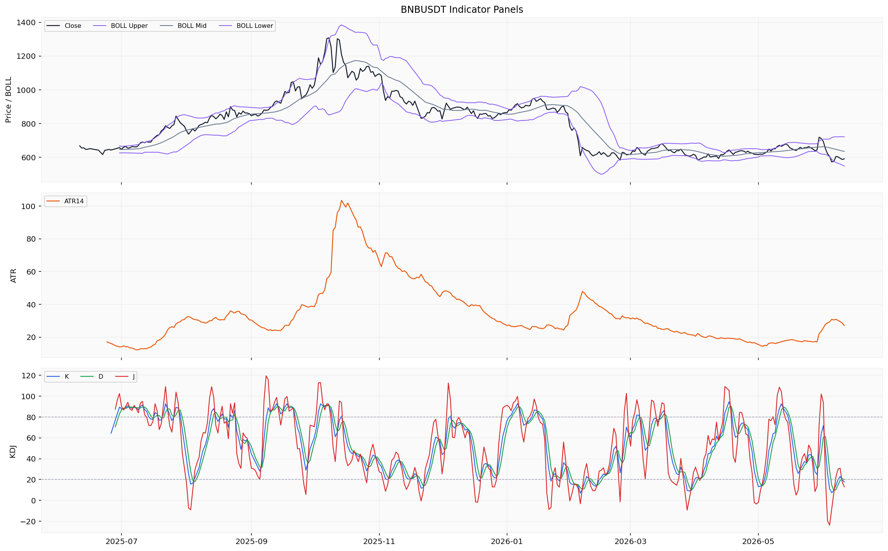
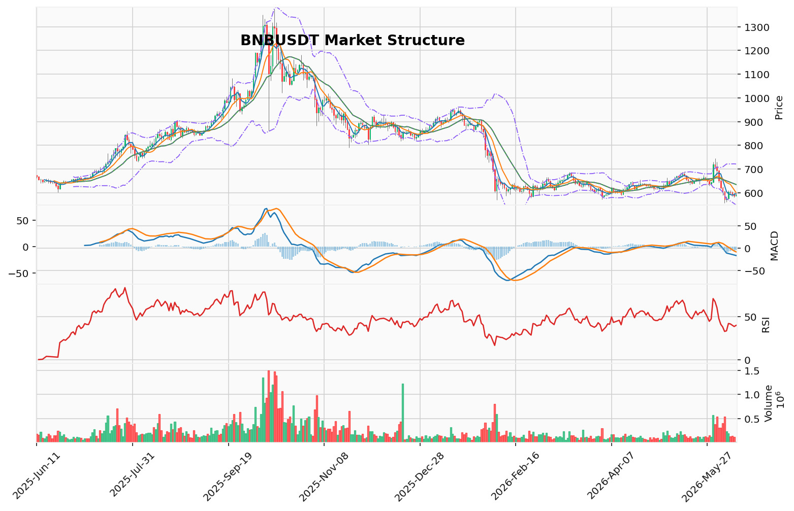

# BNB（BNB）加密资产投资研究报告

> 报告生成时间（美东）：2026-06-10 22:38:02 EDT
> 报告生成时间（北京）：2026-06-11 10:38:02 CST

## 一、投资结论与组合动作

**最终建议：持有/观望。不新增任何买入或卖出。不加杠杆。不新开任何多空仓位。**

这是一个在多重数据缺口和信号冲突环境下的风险管理决策，而非模棱两可的中间立场。当前多空论据强度不对等，看跌方向享有更高置信度的确认信号，但看涨方向存在一个需验证的衰竭信号；与此同时，关键衍生品数据的全面缺失使得任何方向的新开仓均无法量化风险，其本质是赌博而非投资。组合经理据此做出以下判断与安排：

- **当前动作**：持有/观望，冻结所有方向性交易，不加杠杆，不新开多空仓位。
- **核心理由**：看跌论据基于一组方向一致且高置信度的确认信号（均线空头排列、MACD负值、Vegas通道压制），反映了“当前结构是什么”的客观事实；看涨论据则基于一个中等置信度的衰竭信号（TD 13），其验证完全依赖于缺失的衍生品数据（资金费率、OI、多空比），当前属于“待验证的假设”。数据缺口本身不是看涨或看跌证据，但它降低了所有方向判断的置信度，使得可执行的多空场景均无法构建。最佳路径不是选择方向“赌”，而是“不赌”。
- **数据恢复后的条件化重评（优先级排序）**：待恢复的关键数据——(1)资金费率（当前读数与历史分位）；(2)未平仓合约OI（当前读数与历史分位）；(3)多空比（大户vs散户）；(4)链上交易所余额；(5)链上活跃地址/交易笔数。恢复后需重新评估方向可能性，当前不预设任何方向性动作。
- **仓位与工具选择**：上游未提供用户真实持仓参数，无法给出任何具体减仓、清仓或部分止盈止损建议。未提供真实持仓与保证金参数，无法审计合约风险。在数据恢复前严禁使用合约杠杆。
- **持续跟踪条件**：(1)核心数据恢复——资金费率、OI、多空比、链上余额；(2)关键价格水平——上方阻力610（近期高点）、600（FVG中线）、632（POC），下方支撑556（近期低点/卖侧流动性）、548（布林带下轨）；(3)市场情绪——关注BNB特定社区社交情绪以补充全市场恐惧指数的局限性；(4)外部事件——监控与币安、BNB Chain或加密货币监管相关的新闻事件。

## 二、市场结构与技术指标分析

### 技术图表

本节整合市场分析报告中的价格趋势、技术参考位、成交量、波动率、资金费率、未平仓合约（OI）、多空比、清算地图、主动买卖量差（CVD）、链上与宏观变量。分析基于日线行情（366行，覆盖完整分析区间）与小时行情（1000行，部分覆盖）生成的技术指标，衍生品维度存在显著缺口。

---

### 2.1 当前价格结构

BNB 当前价格 590.55 USDT（截至 2026-06-11 快照），24h 涨跌幅 +0.296%，24h 成交量 114,241.382 BNB（约 67,222,221.31 USDT）。

| 指标 | 读数 | 结构含义 |
|------|------|---------|
| 收盘价 vs MA5 | 590.7 < 595.39 | 处于短期均线下方，短期动能偏弱 |
| 收盘价 vs MA10 | 590.7 < 599.96 | 处于中期均线下方，中期走势偏空 |
| 收盘价 vs MA20 | 590.7 < 634.23 | 处于长期均线下方，长期结构偏空 |
| 均线系统 | MA5 < MA10 < MA20 | 经典空头排列，趋势方向向下 |
| MACD | 柱状值 -6.695，DIF 在信号线下方 | 空头动能尚未衰竭，动量偏空 |
| 维加斯通道 | 价格在蓝带（EMA144/169）下方约 -13.55% | 长期空头压制结构，偏离度大 |
| AMD/SMC | 高点下移、低点下移，下跌推进阶段 | 标准下跌结构，卖侧流动性 556.46，买侧流动性 610.54 |
| RSI14 | 39.82 | 中性偏弱，未进入超卖区域（<30） |
| K/D（KD 指标） | K 25.39，D 23.00 | 摆动偏低，D 值接近超卖阈值（20）但尚未跌破 |

**结构解读**：上述指标方向一致，构成一组高置信度的空头确认信号。当前趋势结构为均线空头排列、动量向下、价格处于长期压制通道之中。RSI 和 KD 位于中性偏低位但未达极端超卖，表明空头仍有施压空间。

---

### 2.2 技术参考位

以下价位为技术分析返回的结构参考位，**不可作为可执行交易触发条件**。资料来源：市场报告的均线、布林带、维加斯通道、AMD/SMC、FVG、成交量分布（POC）模块。

| 位置类型 | 价格（USDT） | 来源 |
|---------|-------------|------|
| 卖侧流动性代理 / 123 突破位 | 556.46 | AMD/SMC 输出 |
| 布林带下轨 | 547.69 | 布林带统计通道下限 |
| 近期高点（买侧流动性） | 610.54 | AMD/SMC 输出 |
| FVG 最近上方缺口中线 | 599.95 | FVG 分析（18 个候选，3 个未回补） |
| POC（成交量控制点） | 632.03 | 成交量分布（160 样本 OHLCV 近似分桶） |
| MA5 | 595.39 | 均线系统 |
| MA10 | 599.96 | 均线系统 |
| MA20 | 634.23 | 均线系统 |
| 维加斯 EMA144 | 677.21 | 维加斯通道蓝带底部 |

**样本限制**：POC 基于 160 个样本的 OHLCV 近似分桶，非逐笔成交分布，精度有限。FVG 未与已知支撑/压力交互确认，不能假设价格必然回补。

---

### 2.3 清算簇 / 衍生品 / CVD 读数

| 指标 | 数据 | 推导 | 交易作用 | 失效条件 |
|------|------|------|---------|---------|
| 清算地图 | 不适用 | BNB 不适用清算地图（按 BTC 专用口径），不作为本标的市场结构或交易结论依据 | 无法使用该模块进行评估 | — |
| CVD / 主动买卖量 | CVD 累计值 19,859,921.44 USD（2026-06-11） | 主动买卖量差反映净差异方向，但单日读数受限于时间口径和计算方法 | 作为主动买卖倾向的参考，不做方向性结论 | CVD 的持续性和趋势比单日读数更重要，需更多样本判断方向 |
| 资金费率 | 缺失/不可用 | 来源限流（rate limited），仓库无可用记录 | 无法判断永续合约资金费率方向和数值是否正常 | 需对应数据源费率恢复 |
| OI / 多空比 | 缺失/不可用 | 来源限流 + 参数缺失（coinglass api 400） | 无法判断未平仓量及多空持仓结构 | 需对应数据源的 OI 数据恢复 |

---

### 2.4 动量指标 / 波动指标

| 指标 | 数据 | 推导 | 交易作用 | 失效条件 |
|------|------|------|---------|---------|
| TD 9/13 | 方向：看涨反转；启动计数 1，倒数计数 13，信号完成；置信度：中等 | TD 13 看涨反转计数在日线完成，属于潜在趋势衰竭信号，但处于下跌趋势中，有效性需后续价格行为确认 | 作为潜在趋势衰竭的技术参考，不可作为确定性反转信号 | 需后续 K 线收盘价高于前一根或突破关键阻力来确认反转有效性 |
| 布林带 | Upper 720.76，Mid 634.23，Lower 547.69 | 价格 590.7 位于中轨至下轨之间，接近下半区运行 | 价格在通道中的相对位置参考 | 布林带为统计通道，通道边界不是固定支撑/压力 |
| 123 突破 | 状态：下破待确认；方向：看跌；突破位 556.46 | 若价格持续下行并确认跌破 556.46，将完成三点结构的看跌下破确认 | 作为结构破位参考位，非交易触发条件 | 需等待有效收盘价低于 556.46 且伴随成交量/动量验证 |
| 谐波形态 | 未匹配到有效候选（AB/XA 2.62，BC/AB 1.61，CD/BC 0.29） | 当前摆动比例未形成标准谐波模式 | 目前无有效谐波信号可用于分析 | 需等待产生新的摆动结构后再评估 |
| OB 订单块 | 近期没有确认的结构突破 | 未形成有效订单块突破信号，当前结构处于下跌推进阶段，尚未确认订单块作为支撑或压力参考 | 仅作结构参考，不能作为具体入场或退出依据 | 需逐笔订单流或更高时间框架的订单块确认资料恢复 |

---

### 2.5 链上 / 宏观 / 事件 / AHR999

| 指标 | 数据 | 推导 | 交易作用 | 失效条件 |
|------|------|------|---------|---------|
| 链上：交易所净流量 | 376,666 USD（MULTI_CHAIN，2026-06-11） | 当日交易所净流入约 37.7 万美元，单日单指标读数，缺乏历史对照和持续趋势 | 链上信号碎片化，单一净流量数据不能推导资金主体意图 | 需更多链上指标（交易所余额、净流入历史序列、大额转账计数等）恢复 |
| 宏观 | 宏观/新闻由新闻资料包负责，行情资料包未重复判断 | 本资料包不覆盖宏观经济和新闻事件分析 | 需要参考独立的新闻/宏观资料包补充判断 | 需宏观资料包数据恢复 |
| AHR999 | 缺失/不可用 | BTC 专用估值指数，未取得数据 | 不适用于 BNB 分析场景 | — |
| 事件 | 事件日历缺失/不可用 | 无法判断相关事件类型是否构成驱动 | 不能作为当前交易依据 | 需事件数据提供方恢复 |

---

### 2.6 资料限制与待确认条件

**数据缺口（核心）**：
- 资金费率：来源限流，无法评估永续合约市场情绪是否过热或极端。
- OI / 多空比：来源限流 + 参数缺失，无法判断持仓拥挤度和多空持仓结构。
- 链上数据：仅返回一条交易所净流量记录，缺失交易所余额、大额转账计数、活跃地址等关键指标。
- 事件日历与宏观：缺失，无法评估外部事件风险。

**样本限制**：
- 小时行情仅覆盖 2026-04-30 至 2026-06-11，未覆盖完整分析区间（2025-06-11 起），日内波动分析基于最近一个半月的样本。
- 成交量分布 POC 基于 160 个样本的 OHLCV 近似分桶，精度有限。

**待确认条件**：
- 技术指标方向一致指向空头结构，但衍生品拥挤度数据缺失，无法确认空头是否已极端（拥挤）或仍有下沉空间。
- TD 13 看涨反转信号是唯一的看涨技术信号，但缺少衍生品和链上数据配套验证，不能作为方向性交易依据。
- 偏多场景与偏空场景均因数据缺口无法构建可执行条件。

**数据冲突**：无明显冲突。日线行情、小时行情、实时快照价格水平一致，技术指标各模块输出方向一致（空头），未出现指标间矛盾。

## 三、项目与代币基本面分析

### 3.1 数据可得性与限制

基本面资料包的覆盖状态为“部分可用”，仅返回了 **2026-06-11** 单日的市场快照数据，完整分析区间（2025-06-11 至 2026-06-11）内的大部分关键基本面维度均存在缺口。具体而言：

| 基本面维度 | 状态 | 对分析的影响 |
|------------|------|--------------|
| 市场快照（价格、市值、成交量） | 可用（单日读数） | 仅提供截面参考，不足以支撑趋势判断 |
| 币种元数据（供应、流通、发行） | 缺失 | 无法判断总供应量、流通量、最大供应量、解锁与释放节奏 |
| 链上使用数据（活跃地址、交易笔数、费用消耗） | 缺失 | 无法评估网络采用率与经济活动水平 |
| 供给与发行数据（销毁机制、通胀/通缩节奏） | 缺失 | 无法判断代币经济模型执行情况或未来稀释压力 |
| 估值数据（协议收入、费用、TVL） | 缺失 | 无法计算 FDV/TVL 等加密资产常用估值比率 |
| 机构资金数据（ETF、信托、机构持仓） | 缺失 | 无法评估机构参与度或资金流向 |

### 3.2 已返回数据摘要

基本面资料包返回的唯一快照数据如下：

| 指标 | 数值 |
|------|------|
| 价格 | 590.08 USD |
| 市值 | 79,534,037,443 USD |
| 成交量（当日） | 636,710,353 USD |
| 计价单位 | USD |

**投资含义**：该组数据仅为一个时间点的市价快照，既无历史序列对比，也无可用于推断趋势的参照系。单点市值与成交量读数不能推导任何方向性基本面结论。在缺乏链上使用、协议收入、代币流通状态等核心数据的情况下，无法判断该市值水平相对于网络活动是否合理、是否存在溢价或折价。

### 3.3 数据缺口对方向判断的影响

由于基本面数据全面缺失，当前无法形成任何方向性基本面结论。具体而言：

1. **需求真实性无法验证**：缺少用户活跃度指标（日活跃地址、交易笔数、Gas 消耗等），无法判断 BNB 作为 BNB Chain 原生资产的网络效用是否正在增长、稳定或萎缩。

2. **代币经济状态未知**：无供应量、流通量、销毁执行数据。BNB 的价值叙事部分依赖于季度销毁机制的通缩效应——这一效应在本分析周期内是否继续执行、执行力度如何，均无法判断。

3. **生态经营数据不可用**：无 TVL、协议收入、费用捕获、生态项目数量、跨链桥活动等指标，无法评估 BNB 在竞争格局（如与 Ethereum、Solana、Layer 2 生态）中的相对位置。

### 3.4 当前可做出的基本面判断（限制性陈述）

在数据可得性有限的条件下，可做出的基本面判断仅限于以下几项客观事实与负面边界：

- **市值与成交量匹配度**：当日成交量约 6.37 亿美元，占市值（约 795 亿美元）的比例约 0.8%。该比例本身不能直接判断流动性是否充足，但在对比历史均值或同类资产前，不具备可审计的估值含义。

- **市场快照未被负面数据推翻**：单日数据未显示价格异常偏离、无成交量塌缩等即时风险信号。然而，单日“无异常”不能等同于“基本面健康”，尤其是考虑到链上与协议数据完全缺失。

- **基本面黑暗期支撑看跌逻辑，但不构成确定证据**：交易员报告中指出，“在加密资产中，BNB 的价值高度依赖币安生态可验证指标。当这些数据全部不可用时，市场无法对基本面进行正向定价。” 这一逻辑链条被研究经理采纳为看跌论点的一部分——即空头不需要证明基本面恶化，只需证明当前没有可验证的多头逻辑支撑。但需强调的是，**基本面数据缺失本身不是看跌事实，仅说明该维度不能作为任何方向性判断的依据。**

### 3.5 待恢复数据与重评条件

在以下五类数据恢复完整后，基本面维度方可纳入可执行判断：

1. **币种基础元数据**：总供应量、流通量、最大供应量、解锁时间表、发行机制（是否已触顶或存在未来增发）
2. **链上使用数据**：日活跃地址、交易笔数、Gas 消耗、手续费收入、桥接活动
3. **供给与发行数据**：季度销毁执行记录、买入/销毁量、流通量变化、质押参与率
4. **机构资金数据**：是否纳入 ETF/信托、机构持仓变化、交易所余额历史序列
5. **估值数据**：协议收入、TVL、费用捕获、FDV/市值、收入倍数等加密资产估值指标

**跟踪条件**：
- 若上述数据恢复后，显示链上活动持续下降、销毁暂停或缩减、机构资金净流出，则基本面维度将强化当前偏空的技术结构判断。
- 若数据恢复后，显示链上活动活跃、销毁正常执行、TVL 企稳或增长，则基本面维度将为多头逻辑提供部分支撑，但其权重仍需结合衍生品与链上数据综合评估。

### 3.6 对组合动作的约束

由于基本面数据不足以支撑任何方向性结论，该维度当前不能作为买入、卖出或持有决策的主要或次要依据。组合经理“持有/观望”的动作在此维度下得到支持——既不是基本面利好驱动的买入，也不是基本面恶化驱动的卖出，而是在信息空白状态下保持仓位中性、等待可验证数据恢复。

## 四、新闻、监管与事件驱动

### 4.1 资料包状态与来源覆盖

本期新闻事件资料包返回状态为**部分可用，但无已验证来源**。资料包共返回81条搜索与媒体聚合线索（项目新闻11条、宏观新闻70条），时间覆盖区间为2025-07-16至2026-06-10，未完整覆盖分析区间起始端（2025-06-11至2025-07-15部分），宏观新闻起点为2025-12-03，分析区间前约半年无宏观线索返回。

所有返回条目来源标注为“媒体聚合搜索线索”或“公开搜索线索”，未返回任何官方公告原文、监管文件原文、交易所公告原文或已读取全文的可靠媒体报道。资料包审计记录显示存在23条来源尝试记录，但未形成可引用的已验证数据集。

### 4.2 已验证新闻事件

**无已验证来源。** 本分析区间内无法确认任何一条具体的BNB相关官方公告、监管事件、交易所动作、安全事件、治理提案、代币解锁、链上事件或合作新闻。

### 4.3 待核验线索概述

资料包中项目新闻线索（11条）覆盖的时间点（2025-07-16、2026-02-11、2026-03-06、2026-06-01、2026-06-02、2026-06-10等）在主题上涉及BNB生态、项目进展、市场动态等方向；宏观新闻线索（70条）覆盖2025-12至2026-06期间，涉及监管、机构资金、宏观政策等方向。以上线索均未附可交叉验证的原始来源，不能确定具体事件内容、发生状态或对BNB的实际影响。

**所有线索内容不能作为事实写入报告正文。** 若后续资料包加载了已验证的官方、交易所或监管原始来源，方可对具体事件进行方向判断。

### 4.4 来源可靠性评价

| 来源类型 | 资料包返回情况 | 可靠性评价 |
|---------|--------------|-----------|
| 官方公告（BNB Chain / 币安官方） | 未返回 | 最高可靠性，本周期完全缺失 |
| 监管文件（SEC、CFTC、欧盟MiCA等） | 未返回 | 高可靠性，本周期完全缺失 |
| 交易所公告（币安上市/下架/规则变更） | 未返回 | 高可靠性，本周期完全缺失 |
| 可靠媒体正文（已读取原文） | 未返回 | 中高可靠性，本周期完全缺失 |
| 链上数据原始记录 | 未返回 | 高可靠性，本周期完全缺失 |
| 搜索/媒体聚合线索 | 已返回（共81条线索） | **低可靠性，不能作为事实源** |

### 4.5 对价格与市场情绪的影响判断

由于无任何已验证新闻事件，本维度无法作出方向性判断。

- **利好/利空/中性：无法判断**
- **影响周期：无法判断**
- **证据强度：低（无已验证事件）**

### 4.6 对项目基本面与投资逻辑的潜在影响

缺少已验证新闻来源，无法对以下维度进行有证据支持的分析：

- **需求侧变化**：如BNB作为Gas费的链上活动变化
- **供给侧变化**：如BNB销毁机制的调整或执行
- **监管风险变化**：如针对币安或BNB的监管裁决
- **安全假设**：如跨链桥或智能合约安全事件
- **生态扩张**：如新项目入驻BNB Chain或子网进展
- **流动性或叙事驱动**

**所有对应事件类型在本分析周期内缺少已验证来源，无法形成基本面判断。**

### 4.7 对当前组合动作的影响

新闻与事件维度对当前“持有/观望”的组合动作**既不支持也不约束**。由于缺乏任何已验证的新闻事件，该维度不能为看涨或看跌方向提供增量证据，也不会触发当前持有/观望状态的改变。

### 4.8 数据限制与跟踪条件

**数据限制：**
1. 新闻资料包未覆盖完整分析区间（2025-06-11至2025-07-15部分缺失，宏观起点2025-12-03）
2. 所有返回内容为搜索与媒体聚合线索，无可引用的事实源
3. 其中涉及的监管、机构资金、宏观或行业主题线索，不能作为事实源写入报告
4. 跨语言覆盖范围未明确，非中文/非英文语种的官方公告可能未纳入

**跟踪条件：**
- 若后续资料包恢复已验证的官方、交易所或监管来源，需要重新评估其对BNB需求、供给、监管风险、安全假设或市场预期的影响
- 若方向性事件被验证（如币安合规进展、BNB Chain技术升级、监管裁决、代币经济模型调整），需评估其对当前持有/观望动作是支持、约束还是触发重评
- **重大负面新闻（如交易所监管行动、安全事件）可能是快速触发重评的外部风险，但当前无可验证来源支持具体情景**

**缺口不代表无事件：** 缺少已验证新闻来源不能被解释为“没有负面消息”或“存在潜在利好”。仅在新闻维度上当前无法作出判断。

## 五、社区情绪、事件预期与交易拥挤度

### 5.1 市场级情绪读数

截至 2026-06-11，Alternative.me 恐惧与贪婪指数读数为 **12**，处于「极度恐惧（Extreme Fear）」区间。该指数覆盖的是整个加密货币市场的宏观情绪，并非 BNB 单个资产的特有情绪。其极端低位表明市场整体处于恐慌或避险状态，但上游报告明确限制该指标不能直接等同于 BNB 持有者或中文社区的特定情绪状态，且无历史回测证明该读数对 BNB 是可靠买入信号。

### 5.2 舆情资料就绪度

本期舆情资料包返回状态为 **部分可用**：

- **已获取指标**：Alternative.me 恐惧与贪婪指数（单日读数，2026-06-11）
- **缺失数据**：LunarCrush 接口因凭证缺失，未返回任一社交平台的帖子数量、互动量、社交主导度等聚合指标，也未返回任何真实帖子样本
- **来源尝试记录**：资料包共记录 4 次来源尝试，形成 2 个标准化数据引用、2 个原始/元数据引用，但社交平台层面的数据仓库显示无可用记录
- **BSC/BNB Chain 社区样本**：缺少任一社交平台（X/Twitter、Telegram、Discord、Reddit、中文社区、交易所社群等）的真实讨论样本，亦无 KOL 观点、链上行为、大户资金动向或项目方表态的可引用数据

### 5.3 社区讨论热度与情绪方向

**无法判断**。由于缺乏任何真实社交平台样本，BNB 社区当前的讨论热度（帖子量变化、互动量、社交主导度）以及情绪方向（乐观、悲观、分歧、FOMO、恐慌等），均不具备可引用的数据支撑。市场级「极度恐惧」读数反映的是全市场情绪背景，不能直接等同于 BNB 持有者或中文社区的特定情绪状态。

### 5.4 主要叙事与传播路径

**相关市场叙事缺少真实平台样本支持**。市场上可能存在的关于 BNB 的叙事（如生态发展、供给变化、跨链活动、DeFi/CeFi 关联等），均无法通过已返回的舆情资料包获得验证。没有真实帖子样本，就无法确认当前哪些叙事在传播、通过哪些渠道、参与者的讨论焦点是什么。

### 5.5 参与者结构

**无法覆盖**。缺少来自各语言社区（英文、中文、韩文等）及不同平台（X、Telegram、Discord、Reddit、社群媒体）的真实样本，无法区分 BNB 讨论的参与者类型（散户、大户、KOL、机构）及平台分布。

### 5.6 情绪对短期市场反应的潜在影响

**短期情绪影响无法判断**。虽然全市场恐惧与贪婪指数处于极度恐惧区间，但这一方向性判断缺乏 BNB 特定社交样本的验证，也缺少统计或回测证据。在没有真实社交样本和情绪指标的时间序列数据前，任何短期的情绪-价格传导推演均缺乏依据。

### 5.7 情绪失真风险

**失真风险无法量化**。缺少真实平台样本意味着无法识别是否存在刷量、机器人讨论、空投噪音、情绪操纵或集团式发言等失真来源。市场级恐惧指数的失真风险（如样本偏差、主流交易所用户偏向等）也无法在此框架下评估。

### 5.8 数据限制与投资含义

1. **社交平台样本全面缺失**：LunarCrush 接口凭证未能就绪，导致 X/Twitter、Telegram、Reddit、Discord、YouTube 等主要社交平台均无可用数据。任何关于 BNB 讨论热度、情绪倾向、叙事聚焦点的结论均无法形成。

2. **中文社区样本缺失**：无法获得中文投资社区、币安社群、微信群、中文 KOL 等渠道的情绪素材。

3. **市场级指标单一**：仅有一个全市场恐惧指数读数，且为单日截面，无趋势变化数据。

4. **事件预期/链上数据/大户行为**：均无对应来源返回，无法纳入分析。

5. **投资含义**：当前情绪维度无法为组合经理的「持有/观望」动作提供强化或削弱信号。全市场极度恐惧构成宏观情绪背景，但由于缺乏 BNB 特定社交验证，该情绪数据不能作为判断买点或卖点的依据。衍生品拥挤度（资金费率、OI、多空比）的缺失进一步限制了通过情绪-持仓结构交叉验证来评估交易拥挤度的能力。该维度的重新评估需要等待社交平台数据源恢复，并获取至少一周以上的讨论样本序列。

### 5.9 待观察数据类别

- 资金费率（判断空头拥挤度，最为关键）
- OI 与多空比（判断持仓结构与大户/散户分歧）
- BNB 特定社交平台讨论热度与情绪方向（需真实样本恢复）
- 事件预期资料恢复（判断是否有潜在催化剂改变当前市场叙事）

## 六、交易计划与组合风险

**当前组合动作：持有/观望。不新增任何买入或卖出。不加杠杆。不新开任何多空仓位。**

### 6.1 执行依据与限制

本执行计划的核心依据是组合经理报告的最终决策。该决策基于以下证据链：

1. **多空论据强度不对等，但均不构成可执行的单一方向依据**
   - 看跌论据（优势方）：基于一组方向一致的、高置信度的确认信号——均线空头排列、MACD 负值、Vegas 通道压制、AMD 下跌推进阶段。这些是“当前结构是什么”的客观事实，证据强度高。
   - 看涨论据（劣势方）：基于一个中等置信度的衰竭信号（TD 13 看涨反转计数完成），其验证完全依赖于缺失的衍生品数据（资金费率、OI、多空比）。该信号是“当前结构可能变成什么”的假设，尚未验证。

2. **数据缺口是最大的决策限制，而非看涨或看跌的证据**
   - 保守派将数据缺口视为“风险黑洞”，激进派将其视为“机会窗口”，但两者均未获上游材料支持。数据缺口只能说明某条论据尚未验证，不能外推为方向性结论。
   - 数据缺口降低了所有方向判断的置信度，使得可执行的做多和做空场景均无法构建。

3. **验证的共识：方向性交易风险极高**
   - 所有分析方向（看涨、看跌、中性）均同意：资金费率、OI、多空比的缺失是核心风险，导致任何方向性交易的胜率和盈亏比都无法量化。

### 6.2 执行约束与资料缺口

**数据缺口清单及影响范围：**

| 缺失数据类别 | 对执行的影响 |
|------------|-------------|
| 资金费率（来源限流） | 无法判断永续合约情绪是否极端（空头拥挤或多头拥挤），是看涨论证的关键验证数据 |
| 未平仓量（OI）/ 多空比（来源限流 & 参数缺失） | 无法判断持仓拥挤度和多空持仓结构，影响轧空风险评估 |
| 链上交易所余额历史序列 | 无法判断大额筹码流向和累积/分发状态 |
| 链上活跃地址/交易笔数 | 无法判断网络基本面的使用趋势 |
| 供给与发行数据（粒度不匹配 & 来源限流） | 无法判断未来稀释或发行节奏，不能判断代币经济状态 |
| 基本面数据（协议收入、TVL、FDV等，凭证缺失） | 无法建立基本面估值框架，无法判断需求真实性 |
| 已验证新闻事件（仅搜索/媒体聚合线索） | 无法评估监管、生态、安全等外部事件风险 |
| 真实社交平台样本（凭证缺失） | 无法确认 BNB 特定社区情绪和叙事焦点 |

**待恢复数据优先级（按影响程度排序）：**
1. 资金费率（当前读数和历史分位）
2. 未平仓量（OI）和多空比
3. 链上交易所余额历史序列
4. 链上活跃地址和交易笔数
5. 供给与发行数据（总供应、流通、解锁时间表）
6. 已验证新闻事件与基本面数据

### 6.3 风险辩论与分歧处理

**辩论焦点：如何解读数据缺口与信号冲突**

| 立场 | 核心论点 | 组合经理采纳/反驳理由 |
|------|---------|-------------------|
| 看涨方 | TD 13 看涨反转计数完成+全市场极度恐惧(12)+价格处于低价值区域，构成潜在反转结构；数据缺口可能掩盖轧空机会 | 该方向性解释未由资料包验证。TD 13 为中等置信度衰竭信号，缺乏回测支持；极度恐惧为全市场指标，无 BNB 特定样本验证；该论点依赖缺失的衍生品数据证明“空头拥挤”，逻辑链条不完整，不能作为方向性依据 |
| 看跌方 | 确认的空头结构（均线、MACD、Vegas、AMD）证据强度高于衰竭信号；基本面数据黑暗期默认偏空；数据缺口对看跌论证影响小 | 确认信号的交易价值高于衰竭信号，被采纳为当前高置信度的结构事实。但“默认偏空”逻辑把数据缺口外推为方向性结论，未由资料包验证。该逻辑削弱了对潜在轧空风险和非对称回报机会的考量，组合经理不同意其“卖出/规避”的最终动作 |
| 中性方 | 承认确认信号是结构事实，也承认衰竭信号是潜在分水岭；数据缺口降低所有方向判断置信度；等待数据恢复是唯一客观路径 | 该处理方式被采纳为组合动作的核心逻辑。“持有/观望”是组合经理的最终动作，既不是看涨也不是看跌，而是在不确定性下的风险管理选择 |

**未采纳观点及其问题分类：**
- **“方向性解释未由资料包验证”类**：看涨方将 TD 13 和极度恐惧外推为反转必然性；看跌方将数据缺口外推为看跌必然性。两者均把不完整的证据链当成了方向性结论。
- **“把单点读数外推为方向性交易”类**：激进风险分析师将“价格处于布林带下轨和 FVG 下方”解释为“价格低估”；保守风险分析师将资金费率、OI 的缺失解释为“风险必然兑现”。
- **“缺少可验证执行条件”类**：看涨方设定的“有效站上 MA5”和看跌方设定的“收盘跌破 556.46”作为触发/失效条件，均未由资料包明示为可执行交易条件，不能作为当前执行依据。

**跟踪条件（等待对应数据恢复后重新评估，当前不预设方向动作）：**
1. 若资金费率深度为负、OI 高企，且价格反弹有效站上近期高点（610.54），看涨假设得到初步验证
2. 若资金费率正常或为正、OI 下降，且价格跌破近期低点（556.46），空头结构继续延伸的假设得到验证
3. 若信号依然混杂，继续维持持有/观望，直至出现清晰的单边信号

### 6.4 风险等级与来源

**风险等级：高**

| 风险类别 | 具体描述 | 当前可验证状态 |
|---------|---------|--------------|
| 价格结构风险 | 当前处于空头结构，MA5(595.39) < MA10(599.96) < MA20(634.23)，技术指标一致指向偏空环境 | 已确认，证据强度高 |
| 数据缺口风险 | 资金费率、OI、多空比、链上余额等6+维度缺失，无法量化拥挤度、清算和方向性风险 | 已确认，覆盖范围不足 |
| 方向不确定性风险 | TD 13 衰竭信号与确认的空头结构冲突，方向判断置信度低 | 已确认，但两者证据强度不均等 |
| 流动性风险 | 缺少订单簿深度数据，无法评估滑点和执行成本 | 未返回，无法判断 |
| 事件风险 | 缺少已验证新闻事件，不能排除突发政策、监管、安全事件 | 仅返回搜索线索，无法评估 |

**关键风险识别：**
- 看跌技术结构虽然方向一致，但缺少衍生品拥挤度数据，无法判断空头是否已极度拥挤（可能引发轧空）或仍有持续空间
- 偏多逻辑的全部验证条件（资金费率和 OI 数据）均缺失，无法对看涨假设进行实际测试
- 现有技术参考位（支撑/压力位）均为结构分析输出，未经订单簿、清算执行机制或历史回测验证，不能作为交易触发条件

### 6.5 仓位与工具限制

**现货方案：**
- 不新开多头仓位
- 不新开空头仓位

**合约风险说明：**
- 未提供真实持仓与保证金参数，无法审计合约风险
- 未提供：交易所、合约类型、保证金模式、维持保证金率
- 无法计算清算价、合约杠杆风险、资金费率风险
- 无法给出任何合约管理建议（包括降低杠杆、补保证金、调整保证金等）
- 在数据恢复前，严禁使用合约杠杆

**当前建议动作：**
持有/观望。若已有风险暴露，建议根据个人风险承受能力自行评估。组合经理无法替用户决定减仓或清仓，因为上游未提供用户真实持仓参数。核心原则是：**在当前数据缺口条件下，不制造新的方向性风险暴露。**

## 七、关键分歧与跟踪条件

### 7.1 多空分歧与采纳理由

| 分歧点 | 看涨观点 | 看跌观点 | 组合经理采纳方向与理由 |
|--------|---------|---------|----------------------|
| **技术信号权重** | TD 13 看涨反转计数完成是趋势衰竭信号，价格可能反弹至 600-610（FVG 回补+买侧流动性测试） | 均线空头排列、MACD 负值、Vegas 压制（-13.55%）、AMD 下跌推进阶段——确认信号方向一致且强度高于衰竭信号 | 采纳看跌观点。确认信号的证据强度高于衰竭信号；“当前结构是什么”比“当前结构可能变成什么”更具操作价值 |
| **数据缺口对方向判断的影响** | 缺失数据（资金费率、OI、多空比）是看涨逻辑的关键验证条件，缺口降低多空判断置信度，但不能排除看涨可能性 | 缺失数据对看跌逻辑影响较小，因为技术结构可独立于衍生品数据判断方向；看涨逻辑严重依赖缺失数据，逻辑链无法闭合 | 采纳看跌观点。看涨论证的逻辑链条依赖衍生品数据验证“空头是否拥挤”，数据缺失导致链条断裂；看跌论证基于已确认的技术结构，不依赖衍生品数据 |
| **基本面黑暗期的方向归属** | 基本面双方都缺乏证据，是“未开局的战场” | BNB 价值高度依赖可验证的生态指标（销毁、链上活动、协议收入）；数据完全黑暗期，市场倾向于定价最差情景，空头默认获胜 | 采纳看跌观点。没有可验证的多头逻辑支撑时，空头逻辑更完整；看跌不需要证明基本面恶化，只需要指出缺乏可验证的多头利好 |
| **极度恐惧情绪的含义** | F&G 12 意味着卖压接近释放完毕，极端恐惧可能伴随短期超卖反弹 | 极度恐惧往往是下跌中继而非反转信号；缺乏 BNB 特定社交样本验证，无历史回测证明其对 BNB 是可靠买入信号 | 采纳看跌观点。全市场情绪指标不能等同于 BNB 持有者行为；缺乏回测支持其作为买入信号的有效性 |
| **风险回报比评估** | 在 590 附近做多的理论亏损空间小于做空的潜在收益；追空空头收益有限（至 548-556）而风险敞口较大（反弹至 600-610） | 做空的风险回报比计算假设价格会先反弹，但技术结构不支持；未考虑价格跌破 556 后的加速下跌风险；未计入仓位控制和杠杆的影响 | 采纳看跌观点。风险回报比分析建立在“反弹先于下跌”的假设上，而该假设缺乏技术结构支持；做多面临方向性风险而缺乏确认信号 |
| **机会成本评估** | 真正的高盈亏比机会诞生在数据最不透明、市场最恐惧时；等待数据恢复会错过最优盈亏比区间 | 机会成本只在有确定性时存在；当前只有风险没有确定性；等待不是损失机会，而是管理风险 | 采纳看跌观点。在关键验证数据缺失时，机会成本无法量化；避免方向性错误比追逐未验证的潜在收益更重要 |

### 7.2 未采纳的观点与原因

1. **“黑暗期默认偏空”作为可执行做空依据**：该论点将缺乏基本面多头证据等同于空头安全，但看跌方未提供可审计的做空触发条件（资金费率极端程度、OI 拥挤度、清算簇位置等）。组合经理认为“持有/观望”是比“做空”更安全的路径。

2. **“数据缺口是进攻性机会窗口”**：该论点将数据缺失包装为高盈亏比机会，但未提供回测或统计证据支持在数据不透明时押注反转的成功率。组合经理认为数据缺口只能降低所有方向判断的置信度，不能作为支持某一方向的理由。

3. **“单一技术信号（TD 13）对抗确认空头结构”**：激进的看涨方将一个中等置信度的衰竭信号升级为交易机会，但未提供可验证的衍生品数据或链上证据来支撑“空头拥挤会轧空”的核心假设。组合经理认为该假设在数据恢复前无法执行。

### 7.3 待恢复数据与重评条件

**最高优先级（数据恢复后立即评估）**：
1. **资金费率**（当前读数 & 历史分位）——判断永续合约情绪是否已极端偏空
2. **OI / 多空比**（当前读数 & 历史分位）——判断持仓拥挤度和多空结构
3. **链上交易所余额 & 净流入历史序列**——判断大额筹码流向

**次优先级（数据恢复后综合评估）**：
4. **链上活跃地址 / 交易笔数**——判断网络基本面使用情况
5. **已由官方或监管原文验证的新闻事件**——排除或确认方向性催化剂
6. **基本面包数据（供应、流通、协议收入、TVL）**——判断估值与代币经济状态

**重评触发条件（非具体执行价位）**：
- **若数据恢复后显示：资金费率深度为负 + OI 高企 + 价格有效站上 610.54（近期高点/买侧流动性），则看涨假设（轧空可能）得到初步验证，可考虑条件化多头方案**
- **若数据恢复后显示：资金费率正常或为正 + OI 下降 + 价格跌破 556.46（卖侧流动性/123 突破位），则空头结构延伸假设得到验证，可考虑条件化空头方案或继续规避**
- **若数据恢复后信号混杂，则继续维持持有/观望，直至出现清晰单边信号**

**不预设方向动作**：数据恢复后的重评仅用于更新判断假设的置信度，当前不预设任何方向性买入、卖出或对冲动作。

---

## 八、最终结论

**组合经理最终动作：持有/观望。不新增任何买入或卖出，不加杠杆，不新开任何多空仓位。**

这一动作基于以下核心证据：
1. **技术结构确认空头但不可执行做空**：均线空头排列、MACD 负值、Vegas 压制（-13.55%）、AMD 下跌推进阶段——方向一致的空头确认信号，但缺少衍生品拥挤度数据（资金费率、OI、多空比），无法量化空头是否已拥挤到可能触发轧空，因此无法构建可执行做空条件。
2. **唯一的看涨技术信号（TD 13）缺乏验证数据**：日线看涨反转计数完成是潜在趋势衰竭信号，但其验证完全依赖于缺失的衍生品数据。没有这些数据，TD 13 只能作为待验证假设，不能转化为交易依据。
3. **数据缺口是当前最大决策限制**：资金费率、OI、多空比、链上交易所余额历史序列、基本面数据（供应、流通、协议收入、TVL）、已验证新闻事件——6 个以上维度的关键数据缺失，使得任何方向性判断的置信度都低于可执行阈值。

**下一步最需要跟踪的 3 类数据**：
1. **衍生品拥挤度数据（资金费率、OI、多空比）**——决定空头结构是否已接近衰竭或仍有下行空间
2. **链上筹码分布数据（交易所余额历史序列、大额转账计数/笔数口径）**——判断大户行为是累积还是派发
3. **已验证的新闻与基本面数据**——排除或确认方向性催化剂，补充对 BNB 生态运行状态的判断

当前数据的限制意味着市场正处于关键但信息不完整的决策点。组合经理的纪律要求在此环境下保持耐心，不基于不完整的证据链强行押注方向。只有在后续数据与价格行为共同验证了某一方向假设后，才能执行条件化交易。此刻，不行动就是最好的行动。
