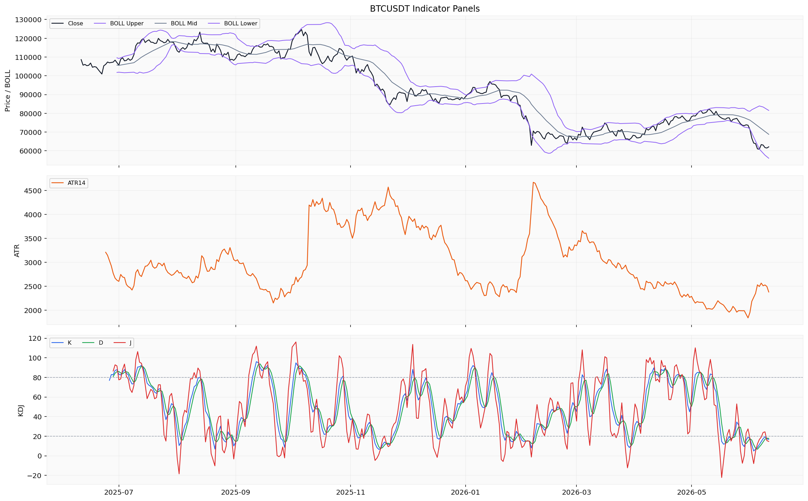
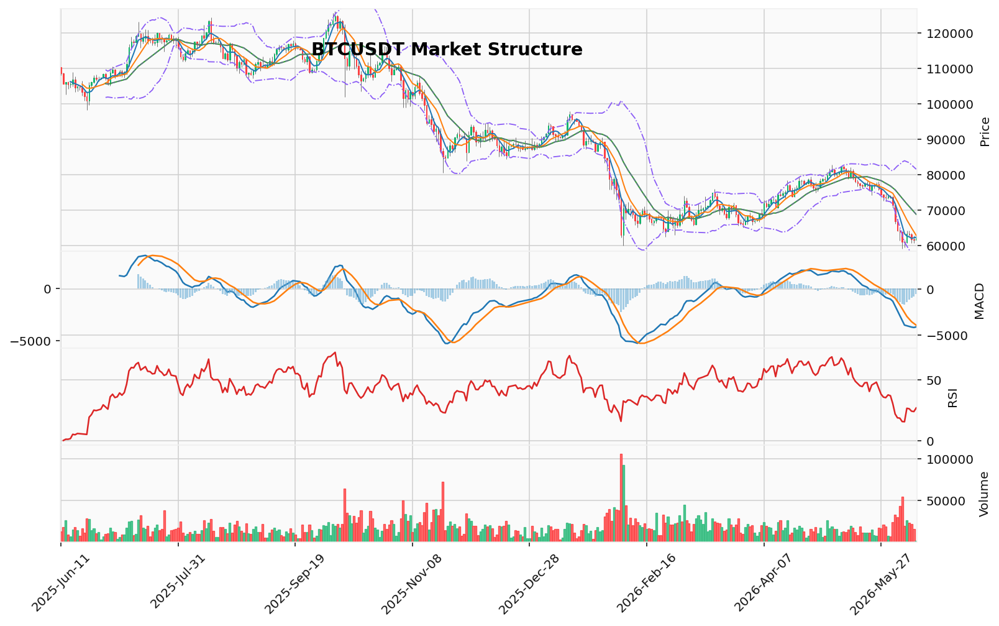

# Bitcoin（BTC）加密资产投资研究报告

> 报告生成时间（美东）：2026-06-10 22:22:00 EDT
> 报告生成时间（北京）：2026-06-11 10:22:00 CST

## 一、投资结论与组合动作

**最终建议：持有/观望。不新开仓，不加杠杆。**

当前组合动作基于以下判断：已返回的可验证证据（空头趋势结构、主动卖出压力、ETF资金流出）与数据缺口（衍生品持仓维度大面积缺失）之间形成冲突，不足以支撑任何方向性新开仓。组合经理确认，辩论核心并非“看涨 vs 看跌”，而是数据质量与完整性不足以产生可执行交易条件。

**执行条件：**
- 无入场触发。未满足任何可执行的买入或卖出条件。
- 无目标区间。具体执行价位需等待行情与技术资料恢复后确认。
- 无失效位。未提供真实持仓参数，无法设置精确止损。

**仓位约束：**
- 不新开仓，不加杠杆。
- 未提供真实持仓与保证金参数，无法审计任何合约风险或假设持仓状态。
- 当前不推荐任何新开仓，因此无新增风险敞口。

**已确认的技术参考位（非交易条件）：**
- 下方参考：59,130.91 USDT（AMD/SMC卖侧流动性代理位）
- 下方参考：56,065.15 USDT（布林带下轨）
- 上方参考：64,234.68 USDT（AMD/SMC买侧流动性代理位）
- 上方参考：65,478.66 USDT（未回补FVG缺口中线）
- 上方远参考：65,596.51 USDT（成交量分布价值区间下沿）

## 二、市场结构与技术指标分析

### 技术图表

### 当前市场状态

BTC当前处于**下跌趋势结构**。价格从2026年6月7日高点64,234.68 USDT回落，最新收盘价62,139.63 USDT位于日线所有短期均线下方（MA5: 62,359.72 / MA10: 62,852.93 / MA20: 68,804.68）。技术摘要标记为downtrend，成交量状态contracting。AMD/SMC结构为高点下移、低点下移，处于下跌推进阶段。123突破已确认看跌方向。

**资料质量说明**：市场资料包整体为“部分可用”。日线和小时OHLCV数据完整覆盖分析区间；本地技术指标全部成功计算；链上指标有限但可用。主要缺口集中在衍生品领域——资金费率、未平仓量、多空比、清算统计及清算热力图均因来源限流（Coinglass API参数错误及限流）而未返回。数据质量因衍生品缺口而降级，其余通道基本正常。

### 指标覆盖表

| 指标 | 覆盖状态 |
|------|---------|
| 布林带 | 可分析 |
| 维加斯通道 | 可分析 |
| 双线反转 | 可分析 |
| AMD/SMC | 可分析 |
| 123突破 | 可分析 |
| FVG | 可分析 |
| OB订单块 | 可分析 |
| RSI | 可分析 |
| MACD | 可分析 |
| KD | 可分析 |
| TD 9/13 | 可分析 |
| 谐波形态 | 可分析 |
| 交易密集带/成交量分布 | 可分析 |
| 清算地图（BTC专用） | 缺失/不可用 |
| CVD/主动买卖量 | 可分析（主动买卖量差代理） |
| 资金费率 | 缺失/不可用 |
| OI/多空比 | 缺失/不可用 |
| 宏观 | 未重复判断 |
| 链上 | 可分析 |
| AHR999 | 可分析 |

### 指标推导过程

#### OB订单块/成交量分布

| 指标 | 数据 | 推导 | 交易作用 | 失效条件 |
|------|------|------|---------|---------|
| OB订单块 | 近期没有确认的结构突破 | 当前订单块结构未被触发，无明显可执行区间 | 作为技术参考，不具备当前交易依据 | 需订单块结构突破确认后再评估 |
| POC | 68,021.11 USDT | 该价位为日线OHLCV近似分桶得到的成交量最高区域，远高于现价 | 可作上方技术参考区 | 需成交量分布数据更新后重新确认 |
| 价值区间 | 65,596.51 - 80,144.10 USDT（160样本） | 当前价格62,139.63已跌至价值区间下沿下方 | 价格在价值区间之外运行，反映空头动能 | 价值区间随新K线动态变化 |

#### TD Sequential/谐波形态/FVG

| 指标 | 数据 | 推导 | 交易作用 | 失效条件 |
|------|------|------|---------|---------|
| TD 9/13 | 方向：看涨反转，倒数计数13完成，置信度中等 | TD看涨反转13计数已完成，意味着在日线级别上已出现潜在衰竭结构 | 可作为局部下行衰竭的参考信号，但不能作为必然反转依据 | 需要后续价格确认（如收盘价高于前一根K线高点） |
| 谐波形态 | 未匹配到有效候选；AB/XA=1.469，BC/AB=2.404，CD/BC=0.381 | 当前摆动比例未落入经典谐波形态的有效阈值 | 不能作为当前交易依据 | 需新摆动结构形成后再筛查 |
| FVG | 候选21个，未回补5个，最近上方缺口中线65,478.66 USDT | 上方存在未回补的效率缺口，该区域可能成为价格反弹后的阻力参考 | 可作上方技术参考区 | 若新K线回补缺口则失效 |

#### AMD/SMC与123突破

| 指标 | 数据 | 推导 | 交易作用 | 失效条件 |
|------|------|------|---------|---------|
| AMD/SMC | 高点下移、低点下移，下跌推进阶段；买侧流动性64,234.68（2026-06-07），卖侧流动性59,130.91（2026-06-05） | 当前处于明确的下跌摆动推进结构 | 可作为趋势延续的技术参考 | 需要价格突破近期高点（64,234.68）或低点（59,130.91）以改变结构 |
| 123突破 | 下破已确认，方向看跌，突破位74,289.60 | 三点结构已完成向下突破，看跌趋势信号确认 | 反映当前摆动结构状态 | 需价格反弹至突破位上方才可能失效 |

#### Vegas/布林带/RSI/MACD/KD

| 指标 | 数据 | 推导 | 交易作用 | 失效条件 |
|------|------|------|---------|---------|
| 维加斯通道 | 价格在蓝带下方 -19.44%；EMA144=76,396.26，EMA169=77,868.84 | 价格大幅偏离中长期均线组，表明深度空头排列 | 不作为入场依据，作为趋势结构参考 | 需要价格回到蓝带内才能视为趋势可能变化 |
| 布林带 | 上轨81,544.20，中轨68,804.68，下轨56,065.15 | 当前价格62,139.63位于中轨与下轨之间偏下区域 | 下轨（56,065）可作为下方参考区间 | 布林带带宽随波动率变化 |
| RSI | RSI14 = 26.84 | 低于30，落入传统超卖区 | 反映近期下跌速度较快 | 超卖不代表趋势必然反转 |
| MACD | MACD -4,104.65，信号 -3,528.43，柱状 -576.22 | 指标线和信号线均在零轴下方且持续发散，空头动能延续 | 确认空头动能占据主导 | 需柱状图收缩或MACD线拐头才能视为动能减弱 |
| KD | K=16.73（超卖），D=17.78（超卖），J=14.65 | K值和D值均低于超卖阈值20 | 短期超卖信号 | 超卖不代表立即反转 |

#### 清算地图/CVD/资金费率/OI/多空比

| 指标 | 数据 | 推导 | 交易作用 | 失效条件 |
|------|------|------|---------|---------|
| 清算地图 | 缺失/不可用（BTC专用口径，但来源限流未返回） | 无清算簇价格、规模和方向数据 | 不能作为当前交易依据 | 需清算热力图数据源恢复 |
| CVD/主动买卖量 | 主动买卖量差 -6,530,582,694.71 USD（最新日线，Taker Buy - Taker Sell） | 最近一日主动卖出量远大于主动买入量，买卖比0.60 | 反映主动卖出压力 | 标准CVD序列未返回时，该数据只能作为代理参考 |
| 资金费率 | 缺失/不可用 | 来源限流，仓位成本数据未覆盖 | 不能作为当前交易依据 | 需资金费率数据源恢复 |
| OI/多空比 | 缺失/不可用 | 来源限流，持仓结构数据未覆盖 | 不能作为当前交易依据 | 需OI与多空比数据源恢复 |

#### 宏观/链上/AHR999/事件

| 指标 | 数据 | 推导 | 交易作用 | 失效条件 |
|------|------|------|---------|---------|
| 宏观 | 行情资料包未重复判断 | 宏观/新闻需回看新闻资料包 | 不能作为当前行情交易依据 | 需宏观资料包配合 |
| 链上-交易所余额 | 647,500.23 BTC（2026-06-10） | 交易所BTC储备余额单日数据，缺乏趋势对比 | 单一时间点数据，无法推导流向意图 | 需连续多日数据判断趋势 |
| 链上-大额转账 | 19,859,148.06 USD（2026-06-11，比特币链） | 大额转账单日计数/笔数口径数据 | 体现链上大额活动，不能直接推导资金流向 | 需结合更多链上字段 |
| 链上-交易所净流量 | +10,426,857.00 USD（2026-06-11） | 当日交易所净流入为正 | 参考值，不推导意图 | 受单日数据限制 |
| AHR999 | 0.3036（无量纲/指数读数，2026-06-11） | 该指数读数处于历史较低水平 | 结合链上数据作为BTC估值参考 | 该指数不直接对应价格反转信号 |
| 事件日历 | 缺失/不可用 | 事件日历未返回，无法判断相关事件类型是否构成驱动 | 不能作为当前交易依据 | 需事件数据提供方恢复 |

### 指标小结

技术指标高度一致指向空头结构——价格在所有短期均线之下，RSI和KD处于超卖区域，MACD空头发散，维加斯通道深度偏离。TD看涨反转13计数完成提供潜在衰竭信号。但所有方向性结论都受限于衍生品数据缺口。主动买卖量差显示卖出压力（-6,530,582,694.71 USD），与成交量收缩状态形成未解决的冲突信号，该矛盾本身构成了观望的充分理由。

### 关键价格与风险

- **支撑区间**：59,130.91 USDT（AMD/SMC卖侧流动性代理位）；56,065.15 USDT（布林带下轨）
- **压力区间**：64,234.68 USDT（AMD/SMC买侧流动性代理位/近期高点）；65,478.66 USDT（最近上方未回补FVG缺口中线）
- **技术参考位**：68,021.11 USDT（POC/成交量分布最高区域）；68,804.68 USDT（布林带中轨/MA20）；74,289.60 USDT（123突破位）；76,396.26 USDT（EMA144/维加斯蓝带下沿）
- **待确认条件**：需要恢复资金费率来源、OI来源、多空比来源、清算热力图来源，以判断当前持仓拥挤度、清算风险分布和多空力量对比。同时需确认交易所净流量的持续方向和大额转账的链上关联数据。
- **主要限制**：资金费率、OI、多空比、清算数据大面积缺失，无法评估衍生品市场是否已充分反映当前价格结构。主动买卖量差虽有显示卖出压力，但缺乏标准CVD序列佐证。链上数据样本过少（交易所余额仅1日，大额转账9日），不足以推导趋势方向。

### 数据限制

市场资料包返回的主要限制如下：
1. **衍生品数据大面积缺口**：资金费率、OI、多空比、清算统计及清算热力图均因来源限流而未返回，严重限制了持仓拥挤度、清算压力和方向性仓位分布的判断能力。
2. **标准CVD未返回**：已有主动买卖量差366行可作为代理，但不能完全替代标准CVD序列。
3. **链上数据样本有限**：AHR999和交易所余额仅2行数据，大额转账9行，均未覆盖完整分析区间，无法进行趋势对比。
4. **小时行情覆盖不完整**：1000行小时数据仅覆盖2026-04-30至2026-06-11，未覆盖分析区间起始部分。
5. **事件日历缺失**：无法结合市场和监管事件评估驱动因素。

## 三、项目与代币基本面分析

### 1. 资料包状态与核心限制

基本面资料包为**部分覆盖**。已返回的数据包括价格与市值快照、流通供应量时间序列（2010-07-13至2026-06-10）、ETF资金流数据（2025-06-11至2026-06-09，约252个交易日）及交易所余额单点读数。**关键缺口**包括：供给与发行材料不足（无总供应量上限确认、无区块发行节奏、无未来解锁数据）、链上使用数据严重不足（仅有一日交易所余额读数）、DeFi经营数据完全缺失、估值指标数据缺失（无FDV、无TVL、无AHR999等估值读数）。这些缺口严重限制了对BTC基本面完整画像的判断能力。

### 2. 已返回数据摘要与解读

| 数据维度 | 当前读数 | 解读与投资含义 | 数据限制 |
|---------|---------|---------------|---------|
| 价格与市值快照（2026-06-11） | 价格62,108 USD，市值约1.246万亿美元，24h成交量约273亿美元 | 市值处于分析区间末段低位（区间低点约1.22万亿），反映近期价格下跌后的估值收缩 | 单日快照，无法拆解市值变动中的价格与供应结构因素 |
| 流通供应量（2026-06-10） | 20,040,441 BTC | 时间序列显示供应量呈缓慢增长，符合比特币渐进式减半发行的特征 | 缺少总供应上限、区块发行率、未来解锁计划等基础供给材料，未来稀释或发行节奏无法判断 |
| 交易所余额（2026-06-10） | 647,500 BTC | 单点读数，无法判断历史分位、区间变化趋势或净流量方向 | 仅有单日数据，无时间序列对比，无法推断流动性或抛售压力方向 |
| ETF资金流（2025-06-11至2026-06-09） | 最近数个交易日：6/9 -7,740万、6/8 -9,140万、6/5 -3.257亿、6/4 +320万、6/3 -3.966亿 USD | 最近数个交易日以净流出为主，6月初流出规模较大，方向一致性已记录为事实 | 覆盖不完整（缺2026-06-10至06-11），且仅限于美国市场，不代表全球机构资金全貌；缺少足够统计基础得出确定性结论 |

### 3. 无法判断的核心问题

由于资料包为部分覆盖且大量关键维度的数据缺失，以下基本面判断**无法做出**：

**供给与发行**：总供应量上限、未来减半发行节奏、未释放供应或解锁压力均无法由资料包确认。当前流通供应量与总供应量的快照显示二者接近，但不能据此推断未来稀释或发行压力。

**链上活动与网络使用**：仅有单日交易所余额，缺少活跃地址、交易笔数、转账量、链上手续费等核心指标，无法评估网络实际使用强度、用户活跃趋势或矿工经济状况。

**生态与经营基本面**：DeFi数据（TVL、协议收入、费用）完全缺失，无法评估BTC在DeFi、Layer2或生态应用层面的价值捕获。

**机构资金流向**：ETF资金流覆盖不完整，缺少整体机构持仓数据（如灰度、各国ETF总量、对冲基金仓位等），无法形成机构资金维度的趋势判断。

**基本面估值**：缺乏FDV、AHR999、MVRV等加密资产常用估值指标，无法建立基本面估值框架或给出合理价格区间。

### 4. 数据限制与对组合动作的影响

- **ETF资金流**: 虽有方向性提示（近期净流出），但样本覆盖不完整且仅限于美国市场，不能作为独立的看跌依据。该方向性证据只能与已确认的技术结构下行趋势配合使用，不能单独支撑方向性决策。
- **流通供应量**: 缺乏总供应上限和发行节奏数据，无法将接近上限的供应状态视为“无稀释压力”或“稀缺性优势”。该方向只能作为静态快照，不能外推为投资逻辑。
- **基础数据缺口**: 链上、DeFi、估值数据大面积缺失，意味着当前无法从基本面角度给出买入、持有或卖出的投资建议。任何基于基本面叙事的交易条件均缺乏数据支持，置信度极低。
- **恢复数据后的重评方向**: 需要恢复总供应上限、发行规则、链上使用数据（活跃地址、交易笔数、交易所净流量）、估值指标（AHR999、MVRV）及全周期ETF资金流后，才能重新评估基本面是否支持当前估值水平或方向性判断。

## 四、新闻、监管与事件驱动

### 4.1 资料可用性说明

新闻资料包为**部分可用**状态，全部返回内容均为**媒体聚合搜索线索**，来源标注为"媒体聚合搜索线索"或"公开搜索线索"，**未返回任何经确认的官方公告、监管文件、交易所公告或已读取原文的可靠媒体正文**。具体覆盖情况如下：

| 类别 | 覆盖区间 | 条目数 | 可用性 |
|------|---------|--------|--------|
| 项目新闻线索 | 2025-07-09 至 2026-05-23 | 26 条 | 待核验线索，不可作为事实源 |
| 宏观新闻线索 | 2025-12-03 至 2026-06-08 | 70 条 | 待核验线索，不可作为事实源 |
| 官方公告/监管/交易所 | 全区间 | 0 条 | 不可用 |
| 安全事件/链上事件 | 全区间 | 0 条 | 不可用 |
| 机构资金事件 | 全区间 | 0 条 | 不可用 |

**关键缺口**：分析区间前端（2025-06-11 至 2025-07-08）无任何项目或宏观新闻线索返回；宏观新闻线索高度集中于分析区间后半段（2025-12 之后），前半段（2025-06 至 2025-11）几乎无数据，存在明显的时间窗口偏误。

### 4.2 已验证事件与待核验线索

**已验证来源**：无。所有返回内容均为搜索线索而非已验证事实，无法确认任何具体监管动作、机构资金事件、协议升级、安全事件、代币解锁或合作公告的真实发生、时间与影响。

**待核验线索（方向性提示）**：

- **项目相关线索**：搜索线索提示在 2025-07 至 2026-05 期间存在与 BTC 网络发展、生态扩展或社区治理相关的讨论热点，但来源仅为搜索聚合，无法确认任何具体公告或实施情况。
- **宏观与资金相关线索**：搜索线索提示在 2025-12 至 2026-06 期间存在涉及全球宏观政策、利率预期、加密监管趋势及机构资金流动的讨论热点，但来源仅为搜索聚合，无法确认具体法案、政策变化或机构行为。

**方向判断**：无法判断。**影响周期**：无法判断。**证据强度**：低（仅搜索线索，无可靠来源可交叉验证）。

### 4.3 不可分析的维度

由于缺少已验证新闻来源，以下维度均无法展开分析：

- **具体监管事件**：如立法推进、执法行动、合规框架变化——未返回任何官方监管原始来源
- **交易所相关**：上线/下架、储备证明、合规动作——未返回任何交易所官方公告
- **协议升级**：如 Taproot 后续改进、Layer2 进展——未返回项目方/基金会官方公告
- **安全事件**：黑客攻击、漏洞披露、私钥风险——未返回任何安全审计或事件报告
- **机构资金流入/流出**：ETF 持仓变动、企业 treasury 调整——仅基本面资料包返回了部分 ETF 资金流数据（见第三节），新闻维度无独立验证
- **代币解锁或矿工行为变化**：无供给与发行相关新闻
- **宏观经济数据突发事件**：未返回经确认的宏观数据发布或央行政策声明

### 4.4 对组合动作的影响

**事件维度无法为当前持仓或方向决策提供任何支撑或约束**：

- 无已验证利好事件支持看涨逻辑：搜索线索不能替代可审计的事实依据
- 无已验证利空事件强化看跌逻辑：缺新闻不能被解释为"没有负面消息"，也不能被解释为"存在潜在利好"
- 所有基于新闻维度的方向性推断，需要等待官方公告、监管原文或已读取原文的可靠媒体正文恢复后才能进行

**数据限制说明**：缺新闻只表示新闻维度无法判断，该缺口本身不构成看涨或看跌理由。若可靠来源恢复并验证方向性事件，需要重新评估对需求、供给、流动性、监管风险或市场预期的影响。

### 4.5 建议后续取数方向

- 补充 BTC 核心开发者/基金会官方公告来源
- 补充美国 SEC、CFTC、欧洲 MiCA 等主要监管机构来源
- 补充主要交易所（Coinbase、Binance、Kraken 等）官方公告源
- 补充专业加密媒体（The Block、CoinDesk、Blockworks 等）的可检索全文源
- 补充宏观数据发布（美联储、ECB、CPI/NFP 等）的官方日历源

## 五、社区情绪、事件预期与交易拥挤度

本节整合舆情资料包已返回的市场级情绪读数，并对情绪在技术面/基本面判断中的作用、拥挤度以及数据限制进行说明。由于社交平台样本、事件预期盘口和聚合指标均未返回，以下分析仅限于可验证的有限情绪数据。

### 1. 市场级情绪读数

| 指标 | 当前读数 | 覆盖说明 | 对组合动作的意义 |
|------|----------|----------|------------------|
| Alternative.me 恐惧与贪婪指数 | **12.0**（极度恐惧/Extreme Fear） | 市场级情绪代理，非社交平台微观样本；单点读数，无时间序列回测支持 | 极度恐惧降低追空行为的置信度，但不能作为趋势反转或买入的依据 |
| 数据来源状态 | 仅该指数可用 | 社交平台样本（Twitter/X、Reddit、Telegram、Discord 等）未返回；lunarcrush 接口凭证缺失，无法获取多平台社交指标 | 所有基于社区讨论、叙事传播、参与者结构的维度均无法评估 |

**数据来源与限制**：
- 恐惧与贪婪指数为 Alternative.me 返回的单点读数，上游报告明确注明“该指数不直接对应价格反转信号”“未提供统计或回测证据”。
- 舆情资料包未返回任何真实的社交平台帖文、互动量、情绪分类样本或事件预期盘口数据。所有“社区讨论热度”“叙事传播路径”“参与者结构”“情绪失真风险”等维度均因数据缺失而无法判断。

### 2. 情绪解读：对技术面/基本面判断的约束作用

在当前已返回的证据链中，恐惧指数 12 的极端读数唯一且确定的作用是：**降低任何方向性新开仓行为的置信度，尤其是空头方向的追空操作**。这一判断建立在以下上游已确认的事实基础上：

- 上游市场报告已确认趋势结构为空头（AMD/SMC 下跌推进、MACD 空头发散），同时成交量状态为“contracting”。虽然上游未对成交量收缩给出方向性定义，但“主动买卖量差为负”（-6,530,582,694.71 USD，买卖比 0.60）构成与成交量收缩的**未解决冲突信号**（详见中性风险分析师判断）。
- 恐惧指数 12 叠加 RSI14 为 26.84（传统超卖区域）、KD 超卖、TD 13 看涨反转计数完成，构成一套极端读数集合。但上游报告均注明这些读数“不代表趋势必然反转”“需后续价格确认”，且无统计回测支持。
- 在情绪极端、趋势结构与资金流向存在内部冲突、且衍生品数据大面积缺失的背景下，任何依靠“情绪极值→必然反弹”逻辑构建的方向性交易，均违反了组合经理基于可验证证据做出的“持有/观望”决策原则。

### 3. 当前情绪无法支持的判断

由于社区层面微观情绪数据的完全缺失，以下维度在当前节段中被明确判定为**不可分析**：

- 社区讨论热度、乐观/悲观/FOMO/恐慌/分歧扩大/关注度下降等细粒度情绪方向。
- 主导性叙事（如减半周期、监管预期、宏观流动性、ETF 资金流向等）的传播路径与扩散节奏。
- 零售投资者、机构交易者、长持 holder、矿工群体等不同参与者群体的情绪分布与立场差异。
- 社交媒体刷量、机器人活动、KOL 操纵或样本偏差等情绪失真风险。
- 恐惧指数 12 在 1-5 天时间窗口内对 BTC 价格波动方向、幅度或反转概率的具体影响（缺少统计或回测证据）。
- 事件预期盘口（如监管事件、协议升级、安全事件、宏观数据发布等）的定价或热度。

**这些维度无法因“未返回数据”而被推论为中性或稳定；当前只能写为“无法判断”。**

### 4. 待核验的搜索线索（非事实）

舆情资料包返回的 96 条媒体聚合搜索线索（项目新闻 26 条 + 宏观新闻 70 条）**不**在本节作为情绪或事件证据使用。原因：

- 所有线索均为“媒体聚合搜索线索”或“公开搜索线索”，未返回官方公告、监管文件、交易所公告或已读取原文的可靠媒体正文。
- 舆情资料包本身未将这些线索纳入社区情绪分析，组合经理报告也未引用这些线索作为情绪或事件驱动证据。
- 终稿规则要求：只有真实社交平台样本或已验证来源的情绪数据才能写入本节。搜索线索未核验，不能作为社区情绪或事件预期的事实基础。

### 5. 情绪层面的跟踪条件

以下数据类别恢复后，需重新评估情绪对组合动作的影响：

1. **社交平台样本数据恢复**：若 Twitter/X、Reddit、Telegram 等平台的帖文分类样本、互动量、情绪打分或热力图数据恢复，可进行社区叙事分析、参与者结构判断和情绪失真风险识别。
2. **事件预期盘口数据恢复**：若预测市场、期权偏度或事件日历数据恢复，可评估监管事件、宏观数据发布、协议升级等潜在驱动因素的市场定价情况。
3. **聚合社交指标恢复**：若 lunarcrush 或其他多平台聚合数据源恢复（社交主导度、帖文数、互动数等），可补充当前市场级情绪指标的覆盖盲区。

**在以上数据恢复前，本节不产生任何方向性交易建议，也不对持有/观望策略产生强化或削弱作用。**

## 六、交易计划与组合风险

### 6.1 组合经理最终交易计划

**建议行动：持有/观望。不新开仓，不加杠杆。**

该计划基于上游已返回的可验证证据和明确的数据缺口，而非对趋势方向的信念。

| 项目 | 内容 |
|------|------|
| 入场触发 | 无。未满足任何可执行的买入或卖出条件。 |
| 目标区间 | 无。具体执行价位需等待行情与技术资料恢复后确认。 |
| 失效位 | 无。未提供真实持仓参数，无法设置精确止损。 |
| 仓位建议 | 不新开仓，不加杠杆。未提供真实持仓参数，无法审计任何合约风险或假设持仓状态。 |
| 现货/合约选择 | 不适用。当前不推荐任何新开仓。 |
| 最大风险边界 | 未提供真实持仓与保证金参数，无法审计合约风险。当前无新开仓，因此无新增风险敞口。 |

### 6.2 可用技术参考位（非交易条件）

以下为上游报告已返回的技术参考位，但资料包未明确标注其为触发位、目标区间或失效位。

| 方向 | 参考位 (USDT) | 来源 |
|------|--------------|------|
| 下方参考 | 59,130.91 | AMD/SMC 卖侧流动性代理位（6/5 低点） |
| 下方参考 | 56,065.15 | 布林带下轨 |
| 上方参考 | 64,234.68 | AMD/SMC 买侧流动性代理位（6/7 高点） |
| 上方参考 | 65,478.66 | 未回补 FVG 缺口中线 |
| 上方远参考 | 65,596.51 | 成交量分布价值区间下沿 |
| 上方远参考 | 68,021.11 | POC（成交量最高区域） |

> **数据限制**：以上均为技术参考位，上游报告未明确标注其为触发位、目标区间或失效位。具体执行价位需等待行情与技术资料恢复后确认。

### 6.3 合约方案

**未提供真实持仓与保证金参数，无法审计合约风险。**
- 无交易所、合约类型、保证金模式、维持保证金率数据
- 清算价无法由现有材料审计计算
- 不得设计假设性合约头寸或补保证金处理

### 6.4 置信度与风险等级

| 维度 | 评估 |
|------|------|
| **置信度** | 中-低。已验证的空头趋势结构提供较高信心，但衍生品数据大面积缺失严重限制了持仓拥挤度和清算风险的判断能力。 |
| **风险等级** | 中等。已确认的下跌趋势结构意味着下行风险占优；衍生品数据缺口和链上数据样本过小，无法评估持仓拥挤度和清算风险；新闻/事件风险无法评估。 |

### 6.5 风险辩论整合

| 风险观点 | 核心逻辑 | 组合经理采纳情况 |
|---------|---------|----------------|
| **激进分析师** | 将数据缺口（Coinglass 数据源被“限流”）反向解读为潜在机会，认为多重极端信号（恐惧指数12、成交量收缩、TD13）构成“共振点”，暗示多头清算高潮已过。 | **不采纳**。将技术性数据可用性问题解读为市场信号是逻辑谬误；所有“极端信号”均被上游报告标注为“非确定性信号”，且缺少统计回测支持。 |
| **安全分析师** | 基于已验证的下跌趋势（AMD/SMC、MACD）和主动买卖量差为负的事实，认为极端信号可能被趋势打破，“持有/观望”是唯一安全策略。 | **部分采纳**。主动买卖量差为负是已验证事实，但该逻辑过度依赖“趋势延续”的假设，忽视了“成交量收缩”这一未解决的冲突信号。 |
| **中性分析师** | 识别出“成交量收缩”与“主动买卖量差为负”之间的未解决冲突信号，认为这是观望的充分理由；主张“主动风险暂停”，不预设任何方向。 | **核心采纳**。成交量收缩与主动买卖量差为负构成矛盾信号，上游报告未对两者给出方向性定义；在数据恢复之前，任何方向性推断的置信度均偏低。 |

### 6.6 核心决策理由

1. **未解决的冲突信号无法支持方向性行动**：成交量状态标记为“contracting”，但主动买卖量差为 `-6,530,582,694.71 USD`、买卖比 `0.60`。上游报告未对两者给出方向性定义，不能相互否定，构成观望的核心理由。

2. **极端信号是提示，不是触发器**：恐惧指数12、TD 13 计数完成、RSI/KD 超卖均被上游报告注明“不代表趋势必然反转”“缺失统计回测”。这些信号降低了追空的置信度，但绝不能作为买入或持有的理由。

3. **数据缺口是未知风险，不是隐形利好**：Coinglass 数据（资金费率、OI、多空比、清算）的缺失只能被定义为更高的不确定性，没有证据表明发生了清算风暴或风暴已经结束。将数据缺口解读为“利好”是风控上不能被接受的愿望思维。

4. **方向性证据的不对称性**：看跌方论点基于已返回的可验证技术结构和资金流向事实；看涨方论点全部建立在“极端状态必然导致反转”的假设上，但无一获得统计支持。

### 6.7 待恢复数据与重评条件

需以下数据恢复后方可重新评估：

1. **Coinglass 衍生品数据**：资金费率（是否转负后企稳）、未平仓合约 OI（是否显著下降）、多空比（是否出现极端值）、清算统计（清算总量及最大清算簇位置）
2. **链上数据**：连续多日交易所余额和净流量序列，以确认净流入是否为趋势性信号
3. **成交量与动量**：主动买卖量差是否出现从“大幅为负”向“平衡或转正”的转变，以解决与“成交量收缩”的冲突信号
4. **新闻/基本面数据**：宏观事件、供应解锁、监管安全事件等
5. **社区情绪拐点**：需要更细粒度的情绪分析工具或热力图数据恢复，以确认社区情绪是否已从“极度恐惧”转向“拒绝恐慌”

> **数据恢复后的重评只能写“重新评估”，当前不预设方向动作。**

## 七、关键分歧与跟踪条件

### 7.1 核心分歧总结

本次辩论的核心并非看涨与看跌的方向之争，而是“如何对待数据缺口和未解决的冲突信号”。组合经理最终结论以中性分析师的框架为基础，采纳安全分析师对数据缺口风险的严格判断，同时拒绝了激进分析师将缺口反向解读为机会的逻辑。以下为关键分歧及处理依据：

| 分歧维度 | 激进分析师立场 | 安全分析师立场 | 组合经理最终采纳意见 |
|---|---|---|---|
| **成交量收缩的含义** | 认为成交量收缩意味着“抛售动能衰竭”，是潜在反弹窗口 | 引述主动买卖量差为 -6,530,582,694.71 USD、买卖比 0.60，认为“主动抛售仍在主导市场” | 采纳安全分析师。成交量收缩本身无方向性定义，而主动买卖量差为负是已验证事实。该冲突信号构成观望的充分理由，不能基于任意一方做方向性交易 |
| **极端情绪（恐惧指数12）的权重** | 视为“情绪与结构的共振点”，有上行风险/回报优势 | 上游报告已注明“不代表必然反转”“未提供统计回测”，只能作为市场状态描述，不能作为交易依据 | 采纳安全分析师。极端情绪降低做空置信度，但不足以支撑做多。该逻辑缺乏上游回测证据支持 |
| **数据缺口（Coinglass衍生品数据缺失）的解读** | 将“限流”解读为“可能暗示清算高潮已过”，视为隐性利好 | 数据缺口只能定义为更高的不确定性，不能作为任何方向性证据 | 采纳安全分析师。激进分析师的解读属于“愿望思维”，将技术性问题外推为市场信号，违反风控基本逻辑 |
| **结构不对称（上行空间 vs 下行空间）** | 认为从62,146至65,478（约5.5%）的上行空间大于至59,130（约5%）的下行空间，机会向上倾斜 | 在空头趋势中，价格可以长期运行在价值区间下方；0.5%的潜在优势不足以抵消趋势方向和主动抛售的已知风险 | 采纳安全分析师。该“不对称”建立在未经验证的反弹假设之上，而非基于可验证执行条件 |

### 7.2 不采纳的论点及原因

1. **“趋势结构看跌 + 成交量收缩 = 做空/继续规避”过度依赖未验证假设**：研究经理的“看跌分析师胜出”结论、以及看跌研究员提出的“趋势延续”论，虽然基于已验证的空头结构（AMD/SMC、MACD、123突破）和ETF资金流出事实，但将“成交量收缩”默认等同于“趋势延续”而非“衰竭可能性”，这一假设未由上游报告支持。组合经理认为，承认冲突信号（成交量收缩 vs 主动买卖量差为负）的存在，比在两者之间站队更符合数据质量现状。

2. **“供应稀缺性作为基本面优势”缺乏上游数据验证**：看涨研究员提出流通供应量接近2,100万上限意味着未来抛压递减，但基本面报告明确注明“总供应上限、发行节奏、未来解锁数据均未返回”。该方向缺少上游数据验证，不能作为当前投资判断依据。

3. **“ETF净流出 = 短期流动性管理/对冲”缺少统计或回测证据**：看涨方将该方向未验证的解读作为看涨证据，该方向缺少上游数据验证，不能作为当前证据。

4. **“数据缺口 = 机会信号”是风控上不被接受的逻辑**：激进分析师将Coinglass限流解读为“清算故事高潮已过”，属于把数据可用性问题外推为方向性交易依据，该方向性解释未由资料包验证。

### 7.3 跟踪条件（待数据恢复后评估）

以下条件均需上游报告恢复对应数据源后方可评估；当前不预设任何方向性动作安排，不设阈值或触发价位。

| 待恢复数据类别 | 需要观察的核心问题 | 重新评估影响 |
|---|---|---|
| **衍生品数据（Coinglass）**：资金费率、OI、多空比、清算统计 | 资金费率是否转负后企稳？OI是否显著下降？清算统计是否显示大量多头被清洗？多空比是否出现极端值（如<0.5）？ | 若显示多头去杠杆完成，可评估短期反弹条件；若未见显著去杠杆，趋势延续假设保持 |
| **链上数据**：连续多日交易所余额与净流量序列 | 交易所净流入是否具有趋势性？交易所余额是否处于历史高位或低位？ | 解决当前单日读数的方向歧义，评估供应压力和持有者行为 |
| **成交量与动量数据**：主动买卖量差是否从大幅为负转向平衡或转正 | 是否出现“主动买盘开始吸收卖压”的迹象？ | 解决当前“成交量收缩”与“主动买卖量差为负”之间的冲突信号 |
| **新闻/基本面数据**：宏观事件、供应解锁、监管安全事件 | 是否存在已验证的方向性事件？ | 若存在经可靠来源确认的重大事件，需要重新评估事件驱动风险 |
| **社区情绪微观数据**：需要更细粒度的情绪分析工具或热力图数据 | 社区情绪是否从“极度恐惧”转向“拒绝恐慌”或“预期反转”？ | 辅助判断情绪是否处于拐点区域，但与方向性交易仍需其他数据联动 |

**核心原则**：以上条件仅用于“数据恢复后重新评估”，不构成预设的买入、卖出、加仓、减仓或任何方向性执行方案。在对应数据恢复前，维持“持有/观望、不新开仓、不加杠杆”的组合动作。

---

## 八、最终结论

**组合经理最终动作：持有/观望。不新开仓，不加杠杆。**

当前动作成立的2-3条核心证据：

1. **冲突信号无法调和，任何方向性交易均缺乏可执行基础**：成交量收缩与主动买卖量差为负（-6,530,582,694.71 USD，买卖比0.60）构成未解决的矛盾。上游报告未对两者给出方向性定义，不能以其中一个否定另一个。这构成观望的核心理由。

2. **极端信号是提示，不是触发器**：恐惧指数12、TD看涨反转13计数完成、RSI/KD超卖均被上游报告注明为“不代表必然反转”“需后续价格确认”“缺少统计回测”。这些信号降低了追空的置信度，但绝不能作为买入或持有的理由。

3. **数据缺口是未知风险，不是隐性利好**：Coinglass数据（资金费率、OI、多空比、清算）大面积缺失，只能被定义为更高的不确定性。没有证据表明发生了清算风暴，更不用说风暴是否已经结束。激进分析师将缺口反向解读为“清算高潮已过”的假设，违反风控基本原则。

**最关键的重新评估数据类别**：衍生品数据（资金费率、OI、多空比、清算统计）。该类别能否恢复，直接决定是否能够判断多头去杠杆程度、持仓拥挤度和清算风险分布，是所有方向性假设的前提条件。

**下一步最需要跟踪的3类数据**：

1. **Coinglass衍生品数据**：资金费率、OI、多空比、清算统计——恢复后可判断持仓结构和清算风险。
2. **连续链上数据**：交易所净流量和余额的完整时间序列——解决当前单点读数的方向歧义。
3. **主动买卖量差趋势**：观察是否从“大幅为负”转向“平衡或转正”——以解决当前与成交量收缩的冲突信号。

在以上数据恢复并重新评估之前，当前组合动作是持有已有仓位（若持有），不新增任何方向性敞口，不加杠杆。这种克制并非对下跌的恐惧，而是对当前数据质量的诚实反映——在迷雾中，最负责任的做法是暂停驾驶，直到视野恢复。
