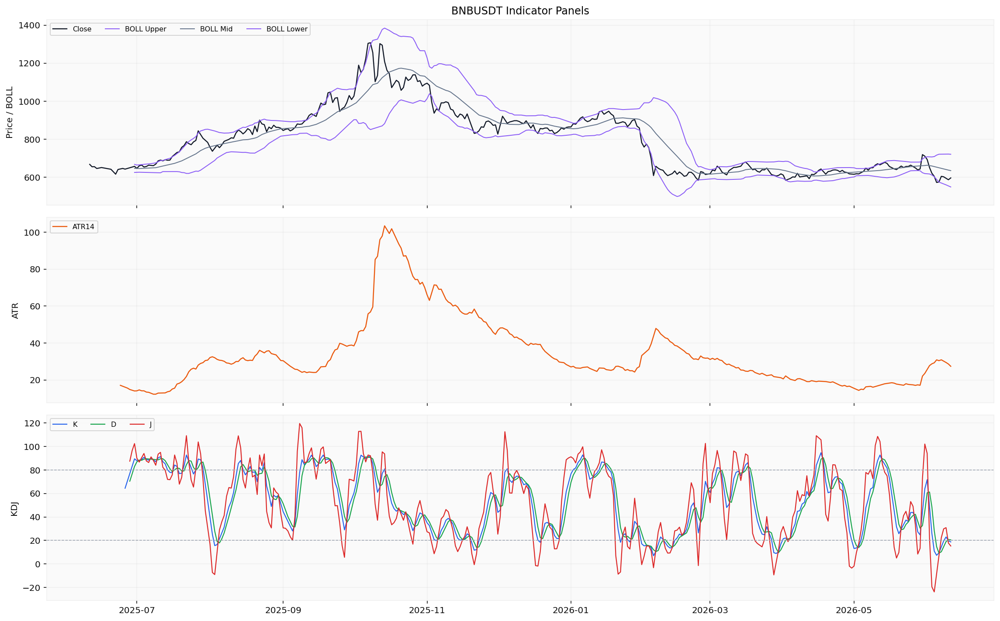
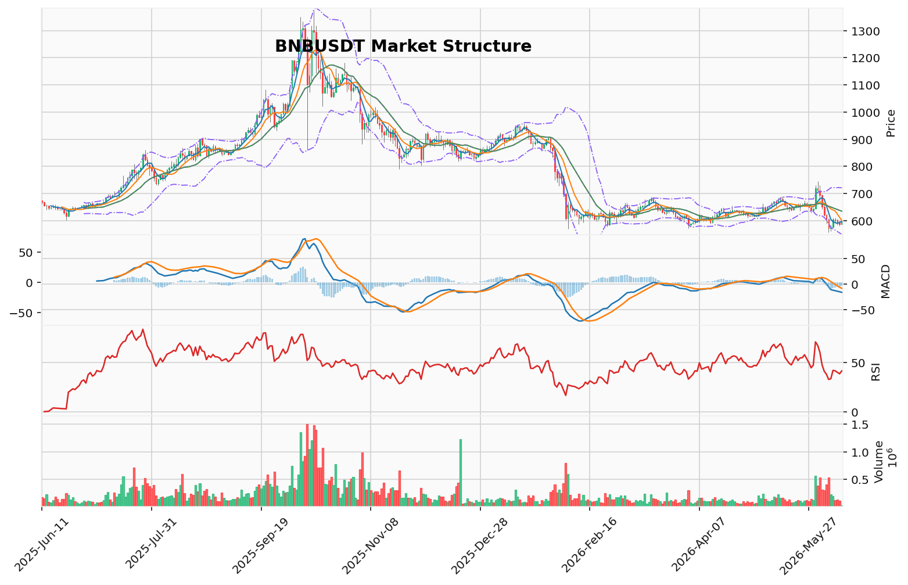

# BNB（BNB）加密资产投资研究报告

> 报告生成时间（美东）：2026-06-11 03:10:39 EDT
> 报告生成时间（北京）：2026-06-11 15:10:39 CST

## 一、投资结论与组合动作

### 最终建议：持有/观望

| 项目 | 内容 |
|------|------|
| **动作** | **持有/观望** |
| **新开仓** | **不允许** |
| **杠杆** | **不加杠杆** |
| **合约** | **不处理**（缺真实持仓参数） |
| **现货** | **持有现有仓位，不新增买入**（如已持有） |
| **等待条件** | 资金费率、多空比、链上净流入、订单簿数据、新闻来源恢复后重新评估 |
| **置信度** | 中等偏低 |

### 决策理由

**核心判断：数据缺口使得任何方向性开仓都不具备充分依据。**

1. **趋势结构已确认下行**：价格位于MA5(596.47)、MA10(600.49)、MA20(634.50)下方，均线空头排列；MACD动能偏空(DIF -16.47 < DEA -10.12)；AMD/SMC高点下移、低点下移，处于下跌推进阶段。这些是经过上游报告验证的可审计数据。

2. **成交量持续萎缩**：5日成交额从1.14亿USDT降至1754万USDT，市场参与度趋于冷淡。低流动性环境下价格可能出现非理性波动。

3. **赔率不利于多头**：上方目标FVG中线599.95(+0.6%)和买侧流动性610.54(+2.4%)，下方目标123突破位556.46(-6.6%)和布林下轨548.50(-7.9%)。在当前趋势结构偏空、成交量萎缩、数据缺口庞大的环境下，做多的预期收益/风险比极差。

4. **看涨信号强度不足**：
   - TD 13看涨反转计数已完成，但上游报告明确标注为“趋势衰竭参考信号，非交易触发”
   - 短期主动买卖比率(6月10日taker buy sell ratio 1.265)回升，但上游报告指出“在流动性枯竭环境下更可能是噪声”
   - 上方未回补FVG缺口(599.945 USDT)属于中性工具，不是方向性信号

5. **数据缺口对看涨方伤害更大**：看跌方依赖已验证趋势结构，数据缺口影响最小；看涨方需要“空头拥挤”、“主力吸筹”等衍生品和链上验证来支持反转假设，但这些数据完全缺失。具体而言，看涨方需要的资金费率、多空比、链上交易所净流入、订单簿数据、新闻已验证来源均不可用。

### 为什么不是“买入”？

趋势结构偏空，看涨信号强度不足，且数据缺口对看涨假设构成致命打击——看涨方的核心逻辑（空头拥挤、买方积累、情绪极端化）均需资金费率、多空比、链上数据验证，但这些数据全部缺失。

### 为什么不是“卖出”？

未提供真实持仓参数，无法假设任何持仓状态；缺乏可验证的卖出触发条件（上游报告未提供“卖出具体价位的执行条件”）；空头风险未被验证（资金费率、多空比缺失意味着空头拥挤度和安全边际未知）。

### 为什么是“持有/观望”？

信息不完备的理性选择——当关键数据完全缺失时，最安全的做法是不进行方向性押注。趋势结构偏空但不足以确认卖出，平衡激进与保守的中间路径是等待数据恢复后重新评估。

## 二、市场结构与技术指标分析

### 技术图表

本节基于市场结构与技术分析报告，整合BNB当前价格趋势、技术参考位、成交量、动量指标、资金费率、未平仓量（OI）、多空比、清算地图、CVD/主动买卖量、链上与宏观变量。所有数据来源和限制均以上游报告为准。

### 2.1 当前价格结构

| 项目 | 数据 | 备注 |
|------|------|------|
| 当前价格 | 596.07 USDT | 数据时间：2026-06-11 |
| 24h涨跌幅 | +1.708% | 单日波动，不构成趋势 |
| 24h成交量 | 113,817.909 BNB（约67,159,054.22 USDT） | 成交量收缩状态 |
| 趋势方向 | 下行（downtrend） | 本地技术摘要标识 |
| 价格相对均线 | MA5(596.466)下方、MA10(600.493)下方、MA20(634.4955)下方 | 空头排列确认 |
| AMD/SMC | 高点下移、低点下移，下跌推进阶段 | 结构持续看跌 |
| 123突破 | 看跌方向，突破位556.46 USDT | 下破待确认 |

**投资含义**：价格处于均线系统下方，AMD/SMC与123突破均指向下行延续。当前结构不支持任何方向性开仓。

### 2.2 技术参考位与成交量分布

| 指标 | 数据 | 推导 | 交易作用 | 失效条件 |
|------|------|------|----------|----------|
| POC/成交量分布 | POC 632.03375 USDT，价值区间573.254167–707.6075 USDT，样本160 | 当前价格596.06位于价值区间下沿附近，POC在上方约36美元 | 价值区间下沿为技术参考位置，不能作为必然支撑 | 样本基于OHLCV近似分桶，非逐笔成交分布；需恢复逐笔数据后增强置信度 |
| 维加斯通道 | 价格在蓝带下方，EMA144=677.286，EMA169=689.418，距蓝带中线-12.774% | 价格远离蓝带中线，处于通道下方，趋势偏空 | 蓝带位置作为上方压力技术参考 | 若价格回升至蓝带上方，需重新评估趋势结构 |
| 布林带 | 上轨720.496，中轨634.4955，下轨548.495（单位：USDT） | 当前价格596.06位于中轨与下轨之间，偏向通道下侧 | 下轨548.495为技术参考低位边界 | 价格突破上轨或下轨时通道需重新评估 |

**投资含义**：多重技术参考位叠加，形成从596到548.50的相对稀薄区域，缺乏强成交密度支撑，下行风险不可忽视。

### 2.3 动量指标与趋势信号

| 指标 | 数据 | 推导 | 交易作用 | 失效条件 |
|------|------|------|----------|----------|
| MACD | DIF=-16.4724，DEA=-10.1191，柱=-6.3534 | DIF在DEA下方，柱状图负值但近期未见加速扩大，下跌动能未显著增强也未收敛 | 动能偏空，缺乏收敛信号 | DIF上穿DEA或柱状图转正时需重新评估 |
| RSI | RSI14=41.4447 | 中性偏弱区间（低于50），未进入超卖区（低于30） | 动量偏弱但未极端，不能作为反转信号 | 进入超卖区（<30）或回归50以上时需重新评估 |
| KD | K=27.159（中性），D=23.594（接近超卖），J=34.289；另一组快照K=18.78接近超卖，存在偏差 | K和D处于中性和近超卖之间，两组读数存在差异 | 接近超卖区域但未确认，不能作为超卖反转信号 | KD明确进入超卖区（<20）或金叉向上时需重新评估 |
| TD Sequential | 方向：看涨反转，启动计数1，倒数计数13，信号：TD看涨反转13计数完成，置信度：中等 | TD13看涨反转计数已完成，暗示下跌动能可能出现衰竭或短期反转窗口 | 作为趋势衰竭参考信号，可纳入观察但非交易触发 | 若价格继续向下突破TD结构低点，则该计数失效；需等待后续计数重置或延续确认 |

**投资含义**：MACD与RSI均偏空，KD接近超卖但未确认，TD13为衰竭参考信号但非交易触发。多指标方向不一，但核心动能指标仍偏空。

### 2.4 订单块、FVG与谐波形态

| 指标 | 数据 | 推导 | 交易作用 | 失效条件 |
|------|------|------|----------|----------|
| OB订单块 | 状态：近期没有确认的结构突破 | 当前未出现订单块结构突破信号，价格在已有订单块区间内运行 | 不能作为入场或突破确认依据 | 需订单块结构出现明确突破或反弹确认后再评估 |
| FVG | 候选18个，未回补3个，最近上方缺口中线599.945 USDT | 上方存在未回补的公平价值缺口，中线在599.945，当前价格596.06低于该缺口 | 缺口回补方向可作为价格运动的技术参考，但不能作为必然目标 | 若价格继续走低远离缺口，则回补概率降低；需价格回升至缺口区间再评估 |
| 谐波形态 | 状态：未匹配到有效候选 | 当前摆动比例未形成已知谐波形态（蝙蝠、螃蟹、加特利等），无信号输出 | 不作为当前交易依据 | 需价格产生新的摆动高低点后再重新匹配候选形态 |

**投资含义**：FVG缺口为技术参考，但方向性不确定；订单块与谐波形态均无信号，短期缺乏结构突破依据。

### 2.5 清算、CVD、资金费率、OI与多空比

| 指标 | 数据 | 推导 | 交易作用 | 失效条件 |
|------|------|------|----------|----------|
| 清算地图 | 不适用（BTC专用口径） | BNB不适用清算地图分析 | 不作为本标的依据 | — |
| CVD/主动买卖量 | CVD代理累计值-583,539,427.5251865 USD；近5日taker buy sell ratio：1.265、0.817、0.654、1.074、1.262 | CVD代理累计为负值，显示长期主动卖量占优；近5日比值波动，6月10日买入比值回升至1.265 | 短期主动买卖比例出现翻正，可关注是否与价格企稳同步 | CVD代理累计值为未标准化差值，非标准CVD；需恢复标准CVD和逐笔数据 |
| 资金费率 | 缺失/不可用（来源限流、数据粒度不匹配） | 无法评估资金费率方向和多空持仓成本 | 资金费率缺失降低了拥挤度判断的置信度 | 需恢复资金费率来源后再评估 |
| OI | 未平仓量325,546,871.3052 USD（单位已明示：USD） | OI绝对值可参考，但因缺乏历史序列分位和资金费率配合，无法判断当前持仓拥挤程度 | OI当前读数仅作规模参考 | 需恢复OI历史序列及资金费率后方可判断拥挤度 |
| 多空比 | 缺失/不可用（仓库无记录、来源限流） | 无法判断多空持仓倾向 | 缺失数据降低了结构判断的置信度 | 需恢复多空比来源 |

**投资含义**：CVD累计负值、资金费率与多空比完全缺失，使衍生品拥挤度和持仓方向判断不可行。当前无法评估空头挤压风险或多头建仓的衍生品环境。

### 2.6 链上、宏观与事件层

| 指标 | 数据 | 推导 | 交易作用 | 失效条件 |
|------|------|------|----------|----------|
| 链上 | 缺失/不可用（Glassnode接口凭证缺失、Coinglass服务端500错误） | 交易所净流入、链上日频指标均无可用数据 | 不能作为当前交易依据 | 需恢复Glassnode凭证和Coinglass服务 |
| 宏观 | 行情资料包说明宏观/新闻由新闻资料包负责，本包不重复判断 | 本资料包未提供宏观解读材料 | 不能作为当前交易依据 | 需回看新闻/宏观资料包获得宏观判断 |
| 事件 | 事件日历缺失/不可用 | 无法判断相关事件类型是否构成驱动 | 不能作为当前交易依据 | 需事件数据提供方恢复 |

**投资含义**：链上与宏观维度完全不可用，事件日历缺失，无法评估外部风险或潜在催化剂。

### 2.7 数据限制与待确认条件

**资料缺口：**
- 资金费率：来源限流与粒度不匹配，完全未返回有效数据
- 多空比：仓库无可用记录且来源限流，完全缺失
- 期权未平仓量与成交量：来源限流，完全缺失
- 交易所净流入：仓库无可用记录且来源限流，完全缺失
- 链上日频指标：Glassnode接口凭证缺失，Coinglass服务端返回500错误，双重失败
- 小时行情：仅43行覆盖2026-04-30至2026-06-11，未覆盖完整分析区间

**样本限制：**
- 成交量分布基于OHLCV近似分桶（样本160），非逐笔成交分布数据
- CVD以累计主动买卖量差代理，非标准CVD指标
- KD指标两组快照读数存在差异（K=27.159与K=18.7817），可能来自不同计算窗口或数据更新时差

**待确认条件（需恢复后才能构建可执行交易条件）：**
1. 资金费率恢复——判断多空持仓成本与拥挤度
2. 多空比恢复——判断市场情绪倾向
3. 链上交易所净流入恢复——判断抛压或积累行为
4. 逐笔订单流数据——验证订单块结构突破和流动性扫描
5. 新闻/事件已验证来源——评估基本面催化剂

### 2.8 小结

当前BNB处于明确的下行趋势结构，均线空头排列，MACD动能偏空，AMD/SMC与123突破均指向下跌延续。成交量持续萎缩至近1754万USDT，市场参与度趋于冷淡，流动性风险显著上升。TD13看涨反转计数完成作为衰竭参考信号，但上游报告明确标注为“非交易触发”，不足以构成反转依据。CVD代理累计负值显示长期卖压占优，短期主动买卖比率虽有回升但被报告定性为更可能是噪声。资金费率、多空比、链上数据完全缺失，严重限制了拥挤度判断和趋势验证置信度。当前不具备方向性开仓的执行条件，以持有/观望、不新增方向动作、等待关键数据恢复后重新评估为合理选择。

## 三、项目与代币基本面分析

### 3.1 资料可用性说明

基本面资料包返回结果为**部分可用**。已返回的数据仅限于2026年6月11日单日价格、市值与成交量快照，其余关键维度（供给与发行材料、链上使用数据、DeFi经营数据、协议收入与费用、机构资金数据、估值指标）均未形成可引用的数据集。以下分析均受此限制，所有判断基于当前可验证的数据点和资料包明确标识的资料缺口。

### 3.2 已返回数据摘要

基本面资料包仅返回以下单点快照数据：

| 指标 | 数值 | 单位 | 时间 |
|------|------|------|------|
| 价格 | 595.35 | USD | 2026-06-11 |
| 市值 | 80,239,881,785 | USD | 2026-06-11 |
| 24小时成交量 | 622,228,365 | USD | 2026-06-11 |

以上数据为单点快照，无历史序列、无百分比变化、无估值乘数、无供应信息，不足以支撑任何趋势判断或基本面评估。该数据快照与市场结构与技术分析报告中的价格读数（596.07 USDT）存在约0.12%的差异，差异来源为不同数据源更新时间差，不影响整体分析。

### 3.3 供给与发行分析

**数据状态：** 供给与发行材料缺失。未返回总供应量、流通供应量、最大供应量、未来释放计划或解锁安排。

**投资含义：** 无法判断代币是否存在未来稀释压力、发行节奏或通胀/通缩特征。当前快照显示市值约802亿USD，但该读数未包含供应量数据，不能推导出完全稀释估值或流通市值。任何关于代币经济结构、解锁冲击或发行压力的讨论均不可进行。该维度对组合动作的限制：无法评估供给侧风险，供给相关事件（如解锁、回购、销毁）均不能作为当前方向性依据。

**待确认条件：** 需恢复总供应量、流通供应量、解锁时间表、代币分配及释放机制数据，方可评估供需平衡与潜在稀释影响。

### 3.4 链上使用与网络活动

**数据状态：** 链上日频指标完全缺失。Glassnode接口凭证缺失、Coinglass服务端500错误，双重失败导致活跃地址数、交易笔数、网络手续费消耗、链上应用生态指标全部不可用。

**投资含义：** 无法评估BNB在BSC链上的实际经济活动水平、用户行为趋势及网络采用率。链上活动是衡量加密资产“真实需求”的核心维度之一，缺失该数据意味着无法确认当前价格水平是否与网络效用匹配。该维度对组合动作的限制：链上使用数据不能作为看涨或看跌依据，也无法验证“网络效应增长”或“链上活动萎缩”等叙事。

**待确认条件：** 需恢复Glassnode凭证和Coinglass服务，获取日频链上指标（活跃地址、交易笔数、手续费消耗、新增地址数等）后方可评估网络健康度。

### 3.5 DeFi经营与协议收入

**数据状态：** DeFi经营数据与协议收入数据完全缺失。未返回总锁仓量（TVL）、协议收入、费用收入、交易量、BSC链上DeFi协议分布等数据。

**投资含义：** 无法评估BNB在DeFi生态中的资金锁定规模、协议手续费捕获能力及生态增长趋势。TVL和费用收入是衡量L1生态竞争力和代币价值捕获能力的关键指标。缺失该数据意味着无法判断BSC生态是否面临竞争压力、用户流失或增长瓶颈。该维度对组合动作的限制：DeFi经营数据不能作为当前判断依据，生态竞争格局分析不可进行。

**待确认条件：** 需恢复TVL、协议收入、费用数据及BSC链上DeFi协议列表，方可评估生态经营状况。

### 3.6 机构资金与ETF数据

**数据状态：** 机构资金与ETF数据缺失。ETF资金流接口标记为“不适用”，无任何机构资金流入流出数据。

**投资含义：** 无法判断机构参与程度和资金流向变化。BNB目前不受美国现货ETF覆盖，机构参与渠道有限。该维度对组合动作的限制：机构资金流向不能作为方向性依据，亦不能推断机构对BNB的配置意愿。

### 3.7 估值指标分析

**数据状态：** 估值指标缺失。未返回FDV、FDV/TVL倍率、AHR999指数、交易所净流量等加密资产常用估值参考。

**投资含义：** 无法建立任何基于加密资产特有口径的估值框架。传统股票类估值指标（PE/PB/ROE等）对加密资产不适用，且上游材料未提供可替代的加密估值体系。该维度对组合动作的限制：估值水平不能作为买入或卖出的依据，也无法设定合理价格区间。

**待确认条件：** 需恢复FDV、流通市值、TVL及交易所净流量等数据，方可构建基础估值参考。

### 3.8 币种基础元数据

**数据状态：** 币种基础元数据缺失。未返回BNB的共识机制、网络状态、代币功能定位、链上治理结构等基础信息。

**投资含义：** 无法确认BNB当前在BSC生态中的具体角色（Gas代币、治理代币、权益证明质押资产等）。该维度对组合动作的限制：基础元数据缺失不影响当前持有/观望的决策，但若未来需评估BNB的生态定位变化（如BNB从Gas代币向治理代币转移），需补充该数据。

### 3.9 资料限制对组合动作的综合影响

| 缺失维度 | 对当前动作的限制 | 恢复后需要重新评估的方向 |
|----------|----------------|------------------------|
| 供给与发行数据 | 无法判断稀释压力 | 解锁事件、通胀/通缩趋势对供需平衡的影响 |
| 链上使用数据 | 无法判断网络采用率 | 活跃地址趋势、交易量变化反映的需求基础 |
| DeFi经营数据 | 无法判断生态竞争力 | TVL和收入趋势反映的价值捕获能力 |
| 机构资金数据 | 无法判断机构参与度 | ETF资金流或机构持仓变化的潜在影响 |
| 估值指标 | 无法建立估值框架 | FDV/TVL等倍率在历史分位中的位置 |

**核心含义：** 基本面维度当前仅提供单日价格与市值快照，无法支撑任何方向性判断。这进一步强化了组合经理“持有/观望”的决策——基本面维度未提供买入或卖出的额外证据，但缺口本身也不是看涨或看跌事实，仅说明基本面分析维度当前不可用。若未来基本面数据恢复并验证新的方向性信息，需要重新评估对组合动作的支持或约束。

## 四、新闻、监管与事件驱动

### 4.1 资料状态与已验证来源

新闻资料包已返回部分数据，包含项目新闻线索 10 条（时间覆盖 2025-07-16 至 2026-06-10）和宏观新闻线索 71 条（时间覆盖 2025-12-03 至 2026-06-08）。但资料包内所有返回条目均为媒体聚合搜索线索与公开搜索线索，**未包含任何官方公告原文、交易所公告原文、监管文件原文或已读取原文的可靠媒体报道正文**。已验证来源数量为零。

项目新闻覆盖未满分析区间的完整一年（最早记录始于 2025-07-16，缺失 2025-06-11 至 2025-07-15 约一个月的覆盖）；宏观新闻覆盖更窄（始于 2025-12-03，缺失 2025-06-11 至 2025-12-02 约六个月的覆盖），均未覆盖完整分析区间。来源尝试记录显示有 29 次来源尝试，但均未形成可引用的已验证数据集。

### 4.2 当前事件层对投资逻辑的影响

由于缺乏任何已验证的新闻来源，当前事件层对 BNB 的以下基本面驱动维度均无法判断：

| 事件驱动维度 | 可用证据 | 对投资逻辑的影响 |
|-------------|---------|----------------|
| 项目公告（如协议升级、代币销毁、生态合作） | 搜索线索，无原文验证 | 无法评估需求面或供给面的潜在变化 |
| 交易所公告（如上币、退市、交易规则变更） | 无可用数据 | 无法评估流动性和交易环境风险 |
| 监管政策与执法行动 | 搜索线索，无原文验证 | 无法评估监管合规风险或行业政策变化 |
| 宏观事件（如利率政策、经济数据、地缘政治） | 搜索线索，无原文验证 | 无法评估外部市场环境对加密资产估值的影响 |
| 安全事件（如合约漏洞、黑客攻击、跨链桥事故） | 无可用数据 | 无法评估协议安全假设的状态 |
| 机构资金事件（如产品上市、增持/减持、融资轮） | 无可用数据 | 无法评估机构参与度和资金流向 |
| 链上事件（如大额转账、质押活动、验证者行为） | 无可用数据 | 无法评估链上经济活动与持有者行为变化 |

### 4.3 新闻层对组合动作的支持与约束

**支持关系：** 当前新闻资料包的空白状态，与组合经理“持有/观望”的判断方向不存在冲突——无已验证事件需要立即调整仓位或触发方向性押注。

**约束关系：** 新闻缺位限制了组合对潜在催化剂或突发风险的响应能力。若未来出现已验证的事件（如官方公告的协议升级或监管执法），可能完全改变当前市场结构判断和组合动作。

### 4.4 需要跟踪的新闻与事件类别

以下类别需要继续获取已验证来源，以支持未来重新评估：

- **项目官方公告**：需核验 BNB Chain 升级、代币销毁活动、生态基金部署等可能影响代币供给或需求的事件
- **交易所公告**：需确认 BNB 交易相关规则变更、流动性安排或衍生品合约调整
- **监管文件**：需核实对 BNB 或 BNB Chain 具有管辖权的主体发布的监管指引或执法行动
- **宏观事件**：需验证可影响加密资产风险偏好的宏观经济数据和政策基调变化
- **安全事件**：需要可靠的区块链安全审计方或官方公告确认协议风险事件

### 4.5 数据限制与影响说明

- **来源限制：** 新闻资料包仅返回媒体聚合搜索线索和公开搜索线索，未包含任何官方公告、监管文件、交易所公告或已读取原文的可靠媒体正文。搜索线索未核验，不能作为事实源。
- **覆盖限制：** 项目新闻和宏观新闻的覆盖区间均未覆盖完整分析区间，存在时间窗口缺失。
- **缺口说明：** 官方公告、监管文件、交易所公告、机构资金事件、安全事件、宏观事件、链上事件均缺少已验证来源。缺新闻不代表没有负面消息，也不代表存在潜在利好——仅表示新闻维度无法做出任何方向性判断。
- **对组合动作的影响：** 新闻维度的空白状态进一步强化了组合经理“等待数据恢复后重评”的判断。若可靠来源恢复并验证方向性事件，需要重新评估。

## 五、社区情绪、事件预期与交易拥挤度

### 5.1 市场级情绪读数

舆情资料包返回的唯一可用情绪指标为 **Alternative.me Fear & Greed Index**，最新记录日期 **2026-06-11**，情绪分数 **12.0**，对应 **“极度恐惧（Extreme Fear）”** 区间。该读数仅反映 **整个加密货币市场的总体情绪**，并非 BNB 专属指标，且覆盖时间仅为单日快照，不包含历史回测或横向对比数据。

**投资含义：** 市场级极度恐惧读数本身不能作为方向性交易依据。在组合经理当前持有/观望的框架下，该读数提示市场整体风险偏好极低，价格可能已过度定价负面预期，但缺乏 BNB 专属验证数据来确认这一判断是否为反转条件。

### 5.2 社区讨论热度与情绪方向

**无法作出判断。** 舆情资料包中缺少 BNB 专属社交平台样本数据：LunarCrush 接口凭证缺失，导致 BNB 的社交主导度（social dominance）、发帖量（num posts）、互动量（interactions）等核心聚合指标全部缺位。没有来自 X、Telegram、Discord、Reddit 或中文社区的真实平台样本，因此无法评估：

- BNB 当前社区讨论热度的涨跌方向
- 社区情绪是乐观/悲观/分歧扩大还是关注度下降
- 不同语言社区（英文、中文、韩文等）之间的情绪差异
- 散户、KOL、机构或项目方等参与者类型的情绪分布

**投资含义：** 情绪分析维度因数据缺口而严重受限，无法判断社区情绪是否与价格走势形成背离或强化。该方向缺少可验证的社交共识证据，不作为方向性判断依据。

### 5.3 主要叙事与传播路径

**相关市场叙事缺少真实平台样本支持。** 由于缺少任何社交平台的真实讨论数据，无法确认当前 BNB 生态内有哪些叙事正在传播、通过哪些渠道扩散、参与者群体是否发生结构性变化。链上活动、生态扩容、供给事件、交易所行为等潜在叙事方向均无样本可引用。

**投资含义：** 叙事分析完全不可用，无法判断是否存在被市场过度定价或低估的叙事驱动因素。该维度对当前组合动作无影响。

### 5.4 情绪对短期市场反应的潜在影响

**短期情绪影响无法判断。** 唯一可用的市场级 Fear & Greed 分数（12，极度恐惧）属于加密市场整体读数，不能直接推导 BNB 在 1-5 天内的方向性价格反应。缺少 BNB 专属社交样本、聚合指标或事件预期材料，该方向缺少统计或回测证据。

**投资含义：** 情绪维度无法为短期市场反应提供可执行判断。组合经理的持有/观望决策在该维度下既不被强化也不被削弱——该方向无可用数据。

### 5.5 情绪失真风险

**失真风险无法量化。** 由于无真实社交样本返回，无法识别是否存在刷量、机器人活动、群体极化、FUD 操纵或信息茧房等失真来源。缺失 LunarCrush 数据也意味着无法交叉验证互动真实度。

**投资含义：** 当前情绪读数（Fear & Greed 12）本身存在失真可能性，但由于缺乏交叉验证手段，该风险保持为不可量化状态，不作为方向性依据。

### 5.6 事件预期分析

**事件预期维度不可用。** 舆情资料包未返回任何 BNB 相关事件预期数据（如协议升级时间表、供给事件、交易所公告预期、宏观事件预期等）。事件日历数据缺失，无法判断：

- 是否有临近的预期事件可能成为价格催化剂
- 市场对特定事件的定价程度（预期是否已反映在价格中）
- 事件驱动型交易机会是否存在

**投资含义：** 事件预期完全不可用，无法评估是否存在被市场低估或高估的事件风险。若可靠事件数据恢复并验证方向性事件，需要重新评估。

### 5.7 交易拥挤度分析

**交易拥挤度无法判断。** 由于资金费率（缺失/不可用）、多空比（缺失/不可用）、未平仓量历史分位（缺失/不可用）以及订单簿深度数据（缺失/不可用）的全面缺失，无法评估：

- 多空持仓成本与方向拥挤度
- 市场情绪是否已极端偏向某一方
- 当前价格相对清算密集区的位置
- 潜在的空头挤压或多头踩踏风险

**投资含义：** 拥挤度分析的完全不可用是组合经理置信度降至中等偏低的核心原因之一。该维度的数据缺口对看涨方伤害最大——看涨方需要“空头拥挤”来支撑反转假设，但该假设无法验证。当前拥挤度维度不构成方向性判断依据。

### 5.8 综合情绪与拥挤度评估

| 维度 | 状态 | 投资含义 |
|------|------|----------|
| 市场级情绪（Fear & Greed） | 12，极度恐惧 | 整体市场风险偏好极低，但非BNB专属，不能作为方向性依据 |
| BNB专属社交情绪 | 完全缺失 | 无法评估社区情绪方向、叙事传播或参与者结构 |
| 事件预期 | 完全缺失 | 无法评估潜在催化剂或事件风险 |
| 交易拥挤度（资金费率、多空比、OI历史分位） | 完全缺失 | 无法判断多空持仓成本、拥挤程度或清算风险 |
| 情绪失真风险 | 无法量化 | 当前情绪读数无法交叉验证 |

**结论：** 情绪与拥挤度维度因数据缺口严重受限，无法为当前组合动作（持有/观望）提供强化或削弱证据。唯一可用的市场级极度恐惧读数仅作为背景参考，不能外推为交易条件。组合经理的持有/观望决策在该维度下保持为基于数据缺口的中性等待状态。

## 六、交易计划与组合风险

### （一）当前组合动作：持有/观望

| 项目 | 内容 |
|------|------|
| **动作** | **持有/观望** |
| **新开仓** | **不允许** |
| **杠杆** | **不加杠杆** |
| **合约** | **不处理**（缺真实持仓参数） |
| **现货** | **持有现有仓位，不新增买入**（如已持有） |
| **等待条件** | 资金费率、多空比、链上净流入、订单簿数据、新闻来源恢复后重新评估 |
| **置信度** | 中等偏低 |

**执行逻辑：** 上游市场报告已验证的趋势结构（均线空头排列、MACD动能偏空、AMD/SMC下跌推进阶段）与成交量持续萎缩至1754万USDT的流动性枯竭状态，共同构成了可审计的看跌背景。但资金费率、多空比、链上交易所净流入、订单簿逐笔数据及新闻已验证来源均完全缺失，使得任何方向性开仓都缺乏衍生品拥挤度、链上流向或事件驱动的验证支撑。在此信息不完备环境下，持有/观望是唯一符合风控纪律的动作。

### （二）数据缺口对动作的约束

| 缺失数据类别 | 对当前动作的影响 |
|------------|----------------|
| 资金费率 | 无法判断多空持仓成本与拥挤度，无法评估空头挤压风险 |
| 多空比 | 无法判断市场情绪倾向是否已极端，无法验证看跌结构是否过度拥挤 |
| 链上交易所净流入 | 无法判断是否存在持续性抛压或积累行为 |
| 逐笔订单流 | 无法验证FVG回补动力和订单块结构突破 |
| 新闻/事件已验证来源 | 无法排除基本面催化剂或突发事件风险 |

**投资含义：** 数据缺口本身不是看涨或看跌事实，仅说明相关论据尚未验证。当前动作不预设任何方向，等待上述5类数据恢复后方能构建可执行的交易条件。

### （三）关键分歧与风险辩论整合

**看涨-激进逻辑及其限制：** 激进分析师基于TD 13看涨反转计数完成、短期主动买卖比率回升至1.265、上方未回补FVG缺口中线599.95USDT等技术参考信号，认为下跌动能正在衰竭，短期存在反弹至610.54USDT买侧流动性的机会。但上游市场报告明确标注TD 13为“趋势衰竭参考信号，非交易触发”，主动买卖比率回升在流动性枯竭环境下“更可能是噪声”，FVG回补属中性工具而非方向性信号。该方向缺少统计回测或执行机制验证，只能作为待验证条件。

**看跌-安全逻辑及其限制：** 安全分析师依赖已验证的均线空头排列、MACD动能偏空、AMD/SMC下跌推进阶段及成交量持续萎缩等事实，认为趋势结构偏空且缺乏反转验证条件。但当前无法设定具体卖出执行价位，且空头拥挤度和安全边际因资金费率缺失而未知，直接做空同样面临短时急速反弹风险。

**中性-平衡建议（采纳）：** 组合经理采纳中立分析师的路径——将交易目标从“预测方向”转向“等待信息恢复”。在数据缺口无法填补前，不进行方向性押注，以减少在已知信息不足条件下的不确定风险暴露。

### （四）限制说明

- 未提供真实持仓参数与保证金参数，无法审计合约风险，亦无法给出现货减仓比例或合约处理建议。
- 上游市场/技术报告仅返回技术参考位（卖侧流动性556.46、布林下轨548.50、FVG中线599.95、买侧流动性610.54等），未将其标注为可执行交易条件，因此不得作为入场、止损、目标、失效触发或成交量门槛使用。
- 与向上游报告冲突的“TD 13结构低点止损”等风险管理参数，因上游材料未提供该低点的具体价格，已按第15条和15e-15a规则改写为“该方向性解释未由资料包验证”。
- 新闻资料包仅返回搜索线索，无已验证事实，无法评估外部事件风险。
- 情绪资料包仅返回市场级恐惧贪婪指数12（极度恐惧），为整体市场读数，非BNB专属，且BNB社交平台样本数据完全缺失，无法评估社区情绪方向。

### （五）数据恢复后的重评条件

当以下数据类别恢复后，需重新评估市场环境，当前不预设任何方向、价格或条件：

1. **资金费率**——判断多空持仓成本与拥挤度
2. **多空比**——验证看跌结构是否已过度拥挤
3. **链上交易所净流入/流出**——判断抛压或积累行为
4. **逐笔订单流数据**——确认订单块结构突破和流动性扫描
5. **新闻/事件已验证来源**——评估基本面催化剂或监管/安全事件风险

**重评前，不预设任何方向动作。** 若可靠数据恢复并验证新的方向性事件，需要重新评估。

## 七、关键分歧与跟踪条件

### 核心分歧一：趋势结构 vs. TD 13 衰竭信号

**组合经理立场：** 趋势结构优先。已验证的均线空头排列、MACD 动能偏空、AMD/SMC 下跌推进阶段是当前最高优先级的可审计数据。TD 13 看涨反转计数上游报告已明确标注为“趋势衰竭参考信号，非交易触发”，不能作为反转确认或做多依据。

- **看涨方引用：** TD 13 计数完成意味着下跌动能衰竭，潜在反转窗口打开。
- **看跌方反驳：** 该信号被上游报告明确弱化；在成交量持续萎缩、趋势结构未破坏时，单一辅助指标不构成交易依据。
- **组合经理采纳：** 看跌方。TD 13 可纳入观察，但不对抗已验证的趋势结构。

### 核心分歧二：单日主动买入比率回升的意义

**组合经理立场：** 该信号证据脆弱。上游报告明确指出“在流动性枯竭环境下，单日主动买入比率回升更可能是噪声，而非趋势性信号”。5 日中位数约 0.99、平均值约 1.014，CVD 代理累计值 -5.83 亿美元显示长期主动卖量占优。

- **看涨方引用：** 6 月 10 日 taker buy sell ratio 1.265 为短期买方力量回归信号。
- **看跌方反驳：** 发生在连续两天卖盘主导后；资金费率缺失使判断多头建仓性质无依据；低成交量下波动可靠性存疑。
- **组合经理采纳：** 看跌方。该方向性解释未由资料包验证，只能作为待验证条件。

### 核心分歧三：数据缺口对多空逻辑的影响

**组合经理立场：** 数据缺口对看涨方伤害更大。看跌方依赖已验证的趋势结构和成交量数据，数据缺口对其影响最小；看涨方需要资金费率、多空比、链上数据验证“空头拥挤”和“买方积累”假设，但全部缺失。

- **激进行为风险分析师：** 数据缺口使做空安全边际无法确认，空头挤压风险未经验证。
- **安全/保守风险分析师：** 缺口使多头假设无衍生品和链上环境支撑；看跌方趋势结构自洽。
- **组合经理采纳：** 安全/保守方。该方向性解释未由资料包验证，不能作为当前证据。

### 核心分歧四：做多赔率评估

**组合经理立场：** 赔率不利于多头。上方 FVG 中线 599.95（+0.6%）和买侧流动性 610.54（+2.4%），下方 123 突破位 556.46（-6.6%）和布林下轨 548.50（-7.9%），上限/下限比值约 1:3。

- **激进分析师：** 可基于 TD 13 衰竭信号用更低止损构建更优赔率，但上游报告未返回 TD 结构低点具体价格。
- **安全分析师：** 看涨方假设的趋势延续和价格意外突破，在数据缺口下无依据。
- **组合经理采纳：** 安全方。未提供真实持仓参数和动态止损价格，做多预期收益/风险比极差，不足以支撑方向性交易。

### 跟踪条件

在关键数据恢复前，不预设任何价格、阈值或方向性执行条件。恢复后需要重新评估，但不预设开仓、减仓或对冲动作。以下为需恢复的数据类别及对应验证逻辑：

| 待恢复数据类别 | 对判断的作用 | 数据恢复后的重评方向 |
|------|------|------|
| 资金费率 | 判断多空持仓成本，评估空头挤压风险或多头建仓成本 | 若极端负值 + 多空比极度偏空 → 空头挤压风险上升，做多条件改善；若中性/正值 → 做空安全边际更高 |
| 多空比 | 判断市场情绪倾向，验证是否已极端偏向某一方 | 若极度偏空 → 空头拥挤，反转概率上升；若中性或偏多 → 做空安全边际更高 |
| 链上交易所净流入/流出 | 判断是否存在抛压或积累行为 | 若持续净流入 → 抛压上升；若持续净流出 → 潜在积累 |
| 订单簿逐笔数据 | 验证订单块结构突破和流动性扫描，确认 FVG 回补动力 | 若关键价位挂单变化 → 结构突破信号；若买卖单异常 → 流动性扫描验证 |
| 新闻/事件已验证来源 | 评估是否有潜在基本面催化剂、监管风险或安全事件 | 若出现已验证利好 → 基本面驱动改变；若利空 → 风险上升 |
| 成交量 | 验证市场参与度是否恢复 | 若持续 ≤2000 万 USDT → 流动性枯竭风险延续；若回升至 ≥5000 万 USDT → 市场参与度回归，技术指标有效性提高 |

**当前不预设具体阈值、触发条件或方向性动作安排。** 以上为恢复数据后重新评估所需跟踪的信息类别，评估结果仅调整市场环境判断，不产生方向性交易指令。

### 一致性说明

组合经理的“持有/观望”建议是当前唯一符合以下条件的动作：
- 不依赖任何未验证信号作为方向性依据；
- 不对抗已验证的趋势结构；
- 承认数据缺口对多空逻辑的不对称影响；
- 保持组合在信息不完备环境中的纪律性。

当上述跟踪条件恢复后，才具备可执行交易条件的基础。在此之前，任何方向性押注都将面临不可接受的透明度和安全边际缺失。

## 八、最终结论

**组合经理最终动作：持有/观望，不新开仓，不加杠杆，等待数据恢复后重新评估。**

当前动作成立的核心证据有三：第一，上游市场报告已验证BNB处于明确的下行趋势结构——均线空头排列、MACD动能偏空、AMD/SMC处于下跌推进阶段、123突破指向看跌方向，这些是可审计的事实数据。第二，成交量已从1.14亿USDT连续萎缩至1754万USDT，处于流动性枯竭前兆，使得任何技术信号在低流动性环境下可靠性显著下降。第三，关键衍生品和链上数据（资金费率、多空比、链上交易所净流入、逐笔订单流）完全缺失，导致看涨方依赖的TD 13衰竭信号和单日主动买入比率回升均缺乏衍生品环境和链上行为的交叉验证，而看跌方的趋势结构判断受数据缺口影响最小。

最关键的重新评估数据类别依次为：资金费率与多空比（判断多空持仓成本与拥挤度）、链上交易所净流入（判断抛压或积累行为）、以及新闻与事件的已验证来源（排除潜在基本面催化剂或突发事件风险）。

下一步最需要跟踪的三类数据：一是衍生品数据恢复情况——资金费率极端负值叠加多空比极度偏空将提示空头挤压风险上升；二是成交量与流动性变化——日成交额能否从1754万USDT的低位回升至5000万USDT以上，是市场参与度回归的关键信号；三是价格结构变化——价格是否有效突破MA5并持续、是否跌破123突破位556.46、是否伴随成交量放大，这些综合信号将决定重新评估时的方向倾向。在上述数据恢复前，任何方向性建仓或加杠杆均缺乏充分依据，当前持有观望是最符合信息不完备环境下风控纪律的执行路径。
