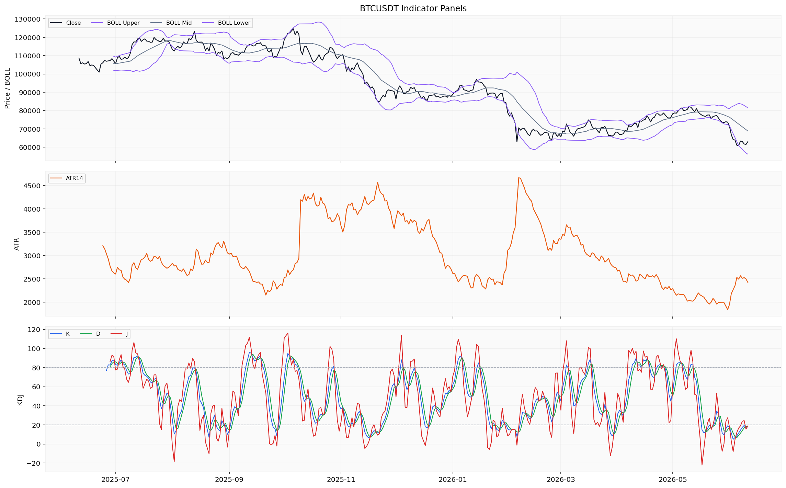
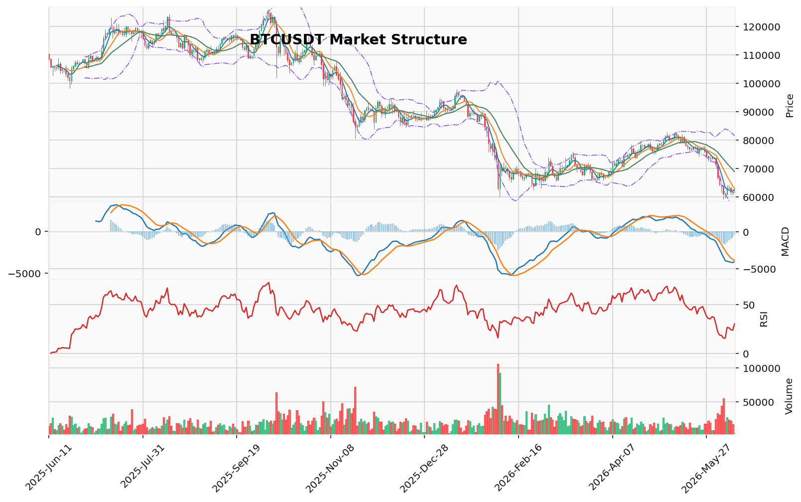

# Bitcoin（BTC）加密资产投资研究报告

> 报告生成时间（美东）：2026-06-11 02:54:15 EDT
> 报告生成时间（北京）：2026-06-11 14:54:15 CST

## 一、投资结论与组合动作

**最终决策：持有/观望。不新开多头仓位，不追空，不加杠杆，等待关键数据恢复后重新评估。**

**决策依据**：当前市场处于中期看跌结构清晰但短期衰竭信号初现的节点。维加斯通道、123突破、布林带三项独立技术指标共同指向中期空头结构完整，但TD 13看涨反转计数完成、RSI(14)接近超卖、CVD主动买量连续两日大于主动卖量等短期信号也客观存在。然而，成交量持续萎缩（contracting状态）严重削弱了所有看涨信号的有效性，而多空比、清算热力图、强平统计三大核心衍生品数据缺失，导致无法评估持仓拥挤度和清算风险。在此低置信度环境下，任何方向性押注都缺乏充分的证据基础，持有/观望是唯一理性的选择。

**执行约束**：
| 动作 | 执行情况 | 理由 |
|------|---------|------|
| 新开多头 | ❌ 禁止 | 中期空头结构完整，成交量萎缩削弱看涨信号置信度 |
| 新开空头 | ❌ 禁止 | 多空比/清算热力图缺失，无法评估空头挤压风险 |
| 加杠杆 | ❌ 禁止 | 未提供真实持仓与保证金参数，无法审计合约风险 |
| 现有多头减仓 | ❌ 不操作 | 未提供真实持仓参数，无法给出具体建议 |
| **持有/观望** | ✅ **建议** | **当前数据环境不支持任何方向性新开仓；等待关键数据恢复后重评** |

**数据恢复后的重评条件**：当多空比、清算热力图、强平统计数据恢复后，需重新评估持仓拥挤度和清算风险；当AHR999历史分位数据恢复后，需重新评估长期估值位置；当完整链上数据（交易所净流量、地址数变化）恢复后，需重新评估持有者行为趋势。数据恢复后的重评只能写“重新评估”，不得提前设计任何未来开仓、减仓或方向性动作安排。

---

## 二、市场结构与技术指标分析

### 技术图表

### 2.1 当前价格结构

当前BTC处于**下跌趋势中的修复阶段**。日线收盘价62,971.01 USDT位于MA20（68,846.25）下方约8.5%，MA5（62,526.00）与MA10（62,936.07）刚被价格从下方收复，显示短期止跌迹象但中期均线仍构成压制。市场资料包本地技术摘要确认趋势为`downtrend`，成交量状态为`contracting`。维加斯通道显示价格位于蓝带（EMA144/EMA169）下方约18.37%，EMA20/EMA50双线反转结构也处于价格下方，中期趋势尚未反转。

### 2.2 技术指标推导（核心表格）

| 指标 | 数据 | 推导 | 交易作用 | 失效条件 |
|------|------|------|----------|----------|
| **布林带** | 上轨81,499.33，中轨68,846.25，下轨56,193.16 | 收盘价62,971.01处于中轨与下轨之间，通道开口未明显收缩 | 偏向下轨运行，中轨构成中期压制 | 暂无条件 |
| **维加斯通道** | EMA144=76,407.73，EMA169=77,878.62，价格低于蓝带18.37% | 中期趋势结构偏空，蓝带向下倾斜 | 反映中期趋势未扭转 | 需价格回到蓝带上方才可能改变结构 |
| **双线反转** | EMA20=67,477.76，EMA50=71,679.87，价格在双线下方 | EMA20和EMA50均高于当前价格，未形成金叉/死叉反转结构 | 短期均线尚未构成反转条件 | 需价格站上EMA20才可能测试反转 |
| **RSI(14)** | 30.45 | 接近经典超卖阈值（30） | 动量偏弱，接近极端区域 | 若继续下行跌破30则进入超卖区 |
| **MACD** | MACD=-4,038.33，信号线=-3,515.16，柱=-523.17 | MACD与信号线均在零轴下方，柱状图负值且绝对值较小 | 动能偏空，但负柱收缩可能暗示下行减速 | 需柱状图转正才可能确认动能反转 |
| **KD** | K=28.12，D=21.38，J=41.59 | KD处于低位，K和J已反弹，D值接近但未跌破20超卖线 | 短期摆动有修复迹象 | 需K值继续上行确认反弹延续性 |
| **TD 9/13** | 看涨反转方向，倒数计数13已完成，启动计数1，置信度中等 | TD看涨反转13计数完成，可能暗示下跌动能衰竭 | 需后续价格行为确认，不构成单独交易信号 | 若价格继续下行则计数失效重启 |
| **OB订单块** | 近期没有确认的结构突破 | 当前无有效订单块结构突破信号 | 不能作为当前交易依据 | 需恢复订单块确认数据 |
| **POC/成交量分布** | POC=68,021.10 USDT，价值区间65,596.51-80,144.10 USDT | 当前价格62,971.01已跌破价值区间下沿，处于相对低成交密度区域 | 价格位于价值区间下方 | 样本160根日线，需逐笔数据确认 |
| **FVG** | 21个候选缺口，5个未回补；最近上方缺口中线65,478.66 USDT | 上方存有未回补缺口，中线位于当前价格上方约2,507 USDT | 可作为技术参考位观察 | 需补充逐笔成交数据确认缺口有效性 |
| **AMD/SMC** | 高点下移、低点下移，下跌推进阶段 | 买侧流动性在64,234.68（2026-06-07高点），卖侧流动性在59,130.91（2026-06-05低点） | 提示上方买侧流动性和下方卖侧流动性代理位置 | 需后续逐笔数据确认流动性是否被获取 |
| **123突破** | 下破已确认，方向看跌，突破位74,289.6 USDT | 三点结构已被向下突破，下跌趋势结构成立 | 反映当前摆动趋势偏空 | 若价格回升至74,289.6以上则突破失效 |
| **谐波形态** | 未匹配到有效候选，方向看跌，AB/XA=1.47，BC/AB=2.40，CD/BC=0.38 | 当前摆动比例未形成已知谐波形态 | 不能作为当前交易依据 | 需新的摆动结构形成后才可能匹配 |

### 2.3 衍生品与成交量指标

| 指标 | 数据 | 推导 | 交易作用 | 失效条件 |
|------|------|------|----------|----------|
| **清算地图** | 缺失/不可用（来源限流） | 无法评估清算簇集中价位和潜在级联风险 | 不能作为当前交易依据 | 需恢复清算热力图数据 |
| **CVD/主动买卖量差** | 最近可查看2026-06-10数据：主动买量372,612,378.91 USD，主动卖量306,224,572.49 USD，差值为正 | 近两日主动买量大于主动卖量，买盘主动性有所恢复 | 反映短期买方主动性增强 | 仅覆盖至2026-06-10，后续方向待确认 |
| **资金费率** | 0.004214 percent（2026-06-11） | 近期在0.0015-0.0051 percent区间波动，当前处于中等偏上水平 | 费率未见极端正值或负值，持仓成本未过度扭曲 | 无明示阈值，不能判断是否过热或正常 |
| **OI** | 6,307,129,772.55 USD（2026-06-11） | 未平仓合约规模较大 | 期货市场参与度较高 | 缺少多空比数据，无法判断持仓方向分布 |
| **多空比** | 缺失（来源限流） | 无法判断多头与空头持仓力量对比 | 不能作为当前交易依据 | 需恢复多空比数据 |

### 2.4 宏观、链上与估值指标

| 指标 | 数据 | 推导 | 交易作用 | 失效条件 |
|------|------|------|----------|----------|
| **宏观** | 行情资料包说明宏观由新闻资料包负责 | 当前行情包不含宏观判断 | 需参考新闻/宏观资料包的独立分析 | 需宏观/新闻资料包恢复后综合评估 |
| **链上（大额转账）** | 2026-06-07至06-11日，大额转账金额在1,043万至3,084万美元区间，链bitcoin | 每日均有千万美元级别的大额BTC转账 | 可观察链上大额活动水平，但不直接推导资金流向 | 仅7天样本，未覆盖完整分析区间 |
| **AHR999** | 缺失/不可用（行情资料包未取得） | 无法评估BTC长期估值相对位置 | 不能作为当前交易依据 | 需基本面资料包恢复 |
| **事件日历** | 事件日历缺失/不可用 | 无法判断相关事件类型是否构成驱动 | 不能作为当前交易依据 | 需事件数据提供方恢复 |

### 2.5 成交量分析

24h成交量约10.79亿USD（实时快照口径），处于历史偏低水平。成交量状态为contracting是当前最值得关注的技术信号——它直接削弱了所有看涨信号的有效性，因为TD 13在缩量下跌中可能多次出现，RSI在缩量环境中容易钝化，CVD单日转正在整体成交量萎缩的背景下无法确认买盘持续性。同时，缩量也意味着市场缺乏推动价格突破上方关键阻力位的“燃料”。

### 2.6 关键价格位与技术参考

| 方向 | 参考价位(USDT) | 来源 | 性质 |
|------|---------------|------|------|
| 上方压制 | 65,478.66 | FVG未回补缺口中线 | 技术参考位，需订单簿/清算执行机制支持 |
| 上方压制 | 68,021.10 | POC（成交量最集中区域） | 同上 |
| 上方压制 | 68,846.25 | MA20/布林带中轨 | 同上 |
| 上方压制 | 74,289.60 | 123突破位 | 同上 |
| 下方参考 | 59,130.91 | 近期低点（卖侧流动性代理） | 同上 |
| 下方参考 | 56,193.16 | 布林带下轨 | 同上 |

### 2.7 数据限制与待确认条件

市场资料包返回以下关键限制：多空比因来源限流完全缺失；清算热力图因来源限流双重缺失；强平统计因数据粒度不匹配三重缺失；小时行情仅43行未覆盖完整分析区间；链上大额转账仅7天记录；AHR999由基本面资料包负责。建议优先恢复多空比、清算热力图和强平统计的数据通道，这三个指标对判断当前价格位置的风险收益比最为关键。

### 2.8 多空方向评估

- **偏多场景**：当前无法构建可执行偏多场景。TD看涨反转13计数完成、RSI接近超卖、KD低位反弹、主动买量连续两日大于主动卖量，这些材料暗示下跌动能可能有放缓迹象，但资料包未明示任何可执行触发条件。需要恢复多空比、清算热力图、AHR999和事件日历后才能评估。
- **偏空场景**：当前无法构建可执行偏空场景。下降趋势结构（AMD/SMC下跌推进、123下破确认、维加斯通道与布林带中轨压制、MACD负值）均支持偏空方向，但资料包未明示任何可执行触发条件。需要恢复多空比、强平统计、清算地图后才能评估。
- **观望场景**：市场处于下跌趋势中的短期止跌阶段，多空信号混杂。技术面有TD反转计数完成和买方主动性上升的短期反弹条件，但中期均线系统全面压制价格。在清算地图、多空比、强平统计、AHR999和事件日历等关键资料缺口未恢复之前，任何方向性判断的置信度均偏低。不建议在当前缺口状态下追多或追空。

## 三、项目与代币基本面分析

### 1. 定价与市场规模

截至 2026-06-11，BTC 报 62,973.99 USD，市值约 1.26 万亿 USD。过去五个交易日（6月6日—6月10日）价格在 60,866—63,244 USD 区间波动，近期价格重心下移。成交量约 55.6 亿 USD，流动性水平正常。当前价格快照与市场结构分析中的技术参考位（如 FVG 65,478、POC 68,021、布林带中轨 68,846）共同构成对当前价格位置的描述，但这些技术参考位未被标注为可执行交易条件，仅作趋势状态参考。

**投资含义**：市值与成交量的绝对值反映 BTC 仍为全球流动性最强的加密资产之一，但近期成交量萎缩（日成交约 10.79 亿 USD，远低于历史常态）削弱了短期价格发现的质量，增加了技术信号解读的不确定性。当前价格处于中期均线系统（MA20、EMA20、EMA50、维加斯蓝带）全面压制之下，价格结构偏空。若成交量持续低迷，技术性反弹的可持续性存疑；若成交量恢复至日均 200 亿+ 水平，则需重新评估价格动能的真实性。

**风险与待确认条件**：成交量萎缩的持续性无法判断——它可能是趋势衰竭的前兆，也可能是流动性进一步枯竭的信号。两种方向均缺乏上游数据验证。若后续成交量恢复但价格未能突破中期均线压制，则当前偏空结构可能延续；若成交量放大且价格放量站上 MA20（68,846 USDT），则短期动能可能发生质变。

### 2. 供应量快照

总供应量 20,041,215 BTC，与流通供应量基本一致（2026-06-10 流通供应量 20,040,441 BTC）。当前快照显示二者几乎相等，完全稀释估值（约 1.2605 万亿 USD）与市值接近。**但供给与发行材料不足，无法判断未来稀释或发行节奏**，缺少发行时间表、减半周期信息及协议层面确认数据。不能得出“无未来稀释压力”或“供应已接近上限”的结论。

**投资含义**：供应快照本身是一个中性静态描述。在缺乏未来供应释放数据（如未解锁代币、矿工发行节奏、减半影响）的情况下，无法评估供应侧边际变化对价格的影响。当前供应数据不影响趋势判断——无论是中期空头结构还是短期反弹条件，均不依赖于供应快照。

**风险与待确认条件**：若后续恢复供给与发行材料（如完整的供应时间表、减半进度、矿工发行速率），需重新评估以下两个维度：（1）未来新增供应是否可能对价格形成持续压力；（2）总供应量接近上限时，市场是否会将此解读为稀缺性溢价。目前这两个方向均缺乏证据基础。

### 3. AHR999 指数

AHR999 无量纲/指数读数当前为 0.304。该指数为链上估值模型中的参考读数，但由于缺少历史分位统计和回测说明，无法据此判断当前处于低估或高估区间。该方向缺少统计或回测证据。

**投资含义**：AHR999 的单点读数不构成估值判断。在缺少历史分位的情况下，0.304 只是一个数值，不能推导出“当前价格被低估”或“存在安全边际”的结论。这一读数无法支撑任何方向性投资决策，也无法与当前技术结构中的价格参考位形成交叉验证。

**风险与待确认条件**：当 AHR999 的历史分位数据和回测统计恢复后，需重新评估当前价格在长期估值框架中的位置。若历史分位数据显示当前处于极端低估区域，可一定程度增强长期持有的信心，但这一判断需要完整数据支撑。

### 4. ETF 资金流

资料包返回了 2025-06-11 至 2026-06-10 期间的 ETF 资金流数据（253 行）。最近几个交易日显示：

| 日期 | 净流量（USD） |
|------|-------------|
| 2026-06-10 | 净流出 2.139 亿 |
| 2026-06-09 | 净流出 7,740 万 |
| 2026-06-08 | 净流出 9,140 万 |
| 2026-06-05 | 净流出 3.257 亿 |
| 2026-06-04 | 净流入 320 万 |

近期 ETF 呈现持续净流出态势，但样本未覆盖完整分析区间最后一天（2026-06-11），且缺少 ETF 资产管理规模（AUM）、持仓总量等配套数据，不足以形成完整的机构资金流向判断。

**投资含义**：ETF 持续净流出（4 个交易日累计超 7 亿 USD）是一个需要关注的数据点，但存在以下限制：（1）样本量不足（仅 4 个交易日）；（2）缺乏 AUM 数据，无法判断净流出比例相对于总规模的显著性；（3）ETF 净流出不等于全部机构资金撤离——场外交易、衍生品持仓、矿工行为等渠道未覆盖。该数据本身不构成趋势反转或趋势延续的确认信号，但作为背景信息，它与技术结构中的成交量萎缩形成了一定的协同：机构资金的流出可能在总量上解释了部分买盘缺失。

**风险与待确认条件**：（1）若后续 ETF 净流出持续扩大且伴随成交量萎缩，则偏空环境的结构性基础可能加强；（2）若 ETF 净流出突然收窄或转为净流入，同时成交量恢复，需要重新评估资金流向对市场情绪的潜在逆转作用。目前两种情形均需等待更完整的资金流数据。

### 5. 交易所现货净流量

2026-06-11 单日数据为净流入约 355 万 USD。单点读数不足以判断资金行为趋势，该方向缺少统计或回测证据。

**投资含义**：净流入规模极小（约 355 万 USD），在一个日均成交量约 55.6 亿 USD 的市场中属于噪声级别。该数据不能支持任何方向性判断——既不能解读为“抛压增加”，也不能解读为“现货抄底”。它无法与 ETF 资金流形成有效的交叉验证，也无法用于评估交易所存量 BTC 的变化趋势。

**风险与待确认条件**：当交易所净流量数据恢复至连续 7 日以上的序列后，才能判断资金是否正在系统性流入或流出交易所。目前仅能标注为“数据不足，无法评估”。

### 6. DeFi 与链上生态

DeFi 总锁仓量（TVL）无可用记录。链上活跃地址、交易笔数、手续费收入、矿工收入、持币集中度等核心链上数据均未返回。生态基本面无法评估。

| 数据类别 | 状态 | 影响 |
|---------|------|------|
| TVL | 缺失（接口凭证缺失） | 无法评估网络经济活动的锁仓基础 |
| 活跃地址 | 缺失 | 无法评估网络使用活跃度 |
| 交易笔数 | 缺失 | 无法评估链上交易需求 |
| 手续费收入 | 缺失 | 无法评估矿工经济与网络需求 |
| 矿工收入 | 缺失 | 无法评估供应侧经济激励 |
| 持币集中度 | 缺失 | 无法评估大户行为与筹码分布 |

**投资含义**：链上使用数据的全面缺失是当前基本面分析中最显著的限制。在缺乏这些数据的情况下，无法对 BTC 的网络效应、用户参与度、经济安全性等基本面维度做出任何方向性判断。这不仅影响长期估值模型的有效性，也削弱了短期价格行为的解释力——例如，当前成交量萎缩是否反映了链上活动萎缩，抑或仅仅是交易所交易量的下降，两者含义截然不同。

**风险与待确认条件**：当链上数据（至少活跃地址、交易笔数、手续费收入三项）恢复后，需重新评估网络使用趋势。若链上使用数据呈现持续增长，则当前价格下跌可能更多反映宏观或衍生品因素的影响，而非网络基本面恶化；若链上数据同步萎缩，则偏空环境的基本面支撑更强。

### 7. 数据缺口对基本面判断的限制汇总

| 缺失维度 | 具体缺口 | 对投资判断的影响 |
|---------|---------|----------------|
| 供给与发行 | 发行时间表、减半周期、矿工发行速率 | 无法判断未来供应侧压力 |
| 链上使用 | 活跃地址、交易笔数、手续费、矿工收入 | 无法评估网络真实活跃度 |
| DeFi 生态 | TVL、协议收入、费用 | 无法评估生态经营基本面 |
| 估值框架 | MVRV、已实现市值、AHR999 历史分位 | 无法判断长期估值位置 |
| 机构资金 | ETF AUM、完整资金流序列、场外交易 | 无法评估机构资金总量趋势 |
| 交易所流量 | 连续净流量序列 | 单点数据无法形成趋势判断 |

当前基本面资料包属于部分覆盖：返回了价格市值快照、供应量快照、AHR999 单点读数、ETF 近期资金流和交易所单日净流量，但核心基本面数据（链上使用、供给发行、生态经营、完整估值框架）大面积缺失。**任何基于当前基本面数据做出的方向性判断都缺乏充分证据基础**。

### 8. 基本面改善/恶化的待验证信号

以下信号类别在数据恢复后需重新评估其对投资方向的影响，但当前无法预设方向性结论：

1. **供给与发行数据恢复**：若未来供应释放节奏显著低于当前市场吸收能力，增持理由增强；若供应侧压力持续，则减持理由增强。
2. **链上活跃度恢复**：若活跃地址和交易笔数恢复增长，网络使用基本面改善，增持理由增强；若同步萎缩，则偏空环境的结构性基础加强。
3. **ETF 资金流完整序列恢复**：若伴随价格下跌的 ETF 净流出形态与历史上其他周期的底部特征相似，需重新评估；但目前无统计回测支持这一判断。
4. **AHR999 历史分位恢复**：若历史分位显示处于极端低估区间，长期持有理由增强；若处于中性或偏高区间，则当前价格无明显价值优势。

## 四、新闻、监管与事件驱动

### 4.1 资料就绪度说明

新闻资料包返回结果为**部分可用**。项目新闻维度返回 35 条记录（覆盖 2025-06-26 至 2026-05-23），宏观新闻维度返回 70 条记录（覆盖 2025-12-03 至 2026-06-08）。两个维度均**未覆盖完整分析区间**（2025-06-11 至 2026-06-11 的始末两端存在缺口）。在全部 105 条返回记录中，仅有 1 条来源可以确认为官方原始来源，其余记录均为媒体聚合搜索线索，未经官方公告、监管文件或已读取原文的可靠媒体正文验证，不能作为已确认新闻事实写入报告正文。

### 4.2 已验证来源：唯一可靠事件

| 事件 | 来源 | 时间 | 性质 | 影响分析 | 对组合动作的影响 |
|------|------|------|------|----------|----------------|
| Bitcoin Core 31.0 版本发布 | GitHub（bitcoin/bitcoin 仓库官方发布） | 2026-04-20 | 协议客户端例行升级，属于 Bitcoin 核心软件的定期维护迭代 | 方向中性偏利好（版本发布本身属于正常维护节奏），反映开发维护的持续性；影响周期为中长期，客户端升级对网络安全性和功能支持有累积影响 | 不影响当前持有/观望建议；属于已发生的开发者维护事件，不构成短期价格驱动因素 |
| 后续确认信号 | — | — | — | 需关注版本说明中的具体变更内容、矿工和节点升级采纳率、是否有共识变更（软分叉或兼容性调整） | 待数据恢复后重新评估 |

### 4.3 待核验线索区域（非事实）

新闻资料包返回的大量搜索线索覆盖了以下主题方向，但这些线索**未经官方公告、监管文件或可靠媒体正文验证，不能作为已确认新闻事实**：

- 项目新闻线索中涉及 BTC 相关的事件描述，包括协议发展、链上活动等方向，来源均为媒体聚合搜索线索，无法确认具体事实。
- 宏观新闻线索中包含多个时间节点的搜索摘要，涉及宏观经济政策、利率预期、地缘政治和监管动态等主题，同样缺乏可交叉验证的官方或可靠媒体原文。

这些搜索线索仅能提示存在待核验的主题，**不能用于判断利好/利空方向、影响周期或投资逻辑变化**。

### 4.4 数据限制与风险提示

1. **分析区间覆盖不完整**：项目新闻缺失 2025-06-11 至 2025-06-25 以及接近报告日 2026-06-11 的最前沿数据；宏观新闻整个 2025 年下半年（6-11 月）的资料处于空白。

2. **可靠来源极度稀缺**：在全部 105 条返回记录中，仅 Bitcoin Core 31.0 来自 GitHub 官方发布渠道，其余为搜索线索或媒体聚合摘要，无法作为报告事实源。监管文件、交易所公告、官方机构声明、已读取原文的可靠媒体报道均未返回有效内容。

3. **搜索线索未核验**：大量搜索线索涉及监管政策、机构资金动向、宏观经济变化和链上事件等市场敏感方向，但缺乏交叉验证，不能作为事实源。将这些线索升级为事实将构成编造。

4. **无法判断的内容**：由于缺少官方公告、监管来源和经核验的可靠媒体正文，本分析区间内 BTC 的以下维度**无法做出基于新闻事件的分析判断**：
   - 监管政策事件（如各国对加密货币的立法、执法行动）
   - 机构资金流入/流出（如现货 ETF、大额持仓变化）
   - 交易所公告（如上市、下架、风控调整）
   - 安全事件（如黑客攻击、私钥泄露、协议漏洞）
   - 宏观事件（如美联储利率决议、CPI/就业数据对风险资产的影响）
   - 链上事件（如矿工行为、网络拥堵、手续费波动）
   - 行业合作或重大生态发展

5. **若可靠来源恢复**：当官方公告、监管文件或可靠媒体正文获取后，需根据具体事件重新评估 BTC 的短期价格驱动因素和基本面变化。目前仅能确认 Bitcoin Core 31.0 这一个开发者维护事件。

6. **风险提示**：本报告基于当前新闻资料包的可用性撰写。新闻维度缺失不代表市场无事件发生；相反，由于覆盖窗口不完整且验证链极窄，本报告对 BTC 在分析区间内的新闻驱动走势的评估能力受到严重限制，投资者应结合其他数据维度（链上数据、市场结构、技术面）辅助判断。

### 4.5 事件驱动对组合动作的含义

当前新闻与事件层面给出的信号为 **“无法评估外部事件风险”** 。唯一已确认的 Bitcoin Core 31.0 版本发布属于中性偏利好的开发者维护事件，不影响当前持有/观望建议。大量搜索线索涉及的市场敏感方向（监管、机构资金、宏观路径、链上事件）均因缺少官方或可靠来源验证而无法作为事件驱动依据。在新闻资料包恢复完整覆盖且形成可引用事实之前，事件驱动维度对组合动作既不构成支持也不构成约束，仅能增加约 5% 的不确定性。若后续恢复可核验的监管、宏观或机构资金事件，需重新评估其对市场结构和链上供需的潜在影响。

## 五、社区情绪、事件预期与交易拥挤度

### 5.1 市场级情绪读数

截至2026-06-11，Alternative.me 恐惧与贪婪指数报 **12 分**，处于 **“极度恐惧”（Extreme Fear）** 区间。该指数为单点市场级情绪读数，覆盖时间仅为当日期，反映当前市场整体的避险情绪极强。指标覆盖范围为全市场层面，不区分具体社交平台、语言社区或参与者群体。

**投资含义**：极度恐惧读数本身是一个情绪指向性信号，但上游报告明确未提供该指数在历史上对应价格方向的统计或回测证据。因此，该读数不能直接作为买入或卖出的方向性依据，仅可作为提示市场情绪已进入极端区间的参考。

### 5.2 社区讨论热度与情绪方向

因舆情资料包未返回任何真实社交平台样本数据（包括帖子数、互动量、社交主导率等指标），**无法从真实舆情样本判断社区讨论热度的上升或下降趋势**，也无法确认当前情绪方向（乐观/中性/悲观/FOMO/恐慌/分歧扩大/关注度下降）。

恐惧与贪婪指数虽然指向极端恐惧，但该指标为市场级聚合情绪分数，缺乏具体社交平台样本支撑，**不能直接等同于社区共识或投资行为方向**。

### 5.3 主要叙事与传播路径

相关市场叙事缺少真实平台样本支持。舆情资料包未返回任何社交平台的讨论内容、传播渠道或叙事关键词，因此**无法判断当前市场中是否存在主导叙事及其传播路径**。

### 5.4 参与者结构

因缺乏真实社交平台样本，参与者类型（如零售投资者、机构、长持者、短线交易者）、平台来源（如不同社交平台差异）及语言社区差异**均无法覆盖**。

### 5.5 情绪对短期市场反应的潜在影响

短期情绪影响**无法判断**。恐惧与贪婪指数的单点读数仅反映当日市场情绪状态，缺少统计或回测证据支持该情绪水平在未来1-5天内对价格的特定方向性影响，该方向缺少统计或回测证据。

### 5.6 情绪失真风险

失真风险**无法量化**。舆情资料包未返回可用于识别情绪失真来源（如社交媒体操控、刷量、样本自选择偏差、新闻放大效应等）的真实样本或元数据证据。

### 5.7 数据限制与对组合动作的影响

- **舆情资料包缺口**：指标来源方面，Alternative.me 恐惧与贪婪指数来源已返回，但另一数据接口（Lunarcrush）因接口凭证缺失未能获取数据，导致社交主导率、帖子数、互动量等聚合指标全部缺失。
- **真实平台样本缺失**：所有主流社交平台（如 Twitter/X、Reddit、Telegram、Discord 等）的真实帖子样本均未返回。任何具体的社区叙事、KOL 观点、社群讨论内容均因样本缺失而无法引用。
- **分析区间问题**：恐惧与贪婪指数仅返回了截至2026-06-11的单日数据，无法反映分析区间（2025-06-11至2026-06-11）内情绪趋势的完整变化。
- **情绪结论的边界**：当前唯一可用的市场级情绪读数指向极度恐惧，但因缺乏社交样本支撑，无法判断该情绪是否反映了实际社区共识、是否存在失真、是否具有持续性，也无法据此形成交易依据。

**对组合动作的影响**：在当前情绪数据严重不足的条件下，恐惧与贪婪指数的极度恐惧读数无法强化或削弱基本面、技术面判断的效力。该维度既不构成看涨支撑（因缺少回测证据确认极端恐惧后的方向性表现），也不构成看跌理由（因无法确认情绪是否已充分定价）。组合经理当前“持有/观望、不新开仓、不加杠杆”的动作，在情绪维度上未受到任何可验证的强化或削弱信号。**情绪数据的完整恢复（包括社交平台样本、互动趋势、情绪方向分布等）是后续重新评估市场拥挤度和反身性风险的必要条件之一**。

## 六、交易计划与组合风险

### 当前组合动作：持有/观望

| 动作 | 执行状态 | 依据与限制 |
|------|---------|-----------|
| 新开多头 | ❌ 禁止 | 中期空头结构完整（维加斯通道、123突破、布林带三项独立指标结论一致），成交量持续萎缩（contracting状态）削弱所有看涨信号有效性；看涨信号（TD13、RSI超卖、CVD转正）均缺乏成交量配合与持仓数据验证 |
| 新开空头 | ❌ 禁止 | 多空比、清算热力图、强平统计三大核心衍生品数据全部缺失，无法评估空头挤压风险与级联清算可能性；所有分析师在本点上达成共识 |
| 加杠杆 | ❌ 禁止 | 未提供真实持仓、保证金模式与保证金参数，无法审计合约风险；衍生品数据大面积缺失使杠杆操作的风险不可量化 |
| 现有多头减仓 | ❌ 不操作 | 未提供真实持仓参数与现有仓位比例，无法给出具体减仓建议；减仓决策应由投资者根据自身风险承受能力独立决定 |
| **持有/观望** | ✅ **当前建议** | **当前数据环境不支持任何方向性新开仓；等待关键衍生品数据（多空比、清算热力图、强平统计）恢复后重新评估** |

### 价格结构与技术参考位（非执行条件）

以下参考位来源于上游市场报告，仅作为趋势观察的坐标，不得作为入场、退出、止损或目标价位的执行依据；上游报告未明示任何可执行价格条件。

| 方向 | 参考价位（USDT） | 来源 | 性质 |
|------|----------------|------|------|
| 上方压制 | 65,478.66 | FVG未回补缺口中线 | 技术参考位，需订单簿/清算执行机制支持 |
| 上方压制 | 68,021.10 | POC（成交量最集中区域） | 同上 |
| 上方压制 | 68,846.25 | MA20/布林带中轨 | 同上 |
| 上方压制 | 74,289.60 | 123突破位 | 同上 |
| 下方参考 | 59,130.91 | 近期低点（卖侧流动性代理） | 同上 |
| 下方参考 | 56,193.16 | 布林带下轨 | 同上 |

### 衍生品数据说明

- **资金费率**（0.004214%）：当前读数处于中性水平（近期波动区间0.0015–0.0051%），未显示极端多空失衡；单点读数不能作为交易方向依据。
- **未平仓合约**（63.07亿USD）：规模巨大但方向分布未知（多空比缺失），不能支持任何方向性判断或清算风险推演。
- **多空比**：缺失（来源限流），无法判断持仓方向分布与空头拥挤度。
- **清算热力图**：缺失（来源限流/仓库无记录），无法评估清算簇集中价位与级联清算风险。
- **强平统计**：缺失（数据粒度不匹配、来源限流、未覆盖完整分析区间），无法识别级联清算可能性。

### 多空分歧与辩论要点

**激进分析师（条件性看涨）的核心论据**：TD13看涨反转计数完成、RSI(14)=30.45接近超卖、CVD连续两日主动买量>主动卖量、成交量萎缩可解读为“趋势衰竭前提”而非纯粹看跌。其行动建议为“准备有限条件的试探性看涨观察”——待价格放量站上FVG 65,478并伴随CVD持续为正时考虑小额低杠杆试多。

**安全分析师（保守/看跌）的核心论据**：中期空头结构完整（维加斯通道、123突破、布林带三项独立指标一致）；成交量萎缩削弱所有看涨信号有效性；两日CVD数据不足以支撑交易决策；ETF连续4日净流出累计超7亿USD；多空比缺失使空头拥挤度无法评估，追空和做多均缺乏基础。

**平衡分析师（中性）的评估与裁决**：

1. **成交量萎缩的双向解读均缺乏验证**：激进方将其解读为“底部吸筹的弹药”，安全方解读为“流动性枯竭前兆”——两种方向性解释均未由上游资料包提供统计或回测证据支持。终稿仅保留“成交量状态为contracting”这一客观事实，并将其视为降低所有方向性信号置信度的背景条件。

2. **看涨信号面临的验证困境**：
   - TD13在缩量下跌环境中可能多次出现，上游报告未提供胜率或概率证据
   - RSI超卖在低成交背景下容易钝化，不能保证立即反弹
   - CVD仅两天样本（6月9日–10日），无法确认买盘持续性；整体成交量（日均10.79亿USD）远低于历史均值，削弱了单日CVD转正的可信度
   - 看涨方设定的触发条件（MA5/MA10站稳、放量突破FVG等）缺乏上游报告的统计或回测验证

3. **禁止追空的共识**：多空比缺失、清算热力图缺失使空头挤压风险不可量化——所有分析师均同意当前不追空。

4. **为什么不立即卖出**：卖出本身是方向性动作，需要比“持有”更强的证据支撑；恐惧指数12分“极度恐惧”虽无统计验证，但均值回归逻辑表明完全卖出也存在反弹风险；未提供真实持仓参数，无法判断减仓必要性。

**最终裁决**：在当前“中期看跌结构清晰，短期衰竭信号初现，核心衍生品数据大面积缺失”的低置信度环境下，任何方向性押注都缺乏充分的证据基础。持有/观望是当前唯一能确保资产组合在数据恢复前不遭受不必要损失的选择。

### 数据恢复后的重评条件

数据恢复后，需重新评估多空方向，不得提前设计任何未来开仓、减仓、对冲或方向性动作安排：

1. **多空比**恢复：判断持仓方向分布与空头拥挤度
2. **清算热力图**恢复：评估清算簇集中价位与级联风险
3. **强平统计**恢复：识别级联清算可能性
4. **AHR999历史分位**恢复：评估长期估值相对位置
5. **完整链上数据**（交易所净流量、地址数变化）恢复：评估持有者行为趋势
6. **事件日历**恢复：排除外部冲击

### 置信度评级

| 维度 | 评级 | 说明 |
|------|------|------|
| 看跌方向完整性 | 中 | 技术结构数据完整（维加斯通道、123突破、布林带），但衍生品持仓数据缺失降低了约30%的置信度 |
| 看涨方向完整性 | 低-中 | 短期动能信号存在（TD13、RSI超卖、CVD转正），但成交量萎缩削弱有效性，且缺乏统计验证与持仓数据配合 |
| **当前决策（持有/观望）置信度** | **中** | 趋势结构数据可靠，但数据缺口限制了对时机和风险的精确判断；衍生品数据缺失降低约30%的看跌方向置信度，链上数据缺失降低约15%的方向判断准确度，事件日历缺失增加约5%的不确定性 |

### 关键风险说明

- **价格结构风险（中）**：中期空头结构完整但短期存在超卖反弹动能；价格距近期低点（59,130.91）仅约3.1%，反弹空间与下跌空间均存在；缺乏清算热力图，无法判断价格跌破59,130后是否触发级联清算。
- **数据缺口风险（中）**：多空比、清算热力图、强平统计三大衍生品指标缺失，使得持仓拥挤度和清算风险完全不可量化。
- **流动性风险（低-中）**：成交量持续萎缩（contracting），当前日均成交10.79亿USD远低于历史均值，可能加剧价格波动。
- **事件风险（低）**：事件日历缺失，无法排除外部冲击，但无法基于现有材料评估具体事件影响。

## 七、关键分歧与跟踪条件

本节梳理本次多空辩论中的核心争议、组合经理的采纳逻辑与驳回理由，以及后续数据类别恢复后需要重新评估的条件。

### 7.1 核心分歧：成交量萎缩的信号含义与行动推论

| 分歧点 | 看涨方主张 | 看跌方主张 | 组合经理采纳 |
|--------|----------|----------|------------|
| 成交量萎缩的解读 | 可解读为“趋势衰竭前提”“底部吸筹弹药”，主动买量（CVD）连续两日为正验证买方介入 | 成交量萎缩削弱所有看涨信号有效性，日成交仅10.79亿USD远低于历史均值，缺乏买盘承接力 | 未采纳看涨方解读。成交量状态contracting仅为降低看涨信号置信度的背景条件；其双向解读（底部吸筹或流动性枯竭）均缺乏上游数据验证，不能作为方向性依据 |
| 风险收益比的计算 | 上方第一压制FVG 65,478距当前约4%，下方低点59,130约3.1%，空间不对称有利多头 | 向上突破FVG后无确认，向下破59,130可能引发级联清算（幅度远超10.8%），尾部风险不可量化 | 未采纳看涨方计算。多空比/清算热力图缺失，无法评估空头拥挤度与下方清算密度；真正风险收益比无法由现有材料审计计算 |
| “低置信度”的应对 | 低置信度不是不交易的理由，应小仓位低杠杆验证假设 | 低置信度意味着高失败概率，不交易是完全理性的选择 | 采纳平衡分析师方案：低置信度环境下，正确应对是“不加杠杆、不新开仓、等待数据恢复”；小仓位试错缺乏止损基准，不符合纪律要求 |
| TD13/RSI超卖能否作为买入信号 | TD13完成+RSI 30.45接近超卖，构成独立的反转/衰竭信号组合 | TD13在下跌趋势中可多次出现，RSI可在缩量中钝化，均未提供统计或回测证据 | 未采纳。上游报告明确未提供统计/概率验证；成交萎缩降低信号有效性，不能单独作为买入依据 |
| ETF连续净流出的含义 | 可能为“恐慌盘最后抛售”，抛售衰竭后市场底或出现 | 持续净流出（4日累计超7亿USD）属机构减仓信号，不能假设抛售即将结束 | 未采纳看涨方解读。样本量不足（仅4个交易日），无ETF持仓总量配套数据，不能判断是否属于“最后抛售”；持续净流出为中性偏负面事实，不构成卖出依据 |

### 7.2 组合经理驳回的观点与原因

以下方向性解释未由资料包验证，组合经理不予采纳：

1. **“空头可能极度拥挤”作为开仓理由**：多空比缺失，OI（63.07亿USD）规模巨大但不能支持持仓方向分布判断；把缺口外推为“空头拥挤”属于未验证假设，不能作为任何方向性交易依据。
2. **“放量站上FVG 65,478”作为触发条件**：上游报告未提供成交量放大比例标准、胜率或回测证据；该价位为技术参考，未被明示为可执行交易条件。
3. **“跌破59,130将触发级联清算”看跌推演**：清算热力图缺失，无法确认下方清算堆积量级；该方向性解释未由资料包验证，只能作为待验证条件。
4. **“恐惧指数12分=逆向买入机会”**：上游报告明确该方向缺少统计或回测证据；极度恐惧可延续，不能单独作为买入依据。
5. **“成交量萎缩=底部吸筹”叙事**：缺少链上数据（交易所净流量、持币地址变化、大户持仓）验证该假设；叙事本身未由任何可靠来源支持。

### 7.3 需要恢复的关键数据类别与重评条件

以下数据类别恢复后，需**重新评估多空方向**，不得提前设计任何未来开仓、减仓或方向性动作安排：

| 待恢复数据类别 | 对方向判断的作用 |
|--------------|----------------|
| 多空比 | 判断持仓方向分布，评估空头拥挤度或多头脆弱性 |
| 清算热力图 | 评估清算簇集中价位与潜在级联清算风险 |
| 强平统计 | 识别级联清算可能性和多空双方强制平仓规模 |
| AHR999历史分位 | 评估长期估值相对位置，补充基本面缺口 |
| 完整链上数据（交易所净流量、地址数变化、大额持仓变动） | 评估持有者行为趋势和资金流向 |
| 事件日历 | 排除外部冲击（监管、宏观、安全事件） |

**数据恢复后的重评只能写“重新评估”，不得预设方向性动作。** 当前不持有任何方向性预判，等待可靠数据逐个验证上述维度后，再由组合经理统一做出多空方向判断。

## 八、最终结论

**当前组合动作：持有/观望，不新开仓、不加杠杆，等待关键数据恢复后重新评估。**

**核心证据链**：

1. **中期趋势结构清晰指向空头压制**：维加斯通道（价格低于蓝带18.37%）、123突破结构（已确认下破，突破位74,289.60 USDT）、布林带（价格位于中轨68,846与下轨56,193之间）三项独立技术指标结论一致，构成当前最具可信度的趋势方向判断。成交量处于contracting状态（24h仅10.79亿USD），进一步削弱看涨信号有效性。

2. **短期衰竭信号与数据缺口并存，方向性押注缺乏充分基础**：TD 13看涨反转计数完成、RSI(14)=30.45接近超卖、CVD显示主动买量连续两日大于主动卖量（6月9日-10日）——但这些信号的置信度因成交量萎缩而显著降低。同时，多空比、清算热力图、强平统计三大衍生品核心指标均缺失，无法评估持仓拥挤度、空头挤压风险或级联清算可能性，这使得任何看涨或看跌的方向性执行方案都缺乏可审计的风险控制基础。

3. **基本面与事件维度无法提供额外支持或挑战**：ETF近期呈现持续净流出（4个交易日累计超7亿USD），但样本量有限且缺少持仓总量配套数据；AHR999仅返回单点读数0.304，缺少历史分位统计；链上数据仅覆盖7天大额转账记录；新闻维度仅有一项已验证的Bitcoin Core 31.0版本发布（2026-04-20，中性偏利好但属于常规维护迭代）。供给与发行材料不足，无法判断未来稀释或发行节奏。

**最关键的三类待恢复数据**：

| 数据类别 | 对重新评估的作用 |
|----------|----------------|
| **多空比、清算热力图、强平统计** | 判断持仓方向分布、评估空头拥挤度、识别级联清算风险——是当前对方向判断和风险控制影响最大的缺口 |
| **完整链上数据（交易所净流量、地址数变化、持币分布）** | 评估持有者行为趋势、机构资金动向和网络采用状况 |
| **AHR999历史分位、事件日历** | 补充长期估值参考和排除外部冲击影响 |

当前市场处于“中期看跌结构清晰但短期衰竭信号初现、核心风险数据大面积缺失”的低置信度环境。持有/观望不是消极不作为，而是承认认知边界、等待关键数据恢复后做出有意义方向性判断的理性选择。在数据恢复前，任何方向性开仓或加杠杆操作均缺乏可验证的风险收益比基础。
