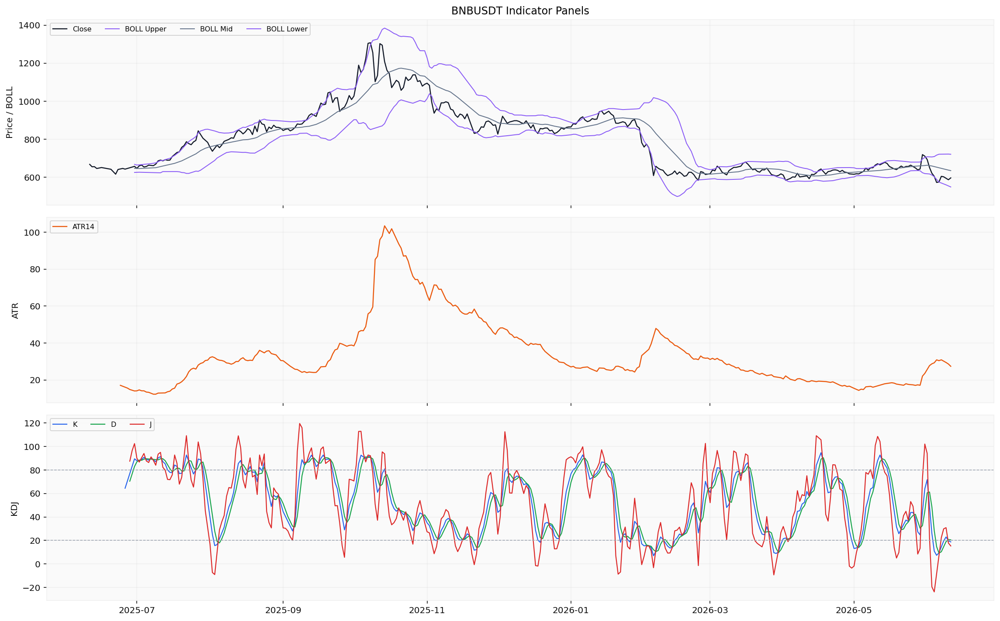
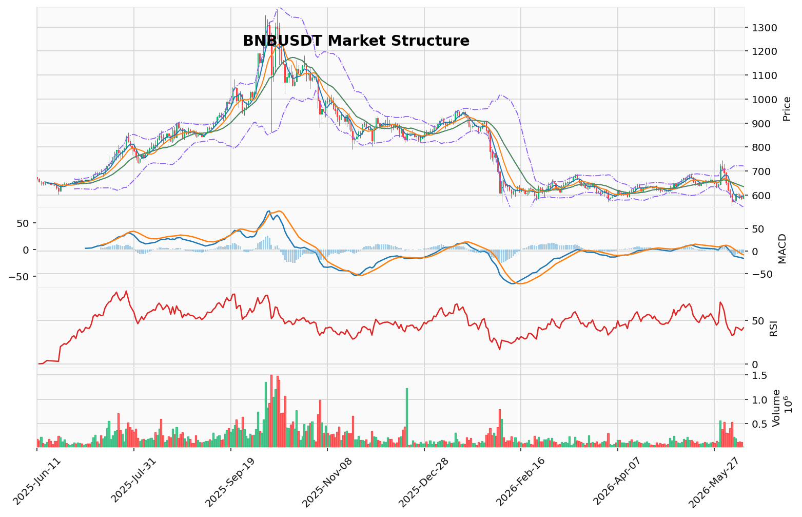

# BNB（BNB）加密资产投资研究报告

> 报告生成时间（美东）：2026-06-11 02:26:27 EDT
> 报告生成时间（北京）：2026-06-11 14:26:27 CST

## 一、投资结论与组合动作

**组合经理最终裁决：持有/观望**

- **明确立场**：不新开仓、不加杠杆、不触发卖出或减仓。未提供真实持仓与保证金参数，无法审计合约风险。
- **执行节奏**：立即生效，持续有效，直至至少两类关键数据恢复后重新评估。
- **主要风险**：价格结构风险（556.46为关键下破位）、数据缺口风险（资金费率、多空比、链上、新闻、社交数据大面积缺失）、流动性风险（24h成交量仅占市值约1.15%）、突发事件风险（无新闻数据，不能排除未预期事件）。
- **重新评估条件**：数据恢复后仅重新评估，当前不预设方向动作。需恢复的数据优先级为：链上数据（交易所净流量） > 资金费率/多空比 > BNB专属社交情绪样本。

**核心理由**：
1. 可验证技术面指向弱势（均线下方、MACD负值、RSI<50、成交量收缩），但单一维度不能作为方向性判断唯一依据。
2. 看涨反转信号（TD 13完成、CVD近期微弱转正、恐惧指数12.0）置信度低，未匹配成交量或动量验证，且存在数据局限。
3. 关键交叉验证维度大面积缺失：资金费率、多空比、链上数据、新闻事件、社交样本均未返回，无法构建多维度验证。当前处于“信息真空”状态，任何方向性偏见都是错误的。

## 二、市场结构与技术指标分析

### 技术图表

### 2.1 当前价格结构

截至 2026-06-11 日线收盘，BNB/USDT 报 **596.13 USDT**，24 小时涨幅 +1.738%，对应实时成交额约 **68,350,280.92 USDT**（24h 成交量 115,903.482 BNB）。当前价格处于日线级别下行趋势结构，运行于主要均线（MA5/10/20）下方，维加斯通道蓝带中线下方约 12.76%。近 5 个交易日价格从 556.46 低点反弹至 596.13，但整体仍受 MA5（596.48）压制，成交量呈收缩状态。

**趋势状态**：震荡下跌中的弱势整理，尚未确认趋势反转信号。

**核心限制**：
- 资金费率、多空比、链上数据等关键衍生品和链上维度空缺，无法判断持仓意愿和资金情绪
- 小时行情样本仅 43 根 K 线（2026-04-30 至 2026-06-11），不足以支撑日内微观结构判断

---

### 2.2 指标覆盖总表

| 指标 | 覆盖状态 |
|---|---|
| 布林带 | 可分析（日线通道数据已返回） |
| 维加斯通道 | 可分析（蓝带位置、EMA144/169 已返回） |
| 双线反转 | 可分析（EMA20/EMA50 结构已返回，置信度低） |
| AMD/SMC | 可分析（摆动结构、流动性池代理已返回） |
| 123 突破 | 可分析（三点结构状态、突破位已返回） |
| FVG | 可分析（18 个候选，3 个未回补，最近上方缺口已返回） |
| OB 订单块 | 可分析（近期无确认结构突破） |
| RSI | 可分析（RSI14 读数已返回） |
| MACD | 可分析（MACD、信号线、柱线已返回） |
| KD | 可分析（K/D/J 读数已返回） |
| TD 9/13 | 可分析（看涨反转 13 计数完成，置信度中等） |
| 谐波形态 | 可分析（未匹配有效候选） |
| 交易密集带/成交量分布 | 可分析（POC 和价值区间已返回，样本 160） |
| 清算地图 | 不适用（BNB 品种；当前为 BTC 专用口径） |
| CVD/主动买卖量 | 可分析（CVD 差值 -291,769,713.76 USD，365 行样本） |
| 资金费率 | 缺失/不可用（来源限流，数据粒度不匹配） |
| OI/多空比 | 部分可分析（OI 已返回 324,975,483.58 USD；多空比缺失） |
| 宏观 | 不可用（行情资料包不重复判断宏观） |
| 链上 | 缺失/不可用 |
| AHR999 | 缺失/不可用（该指标为 BTC 估值指数，BNB 不适用属正常） |

---

### 2.3 指标推导过程

#### OB 订单块

| 指标 | 数据 | 推导 | 交易作用 | 失效条件 |
|---|---|---|---|---|
| OB 订单块 | 近期没有确认的结构突破；候选订单块区间已计算但未返回具体价位 | 当前未触发订单块结构突破信号，价格仍处于订单块区间内部或附近 | 不能作为当前方向判断依据 | 需订单块结构突破确认或逐笔成交验证后重新评估 |

#### POC / 成交量分布

| 指标 | 数据 | 推导 | 交易作用 | 失效条件 |
|---|---|---|---|---|
| POC / 成交量分布 | POC 632.03375 USDT；价值区间 573.254167–707.6075 USDT；样本 160 根 | 当前价格 596.13 低于 POC（632.03），位于价值区间偏低位置（约 14% 分位） | 可作为价格相对价值区域位置的参考，POC 之上为高价值区 | 基于日线 OHLCV 近似分桶，非真实逐笔成交分布；样本数（160）偏低 |

#### TD Sequential

| 指标 | 数据 | 推导 | 交易作用 | 失效条件 |
|---|---|---|---|---|
| TD 9/13 | 方向：看涨反转；启动计数 1；倒数计数 13；信号：TD 看涨反转 13 计数完成；置信度：中等 | TD 看涨反转 13 已完成，提示日线级别下行动能可能衰竭，存在潜在反转窗口 | 可作为趋势衰竭的参考信号，增强对当前弱势整理可能结束的观察 | 需等待价格结构确认（如后续收盘价高于前计数柱最高价）；未匹配成交量或动量验证时失效 |

#### 谐波形态

| 指标 | 数据 | 推导 | 交易作用 | 失效条件 |
|---|---|---|---|---|
| 谐波形态 | 状态：未匹配到有效候选；形态：无信号；AB/XA=2.620，BC/AB=1.611，CD/BC=0.286 | 最近摆动比例未形成已知谐波形态（如蝙蝠、螃蟹、蝴蝶等） | 当前不能作为入场或反转依据 | 需价格继续延伸形成满足比例关系的完整形态后再评估 |

#### FVG（公允价值缺口）

| 指标 | 数据 | 推导 | 交易作用 | 失效条件 |
|---|---|---|---|---|
| FVG | 候选 18 个，未回补 3 个；最近上方缺口中线 599.945 USDT | 上方存在未回补的 FVG，中线位于 599.945，接近当前价格 | 可作为上方潜在技术参考区域；当前价格靠近该缺口 | 缺口是否回补取决于后续价格行为和成交量；不能作为必然到达目标 |

#### AMD/SMC 与 123 突破

| 指标 | 数据 | 推导 | 交易作用 | 失效条件 |
|---|---|---|---|---|
| AMD/SMC | 结构：高点下移、低点下移；阶段：下跌推进阶段；买侧流动性 610.54（2026-06-07），卖侧流动性 556.46（2026-06-05） | 当前处于下降趋势中的推进浪，近期低点 556.46 为卖侧流动性池参考 | 下跌结构持续，买侧流动性（610.54）为上方近期高点 | 需价格突破买侧流动性（610.54）或跌破卖侧流动性（556.46）才能确认结构变化 |
| 123 突破 | 状态：下破待确认；方向：看跌；突破位 556.46 | 三点结构已形成，若价格跌破 556.46（近期低点），下破确认，看跌趋势延续 | 556.46 为关键下破确认位 | 若价格未跌破 556.46 并反弹上破近期高点，则结构失效 |

#### Vegas / 布林带 / RSI / MACD / KD

| 指标 | 数据 | 推导 | 交易作用 | 失效条件 |
|---|---|---|---|---|
| 维加斯通道 | 位置：价格在蓝带下方；主趋势：未确认；EMA144=677.287，EMA169=689.419；距蓝带中线 -12.764% | 价格显著低于蓝带中线，长期趋势偏空；EMA144/169 形成压制 | 蓝带中线（约 683）为上方长期技术参考 | 需价格重新站上蓝带中线（EMA144/169 区间上方）才可能改变偏空主趋势判断 |
| 布林带 | 上轨 720.493，中轨 634.499，下轨 548.505；ATR14=27.393 | 价格 596.13 位于中轨下方，靠近中轨与下轨之间偏中轨一侧；布林带带宽较大 | 中轨（634.50）为上方参考，下轨（548.51）为下方参考 | 布林带不构成确定性支撑/压力；价格可能沿通道运行或突破 |
| RSI | RSI14=41.465 | 低于 50 中性线，处于弱势区域；未进入超卖（30 以下） | 偏空动量读数，当前无超卖反转信号 | 若 RSI 重新站上 50，则动量偏空格局减弱 |
| MACD | MACD=-16.467，信号线=-10.118，柱线=-6.349 | MACD 和信号线均负值，柱线负值但未大幅扩张；空头动能持续但近期未加速 | 空头趋势持续，但柱线稳定反映动能未急剧恶化 | 若 MACD 柱线转正或 MACD 上穿信号线，则空头动能减弱信号出现 |
| KD | K=27.182（中性），D=23.602（接近超卖），J=34.342 | KD 处于低位但未全部进入超卖（低于 20），J 值略高于 K/D | 处于低档区域，关注是否进入超卖区或形成金叉 | 若 KD 继续下行进入超卖区（K<20），超卖信号增强；若 K 上穿 D，短线上行动能 |

#### 清算地图 / CVD / 资金费率 / OI / 多空比

| 指标 | 数据 | 推导 | 交易作用 | 失效条件 |
|---|---|---|---|---|
| 清算地图 | 不适用（BNB；该指标为 BTC 专用口径） | 无法基于清算地图分析 BNB 的清算压力分布 | BNB 不适用本维度 | — |
| CVD/主动买卖量 | CVD 累计差值：-291,769,713.76 USD；365 行样本，覆盖 2025-06-11 至 2026-06-10 | 全年累计 CVD 为较大负值，反映统计区间内主动卖盘整体大于主动买盘 | 提示过去一年整体卖盘主导，与当前下行趋势一致 | 单日/近期 CVD 趋势比累计值更有参考意义；最新 3 日 CVD 分别为 -32,358,535.70（6/10）、-22,268,393.64（6/9）、+1,080,604.46（6/8），近期卖压减弱 |
| 资金费率 | 缺失/不可用（来源限流，数据粒度不匹配，未覆盖完整分析区间） | 无法判断永续合约市场多空情绪方向和费率极端程度 | 不能作为当前持仓成本或多空博弈依据 | 需资金费率数据源恢复 |
| OI/多空比 | 未平仓量：324,975,483.58 USD；多空比缺失/来源限流 | 单日 OI 绝对值可参考但无历史序列对比趋势；多空比缺失 | OI 单独无法判断持仓变化方向；无法分析多空分歧程度 | 多空比需数据源恢复；OI 历史序列需补充 |

#### 宏观 / 链上 / AHR999 / 事件

| 指标 | 数据 | 推导 | 交易作用 | 失效条件 |
|---|---|---|---|---|
| 宏观 | 行情资料包不重复判断宏观，需回看新闻/宏观资料包 | 当前市场资料包未提供宏观线索 | 行情分析层面无法纳入宏观因素 | 需宏观/新闻资料包提供 |
| 链上 | 缺失/不可用 | 无法分析大额转账、交易所净流量、持币地址变化等链上信号 | 不能作为当前链上结构判断依据 | 需链上数据源恢复 |
| AHR999 | 缺失/不可用（BTC 估值指数，BNB 不适用属于正常） | 不适用于 BNB 分析 | BNB 不适用本维度 | — |
| 事件 | 事件日历缺失/不可用 | 无法判断相关事件类型是否构成驱动 | 不能作为当前交易依据 | 需事件数据提供方恢复 |

---

### 2.4 多空场景

#### 偏多场景
当前无法构建可执行偏多场景。TD 13 看涨反转计数完成提供了潜在衰竭信号，但缺乏执行条件所需的多项资料：需恢复资金费率（判断多头持仓成本及情绪极端度）、多空比（判断多空分歧方向）、链上数据（判断大户动向和交易所净流量）以及宏观/事件材料（判断外部驱动因素）。近期 CVD 卖压减弱（6/8 正值转正），但不足以构成方向性条件。

#### 偏空场景
当前无法构建可执行偏空场景。价格位于维加斯通道蓝带下方、均线系统下方、MACD 负值、RSI 低于 50、AMD/SMC 显示下跌推进阶段，这些技术指标共同构成偏空的技术面背景，但均未由资料包明示为可执行交易条件。需补充资金费率（确认是否处于正常偏空或极端偏空水平）、多空比（确认空头拥挤度）、123 突破结构确认（价格跌破 556.46 方可确认下破）、订单簿聚合深度（判断下行过程中的潜在承接）后方可构建可执行偏空方案。

#### 观望场景
当前弱势整理结构下不宜追空（价格已从 556.46 低点反弹约 7%，且 TD 13 看涨反转信号可能指示下行衰竭），也不宜追多（主要均线压制明显，MACD 仍为负值，趋势未反转）。以下缺口压低结论置信度：资金费率、多空比、链上数据、宏观事件材料均缺失，无法从多维度交叉验证当前市场情绪和资金意图；小时行情样本仅 43 根，未覆盖完整分析区间，无法进行精细的日内结构判断。建议等待至少上述部分数据恢复后再评估方向性机会。

---

### 2.5 关键价格与风险参考位

| 参考类型 | 价位（USDT） | 说明 |
|---|---|---|
| **支撑区间** | | |
| 近期低点（关键下破位） | 556.46 | 123 突破看跌确认位 |
| 布林带下轨 | 548.51 | 技术参考支撑（非确定性） |
| 成交量分布价值区间下沿 | 573.25 | 参考位 |
| **压力区间** | | |
| MA5 | 596.48 | 当前价格已接近但未站上 |
| MA10 | 600.50 | 上方第一压力参考 |
| 上方未回补 FVG 中线 | 599.95 | 未回补缺口 |
| 买侧流动性池/近期高点 | 610.54 | 上方结构压力 |
| **技术参考位** | | |
| POC/成交量控制点 | 632.03 | 价值区间中轴参考 |
| 布林带中轨 | 634.50 | 技术参考压力 |
| 维加斯通道蓝带中线 | ~683 | 长期趋势压制参考 |
| 布林带上轨 | 720.49 | 上方极端参考位 |

---

### 2.6 数据限制与待确认条件

**主要数据缺口**：
1. **资金费率**：来源限流且数据粒度不匹配，未覆盖完整分析区间——当前最大的衍生品缺口，无法评估永续合约市场的多空情绪方向和持仓成本极端程度
2. **多空比**：仓库无可用记录且来源限流——无法判断多空拥挤度
3. **主动买卖量明细**：仓库无可用记录，当前 CVD 累计差值由衍生品数据行（365 行）提供，但缺乏 taker buy/sell 明细
4. **订单簿聚合深度**：来源限流——无法判断当前盘口的买盘/卖盘堆积强度
5. **链上数据**（交易所净流入等）：仓库未形成可用记录——无法分析链上大额资金动向
6. **小时行情样本限制**：仅 43 行，覆盖 2026-04-30 至 2026-06-11，未覆盖完整分析区间
7. **宏观/新闻**：行情资料包不负责此类数据，需通过新闻资料包补充

**待恢复的数据类别**（恢复后方可构建完整方向性评估）：
- 资金费率时间序列
- 多空比历史序列
- 链上大额交易/交易所净流量
- 宏观事件日历
- 订单簿聚合深度

## 三、项目与代币基本面分析

### 3.1 资料可用性与核心限制

基本面资料包仅返回 2026-06-11 单日快照，分析区间（2025-06-11 至 2026-06-11）内其他日期的全部基本面数据均未形成可引用的数据集。具体缺口包括：

| 缺失维度 | 缺失原因 | 基本面影响 |
|---------|---------|-----------|
| 供给与发行数据 | 数据粒度不匹配、来源限流，仓库未形成完整记录 | 无法评估代币稀释压力、解锁节奏或供应结构合理性 |
| 链上使用与生态数据 | 接口凭证缺失（Glassnode）、数据粒度不匹配 | 无法评估网络活跃度、用户参与度、交易笔数或链上流动性 |
| DeFi/协议经营数据 | 接口调用失败（HTTP 400）、凭证缺失（Token Terminal） | 无法评估 BNB Chain 生态 TVL、协议收入、费用捕获能力 |
| 机构资金与 ETF 数据 | 标记为不适用或无数据返回 | 无法评估机构资金参与度和外部资金流向 |
| 相对估值指标 | 仅市值单点，无 FDV、TVL 等对比口径 | 无法构建基本面估值框架或历史位置判断 |

### 3.2 已返回快照数据

| 数据项 | 数值 | 单位 | 说明 |
|-------|------|------|------|
| 价格 | 595.95 | USD | 2026-06-11 当日快照 |
| 市值 | 约 800.34 | 亿美元 | 当日末市值 |
| 24h 成交量 | 约 9238.08 | 万美元 | 当日成交额 |
| 成交量/市值比 | 约 1.15% | — | 反映短期流动性水平，属偏低区间 |

该快照为单点静态读数，不反映区间趋势、动能或深度特征。成交量/市值比偏低与市场技术面成交量收缩状态一致，但该比率本身不能作为估值高低的判断依据。

### 3.3 无法判断的核心基本面维度

| 维度 | 当前状态 | 若数据恢复后对判断的影响 |
|------|---------|------------------------|
| 代币供给与稀释压力 | 不可判断 | 解锁节奏与供应上限是评估长期稀释风险的核心；当前无法评估是否存在未来发行压力 |
| 链上使用强度 | 不可判断 | 活跃地址、交易笔数、链上流动性是衡量网络实际需求的核心指标 |
| DeFi 生态经营状况 | 不可判断 | TVL、协议收入、费用捕获能力反映 BNB Chain 生态的价值创造效率 |
| 机构资金参与度 | 不可判断 | ETF 资金流、大额持仓变化是外部资金流向的重要代理变量 |
| 相对估值框架 | 不可判断 | 仅有市值/价格单点，无法构建 FDV/链上活动比、市值/TVL 等加密专属估值口径 |

### 3.4 数据限制下的投资含义

- **基本面无法支撑方向性判断**：当前基本面资料包的覆盖严重不足，无法得出买入、持有或卖出的基本面依据。所有方向性结论均依赖技术面与市场结构维度（详见第二节）。
- **单日快照不宜外推**：595.95 美元的价格和 800 亿美元市值为静态读数，不反映该区间的价格波动、趋势动能或市场深度特征。不能将其作为价值中枢或趋势方向的参考。
- **缺口本身不是利好或利空**：供给、链上、生态经营数据的缺失，既不能解读为“没有稀释压力”，也不能解读为“生态活动萎缩”。该方向缺少上游数据验证，只能降低置信度，不能作为方向性依据。
- **恢复数据后的重评方向**：若后续基本面资料包恢复供给与发行数据、链上使用数据、DeFi 经营数据中的至少两类，可重新评估代币稀释风险、网络需求强度及相对估值水平。当前不预设方向动作。

## 四、新闻、监管与事件驱动

**新闻资料包状态与关键限制**

新闻资料包已返回部分数据，但存在关键缺口：未返回任何官方公告、监管文件、交易所公告或已读取原文的可靠媒体正文。项目新闻（11条记录，覆盖2025-07-16至2026-06-10）与宏观新闻（70条记录，覆盖2025-12-31至2026-06-08）的全部来源均为“媒体聚合搜索线索”或“公开搜索线索”，且分析区间起始段（2025-06-11至2025-07-15、2025-06-11至2025-12-30）未覆盖。

**已验证来源**

无。当前资料包不具有可被正式引用的新闻事件来源。

**待核验线索概况**

资料包中的媒体聚合搜索线索提示存在多个方向的主题线索，但标题实体、机构名、法案名、产品名、政策名和具体事件名称未经官方或监管来源验证，不能作为已确认事实写入报告。可概括为：监管、机构资金、宏观或行业搜索线索待核验。

**短中期影响判断**

由于缺乏任何已验证的官方或监管新闻来源，无法对BNB的价格与市场情绪做出基于新闻事件的利好、利空或中性判断。影响周期、方向与证据强度均无法确定。

**项目基本面与投资逻辑影响**

缺少已验证的官方公告、监管文件、交易所公告或可靠媒体报道，无法判断当前分析区间内是否存在影响BNB需求、供给、监管风险、安全假设、生态扩张、流动性或叙事层面的具体事件。新闻维度当前无法形成有效判断。

**资料包数据缺口对组合动作的具体约束**

1. **无法评估外部事件风险**：在缺失已验证新闻来源的情况下，无法判断监管动向（如交易所运营许可、代币定性）、生态更新（如BNB Chain升级、销毁机制调整）、机构合作或安全事件等可能对价格产生重大影响的外部驱动因素。这些领域当前均为“无法判断”状态。
2. **不能排除未预期事件**：缺乏新闻事件数据，意味着不能排除未预期的事件（如币安生态更新、监管变化）引发价格剧烈波动。该不确定性已被组合经理纳入“风险等级：中”的评估。
3. **无法构建多维度交叉验证**：技术面弱势与看涨反转信号均缺乏新闻事件层面的外部驱动验证。在新闻维度恢复前，技术面分析的置信度无法通过该维度提升。

**数据缺口对组合动作的影响**

新闻维度的大面积缺失直接支持组合经理“持有/观望”的决策——在无法评估外部事件风险的情况下，任何方向性建仓或减仓动作均不具备充分依据。若后续新闻资料包恢复，重点需关注：官方公告（币安/BNB Chain官方渠道）、监管文件（SEC/CFTC等监管机构）、交易所公告（上市/下架、运营调整）以及已读取原文的可靠媒体报道。上述数据恢复后，需重新评估当前组合动作是否仍然成立。

## 五、社区情绪、事件预期与交易拥挤度

### 5.1 市场级情绪读数

截至 2026-06-11，可引用的标准化市场级情绪指标——Alternative.me 恐惧与贪婪指数——读数为 **12.0**，处于 **“极端恐惧”（Extreme Fear）** 区间。该指数覆盖整体加密市场情绪，是目前该维度唯一可引用的数据来源。

| 指标 | 数据 | 推导 | 对组合动作的影响 | 失效/待确认条件 |
|------|------|------|-------------------|----------------|
| 恐惧与贪婪指数 | 12.0（极端恐惧） | 市场级指标，非 BNB 专属；极端读数可反映整体市场情绪极端化 | 极端读数本身不能作为方向性交易依据；可增强对“技术弱势是否为筑底阶段”的观察需求，但不改变“持有/观望”的动作 | 需 BNB 专属社交样本验证个币情绪是否与市场级一致；缺少统计或回测证据支撑该读数与反转概率的关联 |
| BNB 专属社交样本 | 缺失/不可用（LunarCrush 接口凭证缺失，多平台来源尝试失败） | 无法判断 BNB 社区讨论热度、情绪方向（乐观/中性/悲观/恐慌/分歧）、关注度走势 | 无法将市场级情绪映射至 BNB 个币；不能作为当前情绪判断依据 | 需恢复 LunarCrush 或同类平台数据；社交样本恢复后可重新评估 |

### 5.2 社区讨论热度与情绪方向

- **社交平台样本状态**：舆情资料包仓库显示多平台接口存在仓库缺失或凭证不可用状态，未返回任何真实社交平台的发帖样本、主要叙事关键词或传播链路数据。Twitter/X、Reddit、Telegram、Discord 等主流平台均无真实样本返回。
- **影响**：当前无法判断 BNB 专属的社区讨论热度变化趋势、情绪方向以及关注度走势。恐惧与贪婪指数（12.0）仅反映市场级整体情绪，不能直接等同于 BNB 社群层面的具体情绪分布。

### 5.3 主要叙事与传播路径

- **来源缺口**：相关市场叙事缺少真实平台样本支持。资料包的来源尝试记录显示多平台接口不可用，未返回任何真实社交平台的发帖样本、主要叙事关键词或传播链路数据。
- **影响**：无法判断当前市场上围绕 BNB 的主要叙事方向、传播渠道或参与者变化。

### 5.4 参与者结构

- **状态**：参与者结构无法覆盖。缺少来自 Twitter/X、Telegram、Discord、Reddit、中文社区及交易所社群的真实样本。
- **影响**：无法区分不同语言社区或参与者类型的情绪差异。

### 5.5 情绪对短期市场反应的潜在影响

- **现状**：短期情绪影响无法判断。当前仅有市场级极端恐惧读数，缺少 BNB 专属的社交聚合指标、事件预期材料或平台样本。
- **限制**：极端恐惧读数本身不具备统计或回测证据支撑具体交易判断。该方向缺少统计或回测证据，亦缺少可引用样本，不能作为当前交易依据。

### 5.6 情绪失真风险

- **状态**：失真风险无法量化。资料包未返回刷量、机器人活动、选择性报道或语言社区隔离等相关证据，无法识别具体的失真来源。

### 5.7 数据限制与待恢复条件

| 数据类别 | 当前状态 | 对分析的影响 |
|----------|---------|--------------|
| 社交平台样本（BNB 专属） | 缺失/不可用 | 无法判断 BNB 个币情绪方向、讨论热度、叙事焦点 |
| 市场级情绪（恐惧与贪婪指数） | 已返回（12.0） | 仅可作市场级参考，不能替代 BNB 专属情绪判断 |
| 事件预期盘口/日历 | 缺失/不可用 | 无法判断事件是否构成驱动因素或预期差 |
| 真实社交平台发帖样本 | 缺失/不可用 | 无法识别叙事传播路径、参与者结构或失真来源 |

**跟踪条件**：

1. **BNB 专属社交情绪样本恢复**：若后续 LunarCrush 或同类平台数据恢复，可重新评估 BNB 社区情绪是否与市场级（12.0/极端恐惧）一致，以及是否存在情绪极端化后的潜在反转观察条件。
2. **事件预期数据恢复**：若事件日历或预期盘口数据可用，可判断是否存在即将到来的催化因素（如生态更新、交易所公告等）及其对情绪和价格的影响。
3. **社交平台样本数量与质量验证**：若真实平台样本返回，需评估样本量是否足以代表整体社区情绪，以及是否存在刷量或机器人活动的失真风险。

### 5.8 对组合动作的支持与约束

- **支持**：当前市场级极端恐惧（12.0）与技术面弱势结构形成共振，强化了“不预设方向性偏见、等待数据恢复”的必要性——在情绪极端化但个币维度验证缺失时，市场级读数不足以构成方向性交易依据。
- **约束**：恐惧指数 12.0 本身不能作为“筹码转移”或“情绪触底”的假设证据。缺少 BNB 专属社交样本，意味着该维度对组合动作无方向性影响；组合经理的“持有/观望”立场在此维度上得到中性确认——既不能因此看涨，也不能因此看跌。
- **待验证条件**：若 BNB 专属情绪样本恢复后显示社区持续极端恐惧（如与市场级一致且伴随交易所净流出证据），可纳入“潜在偏多观察场景”的参考，但在验证前仍视为数据缺口。

## 六、交易计划与组合风险

### 6.1 组合经理最终动作：持有/观望

**当前可执行指令：**
- 不新开仓（禁止新建任何方向性头寸）
- 不加杠杆
- 不触发卖出或减仓
- 等待至少两类关键数据恢复后重新评估

**未提供真实持仓与保证金参数，无法审计合约风险。**

### 6.2 动作依据与证据链

**支持“不行动”的核心证据（可验证）：**
1. **技术面结构性弱势**：价格运行于MA5（596.48）下方、MACD负值（-16.467）、RSI低于50（41.47）、AMD/SMC显示下跌推进阶段、维加斯通道蓝带下方约12.76%、成交量收缩（24h成交量仅占市值约1.15%）。
2. **看涨反转信号缺乏确认**：TD 13看涨反转计数完成，但置信度标为中等，且未匹配成交量或动量验证；CVD近期微弱转正（6/8为+108万美元）后连续两日转负，属于噪音级别波动；恐惧指数12.0为市场级指标，非BNB专属，无BNB社群样本验证。
3. **关键交叉验证维度大面积缺失**：资金费率、多空比、链上数据（交易所净流量、大额转账等）、BNB专属社交情绪样本、新闻事件均未返回数据，无法构建多维度交叉验证。

**缺口限制对动作的影响：**
- 资金费率与多空比缺失：无法判断永续合约市场多空持仓成本、情绪极端度及拥挤度方向。
- 链上数据缺失：无法分析大户动向、交易所净流入/流出，无法验证“卖压枯竭”或“买盘涌现”假设。
- 社交样本缺失：无法验证BNB专属社群情绪是否与市场级极端恐惧一致，或是否处于“绝望式沉默”状态。
- 新闻事件缺失：无法判断外部驱动因素（生态更新、监管变化等）是否构成方向性影响。

### 6.3 风险分析师辩论摘要与裁决

组合经理对三位风险分析师（激进/安全/中性）的论点进行了以下裁决：

| 分析师角色 | 核心论点 | 上游验证状态 | 组合经理裁决 |
|---|---|---|---|
| **激进分析师** | TD 13看涨反转完成 + CVD卖压边际改善 + 极端恐惧12.0 = 潜在反转场景被低估 | TD 13置信度中等，未匹配成交量验证；CVD近期波动属噪音级别；恐惧指数非BNB专属 | 将低置信度信号过度推演为高置信度证据，在数据缺口下属于过度推演；**不采纳** |
| **安全分析师** | 技术面结构性弱势已验证 + 看涨核心论据依赖缺失数据 + 反弹质量存疑（成交量收缩）= 弱势整理而非底部反转 | 技术面弱势可验证；看涨信号缺乏确认；反弹质量质疑成立 | 风控纪律正确，但将“无法否定看空证据”等同于“看空证据最可信”，存在悲观偏见；**部分采纳风控原则，不采纳方向性偏见** |
| **中性分析师** | 三人最终在“不新开仓、不加杠杆”上一致；当前处于“信息真空”，任何方向性偏见都是错误的；等待关键数据恢复后重评 | 逻辑完整，数据驱动 | **最优推理框架**；承认不确定性，不预设方向，机械执行“不行动”指令是数据缺口下的唯一可持续路径 |

**裁决结果**：组合经理采纳中性分析师的推理框架——持有/观望，不预设方向性偏见。激进分析师的“反转论”因缺乏验证不被采纳；安全分析师的悲观偏见被修正，仅保留其风控纪律。

### 6.4 仓位与工具选择

| 维度 | 当前处理 | 证据与限制 |
|---|---|---|
| 现货持仓（如有） | 持有观望，不触发买入或卖出 | 未提供真实持仓参数，无法审计仓位比例；技术面弱势作为观察因素，不作为减仓依据 |
| 新建多头 | 禁止新建任何方向性头寸 | 看涨反转信号缺乏确认（TD 13中等置信度、CVD噪音级、恐惧指数非BNB专属）；关键交叉验证数据大面积缺失 |
| 杠杆操作 | 禁止（衍生品维度数据不足） | 资金费率、多空比缺失，无法评估清算风险和持仓成本 |
| 合约策略 | 不适用 | 未提供真实持仓与保证金参数，无法审计合约风险 |

### 6.5 当前技术参考位（非交易条件）

以下价位来自市场报告的计算数据，仅作为技术参考位，不得作为入场、退出、止损、目标或失效条件：

| 参考类型 | 价位（USDT） | 说明 |
|---|---|---|
| 近期低点（关键下破位） | 556.46 | 123突破看跌确认位；若跌破，下行延续 |
| 布林带下轨 | 548.51 | 技术参考支撑 |
| 成交量分布价值区间下沿 | 573.25 | 参考位 |
| MA5（当前价格附近） | 596.48 | 价格已接近但未站上 |
| MA10 | 600.50 | 上方第一压力参考 |
| 上方FVG中线 | 599.95 | 未回补缺口 |
| 买侧流动性池/近期高点 | 610.54 | 上方结构压力 |
| POC/成交量控制点 | 632.03 | 价值区间中轴参考 |
| 布林带中轨 | 634.50 | 技术参考压力 |
| 维加斯通道蓝带中线 | ~683 | 长期趋势压制参考 |

### 6.6 数据恢复后的重评条件（非执行条件）

| 需要恢复的数据类别 | 对判断的影响 |
|---|---|
| 资金费率时间序列 | 验证多空持仓成本和情绪极端度；若持续为负，增强偏空判断；若转正且持续，预示情绪拐点 |
| 多空比历史数据 | 验证拥挤度方向；若极度偏向空头，注意反向踩踏风险 |
| 链上大额交易/交易所净流量 | 验证大户动向；若出现大规模交易所流出，偏多信号增强 |
| BNB专属社交情绪样本 | 验证BNB社群恐惧/贪婪程度，判断是否与市场级情绪一致 |
| 新闻事件（官方公告/监管文件） | 判断外部驱动因素（生态更新、监管风险等） |

**数据恢复后的重评条件**（仅作重新评估参考，不得作为执行条件）：
- **偏多信号恢复**：若资金费率转正且持续 + 多空比偏向多头 + 链上出现连续大额交易所净流出 + BNB专属情绪从极端恐惧回升，需重新评估偏空判断。
- **偏空信号增强**：若跌破556.46 + CVD负值扩大 + 资金费率持续为负，偏空判断增强。
- **数据持续缺失**：维持观望/持有，不新开仓。

**数据恢复后的重评**：只能写“重新评估”。不得提前预告或设计任何未来开仓、减仓、对冲、期权、收益押注、具体执行价位或方向性动作安排。

### 6.7 风险等级与主要风险来源

**当前风险等级：中**

| 风险类型 | 具体描述 |
|---|---|
| **价格结构风险** | 下行趋势明确（AMD/SMC下跌推进），556.46为关键下破位；若跌破，下行延续至548.51甚至更低 |
| **数据缺口风险** | 资金费率、多空比、链上数据、新闻事件、社交样本大面积缺失，所有方向性判断均为条件化，置信度低 |
| **流动性风险** | 24h成交量仅占市值约1.15%，可能放大价格波动幅度 |
| **突发事件风险** | 无新闻事件数据，不能排除未预期的事件（如币安生态更新、监管变化、安全事件）引发价格剧烈波动 |

### 6.8 置信度评估

**当前置信度：低**

| 信心来源 | 说明 |
|---|---|
| 技术面结构性弱势已确认（可验证） | 单一维度，不能作为方向性判断唯一依据 |
| 看涨反转信号缺乏确认 | TD 13置信度中等，CVD波动属噪音级别，恐惧指数非BNB专属 |
| 关键数据大面积缺失 | 资金费率、多空比、链上数据、新闻事件、社交样本均未返回，无法从多维度交叉验证 |

## 七、关键分歧与跟踪条件

### 7.1 多空核心分歧与裁决

组合经理在综合考虑上游所有可验证材料后，对以下三类分析师论点的采纳与驳斥做出最终裁决，并统一为“持有/观望、不新开仓、不加杠杆”的单一可执行动作。

| 分歧维度 | 看涨方核心论点（未采纳） | 看跌方核心论点（未完全采纳） | 中性方平衡框架（采纳） | 组合经理裁决 |
|---------|------------------------|---------------------------|-----------------------|-------------|
| **TD 13 反转信号** | TD 看涨反转13完成，置信度中等，提示日线级别下行动能可能衰竭，为潜在反转前兆 | 未匹配成交量或动量验证，在成交量收缩环境下，衰竭更大概率是下跌中继，不是反转 | 衰竭信号本身有参考价值，但缺乏交叉验证，不能作为方向性依据 | 不采纳看涨方将其提升为“高置信度反转证据”；该方向性解释未由资料包验证，只能作为待验证条件 |
| **CVD 近期转正** | 6/8为+108万美元，随后两日负值收窄，属卖压边际改善，可能预示买盘启动 | 年累计CVD仍为-2.91亿美元，三日局部波动属噪音级别，更符合“抛售暂停”而非“买入启动” | 关注边际变化是对的，但在大累计负值背景下，短期波动不足以改变方向性判断 | 不采纳看涨方将其推演为趋势转折；该方向性解释未由资料包验证 |
| **恐惧指数12.0** | 极端恐惧可能预示筹码从弱手向强手转移，是潜在反转前奏 | 市场级指标，非BNB专属，无BNB社群样本验证；极端恐惧也可能是恐慌性抛售起点 | 极端读数有观察价值，但缺少BNB个币情绪样本验证，不能作为买入条件 | 不采纳看涨方将其作为空头情绪已定价的证据；该方向性解释未由资料包验证 |
| **技术面弱势权重** | 价格贴近MA5（596.48），距离仅0.06%，是测试压制线而非弱势延续 | 价格未站上均线，成交量收缩，CVD累计负值，均为弱势整理典型特征 | 可验证技术面确实指向弱势，但单一维度不能作为确定性方向判断 | 不采纳看跌方将“无法否定看空证据”等同于“看空证据最可信”；保留技术面弱势为可验证但单一的参考 |

### 7.2 组合经理采纳与放弃的理由

**采纳（中性分析师框架）**：
- 在当前“信息真空”状态下，承认不确定性、不预设方向、机械执行“不行动”指令，是数据缺口下的唯一可持续路径
- 可验证技术面弱点是单一维度，关键交叉验证数据（资金费率、多空比、链上、新闻、社交样本）大面积缺失，无法构建多维度判断
- 看涨反转信号（TD 13、CVD边际改善、恐惧指数）均缺乏确认，且方向性解释未由资料包验证

**放弃（激进分析师论点）**：
- 将低置信度信号（TD 13置信度中等、CVD噪音级波动、市场级恐惧指数）强行提升为高置信度反转证据，在数据缺口下属于过度推演
- 以“潜在可能性”挑战“已验证的结构性弱势”，违反“数据缺口不能作为方向性判断依据”原则

**放弃（安全分析师悲观偏见）**：
- 将“无法否定看空证据”等同于“看空证据最可信”，建立了带有方向性偏见的防御模型
- 对看涨信号（TD 13、CVD边际改善）完全定性为噪音或蓄力，未给予任何合理权重，存在确认偏误
- 其“主动防御”本质上是防御性的做空思维，可能错失反弹机会

### 7.3 跟踪条件与数据恢复后的重评边界

以下条件为后续需要持续验证的数据类别，**不预设任何方向性动作**。数据恢复后只能写“重新评估”，不得提前预告或设计任何未来开仓、减仓、对冲、期权、收益押注、具体执行价位或方向性动作安排。

| 需要恢复的数据类别 | 对判断的影响 | 恢复后的评估逻辑 |
|------------------|-------------|----------------|
| 资金费率时间序列 | 验证永续合约市场多空持仓成本和情绪极端度 | 该方向性解释未由资料包验证，只能作为待验证条件；若持续为负，增强偏空背景；若转正且持续，为多空情绪变化提示 |
| 多空比历史数据 | 验证多空拥挤度方向 | 同上；若极度偏向空头，注意反向踩踏风险；若极度偏向多头，则拥挤度偏高风险 |
| 链上大额交易/交易所净流量 | 验证大户动向（机构/鲸鱼） | 同上；若出现连续大额交易所净流出，偏多信号增强；若持续净流入，偏空背景增强 |
| BNB专属社交情绪样本 | 验证BNB社群恐惧/贪婪程度，判断是否与市场级情绪一致 | 同上；无BNB专属数据前，恐惧指数12.0不能作为BNB个币情绪代理 |
| 新闻事件（官方公告/监管文件） | 判断外部驱动因素（生态更新、监管风险等） | 同上；目前无已验证来源，无法评估事件风险 |
| 宏观/事件材料 | 补充宏观背景和行业事件参考 | 行情资料包不包含此维度，需新闻资料包补充 |
| 小时行情补充数据（更长周期K线） | 支持日内摆动结构和微观价格行为分析 | 当前仅43根样本，未覆盖完整分析区间 |
| 订单簿聚合深度 | 判断当前盘口买盘/卖盘堆积强度 | 来源限流，无法判断承接或抛压强度 |

### 7.4 数据持续缺失时的动作约束

- **未提供真实持仓与保证金参数**：无法审计合约风险，不得涉及合约去杠杆、转为现金、补保证金或任何合约处理方式
- **未恢复核心数据**：维持持有/观望，不新开仓、不加杠杆、不触发卖出或减仓；等待对应数据恢复后按上述逻辑重新评估
- **图表资产缺失**：已在市场结构章节保留指标数值和推导过程，不依赖具体图片路径验证判断
- **供给与发行材料缺失**：当前快照显示流通市值与总市值关系无法判断未来稀释或发行节奏；不能将缺口外推为无发行压力

## 八、最终结论

## 一、组合经理最终动作：持有/观望

- **不新开仓、不加杠杆、不触发卖出或减仓。**
- 未提供真实持仓与保证金参数，无法审计合约风险；现有持仓（如有）保持不动。

## 二、核心证据链

1. **可验证技术面一致指向弱势整理**：价格运行于MA5（596.48）下方，MACD负值（-16.467），RSI低于50（41.47），维加斯通道蓝带下方约12.76%，AMD/SMC显示下跌推进阶段，成交量收缩（24h成交量仅占市值约1.15%）。这些信号可验证且未出现方向性反转确认。

2. **看涨反转信号缺乏确认**：TD 13看涨反转计数已完成（置信度中等），但未匹配成交量或动量验证；CVD近期微弱正转（6/8为+108万美元）后连续两日转负，属噪音级波动；市场级恐惧指数12.0非BNB专属，无BNB社群情绪样本验证。上述信号均不能作为方向性条件使用。

3. **关键交叉验证维度大面积缺失**：资金费率、多空比、链上数据（大额交易/交易所净流量）、新闻事件、BNB专属社交样本均未返回，无法构建多维度交叉验证。当前可用的技术面单一维度不能作为方向性判断唯一依据。

## 三、最关键的重新评估数据类别

需优先恢复以下至少两类数据后，方能重新评估方向性判断：
- 资金费率时间序列（验证多空持仓成本和情绪极端度）
- 多空比历史数据（验证拥挤度方向）
- 链上大额交易/交易所净流量（验证大户动向）
- BNB专属社交情绪样本（验证社群恐惧/贪婪程度）
- 新闻事件（官方公告/监管文件，判断外部驱动因素）

## 四、下一步最需要跟踪的三类数据

1. **衍生品维度**：资金费率（是否转正或持续为负）、多空比（偏向方向及极端程度）——这两项直接决定多空持仓意愿和潜在踩踏方向。
2. **链上维度**：交易所净流量（是否为大规模净流出/流入）、CVD趋势（负值是否持续收窄或扩大）——验证买盘/卖盘的真实推动力量。
3. **新闻与事件维度**：官方公告（币安生态更新、监管动态）、宏观线索——判断外部驱动是否构成方向性催化。

在当前数据缺口未补之前，持有/观望、不预设方向性偏见是唯一可持续的投资路径。等待上述至少两类数据恢复后，组合将重新评估，当前不预设立场或未来交易安排。
