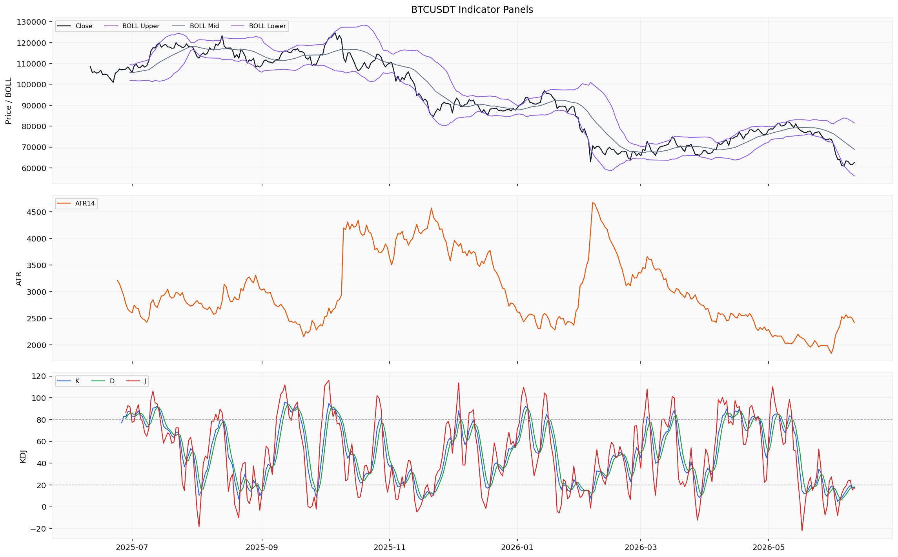
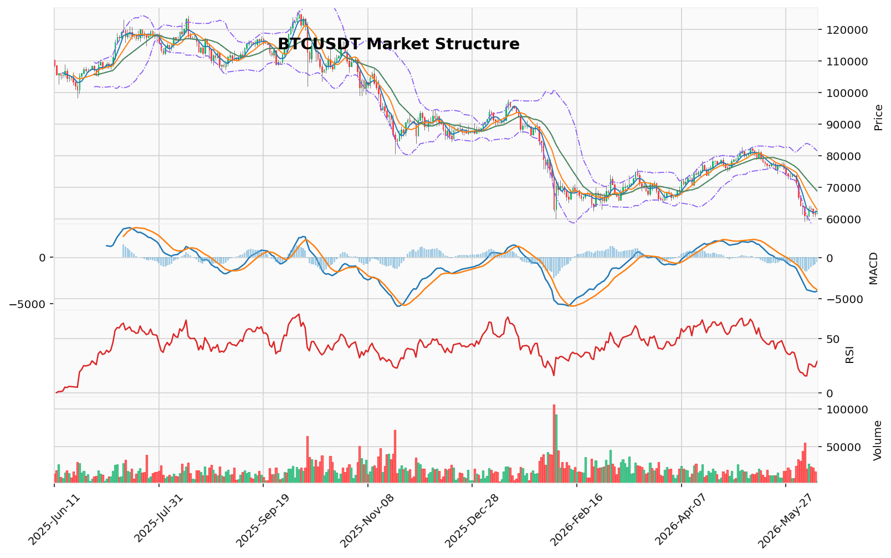

# Bitcoin（BTC）加密资产投资研究报告

> 报告生成时间（美东）：2026-06-11 02:11:46 EDT
> 报告生成时间（北京）：2026-06-11 14:11:46 CST

## 一、投资结论与组合动作

**组合经理最终动作：持有/观望**

**执行细则：**
- **当前价位（约 62,610 USDT）**：不新增买入、不新开多仓、不加杠杆。
- **已持有现货**：保持现有仓位不变，不进行加仓或减仓操作。
- **未持有现货**：维持观望，不触发任何买入动作。
- **禁止动作**：不得新开空仓、不得使用合约、不得基于技术衰竭信号抄底。

**入场触发：** 无。当前不满足任何建仓条件。

**目标区间：** 无法确定。具体执行价位需等待行情与技术资料恢复后确认。

**失效位：** 结构失效位为 74,289.60 USDT（123 突破位），但此价位距离过远，无法作为短期交易参考。

**仓位建议：** 上游材料未提供真实持仓参数，无法给出具体仓位数字。禁止新开仓。

**工具选择：** 仅建议现货。不建议使用合约。未提供真实合约持仓、保证金模式和保证金参数，无法审计合约风险。

**最大风险边界：** 无法审计。上游材料未提供真实持仓与保证金参数，无法进行合约风险管理。当前最佳风控策略：不新开仓、不加杠杆、维持观望。

**核心逻辑：** 当前市场呈现"已确认的看跌结构"与"已出现的看涨衰竭信号"之间的冲突，且关键衍生品数据（资金费率、多空比、清算地图）缺失，使得任何方向性决策都缺乏完整的持仓拥挤度验证。组合经理采纳中性分析师的"观察性等待"策略——承认信息不对称带来的高不确定性，放弃任何方向性的赌博，执行条件化的等待。看跌证据链（AMD/SMC 下跌推进、123 突破确认、ETF 持续净流出、CVD 主动卖盘累积）的可验证性高于看涨证据链（TD13 计数、RSI 超卖、恐惧指数极度恐惧），但看涨信号的存在意味着"看跌结构"并非绝对稳固，做空亦存在轧空风险。因此，唯一合理的行动就是不行动。

**待数据恢复后的重评条件：**
1. **资金费率**恢复后：若为正（空头支付多头），则看跌结构可执行性增强；若为负（多头支付空头），需警惕轧空风险。
2. **多空比**恢复后：若显著偏多，则看跌结构可执行性增强；若显著偏空（空头拥挤），需警惕轧空。
3. **清算地图**恢复后：确认真实的清算簇分布与关键价格位。
4. **交易所净流量/余额**恢复后：补充链上资金流向判断。
5. **AHR999 历史序列**恢复后：评估长期估值是否达到历史极端水平。
6. **ETF 资金流量的连续性**：是否维持日均 1 亿美元以上净流出，或出现转向流入。
7. **社区情绪拐点**：极度恐惧（12）是否进一步恶化或开始反弹。

## 二、市场结构与技术指标分析

### 技术图表

当前 BTC 处于中期下行趋势结构。日线价格位于 MA20（68828.10）之下，MACD 柱线为负值（-546.33），RSI 14 为 28.92（低于 30 的常规超卖区），KD 的 K 值为 26.67（中性区）、D 值为 20.90（接近超卖阈值）。维加斯通道显示价格在蓝带下方约 18.84%，EMA144/EMA169 尚未确认主趋势。AMD/SMC 结构为高点下移、低点下移，处于下跌推进阶段，123 突破已确认看跌方向（突破位 74289.6）。但趋势结论受资金费率、多空比、清算簇和 AHR999 缺失的限制，无法确认当前动量是否伴随持仓拥挤度释放或估值极端信号，不能将下行结构等同于趋势延续必然性。

以下按指标类别逐项展开分析，每类指标按“数据 -> 推导 -> 交易作用 -> 待确认条件”说明。

### 订单块（OB）

| 指标 | 数据 | 推导 | 交易作用 | 待确认条件 |
|------|------|------|----------|------------|
| OB 订单块 | 近期没有确认的结构突破；候选订单块区间已输出 | 当前 OB 未形成方向性突破信号，价格在订单块区间内波动 | 不能作为方向性支撑或压力依据 | 需要资料包补充成交确认数据或结构突破更新 |

### 成交量分布（POC / 价值区间）

| 指标 | 数据 | 推导 | 交易作用 | 待确认条件 |
|------|------|------|----------|------------|
| POC | 68021.11 USDT（基于 160 个样本的 OHLCV 近似分桶） | POC 位于当前价格（62610.0）上方约 5411 点 | 可作为成交量密集区的技术参考 | 样本数有限（160），分桶方法为近似计算 |
| 价值区间 | 65596.51 - 80144.10 USDT | 当前价格低于价值区间下沿，处于价值区间下方 | 显示当前价格处于低成交量区域，偏离近期交易密集区 | 样本数有限，价值区间边界可能随时间漂移 |

### TD Sequential

| 指标 | 数据 | 推导 | 交易作用 | 待确认条件 |
|------|------|------|----------|------------|
| TD 9/13 | 方向：看涨反转；启动计数 1；倒数计数 13；13 计数完成；置信度中等 | TD 看涨反转 13 计数完成，表明当前下跌摆动已进入潜在衰竭阶段 | 在当前下跌趋势中提示可能的反转窗口，但不构成确定性见底信号 | 中等置信度，且不配合资金费率和清算数据时信号可靠性降低 |

### 谐波形态

| 指标 | 数据 | 推导 | 交易作用 | 待确认条件 |
|------|------|------|----------|------------|
| 谐波形态 | 未匹配到有效候选；AB/XA=1.469，BC/AB=2.404，CD/BC=0.381 | 最近摆动比例未通过谐波形态筛选标准，无有效谐波信号 | 当前无法基于谐波结构建立交易条件 | 需要新的价格摆动形成后重新筛选 |

### FVG（公允价值缺口）

| 指标 | 数据 | 推导 | 交易作用 | 待确认条件 |
|------|------|------|----------|------------|
| FVG | 21 个候选，5 个未回补；最近上方缺口中线 65478.66 USDT | 上方存在未回补的 FVG 缺口（中线 65478.66），表明该区域存在潜在的价格吸引区 | 可作为技术参考，但不应作为必然回补目标 | 需要更多成交量或订单流数据确认缺口有效性 |

### AMD/SMC 与 123 突破

| 指标 | 数据 | 推导 | 交易作用 | 待确认条件 |
|------|------|------|----------|------------|
| AMD/SMC | 高点下移、低点下移；下跌推进阶段；买侧流动性 64234.68（2026-06-07 高点），卖侧流动性 59130.91（2026-06-05 低点） | 当前处于标准下跌推进结构，两侧流动性池均已标记 | 买侧流动性（64234.68）和卖侧流动性（59130.91）可作为短期技术参考区间 | 缺乏逐笔订单流确认，流动性池可能已被扫取或偏移 |
| 123 突破 | 下破已确认，方向看跌，突破位 74289.6 | 价格已确认跌破三点结构的突破位（74289.6），维持偏空摆动结构 | 突破位（74289.6）确认当前处于偏空结构 | 若价格重新站稳突破位上方，则结构失效 |

### 维加斯通道 / 布林带 / RSI / MACD / KD

| 指标 | 数据 | 推导 | 交易作用 | 待确认条件 |
|------|------|------|----------|------------|
| 维加斯通道 | 价格在蓝带下方 18.84%；EMA144=76402.72，EMA169=77874.35 | 价格远离蓝带中线，主趋势尚未确认 | 表明中期趋势结构偏弱 | 若价格回升至蓝带区间则需重新评估 |
| 布林带 | 上轨 81517.65，中轨 68828.10，下轨 56138.55 | 价格 62608.09 位于中轨与下轨之间偏下位置 | 显示价格处于布林带下半区，下轨（56138.55）为下方技术参考 | 布林带宽度会随波动率变化 |
| RSI | RSI 14 = 28.92 | 低于 30 的常规超卖区，动量偏弱 | 当前处于动量弱势区域，但超卖不一定立即反转 | 超卖状态可延续，需配合结构确认 |
| MACD | MACD=-4067.28，信号=-3520.95，柱线=-546.33 | MACD 在零轴下方运行，柱线为负值，空头动能持续 | 确认当前动能方向偏空 | 柱线若收窄需关注动能衰减信号 |
| KD | K=26.67（中性），D=20.90（接近超卖），J=38.22 | K 值在中性区，D 值接近 20 超卖阈值但未跌破 | 摆动指标未进入极端超卖，下行仍有空间 | D 值若跌破 20 则进入超卖区 |

### 清算地图 / CVD / 资金费率 / OI / 多空比

| 指标 | 数据 | 推导 | 交易作用 | 待确认条件 |
|------|------|------|----------|------------|
| 清算地图 | 缺失/不可用（BTC 专用口径） | 无法评估清算簇价格分布和规模 | 不能作为清算驱动的支撑/压力参考 | 需清算数据源恢复；来源限流和粒度不匹配 |
| CVD | 截至 2026-06-09 的 CVD 值为 -6871886495.55 USD（累计 CVD 代理值） | CVD 为较大负值，显示该周期内主动卖量累积超过主动买量 | 可作为主动买卖力量差的参考 | 来源限流，缺少多空比和资金费率交叉验证 |
| 资金费率 | 缺失/不可用（粒度不匹配、来源限流、未覆盖完整区间） | 无法评估永续合约市场情绪是否过热或正常 | 不能作为持仓拥挤度判断依据 | 需资金费率数据源恢复 |
| OI | 未平仓量 6285730218.04 USD（单位已明示：USD） | 有当日 OI 绝对值，但缺少历史分位和方向细分 | 仅有持仓规模数据，无法判断多空倾向 | 多空比缺失，无法判断方向性持仓集中度 |
| 多空比 | 缺失/不可用（来源限流、仓库无记录） | 无法评估多空持仓方向分布 | 不能作为多空力量对比判断依据 | 需多空比数据源恢复 |

### 宏观 / 链上 / AHR999 / 事件

| 指标 | 数据 | 推导 | 交易作用 | 待确认条件 |
|------|------|------|----------|------------|
| 宏观 | 行情资料包说明宏观由新闻资料包负责，本包不重复判断 | 宏观路径缺失属于跨包分工设计 | 当前交易不能基于宏观面评估 | 需查阅新闻/宏观资料包 |
| 链上 | 7 天大额转账记录（2026-06-05 至 2026-06-11）；每日转账金额在 1043 万至 3083 万美元之间（USD 口径） | 链上大额转账活跃，样本期间日均约 1918 万美元 | 显示链上大额资金在活跃移动，但样本仅 7 天，不能推导流入/流出方向 | 缺少交易所净流量、余额变化等补充指标 |
| AHR999 | 缺失/不可用 | 无法评估 BTC 长期估值指数 | 不能作为定投或估值极端判断依据 | 需 AHR999 数据源恢复 |
| 事件 | 事件日历缺失/不可用 | 无法判断相关事件类型是否构成驱动 | 不能作为当前交易依据 | 需事件数据提供方恢复 |

**小结**：技术面各指标一致指向偏空结构，但衍生品（资金费率、多空比、清算地图）和估值（AHR999）的缺失，使当前分析缺少持仓拥挤度、方向性资金情绪和极端估值定价的交叉验证。链上仅有大额转账数据，缺少交易所净流量和余额字段。事件和宏观路径依赖于新闻资料包，本包内不展开。

## 三、项目与代币基本面分析

本节整合基本面资料包返回的有限数据，评估 Bitcoin 在当前价位（62,608.09 USD）的经营、供给与资金流向含义。由于协议收入、费用、DeFi 锁仓量等核心经营接口凭证缺失，链上日频指标（活跃地址、链上转移量）的完整序列因同一凭证缺失而不可用，当前基本面分析严重受限，所有结论仅基于已返回的有限快照。

### 3.1 价格与市值

截至 2026-06-11，BTC 市值约 1.2547 万亿美元，24h 成交量约 55.3 亿美元。近五日价格运行区间为 60,866—63,244 USD，与当日收盘 62,608.09 USD 基本重合。市值与成交量数据为单点快照，无法推导趋势方向或估值区间。

### 3.2 供应与稀释

| 指标 | 数据 | 推导 | 投资含义 | 待验证条件 |
|------|------|------|----------|------------|
| 流通供应量 | 20,040,441 BTC（截至 2026-06-10） | 当前快照显示流通量与总供应量（20,041,200 BTC）基本接近 | 当前快照显示的供应差值极小，但**供给与发行材料不足**，无法判断未来稀释或发行节奏 | 需恢复矿工发行、解锁及销毁历史序列 |
| 总供应量 | 20,041,200 BTC（2026-06-11） | 结构与流通量基本一致 | 同流通供应量：不能确认供应接近上限或存在未来解锁压力 | 同流通供应量 |
| 完全稀释估值 | 约 1.2546 万亿美元 | 与市值接近，差值由流通量与总供应量微小差额决定 | 当前快照未显示结构性估值偏离，但缺乏时序数据支撑 | 同流通供应量 |

### 3.3 ETF 资金流

| 指标 | 数据 | 推导 | 投资含义 | 待验证条件 |
|------|------|------|----------|------------|
| ETF 净流量（6月4日） | +320 万美元（小幅净流入） | 单日净流入，但随后转为流出 | 在连续流出背景下，该单日流入量级极小，不改变短期方向 | 恢复连续时序以确认趋势拐点 |
| ETF 净流量（6月5日） | -3.257 亿美元 | 大额净流出，创近期单日流出高点 | 强化机构资金持续撤离的判断 | 同上 |
| ETF 净流量（6月8日） | -9,140 万美元 | 连续流出 | 维持看跌资金面信号 | 同上 |
| ETF 净流量（6月9日） | -7,740 万美元 | 连续流出 | 资金流出节奏虽略有放缓，但未转向 | 同上 |
| ETF 净流量（6月10日） | -2.139 亿美元 | 流出规模回升至 2 亿美元以上 | 表明机构资金撤离仍在加速 | 同上 |

ETF 资金流是当前唯一可验证的机构级资金动向数据。最近 5 个交易日中有 4 日净流出超过 7,000 万美元，累计净流出约 6.86 亿美元。该数据覆盖了 2025-06-11 至 2026-06-10 共 253 个交易日，但**未覆盖完整分析区间**，因此近端趋势的延续性仍需后续数据确认。

### 3.4 链上与估值指标

| 指标 | 数据 | 推导 | 投资含义 | 待验证条件 |
|------|------|------|----------|------------|
| AHR999 指数/无量纲读数 | 0.3036（2026-06-11） | 单日读数，该方向缺少统计或回测证据 | 不能作为估值极端判断依据 | 需恢复 AHR999 历史序列与分位 |
| 现货交易所净流量 | -981 万美元（净流出）（2026-06-11） | 单日净流出，该方向缺少统计或回测证据 | 不能据此判断抛压或买入行为 | 需恢复交易所净流量日频序列 |
| 链上大额转账 | 7 天记录（2026-06-05 至 2026-06-11）；日均约 1,918 万美元 | 大额资金在链上移动 | 显示链上存在活跃资金，但不能推导流入/流出方向 | 缺少交易所净流量、余额变化补充 |
| DeFi 锁仓量 | 单行记录但无可用数值 | 接口凭证缺失，无可引用材料 | 无法评估 BTC 在 DeFi 生态中的链上使用与价值捕获 | 需恢复 Token Terminal 凭证 |

### 3.5 资料缺口总结

- **经营数据完全缺失**：协议收入、费用、DeFi 锁仓量因接口凭证缺失不可用。无法评估 BTC 网络层面的价值捕获能力与经济活性。
- **链上使用数据严重不足**：仅 7 天大额转账记录，缺少活跃地址数、链上转移量、矿工经济等标准链上指标。
- **估值数据仅有一日快照**：AHR999 缺乏历史分位和统计回测，不能形成估值框架。
- **机构资金数据有限**：ETF 资金流覆盖了大部分区间但未完整覆盖，缺少其他机构持仓数据（如公开信托、企业持有）。
- **供给与发行材料不足**：无法判断未来稀释、发行节奏或供应是否接近上限。

### 3.6 基本面信号对组合动作的约束

- **唯一可验证的负面信号**：ETF 持续净流出构成机构级资金撤离的客观证据，与市场结构中的看跌趋势一致。
- **可验证的正面信号缺失**：协议收入、费用、DeFi 使用率、供给缩减等基本面看涨维度的上游数据均不可用。
- **估值维度无法判断**：AHR999 单日读数与缺乏历史序列，使长期估值极端程度无法评估。
- **当前动作约束**：基本面维度不支持任何方向性建仓动作。ETF 流出信号强化了看跌结构，但缺乏供给与链上使用数据来形成完整的估值判断，因此仅能作为对持有/观望动作的额外约束，而非主动卖出依据。

**基本面章节确认**：在协议收入、链上使用、供给发行数据恢复之前，基本面维度无法独立支持买入或卖出的方向性判断，只能作为对组合经理“持有/观望”建议的附加验证——即已出现的机构资金撤离信号与看跌技术结构方向一致，但尚不足以构成独立的卖出触发条件。

## 四、新闻、监管与事件驱动

**新闻资料状态与来源可靠性**

新闻资料包已返回部分可用数据，但**来源可靠性受严重限制**。项目新闻覆盖时间范围为2025-06-26至2026-05-23（共35条记录），宏观新闻覆盖2025-12-03至2026-06-08（共70条记录），整体均未覆盖完整分析区间（2025-06-11至2026-06-11），存在前后两端的数据缺口。资料包内所有条目均为**媒体聚合搜索线索与公开搜索线索来源**，未返回任何官方公告、监管文件、交易所公告或已读取原文的可靠媒体正文，因此**无法确认任何具体新闻事件的真实性、时间节点或影响方向**。

**已验证来源：无。**

**待核验线索与方向**

资料包中存在的媒体/搜索线索提示存在多个待核验主题方向，涵盖项目生态动态、行业基础设施变化、监管讨论、机构资金动向及宏观经济关联议题。但这些线索**未经官方、监管或可靠原文交叉验证**，不能作为已确认新闻事实写入正文。相关事件类型（货币政策方向、通胀预期、监管合规进展、机构配置动态、交易所政策变迁）**缺少已验证新闻来源**。若可靠来源恢复并验证方向性事件，需要重新评估宏观背景对BTC价格逻辑的影响。

**对投资逻辑的影响评估**

- **无法基于现有资料做出方向性判断**：无可靠新闻事件可供分析利好、利空或中性影响。新闻缺失不能被解释为"没有负面消息"或"存在潜在利好"。
- **对项目基本面与投资逻辑的潜在影响无法判断**：无可靠事件源，无法判断当前基本面是受需求侧、供给端、监管风险、安全假设、生态扩张、流动性还是单纯叙事驱动。
- **影响周期（日内、1-5天、数周或中长期）在当前资料状态下无法评估**。

**数据限制与对组合动作的约束**

由于新闻、监管与事件驱动维度完全缺乏可验证来源，**该维度无法对当前组合动作形成支持或约束作用**。所有事件预期、机构配置变化或宏观路径影响均无法纳入交易决策依据。在后续数据恢复前，事件面分析及相应风控动作处于不可执行状态。

**后续恢复需求**：如要完成完整事件面分析，建议补充覆盖全分析区间的官方公告源、监管机构原始来源、交易所公告及已确认原文的可靠媒体内容。若可靠来源恢复并验证方向性事件，需要重新评估并可能改变当前组合判断。

## 五、社区情绪、事件预期与交易拥挤度

**一、市场级情绪读数**

截至 2026 年 6 月 11 日，Alternative.me 恐惧与贪婪指数报 **12 分**，处于 **极度恐惧（Extreme Fear）** 区间。该指数为市场级综合情绪采样结果，覆盖全市场投资者情绪整体偏向悲观。该读数属于已返回的可验证事实，但不区分具体社交平台或社区来源，也不包含历史趋势序列。

**二、情绪方向与讨论热度**

当前唯一可用的情绪读数指向极度恐惧，表明在资料包可覆盖的采样范围内，BTC 相关讨论主体的情绪方向以悲观为主。但由于缺少社交平台原生样本（帖文数量、互动量、情感分布等细颗粒数据），**无法判断社区讨论热度的涨跌趋势**——是关注度下降还是恐慌放大，亦无法区分情绪是持续恶化还是短期极端波动。

**三、叙事内容与传播路径**

舆情资料包未返回具体叙事内容、传播渠道或讨论关键词。当前主导叙事（如监管动态、宏观政策、机构持仓变化等）及其传播路径**无法判断**。缺少真实平台样本或关键词聚合数据支持。

**四、参与者结构**

由于 LunarCrush 接口凭证缺失，社交主导度、帖文量、互动数、社区讨论关键词等聚合指标无法获取。参与者类型（零售散户、机构投资者、矿工群体、长期持有者等）及其语言社区差异**均无法区分**。

**五、情绪对短期市场反应的潜在影响**

极度恐惧情绪在历史语境中常被观察为潜在情绪底部的信号，但该方向缺少统计或回测证据支持。由于缺乏真实平台样本、社交媒体叙事层数据以及链上行为验证，短期情绪对 1-5 天价格走势的驱动方向**无法判断**。投资者应意识到，极度恐惧可能伴随价格继续下跌，不宜将其视为确定性反转信号。

**六、情绪失真风险**

失真风险无法量化。资料包未返回社交媒体刷量、情绪操纵、算法误判或样本偏差等失真相关证据，无法对当前情绪读数的可靠性做出定量评估。

**七、交易拥挤度判断**

当前无法基于社区情绪数据判断交易拥挤度。关键衍生品指标（资金费率、多空比）缺失，使得多头/空头持仓的拥挤程度无法评估。恐惧指数 12 的极度恐惧读数可能提示情绪已相对悲观，但缺乏持仓方向分布数据，不能据此确认空头是否过度集中或多头已出清。交易拥挤度维度当前属于**空白状态**，需等待资金费率和多空比数据恢复后补充。

**八、数据限制与跟踪方向**

- **来源覆盖不足**：舆情资料包仅返回恐惧与贪婪指数一项市场级情绪数据，缺乏社交媒体原生样本（X、Reddit、Telegram、Discord 等平台的帖文数据、互动指标和情感采样）。
- **叙事与参与者数据缺失**：LunarCrush 接口凭证缺失，社交主导度、帖文量、互动数等聚合指标无法获取。
- **时间截面有限**：恐惧与贪婪指数仅返回 2026-06-11 单日读数，缺乏分析区间内的趋势序列数据，无法评估情绪变化轨迹。
- **无法输出完整的社区情绪画像**：因真实平台样本缺失，本报告无法就社区讨论热度方向、主要叙事、参与者结构及短期价格影响做出有足够证据支撑的判断。
- **后续跟踪数据类别**：需要优先恢复资金费率（判断持仓方向成本）、多空比（判断方向性持仓分布）、社交媒体采样数据（判断叙事扩散与情绪变化轨迹）。上述数据恢复后，需对社区情绪与交易拥挤度进行重新评估。

## 六、交易计划与组合风险

### 核心动作：持有/观望

在当前价位（约 62,610 USDT），**不新增买入、不新开多仓、不加杠杆**。若已持有现货，建议保持现有仓位不变；若未持有现货，则维持观望，不触发买入动作。该建议的置信度为中等，主要受制于衍生品、链上及新闻数据的多重缺口。

### 动作依据与限制

1.  **已确认的看跌证据**：价格处于已验证的 AMD/SMC 下跌推进结构（高点下移、低点下移），123 突破（突破位 74,289.60）已确认看跌方向；ETF 持续净流出（6 月 10 日单日 2.139 亿美元）；CVD 累计值为 -68.7 亿美元，显示主动卖盘持续主导；未平仓量 OI 约 62.8 亿美元，处于高位，构成潜在清算风险积累。该证据链的可验证性较高。

2.  **已确认的看涨信号**：TD 13 计数完成（中等置信度），RSI 14 报 28.92（低于常规超卖区），恐惧与贪婪指数报 12（极度恐惧）。但上述信号的胜率和反转概率未提供统计或回测证据，属于中等置信度的观察信号，不能作为建仓依据。该方向缺少上游数据验证。

3.  **关键数据缺口对动作的约束**：
    - **资金费率/多空比缺失**：无法评估空头拥挤度，无法区分当前下跌是趋势延续还是已进入空头过度拥挤的潜在反转阶段。该方向缺少上游数据验证。
    - **清算地图缺失**：无法识别清算驱动的关键价格位，无法确认下方是否存在大规模多头清算簇或流动性地带。该方向缺少上游数据验证。
    - **交易所净流量/余额缺失**：无法补充链上资金流向判断，仅有的 7 天大额转账数据不能推导流入/流出方向。
    - **AHR999 历史序列缺失**：仅有的单日读数 0.3036 不能作为估值极端判断依据，也无法评估长期估值分位。
    - **新闻/宏观数据缺失**：无法评估事件驱动因素对市场的影响。

由于上述关键缺口的存在，看涨证据链的可信度被严重削弱，而看跌证据链虽清晰，同样缺乏衍生品数据的交叉验证。因此，任何方向性的主动操作（买入、加仓或做空）都缺乏完整、可执行的依据。

### 未提供真实持仓参数时的约束

**未提供真实持仓与保证金参数，无法审计合约风险**。因此，本报告不给出任何合约操作建议（包括降低杠杆、补保证金、调整保证金模式等），也不假设用户已有任何资产头寸状态或仓位比例。唯一可行的风控策略即为：不新开仓、不加杠杆、维持观望，等待数据恢复后重新评估。

### 需等待恢复的数据类别与重评方向

| 数据类别 | 恢复后对评估的作用 | 当前状态 |
|----------|-------------------|----------|
| 资金费率 | 判断空头拥挤度；正费率（空头支付多头）增强看跌可执行性，负费率（多头支付空头）提示轧空风险 | 缺失/不可用 |
| 多空比 | 验证持仓方向分布是否已极端化；显著偏多助跌，显著偏空需警惕反转 | 缺失/不可用 |
| 清算地图 | 识别关键清算订单簇位置，确认真实的支撑与压力位 | 缺失/不可用 |
| 交易所净流量/余额 | 补充链上资金流向判断，区分资金是流入还是流出交易所 | 缺失/不可用 |
| AHR999 历史序列 | 评估长期估值是否达到历史极端水平，辅助判断定投或估值区间 | 缺失/不可用 |
| 新闻/宏观数据 | 评估事件驱动因素（监管、机构配置、宏观政策等）对供需逻辑的影响 | 缺失/不可用 |
| ETF 资金流连续性 | 确认机构资金外流趋势是否持续（日均 1 亿美元以上）或出现转向 | 部分可用（近端趋势可见） |
| 社区情绪拐点 | 极度恐惧（12）是否进一步恶化或开始反弹，辅助判断情绪极端程度 | 单点读数可用 |

### 分歧说明

- **激进风险分析师的观点**（建立小规模现货多仓，止损设于 59,100 下方，目标 FVG 缺口 65,478）：**不采纳**。该方案将技术衰竭信号（TD13、RSI 超卖、极度恐惧）直接等同于结构反转，并将数据缺口错误包装为有利条件。在缺乏资金费率、多空比和清算地图验证空头拥挤度的情况下，该方向性解释未由资料包验证，只能作为待验证条件。其预设的止损位在无清算地图确认前仅为技术参考位，存在被流动性扫穿的风险，并非确定性的“亏损有限”边界。
- **安全风险分析师的观点**（完全否定所有看涨信号，仅以 ETF 流出和 CVD 负值作为决策锚点）：**部分采纳**。其对资本保有的优先排序和“当现实与指标冲突时先相信现实”的原则是正确的，但完全忽视 TD13、RSI 超卖和极度恐惧等已返回的客观信号，可能导致过度保守而错失数据恢复后的行动窗口。该方向性解释未由资料包验证，只能作为待验证条件。
- **中性风险分析师的观点**（承认信息不对称，执行“观察性等待”，为数据恢复后的行动做准备）：**完全采纳**。该逻辑最严谨地平衡了多空双方的可验证证据与数据缺口，将“等待”定义为积极的、有条件的，既不追多也不追空，为后续重评保留了灵活性。

## 七、关键分歧与跟踪条件

当前分析的核心分歧在于“已确认的看跌结构”与“已出现的看涨衰竭信号”之间的冲突，以及“关键衍生品数据缺失”对任何方向性决策的制约。组合经理已采纳中性分析师的整合逻辑，即“在信息冲突且数据缺口巨大的环境下，任何方向性头寸都是基于不完整信息的猜测”，因此最终执行“持有/观望”动作。

### 7.1 多空核心分歧

| 分歧维度 | 看涨观点（激进分析师/看涨研究员） | 看跌观点（安全分析师/看跌研究员） | 组合经理裁决 |
|----------|-------------------------------|-------------------------------|-------------|
| TD 13计数与RSI超卖 | TD13看涨反转计数完成，RSI 28.92进入超卖区，构成潜在底部衰竭信号 | TD13为中等置信度，在强趋势中可连续计数；RSI超卖可持续数周，不等于见底 | 不采纳。衰竭信号在缺乏资金费率/多空比验证空头拥挤度之前，不能等同于反转信号 |
| 数据缺口（资金费率、多空比、清算地图） | 数据缺口本身就是信息：需要大量现货力量才能突破，反而构成左侧布局机会 | 数据缺口是盲区，不是机会。无法评估多空拥挤度与清算风险，任何方向性头寸都是赌博 | 不采纳激进度。数据缺失只能说明无法评估，不能单向推导为有利条件 |
| ETF持续净流出 | 流出是“旧闻”已被市场消化；卖压耗尽后反弹空间巨大 | 持续大规模流出是正在发生的机构资本外逃，是最优先级的已验证风险信号 | 部分采纳安全分析师观点。ETF流出是已确认的看跌事实，不能反向解读为“潜在利好” |
| CVD极端负值 | 巨大的主动卖盘累积意味着卖压可能接近耗尽 | 要扭转-68.7亿美元的负累积需要前所未有的主动买盘，目前未发生 | 部分采纳安全分析师观点。CVD负值是已确认的卖方主导格局，但单点读数不能推导卖方必然衰竭 |
| AHR999读数0.3036 | 深度熊市估值水平，与极度恐惧共振，构成潜在底部区域 | 缺少统计或回测证据支持确定性结论，不能作为估值依据 | 不采纳。单日读数无历史分位验证，不能作为看涨依据 |
| 极度恐惧（恐惧指数12） | 与TD13、RSI超卖共振，是短期底部区域特征 | 极度恐惧后可能持续，且意味着市场新增买盘枯竭 | 不采纳。该方向缺少上游数据验证，不能作为方向性依据 |

### 7.2 组合经理采纳与放弃的观点

**采纳的核心逻辑：**

1. **已确认的看跌证据链可验证性更高**：AMD/SMC下跌推进结构、123突破确认（突破位74289.6）、MACD空头动能、ETF持续净流出（6月10日单日2.139亿美元）、CVD累计值-68.7亿美元（卖方主导）——这些是已被价格和资金流向验证的事实，不是预测。
2. **看涨衰竭信号（TD13、RSI超卖、恐惧指数12）不能克服看跌结构**：该方向缺少统计或回测证据支持其反转确定性，且缺乏资金费率/多空比验证空头拥挤度。将“潜在衰竭阶段”包装成“高赔率博弈点”混淆了可能性与概率。
3. **数据缺口制约任何方向性决策**：资金费率、多空比、清算地图缺失，使多空力量对比完全无法判断。做空无法确认下方清算引爆点，做多无法确认上方买盘承压能力。最审慎的行动是“不行动”。

**放弃的观点（含相应理由）：**

- **激进分析师的“小仓位试多”方案**：该方向性解释未由资料包验证。其支撑逻辑（衰竭+恐惧+高赔率）在衍生品数据不完整的情况下无法成立。止损位59130在没有清算地图确认时只是技术参考，而非确定性风险边界，一旦流动性被扫可能瞬间击穿预设风险控制。
- **安全分析师的“完全排他性卖出/清仓”立场**：该立场完全否定了已存在的看涨衰竭信号（TD13计数、RSI超卖、恐惧指数12），忽略了在这些信号下“踏空”或“在底部区域因过度恐惧而不敢行动”的风险。该方向缺少上游数据验证。
- **看涨研究员关于“FVG缺口为引力区”和“TD13是潜在变盘信号”的延伸推论**：这些方向性解释未由资料包验证，缺乏资金费率/多空比和清算地图的交叉确认，只能作为待验证条件。
- **看跌研究员关于“高OI必然触发清算多米诺骨牌”的叙事**：该方向性解释未由资料包验证。缺乏清算地图确认具体清算簇位置和规模，高OI本身只是潜在不稳定因素，不能推导为必然的清算连锁反应。

### 7.3 后续需要跟踪的验证条件

以下数据类别恢复后，需进行重新评估。数据恢复前，维持“持有/观望、不新增买入、不新开多仓、不加杠杆”的当前组合动作。

| 待恢复数据 | 预期作用 | 数据恢复后的重评方向 |
|-----------|---------|-------------------|
| 资金费率 | 判断空头拥挤度。若为正（空头支付多头），则看跌结构可执行性增强；若为负（多头支付空头），则需警惕轧空风险 | 为空头拥挤度评估提供方向性依据，待数据恢复后重新评估持仓拥挤度 |
| 多空比 | 验证持仓方向分布是否已极端化。若显著偏多（多头拥挤），则看跌风险加大；若显著偏空（空头拥挤），则需警惕反转 | 为多空力量对比提供方向性判断依据，待数据恢复后重新评估 |
| 清算地图 | 识别关键清算订单簇价格分布与规模，确认真实的支撑与压力区域 | 为清算驱动风险提供可审计的阈值判断，待数据恢复后重新评估 |
| 交易所净流量/余额 | 补充链上资金流向判断，判断抛压或积累趋势 | 为链上资金流向提供方向性验证，待数据恢复后重新评估 |
| AHR999历史序列 | 结合当前0.3036读数，评估长期估值是否进入历史极端区域 | 为估值极端程度提供统计背景，待数据恢复后重新评估 |
| 新闻/宏观数据（官方公告或可靠来源） | 评估事件驱动因素对需求、供给、流动性和监管风险的影响 | 若可靠来源恢复并验证方向性事件，需要重新评估宏观背景对价格逻辑的影响 |
| 小时行情完整样本 | 补充短周期结构分析，支撑日内交易级别结构判断 | 为短周期结构确认提供数据基础，待数据恢复后重新评估 |

### 7.4 数据缺口对当前判断的制约说明

- **资金费率/多空比缺失**：无法评估空头拥挤度。这是区分“衰竭停顿”和“趋势反转”的核心证据。该方向缺少上游数据验证，不能作为方向性依据。
- **清算地图缺失**：无法识别清算驱动的关键价格，无法确认技术参考位（如59130）是否具有实际风险边界意义。该方向缺少上游数据验证。
- **交易所净流量/余额缺失**：仅有7天大额转账数据，无法判断链上资金流向方向。该方向缺少上游数据验证。
- **AHR999历史序列缺失**：单日读数0.3036缺乏历史分位和统计回测支持，不能作为估值极端判断依据。该方向缺少上游数据验证。
- **新闻/宏观数据缺失**：所有条目均为搜索线索，未返回官方公告或可靠媒体正文。无法评估外部事件风险。该方向缺少上游数据验证。
- **小时行情样本不足**：仅43行覆盖（2026-04-30起），日内结构分析置信度受样本量限制。

这些缺口使当前看涨证据链可信度被严重削弱，看跌证据链虽清晰但同样缺乏衍生品数据交叉验证。因此，在当前信息环境下，任何方向性的主动操作（买入或卖出/做空）都缺乏完整、可执行的依据。当前最佳风控策略是维持“持有/观望、不新开仓、不加杠杆、等待数据恢复后重新评估”。

## 八、最终结论

**组合经理最终动作：持有/观望**

当前价位（约 62610 USDT）不新增买入、不新开多仓、不加杠杆。若已持有现货，建议保持现有仓位不变；若未持有现货，则维持观望，不触发买入动作。

**动作成立的 2-3 条核心证据：**

1. **已确认的看跌结构完整性**：AMD/SMC 下跌推进（高点下移、低点下移）、123 突破确认看跌方向（突破位 74289.6）、MACD 空头动能延续，三者构成可验证的偏空技术面事实。这是已被价格验证的结构，而非预测。
2. **机构级资金外流与主动卖盘累积**：ETF 在最近多个交易日持续大规模净流出（6 月 10 日单日 2.139 亿美元），是本分析中唯一可验证的机构动向。CVD 累计值为 -68.7 亿美元，揭示整个分析周期内卖方持续主导，要扭转这一负值需要前所未有的主动买盘潮。
3. **关键衍生品与估值数据缺失制约方向性决策**：资金费率、多空比、清算地图、AHR999 历史序列均不可用，无法评估持仓拥挤度、空头是否过度集中、清算驱动的关键价格位置及长期估值极端程度。这些缺口使看涨衰竭信号（TD13 计数、RSI 超卖、恐惧指数 12）无法获得交叉验证，看跌结构同样缺乏衍生品数据支撑以执行做空操作。

**最关键的重新评估数据类别：**

当以下数据恢复后，将重新评估当前持有/观望立场：（1）资金费率与多空比，用于判断空头拥挤度与方向性持仓分布；（2）清算地图，用于识别清算簇真实分布与关键支撑/压力区间；（3）ETF 资金流量的连续性，是否维持日均 1 亿美元以上净流出或出现转向流入。

**下一步最需要跟踪的 3 类数据：**

第一，资金费率序列——若恢复后显示为正（空头支付多头），看跌结构可执行性增强，但仍需多空比交叉验证；若显示为负（多头支付空头），则需警惕轧空风险。第二，清算地图——确认下方关键清算簇位置，若近期低点 59130.91 附近存在大规模多头清算订单簇，则价格可能被扫穿后加速下行；上方若积聚空方清算压力，则为反弹提供潜在动力。第三，AHR999 历史序列——结合当前单日读数 0.3036，判断长期估值是否进入历史极端区间，为方向性决策补充长线维度证据。在上述数据恢复前，维持当前持有/观望动作，不预设任何方向性交易安排。
