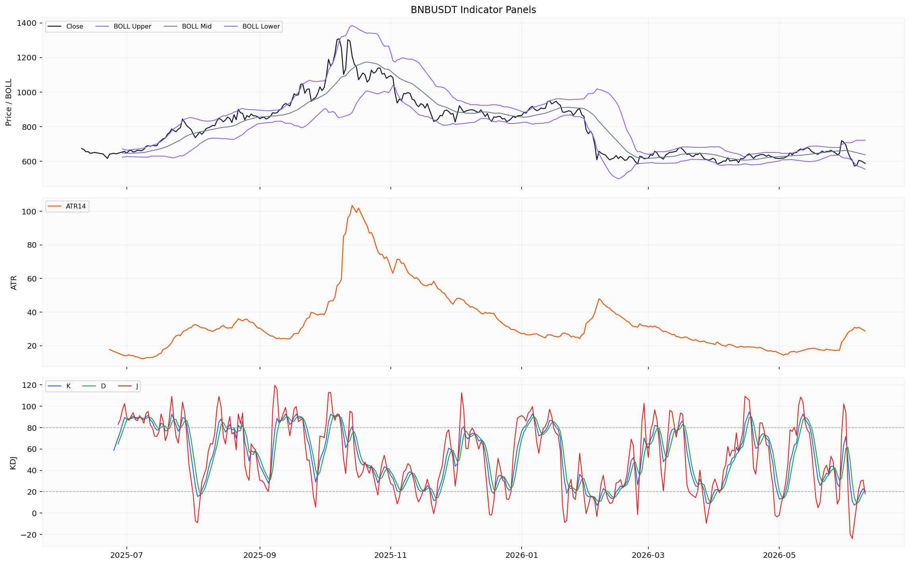
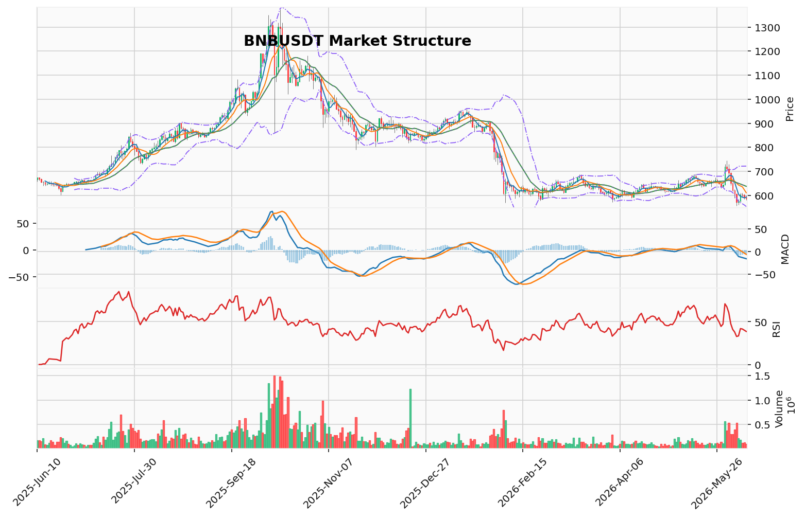

# BNB（BNB）加密资产投资研究报告

> 报告生成时间（美东）：2026-06-10 16:22:29 EDT
> 报告生成时间（北京）：2026-06-11 04:22:29 CST

## 一、投资结论与组合动作

**最终建议：持有/观望**

**决策理由：**

组合经理基于以下核心原则做出决策：保护资本、尊重已验证的数据、承认并管理数据缺口，以及避免在信息不充分时强行做出方向性判断。

1. **看跌方的结构性优势已确认**：日线级别高点下移、低点下移的下跌结构完整，价格位于所有短期均线之下，MACD负值动能持续扩大。低换手率（0.82%）的流动性风险是客观存在的抛售加速器。这些是可审计、已确认的事实，构成压制性看跌背景。

2. **看涨方的信号缺乏关键数据验证**：KD超卖、TD序列完成、恐惧指数9.0和负资金费率在理论上构成经典反转信号组合。然而，CVD（主动买卖量差）的缺失是看涨逻辑的致命伤——无法判断动能衰竭来源是空头了结还是多头抵抗失败。恐惧指数9.0的极端读数缺少针对BNB的历史统计支持，可以是“底部区域”也可以是“恐慌中继”。

3. **数据缺口决定行动边界**：关键数据（CVD、OI、多空比、代币供给等）的彻底缺失，使得任何方向性开仓都变成高概率的赌博而非低风险的交易。“持有/观望”是当前唯一能够同时管理“趋势延续风险”和“潜在反转风险”的策略。

**组合经理最终指令：**

- **当前可执行的组合动作**：持有/观望，不新开仓，不加杠杆。未提供真实持仓与保证金参数，无法审计合约风险。
- **该动作的失效条件**：当所有关键数据缺口（CVD、OI、多空比、代币供给等）恢复，且生成一个基于可审计条件的、新的买卖信号时，观望状态解除，进行数据恢复后的条件化重评，当前不预设方向动作。

---

## 二、市场结构与技术指标分析

### 技术图表

### 2.1 当前价格结构

BNB当前价格587.33 USDT（数据时间：2026-06-10），24小时跌幅-1.738%，24小时成交量112,098.249 BNB（约66,080,045.57 USDT）。日线与小时行情覆盖完整（366日日线/1000小时线），实时快照与盘口快照可用。但衍生品拥挤度指标（OI、多空比、CVD、订单簿深度）因来源限流而缺失，宏观与事件日历不可用，清算地图按BTC专用口径不适用。整体为部分可用状态，价格结构与动量读数可靠，衍生品拥挤度与链上信号缺口显著。

### 2.2 趋势与震荡状态

当前市场处于明确的下跌趋势结构。日线最新收盘价位于MA5（592.32）、MA10（610.277）、MA20（637.2545）之下，均线系统呈空头排列。本地技术摘要标注趋势方向为downtrend，成交量状态为contracting。维加斯通道显示价格在蓝带（EMA144约678.47/EMA169约690.62）下方运行，距蓝带中线约-14.2%。AMD/SMC结构识别为高点下移、低点下移的下跌推进阶段。

### 2.3 指标推导过程

| 指标 | 数据 | 推导 | 交易作用 | 失效条件 |
|:---|:---|:---|:---|:---|
| **OB订单块** | 状态：近期没有确认的结构突破；候选订单块区间由技术分析模块返回但未明示具体价格范围 | 当前结构未形成可确认的订单块突破信号，无有效供需转换位 | 不能作为当前交易依据 | 需订单块结构在价格行为中形成确认性突破后再评估 |
| **POC/成交量分布** | POC=632.0338 USDT，价值区间573.254-892.343 USDT，样本数160 | POC高于当前价格587.33，价值区间下沿573.25接近当前价格 | POC与价值区间反映历史成交密集参考，非支撑/压力保证 | 样本基于OHLCV近似分桶，非逐笔成交分布，精度受限于分桶参数 |
| **TD Sequential** | 方向：看跌反转；启动计数2，倒数计数13，信号为TD看跌反转13计数完成；置信度：中等 | TD 13计数完成暗示短期卖出动能可能衰竭，但中等置信度显示信号强度不足 | 可作为短期趋势减速的参考，但不能作为反转交易触发 | 若价格继续创出新低且无反弹结构，计数重置为上升计数；需新结构确认 |
| **谐波形态** | 状态：未匹配到有效候选；AB/XA=2.620，BC/AB=1.611，CD/BC=0.286 | 比例值未收敛至经典谐波形态参数范围，无有效形态识别 | 当前不能作为交易依据 | 需摆动点重新排列形成有效谐波比例后再评估 |
| **FVG** | 候选18个，未回补3个；最近上方缺口中线599.945 USDT | 上方有一个未回补的FVG缺口，中线在599.945，当前价格587.33在其下方 | 未回补的FVG缺口可作为价格可能回测的技术参考区间，但不能编成必然回补目标 | 价格未触及缺口区域或继续下跌，则缺口失效；需逐笔订单流确认 |
| **AMD/SMC** | 结构：高点下移、低点下移；阶段：下跌推进阶段；买侧流动性610.54（2026-06-07），卖侧流动性556.46（2026-06-05） | 当前处于明确的下跌推进波，买侧流动性在610.54形成结构高点，卖侧流动性在556.46为近期低点参考 | 反映当前摆动结构与流动性池位置，不构成进场/出场信号 | 若价格突破610.54则下跌结构失效；若跌破556.46则下跌推进延续 |
| **123突破** | 状态：下破待确认；方向：看跌；突破位556.46 | 若价格跌破556.46则确认123下破形态 | 等待价格行为确认后再评估 | 价格未跌破556.46则下破不成立；需新K线收盘确认 |
| **维加斯通道** | 价格在蓝带下方，EMA144=678.47，EMA169=690.62，距蓝带中线-14.2% | 价格远低于蓝带通道，主趋势未确认反转，处于显著的空头偏离状态 | 反映趋势偏离程度，不作为反转必然发生的依据 | 需价格回归蓝带上方或蓝带下移收敛偏离 |
| **布林带** | upper=721.46，mid=637.25，lower=553.05；价格587.33 | 价格位于中轨下方，接近下轨（553.05），通道宽度约168.41 | 反映当前价格在通道中的相对位置，非支撑/压力保证 | 若价格跌破下轨则偏离加剧；回归中轨需动量配合 |
| **RSI(14)** | 38.6464 | 位于50下方弱势区，但未进入30以下超卖区 | 反映当前弱势动量，不能单独作为超卖反转依据 | 若RSI跌破30进入超卖区后再观察是否有底背离结构 |
| **MACD** | MACD=-16.25，Signal=-8.52，Hist=-7.73 | MACD与信号线均在零轴下方，柱状图负值扩大，空头动能持续 | 空头动能主导，不能作为动能衰竭的依据 | 需MACD柱状图收窄或上穿信号线才预示动能转变 |
| **KD** | K=19.94，D=20.84，J=18.15 | K值低于20（超卖阈值），D值接近超卖（20.84略高于20），J值18.15也在超卖区 | KD进入超卖区域提示短期下行过度，但不必然导致反弹 | 需K值向上突破D值形成金叉，且价格同时出现止跌结构 |

### 2.4 清算簇/CVD/资金费率/OI/多空比

| 指标 | 数据 | 推导 | 交易作用 | 失效条件 |
|:---|:---|:---|:---|:---|
| **清算地图** | 不适用（BTC专用口径） | BNB不适用清算地图 | 不作为本标的市场结构依据 | — |
| **CVD/主动买卖量** | 缺失/不可用（来源限流） | 无法评估主动买卖方向差和订单流压力 | 不能作为当前交易依据 | 需CVD来源恢复 |
| **资金费率** | -0.003415 percent（2026-06-10） | 资金费率为负值，空头持仓方向需向多头支付费用 | 反映衍生品市场情绪偏空，但不代表极端程度 | 若费率转正则空头情绪缓解 |
| **OI/多空比** | 缺失/不可用（来源限流） | 无法评估持仓规模和方向分布 | 不能作为当前交易依据 | 需OI/多空比来源恢复 |

### 2.5 宏观/链上/AHR999/事件

| 指标 | 数据 | 推导 | 交易作用 | 失效条件 |
|:---|:---|:---|:---|:---|
| **宏观** | 缺失/不可用 | 无法判断相关事件类型是否构成驱动 | 不能作为当前交易依据 | 需事件数据提供方恢复 |
| **链上（交易所净流量）** | -356,929.0 USD（2026-06-10，MULTI_CHAIN） | 当天交易所净流出约35.7万美元，规模较小 | 单日净流出不足以推导资金主体意图 | 需连续多日净流量数据确认趋势 |
| **AHR999** | 缺失/不可用 | BTC估值指数，BNB分析不适用 | 不适用 | — |
| **事件日历** | 事件日历缺失/不可用 | 无法判断相关事件类型是否构成驱动 | 不能作为当前交易依据 | 需事件数据提供方恢复 |

### 2.6 资料限制与待确认条件

1. **OI/多空比/CVD/订单簿深度**：均因来源限流未取得数据，衍生品拥挤度无从判断。建议在下一轮数据轮询中启用备用数据源或降低请求频率。
2. **小时行情**：已有1000行数据覆盖2026-04-30至2026-06-10，但未覆盖完整分析区间起始点2025-06-10。已有样本可用于近期微观结构分析，但2025年中的小时级波动不可见。
3. **链上数据**：仅有单日交易所净流量（-356,929 USD），缺少连续时间序列，无法判断净流出是否为趋势性行为。
4. **事件日历与宏观**：完全缺失，无法评估CPI、利率决议、监管动态或BNB链生态事件对价格的影响。
5. **清算地图**：按BTC专用口径使用，BNB不适用，无法评估清算簇压力分布。

### 2.7 关键价格参考位（非执行条件）

| 价格参考位 | 数值 (USDT) | 性质 |
|:---|:---|:---|
| 下方支撑 | 556.46 | 123突破位 & 卖侧流动性 |
| 下方支撑 | 553.05 | 布林带下轨 |
| 上方阻力 | 599.95 | 未回补FVG缺口中线 |
| 上方阻力 | 610.54 | 买侧流动性（AMD/SMC结构高点） |

以上价格位为上游报告返回的技术参考，未被标注为交易条件，不能作为入场、退出、止损或目标价。具体执行价位需等待行情与技术资料恢复后确认。

### 2.8 多空场景

- **偏多场景**：当前无法构建可执行偏多场景。技术面虽有KD接近超卖、TD 13看跌反转计数完成等短期衰竭信号，但缺乏OI/多空比（无法验证空头拥挤度是否过大）、CVD（无法验证主动买盘是否开始主导）以及明确的订单块或123反转结构确认。需要恢复的数据类别：OI、多空比、CVD，以及价格在摆动结构上的确认性突破信号。
- **偏空场景**：当前无法构建可执行偏空场景。虽然均线空头排列、MACD负值扩大、RSI弱势、AMD/SMC下跌推进等均指向偏空方向，但缺乏OI/多空比（无法验证空头增量是否还有空间）、CVD（无法验证主动卖盘是否持续加速）、订单簿深度（无法验证卖方挂单是否占优）。需要恢复的数据类别：OI、多空比、CVD、订单簿聚合深度，以及宏观/事件材料的驱动确认。
- **观望场景**：由于衍生品拥挤度指标大面积缺失，任何基于当前价格结构的方向性判断置信度均有限。KD超卖叠加TD 13完成意味着短期下行可能减速，但缺少CVD和OI数据无法判断减速原因是空头获利了结还是多头入场抵抗。不建议在缺口未恢复时追空或抄底。事件日历和宏观材料的缺失使外部催化因素不可见，进一步压低方向性交易的置信度。

## 三、项目与代币基本面分析

### 3.1 可用数据快照

基本面资料包仅返回了BNB在2026年6月10日的单日快照及历史价格-供应量序列，核心经营与估值维度均因接口凭证缺失、调用失败、粒度不匹配或不适用而未形成可用数据集。已返回的可引用数据如下：

| 指标 | 数值 | 时间 |
| :--- | :--- | :--- |
| 价格 | 586.86 USD | 2026-06-10 |
| 市值 | 79,086,983,074 USD | 2026-06-10 |
| 成交量（24h） | 646,352,025 USD | 2026-06-10 |
| 流通供应量 | 134,784,332.64 BNB | 2026-06-09 |
| 价格（前一日） | 601.63 USD | 2026-06-09 |
| 流通供应量（前一日） | 134,785,312.04 BNB | 2026-06-08 |

历史序列数据显示，BNB流通供应量在过去数个交易日内稳定在约1.3478亿枚附近，微幅波动属于正常计量差异范围。从2017年7月25日至2026年6月9日的完整价格及供应量历史已返回，但该历史序列本身不构成基本面经营分析的基础。

### 3.2 数据解读与投资含义

**价格与市值：**
- 当前价格586.86 USD，较前一日601.63 USD下跌约2.45%，延续近期下行趋势。
- 市值约790亿美元，为大型加密资产，但市值本身不反映生态健康度或价值捕获能力。

**成交量与换手率：**
- 24小时成交量约6.46亿美元，相对于790亿美元市值的换手率约为0.82%，处于偏低水平。
- **投资含义：** 低换手率在下跌趋势中是流动性风险信号，表明市场上缺乏足够的买方来承接卖盘。一旦出现恐慌性抛售，价格可能因流动性不足而出现断层式下跌。该数据对当前“持有/观望”的组合动作构成支持，因为低流动性环境下开仓（尤其是杠杆开仓）的尾部风险显著增大。

**流通供应量：**
- 当前流通供应量约1.3478亿枚，过去数个交易日基本稳定。
- **投资含义：** 单点快照显示供应量近期无剧烈变动，但资料包未返回总供应量、最大供应量、销毁记录或未来解锁计划，因此无法判断当前供应稳定性是否可持续，也无法评估是否存在未来稀释压力。该数据仅为静态参考，不能构成持有或卖出的基本面理由。

### 3.3 关键数据缺口与对基本面判断的影响

| 缺失数据类别 | 具体指标 | 对基本面判断的影响 | 对当前组合动作的影响 |
| :--- | :--- | :--- | :--- |
| **供给与发行材料** | 总供应量、最大供应量、销毁记录、未来解锁/释放计划 | 无法判断是否存在未来稀释压力或销毁节奏变化；潜在供给冲击风险不可评估 | 削弱了“持有”决策的基本面支撑，也无法形成“卖出”指令 |
| **链上使用与生态数据** | TVL、协议收入、费用、活跃地址、交易笔数、交易所净流量（连续时序） | 无法评估BNB链上实际使用活跃度、生态健康度或价值捕获能力 | 无法验证BNB的“使用价值”是否支撑当前估值 |
| **估值数据** | FDV、FDV/TVL、市销率、协议收入/市值比 | 无法建立基本面估值框架，无法判断资产是否被高估或低估 | 无法回答“当前价格是否合理”这一核心问题 |
| **机构资金数据** | ETF资金流、机构持仓、交易所储备证明 | 无法判断机构资金流向或市场参与者结构 | 无法评估机构层面的供需格局 |

### 3.4 数据限制总结

1. **供给与发行材料不足：** 资料包未返回总供应量、最大供应量、销毁记录、未来解锁或释放计划。虽然单点快照显示当前流通供应量相对稳定，但缺少协议层供给机制材料，无法判断是否存在未来稀释压力或销毁节奏变化。
2. **链上使用与生态数据缺失：** DeFi总锁仓量（TVL）、协议收入、费用等经营数据因接口凭证缺失和调用失败而未返回。链上日频指标（活跃地址、交易笔数、新增地址、交易所净流量等）因数据粒度不匹配、接口凭证缺失或服务端错误而不可用。缺少这些数据意味着无法评估BNB链上实际使用活跃度、生态健康度或价值捕获能力。
3. **机构资金数据缺失：** ETF资金流数据标记为不适用，且无其他机构持仓或资金流工具返回数据。
4. **估值数据不足：** 资料包未返回FDV（完全稀释估值）、FDV/TVL、市销率等加密资产常用估值口径。仅凭借当前价格、市值和流通供应量，不足以建立基本面估值框架。
5. **竞争格局信息空缺：** 未返回同类资产比较、生态规模排名、跨链流动性等竞争格局相关材料。

### 3.5 对最终投资判断的约束

**无法给出买入/持有/卖出判断。** 当前基本面资料包仅覆盖价格、市值的单日快照及历史价格-供应量序列，缺乏供给机制、链上使用、生态经营和估值定价等核心基本面维度。在没有这些材料的情况下，任何方向性的投资建议或合理价格区间判断都不具备事实基础。投资者需等待数据层恢复上述缺失维度后再做基本面驱动的决策。

### 3.6 需要恢复的数据类别（用于未来重新评估）

若需要形成完整的基本面判断，以下数据类别必须由数据层恢复提供：
- 币种基础元数据（总供应量、最大供应量、共识机制、代币标准等）
- 链上使用数据（活跃地址、交易笔数、网络费用收入、验证者/委托数据等）
- 供给与发行数据（销毁记录、解锁时间表、通胀率等）
- 机构资金数据（基金持仓、交易所储备证明、ETF/信托产品规模等）
- 估值数据（FDV、FDV/链上收入、协议收入、TVL等）

## 四、新闻、监管与事件驱动

### 4.1 资料状态概述

新闻与事件资料包返回结果为**部分可用**，但存在严重的数据限制。分析区间为2025-06-10至2026-06-10，但：

- **项目新闻**：覆盖2025-07-16至2026-06-10期间的11条记录，分析区间前约一个月（2025-06-10至2025-07-15）完全缺失。
- **宏观新闻**：覆盖2025-12-03至2026-06-08期间的71条记录，分析区间前约半年（2025-06-10至2025-12-02）完全缺失。
- **已验证来源**：资料包**未返回任何官方公告、交易所公告、监管文件原文或已读取原文的可靠媒体正文**。所有返回内容均为媒体聚合搜索线索和公开搜索线索，来源标注为“不能单独作为正式事实源”。

**关键新闻表（仅基于现有资料状态）：**

| 时间范围 | 来源性质 | 事件方向 | 影响周期 | 证据强度 |
|:---|:---|:---|:---|:---|
| 2026-06-10 附近 | 媒体/搜索线索 | 待验证 | 无法判断 | 低 |
| 2026-06-02 附近 | 媒体/搜索线索 | 待验证 | 无法判断 | 低 |
| 2026-03-06 附近 | 媒体/搜索线索 | 待验证 | 无法判断 | 低 |
| 2026-01-29 附近 | 媒体/搜索线索 | 待验证 | 无法判断 | 低 |

### 4.2 待核验线索说明

项目新闻和宏观新闻中存在多条媒体/搜索线索，涉及2025年12月至2026年6月期间。这些线索提示存在与BNB相关的待核验主题——可能涉及监管动向、行业政策、机构资金流向或生态事件——但具体内容、事件性质、影响方向均未经官方来源、交易所公告或监管文件验证。

**宏观背景线索**：存在71条搜索线索覆盖2025年12月至2026年6月初，涉及全球宏观环境、资金流向、行业政策等层面。但由于所有线索均为未核验的搜索聚合内容，**无法确认具体是哪些宏观事件、政策走向或行业变化对BNB产生了实质影响**。线索中提示存在监管、机构资金、宏观政策或行业动向等主题待核验，但在正式来源恢复之前，不能转化为事实判断。

### 4.3 对投资逻辑的潜在影响评估

BNB作为BNB Chain的核心资产，其基本面变化通常取决于以下维度：生态发展、Layer 2扩容进展、供给端（销毁机制）、交易所关联动态、监管合规状态等。但当前资料包中缺乏已验证来源，**无法判断上述任何维度是否发生了重要事件**。相关事件类型缺少已验证新闻来源，无法评估其对需求、供给、监管风险、安全假设或生态扩张的实际改变程度。

**对当前组合动作的影响**：由于缺乏任何已验证的官方公告、监管文件、交易所公告或可靠媒体原文，基于新闻与事件维度的分析结论为**“无法判断”**。该结论不直接支持或反对当前“持有/观望”的组合动作，仅说明事件驱动维度无法提供有效判断依据。

### 4.4 来源可靠性评估

| 来源类型 | 可用状态 | 可靠度 |
|:---|:---|:---|
| 官方公告（BNB Chain / 项目方） | 未返回已验证来源 | 无法评估 |
| 交易所公告（币安等） | 未返回已验证来源 | 无法评估 |
| 监管文件 | 未返回已验证来源 | 无法评估 |
| 已读取原文的可靠媒体 | 未返回已验证来源 | 无法评估 |
| 媒体聚合搜索线索 | 存在但未核验 | 低 |
| 公开搜索线索 | 存在但未核验 | 低 |

### 4.5 资料限制与跟踪条件

**主要资料限制**：
1. **分析区间未完整覆盖**：项目新闻最早记录为2025-07-16，宏观新闻最早记录为2025-12-03，均晚于分析区间起点（2025-06-10）。分析区间前段的事件完全不可见。
2. **缺乏已验证来源**：所有返回数据均为搜索线索和媒体聚合标题，不能独立作为事实来源。
3. **搜索线索未核验**：包含多个日期节点的媒体聚合信息，未经原始来源交叉验证，不能作为真实事件、市场共识或投资结论的依据。
4. **不可用历史印象补写**：未引用任何模型内部知识来补充新闻背景、历史案例或行业类比。所有判断仅基于资料包实际返回的内容。

**跟踪条件**：
- **待恢复数据类别**：官方公告、交易所公告、监管文件原文或已读取原文的可靠媒体正文。
- **重新评估条件**：若后续新闻资料包更新并返回上述核准来源，且验证出对BNB有明确利好或利空影响的方向性事件，需要重新评估对组合动作的支持或约束作用。
- **当前限制**：缺少可靠新闻来源不构成看涨或看跌事实，仅说明新闻维度无法提供有效判断依据，不能将该维度的空白作为方向性交易的支撑或反对理由。

## 五、社区情绪、事件预期与交易拥挤度

### 5.1 市场级情绪概述

截至 2026-06-10，Alternative.me Fear & Greed 指数录得 **9.0**，属于“**极端恐惧**”（Extreme Fear）区间。该读数反映的是整个加密货币市场的泛化情绪，并非 BNB 独有的社区情绪读数。9.0 的分值位于该指数统计范围内的极低水位，表明市场参与者的整体风险偏好已降至冰点。

**数据来源与边界**：仅返回单一聚合指标（Fear & Greed 指数）在 2026-06-10 的时点读数，缺少覆盖整个分析区间（2025-06-10 至 2026-06-10）的时序情绪曲线，无法判断情绪从何水平恶化至此，以及是否出现了情绪钝化或情绪底部的典型特征。

### 5.2 BNB 专属社区情绪缺失

本次情绪分析未能获取以下关键数据维度：

| 缺失维度 | 具体内容 | 对分析的影响 |
| :--- | :--- | :--- |
| **社交平台样本** | X、Telegram、Discord、Reddit、中文社群等真实互动数据 | 无法判断哪些叙事在主导 BNB 社区讨论（如 BNB Chain 生态进展、Launchpool 活动、CZ 相关言论等） |
| **聚合社交指标** | social dominance、发帖量、互动量、情绪倾向等（LunarCrush 接口凭证缺失） | 无法量化 BNB 在全市场社交热度中的占比，以及情绪是否在扩散或衰减 |
| **语言社区细分** | 中文社区、韩语社区、欧美社区的情绪分歧 | 无法识别不同区域投资者情绪是否出现背离或趋同 |
| **参与者结构** | 机构 vs 散户、长期持有者 vs 短期投机者的情绪差异 | 无法判断极端恐惧是散户恐慌性抛售，还是机构去杠杆的系统性出清 |

**结论**：当前情绪分析仅能提供市场级的极端恐惧读数，**无法形成 BNB 专属的社区情绪覆盖**。所有涉及 BNB 生态叙事、社区讨论方向、参与者结构差异的分析均因样本缺失而无法展开。

### 5.3 极端恐惧读数的投资含义与限制

**对组合动作的影响**：

- 恐惧指数 9.0 作为已验证的市场级情绪读数，是当前组合经理“持有/观望”决策的辅助约束条件之一。极端恐惧情绪增加了市场脆弱性（恐慌性抛售风险），但同样提示情绪可能已过度释放。
- **关键限制**：情绪报告明确指出，“该方向缺少针对 BNB 的统计或回测证据，不能直接等同于‘恐慌过后必反弹’或‘恐慌继续恶化’”。该读数不能作为买入（情绪底部反转）或卖出（情绪恐慌中继）的独立依据。

**对技术面信号的交叉验证**：

上游市场报告中 KD 超卖（K=19.94）、TD 13 看跌反转完成、负资金费率（-0.003415%）等信号与极端恐惧读数在时间上重合，形成了一组“技术衰竭 + 情绪冰点”的复合读数。但以下核心缺口导致该复合读数的方向性含义无法被确认：

- **CVD 缺失**：无法判断 KD 超卖与恐惧指数 9.0 的对应关系是空头主动了结后的价格企稳，还是多头抵抗失败后的被动退缩。
- **OI/多空比缺失**：无法验证空头持仓规模是否已达到拥挤清算的阈值，也无法判断恐惧情绪是否已充分定价。

**当前态度**：该复合读数提高了市场可能发生短期转折的“敏感性”，但**不能作为方向性交易依据**，只能作为组合经理维持观望状态的辅助观察条件。

### 5.4 情绪失真风险与样本限制

| 风险类别 | 具体内容 | 影响 |
| :--- | :--- | :--- |
| **滞后性** | Fear & Greed 指数计算包含市场波动率与交易量等滞后数据，不一定反映即时社区情绪变化 | 9.0 读数可能已是过去几天情绪累积的结果，当前情绪方向可能已处于边际改善或继续恶化中 |
| **平台无法验证** | 缺少社交平台原始样本，无法判断是否存在刷量、机器人噪音、KOL 操控等失真因素 | 无法对情绪读数的真实性进行独立核验 |
| **事件归因缺失** | 无法验证恐慌情绪是否由特定事件（监管消息、技术问题、大户抛售传闻）触发 | 缺少因果关系链，无法评估情绪的可持续性 |

### 5.5 下一轮跟踪数据类别

1. **Fear & Greed 指数时序恢复**：获取连续多日读数，判断 9.0 是情绪单日极端脉冲，还是已持续多日的恐慌锁定状态。
2. **社交平台样本接入**：优先恢复 X、Telegram、中文社群中与 BNB 直接相关的帖子/讨论样本，量化情绪的叙事方向与强度。
3. **聚合社交指标恢复**：获取 BNB 的 social dominance、互动量、情绪倾向分数（需 LunarCrush 或类似数据源），评估 BNB 在全市场社交资本中的占比变化。

**当前组合动作**：不因极端恐惧读数改变“持有/观望”状态。情绪数据恢复后，若 Fear & Greed 指数在 9.0-15 区间持续多日，且伴随社交平台样本显示恐慌叙事开始让位于技术性或基本面讨论，可构成组合经理重评的条件之一；若情绪读数至今仍无法获取时序和平台样本，则继续维持当前数据缺口下的观望状态。

## 六、交易计划与组合风险

### 6.1 当前组合动作

**持有/观望，不新开仓，不加杠杆。**

本动作的底层逻辑如下：

- **看跌结构已确认**：日线级别高点下移、低点下移的下跌推进结构完整；价格位于MA5/10/20下方呈空头排列；MACD负值动能持续扩大。这些是已验证的事实，构成压制性看跌背景。
- **看涨信号缺乏关键验证**：KD超卖（K=19.94）、TD 13反转计数完成、恐惧指数9.0、负资金费率在理论上构成经典反转信号组合，但CVD（主动买卖量差）的缺失是致命缺口——无法判断减速来源是空头获利了结还是多头被动退缩。没有CVD，这些信号只能作为待验证条件。
- **数据缺口决定行动边界**：OI/多空比、CVD、订单簿深度、代币供给与解锁计划、TVL、协议收入等关键数据大面积缺失。在这些缺口填补之前，任何方向性开仓都等同于高概率赌博而非低风险交易。

### 6.2 仓位与工具选择

| 工具类别 | 当前状态 | 理由 |
|:---|:---|:---|
| 现货 | 不新开仓位；维持现有持仓或空仓 | 未提供真实持仓参数，无法给出加仓/减仓比例；基本面数据缺失导致无法判断资产是否被低估或高估 |
| 合约 | 禁止使用 | 未提供真实合约持仓、交易所、合约类型、保证金模式及参数；衍生品拥挤度数据（OI/多空比/CVD/订单簿深度）大面积缺失，无法审计清算风险、资金费率风险或最大亏损控制 |
| 杠杆 | 不推荐 | 换手率仅0.82%，流动性风险较高；缺乏衍生品数据验证杠杆安全距离 |

### 6.3 关键数据缺口及对交易计划的影响

| 缺失数据类别 | 具体指标 | 对多空逻辑的影响 | 对当前动作的影响 |
|:---|:---|:---|:---|
| **衍生品拥挤度** | CVD、OI、多空比、订单簿深度 | 看涨逻辑核心支撑缺失——无法判断KD超卖的性质（空头了结还是多头退缩）；无法评估空头拥挤度是否已达极端、轧空可行性如何 | **无法形成可执行的做多或做空触发条件** |
| **基本面经营数据** | TVL、协议收入、代币总供给与解锁计划 | 资产价值锚点缺失；无法评估潜在供给冲击风险；无法判断BNB链生态健康度 | **无法为“持有”提供基本面支撑，也无法形成卖出指令** |
| **宏观/事件驱动** | 事件日历、宏观新闻 | 无法评估系统性风险或突发利好/利空的概率 | **无法将该类风险纳入当前决策框架** |

### 6.4 技术参考位（非执行条件）

以下价格位为上游技术分析报告返回的参考位，**未被标注为交易条件**，不能作为入场、退出、止损或目标执行位：

| 价格参考位 | 数值 (USDT) | 性质与来源 |
|:---|:---|:---|
| 下方支撑 | 556.46 | 123突破位 & 卖侧流动性参考（AMD/SMC） |
| 下方支撑 | 553.05 | 布林带下轨 |
| 上方阻力 | 599.95 | 未回补FVG缺口中线 |
| 上方阻力 | 610.54 | 买侧流动性（AMD/SMC结构高点） |

### 6.5 风险分析与风险控制

**主要风险来源：**

| 风险类别 | 风险来源 | 当前评估 |
|:---|:---|:---|
| **趋势延续风险** | 日线下跌推进结构完整；均线空头排列；MACD负值动能扩大 | 已验证，概率较高；但缺少CVD判断是否处于动能加速阶段 |
| **流动性风险** | 换手率仅0.82% | 已验证——任何抛售可能引发价格断层；同时低流动性也放大轧空爆发力，但轧空需持续买盘触发，概率难以评估 |
| **数据缺口风险** | 代币供给与解锁计划完全缺失 | 存在未被定价的潜在供给冲击，无法量化 |
| **情绪反转风险** | 恐惧指数9.0为极端读数 | 该方向缺少针对BNB的统计或回测证据，极端恐惧既可能是底部区域也可能是恐慌中继；CVS缺失使该信号无法验证 |
| **合约风险** | 未提供真实持仓与保证金参数 | 无法审计清算风险或保证金管理 |

**风险控制措施：**

- **不新开仓、不加杠杆**：消除流动性风险和合约风险
- **等待数据恢复**：通过时间换取信息确定性
- **维持现有资产配置不变**：未提供真实持仓参数，无法给出减仓比例建议；建议维持当前现金/资产比例

### 6.6 行动标准与失效条件

| 当前可执行动作 | 动作的失效条件 |
|:---|:---|
| 持有/观望，不新开仓，不加杠杆，等待数据恢复后重新评估 | 1. 所有关键数据缺口（CVD、OI、多空比、代币供给与发行材料、TVL、协议收入等）恢复 2. 基于可审计条件形成新的买入或卖出信号 3. 观望状态解除，进行数据恢复后的条件化重评，当前不预设方向动作 |

### 6.7 置信度与限制

**置信度：低**

- **提升信心的来源**：技术结构确认（+）；低流动性风险确认（+）；技术衰竭信号已识别但未验证（+/−）
- **降低信心的因素**：CVD、OI、多空比、订单簿深度、代币供给、TVL、协议收入、宏观事件数据大面积缺失

**统计说明**：上游材料未提供任何针对BNB的统计样本数、统计时段、回测结论或胜率。以下不能作为交易证据：
- KD超卖的反转概率
- 恐惧指数9.0的底部判断胜率
- 资金费率负值的轧空成功率

### 6.8 风险分析师之间的关键分歧

| 争议点 | 激进分析师立场 | 保守分析师立场 | 组合经理采纳立场 |
|:---|:---|:---|:---|
| KD超卖+TD13完成的含义 | “复合技术衰竭信号”，结构即将耗尽 | “超卖可以钝化”，下跌趋势中常见形态 | 两者皆有可能；该方向性解释未由资料包验证，只能作为待验证条件 |
| 低流动性的解读 | “轧空的完美燃料” | “流动性断层”是主要风险 | 0.82%换手率是已验证数据，但轧空需持续买盘触发，该方向性解释未由资料包验证 |
| 数据缺口的性质 | “信息不对称的溢价”、“先发优势” | “致命未知”，不能作为交易依据 | 数据缺口是限制，不是方向性优势；当前只能降低置信度，不能作为方向性依据 |
| 恐惧指数9.0 | “进攻性条件”、“潜在反弹的催生剂” | “恐慌中继”的可能性同样存在 | 该方向缺少针对BNB的统计或回测证据，不能作为方向性依据 |

### 6.9 下一步待恢复的数据类别

1. **衍生品数据**：CVD、OI、多空比、订单簿聚合深度、资金费率历史分位
2. **基本面数据**：代币总供应量与最大供应量、销毁记录、未来解锁计划、TVL、协议收入、活跃地址
3. **宏观与事件数据**：事件日历、宏观新闻及监管动态

只有在上述数据恢复后，才能形成基于可审计条件的买入、卖出或加仓/减仓交易计划。当前不预设任何方向性动作安排。

## 七、关键分歧与跟踪条件

当前组合经理“持有/观望”的最终建议，是在看跌结构性证据与看涨技术衰竭信号之间的数据缺口上做出的审慎裁决。以下列出本报告中出现的重大分歧、组合经理对分歧的采纳或不采纳理由，以及后续需要跟踪的数据条件。

### 7.1 多空分歧的核心争议

| 争议主题 | 看涨方论据 | 看跌方/保守方论据 | 组合经理采纳/不采纳理由 |
| :--- | :--- | :--- | :--- |
| **KD超卖与TD13完成的性质** | 已进入超卖区（K=19.94）且TD13完成，表明短期卖出动能衰竭，属于反转信号。 | 在强势下跌趋势中超卖可以持续钝化；CVD缺失，无法判断减速是空头了结还是多头抵抗失败。 | **不采纳看涨解释。** 该方向性解释未由资料包验证，CVD缺失构成致命缺口，无法确认动能衰竭。 |
| **低流动性的交易含义** | 0.82%换手率是轧空的完美燃料；负资金费率增加空头持仓成本，可能触发踩踏。 | 低流动性的主要风险是引发价格断层；抛售导致的下行风险远大于轧空发生的概率。 | **不采纳看涨解释。** 资金费率绝对值（-0.003415%）并不极端，缺乏OI数据验证空头规模，轧空推演缺乏可量化依据。 |
| **恐惧指数9.0的投资含义** | 极端恐惧是底部信号，暗示市场情绪已到冰点，具备反转潜力。 | 缺少针对BNB的统计或回测证据，不能等同于“恐慌过后必反弹”，可能是恐慌中继。 | **不采纳方向性解释。** 该读数属于已验证的市场级情绪读数，但方向性结论未由资料包验证。 | 
| **CVD/OI/多空比数据缺失的处理** | 信息不对称带来先发优势，缺乏数据不等于缺乏机会，极端恐惧和超卖就是进攻性条件。 | 缺乏CVD意味着无法判断订单流方向，任何方向性动作都是赌博。 | **采纳保守方立场。** 数据缺口是明确的可审计限制，不能将缺口包装成竞争优势。 | 

### 7.2 组合经理采纳/放弃的观点清单

| 采纳的观点 | 来源 | 采纳理由 |
| :--- | :--- | :--- |
| 日线级别下跌推进结构（高点下移、低点下移）是已确认的事实 | 看跌方、市场技术报告 | 可审计的技术事实，所有短期指标均服从于该结构 |
| 低换手率（0.82%）是已确认的风险信号 | 看跌方、市场技术报告 | 已验证数据，在缺乏订单簿深度验证时属于危险信号 | 
| CVD、OI、多空比、基本面数据缺失导致无法形成可执行方向性动作 | 保守/中性方、研究经理 | 数据缺口是本次决策的底层逻辑，构成关键限制 |

| 放弃的观点 | 来源 | 放弃理由 |
| :--- | :--- | :--- |
| KD超卖+TD13完成构成反转交易的充分条件 | 看涨方 | 缺乏CVD验证，属于把单点读数外推为方向性交易 |
| 低流动性+负资金费率构成轧空前提 | 看涨方 | 缺乏OI数据，属于未经可量化验证的推演 |
| 恐惧指数9.0必然对应底部区域 | 看涨方 | 缺乏针对BNB的统计或回测证据 |
| 应在数据缺失时提前抄底/加仓 | 激进风险分析师 | 该论点把资料缺口外推为方向性结论，未由资料包验证 |

### 7.3 需要跟踪的验证条件

以下为等待恢复的数据类别和结构确认条件，一旦满足，组合经理将对当前“持有/观望”状态进行重新评估：

#### 关键数据恢复类

1. **衍生品数据**：CVD、OI、多空比、订单簿深度。这些指标恢复后将直接解决看涨逻辑的核心缺口——判断KD超卖的性质（空头了结 vs 多头抵抗失败）以及轧空条件的成熟度。
2. **基本面数据**：BNB总供应量、未来解锁计划、销毁记录、TVL、协议收入、链上活跃地址与交易笔数。这些数据恢复后将提供资产价值锚点和供给冲击风险的评估基础。
3. **宏观与事件数据**：项目新闻、交易所公告、监管动态、宏观事件日历。恢复后可用于评估外部催化因素。

#### 技术结构确认类

- **看涨方向的条件**：价格有效突破并站稳610.54 USDT（AMD/SMC结构高点，买侧流动性），且伴随成交量放大；CVD数据显示主动买盘持续主导；OI/多空比数据验证多头力量回归。当前不预设方向动作。
- **看跌方向的条件**：价格有效跌破556.46 USDT（123突破位，卖侧流动性），且CVD确认主动卖盘未衰减。当前不预设方向动作。
- **中立状态解除条件**：以上三类关键数据（衍生品、基本面、宏观/事件）全部恢复，且形成基于可审计条件的新的买卖信号。

#### 等待数据恢复后的重评安排

所有关键数据恢复后，组合经理将对衍生品拥挤度、基本面价值锚点和外部事件驱动进行综合评估，生成新的买入、卖出或继续观望信号。在此之前，当前“持有/观望”状态持续有效。

## 八、最终结论

**组合经理最终动作：持有/观望。不新开任何现货或合约仓位，不加杠杆。未提供真实持仓参数，无法做出现货减仓比例或合约处理的建议。**

该动作成立的核心证据有三：其一，日线级别下跌推进结构（高点下移、低点下移）、均线空头排列、MACD负值动能扩大等可审计的技术事实构成了压制性看跌背景；其二，低换手率（0.82%）在缺乏订单簿深度验证的情况下属于明确的流动性风险信号；其三，CVD、OI、多空比、代币供给与解锁计划、TVL、协议收入等关键衍生品和基本面数据大面积缺失，导致任何方向性开仓都变成信息不完整的高概率赌博。看涨方的KD超卖、TD13完成、恐惧指数9.0等衰竭信号虽然存在，但因缺乏CVD验证其动能衰竭来源，不能构成方向性交易的依据。

最关键的重新评估数据类别为衍生品数据（CVD、OI、多空比）和基本面数据（代币供给计划、TVL、链上活跃度）。这两类数据的缺口是当前看涨逻辑的致命伤，也是组合经理选择“持有/观望”而非“立即卖出”的底层原因——缺少能够支持方向性动作的可审计执行证据。

下一步最需要跟踪的三类数据依次是：**第一，CVD和OI数据**，用于判断订单流方向和空头拥挤度，解决看涨逻辑的核心缺口；**第二，BNB代币供给与解锁计划数据**，用于评估潜在的供给冲击风险和基本面估值锚点；**第三，宏观与事件数据（项目官方公告、交易所公告、监管动态）**，用于判断外部催化因素是否构成系统性风险或机会。在以上数据恢复并形成新的可审计买卖信号之前，持有/观望是唯一兼顾“趋势延续风险”和“潜在反转风险”的审慎行动。
