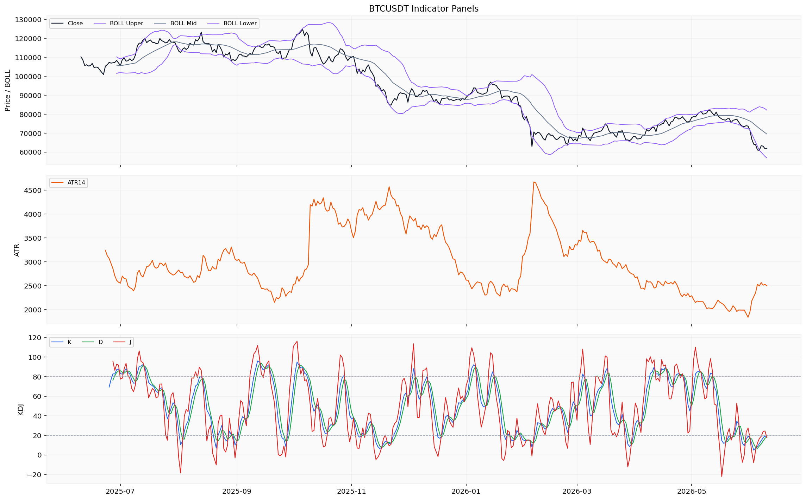
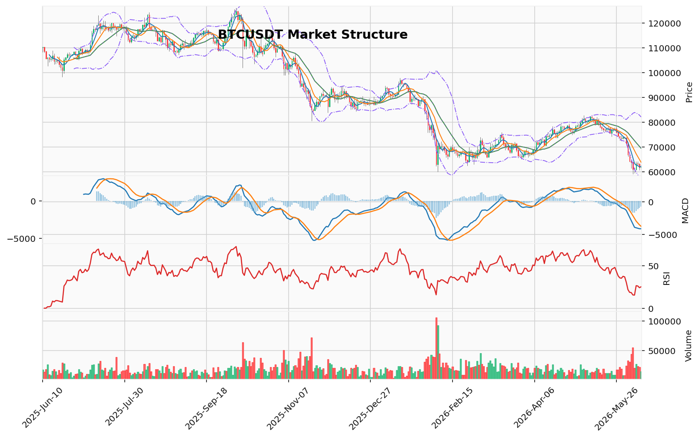

# Bitcoin（BTC）加密资产投资研究报告

> 报告生成时间（美东）：2026-06-10 16:06:58 EDT
> 报告生成时间（北京）：2026-06-11 04:06:58 CST

## 一、投资结论与组合动作

**最终建议：持有/观望（不加杠杆，不开新仓，不追空）**

组合经理已审阅所有辩论材料、研究经理计划和交易员决策报告，基于上游已验证证据与明确数据缺口，做出最终裁决：

1. **持有/观望**：当前不具备可执行的多头入场条件。已持有BTC者，上游未提供真实持仓参数，无法设定具体减仓比例或分批节奏，但基于已验证的趋势下行证据（机构流出、空头排列），建议将多头暴露维持在个人可接受的低水平，具体执行价位需待行情与技术资料恢复后确认。未持有BTC者，不做试探性买入或定投，不新开多头仓位。

2. **现货/合约选择**：现货。严禁加杠杆，严禁新开合约仓位。上游未提供真实合约持仓、交易所、合约类型、保证金模式和保证金参数，无法审计合约风险。不讨论合约清算价、补保证金或调整保证金处理。

3. **最大风险边界**：未提供真实持仓参数和风险承受能力数据，无法设定具体数字阈值。

4. **核心决策理由**：
   - 强证据（支持持有/观望/降低暴露）：ETF近5天4天净流出（12.5亿美元）、均线系统空头排列、MACD负值柱扩大、123破位确认
   - 弱证据/缺口（激进分析师的支撑）：TD13（中等置信度，非反转）、RSI/KD超卖（不构成反转必然性）、Fear & Greed 9.0（缺少回测统计）、清算地图（缺失）、CVD（缺失）
   - 决策只能基于强证据，弱证据仅能限制进一步做空（避免追空），但不能支撑买入

5. **数据缺口的管理**：缺口（清算地图、CVD）本身不是看涨事实，唯一正确管理方式是降低置信度、不加杠杆、等待确认。当前决策基于“已验证的下跌趋势”与“数个看跌势竭信号并存”的复杂阶段，维持“持有/观望”但升级为“主动监控”，等待清算地图和CVD数据恢复后的决策。

## 二、市场结构与技术指标分析

### 技术图表

### 2.1 市场结构概览

当前BTC处于持续下行趋势结构。本地技术摘要明确标注为downtrend，成交量收缩。日线收盘价61,963.19 USDT已低于MA5（62,199.16）、MA10（63,825.08）和MA20（69,497.28），均线系统呈空头排列。Vegas通道显示价格在蓝带（EMA144/169区间）下方约19.89%，双线反转结构中EMA20和EMA50均在上方，AMD/SMC确认高点下移、低点下移的下跌推进阶段，123突破结构已确认下破。RSI 14读数25.25（已进入超卖区间），KD的K值和D值均接近或已低于20超卖阈值，MACD动能柱为负且仍在扩大。TD看跌反转13计数已完成。整体技术结构偏空，但须注意清算数据、主动买卖量和订单簿深度缺口限制了结论的精细化程度和反转判断的置信度。

### 2.2 指标覆盖状态

| 指标 | 覆盖状态 |
|------|---------|
| 布林带 | 可分析 |
| 维加斯通道 | 可分析 |
| 双线反转 | 可分析 |
| AMD/SMC | 可分析 |
| 123突破 | 可分析 |
| FVG | 可分析（21个候选，5个未回补） |
| OB订单块 | 可分析 |
| RSI | 可分析 |
| MACD | 可分析 |
| KD | 可分析 |
| TD 9/13 | 可分析 |
| 谐波形态 | 可分析（未匹配到有效候选） |
| 交易密集带/成交量分布 | 可分析 |
| 清算地图 | 缺失/不可用（来源限流） |
| CVD/主动买卖量 | 缺失/不可用（来源限流） |
| 资金费率 | 已引用（0.003488 percent） |
| OI/多空比 | 已引用（OI：25,576,534.55 USD，多空比：2.05） |
| 宏观 | 可分析（行情资料包不重复判断，需回看新闻/宏观资料包） |
| 链上 | 可分析（交易所净流量单日快照） |
| AHR999 | 已引用（0.3055，无量纲指数读数） |

### 2.3 指标推导过程

#### OB订单块

| 指标 | 数据 | 推导 | 交易作用 | 失效条件 |
|------|------|------|---------|---------|
| OB订单块 | 近期没有确认的结构突破 | 当前未出现订单块被明确突破的摆动结构 | 不作为当前交易方向判断依据 | 需订单块结构确认的摆动高低点更新数据 |

#### POC / 成交量分布

| 指标 | 数据 | 推导 | 交易作用 | 失效条件 |
|------|------|------|---------|---------|
| 交易密集带/成交量分布 | POC 68,021.11 USDT，价值区间65,596.51-80,144.10 USDT，样本160 | 当前价格61,963 USDT已低于POC和价值区间下沿，属于低量成交区 | 可参考价格与价值区间的偏离程度，不作为入场或目标位 | 需更完整的成交量分布样本（样本仅160的近似分桶） |

#### TD Sequential

| 指标 | 数据 | 推导 | 交易作用 | 失效条件 |
|------|------|------|---------|---------|
| TD 9/13 | 方向：看跌反转，倒数计数13完成，置信度中等 | TD看跌反转计数已走完13，按指标定义提示原有下行趋势可能接近衰竭窗口 | 中等置信度参考，不作为反转确认 | 趋势延续不构成失效条件；指标本身不设止损位 |

#### 谐波形态

| 指标 | 数据 | 推导 | 交易作用 | 失效条件 |
|------|------|------|---------|---------|
| 谐波形态 | 未匹配到有效候选，AB/XA=1.469，BC/AB=2.404，CD/BC=0.381 | 最近摆动比例不在已知谐波形态的标准化比例范围内 | 当前无谐波形态可参考 | 等待下一组摆动高低点重新筛选 |

#### FVG

| 指标 | 数据 | 推导 | 交易作用 | 失效条件 |
|------|------|------|---------|---------|
| FVG | 21个候选，5个未回补，最近上方缺口中线65,478.66 USDT | 上方存在未回补的效率缺口，价格当前在缺口下方运行 | 可作为技术参考价格区，不作为回补目标或交易触发 | 需明确缺口边界和确认回补条件 |

#### AMD/SMC 与 123

| 指标 | 数据 | 推导 | 交易作用 | 失效条件 |
|------|------|------|---------|---------|
| AMD/SMC结构 | 高点下移、低点下移，下跌推进阶段；买侧流动性64,234.68（2026-06-07高点），卖侧流动性59,130.91（2026-06-05低点） | 当前属于空头推进波段，上下两侧均有已知流动性池 | 可参考流动性池位置，不作为支撑/压力或触发位 | 需逐笔订单流确认流动性是否被扫取 |
| 123突破 | 下破已确认，方向看跌，突破位74,289.6 | 三点结构显示价格有效跌破前低摆动点，维持空头结构 | 可确认趋势方向偏空，不作为入场信号 | 若价格回升并突破确认位，结构失效需重新评估 |

#### Vegas / 布林带 / RSI / MACD / KD

| 指标 | 数据 | 推导 | 交易作用 | 失效条件 |
|------|------|------|---------|---------|
| 维加斯通道 | EMA144=76,612.13，EMA169=78,083.09，价格在蓝带下方约19.89% | 价格与长期均线系统偏离较大，趋势偏空 | 确认当前处于长期下行趋势，不作为反转条件 | 需资料包给出可审计条件后再评估 |
| 布林带 | 上轨82,111.83，中轨69,497.28，下轨56,882.73 | 价格61,963介于中轨与下轨之间，贴近下轨运行 | 通道未显示收敛或扩张突破信号 | 等待资料包给出可审计条件后再评估 |
| RSI | RSI 14 = 25.25 | 读数低于30，属于常规超卖区间，动量偏空 | 超卖区域提示下行力度可能接近阶段性极限，但不构成反转必然性 | 等待资料包给出可审计条件后再评估 |
| MACD | MACD -4,132.22，信号线-3,377.16，柱状线-755.06 | 整体处于零轴下方负值区，柱状线仍为负且未收敛 | 动能指向偏空，未出现底背离或柱线收缩迹象 | 等待资料包给出可审计条件后再评估 |
| KD | K=18.15，D=18.34，J=17.77 | K值和D值均低于20，K已进入超卖区，D略低于超卖阈值 | 超卖摆动指标，参考读数偏低 | 等待资料包给出可审计条件后再评估 |

#### 清算地图 / CVD / 资金费率 / OI / 多空比

| 指标 | 数据 | 推导 | 交易作用 | 失效条件 |
|------|------|------|---------|---------|
| 清算地图 | 缺失/不可用（来源限流） | 无法确定清算簇价格、规模和方向分布 | 不能作为当前交易依据 | 需清算数据提供方恢复 |
| CVD/主动买卖量 | 缺失/不可用（来源限流，rate limited） | 无法识别主动买盘与主动卖盘的净方向 | 不能作为当前交易依据 | 需数据源解除限流 |
| 资金费率 | 0.003488 percent（2026-06-10） | 费率小幅正值但数值偏低；近5日介于0.000983-0.005066 percent | 当前范围内无明显过热或过冷信号 | 等待资料包给出可审计条件后再评估 |
| OI/多空比 | OI：25,576,534.55 USD；多空比：2.05 | 多空比持续大于1（近5日1.83-2.09），多头持仓量约为空头两倍 | 偏多持仓拥挤，价格下行时多空比偏高的结构可能放大清算风险 | 需结合清算数据评估多空比偏高是否形成挤压条件 |
| 净流入 | 44,438,019.0 USD | 衍生品账户当日资金净流入 | 新入金增加，可能对应建仓行为 | 需区分净流入来源方向 |

#### 宏观 / 链上 / AHR999 / 事件

| 指标 | 数据 | 推导 | 交易作用 | 失效条件 |
|------|------|------|---------|---------|
| 宏观 | 行情资料包不重复判断，需回看新闻/宏观资料包 | 当前分析框架中宏观路径未在本资料包内展开 | 不能作为当前交易依据 | 需宏观/新闻资料包补充 |
| 链上 | 交易所净流量3,481,300.0 USD（单日快照，样本不足） | 单日净流入读数，缺乏连续趋势，无法判断资金流向方向 | 样本不足，不能作为交易依据 | 需日频链上数据恢复连续覆盖 |
| AHR999 | 0.3055（无量纲指数读数，单日快照） | 该指数在0.3附近属于历史偏低区间 | 可作为估值参考，不构成买入信号 | 样本仅单日，需日频连续覆盖 |
| 事件 | 事件日历缺失/不可用 | 无法判断相关事件类型是否构成驱动 | 不能作为当前交易依据 | 需事件数据提供方恢复 |

### 2.4 关键价格与风险参考位

- **支撑参考位**：卖侧流动性59,130.91 USDT（AMD/SMC位置）；布林带下轨56,882.73 USDT。清算地图缺失，无法确认下方是否存在大规模清算簇构成潜在支撑区。
- **压力参考位**：本地技术摘要标注压力位74,092.0 USDT、78,080.0 USDT；123突破确认位74,289.6 USDT；最近上方未回补FVG中线65,478.66 USDT。
- **技术参考位**：MA5（62,199.16）、MA10（63,825.08）、MA20（69,497.28）、POC（68,021.11）、布林带中轨（69,497.28）、布林带下轨（56,882.73）、卖侧流动性（59,130.91）、买侧流动性（64,234.68）。

### 2.5 多空场景评估

**偏多场景**：当前无法构建可执行偏多场景。需恢复清算地图（确定下方流动性聚集区是否已被扫取）、CVD/主动买卖量差（识别主动买盘是否开始主导）、连续链上净流量数据（判断交易所余额变化方向）、事件日历（判断是否存在潜在催化剂）。

**偏空场景**：当前无法构建可执行偏空场景。技术指标虽整体指向下行（均线空头排列、RSI/KD超卖但仍在偏空区域、MACD负值、TD看跌13完成），但资料包未给出任何明确的可审计执行条件——缺失清算簇价格和规模以构建定向清算推演，缺失CVD以确认主动卖盘持续主导，缺失订单簿深度以评估即时卖压水平。

**观望场景**：在清算地图、CVD/主动买卖量差、订单簿深度和连续链上数据恢复之前，任何方向性结论的置信度都受到严重限制。多空比偏高（2.05）且价格持续下行，技术上多头拥挤可能转化为清算压力，但因缺乏清算簇位置数据，无法评估该潜在风险的距离和规模。不应追空——当前RSI(25.25)和KD(K=18.15)均处于超卖区间，指标层面卖盘力量已经较大，进一步追空面临技术性反弹风险。不应追多——均线系统和MACD动能仍指向偏空，无明确买盘结构确认信号。

### 2.6 数据限制与待确认条件

**主要数据缺口**：
1. 清算数据来源限流：CVD、清算热力图、清算统计数据、期权持仓/成交量、订单簿聚合深度均因来源限流未能返回，对方向性执行条件的构建至关重要
2. 小时行情未覆盖完整分析区间：小时线已有1000行但仅覆盖2026-04-30至2026-06-10，完整分析区间起于2025-06-10，存在约10.5个月的截断
3. 链上和AHR999仅单日快照：交易所净流量和AHR999各仅有1行数据，时间覆盖2026-06-10当日，无法形成序列趋势分析
4. 谐波形态未匹配候选：当前摆动比例不在已知谐波形态标准化范围内

**待确认条件**（需恢复的数据类别）：
- 清算簇价格和规模
- CVD/主动买卖量差
- 订单簿聚合深度
- 连续链上交易所净流量
- 完整的事件日历

## 三、项目与代币基本面分析

### 3.1 资料可用性评估

基本面资料包**部分可用**，具体数据返回与缺口如下：

| 数据类别 | 覆盖状态 | 核心内容与限制 |
|---------|---------|--------------|
| 价格与市值快照 | 已返回 | BTC价格61,934 USD，市值约1.24万亿美元，24小时成交量约295亿美元（截至2026-06-10） |
| ETF资金流数据 | 已返回（252个交易日） | 覆盖2025-06-10至2026-06-08，最新数日呈净流出 |
| 供给与发行数据 | **缺失** | 流通供应量、总供应量、发行节奏、未来稀释安排均未返回 |
| 链上使用数据 | **缺失** | 活跃地址、转账量、交易所流入流出等指标因接口凭证缺失和未覆盖完整分析区间而无法获取 |
| DeFi/生态经营数据 | **缺失** | TVL、协议收入、费用等字段全部未返回（Token Terminal来源不可用） |
| 估值类数据 | **缺失** | FDV、NVT等加密资产基本面估值口径未返回 |
| AHR999等链上估值指标 | **缺失** | 仅有市场技术分析报告中的单日快照（0.3055），基本面资料包未返回 |

### 3.2 已返回数据的分析与解读

**价格与市值快照**：截至2026年6月10日，BTC价格为61,934 USD，总市值约1.24万亿美元。单日快照无法判断趋势方向或评估价格偏离程度。

**ETF资金流数据（252个交易日样本）**：最近数个交易日呈现较大规模净流出：
- 2026-06-08：净流出9,140万美元
- 2026-06-05：净流出3.257亿美元
- 2026-06-04：净流入320万美元
- 2026-06-03：净流出3.966亿美元
- 2026-06-02：净流出5.191亿美元

最近5个交易日中有4个交易日为净流出，累计净流出约12.5亿美元。该信号表明，在样本覆盖的时间段内，机构通过ETF渠道的资金流向偏负面。该数据覆盖252个交易日但未完整跨越整个分析区间（截至2026-06-08，缺失6月9-10日数据），且缺少对应的持仓总量、累计净流入/流出等配套数据，不能仅凭最近几日的流出趋势外推。

### 3.3 数据限制与投资含义

1. **供给与发行数据缺口**：未获取BTC的流通供应量、总供应量、当前发行阶段等基础元数据。缺少这部分数据，无法评估供给端对长期价值的影响，无法判断未来稀释或发行节奏。当前快照无法判断流通供应量与总供应量之间的关系。

2. **链上基本面数据完全缺失**：活跃地址、链上交易量、矿工收入、持币分布、交易所净流量等链上指标均未返回。这对判断BTC网络的实际使用强度、持有者行为模式和网络健康度构成严重限制。

3. **生态与DeFi数据缺口**：TVL、协议收入、费用等DeFi维度因凭证缺失和数据粒度问题全部不可用。无法评估BTC在DeFi生态中的使用情况和链上经济活动的货币化水平。

4. **估值框架缺乏数据支撑**：缺少FDV、链上估值指标和同类资产比较数据，无法构建基本面估值模型或判断价格偏离程度。

5. **ETF资金流数据的时间限制**：覆盖252个交易日但未完整跨越整个分析区间，且缺少对应的持仓总量、净流入/流出累计等配套数据，不能仅凭最近几日的流出趋势外推。

### 3.4 对组合动作的影响

基本面维度当前无法提供支撑方向性判断的证据。供给端、链上使用、生态经营和估值数据全部缺失，任何关于BTC基本面的结论置信度极低。ETF资金流数据虽显示净流出趋势，但其作为单一指标不能代表整体基本面状况，且时间覆盖存在缺口。

在当前资料状态下，基本面维度对本报告组合动作（持有/观望、不加杠杆、不开新仓）的约束是：**无法基于基本面判断给出买入或卖出建议，该维度不构成方向性决策依据，仅作为需要持续跟踪的数据类别。** 若可靠数据恢复并验证方向性事件，需要重新评估。

## 四、新闻、监管与事件驱动

### （一）资料状态与可用性

本次分析调用了新闻资料包。返回状态为**部分可用**，具体如下：

| 数据类别 | 记录数量 | 时间覆盖 | 来源性质 | 可用性结论 |
|---------|---------|---------|---------|-----------|
| 项目新闻线索 | 26 条 | 2025-07-05 至 2026-05-23 | 媒体聚合搜索线索 | 未核验，不可作为事实 |
| 宏观新闻线索 | 69 条 | 2026-01-04 至 2026-06-08 | 公开搜索线索 | 未核验，不可作为事实 |

**关键限制**：资料包中所有返回行均标识来源为“媒体聚合搜索线索 / 公开搜索线索”，**无官方公告、无监管文件、无交易所公告、无已读取原文的可靠媒体正文返回**。所有返回内容均属于未经核验的搜索线索，不能作为已验证新闻事实写入报告。

### （二）已验证来源（本轮无）

本分析区间内，新闻资料包**未返回**任何来自以下可信渠道的已核验新闻事实：
- 官方公告（如 Bitcoin 核心开发团队、Bitcoin 基金会）
- 监管机构原始文件（如 SEC、CFTC、FinCEN、各国央行或财政部）
- 交易所官方公告（如 Coinbase、Binance、Kraken 等）
- 已读取原文的可靠媒体正文

因此，本报告**无法确认任何具体监管事件、机构资金流入/流出、交易所政策变更、协议升级、安全事件、代币解锁、宏观政策变动或行业合作事件**。

### （三）待核验线索概括

新闻资料包返回的媒体/搜索线索提示存在以下待核验主题方向，但**未提供可引用的原文、公告或数据**：

- **项目相关线索**：涉及 Bitcoin 网络参数、矿工行为、链上活动等方向，存在若干媒体聚合标题和搜索摘要，未经官方或链上数据源交叉验证。
- **宏观相关线索**：涉及利率政策、通胀数据、美元指数、地缘冲突、主要经济体监管动向等方向，存在多条搜索返回记录，但均未附原文正文，不能确认为已发生事件。

**所有线索内容不能作为投资判断依据。**

### （四）对价格与市场情绪的影响判断

由于缺少已验证新闻来源，无法对 BTC 在分析区间内的短中期价格驱动做出基于新闻事实的判断。具体而言：

| 判断维度 | 结论 | 限制说明 |
|---------|------|---------|
| 利好/利空方向 | 无法判断 | 搜索线索未核验，不能作为事实源 |
| 影响周期 | 无法判断 | 缺少可引用的具体事件时间窗口 |
| 证据强度 | 低 | 仅存在媒体聚合线索 |

### （五）对项目基本面与投资逻辑的潜在影响

在缺乏已验证新闻来源的前提下，无法判断任何事件对 BTC 的需求、供给、监管风险、安全假设、生态扩张、流动性或叙事层面产生了实际影响。该方向缺少可靠来源或统计回测证据。

相关事件类型（协议升级、供给事件、扩容生态、机构产品、宏观政策或链上活动）缺少已验证新闻来源。

### （六）事件驱动的约束条件

- **无法构建事件驱动场景**：由于缺少可核验的事件日历或已发生事件，新闻维度在当前对组合动作的约束为零——既不支持也不反对当前“持有/观望”的动作方向。
- **若可靠来源恢复并验证新的方向性事件，需要重新评估**。

### （七）数据限制与风险提示

1. **新闻资料包覆盖不完整**：项目新闻样本最早记录为 2025-07-05，不包含 2025-06-10 至 2025-07-04 的数据；宏观新闻样本最早记录为 2026-01-04，2025 年下半年的宏观信息完全缺失。
2. **搜索线索未核验，不能作为事实源**：资料包返回的所有内容均为媒体聚合搜索线索或公开搜索线索，未经官方、监管或原始数据交叉验证。
3. **缺少可靠新闻来源**：官方公告、监管文件、机构资金、交易所公告、安全事件、宏观事件、链上事件缺少已验证来源。
4. **无法做出确定新闻结论**：缺新闻不能被解释成“没有负面消息”或“存在潜在利好”。缺新闻只表示新闻维度无法判断。
5. **后续取数需求**：若需完成完整的新闻事件分析，建议补充获取（1）官方公告与监管原始文件；（2）主要交易所官方公告；（3）已读取原文的可靠媒体报道；（4）链上可验证的数据事件。

## 五、社区情绪、事件预期与交易拥挤度

### 5.1 市场级情绪读数

截至 2026-06-10，市场级情绪指标 Fear & Greed 指数读数为 **9.0**，对应情绪标签为“Extreme Fear”（极度恐惧）。该指数覆盖整个加密市场，反映的是资产定价情绪层面的整体紧张程度，并非仅针对 BTC 特定社交平台的样本聚合。

该读数处于该指数历史极低区间，显示市场参与者在价格维度上的避险情绪高度集中。但需注意以下限制：

- **统计验证缺失**：资料包未返回历史回测数据、样本内条件概率或量化验证结果，因此不能将极端恐惧直接等同于反转信号或持续下跌的依据。
- **单点读数局限**：仅有一个时间点的读数，缺乏连续序列以判断情绪变化的斜率或极端持续时长。

### 5.2 社交平台样本覆盖情况

舆情资料包的实际返回状态为**部分可用**，具体缺口如下：

- **社交平台真实样本缺失**：未返回任何来自 X（Twitter）、Telegram、Discord、Reddit、中文社区、KOL 或链上大户的具体发帖样本、互动量或言论内容。因此，当前无法基于真实社交样本判断 BTC 社区的具体讨论热度、情绪方向、主要叙事内容及传播路径、参与者类型结构差异。
- **聚合指标覆盖有限**：仅有市场级 Fear & Greed 单一读数，缺少来自 LunarCrush 等社媒聚合数据源的情绪指标、社交主导度、帖子数量、互动量等维度的数据，接口凭证缺失导致该数据源未成功返回。
- **事件预期与搜索线索**：未返回具体的市场预期事件材料或公开搜索摘要，相关市场叙事缺少真实平台样本支持。

### 5.3 参与者结构

因缺乏来自真实平台样本的参与者数据，当前无法覆盖 BTC 持有者/交易者群体的具体类型以及语言社区之间的情绪差异。

### 5.4 情绪失真风险

由于缺少来自社交平台的真实样本数据，无法识别以下失真来源是否存在或显著：

- 刷量/机器人账号干扰
- 单一大户或做市商言论引导
- 空投或撸毛噪音
- 语言社区间信息茧房效应

**失真风险无法量化**。

### 5.5 短期情绪对市场的潜在影响

仅基于 Fear & Greed 指数读数为 9.0 这一市场级信息，可以指出该读数在历史上曾对应市场底部区间，但也可能在极端情绪持续期伴随进一步下行。**该方向缺少统计或回测证据**，资料包未返回历史回测数据、样本内条件概率或量化验证结果。

短期（1-5 天）情绪影响无法基于当前可用数据做出有统计支撑的判断。

### 5.6 与多头/空头持仓结构的交叉验证

当前多头/空头比为 2.05，多头持仓量约为空头两倍（近 5 日 1.83-2.09）。该读数与 Fear & Greed 9.0 共同呈现如下状态：

- **背离特征**：市场情绪极度恐惧（FGI 9.0），但衍生品持仓结构显示多头头寸仍偏向拥挤（多空比 > 2）。这一背离可为情绪拐点或持仓清算风险提供跟踪视角，但不构成交易方向依据。
- **验证限制**：由于清算地图缺失，无法判断当前多空持仓的实际清算价格分布和集中度，因此无法区分该背离是“情绪见底先行信号”还是“多头被套导致持仓刚性”；该方向性解释未由资料包验证。

### 5.7 事件预期

舆情资料包未返回已验证的政策事件、链上供给事件或行业叙事层面的预期数据。无法判断市场是否已对某些事件进行定价或是否存在未反映的价格驱动。

### 5.8 数据限制总结

1.  **舆情资料包部分可用**：仅有市场级 Fear & Greed 指数单日读数返回，LunarCrush 等社交聚合数据源因接口凭证缺失未能获取，无任何具体社交平台真实样本。
2.  **社交平台样本完全缺失**：X、Telegram、Discord、Reddit 及中文社区均无返回样本，无法对社区讨论内容、叙事结构、参与者行为做任何判断。
3.  **事件预期材料缺失**：无政策事件、链上供给事件或行业叙事层面的预期数据可用。
4.  **审计状态说明**：资料包记录了 2 个标准化数据引用、2 个原始或元数据引用、10 个来源尝试记录，但最终可写入报告的材料仅限于上述 Fear & Greed 指数读数和缺口说明。
5.  **结论强度约束**：“极度恐惧”仅为市场级情绪分数，不代表已验证的社交共识或方向性交易依据；所有超出该读数的延伸判断均缺少证据支持。

### 5.9 投资含义

当前社区情绪维度的核心事实是：**Fear & Greed 指数 9.0 处于极端恐惧区域，但社交平台样本、事件预期材料全部缺失，无法进行更深入的叙事分析和参与者行为验证。**

- **对多头的含义**：极端恐惧在历史上曾对应过底部区间，但缺少本次周期的统计验证，不能作为买入理由。
- **对空头的含义**：极端恐惧可能抑制追空行为，但缺少订单簿和 CVD 数据验证主动卖盘是否实际减弱，不能作为停止下行的理由。
- **对持有/观望立场的影响**：极端恐惧提示市场情绪已过度悲观，可能放大短期波动，但不改变已验证的下行趋势结构和机构资金流出方向。当前组合动作保持“持有/观望”，不开新仓、不加杠杆，等待缺失的社交、事件和成交数据恢复后再重评。

## 六、交易计划与组合风险

### 1. 最终交易建议：持有/观望

**核心立场：** 不新开多头仓位，不加杠杆，不追空。已持有BTC者维持低风险暴露；未持有BTC者保持观望。

**决策逻辑链条：**
- **已被验证的下行趋势结构**（均线空头排列、123破位确认、MACD负值扩大）优先于基于超卖指标的“势竭”推测
- **机构资金持续外流**（ETF近5个交易日4日净流出，累计约12.5亿美元）是已确认的负面资金信号
- **多空比2.05在下跌趋势中是风险因子**，而非轧空机会——偏多持仓拥挤可能形成多头死亡螺旋，而非反弹燃料
- **看涨方的核心论据均存在致命数据缺口**：清算地图缺失导致“轧空”无法验证；CVD缺失导致“买盘介入”无法确认；AHR999和链上数据仅单日快照无法形成趋势判断

**未采纳的观点：**
- **激进分析师（看涨侦察）的“侦察性介入”提议被驳回。** 其论证建立在三个未验证假设的叠加之上（TD13完成≠趋势反转、极端超卖≠买入信号、多空比2.05的“真空地带”假设依赖缺失的清算地图），违反了“已验证事实优先于缺失数据假设”的基本原则。在数据恢复前，任何方向性介入都缺乏可执行条件。
- **看跌研究员的“卖出/降低风险暴露”建议部分采纳。** 采纳其关于趋势结构和机构资金流向的判断，但不采纳其“在61,500-62,500 USDT区间分批减仓”的具体执行方案——上游未提供真实持仓参数，无法设定减仓比例和节奏。当前动作只是“不新开多头仓位”和“维持低风险暴露”，而非主动卖出。

### 2. 仓位与工具选择

**现货方案：**

| 投资者类型 | 建议方向 | 说明 |
|-----------|---------|------|
| 已持有BTC者 | 维持低风险暴露 | 上游未提供真实持仓参数，无法设定具体减仓比例或分批节奏。基于已验证的趋势下行证据，建议在不触发非必要交易成本的前提下，将多头暴露维持在个人可接受的低水平。具体执行价位需等待行情与技术资料恢复后确认。 |
| 未持有BTC者 | 不新开仓位 | 不做试探性买入或定投，不进行任何方向性交易。 |

**杠杆与合约：**
- **严禁加杠杆，严禁新开合约仓位**
- 上游未提供真实合约持仓、交易所、合约类型、保证金模式和保证金参数，无法审计合约风险
- 不讨论合约清算价、补保证金或调整保证金处理

**最大风险边界：** 未提供真实持仓参数和风险承受能力数据，无法设定具体数字阈值。

### 3. 情景分析与价格框架

基于上游已验证技术参考位（均线、布林带、AMD/SMC流动性、FVG），以下价格区间仅作技术参考，**不构成入场、退出、止损或目标执行条件**。

| 情景 | 触发条件 | 价格区间（1个月） | 置信度 |
|------|---------|------------------|--------|
| **保守（继续下行）** | ETF流出持续，均线空头排列维持 | 56,000-59,000 USDT（基于布林带下轨56,882和卖侧流动性59,130参考） | 中等 |
| **基准（低位震荡）** | ETF流出放缓，技术面超卖但无明确反转 | 59,000-63,000 USDT | 中等 |
| **乐观（技术性反弹）** | 出现可验证买盘结构（需恢复CVD/清算地图） | 63,000-65,500 USDT（基于买侧流动性64,234和FVG中线65,478参考） | 低 |

**时间框架说明：**
- 1周：基于超卖状态可能出现的短期技术性反弹，但趋势方向不改
- 1个月：趋势结构延续概率较高，下行压力持续
- 3个月：需等待链上、新闻、宏观数据恢复后重新评估

### 4. 风险仪表盘

| 风险来源 | 等级 | 说明 |
|---------|------|------|
| **趋势结构风险** | 中 | 已验证的趋势向下，但超卖状态可能产生技术性反弹 |
| **数据缺口风险** | 中 | 清算簇、CVD、链上数据缺失，限制精准风险评估和失效条件设定 |
| **多头持仓拥挤风险** | 中 | 多空比2.05在下跌趋势中可能放大清算压力，但因清算地图缺失无法评估距离和规模 |
| **情绪反转风险** | 低-中 | Fear & Greed 9.0极端恐惧——既可能加速恐慌性抛售，也可能成为短期反弹的情绪基础 |
| **合约风险** | 极高 | 未提供合约持仓参数，无法审计；本报告不涉及合约操作 |
| **流动性风险** | 低 | 未提供流动性数据异常提示 |
| **外部事件风险** | 无法评估 | 新闻/监管/宏观数据未核验，无法判断外部事件驱动方向 |

### 5. 数据缺口对交易计划的具体影响

| 缺失数据 | 影响的多空逻辑 | 对交易计划的影响 |
|---------|---------------|----------------|
| **清算地图** | 看涨“轧空燃料”、看跌“多头清算风险”均无法验证 | 无法设定精确失效位；限制合约方向判断 |
| **CVD/主动买卖量** | 看涨“买盘介入”无法确认 | 无法设定成交量门槛条件 |
| **链上数据连续覆盖** | 交易所余额趋势判断缺失 | 中长期趋势判断受限 |
| **新闻事件验证** | 驱动因素无法确认 | 不纳入事件驱动判断 |
| **期权持仓数据** | 衍生品市场整体压力不可评估 | 限制多空对比分析 |
| **订单簿深度** | 即时流动性无法确认 | 无法评估卖压水平 |

**数据缺口不是看涨或看跌事实，不构成方向性依据。** 这些缺口只说明以下论据尚未验证，导致精确执行条件无法设定。但已验证的趋势结构和资金流向证据足够支撑“持有/观望”的判断。

### 6. 当前禁止行为

- **不要因超卖而抄底**——缺乏买盘结构确认（CVD缺失、清算地图缺失）
- **不要追空**——超卖状态（RSI 25.25, KD<20）存在技术性反弹风险
- **不要加杠杆**——市场方向和清算结构均不清晰
- **不要新开仓位**——缺乏可执行的多空触发条件
- **不要将数据缺口视为入场依据**——缺口不是看涨或看跌事实

### 7. 数据恢复后的重评条件

以下数据类别恢复后需重新评估当前“持有/观望”决策，但**不预设方向性动作**——评估结论取决于恢复后的数据指向：

1. **清算地图恢复**：验证下方空头/多头清算簇密度，评估轧空或多头清算风险概率
2. **CVD恢复**：确认主动买卖方向，判断是否有买盘结构或卖盘压力形成
3. **链上数据连续覆盖**：判断交易所余额变化趋势（增加=抛压风险，减少=囤积信号）
4. **新闻事件验证**：确认是否存在驱动性事件（监管、机构、宏观、安全事件）
5. **AHR999时间序列**：判断是否进入历史级别低估区域

## 七、关键分歧与跟踪条件

本节梳理上游分析师、研究员及风险辩论中的核心分歧，并说明组合经理的最终采纳逻辑及后续需持续跟踪的验证条件。所有条件均用于观察与重评，不构成交易触发。

### 7.1 核心分歧辨析

| 分歧维度 | 看涨方核心逻辑 | 看跌方核心逻辑 | 组合经理最终采纳 |
|---------|--------------|--------------|--------------|
| **趋势状态** | 均线空头排列等已验证结构为“势”，但RSI/KD超卖、TD13计数完成构成“势竭共振”，下行趋势进入衰竭窗口 | 均线空头排列、123破位确认、MACD负值扩大为已验证结构事实，超卖可被趋势持续消耗，不构成反转必然性 | **采纳看跌方**。已验证结构事实优先于未经验证的“衰竭”假说，MACD柱线仍在扩大，动量未现背离或收敛 |
| **机构资金流向** | ETF近5日4日净流出(累计12.5亿美元)已反映在当前价格中，利空已被定价，后续流出动能边际递减 | ETF流出是正在发生的趋势，未出现放缓迹象(62,000 USDT附近仍持续流出)，机构用真金白银看空，不应假设“利空出尽” | **采纳看跌方**。连续多个交易日大额净流出构成结构性资金外流趋势，方向性信号明确，不假设边际递减 |
| **多空比2.05** | 在超卖+极端恐惧+结构衰竭背景下，多空比偏高可转化为轧空燃料——“真空地带”假设 | 在持续下行趋势中，偏多持仓拥挤更可能形成多头死亡螺旋(多头被套后被迫减仓)，而非轧空燃料；清算地图缺失使轧空假设无法验证 | **采纳看跌方**。清算地图缺失下，“真空地带”假设缺乏数据支撑；趋势结构自然延续指向多头清算风险更高 |
| **数据缺口含义** | 缺口(清算地图、CVD)限制了看跌方构建精确方向性推演，因此不能成为做空依据，也意味着潜在机会 | 缺口限制的是入场点和止损位的设定，但不影响已验证趋势方向的判断；数据缺口不能包装成看涨事实 | **采纳看跌方**。缺口的第一正确管理方式是降低置信度、不加杠杆、等待确认，而非将其视为机会 |
| **机会成本** | “持有/观望”意味着错失高赔率窗口，应升级为“侦察性介入” | 在数据不完整、趋势未反转时，“避免本金损失”和“保留决策权”的纪律价值远高于潜在收益的风险 | **采纳看跌方**。不亏损本身就是一种盈利，保住子弹等待数据清晰后再行动效率更高 |

### 7.2 未采纳观点说明

**未采纳看涨方“侦察性介入”提议**，原因如下：
- 该论证建立在“数据缺失的原谅”基础上—认为“如果下方清算簇密度低”“如果买盘存在”等假设，但缺乏统计回测或可核验证据支持。
- 所依赖的关键信号(TD13、RSI/KD超卖、Fear & Greed 9.0)在上游材料中被明确标注为“不构成反转必然性”“中等置信度”“缺少统计或回测证据”，而看跌方依赖的均线、MACD、ETF资金流均为已核验的持续事实。
- 逻辑链存在跳跃：超卖指标→趋势衰竭→轧空条件，中间缺少买盘结构(CVD)和清算结构(清算地图)的证据支持。

**未采纳看跌方“基于结构可以更积极看空/追空”的隐含方向**，原因如下：
- RSI(25.25)和KD(K=18.15)已进入超卖区间，进一步追空面临技术性反弹风险。
- 清算地图缺失导致无法评估下方是否已有大规模清算发生，追空的潜在盈亏比无法计算。
- 上游材料未提供可审计的追空条件(如清算簇价格、CVD方向、订单簿深度)，当前不预设方向性动作。

### 7.3 需持续跟踪的验证条件

以下数据类别恢复后需重新评估当前“持有/观望”决策。**所有条件仅用于观察与重评，不构成交易触发。**

| 数据类别 | 恢复后需验证的关键问题 | 对决策的潜在影响 |
|---------|---------------------|----------------|
| **清算地图** | 下方是否存在大规模多头清算簇，空头清算簇的位置与规模，价格相对清算簇的距离 | 若下方多头清算簇密集，当前偏多持仓(多空比2.05)的下行清算风险更高；若下方空头清算簇密集，短期反弹的燃料可能增加 |
| **CVD(主动买卖量差)** | 主动买盘是否开始主导，是否有买盘结构形成，卖盘是否有衰竭迹象 | 若主动买盘持续流入且价格拒绝下跌，可视为底部分歧信号；若卖盘仍主导，则趋势延续概率更高 |
| **链上数据(连续日频)** | 交易所余额变化方向(增加=抛压风险，减少=囤积信号)，活跃地址与链上转账量趋势 | 连续净流出配合AHR999低位，可能提示长期价值区域；连续净流入配合价格下跌，提示抛压仍在释放 |
| **新闻/监管/事件(已验证来源)** | 是否存在已验证的监管变化、机构资金事件、宏观政策转向或安全事件 | 若出现已验证的负面事件(制裁、交易所限制、安全事件)，压力方向明确；若出现已验证的正面事件(监管明确化、机构入场)，需重新评估上行风险 |
| **AHR999(连续日频)** | 是否进入历史级别的低估区域(通常低于0.45被视为低估区间)，指数趋势形态 | 若AHR999在0.3附近持续走低并企稳，长期相对价值信号增强；若快速反弹(如回到0.5以上)，则极端恐惧阶段可能结束 |

**当前跟踪优先级**：清算地图 = CVD > 链上数据连续覆盖 > 新闻事件(已验证来源) > AHR999连续日频。

### 7.4 已排除的跟踪方向

以下逻辑链因缺乏上游证据支持，在后续跟踪中被排除：
- 任何基于当下指标数值外推为“反转概率”或“方向性收益”的解释——该方向缺少统计回测或执行机制证据。
- 将当下清算读数、OI、资金费率或多空比包装为单边强制成交故事或连续平仓链条的解释——该方向缺少订单簿或清算执行机制验证。
- 将技术参考位(支撑/压力/均线/FVG)改写为入场、止损、目标或失效条件的尝试——上游材料未将这些价位标注为可执行交易条件。

## 八、最终结论

**组合经理最终动作：持有/观望(不加杠杆、不开新仓、不追空、不抄底)。**

该决策的三条核心证据：
1. **趋势结构与机构资金流向高度一致**：均线系统(MA5/10/20)空头排列、123破位确认、MACD负值扩大——这些是已核验的持续下跌结构事实。同时ETF在近5个交易日中有4日净流出(累计约12.5亿美元)，方向性信号明确。结构事实与资金流向共同指向下行压力尚未解除。
2. **看涨论据缺乏可核验的执行条件**：RSI(25.25)、KD(K=18.15, D=18.34)、TD13计数完成均属“势竭”推测信号，上游报告明确标注“不构成反转必然性”“缺少统计或回测证据”。清算地图和CVD缺失使“轧空反弹”假设无法验证，数据缺口不能作为看涨事实。
3. **信息缺口的第一管理原则是约束交易行为**：当前最大风险是信息不完备风险。清算簇位置、主动买卖方向、链上趋势均缺失，无法构建可执行的多空场景或设定精确失效位。在此约束下，“保护本金、保留决策权”的纪律价值高于潜在收益的风险。

**最关键的两个重评数据类别**：清算地图(验证多头/空头清算簇位置与规模)和CVD(验证主动买卖方向)。这两个数据恢复后若均给出积极信号(下方空头清算簇密集 + 主动买盘流入)，可重新评估方向性介入条件；若给出消极信号或仍方向不明，则继续维持观望。

**下一步最需要跟踪的三类数据**：
1. **清算地图与CVD恢复状态**(优先级最高——直接影响方向性执行条件的可构建性)
2. **连续日频链上数据**(交易所余额、活跃地址——影响趋势判断的中期置信度)
3. **已验证来源的新闻/监管/宏观事件**(决定是否存在外部驱动因素)

当前阶段，数据缺口与趋势结构均不支持方向性押注。组合经理的最终决定是维持纪律性观望，等待缺失数据拼图补齐后再做方向性评估。在市场准备好给出可验证的信号之前，保护本金就是不亏损的最佳方式，也是最有效的风险承担。
