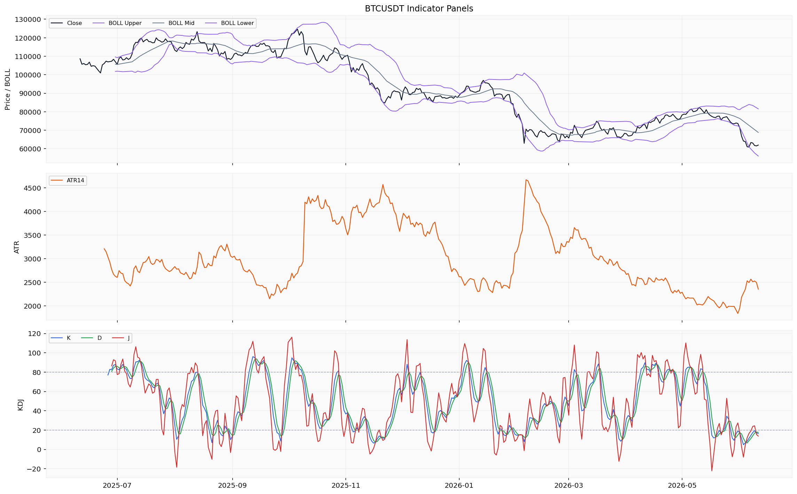
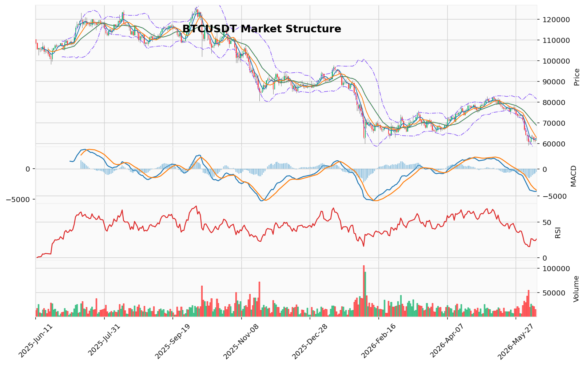

# Bitcoin（BTC）加密资产投资研究报告

> 报告生成时间（美东）：2026-06-10 21:22:25 EDT
> 报告生成时间（北京）：2026-06-11 09:22:25 CST

## 一、投资结论与组合动作

**当前组合动作：持有/观望，不新开仓，不加杠杆，等待数据恢复后重新评估。**

### 动作方向与执行约束

| 维度 | 说明 |
|------|------|
| **动作方向** | 持有现有仓位（如有），不新增买入或卖出，不加杠杆，等待数据恢复后条件化重评 |
| **入场触发** | 当前不触发任何新开仓；具体执行价位需等待行情与技术资料恢复后确认 |
| **目标区间** | 不适用（未开仓） |
| **失效位** | 观望策略失效条件：数据源恢复（尤其是OI、清算地图、链上净流量）并形成明确方向性信号；或价格日线收盘站上64,234.68 USDT且伴随成交量确认 |
| **仓位建议** | 未提供真实持仓参数，无法审计合约风险；不写任何仓位数字 |
| **现货/合约选择** | 不需要 |
| **最大风险边界** | 未提供真实持仓与保证金参数，无法设置风险边界；不加杠杆是唯一可控制的风险约束 |

### 决策理由

1. **看跌结构完整性是当前最可靠证据**：价格低于所有主要均线（MA5/10/20），均线空头排列；MACD零轴下方持续发散；123形态确认看跌突破，下跌结构完整；价格远离维加斯蓝带-19.65%。ETF资金持续流出（5日累计约-8.88亿美元）提供已发生的机构级别卖压验证。恐惧指数12分（极度恐惧）反映市场情绪已充分悲观。

2. **关键数据缺口限制任何方向性开仓**：OI/多空比缺失，无法验证空头持仓是否极端拥挤（潜在轧空风险不可排除）；清算地图缺失，无法评估价格下方清算链条规模；链上交易所净流量仅1行数据，无法判断大资金流向；AHR999估值指数缺失，无法进行基本面估值判断。资金费率0.003491%为低位正费率，但仅能说明做多成本不高，不能直接证明空头不拥挤——后者需要OI数据验证。

3. **看涨信号缺乏可执行条件**：RSI 26.07、KD 16.37进入深度超卖，TD Sequential完成看涨反转13计数，单日taker buy/sell ratio为1.659——但这些信号均缺少统计或回测证据，且超卖可钝化、TD13不是交易触发、单日主动买盘回暖在日频累计主动买卖量差-64.79亿USD背景下统计意义有限。

### 需恢复的跟踪数据类别（不自设阈值）

1. **OI/多空比数据**：来源限流缺失；恢复后评估持仓拥挤度和轧空/轧多风险
2. **清算热力图/清算簇数据**：缺失；恢复后评估价格敏感区和清算链条规模
3. **链上交易所净流量数据**：仅1行数据，无法判断趋势；恢复后评估大资金流向
4. **AHR999估值指数**：缺失；恢复后进行基本面估值判断
5. **事件日历**：缺失；恢复后评估近期潜在驱动事件
6. **新闻来源**：仅搜索线索无已验证官方来源；恢复后评估新闻事件影响

---

## 二、市场结构与技术指标分析

### 技术图表

### 当前价格结构

截至2026-06-11，BTC当前价格61,958.0 USDT（实时快照），24h涨跌幅+0.403%，24h成交量16,270.07 BTC（约10.04亿USDT）。日线最新收盘价61,972.0 USDT，处于下跌趋势中的弱势震荡阶段。

**趋势状态**：日线收盘价明显低于MA20（68,796.295），短期均线（MA5、MA10）呈空头排列。价格持续运行于维加斯通道蓝带（EMA144/EMA169约76,393-77,867）下方，距蓝带中线约-19.65%。

**动量状态**：RSI14报26.07，处于超卖区域（低于30）；KD指标K值16.37，接近超卖阈值20下方；MACD柱状图仍为负值（-586.92），信号线和MACD线均在零轴下方；TD看涨反转13计数已完成，为结构层面的潜在反转信号。

### 指标覆盖与可用性

| 指标 | 状态 | 说明 |
|------|------|------|
| 布林带 | 可分析 | 上轨81,554.49，中轨68,796.30，下轨56,038.10 |
| 维加斯通道 | 可分析 | EMA144=76,393.95，EMA169=77,866.87 |
| 双线反转（EMA20/EMA50） | 可分析 | —— |
| AMD/SMC | 可分析 | 下跌推进阶段，流动性池代理可识别 |
| 123突破 | 可分析 | 下破已确认，突破位74,289.6 |
| FVG | 可分析 | 候选21个，未回补5个 |
| OB订单块 | 可分析 | 近期无确认结构突破 |
| RSI | 可分析 | RSI14=26.07 |
| MACD | 可分析 | MACD=-4,118.03，信号线=-3,531.10，柱=-586.92 |
| KD | 可分析 | K=16.37，D=17.66，J=13.80 |
| TD 9/13 | 可分析 | 看涨反转13计数完成，置信度中等 |
| 谐波形态 | 可分析 | 未匹配到有效候选 |
| 交易密集带/成交量分布 | 可分析 | POC 68,021.11 USDT |
| 清算地图（BTC专用） | 缺失/不可用 | 来源限流未返回 |
| CVD/主动买卖量 | 可用（代理指标） | 主动买卖量差代理 |
| 资金费率 | 可分析 | 最新0.003491% |
| OI/多空比 | 缺失/不可用 | 来源限流 |
| 宏观 | 由新闻/宏观资料包负责 | 非市场报告维度 |
| 链上 | 缺失/不可用 | 仅1行交易所余额数据 |
| AHR999 | 缺失/不可用 | —— |

### 指标推导过程

#### OB订单块

| 指标 | 数据 | 推导 | 交易作用 | 失效条件 |
|------|------|------|----------|----------|
| OB订单块 | 近期没有确认的结构突破（CryptoLens分析状态） | 当前阶段未形成被价格结构确认的订单块突破信号 | 无活跃订单块可作用于当前价格位置 | 需要价格运行至候选订单块区间并形成结构突破确认 |

#### POC/成交量分布

| 指标 | 数据 | 推导 | 交易作用 | 失效条件 |
|------|------|------|----------|----------|
| POC（成交量控制点） | POC 68,021.11 USDT，价值区间65,596.51-80,144.10 USDT，基于160个样本（OHLCV近似分桶） | 当前价格61,972.0运行于价值区间下方，远离POC | 价值区间下沿65,596.51可作为上方近期技术参考区域 | 成交量样本扩充后POC和价值区间可能偏移 |

#### TD Sequential

| 指标 | 数据 | 推导 | 交易作用 | 失效条件 |
|------|------|------|----------|----------|
| TD 9/13 | 方向：看涨反转；启动计数1；倒数计数13；信号：TD看涨反转13计数完成；置信度：中等 | 日线级别完成看涨反转13，属于潜在衰竭反转信号 | 作为结构层面的潜在反转参考，但不构成交易触发 | 价格继续创新低则计数失效，需重新计数 |

#### 谐波形态

| 指标 | 数据 | 推导 | 交易作用 | 失效条件 |
|------|------|------|----------|----------|
| 谐波形态 | 状态：未匹配到有效候选；AB/XA=1.469，BC/AB=2.404，CD/BC=0.381 | 当前摆动结构未满足已知谐波形态的比例条件 | 无法基于谐波形态得出技术参考位 | 后续摆动形成新的比例关系后重新评估 |

#### FVG

| 指标 | 数据 | 推导 | 交易作用 | 失效条件 |
|------|------|------|----------|----------|
| FVG（公允价值缺口） | 候选21个，未回补5个；最近上方缺口中线65,478.66 USDT | 上方存在未回补缺口区域，缺口下沿可能构成上方技术参考 | 未回补缺口位置可作为上方潜在价格吸引区域参考 | 价格未触及或直接穿过缺口则参考价值降低 |

#### AMD/SMC与123突破

| 指标 | 数据 | 推导 | 交易作用 | 失效条件 |
|------|------|------|----------|----------|
| AMD/SMC | 高点下移、低点下移；下跌推进阶段；买侧流动性64,234.68（2026-06-07），卖侧流动性59,130.91（2026-06-05） | 当前处于下跌推动结构中，已形成明显的流动性池代理位置 | 买侧流动性64,234.68为上方近期技术参考，卖侧流动性59,130.91为下方近期技术参考 | 价格突破上述流动性池区域则结构判定需重新评估 |
| 123突破 | 下破已确认，方向看跌，突破位74,289.6 | 三点结构完成下破，处于看跌延续状态 | 74,289.6被确认为上方有效结构突破位 | 价格回升并站上突破位将否定当前判定 |

#### Vegas/布林带/RSI/MACD/KD

| 指标 | 数据 | 推导 | 交易作用 | 失效条件 |
|------|------|------|----------|----------|
| 维加斯通道 | 价格在蓝带下方；EMA144=76,393.95，EMA169=77,866.87；距蓝带中线-19.65% | 长期趋势处于下行轨道，价格显著偏离蓝带中线 | 蓝带区域（约76,393-77,867）构成长期技术参考区间 | 价格回升至蓝带内部则需重新评估趋势 |
| 布林带 | 上轨81,554.49，中轨68,796.30，下轨56,038.10 | 价格61,972.0位于中轨与下轨之间，靠近下轨区域 | 布林下轨56,038.10为下方技术参考区域 | 价格运行至上下轨之外时通道意义改变 |
| RSI | RSI14=26.07 | 进入超卖区域（低于30），表示短期下跌动量可能接近衰竭 | 超卖读数可用于描述当前动量状态 | 若RSI持续下行不反弹，则超卖钝化，参考意义降低 |
| MACD | MACD=-4,118.03，信号线=-3,531.10，柱=-586.92 | MACD线和信号线均在零轴下方，柱状图负值，动能仍偏空 | 空头动能占主导，暂无底背离信号 | MACD柱状图收窄或金叉则动能结构改变 |
| KD | K=16.37（低于超卖阈值20），D=17.66，J=13.80 | K值进入超卖区（低于20） | 摆动指标层面显示超卖状态 | 若K值持续低于20并钝化，超卖参考意义降低 |

#### 清算地图/CVD/资金费率/OI/多空比

| 指标 | 数据 | 推导 | 交易作用 | 失效条件 |
|------|------|------|----------|----------|
| 清算地图 | 缺失/不可用（BTC专用口径，来源限流未返回） | 无法评估清算簇价格位置和规模分布 | 不能作为当前价格附近清算密集区的参考 | 需恢复清算热力图数据源 |
| CVD/主动买卖量 | 主动买卖量差代理：-6,479,297,246.43 USD（366行日频代理数据）；2026-06-11 taker buy/sell ratio=1.659 | 最近一日主动买量大于卖量（比值为1.659），但累计年度代理量差为负值 | 当日主动买盘相对积极，但需注意此为代理指标 | 标准CVD恢复后可获得更精确的主动买卖量序列 |
| 资金费率 | 最新0.003491 percent（2026-06-11）；近5日范围0.001524-0.005066 percent | 当前费率在近5日属于中等偏低水平 | 多头持仓成本不高，未出现显著的费率过热信号 | 若费率持续上升或转为负值，需重新评估持仓成本环境 |
| OI/多空比 | 缺失/不可用（来源限流） | 无法评估未平仓量趋势和多空持仓倾向 | 不能作为持仓拥挤度和方向性资金偏好的依据 | 需恢复OI和多空比数据源 |

#### 宏观/链上/AHR999/事件

| 指标 | 数据 | 推导 | 交易作用 | 失效条件 |
|------|------|------|----------|----------|
| 宏观 | 行情资料包不重复判断宏观/新闻；由新闻/宏观资料包负责 | 当前行情资料包未包含宏观数据，需回看新闻/宏观资料包 | 当前不能作为交易依据 | 需宏观/新闻资料包补充 |
| 链上 | 交易所余额：647,500.23 BTC（2026-06-10，MULTI_CHAIN），仅1行数据，来源限流 | 交易所余额可用样本点极少，无法形成趋势判断 | 不能基于单点数据推导流向意图 | 需恢复交易所净流量完整序列 |
| AHR999 | 缺失/不可用 | 未取得BTC估值指数读数 | 不能作为当前估值参考 | 需恢复AHR999数据源 |
| 事件 | 事件日历缺失/不可用 | 无法判断相关事件类型是否构成驱动 | 不能作为当前交易依据 | 需事件数据提供方恢复 |

### 数据状态总结

市场资料包返回状态为**部分可用**。具体限制包括：

1. **OI与多空比**：来源限流（rate limited），仓库无可用记录。缺失未平仓量、多空比、清算统计、清算热力图和期权数据。这是当前最大的分析盲区，无法判断持仓拥挤度和衍生品方向性偏好。

2. **链上数据**：仅返回1行交易所余额（647,500.23 BTC，2026-06-10，MULTI_CHAIN），来源限流严重。无交易所净流入序列，无法判断持币者流向。

3. **标准CVD缺失**：使用主动买卖量差作为代理指标（366行日频），虽然可用但精度低于标准CVD序列。

4. **小时行情**：仅覆盖2026-04-30至2026-06-11（1000行），未覆盖完整分析区间（2025-06-11至2026-06-11），更细粒度小时分析存在样本限制。

5. **AHR999与事件日历**：均缺失/不可用。

### 关键技术参考位

| 方向 | 价位（USDT） | 技术含义 |
|------|-------------|----------|
| 上方近期 | 64,234.68 | AMD/SMC买侧流动性 |
| 上方近期 | 65,478.66 | FVG缺口中线 |
| 上方近期 | 65,596.51 | 价值区间下沿 |
| 上方中期 | 68,796.30 | MA20/布林中轨 |
| 上方长期 | 76,393-77,867 | 维加斯蓝带（EMA144/EMA169） |
| 下方近期 | 59,130.91 | AMD/SMC卖侧流动性 |
| 下方中期 | 56,038.10 | 布林下轨 |

**说明**：以上均为技术参考位，未由资料包明示为可执行交易条件、入场、退出、止损、目标或失效触发位。清算地图缺失意味着无法确认下方是否存在清算密集区提供或消除支撑。

### 资料限制与待确认条件

- 技术指标呈现一致的弱势结构——价格低于所有主要均线和价值区间，RSI和KD进入超卖区域，MACD维持零轴下方空头排列，TD看涨反转13完成提示潜在衰竭机会。但衍生品持仓（OI、多空比）、清算分布、链上流量和事件日历大面积缺失，技术面信号缺乏资金面和持仓面的交叉验证。
- 在OI/多空比、清算地图、链上交易所净流量和事件日历恢复之前，任何方向性结论的置信度都受到明显压制。当前技术面虽呈现弱势结构，但超卖指标（RSI、KD）已进入历史低位区，单纯基于技术指标的继续看空存在指标钝化风险。
- 等待对应数据恢复后重新评估，当前不预设方向动作。

## 三、项目与代币基本面分析

本节整合基本面报告中的项目定位、需求真实性、代币供应、流通量、FDV、市值、TVL、协议收入、费用捕获、链上使用、生态应用、竞争格局、治理、解锁和安全边界等维度。由于基本面资料包为“部分可用”状态，仅返回价格、市值、流通供应量、ETF资金流和交易所余额快照，供给与发行材料、链上使用数据、生态经营数据、估值指标等关键维度大面积缺失，本节结论的置信度受到严重限制。

### 3.1 价格与市值概况

截至2026-06-11，BTC最新价格为61,890 USD，市值约1.24万亿美元，24小时成交量约277.4亿美元。日频历史数据显示，2026-06-07至2026-06-11期间价格在60,866–63,244 USD区间波动，最新收盘价处于该区间中下沿。流通供应量约2,004万枚BTC（2026-06-10数据）。

**投资含义**：当前价格位于近期波动区间的偏低位置，但缺乏估值指标（AHR999、FDV、NVT等）来判断该价格水平是低估、高估还是合理估值。市值与供应量数据仅为快照，不能推导价格趋势或价值判断。

### 3.2 ETF资金流

美国比特币ETF资金流数据显示，近期（2026-06-03至2026-06-09）呈现整体净流出态势：

| 日期 | ETF资金流（USD） |
|------|------------------|
| 2026-06-03 | -396,600,000 |
| 2026-06-04 | +3,200,000 |
| 2026-06-05 | -325,700,000 |
| 2026-06-08 | -91,400,000 |
| 2026-06-09 | -77,400,000 |

过去五个交易日中有四日为净流出，累计净流出约8.88亿美元。该方向缺少统计或回测证据，无法确认当前净流出是否处于历史分位或具有趋势性信号意义。ETF资金流数据未覆盖完整分析区间（仅至2026-06-09），且样本时间范围有限，不能据此做出方向性判断。

**投资含义**：ETF净流出是已发生的机构级别卖压，但由于缺少链上交易所净流量数据（仅1行数据）进行交叉验证，无法判断该ETF流出是否对应交易所余额的实际增减（即资金是否真的离开市场，抑或只是从ETF形式转为直接持有）。该卖压对短期市场情绪和流动性的影响有待链上数据恢复后进一步评估。

### 3.3 交易所余额

最新单点数据显示，BTC在交易所的余额为647,500 BTC（2026-06-10，MULTI_CHAIN）。该数据仅为单日快照，未返回历史序列，无法判断余额变化趋势、净流入/净流出方向或交易所余额的历史分位水平。该方向缺少统计或回测证据。

**投资含义**：单点交易所余额无法推导持币者流向意图或市场抛压趋势。既不能支持“大量BTC堆积在交易所准备卖出”的看跌叙事，也不能支持“BTC被提走、市场供应减少”的看涨叙事。需要恢复交易所净流量完整序列后进行趋势判断。

### 3.4 数据缺口与基本面维度缺失

以下关键基本面维度因资料包覆盖不足而无法分析，各维度的缺失对整体基本面判断的限制如下：

| 缺失维度 | 影响分析 | 限制说明 |
|----------|----------|----------|
| 供给与发行材料（总供应量、解锁/发行节奏、供应上限等） | 无法判断未来稀释或发行节奏 | 当前快照显示流通供应量与总供应量可能接近，但没有供给来源或协议材料，不能判定“无未来稀释压力”或“供应已接近上限” |
| 链上使用数据（活跃地址、交易笔数、转账量、手续费等） | 无法评估网络使用活跃度和链上经济活动强度 | 相关接口凭证缺失或仓库无可用记录 |
| DeFi与生态经营数据（TVL、协议收入、费用等） | 无法评估BTC在DeFi生态中的参与程度或资产效用 | 凭证缺失和粒度不匹配 |
| 估值指标（AHR999、FDV、NVT等） | 无法构建基本面估值框架 | 均未返回，不能进行合理价格区间或情景目标判断 |
| 机构资金多维度数据（期货持仓、灰度产品、机构托管量等） | 无法全面评估机构资金动向 | 仅ETF资金流数据可用，覆盖面有限 |

### 3.5 基本面判断的约束与投资含义

**投资建议**：无法基于当前基本面数据给出买入/持有/卖出建议。

现有基本面数据（价格、市值、流通供应量、ETF资金流、交易所余额快照）不足以支撑对BTC当前基本面状态、价值水平或中期趋势的可靠判断。供给与发行材料、链上使用数据、生态经营数据、估值指标等关键维度缺失严重，任何基于现有部分快照得出的方向性判断都可能产生误导。

**需要恢复以下五类数据源后方可进行完整基本面分析**：
1. 币种基础元数据（含完整供给参数）
2. 链上使用数据
3. 供给与发行数据（含解锁/发行节奏）
4. 机构资金数据（多维度）
5. 估值数据（含加密资产专用指标）

在上述数据源就绪之前，基本面维度在整体投资决策中的权重应降至最低，组合动作应以技术结构和资金面信号为主要依据。

## 四、新闻、监管与事件驱动

**资料可用性状态：** 新闻资料包已返回部分数据，但全部为媒体聚合搜索线索，无一来自官方公告、监管文件、交易所正式公告或已读取原文的可靠媒体正文。所有事件维度均为“待核验线索”或“无法判断”。

### 4.1 已返回线索类别与验证状态

| 类别 | 返回状态 | 覆盖区间 | 可靠性评估 |
|------|----------|----------|------------|
| 项目新闻（BTC相关） | 24条媒体搜索线索 | 2025-07-05至2026-05-23（未覆盖完整分析区间起始段） | 未核验，不能作为事实源 |
| 宏观新闻 | 70条媒体搜索线索 | 2025-12-03至2026-06-08（未覆盖2025-06-11至2025-12-02区间） | 未核验，不能作为事实源 |
| 官方公告（项目方/基金会） | 未返回 | 无 | 不可用 |
| 监管文件/机构声明 | 未返回 | 无 | 不可用 |
| 交易所公告 | 未返回 | 无 | 不可用 |

### 4.2 事件影响判断

**无法评估外部事件风险。** 搜索线索中涉及的机构名称、法案名称、政策名称、协议升级名称均未经验证，不能作为已确认新闻事实写入报告。相关事件类型（包括但不限于协议升级、供给事件、扩容生态、机构产品、宏观政策、链上活动）均缺少已验证来源，无法判断其方向、时间与影响规模。

### 4.3 对组合动作的支持与约束

- **支持零方向押注**：新闻维度完全无法确认任何方向性事件，进一步强化了“不新开仓、不加杠杆”的保守立场。
- **不能作为开仓理由**：无论在搜索线索中是否存在潜在利好/利空方向，未经核验的内容均不可用于交易决策。
- **需继续观察**：若可靠新闻来源恢复并验证方向性事件（如监管变化、机构配置、安全事件、供给冲击等），需要重新评估对BTC价格和市场情绪的具体影响。

### 4.4 数据限制与待恢复条件

1. **新闻覆盖不足**：项目新闻未覆盖2025-06-11至2025-07-04区间；宏观新闻未覆盖2025-06-11至2025-12-02区间。
2. **来源类型偏斜**：全部返回数据仅为媒体聚合搜索线索，无官方、监管或交易所原始来源。
3. **线索不可升级为事实**：搜索线索中的实体名称在未经原始来源验证前，均不能用于投资判断。
4. **时效性受限**：最新返回线索为2026-06-08，但无可靠来源佐证其真实性。
5. **待恢复数据类别**：建议补充获取BTC官方公告来源、主要交易所正式公告、监管文件、以及已确认原文的行业权威媒体正文，方可进行完整事件驱动分析。

**当前结论**：新闻与事件维度属于“无法判断”状态，对组合动作不构成任何支持或调整依据，也不构成“潜在利好”或“未知利空”的推理基础。

## 五、社区情绪、事件预期与交易拥挤度

### 5.1 市场级情绪读数

截至 2026-06-11，Alternative.me 恐惧与贪婪指数录得 **12 分**，情绪标签为“极度恐惧”。该指数反映的是整体加密市场宏观投资者情绪，并非单一针对 BTC 的社交舆论数据。该方向缺少统计或回测证据，不能据此推导“超跌反弹”或“恐慌持续抛压”等结论。

### 5.2 资料可用状态与缺口

- **市场级情绪数据**：已返回，如上所述。
- **真实社交平台样本**（Twitter/X、Reddit、Telegram、Discord、中文社区等）：**资料包未返回任何可用记录**，相关接口凭证缺失或仓库无可用数据，无法获取具体平台的发帖量、互动量或话题讨论样本。
- **聚合社交指标**（social dominance、帖子数、互动量、叙事标签等）：**全部缺失**，无法还原热度分布与情绪细化方向。
- **事件预期与叙事线索**：未返回可供引用的预期数据或叙事材料。

### 5.3 情绪与拥挤度分析

由于真实社交平台样本和聚合指标全面缺失，以下常规分析维度均无法基于当前资料展开：

- **社区讨论热度与情绪方向**：无法判断。不能辨别当前情绪是恐慌式抛售、分歧扩大，还是关注度下降导致的极端读数。
- **主要叙事与传播路径**：无法判断。无法获知当前社区中流传的主要叙事内容、传播渠道及叙事参与者的变化趋势。
- **参与者结构**：无法判断。无法覆盖参与者类型（散户/机构/矿工/长期持有者）、平台来源分布或语言社区差异。
- **短期市场反应情绪影响**：无法判断。单一恐惧指数不构成对未来 1-5 天价格方向的统计或回测证据。
- **情绪失真风险**：无法量化。没有可用真实社交样本或聚合指标，无法识别刷量话题、KOL 引导式放大或被动清算等失真来源。

### 5.4 数据限制与观察项

1. **单一市场级指标的边界**：恐惧与贪婪指数仅为宏观情绪代理变量，不能等同于 BTC 专属的社区舆论情绪，也无法还原具体的叙事方向、参与主体或行为意图。
2. **社交平台样本全面缺失**：所有基于真实平台原始帖文的分析维度均无法开展。
3. **事件预期缺口**：事件日历缺失，无法评估近期潜在驱动事件对情绪及拥挤度的影响。
4. **时效限制**：返回的情绪数据为 2026-06-11 当日截面快照，不具备时间序列趋势判断能力。

**结论**：当前舆情维度仅支持“极度恐惧”这一市场级情绪单点读数。所有基于真实社交平台样本和聚合指标的分析维度均因数据缺失而无法判断。该读数不支持将其作为方向性交易依据或拥挤度判断指标，只能作为市场背景参考，需等待真实平台样本和事件预期材料恢复后重新评估。

## 六、交易计划与组合风险

本节整合交易员计划与风险辩论，说明在当前数据环境下现货/合约选择、仓位约束、需要等待的验证信号以及资料缺口。由于未提供真实持仓参数，本报告不假设用户已持有任何头寸，也不设置具体执行价位、目标区间或减仓节奏。

### 6.1 当前组合动作：持有/观望，不新开仓，不加杠杆

| 维度 | 说明 |
|------|------|
| **动作方向** | 持有现有仓位（如有），不新增买入或卖出，不加杠杆，等待数据恢复后条件化重评 |
| **入场触发** | 当前不触发任何新开仓；具体执行价位需等待行情与技术资料恢复后确认 |
| **目标区间** | 不适用（未开仓） |
| **失效位** | 观望策略失效条件：数据源恢复（尤其是OI、清算地图、链上净流量）并形成明确方向性信号；或价格日线收盘站上64,234.68 USDT且伴随成交量确认 |
| **仓位建议** | 未提供真实持仓参数，无法审计合约风险；不写任何仓位数字 |
| **现货/合约选择** | 不需要 |
| **最大风险边界** | 未提供真实持仓与保证金参数，无法设置风险边界；不加杠杆是唯一可控制的风险约束 |

### 6.2 多空辩论证据权重分析

**看跌方有效证据（保留）**

| 证据 | 强度 | 限制条件 |
|------|------|----------|
| 价格低于所有主要均线（MA5/10/20），均线空头排列 | 中等 | 缺少统计或回测证据确认持续性 |
| MACD零轴下方持续发散 | 中等 | 同上 |
| 123形态确认看跌突破，下跌结构完整 | 中等 | 同上 |
| 价格远离维加斯蓝带-19.65% | 中等 | 同上 |
| ETF资金持续流出（5日累计-8.88亿美元） | 中等 | 缺少链上净流量数据交叉验证 |
| 恐惧指数12分（极度恐惧） | 低 | 该方向缺少统计或回测证据 |

**看涨方有效证据（保留）**

| 证据 | 强度 | 限制条件 |
|------|------|----------|
| RSI 26.07、KD 16.37进入深度超卖 | 低 | 该方向缺少统计或回测证据；超卖可钝化 |
| TD Sequential完成看涨反转13计数 | 低 | 不是交易触发；该方向缺少统计或回测证据 |
| 2026-06-11单日taker buy/sell ratio为1.659 | 低 | 单日主动买盘回暖在日频累计-64.79亿USD背景下统计意义有限 |
| 资金费率0.003491%（低位） | 低 | 该方向缺少统计或回测证据 |

### 6.3 关键辩论分歧与裁决

**分歧一：资金费率能否证伪轧空风险？**

- **激进派观点**：资金费率0.003491%是极低正费率，证伪了空头极端拥挤的可能，因此可以开空。
- **安全派反驳**：资金费率是多空博弈的成本，不是多空持仓的数量。低正费率可同时存在于多空平衡和空头拥挤但多头顽强抵抗两种场景，无法区分。
- **中立方支持**：用一个缺口数据（OI）推导出的结论（无轧空风险），去支持另一个基于结构优势的论点，在风控上形成闭环但致命的逻辑陷阱。
- **裁决**：激进派的资金费率论证存在逻辑漏洞。在OI数据缺失的情况下，确实不能排除空头拥挤导致轧空的风险。看跌结构优势不能直接转化为开空单的可执行条件。

**分歧二：下方“真空”是空头优势还是风险？**

- **激进派观点**：下方没有已知清算支撑簇，是空头的优势，价格可以更顺畅地下跌。
- **安全派反驳**：所谓“顺畅下跌”，在加密市场往往等同于“瞬时断层”和“流动性黑洞”。在不了解清算数据的情况下，预判“顺畅下跌”并为其下注，就是在赌博数据缺口不会出现黑天鹅。
- **中立方支持**：在没有清算地图的情况下，根本无法评估价格跌向卖侧流动性59,130.91 USDT和布林下轨56,038.10 USDT时，会触发多大体量的连锁反应。
- **裁决**：下方技术位确实存在，但缺失清算地图意味着无法评估价格在跌向这些位置时的清算链条规模。激进派对“顺畅下跌”的预判在风控上不可接受。

**分歧三：单日主动买盘回暖是否为趋势转折信号？**

- **激进派观点**：单日taker buy/sell ratio 1.659是趋势衰竭的第一个信号。
- **安全派反驳**：日频累计主动买卖量差-64.79亿USD是365天持续卖压，单日买盘回暖在此背景下统计意义有限。同时，ETF持续净流出代表机构的、持续性的去风险行为，单日主动买盘难以对抗这种级别的机构卖压。
- **中立方观点**：趋势的转折每次都是以“孤例”开始，不可完全否定；但单日数据无法构建可执行的偏多场景。
- **裁决**：单日主动买盘回暖可作为短期观察信号，但不足以构成方向性交易的依据。

**分歧四：“持有观望”是保护还是放弃？**

- **激进派观点**：持有观望是“选择不盈利”，在结构清晰、风险维度部分可控的情况下，选择不参与就是向谨慎投降。
- **安全派观点**：不亏损就是最大盈利——开空面临不可控的轧空跳跃风险，开多面临确定性逆风，持有观望保护本金并避免了“必亏”的可能。
- **中立方观点**：如果交易员没有现货头寸或找不到合适的期权工具，保持观望、不新开仓、不加杠杆，才是一个被动的但同样有效的平衡策略。持有现金，等待数据恢复，本身就是一种仓位管理。
- **裁决**：在数据缺口导致方向性开仓风险不可量化的环境下，“不亏损就是最大盈利”确实是最审慎的风险管理原则。激进派对“错失机会恐惧”的利用不能取代客观数据限制。

### 6.4 组合经理最终裁决

**当前动作：持有/观望，不新开仓，不加杠杆**

**裁决理由**：
1. **看跌结构完整性被激进派正确识别**，但安全派对资金费率缺点的反驳具有逻辑有效性。资金费率接近零只能说明当前做多成本低，无法直接推断空头是否拥挤。在OI数据缺失的情况下，不能排除空头拥挤导致轧空的风险。看跌结构优势不能直接转化为开空单的可执行条件。

2. **激进派关于“下方真空是空头优势”的论点被有效反驳**。下方技术位（59,130.91 USDT卖侧流动性、56,038.10 USDT布林下轨）确实存在，但缺失清算地图意味着无法评估价格在跌向这些位置时的清算链条规模。激进派对“顺畅下跌”的预判在风控上不可接受。

3. **看涨信号已由所有分析师共同认定为不足**。RSI超卖和TD13本身不是交易触发；单日主动买盘回暖在累计卖压-64.79亿背景下统计意义有限；单日主动买盘回暖虽有限但不可忽略，但无法构建可执行的偏多场景。开多属于高风险投机。

4. **中性派的平衡方案——“不进行方向性押注”——在当前数据环境下具有最高可执行性**。该方案兼顾了看跌结构的客观优势（激进派的合理主张）和数据缺口的不可控风险（安全派的有效警告），提出了一个兼具纪律性和灵活性的方案。持有/观望、不新开仓、不加杠杆是当前唯一能够有效管理风险同时保留方向性判断弹性的选择。

### 6.5 需要恢复的跟踪数据类别（不自设阈值）

1. **OI/多空比数据**：来源限流缺失；恢复后评估持仓拥挤度和轧空/轧多风险
2. **清算热力图/清算簇数据**：缺失；恢复后评估价格敏感区和清算链条规模
3. **链上交易所净流量数据**：仅1行数据，无法判断趋势；恢复后评估大资金流向
4. **AHR999估值指数**：缺失；恢复后进行基本面估值判断
5. **事件日历**：缺失；恢复后评估近期潜在驱动事件
6. **新闻来源**：仅搜索线索无已验证官方来源；恢复后评估新闻事件影响

### 6.6 风险等级与置信度

| 维度 | 评估 | 说明 |
|------|------|------|
| **置信度** | 中等偏低 | 看跌结构提供中期下行概率优势，但关键数据缺口限制了确定性判断 |
| **价格结构风险** | 中 | 价格低于所有主要均线，均线空头排列，MACD零轴下方持续发散；结构完整但缺少统计回测 |
| **数据缺口风险** | 中 | OI/多空比、清算地图、链上净流量缺失，使得方向性判断依赖不完整信息 |
| **流动性风险** | 低-中 | ETF资金持续流出可能影响市场深度，但当前无具体流动性数据验证 |
| **事件风险** | 中 | 事件日历缺失，无法评估近期潜在驱动事件；新闻来源仅为搜索线索无已验证官方来源 |
| **恐惧情绪风险** | 低 | 恐惧指数12分是已知情绪指标，但该方向缺少统计或回测证据表明其为底部信号 |

### 6.7 数据恢复后的重评条件

以下条件不自设数字阈值，数据恢复后基于完整信息重新评估：

**定价与结构条件**
- 价格相对MA5/10/20、布林带、维加斯蓝带的位置
- MACD是否继续发散或开始收敛
- RSI/KD是否继续钝化或反弹

**资金面条件**
- ETF资金流向：需观察是否转为持续净流入（>3个交易日连续）或净流出延续
- 资金费率：是否出现显著负值或正值放大
- 主动买卖量差：日频累计量是否继续扩大或收窄

**待恢复数据类别（不自设阈值）**
- OI/多空比：恢复后评估持仓拥挤度
- 清算地图：恢复后评估价格敏感区和清算链条规模
- 链上交易所净流量：恢复后评估大资金流向
- AHR999估值指数：恢复后进行基本面估值
- 事件日历：恢复后评估近期驱动事件
- 新闻来源：需已验证官方来源确认

**最终可执行动作**：持有/观望，不新开仓，不加杠杆，等待数据恢复后重新评估。

## 七、关键分歧与跟踪条件

本节明确列出组合经理裁决过程中主要的多空分歧、风险争议的最终判断，以及后续需要跟踪的验证条件。内容基于上游已返回的辩论材料和组合经理的最终决策。

---

### 7.1 多空核心分歧裁决

| 分歧点 | 看跌（激进）观点 | 看涨（研究）观点 | 组合经理裁决 | 裁决理由 |
|--------|------------------|------------------|--------------|----------|
| **趋势结构能否直接转化为开空条件** | 是；均线空头排列、MACD发散、123突破确认，结构完整，应顺势做空 | 否；超卖信号（RSI 26.07、TD13）和技术吸引区预示潜在反弹，不能追空 | 结构完整性是当前最可靠的证据，但不能直接转化为开空条件 | 看跌结构提供中期下行概率优势，但OI缺失导致空头拥挤度不可知；资金费率接近零不能证伪轧空风险，开空面临不可控风险 |
| **资金费率0.003491%能否证明无轧空风险** | 能；接近零的正费率表明多头成本低，无空头极端拥挤 | 未直接反驳该点 | 不能；资金费率是多空博弈成本，不是持仓数量；低正费率可同时存在于多空平衡或空头拥挤但多头顽强抵抗两种场景 | 在OI缺失的情况下，资金费率不能作为轧空风险的排除证据；激进派的逻辑存在“用一个缺口填补另一个缺口”的问题 |
| **下方“真空”是空头优势还是风险** | 是空头优势；下方无已知清算支撑簇，价格可更顺畅下跌 | 未直接反驳该点 | 是风险而非优势；缺失清算地图意味着瀑布风险不可测，所谓的“顺畅下跌”等于“流动性黑洞” | AMD/SMC卖侧流动性59,130.91 USDT和布林下轨56,038.10 USDT是已知靶心；无法评估价格跌向这些位置时的清算链规模 |
| **单日主动买盘回暖（taker buy/sell ratio 1.659）是否具有看涨意义** | 否；在日频累计-64.79亿USD卖压下统计意义有限 | 是；趋势转折每次都以“孤例”开始，这是一个潜在的反转信号 | 有限；单日回暖在宏观卖压背景下统计意义有限，但不可完全忽略 | 该读数提供了短期动能变化的客观记录，但不能据此构建可执行的偏多场景；需更多数据验证持续性 |
| **恐惧指数12分（极度恐惧）** | 中性偏空背景；不构成交易依据，但市场情绪充分悲观 | 中性偏积极背景；极度恐惧往往是底部信号的伴随现象 | 有效但有限；该方向缺少统计或回测证据表明其为底部信号或下跌中继指标 | 只能描述当前情绪状态，不能作为方向性判断的依据；该方向缺少统计或回测证据 |

---

### 7.2 看跌方证据的可采纳性判断

| 证据 | 可采纳性 | 限制条件 | 组合经理确认的保留范围 |
|------|----------|----------|----------------------|
| 趋势完整性（均线空头排列、MACD发散、123突破） | 可采纳 | 该方向缺少统计或回测证据确认持续性；技术结构在无资金面验证时可靠性受限 | 保留为当前最可靠的看跌证据 |
| ETF资金持续流出（5日累计-8.88亿美元） | 可采纳 | 为已发生的机构级别卖压，是当前可验证的最强卖压信号；但缺少链上净流量数据交叉验证 | 保留为关键看跌信号；需链上数据恢复后交叉验证 |
| 价格远离维加斯蓝带（-19.65%） | 可采纳 | 属于技术参考位，不构成交易触发或失效条件 | 保留为趋势偏离度参考；无执行意义 |
| 资金费率接近零不支持做多 | 不采纳 | 资金费率不能直接反推空头拥挤度；不可用于支持开空逻辑 | 该方向性解释未由资料包验证；资金费率仅保留为当前读数 |
| “下方真空”支持开空 | 不采纳 | 缺失清算地图使得风险不可量化；预判“顺畅下跌”在风控上不可接受 | 该方向性解释未由资料包验证；下方价位仅保留为技术参考位 |
| 恐惧指数12分支持看跌 | 不采纳 | 该方向缺少统计或回测证据；恐惧指数本身不能作为方向性依据 | 仅保留为情绪读数；不作为看跌证据 |

---

### 7.3 看涨方可采纳性判断

| 证据 | 可采纳性 | 限制条件 | 组合经理确认的保留范围 |
|------|----------|----------|----------------------|
| RSI 26.07、KD 16.37深度超卖 | 可采纳 | 该方向缺少统计或回测证据可钝化，不能作为交易触发 | 保留为动量状态描述；不作为方向性交易依据 |
| TD Sequential完成看涨反转13 | 可采纳 | 该方向缺少统计或回测证据；TD13不是交易触发 | 保留为潜在衰竭信号参考；不作为方向性交易依据 |
| 单日taker buy/sell ratio 1.659 | 可采纳 | 在日频累计-64.79亿USD卖压下统计意义有限；单日数据持续性存疑 | 保留为短期动能变化观察项；不作为方向性交易依据 |
| 上方技术吸引区（64,234-65,596 USDT） | 可采纳 | 仅为技术参考位，非交易目标；需资金推动才能到达 | 保留为上方近期技术参考区域；不构成目标区间 |
| ETF流出“已被价格消化” | 不采纳 | ETF赎回意味着持续现货卖压，非一次性事件；缺链上数据反证 | 该方向性解释未由资料包验证；不采纳该逻辑 |
| 极度恐惧是底部信号 | 不采纳 | 该方向缺少统计或回测证据 | 该方向性解释未由资料包验证；不采纳该逻辑 |

---

### 7.4 组合经理最终采纳的观点结构

- **采纳看跌方的**：趋势完整性、ETF资金流出、主动卖量累计主导（均已发生的事实性证据）
- **不采纳看跌方的**：资金费率证伪轧空、下方真空支持开空、恐惧指数支持看跌（将单点读数外推为方向性判断的问题）
- **采纳看涨方的**：超卖指标和TD13作为潜在衰竭信号（保留为观察项）；单日主动买盘回暖（保留为短期动能变化项）
- **不采纳看涨方的**：ETF流出“已被价格消化”、极度恐惧为底部信号（将信息缺口或情绪读数外推为方向性判断的问题）
- **采纳安全派的**：资金费率不能证伪轧空风险、清算地图缺失使风险不可量化、单日买盘回暖在宏观背景下统计意义有限
- **采纳中立派的**：兼顾看跌结构优势和数据缺口约束，“不进行方向性押注”在当前数据环境下具有最高可执行性

---

### 7.5 关键争议处理

**争议一：资金费率能否排除轧空风险？**

激进派提出“资金费率0.003491%证伪了轧空风险”。安全派反驳：“资金费率是多空博弈的成本，不是多空持仓的数量。一个极低的费率，可以同时存在于多空平衡和空头极度拥挤但多头顽强抵抗两种场景。”中立方也指出：“用缺口数据（OI）推导出的结论（无轧空风险），去支持另一个基于结构优势的论点，这在风控上形成了一个闭环的、自洽但可能致命的逻辑陷阱。”

**裁决**：该方向性解释未由资料包验证，不采纳。资金费率接近零只能说明当前做多成本低，无法直接推断空头是否拥挤。在OI数据缺失的情况下，不能排除空头拥挤导致轧空的风险。

**争议二：下方“真空”是空头优势还是风险？**

激进派认为“下方没有已知清算支撑簇，是空头的优势，价格可以更顺畅地下跌”。安全派指出：“激进同事所谓的‘顺畅下跌’，在加密市场往往等同于‘瞬时断层’和‘流动性黑洞’。”中立方也认为：“在没有清算地图的情况下，根本无法评估价格跌向这些位置时，会触发多大体量的连锁反应。”

**裁决**：该方向性解释未由资料包验证，不采纳。下方技术位（59,130.91 USDT卖侧流动性、56,038.10 USDT布林下轨）确实存在，但缺失清算地图意味着无法评估价格在跌向这些位置时的清算链条规模。激进派对“顺畅下跌”的预判在风控上不可接受。

**争议三：单日主动买盘回暖是趋势转折起点还是噪音？**

看涨方认为“趋势转折每次都是以‘孤例’开始”。看跌方认为单日数据在日频累计-64.79亿USD背景下统计意义有限。中立方指出单日主动买盘回暖“虽有限但不可忽略”，同时承认“无法构建可执行的偏多场景”。

**裁决**：保留为待验证条件。单日主动买盘回暖提供了短期动能变化的客观记录，但不能据此构建可执行的偏多场景。该方向缺少持续性和统计验证，不作为方向性依据。

---

### 7.6 裁决后仍需跟踪的验证条件

以下条件不自设数字阈值、成交量门槛或价格触发位；数据恢复后基于完整信息重新评估。

**定价与结构类（需持续观察）：**
- 价格相对MA5/10/20、布林带、维加斯蓝带的位置变化
- MACD柱状图是否继续发散或开始收敛
- RSI/KD是否继续钝化或反弹
- 123结构下破位（74289.6 USDT）是否保持有效

**资金面类（需持续观察）：**
- ETF资金流向：需观察是否转为持续净流入（>3个交易日连续）或净流出延续
- 资金费率：是否出现显著负值或正值放大
- 主动买卖量差：日频累计量是否继续扩大或收窄
- taker buy/sell ratio：是否持续出现大于1的读数（>2个连续日）

**待恢复数据类别（恢复后重新评估）：**
- 未平仓量（OI）与多空比：来源当前限流，无法判断持仓拥挤度和轧空/轧多风险
- 清算热力图/清算簇：缺失，无法判断价格敏感区和清算链条规模
- 链上交易所净流量：仅1行数据，无法判断持币者流向趋势
- AHR999估值指数：缺失，无法进行基本面估值框架
- 事件日历：缺失，无法评估近期潜在驱动事件
- 新闻来源：仅为搜索线索无已验证官方来源，事件影响无法评估
- 完整供给与发行材料：缺失，未来稀释或发行节奏无法判断

---

### 7.7 数据恢复后的重评原则

当上述待恢复数据类别重新获得可靠来源后，需基于完整信息对以下维度重新评估：

- OI/多空比恢复后：评估持仓拥挤度是否极端偏向某一方向，是否存在系统性轧空或多单平仓风险
- 清算地图恢复后：评估价格相对主要清算簇的位置，判断下方是否存在大规模空头清算支撑或多头清算压力
- 链上净流量恢复后：评估交易所余额变化趋势，判断持币者是在积累还是抛售
- AHR999恢复后：评估当前价格在历史估值分位中的位置
- 事件日历恢复后：评估近期是否有已知的宏观或行业事件可能形成方向性驱动

**重评方向**：等待对应数据恢复后重新评估，当前不预设方向动作。恢复后的完整数据若形成新的可执行方向性信号，则更新组合动作；若仍无法形成高置信度的方向判断，则维持持有/观望。

---

### 7.8 不采纳论点清单

以下论点在裁决中被判定为“把单点读数外推为方向性交易依据”或“将信息缺口包装为方向性结论”，均由资料包验证不足所致：

- 资金费率低位“证伪”轧空风险（缺OI数据、缺回测证据）
- 下方清算空白等于“顺畅下跌”的机会（缺清算地图、缺执行机制证据）
- 恐惧指数12分是底部或中继信号（缺统计回测证据）
- ETF流出“已被价格消化”（缺链上数据交叉验证、缺历史分位）
- 单日主动买盘回暖是趋势转折（缺持续性、缺回测证据）
- 超卖和TD13是买入触发（该方向缺少统计或回测证据）
- 上方技术吸引区是交易目标（缺资金推动验证、缺订单簿证据）

以上方向性解释均未由资料包验证，不能作为当前证据或交易依据。

## 八、最终结论

**组合经理最终动作：持有/观望——不新开仓、不加杠杆，等待数据恢复后重新评估。**

**当前动作成立的核心证据：**
1. **看跌结构完整性已被多方验证**：价格低于所有主要均线（MA5/10/20），均线空头排列，MACD零轴下方持续发散，123突破确认，价格远离维加斯蓝带-19.65%。这是当前最可靠的趋势证据。
2. **ETF资金持续流出提供已发生的机构卖压**：5日累计净流出约8.88亿美元，为已发生的机构级别卖压信号。虽然缺少链上净流量数据交叉验证，但这是当前最直接的资金面证据。
3. **关键数据缺口限制了方向性开仓的可执行性**：OI/多空比缺失导致无法验证空头持仓拥挤度与轧空风险；清算地图缺失导致无法评估价格敏感区与清算链条规模。看跌结构优势无法直接转化为开空单的可执行条件，看涨信号停留在"潜在可能性"层面缺乏可执行条件。

**最关键的重新评估数据类别：**
- OI/多空比：恢复后评估持仓拥挤度与轧空/轧多风险
- 清算热力图/清算簇：恢复后评估价格敏感区与清算链条规模
- 链上交易所净流量：恢复后评估大资金流向与交易所余额变化趋势

**下一步最需要跟踪的3类数据：**
1. **价格结构数据**：价格相对MA5/10/20、布林带、维加斯蓝带的位置变化；MACD是否继续发散或开始收敛；RSI/KD是否继续钝化或反弹。
2. **资金面数据**：ETF资金流向持续性（是否转为连续>3个交易日净流入或净流出延续）；资金费率是否出现显著负值或正值放大；主动买卖量差日频累计量是否继续扩大或收窄。
3. **待恢复数据源的恢复状态**：优先关注OI/多空比、清算地图、链上净流量数据源是否解除限流并返回可用数据。

**最终结论**：当前数据结构呈现清晰的看跌优势，但关键数据缺口使得任何方向性开仓均面临不可控制的风险。看跌结构优势不能直接转化为开空单的可执行条件，看涨信号缺乏可执行条件。持有/观望、不新开仓、不加杠杆是当前唯一能够有效管理风险同时保留方向性判断弹性的选择。数据恢复后，基于完整信息重新评估方向性动作，当前不预设方向性交易安排。
