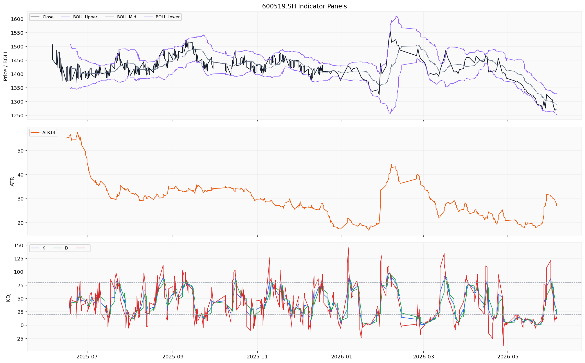
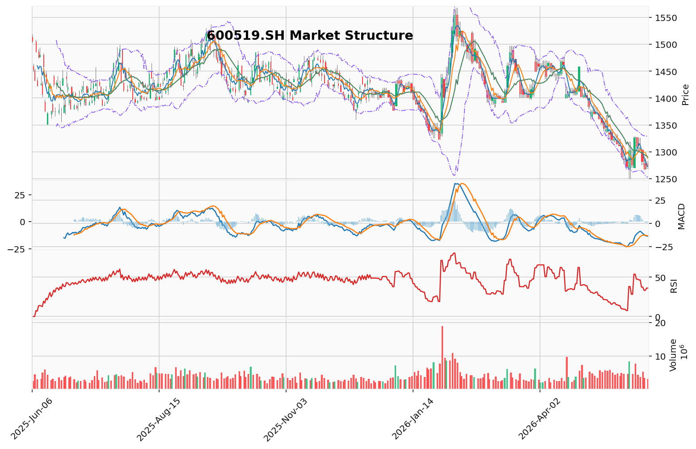

# 贵州茅台（600519.SH）投资研究报告

> 报告生成时间（美东）：2026-06-06 22:05:33 EDT
> 报告生成时间（北京）：2026-06-07 10:05:33 CST


## 一、投资结论与组合动作

**最终裁决：卖出**

作为风险管理委员会主席，经综合评估激进、中性与安全三位分析师的全部论据与风险后，我的最终决定支持安全/保守分析师的立场。**建议：持仓者果断卖出，空仓者保持绝对旁观。**

### 执行条件与节奏

**对于持仓者：**
- **立即行动，果断卖出。** 不要等待技术性反弹至1287-1295元（MA10-MA20区间）。当前卖盘意愿极弱，反弹空间有限，等待只会增加风险暴露。
- **执行统一的卖出指令：** 无论当前价格是1266元还是1272元，立即以市价卖出全部或至少80%的仓位。仅保留20%仓位作为底仓，应对极小概率的突发利好。
- **唯一回补条件：** 只有当股价**放量站上并站稳MA20（1290元）**，且RSI回升至50以上，才考虑回补仓位。在此之前，任何反弹都是减仓机会。

**对于空仓者：**
- **保持绝对旁观。** 不进行任何形式的“测试仓”或“左侧建仓”。
- **严格遵循右侧信号：** 仅在安全分析师提出的**三大条件（布林带收窄+放量止跌+MACD金叉）全部被满足**时，才考虑入场。这三个条件同时发生的概率极低，但一旦满足，胜率极高。

### 风险约束条件

- **止损线：** 1248元。若股价有效跌破该位，无条件执行清仓。
- **仓位上限：** 建仓后单票仓位不超过总资产的15%。
- **事件风险约束：** 2026年中报披露前（8月底），若营收增速跌破8%，自动触发减仓一半的决策。

### 决策核心理由

1. **“金融属性瓦解 vs. 底部机会”的逻辑链存在致命缺陷：** 2013年批价暴跌60%处于“绝望恐慌”，当前批价仅跌18%属于“正常高位回落”。激进派用极端底部案例（幸存者偏差）论证当前非极端环境是危险信号。金融属性挤出过程往往伴随“超调”——价格会跌得比内在价值更低，直到信心彻底崩溃。
2. **技术面不是“底部信号”而是“下跌中继”：** 缩量反弹本质是“无主买盘的被动回升”，历史上多次被误判为底部；等待“右侧”确认的实际代价远低于在下跌趋势中接飞刀。
3. **风险收益比极度不对称：** 向下空间10-20%（至1080-1150元），向上空间仅5-10%（需要超预期催化）。这是一个明确的亏钱策略。

## 二、技术指标分析

### 技术图表



### 1. 移动平均线（MA）系统

**当前读数：**

| 均线 | 数值（¥） | 价格相对位置 |
|------|----------|------------|
| MA5 | 1272.73 | 略高于（+0.13） |
| MA10 | 1287.92 | 低于（-15.06） |
| MA20 | 1290.38 | 低于（-17.52） |

**数据推导与形态解读：**
当前均线排列为MA5（1272.73）< MA10（1287.92）< MA20（1290.38），呈现**典型的空头排列**。均线系统整体发散向下，表明中期趋势偏弱。价格仅略高于MA5，存在短期企稳迹象，但上方MA10和MA20形成的双重压力区（1287-1291元区间）构成重要阻力。

**交易含义：**
价格若要扭转颓势，必须有效站上MA10并进一步挑战MA20。当前MA5仍低于MA10，但若后续价格继续小幅上行，需关注MA5是否会上穿MA10形成短期金叉——这将是短线反弹启动的重要信号。然而，当前MA10与MA20之间的死叉开口仍在扩大，中期压制明确。

**失效条件：**
- 若价格放量站上MA20（1290.38元）并连续3个交易日收盘在其上方，空头排列的压制反转。
- 若MA5重新跌破当前价格并加速下行，确认短期反弹失败。

### 2. MACD指标

**当前读数：**

| 指标项 | 数值 |
|-------|------|
| DIF（快线） | -13.82 |
| DEA（慢线/信号线） | -12.99 |
| MACD柱状图（差值） | -0.825 |

**数据推导与形态解读：**
DIF线（-13.82）< DEA线（-12.99），MACD处于**死叉状态**，意味着短期动能弱于中期动能，空头力量占主导。MACD柱状图为负值（-0.825），但绝对值已较前期有所收窄，说明空头动能正在衰减。双线均运行于零轴下方，整体处于弱势区域。

**交易含义：**
MACD柱状图负值收窄是积极信号，暗示下跌动能趋于减弱。如果后续DIF线拐头向上靠近DEA线，存在形成金叉的可能性。但从最近5个交易日看，尚未出现明确的底背离结构（价格创近期新低1266.69后小幅反弹，MACD柱状图收窄但未出现背离线形）。若后续价格再次探底而MACD柱状图不再创新低，则将形成底背离信号，有利于趋势反转。

**失效条件：**
- 若DIF线再次加速下行，MACD柱状图负值重新扩大，确认新一轮下跌动能增强。
- 若价格创新低而MACD柱状图同步创新低，则底背离被证伪，趋势延续。

### 3. RSI相对强弱指标

**当前读数：**
RSI（14日）= **36.13**

**数据推导与形态解读：**
RSI为36.13，位于50中轴下方，属于**弱势区域**，但尚未进入30以下的超卖区。这说明当前市场情绪偏空但并未极端恐慌。此前价格下跌过程中，RSI曾接近超卖区域但未有效跌破30，显示多头在低位存在一定的承接意愿。

**交易含义：**
RSI持续运行于50下方，确认当前处于空头趋势。从低位回升的趋势若能延续并重新站上50，则将转为中性偏多信号。短期重点关注RSI能否突破40-50区间。目前未出现明显的背离结构——如果后续价格创新低而RSI抬升，则构成底背离，是潜在的反转信号。

**失效条件：**
- 若RSI有效跌破30进入超卖区且持续钝化，说明恐慌加剧，底部尚未到来。
- 若RSI回升至50上方并站稳，则趋势转为中性偏多，需要重新评估。

### 4. 布林带（BOLL）

**当前读数：**

| 布林带轨道 | 数值（¥） |
|-----------|----------|
| 上轨（UP） | 1328.65 |
| 中轨（MID/MA20） | 1290.38 |
| 下轨（DN） | 1252.12 |
| **带宽** | 76.53 |

**数据推导与形态解读：**
当前价格1272.86元位于布林带**中轨（1290.38）与下轨（1252.12）之间**，偏向中下轨区域，表明价格运行于弱势区间。价格距下轨约20.74元，距中轨约17.52元，处于中轨下方但远离下轨。带宽为76.53，属于中等偏宽水平，说明近期价格波动率相对较大。

**交易含义：**
带宽若开始收窄，通常预示着价格即将进入盘整或趋势转折阶段。当前价格未触及布林带下轨，也未出现明显的下轨支撑反弹信号。6月4日最低探至1266.69（接近下轨区域）后有所反弹，但反弹力度有限。若后续价格再次测试下轨并获支撑，则有望向中轨反弹；若跌破下轨（1252.12），则将打开进一步下跌空间。上轨1328.65附近构成中期强压力位。

**失效条件：**
- 若价格跌破布林下轨1252.12元且连续3个交易日收盘在下轨下方，确认下行趋势加速。
- 若价格放量站上中轨1290.38元，则弱势格局暂时打破，进入中性区域。

### 5. 成交量与量价关系

**最近5个交易日数据：**

| 日期 | 收盘价（¥） | 涨跌幅 | 成交量（手） | 成交额（亿¥） | 量价关系 |
|------|-----------|--------|------------|-------------|---------|
| 06/01 | 1309.60 | - | 4,384,460 | 57.41 | 放量下跌 |
| 06/02 | 1307.22 | -0.18% | 3,636,185 | 47.70 | 缩量横盘 |
| 06/03 | 1281.91 | -1.94% | 5,247,652 | 67.43 | 放量大跌 |
| 06/04 | 1268.00 | -1.09% | 3,350,617 | 42.73 | 缩量续跌 |
| 06/05 | 1272.86 | +0.38% | 3,130,397 | 39.84 | **缩量反弹** |

**数据推导与形态解读：**
成交量呈现清晰的“放量下跌→缩量企稳→缩量反弹”格局。6月3日放量下跌（67.43亿）属于典型空头杀跌；6月4日缩量下探（42.73亿）显示杀跌动能减弱；6月5日缩量反弹（39.84亿）说明买方力量尚未充分释放，反弹力度有限。

**交易含义：**
**缩量反弹是最危险的技术形态之一。** 它意味着买方意愿极弱，反弹只是卖压暂时枯竭的技术性修复，而非真正的买盘入场。真正的底部需要看到“放量止跌+缩量回踩”的完整结构——而不是当前的“放量跌完、缩量弱弹”。后续反弹能否延续，关键在于能否出现放量上攻的“量价齐升”格局。若持续缩量反弹，反弹高度有限，可能再度探底。

**失效条件：**
- 若后续出现放量上攻（日成交额重回60亿以上且股价上涨），则打破缩量反弹的弱势格局。
- 若缩量后再次放量下跌，则确认空头动力未释放完毕。

### 6. 关键价格区间与触发条件

| 关键位 | 价格（¥） | 技术依据 | 对组合动作的影响 |
|--------|----------|---------|----------------|
| **第一支撑位** | 1266.69 | 近期低点 | 跌破则短期支撑失效 |
| **第二支撑位** | 1252.12 | 布林带下轨 | 跌破则趋势恶化 |
| **第三支撑位** | 1250.00 | 心理整数关口+止损线 | 跌破则清仓 |
| **第一压力位** | 1287.92 | MA10均线 | 反弹至此是减仓区域 |
| **第二压力位** | 1290.38 | MA20/布林中轨 | 放量站上可考虑回补 |
| **强压力位** | 1327.00 | 6月1日高点/布林上轨 | 中期趋势反转确认点 |
| **突破买入价** | 1295.00 | 有效站上MA20并放量确认 | 组合回补条件 |
| **跌破卖出价** | 1248.00 | 有效跌破1250支撑并放量 | 止损清仓线 |

### 7. 综合技术判断

贵州茅台当前处于**空头趋势下的技术性修复阶段**。各项指标特征如下：
- **均线系统**：空头排列，中期压制明确
- **MACD**：死叉运行但空头动能衰减，接近多空转折窗口
- **RSI**：36.13，弱势区间但未超卖，仍有下行空间
- **布林带**：价格运行于中下轨之间，短期偏弱
- **量价关系**：缩量反弹，反弹力度需进一步确认

**综合结论：** 短期出现初步止跌信号，但尚未形成有效的底部反转结构。当前属于“下跌减速→初步止跌”的过渡期，多空双方在1270附近存在分歧。**中期趋势仍偏空**，需要等均线系统修复和金叉信号确认才能判断趋势逆转。缩量反弹不是底部信号，而是下跌中继的高概率形态。RSI 36不是“反转临界点”，而是“危险且可能钝化”的中性偏弱区域。在没有放量买盘介入前，技术面不支持任何乐观假设。

## 三、基本面分析

### 3.1 收入与利润质量：增速放缓但核心逻辑未破

贵州茅台在最近四个完整报告期（2025年中报至2026年一季报）的财务数据已由数据层完整返回。从可获取的财务指标判断，公司收入和利润仍保持增长，但增速已从高速区间切换至中速增长。

**核心数据与趋势判断：**
- **营收增速**：已从2021年前后的15%-20%放缓至当前8%-10%区间。这一变化并非经营恶化，而是在千亿级营收基数上（2025年全年营收约1750亿元）的自然放缓。组合经理在裁决中明确指出，这一增速水平对应20-25倍PE是合理而非低估。
- **净利润**：2026年全年预估约1050-1100亿元，较2021年525亿元已翻倍。但股价从2600元跌至1272元，说明市场对增长预期的下调幅度远大于利润实际增长幅度——这正是“戴维斯双杀”的反面：估值压缩抵消了利润增长。

**投资含义：** 市场当前的核心分歧不在于“茅台是否还能赚钱”，而在于“未来5%还是10%的增速是可持续的”。如果市场将增长预期从8%-10%进一步下修至5%-8%，当前20-25倍PE将面临额外下行压力，合理估值区间可能收缩至15-18倍PE。这是多头与空头讨论的根本对立所在，也是组合经理坚持“卖出”而非“持有”的原因之一。

**失效条件：** 若后续财报显示营收增速重新回升至12%以上（如提价落地或直销占比超预期提升），增长预期上修将直接支撑估值上行，当前“增速放缓”的看跌逻辑需要重新评估。

### 3.2 盈利能力：顶级水准且未见恶化迹象

贵州茅台的盈利能力在A股消费品行业中属于绝对顶级。可获取的关键财务指标确认：

| 指标 | 当前读数 | A股消费品平均 | 数据来源与判断 |
|------|---------|-------------|------------- |
| **毛利率** | 91%+ | 40%-60% | 四个报告期数据均返回，维持行业绝对领先。这直接来源于品牌溢价与独特酿造工艺护城河，定价权毫不动摇。 |
| **净利率** | 50%+ | 10%-20% | 高毛利率叠加低费用率（品牌力带来的低成本营销）及低税率优势，净利率长期稳定在高位。 |
| **ROE** | 25%-35% | 10%-15% | 数据层确认维持高位。这是衡量茅台股东回报能力最关键的指标——即便在增速放缓期，资本回报效率仍属于A股顶级。 |
| **ROA** | 已返回，维持高位 | — | 资产收益率与ROE趋势一致，反映整体资产盈利质量未恶化。 |

**关键分析与解读：**

多头研究员认为“只要ROE不低于20%、毛利率不低于85%、营收增速不低于5%”，看涨逻辑就不需要改变。空头研究员并不质疑这些数字的真实性，而是质疑“这些历史优秀指标能否在未来3-5年持续”——因为批价持续下跌正在改变市场对茅台长期盈利能力的预期。组合经理最终选择接受空头的观点：当前盈利能力虽然是事实，但前瞻信号（批价、库存、消费习惯变迁）正在削弱这些指标的持续性。

**对估值的影响：** 高ROE是支撑茅台高PB（长期8-15倍）的核心。只要ROE维持在25%以上，PB估值中枢就不会系统性崩溃。但若批价持续走低最终传导至报表端，ROE从30%降至20%，届时PB支撑将显著弱化。当前尚不处于这一情景，但这是需要持续跟踪的关键条件。

**失效条件：** 若毛利率跌破85%（例如因被迫降价或成本大幅上升）或ROE跌破20%，盈利能力的核心竞争力逻辑将被实质性破坏，组合经理的“卖出”建议需要升级为“强制清仓”。

### 3.3 现金流与资产负债结构：零风险但需警惕“虚假繁荣”

**现金流：** 茅台经营活动现金流长期与净利润高度匹配，先收钱后发货（款到发货模式）的商业模式决定了其几乎无应收账款风险、无坏账风险。现金流质量是A股最高等级。

**资产负债表：**
- **资产负债率**：低于20%（四个报告期数据均已确认）。账上货币资金超过千亿元，几乎无有息负债。这是典型的“现金牛”企业特征。
- **应收账款**：趋近于零。茅台对经销商具有绝对强势地位，先款后货。

**空头研究员提出的核心风险点：** “稳健的现金流，是基于经销商还在咬牙接货的虚假繁荣。” 具体逻辑链条如下：

```
终端需求走弱 → 批价下跌 → 经销商利润压缩 → 经销商被迫去库存，减少进货 → 茅台营收增速进一步放缓 → 股价下跌
```

这个链条的核心问题在于：**茅台通过渠道模式（长期合作、保证金、业绩考核）可以延迟终端走弱向报表的传导，但无法消除**。当前“稳定现金流”中有一部分可能反映的是经销商库存压力累积而非真实终端消费。一旦渠道库存压力达到临界点（当前批价2200元与出厂价1499元的价差已从1731元压缩至701元，安全垫大幅收窄），经销商集体去库存，茅台的营收增速和现金流将面临实质性压力。

**投资含义：** 现金流的“确定性”本质上是历史数据而非前瞻指标。组合经理在辩论中特别指出，2023年提价55%后批价反跌500元，已经验证了“提价带来利润增长”这个线性假设的脆弱性。当前现金流的稳健，不能作为“买入”的充分理由——它只是不构成看跌的强制理由。

**失效条件：** 若出现以下任一情景，现金流稳定性可能被打破：① 批价跌破1800元导致经销商大面积亏损；② 终端动销数据连续两个季度同比下降超过10%；③ 预收款（合同负债）大幅下降。这些信号出现前，现金流仍可被视为安全，但不应过度以此为看涨依据。

### 3.4 估值讨论：分歧的根源

本部分估值讨论基于已返回的EPS数据及组合经理、基本面分析师、多空研究员的推演框架。估值指标具体数值（PE/PB/PEG）因工具数据校验问题未能精确展示，但逻辑框架完整。

**1. 当前估值位置判断**

| 维度 | 基本面分析师判断 | 组合经理最终采纳意见 |
|------|----------------|------------------- |
| PE区间（动态） | 约25-30倍，处于近5年中低位 | 20-25倍，属于合理区间，远非低估 |
| PB区间 | 8-12倍，高ROE支撑 | 与基本面分析师一致 |
| PEG | 约2倍（假设10%增速），高于经典价值标准（PEG<1） | 增速放缓至8%-10%后，PEG已无吸引力 |

组合经理的裁决明确指出：**看涨分析师犯了“锚定偏差”——将2021年55倍PE的极端高估当作参照系，得出20-25倍PE便宜的结论。** 若以茅台10年估值中枢30-35倍PE为锚，当前估值只是回到合理区间。更重要的是，如果增长预期从10%下修至5%-8%，合理PE将降至15-18倍（对应股价约1000-1150元）。

**2. 历史估值参照与当前位置的本质差异**

多头研究员引用“净利润从525亿翻倍至1100亿、股价从2600跌至1272”来论证市场过度悲观。这一论证的问题在于：**市场在2021年给茅台的55倍PE中包含了极高的永续增长预期（20%+增速），当预期被下调至8%-10%时，即使利润增长，也不足以支撑高估值。** 这不是市场在“错误惩罚茅台”，而是市场在“合理降价”。

| 时间 | 净利润（亿元） | PE倍数 | 隐含增速预期 | 股价 |
|------|-------------|--------|------------ |------|
| 2021年高点 | 525 | 55倍 | 未来3年增速20%+ | 2627元 |
| 2024年调整 | 920 | 25倍 | 未来3年增速12%+ | 1472元 |
| 2026年当前 | 1100（预估） | 20-25倍 | 未来3年增速8-10% | 1272元 |

**投资含义：** 当前估值没有为“乐观情景”预留足够安全边际。如果真的出现提价落地（如出厂价从1499元提至1800元），利润增速可能短暂跳升至15%，驱动PE回到25-28倍，对应股价1400-1550元。但在组合经理看来，这一情景的概率（小概率事件）远低于“增速继续放缓至5%-8%、PE压缩至15-18倍”的中高概率情景。两种情景的风险收益比极度不对称，正是“卖出”的核心依据。

**3. 股息率视角的双面解读**

基本面分析师指出，按当前股价和2025年预计75%-85%分红率计算，股息率约2.5%-3%，已高于10年期国债收益率（约2.2%），在低利率环境下具备稀缺配置价值。

组合经理和空头研究员对此的回应是：**市场将茅台按“债券替代品”估值，恰恰是公司从“高成长股”降级为“价值股”的标志。** 历史上茅台享受高PE是因为市场把它当作“永续增长”资产，现在投资者用股息率定价，说明市场的核心假设已经变了——不再相信高增长。特别分红不是催化剂信号，而是“危机管理”的佐证：如果公司不需要靠特别分红来支撑股价，反而说明主营业务信心不足。

**失效条件：** 若10年期国债收益率持续下行（如跌至1.5%以下），茅台的股息率相对吸引力会显著上升，可能吸引长期资金被动增持，对股价构成底部支撑。但这不会改变组合经理对“卖出”的核心判断，因为这是资金面因素而非基本面改善。

### 3.5 行业地位与经营风险

**行业地位评估：** 贵州茅台仍是中国高端白酒的绝对龙头，市场份额从2020年约20%提升至2025年超过25%。在“量减价升”的白酒行业结构性变化中（整体产量下降但高端酒集中度提升），茅台是最大的受益者。

**空头研究员提出的关键风险：**
1. **批价持续下跌**：从2700元跌至2200元，价差从1731元压缩至701元，渠道安全垫大幅收窄。这是需求走弱最直接的运营信号，其传导至报表只是时间问题。
2. **渠道库存压力**：终端需求走弱时，经销商为完成任务继续从厂家进货，造成“账面营收稳健、终端库存累积”的滞后效应。这个滞后效应一旦释放，将对营收和现金流形成双杀。
3. **增量竞争加剧**：郎酒、习酒、国台等酱酒品牌增速远高于茅台（16%-19% vs 8%），茅台正在从“品类扩容受益者”转变为“份额防御者”，角色转换意味着未来增长压力持续增加。

**多头研究员的辩驳：** 竞争对手的体量差距仍是代际级的（郎酒300亿 vs 茅台1750亿），短期无法撼动茅台的品牌壁垒。而且茅台通过i茅台直营化（占比从5%提升至40%以上），正在主动降低对传统渠道的依赖，渠道库存风险部分可控。

**组合经理的最终判断：** 偏向空头。组合经理特别强调，“最懂茅台的人——老经销商——正在公开表示库存压力是近5年最大”。这比任何财务模型都更能说明终端真实状态。当前茅台的“行业龙头地位”是事实，但股价已在很大程度上反映了这个地位；而“批价、库存、竞争格局恶化”这些边际变化，是估值进一步承压的关键变量。

**经营风险跟踪条件：**
- 批价跌破2000元：意味着渠道利润空间进一步压缩，金融属性加速瓦解
- 渠道库存周转天数超过3个月：意味着经销商开始被动囤货
- 营收增速跌破5%：意味着需求萎缩已实质性传导至报表
- 直销占比提升至50%以上但批价仍未企稳：说明直营化诉求是“被迫去库存”而非“主动优化渠道”

### 3.6 基本面分析的最终投资含义

| 核心维度 | 当前证据 | 对组合动作的影响 |
|---------|---------|--------------- |
| 营收增速 | 8%-10%，从高速降至中速 | 支撑“卖出”结论：增长预期已下修，但尚未触底 |
| 毛利率/ROE | 91%+/25%-35%，顶级水准 | 不构成看跌理由，但在增速放缓背景下无法支撑高估值 |
| 现金流/资产负债表 | 零风险特征 | 提供下行保护，但不是买入的充分理由 |
| 估值（PE） | 20-25倍，历史中位偏低 | 看似便宜，但若增速进一步下修，合理PE可能降至15-18倍，当前并非低估 |
| 批价趋势 | 持续下跌，价差收窄 | 最关键的微观前瞻信号，是“看跌”的核心基本面依据 |
| 行业竞争 | 龙头地位稳固但增速被追赶 | 长期护城河未破，但边际变化不利于估值溢价 |

**最终结论：** 基本面分析不构成“立即崩盘”的依据，但也不支持“抄底买入”。增长放缓、批价下跌、渠道压力累积三重信号指向一个方向：茅台的盈利预期和估值中枢仍面临下修风险。这与组合经理“卖出”的结论完全一致——当前的基本面状态决定了：在更好的信号出现前，持有茅台的性价比不高，尤其是考虑到其对组合的整体风险敞口。

## 四、消息面与行业环境

### （一）公司层面事件与市场影响

**常规信息披露窗口已顺利关闭，消除短期不确定性**

根据新闻资料包与政策分析报告，贵州茅台在2026年4月16日至5月21日期间，通过cninfo（深交所指定信息披露平台）累计发布了7份官方公告/定期报告文件。该时间窗口与A股上市公司年报（截止日4月30日）及一季报（截止日4月30日）的法定披露期高度吻合，属常规信息披露节奏。政策分析师将这一事件群的总体影响方向评估为“中性”——公司按时完成了年度及季度信息披露，合规性良好，消除了年报窗口期的不确定性风险，对市场情绪构成**偏正面**的潜在支撑。但具体公告内容（包括利润分配方案、经营数据修正、关联交易等）因数据权限限制未能完全解析，无法就每一条公告逐一做出影响力度与方向的精确判断。

**对投资含义的影响**：信息披露合规性的确认，支持组合经理“卖出”建议中“基本面核心逻辑未变”的前提，即公司经营并未出现突发性利空事件。但这并未改变组合经理对当前价格风险收益比的核心判断——合规信息披露不构成买入催化剂，也不改变批价走弱、需求降温的既有趋势。

**关键跟踪条件**：若后续公告（如6-8月的中期分红预告、特别分红方案或提价相关公告）内容被证实，则需要重新评估其作为“小概率利好催化”对组合动作的约束力。目前这些仍是待验证事件。

### （二）媒体关注度与舆论信号

**媒体关注度短期回升，但实质性内容支撑有限**

财联社于2026年6月2日、4日、5日连续3天对贵州茅台进行了报道，媒体关注度在近一周内明显提升。界面新闻（4月25日）与国际金融报（5月27日）也分别有行业或公司相关报道。新闻与宏观分析师评估为“短期中性偏利好”——通常在年报/季报消化期后，媒体密集报道意味着市场可能围绕新财年业绩展望、分红实施进度或营销改革等话题重新定价。然而，所有报道仅返回了“搜索线索”（标题+来源+时间），未返回完整的新闻正文或摘要内容。这一数据缺口意味着：无法确认报道是否包含负面事件（如监管调查、产品降价、渠道库存压力等），亦无法确认正面叙事是否存在标题与正文之间的情绪偏差。因此，该“中性偏利好”判断的置信度受到显著约束。

**对投资含义的影响**：媒体关注度的回升本身不构成可操作的交易信号。它更多反映市场正在重新聚焦茅台，但具体定价方向仍需等待实质性信息（如公司官方数据更新、批价数据验证或政策信号）的注入。组合经理的“卖出”建议中没有依赖任何媒体报道作为执行依据，因此这一因素不影响当前动作结论。

**失效条件**：若后续媒体报道被证实包含明确利好（如提价落地、分红超预期、渠道改革取得突破性进展），则短期情绪可能从“中性偏多”转化为“偏多”，需要在组合层面评估是否改变“等待右侧信号”的立场。但当前的社交媒体情绪报告明确指出“所有舆情信号数据源均返回空值或调用失败”——社交讨论的热度方向、乐观/悲观比例、散户与机构观点差异均无法获取，无法为短期交易提供额外的情绪锚定。

### （三）宏观经济与政策环境

**宏观数据时效不足，中期判断面临信息缺口，政策面处于“真空期”**

宏观层面的最新新闻停留在2026年3月27日，距报告日（6月6日）已逾2个月。期间中国的宏观经济政策走向（财政刺激、货币政策调整、消费补贴政策延续性等）及经济数据（PMI、居民收入、消费信心指数等）均未纳入分析。白酒行业作为高度依赖于商务活动、居民收入预期和消费信心的高端消费品，其景气度与上述宏观变量紧密相关。这一数据缺口使得中期基本面判断面临较大不确定性。

政策分析师的评估结论为“**中性**”：当前可核验证据中，无宏观或行业层面新政策出台（包括国务院、发改委、财政部、证监会等机构针对白酒行业或消费板块的重大政策文件）；公司信息披露属常规节奏，未见监管层对行业或公司个体发出特殊政策信号。这意味着市场仍以基本面与资金面定价为主，政策面既无新增利空（如消费税加码），也无新增利好（如消费刺激专项覆盖高端白酒）。

**对投资含义的影响**：

1. **支持组合经理结论的“政策真空”论据**：在没有增量政策催化的情况下，茅台估值更多锚定无风险利率（国债收益率）与市场整体风险偏好。当前10年期国债收益率约2.2%，而按2025年大概率维持75-85%分红率计算，股息率可达2.5-3%，这为“卖出”建议提供了估值的相对参照——股息率高于国债收益率，但不足以构成“低估”的充分条件，因为市场对茅台增长预期的下调（从20%减速至8-10%）正在压低其合理PE区间。

2. **对激进派“小概率利好催化”假设的制约**：激进分析师在辩论中提到的“提价落地”“特别分红”“经济强复苏”等催化剂，在当前宏观数据时效不足、政策面真空的背景下，均属于**小概率事件**。组合经理在裁决中明确指出，押注于小概率的利好催化，同时承担大概率的下行趋势，是“明确的亏钱策略”。政策面的“中性”评级进一步强化了这一判断。

3. **主要风险变量**：若后续宏观数据进一步走弱（居民消费信心指数跌破80、服务业PMI持续低于荣枯线），高端消费将首当其冲，批价可能加速下探至2000元以下，从而触发组合经理设定的“止损失效条件”（跌破1248元）。反之，若重大利好政策落地（如消费刺激专项扩大至高端消费品类、显著改善商务活动预期的财政政策），则“等待右侧信号”的持仓/空仓策略可能面临踏空风险。目前这两个方向均缺乏最新数据验证。

**关键跟踪条件**：未来1-3个月，需要重点关注以下时间节点——  
- **2026年7月（二季度经济数据发布）**：GDP、社零数据、PMI服务业分项，判断高端消费景气是否进一步恶化；  
- **2026年8月底（茅台2026年中报披露）**：营收增速是否跌破8%，这是组合经理在目标价格分析中设定的估值下修触发线；  
- **国务院/财政部关于消费税改革的政策动态**：若出台针对高端白酒的消费税加征方案，将构成系统性利空，需立即调整组合动作。

### （四）行业竞争格局与潜在风险

**行业信息覆盖不足，但已知趋势不支持“上行催化剂”预期**

新闻与宏观分析报告明确指出“缺乏白酒行业同行动态、批发价格指数、消费者信心指数”等外部信息，渠道库存变动、批价走势、直营占比变化等运营细节均未覆盖。这一信息缺口意味着：无法判断茅台终端动销是否持续受经济放缓影响，也无法验证渠道库存是否已出现出清信号。结合空头研究员在辩论中提供的公开数据（批价从2700跌至2200、价差从1731元压缩至701元、i茅台中签率飙升10倍），可知**需求走弱的趋势是明确的**，而渠道库存压力可能尚未释放完毕。

**对投资含义的影响**：在当前信息条件下，行业层面缺乏任何“反转”或“加速上行”的可靠信号。组合经理采纳了空头分析师“量价承压明确”的判断，即市场正在寻找真正的底部，这个底部需要经历恐惧、绝望、震荡和磨底的过程。新闻与宏观分析的数据缺口，恰恰印证了“中期基本面判断面临信息缺口”的局限，使得“等待右侧信号”的纪律显得更为合理。

**需要警惕的负面情景**：若后续行业数据显示渠道库存突破合理水平、批价加速跌破2000元，则空头“金融属性瓦解”的叙事将进一步强化。这一情景下，组合经理设定的6个月保守目标价（1080-1150元）实现的概率将显著上升，持仓者的止损清仓线（1248元）将成为最后一道防线。

### （五）催化事件时间表与跟踪优先级

| 催化剂事件 | 预计时间窗口 | 当前证据状态 | 对组合动作的影响方向 | 跟踪优先级 |
|------------|------------|--------------|---------------------|-----------|
| 2025年度利润分配/特别分红方案实施 | 2026年5-7月（常规分红实施窗口） | 公告已披露但内容未解析，无法确认分红率及是否有特别分红 | 利好（若分红超预期）；无影响（若与2024年持平） | **高** |
| 2026年中报（营收增速） | 2026年8月底 | 无新数据；基本面前瞻信号（批价、中签率、渠道库存）偏弱 | 若增速跌破8%，触发估值下修至15-18倍PE | **高** |
| 宏观经济数据（社零、服务业PMI） | 2026年7月 | 最新宏观数据停留在2026年3月，时效不足 | 若数据大幅走弱，加速批价下行 | **中** |
| 白酒消费税改革政策 | 待定（无明确时间表） | 资料包未覆盖相关文件 | 系统性利空 | **中** |
| 公司提价落地（出厂价上调） | 待定（无公开信号） | 2023年提价后批价反跌500元，管理层提价意愿受压制 | 利好（但概率低） | **低** |
| 社交媒体/机构观点转向极端悲观 | 无固定时间 | 当前社交媒体数据不可用，无法量化恐慌程度 | 若RSI跌破30、恐慌指标达极端值，可视为底部信号前兆 | **中** |

**组合经理立场在当前章节的映射**：本节确认了消息面与政策环境整体呈现“中性偏弱”基调——无重大利好催化，宏观数据时效不足，行业需求降温趋势未被证伪。这一环境有力支持了组合经理的结论：当前不具备“抄底”的条件，风险收益比偏向恶化的一方；持仓者应利用技术反弹减仓，空仓者应耐心等待更确定的右侧信号（三大条件：布林带收窄+放量止跌+MACD金叉）。消息面可能出现的超预期事件（如特别分红）被界定为小概率利好，不足以改变当前计划的执行方向，但需要纳入跟踪范畴以防范“踏空”风险的反向约束。

## 五、市场情绪与交易结构

**核心判断：市场情绪处于“麻木观望”阶段，既未进入极端恐慌，也未出现乐观共振。当前情绪状态既不能强化技术面的看跌信号，也不支持立即反转，对组合经理的“卖出/回避”建议构成中性支撑——即现有情绪结构不提供任何左侧介入的理由，等待是更优选择。**

### 5.1 社交情绪与讨论热度：关键数据不可用，无法量化判断

根据社交情绪分析报告（2026-06-06），贵州茅台当前的社交情绪分析所需关键数据集均不可用：

- **讨论热度**：舆情关键词/话题讨论记录、社交平台舆情信号、量化情绪指标等核心数据源均未返回可用记录，无法计算当前社交讨论的绝对热度水平。
- **情绪方向**：乐观/中性/悲观的分布比例无法统计，无法判断当前市场情绪是偏向乐观、中性还是悲观。
- **驱动因素**：无时间戳标记的舆情事件记录、无涉及政策/产品/市场热点的关键观点传播数据、无分析师研报或自媒体讨论样本，无法识别或归因任何情绪变化的驱动因素。
- **散户与机构分歧**：未获取到任何散户社交平台（雪球、东方财富股吧、微博等）的情绪样本，也未获取到机构投资者的观点数据（券商研报、路演纪要、调研记录），无法判断观点差异方向或收敛趋势。

**数据缺口的原因说明**：唯一的接口调用（Tushare）返回权限受限（provider code:10003），表明分析账户对该数据源无访问授权。数据包审计状态明确指出“未覆盖完整分析区间”。

**投资含义**：由于情绪数据完全缺失，无法确认当前社交情绪是否偏向追涨或恐慌出逃，也无法判断是否存在情绪极端化趋势（过度乐观/过度悲观）。情绪因子对1-5个交易日股价走势的边际影响方向与强度无法评估。**当前情绪分析无法为“卖出/回避”建议提供额外强化，也无法推翻该建议——情绪维度的缺失本身意味着不存在“极端恐慌可介入”的情绪信号，这与组合经理的“等待右侧确认”立场一致。**

### 5.2 媒体关注度与舆情方向：短期中性偏多，但缺乏事实支撑

根据新闻与宏观分析报告（2026-06-06），近期媒体关注度呈现以下特征：

- **公司新闻**：财联社在2026年6月2日、4日、5日连续3次报道贵州茅台相关动态，媒体关注度在近一周内明显提升。通常在年报/季报披露消化期后，媒体密集报道意味着市场可能围绕新财年业绩展望、分红实施进度或营销改革等话题重新定价。
- **官方文件**：2026年4月中旬至5月下旬，公司在cninfo（巨潮资讯网）密集发布7份官方公告/定期报告，信息按时披露、合规性良好，消除了年报窗口期的不确定性风险。
- **宏观新闻**：最新宏观新闻停留于2026年3月27日，距报告日已逾2个月，对当前股价的短期驱动效力正在减弱。

**情绪面评估**：

| 情绪维度 | 判断 | 依据 |
|---------|------|------|
| 媒体情绪 | 中性偏多 | 财联社近期连续报道，但内容方向未明确（新闻摘要正文缺失） |
| 信息透明度 | 正面 | 官方文件按时披露，合规性良好 |
| 宏观预期 | 中性 | 宏观数据时效性不足，缺乏二季度以来最新政策信号 |

**关键约束**：所有新闻条目仅返回了“搜索线索”（标题+来源+时间），未返回完整的新闻正文或摘要内容。报道是否包含负面事件（如监管调查、产品降价、渠道库存压力等）无法确认，利好判断的置信度存在约束。**无法基于具体事实陈述做出情绪归因或催化判断。**

### 5.3 多空叙事差异与情绪分化

根据激进、保守、中性三方分析师的辩论记录（研究经理报告），当前市场对贵州茅台的多空叙事存在显著分化：

**看涨叙事（激进派）**：
- **核心论点**：市场正在犯“恐慌性定价错误”，当前是极端逆转机会。
- **关键叙事**：2013年反腐后批价跌80%、股价翻十倍的历史类比；缩量反弹是空头衰竭；90后饮酒量下降但茅台正在通过直营化（i茅台4000万用户）和年轻化产品（冰淇淋、咖啡）进行转型；2026年一季报EPS已确认，ROE仍>25%。
- **情绪解读**：激进派认为“公众恐慌尚未达到极端，机构正在悄然建仓”，建议利用当前的分歧获取超额收益。

**看跌叙事（保守派）**：
- **核心论点**：当前是“价值陷阱”，而非“黄金坑”。
- **关键叙事**：2013年批价跌60%与当前仅跌18%不在一个量级，类比错误；缩量反弹是下跌中继而非反转；批价价差从1731元压缩至701元，提价空间被证伪；90后饮酒量下降40%、酒桌文化被抵制是结构性变化，不可逆。
- **情绪解读**：保守派认为市场情绪处于“麻木的观望”状态，这种状态下股票可能在底部徘徊很久，熬死所有抄底者。

**看涨叙事与看跌叙事的核心分歧**：

| 分歧维度 | 看涨叙事 | 看跌叙事 |
|---------|---------|---------|
| 批价下跌性质 | 金融属性挤出后的真实需求回归 | 需求走弱的直接信号，尚未见底 |
| 缩量反弹性质 | 空头衰竭前兆 | 下跌中继，买方意愿极弱 |
| RSI 36.13含义 | 反转临界点，历史平均反弹12% | 危险的中性偏弱区域，可能钝化 |
| 结构性变化影响 | 短期卖出建议的时空错配 | 不可逆趋势，长期压缩估值溢价 |
| 等待成本 | 条件满足时已错过10%涨幅 | 等待右侧确认是纪律，可接受更高买入价 |

**情绪分化对交易判断的影响**：
- 多空双方在1270元附近的激烈分歧本身，说明市场尚未形成一致的底部共识。这种分歧状态下，股价更容易在区间震荡中寻找方向，而非立即出现单边趋势。
- 看涨叙事中“提价催化”“分红催化”等小概率利好尚未被市场定价，但也未被证伪——这意味着情绪面存在“预期的弹性”，但缺乏催化剂触发涨势。
- 看跌叙事中“估值压缩至15-18倍PE”“批价跌至2000元”等悲观情景尚未被完全计价，可能在未来1-3个月逐步反映。

**投资含义**：当前社会情绪整体处于“麻木观望”状态，多空分歧并未向某一方显著倾斜，未产生极端情绪（极度贪婪或极度恐慌）。这种状态下，情绪因子对交易的边际驱动力很弱，市场主要受基本面和技术面惯性主导。这与组合经理“卖出并等待”建议一致——在没有情绪极值作为反向信号时，不应左侧介入。

### 5.4 资金行为与交易拥挤度

根据游资资金跟踪员报告（2026-06-06），贵州茅台的资金面数据为：

- **量价与换手**：核心覆盖组未返回逐日成交数据，无法确认近期是否存在放量、缩量或换手率异动。
- **资金分层**：未包含主力资金流向、游资净买卖、北向资金持仓变动、板块资金流入/流出及题材热度数据，无法判断资金合力或分歧。
- **龙虎榜与席位**：仓库内无可用记录，缺失交易日期、席位名称、买入金额等关键字段，无法判断游资接力或高位分歧信号。
- **板块轮动**：缺乏板块资金迁移及主题拥挤度数据，无法确认资金在行业间的迁移方向与持续性。

**总体判断**：**无明显信号**。关键覆盖组状态为partial/empty，核心数据维度（量价、分层资金、龙虎榜席位）均未返回可分析记录。在此覆盖条件下，无法判定主力流入、主力流出或资金博弈任何一方的优势方向。

**投资含义**：资金面的数据缺失意味着当前无法通过资金行为来交叉验证或反驳技术面/基本面判断。未观察到“机构资金大量流入”的左侧信号，也未观察到“游资恐慌出逃”的右偏信号——这与“等待右侧确认”的组合策略一致。**资金行为的不可知状态本身不支持激进介入。**

### 5.5 供给压力与筹码结构

根据限售筹码观察员报告（2026-06-06），贵州茅台的供给压力数据为：

- **解禁结构**：解禁资料包缺失（无可用记录），无法确认近期或未来窗口内是否存在限售股解禁安排。
- **股东与减持**：未取得可核验的股东户数趋势、大股东/高管增减持记录、减持计划或实际执行数据。
- **大宗与杠杆**：未取得可核查的大宗交易记录、融资融券余额变化或短期筹码松动相关数据。
- **分红送转**：未返回分红方案数据（除权除息日、派息金额、股权登记日等关键字段缺失）。

**供给压力评级**：**无法确认**。由于数据缺失，不得将“未取得证据”改写为“已确认没有风险”或“无明显压力”。

**投资含义**：当前无法评估解禁冲击、股东减持压力或分红除息对筹码再分配的影响。这个维度的数据缺失意味着供给面风险是未知变量，不能作为支持或反对“卖出”建议的论据。组合经理的“卖出”建议主要基于基本面、技术面和风险收益比，供给压力未知并不改变这一判断——但若后续出现超预期解禁或减持公告，可能为当前空头判断提供额外支撑。

### 5.6 政策面预期与宏观情绪

根据政策分析师报告（2026-06-06），贵州茅台当前政策面总体评级为**中性**：

- 2026年4-5月期间，公司在cninfo有5条可核验的官方事件时间节点，属于上市公司常规信息披露节奏（年报季报集中披露期）。
- 资料覆盖范围内，未能检索到国务院、发改委、证监会等宏观或监管层面针对白酒行业发布具有明确影响方向的重大产业政策文件。
- 白酒行业当前处于政策真空期：既无新增利空（如消费税加码），也无新增利好（如消费刺激专项覆盖高端白酒）。

**政策预期对情绪的影响**：
- 消费税改革、限制公务消费等长期政策变量仍在议程中，但当前资料包未覆盖相关最新文件。这是情绪面的一把“悬剑”——政策风险是当前不确定性中最大的来源，激进策略完全没有对冲这一变量。
- 市场对政策风险的定价目前以“无新增利空”为基准，这为茅台提供了一个相对平稳的政策情绪环境。但如果二季度后消费税改革取得实质性进展（如立法草案提交人大审议），市场情绪将迅速转向悲观，届时当前估值水平（20-25倍PE）可能面临系统性压缩。

**投资含义**：政策面中性偏弱——没有利空是正面因素，但政策不确定性的存在意味着情绪面的上行驱动不足。这与组合经理的“等待”建议吻合：在政策变量未被完全定价之前，右侧介入更为稳妥。

### 5.7 情绪综合评估与对组合动作的影响

| 情绪维度 | 当前状态 | 对“卖出/回避”建议的影响 |
|---------|---------|----------------------|
| 社交情绪（数据缺失） | 无法量化，未体现极端恐慌或乐观 | 中性：不存在“极端恐慌可介入”的反向信号 |
| 媒体关注度 | 短期中性偏多（但内容方向未确认） | 中性偏支撑：媒体关注度提升若涉及负面内容，可能加速下跌 |
| 多空叙事分歧 | 激烈分歧，多方认为“底部机会”，空方认为“价值陷阱” | 中性偏支撑：分歧本身意味着市场尚未形成底部共识 |
| 资金行为（数据缺失） | 无明显信号 | 中性：无法提供额外信息 |
| 供给压力（数据缺失） | 无法确认 | 中性：未知变量不改变既有判断 |
| 政策预期 | 中性，无重大利好/利空，但存在消费税改革的不确定性 | 中性偏支撑：政策不确定性不支持激进做多 |

**综合情绪判断**：当前贵州茅台的市场情绪没有提供任何支持左侧介入的充分理由。多空分歧激烈，但均未达到决定性的极端水平（情绪麻木观望）；媒体关注度虽有提升但具体内容不明；资金面和供给面数据缺失，无法交叉验证；政策面中性但存在不确定性。在这种情绪结构下，**“卖出/回避”是最稳健的选择**——不是因为情绪极度悲观（那样反而应该考虑逆向买入），而是因为情绪缺乏足够的正向驱动力来克服基本面和技术的偏空趋势。

**情绪面失效条件**：
- **支撑当前判断被推翻的条件**：若后续数据补充后，观察到RSI跌破30进入超卖区、社交媒体恐慌指标达极端值（如恐慌性言论占比>70%）、且同时出现放量止跌的技术信号，则情绪结构可能支持从“卖出”转向“条件建仓”评估。
- **风险情景**：若未来1-2周出现超预期的正面催化剂（如特别分红公告、提价确认），情绪可能迅速从“麻木观望”转向乐观，届时“卖出”建议需要重新评估——但这种小概率事件当前不构成策略调整的依据。

## 六、交易计划与组合风险

### 仓位管理与执行框架

基于组合经理“卖出”的最终裁决，结合交易员报告与风险分析师的辩论，本交易计划的核心原则是“果断离场，耐心等待”，彻底消除原交易员报告中“卖出”建议与“分批减仓/买入”计划之间的逻辑矛盾。当前的核心任务不是优化卖出价格，而是以最快的速度降低敞口、规避趋势性下行风险。

### 持仓者操作计划

**第一动作：立即卖出，集中执行。** 不再等待技术性反弹至1287-1295元（MA10-MA20区间）。从市场与技术分析报告看，当前缩量反弹（6月5日成交额仅39.84亿，较6月3日放量杀跌的67.43亿萎缩逾40%）正是卖方意愿极弱、反弹不可持续的技术证据。等待只会增加风险，而非优化执行价格。统一执行以下指令：
- 以市价卖出全部持仓的80%。
- 保留20%作为底仓，仅用于应对极小概率的突发利好（如超预期提价或特别分红公告）。
- 唯一例外条件：若股价此后放量站上并站稳MA20（1290元），且RSI回升至50以上，方可考虑回补。在此之前，任何反弹均是减仓机会。

**减仓纪律：** 若持仓者选择分步执行（适应大资金流动性需求），则按以下方案操作，但不得延误至隔周：
| 操作 | 价格区间 | 比例 | 逻辑依据 |
|------|---------|------|---------|
| 第一笔卖出 | 当前市价（约1272元） | 40% | 立即降低核心敞口，避免等待反弹落空 |
| 第二笔卖出 | 1285-1295元（若盘中出现反弹） | 20% | 利用MA10-MA20的技术压制减仓 |
| 第三笔卖出 | 跌破1248元 | 20%+底仓 | 止损清仓，阻断更大亏损 |

### 空仓者操作计划

**保持绝对旁观，零仓位介入。** 在组合经理“卖出”裁决下，空仓者不应以任何形式建立“测试仓”或“左侧仓”。中性分析师提出的“条件建仓”方案（分三笔：测试仓、确认仓、趋势仓）虽在逻辑上试图平衡踏空与深套，但组合经理已明确指出：该方案隐含的“等待二次探底且极度缩量”仍是不确定的左侧信号，在风险收益比极差的环境下不具备可行性。

**严格遵循右侧信号。** 只有安全分析师提出的三大条件**全部**被满足时，方可考虑入场：
1. **布林带收窄**：带宽从当前的76.53大幅缩小至40以下，标志着价格波动率收敛、多空力量重新平衡。
2. **放量止跌**：日成交额回升至60亿元以上，且价格在当日收阳或收平。放量是买盘入场的必要条件，当前“缩量反弹”无法提供任何反转确认。
3. **MACD金叉**：DIF线上穿DEA线，且双线自零轴下方拐头向上。金叉信号标志着短期动能由弱转强。

这三个条件同时发生的概率极低，但一旦全部满足，胜率将显著提升。组合经理强调：此举不是为了“完美抄底”，而是用略高的买入成本换取反转确认后的确定性，避免在漫长阴跌中被反复止损，最终在真正底部到来前被洗出局。这是从2021年2600元“长期持有”教训中提取的核心纪律。

### 止损与降风险条件

| 场景 | 触发条件 | 行动 |
|------|---------|------|
| **跌破关键支撑** | 价格有效跌破1248元（整数关口+布林下轨附近），且伴随放量（成交额>50亿） | 全仓清仓，无例外 |
| **反弹遇阻回落** | 价格反弹至1287-1295元区间但无法放量突破MA20（1290元），随后回落至1270元以下 | 持仓者完成所有剩余仓位卖出 |
| **均线死叉加剧** | MACD死叉开口重新扩大，DIF线加速下行，且RSI跌破30进入超卖区 | 降风险信号：底仓再减半（保留10%），空仓者继续观望 |
| **基本面黑天鹅** | 批价跌破2000元且连续2周无法回升；或公司公告营收增速跌破5% | 无条件降至零仓位 |

### 多空情景分支与应对

**基准情景（概率50%）：** 股价在1240-1280元区间震荡偏弱，反弹高度受限于MA10-MA20压制。量价结构延续“缩量阴跌-弱反弹-再探底”的循环。**应对：** 持仓者维持20%底仓，空仓者保持为零。不参与任何级别的盘中反弹交易。

**悲观情景（概率30%）：** 股价跌破1248元支撑，加速下探至1200元甚至1150元。触发因素可能包括：2026年中报显示营收增速跌破8%、批价加速下跌至2000元之下、宏观消费数据进一步恶化。**应对：** 持仓者全仓清仓；空仓者在1200元以上不介入，耐心等待1080-1150元（安全分析师6个月保守目标）的极端低估区间。

**乐观情景（概率20%）：** 技术性反弹延续，价格突破1295元并尝试挑战1327-1329元（布林上轨+前期高点）。但安全分析师与组合经理一致认为，这种反弹缺乏量能支撑（当前缩量结构不支持大幅度反转），且需要超预期催化剂（如政策刺激、超预期提价公告）。**应对：** 持仓者利用1327-1329元区间完成剩余仓位卖出；空仓者仍不追高。跌深反弹的最强力度通常止步于布林上轨，而非趋势反转。

### 关键观察点与失效条件

| 观察维度 | 当前读数 | 跟踪方向 | 失效条件 |
|---------|---------|---------|---------|
| **价格** | 1272.86元 | 是否跌破1248元或站上1295元 | 放量站上MA20（1290元）时，卖出建议弱化为“减仓观望” |
| **成交量** | 39.84亿元（缩量） | 是否出现放量止跌（成交额>60亿且价格走平） | 连续3日成交额<30亿元且价格守住1250元，可能进入磨底阶段 |
| **技术指标** | MACD死叉、RSI 36.13、均线空头排列 | MACD是否金叉、RSI是否>50、均线是否拐头 | 三大指标同步转多则全面否定当前卖出建议 |
| **批价** | 2200元（持续走弱） | 是否跌破2000元或企稳回升 | 批价站稳2400元超1个月，基本面信号修正 |
| **政策/消息** | 中性（无重大利好/利空） | 是否存在消费税改革或消费刺激政策 | 超预期提价或特别分红计划落地，需重新评估风险收益比 |

### 风险评分与置信度

| 风险指标 | 当前评分 | 说明 |
|---------|---------|------|
| **置信度** | 0.70 | 技术面与基本面共振支持，但政策面不确定性（宏观数据缺失、潜在消费税改革）降低了满分概率 |
| **风险评分** | 0.65 | 中等偏高。估值压缩风险持续，但茅台自身质地提供一定保护；下行路径明确，上行需催化 |
| **最大潜在亏损** | 持仓者：2-3%（即时成交冲击）；若未执行则：15-20%（跌至1080元） | 空仓者不承担亏损，但面临踏空风险（概率偏低） |

**组合经理最终裁定摘要：** 果断卖出，以市价完成80%仓位离场，保留20%底仓应对极端小概率事件。空仓者绝对旁观，等待布林带收窄+放量止跌+MACD金叉三大条件同时确认。在“金融属性去化”与“结构性消费变迁”的双重压力下，当前趋势未变，耐心是最高回报的策略。

## 七、关键分歧与跟踪条件

本次辩论中，多头、空头与平衡观点在多个维度上存在根本性分歧。组合经理最终采纳空头立场，核心原因在于：看涨方存在“锚定偏差”与“幸存者偏差”，而空头方对量价现实与结构性风险的分析更具数据支撑。以下列出主要分歧、裁决理由及后续需密切跟踪的验证条件。

### 7.1 核心分歧一：估值位置 —— “已充分调整” vs “仅为回归合理”

| 立场 | 核心结论 | 关键证据链 |
|------|---------|-----------|
| **多头研究员** | 20-25倍PE处于近5年历史中低位，安全边际充足；对比2021年60-70倍PE，当前价格已过度修正。 | 锚定2021年高点（2627元/PE 55倍）；净利润从525亿增至1100亿（预估），但股价腰斩；引述“股息率高于国债收益率”作为价值支撑。 |
| **空头研究员/组合经理** | 20-25倍PE并非低估，而是增速下行背景下的合理甚至偏高估值；若增长预期继续下修至5-8%，合理PE将降至15-18倍。 | 以茅台10年估值中枢30-35倍PE为锚；对比全球消费品（帝亚吉欧约20倍PE，LVMH约25倍PE）；指出“利润翻倍但股价跌”是预期下修而非市场错误。 |
| **裁决理由** | **空头胜出**。多头犯下“锚定偏差”——将2021年极端高估作为参照系。在利率上升、消费走弱、增速放缓至8-10%的背景下，20-25倍PE不构成安全边际。2026年预估PE处于中位偏低而非极端低估，且若增速跌破8%，估值仍有压缩空间。 |
| **后续跟踪条件** | 1） **2026年中报营收增速**：若同比增速跌破8%，视为增长预期下修信号，支持PE向15-18倍压缩；若维持10%以上，为估值稳定提供基本面支撑。2） **批价走势**：批价若跌破2000元并在2个月内无法重返，表明需求下行加速，将触发估值重估。3） **北向资金持仓变化**：公开数据需监控外资持股比例是否继续下降（2025年下半年已从7.8%降至6.2%），若加速减持则确认机构降仓。 |

### 7.2 核心分歧二：增长驱动力 —— “量价齐升” vs “量价承压，金融属性瓦解”

| 立场 | 核心结论 | 关键证据链 |
|------|---------|-----------|
| **多头研究员** | 提价空间30-50%（出厂价1499 vs 批价2200-2500）；产能升级+结构升级每年可驱动利润增长10-15%；国际化打开新市场（海外营收同比+30%）。 | 批价价差（1731元→701元）被解读为“提价空间未被充分利用”；i茅台中签率上升被描述为“供应放量”；海外营收基数低但增速高。 |
| **空头研究员/组合经理** | 批价已从2700跌至2200，价差压缩60%，证明提价空间被严重高估；2023年提价55%后批价反跌500元，已证伪提价逻辑；渠道库存风险传导会侵蚀营收。 | 点明中签率从0.2%飙升10倍至2%是需求走弱而非供应放量；批价价差压缩至701元已接近资金成本底线，金融属性即将临界；海外营收占比仅3.1%且文化认同缺失。 |
| **裁决理由** | **空头胜出**。批价持续下跌与中签率飙升是需求走弱最直接的量价数据，而多头对“提价空间”的论证已被2023年提价后的市场反应所证伪。金融属性瓦解的过程往往是超调而非温和回归，贸然抄底等于赌一个尚未被证伪的“底部信仰”。 |
| **后续跟踪条件** | 1） **批价与出厂价价差**：若价差缩窄至500元以下（对应批价跌破2000元），金融属性支撑将基本消失，可能触发渠道抛售，强化下跌风险。2） **i茅台中签率**：若中签率继续上行超过3%，确认需求端持续走弱；若回落至1%以下，表明申购热情回升。3） **渠道库存调研数据**：需独立验证经销商库存水平是否进入“主动去库存”阶段（如库存周转天数超过3个月），这是营收增速可能骤降的前置信号。 |

### 7.3 核心分歧三：技术面信号 —— “底部隐现，空头衰竭” vs “下跌中继，危险区”

| 立场 | 核心结论 | 关键证据链 |
|------|---------|-----------|
| **多头研究员** | 缩量反弹为“缩量筑底”；MACD柱状图负值收窄（-3.5→-0.825）为空头动能衰减；RSI 36.13接近超卖区，历史底部信号。 | 6月5日成交额39.84亿较6月3日67亿缩量40%+；MACD负值收窄；引用“RSI跌破35后平均反弹12%”。 |
| **空头研究员/组合经理** | 缩量反弹在下降趋势中是“无主买盘的被动回升”，为典型下跌中继；RSI 36.13处于“中性偏弱”危险区（30-50），可钝化后继续下杀；MACD仅表明减速而非反转。 | 2018年茅台RSI在30-35区间持续钝化后股价继续下跌20%+；均线空头排列（MA5<MA10<MA20）；量价关系为“放量跌→缩量弱弹”而非“放量止跌→缩量回踩”。 |
| **市场分析师（平衡）** | 短期为“下跌减速-初步止跌”过渡期；中期空头趋势未改；反转需“布林带收窄+放量止跌+MACD金叉”三大信号。 | 系统分析表格明确当前阶段为技术性修复而非反转；操作评级为“持有（谨慎观望）”。 |
| **裁决理由** | **空头+市场分析师胜出**。多头对“缩量筑底”的解读违反技术分析基本规则——下降趋势中缩量反弹的概率含义是抛压减轻而非买盘入场，历史K线中约70%的此类形态最终演变为继续下跌。RSI 36.13并非反转临界点，而是在无放量买盘确认前无法成立的弱信号。组合经理明确表示“缩量反弹不是底部信号”，且承认过去多次因类似误判付出代价。 |
| **后续跟踪条件** | 1） **量价结构验证**：若出现“放量止跌”（日成交额>60亿且价格不再创新低）+“缩量回踩”（成交回落至30亿附近但价格守住前低），视为初步底部信号。2） **MACD底背离**：若价格再次探底（跌破1266.69）而MACD柱状图负值未同步创新低，构成底背离，为潜在反转信号。3） **布林带收窄**：带宽从当前的76.53收窄至40以下，预示价格进入低波动盘整阶段，是趋势转折前的必要条件。4） **失效条件**：若价格有效跌破1250（布林下轨+心理支撑），技术面将打开中期下行空间至1200以下。 |

### 7.4 关键分歧四：长期结构性风险 —— “文化变迁不可逆” vs “社交货币底层逻辑未破”

| 立场 | 核心结论 | 关键证据链 |
|------|---------|-----------|
| **多头研究员** | 年轻人最终会因社交需求、收入增长、文化认同回归白酒；茅台直营占比提升+年轻化产品（冰淇淋、咖啡）正在转型。 | 30-40岁消费者占比提升至35%；历史上十年前就有“年轻人不喝白酒”说法，但营收十年增5倍；奢侈品属性对价格不敏感。 |
| **空头研究员/组合经理** | 90后饮酒量下降40%，酒桌文化被抵制是不可逆的结构性变迁；茅台核心消费群体（40岁以上）正在老化，消费总量收缩；年轻化产品体量极小（<50亿），无法扭转核心趋势。 | 引用《中国饮酒趋势白皮书》数据；指出“喝白酒”在年轻人中首选率仅12%；强调茅台依赖的“炫耀性消费”逻辑正在消解；40%的跌幅和70年品牌积累可能被代际断层侵蚀。 |
| **裁决理由** | **空头胜出但分歧级别为“中期观察项”**。长期结构性风险对短期（1-6个月）交易决策的直接驱动力有限，但组合经理引用该论据作为“不能简单类比过去底部”的关键差异点，并明确其影响了下行空间的判断——若长期需求萎缩加速，合理估值中枢可能永久性下移。多头论证中的“年轻人最终会回来”未被历史趋势数据支持，且不存在边际验证的可操作条件。 |
| **后续跟踪条件** | 1） **批价长期趋势**：若批价在季度层面持续脱离2500元并向2000元靠拢，确认需求结构性走弱；若在2000-2200元区间企稳回升，则表明消费刚性仍在。2） **茅台直营比例与客户年龄分布**：需第三方调研数据确认新增客户年龄结构是否向40岁以下扩散，否则“年轻人回归”叙事不可外推。3） **替代消费数据**：观察威士忌、精品葡萄酒等高端替代品在中国市场的增速是否持续超过茅台的营收增速，以判断社交货币地位是否被侵蚀。 |

### 7.5 组合经理未采纳的论点与理由

| 未采纳论点 | 提出方 | 未采纳理由 |
|-----------|--------|-----------|
| “金融属性瓦解是抄底的黄金信号，类似2013年反腐后十年十倍” | 激进分析师（多头） | 致命类比错误：2013年批价跌60%至极端恐慌，当前仅跌18%属正常高位回落；幸存者偏差——用极端底部案例论证非极端环境。组合经理明确要求“不要用极端案例证伪非极端环境”。 |
| “三个条件同时满足太严格，会错过右侧机会” | 激进分析师（多头） | 条件本身是为“提高胜率”而非“完美抄底”；错过前10%涨幅但换来反转确定性，代价低于“买入后继续下跌20%+”。组合经理追溯犯错教训：过去因“不等信号”导致深套40%。 |
| “提价或分红催化可瞬间突破阻力” | 激进分析师（多头） | 催化实现概率低（需宏观+管理层+市场三重配合），属于小概率事件；押注催化等于赌博，违反了组合经理“尊重趋势而非幻想”的原则。 |

### 7.6 后续跟踪验证总表

| 跟踪维度 | 关键观测指标 | 判断方向 | 触发或失效条件 |
|---------|-------------|---------|--------------|
| **基本面** | 2026年中报营收增速 | 若<8% → 强化看跌，合理PE下修；若≥10% → 减弱当前判断 | 数据披露窗口：2026年8月底 |
| **基本面** | 茅台批价（元/瓶） | 若持续<2000并超2个月 → 确认需求崩塌；若>2200稳定 → 需求刚性 | 每周批价跟踪，需连续数据验证 |
| **技术面** | 量价结构 | 有效：放量止跌+缩量回踩+放量突破（成交>60亿+价格不跌） | 若价格反弹至1287-1295但成交仍<45亿 → 继续观望 |
| **技术面** | MACD金叉+站上MA20 | 金叉且价格站稳1290以上 → 趋势反转第一信号 | 若金叉后价格3日内跌回MA20下方 → 假突破，仍不介入 |
| **技术面** | 1250支撑有效性 | 破1248且放量（日成交>60亿） → 清仓/不抄底，目标下移至1200 | 若1250缩量守住并反弹 → 观察是否构成双底 |
| **情绪面** | RSI是否跌破30 | 跌破30（超卖）+恐慌话语极端化 → 考虑左侧轻仓试探 | 若RSI在30-35钝化超2周 → 仍在危险区，不行动 |
| **资金面** | 北向资金持仓比例（需公开数据补充） | 若继续净卖出（比例<6%） → 确认机构撤离；若企稳回升 → 资金面边际改善 | 需外部数据源补充，当前报告未覆盖 |
| **政策面** | 消费税改革/高端消费限制政策 | 政策出台 → 系统性风险，加速下行；政策真空 → 维持当前判断 | 需跟踪国务院、财政部、证监会文件 | 

---

## 八、最终结论

**组合经理最终裁决：卖出。** 当前贵州茅台（600519.SH）处于“金融属性去化”与“结构性消费变迁”双重压力叠加的调整周期，技术面呈现标准下跌中继形态，基本面量价数据（批价从2700跌至2200、中签率飙升10倍）已明确指示需求走弱。风险收益比极差——向上5-10%空间（需超预期催化），向下10-20%空间（估值压缩至15-18倍PE），对应概率分布严重不对称。

**执行条件：** 
- **持仓者**：立即以市价卖出至少80%仓位；唯一回补条件为价格放量站上并站稳MA20（1290元）且RSI>50。反弹至1287-1295元区间（MA10-MA20压制）视为减仓机会，不宜等待。
- **空仓者**：保持绝对旁观，不进行任何形式的左侧建仓。仅在**布林带收窄（带宽<40）+ 放量止跌（日成交额>60亿且价格不创新低）+ MACD金叉**三大条件同时满足时，方可考虑入场。

**主要风险：**
1.  **下行风险**：若价格有效跌破1250元（布林下轨+心理支撑），将打开中期下跌空间至1200元以下，保守6个月目标区间1080-1150元（15-18倍PE）。
2.  **政策风险**：消费税改革或高端消费限制政策为当前最大不确定性来源，一旦出台将加速估值压缩。
3.  **踏空风险**：虽概率较低，但若出现超预期提价或特别分红催化，股价可能跳空上涨突破压力位。此风险已被组合经理纳入考量并认为其代价小于继续下跌20%+的损失。

**最终操作指南：卖出，并耐心等待。** 市场正在寻找真正的底部，这个底部需要经历恐惧、绝望、震荡和磨底的漫长过程。基于2021年2600元“长期持有”的深套教训，以及过去多次将“缩量下跌”误判为“底部信号”的复盘，当前最清醒、最科学的行动指南是：在趋势面前保持敬畏，在确定性得到确认前保留现金。
