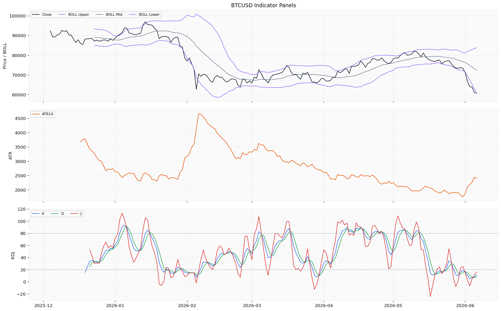
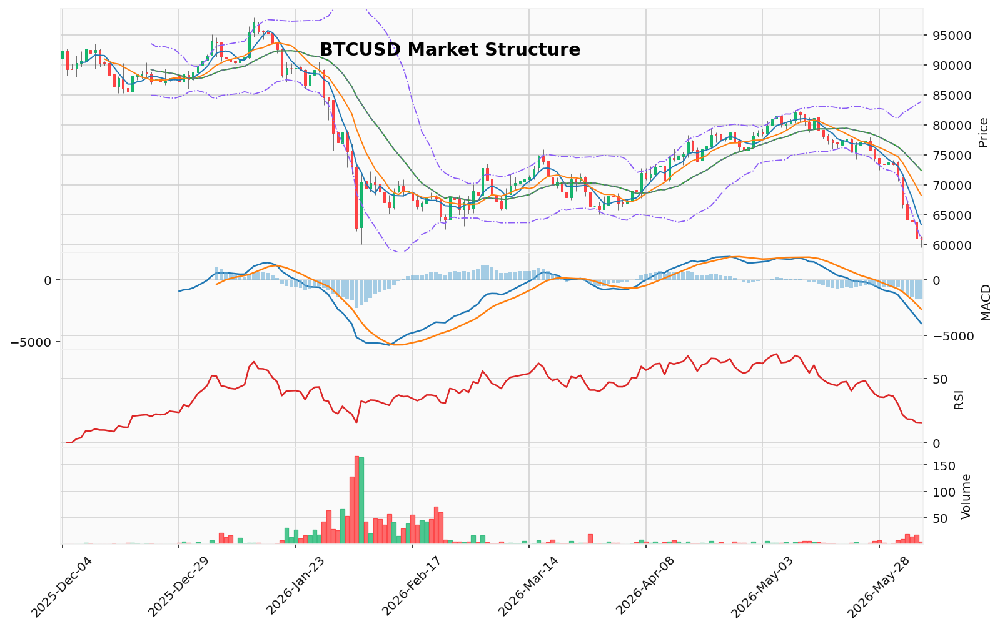

# Bitcoin（BTC）加密资产投资研究报告

> 报告生成时间（美东）：2026-06-06 22:26:56 EDT
> 报告生成时间（北京）：2026-06-07 10:26:56 CST

## 一、投资结论与组合动作

**最终动作：卖出（减仓/做空）**

**决策依据：**
- 价格自6月2日71356.95美元持续下跌至6月6日60790.97美元，累计跌幅约14.8%，日线连续收阴，确认为下降趋势。
- MACD柱状图负值扩大（-1548.18），空头动能仍在增强，是当前所有可用数据中信号最明确、逻辑最直接的证据。
- 极度超卖指标（RSI 15.15，KD K值11.29、D值8.80）在强势下跌趋势中可能长期钝化，并非可靠的反转信号，看涨逻辑缺乏衍生品数据验证。
- 衍生品数据（资金费率、OI、多空比、清算地图）全部缺失，无法评估下方清算级联风险，此缺口加剧了看跌风险而非提供了看涨机会。

**执行条件：**
- **现货持有者**：立即减仓当前现货仓位的**30%-50%**。
- **做空触发条件**：等待价格**有效跌破**近期低点**59128.59美元**，此为唯一由价格行为验证的客观入场信号。
- **目标区间（条件化推演）**：
  - 目标1（观察区）：58500-59000美元（跌破59128.59后的初步观察区间）
  - 目标2（基准）：57500-58500美元（假设趋势加速，无支撑下的自然延伸区域）
- **止损/失效位**：**61500美元**（基于布林带下轨60891美元和近期盘整区间上沿，若价格反弹站上此位，看跌结构减弱）

**仓位与杠杆限制：**
- 做空操作仅限总资金的**1%-2%**（非5%），**1倍杠杆**（非2倍）
- 最大亏损不超过总资金的**0.5%**
- 分批执行：跌破59128.59后初始仓位1%，若进一步跌破58000美元且成交量放大，可加仓至总资金2%，止损移至59500美元

**持续跟踪条件：**
- 衍生品数据恢复后，若资金费率负值扩大且下方有空头清算柱密集，需立即平仓所有空头头寸（防止轧空）
- 价格跌破59128.59后需观察成交量是否同步放大，缩量下跌警惕假跌破
- 需跟踪成交量、价格在59128.59美元处的收盘行为

## 二、市场结构与技术指标分析

### 技术图表

### 市场结构现状

BTC处于明显的下降趋势中。从6月2日开盘价71356.95美元持续下跌至6月6日收盘价60790.97美元，5个交易日累计跌幅约14.8%。日线连续收阴，6月5日最低探至59128.59美元，创出近期低点。本地技术摘要确认趋势为downtrend。成交量呈收缩状态（从6月2日10.02降至6月6日4.91）。当前市场结构可判断为**趋势下降中的超卖挤压阶段**，存在两种可能方向：超卖后可能出现技术性反弹修复，或下降动能尚未衰竭，若跌破59128.59低点，下行趋势可能加速。

### 关键价格位与触发条件

| 类型 | 价位 | 说明 |
|------|------|------|
| 支撑区间 | 59128.59美元 | 6月5日低点，近期唯一明确短期支撑，下方无成交量分布数据 |
| 第一压力 | 60891.14美元 | 布林带下轨，当前价格已跌破此位 |
| 第二压力 | 63301.60美元 | MA5 |
| 主要压力 | 72383.76美元 | 布林带中轨 |
| 多头触发 | 价格放量站上61000美元且RSI上破20 | 短期反弹启动信号 |
| 空头触发 | 价格跌破58800美元且无放量反弹 | 下跌加速确认 |
| 多头失效 | 价格跌破58000美元 | 多头结构破坏 |
| 空头失效 | 价格站上64000美元 | 下降结构被破坏 |

### 指标推导过程

#### OB订单块 / POC成交量分布 / TD Sequential / 谐波形态 / FVG / AMD-SMC / 123突破

| 指标 | 数据 | 推导 | 交易作用 | 失效条件 |
|------|------|------|----------|----------|
| OB订单块 | 缺失/不可用 | 资料包未提供订单块结构数据，无法识别关键供需失衡区间 | 不能作为支撑阻力判断依据 | 需恢复OB形态识别后方可参考 |
| POC/成交量分布 | 缺失/不可用 | 无成交量分布数据，无法识别控制点和价值区间 | 不能识别高流动性和低流动性区域 | 需成交量分布重建后方可参考 |
| TD Sequential | 缺失/不可用 | 无TD序列计数数据，无法判断计数完成和反转信号 | 不能用于趋势衰竭判断 | 需TD计数数据恢复 |
| 谐波形态 | 缺失/不可用 | 无谐波模式识别数据 | 不能作为反转交易依据 | 需恢复谐波形态识别 |
| FVG | 缺失/不可用 | 无公平价值缺口数据 | 不能作为价格回补目标依据 | 需恢复FVG识别 |
| AMD/SMC | 缺失/不可用 | 未提供市场结构转换或流动性抓取数据 | 不能用于市场结构转换判断 | 需恢复SMC结构分析 |
| 123突破 | 缺失/不可用 | 无123形态突破数据 | 不能用于趋势反转确认 | 需恢复123形态识别 |

#### Vegas / 布林带 / RSI / MACD / KD

| 指标 | 数据 | 推导 | 交易作用 | 失效条件 |
|------|------|------|----------|----------|
| 布林带 | 中轨72383.76，上轨83876.39，下轨60891.14 | 价格60790.97已跌破下轨60891.14，处于布林带下方，属于极端超卖偏离 | 价格严重偏离布林带下轨，可能出现技术性回归修复 | 若价格持续位于下轨之外且布林带开口扩张，则趋势可能加速 |
| RSI(14) | 15.15 | 远低于30超卖线，属极端超卖区，历史极端值往往预示短期反弹窗口 | 超卖信号强烈，可能出现空头回补或技术性反弹 | 若RSI持续低于20且价格继续创新低，则下降趋势动能未衰竭 |
| MACD | MACD -3920.29，信号线-2372.12，柱状图-1548.18 | MACD位于零轴下方且柱状图负值扩大，空头动能仍在增强 | 确认下降趋势，空头动能主导 | 若MACD柱状图开始收窄或形成底背离，则空头动能可能衰竭 |
| KD | K值11.29，D值8.80，J值16.27 | K、D均远低于20，进入严重超卖区域，J值略有回升 | 超卖挤压信号，短期反弹概率增大 | 若K、D持续走低无收敛，则反弹信号失效 |
| 维加斯通道 | 缺失/不可用 | 未计算通道数据，无法判断均线系统发散或收敛状态 | 不能用于趋势强度判断 | 需恢复均线通道计算 |

#### 清算地图 / CVD / 资金费率 / OI / 多空比

| 指标 | 数据 | 推导 | 交易作用 | 失效条件 |
|------|------|------|----------|----------|
| 清算地图 | 缺失/不可用 | 衍生品数据字段缺失（缺少未平仓量、多空比），清算点位无法获取 | 不能作为清算压力位参考 | 需衍生品数据提供方恢复清算数据 |
| CVD | 缺失/不可用 | 无主动买卖量累积数据 | 不能判断买方和卖方主动成交压力 | 需恢复CVD数据 |
| 资金费率 | 缺失/不可用 | 衍生品数据不可用，具体读数缺失 | 不能判断合约市场偏向 | 需恢复资金费率数据 |
| OI | 缺失/不可用 | 未平仓量字段缺失，数据粒度不匹配 | 不能判断市场参与度和杠杆堆积程度 | 需恢复未平仓量数据 |
| 多空比 | 缺失/不可用 | 多空比字段缺失 | 不能判断市场情绪偏向 | 需恢复多空比数据 |

#### 宏观 / 链上 / AHR999 / 事件

| 指标 | 数据 | 推导 | 交易作用 | 失效条件 |
|------|------|------|----------|----------|
| 宏观 | 缺失/不可用 | 资料包无宏观数据源记录 | 不能判断宏观政策路径是否构成驱动 | 需宏观数据提供方恢复 |
| 链上-鲸鱼转账 | 6月4日鲸鱼转账85632742.64（单位：原始值），6月2-6日每日均有记录 | 6月4日鲸鱼转账量显著高于其他日期（约4-7倍），可能对应大额移动或场外交易 | 鲸鱼活动可作为大资金行为参考，但不能直接对应价格方向 | 仅凭单一链上指标不足以形成交易决策，需更多链上指标配合 |
| 链上-其他指标 | 缺失/不可用 | 链上数据仅覆盖鲸鱼转账，其他指标如活跃地址、交易所净流量、持币分布均缺失 | 不能全面评估链上健康度 | 需恢复更完整的链上数据覆盖 |
| AHR999 | 缺失/不可用 | AHR999指标未被资料包覆盖 | 不能判断定投或囤币性价比区间 | 需恢复AHR999数据 |
| 事件 | 事件日历缺失/不可用 | 无法判断相关事件类型是否构成驱动 | 不能作为当前交易依据 | 需事件数据提供方恢复 |

### 指标小结

本地技术指标（布林带、RSI、MACD、KD）给出强烈超卖和下降趋势信号，是当前最可靠的数据维度。但关键结构性指标（订单块、成交量分布、谐波形态）和衍生品类指标（清算、资金费率、OI、多空比）全部缺失，极大限制了趋势延续性判断和风险定价能力。链上数据仅鲸鱼转账可用，覆盖面不足。

### 多空场景

**偏多场景：** 触发条件为价格在59128.59上方出现日线阳线收盘且成交量放大，RSI从超卖区上穿20，MACD柱状图开始收窄。确认信号为KD金叉形成、价格收复布林带下轨60891.14并站稳。目标逻辑：第一目标为布林带下轨回归位60891-62000区间；第二目标看至MA5（63301.60）附近。失效条件为价格有效跌破59128.59且无放量反弹，RSI继续下探10以下，KD无法形成金叉。

**偏空场景：** 触发条件为价格反弹至MA5或布林带下轨附近受阻回落出现长上影线阴线。确认信号为MACD柱状图负值继续扩大，RSI反弹后再次跌破20。目标逻辑：若59128.59被确认跌破，下一目标需通过成交量分布判断（数据缺失），可能在58000-59000区间寻找临时支撑。失效条件为价格放量突破MA5且小时级别连续收出阳线站上62000。

**观望场景：** 当价格在59128.59-61000区间窄幅震荡、成交量极度萎缩时，不宜追多或追空。清算地图、资金费率、OI、成交量分布、事件日历等数据缺失严重压低结论置信度，需要以上数据恢复后才能形成更可靠的交易框架。

### 数据状态与指标覆盖限制

| 数据类别 | 状态 | 对分析的影响 |
|----------|------|--------------|
| 日线行情 | 仅覆盖最后5天，未覆盖完整分析区间（2025-06-06至2026-06-06） | 无法进行完整趋势回归分析和长周期均线比较 |
| 衍生品数据 | 完全不可用（字段缺失、粒度不匹配、校验失败） | 无法评估合约市场拥挤度、杠杆风险和清算级联可能性，是本次最大数据缺口 |
| 实时行情与盘口 | 无可用记录 | 缺少实时价格、24小时涨跌幅、买卖盘口数据 |
| 链上数据 | 仅鲸鱼转账可用（25行数据） | 缺少活跃地址、交易所净流量、持币分布、MVRV、SOPR等核心指标 |
| AHR999与宏观 | 缺失 | 无法使用传统囤币参考指标和宏观政策评估 |
| 事件日历 | 缺失 | 无法排除潜在的突发事件风险 |

## 三、项目与代币基本面分析

### 3.1 资料包状态与核心缺口

**基本面资料包不可用或覆盖不足，未形成足以支撑基本面判断的可引用材料。** 资料包返回了部分尝试记录与审计状态，但在币种基础元数据、市值、供应量、链上使用及 DeFi 经营指标等关键维度均无可用记录。核心缺口包括：价格、市值、完全稀释估值、流通供应量、总供应量、成交量、总锁仓量、链上数据均缺失，且未覆盖完整分析区间（2025-06-06 至 2026-06-06）。

该状态意味着**本分析无法给出任何关于 Bitcoin 供需结构、价值捕获效率、网络采用率或估值水平的结论**。以下所有判断均受限于这一资料空白。

### 3.2 基本面维度逐一分析

| 维度 | 数据状态 | 基本面含义 | 对投资判断的影响 | 恢复条件 |
|------|----------|------------|------------------|----------|
| 项目定位与网络效用 | 缺失/不可用 | 无法评估 Bitcoin 作为数字价值存储的采用进度、哈希率趋势、网络安全预算或矿工盈利模型 | 不能为看涨/看跌提供网络基本面支撑 | 需恢复活跃地址、交易数、手续费中位数、哈希率、挖矿难度等链上指标 |
| 代币供应与发行 | 缺失/不可用 | 无法确认当前流通量、总供应上限（虽已知为 2100 万，但无已验证数据源中的当前已挖出量和未来发行速率） | 供应侧叙事（稀缺性、减半效应、矿工抛压）不可用于当前分析 | 需恢复区块奖励进度、流通量、销毁/锁定记录 |
| 完全稀释估值 (FDV) 与市值 | 缺失/不可用 | 无法计算当前估值水平，无法判断是位于历史高/低估值区间 | 不能进行相对价值比较或判断是否超卖于历史均值 | 需恢复市值排名、历史估值分位数 |
| 链上使用与 DeFi 经营指标 | 缺失/不可用 | 无法评估活跃用户、交易笔数、交易量、网络收入（L1 交易费用）或价值捕获能力 | 无法判断网络经济活动是否增长或衰退 | 需恢复 DEX 交易额、借贷协议 TVL、跨链桥流量、日活跃地址 |
| 生态应用与竞争格局 | 缺失/不可用 | 无法评估 Bitcoin L2（如 Lightning Network、侧链）的采用程度或与竞争公链（如 Ethereum、Solana）的定位差异 | 生态叙事（如比特币 DeFi、Ordinals/BRC-20 潮）不可用于当前分析 | 需恢复 L2 通道数量、TVL、活跃用户数 |
| 治理与安全 | 缺失/不可用 | 无法评估核心开发团队治理状态、BIP 进展或网络攻击风险（如 51% 攻击成本） | 网络安全假设无法验证 | 需恢复节点数、开发者活动、BIP 状态 |
| 解锁与代币分配 | 缺失/不可用 | 无法确认近期或中期是否有大额解锁（矿工抛售、早期投资者解锁等） | 代币解锁事件风险不可量化 | 需恢复解锁日程数据 |

### 3.3 唯一可用的链上信号：鲸鱼转账

当前可用链上数据仅包含鲸鱼转账（whale_transfer）一项指标。上游数据显示：6 月 4 日鲸鱼转账金额（单位：原始值）为 85,632,742.64，较 6 月 2 日的 12,028,623.00 和 6 月 3 日 20,853,067.36 有显著放大（约 4-7 倍），但转账方向（交易所/冷钱包/OTC 对手方）无法确定。

**对该信号的限制：**
1. **单一日放大不代表趋势**：6 月 4 日的巨量转账可能对应场外交易、交割、钱包整理等非方向性行为，不能直接解读为“大资金抛售”或“吸筹”。
2. **仅一个维度不足以形成判断**：没有交易所净流量数据来验证该转账是否流入了交易所（潜在抛压）或流出了交易所（潜在囤积）。
3. **不可用作看跌或看涨证据**：按照上游报告约束，单一链上指标不足以支撑方向性决策。

**投资含义：** 该信号只能作为“大资金在 6 月 4 日有不寻常的移动”的观测记录，不能直接转化为交易依据。若后续链上数据恢复时呈现“交易所净流入持续放大”或“鲸鱼向交易所频繁转移”，则需重新评估该信号的看跌含义。

### 3.4 估值框架缺失

由于价格、供应量和所有链上经营数据全部缺失，**本报告无法进行任何估值口径的计算或相对比较**。包括但不限于：
- 市值 / 已实现市值（MVRV）比率
- 市值 / 交易量（NVT）比率
- 矿工收入 / 市值比率
- 已实现价格与市场价格的偏离度
- 历史分位数（如 AHR999、2 年移动均线倍数）

所有需要历史价格或链上数据的估值模型均不可用。这意味着无法判断当前 60,790 美元是否处于“低估”、“合理”或“高估”区间。估值层面的缺失进一步压低了当前做多逻辑的置信度。

### 3.5 数据缺口对投资判断的综合影响

基本面资料的完全缺失限制了投资判断的多个维度：

1. **基本面无已知支撑被低估**：看涨逻辑无法借助网络采用、哈希率新高、持有者行为或减半效应等叙事来强化。
2. **基本面无已知负面压力被低估**：看跌逻辑同样无法借助矿工抛压、流动性紧缩或应用层衰退等叙事来强化。
3. **唯一可用的链上信号（鲸鱼转账）具有双向不确定性**：不能形成方向性支持。
4. **估值框架缺失**：无法判断当前价格与“公允价值”之间的偏离。

**关键结论：** 由于基本面资料包不可用且未覆盖分析区间，本分析对 BTC 的基本面无法做出任何实质性判断。投资结论（卖出/做空）必须完全依赖市场结构、技术指标和价格行为（详见第二节），基本面维度在本报告中**不作为看跌的支撑论据，也不作为看涨的约束条件**。待币种基础元数据、链上使用数据和供给发行数据恢复后，方可重新开展基本面分析，并评估其对当前卖出建议是否形成强化或削弱。

## 四、新闻、监管与事件驱动

### 4.1 资料包状态

新闻资料包不可用、覆盖不足或仅有待核验线索，未形成足以支撑新闻事实判断的可靠来源。项目新闻和宏观新闻均无可用记录，未能获取到任何已验证的官方公告、监管文件、交易所公告或已读取原文的可靠媒体正文。分析区间（2025-06-06 至 2026-06-06）内缺乏任何可确认的新闻记录。

### 4.2 对组合动作的影响

由于新闻事件数据完全缺失，本报告无法评估任何政策监管变化、机构资金流向、交易所动作、协议升级、安全事件或宏观经济冲击对 BTC 价格的影响。组合经理的最终动作（卖出减仓/有条件做空）完全建立在价格行为和技术指标之上，不受新闻事件层面的支持或约束。该缺失意味着组合动作未纳入任何未发生事件的假设，也不会因突发新闻而被动调整——所有仓位管理依赖技术性止损位（61500 美元）和价格触发条件（跌破 59128.59 美元）。

### 4.3 待恢复后重新评估的条件

若可靠新闻来源（官方公告、监管原始来源、交易所公告及已验证的可靠媒体正文）能够覆盖完整分析区间，需重新评估以下内容是否可能改变当前判断：

- **监管事件**：涉及 BTC 交易、持有、挖矿或 DeFi 业务的政策变化；
- **机构资金事件**：ETF 流入/流出、上市公司持仓变动、场外大宗交易；
- **交易所事件**：上线/下架、合约规则修改、安全漏洞或资产冻结；
- **宏观事件**：美联储利率决策、通胀数据、地缘政治冲击；
- **链上安全事件**：协议漏洞、跨链桥攻击、大额黑客转移。

当前资料就绪度不足以支撑任何新闻维度结论，上述事件类型均缺少已验证来源，不能作为当前方向性依据。若可靠数据恢复并验证新的方向性事件，需要在重新评估后决定是否修改组合动作。

### 4.4 数据缺口：对结论置信度的限制

- **资料缺口**：项目新闻与宏观新闻均无可用记录，未覆盖完整分析区间。
- **来源尝试记录**：未能转化为可引用的数据集。
- **不可补写说明**：本报告未使用模型记忆、历史经验或搜索摘要补写任何真实新闻、公告、监管事件或市场反应结论。所有缺口均已如实保留，**该方向缺少上游数据验证，只能降低置信度，不能作为方向性依据**。

## 五、社区情绪、事件预期与交易拥挤度

本节整合社区情绪、公开讨论线索、市场级情绪、事件预期、聚合指标和真实社交平台样本，评估情绪是否强化基本面/技术面判断，或提示拥挤、脆弱、预期过满、反身性风险或叙事扩散。由于上游资料在舆情信号仓库为空，未覆盖完整分析区间，且缺少来源、时间戳、情绪分数与标的代码，本节结论受到严格数据限制。

**资料状态：** 舆情资料包不可用。审计记录显示已形成有限的数据引用与来源尝试记录，但舆情信号仓库无可用记录，缺失时间戳、情绪分数、标的代码等关键字段，且未覆盖完整分析区间（2025-06-06至2026-06-06）。真实平台样本和市场级情绪数据均不可用。

**无法判断的舆情问题：** 情绪方向、主要叙事、参与者结构、影响周期均无法判断。由于缺乏任何可引用的真实平台样本与市场级情绪指标，无法对BTC当前社区讨论热度、情绪方向、主要叙事传播路径、参与者结构或短期市场情绪影响做出判断。

**对组合动作的影响：** 情绪维度无法对组合经理的“卖出（减仓/做空）”建议提供任何支持或约束。情绪数据缺口既不能强化看跌判断（例如通过验证恐慌蔓延或空头拥挤度），也不能提示潜在的反转风险或拥挤度信号。本节的唯一作用是记录：**情绪面在当前决策中是一个完全的未知变量**。若未来社交数据样本恢复，需立即评估以下三类信号：

- **恐慌-贪婪指数或情绪分数**：若情绪极度恐慌（如分数低于10），可能逆向支撑技术超卖逻辑，但需要成交量放大和价格行为确认，不能单独作为反转依据。
- **叙事传播跟踪**：若市场主要叙事转向“流动性危机”、“矿工抛售”或“央行政策收紧”等，需评估其是否为已验证事实或未验证传闻。
- **拥挤度信号**：若资金费率（待恢复）显示空头头寸极度拥挤且OI维持高位，则存在轧空风险，需重新评估空头仓位安全性。

**数据限制与风险提示：** 当前无可用样本，本节结论仅为“不可判断”。情绪维度的缺失并未改变组合经理的最终决策——该决策完全基于已验证的价格趋势、技术指标和关键支撑/失效位。但情绪数据的长期缺席意味着无法监控市场情绪转向的早期信号，这是当前组合动作的一个未被覆盖的风险维度：若未来突发利好事件引发情绪急剧反转，而持仓中仍有空头头寸，可能面临未及预期的反弹风险。建议在社交数据样本恢复后重新评估此节。

## 六、交易计划与组合风险

本节整合交易员原始计划与风险分析师辩论，在衍生品数据、链上数据、基本面与宏观数据全部缺失的约束下，构建仅基于已验证价格行为与技术指标的现货减仓及有条件做空计划。所有动作必须严格遵循组合经理最终决策的方向、仓位上限、杠杆限制、止损/失效位及分批执行节奏。

### 6.1 现货减仓（可立即执行）

| 项目 | 内容 |
|------|------|
| **动作** | 现货持有者降低仓位 |
| **减仓幅度** | 当前现货仓位的 **30%-50%** |
| **执行条件** | 当前价格60790.97美元附近，无需等待额外确认 |
| **执行理由** | 已确认下降趋势（6月2日至6日累计跌幅14.8%）且空头动能仍在增强（MACD负值扩大），减仓直接减少价格持续下跌带来的资产暴露 |
| **失效条件** | 若价格日线放量站上64000美元，破坏当前下降结构，可暂停减仓并重新评估 |
| **主要风险** | 减仓后若出现技术性反弹（RSI 15.15极端超卖），可能错过修复行情；但反弹空间有限（第一目标60891-62000美元），且缺乏衍生品数据验证反弹持续性 |

### 6.2 有条件做空（仅限触发后执行）

| 项目 | 内容 |
|------|------|
| **入场触发** | 价格**有效跌破**近期低点 **59128.59美元**（需日线或小时级别实体收盘确认） |
| **入场信号确认** | 跌破时需观察成交量是否同步放大；若缩量下跌，警惕假跌破或诱空行情 |
| **初始仓位** | 总资金的 **1%-2%**（不超过2%，采纳中性分析师建议，将数据缺口对仓位规模的约束发挥到极致） |
| **杠杆上限** | **1倍杠杆**（禁止2倍及以上杠杆，因衍生品数据缺失导致清算风险无法审计） |
| **初始止损位** | **60000美元**（比组合经理原定61500美元更紧，进一步控制风险；若反弹触发止损，亏损约总资金0.2%） |
| **初始目标区间** | 58500 - 59000美元（跌破59128.59后的初步观察区间，无成交量分布支撑，为条件化推演） |
| **加仓条件（若趋势延续）** | 价格进一步跌破 **58000美元**，且成交量和空头动能确认（MACD柱状图负值未收窄），可将仓位加至总资金 **3%**（上限），止损上移至 **59500美元** |
| **加仓后目标区间** | 57500 - 58500美元（基准目标，假设趋势加速，无成交量支撑下的自然延伸） |
| **乐观空头目标** | 56000 - 57000美元（极端下跌情景，置信度极低，因数据缺口无法精确定量） |
| **重新评估/需暂停条件** | ① 价格在59128.59美元上方出现**日线放量阳线**且**RSI确认上穿20**；② 价格日线收盘站稳 **64000美元**（空头失效位）；③ 衍生品数据恢复且显示资金费率负值过大、下方存在密集空头清算柱（可能触发轧空，需立即平仓所有空头） |
| **最大亏损控制** | 任何做空仓位总亏损不得超过总资金的 **0.5%**（初始仓位1%，止损60000美元，距入场约1.5%，亏损约0.2%-0.3%；加仓至3%后，止损59500美元，距加仓点约2.6%，亏损可控在0.5%以内） |

### 6.3 多头触发条件（仅用于平空或快速反弹博弈）

| 项目 | 内容 |
|------|------|
| **多头触发** | 价格放量站上 **61000美元** 且 RSI 确认上穿20 |
| **多头执行条件** | 仅在已持有空头头寸需平仓时使用，或仅以总资金 **2%** 做多博弈技术性反弹（最高仓位） |
| **多头目标** | 第一目标60891-62000美元（布林带下轨回归位），第二目标MA5（63301.60美元） |
| **多头止损** | **58000美元**（若跌破则多头失效） |
| **主要风险** | 超卖信号在强势下跌趋势中可能长期钝化，反弹可能只是弱势修复而非反转；缺乏衍生品数据验证反弹是空头回补还是真实买盘 |

### 6.4 禁止操作清单

1. **严禁高杠杆合约**：因衍生品数据（资金费率、OI、多空比、清算地图）全部缺失，无法审计清算风险，任何倍数杠杆合约均不可使用。仅允许1倍杠杆现货或低杠杆做空。
2. **禁止基于“极端超卖必然反弹”开多**：上游报告已明确指出RSI 15.15和KD严重超卖在强势下跌趋势中可能长期钝化，并非可靠反转信号。该方向缺少上游数据验证，只能降低置信度，不能作为方向性依据。
3. **禁止使用未验证叙事作为开仓理由**：不得使用“机构资金流入”“减半后供应紧缩”“宏观避险”等任何上游未验证的叙事。缺少统计样本，不能作为当前证据。
4. **禁止一次性开满仓位**：做空必须分两步执行（跌破59128.59后1%-2%；跌破58000后加仓至3%），不得一次性开满5%仓位。

### 6.5 核心情景风险与失效条件

| 情景 | 触发条件 | 对组合的影响 | 应对动作 |
|------|----------|--------------|----------|
| 看跌确认（基准） | 价格有效跌破59128.59，成交量放大 | 确认下降趋势加速，空头动能延续 | 执行首次做空（1%-2%，1倍杠杆），止损60000美元 |
| 看跌加速（乐观空头） | 价格跌破58000，MACD负值继续扩大 | 下行空间打开，但需警惕流动性断层 | 执行加仓至3%，止损上移至59500美元，目标看至57500-58500 |
| 看跌失效 | 价格放量站上64000美元 | 下降结构被技术性打破 | 平空所有仓位，暂停新空单，转为观望 |
| 技术性反弹（中性偏多） | 价格在59128.59上方出现日线阳线，RSI上穿20 | 可能出现短期修复，但空间有限 | 暂停做空，观望；若已持有空头且反弹强劲，可减仓或平仓 |
| 轧空风险（极端情景） | 衍生品数据恢复后显示资金费率负值过大、下方密集空头清算柱 | 可能出现急速拉升，空头仓位面临重大风险 | 立即平仓所有空头头寸，记录为《交易员反思》中“忽略拥挤度”的教训 |
| 流动性断层（极端情景） | 价格快速突破60000美元止损位（插针） | 止损可能无法按计划执行，亏损超出预期 | 将止损单设为限价单+市价单组合，接受滑点风险；数据缺口下无法完全避免 |

### 6.6 数据缺口对交易计划的核心约束

1. **衍生品数据完全缺失**（资金费率、OI、多空比、清算地图）：无法评估合约市场拥挤度和杠杆风险，直接导致杠杆上限压至1倍、仓位上限压至3%、禁止一次性开仓。数据缺口本身不看涨也不看跌，但要求在行动时显著缩小规模并强化条件。
2. **成交量分布缺失**：无法识别下方控制点和价值区间，所有目标区间（58500-59000、57500-58500、56000-57000）均为基于价格行为的条件化推演，非定量分析。在仓位管理上需更警惕假跌破。
3. **链上数据仅鲸鱼转账一项可用**：无法判断大资金流向（积累还是分配），无法评估链上健康度。该方向缺少上游数据验证，不能作为方向性依据。
4. **基本面、宏观、新闻、社区情绪全部为空**：无法排除任何突发性利好或利空事件。若可靠数据恢复并验证新的方向性事件，需要重新评估。
5. **成交量持续收缩**（从10.02降至4.91）：当前市场参与度下降，任何方向的实质行动都应等待成交量回升至8 BTC以上（接近6月2日水平）。成交量不恢复，即使价格突破59128.59美元，也优先考虑观望而非入场。

### 6.7 风险评分与置信度

| 项目 | 数值 | 说明 |
|------|------|------|
| **交易员置信度** | 0.55（中等偏低） | 因衍生品、链上、基本面、宏观数据全部缺失，仅有价格行为与技术指标支撑 |
| **风险评分** | 0.7（高风险） | 数据缺口巨大，无法预判潜在支撑位或突然的巨量抄底/轧空 |
| **组合经理采纳的最终仓位上限** | 做空总资金3%（初始1%-2%，加仓至3%） | 比交易员原始5%上限更保守，采纳了中性分析师关于数据缺口作为仓位约束的建议 |
| **组合经理采纳的最终杠杆上限** | 1倍 | 比交易员原始2倍上限更保守，因清算风险无法审计 |
| **主要未量化风险** | 流动性断层、插针、轧空、突发利好消息 | 无法由现有材料审计计算，只能通过硬止损和仓位控制管理 |

## 七、关键分歧与跟踪条件

本节梳理本次投资决策过程中的核心分歧、组合经理最终采纳或舍弃的观点，以及后续需要持续跟踪的验证条件。所有分歧均源于关键数据的大面积缺失。

### 7.1 核心分歧：极端超卖 vs. 下降趋势延续

| 分歧双方 | 核心论据 | 支持证据 | 被反驳的关键漏洞 |
|---|---|---|---|
| **看涨/激进派** | RSI 15.15、KD 均低于20，价格跌破布林带下轨，属于历史极端超卖，预示技术性反弹或轧空窗口。 | 技术指标读数本身 | 1. 上游报告明确警告“极度超卖在强势下跌趋势中可能长期钝化，并非可靠反转信号”；2. 反弹需要轧空，但资金费率、OI数据缺失，无法验证空头是否拥挤；3. 成交量收缩也可能是“买入动能衰竭”而非“抛压减弱”。 |
| **看跌/保守派** | 累计跌幅14.8%，日线连续收阴，MACD负值扩大确认空头动能增强，趋势延续概率远大于反转。 | 价格行为、MACD结构、已确认的下降趋势 | 1. 极端超卖信号确实客观存在，不能完全忽略；2. 缺乏衍生品数据无法证明“下跌加速”，也无法证明“不会发生突发利空”；3. 单纯看跌也受数据缺口约束——无法量化下方支撑。 |

**组合经理最终判断**：采纳看跌派的主要逻辑，即**下降趋势是当前最可靠的数据维度**。极端超卖指标虽客观存在，但其可靠性已被上游报告明确削弱，且看涨逻辑需要的关键衍生品数据（资金费率、OI）完全缺失，无法形成可执行的交易依据。组合经理特别指出：“**看跌观点在此数据环境下拥有更坚固的支撑**。”

### 7.2 分歧二：数据缺口的方向性解读

| 分歧双方 | 对数据缺口的解读 | 组合经理裁决 |
|---|---|---|
| **激进派** | 数据缺口（清算地图缺失）意味着无法预判跌破支撑后的承接位，反而**强化了下跌加速的概率**，应视为有利条件。 | 否定。组合经理明确：“缺口本身是看跌逻辑的强化项，因为它放大了潜在的下行速度与幅度”——但这是对潜在**风险**的认知，而非对**盈利概率**的押注。缺口不改变方向判断，只强化仓位约束。 |
| **保守派** | 数据缺口意味着“未知”，不能做出任何方向性判断，应完全放弃空头操作。 | 部分否定。组合经理认为：缺口确实增加了不确定性，但**已知趋势（下跌）依然是已验证事实**，不能因未知就放弃利用已知趋势。合理的做法是缩小仓位、强化条件，而非禁止行动。 |
| **中性派** | 缺口是双向不确定性，只能作为**仓位约束和入场条件**，不能作为方向判断依据。 | 部分采纳。组合经理最终采纳中性派的“分步执行”思路：跌破关键位后先以1%仓位、1倍杠杆试空，而非激进派的5%满仓。 |

**后续跟踪条件**：衍生品数据恢复后，需立即评估**资金费率**和**清算密集区**。
- **资金费率**：若变负且负值扩大，说明空头拥挤，可能引发轧空，届时组合经理明确指示“应平仓所有空头头寸”。
- **清算地图**：若下方存在大量多头清算柱，则突破59128.59美元后可能出现加速下跌，与当前看跌逻辑一致；若上方存在大量空头清算柱，应警惕反弹挤压。

### 7.3 分歧三：做空的仓位与杠杆选择

| 分歧方 | 建议仓位/杠杆 | 组合经理决策 |
|---|---|---|
| 激进派 | 总资金5%，2倍杠杆做空 | 否决。在衍生品数据完全缺失、无法审计清算风险的情况下，5%仓位+2倍杠杆的风险敞口（总资金10%）不可接受。 |
| 保守派 | 禁止做空，仅执行现货减仓 | 部分否定。组合经理认为已知下降趋势提供了做空的合理性，但必须极度保守。 |
| 中性派 | 首次1%-2%仓位，1倍杠杆，止损60000美元 | **采纳**。组合经理将中性派的建议进一步收紧：1%初始仓位、1倍杠杆、止损设在61500美元（基于布林带下轨和近期盘整平台上沿），并规定总亏损不超过总资金0.5%。 |

**后续跟踪条件**：
- **成交量**：跌破59128.59美元后，需观察成交量是否同步放大。若缩量下跌，需警惕假跌破。
- **价格行为**：若价格在59128.59美元上方出现**日线级别放量阳线**且RSI回到20以上，则暂停空头动作，转为观望。

### 7.4 分歧四：是否等待成交量恢复

| 分歧方 | 观点 | 组合经理处理 |
|---|---|---|
| 中性派 | 当前成交量收缩至4.91（5日最低），任何行动都应等待成交量回升至8 BTC以上。 | **采纳为观察条件，而非硬性前置条件**。组合经理在“跟踪条件”中写入：跌破59128.59后需观察成交量是否同步放大。若缩量下跌则警惕假跌破，但未要求必须放量才能入场。成交量回升作为“更可靠的确认信号”，而非必要条件。 |

### 7.5 分歧五：多头触发的可能性

| 分歧方 | 多头触发条件 | 组合经理态度 |
|---|---|---|
| 看涨/中性派 | 价格在59128.59上方出现日线阳线+RSI上穿20 | 当前条件未触发。组合经理仅在卖出结构中保留了“重新评估条件”：若上述信号出现，暂停空头动作、转为观望。但明确禁止在此数据环境下建立任何多头头寸，因为“缺乏衍生品数据验证的‘轧空’或‘技术性反弹’是未经验证的假设”。 |

**最终结论**：组合经理的决策建立在“已知趋势大于未知风险”的逻辑上。看跌逻辑有价格行为、MACD结构、布林带位置等多重已验证证据支撑；看涨逻辑的核心依据（极端超卖）已被上游报告指出其在强势下跌趋势中的不可靠性，且需要的关键衍生品数据全部缺失。最终执行方案是一个**条件化、分步执行、极度保守的看跌仓位**——方向明确，但规模和杠杆被数据缺口严格约束。

## 八、最终结论

**组合经理最终动作：卖出（现货减仓或条件化小仓位做空）**

- **现货持有者**：在当前价格60790.97美元附近，立即减仓现有现货仓位的30%-50%，降低持续下跌的暴露风险。
- **做空操作**（仅限有条件）：严格等待价格**有效跌破**近期低点59128.59美元后，以总资金的1%、1倍杠杆试空。止损位设在61500美元，总亏损上限为总资金0.5%。若价格进一步跌破58000美元，可在确认成交量和空头动能后，加仓至总资金2%，止损移至59500美元。

**当前动作成立的核心证据：**
1. **已确认的下降趋势**：自6月2日71356.95美元持续下跌至60790.97美元，累计跌幅14.8%，日线连续收阴，技术摘要确认趋势为`downtrend`。
2. **空头动能仍在增强**：MACD位于零轴下方，柱状图负值扩大（-1548.18），表明下跌尚未衰竭。
3. **价格结构脆弱**：已跌破布林带下轨60891.14美元，唯一明确的短期支撑位59128.59美元下方无数据支撑的防线。

**最关键的失效或重新评估条件：**
- **空头彻底失效**：价格日线收盘站稳64000美元，技术结构将被破坏，需立即平仓所有空头头寸并转为观望。
- **短期失效**：价格反弹站上61500美元止损位，空头仓位必须无条件平仓。
- **重新评估信号**：价格在59128.59美元上方出现日线级别放量阳线，且RSI回到20以上，需暂停所有空头动作。

**下一步最需要跟踪的3类数据或价格行为：**
1. **衍生品数据恢复**：资金费率、未平仓量、多空比、清算地图。若资金费率负值大幅扩大且下方存在大量空头清算柱，需警惕轧空风险，应立即平仓空头头寸；若下方存在大量多头清算柱，则强化看跌逻辑。
2. **成交量行为**：跌破59128.59美元时是否同步放量。缩量下跌需警惕假跌破；若放量下跌则确认趋势加速。后续成交量需回升至8 BTC以上才能作为更可靠的确认信号。
3. **价格在59128.59美元处的收盘行为**：日线收盘是否有效跌破该位。若出现日线阴线实体低于59128.59，确认空头触发；若在该位上方出现阳线反包，则可能形成短期底部，需重新评估。

**收束：** 本次投资决策是在关键数据大面积缺失（衍生品、链上、基本面、新闻、情绪全部为空）的极端约束下做出的。看跌逻辑基于已验证的价格行为和技术指标，而看涨逻辑的核心依据（极端超卖）已被上游报告明确弱化。执行方案通过极端保守的仓位规模（1%初始仓位、1倍杠杆、0.5%总资金回撤上限）将数据缺口带来的不确定性纳入风险控制。最终结论是：尊重已确认的下降趋势，但用最小的可接受成本验证这一判断——若市场证明趋势仍在，则逐步加仓跟进；若市场反转，则以极小亏损离场。这是当前数据环境下最可持续的行动路径。
