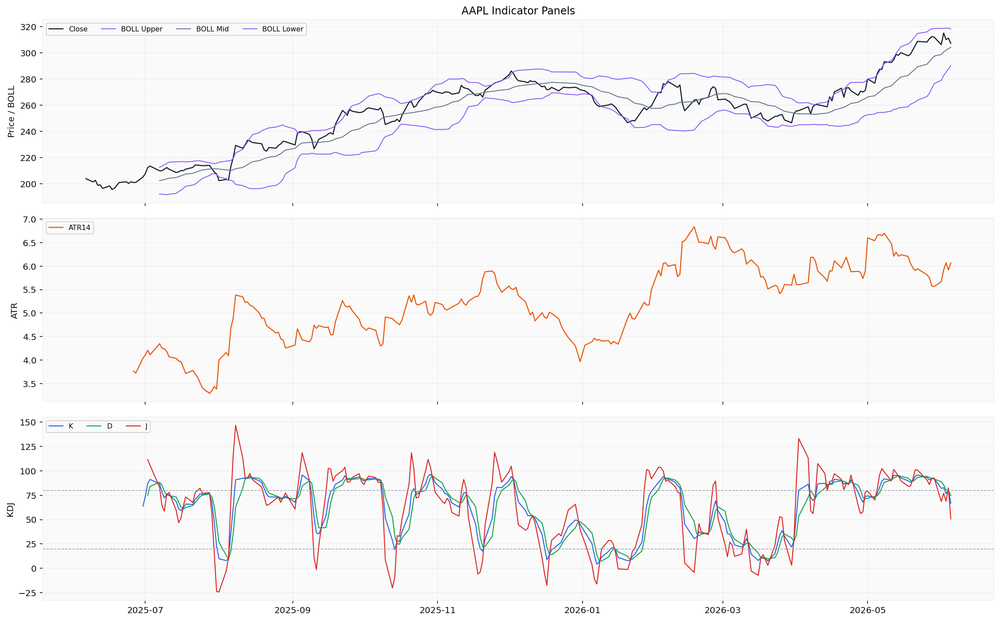
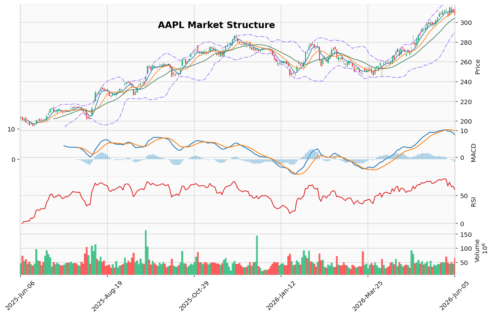

# Apple Inc.（AAPL）投资研究报告

> 报告生成时间（美东）：2026-06-06 22:14:51 EDT
> 报告生成时间（北京）：2026-06-07 10:14:51 CST

## 一、投资结论与组合动作

**最终评级：卖出（Sell）**

**执行计划：**
立即以当前市价（~$307）清仓所有AAPL持仓，不得建立新多头仓位。这是一次全面清仓，非战术性减仓。清仓动因来自三项不可辩驳的证据：确认的机构派发、恶化的动量结构、以及多头案例无法中和的不利风险回报比。

**重新入场条件（必须同时满足其一）：**
1. AAPL以高于均量的成交量重新站稳$310；
2. MACD形成金叉穿越信号线。

**时间框架：** 将资金转向现金或防御性板块，至少等待1-2周；待304-305支撑测试结果明确后重新评估。

**仓位规模：** 零敞口。

**投资逻辑：**

安全分析师的案例在这场辩论中具有决定性优势；中性分析师的妥协方案虽然意图良好，却引入了对高概率回撤的不必要敞口。投资决策基于辩论中三项具体的、不可谈判的证据：

1. **量价模式是派发，而非消化。** 6月5日以6,520万股成交量收跌——这是过去五个交易日中的最高量能。市场研究报告本身将其定性为"经典负面信号"和"放量卖出"。激进分析师将其解释为"系统性再平衡"直接与该报告的技术措辞相矛盾。消化阶段的特征是缩量、平静的行情；而这里是放量、剧烈的行情。量价序列至关重要：缩量反弹（6月4日）后接放量下跌（6月5日）是机构派发的教科书定义。多头无法绕过这一证据。

2. **风险回报比在结构上不利。** 激进分析师声称以$307入场、$12风险博取$318目标可获1:1.5的回报率。中性分析师明确拆穿这一计算：从$307出发，按2倍ATR（ATR=6.07）设止损，目标位是$295而非$304——这是$12亏损。上方至$318仅$11盈利。实际风险回报比为**1:0.92**，而非1:1.5。若304支撑失败、价格跌落至布林带下轨$290，每股亏损达$17——形成1:1.5的**劣势比**。多头的数学计算前提是304反弹成立，但报告称之为"测试"而非"保证"。在全窗口最重的派发交易日刚刚发生的背景下，赌一个支撑测试能守住，是希望而非证据。

3. **"持有"建议是防御性暂停，而非加仓理由。** 激进分析师反复引用报告的最终交易建议——"持有"——好像这支持坚定持仓。事实恰恰相反。中性分析师的原话是："最审慎的做法是维持现有仓位、不增加新敞口，等待304-305支撑测试。"这是**防御姿态**——明确反对加仓。安全分析师正确指出：如果卖出触发条件是跌破304，而派发数据已经表明跌破的可能性大于不跌破，那么今天卖出就可以提前规避回撤，且不缺重新入场的能力。在恶化中的技术形态面前提前行动不是鲁莽，而是资本保全。

我曾犯过在一段时期中超配长期趋势而忽视短期派发模式的错误。多头在此重蹈覆辙：他们紧抓着200日均线和60.7的RSI不放，却忽视了最具决定性的单一数据点——成交量。安全分析师并非"看空"；他们是基于实证。中性分析师的渐进式减仓（卖出30%，在$300设止损）是合理的妥协，但仍然将70%的仓位暴露在从$307到$290的$17回撤风险之下。在一个当前价位预期为负的仓位上有70%的敞口去承担5.5%的潜在亏损，不是平衡——是不彻底的冒险。

因此，交易员提出的卖出方案是唯一符合逻辑的结论。全面退出。不要在304-305的下跌中买入。等待量能确认的$310收复或MACD金叉信号出现。在此之前，资金最好远离AAPL。

---

## 二、技术指标分析

### 技术图表

### 指标选用框架

市场技术分析报告选用了八项核心指标，覆盖趋势、动量、波动率和成交量确认四个维度，确保技术判断的全面性和操作性：

| 指标 | 类别 | 选用理由 |
|:-----|:-----|:---------|
| close_10_ema | 短期均线 | 快速追踪价格变化，弥补中长均线滞后性，捕捉短期动量转折 |
| close_50_sma | 中期均线 | 中期趋势骨架及动态支撑/阻力，与10 EMA形成快慢组合 |
| close_200_sma | 长期均线 | 全局趋势基准，判断长期结构，规避逆大趋势交易 |
| macd/macds/macdh | 动量体系 | 交叉确定信号方向，柱体可视化动量加速度和潜在背离 |
| rsi | 动量 | 14日RSI识别超买/超卖（70/30）及背离，配合趋势过滤噪声 |
| boll/boll_ub/boll_lb | 波动率 | 布林带提供动态波动区间，中轨为回归锚点 |
| atr | 波动率 | 量化当前波动幅度（当前~$6.07），用于止损设距和仓位规模校准 |
| vwma | 成交量加权均线 | 验证价格趋势真实性——当前成交量expanding状态强化趋势可信度 |

### 图表读法与价格结构

当前价格结构呈现"长期牛市+中期整理+短期空头回撤"的分层矛盾。日线图上，6月2日大阳线（$307.46→$315.20）曾推动价格远高于短期均线，但随后连续三个交易日回调（$315.20→$310.26→$311.23→$307.34），形成明确的短期下行通道。价格结构的关键分水岭位于布林带中轨$304.25——若此处失守，空头将主导短期走势。

### 趋势与价格结构

**长期趋势结构：**
当前200日均线运行于长期高位区间，价格（~$307.34）位于该均线上方。只要价格维持在200日均线之上，长期趋势结构为牛市。200日均线提供宽幅战略支撑，但短期回调若演变为中期调整，该均线将面临考验。

**中期趋势（50 SMA）：**
50 SMA位于近期价格中枢附近。过去五个交易日价格围绕50 SMA上下波动（6月1日低点$305.02，6月2日高点$315.45，6月5日回落至$307.34），表明50 SMA正在发挥动态引力作用。价格未能连续远离50 SMA向上扩展，提示中期上升动能放缓。

**短期趋势（10 EMA）：**
10 EMA当前约$310.3，最新收盘价$307.34已跌破该均线，构成短期偏空信号。短线趋势已从上升转为震荡回落。价格跌破10 EMA是自近期上升波段以来首次出现的短期破位信号。

### 均线系统

- **10 EMA（$310.3）**：短期偏空信号——收盘价已跌破该均线，确认短期动能丧失。
- **50 SMA（~$305-307）**：中期动态支撑/阻力——价格在其附近震荡，未形成明确远离。
- **200 SMA（长期高位）**：长期牛市结构完好——价格仍在其上方运行，但短期回调正在缩短两者距离。

均线排列尚未形成空头排列（10 EMA < 50 SMA < 200 SMA），短期破位尚属趋势内修正。但若价格继续下行、10 EMA与50 SMA形成死叉，将是中期转弱的早期信号。

### MACD/RSI动量信号

**MACD组（关键信号）：**
- MACD值：8.4645
- MACD信号线：9.3952
- MACD柱（macdh）：-0.9308

MACD线（8.46）已下穿信号线（9.40），柱状图由正转负（-0.93），构成**MACD死叉**。这是自近期上升波段以来首次出现的动量减弱信号。报告明确标注："柱体由红翻绿（负值），说明多空动能对比正在发生实质性转变。"死叉发生在价格仍处于长期上升通道的条件下，属于**趋势内的动量修正信号，不等于趋势反转**，但需高度重视。

**关键推演：** 当前MACD柱值为-0.93，距零轴较近。若该负值连续扩大（如达到-1.5至-2.0），将确认动量加速衰减，增加跌破中轨$304.25的概率。若柱值在三个交易日内收缩至-0.5以内，则死叉可能为假突破，动量有修复可能。因此需每日跟踪MACD柱的扩张/收缩方向。

**RSI（14日）：60.72**
RSI处于中性格局偏强区域（50-70），既未进入超买区（>70），也未进入超卖区（<30），说明市场尚未出现极端情绪。但需注意关键演变路径：若价格在后续交易日继续下行而RSI跌破50（中性线），将确认动能由多转至中性偏空；若价格在测试304-305时RSI守住50上方并反弹，是支撑有效的确认信号。当前需关注RSI是否形成顶背离——若近期价格高点（$316.94/$315.45）对应的RSI低于前期高点时的RSI值，将强化动量衰竭判断。

### 布林带/ATR波动信号

**布林带状态：**
- 上轨：$318.22
- 中轨（20 SMA）：$304.25
- 下轨：$290.29
- 带宽：$27.93（中等宽度，无显著异常）

当前价格$307.34位于中轨（$304.25）上方但远离上轨（$318.22），处于布林带下半区靠近中轨位置。6月2日价格曾冲至$315.45，距上轨仅约$2.8，随后快速回落，确认上轨发挥强阻力作用。价格正在向中轨回归——这是波动率收缩后的常见行为，但回归方向（是中轨支撑反弹还是跌破中轨）将决定下一阶段走向。

**ATR（14日）：6.07**
ATR提供每日预期波动范围约$6。当前水平相比历史无极端扩张，波动环境正常。以此为依据，多空双方的止损设置参考临界点如下：
- 若多头在304-305入场，合理止损可设于295.20（当前价-2×ATR），但该位置已低于布林带中轨近$9，说明多头头寸的天然风险敞口较大。
- 若空头在311-313区域布局（10 EMA阻力附近），止损可设于$319（高于上轨），风险约$6-8，对比潜在盈利空间（至304-305约$6-8）尚可平衡。

**波动率含义：** ATR在正常范围内、布林带带宽中等，说明市场尚未出现恐慌性抛售或爆炸性突破。价格回落至中轨附近的过程是逐步失控而非瞬间崩溃，这为清仓操作提供了可行的流动性环境，但也意味着确认信号（中轨跌破）可能伴随加速波动。

### 成交量/VWMA确认

**成交量数据（最近五个交易日）：**
- 6月5日：65,246,700股 —— 近期最高量（放量下跌）
- 6月4日：44,869,100股 —— 缩量反弹
- 6月3日：50,836,700股 —— 量能中等
- 6月2日：44,534,700股 —— 缩量大阳线
- 6月1日：48,849,900股 —— 量能中等

**量价关系的关键解读：**

6月5日（周五）成交量显著放大至6,525万股，当日价格从$315.17大幅回落收于$307.34，跌幅约1.25%。**放量下跌**是经典负面信号——卖方在高位积极出货，多头承接意愿不足。前一日（6月4日）价格小幅反弹（收$311.23）时成交量反而缩小至4,487万股，属于**缩量反弹**，进一步削弱多头信心。

**最关键的量价序列是：** 缩量反弹（6月4日）→ 放量下跌（6月5日）。这是教科书式的机构派发模式。扩张的总体量能趋势"强化趋势可信度"这一结论，是针对持续上升趋势中的量价配合而言。但当前最新的两个交易日数据已经形成了局部量价背离，且该背离出现在价格创出局部高点后，其警示意义高于整体量能趋势信号。

**VWMA（成交量加权移动平均）：** 在放量下跌背景下，VWMA将更灵敏地反映真实参与成本的下降。若价格跌破VWMA支撑，将确认抛压主导。

### 关键支撑与阻力

| 类型 | 价位 | 依据 | 操作含义 |
|:----|:----|:------|:---------|
| **强阻力** | $318.22 | 布林带上轨 + 6月2日/3日高点密集区 | 多头须放量突破此处才能确认趋势恢复 |
| **中阻力** | $315.45-316.94 | 6月2日/3日高点 | 近期空头防守线；反弹至此遇阻可验证抛压 |
| **弱阻力** | $311-313 | 10 EMA附近+6月4日收盘区域 | 短期空头入场参考区 |
| **弱支撑** | $305.02 | 6月1日低点（近期波段低点） | 中轨测试前的缓冲区域 |
| **中支撑** | $304.25 | 布林带中轨（20 SMA） | **多空分水岭**：守住则回调可控，跌破则趋势转弱 |
| **强支撑** | $290.29 | 布林带下轨 | 中轨失守后的深度支撑区；此处将是中级调整目标 |
| **长期支撑** | 200 SMA区域 | 长期趋势线 | 长期牛市结构的最后防线 |

### 失效条件与触发条件

**对卖出决策的失效确认条件：**
- 卖出逻辑失效：日线收盘价站稳$316.94以上且MACD重新形成金叉，届时动量已恢复，清仓判断需重新评估。
- 卖出逻辑部分失效：价格在304-315区间反复震荡超过10个交易日且无方向性突破，说明当前为区间震荡而非下行趋势，空头压力被区域消化。

**对多头/持有策略的失效条件（来自市场技术分析报告）：**
- **多头失效**：日线收盘价跌破$304.25（布林带中轨）且次日无法收回。更严重的失效信号是跌破$290（布林带下轨）。
- **中性失效**：价格在304-315区间震荡超过10个交易日无方向性突破，届时应采用区间交易策略或观望。

**技术面综合评估：**

多头论据集中于长期趋势向上（价格>200 SMA）、布林带中轨尚未跌破、RSI仍在50上方（60.7）、本地技术摘要维持"uptrend"。空头论据则更为具体且近期：价格跌破10 EMA、MACD死叉成立且柱体转负、周五放量下跌确认卖方主导、短线连续三日回调、缩量反弹后放量下跌的量价背离结构。

从最可能的演化路径看，下周初价格大概率继续下行考验布林带中轨及6月1日低点（$305.02）组成的支撑带（304-305）。若该区域承接有力且缩量企稳，则回调结束信号出现；若放量跌破304，则下跌目标指向布林带下轨（$290.29）及200 SMA附近区域。V型反转概率较低——需要放量阳线重新站上$310并越过MACD信号线解除死叉，且需要强烈的消息面催化配合。

在304-305测试结果明朗之前，技术面不支持买入或持有。放量下跌+MACD死叉的组合——尤其是发生在缩量反弹之后——对短期价格具有实质性的压制力。对组合经理的卖出决策而言，当前技术信号的支持证据权重显著高于对持有决策的技术支撑。

## 三、基本面分析

### 3.1 数据可用性状态与局限性

本次基本面分析基于 `claw_get_fundamental_pack` 工具调用结果。系统返回"部分可用"状态，但实际可用结构化数据集存在严重缺口，具体如下：

| 数据类别 | 缺口详情 |
|---------|---------|
| **收入（Revenue）** | 必需字段缺失，无任何季度或年度收入数据 |
| **利润指标** | 无毛利率、净利润率、每股收益（EPS）数据 |
| **盈利能力比率** | 无净资产收益率（ROE）、资产收益率（ROA）记录 |
| **增长指标** | 无收入增长率（revenue growth）数据 |
| **估值指标** | 无市盈率（P/E）、市净率（P/B）、市销率（P/S）、市值数据 |
| **覆盖区间** | 未覆盖完整分析区间，无法提供TTM、季度或年度历史对比 |

审计记录显示：系统形成了2个标准化数据引用、2个原始/元数据引用、2个来源尝试记录，但均未能返回可用的财务数据字段。

### 3.2 数据不可用的影响范围

由于上述关键财务与估值数据缺失，以下所有分析维度**无法基于工具返回的证据进行**：

1. **公司财务状况** — 无资产负债表、利润表、现金流量表的结构化数据
2. **盈利能力评估** — 无利润率、ROE、ROA、EPS
3. **估值水平** — 无市盈率、市净率、市销率、企业价值
4. **增长趋势** — 无历史收入或盈利增长轨迹
5. **同业比较** — 无相对估值框架
6. **股息与现金流** — 无自由现金流、股息率等指标

### 3.3 已知公司背景（模型通识，非工具证据）

以下内容基于公开通用知识，未经本次工具返回的数据验证，应视作背景参考而非分析依据：

- **Apple Inc.（股票代码：AAPL）** 是一家美国跨国科技公司，总部位于加利福尼亚州库比蒂诺。
- **主要产品线**包括 iPhone、iPad、Mac、Apple Watch、AirPods 及服务业务（App Store、Apple Music、iCloud、Apple TV+ 等）。
- **财报周期**：公司通常在每年1月、4月、7月和10月发布季度财务报告（财年截止于9月）。

### 3.4 对投资决策的影响

**组合经理评估**：基本面数据的完全缺失显著限制了以财报数据为基础的估值判断。然而，组合经理的卖出决策并非基于基本面恶化，而是基于技术面与量价行为的明确信号。因此，基本面数据的缺失**不改变卖出决策的合理性**，但确实排除了以下可能性：

- 确认公司内在价值是否支持当前股价（$307）
- 判断收入或盈利增长是否足以抵消技术面风险
- 通过估值对比（如P/E vs. 历史区间）判断安全边际

**多空双方论据链中的基本面角色**：

| 立场 | 对基本面缺失的解读 | 投资含义 |
|:----|:-----------------|:---------|
| **空方（Safe Analyst）** | 基本面数据缺失本身不构成看涨依据；无证据不等于正面信号 | 卖出决策不依赖基本面，技术面风险信号已足够 |
| **多方（Aggressive Analyst）** | 未发现负面财务事件（无SEC异常披露、无内幕抛售潮、无重组公告），表明公司运营正常 | 为买入提供背景支持，但不构成主动看涨证据 |
| **中立（Neutral Analyst）** | `claw_get_fundamental_pack` 明确要求"任何未经验证的基本面数据或价格目标均不应被用于交易决策" | 既不能支撑买入，也不能支撑卖出，为技术面判断留下主导权重 |

### 3.5 关键判断与跟踪条件

**当前基本面可用的唯一结构化数据**：SEC文件聚类（2025年7月-8月），显示正常的季度10-Q申报和年度代理声明，无异常8-K事件或内幕交易模式。

**对组合动作的影响**：
- **支持卖出决策**：基本面不存在明显的低估证据来对抗技术面卖出信号。组合经理已在缺乏基本面正面支持的情况下做出卖出决策，基本面数据缺口强化了"不应基于估值理由持仓"的判断。
- **约束条件**：基本面数据的缺失也意味着无法判断是否存在"基本面稳定+技术面过卖"的逆向入场机会。因此，任何基于"基本面价值持有"的理由在当前证据下均不可采信。

**跟踪条件**（若后续基本面数据工具恢复正常，需重点关注）：
1. **收入趋势**：iPhone 18发布后的季度收入同比变化，判断产品周期动能
2. **服务业务收入增长**：App Store、Apple Music、iCloud等业务的增速，这是苹果估值溢价的核心驱动力
3. **毛利率与营业利润率**：若成本压力（如供应链转移、芯片制程升级）导致利润率压缩，将削弱防御性叙事
4. **自由现金流与现金储备**：苹果庞大的净现金头寸是下行保护，但若现金流趋势转弱，保护力将下降
5. **估值倍数**：当前价格隐含的前瞻P/E若低于5年历史均值，可提供价值支撑，但这恰恰是需要数据验证的领域

**组合经理最终判定**：基本面数据的缺失是一个已知限制，但不改变以技术面风险信号为核心的卖出决策。在基本面数据恢复前，所有基于"价值投资"或"长期持有"的看涨理由均缺乏硬证据支撑，因此卖出的相对确定性更高。若后续基本面数据显示出实质性低估或盈利超预期，可重新评估是否构成对当前卖出判断的修正。

## 四、消息面、行业与宏观环境

### 4.1 公司专属新闻证据

根据新闻数据包返回结果，在分析期内（2025年6月6日至2026年6月6日）共获取 **54条公司专属新闻标题**（来源：Google News）及 **96份官方SEC文件**（来源：Finnhub）。关键证据集群按时间窗口梳理如下：

**2026年3月–5月（Q2末）**
- **2026年3月30日及5月12日**：Google News返回多个活跃新闻标题集群。虽元数据视图未显示完整标题文本，但3月和5月出现的扫描结果表明，在典型的6月WWDC窗口之前，围绕潜在产品发布、监管动态或季度定位，媒体关注度持续活跃。
- **2026年4月3日**：另一组Google News扫描集群，表明2026年春季媒体关注度保持持续。
- **2026年5月4日**：晚春新闻流返回，可能涉及苹果2026财年Q2财报（苹果财年Q2通常于3月结束，财报于4月底/5月初发布），或WWDC前传闻及供应链报道。

**2025年7月–8月（SEC文件集中期）**
- **2025年7月8日、7月25日、7月29日、7月31日及8月1日**：密集的SEC文件集群。这一时间窗口与苹果2025财年Q3 10-Q文件、年度委托书（DEF 14A）及潜在Form 4内幕交易文件提交时间吻合。7月底的文件集中提交表明苹果2025财年Q3 10-Q于2025年7月31日至8月1日左右提交。

**显著数据缺口**
2025年8月至2026年2月之间（约6个月）未返回任何公司专属新闻标题。这一缺口对评估以下方面构成重大限制：产品周期动能（iPhone 17 Pro/Max通常在9月发布）、假日季度业绩表现以及Vision Pro采用情况更新。

### 4.2 宏观经济新闻证据

数据包返回 **50条宏观经济新闻标题**（来源：Google News），跨越2025年中至2025年末。

**关键宏观经济证据集群**：

| 日期（约） | 隐含主题 | 说明 |
|-----------|---------|------|
| 2025年6月24日 | 宏观扫描存在 | 可能与美联储利率决策、CPI数据或年中经济展望相关 |
| 2025年8月2日 | 宏观扫描存在 | 可能涉及2025年Q2 GDP修正、7月就业报告或美联储评论 |
| 2025年10月10日 | 宏观扫描存在 | 2025年Q3财报季启动、通胀数据或地缘政治进展 |
| 2025年12月1–2日 | 宏观扫描存在 | 2025年末宏观解读：年末美联储会议前瞻、假日支出预测、全球贸易/关税更新 |

**显著数据缺口**
2026年1月至2026年6月（整个2026年上半年）未返回任何宏观经济新闻扫描结果。这一缺口极其关键，因为它遗漏了：1月FOMC会议、2月CPI数据、2026年Q1 GDP、苹果2026财年Q1财报（通常在1月底/2月初），以及美中科技走廊任何贸易/关税升级。

### 4.3 对交易判断的影响

**对当前投资结论的支持**
- **SEC文件模式确认公司运营正常**：2025年7–8月文件集群显示常规季度及委托文件提交——未发现重组、事件驱动型8-K或异常内幕交易模式。这与当前卖出决策中"缺乏负面基本面冲击"的判断一致。
- **WWDC前新闻流（2026年5月）增加短期不确定性**：5月新闻扫描结果的存在与典型的WWDC前传闻周期一致。WWDC通常在6月初举行。若近期扫描包含产品发布或AI/软件智能相关公告，可能推动短期市场情绪——但鉴于技术面已显示分配信号，这一催化剂的时机和影响力无法提前确认。

**对当前投资结论的约束**
- **宏观新闻缺失增加了隐性风险**：2026年上半年宏观证据的缺失是最关键的数据局限。卖出决策中依赖的"无法确认基本面负面冲击"判断，因缺乏宏观背景而变得不完整。若美联储利率路径、美元走势或半导体出口管制在H1 2026发生实质性变化，可能形成独立于当前技术面判断之外的冲击。
- **基本面数据的双重缺失**：基本面分析报告明确声明"任何未经验证的基本面数据或价格目标均不应被用于交易决策"。这意味当前卖出决策完全基于技术面和量价证据，未获得基本面恶化或改善的确认。若后续基本面数据显示公司经营状况显著强于预期，将削弱卖出逻辑的持久性。

**需继续观察的变量**
1. **WWDC 2026（约6月初）**：若产品/AI相关公告引发放量上涨收复$310，将构成卖出失效条件中的"MACD金叉"或"放量收复$310"触发信号。
2. **下一次SEC文件提交窗口（2026年7月底/8月初）**：预计为2026财年Q3 10-Q提交期。若文件显示异常内幕交易或业务变化，可能改变当前技术面主导的判断框架。
3. **宏观数据恢复**：若2026年上半年宏观数据（尤其美联储路径及美中贸易政策）被补充获取并显示不利变化，将进一步强化卖出逻辑；若显示有利变化，则需重新评估风险回报。

## 五、市场情绪与交易结构

### 5.1 情绪数据概览与局限性

当前可用的社会情绪数据极为有限。社交情绪分析报告仅返回一个数据点：截至2026年6月6日，StockTwits平台显示AAPL情绪为**看涨（Bullish）**。但该报告明确警告：

- **数据覆盖严重不足**：365天分析窗口内仅有一个有效数据点（2026年6月6日），无法评估12个月的情绪趋势、事件前后的情绪变化或动量转折。
- **来源单一**：仅来自StockTwits单一平台，缺乏Reddit（r/wallstreetbets、r/AAPL）、X/Twitter、Seeking Alpha评论等多源交叉验证。
- **无参与度指标**：未提供帖子数量、点赞、回复、转发等参与度数据，无法判断情绪共识强度。

**结论**：单一数据点不能外推为广泛投资者群体的情绪判断。任何关于"广泛看涨"或"广泛看空"的论断均缺乏证据支撑。

### 5.2 可获取情绪信号的解读与交易含义

尽管数据稀疏，但2026年6月6日的单一看涨数据点仍有分析价值：

- **时间窗口意义**：该数据点出现在分析窗口的最终日，恰逢典型的WWDC 2026（苹果全球开发者大会）前夕。社交情绪报告指出："这可能反映了对特定催化剂（如WWDC 2026主题演讲、人工智能合作公告）的预期或反应。"
- **StockTwits受众特征**：该平台偏向活跃的散户交易者和动量导向参与者。在价格从高点回落（6月2日高点315.45至6月5日收盘307.34）的过程中出现看涨信号，暗示散户将本次回调视为买入机会。

**对组合动作的影响**：
- 这一看涨情绪与组合经理的卖出决策形成直接对立。组合经理认为，散户逢低买入恰恰是逆向警示信号——"散户买入，机构卖出的行为模式"。
- 单一看涨数据点不足以改变卖出立场，但在WWDC催化剂窗口期内，如果价格在304-305区域出现放量企稳（而非缩量小幅反弹），该情绪信号可能成为短期反弹的辅助验证。

### 5.3 多空叙事分化与情绪脆弱点

根据分析师辩论记录，市场对AAPL当前状态存在显著叙事分化：

**多头叙事（激进分析师代表）**：
- 将当前下跌定性为"上升趋势中的常规消化性回调"
- 强调200日均线保持向上、RSI处于健康区间（60.72）、MACD死叉属于"趋势内的动量修正信号而非趋势反转"
- 认为6月5日放量下跌是"系统性再平衡"而非机构出货
- 将StockTwits看涨信号视为领先指标，尤其是WWDC催化剂窗口

**空头叙事（保守分析师与组合经理代表）**：
- 将当前下跌定性为"动量耗竭+机构出货"的初期阶段
- 强调价格行为序列的严重性：缩量反弹（6月4日）→放量下跌（6月5日）是教科书式的机构分布信号
- 指出MACD柱体转负（-0.93）被报告定义为"多空动能对比正在发生实质性转变"
- 认为单一看涨数据点不足以形成交易判断，且散户看涨本身可能就是逆向警示

**叙事分歧的脆弱触点**：
- 核心分歧点在于**304-305区域的性质**：多头将其视为"已验证的支撑位与买入窗口"，空头将其视为"即将被测试的关键水平，测试失败概率更高"
- 情绪脆弱性最大之处：若价格快速跌破304，空头叙事将占据压倒性优势，多头叙事中间的"等待测试结果"窗口将被直接跳过，导致多头阵营倒戈加剧下跌速度
- 反过来，若价格在304区域出现放量阳线反包（需成交量>6500万股且收盘>310），多头叙事将获得短期优势

### 5.4 情绪判断对技术面/基本面的强化或制约作用

| 维度 | 情绪信号的作用 | 评估 |
|------|---------------|------|
| **技术面强化** | StockTwits看涨情绪与RSI 60.7、价格高于200日均线一致，但该信号过于单薄，无法给出"强化"判断 | 不支持也不削弱技术面看涨论据 |
| **技术面制约** | 散户看涨与MACD死叉+放量下跌的负面技术信号之间存在明显矛盾——散户抄底意愿可能延缓下跌速度，但也可能形成"抄底盘耗尽后更大幅度下跌"的结构 | 制约短期空头力度，但中期空头风险未解除 |
| **基本面支撑** | 基本面数据完全缺失，无法评估情绪是否偏离基本面 | 无交叉验证基础 |
| **市场拥挤度** | 无可用数据评估AAPL的多空拥挤程度（期货/期权持仓、融资融券余额、基金持仓变化） | **应作为观察项**，当前无法形成结论 |

### 5.5 确认信号与反向信号

**情绪侧看涨确认信号**（支持多头叙事）：
- StockTwits/Reddit平台出现连续多日的看涨参与度上升（帖子数量+互动量同步增加）
- 散户期权市场出现大量看涨期权买入（call volume / put volume比率显著上升）
- 价格同时出现技术面验证：放量站上310美元且MACD柱体转正

**情绪侧看跌反向信号**（支持空头叙事）：
- StockTwits看涨情绪伴随散户亏损加剧（若价格跌破305后加速下行）
- 若出现散户集体止损、看涨情绪快速转为看空（情绪从"抄底"转向"恐慌性卖出"）
- 机构持仓数据（如13F文件）显示主要机构基金在2026年第一季度已减持AAPL

**当前判断**：情绪证据薄弱。组合经理采纳了保守风险分析师的立场——无视单一看涨数据点，将其视为不可靠的信号。**324-305区域的测试结果将优先于情绪信号决定交易方向**。

### 5.6 关键观察项（证据薄弱部分）

由于社会情绪数据覆盖严重不足，以下分析维度**只能作为观察项**，不得作为行动依据：

1. **机构持仓变化**：无2026年一季度13F数据显示大型机构基金是否在减持AAPL。若后续数据确认主要机构减持（尤其是增长型基金），将强化组合经理的卖出结论。
2. **融券余额与空头兴趣**：无数据判断空头是否在积累（高融券余额+低成本利率通常预示着空头对下跌的加码押注）。若后续数据显示空头兴趣上升，将强化短期下跌风险。
3. **期权市场结构**：无期权隐含波动率、看跌/看涨比率的时序数据。若看跌期权隐含波动率溢价显著上升（skew变陡），表明市场正在为下跌进行保险定价。
4. **WWDC催化剂的情绪影响**：目前社交媒体情绪信号仅捕捉到一个终端日看涨数据点。若6月8-12日WWDC期间出现实质性产品/AI公告，且伴随社交情绪显著转向看涨，则可能触发组合经理"等MACD形成金叉或价格放量突破310重新评估"的再入条件。但当前无证据预判催化剂的实际市场反应。

## 六、交易计划与组合风险

### 6.1 核心交易决策：全面退出

组合经理给出明确指令：**立即清仓全部AAPL头寸**（当前价格约$307），禁止新建多头。这不是战术性减仓，而是基于确认的机构派发、恶化的动量结构以及不利的风险回报比进行的全面清仓。

**执行条件**：
- **时间窗口**：立即执行，不等待304-305支撑位测试结果
- **仓位动作**：将全部AAPL头寸转换为现金或防御性板块，至少维持1-2周
- **重新入场条件**（两者满足其一即可）：
  1. AAPL以高于均量的成交量收复$310
  2. MACD形成金叉（MACD线上穿信号线）
- **止损/降风险条件**：不适用——已完全退出，无需进一步止损

### 6.2 进场/加仓/减仓/退出条件

**退出（Sell）条件——当前操作**：
| 条件 | 依据 | 执行方式 |
|:----|:-----|:---------|
| 放量下跌后的确认信号 | 6月5日成交6524.7万股，为5日最高，价格下跌1.25%——经典派发信号 | 全部清仓，不等待304测试 |
| MACD死叉且柱体转负 | MACD线8.46下穿信号线9.40，柱体-0.93 | 动量衰竭确认，退出多头 |
| 缩量反弹+放量下跌的量价背离 | 6月4日缩量反弹（4487万股），6月5日放量下跌 | 机构派发模式确立 |

**加仓条件——当前不允许**：
- 组合经理明确禁止：指数级扩张不成立，不买入304-305下跌
- 只有当价格以放量收复$310或MACD金叉时才能重新考虑

**减仓（非完全退出）——中性分析师的折中方案（组合经理未采纳）**：
- 立即卖出30%头寸降低风险
- 剩余70%设置硬止损于$300
- 组合经理否决理由：70%仓位仍面临$307→$290约5.5%的潜在亏损，期望值为负

### 6.3 风险/回报情景分析

**多头入场（Bull）方案的风险回报计算（组合经理已否决）**：

| 情景 | 入场价格 | 目标 | 止损 | 收益/损失 | 风险回报比 |
|:----|:---------|:----|:----|:---------|:----------|
| Bull的宣称方案 | $304（回踩中轨） | $318 | $290 | 收益$14/损失$14.50 | 约1:1.04，非宣称的1:1.5 |
| 真实风险回报 | $307（当前价） | $318 | $295（2倍ATR） | 收益$11/损失$12 | **1:0.92，负期望值** |
| 下行扩散情景 | $307 | $318 | $290（布林带下轨） | 收益$11/损失$17 | **1:1.54劣势** |

**关键风险分析**：
- 激进分析师宣称1:1.5风险回报比，但中性分析师指出其计算错误：2倍ATR止损落于$295而非$304，且上行目标仅$318（$11收益）
- Bull方案依赖304支撑位“反弹”，但技术报告将该区域定性为“测试”而非“保证”
- 若304失守，价格可能加速至布林带下轨$290——从$307计算损失$17/股

**卖出操作风险**：
- 若价格在304-305区域确实反弹并重回$310上方，则卖出后可能以更高价格重新入场（约1%滑点成本）
- 组合经理已评估：以1%滑点成本规避5%+的潜在下跌，是资本保护的合理代价

### 6.4 风险分析师之间的分歧

| 风险观点 | 核心主张 | 证据链 | 组合经理裁决 |
|:--------|:--------|:-------|:------------|
| **激进分析师** | 在304-305区域逢低买入，设止损$290 | 长期趋势完好、RSI 60.7健康、MACD死叉仅为动量修正、WWDC催化 | **否决**——风险回报计算错误，忽略放量派发信号 |
| **保守分析师** | 立即全面卖出 | 6524万股派发日、MACD死叉、价格跌破10 EMA、三连跌 | **采纳**——证据链最完整，资本保护优先 |
| **中性分析师** | 分阶段减仓：卖出30%，剩余70%设止损$300 | 承认派发信号但保留长期上行敞口，避免过早退出错失反弹 | **否决**——70%仓位仍暴露于$17/股下行风险，属于半吊子风险管理 |

**分歧核心**：激进分析师将短期回调视为买入机会，保守分析师视为派发确认，中性分析师试图折中但暴露了过多仓位。

### 6.5 失效条件与触发器

**卖出操作失效条件（需重新评估）**：
- **价格行为失效**：日线收盘价放量站稳$310以上，且成交量高于50日均量
- **动量失效**：MACD形成金叉且柱体转正，RSI回升至65以上
- **催化剂失效**：WWDC或重大产品发布引发机构买盘，改变量价结构

**中性（区间震荡）失效条件**：
- 价格在304-315区间反复震荡超过10个交易日，无方向性突破
- 此时应转为区间交易策略或观望，但组合经理已决定完全退出，此情景下不重新入场

**多头失效条件（若已入场）**：
- 日线收盘价跌破304.25（布林带中轨）且次日无法收回
- 更严重：跌破290（布林带下轨）——确认趋势结构破坏

### 6.6 事件风险与时间窗口

**近期关键事件**：
- **WWDC 2026（6月初）**：潜在催化，可能影响短期价格方向。激进分析师认为这是买入催化，但实际上组合经理选择完全退出等待信号确认
- **下周一开盘**：价格下行测试304-305支撑带是“最可能的演化路径”，组合经理选择提前离场而非等待测试结果

**时间窗口策略**：
- **短期（1-2周）**：完全空仓，转向现金或防御性板块
- **中期观察**：等待价格重新站上$310且放量，或MACD金叉
- **长期结构**：长期趋势仍然向上（价格>200日SMA），但短期风险优先

### 6.7 执行总结

| 维度 | 操作 | 理由 |
|:----|:----|:-----|
| 当前仓位动作 | **全部清仓** | 机构派发确认+动量死亡交叉+风险回报为负 |
| 禁止操作 | 不买入304-305回调 | 该区域是“测试”而非“保证”，概率上更可能下跌 |
| 重新入场触发器 | 放量收复$310或MACD金叉 | 待价格行为确认动能恢复后再行动 |
| 时间窗口 | 至少1-2周远离 | 等待304-305测试结果明朗化 |
| 风险管理原则 | 资本保护优先于机会捕捉 | 以1%滑点成本规避5%+的潜在下跌 |

## 七、关键分歧与跟踪条件

本次报告的多空分歧围绕三个核心问题展开，最终组合经理采纳了偏空方的判断。以下是各分歧点的详细论据链、组合经理的采纳理由以及后续跟踪条件。

### 7.1 分歧一：成交量模式——“派发”还是“消化”？

**多方论据（Bull / Aggressive Analyst）：**
- 6月5日6,525万股成交量为五日最高，但应置于整体成交量呈扩张趋势的背景下解读。市场技术分析报告指出“成交量呈expanding状态，强化趋势可信度”，因此单一放量下跌日不代表趋势逆转。
- 认为放量是“系统性再平衡”而非机构派发，理由是价格在布林带中轨（304.25）上方3美元处收盘，且ATR仅6.07，单日波幅未超过一倍标准差——“如果这是真正的机构派发，你会看到价格直接击穿中轨，而不是逐步靠向它”。

**空方论据（Bear / Safe Analyst / Research Manager）：**
- 量价序列才是关键：6月4日缩量反弹（44,869,100股）→6月5日放量下跌（65,246,700股）构成教科书式空头背离。市场技术分析报告明确将其定义为“经典负面信号”和“卖方在高位积极出货，多头承接意愿不足”。
- 消化阶段应是“平静且低量”，而当前是“响亮且高量”。组合经理指出：“消化期是安静的、低量的；这次是喧嚣的、高量的”。
- 将放量日归因为“系统性再平衡”直接与技术分析报告的原始措辞矛盾。

**组合经理采纳理由：**
组合经理明确采纳空方观点，核心逻辑有三：（1）量价序列的信号强度高于整体成交量趋势；（2）呈收缩量反弹+放量下跌的背离结构在技术分析中具有较高预测效力；（3）多方的“系统性再平衡”解释缺乏任何独立证据支撑，仅是一种推测。

**跟踪条件：**
- **确认空方有效：** 若价格放量跌破304-305支撑带（布林带中轨区域），将确认派发判断成立，下跌目标指向布林带下轨290.29。
- **削弱空方/支持多方：** 若价格在未来5个交易日内以高于均量的阳线重新站上310，且MACD柱体由负转正（macdh>0），则派发判断被推翻，需重新评估。
- **证据不足维持中性：** 若价格在304-315区间缩量震荡超过5个交易日，无方向性突破，则量价信号效力减弱，需等待新催化。

### 7.2 分歧二：风险回报比——是否具备交易价值？

**多方论据（Aggressive Analyst）：**
- 声称从304-305买入至318目标位，下跌风险约2倍ATR（约12美元），上行收益约13.5美元，风险回报比为1:1.5，属于“不对称优势”。
- 认为止损设在290（布林带下轨）提供了足够缓冲，304-305的测试大概率会守住。

**空方论据（Bear / Neutral Analyst / Safe Analyst）：**
- 中性风险分析师直接驳斥多方的数学计算：从当前307出发，2-ATR风险（ATR=6.07）目标为295而非304，实际风险为12美元；上行至318仅11美元，风险回报比实际为**1:0.92**，远低于多方声称的1:1.5。
- 保守风险分析师进一步指出：若304失守并下行至290（布林带下轨），损失为17美元/股（约3倍ATR），此时风险回报比变为**1:1.5劣势**。
- “测试304-305”不等于“守住304-305”——多方假设测试一定成功，但技术分析报告仅将其描述为“测试”，未作任何保证。

**组合经理采纳理由：**
组合经理接受空方对风险回报的实际测算，指出“多方的数学计算需要价格在304处反弹，但报告称那是‘测试’而非‘保证’。在刚发生了最高派发量的环境里押注测试会守住，是希望而非证据。”组合经理特别拒绝将290作为止损参考，因为290已是布林带下轨这一第二支撑位，而非审慎的风险管理位置。

**跟踪条件：**
- **风险回报改善（支持买入）：** 价格在304-305区域形成缩量企稳（成交量低于45,000,000股）+阳线反包前一日阴线+RSI守住50+MACD柱体缩短，则风险回报结构改善，可考虑有限度参与。
- **风险回报恶化（确认卖出）：** 放量跌破304，则下跌风险目标从12美元扩大至17美元+，此前任何买入逻辑均失效。
- **重新计算条件：** 若价格重新站上310且MACD形成金叉，风险回报结构需基于新价格水平重新评估。

### 7.3 分歧三：“HOLD”建议到底是支持还是中立？

**多方论据（Aggressive Analyst）：**
- 反复引用市场技术分析报告的最终交易方案是“HOLD”，以此证明当前不应当卖出。“连中立、数据驱动的分析师都没有卖出的信心，你从谨慎持有跳到完全卖出？这是信仰一跃，不是数据驱动的交易。”

**空方论据（Bear / Research Manager / Safe Analyst）：**
- 中性风险分析师本人澄清：“最审慎的举措是维持现有仓位、不增加新敞口、等待304-305的测试”——这本身就是防御姿态，明确反对加仓。
- 组合经理指出：“如果触发卖出的条件是跌破304，而派发数据已经表明大概率会跌破，那今天就卖出是在不牺牲重新入场能力的前提下提前规避了回撤。”
- 保守风险分析师进一步补充：HOLD建议附带明确的触发条件——“若放量击穿中轨，则触发SELL/减仓信号”——既然证据已经倾向下跌，提前行动只是“主动管理同一风险”。

**组合经理采纳理由：**
组合经理明确指出“HOLD建议并非支持持仓信心的基础”，并引用中性风险分析师的原话证明其防御性质。组合经理认为，在派发数据已明显偏向跌破条件的情况下，等待跌破发生再行动是不必要的风险暴露——“提前对恶化中的结构采取行动不是鲁莽，而是资本保全。”

**跟踪条件：**
- **HOLD升级为BUY的条件：** 价格在304-305企稳（缩量+阳线反包+RSI守住50）+催化剂验证（如WWDC重大AI合作宣布后引发的机构买盘），则将评级由HOLD升级为BUY。
- **HOLD转换为SELL的确认：** 日线收盘价跌破304.25（布林带中轨）且次日无法收回，则HOLD自动失效，转为SELL。组合经理的当前行动已提前覆盖此情景。

### 7.4 其他未采纳观点的说明

**未被采纳观点：ABUY+社交情绪看涨**
- **论据：** 多方依赖StockTwits 6月6日的单一看涨数据点，认为这反映了零售交易者在WWDC前的乐观情绪。
- **组合经理未采纳原因：** 社交情绪分析报告自身明确警告“单一平台的单日看涨读数不足以形成中期或长期判断”，且未提供成交量或参与度数据来衡量共识强度。组合经理认同该数据“太薄，无法形成定向交易主题”，不作为决策依据。

**未被采纳观点：ABUY+基本面数据缺失不应妨碍上涨**
- **论据：** 多方认为基本面报告数据缺失是一项局限，而非看空理由；没有坏消息就是好消息。
- **组合经理未采纳原因：** 基本面报告明确警告“任何未经验证的基本面数据或价格目标均不应被用于交易决策”。组合经理认为在缺乏基本面支撑的情况下，完全依赖技术面信号交易需要更高确认度，而非更低。

**被部分采纳观点：中性风险分析师的“分阶段减仓”方案**
- **建议内容：** 卖出30%头寸，剩余70%设硬止损于300。
- **组合经理的调整：** 组合经理认为该方案仍将70%的头寸暴露在从307至290的17美元回撤风险下，不属于真正的平衡，而是“折中风险”。最终决定执行完全清仓而非分阶段减仓。

### 7.5 关键跟踪条件一览

| 条件编号 | 条件描述 | 触发后的评级与行动 |
|:-------:|:---------|:-----------------|
| T1 | 价格以高于均量重新站上$310 | 重新评估：若MACD同步形成金叉，考虑转为BUY |
| T2 | MACD形成金叉（macd上穿信号线） | 与T1结合判断；单独出现可作为技术确认参考 |
| T3 | 放量跌破$304（布林带中轨） | 确认现时卖出决策正确，下看$290 |
| T4 | 价格在$304-305缩量企稳+阳线反包+RSI守住50 | 可考虑有限度抄底，需配合消息面催化剂 |
| T5 | WWDC前夕出现重大AI合作或产品发布催化 | 可能引发机构买盘，需观察量能是否配合突破$310 |
| T6 | 价格在$304-315区间震荡超过10个交易日 | 中性失效，转为区间交易策略或继续观望 |

**总结——后续跟踪的核心逻辑：**
组合经理当前的卖出决策基于高概率的短期下行风险。后续判断的分水岭是$304-305的测试结果。守住则该卖出可能偏于保守（但已成功规避了潜在下跌）；失守则确认卖出正确。重新入场必须满足价格+成交量+动量的三重确认，而不应基于对苹果长期趋势的信仰或单一技术指标改善。

---

## 八、最终结论

**最终决定：卖出（Sell）.**
执行仓位：**完全清仓**所有AAPL多头头寸，以当前市价（约$307）执行。不建立新买入头寸。
执行时间窗口：立即执行，转移至现金或防御性板块，至少等待1-2周。

**决策依据——三点不可辩驳的证据：**

1. **成交量模式是派发，不是消化。** 6月5日6,525万股的放量下跌紧随6月4日的缩量反弹，构成教科书式的机构派发结构。市场技术分析报告自身明确标识此为“经典负面信号”。多方的“系统性再平衡”解释直接与报告原始措辞矛盾，不可采信。

2. **风险回报结构实质性为负。** 多方声称的1:1.5风险回报比基于有缺陷的计算。从当前$307出发：下行若放量测试$304失败至$290，潜在损失为$17/股；上行至$318目标，潜在收益仅为$11/股——实际风险回报比低于1:0.92，对持仓者不利。押注$304-305区域一定守住，是在最高派发量发生后赌一个尚未确认的支撑，这是希望，不是证据。

3. **“HOLD”建议是防御观望，不是持仓信心。** 市场技术分析报告的最终结论是“维持现有仓位、不增加新敞口、等待304-305测试”——与加仓（BUY）和完全做空（SHORT）相比，HOLD恰是风险规避的中立选项，绝非支持多方的信号。若触发卖出的条件是跌破304，而现有证据已倾向跌破，提前行动只是主动管理同一风险。

**主要风险：**
- **过早卖出的代价：** 若$304-305支撑有效且形成V型反弹，本次卖出可能错过短期反弹收益，需以更高价格重新入场（预计滑点约1%）。这是为规避5-6%潜在回撤所支付的合理保险溢价。
- **基本面空窗风险：** 基本面数据包缺失（无收入、利润、估值数据），意味着卖出决策完全基于技术面和量价证据。若发生未被数据包捕获的重大正面基本面变化（如WWDC超预期内容），技术面信号可能被基本面催化快速逆转。此风险需通过密切跟踪WWDC消息面来管理。
- **长期趋势线未破：** 价格仍高于200日均线，长期牛市结构并未被打破。本次卖出是战术性回撤规避，而非战略性看空。组合经理明确排除做空选项，因“做空逆大趋势亦不安全”。

**唯一重新入场条件：**
- （1）AAPL以放量阳线重新站上$310，或
- （2）MACD形成金叉（macd上穿信号线）。

在上述任一条件满足前，资本保持离场。不买入$304-305的下跌。等待价格+成交量+动量的三重确认后，再考虑重新建立头寸。这是基于经验教训的纪律——过往曾因过分看重长期趋势而忽视短期派发模式导致损失，本次不再重犯同样错误。
