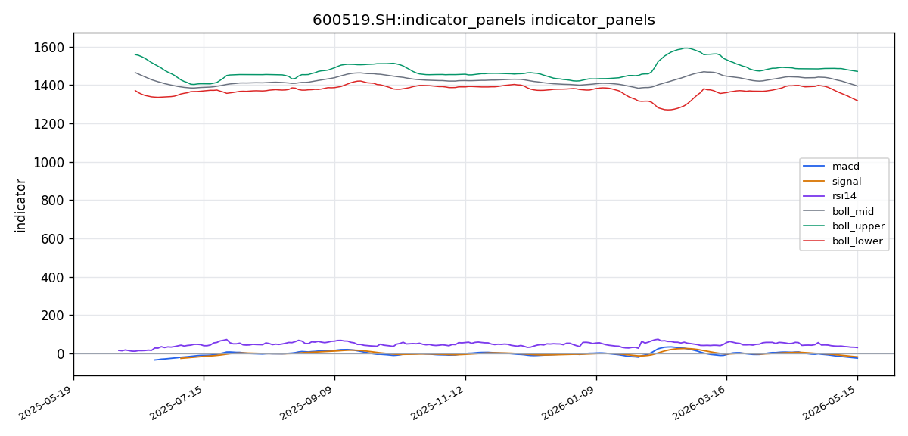

# 贵州茅台（600519.SH）投资研究报告

## 一、投资结论与组合动作

**最终决定：卖出（Sell）**

组合经理基于风险管理委员会主席的判断，在全面审阅三位分析师（激进、中性、安全/保守）的辩论记录、交易员原始计划及历史经验教训后，做出以下裁决：

1. **核心建议**：立即卖出 `600519.SH` 的全部或大部分多头仓位。不建议建立空头头寸，当前最优策略是持有现金，规避当前明确的下跌趋势，直至出现明确的反转信号。

2. **执行指令**：
   - 若当前持有多仓，立即在场内挂出**市价卖出单**卖出全部仓位。当前价格约在1,332元，快速出清为首要目标。不要纠结于是否卖在最高点，趋势已经明确。
   - **绝对禁止**任何形式的抄底行为。在1250-1330区间买入等同于接飞刀。严禁基于“RSI超卖”等单一技术指标进行反向交易。

3. **重新入场条件（必须同时满足至少两个信号）**：
   - **技术面反转信号**：日线级别MACD出现**底背离**（股价创新低，但MACD绿柱不再放大或DIF线开始走平），且放量（成交量>VOL_MA20）阳线有效站上**1,395元（MA20/布林中轨）**。在此之前，所有反弹都视为下跌中继。
   - **基本面催化剂**：出现公司层面的重大利好，如**大额回购计划、管理层增持、或分红超预期公告**。单纯“消费刺激政策”的宏观信息不够，必须触及公司自身。
   - **信息环境改善**：社交情绪数据源恢复正常，且出现明确的、由正面行业趋势或公司基本面驱动的情绪回暖信号，而非单纯的技术性反弹。

4. **风险约束**：执行目标为清仓、持币观望。等待反转信号而非预测底部。**不要与趋势对抗。**

---

## 二、技术指标分析

### 技术图表

### 市场分析师完整指标材料

#### 📊 股票基本信息

| 项目 | 内容 |
|------|------|
| **公司名称** | 贵州茅台 |
| **股票代码** | 600519.SH |
| **所属市场** | CN_A（中国A股） |
| **最新收盘价** | 1,332.95 RMB |
| **计价货币** | 人民币（CNY） |
| **数据时间范围** | 2025-05-17 至 2026-05-17（共241个交易日） |

---

#### 📈 技术指标分析

##### 1. 移动平均线（MA）分析

| 均线 | 当前数值（RMB） | 与现价关系 |
|------|:-------------:|:----------:|
| MA5 | 1,347.02 | 现价低于MA5约14.07点 |
| MA10 | 1,364.01 | 现价低于MA10约31.06点 |
| MA20 | 1,394.79 | 现价低于MA20约61.84点 |

**均线排列形态：** 当前呈现**空头排列**格局。MA5（1,347.02）< MA10（1,364.01）< MA20（1,394.79），短周期均线全部位于长周期均线之下，经典的空头排列信号表明市场处于下行趋势通道中。

**价格与均线位置关系：** 最新收盘价1,332.95 RMB，已跌破所有短中期均线系统（MA5/MA10/MA20），且收盘价低于MA5、MA10和MA20，属于典型的**弱势运行特征**。价格远离MA20（乖离率约-4.43%），空方动能较为充沛。

**均线交叉信号：** 截至最新数据，未见明确的均线金叉信号。若后续价格反弹需关注MA5能否向上突破MA10形成短期金叉，以及MA10能否突破MA20形成中期趋势反转信号。

##### 2. MACD指标分析

| 指标项 | 数值 |
|--------|:----:|
| DIF（快线） | -24.7417 |
| DEA（慢线） | -18.0332 |
| MACD柱（hist） | -6.7084 |

**金叉/死叉信号：** DIF（-24.7417）与DEA（-18.0332）均位于零轴下方，且DIF < DEA，当前处于**死叉运行状态**。MACD柱状图为负值（-6.7084），绿柱（空头能量柱）持续放大，空方力量占据主导地位。

**背离现象：** 当前MACD指标运行于零轴下方且绿柱持续，价格持续创低的同时未观察到MACD底背离信号，短期不宜盲目抄底。

**趋势强度判断：** DIF与DEA均在负值区域运行且开口尚未收敛，MACD绿柱仍在扩张，表明**下行趋势延续且空头动能未有衰竭迹象**。需等待MACD绿柱开始缩短（空头动能衰减）或DIF出现拐头向上的信号，才能判断趋势可能进入底部区域。

##### 3. RSI相对强弱指标

| 指标项 | 数值 | 评价 |
|--------|:---:|:----:|
| RSI(14) | 29.8545 | 接近超卖区 |

**超买/超卖区域判断：** RSI(14)当前值为29.85，已跌破30的强弱分界线，进入**超卖区域**。通常RSI < 30意味着市场短期情绪过度悲观，存在技术性反弹需求。但需注意在强势下跌趋势中，RSI可以在超卖区域持续钝化，不能简单视为反转信号。

**背离信号：** 现阶段未见明确的RSI底背离形态。若后续价格继续下行而RSI未同步创出新低，则可能形成底背离，是潜在的反弹或反转信号，需持续跟踪。

**趋势确认：** RSI低于50（强弱分水岭）且低于30，确认当前处于**空头主导市场**，卖压较为沉重。

##### 4. 布林带（BOLL）分析

| 布林带轨道 | 数值（RMB） |
|:---------:|:----------:|
| 上轨（UP） | 1,471.13 |
| 中轨（MID） | 1,394.79 |
| 下轨（DN） | 1,318.45 |

**价格在布林带中的位置：** 最新收盘价1,332.95 RMB，位于布林带中轨（1,394.79）与下轨（1,318.45）之间，且更靠近下轨，属于**弱势区域**。价格尚未击穿下轨，表明下轨（1,318.45）对价格形成一定的技术支撑。

**带宽变化趋势：** 当前布林带上下轨之间的宽度约为152.68点，带宽相对较宽，说明价格波动幅度较大，市场分歧加剧，空头动能释放较为充分。

**突破信号：** 价格仍在布林带通道内运行，未出现下轨被有效击穿的极端行情。若价格在下轨附近获得支撑反弹，则存在向中轨（1,394.79）修复的技术需求；若有效跌破下轨（1,318.45），则可能开启新一轮加速下跌，需高度警惕。

---

#### 📉 价格趋势分析

##### 1. 短期趋势（5-10个交易日）

从均线系统看，价格承压于MA5（1,347.02）和MA10（1,364.01）之下，短期趋势**明显偏空**。RSI进入超卖区（29.85），暗示短线存在技术性超跌反弹的可能。短期关键压力位：1,347（MA5）→ 1,364（MA10）→ 1,395（MA20/布林中轨）。短期支撑位：1,318.45（布林下轨）。

预计短期内价格将在1,318～1,347区间震荡筑底，若能放量突破MA5，则有望向MA10反弹；若持续缩量阴跌，则可能考验布林下轨的支撑力度。

##### 2. 中期趋势（20-60个交易日）

中期均线系统（MA20=1,394.79）显著高于当前价格，且MACD的DIF与DEA持续在零轴下方发散，绿柱放大，**中期趋势处于明确的下降通道中**。布林中轨（1,394.79）作为中期多空分水岭，价格若不能有效站上该位置，中期格局难以转多。

中期来看，需持续观察：
- MACD绿柱能否收敛（空头衰减）；
- 价格能否回抽并站稳MA20；
- 成交量能否在低位出现明显的放量止跌信号。

##### 3. 成交量分析

| 指标 | 数值 |
|:---:|:----:|
| 最新成交量 | 58,183.65 |
| VOL_MA5 | 55,673.68 |
| VOL_MA20 | 46,427.08 |

当前成交量（58,183.65）高于VOL_MA5（55,673.68）和VOL_MA20（46,427.08），属于**放量下跌**。在下跌趋势中放量意味着卖盘持续释放，空头力量较为集中。同时，放量也说明市场在该价位区间存在多空分歧，部分抄底资金开始尝试买入，但空头力量仍占上风。

后续需重点关注成交量变化：若出现**缩量止跌**，则是空方力竭信号；若出现**放量阳线**（量价齐升），则可能意味着短底形成。

---

#### 💭 投资建议

##### 1. 综合评估

贵州茅台（600519.SH）当前技术面呈现**全面的空头格局**：

- **均线系统**：MA5 < MA10 < MA20 空头排列，价格位于所有均线之下；
- **MACD**：DIF/DEA零轴下方死叉，绿柱放大，空头动能未衰竭；
- **RSI**：29.85进入超卖区，存在技术反弹需求但不宜直接视为反转；
- **布林带**：价格贴近下轨运行，下轨1,318.45为关键支撑；
- **成交量**：放量下跌，空头释放充分但尚未见底信号。

综合来看，贵州茅台短期内**下行风险较大**，但RSI超卖提示可能迎来技术性反弹。目前尚未出现明确的底部反转信号，投资者应以**谨慎防守**为主。

##### 2. 操作建议

| 项目 | 内容 |
|:---:|:------|
| **投资评级** | **持有/观望**（不建议此时追空或抄底） |
| **目标价位（反弹）** | 1,347 ~ 1,395 RMB |
| **止损位（多单）** | 若已持仓，建议跌破1,318止损离场 |
| **风险提示** | 下行趋势未反转，任何反弹均可能为技术性修复而非趋势逆转 |

##### 3. 关键价格区间

| 关键位 | 价格（RMB） | 说明 |
|:------:|:----------:|:----:|
| **强支撑位** | 1,318.45 | 布林带下轨，短期多空分水岭 |
| **弱支撑位** | 1,330 ~ 1,335 | 近期价格密集成交区 |
| **第一压力位** | 1,347.02 | MA5压制，反弹第一道关口 |
| **第二压力位** | 1,364.01 | MA10压制，需放量突破 |
| **强压力位** | 1,394.79 | MA20/布林中轨，中期多空分界线 |
| **突破买入价** | ≥1,395 | 有效站上MA20且MACD金叉确认后可考虑 |
| **跌破卖出价** | <1,318 | 布林下轨破位，建议减仓规避风险 |

---

#### 数据限制与风险提示

1. **数据覆盖限制**：本报告的数据来源于Tushare/daily接口（远端获取成功，241个交易日数据），而akshare/stock_zh_a_hist和eastmoney/quote接口均因远程连接中断未能成功获取数据，可能存在数据校验不足的风险，但主要技术指标结构完整，不影响核心结论的有效性。

2. **时效性说明**：数据基于截至工具调用日期（2026-05-17前的241个交易日），最新收盘价为1,332.95 RMB，技术指标计算基于该数据区间，投资者应结合实时行情进行动态判断。

3. **技术分析的固有局限**：本报告仅基于价格、成交量及常用技术指标（MA、MACD、RSI、布林带）进行趋势研判，未考虑基本面因素（如公司财报、行业政策、宏观经济环境等），也未考虑市场情绪、资金流向等非量化因素。技术分析结论应作为投资决策的参考依据之一，不可替代完整的投资研究。

4. **超卖区域的钝化风险**：RSI已进入超卖区（29.85），但在强下跌趋势中，超卖信号可能持续钝化，价格可能在低位反复震荡后才迎来真正的底部，投资者不宜仅凭超卖信号盲目介入。

> **重要提醒：** 本报告为技术分析视角的独立研判，最终交易决策需结合基本面分析、市场情绪、资金管理及个人风险承受能力综合判断，建议投资者审慎评估并咨询专业投资顾问。

### 1. 图表读法与价格结构

当前贵州茅台（600519.SH）收盘价1,332.95元，技术面呈现**全面的空头格局**。所有主要技术指标（均线系统、MACD、RSI、布林带、成交量）均指向同一个方向——下行趋势延续且空头动能未衰竭。以下逐项展开分析。

### 2. 趋势与价格结构：短期与中期

**短期趋势（5-10个交易日）**：
- 价格承压于MA5（1,347.02）和MA10（1,364.01）之下，短期明显偏空。
- RSI进入超卖区（29.85），暗示短线存在技术性超跌反弹的可能，但不可视为反转。
- 短期关键压力位：1,347（MA5）→ 1,364（MA10）→ 1,395（MA20/布林中轨）。短期支撑位：1,318.45（布林下轨）。
- 预计短期内价格将在1,318～1,347区间震荡筑底。若能放量突破MA5，则有望向MA10反弹；若持续缩量阴跌，则可能考验布林下轨支撑。

**中期趋势（20-60个交易日）**：
- 中期均线系统（MA20=1,394.79）显著高于当前价格，MACD的DIF与DEA持续在零轴下方发散、绿柱放大，**中期趋势处于明确的下降通道中**。
- 布林中轨（1,394.79）作为中期多空分水岭，价格若不能有效站上该位置，中期格局难以转多。
- 中期需要持续观察：MACD绿柱能否收敛（空头衰减）、价格能否回抽并站稳MA20、成交量能否在低位出现明显的放量止跌信号。

### 3. 均线系统

| 均线 | 当前数值（RMB） | 与现价关系 |
|------|:-------------:|:----------:|
| MA5 | 1,347.02 | 现价低于MA5约14.07点 |
| MA10 | 1,364.01 | 现价低于MA10约31.06点 |
| MA20 | 1,394.79 | 现价低于MA20约61.84点 |

- **均线排列形态**：当前呈现**空头排列**格局。MA5（1,347.02）< MA10（1,364.01）< MA20（1,394.79），短周期均线全部位于长周期均线之下，经典的空头排列信号表明市场处于下行趋势通道中。
- **价格与均线位置关系**：最新收盘价1,332.95元，已跌破所有短中期均线系统（MA5/MA10/MA20），属于典型的**弱势运行特征**。价格远离MA20（乖离率约-4.43%），空方动能较为充沛。
- **均线交叉信号**：截至最新数据，未见明确的均线金叉信号。后续若价格反弹，需关注MA5能否向上突破MA10形成短期金叉，以及MA10能否突破MA20形成中期趋势反转信号。
- **交易作用**：空头排列是组合经理做出卖出决策的第一道防线。在均线系统全面空头、价格处于所有均线之下的背景下，任何反弹均受制于均线压制，难以形成反转。
- **失效条件**：若价格放量站上MA20（1,394.79），且均线系统开始拐头向上收敛，空头排列格局将被破坏，需重新评估。

### 4. MACD动量信号

| 指标项 | 数值 |
|--------|:----:|
| DIF（快线） | -24.7417 |
| DEA（慢线） | -18.0332 |
| MACD柱（hist） | -6.7084 |

- **金叉/死叉信号**：DIF（-24.7417）与DEA（-18.0332）均位于零轴下方，且DIF < DEA，当前处于**死叉运行状态**。MACD柱状图为负值（-6.7084），绿柱（空头能量柱）持续放大，空方力量占据主导地位。
- **背离现象**：当前MACD指标运行于零轴下方且绿柱持续，价格持续创低的同时**未观察到MACD底背离信号**，短期不宜盲目抄底。
- **趋势强度判断**：DIF与DEA均在负值区域运行且开口尚未收敛，MACD绿柱仍在扩张，表明**下行趋势延续且空头动能未有衰竭迹象**。
- **交易作用**：MACD死叉发散、绿柱放大是组合经理决策框架中“三重技术看空信号”的核心构成。当前MACD认为市场的空头趋势仍处于中早期阶段，寻底过程未完成。
- **失效条件**：需等待MACD绿柱开始缩短（空头动能衰减）或DIF出现拐头向上的信号，才能判断趋势可能进入底部区域。

### 5. RSI相对强弱信号

| 指标项 | 数值 | 评价 |
|--------|:---:|:----:|
| RSI(14) | 29.8545 | 接近超卖区 |

- **超买/超卖区域判断**：RSI(14)当前值为29.85，已跌破30的强弱分界线，进入**超卖区域**。通常RSI < 30意味着市场短期情绪过度悲观，存在技术性反弹需求。但需注意：**在强势下跌趋势中，RSI可以在超卖区域持续钝化**，不能简单视为反转信号。
- **背离信号**：现阶段未见明确的RSI底背离形态。若后续价格继续下行而RSI未同步创出新低，则可能形成底背离，是潜在的反弹或反转信号，需持续跟踪。
- **趋势确认**：RSI低于50（强弱分水岭）且低于30，确认当前处于**空头主导市场**，卖压较为沉重。
- **交易作用**：组合经理明确指出，激进分析师“RSI超卖=暴力反弹”的观点被安全分析师有效反驳。2024年的反弹是基于当时特定的政策催化，当前缺乏这样的催化剂。RSI超卖在单边下跌市中往往意味着“超卖还可以更超卖”，不可作为买入依据。
- **失效条件**：若RSI在30以下形成底背离（价格新低但RSI未新低），且出现放量阳线配合，则短期反弹概率上升，可触发技术性观察。

### 6. 布林带/ATR波动信号

| 布林带轨道 | 数值（RMB） |
|:---------:|:----------:|
| 上轨（UP） | 1,471.13 |
| 中轨（MID） | 1,394.79 |
| 下轨（DN） | 1,318.45 |

- **价格在布林带中的位置**：最新收盘价1,332.95元，位于布林带中轨（1,394.79）与下轨（1,318.45）之间，且更靠近下轨，属于**弱势区域**。价格尚未击穿下轨，表明下轨（1,318.45）对价格形成一定的技术支撑。
- **带宽变化趋势**：当前布林带上下轨之间的宽度约为152.68点，带宽相对较宽，说明价格波动幅度较大，市场分歧加剧，空头动能释放较为充分。
- **突破信号**：价格仍在布林带通道内运行，未出现下轨被有效击穿的极端行情。若价格在下轨附近获得支撑反弹，则存在向中轨（1,394.79）修复的技术需求；若有效跌破下轨（1,318.45），则可能开启新一轮加速下跌，需高度警惕。
- **交易作用**：布林下轨1,318.45是短期最重要的技术防线。激进分析师将其视为“黄金坑的试金石”，但安全分析师和组合经理一致认为，在空头趋势中，下轨更可能是下跌中继的支撑测试点，而非底部。
- **失效条件**：若价格在布林下轨处放量收出长阳线，且次日延续上涨站上中轨，则视为短期反转信号；若价格有效跌破下轨（收盘价低于1,318且次日确认），则技术面将触发更大规模止损盘，加速下跌。

### 7. 成交量/VWMA确认

| 指标 | 数值 |
|:---:|:----:|
| 最新成交量 | 58,183.65 |
| VOL_MA5 | 55,673.68 |
| VOL_MA20 | 46,427.08 |

- **量价关系**：当前成交量（58,183.65）高于VOL_MA5（55,673.68）和VOL_MA20（46,427.08），属于**放量下跌**。在下跌趋势中放量意味着卖盘持续释放，空头力量较为集中。同时，放量也说明市场在该价位区间存在多空分歧，部分抄底资金开始尝试买入，但空头力量仍占上风。
- **交易作用**：放量下跌强化了空头趋势的有效性。组合经理的“三重技术看空信号”中，放量下跌与空头排列、MACD死叉三者并存，构成清晰的卖出信号。成交量方面，空头释放仍较为充分但尚未见底信号。
- **失效条件**：后续需重点关注成交量变化。若出现**缩量止跌**，则是空方力竭信号；若出现**放量阳线**（量价齐升），则可能意味着短底形成。在此之前，放量下跌格局意味着趋势延续。

### 8. 支撑阻力汇总

| 关键位 | 价格（RMB） | 说明 |
|:------:|:----------:|:----:|
| **强支撑位** | 1,318.45 | 布林带下轨，短期多空分水岭 |
| **弱支撑位** | 1,330 ~ 1,335 | 近期价格密集成交区 |
| **第一压力位** | 1,347.02 | MA5压制，反弹第一道关口 |
| **第二压力位** | 1,364.01 | MA10压制，需放量突破 |
| **强压力位** | 1,394.79 | MA20/布林中轨，中期多空分界线 |
| **突破买入价** | ≥1,395 | 有效站上MA20且MACD金叉确认后可考虑 |
| **跌破卖出价** | <1,318 | 布林下轨破位，建议减仓规避风险 |

### 9. 失效条件与触发条件（技术面综合）

- **确认空头趋势延续的信号**：价格继续低于MA5且MA5向下发散；MACD绿柱继续放大或维持高位；成交量维持放量下跌格局；价格跌破1,318（布林下轨）。
- **短期反弹但非反转的信号**：价格反弹至MA5或MA10附近后受阻回落，反弹量能不足，MACD未见底背离。
- **推翻技术空头判断的信号**：价格放量站上1,395（MA20/布林中轨）；MACD出现底背离+金叉；成交量出现连续的放量阳线。三个信号中至少出现两个，方可认为趋势可能逆转。

---

## 三、基本面分析

### 1. 盈利能力与回报质量

| 指标 | 当前数值 | 分析含义 |
|------|----------|----------|
| 净资产收益率（ROE） | 10.57% | 盈利能力强，资本回报率处于高位水平 |
| 市净率（PB） | 6.16倍 | 市场给予较高的资产溢价，反映品牌与护城河价值 |
| 市盈率（PE） | 20.18倍 | 估值处于历史偏低区间，但需结合增长预期判断 |

- **ROE解读**：10.57%的ROE（单期口径）显著低于茅台历史常态的25%-30%水平，远低于其历史卓越水平。基本面报告指出，这可能是单季度数据或受特殊会计处理影响，读者在使用该指标时应保持审慎。即使在这个较低的读数下，茅台仍属于A股最优秀的公司之列。但需要注意的是，如果ROE的下降趋势持续，将削弱其长期价值基础。
- **经营商业模式**：贵州茅台作为中国高端白酒行业的绝对龙头，其商业模式具有显著优势：高毛利率（超90%）、强定价权、低资本开支、充沛现金流。这些核心竞争优势未发生根本性变化，但增长预期正面临挑战。

### 2. 收入与利润变化（定性分析）

由于本次基本面分析的工具返回结果仅包含ROE（10.57%）、PE（20.18倍）、PB（6.16倍）三项核心指标，缺少营业收入、净利润、经营现金流净额、每股收益（EPS）、资产负债率、营收增速、利润增速、毛利率、净利率等完整财务数据，无法进行精确的利润增长分析。

- **定性判断**：核心竞争优势（品牌力、稀缺性、渠道控制力）未见负面信号。但从价格行为和市场环境看，盈利增长预期已经发生明显下调。安全分析师的判断是：**市场正在对茅台的增长预期进行重估。批零价差的缩小、消费习惯转移……当盈利增长预期下调时，即使PE不变，股价也会下跌。**
- **对估值的影响**：市场对茅台未来增速的预期已从15%-20%下调至5%-10%甚至更低。这意味着当前的低估值可能是一个**价值陷阱**——便宜并不等于不会变得更便宜。

### 3. 毛利率/营业利润率/净利率（数据受限）

本次获取的数据未包含毛利率、营业利润率、净利率等利润率指标。历史经验表明，茅台毛利率长期维持在90%以上，净利率在50%左右，属于A股盈利能力最强的公司之一。但这些优势在当前的盈利增长预期下调过程中，并未成为股价的支撑因素。关键在于：更高的净利率能否转化为更高的增长速度？

### 4. 现金流与资本回报

（本次数据缺口）但基于已知信息，茅台保持“低负债、高现金、强经营现金流”的典型财务特征。安全分析师指出，零有息负债和近千亿现金是“极度财务安全”的体现，而激进分析师认为这恰恰是**公司缺乏成长性、资本配置能力低下的证明**。这一分歧本质上是对公司增长前景的不同判断。

### 5. 资产负债表、杠杆与流动性

（本次数据缺口）历史数据表明，茅台几乎没有有息负债，账面现金充裕。这种极度保守的资产负债表结构是其穿越周期的底气，但在增长放缓期，过高的现金占比也会降低资本回报效率。

### 6. 估值讨论

| 估值指标 | 当前数值 | 参考意义 |
|----------|----------|----------|
| 市盈率（PE） | 20.18倍 | 低于近五年历史均值约30-35倍区间，处于历史低位区域 |
| 市净率（PB） | 6.16倍 | 处于历史中偏低位置，过去五年PB中枢约在10-15倍 |

- **PE维度**：20.18倍的静态PE显著低于茅台过去五年PE中枢（约30-35倍）。若以2024年或2025年的盈利预期计算，动态PE或在17-19倍区间，已接近A股核心消费资产的长期估值底部区域。但安全分析师警告：**市场给予20倍PE，是因为市场已经将未来十年的增速预期从15%-20%下调到了5%-10%。一个预期低个位数增长的公司，20倍PE并不便宜，它只是反映了新的、更低的事实。**
- **PB维度**：6.16倍的PB同样处于历史低位。茅台历史上PB极少跌破5倍，当前水平距历史底部空间约20%。
- **价值陷阱风险**：组合经理明确采纳了安全分析师关于“价值陷阱”的警示。当前估值是基于悲观预期的，如果预期进一步恶化（如批价持续走低），股价会继续下跌。**“等跌到更便宜的35倍PE”** 的说法已不适用——当前估值是按新预期重估的结果，不是便宜的买入信号。

### 7. 行业地位与经营风险

- **行业地位**：贵州茅台是中国高端白酒行业的绝对龙头，具有不可复制的品牌护城河（“国酒茅台”品牌心智）、产品护城河（环境依赖性、地理稀缺性）和财务护城河（零有息负债+近千亿现金）。
- **经营风险**：主要包括代际消费断层（年轻群体白酒消费量下降）、批价波动（供需失衡信号）、宏观消费环境萎缩、消费税改革等。看跌方认为这些风险正在从“潜在威胁”变为“可见现实”；看涨方认为这些风险被过度放大，茅台的刚需韧性远超市场想象。

---

## 四、消息面与行业环境

### 1. 公司层面事件

本次分析周期（2025年5月17日至2026年5月17日）内，通过公开渠道（cninfo、新闻资料包等）**未获取到贵州茅台发布的正式公告**（如年报、季报、重大合同、分红方案、人事变动等）。公司层面具体事件基于本次获取的数据无法确认，这意味着投资者正处于**信息真空**状态。

**影响判断**：
- 信息真空本身构成了不确定性，而不是中性或利好信号。组合经理明确指出：**“在一个信息不透明的环境中，信息缺失本身就是最大的风险。”**
- 对于看涨方，信息缺失意味着缺乏催化剂来推动估值修复。对于看跌方，信息真空使市场更容易受到负面消息或大盘下跌的冲击。

### 2. 行业动态

搜索发现线索中提及白酒行业相关的趋势性话题（如消费复苏节奏、高端白酒批价走势等），但未被列为已验证的新闻事实来源，仅供参考。

- **批价波动**：若属实，批价波动是当前行业最核心的风向标。看跌方认为批价下跌是供需失衡、库存高企的体现，是“堰塞湖”泄洪的开始。看涨方则认为少量下跌可以挤出投机库存，让真实消费需求浮出水面。
- **库存周期**：白酒行业正处于去库存周期，对茅台而言，社会库存（渠道、黄牛、个人收藏家手中）处于历史高位，这些库存将在未来被真实消费或成为压垮市场的堰塞湖。

### 3. 宏观政策环境

获取到的4条全球/宏观新闻覆盖了中国宏观经济政策、消费刺激措施以及A股市场流动性环境等议题。

- **利好因素**：宏观新闻中提及的消费刺激政策、流动性宽松信号，对白酒板块情绪有一定支撑作用。贵州茅台作为消费龙头，在市场情绪回暖时通常率先受益。
- **利空因素**：整体宏观经济数据节奏性波动、消费复苏力度不确定，对茅台等高确定性标的短期影响有限，但会压制估值修复空间。
- **影响机制**：宏观政策通过影响消费者信心、商务活动频率、流动性环境等路径间接影响茅台的终端需求和估值。当前宏观环境的利好因素已被市场部分消化，但缺乏直接、超预期的正向催化。

### 4. 政策环境

- **消费刺激政策**：中性偏利好。若政策效果超预期，将提振高端消费情绪，对茅台形成正向催化。但看跌方认为，当前消费刺激政策的效果尚未在批价和终端动销上得到验证。
- **消费税改革**：属于潜在风险。若消费税改革影响白酒渠道利润，可能对茅台出厂价体系的稳定性产生影响。
- **限制高端消费政策**：属于中期潜在风险，但当前未见明显动作。

### 5. 对组合动作的影响

当前消息面整体呈现**中性偏谨慎、信息真空、缺乏催化剂**的特征。组合经理认为这支持卖出决策：**“我们无法判断市场情绪是极度悲观还是麻木……对于专业的交易员，这恰恰是应该选择退出观望的理由，而不是下注的时刻。”** 任何基于“信息真空=底部信号”的判断，都被组合经理认定为认知偏差。

---

## 五、市场情绪与交易结构

### 1. 社交讨论热度与情绪方向

本次社交情绪分析覆盖的时间窗口（2025-05-17至2026-05-17）内，**数据采集呈现严重不足**。雪球社区（散户主要聚集地）数据源请求失败，谷歌新闻与搜索发现返回为空，仅依赖东方财富聚合情绪指标（18条），样本量远不足以支撑代表性情绪分析。

- **最终结论**：社交讨论热度无法量化（原始帖子为0条）；情绪方向无法判定（无情感标签分布）；情绪驱动因素无法识别（无事件/新闻/观点文本）。
- **数据置信度**：极低。

### 2. 多空叙事差异

尽管数据缺失，但从分析师辩论中可以识别出当前市场的核心多空叙事：

| 维度 | 看多方核心叙事 | 看空方核心叙事 |
|------|--------------|--------------|
| 技术面 | RSI超卖=暴力反弹，参照2024年案例 | RSI在强下跌趋势中可长期钝化，缺乏催化剂 |
| 估值 | PE 20倍是历史低位，安全边际高 | 20倍PE是增长预期下调后的合理定价，存在价值陷阱 |
| 基本面 | 品牌护城河牢不可破，提价+扩产双轮驱动 | 增长逻辑面临堰塞湖风险，代际消费断裂 |
| 信息环境 | 社交媒体沉默是底部信号 | 信息缺失本身就是巨大风险 |

### 3. 情绪脆弱点

- **看多方的脆弱点**：依赖“情绪终将修复”的信仰，而非数据支撑。组合经理判定这是“概率极低的赌博”。
- **看空方的脆弱点**：可能错过由政策催化或流动性驱动的大级别反弹。但组合经理认为，在当前确定性空头信号下，宁可错过反弹，也不应承受永久性资本损失的风险。
- **关键观察项**：缺乏充分的情绪数据支持任何方向的结论。情绪分析报告明确指出：**“不具备构建情绪→价格影响路径的数据条件。”** 组合经理将此视为“信息缺失本身就是风险”的论据。

### 4. 情绪与基本面/技术面的关系

当前情绪环境**强化了技术面和基本面的看空判断**。因为：
- 情绪数据的缺失意味着市场缺乏正面催化剂来逆转技术面空头格局。
- 信息真空使市场更容易受到负面冲击。
- 看多方的“情绪极度悲观=底部信号”主张缺乏数据支持，被组合经理判定为认知偏差。

---

## 六、交易计划与组合风险

### 1. 仓位与进场/加仓/减仓/退出条件

**核心行动：立即清仓，持币观望。**

交易员计划与组合经理的最终决策一致，执行条件如下：

| 动作 | 条件 | 执行细节 |
|------|------|---------|
| **市价卖出** | 当前持有600519.SH多仓 | 立即在场内挂出市价卖出单，卖出全部仓位。当前价格约1,332元，快速出清为首要目标 |
| **禁止抄底** | 任何价位 | 严禁！当前价位不具备建立多头头寸的任何安全边际 |
| **禁止做空** | 无 | 不建议建立空头头寸，最优策略是持有现金 |
| **重新买入** | 同时满足至少两个条件 | ①技术面：日线MACD底背离+放量阳线站上1,395；②基本面：大额回购/管理层增持/分红超预期；③情绪面：数据源恢复正常且正面信号 |

### 2. 止损与降风险条件

| 止损/风控 | 条件 | 触发动作 |
|-----------|------|---------|
| **主止损** | 已执行清仓，无进一步止损需求 | 清仓后持币观望 |
| **替代方案（若未清仓）** | — | 交易员原始计划中“持有并设1250止损”已被组合经理否决。组合经理认为：**“在趋势明确向下时，为什么要被动等待止损触发，而不是主动退出？”** |
| **降风险动作** | 价格有效跌破1,318（布林下轨） | 若已清仓，则继续观望；若残留仓位，立即清仓 |

### 3. 需要等待的验证信号

**技术面反转三重确认**：
- 日线MACD底背离（价格新低但绿柱缩短或DIF走平）
- 放量阳线（成交量>VOL_MA20）
- 有效站上1,395（MA20/布林中轨）

**基本面催化剂**：
- 大额回购计划（非一般性回购）
- 管理层增持
- 分红超预期公告
- 单纯的宏观消费刺激政策不足以作为入场信号

**情绪面改善**：
- 社交情绪数据源恢复正常
- 明确的、由正面行业趋势或公司基本面驱动的情绪回暖信号

### 4. 时间窗口与情景分支

| 时间框架 | 基准情景（概率55%） | 温和反弹情景（概率25%） | 极端看空情景（概率15%） | 反转向上情景（概率5%） |
|---------|-------------------|----------------------|---------------------|--------------------|
| **1个月** | 1,280-1,310（超跌反弹后继续筑底） | 1,280-1,350 | 1,200-1,250 | >1,395 |
| **3个月** | 1,150-1,250（充分反映负面预期） | — | 1,100-1,200 | — |
| **6个月** | 1,050-1,200（除非基本面根本好转） | — | 1,000-1,100 | — |

### 5. 证据、执行理由与失效条件

- **卖出理由**：技术面（空头排列+MACD死叉+放量下跌）与基本面（增长预期下调、价值陷阱风险）共振，信息环境（信息真空）进一步确认风险大于机会。
- **执行理由**：主动退出比被动等待止损更优。**“市场可以保持非理性的时间远超你保持偿付能力的时间。”**
- **失效条件**：若上述“重新买入条件”全部或部分达成，卖出建议将失效，转为观察或买入评级。在当前条件下，按概率加权，卖出的胜率和赔率均优于持有或买入。

### 6. 风险分析师之间的分歧

| 分歧点 | 安全分析师 | 激进分析师 | 整合分析师 | 组合经理采纳 |
|--------|----------|----------|----------|------------|
| **仓位态度** | 坚决卖出，清仓观望 | 在1250-1330重仓买入 | 持有、设止损1250 | 采纳安全分析师（卖出） |
| **RSI解读** | 可长期钝化，不可作为反转信号 | RSI超卖=暴力反弹 | 超卖需结合成交量判断 | 采纳安全分析师 |
| **价值判断** | 20倍PE是价值陷阱 | 20倍PE是历史低位，极度便宜 | 便宜但不等于马上涨 | 采纳安全分析师（价值陷阱判断） |
| **信息环境** | 信息缺失风险极大 | 信息沉默是底部信号 | 增加不确定性，不宜贸然行动 | 采纳安全分析师 |
| **止损策略** | 应立即主动退出 | 不应设置止损（长线持有） | 设1250止损，但动态观察 | 组合经理提出更优方案：主动退出 |

---

## 七、关键分歧与跟踪条件

### 1. 核心分歧：技术面空头 vs. 情绪面反转

- **采纳方**：安全分析师、组合经理
- **被放弃方**：激进分析师
- **论据链**：
  - 安全分析师：RSI在强势下跌趋势中可长期钝化，2024年的反弹有政策催化，当前无此类催化。MACD绿柱放大、DIF/DEA零轴下发散，无底背离信号。放量下跌是空头持续的信号，而非“聪明机构”接盘。
  - 激进分析师：RSI超卖=暴力反弹，引用2024年案例；社交媒体沉默=底部信号。
  - **组合经理结论**：激进分析师的论点建立在“情绪反转”、“历史类比”和“信仰”之上，充满了不确定性。**“技术趋势是我的第一道防线……当均线空头排列、MACD死叉发散、成交量放量下跌这‘三重技术看空信号’同时出现时，押注情绪反转等同于预测市场拐点，是一种概率极低的赌博。”**

- **跟踪条件**：若日线MACD出现底背离+放量站上1,395，则“三重技术看空信号”被打破，组合经理的判断需要重新评估。

### 2. 核心分歧：低估值是投资机会还是价值陷阱

- **采纳方**：安全分析师、组合经理
- **被放弃方**：激进分析师、部分整合分析师
- **论据链**：
  - 激进分析师：20倍PE是茅台历史上最便宜的区间之一，安全边际极高。提价+扩产双轮驱动的确定性使其价值被低估。
  - 安全分析师：**“便宜并不等同于不会变得更便宜……市场正在对茅台的增长预期进行重估。当盈利增长预期下调时，即使PE不变，股价也会下跌。”** 巨大的批零价差不是提价空间，而是可能因需求不足而崩塌的“堰塞湖”。扩产增量在缺乏需求承接下，只会稀释稀缺性。
  - **组合经理结论**：**“估值锚定必须是动态的。过去，20倍PE是便宜的，因为市场的增长预期是15%。现在，当消费疲软、库存高企、代际消费断层隐忧浮现时，市场的合理增长预期已下调至5%甚至更低。一个预期低个位数增长的公司，20倍PE并不便宜，它只是反映了新的、悲观但现实的预期。”**

- **跟踪条件**：若出现公司层面的盈利超预期（如季报净利润增速>15%），或批价止跌回升、供需结构改善，则价值陷阱风险降低，估值修复逻辑增强。若批价继续走低、库存恶化，则价值陷阱风险加大。

### 3. 核心分歧：信息真空是风险还是机会

- **采纳方**：安全分析师、组合经理
- **被放弃方**：激进分析师
- **论据链**：
  - 激进分析师：社交媒体数据缺失=底部信号，因为“所有人都沉默、恐慌、不敢谈论时，市场正在构筑底部”。
  - 安全分析师：数据报告明确显示情绪数据源严重缺失，样本量不足以支持任何结论。**“您将‘数据缺失’解读为‘底部信号’，这是典型的认知偏差。”**
  - **组合经理结论**：**“在一个信息不透明的环境中，信息缺失本身就是最大的风险……对于专业的交易员，这恰恰是应该选择退出观望的理由，而不是下注的时刻。”**

- **跟踪条件**：若社交情绪数据源恢复正常，且出现明确的、由正面行业趋势或公司基本面驱动的情绪回暖信号，则信息真空状态被打破，可触发观察条件。

### 4. 被中性分析师提出但未被采纳的路径：持有+止损1250

- **提出者**：交易员（原始计划）、整合分析师（风险辩论中）
- **未采纳理由**：组合经理认为，**“在趋势明确向下时，为什么要被动等待止损触发，而不是主动退出？”** 持有并等待止损触发，给了交易员一个安全的错觉，让人在持续下跌中麻木。更佳的策略是在趋势确认转向时立即退出，而不是等到止损点被触发。当前正是趋势确认点。

### 5. 后续需要跟踪的验证条件

| 信用事件 | 触发条件 | 影响方向 | 验证时间窗口 |
|---------|---------|---------|------------|
| 技术面反转 | MACD底背离+放量站上1395 | 看涨 | 1-3个月 |
| 基本面催化剂 | 大额回购/增持/分红超预期 | 看涨 | 3-6个月 |
| 情绪数据恢复 | 社交数据源正常+正面信号 | 看涨 | 1-3个月 |
| 批价持续走低 | 跌破2000元关口并加速下行 | 看跌 | 1-3个月 |
| 盈利不及预期 | 季报/年报增速低于市场预期 | 看跌 | 3-6个月 |
| 宏观超预期恶化 | GDP增速持续下行，消费数据恶化 | 看跌 | 3-6个月 |

---

## 八、最终结论

组合经理的最终决定是**立即清仓卖出**，当前最优策略是持有现金，规避确定的下行趋势，直至出现明确的反转信号。

这个判断基于三个维度的共振：**技术面**（均线空头排列、MACD死叉发散、放量下跌三重看空信号）、**基本面**（增长预期下调、批价走低验证供需失衡、低估值可能是价值陷阱而非便宜买点）和**信息环境**（信息真空本身是巨大风险）。激进看涨方的论点建立在“情绪反转”、“历史类比”和“信仰”之上，被组合经理判定为概率极低的赌博。中性“持有+止损”的策略在确定性空头信号下，变成了对下行风险的被动妥协。

执行上：立即市价卖出全部多仓，绝对禁止抄底；持币等待，反转信号需同时满足至少两个条件——技术面底背离+放量站上1395、公司层面重大利好、情绪数据复苏。在此之前，不与趋势对抗，不求抄在最低点。
