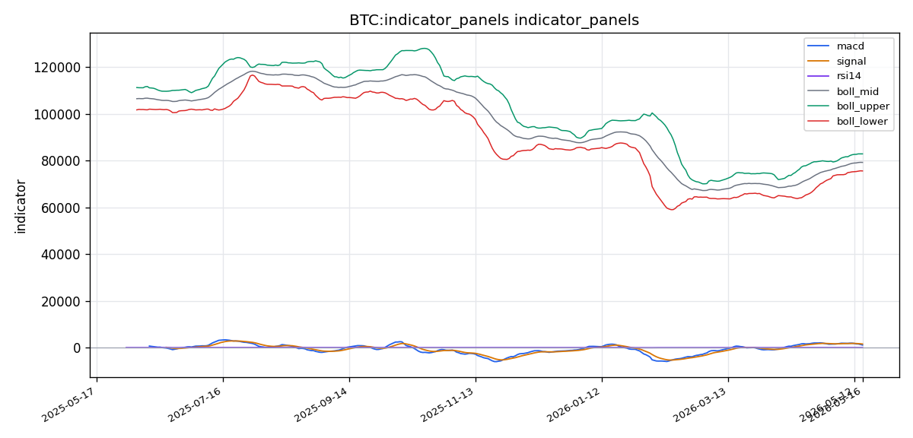
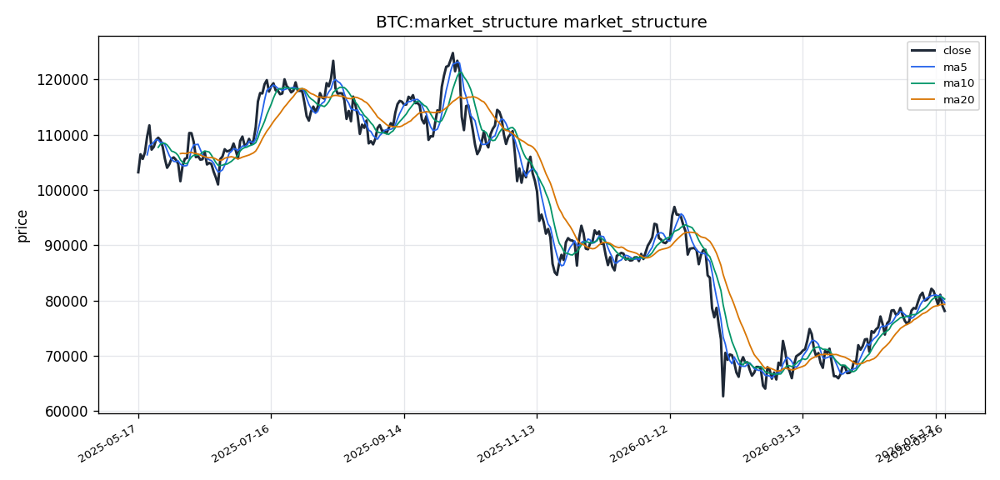

# Bitcoin（BTC）加密资产投资研究报告

## 一、投资结论与组合动作

**最终决策：卖出/做空**。组合经理经过对多空辩论的评估，决定采纳看跌分析师的建议，基于可观测的技术弱势结构，在严格控制仓位与杠杆的前提下执行卖出/做空操作。

**执行理由概述**：看涨方的论证构建在一连串未经数据支撑的假设之上（资金费率为负、清算分布有利于多头、缩量即吸筹），而看跌方拥有“价格位于均线下方、MACD死叉、成交量萎缩”这一组可验证的空头技术结构。在信息不对称的环境中，具备客观数据支撑的一方，哪怕只是技术数据，也远胜于完全依赖叙事的一方。同时，原做多策略的盈亏比仅1.4:1，不足以覆盖数据缺失带来的不确定性。

**最终执行方案如下**：

1.  **入场触发与条件**：
    *   **主要入场点**：在 **79,000 – 79,500美元** 区间建立空头仓位。此为技术面MA5/MA10的压制带。
    *   **触发条件**：价格反弹至该区间后，必须出现**15分钟级别的放量滞涨或小实体阴线**时方可入场，避免在急速拉升时追空。若价格直接放量站上80,000美元，则暂停计划。

2.  **目标区间**：
    *   **第一目标（TP1）**：**75,657美元**（布林带下轨）。在此位置减仓50%空头头寸。
    *   **第二目标（TP2）**：**72,000 – 73,000美元**。剩余50%仓位在此区间分批止盈。

3.  **止损/失效位**：
    *   **硬止损**：**80,500美元**。收盘价站上此位置，空头逻辑失效，必须无条件平仓。
    *   **预警/软失效位**：**79,800美元**。若价格在79,800-80,300美元区间出现放量阳线，应立即减仓一半，并将止损移至成本价。

4.  **仓位与杠杆**：
    *   **最大仓位**：账户总权益的 **10%**（此为大比例缩减，吸收了关于数据真空期应缩小赌注的警告）。
    *   **杠杆**：**3x – 5x**，绝不使用更高杠杆。
    *   **现货**：现有BTC仓位应立即减仓至总权益的 **10%** 以下（长期底仓可保留），而非原计划的30%。

5.  **分批执行与后续跟踪**：
    *   分2-3次建仓，避免单一价格点重仓。
    *   **持续跟踪（数据补全后的修正信号）**：
        *   **资金费率**：一旦补全，若为正且高于0.01%/8h，立即停止做空并平仓；负费率则加强做空逻辑。
        *   **未平仓合约（OI）**：若OI在价格下跌时大幅减少（清算驱动），空头应止盈；若OI上涨伴随价格下跌（新空头入场），空头可持。
        *   **清算密集区**：若数据显示75,000-76,000美元区间有大量多头清算，则75,657美元支撑位脆弱，应提前止盈。
        *   **链上数据**：MVRV、NVT等数据若显示市场被低估，则停止做空，并准备在70,000-72,000美元区间转为多头考虑。

## 二、市场结构与技术指标分析

### 技术图表

### 市场分析师完整指标材料

#### 加密币基本信息

- **币种**：BTC
- **名称**：Bitcoin
- **当前价格**：78,131.44 $
- **24h 涨跌幅**：基于最近一个交易日数据，收盘价78,131.44 $，因资料包仅提供日线收盘，未提供日内实时涨跌幅字段，具体24h涨跌幅数值缺失。
- **24h 成交量**：25,895,799,905.00 $
- **数据时间**：数据区间为2025-05-17至2026-05-17，最新收盘日为该区间最后一个交易日，数据来源于openbb_yfinance/crypto_price_historical，远端获取成功，资料新鲜度为远端实时获取。
- **数据质量**：资料就绪度标记为"就绪"，覆盖概览完成1项检查，0项缺口。价格历史和本地技术指标（均线、布林带、MACD、RSI）成功覆盖。但BB/CoinGlass路径、资金费率、OI、多空比、清算地图、链上、宏观、AHR999及事件数据均未出现在来源列表中，属于未覆盖指标，读者应注意本报告的技术分析基础主要建立在价格结构与本地技术指标之上，衍生品与链上维度存在显著数据缺口。

#### 市场结构结论

当前BTC处于中期震荡回调格局。价格78,131.44 $，已跌破MA5（79,600.60 $）和MA10（80,273.13 $），略低于MA20（79,304.30 $）。均线系统显示短期均线（MA5、MA10）呈空头排列，但MA20仍在相对高位，尚未确认中期趋势全面转空。价格位于布林带中轨（79,304.30 $）下方，接近布林带下轨（75,657.04 $），波动率通道尚未显著扩张但已显下倾压力。MACD柱状图（hist=-439.88）处于零轴下方且持续负值，信号线（1,596.14）高于MACD线（1,156.26），死叉格局延续。RSI(14)报48.89，处于中性偏弱区间，未进入超卖区（30以下），也未进入超买区（70以上）。综合判断：市场处于短期弱势震荡，方向选择窗口正在收窄，关键支撑与压力分别位于布林带下轨75,657 $和中轨79,304 $附近。这个结论可能出错的情形包括：BTC出现放量突破中轨并站上MA5/MA10形成多头反转，或在缺乏衍生品清算数据支撑的情况下价格加速下行击穿下轨。

#### 指标覆盖

- 布林带：**已引用**（数据可用）
- 维加斯通道：**缺失/不可用**（未在资料包中提供EMA169/EMA144等维加斯通道参数）
- 双线反转：**缺失/不可用**（未在资料包中提供）
- AMD/SMC：**缺失/不可用**（未在资料包中提供）
- 123 突破：**缺失/不可用**（未在资料包中提供）
- FVG：**缺失/不可用**（未在资料包中提供）
- OB 订单块：**缺失/不可用**（未在资料包中提供）
- RSI：**已引用**（RSI(14)=48.89）
- MACD：**已引用**（MACD=1,156.26，Signal=1,596.14，Hist=-439.88）
- KD：**缺失/不可用**（未在资料包中提供K/D值）
- TD 9/13：**缺失/不可用**（未在资料包中提供）
- 谐波形态：**缺失/不可用**（未在资料包中提供）
- 交易密集带/成交量分布：**有数据但未构成信号**（资料包提供了成交量数据，但未提供POC、价值区高低点等成交量分布结构指标）
- 清算地图：**缺失/不可用**（BB/CoinGlass路径未覆盖）
- CVD/主动买卖量：**缺失/不可用**（未在资料包中提供累计主动买卖量差值数据）
- 资金费率：**缺失/不可用**（未在资料包中提供）
- OI/多空比：**缺失/不可用**（未在资料包中提供）
- 宏观：**缺失/不可用**（未在资料包中提供宏观事件或经济数据）
- 链上：**缺失/不可用**（未在资料包中提供链上指标）
- AHR999：**缺失/不可用**（未在资料包中提供）

#### 指标推导过程

##### OB 订单块

**数据:** 资料包未提供订单块计算所需的订单簿深度数据或K线微观结构数据。

**推导:** 无法对当前价格附近的订单块区间进行识别与定位。

**交易作用:** 缺少订单块支撑/阻力参考，无法定义高概率挂单区域。

**失效:** 如果后续BB/CoinGlass数据接入，需重新评估订单块与当前均线/布林带结构是否形成共振。

##### POC / 成交量分布

**数据:** 365根日线成交量为2,589,579.99万 $至3,478,458.55万 $（MA5与MA20均值区间）。最新成交量2,589,579.99万 $明显低于均量。

**推导:** 成交量在最新交易日出现萎缩，低于MA5均量（3,481,458.55万 $）和MA20均量（3,378,347.97万 $）。缩量运行在均线下方，表明主动卖出动能并不强烈，但也缺乏买盘承接。由于资料包未提供价值区高点（Value Area High）、价值区低点（Value Area Low）和POC（控制点），无法确定成交量分布的最高成交量节点。

**交易作用:** 当前缩量状态不支持趋势突破交易，应等待成交量放大确认方向。

**失效:** 若后续交易日成交量突然放大至均量以上并伴随价格突破关键均线，当前观望判断需要修正。

##### TD Sequential

**数据:** 资料包未提供TD Sequential的连续计数数据。

**推导:** 无法识别TD买入/卖出计数是否完成9或13序列。

**交易作用:** 缺少TD序列的时间周期反转信号参考。

**失效:** 待数据接入后可结合均线位置判断序列有效性。

##### 谐波形态

**数据:** 资料包未提供谐波形态识别所需的XABCD点位置数据。

**推导:** 无法判断当前价格是否处于蝙蝠、螃蟹、加特利或蝴蝶谐波形态的潜在反转区（PRZ）。

**交易作用:** 缺少谐波形态定义的潜在反转点位。

**失效:** 若后续补充数据，需结合布林带下轨（75,657 $）附近是否构成PRZ区域。

##### FVG

**数据:** 资料包未提供K线实体与影线微观数据来计算公允价值缺口。

**推导:** 无法识别价格行为中是否存在未回补的FVG区域。

**交易作用:** 缺少FVG指引的价格回补目标。

**失效:** 后续接入微观K线数据后可做补充分析。

##### AMD/SMC 与 123

**数据:** 资料包未提供市场结构突破点、流动性清扫或123形态识别数据。

**推导:** 无法判断近期是否存在做市商策略中的市场结构转换（从下跌结构转为上涨结构或反之）。

**交易作用:** 缺少Smart Money Concepts框架下的流动性判断。

**失效:** 待补充数据；当前仅能以均线死叉/金叉作为简化的结构判断。

##### Vegas / 布林带 / RSI / MACD / KD

**数据:** 布林带中轨79,304.30 $，上轨82,951.57 $，下轨75,657.04 $。MACD线1,156.26，信号线1,596.14，柱状图-439.88。RSI(14)=48.89。维加斯通道和KD未提供。

**推导:** 布林带通道宽度约7,294 $，较前值未见明显扩张或收缩异常。价格位于中轨下方，偏向空头。MACD死叉持续，柱状图负值但绝对值不大（-439.88），下跌动能尚未急剧增强。RSI处于48.89，接近50中性线，无超买超卖信号。维加斯通道缺失，KD缺失。

**交易作用:** 布林带下轨75,657 $为空头下方主要参考支撑；中轨79,304 $为多空分界线；上轨82,951 $为上方压力。MACD死叉支持短期偏空交易方向。RSI中性不构成反转信号。

**失效:** 若价格收盘站上布林带中轨79,304 $且MACD柱状图由负转正，则偏空判断失效；若RSI跌破30构成超卖且价格在下轨附近出现放量企稳，可能触发反弹。

##### 清算地图 / CVD / 资金费率 / OI / 多空比

**数据:** 资料包未覆盖BB/CoinGlass来源，未提供上方最近清算簇（Nearest Above Liquidation Cluster）、下方最近清算簇（Nearest Below Liquidation Cluster）、累计主动买卖量差值（Cumulative Delta）、最新主动买卖量差值（Latest Delta）、资金费率、未平仓合约（OI）或多空比数据。

**推导:** 所有衍生品维度的数据均处于未覆盖状态。无法评估当前价格附近的清算压力分布、资金费率是否反映市场情绪过热或悲观、OI变化趋势是多头加仓还是空头加仓、多空比是否极端。

**交易作用:** 无法利用清算地图判断流动性狩猎目标；无法利用CVD确认主动买卖方向；无法利用资金费率和OI判断杠杆拥挤度和市场情绪。

**失效:** 当BB/CoinGlass数据接入后，必须将清算簇位置与当前布林带支撑/压力区间做交叉验证。当前阶段这些维度的分析只能标记为缺口。

##### 宏观 / 链上 / AHR999 / 事件

**数据:** 资料包未覆盖宏观数据（如美联储利率决议、CPI、非农就业数据）、链上数据（如MVRV Z-Score、SOPR、交易所净流入/流出、矿工持仓变化）、AHR999指数或重大事件数据。

**推导:** 无法判断宏观流动性环境对BTC的影响方向；无法评估链上持仓成本分布是否在7.5万-8万美元区间形成密集换手区；无法使用AHR999判断当前价格相对于定投成本线的位置。

**交易作用:** 缺少宏观与链上维度的交叉验证，技术面分析缺乏基本面支撑。

**失效:** 建议后续调用独立的链上数据工具和宏观数据工具以补全这些维度。

#### 多空场景

##### 偏多场景

**触发条件:** BTC价格放量站上MA5（79,600.60 $）和MA10（80,273.13 $），随后突破布林带中轨（79,304.30 $）并确认站稳。MACD柱状图由负转正（hist>0），RSI回升至50上方。

**确认指标:** 若成交量同步放大至MA20均量（33,783,479,720.15 $）以上，MACD线向上金叉信号线，形成量价齐升的多头确认信号。

**目标逻辑:** 向上第一目标为布林带上轨82,951.57 $；若突破上轨且布林带开口扩张，目标可上看至85,000 $以上区间。

**失效条件:** 价格反弹至中轨附近但无法有效突破，随后再次跌破下轨75,657.04 $，则偏多场景失效，需重新评估为空头趋势延续。

##### 偏空场景

**触发条件:** BTC价格跌破布林带下轨75,657.04 $，且MACD柱状图负值进一步扩大（hist低于-500），RSI跌破40并继续下行。

**确认指标:** 若成交量在下跌过程中放大（高于MA20均量），确认空头动能增强而非虚假破位。

**目标逻辑:** 向下第一目标为72,000-73,000 $区间（布林带下轨下方约3-4%幅度）；若破位持续，中期目标可看至70,000 $整数关口。

**失效条件:** 价格在布林带下轨附近出现明显放量长下影线或阳线包覆形态，RSI出现底背离信号，则偏空场景需暂停，转为观望。

##### 观望场景

当前价格（78,131.44 $）夹在布林带中轨（79,304.30 $）与下轨（75,657.04 $）之间，均线系统呈短期空头但中长期未确认转势，MACD死叉但柱状图负值不大，RSI处于中性偏低位置而非极端区域，属于典型的震荡博弈区间。不应在未突破关键位置前追多或追空。此外，衍生品维度（清算地图、资金费率、OI、多空比）和链上维度（MVRV、SOPR、AHR999）全部缺失，这些数据缺口严重压低了当前技术分析结论的置信度——没有清算数据就无法判断75,657-79,304 $区间是否为流动性密集区；没有资金费率和OI数据就无法评估市场杠杆水平是否健康。在这些缺口补齐之前，方向性交易属于高风险操作。

#### 关键价格与风险

- **支撑区间:** 布林带下轨75,657.04 $为近期核心支撑。下方无明显可靠参考位。注意：因清算地图缺失，无法确认该位置下方是否存在大规模清算簇形成的流动性支撑。
- **压力区间:** 布林带中轨79,304.30 $为第一压力；MA10（80,273.13 $）和MA5（79,600.60 $）构成均线压制带；布林带上轨82,951.57 $为上行关键压力。
- **触发位:** 放量站上MA5/MA10（80,273 $）为多头触发；放量跌破下轨（75,657 $）为空头触发。
- **失效位:** 若多头发起，收不回中轨79,304 $则多头失效；若空头发起，反抽站回下轨之上则空头失效。
- **主要风险:**
  - **衍生品数据缺口风险:** 资金费率、OI、多空比、清算地图全部缺失，无法评估当前价格附近是否存在大量清算订单集中堆积，可能导致价格突然加速向清算密集区移动而无法提前预警。
  - **链上数据缺口风险:** 无MVRV、SOPR、AHR999等数据，无法评估长期持有者成本分布与当前价格的关系。
  - **宏观数据缺口风险:** 无宏观经济事件数据，无法判断利率政策或流动性环境对BTC的影响。
  - **成交量萎缩风险:** 最新成交量（25,895,799,905 $）显著低于MA5和MA20均量，缩量状态可能预示变盘，但方向难以预判。

#### 数据限制与下一步

1. **数据缺口范围：** 资料包仅覆盖了价格历史（365根日线OHLCV）和本地技术指标（均线、布林带、MACD、RSI）。BB/CoinGlass路径（资金费率、OI、多空比、清算地图）完全未出现在来源列表中，属于未覆盖状态。链上数据（MVRV、SOPR、AHR999等）和宏观数据同样缺失。这些缺口不是资料包错误，而是当前数据请求的范围限制所致。

2. **资料就绪度说明：** 虽然资料就绪度标记为"就绪"且0项缺口，但这仅代表已列明来源的价格历史与技术指标通道正常工作，并不表示衍生品、链上与宏观维度已经就绪。报告中的"未覆盖"指标不能因为资料就绪度为"就绪"而被错误解读为可用。

3. **对结论的影响：** 缺乏清算簇定位使得支撑/压力区间的置信度降低——当前定义的75,657 $支撑和79,304 $压力完全基于统计学布林带，而非真实市场流动性结构。缺乏资金费率导致无法判断市场情绪是否极端。缺乏链上数据导致无法从持仓成本角度验证价格合理性。

4. **下一步取数建议：** 若要完成完整的市场分析，建议后续调用专门的数据通道获取以下信息：
   - BB/CoinGlass清算地图数据（上方最近清算簇、下方最近清算簇的具体价格与合约数量）
   - 资金费率（永续合约资金费率与年化费率）
   - 未平仓合约（OI总量与持仓变化趋势）
   - 多空比（多空持仓比例）
   - 链上数据（MVRV Z-Score、SOPR、交易所净流量、AHR999）
   - 宏观事件日历（美联储利率决议、CPI公布日期等）

5. **图表资产说明：** 资料包显示价格与均线结构图表"就绪"、指标面板"就绪"，但未提供可直接嵌入报告的PNG图表资产文件路径。当前报告无法引用具体可视化图表。

6. **样本限制：** 365根日线覆盖一年期数据，足以支持中期趋势判断（20日至200日均线维度），但若要分析超短线（15分钟/1小时级）的微观结构或订单流，需要更高频数据。

### 2.1 当前价格结构与趋势状态

截至最新数据，BTC价格为 **78,131.44美元**，处于中期震荡回调格局。价格已跌破MA5（79,600.60美元）和MA10（80,273.13美元），略低于MA20（79,304.30美元）。均线系统显示短期均线（MA5、MA10）呈空头排列，但MA20仍在相对高位，尚未确认中期趋势全面转空。价格位于布林带中轨（79,304.30美元）下方，接近下轨（75,657.04美元），波动率通道尚未显著扩张但已显下倾压力。

### 2.2 核心指标推导与解读

**MACD**：MACD线报1,156.26，信号线1,596.14，柱状图（Hist）为-439.88。死叉格局持续，柱状图处于零轴下方且持续负值。然而，负值绝对值（-439.88）并不大，表明当前下跌动能尚未急剧增强，但也未出现收敛迹象。**投资含义**：死叉支持短期偏空判断，但如果柱状图负值开始收窄，将是空头动能衰竭的早期信号。**失效条件**：若MACD柱状图由负转正，偏空判断需暂停。

**RSI**：RSI(14)报48.89，处于中性偏弱区间。既未进入超卖区（30以下），也未进入超买区（70以上）。**投资含义**：RSI处于中性位置，不提供反转信号，也不支持追空。市场没有极端情绪，方向性突破需要其他指标配合。**失效条件**：若RSI跌破30构成超卖，且价格在下轨附近出现放量企稳，可能触发反弹。

**布林带**：中轨79,304.30美元，上轨82,951.57美元，下轨75,657.04美元，通道宽度约7,294美元。价格位于中轨下方，偏向空头。下轨75,657美元为当前核心支撑，但需注意**布林带本质是统计边界，而非市场流动性结构支撑**。中轨79,304美元则为多空分界线。**投资含义**：在无清算地图数据的情况下，下轨的支撑有效性存疑，价格可能在该位置附近出现快速波动。

**成交量**：最新成交量约258.96亿美元，显著低于MA5均量（348.15亿美元）和MA20均量（337.83亿美元）。缩量运行在均线下方，表明主动卖出动能不强烈，但也缺乏买盘承接。**投资含义**：缩量状态不支持趋势突破交易，应等待成交量放大确认方向。它既可能是卖盘枯竭的迹象，也可能是买盘同样枯竭的信号，需结合后续价格行为判断。

### 2.3 关键支撑与压力

| 价格区间 | 类型 | 基础来源 | 备注 |
|---------|------|---------|------|
| **75,657美元** | 关键支撑 | 布林带下轨 | **核心风险点**：无清算地图确认此处流动性，跌破可能加速至72,000-73,000美元。 |
| **72,000-73,000美元** | 潜在支撑（模糊） | 技术推演 | 基于下轨下方3-4%幅度推算，无数据验证。 |
| **70,000美元** | 心理支撑/整数关口 | 市场心理 | 若跌破此处，可能引发恐慌性抛售。 |
| **79,304美元** | 第一压力/多空分界线 | 布林带中轨 | 收盘站上方，空头逻辑需暂停。 |
| **80,273美元** | 多头发起位 | MA5/MA10压制带 | 放量站上此位，空头失效，需重新评估。 |
| **82,951美元** | 上行关键压力 | 布林带上轨 | 突破此位需重新评估趋势方向。 |

**触发位**：
- **多头触发**：价格放量站上MA5/MA10（约80,273美元）。
- **空头触发**：价格放量跌破布林带下轨（75,657美元）。

**失效位**：
- **多头失效**：若多头已发起，无法重新站回中轨79,304美元。
- **空头失效**：若空头已发起，价格反抽站回下轨75,657美元之上。

### 2.4 衍生品与宏观数据缺口声明

**所有衍生品维度数据（资金费率、未平仓合约OI、多空比、清算地图、CVD/主动买卖量）及链上数据（MVRV、SOPR、AHR999等）、宏观数据均缺失**。这些缺口意味着：
- 无法评估当前价格附近的清算压力分布，无法判断75,657-79,304美元区间是否为流动性密集区。
- 无法利用资金费率和OI数据评估市场杠杆拥挤度和情绪极度程度。
- 无法从持仓成本角度（链上数据）验证价格合理性。
- 无法评估宏观流动性环境对BTC的影响。

**对结论的影响**：当前定义的支撑/压力完全基于统计学布林带，而非真实市场流动性结构。在数据缺口补齐之前，方向性交易的风险显著高于正常水平。任何价格在关键支撑/压力位附近的快速突破都可能因缺乏流动性支撑而被放大。

### 2.5 多空场景与交易条件

**偏空场景**（主要场景）：
- **触发条件**：BTC价格跌破布林带下轨75,657美元，MACD柱状图负值进一步扩大至-500以下，RSI跌破40并继续下行。
- **确认指标**：成交量在下跌过程中放大（高于MA20均量），确认空头动能增强。
- **目标逻辑**：第一目标72,000-73,000美元；若破位持续，中期目标看至70,000美元整数关口。
- **失效条件**：价格在下轨附近出现明显放量长下影线或阳线包覆形态，RSI出现底背离信号。

**偏多场景**（备用情景）：
- **触发条件**：价格放量站上MA5和MA10，突破布林带中轨79,304美元并确认站稳，MACD柱状图由负转正，RSI回升至50上方。
- **确认指标**：成交量同步放大至MA20均量以上，MACD线向上金叉信号线。
- **目标逻辑**：第一目标布林带上轨82,951美元；若突破上轨且布林带开口扩张，目标上看至85,000美元以上。
- **失效条件**：价格反弹至中轨附近但无法有效突破，随后再次跌破下轨75,657美元。

**观望场景**：
- 当前价格（78,131美元）夹在中轨（79,304美元）与下轨（75,657美元）之间，均线短期空头但中长期未确认转势，MACD死叉但柱状图负值不大，RSI处于中性偏低位置。属于典型的震荡博弈区间，不应在未突破关键位置前追多或追空。

## 三、项目与代币基本面分析

### 3.1 项目定位与需求真实性

Bitcoin是全球首个去中心化数字货币，核心定位为点对点电子现金系统与数字价值存储（SoV）。其解决问题包括在无信任第三方下实现价值转移、对抗主权货币滥发与通胀、提供不可篡改的资产所有权记录。

需求真实性判断：
- **价值储存/数字黄金场景**：此为当前BTC最主要的实际需求来源，机构与企业资产负债表配置、主权国家试探性持有、个人对抗法币贬值需求构成真实且持续增长的需求基础。
- **支付/结算场景**：部分国家与机构已接受BTC作为支付手段，但日常交易频次远低于传统网络，更多作为大额跨境结算或资产配置工具。
- **投机/交易需求**：链上与交易所活跃交易中相当比例来自投机行为，但这并未否定底层价值存储需求的真实性。

需求可持续性：BTC的2100万枚总量上限与渐进式减半机制，使其供给刚性在所有加密资产中最强。只要全球对非主权、去中心化、程序化稀缺资产的需求存在，BTC的基本面需求逻辑就具备高度可持续性。

### 3.2 代币经济分析

**资料缺口声明**：基本面资料包返回的供应量字段（circulating supply、total supply）缺失，TVL、fees、revenue等DeFi指标亦全部缺失。以下分析基于公开规则描述，**具体实时数据本报告无法提供**。

- **总供应上限**：2100万枚（硬编码共识规则）。
- **流通供应量**：截至分析区间，据公开规则推算已接近1970万–1980万枚区间。
- **通胀/减半机制**：最近一次减半发生在2024年4月，区块奖励降至3.125 BTC。当前年化通胀率约0.8%–0.9%，远低于黄金的年供应增量（约1.5%–2%）。
- **销毁机制**：无协议级销毁机制，少量BTC因地址丢失、私钥遗失被永久锁定，形成事实性销毁，但无法精确量化。
- **解锁/释放压力**：无传统意义上的代币解锁事件。矿工抛售（为覆盖电力与硬件成本）是主要的二级市场供应压力来源。减半后矿工日产量大幅下降，抛售压力趋势性减小。
- **质押/锁仓**：BTC原生不支持PoS质押。在DeFi协议（如WBTC封装）中的锁仓量属于跨链衍生形态，非原生行为。
- **价值捕获方式**：BTC的价值捕获不依赖协议收入或治理权，而是通过市场对数字稀缺资产的需求定价实现。其“无现金流”特性决定了估值完全不适用股票类模型。

### 3.3 链上与生态基本面

**资料缺口声明**：资料包未能提供链上活跃地址、交易笔数、链上费用、TVL、协议收入、开发者活跃度等字段。以下分析严重受限。

- **链上活跃度**：无法获取分析区间内的日活跃地址数、交易笔数均值。历史公开信息表明BTC链上交易量长期稳定，减半后手续费因Ordinals/Inscriptions热潮出现过阶段性峰值，该热度在分析区间内是否持续，本报告无据可判。
- **链上费用**：完全由网络拥堵程度决定，缺乏特定区间数据。
- **生态应用**：BTC生态的扩展（Lightning Network、RGB、Taproot Assets、Ordinals/BRC-20）在分析区间内是否取得实质进展，资料包未覆盖。
- **ETF与传统资金流**：资料包未提供交易所流入流出、大户行为数据。公开信息显示美国现货BTC ETF自2024年1月获批后持续吸引净流入，该趋势在分析区间内是否延续，本报告无法验证。
- **真实使用 vs 投机**：缺乏链上数据导致无法区分两者占比。仅能定性判断：BTC在日常小额支付中占比有限，余额集中度（巨鲸地址占比）较高，显示其更多被用作存储工具而非交换媒介。

### 3.4 竞争格局

- **同赛道主要资产**：BTC的直接竞品包括黄金（传统）和ETH等其他加密资产。
- **替代风险**：ETH提供智能合约与DeFi生态，功能更丰富，但其PoS机制、无供应上限（有通胀剪裁机制）、更高通胀率使其价值存储叙事弱于BTC。**BTC最强的护城河是品牌认知、流动性深度、减半机制与2100万上限的社会共识**——此共识经过超过16年验证，极难被复制或超越。
- **网络效应**：BTC拥有加密资产中最大的市值、最高的流动性深度、最广的持有者分布和最长的安全运行时间。
- **开发者与用户迁移成本**：BTC协议层变化极其保守，Layer2和应用层的开发者存在向其他链迁移的可能，但BTC作为底层资产的地位几乎不受影响。
- **风险点**：量子计算威胁（需协议升级抗量子签名）、矿工算力过于集中、主权国家全面禁止持有/交易的政策风险。

### 3.5 基本面估值框架

**资料严重缺口声明**：由于流通供应量、TVL、费用、收入等关键数据全部缺失，以下估值指标无法计算精确数值，仅作框架性分析。

**唯一可用的估值锚点**：
- **市值**：约 **1.54万亿美元**（1.54315e+12 USD）。

**框架定性**：在核心数据缺失的条件下，当前1.54万亿美元市值本身可作为估值讨论的基点。参照黄金约13–14万亿美元的总市值，BTC占比约11%–12%。若BTC长期被视为“数字黄金”，其理论目标市值随黄金市值的增长和市场渗透率的提升，存在数倍空间。

**合理价格区间与情景目标**（基于当前市值1.54万亿美元，按约1975万枚估算；**实际价格可能因供应数据偏差而有±2%误差**）：

| 情景 | 假设条件 | BTC价格区间（USD） | 关键依据与失效条件 |
|------|---------|----------------|----------------|
| **保守** | 宏观风险上升 + ETF资金流出 + 监管收紧 | **$60,000–$68,000** | 失效条件：全球流动性大幅收紧、主权国家全面禁令。 |
| **基准** | 机构配置稳步增长 + 宏观中性 + 减半后供给缩减效应显现 | **$78,000–$88,000** | 失效条件：出现强替代性竞争资产、矿工大规模投降。 |
| **乐观** | 多国储备化 + 零售FOMO回归 + 美国政策持续友好 + 全球法币信任危机 | **$110,000–$150,000** | 失效条件：加密市场整体崩盘、量子计算突破后协议升级失序。 |

**特别声明**：以上价格区间基于有限的单一时间点市值数据推算，缺乏链上活跃度、供应结构、资金流动等基本面指标的交叉验证，置信度处于中等偏低，不应视为精确可靠的目标价。

### 3.6 数据限制与风险提示

1. **供应数据缺失**：流通供应量与总供应量字段均未返回，导致无法精确计算单位价格对应市值、通胀稀释比率及MVRV等链上估值指标。
2. **DeFi/协议指标全部缺失**：TVL、fees/revenue等DefiLlama字段均未获取成功，无法从“BTC在DeFi生态中的应用深度”角度评估真实锁仓需求。
3. **链上活性数据缺失**：活跃地址数、交易笔数、手续费、大户持仓分布、矿工行为数据均未提供，限制了区分真实价值存储与投机炒作的能力。
4. **ETF与资金流数据缺失**：现货ETF净流入/流出、交易所BTC余额变化、矿工抛售行为等数据不可获得。
5. **时效与口径**：报告基于单一时间点市值快照（2026-05-17），不反映区间内波动。

## 四、新闻、监管与事件驱动

**资料包状态：全部缺失**。项目官方公告来源、全球宏观新闻来源以及搜索发现来源均因请求标识冲突导致写入失败，未成功获取任何一条已验证的新闻事实、官方原文、宏观新闻或搜索发现线索。事件预期数据同样为空。

**对报告的影响**：
- 无法评估美国现货BTC ETF的申赎数据、发行商公告或SEC相关监管披露。
- 无法评估任何国家/地区层面针对BTC的立法推进、执法行动或监管政策变化。
- 无法评估美联储利率决议、美元流动性变化、稳定币供给变化或全球监管协调进展的宏观新闻。
- 无法评估BTC网络安全、矿工行为、哈希率变化、大额转移或攻击事件。
- 由于没有任何一条来源内容可供核实，本报告无法就“利好/利空/中性”做出任何判断，也无法区分事件对基本面或短期市场情绪的影响方向。

**后续取数建议**：建议通道修复后重点关注：美国现货BTC ETF每周资金流向与持仓数据、2025-2026年美联储历次FOMC声明、SEC与CFTC在BTC监管分类上的最新立场、Bitcoin核心客户端版本发布及安全补丁公告、主要国家/地区的加密资产立法进展、矿工收入与哈希率变化。

## 五、社区情绪、事件预期与交易拥挤度

**情绪判定：方向不可判断**。核心社交数据全面缺失，无法得出任何关于社区情绪的定性或定量结论。

- **社交原始数据完全缺失**：X（Twitter）Bearer Token未配置，无法获取推文样本；LunarCrush API Key缺失，无法获得聚合社交评分、互动量、情绪极性等指标。Reddit、Telegram、Discord等平台样本同样不可获取。
- **预测市场数据为空**：Polymarket事件市场返回空结果，无法从链上预测盘口获取市场对BTC价格、监管、ETF等事件的概率预期。
- **单一指标可用性有限**：Alternative.me恐惧/贪婪指数仅获取到3条记录，且该指数覆盖的是整个加密市场（非BTC单独标的），在一年分析周期内样本密度严重不足。
- **搜索发现仅作线索参考**：成功获取的20条搜索线索提及ETF/机构资金流、宏观流动性、减半后效应与矿工行为、监管与合规等话题，但这些仅代表公开搜索结果中的讨论方向，不能代表社交共识或已验证事实。

**情绪对短期市场反应的影响**：无法评估。因缺乏社交讨论热度数据、杠杆/清算关联数据、以及情绪反身性验证所需的辅助数据（多空持仓比、未平仓合约变化、资金费率）。

**情绪失真风险**：无法评估机器人刷量、营销活动刺激、空投任务驱动的虚假讨论、单一平台偏差、KOL利益冲突等风险，因原始社交数据完全不可用。

## 六、交易计划与组合风险

### 6.1 核心交易计划

**最终建议：卖出（或在严格控险下做空）**

**执行计划**：

| 项目 | 具体条件 |
|------|---------|
| **入场触发** | 价格反弹至79,000-79,500美元区间，且15分钟级别出现放量滞涨或小实体阴线 |
| **目标区间** | **TP1**：75,657美元（布林带下轨），减仓50%；**TP2**：72,000-73,000美元，分批止盈剩余50% |
| **止损/失效位** | 硬止损80,500美元（收盘价站上）；软失效位79,800美元（放量阳线则减仓一半并移止损至成本价） |
| **仓位大小** | 账户总权益的**10%**，分2-3次建仓 |
| **工具选择** | 3x-5x杠杆做空BTC/USDT永续合约；现货持有者减仓至总权益10%以下 |
| **执行禁止项** | 价格跌破75,657美元后反抽时/出现放量阳线包覆79,000美元区间时/不能承受10%以上浮亏时，不使用合约 |

### 6.2 风险评分与置信度

| 指标 | 评分 | 依据 |
|------|------|------|
| **置信度** | 0.55 | 技术信号明确（MACD死叉、均线空头、缩量），但衍生品/链上/新闻数据全部缺失 |
| **风险评分** | 0.70 | 数据真空导致价格可能跳空波动，无清算地图可参考，支撑/压力位置信度降低 |

### 6.3 主要风险

- **衍生品数据缺口风险**：资金费率、OI、多空比、清算地图全部缺失，无法评估当前价格附近是否存在大量清算订单集中堆积，可能导致价格突然加速向清算密集区移动而无法提前预警。
- **链上数据缺口风险**：无MVRV、SOPR、AHR999等数据，无法评估长期持有者成本分布与当前价格的关系。
- **宏观数据缺口风险**：无宏观经济事件数据，无法判断利率政策或流动性环境对BTC的影响。
- **成交量萎缩风险**：最新成交量显著低于均量，缩量状态可能预示变盘，但方向难以预判。
- **跳空风险**：在数据缺失的环境下，价格可能在无预警下跳空，导致止损无法成交，实际亏损远超计划。

### 6.4 风险辩论摘要

- **激进风险分析师**：数据真空是暴利的温床；缩量是吸筹前兆；宏观（降息）环境利好；技术性回调尾声。建议在78,000美元做多，止损74,500美元，目标83,000美元以上。
- **保守风险分析师**：数据真空是尾部风险；缩量代表流动性枯竭；技术弱势是客观事实。建议维持原空头计划，并强调数据缺失环境下应假设最不利于头寸的场景。
- **中性风险分析师**：数据真空就是数据真空，不倾向任何方向；当前应缩小赌注、降低杠杆、等待触发信号。指出原做多策略的盈亏比仅1.4:1，远不足以覆盖不确定性。

**组合经理采纳**：采纳保守方的客观技术弱势结构和中性的仓位控制建议，否决激进方的假设依赖策略。最终执行空头，但大幅缩减仓位至10%，并使用3-5倍杠杆。

## 七、关键分歧与跟踪条件

### 7.1 多空分歧

| 分歧点 | 看涨方论证 | 看跌方反驳 | 组合经理立场 |
|-------|-----------|-----------|-------------|
| **缩量含义** | 底部吸筹，卖盘枯竭 | 买盘同样枯竭，流动性断层前兆 | 缩量本身无方向指向，但不支持突破，方向需等待放量确认 |
| **技术弱势结构** | 回调尾声，空头动能衰竭 | 均线空头、MACD死叉是客观事实 | 可验证的弱势结构高于主观解读，作为空头主要依据 |
| **ETF/机构资金流** | 存在确定性利好（公共知识） | 数据缺失，无法验证流入或流出 | 无上游数据支撑，断言利好/利空均不成立 |
| **减半供给冲击** | 必然推动价格上涨 | 矿工抛售压力被低估，真实供需未知 | 供需动态不明，无法作为多头催化剂 |
| **宏观环境** | 降息周期确认，利好 | 衰退预期可能先导致暴跌 | 无宏观数据可引用，无法评估 |
| **仓位大小** | 应重仓抓住底部机会 | 应轻仓应对不确定性 | 采纳轻仓（10%）以管理数据缺失风险 |
| **盈亏比评估** | 看好向上空间巨大 | 当前盈亏比不具吸引力 | 1.4:1的盈亏比不足以覆盖数据缺口导致的不确定性 |

### 7.2 跟踪条件（数据补全后的修正信号）

| 数据维度 | 若数据支持空头 | 若数据不支持空头 | 行动调整 |
|---------|---------------|----------------|---------|
| **资金费率** | 为负（空头付费） | 为正且>0.01%/8h | 正费率则平空仓，停止做空 |
| **未平仓合约OI** | OI增加伴随价格下跌 | OI减少伴随价格下跌 | OI减少则止盈空头（清算驱动） |
| **清算密集区** | 76,000美元下方存在大量多头清算 | 75,000美元下方无多头清算 | 有大量多头清算则提前在76,500美元上方止盈 |
| **链上数据（MVRV/NVT）** | 估值偏高 | 估值偏低 | 估值偏低则停止做空，准备在70,000-72,000美元转为多头 |
| **新闻/监管** | 出现利空事件 | 出现利好事件 | 根据事件性质调整仓位 |
| **价格行为** | 放量跌破75,657美元 | 放量站上80,273美元 | 站上80,273美元则空头失效，平仓离场 |

### 7.3 组合经理为何未采纳其他观点

- **未采纳“缩量是吸筹”的观点**：这是主观解读，且被历史案例（如2022年）中同样出现的技术形态所否定。在没有资金费率、链上数据验证的情况下，不能作为决策依据。
- **未采纳“做空是方向性押注”的批评**：看跌方拥有可观测的技术弱势结构作为论据基石，而看涨方只有无法证伪的希望。在必须做出决策时，选择有客观数据支撑的方向是理性选择。
- **未采纳“不交易”的建议**：此建议虽方法正确，但过于消极。在组合需要决策的场景下，通过大幅降低仓位来管理风险，比完全不交易更符合投资管理实际。

## 八、最终结论

本次投资决策的核心在于：在信息不对称的市场中，优先信任**可观测的技术结构**而非**无法验证的叙事**。当前BTC面临MACD死叉持续、均线空头排列、成交量萎缩的客观弱势技术结构，而看涨方的“减半供给冲击”“ETF机构洪流”“宏观降息利好”等核心叙事均因关键数据全部缺失而无法得到验证。一个盈亏比仅有1.4:1且依赖多个未验证假设的策略，不足以在数据真空期承担方向性风险。

因此，最终建议为**卖出/做空**：在79,000-79,500美元区间以10%总权益、3-5倍杠杆建立空头，严格止损80,500美元，目标75,657美元及72,000-73,000美元。现有BTC现货仓位应减仓至10%以下。**这一决策并非基于看空Bitcoin的长期价值，而是基于对当前市场结构、数据完整性和风险纪律的综合判断**。执行过程中需持续跟踪上述数据维度的补全情况，一旦发现与假设相反的信号，应立即修正策略。在数据缺口补齐之前，保守的仓位管理和严格的止损纪律是保护资本的核心防线。
