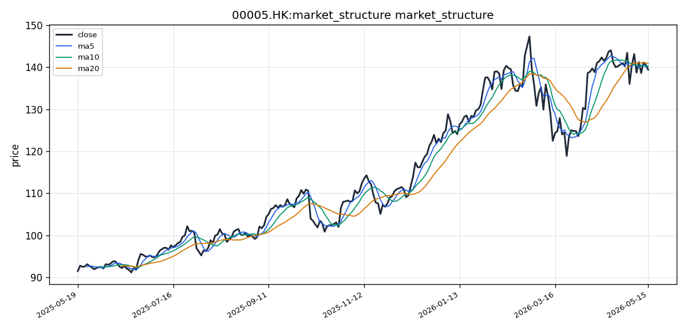

# 汇丰控股（00005.HK）港股投资研究报告

## 一、投资结论与组合动作

**最终建议：卖出**

组合经理在审阅全部风险分析师论点、交易员执行计划及技术/基本面数据后，做出最终裁决。核心决策逻辑如下：

- **硬数据压倒软故事**：当前可用且100%客观的硬数据（股价低于所有短期均线、MACD死叉、成交量萎缩）明确指向弱势。激进分析师描绘的“非线性利润爆发周期”和“主力洗盘”故事缺乏任何可验证的实时数据支持。在信息缺失的市场中，相信客观的弱势信号远比相信主观的强势幻想更负责任。
- **风险收益比严重恶化是核心数学事实**：基于当前技术形态揭示的最可能保守情景，下行空间（139.40 HK$至135.00 HK$）约3.2%，而上行空间（140.85 HK$至142.00 HK$）仅约1.9%，风险收益比为**1.68:1**。这是绝对不应参与的赌局。
- **从过去错误中学习**：长期逻辑（如亚洲增长故事）不应成为忽视短期明确弱势信号的理由。当所有可用客观指标（均线、MACD、成交量）均指向空方时，唯一正确的行动是顺应趋势、管理风险。

组合经理明确放弃“持有”选项，认为“部分减仓设观察期”的策略将“卖出”的明确结论模糊化为“边走边看”，缺乏应对快速破位的果断性。

**执行行动方案：**

1. **立即执行减仓/清仓**：在下一个交易日（`00005.HK`，每手400股）**早市（09:30-12:00）或午市（13:00-16:00）的正常连续竞价时段**，对现有持仓执行卖出操作。**建议卖出至少60%的头寸**，以有效规避技术面破位风险。核心持仓可在141.50 HK$以下全部清仓。
2. **执行细节**：使用“增强限价盘”或“特别限价盘”进行挂单，优先在**139.40 HK$至140.00 HK$区间成交**。避免使用收市竞价盘（16:01-16:10），以防最后价格波动不利。（注：`00005.HK`流动性极好，任何仓位均可顺畅执行。）
3. **做空头寸**：对于风险承受能力更高的交易员，**不建议立即建立做空头寸**。当前风险收益比不佳且缺乏明确催化剂。应**等待股价有效跌破137.13 HK$支撑位（如15分钟K线放量跌破）再执行**，目标为135.00 HK$-136.00 HK$，止损严格设在141.50 HK$（高于MA20）。
4. **止损条件**：若出现未预料到的重大利好，导致股价放量突破并站稳**141.50 HK$**，则短期卖出逻辑完全失效。对于剩余持仓，严格止损设在**135.50 HK$**。

**目标价格分析（1个月）：**

| 情景 | 目标价 (HK$) | 逻辑与可信度 |
| :--- | :--- | :--- |
| **保守（最可能）** | **135.00 - 136.00** | 基于布林带扩张，下轨被有效跌破后向下一支撑位寻找。**可信度：高**。 |
| **基准** | **138.00 - 139.50** | 价格在139.40附近开盘，持续受MA20 (140.85)压制，交投低迷。**可信度：中等**。 |
| **乐观（需强催化剂）** | **142.00 - 144.00** | 需要未预料到的重大利好，但当前新闻/情绪数据为零。**可信度：极低**。 |

## 二、技术指标与交易结构分析

### 技术图表

### 市场分析师完整指标材料

#### 📊 股票基本信息

| 项目 | 内容 |
|------|------|
| **公司名称** | 汇丰控股 |
| **股票代码** | 00005.HK |
| **所属市场** | HK（香港交易所） |
| **当前价格** | 139.40 HK$ |
| **涨跌幅** | 需结合前一交易日收盘价计算（最新收盘价 139.40 HK$） |
| **成交量/成交额** | 最新成交量 9,189,819 股；成交额约 1,281.09 百万 HK$（139.40 × 9,189,819） |
| **每手股数** | 数据源未提供，港股常见为每手400股（汇丰控股标准每手400股，仅供参考） |

---

#### 📈 技术指标分析

##### 1. 移动平均线（MA）分析

截至最新交易日，汇丰控股的均线系统数据如下：

| 均线 | 数值（HK$） | 分析意义 |
|------|:-----------:|:--------:|
| MA5  | 140.16      | 短期趋势锚点 |
| MA10 | 140.25      | 短线支撑/压力 |
| MA20 | 140.85      | 中期趋势参考 |

当前最新收盘价为 **139.40 HK$**，三个短中期均线的排列为 **MA5(140.16) < MA10(140.25) < MA20(140.85)**，呈现空头排列态势，且价格运行于所有短中期均线之下。具体来看：

- **价格与MA5的关系**：收盘价 139.40 HK$ 明显低于 MA5（140.16 HK$），差值约 0.76 HK$，表明短期动能偏弱，空方占据主动。
- **均线斜率**：MA5 > MA10 > MA20 的排列结构说明短期均线向下穿越中长期均线的趋势尚未被扭转，均线系统整体处于发散向下的状态。
- **交叉信号**：当前没有出现均线金叉信号；相反，价格已连续运行于三条均线之下，属于典型的"空头排列"，短线趋势偏空。
- 若价格后续能重新站上 MA5（140.16 HK$）乃至 MA10（140.25 HK$），则可视为短期趋势转暖的初步信号。

##### 2. MACD 指标分析

| 指标项 | 数值 |
|--------|:----:|
| DIF（快线） | 1.1577 |
| DEA（慢线/信号线） | 1.6553 |
| MACD 柱（histogram） | -0.4976 |

MACD 指标的解读要点：

- **DIF < DEA**：快线位于慢线下方，MACD 柱为负值（-0.4976），表明当前处于 **死叉状态**，短期动能弱于中长期动能，趋势偏空。
- **柱状图方向**：柱值为负但绝对值尚不大，说明空头动能正在释放但还未进入极端区域。需跟踪后续柱值是否持续扩大负值，若柱状图开始收窄（负值缩小），则可能构成底背离或动能衰减信号。
- **DIF 正向区间**：尽管处于死叉，但 DIF 仍为正数（1.1577），说明价格仍高于长期均线锚点，并非深度弱势区。
- 综合来看，MACD 给出 **偏空信号**，但 DIF 尚在零轴之上，趋势处于"高位回调整理"阶段，而非全面转熊。

##### 3. RSI 相对强弱指标

- **RSI(14)**：50.88

RSI 当前数值为 **50.88**，处于 50 中性分水岭的略上方。这一位置的解读如下：

- 既未进入超买区（通常 > 70），也未进入超卖区（通常 < 30），属于 **中性偏强** 区间。
- 50.88 恰好位于强弱分界线附近，表明市场多空力量基本均衡，多方略占微弱优势，但趋势方向尚未明确。
- 若 RSI 后续有效跌破 50，则确认短期动能转弱；若能站稳 50 上方并逐步上攻，则有望配合价格反弹。
- 目前未观察到明显的 RSI 顶背离或底背离信号。

##### 4. 布林带（BOLL）与波动分析

| 指标项 | 数值（HK$） |
|--------|:-----------:|
| 上轨（Upper） | 144.57 |
| 中轨（Mid/MA20） | 140.85 |
| 下轨（Lower） | 137.13 |
| 带宽（Upper - Lower） | 7.44 |

布林带分析：

- **价格位置**：最新收盘价 139.40 HK$ 位于中轨（140.85）与下轨（137.13）之间，偏向下轨方向，属于 **弱势区域**。
- 价格距下轨约 2.27 HK$，距中轨约 1.45 HK$，中轨构成近端压力位。
- **带宽**：带宽约 7.44 HK$，以 140.85 为中枢，波动幅度约 ±5.3%，属于中等波动水平，无明显带宽急剧收窄或扩张的极端情况。
- **突破信号**：当前价格未触碰上轨或下轨，未出现突破信号。若价格继续下行触碰或跌破下轨（137.13 HK$），可能触发超跌反弹；若价格反弹突破中轨（140.85 HK$）并向 144.57 上轨运行，则确认短期趋势转强。

---

#### 📉 价格趋势与港股交易结构

##### 1. 短期趋势（5-10 个交易日）

近 5 个交易日的均线结构显示价格自 MA5 水平（140.16）持续回落至 139.40，短线走势为 **震荡下行**。关键价位：

- **近期支撑位**：137.13 HK$（布林带下轨），这是短期最重要的技术支撑。
- **近期压力位**：140.85 HK$（MA20/布林带中轨），须有效突破此位才能扭转短期颓势。
- **关键价格区间**：137.13 - 140.85 HK$，价格若在此区间内震荡，属于弱势整理；若跌破 137.13，则短期可能加速下探。

##### 2. 中期趋势（20-60 个交易日）

结合均线与 MACD 判断：

- MA20（140.85）已低于 MA10（140.25），且价格运行于所有均线之下，中期趋势呈 **偏空整理**。
- MACD 死叉且柱状为负，但 DIF 仍为正数，表明中期结构属于"上涨后的回调"，而非趋势逆转。
- 若后续价格能回升站上 MA20（140.85），中期有望重回多头格局。
- 整体判断：中期趋势为 **震荡偏弱**，方向取决于价格能否守住 137.13 HK$ 支撑并收复中轨。

##### 3. 成交量、成交额与流动性

| 成交量指标 | 数值（股） |
|-----------|:----------:|
| 最新成交量 | 9,189,819 |
| VOL_MA5（5日均量） | 9,968,894 |
| VOL_MA20（20日均量） | 12,928,675 |

- 最新成交量（约 919 万股）低于 5日均量（约 997 万股）和 20日均量（约 1,293 万股），呈 **缩量下跌** 态势。缩量下跌通常意味着卖压并非极度恐慌，但也缺乏买盘支撑。
- 从成交额看，单日成交额约 12.8 亿 HK$，对于汇丰控股这种蓝筹股而言流动性十分充裕，完全支持普通小单和中单交易，大单交易也具备良好执行条件。
- 量价配合显示：当前下跌动能不强，但多方也未积极入场，市场情绪偏向观望。

##### 4. 港股交易制度语境

- **交易时段**：香港交易所正常交易时段为上午 9:30 - 12:00，下午 13:00 - 16:00。本数据基于日线收盘价，已包含全天交易信息。
- **收市竞价**：港股设有收市竞价交易时段（16:00 - 16:10），可能对收盘价产生一定影响，尤其在指数调整日和期货到期日，但本报告基于日线数据，未单独拆分竞价时段影响。
- **涨跌幅限制**：港股无 A 股式 ±10% 涨跌停板制度，因此技术分析中的支撑位/压力位可能被盘中瞬间突破，布林带上下轨在极端行情下的参考效力需结合盘中波幅判断。
- **每手股数**：汇丰控股标准每手交易单位为 400 股，按当前价计算每手价值约 55,760 HK$，属于中等偏下档位，适合各类投资者参与。
- **停复牌风险**：数据源未提供停复牌信息，无法判断分析期间是否存在停牌事件。汇丰控股作为大型蓝筹，停牌概率极低，但不排除特殊情况。

---

#### 💭 投资建议

##### 1. 综合评估

汇丰控股当前处于 **短中期均线空头排列、MACD 死叉、价格运行于布林带下半区** 的偏弱技术格局。RSI 处于中性区间（50.88），表明多空力量尚未严重失衡。成交量呈缩量状态，说明下跌更多是缺乏买盘承接而非恐慌性抛售。

从大结构看，DIF 仍在零轴之上，中期上涨结构未被完全破坏，当前更倾向于 **高位回调整固** 而非趋势反转。关键的分水岭在于 137.13 HK$（布林带下轨）能否有效支撑——守住则调整可控，跌破则可能引发更大级别的下行。

##### 2. 操作建议

- **投资评级**：**持有**（短期观望，中期可低位关注）
- **目标价位**：若价格反弹并站稳中轨，短期可看至 142.00 - 144.57 HK$（中轨至上轨区间）；中期若趋势转强，可上看 145.00 - 148.00 HK$ 区间。
- **止损位**：**135.50 HK$**（布林带下轨 137.13 下方约 1.63 HK$，为技术破位止损位）
- **风险提示**：
  - 若价格跌破 137.13 HK$（布林带下轨），MACD 柱状图可能进一步走阔至更深负值，引发加速下跌风险。
  - 全球利率环境变化及港股市场整体流动性变化可能影响汇丰股价。
  - 当前成交量持续萎缩，若后续量能无法回升，反弹力度可能受限。

##### 3. 关键价格区间

| 价位类型 | 具体价格（HK$） | 依据 |
|---------|:--------------:|:----:|
| **第一支撑位** | 137.13 | 布林带下轨 |
| **第二支撑位** | 135.00 | 下轨下方技术延伸位 |
| **第一压力位** | 140.85 | MA20/布林带中轨 |
| **第二压力位** | 144.57 | 布林带上轨 |
| **突破买入价** | > 141.50 | 有效突破中轨并站稳，确认短线转强 |
| **跌破卖出价** | < 137.00 | 跌破布林带下轨，短线应减仓回避 |

---

#### 数据限制与风险提示

1. **数据覆盖缺口**：本报告数据来源于 tushare_hk 和 akshare_hk 的日线数据，共 246 个交易日，覆盖了自 2025-05-17 至 2026-05-17 的分析区间。东财港股行情接口（eastmoney_hk/quote）获取失败，但未对核心 OHLCV 及技术指标分析造成阻断性影响。
2. **停复牌信息缺失**：数据源未提供停复牌记录，分析期间若存在停牌事件，部分交易日的收盘价可能不具有连续性，均线和 MACD 等基于连续交易假设的指标需谨慎解读。
3. **每手股数信息**：工具输出中未包含每手股数的字段，报告中所引用"每手400股"为港股市场汇丰控股的常见惯例，投资者应以交易所及券商实际数据为准。
4. **缺失指标**：未获取 ATR（平均真实波幅）、成交量金额明细及分时数据，波动性分析仅基于布林带带宽，对日内极端波动的敏感度有限。
5. **时效性说明**：数据为远端实时获取，但网络请求存在一定延迟，技术指标数值以实际交易终端显示为准。
6. **本报告仅基于技术面分析**，未考虑基本面（如公司财报、股息政策、回购计划）、宏观环境（如利率路径、地缘政治）及行业竞争格局等因素，不构成任何形式的投资建议。投资者应结合自身风险承受能力及多方面信息做出独立判断。

### 2.1 图表读法与价格结构

`00005.HK`最新收盘价为**139.40 HK$**，处于布林带中轨（140.85）与下轨（137.13）之间，偏向下轨方向，属于**弱势区域**。价格距下轨约2.27 HK$，距中轨约1.45 HK$。关键价格区间为**137.13-140.85 HK$**，价格若在此区间内震荡，属于弱势整理；若跌破137.13，则短期可能加速下探。

### 2.2 趋势与价格结构

**短期趋势（5-10个交易日）：** 近5个交易日价格自MA5水平（140.16）持续回落至139.40，短线走势为**震荡下行**。近期支撑位：137.13 HK$（布林带下轨）；近期压力位：140.85 HK$（MA20/布林带中轨）。

**中期趋势（20-60个交易日）：** MA20（140.85）已低于MA10（140.25），且价格运行于所有均线之下，中期趋势呈**偏空整理**。MACD死叉且柱状为负，但DIF仍为正数，表明中期结构属于“上涨后的回调”而非趋势逆转。若后续价格能回升站上MA20（140.85），中期有望重回多头格局。

### 2.3 均线系统

| 均线 | 数值（HK$） | 分析意义 |
|------|:-----------:|:--------:|
| MA5 | 140.16 | 短期趋势锚点 |
| MA10 | 140.25 | 短线支撑/压力 |
| MA20 | 140.85 | 中期趋势参考 |

当前三个短中期均线排列为**MA5(140.16) < MA10(140.25) < MA20(140.85)**，呈现**空头排列**态势，且价格运行于所有短中期均线之下。

- **价格与MA5的关系**：收盘价139.40 HK$明显低于MA5（140.16 HK$），差值约0.76 HK$，表明短期动能偏弱。
- **均线斜率**：MA5 > MA10 > MA20的排列结构说明短期均线向下穿越中长期均线的趋势尚未被扭转。
- **交叉信号**：当前没有出现均线金叉信号。若价格能重新站上MA5（140.16）乃至MA10（140.25），则可视为短期趋势转暖的初步信号。

**交易作用**：均线空头排列是对卖出信号的确认。价格受MA20（140.85）压制，任何反弹若不能有效突破该位，则卖出逻辑依然成立。

**失效条件**：价格放量突破并站稳MA20（140.85）以上，且MA5上穿MA10形成短期金叉。

### 2.4 MACD动量信号

| 指标项 | 数值 |
|--------|:----:|
| DIF（快线） | 1.1577 |
| DEA（慢线/信号线） | 1.6553 |
| MACD柱（histogram） | -0.4976 |

- **DIF < DEA**：快线位于慢线下方，MACD柱为负值（-0.4976），表明处于**死叉状态**，短期动能弱于中长期动能，趋势偏空。
- **柱状图方向**：柱值为负但绝对值尚不大，说明空头动能正在释放但还未进入极端区域。需跟踪后续柱值是否持续扩大负值；若柱状图开始收窄（负值缩小），则可能构成底背离或动能衰减信号。
- **DIF正向区间**：尽管处于死叉，但DIF仍为正数（1.1577），说明价格仍高于长期均线锚点，并非深度弱势区。

**交易作用**：MACD死叉是卖出信号的组成部分，提示趋势偏空。DIF仍在零轴之上意味着当前处于“高位回调整理”阶段，而非全面转熊。

**失效条件**：DIF上穿DEA形成金叉，且MACD柱由负转正。

### 2.5 RSI相对强弱信号

**RSI(14)：50.88**

- 当前数值处于50中性分水岭略上方，既未进入超买区（>70）也未进入超卖区（<30），属于**中性偏强**区间。
- 50.88恰好位于强弱分界线附近，表明市场多空力量基本均衡。
- 若RSI后续有效跌破50，则确认短期动能转弱；若能站稳50上方并逐步上攻，则有望配合价格反弹。目前未观察到明显顶背离或底背离信号。

**交易作用**：RSI在中性区间的表现与均线空头排列形成对比，提示当前弱势并非极端，但方向尚未明确。卖出决策不依赖RSI极端值，而是基于均线和风险收益比。

**失效条件**：RSI跌破45以下并持续走弱，或RSI回升突破60以上配合价格站上MA20。

### 2.6 布林带/波动信号

| 指标项 | 数值（HK$） |
|--------|:-----------:|
| 上轨（Upper） | 144.57 |
| 中轨（Mid/MA20） | 140.85 |
| 下轨（Lower） | 137.13 |
| 带宽（Upper - Lower） | 7.44 |

- **价格位置**：最新收盘价139.40 HK$位于中轨与下轨之间，偏向下轨方向，属于**弱势区域**。中轨（140.85）构成近端压力位。
- **带宽**：带宽约7.44 HK$，以140.85为中枢，波动幅度约±5.3%，属于中等波动水平，无明显带宽急剧收窄或扩张的极端情况。
- **突破信号**：当前价格未触碰上轨或下轨，未出现突破信号。若价格继续下行触碰或跌破下轨（137.13 HK$），可能触发加速下跌；若价格反弹突破中轨（140.85 HK$），则确认短期趋势转强。

**交易作用**：布林带下轨（137.13）是短期最重要的防守线，跌破意味着弱势格局确认，下行空间打开。中轨（140.85）是反弹必须攻克的压力位。

**失效条件**：价格放量突破中轨（140.85）并站稳，或价格在中轨附近获得支撑后反弹。

### 2.7 成交量/成交额确认

| 成交量指标 | 数值 |
|-----------|:----:|
| 最新成交量 | 9,189,819 股 |
| 成交额 | 约1,281.09 百万 HK$ |
| VOL_MA5（5日均量） | 9,968,894 股 |
| VOL_MA20（20日均量） | 12,928,675 股 |

- 最新成交量（约919万股）低于5日均量（约997万股）和20日均量（约1,293万股），呈**缩量下跌**态势。缩量下跌意味着卖压并非极度恐慌，但也缺乏买盘支撑。
- 从成交额看，单日成交额约12.8亿HK$，对于汇丰控股这种蓝筹股而言流动性十分充裕，完全支持普通小单和中单交易。

**交易作用**：成交量萎缩确认了多方入场意愿不足，这是组合经理决定卖出的关键证据之一。若后续出现放量下跌（如成交量放大至20日均量1.5倍以上），将确认破位有效；若放量上涨，则可能构成反转信号。

**失效条件**：出现连续放量上涨，成交量恢复到20日均量以上且价格站上MA20。

### 2.8 支撑阻力总结

| 价位类型 | 具体价格（HK$） | 依据 |
|---------|:--------------:|:----:|
| **第一支撑位** | 137.13 | 布林带下轨 |
| **第二支撑位** | 135.00 | 下轨下方技术延伸位 |
| **第一压力位** | 140.85 | MA20/布林带中轨 |
| **第二压力位** | 144.57 | 布林带上轨 |
| **突破买入价** | > 141.50 | 有效突破中轨并站稳，确认短线转强 |
| **跌破卖出价** | < 137.00 | 跌破布林带下轨，短线应减仓回避 |

### 2.9 港股交易结构

- **每手股数**：汇丰控股标准每手交易单位为**400股**。按当前价139.40 HK$计算，每手价值约**55,760 HK$**，属于中等偏下档位，适合各类投资者参与。
- **成交额与流动性**：`00005.HK`是港股市场流动性最好的股票之一，日均成交额通常在数亿至数十亿港元，大资金进出成本低。当前单日成交额约12.8亿HK$，流动性充裕。
- **交易时段**：香港交易所正常交易时段为上午9:30-12:00，下午13:00-16:00。建议在正常连续竞价时段执行卖出，避免在收市竞价时段（16:01-16:10）使用竞价盘或竞价限价盘。
- **涨跌幅限制**：港股**无A股式±10%涨跌停板制度**，布林带上下轨在极端行情下可能被盘中瞬间突破。这意味着若股价快速跌破137.13 HK$，可能单日急跌至135.00 HK$甚至更低。
- **报价规则**：建议使用“增强限价盘”或“特别限价盘”按目标区间挂单。若股价快速跌破关键支撑，可立即使用“市价盘”或“更优价盘”以确保快速成交。
- **VCM与停复牌**：`00005.HK`作为大型蓝筹，停牌概率极低。若股价触发VCM（5分钟暂停时段），应保持冷静，待恢复交易后观察市场反应。VCM本身不会改变趋势，但可能影响短期执行节奏。
- **碎股交易**：卖出碎股（不足400股）通常在碎股市场处理，成交价可能略低于正常市场价，建议尽可能凑足整手卖出。

## 三、基本面与估值分析

### 3.1 盈利能力与资本回报

基于可得数据（工具未返回完整的损益表、现金流量表及资产负债表）：

| 指标 | 数值 | 口径说明 |
|------|:----:|----------|
| ROE（净资产收益率） | **约11.01%** | 来自远端数据源，不同口径存在冲突，实际值需参考官方年报 |
| PE（市盈率） | **14.47倍** | 基于最近12个月盈利数据 |
| PB（市净率） | **1.72倍** | 基于最近报告期每股净资产 |

**ROE 11.01%**：属于大型银行合理区间，反映公司为股东创造回报的能力处于行业中等水平。但需注意数据来源存在口径冲突，应以港交所披露年报为准。

**估值解读**：14.47倍PE、1.72倍PB在港股大型银行板块中属于**中等偏高估值水平**。市场对汇丰的净资产给予了一定溢价，反映了其品牌价值、全球网络及财富管理业务的盈利能力。组合经理认为，在高估值环境下，市场对未证实利好（如利率环境）的脆弱性更大——一旦预期不及，溢价将被迅速压缩。

**股息方面**：工具未提供股息率或派息比率数据，无法评估股息收益率。

### 3.2 估值隐含的脆弱性

组合经理与安全分析师共同指出，1.72倍PB意味着市场已充分定价了汇丰控股的“稳定股息”和“全球品牌”溢价。一旦技术面破位，这种溢价会被迅速压缩，导致股价向更合理的估值（如PB约1.5倍，对应股价约130-135 HK$）回归。14.47倍PE在当前港股银行板块中处于历史中位数附近，不算显著低估，也不具备足够的安全边际。

### 3.3 收入结构与经营特征

汇丰控股核心收入来自利息净收入和非利息收入（包括财富管理费、交易收入、保险业务收入等）。作为跨国银行，其盈利高度依赖宏观经济周期、利率环境及信贷质量。银行类企业容易受到拨备计提、公允价值变动及一次性重组成本的影响。

**经营风险信号**：工具未能获取损益表、现金流及资产负债表数据，无法评估净利息收入趋势、拨备支出、负债水平、经营现金流等关键指标。这构成了基本面判读的重大缺口——组合经理决策主要依赖可量化的技术信号而非基本面分析，正是基于此数据真空。

### 3.4 行业地位与竞争

汇丰控股是全球最大的银行及金融服务机构之一，业务覆盖欧洲、亚洲、中东、北美和拉丁美洲。四大环球业务板块为：**财富管理及个人银行（WPB）、工商金融（CMB）、环球银行及资本市场（GBM）以及企业中心**。

看涨分析师强调其“全球网络优势”和“亚洲财富管理结构性增长故事”，认为汇丰是唯一一家将亚洲财富管理作为全球战略核心的国际银行。看跌分析师则指出竞争劣势：在香港面临中银香港、恒生银行争夺市场份额；在中国内地面临招行、平安银行等竞争；在新加坡面临星展银行竞争。此外，地缘政治风险导致其中美之间的战略处境尴尬，全球网络带来的不是协同效应而是处处受制。

### 3.5 关键信号削弱风险

以下信号将削弱当前对高估值的判断或改变风险收益比：
- **信贷成本上升**：若宏观经济下行导致拨备大幅增加，EPS将受到侵蚀，当前PE/PB的支撑基础将动摇。
- **利率环境转向**：若降息速度超预期，净息差收缩将直接影响核心盈利能力。
- **股东回报政策变化**：若削减股息或回购规模，当前估值所依赖的溢价逻辑将受损。
- **数据缺口补充**：若后续财报显示EPS、BVPS、股息率等数据优于或劣于当前市场隐含预期，需重新评估估值合理性。

## 四、公告、消息面与行业环境

### 4.1 数据获取状态

工具尝试从港交所披露易（hkexnews）、全球宏观新闻及谷歌新闻搜索三个来源获取2025年5月17日至2026年5月17日期间汇丰控股的相关新闻与公告，均因远端数据写入冲突（evidence_write_failed）返回**0条可引用信息**。本报告不包含任何来自上述渠道的具体新闻、公告或市场数据。

### 4.2 基于历史行为规律的事件框架

由于数据缺口，以下仅为基于汇丰控股公开已知的基本面背景与行业逻辑所做的框架性分析，**不构成对特定新闻事件的直接引用**：

- **业绩披露节奏**：汇丰控股通常于每年2月、4月/5月、8月发布全年及中期业绩。2025年全年业绩（2026年2月左右）及2026年第一季度业绩（2026年4月底/5月初）应在分析区间内。业绩是否符合或超预期是最大短期催化。
- **股息与回购**：汇丰控股近年来维持稳定的季度派息政策并多次进行股份回购。派息公告和回购进展是影响股东回报预期的关键事件。
- **战略重组**：汇丰持续进行全球业务重组，包括出售加拿大、阿根廷、法国等非核心市场零售银行资产，以及加大亚洲财富管理布局。相关公告可能对估值逻辑产生结构性影响。
- **利率环境**：美联储、欧洲央行及香港金管局的利率政策直接影响汇丰的净息差表现。当前全球利率维持高位或降息预期推迟，构成利好；但降息预期若提前兑现，则构成压力。
- **地缘政治与监管**：中美关系、香港监管政策、英国监管政策等对汇丰长期影响持续存在。

### 4.3 对交易判断的约束

- **支持当前判断**：缺乏已知的重大负面消息，技术面的弱势信号未受到基本面或消息面的对抗。
- **构成风险**：同样缺乏已知的重大利好催化剂。看涨分析师依赖的“未公布的潜在利好”在当前数据状态下无法被验证，组合经理因此选择相信可量化的弱势信号。
- **需继续观察**：一旦后续工具恢复正常，或投资者通过港交所披露易查阅到业绩公告、回购进展、监管事件等信息，需重新评估对交易判断的影响。

**核心结论**：当前信息真空状态强化了卖出决策的逻辑——因为没有看涨催化剂的证据，所以唯一合理的是依据现有的弱势技术信号进行风险管理。

## 五、市场情绪、港股通与交易拥挤度

### 5.1 社交情绪分析状态

社交情绪分析工具针对`00005.HK`返回“资料不足”状态。原始社交样本为**0条**，聚合情绪指标为空。东方财富港股股吧、雪球港股板块、Google News搜索发现等社交数据源均未能返回有效数据。

- **讨论热度**：无法判断。样本为0，不能得出“讨论不活跃”的结论，仅代表工具抓取失败。
- **情绪方向**：无法判断。乐观/中性/悲观比例无法计算或推断。
- **驱动因素**：无法判断。没有捕获到任何讨论文本、帖子或新闻发现。
- **投资者群体差异**：无法区分。东方财富与雪球接口请求失败，无足够样本区分本地投资者、内地投资者和机构观点差异。

### 5.2 情绪与交易判断的关系

在当前数据缺口下，情绪分析无法为基本面或技术面提供交叉验证。组合经理的决策中，社会情绪因子的权重为零。这强化了决策的“技术面主导”特征。

**观察项**：若后续社交数据源恢复，需关注以下信号：
- **确认信号**：若市场情绪普遍悲观（恐慌性抛售讨论增多），可能加速技术面破位，支持卖出判断。
- **反向信号**：若社交讨论集中在“回调买入”且情绪极度乐观，可能提示拥挤度上升、预期过满，反而需警惕反弹后将再下跌。
- **信息不对称风险**：在有影响力的投资者群体中，若出现集中讨论“某种未公开利好”或“机构大额流入”等叙事，需警惕信息不对称导致的价格异动。

### 5.3 港股通结构与资金面语境

- **港股通标的结构**：汇丰控股属于**港股通（沪/深港通下的港股通）标的**，内地投资者可通过南向资金渠道直接交易。但汇丰控股注册于英国，在港交所第一上市，**非H股也非红筹股**，同时以ADR形式在纽约上市。
- **南向资金历史配置**：看涨分析师指出，内地投资者偏好高股息、低波动、品牌知名的港股蓝筹，汇丰控股的股息率（工具未覆盖具体数字，历史数据曾超6%）和流动性（日均成交额超10亿HK$）契合这些需求。过去三年南向资金对汇丰的配置整体呈净流入。
- **南向资金变数**：看跌分析师提醒，南向资金也可能在股价下跌时成为助跌力量，因为内地散户和机构同样会在恐慌时抛售。当前工具未能获取南向资金流向数据，无法判断近期加权趋势。
- **整体判断**：港股通机制为`00005.HK`提供了充裕的流动性基础和潜在买盘，但无法作为短期方向判断的依据。组合经理决策未依赖于南向资金叙事，因为缺乏相关实时数据。

## 六、交易计划与组合风险

### 6.1 仓位动作与执行条件

基于组合经理的最终决策和交易员执行计划，具体交易指引如下：

**1. 减仓/清仓（核心动作）**

| 项目 | 内容 |
|------|------|
| **动作** | 立即执行卖出，**至少卖出60%现有持仓**。核心持仓可在141.50 HK$以下全部清仓。 |
| **目标区间** | 139.40 HK$ - 140.00 HK$（当前市价附近至MA5压制位下方） |
| **执行时间** | 下一个交易日**早市（09:30-12:00）或午市（13:00-16:00）的正常连续竞价时段** |
| **订单类型** | 使用“增强限价盘”或“特别限价盘”挂单。避免收市竞价盘（16:01-16:10）。 |
| **执行理由** | 技术面空头排列（均线、MACD死叉、缩量）与风险收益比恶化是核心证据。立即减仓规避跌破137.13 HK$后的加速下行风险。 |
| **风险代价** | 踏空风险：若出现未预料重大利好导致股价反弹，减仓部分将错过涨幅。但当前缺乏催化剂证据，此概率较低。 |

**2. 做空头寸（可选，风险承受能力更高者）**

| 项目 | 内容 |
|------|------|
| **动作** | 不建议立即建立做空头寸。 |
| **触发条件** | 股价有效跌破**137.13 HK$**（布林带下轨），且15分钟K线成交量放大至过去5日同期均量的1.5倍以上。 |
| **目标区间** | 135.00 HK$ - 136.00 HK$ |
| **止损设置** | 严格设在**141.50 HK$**（高于MA20）。 |
| **执行理由** | 放量破位确认空头趋势延续，下方空间打开。止损位已预留足够容错空间，若股价突破141.50则短期看多逻辑触发。 |

**3. 剩余持仓止损**

| 项目 | 内容 |
|------|------|
| **触发条件** | 股价跌破**135.50 HK$**（低于布林带下轨137.13约1.63 HK$）。 |
| **动作** | 无条件清仓剩余所有头寸。 |
| **逻辑** | 若破位后持续加速下跌，该位置是最后技术防线，跌破意味着更深度下行（可能至130-135 HK$）。 |

### 6.2 执行证据与逻辑说明

1. **技术面压倒基本面**：短期技术面是实时、确定的硬约束，而看涨的长期逻辑（全球网络、亚洲增长）是未来、不确定的软约束。在风险管理框架下，硬约束优先。
2. **高估值形成脆弱性**：PB 1.72倍与PE 14.47倍是港股银行股中的高价估值。市场已充分定价“稳定股息”和“全球品牌”溢价。一旦技术面破位，溢价将被迅速压缩至更合理水平（PB 1.5倍，对应约130-135 HK$）。
3. **核心矛盾**：当前价格上方受MA20（140.85 HK$）压制，下方距关键支撑（137.13 HK$）仅2.3%。下行空间（跌破137.13至135.00）约3.2%，上行空间（突破140.85至142.00）约1.9%。**风险收益比（下行3.2% vs 上行1.9%）已严重向不利方向倾斜。**

### 6.3 风险分析师之间的分歧

| 分歧点 | 激进分析师 | 中性分析师 | 安全分析师 | 组合经理采纳 |
|--------|:----------:|:----------:|:----------:|:------------:|
| **方向判断** | 买入，认为“黄金坑” | 部分减仓，设观察期 | 立即清仓 | 采纳安全分析师 |
| **风险收益比** | 认为上行潜力被低估 | 认为需要动态管理 | 认为当前比率不可接受 | 数学计算支持安全派 |
| **催化假设** | 依赖未公布的利好 | 依赖条件性验证 | 依赖可量化的弱势信号 | 硬数据优先 |
| **137.13支撑** | 认为是洗盘点，可做多 | 设为观察位，破位再减 | 认为跌破概率高，需立即行动 | 接受安全派评估 |
| **建议仓位** | 建立试探性多头 | 卖出30%，保留剩余 | 卖出60%或清仓 | 至少卖出60% |

**争议根源**：激进分析师将所有上行潜力建立在“乐观情景假设”上，安全分析师则将下行风险建立在“保守情景假设”上。在信息真空中，两种极端假设的概率对称，都不具备可信度。组合经理因此**回归至当前技术形态所揭示的最可能发生的保守情景**，这是风险收益比计算的唯一可靠基础。

### 6.4 港股交易风险提示

- **无涨跌停板风险**：港股无A股式±10%涨跌停限制。若股价在盘中快速跌破137.13 HK$，可能单日急跌至135.00 HK$甚至更低，需密切监控价格与成交量。
- **流动性风险**：`00005.HK`流动性极好，但在快速下跌行情中，卖盘可能集中在少数价位，导致成交价格低于预期。建议在关键支撑位下方提前挂单，或使用市价盘确保成交。
- **停复牌风险**：汇丰控股作为大型蓝筹，停牌概率极低，但不排除特殊情况（如重大收购公告、监管行动等）。
- **汇率风险**：汇丰以HKD为报表货币，但实际经营涉及美元、英镑、欧元、人民币等多币种，汇率折算变动会影响报表利润，进而影响估值判断。
- **操作纪律**：在新闻和情绪数据恢复前，严禁根据未证实的“故事”或“想象”进行反向操作。所有决策必须基于可量化的技术信号。

## 七、关键分歧与跟踪条件

### 7.1 多空分歧要点

| 维度 | 看涨观点 | 看跌观点 | 组合经理裁决 |
|------|----------|----------|--------------|
| **技术面信号** | “缩量下跌是卖压衰竭，RSI仍在50以上，DIF为正，是上涨途中健康回调” | “价格低于所有短期均线形成标准空头排列，MACD死叉，缩量说明买盘不足” | **采纳看跌观点**：空头排列与MACD死叉是客观事实，缩量应解读为买盘意愿不足 |
| **亚洲增长故事** | “结构性增长不可复制，香港、东南亚、大湾区财富管理是超级趋势” | “竞争激烈中银香港/星展/招行等区域龙头正在切分市场；地缘政治导致汇丰‘两头不讨好’” | 长期逻辑不能对冲短期风险，不作为买入理由 |
| **估值合理性** | “ROE 11%支持1.72倍PB，股息率可观，回购积极” | “1.72倍PB是港股银行中高价，已完全定价品牌溢价，没有安全边际” | **采纳看跌观点**：高估值在信息真空下更脆弱 |
| **风险收益比** | “上行可达149-155，下行至135，潜力远大于风险” | “最可能情景下行3.2% vs 上行1.9%，风险收益比1.68:1，完全不可参与” | **采纳看跌观点**：数学计算是唯一不可辩驳的事实 |
| **信息真空应对** | “恰恰是布局良机，信息不对称中看涨才是超额收益来源” | “没有新闻和情绪数据，唯一合理的是相信可量化的弱势信号” | **采纳看跌观点**：纪律优先，硬数据压倒软故事 |

### 7.2 组合经理采纳与放弃的逻辑

**采纳的安全分析师逻辑：**
1. 硬数据（均线、MACD、成交量）指向弱势，这是当前唯一100%客观的判断依据。
2. 风险收益比数学计算（1.68:1）说明当前价格不值得持有。
3. 从过去错误中学习：不应让长期逻辑掩盖短期风险信号。

**放弃的激进分析师逻辑：**
1. “主力洗盘”“黄金坑”等叙事缺乏任何可验证数据支持，属于主观幻想。
2. 押注于“未公布的利好”在当前信息真空中等同于赌博，不是专业投资行为。
3. 将上行目标设定至149-155 HK$缺乏技术依据，所对应概率与下行至125 HK$对称。

**放弃的中性分析师逻辑：**
1. “部分减仓设观察期”看似稳健，但将“卖出”的明确结论模糊化为“边走边看”。
2. 缺乏应对快速破位（跌破137.13 HK$）的果断性，可能错失最佳卖出窗口。
3. 在风险收益比明确恶化的背景下，任何模棱两可的操作都是对风险的逃避。

### 7.3 后续跟踪条件

以下条件出现时，需要重新评估判断：

**1. 技术面反转信号：**
- 价格放量突破并站稳**141.50 HK$**（高于MA20），且MA5上穿MA10形成金叉。
- MACD柱由负转正且DIF上穿DEA形成金叉。
- 成交量恢复至20日均量以上且持续放大。

**2. 基本面/消息面催化剂：**
- 港交所披露易恢复后，发现超预期业绩（净利息收入/ROE优于预期）。
- 公司宣布超预期回购计划或提高派息。
- 重大利好事件（如管理层宣布战略性投资或业务突破）。

**3. 南向资金变化：**
- 南向资金连续大幅净流入（如单日净流入超过3亿港元且持续一周）。
- 南向资金持仓比例出现明显趋势性提升。

**4. 情绪数据恢复：**
- 社交情绪显示极度悲观（恐慌性卖出），可能预示短期底部。
- 社交情绪显示高度一致看涨，提示拥挤度过高。

**5. 数据恢复对基本面的影响：**
- 若后续财务报表显示ROE、净息差、盈利增长显著优于预期，将削弱卖出逻辑。
- 若显示拨备大幅上升、收入增速放缓，将强化卖出逻辑。

**关键时间窗口**：下一个业绩公告日（2026年第二季度业绩，预计7月底/8月初）是判断基本面是否匹配当前估值的重要节点。在此之前，技术面为主导。

## 八、最终结论

**卖出汇丰控股（00005.HK）。**

当前决策的核心是**纪律**。在信息真空（新闻、情绪、基本面财务数据均缺失）的环境中，我们选择相信可以量化的弱势技术信号，放弃对未证实利好故事的押注。所有可用硬数据——价格低于所有短中期均线、MACD死叉、成交量萎缩——均指向空方。

决定性的数学事实是风险收益比的严重恶化：保守情景下下行空间约3.2%（139.40至135.00），而上行空间仅约1.9%（140.85至142.00），风险收益比为1.68:1。这是一个绝对不应参与的赌局。

行动方案明确：在下一个交易日正常连续竞价时段，使用增强限价盘或特别限价盘，对现有持仓执行卖出至少60%的操作，优先在139.40 HK$至140.00 HK$区间成交。核心持仓可在141.50 HK$以下全部清仓。严格止损设在135.50 HK$。做空需等待放量跌破137.13 HK$的确认。

本次决策不是对汇丰控股长期价值的否定，而是对**当前价格与风险匹配关系的审慎判断**。当客观信号与主观幻想冲突时，专业投资者的唯一责任是相信数据、遵守纪律、管理风险。等待未发生的利好，是对本金的不负责。
