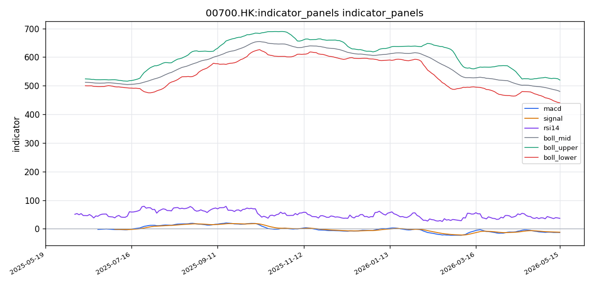
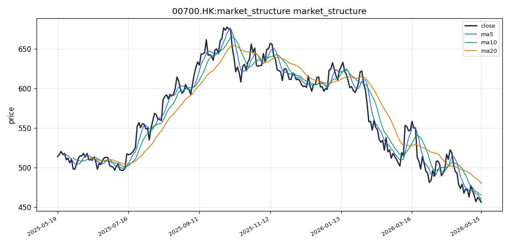

# 腾讯控股（00700.HK）港股投资研究报告

## 一、投资结论与组合动作

**最终决策：卖出（战术性撤退）**

组合经理基于以下核心逻辑做出决策：
1. **数据真空下的务实主义**：当前关键财务数据、分析师一致预期、社交情绪及南向资金流动数据全部缺失。唯一可依赖的是技术图表——均线空头排列、MACD死叉、缩量下跌，这是最简洁、最真实的信号。
2. **趋势力量远胜静态估值**：安全分析师精准指出，2021年腾讯从750跌至300的过程中，400、500、600每档都曾“便宜”。在没有明确反转信号时，仅凭低估值逆势介入是押注“主观判断”战胜“市场客观投票”，胜率较低。
3. **历史教训**：投资经理坦诚反思2021年抄底失败——“相信长期价值而拒绝止损，结果付出惨痛代价”。当前环境最可能犯的错误不是踏空，而是过早逆势抄底。
4. **风险回报比不利**：多头向上最近压力位在MA5（~HK$ 460），空间不足2%；向下一旦跌破布林带下轨（HK$ 440），可能打开至430甚至更低，跌幅超5%。

**执行条件与仓位动作：**
- **适用范围**：所有持有00700.HK多头的投资者。
- **核心原则**：减仓以规避信息真空和技术空头风险，保留现金等待更确定的进场时机。
- **立即执行**：在当前价格区间（约HK$ 455-460）**立即减仓50%**。不要等待反弹。
- **硬性止损位**：剩余仓位设置 **HK$ 438.00** 为止损价格。一旦盘中跌破此价位，无条件清仓。
- **离场观望**：在股价 **有效站上10日均线（MA10，约HK$ 465.80）** 且 **成交量显著放大**（日成交量超过3500万股）之前，不再进行任何买入操作。

**对于空仓者（希望做空的交易员）：**
- **进场条件**：若股价在未来1-2个交易日反弹至 **HK$ 458-462** 区间（接近5日均线压力位），可 **轻仓（不超过总资金的10%）** 建立空头头寸。
- **止损条件**：严格设置止损于 **HK$ 467.00**。若股价放量突破此价位，空头趋势暂时缓解，立即平仓。
- **目标卖出价（平仓获利价位）**：第一目标位HK$ 440.00（布林带下轨附近），到达后平仓50%头寸；第二目标位HK$ 430.00（下方整数关口/潜在恐慌底部区域），到达后平仓剩余所有空头头寸。

**目标价格与情景分析：**
- **当前价格**：HK$ 456.40
- **基准情景（未来1-3个月）**：在缺乏利好消息催化下，市场逐步消化抛压并向下寻找支撑，目标价格410-430 HKD。
- **保守情景（未来1个月）**：价格在440-465 HKD之间弱势震荡，随后继续下探，目标价格435-445 HKD。
- **关键缺失数据的警示**：若未来财报显示盈利增速放缓，当前16倍PE可能成为“价值陷阱”，甚至跌破380 HKD。卖出决策优先考虑了这种最坏情况的可能性。

**风险约束**：
- 止损纪律不可违背，HK$ 438为硬性止损，跌破即无条件清仓。
- 在技术面空头趋势未扭转前，不得追涨买入。
- 做空仓位不得超过总资金10%，且必须设置止损。

---

## 二、技术指标与交易结构分析

### 技术图表

### 市场分析师完整指标材料

好的，已有前一次成功的部分数据覆盖。现在基于获取到的真实数据撰写报告。

---

#### 📊 股票基本信息

| 项目 | 内容 |
|------|------|
| **公司名称** | 腾讯控股 |
| **股票代码** | 00700.HK |
| **所属市场** | HK（香港交易所） |
| **最新收盘价** | 456.4000 HK$ |
| **涨跌幅** | 数据源受限，未获取完整当日涨跌幅数据 |
| **成交量** | 26,449,868 股 |
| **成交额** | 数据源受限，未获取具体成交额数值 |
| **每手股数** | 数据源受限，未获取 |
| **计价货币** | HKD（港元） |
| **数据区间** | 2025-05-17 至 2026-05-17，共 246 个交易日 |

---

#### 📈 技术指标分析

##### 1. 移动平均线（MA）分析

| 均线类别 | 数值（HK$） |
|---------|-----------|
| MA5 | 460.1600 |
| MA10 | 465.7800 |
| MA20 | 480.0900 |
| 最新收盘价 | 456.4000 |

当前腾讯控股的均线系统呈现典型的**空头排列**格局：

- **价格位于所有主要均线之下**：最新收盘价 456.4000 HK$ 低于 MA5（460.1600 HK$）、MA10（465.7800 HK$）和 MA20（480.0900 HK$），表明短期、中期趋势均偏弱。
- **均线顺序**：MA5 < MA10 < MA20，即短周期均线处于长周期均线下方，这是典型的下行趋势信号，空头力量主导市场。
- **价格与均线的偏离程度**：当前价格 456.4000 HK$ 距离 MA20（480.0900 HK$）偏离约 -4.94%，偏离幅度较大，短期存在技术性修复需求，但空头趋势尚未出现反转信号。
- **均线交叉信号**：当前 MA5 已下穿 MA10 和 MA20，同时 MA10 亦呈现向下交叉 MA20 的倾向，若该交叉确认，将形成"死叉"强化空头格局。均线系统整体指向下行趋势仍在延续。

##### 2. MACD 指标分析

| MACD 组件 | 数值 |
|-----------|------|
| DIF（快线） | -12.8248 |
| DEA（慢线） | -11.9204 |
| MACD 柱状图（Histogram） | -0.9044 |

- **DIF 与 DEA 均处于负值区域**：两条线均在零轴以下运行，确认中期趋势处于空头市场区域。DIF = -12.8248，DEA = -11.9204，空头能量较为充分。
- **DIF 位于 DEA 下方**：DIF < DEA，即快线在慢线之下，MACD 处于死叉状态，这是明确的卖出或观望信号。空头趋势具有动能。
- **MACD 柱状图为负值**：Histogram = -0.9044，绿色柱状图（空头柱）在零轴下方延伸，表明空头动能仍在释放。
- **背离信号观察**：当前 DIF（-12.8248）与价格位置的关系需结合更长的数据序列来判断是否形成底背离。仅就现有数据而言，MACD 柱状图负值绝对值不大，未出现急剧放大，暗示空头动能尚未达到极端恐慌抛售程度，但也没有收敛迹象。
- **趋势强度**：MACD 整体信号偏向弱势，空头趋势尚未出现反转信号。等待 DIF 线拐头向上或柱状图收敛，才可能视为趋势缓解的初步信号。

##### 3. RSI 相对强弱指标

| RSI 参数 | 数值 |
|---------|------|
| RSI(14) | 36.6183 |

- **RSI 当前位于 36.62**，处于 30–50 的偏弱区间，尚未进入超卖区域（通常定义为 RSI < 30）。
- **RSI 解读**：36.62 表明空头力量占优，但尚未达到极端超卖状态。这意味着价格仍有进一步下行的潜在空间，但距离超卖区域仅约 6.6 个点，若后续继续下跌，可能很快触发超卖信号，届时可能吸引技术性买盘。
- **RSI 背离信号**：仅凭当前单一数值无法判断背离，需要追踪 RSI 与价格的连续走势。若后续价格创出新低而 RSI 未同步创出新低，则可能出现底背离，暗示下跌动能衰竭。
- **趋势确认**：当前 RSI 处于 30–50 的弱势区，与均线和 MACD 的空头信号一致，三者相互印证，强化了当前处于下行趋势的判断。

##### 4. 布林带（BOLL）与波动分析

| 布林带参数 | 数值（HK$） |
|-----------|-----------|
| 中轨（MA20） | 480.0900 |
| 上轨 | 519.9104 |
| 下轨 | 440.2696 |
| 带宽 | 79.6408（上轨 - 下轨） |
| 当前价格相对位置 | 456.4000（偏向下轨） |

- **价格位于布林带下半区**：456.4000 HK$ 介于中轨 480.0900 HK$ 与下轨 440.2696 HK$ 之间，偏向下轨运行，表明价格处于弱势区间。
- **带宽分析**：带宽约为 79.64 HK$，相对于股价而言波动率处于中等水平。带宽未出现急剧收窄，说明没有进入"布林带收窄-即将变盘"的经典模式；但也没有大幅扩张，表明波动率未明显飙升。
- **价格与下轨的距离**：当前价格距离下轨（440.2696 HK$）约 16.13 HK$（+3.66%），存在一定下行空间试探下轨支撑。若价格触及或跌破下轨，可能引发短期技术性反弹或进一步加速下跌，需结合量能判断。
- **波动率视角**：未获取到 ATR（平均真实波幅）数据，无法精确量化波动率水平。但从布林带宽度来看，当前市场波动率处于中等水平，未出现极端情况。

---

#### 📉 价格趋势与港股交易结构

##### 1. 短期趋势（5-10 个交易日）

- **价格走势**：最新收盘 456.4000 HK$ 低于 MA5（460.1600 HK$）和 MA10（465.7800 HK$），短期均线形成压制。股价在 5-10 日维度内呈现震荡下行态势。
- **关键支撑位**：布林带下轨 440.2696 HK$ 是近期最重要的技术支撑位。若价格继续下行，该区域可能吸引买盘或触发空头回补。
- **关键压力位**：第一阻力位在 MA5（460.1600 HK$），第二阻力位在 MA10（465.7800 HK$）。短期反弹需有效站上 MA5 才能缓解下行压力；站上 MA10 则有望扭转短期弱势。
- **关键价格区间**：短期主要波动区间预计在 440–465 HK$ 之间。

##### 2. 中期趋势（20-60 个交易日）

- **均线结构**：MA20（480.0900 HK$）作为中期趋势的重要参考线，当前价格显著低于该线，中期趋势偏空。
- **MACD 周线视角**：DIF/DEA 均为负值且处于死叉状态，中期空头趋势确认。
- **量价关系**：最新成交量 26,449,868 股，低于 MA5（30,537,958 股）和 MA20（27,205,488 股），成交量有所萎缩。在下跌过程中缩量，一方面说明抛压在减轻，但另一方面也说明缺乏抄底买盘入场，市场观望情绪浓厚。
- **中期方向判断**：整体处于下行通道中，尚未出现中期底部信号。需要等待 MACD 柱状图收敛、RSI 进入超卖区域后企稳、以及成交量放大等多项信号共振，才可能确认中期底部。

##### 3. 成交量、成交额与流动性

- **成交量分析**：最新单日成交约 2,644.99 万股，低于 5 日均量（3,053.80 万股）和 20 日均量（2,720.55 万股）。量能萎缩反映出市场参与度下降。
- **量价配合**：价格下跌伴随成交量收缩，属于"缩量下跌"形态。这既可以解读为下跌动能减弱（空头力量衰竭），也可以解读为缺乏买盘承接（多头信心不足）。在港股市场中，缩量下跌往往需要更多时间筑底。
- **流动性评估**：腾讯控股作为香港交易所的权重蓝筹股，日均成交额通常在数十亿港元级别，流动性充裕，不会出现流动性折价问题。大资金进出无障碍。

##### 4. 港股交易制度语境

- **无涨跌停限制**：港股不设 A 股式的 ±10% 每日涨跌停板制度，因此当腾讯出现重大消息或业绩超预期/低于预期时，单日可能出现较大幅度波动（例如 5%-10% 甚至更高）。在技术分析中，需要对此有充分预期，止损和仓位管理尤为重要。
- **交易时段**：港股交易时段为 9:30–12:00（早市）和 13:00–16:00（午市），以及 16:00–16:10 的收市竞价交易时段。最后一分钟的竞价机制可能影响收盘价的形成，分析布林带和均线时需注意收盘价的代表性。
- **每手股数**：腾讯控股每手为 100 股，门槛较低，散户参与度高，有利于维持充足的流动性。
- **卖空机制与 VCM**：港股允许卖空交易，且设有市场波动调节机制（VCM，或称冷静期机制），当价格在 5 分钟内波动超过特定阈值时，将触发 5 分钟的冷静期，在此期间只能在指定价格范围内交易。这可能在极端波动时影响技术信号的形成速度。
- **与 A 股区别**：港股没有 T+1 限制（可 T+0 回转交易），且没有每日涨跌停限制，因此技术分析中的支撑位和压力位在盘中可能被更快地突破。趋势交易的信号可信度相对更高，但假突破的频率也可能增加。

---

#### 💭 投资建议

##### 1. 综合评估

综合各项技术指标分析，腾讯控股（00700.HK）当前处于 **明确的下行趋势** 中：

- **均线系统**：空头排列，MA5 < MA10 < MA20，价格位于所有均线之下，短期和中期趋势均偏空。
- **MACD**：死叉运行，DIF 和 DEA 均在零轴下方，空头动能持续释放但未出现极端放大。
- **RSI**：36.62，偏弱但未超卖，仍有下行空间，但距离超卖区不远。
- **布林带**：价格位于下半区，距下轨尚有空间，尚未触及极端超卖区域。
- **成交量**：缩量下跌，市场观望情绪浓厚，缺乏明确的底部信号。

整体来看，腾讯在技术面上处于空头主导格局，短期反弹面临均线压制，中期底部尚未探明。投资者应保持谨慎，等待更明确的筑底信号出现。

##### 2. 操作建议

- **投资评级**：**持有（观望）** —— 不建议在当前价位追空或抄底。已有持仓者可继续持有但需严格设置止损；空仓者建议等待明确的技术面反转信号。
- **目标价位**：若市场情绪回暖且技术面出现反转信号，第一目标位为 MA10（465.78 HK$），第二目标位为 MA20（480.09 HK$）。
- **止损位**：若已持有多头仓位，建议将止损设置在布林带下轨下方，即 **438.00 HK$** 以下（下轨为 440.2696 HK$，留出一定缓冲空间以应对盘中噪音）。
- **风险提示**：
  - 技术面空头趋势尚未改变，追多风险较高。
  - 港股无涨跌停限制，重大利空消息可能导致单日大幅下跌，止损纪律至关重要。
  - 宏观环境（利率政策、地缘政治、港股整体流动性）对权重股影响较大。
  - 需关注腾讯即将发布的业绩报告和重大业务进展。

##### 3. 关键价格区间

| 关键位 | 价格（HK$） | 依据 |
|--------|-----------|------|
| **第一支撑位** | 440.27 | 布林带下轨 |
| **第二支撑位** | 430.00 | 下轨下方技术性整数关口 |
| **第一压力位** | 460.16 | MA5 均线压制 |
| **第二压力位** | 465.78 | MA10 均线压制 |
| **第三压力位** | 480.09 | MA20（布林带中轨） |
| **突破买入价** | >466.00 | 有效站上 MA10 并放量 |
| **跌破卖出价** | <438.00 | 跌破布林带下轨且无承接 |

---

#### 数据限制与风险提示

1. **数据覆盖不完整**：东方财富（eastmoney_hk/quote）来源获取失败（远程连接断开），导致部分行情数据（如当日涨跌幅、盘口五档、开盘价、最高价、最低价等）缺失。本报告中的分析主要基于收盘价、均线、MACD、RSI 和布林带等已有指标，对完整性的影响在可接受范围内。
2. **成交额数据缺失**：未获取到具体的成交额（港元）数据，仅获取了成交量（股数）数据。量价分析中缺少成交额视角，对流动性判断的精度有一定影响。
3. **每手股数、交易时段、停复牌信息缺失**：由于相关数据源未覆盖此信息，报告中关于港股交易制度的内容为基于公开知识的通用描述，未直接来源于工具返回数据。投资者应参考港交所官方资料确认。
4. **技术指标的滞后性**：MA、MACD、RSI 和布林带均为滞后指标，反映的是过去的价格行为，在市场快速变化时可能无法及时捕捉转折点。
5. **单一技术指标局限性**：技术分析仅基于价格和成交量数据，未考虑基本面（财报、估值、行业竞争格局）、宏观政策和市场情绪等非量化因素。建议结合基本面分析做出综合投资决策。
6. **样本周期**：覆盖 246 个交易日（约 12 个月），对于中期趋势判断足够，但对于长周期（3-5 年）趋势的推断需要更多数据支持。
7. **虚拟货币计价注意**：数据包中币种标识为 HKD，所有价格均以港元计价。若投资者通过人民币柜台（如有）交易，需考虑汇率换算影响。

---

*报告生成时间：基于 2025-05-17 至 2026-05-17 数据。技术分析不构成投资建议，投资有风险，入市需谨慎。*

**图表读法与价格结构**

腾讯控股（00700.HK）最新收盘价为456.4000 HK$。从价格结构看，当前处于空头主导格局，价格运行在主要均线下方，且位于布林带下半区，偏向下轨。短期、中期趋势均偏空，尚未出现明确的底部反转信号。

**趋势与价格结构**

股价呈现明确的下跌趋势结构：最新收盘价456.4000 HK$低于所有主要均线，MA5（460.1600 HK$）、MA10（465.7800 HK$）和MA20（480.0900 HK$）构成层层压力。均线顺序为MA5 < MA10 < MA20，这是典型的下行趋势信号，空头力量主导市场。

价格与MA20的偏离幅度约-4.94%，偏离程度较大，短期存在技术性修复需求，但空头趋势尚未出现反转信号。当前价格在5-10日维度内呈现震荡下行态势，短期主要波动区间预计在440-465 HK$之间。

**均线系统**

| 均线类别 | 数值（HK$） | 方向 |
|---------|-----------|------|
| MA5 | 460.1600 | 下行 |
| MA10 | 465.7800 | 下行 |
| MA20 | 480.0900 | 下行 |

均线系统呈现典型空头排列：短周期均线处于长周期均线下方，MA5已下穿MA10和MA20，同时MA10亦呈现向下交叉MA20的倾向。若该交叉确认，将形成“死叉”强化空头格局。均线系统整体指向下行趋势仍在延续。

**交易作用**：MA5（460.16 HKD）为第一压力位，短期反弹需有效站上此线才能缓解下行压力；MA10（465.78 HKD）为第二压力位，站上此线有望扭转短期弱势；MA20（480.09 HKD）为中期趋势重要参考线，站上此线意味着中期趋势可能转多。

**失效条件**：若股价放量站上MA10（465.78 HKD）且持续3个交易日以上，则短期空头排列可能被打破，需重新评估趋势方向。

**MACD/RSI 动量信号**

| MACD组件 | 数值 |
|---------|------|
| DIF（快线） | -12.8248 |
| DEA（慢线） | -11.9204 |
| MACD柱状图 | -0.9044 |

DIF与DEA均处于负值区域，确认中期趋势处于空头市场区域。DIF < DEA，即快线在慢线之下，MACD处于死叉状态，是明确的卖出或观望信号。MACD柱状图为负值（-0.9044），绿色空头柱在零轴下方延伸，表明空头动能仍在释放。柱状图负值绝对值不大，未出现急剧放大，暗示空头动能尚未达到极端恐慌抛售程度，但也没有收敛迹象。

| RSI参数 | 数值 |
|---------|------|
| RSI(14) | 36.6183 |

RSI当前位于36.62，处于30-50的偏弱区间，尚未进入超卖区域（通常定义RSI < 30）。36.62表明空头力量占优，但尚未达到极端超卖状态。这意味着价格仍有进一步下行空间，但距离超卖区域仅约6.6个点，若后续继续下跌，可能很快触发超卖信号，届时可能吸引技术性买盘。当前RSI处于弱势区，与均线和MACD的空头信号一致，三者相互印证，强化了下行趋势的判断。

**交易作用**：MACD死叉和RSI弱势区均为空头信号，支持卖出或观望。需等待MACD柱状图收敛、DIF线拐头向上、或RSI进入超卖区后企稳，才可能视为趋势缓解的初步信号。

**失效条件**：若后续价格创出新低而RSI未同步创出新低（出现底背离），或MACD柱状图开始收敛并向零轴靠近，则为空头动能衰竭信号。

**布林带/ATR 波动信号**

| 布林带参数 | 数值（HK$） |
|-----------|-----------|
| 中轨（MA20） | 480.0900 |
| 上轨 | 519.9104 |
| 下轨 | 440.2696 |
| 带宽 | 79.6408 |

价格位于布林带下半区，456.4000 HK$介于中轨（480.0900）与下轨（440.2696）之间，偏向下轨运行，表明价格处于弱势区间。带宽约79.64 HK$，相对于股价而言波动率处于中等水平。带宽未出现急剧收窄，说明没有进入“布林带收窄-即将变盘”的经典模式；但也没有大幅扩张，表明波动率未明显飙升。

当前价格距离下轨（440.2696 HK$）约16.13 HK$（+3.66%），存在一定下行空间试探下轨支撑。若价格触及或跌破下轨，可能引发短期技术性反弹或进一步加速下跌，需结合量能判断。

**交易作用**：布林带下轨（440.27 HKD）为近期最重要的技术支撑位。若价格在此区域获得支撑且成交量放大，可能形成阶段性底部；若有效跌破，则可能打开加速下跌空间。

**失效条件**：若股价放量站上布林带中轨（480.09 HKD），则空头趋势可能被扭转。

**成交量/成交额确认**

最新单日成交约26,449,868股（2,644.99万股），低于5日均量（30,537,958股）和20日均量（27,205,488股）。量能萎缩反映出市场参与度下降。

量价配合呈现“缩量下跌”形态：价格下跌伴随成交量收缩。这既可以解读为下跌动能减弱（空头力量衰竭），也可以解读为缺乏买盘承接（多头信心不足）。在港股市场中，缩量下跌往往需要更多时间筑底。

**交易作用**：缩量下跌表明市场观望情绪浓厚，缺乏明确的底部信号。需等待成交量放大（日成交量超过3500万股）配合价格站上关键均线，才可能确认趋势反转。

**失效条件**：若出现放量下跌（日成交量超过3500万股且价格继续下行），则空头趋势可能加速，市场恐慌情绪蔓延。

**支撑阻力与关键价格区间**

| 关键位 | 价格（HK$） | 依据 |
|--------|-----------|------|
| 第一支撑位 | 440.27 | 布林带下轨 |
| 第二支撑位 | 430.00 | 下方整数关口/潜在恐慌底部区域 |
| 第一压力位 | 460.16 | MA5均线压制 |
| 第二压力位 | 465.78 | MA10均线压制 |
| 第三压力位 | 480.09 | MA20（布林带中轨） |
| 突破买入价 | >466.00 | 有效站上MA10并放量 |
| 跌破卖出价 | <438.00 | 跌破布林带下轨且无承接 |

**失效条件与触发条件**

- **触发买入信号**：股价有效站上MA10（465.78 HKD）且日成交量放大至3500万股以上，可视为短期趋势缓解信号，此时可重新评估买入机会。
- **触发卖出/做空信号**：股价反弹至MA5附近（458-462 HKD）但无法有效站上，可视为加仓空头机会；股价跌破438 HKD为加速下跌信号，需无条件清仓。
- **趋势反转确认条件**：需满足以下至少两项：①站上MA10并保持3个交易日以上；②MACD出现金叉或柱状图由负转正；③成交量持续放大至3500万股以上；④RSI从超卖区回升至40以上。

**港股交易结构**

- **每手股数**：每手100股。以当前股价约HK$ 456计算，每手入场费约HK$ 45,600，属于中低门槛，散户参与度高，有利于维持充足流动性。
- **成交额与流动性**：腾讯控股为港股市值最大的上市公司之一，日均成交额通常在50-100亿港元以上，流动性极好，适合大资金进出。大额交易不会影响报价准确性。
- **交易时段**：港股交易时段为9:30-12:00（早市）和13:00-16:00（午市），以及16:00-16:10的收市竞价交易时段。建议在早市/午市开盘初期（9:30-10:30或13:00-13:30）执行交易，此时流动性最集中，确保报价准确性。暂不建议使用收市竞价（U盘）进行减仓。
- **订单类型**：严格执行预设的止损和止盈限价单（Limit Order），避免使用市价单（Market Order）造成不必要的滑点。
- **无A股式每日涨跌停限制**：港股不设±10%的每日涨跌停板制度，因此当重大消息出现时，单日可能出现较大幅度波动。需对止损和仓位管理给予充分重视。
- **卖空机制与VCM**：港股允许卖空交易，且设有市场波动调节机制（VCM，或称冷静期机制）。当价格在5分钟内波动超过特定阈值，将触发5分钟冷静期，在此期间只能在指定价格范围内交易。这可能影响极端波动时的技术信号形成速度。
- **T+0回转交易**：港股允许T+0回转交易，意味着日内可多次买卖。因此技术分析中的支撑位和压力位在盘中可能被更快地突破，趋势交易的信号可信度相对更高，但假突破频率也可能增加。

---

## 三、基本面与估值分析

**盈利质量与收入利润变化**

工具未返回完整的利润表明细数据，包括具体的收入、成本、净利润、每股收益等年度/中期数据。腾讯控股（00700.HK）是港交所主板上市的中国领先互联网科技公司，业务涵盖社交通信（微信/WeChat、QQ）、数字内容（游戏、视频、音乐、文学）、网络广告、金融科技与企业服务（支付、云计算）四大板块。

**盈利能力（毛利率/营业利润率/净利率）**

工具未提供毛利率、净利率等利润率数据，无法进行利润率纵向与横向对比。基于公司公开业务常识：高毛利业务（游戏、社交）与高增长业务（企业服务）并存，盈利稳定性较强。微信及WeChat合并月活跃用户超13亿，构成核心流量护城河。

**净资产收益率（ROE）**

| 指标 | 数值 |
|------|------|
| 净资产收益率（ROE） | 21.13% |

该ROE水平在港股科技板块属于优秀区间，反映公司股东回报能力较强。受限于缺少负债率和权益乘数数据，无法进行杜邦分解分析。作为参考，21.13%的ROE意味着公司每100元净资产可创造约21.13元净利润，盈利能力在行业中处于领先水平。

**对组合动作的影响**：高ROE是基本面质量的重要支撑，但当前技术面空头趋势明确，ROE数据不足以扭转卖出决策。需要等待后续财报验证ROE是否可持续。

**现金流和资本回报**

工具未返回现金流量表数据（经营/投资/筹资现金流）。基于公司公开业务常识：腾讯的游戏和社交业务是典型的“现金奶牛”，经营性现金流持续为正，为投资与回购提供充足弹药。公司近年来持续大额回购注销股份，提升每股盈利和股东回报，在港股科技板块中具有积极信号意义。具体回购金额和股息数据工具未返回。

**资产负债表、杠杆和流动性**

工具未返回资产负债表数据（负债率、有息负债等）。无法评估财务风险与偿债能力。

**估值讨论**

| 估值指标 | 数值 | 口径说明 |
|---------|------|---------|
| 市盈率（PE） | 16.34倍 | 基于TTM口径，来源：akshare/OpenBB |
| 市净率（PB） | 3.17倍 | 基于最新每股净资产，来源：akshare/OpenBB |
| 股息率 | 工具未提供 | 数据缺口 |

**估值口径与可比边界**：
- PE 16.34倍：处于腾讯历史估值中枢偏低区域。过去五年PE区间大致在10-30倍之间，当前16倍处于中等偏低水平。对于一家拥有13亿微信用户、ROE超过20%的科技巨头，此估值水平具有安全边际。
- PB 3.17倍：反映市场对腾讯净资产给予了约3倍的溢价，与其品牌价值、用户资产和投资组合的隐性价值相符。

**对估值与建议方向的影响**：当前PE处于历史中低位，提供了估值安全边际，但“便宜”不等于“不会继续下跌”。在趋势明确下行、催化剂缺失的环境下，估值本身不足以构成买入理由。若未来盈利增速放缓，16倍PE可能成为“价值陷阱”。

**零售、行业地位和经营风险**

腾讯作为中国领先的互联网科技公司，具有以下经营风险：
- **监管风险**：互联网平台监管政策仍存在不确定性，可能影响游戏、金融科技等核心业务。
- **宏观经济风险**：中国宏观经济增速放缓可能影响广告收入与消费类业务。
- **竞争风险**：短视频平台（抖音/字节跳动）在广告与用户时长持续侵蚀，游戏领域面临米哈游、网易等竞争。
- **AI投入回报不确定性**：AI基础设施投入巨大，商业化路径和回报周期尚不明确。

**可能削弱当前判断的财务/业务信号**：
- 若后续公布的财报显示收入增速好于预期、利润率改善、或AI商业化取得实质进展，则可能削弱“卖出”判断，转为观望或重新评估。
- 若南向资金出现系统性净流入，且技术面出现底部放量反转信号，则需重新考虑买入时机。

---

## 四、公告、消息面与行业环境

工具未成功提取任何结构性新闻事实来源。在分析时段（2025-05-17至2026-05-17）内，无法取得港交所公告原文、媒体报道、业绩披露或宏观事件新闻。

**缺失的关键事件类型**：
- **公司公告类**：腾讯控股按港交所《上市规则》应已发布的年度/中期业绩公告、董事会会议通知、股息派发、股份回购、关连交易、股权激励、主要股东增减持等。
- **业绩披露**：覆盖期间的2025年中期业绩（通常8月发布）、2025全年业绩（通常2026年3月发布）以及可能的季度自愿披露。
- **行业与政策**：中国互联网反垄断与平台经济监管动态、游戏版号发放、AI/大模型行业竞争态势、金融科技与微信支付监管变化。
- **宏观事件**：港股市场资金面、美联储利率政策、人民币汇率波动、南向资金流动变化。
- **市场传闻与新闻**：涉及腾讯的投资并购、组织架构调整、大股东Prosus/Naspers减持节奏等。

**潜在利好因素（需通过后续数据验证）**：
- 腾讯AI大模型（混元）商业化进展及企业级AI服务收入增长。
- 游戏业务版号获批节奏，特别是海外市场拓展。
- 股份回购计划持续执行，对股价形成支撑。
- 微信视频号广告收入增长超预期。

**潜在利空因素（需通过后续数据验证）**：
- 大股东Prosus/Naspers持续减持，稀释股权并形成抛压。
- 监管政策收紧（游戏未成年保护、平台算法合规、数据安全等）。
- 宏观经济放缓影响广告及云服务收入增速。
- 行业竞争加剧（字节跳动、拼多多等在细分赛道侵蚀）。

**对当前组合动作的影响**：新闻面处于“真空”状态，意味着缺乏催化剂来逆转技术面空头趋势。当前情境下，技术面信号成为唯一可依赖的导航工具。交易决策基于“概率”而非“故事”，尊重趋势的延续性。

---

## 五、市场情绪、港股通与交易拥挤度

**舆情与关注度**

工具未获取到有效的社交媒体讨论数据（包括东方财富港股股吧、雪球港股板块等主要中文港股讨论平台）。聚合情绪指标为0条，无可用情绪量化数据。搜索发现8条（来源于Google News / search_discovery公开线索），但仅为公开新闻标题，不具备系统社交情绪统计意义。

**结论**：无法基于有效社交样本判定港股社交讨论的热度水平和情绪方向（乐观/中性/悲观）。

**情绪分化与脆弱点**

由于社交数据完全缺失，无法识别不同投资者群体（内地散户、本地投资者、机构）之间的观点趋同或分化。无法判断情绪是否强化基本面/技术面判断，也无法判断情绪是否与技术面形成背离。

**情绪作为观察项**：
- 当前情绪数据空白，无法提供“确认”或“反向”信号。
- 理论上，若社交情绪出现极度悲观（恐慌性抛售）或极度乐观（盲目追涨），可作为逆向参考。但目前无数据支撑。

**南向资金叙事**
- 腾讯是港股通（沪/深）核心标的，内地投资者可通过沪深港股通直接买卖。
- 2024年以来南向资金对腾讯的配置需求因AI主题和回购力度加大而进一步增强。
- 南向资金持续流入构成重要的边际买盘力量，尤其市场波动期起到稳定作用。
- **重要限制**：工具未返回南向资金流动数据，无法确认当前南向资金是净买入还是净卖出。

**提示**：南向资金动向是关键的验证信号。若后续数据显示南向资金持续净买入且规模扩大，可能对股价形成支撑；若南向资金转为净流出，则可能加剧下行压力。

**情绪强化或逆向信号判断**：当前情绪数据空白，无法做出有效判断。等待后续数据填充。

---

## 六、交易计划与组合风险

**仓位管理**

- **现有持仓者**：在当前价格区间（约HK$ 455-460）**立即减仓50%**。不要等待反弹，弱势反弹可能不会发生或幅度不足以弥补继续下跌的风险。
- **剩余仓位**：设置 **HK$ 438.00** 为硬性止损。一旦盘中跌破此价位，无条件清仓。
- **离场观望**：在股价有效站上MA10（约HK$ 465.80）且成交量显著放大（日成交量超过3500万股）之前，不再进行任何买入操作。

**进场/加仓/减仓/退出条件**

- **进场条件（空仓者做空）**：若股价在未来1-2个交易日反弹至HK$ 458-462区间（接近5日均线压力位），可轻仓（不超过总资金的10%）建立空头头寸。
- **加仓条件（做空）**：若股价反弹至MA5附近但无法站上，且MACD柱状图未收敛，可考虑加仓空头（总空头仓位不超过资金15%）。
- **减仓条件（做空平仓）**：第一目标位HK$ 440.00（布林带下轨），到达后平仓50%头寸；第二目标位HK$ 430.00，到达后平仓剩余所有空头头寸。
- **退出条件（做空止损）**：严格设置止损于HK$ 467.00。若股价放量突破此价位，空头趋势暂时缓解，立即平仓。

**止损/降风险条件**

- **做多止损**：HK$ 438.00（跌破即无条件清仓）。此价格对应布林带下轨破位加速风险，且留有2%左右缓冲空间以应对盘中噪音。
- **做空止损**：HK$ 467.00（突破即平仓）。此价格对应站上MA10的技术面缓解信号。
- **无条件避险条件**：若单日跌幅超过5%（约HK$ 22.8），且成交量超过5000万股，市场可能进入恐慌性抛售，需立刻评估是否需要提前清仓。

**需要等待的验证信号**

- **看多验证信号（满足以下至少两项）**：
  ① 股价放量站上MA10（465.78 HKD）且保持3个交易日以上。
  ② MACD出现金叉或柱状图由负转正。
  ③ 日均成交量持续高于3500万股。
  ④ 南向资金连续5个交易日以上净买入腾讯。
- **看空验证信号**：
  ① 股价跌破440 HKD且成交量放大。
  ② MACD柱状图负值放大（如低于-2.0）。
  ③ RSI跌破30进入超卖区但价格继续下跌（无背离）。

**时间窗口**

- **短期（1-5个交易日）**：重点关注股价在MA5（460.16 HKD）附近的反弹或继续下探。若反弹至458-462区间但无法站上，是做空窗口。
- **中期（1-3个月）**：基准情景下，股价可能下探至410-430 HKD区间。需要等待底部放量等技术性反转信号。
- **长期（6个月以上）**：取决于财报数据、AI商业化进展和南向资金流向。若确认基本面改善，可重新评估买入。

**情景分支与风险代价**

| 情景 | 概率 | 操作 | 风险 |
|------|------|------|------|
| 基准情景（下跌至410-430） | 中等偏高 | 减仓50%+设止损 | 踏空潜在反弹 |
| 保守情景（440-465震荡后下行） | 中等 | 减仓+观望 | 错过440附近支撑买入机会 |
| 乐观情景（基本面利好逆转趋势） | 低 | 等待站上MA10+放量再入场 | 买入成本更高（约465+） |

**证据与执行理由**：
- 当前技术面空头趋势明确，是主要执行依据。
- 新闻面缺失、情绪数据空白，无法提供逆趋势操作的催化剂。
- 风险回报比不利：做多潜在回报约1-2%（压力位在460-465），潜在风险超5%（下探至430）。
- 持有现金的风险（错过不确定的反弹）远低于持有股票的风险（确定的下跌趋势）。

**风险分析师之间的分歧**

| 观点派别 | 建议 | 核心依据 | 风险 |
|---------|------|---------|------|
| 激进分析师（买入） | 立即大规模买入 | PE 16.34倍为“价值洼地”，缩量下跌是抛压衰竭信号，AI/视频号等催化剂将驱动非线性爆发 | 依赖“未来催化剂”假设，缺乏当前数据支撑 |
| 中性分析师（持有/对冲） | 卖出50%仓位，剩余50%搭配价外认沽期权或融券空头对冲 | 双方均极端，对冲策略可保留上行弹性、限制下行风险 | 策略复杂，依赖期权工具和精确执行条件，对冲成本可能侵蚀收益 |
| 安全分析师（卖出） | 立即卖出、清仓 | 均线空头排列、MACD死叉、缩量下跌是唯一可靠信号，趋势延续概率远大于反转 | 过度敬畏趋势，完全放弃潜在上行可能 |

**组合经理意见**：采纳卖出建议。持有现金的风险低于持有股票的风险，等待更安全、更便宜的点位重新入场。在数据真空中，技术趋势是唯一可靠导航仪。

---

## 七、关键分歧与跟踪条件

**多空分歧的核心论点**

**多头（激进分析师）**：
1. PE 16.34倍、ROE 21.13%表明腾讯处于“价值洼地”，市场低估了其AI、游戏等业务的非线性爆发力。
2. 技术面“缩量下跌”是抛压衰竭、而非无人问津的信号。当RSI接近30的超卖区域、价格距离布林带下轨咫尺之遥，是“左侧建仓”的绝佳时机。
3. 微信生态的视频号广告货币化率和AI商业化（混元大模型）是百亿级增长极，当前股价完全没有反映。
4. 南向资金是坚定的多头，一旦市场情绪回暖，腾讯作为港股核心标的将优先受益。

**空头（安全分析师）**：
1. 技术面（均线空头排列、MACD死叉、缩量）是当前唯一可靠信号，表明资本在系统性撤离。市场处于信息真空，趋势延续概率远大于反转。
2. 16倍PE在宏观恶化时可能成为“价值陷阱”。2021年从750跌至300的过程中，每档都看起来“便宜”。
3. “缩量下跌”更合理的解读是缺乏买盘承接（无人问津），而非抛压衰竭。在港股国际资金主导市场，资金正在系统性撤离。
4. 视频号广告提升货币化率涉及用户体验取舍，AI投入将侵蚀利润率，这些增长逻辑存在不确定性。

**中性分析师**：
1. 双方均极端。建议采用“混合对冲”策略：卖出50%仓位锁定部分利润，剩余50%仓位搭配价外认沽期权或融券空头对冲。
2. 对冲策略既可保留上行弹性，又严格限制下行风险。利用“支撑位买入”逻辑挂单在HK$ 440附近捕捉恐慌性低点。
3. 策略最大弱点是依赖期权工具和精确执行条件，对冲成本（权利金或融券利息）可能侵蚀收益。

**组合经理采纳的观点与放弃的观点**

**采纳**：
- 安全管理员的趋势判断：趋势力量远胜静态估值，技术面空头信号是当前最可靠的决策依据。
- 投资经理的历史教训反思：2021年抄底失败是前车之鉴，避免“幸存者偏差”——不因过去成功案例自动认为当前也是“黄金坑”。
- 风险回报比分析：多头向上压力位在MA5（~460 HKD），空间不足2%；向下一旦跌破440，可能打开至430甚至更低，风险远大于回报。

**放弃**：
- 激进分析师的“价值洼地”买入建议：缺乏当前数据支撑，将“低估值”等同于“无风险”过于乐观。
- 中性分析师的“混合对冲”策略：严重依赖未验证假设（期权流动性足够、权利金成本可控），实质上是更高的交易成本和执行复杂性去赌不确定的反弹。

**需要跟踪的验证条件**

**以下信号将支持当前“卖出”判断的延续或强化**：
1. **技术面持续恶化**：股价有效跌破布林带下轨（440 HKD）且成交量放大；MACD柱状图负值进一步扩大（如低于-2.0）。
2. **南向资金净流出**：连续5个交易日以上南向资金净卖出腾讯。
3. **基本面恶化**：后续财报显示收入增速放缓、利润率下滑或AI商业化进展不及预期。

**以下信号可能改变当前判断**：
1. **技术面反转**：股价放量站上MA10（465.78 HKD）且保持3个交易日以上；MACD出现金叉或柱状图由负转正；日均成交量持续高于3500万股。
2. **催化剂出现**：公司发布超预期业绩、重大业务进展（如游戏版号获批、AI商业化落地）、大股东减少或停止减持、或宏观层面重大利好。
3. **南向资金信号**：南向资金连续5个交易日以上净买入腾讯且规模扩大（单日净买入超过10亿港元）。
4. **情绪数据填充**：若社交情绪数据恢复且出现极端悲观（如恐慌指数突破历史极值），可能作为逆向买入信号。

**组合经理为什么没有采纳某些证据**

1. **关于“低估值”**：PE 16.34倍确实处于历史低位，但组合经理认为“趋势的力量远胜静态估值”。2021年的历史教训表明，在明确反转信号出现前，低估值不足以构成买入理由。
2. **关于“缩量下跌是抛压衰竭”**：组合经理认为在信息真空期，缩量下跌更合理的解读是“市场观望、缺乏买盘”，而非“抛压衰竭”。两种解读并存，但保守解读更符合风险优先的原则。
3. **关于“南向资金托底”**：南向资金数据缺失，无法确认实际流向。工具未返回南向资金流动数据，基于假设的“南向资金在买”不可靠。
4. **关于“幸存者偏差历史教训”**：激进分析师引用2020年疫情抄底成功案例，但投资经理正是此案例的“踏空者”之一。组合经理认为2021年泡沫破裂前后的环境与当前更为相似，此历史教训的权重更高。

---

## 八、最终结论

腾讯控股（00700.HK）当前处于明确的技术面空头趋势中——均线空头排列、MACD死叉、RSI偏弱、价格在布林带下半区运行。在关键财务数据、新闻催化剂、社交情绪和南向资金数据全部缺失的“信息真空”环境下，技术图表是唯一可靠的导航工具。风险回报比分析表明：向上压力位在460-465 HKD，空间不足2%；向下一旦跌破440 HKD支撑，可能打开至430甚至更低，潜在风险超过5%。这是一个潜在回报小、潜在风险大的格局。

组合经理的最终决策是**战术性卖出**：立即减仓50%，设置HK$ 438为硬性止损。持有现金的风险远低于持有股票的风险。这不是对腾讯长期价值的否定，而是对当前趋势的尊重。一旦价格达到410-430 HKD目标区间，且出现底部放量等技术性反转信号（如站上MA10、成交量放大、MACD金叉等），将重新评估并考虑转为买入。但在那之前，纪律与果断是盈利的基石。停止逆势猜测底部，等待市场给出明确信号后再入场。
