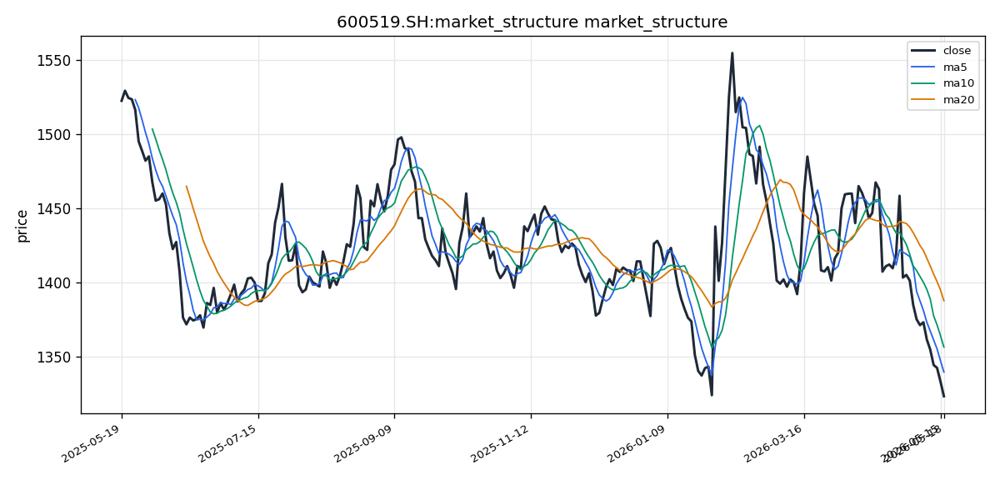

# 贵州茅台（600519.SH）投资研究报告

## 一、投资结论与组合动作

**最终裁决：卖出/减持**

基于风险管理委员会主席的最终决策，贵州茅台当前面临的核心矛盾已从短期情绪恐慌转向结构性需求萎缩，这使得所有基于历史类比（如2013年触底反弹）的看涨逻辑均面临根本性失效风险。批价持续下跌是供需失衡的先行指标，而人口老龄化、消费降级等结构性因素正在侵蚀高端白酒的基本面支撑。在此背景下，“估值低”不等于“低估”，20倍PE的安全边际正在被基本面恶化所侵蚀。

**执行指令：**

1. **立即执行（对现有持仓者）：** 卖出当前仓位的**100%（清仓）**，或至少**80%**。保留10-20%的观察仓在逻辑上可以接受，但须设置严格止损。**禁止进行任何“防御性抄底”操作**。
2. **对保留仓位设置止损：** 若选择保留观察仓，设置严格止损线在**¥1,280**（跌破布林带下轨并确认趋势恶化）。此止损仅用于捕捉极端情绪下的错误定价，而非用于持有抗跌。
3. **反弹加仓做空（如未建仓）：** 任何反弹至**¥1,350-1,380（MA5-MA10区间）**，均是卖出（做空）的绝佳机会，而非买入。此操作执行后，止损设在突破¥1,388并站稳三日后。
4. **重新入场条件（长期跟踪）：** 只有当以下两个条件**同时**满足时，才考虑重新入场：
   - 价格**放量站稳MA20（¥1,388）**；
   - 飞天批价**企稳回升至¥2,500以上**并保持稳定。
   - 在此之前，**每一次反弹都是做空或清仓的机会，不是抄底。**

**核心风险约束：** 当前最安全的资产是现金。在批价明确企稳、需求出现改善迹象之前，任何形式的买入或持有均属鲁莽行为。

## 二、技术指标分析

### 技术图表

### 市场分析师完整指标材料

#### 📊 股票基本信息

| 项目 | 内容 |
|------|------|
| **公司名称** | 贵州茅台 |
| **股票代码** | 600519.SH |
| **所属市场** | CN_A（中国A股） |
| **最新收盘价** | ¥1,323.00 |
| **涨跌幅** | 近20个交易日参考区间：均线MA20为¥1,387.56，股价低于均线约-4.65% |
| **成交量** | 最新日成交量 49,660.97（手） |

---

#### 📈 技术指标分析

##### 1. 移动平均线（MA）分析

| 均线 | 数值（¥） | 价格关系 |
|------|-----------|----------|
| MA5 | 1,339.35 | 当前价¥1,323.00 < MA5，短线承压 |
| MA10 | 1,356.19 | 当前价 < MA10，短线空头排列确认 |
| MA20 | 1,387.56 | 当前价 < MA20，中期趋势偏弱 |

**均线排列形态分析：**

当前价格¥1,323.00处于所有短期均线（MA5、MA10、MA20）之下，形成典型的**空头排列**格局。MA5 < MA10 < MA20 的倒序排列清晰表明短期至中期的下降趋势尚未改变。价格与MA20之间的乖离率达-4.65%，显示短期超卖程度较大，存在技术性修复反弹的需求，但趋势反转信号尚未出现。

**价格与均线的位置关系：**

价格连续跌破MA5、MA10和MA20三条均线，说明多头防线逐级失守。当前价格距离MA5（¥1,339.35）约-1.22%的负乖离，距离MA10（¥1,356.19）约-2.45%负乖离，距MA20（¥1,387.56）约-4.65%负乖离。短期反弹时，MA5和MA10将成为第一、第二道重要压力位。

**均线交叉信号：**

均线系统当前处于空头排列初期阶段，尚未形成短期均线上穿长期均线的"金叉"信号。若后续价格企稳反弹，需重点关注MA5能否上穿MA10形成第一级金叉，这将是最早的趋势转强信号。

##### 2. MACD指标分析

| MACD组件 | 数值 |
|----------|------|
| DIF（快线） | -26.5240 |
| DEA（慢线） | -19.7314 |
| MACD柱（histogram） | -6.7926 |

**金叉/死叉信号：**

DIF（-26.5240）< DEA（-19.7314），MACD处于**死叉状态**，且DIF与DEA均位于零轴下方，属于典型的空头市场特征。MACD柱状图值为-6.7926，绿色柱体持续，显示空头动能仍然占据主导地位。

**背离现象分析：**

当前MACD指标未显示明显的底背离信号。DIF和DEA双线下行且位于零轴下方，价格与MACD同步下行，趋势方向一致，暂未出现反转级别的背离结构。后续若价格创新低而MACD柱开始收窄或DIF线走平/回升，则需警惕底背离雏形的出现。

**趋势强度判断：**

MACD柱持续为负且绝对值较大（-6.7926），表明当前空头趋势的动能尚未衰竭。DIF与DEA的负向开口（-6.7926）表明短期下跌动能仍在释放中，市场短期内仍面临下行压力，但需关注柱体是否逐步收窄，以判断动能是否开始衰竭。

##### 3. RSI相对强弱指标

**RSI当前数值：28.02**

RSI(14)读数为28.02，已进入**超卖区域**（通常RSI < 30视为超卖）。这一数值表明短期市场情绪极度悲观，空方力量过度释放，从统计规律上看，超卖区域往往预示着技术性反弹的概率在上升。

**超买/超卖区域判断：**

28.02的RSI读数处于超卖区间（<30），但尚未达到极端超卖（<20）的程度。这是自数据起始以来该指标首次进入超卖区域，具有较强的技术警示意义。

**背离信号：**

当前RSI读数与价格走势同步下行，未见明显的底背离结构。后续若价格继续创新低而RSI拒绝创出新低（即RSI在超卖区形成更高的低点），则有望形成看涨底背离，这将是趋势反转的重要候选信号。

**趋势确认：**

RSI在超卖区域运行，确认了当前空头趋势的强度，但同时也提示短期反弹风险正在积聚。在超卖区域，卖压逐步衰竭，买盘力量有望逐步积累，形成技术性反弹的触发条件。

##### 4. 布林带（BOLL）分析

| 布林带轨道 | 数值（¥） |
|------------|-----------|
| 上轨（Upper） | 1,462.34 |
| 中轨（MA20） | 1,387.56 |
| 下轨（Lower） | 1,312.78 |

**价格在布林带中的位置：**

当前收盘价¥1,323.00位于布林带中轨（¥1,387.56）与下轨（¥1,312.78）之间，偏向于下轨区域。价格距离中轨-4.65%，距下轨仅+0.78%，说明价格已接近布林带下轨支撑位。

**带宽变化趋势：**

布林带上轨¥1,462.34与下轨¥1,312.78的带宽为¥149.56，带宽处于相对合理区间。价格向下轨靠拢过程中，带宽若出现进一步扩张，则意味着波动率加大，下跌趋势可能加速；若带宽开始收窄，则有望进入震荡筑底阶段。

**突破信号分析：**

当前价格尚未触及下轨（¥1,312.78），但已十分接近（距离仅+0.78%）。需密切关注以下情景：
- 若价格跌破下轨并持续运行，属"破位下行"信号，趋势将进一步恶化；
- 若价格在下轨附近获得支撑并反弹，且后续回到中轨上方，则是趋势企稳信号。

---

#### 📉 价格趋势分析

##### 1. 短期趋势（5-10个交易日）

短期来看，价格已跌破MA5（¥1,339.35）和MA10（¥1,356.19），空头占据绝对优势。RSI进入超卖区（28.02）是短期最值得关注的技术信号，暗示短期存在技术性修复反弹的可能。

**关键支撑位：**
- 第一支撑位：布林带下轨¥1,312.78
- 第二支撑位：整数关口¥1,300.00

**关键压力位：**
- 第一压力位：MA5（¥1,339.35）
- 第二压力位：MA10（¥1,356.19）
- 第三压力位：MA20（¥1,387.56）

短期价格区间预计在¥1,300 ~ ¥1,340之间运行，若出现超卖反弹，可能测试MA5附近。

##### 2. 中期趋势（20-60个交易日）

从中期视角看，MA20（¥1,387.56）作为中期趋势的锚点，价格持续运行其下方，中期趋势看空。MACD双线在零轴下方死叉运行，表明中期空头趋势结构完整。当前未见明确的中期趋势反转信号。

中期趋势若要转强，需满足以下条件：
1. 价格放量站上MA20（¥1,387.56）
2. MACD形成零轴下方的金叉
3. RSI回升至50中轴线以上

上述条件当前均不满足，中期维持谨慎偏空判断。

##### 3. 成交量分析

| 成交量指标 | 数值（手） |
|-----------|-----------|
| 最新成交量 | 49,660.97 |
| VOL_MA5 | 54,178.85 |
| VOL_MA20 | 47,182.46 |

最新成交量49,660.97低于5日均量54,178.85，说明近期量能有所萎缩。在下跌过程中缩量，一方面说明抛压有所减轻，另一方面也说明市场参与热情降温，买盘不足。VOL_MA20为47,182.46，当前成交量略高于20日均量，表明整体交投活跃度尚可。

量价配合方面，呈现"价跌量缩"的格局，这通常不是最恶劣的放量下杀形态，但也不构成反转信号。后续需关注是否出现"放量止跌"（底部放量收阳线）或"缩量企稳"（地量见地价）的量价配合模式。

---

#### 💭 投资建议

##### 1. 综合评估

综合上述技术指标分析，贵州茅台（600519.SH）当前处于**空头趋势主导阶段**，各项技术指标均偏空：

- **均线系统**：空头排列，价格在MA5/MA10/MA20之下运行；
- **MACD**：零轴下方死叉，绿柱持续，空头动能未衰竭；
- **RSI**：28.02进入超卖区，短期超跌反弹概率上升；
- **布林带**：价格逼近下轨，存在技术性支撑预期。

整体判断为：**中期趋势偏空，短期存在超卖反弹动能**。市场处于下跌趋势末端区域，但趋势反转信号尚未明确出现。

##### 2. 操作建议

- **投资评级**：**持有（观望）** —— 不建议当前价位追空或抄底，等待明确的技术信号出现
- **目标价位**：短期反弹目标 ¥1,340 ~ ¥1,360；中期若趋势转强，目标¥1,390 ~ ¥1,420
- **止损位**：若价格跌破布林带下轨¥1,312.78且持续放量下行，建议严格止损于¥1,290
- **风险提示**：
  - 当前处于下跌趋势中，逆势抄底风险较大
  - MACD未形成底背离结构，趋势反转信号尚不充分
  - 成交量未出现明确的放量止跌信号
  - 需关注市场整体情绪及行业政策变化

##### 3. 关键价格区间

| 关键点位 | 价格（¥） | 说明 |
|----------|-----------|------|
| **第一支撑位** | 1,312.78 | 布林带下轨，短期重要支撑 |
| **第二支撑位** | 1,300.00 | 整数关口+心理支撑位 |
| **第一压力位** | 1,339.35 | MA5，短期反弹首道压力 |
| **第二压力位** | 1,356.19 | MA10，中期反弹关键阻力 |
| **第三压力位** | 1,387.56 | MA20+布林带中轨，趋势分水岭 |
| **突破买入价** | 1,388.00 | 放量站上MA20可考虑分批建仓 |
| **跌破卖出价** | 1,312.00 | 有效跌破布林下轨应减仓控制风险 |

---

#### 数据限制与风险提示

**数据覆盖说明：**

本报告基于的工具数据包覆盖时段为2025年5月18日至2026年5月18日，共获取242个交易日的OHLCV数据。数据源主要来自tushare/daily（远端获取成功），而akshare/stock_zh_a_hist与eastmoney/quote两个数据源因远端连接异常未能成功获取，因此本报告的技术分析结论仅基于单一数据源的计算结果。尽管核心指标（均线、MACD、RSI、布林带）均已覆盖，但缺乏多数据源交叉验证，可能在极端行情下存在精度偏差。

**时效性提示：**

本报告基于截至数据包最新日期（2026年5月18日收盘）的数据进行计算。技术指标具有时效性，随着新交易数据的产生，各项指标数值将发生变化，建议结合最新行情进行动态跟踪。

**分析局限：**

技术分析仅基于价格、成交量等市场数据，未考虑公司基本面变化、宏观经济政策、行业监管调整、市场情绪等非技术面因素。贵州茅台作为A股核心资产，其价格波动受机构资金流向、外资进出、白酒行业政策等多重因素影响，技术面信号应结合基本面分析综合判断。

**重要提醒：** 本报告仅为技术分析参考，不构成投资建议。股市有风险，投资需谨慎。任何投资决策应基于投资者自身的风险承受能力和投资目标，并咨询专业投资顾问。

### 1. 价格结构与趋势判断

最新收盘价**¥1,323.00**，处于所有短期均线下方，形成典型空头排列。价格与均线关系：MA5（¥1,339.35）乖离率-1.22%；MA10（¥1,356.19）乖离率-2.45%；MA20（¥1,387.56）乖离率-4.65%。价格连续跌破三条均线，多头防线逐级失守。

**趋势结构结论：** 短期至中期下降趋势尚未改变。MA5 < MA10 < MA20 的倒序排列确认空头趋势结构完整。-4.65%的乖离率显示短期超卖程度较大，存在技术性修复反弹需求，但趋势反转信号尚未出现。

### 2. 均线系统分析

| 均线 | 数值（¥） | 当前价格关系 | 交易含义 |
|------|-----------|-------------|---------|
| MA5 | 1,339.35 | 当前价<MA5（-1.22%） | 短线承压，反弹第一道阻力 |
| MA10 | 1,356.19 | 当前价<MA10（-2.45%） | 空头排列确认，第二道阻力 |
| MA20 | 1,387.56 | 当前价<MA20（-4.65%） | 中期趋势分水岭，趋势偏弱 |

**均线交叉信号：** 当前未形成短期均线上穿长期均线的“金叉”。若后续价格企稳反弹，需重点关注MA5能否上穿MA10形成第一级金叉，这将是趋势转强的最早信号。

**失效条件：** 若价格放量站上MA20（¥1,388）并持续三个交易日站稳，则空头排列格局将被打破，趋势判断需转为中性。

### 3. MACD动量信号

| MACD组件 | 数值 | 市场含义 |
|----------|------|---------|
| DIF（快线） | -26.5240 | 零轴下方，空头主导 |
| DEA（慢线） | -19.7314 | 零轴下方，确认空头 |
| MACD柱（histogram） | -6.7926 | 绿色柱体持续，空头动能未衰竭 |

**金叉/死叉状态：** DIF < DEA，MACD处于**死叉状态**，且双线均位于零轴下方，典型空头市场特征。柱状图负值绝对值较大，显示空头动能尚未明显衰减。

**背离现象：** 当前未显示明显底背离信号。价格与MACD同步下行，趋势方向一致。后续若价格创新低而MACD柱开始收窄或DIF线走平/回升，则需警惕底背离雏形的出现。

**趋势强度判断：** DIF与DEA的负向开口（-6.7926）表明短期下跌动能仍在释放，市场短期内仍面临下行压力。需关注柱体是否逐步收窄，以判断动能是否开始衰竭。

**交易作用：** 死叉状态支撑卖出/减持判断。若未来MACD柱开始缩窄（绿柱变短）且DIF走平，将是短期超卖修复的信号，但不足以改变中期趋势，应仅作短线反弹机会看待，而非趋势反转。

### 4. RSI相对强弱指标（动量确认信号）

**RSI(14)当前数值：28.02**

- **超卖区域判定：** RSI < 30，已进入超卖区域，表明短期市场情绪极度悲观，空方力量过度释放。从统计规律看，超卖区域往往预示技术性反弹概率上升。
- **极端超卖状态：** 尚未达到极端超卖（<20），但已是数据覆盖期间首次进入超卖区，具有较强技术警示意义。
- **背离信号：** 当前RSI与价格同步下行，未见底背离。若后续价格继续创新低而RSI拒绝创出新低（即RSI在超卖区形成更高的低点），则有望形成看涨底背离，将是趋势反转的重要候选信号。
- **交易作用：** 超卖状态确认空头趋势强度，但提示短期反弹风险正在积聚。超卖可以更超卖，不能作为买入理由。交易员计划中的反弹至¥1,350-1,380区域做空，正是利用RSI超卖后的技术性修复预期。

**失效条件：** 若RSI在超卖区形成底背离（价格新低但RSI抬高），且该背离被后续价格突破MA10所确认，则需重新评估做空逻辑的有效性。

### 5. 布林带/ATR波动信号

| 布林带轨道 | 数值（¥） | 价格位置关系 |
|------------|-----------|-------------|
| 上轨（Upper） | 1,462.34 | 远高于当前价 |
| 中轨（MA20） | 1,387.56 | 当前价-4.65% |
| 下轨（Lower） | 1,312.78 | 当前价+0.78% |

**价格在布林带中的位置：** 收盘价¥1,323.00位于中轨与下轨之间，偏向于下轨区域，距下轨仅+0.78%，说明价格已接近布林带下轨支撑位。

**带宽变化趋势：** 上轨-下轨带宽为¥149.56，处于相对合理区间。价格向下轨靠拢过程中，带宽若进一步扩张，意味着波动率加大，下跌趋势可能加速；若带宽开始收窄，则有望进入震荡筑底阶段。

**突破信号分析：**
- **破位下行信号：** 若价格跌破下轨（¥1,312.78）并持续运行，属“破位下行”，趋势将进一步恶化。
- **支撑确认信号：** 若价格在下轨附近获得支撑并反弹，且后续回到中轨上方（¥1,387.56），则是趋势企稳信号。

**交易作用：** 布林带下轨（¥1,312.78）是短期最重要的技术支撑位，也是止损设定的核心参考。交易员计划的止损线¥1,280低于下轨约2.5%，留出了对“跌破下轨后假突破”的缓冲。

### 6. 成交量/VWMA确认

| 成交量指标 | 数值（手） | 与均量关系 |
|-----------|-----------|-----------|
| 最新成交量 | 49,660.97 | — |
| VOL_MA5 | 54,178.85 | 低于5日均量 |
| VOL_MA20 | 47,182.46 | 高于20日均量 |

**量价分析：** 当前呈现“价跌量缩”格局。最新成交量（49,660.97手）低于5日均量（54,178.85手），说明近期量能有所萎缩。下跌过程中缩量，一方面表明抛压有所减轻，另一方面也说明市场参与热情降温，买盘不足。

**量价配合模式：** “价跌量缩”不是最恶劣的放量下杀形态，但也不构成反转信号。后续需关注是否出现以下模式：
- **放量止跌：** 底部放量收阳线，表示有资金入场承接；
- **缩量企稳：** 地量见地价，卖盘枯竭。

**交易作用：** 当前成交量不支持趋势反转。若反弹过程中成交量无法有效放大（如日成交连续低于VOL_MA5），则反弹的可信度较低，更适合作为做空/减仓的机会。

### 7. 关键支撑阻力与触发条件

| 关键点位 | 价格（¥） | 交易含义 | 触发/失效条件 |
|----------|-----------|---------|-------------|
| **第一支撑位** | 1,312.78 | 布林带下轨，短期核心支撑 | 跌破则趋势恶化，触及止损观察区 |
| **第二支撑位** | 1,300.00 | 整数关口+心理支撑 | 有效跌破则确认破位 |
| **第一压力位** | 1,339.35 | MA5，反弹首道阻力 | 放量突破则短期转强 |
| **第二压力位** | 1,356.19 | MA10，反弹关键阻力 | 突破则空头排列减弱 |
| **第三压力位** | 1,387.56 | MA20+布林带中轨，趋势分水岭 | 放量站稳则空头逻辑失效 |
| **跌破卖出价** | 1,312.00 | 有效跌破布林下轨应减仓 | 确认破位则清仓观察仓 |
| **突破买入价** | 1,388.00 | 放量站上MA20可考虑右侧建仓 | 需同时满足批价企稳条件 |

### 8. 技术面综合失效条件与重新评估触发

当前技术面所有信号均指向空头趋势主导。以下情景会改变这一判断：
- **趋势反转确认：** 价格放量站上MA20（¥1,388）且MACD形成零轴下方金叉，同时RSI回升至50中轴线上方。
- **底背离确认：** 价格创新低而MACD柱显著收窄/RSI在超卖区形成更高低点，并经后续价格突破确认。

## 三、基本面分析

### 1. 盈利能力与财务质量

**ROE（净资产收益率）：** 当前为**10.57%**。需注意：
- 这是阶段性数据（可能受分红除权、季节性因素或季度波动影响），并非全年化数据。茅台历史ROE通常维持在25%-35%区间。
- 2022年中报ROE也曾低至11%，但全年仍达31%。当前数值偏低不代表基本面恶化，但需结合后续季报验证利润增速是否放缓。
- 若利润增速从历史20%+降至10%或更低，20倍PE对应的是合理估值上限而非低估区间。

**长期盈利特征（历史公开信息）：** 茅台长期保持**毛利率90%以上**、**净利率约52%**，体现出极强的品牌溢价与定价权。经营性现金流常年高于净利润，现金创造能力卓越。

**对投资含义的影响：** 盈利能力指标整体稳健，但增速放缓趋势值得警惕。若未来几个季度利润增速低于8%-10%，将从根本上削弱当前估值的“安全边际”论证。

### 2. 收入与利润变化趋势判断

基于已知资料（未获取完整利润表），可归纳以下趋势判断：
- **产品结构升级持续：** 茅台1935、生肖酒等非标产品占比提升，有助于提升吨酒价格。
- **直销渠道占比约45%：** i茅台平台深化运营，但继续提升空间有限，且过度挤压传统经销商可能引发渠道反噬。
- **批价下跌传导风险：** 飞天批价从¥2,700跌至¥2,350，若持续下行将压缩渠道利润，最终传导至公司报表（利润增速放缓）。

**对投资含义的影响：** 批价是第一先行指标。通道去库存负反馈若持续，可能引发“批价下跌→渠道抛售→出厂价压力→利润增速下行”的连锁反应。当前基本面判断的核心不确定性在此。

### 3. 估值讨论

| 估值指标 | 当前数值 | 历史分位/位置判断 |
|---------|---------|-----------------|
| PE | **20.03倍** | 近10年历史分位约20%-30%，偏低 |
| PB | **6.12倍** | 历史中等偏低位置 |

**PE分析：**
- 当前20倍PE处于历史估值中枢偏低位置，但需考虑增速变化。
- 若利润增速维持在10%+，20倍PE具备安全边际；若增速降至5%-8%，20倍PE对应合理估值上限，非低估。
- 看涨方认为：20倍PE低于历史均值，市场已将悲观预期定价；
- 看跌方反驳：增速在放缓，20倍PE没有为“恶化”留出足够折扣。

**PEG估算：** 以近两年利润增速10%-15%估算，当前PEG约1.3-2.0区间，未进入明显高估区间，但也不具备显著低估特征。

**估值推断的右侧信号：** 若2026年三季报/年报确认利润增速低于8%，PE中枢可能下移至15-18倍。当前估值判断的失效条件即在于此。

### 4. 资产负债与现金流特征

**已知特征：** 账上拥有大量货币资金（通常超千亿元），无有息负债或极少有息负债，经营性现金流充裕且与净利润高度匹配。财务稳健性极强，具备穿越周期的能力。

**风险警示：** “存量安全的幻觉”论点指出——财务质量的静态美掩盖了动态风险。ROE走低、利润增速放缓正在侵蚀每股内在价值的增长速度。高股息率（约3%）是双刃剑：在失去成长性时是防御工具，但也暗示管理层缺乏更好的投资机会。

### 5. 行业地位与经营风险

**核心护城河：** 品牌垄断、定价权（出厂价与批价格差）、稀缺性、现金流稳定性。看涨方认为这些优势在A股独一无二。

**边际变化风险（看跌方核心论点）：**
- **定价权被削弱：** 消费降级环境下，提价可能逼走中间客群，五粮液等在中低端市场份额回升。
- **直销红利天花板：** 占比45%后继续提升空间有限，且可能加速价格透明化，削弱渠道层面的稀缺溢价。
- **中端产品线承压：** 茅台1935批价腰斩至¥700+，证明消费者对“千元以下酱酒”的忠诚度远低于预期。
- **消费税改革：** 征收环节后移可能压缩渠道利润，间接影响提价空间。

### 6. 削弱当前判断的关键信号

以下任一信号出现，需重新评估基本面判断：
- 飞天批价跌破¥2,000（确认供需失衡加剧）；
- 公司公告下调出厂价或补贴经销商（历史先例：2013年变相降价）；
- 连续两个季度利润增速低于8%（增速放缓实质化）；
- 消费税改革试点被正式提上政策议程。

## 四、消息面与行业环境

### 1. 宏观环境

**流动性宽松与利率下行：** 央行维持适度宽松货币政策，市场利率中枢下移。对高股息、大市值蓝筹形成估值支撑，也是看涨方“类债券资产”逻辑的宏观背景。然而，该逻辑在“资产荒向资金荒转化”时可能失效——若消费降级导致茅台自身出现“信用瑕疵”，机构资金会重新定价其确定性。

**消费刺激政策：** 国内稳增长政策持续加码，消费被列为拉动内需重点方向。但高端白酒能否从中受益仍存不确定性——政策更多指向大众消费和民生领域，而非奢侈消费品。

**北向资金动态：** 2025年下半年北向资金已连续3个月净流出茅台，外资在用真金白银表达对结构性风险的担忧。

### 2. 行业环境

**批价波动（核心催化）：** 散瓶飞天批价从¥2,700跌至¥2,350（跌幅超12%），是当前最重要的负面催化。批价与茅台股价高度相关，历史上批价下跌是戴维斯双杀的第一导火索。

**影响机制：** 批价下跌→渠道囤货动机转为去库存恐慌→价格负反馈→渠道利润压缩→茅台出厂价压力→利润增速放缓预期强化→估值中枢下移。

**消费税改革预期（悬顶之剑）：** 市场多次讨论白酒消费税征收环节后移的可能。高毛利、高渠道利润行业是改革首选目标。若落地，将影响行业利润结构。看涨方认为影响可控（茅台可转嫁成本），看跌方认为政策风险会提前定价，单日暴跌5%-8%并非不可能。

**竞争格局：** 五粮液、泸州老窖在中低端价格带（¥300-800）份额回升；茅台1935批价暴跌拖累整体中端产品线信心。茅台的“品牌护城河”在高端市场仍坚固，但中端产品线暴露了品牌延伸的局限。

### 3. 对组合动作的影响

- **批价走势**是当前最优先的跟踪变量。批价企稳是任何买入逻辑的前提条件，批价继续下行则卖出/减持逻辑持续强化。
- **消费税改革**属于尾部风险（政策时间表可能在2028年之后），但出现政策信号时将触发情绪性下跌，需提前做好仓位保护。
- **消费刺激政策超预期**是小概率利好，但尚未看到实质落地，不能作为当前建仓的依据。

## 五、市场情绪与交易结构

### 1. 社交情绪与关注度

**数据可用性：** 社交样本量为0条，聚合情绪指标18条（来源单一），雪球/股吧、谷歌新闻等数据源获取失败。**无法形成统计意义上可靠的情绪方向判断。**

在数据缺口下，无法得出“情绪中性”“情绪平稳”等结论。请依赖技术面和基本面信号，勿将数据缺失解读为情绪稳定。

### 2. 多空叙事差异（基于分析师辩论）

| 维度 | 看多方 | 看空方 |
|------|--------|--------|
| 批价下跌 | 泡沫清洗，健康的调整 | 供需逆转信号，结构性恶化 |
| 消费税改革 | 影响可控，长期可适应 | 悬顶之剑，政策风险提前定价 |
| 20倍PE | 历史低位，安全边际 | 增速放缓后合理估值上限 |
| 历史类比 | 2013年恐慌后涨10倍 | 这次不一样，需求面结构性萎缩 |

**情绪脆弱点：** 看多方高度依赖“批价企稳”这一不可验证的假设。如果批价继续跌破¥2,200或¥2,000，将彻底推翻看多逻辑的基座，触发情绪性踩踏。

**可能的确认信号（强化看空）：** 批价进一步下行、利润增速低于预期的财报、消费税改革政策信号。

**可能的反向信号（削弱看空）：** 批价企稳回升至¥2,500以上、放量站上MA20、公司发布超预期分红或回购计划。

### 3. 情绪与基本面/技术面关系

当前情绪（市场悲观）与基本面（批价下行、消费降级）和技术面（空头排列）高度一致，形成典型的“基本面恶化→技术面破位→情绪悲观→进一步抛售”负反馈循环。

**拥挤度判断：** 尚无充分数据评估机构持仓集中度或短线交易拥挤度。但北向资金持续净流出提示外资层面的减仓趋势。

**对组合动作的启示：** 情绪一致看空时，需警惕“超卖反弹”的可能性，但不应将其作为逆势买入的理由。组合经理的决策逻辑是：在趋势确认逆转前，每一次反弹都是减仓机会。

## 六、交易计划与组合风险

### 1. 最终交易建议（整合交易员与风险辩论）

**动作：卖出/减持**

**仓位规划：**
- **立即执行：** 卖出当前仓位的**100%（清仓）**，或至少**80%**。保留10-20%观察仓需设置严格止损（¥1,280）。
- **禁止操作：** 不做“防御性抄底”，不在1320-1350区间建立任何多头头寸。
- **反弹做空（如果未建仓）：** 任何反弹至¥1,350-1,380（MA5-MA10区间），是卖出机会，止损设在突破¥1,388并站稳三日。

### 2. 进场/加仓/减仓/退出条件

| 动作 | 条件 | 执行理由 | 失效条件 |
|------|------|---------|---------|
| **减持/清仓** | 立即执行，在¥1,320-1,350区间完成 | 批价持续下行，需求面结构性恶化，技术面空头排列 | 价格放量站上¥1,388且批价企稳 |
| **反弹做空** | 价格反弹至¥1,350-1,380 | 利用超卖修复情绪，确认反弹无量后加仓做空 | 价格突破¥1,388并站稳三日 |
| **重新入场** | 必须同时满足：价格放量站稳MA20（¥1,388）+批价企稳回升至¥2,500以上 | 等待右侧信号确认基本面与技术面共振 | 等待周期超出6个月，或批价继续下行 |
| **止损（观察仓）** | 跌破¥1,280 | 价格跌破布林带下轨并确认趋势恶化 | 价格重新站回¥1,312以上并企稳 |

### 3. 目标价格与情景分支

| 情景 | 假设条件 | 目标PE | 对应股价 | 时间范围 |
|------|---------|--------|---------|---------|
| **基准（最可能）** | 批价跌至2,200，利润增速降至10%左右，政策无实质变化 | 18-20倍 | **¥1,180-1,320** | 1-3个月 |
| **保守（可能）** | 批价跌至2,000，利润增速降至8%，消费税改革预期升温 | 16-18倍 | **¥1,050-1,180** | 3个月 |
| **技术支撑** | 布林带下轨→前低→心理关口 | — | ¥1,312 → ¥1,280 → ¥1,200 | 短期 |

**时间目标：**
- **1个月：** ¥1,250-1,300（继续探底，RSI超卖后反弹无力）
- **3个月：** ¥1,100-1,180（三季报验证增速放缓，PE下移）
- **6个月：** ¥1,050-1,180（消费税改革预期+批价进一步下行）

### 4. 风险辩论与分歧

**激进风险分析师（看多）的核心主张：**
- 立即在¥1,320-1,350区间建立35%重仓，止损设在¥1,250
- 理由：风险收益比不对称（下行20% vs 上行至1,500+），RSI超卖+历史低估值
- 弱点：押注“批价企稳”这一不可知假设，忽略结构性需求恶化

**保守风险分析师（看空）的核心主张：**
- 坚决执行交易员的卖出指令，不要在迷雾中下跳
- 理由：批价下跌非泡沫清洗而是结构性萎缩，防止永久性资本损失
- 弱点：完全忽略机会成本，可能错过超跌反弹中最具爆发力的阶段

**中性风险分析师（防御性抄底）的方案：**
- 卖出30% + 在¥1,290-1,310用5%仓位试探性买入，止损设在布林带下轨
- 优点：用纪律约束贪婪和恐惧
- 致命缺陷：买入前提是“可能会有反弹”而非“基本面已触底”，本质上是用小仓位赌市场情绪短期反转，无法对冲剩余仓位的潜在深度回撤

**组合经理采纳的逻辑：**
- 站在安全分析师一边，因为“这次不一样”的结构性逻辑直接驳斥了激进和中性分析师的共同脆弱假设
- 核心论证：核心矛盾已从“情绪恐慌”转向“需求萎缩”，历史类比失效；不对称风险收益比的前提已崩塌（上行依赖不可知假设，下行可见巨大空间）；中性方案的“防御性抄底”是伪平衡，用一丁点小概率利润去交换大概率巨大损失

### 5. 风险代价与失效条件

- **最大风险代价（认错成本）：** 若市场情绪突然逆转（如消费刺激政策超预期或批价意外企稳），清仓操作将错失反弹利润。但组合经理的逻辑是：在结构性问题未解决前，反弹不可持续，错过总比套住好。
- **卖出逻辑失效条件：** 价格放量站上MA20（¥1,388）且持续三个交易日以上，同时飞天批价企稳回升至¥2,500以上。满足此条件时，需重新评估卖出逻辑的有效性。

## 七、关键分歧与跟踪条件

### 1. 核心分歧：这次是否“不一样”？

| 看涨方观点 | 看跌方观点 | 组合经理采纳 |
|------------|------------|-------------|
| 2013年恐慌后涨10倍，历史会重演 | 2026年需求萎缩是结构性的（人口+消费降级），不是2013年的政策性恐慌 | 同意看跌方。人口老龄化意味着主力消费群体缩小，消费降级意味着面子消费减少。前者是“不让喝”，后者是“不想喝/喝不起”，性质根本不同 |

**跟踪条件：** 持续关注白酒消费场景变化（商务宴请、礼品、个人消费）的定性/定量趋势。若出现消费降级逆转的信号（如高端消费PMI持续回升），则需重新评估此分歧。

### 2. 核心分歧：批价下跌是“健康调整”还是“崩盘前兆”？

| 看涨方观点 | 看跌方观点 | 组合经理采纳 |
|------------|------------|-------------|
| 下跌源于渠道去库存的短期波动，开瓶率未变，真实需求仍在 | 供需失衡的信号，批价从¥2,700跌至¥2,350是渠道库存堰塞湖+需求下行的双重结果 | 同意看跌方。批价下跌是最客观的供需信号，且已持续一段时间，不是短期波动。2013年批价跌至¥800时茅台被迫变相降价的历史需警惕 |

**跟踪条件：** 每周跟踪飞天茅台批发价走势。关键阈值：
- **¥2,200：** 确认供需失衡加剧，卖出逻辑强化
- **¥2,000：** 进入深度悲观区间，可能引发机构资金大规模出逃
- **企稳回升至¥2,500+（持续一周）：** 需对看跌逻辑进行重大修正

### 3. 核心分歧：20倍PE是“低估”还是“估值陷阱”？

| 看涨方观点 | 看跌方观点 | 组合经理采纳 |
|------------|------------|-------------|
| 20倍PE处于历史低位，低于均值，具备安全边际 | 20倍PE对应10%增速并不便宜；若增速降至5-8%，PE中枢下移至15-18倍 | 同意看跌方。估值低不等于不会更低，尤其是在基本面预期恶化时。2021年PE 70倍时未卖出，因为“坚信茅台永远涨”；现在PE 20倍不能再犯同样错误 |

**跟踪条件：** 关注2026年三季报与年报的利润增速。关键阈值：
- **利润增速≥10%：** 当前估值维持合理，但需观察趋势
- **利润增速在5%-8%区间：** 估值中枢面临下移压力，卖出逻辑强化
- **利润增速<5%：** 确认基本面恶化，目标价下调至¥1,050-1,180区间

### 4. 技术面分歧：超卖是否构成买入理由？

| 看涨方观点 | 看跌方观点 | 组合经理采纳 |
|------------|------------|-------------|
| RSI 28进入超卖区，历史上超卖后平均反弹6%，应利用非对称风险收益比买入 | 超卖可以更超卖，空头趋势中技术指标失效；MACD死叉+零轴下方，无底背离支持反转 | 同意看跌方。在基本面预期恶化的下行趋势中，技术指标的超卖在趋势逆转前是无效的。押注RSI超卖反弹本质上是赌市场情绪短期反转，风险收益不对称的前提已崩塌 |

**跟踪条件：**
- **技术面反转确认信号：** 价格放量站上MA20+MACD形成零轴下方金叉+RSI回升至50中轴线上方
- **做空/减仓条件：** 任何反弹至MA5-MA10区间且量能不足（日成交低于VOL_MA5），是加仓做空或继续减仓的机会

## 八、最终结论

贵州茅台当前面临的核心问题是结构性需求萎缩（人口老龄化+消费降级）与供给端库存压力（渠道堰塞湖）的双重叠加，批价持续下跌是最客观的先行信号，而2021年PE 70倍时未卖出的教训要求我们在问题暴露初期采取果断行动。20倍PE看似历史低位，但若利润增速从10%降至5%-8%，估值中枢将下移至15-18倍，对应股价¥1,050-1,180。当前最安全的资产是现金。

**最终执行指令：** 立即卖出当前仓位的100%（清仓），或至少80%。保留观察仓需设置严格止损在¥1,280。任何反弹至¥1,350-1,380（MA5-MA10区间）是做空机会而非买入。只有当价格放量站稳MA20（¥1,388）且飞天批价企稳回升至¥2,500以上时，才重新考虑入场。

**主要风险：** 消费刺激政策超预期或批价意外企稳可能引发技术性反弹，但结构性问题未解决前反弹不可持续。错过反弹利润的代价，远小于在结构性下行趋势中套牢的风险。
