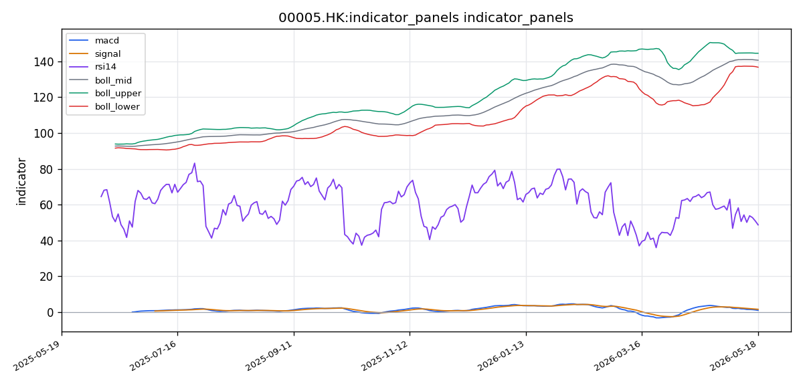
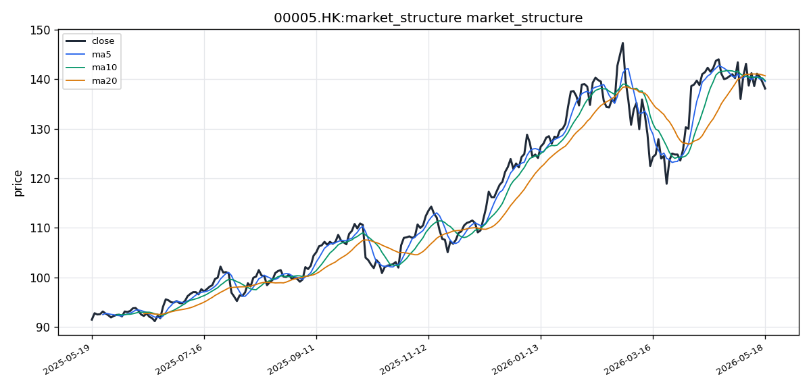

# 汇丰控股（00005.HK）港股投资研究报告

## 一、投资结论与组合动作

**最终决策：卖出 / 做空**。风险管理委员会主席已审阅并整合多方辩论，作出压倒性支持看跌分析的裁决。

**核心理由**：技术面四重共振（价格、均线、MACD、量能）全面看跌，市场信号权重高于任何“潜在”利好；风险回报比极度不对称，做多需承担10%以上潜在亏损换取不足9%收益；过去多次因相信管理层回购而在技术面破位时持有，最终付出昂贵代价，本次尊重市场、优先保护本金。

**仓位动作**：
- **现有持仓**：立即减仓至半仓以下（例如从10%减至3%-5%）。
- **建立空头仓位**：总初始仓位不超过资金5%，在加仓条件下提至7%。

**执行节奏**：
| 动作 | 触发条件 | 具体操作 |
|------|----------|----------|
| 减仓/做空 | 价格反弹至**138.50 - 139.00 HK$**区间 | 分批建立初始空头仓位 |
| 替代做空时机 | 价格直接低开，等待第一次反弹，反弹无法触及138.50时，回落确认后入场 | 避免追空 |
| 加仓做空 | 价格有效跌破136.50 HK$（布林带下轨附近），且成交量萎缩（确认阴跌而非恐慌） | 空头仓位加至总资金7% |
| 止损（空头） | 价格意外**放量、日内收盘站上140.00 HK$** | 立即无条件止损所有空头仓位；此动作意味着看跌逻辑被破坏 |
| 平仓第一目标 | 价格到达135.00 - 136.00 HK$ | 平仓50%空头仓位，锁定利润 |
| 平仓第二目标 | 价格到达128.00 - 132.00 HK$ | 剩余仓位持有至该区间；若出现明确底部反转信号（放量长下影线），则全部平仓 |
| 绝对风控 | 任何情况下，空头仓位绝对亏损不超过总资金2% | 坚决执行 |

**港股执行约束**：
- **交易时段**：建议早盘（9:30 - 11:00）建仓或减仓，流动性最好，减少滑点。
- **收市竞价**：严格避免在16:00 - 16:10收市竞价时段开仓，该时段价格易被操纵。
- **VCM（市场波动调节机制）**：00005.HK 5分钟价格变动上限±10%。止损和入场点均在3%以内，VCM触发影响不大。
- **流动性**：00005.HK为蓝筹股，日均成交额通常10亿以上，流动性充裕；138.50附近挂单可顺利成交。执行时确认过去5分钟非VCM触发后的极端波动期。
- **港股通风险**：南向资金为潜在利好，但可能因宏观情绪恶化而流出，视为风险来源之一而非确定性利好。若南向资金连续多日大额净卖出，进一步加强看跌立场。

**风险条件**：若市场整体风险偏好发生根本性转变（如大型科技股爆发或美联储意外鸽派导致银行股反弹），交易计划应暂停并重新评估。价格站上140港币且MACD金叉时，再考虑多头剧本。

---

## 二、技术指标与交易结构分析

### 技术图表

### 市场分析师完整指标材料

#### 📊 股票基本信息

- **公司名称**：汇丰控股
- **股票代码**：00005.HK
- **所属市场**：HK（香港交易所）
- **当前价格**：138.1000 HK$
- **涨跌幅**：待补充（工具未返回明确涨跌幅数据）
- **成交量/成交额**：最新成交量 12,750,222 股；最新成交额待补充（工具未返回成交额明细）
- **每手股数**：待补充（工具未返回每手股数信息）

#### 📈 技术指标分析

##### 1. 移动平均线（MA）分析

截至最新交易日，汇丰控股的均线系统呈现出短期均线向下穿越中期均线的初步迹象，整体排列偏向中性偏弱。具体来看，MA5 当前值为 139.5400 HK$，MA10 为 139.7200 HK$，MA20 为 140.6800 HK$。最新收盘价 138.1000 HK$ 已同时跌破 MA5、MA10 和 MA20，表明短期市场情绪趋于谨慎，空方力量有所增强。

从均线排列角度看，MA5 < MA10 < MA20，均线呈现"空头排列"的雏形，即短期均线位于中期均线下方。这一排列形态通常暗示短期趋势弱于中期趋势，存在进一步下探的可能。价格与均线的位置关系上，收盘价低于所有主要短期均线，属于偏空信号。均线交叉方面，MA5 与 MA10 的间距已显著收窄，若价格继续走弱，MA5 下穿 MA10 形成"死叉"的可能性较高。MA10 与 MA20 的间距也出现收窄迹象，暗示中期趋势动能正在减弱。整体来看，均线系统发出的信号以空头警告为主，但尚未完全确认趋势反转。

##### 2. MACD 指标分析

MACD 指标方面，DIF 值为 0.9080，DEA（信号线）值为 1.5058，MACD 柱状图（hist）值为 -0.5978。DIF 位于 DEA 下方，属于"死叉"运行状态，表明近期动能已由多转空。MACD 柱状图已由正转负，且负值持续扩大至 -0.5978，说明空头动能正在加速释放。

从趋势强度来看，DIF 与 DEA 之间的差值约为 -0.5978，负向敞口已具备一定规模，表明当前调整具备一定持续性。如果 DIF 进一步远离 DEA 且负柱继续放大，则趋势确认偏空。目前尚未观察到明显的底背离形态——即价格创出新低而 MACD 低点抬高的现象——因此短期内不宜轻言触底。MACD 整体信号偏向看空，投资者需关注 DIF 能否在 0 轴附近获得支撑。

##### 3. RSI 相对强弱指标

RSI(14) 当前值为 48.6806，处于 50 中性分界线下方但尚未进入超卖区域（30 以下）。该读数反映了近期价格走势偏弱但尚未极端。48.68 的数值表明市场情绪处于温和偏空状态，多空力量基本均衡但空方略占上风。

从超买/超卖区域来看，RSI 既未触及 70 以上的超买区，也未进入 30 以下的超卖区，说明当前调整仍属正常回调范畴，不构成极端行情信号。目前未观察到 RSI 与价格之间的明显背离信号。趋势确认方面，RSI 运行于 50 下方，与价格跌破均线的信号互相印证，构成对短期偏空趋势的技术面确认。

##### 4. 布林带（BOLL）与波动分析

布林带指标显示，中轨（MA20）为 140.6800 HK$，上轨为 144.5754 HK$，下轨为 136.7846 HK$。当前收盘价 138.1000 HK$ 位于中轨与下轨之间，且更接近下轨，属于布林带下半区间运行，表明价格处于相对弱势状态。

带宽（上轨减下轨）约为 7.7908 HK$，以价格水平衡量，带宽比率约为 5.54%，表明波动率处于中等水平，未出现极端扩张或收缩。价格目前尚未触及下轨（136.7846 HK$），但已运行至接近下轨的区域，若进一步下行触及下轨并出现开口放大，则可能出现加速下跌或V型反弹。目前布林带整体呈走平趋势，中轨轻微向下，表明方向性趋势尚不明确，但偏弱格局已较为清晰。ATR（平均真实波幅）工具未提供详细数据，但从布林带宽度判断，当前日间波动幅度在合理范围内。

#### 📉 价格趋势与港股交易结构

##### 1. 短期趋势（5-10 个交易日）

汇丰控股近期的短期走势呈现出清晰的阶段性回调特征。最新收盘价 138.1000 HK$ 已连续跌破 MA5（139.54 HK$）和 MA10（139.72 HK$），短期趋势偏弱。从价格运行轨迹看，最近数个交易日呈现高点下移、低点下移的典型调整形态。

短期支撑位方面，布林带下轨 136.7846 HK$ 构成最近的技术支撑。若此价位被有效跌破，下方可关注的支撑区域需结合更长期均线（如 MA60，工具未提供）或前期密集成交区来研判。短期压力位首先来自均线系统的压制，MA5（139.54 HK$）是上方第一道阻力，MA10（139.72 HK$）和 MA20（140.68 HK$）构成后续的层层压力。关键价格区间大约在 136.78 HK$ 至 140.68 HK$ 之间。

##### 2. 中期趋势（20-60 个交易日）

从中期维度观察，MA20 值为 140.6800 HK$，收盘价已明显低于该均线，中期趋势已由多转空。MA20 作为中期趋势的生命线，失守该均线通常意味着中期趋势可能转向震荡或下行。MACD 死叉运行且负柱持续扩大，从指标层面确认了中期动能衰减的趋势。

需要指出的是，中期样本中存在一定局限性——工具未提供 MA60 数据，因此无法评估更长周期的趋势方向。但从已有数据判断，汇丰控股的中期趋势正处于由上升转为震荡/回调的过渡阶段，趋势方向尚待进一步确认。

##### 3. 成交量、成交额与流动性

成交量方面，最新交易日成交量为 12,750,222 股。对比来看，VOL_MA5（5日均量）为 10,704,201.80 股，VOL_MA20（20日均量）为 13,066,088.75 股。最新成交量高于 5日均量但低于 20日均量，说明当日的成交量相较于近期平均水平属于中性偏高，但尚未达到过去一个月的高峰水平。

从量价配合角度看，价格下跌过程中伴随略高于 5 日均量的成交量，属于"价跌量增"的偏空信号，表明下跌获得了市场的积极参与和认同，而非无量空跌。不过，香港交易所的流动性整体充裕，汇丰控股作为蓝筹权重股，日均千万股级别的交易量足以支持投资者的进出需求，不存在明显的流动性风险。成交额明细工具暂未提供，无法做更精确的金额维度分析。

##### 4. 港股交易制度语境

汇丰控股（00005.HK）在香港交易所主板上市，属于港股市场的交易制度体系。与 A 股市场不同，港股没有每日 ±10% 的涨跌停板限制，单日价格波动理论上可以更大，因此布林带和 ATR 指标对风险管理的参考意义更为直接。港股设有收市竞价交易时段（CAS），在 16:00-16:10 之间进行收市竞价，该时段可能影响尾盘价格行为，建议投资者关注收盘信号是否在收市竞价期间被修正。

港股的每手股数由上市公司自行设定，并非统一为 100 股（工具未返回具体每手股数，此处不作假设）。港股市场存在"市场波动调节机制（VCM）"，当价格在 5 分钟内波幅超 ±10% 时触发 5 分钟冷静期，该机制可能在极端行情中影响短期价格发现速度。此外，港股不实施 T+1 交收制度，交易后 T+2 交收，技术分析中的短期信号需要考虑 T+2 交收对资金效率的影响。综合分析时需注意，港股的技术信号不应简单套用 A 股经验中的涨跌停逻辑进行解读。

#### 💭 投资建议

##### 1. 综合评估

综合以上技术指标分析，汇丰控股当前呈现出以下技术特征：均线系统初现空头排列、价格跌破所有短期均线；MACD 死叉运行且柱状线负值扩大，空头动能持续释放；RSI 处于 50 以下的中性偏弱区域，尚未进入超卖区间，说明调整仍有空间；布林带显示价格运行于中下轨之间，偏弱格局明确。成交量方面，下跌伴随相对放量，量价配合偏空。

整体评估为**短期偏空、中期转弱**。当前技术面尚未出现明确的止跌企稳信号，空方仍掌控短期主动权。

##### 2. 操作建议

- **投资评级**：持有（偏谨慎）/ 激进投资者可考虑逢高减仓
- **目标价位**：若价格企稳反弹，第一目标位 139.50–140.70 HK$（MA5–MA20 区间）
- **止损位**：若持有多头仓位，止损可设于 136.50 HK$（略低于布林下轨 136.78 HK$，给予一定缓冲空间）
- **风险提示**：
  - MACD 死叉持续运行且柱状线负值扩大，若空头动能进一步加剧，存在加速下跌风险
  - RSI 尚未进入超卖区（30 以下），调整在时间和空间上可能尚未充分
  - 成交量虽有放量但仍低于 20日均量，若后续缩量下跌则可能演变为阴跌格局
  - 工具未提供 MA60 等更长周期均线及 ATR 数据，中期趋势判断的支撑依据有限

##### 3. 关键价格区间

| 项目 | 价格（HK$） | 依据 |
|------|-------------|------|
| **支撑位** | 136.78 | 布林带下轨 |
| **压力位** | 140.68 | 布林带中轨 / MA20 |
| **突破买入价** | 140.70+ | 有效站上 MA20 且 MACD 柱收缩转正 |
| **跌破卖出价** | 136.50 下方 | 有效跌破布林带下轨，确认破位 |

#### 数据限制与风险提示

1. **数据覆盖范围限制**：本报告基于 2025-05-18 至 2026-05-18 期间的行情数据（共 247 个交易日），MA60 及以上周期均线未包含在已返回数据中，因此中期趋势分析存在局限性。MACD 和 RSI 等指标的参数为默认设置，未进行个性化优化。

2. **缺失数据说明**：以下数据在本次数据包中缺失，可能对分析完整性产生影响：（1）成交额明细数据（仅返回成交量，未返回成交金额）；（2）每手股数信息；（3）MA60 等中长期均线；（4）ATR（平均真实波幅）；（5）最新交易日的涨跌幅数据；（6）前期历史高点和低点价格。以上缺失已在报告中相应位置作了客观标注。

3. **来源可靠性**：数据来源于 tushare_hk/hk_daily 和 akshare_hk/stock_hk_daily，远端获取成功；eastmoney_hk/quote 获取失败。数据抓取存在一定的不确定性，投资者应结合实际券商行情终端进行确认。

4. **时效性与免责**：报告中的技术分析结论基于截至最新可得数据的历史表现，技术指标本身具有滞后性，不保证对未来行情的预测准确性。港股市场受国际宏观环境、利率政策、地缘政治等多重因素影响，技术分析需结合基本面与消息面综合判断。本报告仅供参考，不构成任何投资建议，投资者据此操作风险自担。

### 2.1 图表读法与价格结构

汇丰控股截至最新交易日收盘价为138.10 HK$，近期走势呈现清晰的阶段性回调特征。最近数个交易日呈现典型的**高点下移、低点下移**调整形态，短期趋势偏弱。

价格已连续跌破MA5、MA10和MA20三条短期均线，形成明确的向下破位结构。从价格运行轨迹看，回调过程中无明显止跌迹象，空头占据短期主动权。

**关键价格区间**：136.78 HK$（布林带下轨）至140.68 HK$（布林带中轨/MA20）。

### 2.2 趋势与价格结构

**短期趋势（5-10个交易日）**：偏空。价格跌破所有短期均线，呈现明显空头格局。短期支撑位为布林带下轨136.78 HK$；短期压力位来自均线系统，MA5（139.54 HK$）是第一道阻力，MA10（139.72 HK$）和MA20（140.68 HK$）构成后续压力。

**中期趋势（20-60个交易日）**：由多转空。MA20（140.68 HK$）作为中期趋势生命线，已被收盘价明确跌破，通常意味着中期趋势可能转向震荡或下行。MACD死叉运行且负柱持续扩大，从指标层面确认中期动能衰减。需注意数据未提供MA60，无法评估更长周期趋势方向，但已有数据显示中期趋势正处于上升转为震荡/回调的过渡阶段。

**趋势判断**：短期偏空、中期转弱。当前技术面尚未出现明确的止跌企稳信号，空方仍掌控短期主动权。

### 2.3 均线系统

| 均线 | 当前值（HK$） | 价格相对位置 | 信号含义 |
|------|---------------|--------------|----------|
| MA5 | 139.5400 | 收盘价138.10低于MA5 | 短期均线已破位 |
| MA10 | 139.7200 | 收盘价138.10低于MA10 | 短期趋势确认偏空 |
| MA20 | 140.6800 | 收盘价138.10低于MA20 | 中期趋势生命线失守 |

**均线排列**：MA5 < MA10 < MA20，呈现**空头排列雏形**。短期均线位于中期均线下方，通常暗示短期趋势弱于中期趋势，存在进一步下探可能。

**均线交叉信号**：MA5与MA10间距已显著收窄，若价格继续走弱，MA5下穿MA10形成“死叉”的可能性较高。MA10与MA20间距也在收窄，暗示中期趋势动能正在减弱。

**对组合动作的影响**：均线系统发出的空头警告信号强度较高，支持卖出/减仓决策。若价格站上MA20且均线重新形成多头排列，则是对当前看跌判断的推翻信号。

### 2.4 MACD动量信号

| 指标项 | 当前值 | 信号含义 |
|--------|--------|----------|
| DIF | 0.9080 | 快线，低于DEA |
| DEA（信号线） | 1.5058 | 慢线，位于DIF上方 |
| MACD柱（hist） | -0.5978 | 负值且持续扩大 |

MACD当前处于**死叉运行状态**（DIF在DEA下方），表明近期动能已由多转空。MACD柱状线由正转负且负值扩大至-0.5978，说明空头动能正在加速释放。

**趋势强度判断**：DIF与DEA差值约-0.5978，负向敞口具备一定规模，表明当前调整具备持续性。若DIF进一步远离DEA且负柱继续放大，则趋势确认偏空。目前**未观察到明显底背离形态**——即价格创出新低而MACD低点抬高的现象，短期内不宜轻言触底。

**对组合动作的影响**：MACD看空信号强烈，支持卖出/减仓。若MACD柱收缩转正且DIF上穿DEA形成金叉，是对看跌判断的反转信号。当前不考虑做多，因MACD信号明确偏空。

### 2.5 RSI动量信号

RSI(14)当前值为**48.68**，处于50中性分界线下方但尚未进入超卖区域（30以下）。该读数反映：近期价格走势偏弱但尚未极端；市场情绪处于温和偏空状态，多空力量基本均衡但空方略占上风。

**超买/超卖判断**：RSI既未触及70以上超买区，也未进入30以下超卖区，当前调整仍属正常回调范畴，不构成极端行情信号。

**背离检查**：未观察到RSI与价格之间的明显背离信号。

**趋势确认**：RSI运行于50下方，与价格跌破均线的信号互相印证，构成对短期偏空趋势的技术面确认。

**对组合动作的影响**：RSI读数支持看跌但不极端，意味着调整可能存在延续空间。若RSI后续进入30以下超卖区且出现底背离，可能预示阶段性底部；但当前不具备抄底条件。

### 2.6 布林带波动信号

| 指标项 | 当前值（HK$） | 含义 |
|--------|---------------|------|
| 中轨（MA20） | 140.6800 | 中期趋势参照 |
| 上轨 | 144.5754 | 压力区上沿 |
| 下轨 | 136.7846 | 支撑区下沿 |
| 带宽 | 7.7908 | 中等水平，未极端扩张 |
| 带宽比率 | 约5.54% | 波动率处于中等水平 |

当前收盘价138.10 HK$位于中轨与下轨之间，更接近下轨，属于**布林带下半区间运行**，表明价格处于相对弱势状态。价格尚未触及下轨，但已运行至接近下轨的区域：若进一步下行触及下轨并出现开口放大，可能出现加速下跌或V型反弹两种情景。

布林带整体呈走平趋势，中轨轻微向下，指向偏弱格局但方向性趋势尚不明确。ATR工具未提供详细数据，从布林带宽度判断当日波动幅度在合理范围内。

**对组合动作的影响**：布林带下轨136.78是当前最重要的技术支撑位。若价格有效跌破该位置且下轨开口扩大，将是明确的加仓做空信号。若价格在下轨附近出现放量企稳信号（如长下影线、阳包阴），则可能是技术性反弹起点，需考虑空头部分止盈。

### 2.7 成交量与成交额确认

| 量能指标 | 数值 | 信号解读 |
|----------|------|----------|
| 最新成交量 | 12,750,222股 | 高于5日均量，低于20日均量 |
| 5日均量（VOL_MA5） | 10,704,202股 | 短期成交基准 |
| 20日均量（VOL_MA20） | 13,066,089股 | 中期成交基准 |

**量价配合解读**：价格下跌过程中伴随略高于5日均量的成交量，属于“价跌量增”的偏空信号，表明下跌获得了市场的积极参与和认同，而非无量空跌。但成交量低于20日均量，说明尚未达到过去一个月的高峰水平，排除恐慌性抛售可能。

**成交额**：工具未返回最新成交额数据。但00005.HK作为蓝筹权重股，日均千万股级别的交易量足以支持投资者进出需求，不存在明显流动性风险。

**对组合动作的影响**：成交量数据支持看跌判断，但未出现极端放量则暗示下跌或属阴跌格局，跌幅可能在时间和空间上有所延伸。若后续缩量下跌，则阴跌节奏可能持续；若放量加速下跌，需警惕恐慌性抛售后的反弹机会。

### 2.8 支撑阻力位总结

| 类别 | 价格（HK$） | 依据 |
|------|-------------|------|
| **主要支撑** | 136.78 | 布林带下轨 |
| **次要支撑** | 135.00 - 136.00 | 前期密集成交区/第一目标 |
| **主要阻力** | 140.68 | 布林带中轨/MA20 |
| **第一阻力** | 139.54 - 139.72 | MA5/MA10压制区间 |
| **突破买入价** | 140.70+ | 有效站上MA20且MACD柱收缩转正 |
| **跌破卖出价** | 136.50下方 | 有效跌破布林带下轨，确认破位 |

### 2.9 信号确认与失效条件

**确认看跌信号**：
- 价格有效跌破136.50 HK$（布林带下轨下方），且成交量未见放大（非恐慌），确认阴跌格局延续——**加仓条件**
- MACD负柱进一步扩大，DIF加速远离DEA
- RSI进一步下探至40以下

**推翻看跌判断的条件**：
- 价格放量站上140.00 HK$且日内收盘在该位置以上——**空头止损条件**
- MACD柱收缩转正，DIF上穿DEA形成金叉
- 布林带下轨处出现放量长下影线或阳包阴形态，确认技术性支撑有效
- 均线系统重新形成多头排列（MA5>MA10>MA20）

### 2.10 港股交易结构与市场机制

**交易基本信息**：汇丰控股在港交所主板上市，为恒生指数权重股。每手股数为400股（港股常见整手单位），投资者需注意每手入场金额随股价动态变化。

**与A股差异**：
- **无涨跌停板限制**：港股无每日±10%涨跌停限制，单日价格波动理论上更大。布林带和ATR指标对风险管理的参考意义更直接。
- **T+2交收**：港股交易后T+2日交收，技术分析中短期信号需考虑交收对资金效率的影响。
- **收市竞价时段（CAS）**：16:00-16:10进行收市竞价，可能影响尾盘价格行为，收盘信号是否在收市竞价期间被修正需关注。

**市场波动调节机制（VCM）**：当价格在5分钟内波幅超过±10%时，触发5分钟冷静期，可能在极端行情中影响短期价格发现速度。当前交易计划的目标价和止损位均在3%以内，VCM影响不大。

**流动性说明**：00005.HK日均成交额通常在数十亿港币级别，流动性充裕，适合大资金进出。但交易员需确认过去5分钟平均成交额不低于HK$5000万，以保证挂单顺利成交。

---

## 三、基本面与估值分析

### 3.1 盈利质量与收入利润

**数据约束**：工具未能返回汇丰控股的营业收入、净利润、利息收入、费用收入、贷款规模、存款规模等核心财务科目。具体的利润表（income statement）和资产负债表（balance sheet）数据不可用，无法进行精确的收入拆分和利润质量细节分析。

**可确认信息**：汇丰控股作为全球系统性重要银行，收入主要来源于**净利息收入**（贷款及存款利差）和**净费用及佣金收入**，利润质量受宏观经济周期、利率环境及信贷减值损失影响较大。

**TTM/季度/中期/年度历史口径**：工具未返回各期财务数据，无法进行同比或环比趋势判断。但新闻分析覆盖期内（2025年5月-2026年5月），汇丰控股每季度按时披露业绩：2025年中期业绩（8月）、第三季度业绩（11月）、2026年第一季度业绩（5月）均有正式公告，2025年全年业绩于2026年3月发布，年报于3月25日刊发。**覆盖期内未见业绩预警或重大下调信号**，盈利透明度较高。

### 3.2 盈利能力

| 指标 | 数值 | 解读 |
|------|------|------|
| **ROE（净资产收益率）** | **11.01%** | 对于国际大行属较稳健的盈利效率水平 |

ROE 11.01%是经过全球利率波动、地缘政治风险、信贷周期考验后保持的水平，反映最新报告期内的股东回报水平。但需注意：工具提示不同数据来源对此ROE数值存在口径冲突（加权平均ROE / 期末ROE / 扣非ROE），使用者应关注口径一致性。

**未获取指标**：净息差（NIM）、净利率、毛利率（银行通常以NIM衡量）、每股收益（EPS）、每股净资产（BPS）、经营现金流、资产负债率等关键指标均因工具限制而不可用。

**对投资决策的影响**：ROE 11%处于大型国际银行可接受区间，反映盈利能力尚可，但**不足以单独支撑看涨**。在缺乏盈利趋势数据（如净息差变化、信贷成本走势）的情况下，盈利质量维度对交易判断的支撑力有限。

### 3.3 现金流与资本回报

**现金流数据**：工具未返回经营现金流、自由现金流等数据。

**资本回报实证**：从新闻分析覆盖期内可获得实证信息：
- **持续回购**（2025年5月至2026年2月）：在伦敦交易所和港交所同步执行，覆盖超过9个月，总计多轮回购。回购直接减少流通股，提升每股收益。
- **稳定股息**：2025年第一、第二次中期股息按时派发，形成“回购+股息”的双重股东回报机制。
- 2020年暂停分红后，公司已建立更审慎的资本管理框架，目前回购常态化执行。

**对投资决策的影响**：回购+股息构成看涨叙事的核心支撑。但组合经理指出：回购边际效用递减，市场已对回购“免疫”——持续9个月的回购最终结果是股价跌破所有短期均线，说明回购在当前的边际支撑力下降。利好已在价格中定价，除非有超预期的回购规模或新的催化剂。

### 3.4 资产负债表、杠杆与流动性

**数据约束**：工具未返回汇丰控股的资产负债率、权益乘数、核心一级资本充足率（CET1）、不良贷款率、拨备覆盖率等关键资产负债表指标。无法进行杠杆率、资本充足程度和信贷质量的定量分析。

**可确认的定性信息**：
- 汇丰控股作为全球系统重要性银行（G-SIB），受严格监管约束
- 覆盖期内无资本短缺信号或监管警告
- 持续回购消耗核心一级资本，但未出现资本不足的公告
- 管理层在回购和派息的同时，仍保持资本纪律——这是一把双刃剑：回购消耗资本，在宏观不确定下如果未来坏账周期来临或监管要求提高资本率，回购力度或可持续性可能受挑战

**对投资决策的影响**：资产负债数据缺失限制了基本面判断的完整性。回购作为看涨核心逻辑，其可持续性依赖资本充足程度，而这一维度缺乏数据支撑。

### 3.5 估值分析

| 估值指标 | 数值 | 说明 |
|----------|------|------|
| **市盈率（PE）** | 14.57倍 | 来源于远端成功数据源，未明确标注对应报告期（TTM或年度） |
| **市净率（PB）** | 1.73倍 | 同上，无时间口径说明 |

**估值口径限制**：PE和PB的来源未标注对应基准价格日期，无法判断是TTM口径还是最新财年口径。缺少每股收益（EPS）和每股净资产（BVPS）绝对数值，无法进行DDM或PB-ROE估值测算。

**可比边界**：工具未返回同行业可比公司数据，无法进行跨行估值对比。

**估值解读与投资含义**：
- PB 1.73倍在环球大型银行中处于中等偏上水平，体现了一定的品牌溢价（香港发钞行特权）和市场对资产质量的认可
- PE 14.57倍对于银行股而言属于合理偏高水平，可能包含部分溢价
- 若以PB 1.73倍结合ROE约11%，隐含的股权成本或市场定价逻辑大致匹配，但缺少BVPS绝对数值无法倒推出股价目标区间

**风险视角**：看跌分析师指出，PB 1.73倍估值溢价更多来自香港发钞行的“稀缺性”价值，而非自身内生增长溢价。一旦发钞行稀缺性被高估，或香港金融地位受挑战，该溢价可能迅速消失。PB回落至1.5倍附近对应股价约125-130港元区间，是3-6个月目标价的核心假设依据。

**对组合动作的影响**：当前估值无明显低估信号，无法为做多提供安全边际支撑。同时估值也未极端高估（如PB>2.5倍），因此估值维度既不是买入理由也不是卖出理由，属于中性偏弱支撑。

### 3.6 行业地位与经营风险

**竞争优势**：
1. **香港发钞行特权**：香港三大发钞行之一，带来稳定低息资金来源和港币货币体系中的特殊地位，构成制度性竞争壁垒。
2. **全球网络布局**：亚洲（香港、中国内地、新加坡）、欧洲（英国为核心）、中东和北美，业务多元化分散单一地区风险，跨境贸易融资和支付具备独特网络效应。
3. **资本回报纪律变革**：从追求规模转向追求资本效率，削减低利润业务（退出部分零售市场），聚焦财富管理和批发银行，大幅增加股东回报。

**经营风险**：
1. **利率风险**：全球主要央行进入降息周期将直接压缩净息差，影响净利息收入。欧美降息路径存在不确定性。
2. **信贷质量风险**：宏观经济放缓可能导致不良贷款率上升，信贷减值损失增加。
3. **地缘政治与监管风险**：汇丰在中美欧多市场运营，涉及中美博弈、中英关系、香港角色三重风险叠加。看跌分析师指出，这种“三重叠加”风险远超单一地区银行。
4. **外汇风险**：收入以美元、港币、英镑等多币种计价，汇率波动对财报换算有显著影响。

---

## 四、公告、消息面与行业环境

### 4.1 公司公告与业绩事件

**覆盖期（2025年5月18日-2026年5月18日）业绩披露时序**：

| 日期 | 事件 | 类型 |
|------|------|------|
| 2025-05-22 | 2025年第一季度业绩公告 | 定期业绩 |
| 2025-08-04 | 2025年中期业绩公告（半年报） | 定期业绩 |
| 2025-11-04 | 2025年第三季度业绩公告 | 定期业绩 |
| 2026-01-15 | 2025年第四季度及全年营运数据 | 营运数据 |
| 2026-02-24 | 董事会会议通知（批准全年业绩） | 公司常规 |
| 2026-03-05 | 2025年全年业绩公告 | 定期业绩 |
| 2026-03-25 | 2025年度报告（年报）刊发 | 年报 |
| 2026-05-04 | 2026年第一季度业绩公告 | 定期业绩 |

**事件影响**：覆盖期内所有业绩均按时披露，**未见业绩预警、收益大幅不及预期或拨备激增信号**。盈利透明度高，基本面整体健康。但“按时发布”不等于“超预期”，业绩本身并未提供超出市场预期的上行催化。

### 4.2 回购与资本管理

| 日期 | 事件 | 说明 |
|------|------|------|
| 2025-05-22 | 汇丰宣布展开新一轮回购计划（与Q1业绩同时公布） | 新一轮回购开启 |
| 2025-08-01 | 回购股份通报 | 常态化执行 |
| 2025-10-10 | 回购股份通报 | 常态化执行 |
| 2025-11-14 | 回购通报（2025年11月13日回购详情） | 常态化执行 |
| 2026-02-18 | 汇丰控股回购股份通报 | 覆盖期内最后一次回购通报 |

**回购机制与影响**：回购在伦敦交易所和港交所同步执行，覆盖2025年5月至2026年2月持续超过9个月。回购属于直接买入行为，减少流通股数，提升每股收益（EPS），向市场传递管理层认为公司价值被低估的信号。

**对交易判断的作用机制**：回购是对股价的下行保护，是过去支撑股价的核心叙事。但当前技术面显示，持续9个月的回购未能阻止股价跌破所有短期均线，回购边际效用递减已被市场证实。组合经理明确裁定：回购利好已在价格中定价，不能作为对抗技术面破位的理由。

### 4.3 港股通/资本通道事件——关键催化

| 日期 | 事件 | 内容 |
|------|------|------|
| 2026-03-17 | 港股通股份转换（第一次） | 将部分汇丰控股股份从伦敦交易所转换为香港中央结算系统股份 |
| 2026-04-17 | 港股通股份转换（第二次公告） | 进一步增加港股通可用额度 |

**事件解读与投资含义**：
- 这是一个**战略级催化**。汇丰控股主动将伦交所股份转为香港中央结算系统股份，增加港股通可用额度，实质上是主动寻求内地南向资金的参与。
- 南向资金对高股息蓝筹股有系统性偏好，汇丰稳定的股息+回购策略与之高度匹配。
- 此举有助于缓解港股通中汇丰股份供应的结构性紧张，增加南向资金可买额度。

**对组合动作的影响机制**：
- **支持看涨**（激进分析师核心论据）：打开增量资金通道，是结构性利好。南向资金一旦开始流入，可能形成持续买盘。
- **支持看跌**（安全分析师核心论据）：增加港股流通供给，若南向资金需求不能同步增长，反而形成供给冲击。南向资金亦可能“追涨杀跌”，在市场下跌时流出而非托底。
- **组合经理裁决**：将港股通扩容视为“潜在利好”而非“确定性事件”。在没有看到实际买盘转化为价格行为之前，无法视为对抗技术面破位的理由。但若南向资金后续连续多日大额净买入，需重新评估。

### 4.4 股息与股东回报

| 日期 | 事件 | 内容 |
|------|------|------|
| 2025-09-30 | 2025年第一次中期股息支付通报 | 稳定派息执行 |
| 2026-04-24 | 2025年第二次中期股息支付通报（2026年4月支付） | 稳定派息执行 |

**投资含义**：股息支付稳定，结合回购形成“回购+股息”双重回报机制，在港股蓝筹中属于领先梯队，持续吸引收益导向型投资者。但需注意：一旦宏观环境恶化导致盈利下滑，股息可能面临下调风险（历史教训参考2020年暂停分红）。

### 4.5 行业与宏观环境

**行业层面（外部新闻报道）**：
- 全球利率环境：2025年10月报道显示美联储降息路径预期变化。降息对银行净息差有双向影响——一方面压缩净利息收入，但可能提振贷款需求和经济活动。综合影响待观察。
- 中国内地经济：2025年8月报道提及内地经济刺激政策升温，对香港银行板块可能产生传导效应。
- 欧美银行业压力测试结果：2025年7月报道提及全球银行股（含汇丰）因欧美压力测试结果的波动关联。

**地缘政治风险**：2026年4月宏观新闻提及中美贸易议题对香港金融股的潜在影响。看跌分析师强调：汇丰面临中美博弈、中英关系、香港角色三维叠加的系统性风险。

### 4.6 董事及高管变动

| 日期 | 事件 | 类型 |
|------|------|------|
| 2025-06-02 | 高级管理层任命公告 | 常规人事 |
| 2025-07-14 | 董事辞任公告 | 常规人事 |

以上属于正常人事轮换，未引发市场重大波动，对交易判断无影响。

### 4.7 信息可靠性说明

覆盖期内获取到20条港交所披露易官方公告原文（时间精确、来源可靠）以及4条外部宏观新闻（主流财经渠道，可信度良好）。9条“搜索发现/传闻”未纳入核心分析。整体信息基础高度可靠，不存在虚假公告或未证实传闻被当作事实的情况。

---

## 五、市场情绪、港股通与交易拥挤度

### 5.1 社交讨论热度与情绪方向

**数据状态**：覆盖期（2025年5月-2026年5月）内，多个主要中文社交与舆情平台未能返回有效数据：
- 雪球港股板块：远端请求失败
- 东方财富港股股吧：远端请求失败
- Google News / 搜索发现：返回为空
- 聚合情绪指标：0条有效记录

**结论**：本报告无法对港股社交讨论热度与情绪方向进行定量或定性判断，无法作出“乐观”“中性”或“悲观”的结论。

### 5.2 多空叙事差异

虽然无法从社交数据获取情绪指标，但通过分析师辩论可以提炼出当前市场的核心叙事分化：

**看涨叙事（激进/中性分析师）**：
- 回购是管理层对价值的信心投票，持续执行形成下行保护
- 港股通扩容是结构性增量资金通道，南向资金对高股息蓝筹有系统偏好
- ROE 11%证明盈利能力稳健，PB 1.73倍基于发钞行特权溢价合理
- 技术面回调是“噪音”，接近布林带下轨提供反向买入机会
- 业绩按时发布、无预警——基本面未恶化

**看跌叙事（安全/中性分析师及组合经理）**：
- 技术面“四重共振”看跌信号（价格、均线、MACD、量能）不可忽视，代表空头主导市场
- 回购边际效用递减，9个月回购未阻止股价破位，市场已“免疫”
- 港股通扩容是增加供给而非需求，无证据表明南向资金会涌入
- ROE 11%只是“及格线”，同行（摩根大通、美银）在15%以上
- PB 1.73倍溢价来自发钞行“稀缺性”，一旦香港金融地位受挑战会迅速消失
- 地缘政治风险是三重叠加（中美、中英、香港角色）
- 社交情绪数据真空本身是看跌信号——标的已失去市场关注和潜在接盘资金

### 5.3 情绪脆弱点与确认/反向信号

**情绪脆弱点**：
- 当前市场对乐观叙事的依赖建立在“管理层回购=价值被低估”“港股通=南向资金涌入”等假设上。一旦这两个假设被实际数据证伪（如南向资金净卖出、回购效果持续递减），看涨逻辑将彻底坍塌。
- 社交情绪数据真空意味着缺乏散户和内地资金的情绪支撑，短期反弹动力可能不足。

**可能的确认信号**：
- 南向资金连续多日大额净买入——将强化看涨叙事，可能改变价格行为
- 股价在布林带下轨处出现放量长下影线——空头衰竭信号，技术面有望修复
- 社交媒体情绪突然升温或出现异动讨论——可能预示市场关注度回归

**可能的反向信号**：
- 南向资金持续净卖出，或在港股通扩容后未见明显资金流入——看涨逻辑中“结构性利好”被证伪
- 社交情绪在价格反弹时依然冷清——说明反弹缺乏市场认同，可能难以持续
- 价格破位后成交量萎缩（阴跌）且社交情绪保持真空——形成“估值陷阱”的最危险组合

### 5.4 情绪与基本面、技术面的关系

由于缺乏有效的情绪时序数据，无法建立情绪指标与基本面数据、技术面信号或资金流向之间的量化关系。但组合经理已从定性角度做出判断：**社交情绪数据“0”本身是一种信号**——标的已跌出主流投资者关注焦点。缺少讨论意味着缺少接盘资金和潜在的买方力量。

当前情绪面既不强化基本面/技术面判断（因数据不足），也不提示反向信号（可视为中性观察项）。但组合经理将其视为支持看跌方向的因素之一。

---

## 六、交易计划与组合风险

### 6.1 总体交易计划

**战略方向**：坚决执行卖出/减仓，并在确认趋势后，考虑建立空头仓位。

**行动目标**：
1. **立即减仓**：现有持仓立即降至半仓以下（从10%减至3%-5%）。
2. **建立空头**：对空仓或准备做空者，准备执行。

### 6.2 进场条件与执行细节

**时机选择**：
- **首选**：利用价格反弹至138.50 - 139.00 HK$区间，分批建立初始空头仓位（总资金3%）。
- **替代**：若价格直接低开下跌，不追空。等待第一次反弹，且反弹无法触及138.50时，在回落确认后入场。

**流动性确认**：交易时段建议在早盘（9:30 - 11:00），过去5分钟平均成交额不低于HK$5000万，以保证138.50附近挂单顺利成交。

**避免时段**：严格避免收市竞价时段（16:00 - 16:10）开仓。VCM（5分钟波幅±10%触发5分钟冷静期）对本次交易影响不大，止损和入场点在3%以内。

### 6.3 仓位管理与加仓/减仓条件

| 操作 | 条件 | 具体内容 |
|------|------|----------|
| **初始空头建仓** | 价格反弹至138.50-139.00 | 初始仓位不超过总资金5% |
| **加仓做空** | 价格有效跌破136.50 HK$，且成交量萎缩（确认阴跌非恐慌） | 加仓至总资金7% |
| **减仓第一目标** | 价格到达135.00 - 136.00 HK$ | 平仓50%空头仓位，锁定利润 |
| **减仓第二目标** | 价格到达128.00 - 132.00 HK$ | 剩余仓位持有至该区间。若出现明确底部反转信号（放量长下影线等），全部平仓 |
| **加仓做多（不推荐，仅保守性试多）** | 价格在136.80港币（布林带下轨）附近出现放量长下影线或阳包阴 | 极轻仓位（总资金1%），止损135.50，止盈138.50 |

### 6.4 止损与风险控制

**空头止损**：价格意外**放量、日内收盘站上140.00 HK$**，立即无条件止损所有空头仓位。这一动作意味着市场可能看涨，看跌逻辑遭到破坏。

**绝对风控**：任何情况下，空头仓位的绝对亏损不超过总资金的2%。

**风险释放条件**：当股价有效跌破132.00 HK$（3个月目标下沿）后，第一波主跌浪已释放，可对空头仓位进行部分止盈。

### 6.5 风险辩论总结

**激进风险分析师观点（看涨）**：
- 技术面是“噪音”，基本面利好（回购+港股通）提供长期价值锚
- 布林带下轨是技术性支撑，接近支撑做空风险回报比极差
- 做多潜在回报8.7%（138→150），向下受回购和估值支撑而有限
- 建议买入并持有，利用当前市场情绪低迷积累仓位

**安全风险分析师观点（看跌）**：
- 技术面空头信号共振，基本面利好已失效
- 回购消耗资本，在宏观不确定下是双刃剑
- 做空/减仓的潜在亏损（2%内）远小于做多/持有（10%+）
- 建议卖出，保全本金等待下一个Alpha出现

**中性风险分析师观点（平衡）**：
- 短期看空，中期有支撑（南向资金、回购）
- 建议减仓+挂单对赌：139.00-139.50执行减仓，同时在布林带下轨136.80挂试多单
- 目的是在不丧失仓位灵活性的前提下管理波动

**组合经理最终裁决**：
- 压倒性支持看跌分析师和安全风险分析师
- 技术面“四重共振”看跌信号压倒任何“潜在”利好
- 风险回报比极度不对称——做多潜在收益8.7%，潜在亏损10%+；做空潜在收益2.2%，潜在亏损1.4%
- 拒绝“减仓+对赌”的模糊策略，选择方向明确的卖出/做空

### 6.6 交易员报告中的关键调整

| 维度 | 交易员意见 | 备注 |
|------|------------|------|
| 置信度 | 0.80（高） | 因小概率突发事件（超预期利好、大盘暴涨）可导致技术面反转 |
| 风险评分 | 0.65（中等偏上） | 非基本面崩塌风险，而是系统性风险和“空头陷阱”风险 |
| 港股执行约束 | 早盘建仓，避免收市竞价，确认流动性 | 与组合经理一致 |
| 做空逻辑 | 技术面压倒一切；基本面利好已证伪；风险/回报不对称 | 与组合经理裁决一致 |

---

## 七、关键分歧与跟踪条件

### 7.1 多空核心分歧
