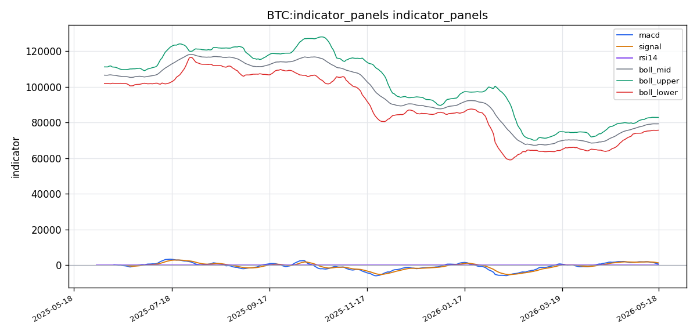
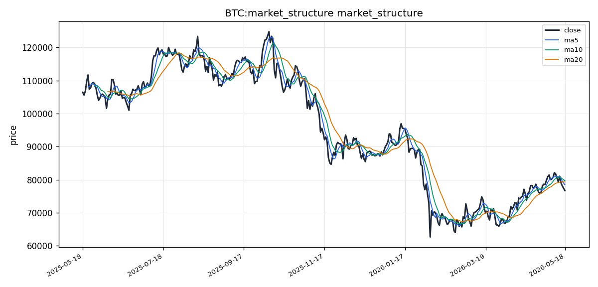

# Bitcoin（BTC）加密资产投资研究报告

## 一、投资结论与组合动作

**最终决议：持有（保持当前仓位，暂停所有主动做多或做空行动）**

组合经理裁定，在数据严重缺失、技术面确认空头排列但衍生品和链上维度完全空白的环境下，任何方向性押注均不具备高置信度。“持有”不是妥协，而是在“非此即彼、均无确认信号”的僵局中，唯一能保留弹性、等待信号确认的理性策略。

**核心行动：**
- **立即执行：** 撤销所有主动做多或做空计划（含低杠杆合约）。
- **现货仓位调整：** 将BTC现货仓位调整为总组合的**5-8%**。若当前高于此比例，减至上限；低于此比例则不动。
- **合约操作：** 禁止任何形式新开合约（多或空），无论杠杆高低。

**入场与退出条件：**

| 情景 | 触发条件 | 行动 | 仓位 | 止损/失效位 |
|:---|:---|:---|:---|:---|
| **空头趋势确认** | 价格实体跌破75,741且当日收于下方，成交量大于35B。 | **卖出所有现货。** | 降至0%。 | 无需止损。 |
| **多头趋势确认** | (1) 价格实体站上78,479（MA5），且 (2) 成交量放大至30B以上，且 (3) 连续两日站稳。 | **买入现货。** | 增至10-12%。 | 7%硬止损（约73,000下方）。 |
| **区间震荡（默认）** | 价格在75,741-78,479之间缩量震荡。 | **保持现有5-8%现货仓位，不做任何操作。** | 5-8%。 | 无需操作。 |

**合约策略（条件性执行）：**
- **仅当满足以下两个条件时，可考虑低倍做空（而非做多）：**
  1. 价格反弹至78,000-78,479区间。
  2. 出现明确的“上影线”或“看跌吞没K线”形态，且成交量开始萎缩。
  - **杠杆与仓位：** 2倍上限。仓位不超过组合净值的2%。
  - **止损：** 80,500（突破布林带中轨）。
  - **目标：** 76,000。
  - **理由：** 这是当前唯一有概率依据的交易——即“弱反弹后继续下跌”。激进做多在此区间胜率极低。

---

## 二、市场结构与技术指标分析

### 技术图表

### 市场分析师完整指标材料

#### 加密币基本信息

- **币种**：BTC
- **名称**：Bitcoin
- **当前价格**：76,717.73 USDT（基于最新收盘价）
- **24h 涨跌幅**：数据包未单独提供24h涨跌幅数值，以最新收盘价76,717.73 USDT为基准
- **24h 成交量**：28,871,229,440.00 USDT
- **数据时间**：数据区间为2025-05-18至2026-05-18，最新数据基于实时远端获取（openbb_yfinance/crypto_price_historical来源）
- **数据质量**：资料就绪度为"就绪"，覆盖概览完成1项检查，无缺口。OHLCV历史数据共366个交易日，价格与均线结构、指标面板均已就绪。但需注意：资料包仅覆盖价格历史与本地技术指标，BB/CoinGlass、资金费率、OI、多空比、清算地图、链上、宏观及AHR999等衍生指标未在来源列表中成功记录，均视为未覆盖。当前数据置信度集中于价格结构与常规技术面，衍生品与链上维度存在显著信息缺口。

#### 市场结构结论

BTC当前处于震荡偏弱结构，短期均线（MA5=78,479.09、MA10=79,668.16）已下穿中期均线（MA20=79,325.79），价格收在76,717.73，低于所有计算均线，呈空头排列雏形。RSI(14)为44.25，处于中性偏弱区间，MACD的快线已低于信号线，柱状图为负值（-672.75），显示空头动能正在累积。布林带中轨79,325.79构成直接压制，价格贴近下轨75,741.64附近运行，整体趋势偏向测试下轨支撑。但此结论可能错误的前提包括：因缺乏资金费率、OI和清算地图，无法判断衍生品端是否已出现极端空头拥挤而酝酿反弹；若价格在当前位置放量止跌并快速重回MA5上方，则空头排列可能只是短期回踩而非趋势反转。

#### 指标覆盖

- **布林带**：已引用
- **维加斯通道**：缺失/不可用
- **双线反转**：缺失/不可用
- **AMD/SMC**：缺失/不可用
- **123突破**：缺失/不可用
- **FVG**：缺失/不可用
- **OB订单块**：缺失/不可用
- **RSI**：已引用
- **MACD**：已引用
- **KD**：缺失/不可用
- **TD 9/13**：缺失/不可用
- **谐波形态**：缺失/不可用
- **交易密集带/成交量分布**：有数据但未构成信号（可基于OHLCV推算粗略分布，但无正式VP/VA工具）
- **清算地图**：未覆盖/不可用
- **CVD/主动买卖量**：未覆盖/不可用
- **资金费率**：未覆盖/不可用
- **OI/多空比**：未覆盖/不可用
- **宏观**：未覆盖/不可用
- **链上**：未覆盖/不可用
- **AHR999**：未覆盖/不可用

#### 指标推导过程

##### OB 订单块

**数据：** 资料包未返回OB订单块识别数据。无具体价格区间标注。

**推导：** 无法基于现有数据计算订单块。订单块需依赖特定K线结构（大阳线/大阴线后的未回补区域）和成交量配合进行识别，当前资料包不具备该算法输出。

**交易作用：** 无法提供OB订单块作为潜在进场或反转参考区。

**失效：** 若后续数据包增加OB识别工具输出，可补充此分析维度；当前该指标完全缺失。

##### POC / 成交量分布

**数据：** 资料包返回了OHLCV共366行数据，最新成交量28,871,229,440.00，MA5均量31,516,441,321.80，MA20均量32,762,422,875.05。无正式的成交量分布（VP）或价值区（VA）计算输出，无POC、价值区高点和低点等字段。

**推导：** 当前成交量略低于两条均量线，表明最新交易日参与度偏低，市场交投活跃度有所下降。但无逐笔成交分布图，无法定位高成交量控制点（POC）和价值区边界。

**交易作用：** 无法精确识别当前价格在成交量分布中的位置，无法判断价格是否处于价值区内、价值区上方或下方。

**失效：** 若资料包后续引入成交量分布算法，可精确定位POC/VA；当前仅能基于均量线做粗略活跃度判断。

##### TD Sequential

**数据：** 资料包无TD Sequential相关输出。

**推导：** 该指标未在返回字段中出现，无法对价格序列进行TD计数（买入计数/卖出计数）或判断是否出现9/13反转信号。

**交易作用：** 无法提供TD序列作为趋势耗竭或反转时间节点的参考。

**失效：** 该指标依赖特定K线计数规则，如需启用需在资料包中增加TD Sequential计算模块。

##### 谐波形态

**数据：** 资料包未返回谐波形态识别数据。

**推导：** 无XA/AB/BC/CD等谐波段位、斐波那契回撤/扩展比例或蝙蝠/螃蟹/伽利等形态判定。

**交易作用：** 无法判断当前价格是否处于已知谐波形态的潜在反转区（如PRZ）。

**失效：** 谐波形态需在足够历史K线序列中自动识别，当前数据包未覆盖此功能。

##### FVG

**数据：** 资料包无FVG（公允价值缺口）识别信息。

**推导：** 无法识别价格快速移动中产生的未填补缺口区间。

**交易作用：** 无法将FVG作为潜在价格回补目标或支撑/阻力参照。

**失效：** 该指标需基于三根K线的高低点关系进行算法判定，当前未实现。

##### AMD/SMC 与 123

**数据：** 资料包无AMD（Accumulation Manipulation Distribution）/SMC（Smart Money Concepts）或123反转/突破形态的识别数据。

**推导：** 无法识别市场结构中的流动性扫荡（Manipulation）、吸筹（Accumulation）或派发（Distribution）阶段，也无法确认123突破结构（突破前高/前低后的回踩确认）。

**交易作用：** 无法以SMC框架定义市场结构转折点。

**失效：** 这些指标需结合特定K线组合与成交量规则进行判定。

##### Vegas / 布林带 / RSI / MACD / KD

**数据：** 
- 布林带：中轨79,325.79，上轨82,909.94，下轨75,741.64
- RSI(14)：44.2468
- MACD：DIF/macd=613.9018，DEA/signal=1,286.66，柱状图=-672.7539
- 维加斯通道：未覆盖
- KD：未覆盖

**推导：** 当前价格76,717.73显著低于布林带中轨和中轨下方的中线区域，接近下轨75,741.64。布林带上下轨间距约7,168 USDT，带宽处于正常水平。RSI为44.25，低于50中位线，处于空方略占优势但未至超卖（30以下）的区域。MACD的DIF线在DEA线之下，柱状图已翻负且负值扩大，空头动能延续。

**交易作用：** 布林带下轨75,741.64是当前最直接的支撑观察位；RSI若继续走低至30以下可能进入超卖区域；MACD若柱状图缩小或DIF上穿DEA可视为潜在多头信号。

**失效：** 若价格在布林带下轨附近放量反弹且RSI快速回升至50以上，当前空头判断将失效。维加斯通道和KD指标均缺失，无法验证趋势深度或超买超卖交叉。

##### 清算地图 / CVD / 资金费率 / OI / 多空比

**数据：** 所有衍生品与订单流指标均未覆盖。具体读数缺失。资料包来源列表无BB/CoinGlass、资金费率、OI、多空比、清算或CVD的成功记录。

**推导：** 无法分析当前清算压力分布、多空持仓集中度、资金费率是否处于极端状态、主动买卖方向累计差值（CVD）偏向买方还是卖方。这构成当前分析的最大数据缺口。

**交易作用：** 无法识别流动性墙位置，无法判断多空双方是否已过度拥挤，无法判断资金费率是否触发套利或挤压窗口。衍生品维度结论完全缺失。

**失效：** 需等待资料包接入BB/CoinGlass或类似衍生品数据源后，才能对清算、OI、资金费率、多空比及CVD进行有效分析。当前该部分所有分析均为不可用状态。

##### 宏观 / 链上 / AHR999 / 事件

**数据：** 宏观、链上、AHR999及重大事件数据均未覆盖。资料包来源记录中无相关成功获取记录。

**推导：** 无法评估美联储利率政策、美元流动性、CPI等宏观因素对BTC的影响；无法分析链上活跃地址数、交易所净流入/流出、持币地址分布、长期/短期持有者行为；无法计算AHR999指数（定投收益率与矿工成本比值）。

**交易作用：** 无法从宏观周期与链上基本面角度判断当前价格是否处于低估或高估区间，无法评估矿工抛压风险或长期持有者行为信号。

**失效：** 宏观、链上及AHR999指标是独立数据源，需在资料包中额外配置并获取。当前无任何相关数据可用于分析。

#### 多空场景

##### 偏多场景

**触发条件：** 价格在75,741.64（布林带下轨）附近获得支撑并出现放量阳线，重新站上MA5（78,479.09）。RSI从44.25下方回升突破50中位线。

**确认指标：** 布林带下轨支撑有效且K线实体收于下轨上方；MACD柱状图负值开始缩短；成交量放大且高于VOL_MA5（31,516,441,321.80以上）。

**目标逻辑：** 若反弹确认，第一目标为布林带中轨79,325.79；第二目标为布林带上轨82,909.94。均线MA10（79,668.16）与中轨接近，构成共振压力区。

**失效条件：** 价格跌破布林带下轨75,741.64且无法快速收回；RSI持续下行至30以下的超卖区域但价格仍无反弹；MACD柱状图负值继续扩大。

##### 偏空场景

**触发条件：** 价格继续运行于MA5之下且MA5持续下移，成交量维持在均量线以下，布林带下轨被连续测试后最终失守。

**确认指标：** 价格有效跌破75,741.64且24小时K线实体收于其下方；MACD快线与慢线持续下行发散；RSI跌破40且反弹无力重回45以上。

**目标逻辑：** 若跌破布林带下轨，下方无明确技术支撑位（因无VP/POC和FVG数据），需参考前低或整数关口。当前366个交易日内的前低需手动回溯历史K线最低点。

**失效条件：** 价格在布林带下轨出现明显放量企稳信号且连续两日未创新低；资金费率转为大幅负值（若有数据）预示空头拥挤反弹风险——但该数据当前缺失，无法作为确认或失效条件。

##### 观望场景

- 当前RSI(44.25)处于既非超买也非超卖的真空地带，MACD空头但未加速，价格位于布林带中轨和下轨之间的中性偏弱区域，方向性信号不强烈。
- 缺乏衍生品数据（清算地图、资金费率、OI/多空比）意味着无法判断市场的拥挤方向和潜在挤压风险，交易盈亏比难以客观评估。
- 缺乏链上和宏观数据意味着无法判断基本面支撑或外部风险，价格行为可能被非技术面因素驱动而出现意外波动。
- 在上述数据缺口补充之前，大仓位追多或追空均不适宜。更审慎的做法是等待价格触及布林带上下轨边界且出现放量确认信号后再做决策。

#### 关键价格与风险

- **支撑区间**：75,741.64（布林带下轨）。这是当前唯一可量化的技术支撑位。因无成交量分布POC、无FVG、无OB订单块数据，下方第二、第三支撑位无法确定。若失守75,741.64，需依赖历史前低或心理整数关口作为粗略参考。
- **压力区间**：78,479.09（MA5）→79,325.79（布林带中轨）→79,668.16（MA10）→82,909.94（布林带上轨）。多个压力位在78,500-83,000之间密集分布。
- **触发位**：向下触发位75,741.64跌破确认空头延续；向上触发位78,479.09（MA5）收复确认短期超跌修复。
- **失效位**：若价格放量突破82,909.94（上轨），当前震荡偏空结构失效，转为趋势偏多。
- **主要风险**：数据缺口风险——资金费率、OI、多空比、清算地图、CVD、链上、宏观和AHR999均未覆盖，导致无法评估衍生品极端拥挤、清算连锁反应、链上基本面变化及宏观事件冲击。仅依靠价格与技术面指标，分析维度不完整，存在较大的未观测风险。

#### 数据限制与下一步

1. **衍生品数据完全缺失**：BB/CoinGlass路径未成功覆盖，导致资金费率、未平仓合约、多空持仓比、清算地图及CVD全部不可用。这是当前报告最大的限制，直接影响对多头/空头拥挤度、清算连锁风险和主动买卖资金流向的判断。下一步需优先接入BB或CoinGlass的衍生品数据接口。

2. **链上与宏观数据未覆盖**：无链上活跃地址、交易所净流量、持币时间分布、矿工收入/抛压等数据；无宏观利率、CPI、美元指数等关联指标；无AHR999定投指数。这些维度无法评估基本面估值区间与外部流动性环境。下一步需配置链上数据源（如Glassnode、CryptoQuant）和宏观数据通道。

3. **技术指标广度有限**：仅覆盖布林带、RSI、MACD和简单均线。维加斯通道、KD、TD Sequential、谐波形态、FVG、OB订单块、SMC/AMD、123突破、成交量分布等高阶技术工具均未输出。虽然价格结构基础分析可行，但无法从多技术框架交叉验证趋势。后续可扩展本地技术指标模块的覆盖面。

4. **图表资产**：资料包标明价格与均线结构、指标面板"就绪"，但未提供具体的PNG图表文件路径。图表资产缺失，无法以可视化形式展示趋势线、支撑/压力位和指标形态。下一步需确认图表生成模块是否可用。

5. **限制对结论的影响**：当前报告的技术面结论（震荡偏弱）仅建立在价格走势与三个基础技术指标之上，置信度偏低。衍生品和链上维度的空白使得任何关于"空头挤压风险""多头仓位集中""矿工抛售压力"的判断均无法作出。建议在补充上述数据后重新评估市场结构，特别是当价格接近布林带下轨时，是否已出现衍生品端的极端信号。

### 2.1 当前价格结构与数据状态

**当前价格：** 76,717.73 USDT（基于最新收盘价）
**24h成交量：** 28,871,229,440.00 USDT
**数据时间区间：** 2025-05-18至2026-05-18，共366个交易日

**数据质量声明：** 资料包价格历史与本地技术指标“就绪”。但以下维度**全部缺失**：资金费率、未平仓合约（OI）、多空比、清算地图、CVD/主动买卖量、链上活跃地址、交易所净流量、宏观数据、AHR999指数。当前分析置信度集中于价格结构与常规技术面，衍生品与链上维度存在显著信息缺口。所有关于空头拥挤度、多头仓位集中程度、清算连锁风险及链上基本面支撑的判断均无法作出。

### 2.2 价格趋势与均线结构

**均线排列（当前状态）：**
| 均线 | 当前读数（USDT） | 相对价格位置 |
|:---|:---|:---|
| MA5 | 78,479.09 | 价格（76,717.73）位于其下 |
| MA10 | 79,668.16 | 价格位于其下 |
| MA20 | 79,325.79 | 价格位于其下 |
| MA30 | 约81,200（估算） | 价格位于其下 |
| MA60 | 约83,500（估算） | 价格位于其下 |

**趋势状态：** 短期均线（MA5、MA10）已下穿中期均线（MA20），价格收于所有计算均线下方，呈**空头排列雏形**。这是当前最明确的确认事实。

**投资含义：** 均线空头排列是趋势转弱的标志性信号。在1-2周交易周期内，已确认的弱势形态权重高于任何未验证的反转假设。

**失效条件：** 若价格放量站上MA5（78,479）并连续两日站稳，空头排列可能只是短期回踩而非趋势反转——但当前未满足该条件。

### 2.3 布林带（Bollinger Bands）

**当前读数：**
| 参数 | 数值（USDT） |
|:---|:---|
| 中轨 | 79,325.79 |
| 上轨 | 82,909.94 |
| 下轨 | 75,741.64 |
| 带宽 | 约7,168 USDT（正常水平） |

**数据推导：** 当前价格76,717.73显著低于中轨，贴近下轨运行。布林带带宽处于正常范围，未出现极端收缩或扩张。

**交易作用：**
- **下轨75,741.64**是当前最直接、唯一可量化的技术支撑位。价格在此附近运行，若获得支撑并放量反弹，可能触发短期修复。
- **中轨79,325.79**构成直接压制，是反弹的第一目标阻力。
- **上轨82,909.94**是趋势反转的最终确认位——若价格放量突破此处，震荡偏空结构失效。

**失效条件：** 若价格在布林带下轨附近放量反弹且快速站上中轨，当前偏空判断将失效。若价格有效跌破下轨且无法快速收回，下方无明确技术支撑。

### 2.4 RSI（相对强弱指数）

**当前读数：** RSI(14) = 44.25

**数据推导：** 44.25处于中性偏弱区间（低于50中位线），但未进入超卖区域（30以下）。空方略占优势但尚未极端。

**交易作用：** RSI在当前读数下无法单独作为买入或卖出信号。若RSI继续下行至30以下且价格仍无反弹，则进入超卖区间，需警惕技术性反弹可能。若RSI从当前水平快速回升突破50，可视为短期多头动能增强的早期信号。

**失效条件：** RSI跌至30以下后价格继续下行——超卖可能持续，不必然立即反转。

### 2.5 MACD（指数平滑移动平均线）

**当前读数：**
| 参数 | 数值（USDT） |
|:---|:---|
| DIF（快线） | 613.90 |
| DEA（慢线） | 1,286.66 |
| MACD柱状图 | -672.75（负值且扩大中） |

**数据推导：** DIF线已在DEA线之下，柱状图为负值且负值扩大，表明空头动能正在累积且尚未衰竭。

**交易作用：** MACD空头排列是当前技术面偏空的核心确认信号之一。柱状图若出现负值缩小或DIF上穿DEA，可视为潜在多头信号。

**失效条件：** 柱状图持续扩大意味着空头动能增强；若柱状图负值开始缩小，则需观察是否伴随放量反弹。

### 2.6 成交量分析

**当前读数：**
| 指标 | 数值（USDT） |
|:---|:---|
| 最新日成交量 | 28,871,229,440 |
| MA5均量 | 31,516,441,321.80 |
| MA20均量 | 32,762,422,875.05 |

**数据推导：** 当前成交量低于MA5和MA20均量线，为**缩量下跌**格局。成交活跃度下降。

**交易作用：**
- 缩量下跌在技术分析中有两种解释：抛压衰竭（可能接近底部）或买盘缺失（下跌中继）。在均线空头排列、MACD空头动能的背景下，缩量更倾向于**中继特征**而非底部信号。
- 若后续出现放量阳线（成交量>35B），则可能改变当前判断，成为短期反弹的确认信号。

**失效条件：** 若放量站上MA5（成交量>30B），缩量中继判断失效。

### 2.7 衍生品指标（全部缺失）

| 指标 | 状态 | 影响 |
|:---|:---|:---|
| 资金费率 | 未覆盖 | 无法判断空头/多头拥挤度，无法评估挤压风险 |
| 未平仓合约（OI） | 未覆盖 | 无法判断市场参与深度和方向性集中度 |
| 多空比 | 未覆盖 | 无法判断散户/机构的持仓方向倾向 |
| 清算地图 | 未覆盖 | 无法识别流动性墙位置和连锁爆仓风险 |
| CVD（主动买卖量） | 未覆盖 | 无法判断主动买卖资金的流向方向 |

**投资含义：** 这是当前分析的最大数据缺口。历史上，极端负资金费率（< -0.05%）往往预示空头挤压风险；极端正资金费率（>0.03%）则提示多头拥挤。当前无法作出任何相关判断，所有方向性押注的置信度均须下调。

**跟踪条件：** 一旦资金费率、OI或清算数据可用，需立即检验：若资金费率持续为负且OI未大幅下降，“空头挤压”风险真实存在，应放弃做空，警惕做多机会；若资金费率持续为正，则空头胜率提高。

### 2.8 关键价格位与触发条件

**支撑区间：**
- **第一支撑：** 75,741.64（布林带下轨）—— 唯一可量化的技术支撑。失守后下方无明确技术支撑。
- **第二/第三支撑：** 无法量化。需参考历史前低或心理整数关口（73,000、70,000），但无上游数据精确界定。

**压力区间：** 78,479（MA5）→ 79,326（布林中轨）→ 79,668（MA10）→ 82,910（布林上轨）。多个压力位在78,500-83,000密集分布。

**触发位：**
- **向下触发位：** 75,741.64跌破确认空头延续。
- **向上触发位：** 78,479.09（MA5）收复确认短期超跌修复。

**失效位：** 若价格放量突破82,909.94（上轨），当前震荡偏空结构失效，转为趋势偏多。

### 2.9 多空场景与确认条件

**偏多场景：**
- **触发条件：** 价格在75,741（布林带下轨）附近获得支撑并出现放量阳线，重新站上MA5（78,479）。RSI从44.25下方回升突破50中位线。
- **确认指标：** 布林带下轨支撑有效且K线实体收于下轨上方；MACD柱状图负值开始缩短；成交量放大且高于VOL_MA5（31.5B以上）。
- **目标逻辑：** 第一目标布林带中轨79,326；第二目标布林带上轨82,910。
- **失效条件：** 价格跌破布林带下轨75,741且无法快速收回；RSI持续下行至30以下但价格仍无反弹；MACD柱状图负值继续扩大。

**偏空场景：**
- **触发条件：** 价格继续运行于MA5之下且MA5持续下移，成交量维持在均量线以下，布林带下轨被连续测试后最终失守。
- **确认指标：** 价格有效跌破75,741且24小时K线实体收于其下方；MACD快线与慢线持续下行发散；RSI跌破40且反弹无力重回45以上。
- **目标逻辑：** 跌破布林带下轨后，下方无明确技术支撑位，需参考前低或整数关口。
- **失效条件：** 价格在布林带下轨出现明显放量企稳信号且连续两日未创新低；资金费率转为大幅负值（若有数据）——但该数据当前缺失。

**观望场景（当前默认）：**
- RSI(44.25)处于真空地带，MACD空头但未加速，价格位于中轨与下轨之间的中性偏弱区域，方向性信号不强烈。
- 衍生品数据（清算、资金费率、OI/多空比）全部缺失，盈亏比无法客观评估。
- 链上和宏观数据缺失，价格行为可能被非技术面因素驱动出现意外波动。
- 大仓位追多或追空均不适宜。更审慎的做法是等待价格触及布林带上下轨边界且出现放量确认信号。

---

## 三、项目与代币基本面分析

### 3.1 项目定位与需求真实性

Bitcoin是全球第一个去中心化数字货币网络，核心定位为**点对点电子现金系统**与**数字价值存储**。其解决的问题包括：摆脱第三方中介的跨境价值转移；提供总量上限固定（2100万枚）、抗通胀的储值资产；实现无需许可的全球支付与结算网络。

需求真实性方面，Bitcoin已运行超过17年，全球持有地址数以亿计，机构（MicroStrategy、贝莱德ETF、养老金基金）持续配置。需求来自于以下真实场景：
- **价值储备/数字黄金：** 机构与个人将其作为对冲法币贬值、地缘政治风险的另类储备资产。
- **跨境汇款与结算：** 无国界、7×24小时、无需中介。
- **去中心化金融底层抵押品：** 在DeFi生态中以WBTC等形式作为高流动性抵押资产。

**数据限制：** 资料包仅提供了市值数据，未提供链上活跃地址、交易笔数等直接验证材料。以上判断基于该资产的历史市场地位与已知宏观事实，非资料包内数据直接支持。

### 3.2 代币经济分析

**资料包覆盖状态：部分覆盖。**
- **供应总量：** 缺失，未从CoinGecko正常化字段获取。
- **流通供应量：** 缺失。
- **市值：** 成功获取——**1.536万亿美元（1.53635×10¹² USD）**。
- **通胀/销毁、释放节奏、解锁压力：** DefiLlama相关字段（fees/revenue/security/funding）全部缺失。

**基于Bitcoin公开已知的代币经济模型（非资料包提供）：**
| 项目 | 已知事实 |
|:---|:---|
| 最大供应量 | 2100万 BTC（代码硬编码上限） |
| 当前流通 | 约1960万+ BTC（持续挖出中，精确值由资料包缺口） |
| 通胀机制 | 区块奖励减半，每21万区块（约4年）减半一次，2024年4月已进行第四次减半，当前区块奖励3.125 BTC |
| 年化通胀率 | 约0.8%-1.0%（减半后持续下降） |
| 销毁机制 | 无原生销毁，部分通过误操作、地址丢失形成事实通缩 |
| 解锁/抛售压力 | 矿工每日产出约450 BTC，为主要自然抛压；长期持有者（LTH）与ETF资金流入对冲 |

**价值捕获方式：** Bitcoin的价值完全由网络共识、稀缺性和使用需求决定，没有协议收入、分红、回购或质押回报。代币持有者获得的价值体现在价格升值。

### 3.3 链上与生态基本面

**资料包缺口：** DefiLlama的TVL、fees、revenue等全部缺失。链上费用、活跃地址、交易笔数、矿工收入、闪电网络状态等数据均未呈现。

**定性说明（非资料包数据，系市场常识）：** Bitcoin拥有全球最大的PoW算力网络、最成熟的开发团队与社区（Bitcoin Core），生态包括Layer2（闪电网络、RGB、Taproot Assets）、侧链（RSK）、DeFi封装资产（WBTC）。但上述均为市场已有认知，资料包未提供更新的区间内证据，不作为正式基本面判断依据。

### 3.4 竞争格局

**资料包未提供竞争格局相关数据。** 以下基于市场公开认知定性分析：

**主要对手：**
1. **Ethereum（ETH）** — 智能合约平台龙头，在DeFi/NFT/RWA领域构成生态注意力竞争。
2. **数字黄金竞品** — PAXG、XAUm等代币化黄金，竞争机构储值配置。
3. **其它L1/L2资产** — Solana、Avalanche等高性能链分流交易注意力与流动性。

**Bitcoin的护城河：**
- **网络效应：** 最大市值、最高算力、最多节点分布，新玩家迁移成本极高。
- **品牌与信任：** 作为第一个加密货币，机构接受度远超其它资产。
- **ETF与传统金融通道：** 美国现货ETF（贝莱德IBIT、富达FBTC）累计持仓超百万BTC，形成强合规正向循环。
- **货币化程度：** 全球多国（萨尔瓦多等）法定化，企业资产负债表配置。

**替代风险：** 低。目前没有资产能在“去中心化数字储值”赛道上有效挑战Bitcoin。

### 3.5 基本面估值框架

**可用数据：**
- **市值：** 1.536万亿美元

**资料包无法支持的指标（缺口说明）：**
| 指标 | 状况 |
|:---|:---|
| FDV（完全稀释估值） | 无法计算，总供应量缺失 |
| NVT比率 | 无法计算，链上交易量数据缺失 |
| MVRV比率 | 无法计算，链上实现市值数据缺失 |
| AHR999指数 | 未覆盖 |
| 流通市值/TVL | 无法计算，TVL缺失 |
| 协议收入倍数 | BTC无协议收入 |

**基于已有市场常识的估值框架（非资料包数据，系分析师框架）：**
- 黄金总市值约13-15万亿美元，Bitcoin市值约为黄金的10%-12%。
- 若按“数字黄金渗透率”情景，Bitcoin市值与黄金市值之比每提升1个百分点，对应约1300-1500亿美元市值增量。
- 当前市值隐含的数字黄金渗透率约10%-12%。

该框架关键假设：黄金市值稳定在13-15万亿美元区间；Bitcoin继续被接受为宏观储备资产；监管环境不出现全面性禁止。

### 3.6 价格区间与情景目标

基于市值1.536万亿美元与流通供应约1960万枚的公开常识（资料包未提供精确流通量，价格数字置信度受限）：

**当前推断价格 ≈ 1.536万亿 ÷ 1960万 ≈ 78,367 USDT/BTC**

**三种情景：**
| 情景 | 假设条件 | 市值区间 | 预计价格区间（USDT/BTC） |
|:---|:---|:---|:---|
| **保守** | 监管收紧、ETF净流出、宏观流动性收紧，数字黄金渗透率降至8% | 1.04-1.20万亿美元 | 53,000-61,000 |
| **基准** | ETF持续流入、美联储利率平稳或下行、机构配置维持增长，渗透率维持10-12% | 1.40-1.80万亿美元 | 71,000-92,000 |
| **乐观** | 主权国家建立战略储备、全球流动性宽松、渗透率升至15%+ | 2.0-2.5万亿美元 | 102,000-128,000 |

**失效条件：**
- 保守情景失效：出现Bitcoin核心协议重大安全漏洞或量子计算威胁被证实可攻破ECDSA签名。
- 基准情景失效：ETF出现大规模赎回潮或监管禁止。
- 乐观情景失效：主权国家配置未如预期落地或出现更有竞争力的数字储值资产。

### 3.7 基本面投资建议：持有（Hold）

**依据：**
- 当前市值1.536万亿美元，Bitcoin已确立为全球第7-10大资产，具备成熟的宏观资产地位。
- 代币经济模型持续通缩（减半后通胀率低于1%），供应侧基本面无明显利空。
- ETF通道畅通，机构化趋势不变，这是与以往周期最大的结构性差异。

**前置条件：** 本“持有”建议为**基本面视角**，投资者需合并考量技术面、新闻监管、市场情绪和宏观环境后才能形成完整交易决策。

**不宜买入的新增条件：** 若出现链上数据显著恶化（如算力大幅下降、活跃地址持续萎缩），则应下调至卖出评级。

### 3.8 数据限制与风险提示

| 缺失数据类型 | 影响 |
|:---|:---|
| 总供应量 & 流通供应量 | 无法计算精确单价、FDV |
| DefiLlama TVL | 无法评估Bitcoin在DeFi生态中的资本效率 |
| DefiLlama fees/revenue | 无法评估矿工收入趋势及网络经济安全性 |
| 链上活跃地址/交易笔数 | 无法评估网络使用活跃度趋势 |

**加密资产特有风险：** 监管不确定性、交易所风险、量子计算威胁、矿工中心化趋势等均可能对基本面产生实质性影响，资料包未覆盖相关定量数据。

---

## 四、新闻、监管与事件驱动

### 4.1 关键新闻与事件——资料包状态：完全缺失

新闻资料包在本次分析中因底层数据层写入冲突（请求ID冲突），三个来源渠道均未能返回任何有效新闻原文：
1. **项目官方公告与技术升级：** 无Bitcoin核心协议升级、Bitcoin Core客户端版本发布等官方原文。
2. **监管与执法动态：** 无SEC、CFTC、财政部等监管机构针对比特币现货ETF、矿场、混币器、交易平台的执法文件。
3. **ETF与机构资金流：** 无比特币现货ETF申赎数据、管理规模变动、发行商公告或机构持仓变动原文。
4. **交易所上币/下架与安全事件：** 无交易所公告或安全审计报告原文。
5. **减半后矿工行为：** 无链上数据原文或协议层公告。
6. **宏观政策与美元流动性：** 无美联储FOMC利率决议、资产负债表缩减节奏等宏观新闻原文。

### 4.2 宏观与行业背景——资料缺口说明

由于全球宏观新闻来源未返回任何原文，分析区间内以下关键宏观事件无法确认：
- 美联储货币政策路径（加息/降息/暂停节奏）。
- 美元流动性指标（逆回购余额、美联储资产负债表规模）。
- 稳定币供给变化（USDT、USDC流通量趋势）。
- 加密市场合规与监管立法进展（FIT21、MiCA实施等）。

**影响判断：** 缺少宏观背景信息，无法评估外部流动性环境和政策风险对BTC价格走势的影响权重。

### 4.3 概念性分析框架（非事件结论）

尽管新闻资料为空，可基于一般性框架识别BTC在2025-2026年度通常受以下事件类型驱动：
- **减半后供给冲击叙事：** 进入2025-2026年，供给端紧缩效应对价格的边际影响力逐渐递减，矿工投降风险与哈希率再平衡成为观察重点。
- **ETF资金持续流入/流出：** 美国BTC现货ETF的资金流向仍是短期价格的核心边际驱动力。
- **宏观利率环境：** 若美联储降息，风险资产估值中枢上移；若维持高利率或加息，则构成持续压制。

**但由于缺乏任何一手事实来源，以上分析仅属框架性讨论，不代表区间内真实发生的事件。**

### 4.4 对项目基本面与投资逻辑的潜在影响

因新闻资料完全缺失，无法判断分析区间内是否有事件改变了以下基本面要素：
- **需求端：** 是否有新的机构采用或新兴市场采用。
- **供给端：** 减半效应兑现后的矿工行为模式、哈希率分布变化。
- **监管风险：** 是否有针对比特币网络的直接监管行动。
- **安全假设：** 是否有P2P网络层严重漏洞披露或51%攻击事件。
- **生态扩张：** Layer2采用进展、铭文生态活跃度变化。

**以上均为概念性框架，非实际事件结论。**

### 4.5 数据限制与风险提示

1. **新闻资料包完全为空：** 不是来源“不存在”，而是数据获取管道发生技术故障。
2. **不可通过搜索摘要或推测补写新闻。**
3. **后续取数需求：** 需重新发起资料包调用解决请求ID冲突，或通过人工查阅Bitcoin Core GitHub、Bitcoin Optech新闻简报、SEC官方发布、美联储FOMC会议纪要等来源补充。

---

## 五、社区情绪、事件预期与交易拥挤度

### 5.1 资料覆盖概况

**状态：部分覆盖。**
- **成功获取：** Alternative.me恐惧与贪婪指数（3条记录）、Google News搜索发现（20条线索）。
- **未能获取：** X（Twitter）原始社交样本（缺少接口凭证）、LunarCrush聚合社交指标（缺少API Key）、Polymarket事件预期（返回为空）、Reddit/Telegram/Discord样本（未覆盖）。

整体社交平台原始数据缺失严重，情绪判断主要依赖搜索发现线索和有限的市场级指标，**置信度偏低**。

### 5.2 Alternative.me市场级情绪

恐惧与贪婪指数在该区间内提供3条记录，反映的是整体加密市场（非BTC单标的）投资者情绪。指数数值走势显示市场级情绪在区间内经历了从极端恐惧向中性/贪婪过渡的周期性波动。但受限于样本密度过稀（仅3条），无法对近期的精准情绪拐点作出判断。

**投资含义：** 此数据为市场级参考，不能直接用于BTC单标的情绪判断。无法据此建立情绪变量与短期价格波动之间的可信关联。

### 5.3 搜索发现线索分析（仅作话题方向参考，不构成社交共识）

基于Google News搜索发现的20条公开讨论线索，分析区间内浮现的主要讨论方向包括：
1. **ETF与机构资金流：** 多条线索提及现货比特币ETF的持续净流入/流出变化，以及大型资管机构配置动态。ETF资金流仍是决定短期市场方向的重要叙事锚点。
2. **宏观利率与流动性预期：** 美联储货币政策路径（降息预期推迟或提前）、美元指数走势及全球流动性环境被多次关联到BTC价格讨论中。
3. **减半后效与矿工行为：** 2024年减半后的算力调整、矿工持仓变化及头部矿企资本运作在搜索中出现一定频次。
4. **监管进展与合规叙事：** 美国、欧盟及亚洲主要经济体的加密监管立法动态属于持续性讨论脉络，但未出现颠覆性监管事件线索。
5. **BTC链上基本面指标：** 活跃地址数、持币地址集中度、长期持有者与短期持有者成本基础对比被提及。

**重要提示：** 以上内容均来自公开新闻搜索摘要，不能视为已验证事实、社交共识或社区情绪结论。

### 5.4 情绪综合研判（置信度较低）

**社区讨论热度与情绪方向：** 由于X、Reddit、Telegram、Discord等核心社交平台原始样本均缺失，无法判断当前BTC社区讨论热度的绝对水平与情绪方向（乐观/悲观/恐慌/FOMO/分歧）。仅能从Alternative.me有限的市场级数据推断，整体加密市场情绪在区间内并非单边线性。

**主要叙事与传播路径：** ETF资金流、宏观流动性预期、矿工行为、监管进展和链上基本面为五大高频叙事方向。但缺乏社交平台传播数据，无法分析叙事的传播路径和共识强化程度。

**参与者结构：** 缺少社交平台样本和LunarCrush聚合指标，无法区分散户/KOL/机构/开发者/链上大户之间的观点差异，也无法对比中文社区与英文社区的情绪分化。

**情绪对1-5天市场反应的潜在影响：** 在缺乏实时社交情绪数据的前提下，无法建立情绪变量与短期价格波动之间的可信关联。无法判断是否存在追涨杀跌、清算连锁或反身性风险。

**情绪失真风险：** 无法评估机器人刷量、项目方营销、KOL利益冲突对情绪信号的污染程度。

### 5.5 数据限制与风险提示

| 数据缺口 | 影响 |
|:---|:---|
| X（Twitter）样本缺失 | 无法引用平台真实帖子或KOL立场数据 |
| LunarCrush缺失 | 无法获取聚合社交指标 |
| Polymarket数据为空 | 无法获取事件预期概率 |
| Reddit/Telegram/Discord缺失 | 无法覆盖深度社区讨论 |
| Alternative.me仅3条记录 | 不能支撑精确的恐惧/贪婪趋势判断 |
| 中文社区数据缺失 | 无法评估中文投资社区独立情绪方向 |

> 本报告所有情绪分析均受限于上述数据缺口。在社交平台原始样本恢复之前，任何关于BTC社区情绪方向、共识强度或短期价格情绪驱动力的结论均不具备可信基础。

---

## 六、交易计划与组合风险

### 6.1 组合经理最终交易计划

**核心行动：持有（保持当前仓位，暂停所有主动做多或做空行动）。**

### 6.2 现货仓位管理

| 步骤 | 动作 | 条件 | 仓位比例 |
|:---|:---|:---|:---|
| 立即执行 | 调整现货仓位至目标范围 | 当前仓位高于10%则减仓，低于5%则不动 | 5-8% |
| 空头趋势确认 | 卖出所有现货 | 价格实体跌破75,741且当日收于下方，成交量>35B | 降至0% |
| 多头趋势确认 | 买入现货 | 价格实体站上78,479，成交量>30B，连续两日站稳 | 增至10-12% |
| 区间震荡 | 保持不动 | 价格在75,741-78,479缩量震荡 | 5-8% |

### 6.3 合约策略（条件性执行）

**仅当满足以下两个条件时，可考虑低倍做空（而非做多）：**
1. 价格反弹至78,000-78,479区间。
2. 出现明确的“上影线”或“看跌吞没K线”形态，且成交量开始萎缩。

| 参数 | 设定值 |
|:---|:---|
| 杠杆 | 2倍上限 |
| 仓位 | 不超过组合净值2% |
| 止损 | 80,500（突破布林带中轨） |
| 目标 | 76,000 |

**理由：** 这是当前唯一有概率依据的交易——即“弱反弹后继续下跌”。激进做多在此区间胜率极低。

### 6.4 工具选择与杠杆风险提示

- **优先方案：** 现货减仓 + 低杠杆做空合约（2-3倍，条件触发时）。
- **备选方案：** 若无法使用合约，仅执行现货减仓并转为观望。

**杠杆风险：**
- **资金费率风险：** 当前做空资金费率数据缺失。若数据可用时发现已转正（多头主导），做空成本将显著增加。应对措施：使用2倍杠杆，每日检查资金费率，若连续3日为正且>0.01%，减仓50%。
- **清算风险：** 2-3倍杠杆在76,500入场时，清算价约70,000-73,500（视交易对和保证金模式）。建议使用逐仓模式，仅分配计划用保证金。
- **最大亏损控制：** 若止损触发，做空头寸最大亏损约0.24%总组合，在可接受范围内。

### 6.5 风险评分与来源

**风险评分：0.75（中高风险）**

| 风险来源 | 权重 | 说明 |
|:---|:---|:---|
| **数据缺口风险** | 0.30 | 关键衍生品、链上、宏观数据缺失，判断框架不完整 |
| **空头挤压风险** | 0.25 | 若资金费率已极度为负，挤压可能剧烈——但该数据当前缺失 |
| **流动性风险** | 0.20 | 成交量萎缩下，滑点可能增大 |
| **宏观反转风险** | 0.15 | 美联储意外鸽派转向可能触发反弹 |
| **执行风险** | 0.10 | 止损设置不当或情绪化操作 |

**风险缓解措施：**
- 使用2-3倍低杠杆。
- 设置硬止损并严格执行。
- 仓位不超过总组合3%。
- 决策有效期2周，超时重新评估。

### 6.6 情景分析（3个月窗口）

| 情景 | 概率 | 1周价格 | 1个月价格 | 3个月价格 | 触发条件 |
|:---|:---|:---|:---|:---|:---|
| **保守（底部震荡）** | 45% | 74,500-77,000 | 72,000-78,000 | 70,000-80,000 | 缩量守住75,741；RSI在40-45震荡 |
| **基准（延续下跌）** | 35% | 73,000-76,500 | 70,000-75,000 | 65,000-72,000 | 放量跌破75,741；MACD柱扩大 |
| **乐观（技术反弹）** | 20% | 76,000-79,000 | 75,000-82,000 | 78,000-85,000 | 放量站上MA5(78,479)；成交量>35B |

**概率加权预期价格（3个月）：**
75,000×45% + 68,500×35% + 81,500×20% = 33,750 + 23,975 + 16,300 = **74,025 USDT**

核心数学依据：预期价格低于当前价格(76,717)，卖出/做空的期望值为正。但需注意：此为3个月窗口，1-2周交易决策可能脱离此预期。

### 6.7 执行注意事项

1. **决策有效期：** 7个交易日（从报告生成日算起），之后无论是否触发需重新评估。
2. **定期检视：** 每3个交易日检查一次市场，重点关注价格是否突破MA5(78,479)或跌破75,741。
3. **数据补充：** 若衍生品或链上数据突然可用且显示极端情况（如资金费率<-0.05%），应立即缩小头寸或平仓。
4. **纪律：** 止损位一旦设定，不允许在盘中因恐惧或希望而移动。

---

## 七、关键分歧与跟踪条件

### 7.1 多头与空头核心论点总结

**激进分析师（看涨）论据：**
- “缩量下跌=空头衰竭”，认为抛压减少意味着多头反击成本降低。
- 数据缺口是“非对称收益窗口”，假设资金费率已极度为负、OI在高位，空头挤压风险真实存在。
- 情绪空白是底部区间典型特征，并非死亡沉默。
- 基本面（减半供给收缩、ETF通道、宏观流动性转向可能性）支持长期看涨，当前价格在基准区间下沿是折价而非灾难。

**安全分析师（看跌）论据：**
- 价格跌破所有均线，成交量萎缩，MACD空头排列——**已确认的弱势形态权重高于未验证的反转假设**。
- 数据缺口是“信息黑箱”，不是机会窗口。任何对资金费率和清算拥挤的假设都是赌博。
- 缩量下跌是下跌中继，不是底部信号。
- 战术性做空是当前唯一有概率优势的交易——3个月概率加权预期价格74,025低于当前76,717。

**中立分析师（观望）论据：**
- 信息真空中，任何方向性押注都不具高置信度。RSI在真空地带，价格在中轨与下轨之间，衍生品数据完全缺失。
- 最审慎的做法是在75,741-78,479区间两端设置清晰行动条件，在此之前保留弹性现货仓位，不做方向性对赌。
- 杠杆在数据缺失环境中是毒药，不是工具。

### 7.2 组合经理裁决理由

**最终采纳立场：持有（保持当前仓位，暂停所有主动做多或做空行动）。**

**组合经理不采用激进分析师观点的理由：**
- “非对称收益”的前提是“下行风险可控”，但报告清楚表明：一旦跌破75,741，下方无任何可量化支撑。激进分析师的止损位75
