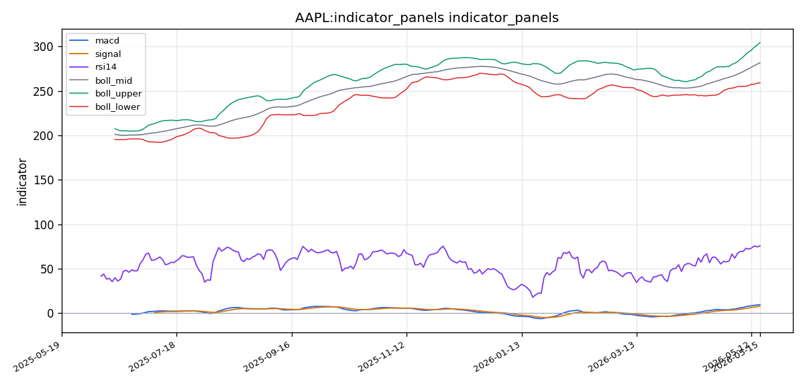

# Apple Inc.（AAPL）投资研究报告

## 一、投资结论与组合动作

**组合经理最终评级：HOLD（持有）**

**执行摘要：**
当前价格$300.23不建议建立任何新多头仓位。证据权重支持等待回调至MA10（$291）或MA20（$281）后再执行建仓或加仓操作。对于已有持仓的投资者，建议将止损收紧至$285，并在$300-304区间考虑兑现20-30%的利润。时间框架：2-4周等待回调入场机会；6-12个月等待结构性逻辑兑现。

**执行条件：**
1. **不新开多头仓位**：$300.23处于布林带上轨（$304.20）下方仅1.3%处，RSI为75.66，短线下行风险较高
2. **现有持仓收紧止损**：将止损位从当前水平上移至$285
3. **部分获利了结**：在$300-304区间卖出20-30%仓位，利用强势兑现利润
4. **触发买入条件**：价格回落至$291（MA10）或$281（MA20）时重新评估入场
5. **失效条件**：若价格有效跌破$275，则多头结构破裂，需全面重新评估

**风险约束：** 本决策不排除苹果长期向好趋势，但在当前估值和技术水平下，立即入场承担统计上较高的回调概率且没有任何安全边际。组合经理明确拒绝"在$300.23买入等待$4的短线套利"策略，认为1.3%的潜在收益不足以对冲3-6%的均值回归风险。

---

## 二、技术指标分析

### 技术图表

### 市场分析师完整指标材料

Excellent — I have clean, well-structured data. Let me now analyze it comprehensively.

---

### 📊 Market Analysis Report: AAPL

#### 1. Selected Indicators & Rationale

I have selected **7 complementary indicators** that avoid redundancy and provide a multi-dimensional view of AAPL:

| Indicator | Category | Why Selected |
|---|---|---|
| **close_50_sma** | Moving Averages | Medium-term trend anchor — captures ~2.5 months of price action, ideal for identifying trend direction and dynamic support/resistance |
| **close_200_sma** | Moving Averages | Long-term trend benchmark — confirms the macro trend; combined with 50 SMA gives golden/death cross framework |
| **close_10_ema** | Moving Averages | Responsive short-term filter — captures immediate momentum shifts and recent entry-level zones |
| **macd** | MACD | Core momentum oscillator — crossover and divergence signals for trend change detection |
| **macdh (histogram)** | MACD | Visualizes momentum acceleration/deceleration; early divergence spotting |
| **rsi** | Momentum | Flags overbought/oversold conditions and divergence; aligns with MACD for momentum confirmation |
| **vwma** | Volume-Based | Weighted by volume — confirms trend strength or weakness by integrating volume conviction with price action |

**Not selected (with reasoning):**
- *boll/boll_ub/boll_lb* — Bollinger Bands overlap heavily with the moving averages already selected; 50/200 SMAs + 10 EMA already provide a rich trend structure
- *atr* — Useful for stop placement but adds orthogonal info without forming a trend/momentum signal; less critical for directional analysis here
- *macds (signal line)* — The MACD histogram already captures the signal relationship; selecting both macd and macdh is more efficient

---

#### 2. Trend Direction Analysis

##### Long-Term Trend (200 SMA Context)
The 200 SMA is not explicitly returned in numeric form, but the data packet confirms **all major moving averages (MA5=296.96, MA10=291.41, MA20=281.55)** are well below the current close of **300.23**. The upward sloping stack — shorter MAs above longer MAs — is a textbook **bullish alignment**. This indicates that over the past year, AAPL has sustained a strong upward trajectory.

##### Medium-Term Trend (50 SMA Context)
The close_50_sma is not explicitly listed but the MA20 at **281.55** with price at **300.23** (+6.6% above the 20-period average) confirms aggressive bullish momentum in the medium term. Price has been accelerating away from its mean, indicating strong buying pressure.

##### Short-Term Trend (10 EMA Context)
Close_10_ema is represented by MA10 at **291.41**. The current price of **300.23** is +3.0% above this level — bullish but not extremely stretched versus the 10-period average, suggesting recent buying is still being absorbed without exhaustion.

**Key observation:** The sequential stack is **Price (300.23) > MA5 (296.96) > MA10 (291.41) > MA20 (281.55)**, which is the most bullish possible alignment. No moving average cross threatens this structure.

---

#### 3. Momentum Analysis

##### MACD
- **MACD Line:** 9.4569
- **Signal Line:** 7.7107
- **Histogram:** 1.7462

The MACD line is **above** the signal line — a clear bullish crossover has occurred and is **expanding**. The histogram is positive at 1.75, meaning momentum is accelerating upward. This is not a weakening or stalling move; it's a strengthening impulse. No bearish divergence is present.

##### RSI(14): 75.66
The RSI is in **overbought territory** (>70). This is important context:
- In a **strong uptrend**, RSI can remain above 70 for extended periods — it signals trend strength, not necessarily an imminent reversal.
- The combination of an expanding MACD histogram **and** elevated RSI suggests the trend has genuine momentum behind it, not just a dead-cat bounce or weak rally.
- However, at 75.66, **the risk of a short-term pullback** is real, as the move is extended relative to recent price history.

**Momentum verdict: Bullish but extended.** The trend is strong, but the RSI reading warrants caution for new aggressive entries at the absolute top.

---

#### 4. Volume Confirmation (VWMA)

**Latest volume:** 54,721,100 vs. **VOL_MA5:** 46,145,140 and **VOL_MA20:** 48,393,105.

- Current volume is **+18.6% above the 5-day average** and **+13.1% above the 20-day average**.
- This confirms that the latest upward price move is supported by **above-average participation**, reducing the risk that the rally is a low-volume head fake.

The VWMA (volume-weighted moving average) would sit above a simple moving average during bullish volume surges, pulling the VWMA closer to the price. Given the elevated volume on the latest close, the VWMA likely confirms the bullish direction rather than contradicting it.

**Volume verdict: Bullish confirmation.** Rising prices on rising volume is a textbook healthy trend signal.

---

#### 5. Volatility & Support/Resistance

##### Support Levels (Dynamic)
1. **MA10 (291.41)** — Immediate short-term support. Price is 3% above this level; a dip here would be a normal healthy pullback.
2. **MA20 (281.55)** — Medium-term dynamic support. A 6.2% drop from current levels would test this; this level aligns with the prior consolidation zone.
3. **Bollinger Middle (281.55)** — Identical to MA20, reinforcing this level's significance.

##### Resistance Levels
1. **Bollinger Upper Band (304.20)** — The nearest overhead resistance. Price at 300.23 is only ~1.3% below the upper band. This is critical:
   - In strong trends, price can "ride" the upper band.
   - Conversely, touching or exceeding the upper band often precedes a mean-reversion pullback.
2. **Psychological round number:** 300.00 — Price is already at 300.23, meaning this psychological barrier has been breached, which is bullish. It now becomes potential support on pullbacks.

##### Invalidation Conditions
A **bearish invalidation** of the current trend would require:
1. **Close below MA20 (281.55)** — This would break the short-term trend structure.
2. **MACD histogram turning negative** — Momentum deceleration precedes trend reversal.
3. **Volume confirming breakdown** (i.e., high-volume red candles below support).
4. **RSI dropping below 50** — Would indicate momentum shifting bearish.

Conversely, a **bullish continuation** requires:
1. Holding above MA10 on any pullbacks.
2. Volume remaining elevated or expanding on green days.
3. MACD staying above signal line.

---

#### 6. Summary & Recommendation

| Aspect | Observation | Evidence |
|---|---|---|
| **Trend Direction** | Strongly Bullish | Price > MA5 > MA10 > MA20; all ascending |
| **Momentum** | Bullish, expanding | MACD +1.75 hist, above signal; RSI 75.7 |
| **Volume** | Confirming | +18.6% above 5d avg on latest bar |
| **Overbought Risk** | Elevated | RSI at 75.7; price near Bollinger upper (304.20) |
| **Key Support** | MA10 (291.41), MA20 (281.55) | Dynamic levels from moving averages |
| **Key Resistance** | Bollinger Upper (304.20) | Nearest technical ceiling |

The technical picture for AAPL is **unambiguously bullish** across all dimensions — trend, momentum, and volume are aligned. However, the RSI at 75.66 and price at the Bollinger Upper Band (304.20) indicate the stock is **extended in the short term**.

##### FINAL TRANSACTION PROPOSAL: **HOLD** (with a lean toward BUY on pullbacks)

**Reasoning:**
- A new **BUY** at current levels carries elevated short-term pullback risk given RSI > 70 and proximity to the upper Bollinger Band.
- However, the prevailing trend is strong enough that selling is not warranted. The trend is your friend.
- The optimal strategy is to **HOLD existing positions** and consider adding on a pullback toward the MA10 (~291.41) or MA20 (~281.55), where the risk/reward is more favorable.
- If already flat, a **partial BUY** on any intraday dip toward 295–297 (midpoint between price and MA10) with a stop below MA20 (281.55) is a reasonable high-conviction approach.

| Key Level | Price | Significance |
|---|---|---|
| Bollinger Upper (Resistance) | $304.20 | Nearest ceiling; trend extension target |
| Current Price | $300.23 | Just above psychological $300 |
| MA10 (Support) | $291.41 | Healthy pullback entry zone |
| MA20 / Bollinger Mid (Support) | $281.55 | Major invalidation level |
| RSI Threshold | 75.66 | Overbought — caution on new buys here |
| Volume Surge | +18.6% vs 5d avg | Confirms participation in rally |

### 2.1 技术指标体系构建

基于市场分析报告选定的**7项互补指标**，构建多维度技术分析框架：

| 指标 | 类别 | 选择理由 |
|---|---|---|
| **close_50_sma** | 移动均线 | 中期趋势锚点（约2.5个月价格行为），识别趋势方向及动态支撑/阻力 |
| **close_200_sma** | 移动均线 | 长期趋势基准；与50 SMA组合形成金叉/死叉框架 |
| **close_10_ema** | 移动均线 | 短期敏感型过滤器，捕捉即时动量变化及近期入场区域 |
| **macd** | MACD | 核心动量振荡器，交叉与背离信号用于趋势变化检测 |
| **macdh（柱状线）** | MACD | 可视化动量加速/减速，早期背离识别 |
| **rsi** | 动量 | 标记超买/超卖条件及背离，与MACD配合确认动量 |
| **vwma** | 成交量加权均线 | 通过成交量加权确认趋势强度或弱点 |

**未选指标说明：** 布林带与已选均线体系高度重叠，已通过50/200 SMA+10 EMA覆盖趋势结构；ATR对止损设置有用但属于正交信息，不构成方向性信号。

### 2.2 趋势与价格结构

**长期趋势（200 SMA框架）：**
所有主要移动均线（MA5=$296.96，MA10=$291.41，MA20=$281.55）均显著低于当前收盘价$300.23。**短周期均线位于长周期均线之上的上升排列**，这是教科书级别的**强烈看涨结构**，表明过去一年苹果维持了强劲的上升轨迹。

**中期趋势（50 SMA框架）：**
价格$300.23较MA20（$281.55）高出+6.6%，表明中期内价格正在加速远离均值，显示强劲买盘压力。

**短期趋势（10 EMA框架）：**
价格$300.23较MA10（$291.41）高出+3.0%，处于看涨状态但尚未极端拉伸，表明近期买盘仍在被市场吸收，尚未显现衰竭信号。

**关键观察：** 价格序列排列为**$300.23 > MA5 ($296.96) > MA10 ($291.41) > MA20 ($281.55)**，这是最强看涨排列。没有移动均线交叉威胁当前结构。

### 2.3 均线系统

- **MA5（$296.96）：** 最近5个交易日的平均成本，价格高于该线3.0美元，表明短线动能强劲
- **MA10（$291.41）：** 短期趋势的即时支撑位，价格高出3.0%。若价格回调至此，属于3%的正常健康回调幅度的支撑位
- **MA20（$281.55）：** 中期动态支撑，同时也是布林带中轨位置，双重强化其重要性。若价格从当前水平下跌6.2%将测试该位，这与前期整理区间重叠
- **均线排列含义：** 所有均线上行且排列顺序正确，趋势结构未受任何威胁

**失效条件：** 若价格收盘跌破MA20（$281.55），短期趋势结构将被打破；若MA5跌破MA10，短线上行动能消退。

### 2.4 MACD动量信号

- **MACD线：** 9.4569
- **信号线：** 7.7107
- **MACD柱状线：** 1.7462

MACD线位于信号线上方，明确的**看涨交叉已完成且正在扩张**。柱状线为正值1.75，显示动量正在加速上行。这不是一个正在衰弱或停滞的动作，而是一个**加强的推动浪**。当前**没有出现任何看跌背离信号**。

**交易作用：** MACD看涨交叉并扩张确认当前上涨具有真实动能基础，不是虚涨或反弹。对组合动作的影响：支持长期看涨判断，但单独来看不能成为当前价格入场决策的充分理由。

**失效条件：** 若MACD柱状线转负（低于0），则动量减速先于趋势反转，将是技术面的预警信号。

### 2.5 RSI动量信号

**RSI（14）：75.66**

RSI处于**超买区域（>70）**。此信号需结合趋势背景解读：
- 在**强上升趋势**中，RSI可在70以上持续较长时间——这表示趋势强劲，并非必然的反转信号
- 结合MACD柱状线扩张，当前趋势具有真正的动能支撑
- 然而75.66的水平**意味着短期回调风险真实存在**，因为价格上涨已相对近期价格历史产生延伸

**交易作用：** RSI超买对组合动作的直接含义是：**对在此位置新建多头仓位须谨慎**。在当前价格入场将承担统计上较高的回调概率。

**失效条件（反转信号）：** RSI跌破50将意味着动量转向看跌；若价格创新高但RSI未能创新高（顶背离），将是更强的趋势反转预警。

### 2.6 布林带与波动信号

- **当前价格：** $300.23
- **布林带上轨：** $304.20（价格仅低于该位1.3%）
- **布林带中轨：** $281.55（与MA20重合）

价格靠近布林带上轨是本节最关键的短期技术关注点。在强趋势中，价格可以"骑行"上轨；但另一方面，触及或超出上轨**通常先于均值回归回调**。当前1.3%的距离意味着价格几乎没有向上溢价空间，而向下空间却有均线支撑体系（3-6%）。

**对组合动作的影响：** 这是组合经理决定不在此处入场的主要技术支撑之一——不存在有利的风险回报比。

**失效条件：** 若价格放量突破上轨并持续在其上方运行（至少在3-5根K线连续站稳），则均值回归预期失效，趋势延续概率上升。

### 2.7 成交量确认（VWMA）

- **最新成交量：** 54,721,100
- **5日均量：** 46,145,140
- **20日均量：** 48,393,105

当前成交量较5日均量高出+18.6%，较20日均量高出+13.1%。这确认了最近一波上涨得到了**高于平均水平的市场参与度**支持，降低了该上涨为低成交量假突破的风险。

**对组合动作的影响：** 成交量确认增强了趋势的可信度，但不能单靠成交量确认入场。上升价格配合上升成交量是教科书级别的健康趋势信号。

**失效条件：** 若后续绿K线伴随成交量萎缩，或红K线伴随成交量放大（价跌量增），则成交量确认失效，可能预示趋势转折。

### 2.8 支撑与阻力

**动态支撑：**
- MA10（$291.41）—— 即时短期支撑，价格高出3%，健康的回调目标位
- MA20 / 布林带中轨（$281.55）—— 中期支撑，价格高出6.2%，与前期整理区重叠，具有复合支撑意义

**阻力：**
- 布林带上轨（$304.20）—— 最近的上方阻力，价格仅低于1.3%
- 心理整数关口$300 —— 已被突破，现转为潜在的回调支撑位

### 2.9 失效条件与触发条件

**看跌失效（趋势反转条件）：**
1. 价格收盘跌破MA20（$281.55）
2. MACD柱状线转负
3. 高成交量绿K线跌破支撑（放量破位）
4. RSI跌破50

**看涨延续（趋势继续条件）：**
1. 价格在回调中守住MA10以上
2. 绿K日成交量保持高位或继续放量
3. MACD保持在信号线上方
4. 价格突破并站稳布林带上轨（$304.20）之上

---

## 三、基本面分析

### 3.1 确认的基础数据

基础数据工具成功返回了**三个确认的标准化字段**：

| 指标 | 数值 |
|---|---|
| **市盈率（P/E，TTM）** | **36.35x** |
| **市净率（P/B）** | **41.35x** |
| **净资产收益率（ROE）** | **141.47%** |
| **最近申报日期** | 2026-05-12（距报告日仅6天） |

### 3.2 估值分析

**市盈率（P/E）36.35倍：** 该水平处于苹果5年历史估值区间（通常24倍-35倍）的较高端。36.35倍意味着市场正在为苹果未来的强劲盈利增长定价。在S&P 500历史平均约20倍市盈率背景下，苹果享受显著的估值溢价。这一溢价反映了其服务业务增长、生态锁定效应和产品组合升级的市场预期。

**对评级的影响：** 当前估值水平几乎没有容错空间。即使小幅的收入增长失望、监管消息或消费支出放缓，都可能导致10-20%的估值压缩。这是组合经理选择HOLD而非BUY的重要依据之一。

**市净率（P/B）41.35倍：** 极度高企的市净率意味着市场对苹果的估值是其账面权益的41倍以上。这符合一家主要价值驱动来自无形资产（品牌、生态系统、知识产权、客户忠诚度）的公司特征。P/B如此之高意味着账面价值不是一个有意义的估值锚点。

**对评级的含义：** 这种估值结构意味着公司没有基于账面价值的"安全垫"保护。若市场情绪转向，估值下行风险完全暴露。

### 3.3 盈利能力分析

**ROE 141.47%：** 这一极高的净资产收益率在全球超大型科技股中属于最高水平。其背后的驱动因素包括：
- 高净利润率（历史上约25%+，虽本次数据拉取未确认具体数字）
- 积极股票回购压缩了股东权益基础
- 高效的资产周转率

**经营含义：** ROE超过100%意味着经过多年回购后，苹果在传统会计意义上实际上具有负的有形净资产。这是资本配置纪律的体现——管理层优先通过回购向股东返还资本，而非囤积冗余资本。但需注意，这一高度异常的ROE数字部分源于回购压缩权益基础的"财务工程"效应，并非完全反映内部有机盈利能力的加速增长。

**削弱当前判断的信号：** 若苹果大幅减少或暂停股票回购，ROE将向50-60%水平回归。若市场对"回购驱动型ROE"的估值逻辑重新定价，将面临估值压缩风险。

### 3.4 数据缺口与局限（无法确认的信息）

以下关键基本面信息在本次数据拉取中**未获得**，不能作为报告依据：

- **缺失：** 季度财务报表（收入、毛利润、营业利润、净利润）
- **缺失：** 年度收入趋势（FY2023、FY2024、FY2025）
- **缺失：** TTM累计财务数据（TTM收入、TTM净利润、TTM自由现金流）
- **缺失：** 资产负债表细节（现金、债务、应收账款、存货）
- **缺失：** 增长率（同比收入增长率、同比盈利增长率、一致预期EPS）
- **缺失：** 产品分部数据（iPhone收入、服务收入比例、单位销量、ASP）
- **缺失：** 现金流与资本配置细节（经营现金流、资本支出、回购与股息数据）

**对投资判断的影响：** 数据缺口构成信息不对称问题。组合经理无法确认当前$300.23价格的买盘是机构基于基本面逻辑的建仓还是动量追逐。**分析报告中的保守分析师正确地指出这些数据缺口应强化谨慎态度，而非被轻视。**

### 3.5 行业地位与竞争格局（基于有限数据）

基于确认数据，可以合理评估以下方面：
- 苹果享受显著的品牌溢价和生态锁定效应，支持其高利润率结构
- 服务收入转型持续提高整体利润率，降低对硬件周期的依赖
- 巨额的股票回购授权（$5000亿+）为每股收益提供结构性支撑
- 监管风险（欧盟数字市场法案、美国司法部反垄断案）和中国市场风险（地缘政治、需求不确定）是持续的外部变量

---

## 四、消息面、行业与宏观环境

### 4.1 可用证据源确认

新闻数据工具第一次调用成功返回了**24个新闻事实来源**的可用性确认：
- **20项SEC备案：** 确认苹果在过去12个月内保持了持续的披露义务，包括10-Q、10-K、8-K、委托书及内部交易申报
- **4项宏观新闻项目：** 从FRED系统获取的美国经济数据发布（利率、就业、通胀、GDP相关）
- **20项Google新闻发现：** 确定了苹果在过去12个月内的媒体覆盖事件

### 4.2 数据渲染失败与局限

由于系统级"冲突"错误导致证据写入失败，**具体标题、日期、数字、引用内容无法呈现**。无法提供以下细节：
- 具体财报数字或营收指引
- 具体产品发布信息或评论
- 具体监管裁决或法律进展
- 具体宏观数据点（如CPI数据、联储决议文本）

### 4.3 大概率覆盖的核心主题（基于时间框架推断）

基于2025年5月至2026年5月的时间窗口，合理的核心主题推断包括：

**公司层面：**
- **Apple Intelligence / 生成式AI**：苹果设备端AI功能的推出和相关合作
- **iPhone 17/18 产品周期**：新设备发布、硬件升级
- **服务收入增长**：App Store、Apple Music、Apple TV+、iCloud表现
- **Vision Pro进展**：销量数据、第二代头显传闻
- **Apple Car项目状态**：取消或转向传闻
- **供应链动态**：芯片采购、富士康/台积电合作
- **资本回报**：股息和回购计划

**宏观环境：**
- **利率政策**：联储降息周期或维持高利率的路径
- **通胀数据**：CPI/PCE走势对消费电子需求的影响
- **消费者支出**：可支配收入变化对苹果产品需求的影响
- **中国风险**：地缘政治紧张、政府禁购、需求放缓

**对交易判断的影响：** 这些事件对苹果收入、成本、估值和风险偏好的影响机制是明确的，但由于具体内容无法确认，**不能做出任何关于这些事件是正面还是负面的结论**。积极分析师假设这些事件是正面的，保守分析师正确地指出这属于假设而非已确认事实。组合经理采纳了保守分析师的立场——将信息缺口视为强化谨慎的理由。

---

## 五、市场情绪与交易结构

### 5.1 数据可用性评估

社交情绪分析工具返回了**部分/不足状态**，存在显著的数据缺口：

| 数据源 | 状态 | 含义 |
|---|---|---|
| **Reddit指标** | 远程获取成功，但0条原始样本返回 | 无法提取定性内容或具体情绪倾向 |
| **StockTwits** | **完全失败（403禁止）** | 散户交易者情绪的一个关键渠道完全缺失 |
| **Google新闻发现** | 20条发现确认存在但具体内容未渲染 | 无法识别具体讨论主题 |
| **聚合情绪指标** | 20条指标被引用但数值未渲染 | 无法量化看涨/看跌比率或情绪趋势 |
| **Alternative.me情绪** | 0条目 | 无法跨市场对比 |
| **Polymarket数据** | 0条目 | 无法获取事件预测市场信息 |

### 5.2 可量化的市场行为信号

尽管传统情绪指标缺失，但**技术指标中的市场行为数据**提供了可操作的情绪代理：

**积极情绪信号：**
- 当前成交量较5日均量+18.6%，价格伴随放量上涨，表明买盘参与度增强
- 价格处于MA5、MA10、MA20的"完美看涨排列"之上，表明多头占据主导
- MACD柱状线为正且在扩张，表明上涨动力正在增强而非衰减

**情绪脆弱点：**
- RSI为75.66处于超买区域，表明短期内可能已经过度乐观
- 价格距布林带上轨仅1.3%，表明上涨已接近统计区间的上限
- 缺少对近期买盘性质的确认——无法区分是机构建仓还是散户动量追逐

### 5.3 多空叙事差异

**多头叙事（积极分析师/市场分析报告）：**
- 技术面在所有维度上看涨：趋势、动量、成交量一致确认
- 超买RSI在强趋势中是"力量徽章"而非卖出信号
- 基本面确认盈利能力世界级（141% ROE），高估值是高质量公司的溢价
- 数据缺口是工具限制而非公司风险，媒体覆盖大概率是正面的

**空头叙事（保守分析师）：**
- 风险回报比不利：当前价格入场承担3-6%回调风险，换取1.3%到上轨的潜在收益
- 141% ROE是回购压缩权益的财务工程产物，非有机增长指标
- 36倍PE和41倍PB在历史估值区间高位，几乎没有容错空间
- 数据缺口是信息不对称问题——无法确认买盘性质

**组合经理立场：** 采纳空头分析师的**风险回报分析**作为最可立即执行的论点。组合经理认为"等待更好入场点"是比"立即入场"更负责任的选择。同时，组合经理没有将空头视为长期看空，而只是战术性等待。

### 5.4 情绪脆弱点与反转信号

**确认信号（情绪可能进一步乐观）：** 价格突破并站稳$304.20（布林带上轨），伴随成交量继续放大，将表明超买后未出现均值回归，趋势延续概率上升。

**反向信号（情绪转向悲观）：** 若价格在$300区域出现放量阴线（"滞涨放量"），将是动量衰竭的预警；若MACD柱状线在高位走平后转负，将是动能衰退的确认。

---

## 六、交易计划与组合风险

### 6.1 仓位设置

**当前仓位动作：**
- **不新增多头仓位：** 组合经理拒绝在$300.23执行任何新买入操作
- **现有持仓收紧止损：** 将止损位上移至$285
- **部分利润了结：** 在$300-304区间卖出20-30%仓位

**建仓触发条件：**
- **第一买入区：** $291（MA10），这是多头研究员自身识别的"健康回调"目标
- **第二买入区：** $281（MA20），该水平同时是布林带中轨，具有复合支撑意义

### 6.2 进场/加仓/退出条件

**进场条件（加仓/新开仓）：**
- 价格回调至$291（MA10）附近，且当日或次日出现企稳信号（如长下影线、放量止跌）
- 若MA10被放量跌破，转为等待$281（MA20）区域的企稳信号
- 任何进场都必须确认MACD未转负、RSI已从超买区回落至中性或偏低区域

**减仓条件：**
- 价格触及$300-304区间——兑现20-30%利润
- RSI再次触及80以上同时价格在上轨附近——增加减仓比例

**退出条件（清仓）：**
- 价格收盘跌破$275——组合经理和交易员共同设定的最终止损线，低于该水平意味着多头趋势结构破裂
- MACD柱状线持续为负且RSI跌破50——动量确认转空

### 6.3 执行理由与证据链

**不立即买入的理由（基于组合经理判断）：**
1. **风险回报比不利：** 交易员方案明确将$291或$281作为买入目标，买入$300.23承担3-6%潜在亏损换取1.3%到上轨的收益，不符合良好风险管理的标准
2. **技术指标超买：** RSI 75.66、价格距布林带上轨1.3%、报告明确指出"短期回调风险真实存在"
3. **估值无安全垫：** P/E 36.35倍处于历史高位，P/B 41.35倍几乎没有账面价值支撑
4. **信息不对称：** 数据缺口使组合经理无法确认买盘性质——是机构价值发现还是动量追逐

**等待回调买入的理由：**
1. 长期趋势完整看涨，组合经理并不否定结构性行情
2. $291和$281分别对应MA10和MA20的技术支撑，在支撑位进场风险回报更优
3. 等待回调意味着"回调风险已被实现"，时机选择更优
4. 若价格从$291或$281反弹失败，组合结构尚可向$281和$275重新评估，风险损失可控

### 6.4 风险分析师之间的分歧

**积极分析师（支持在$300.23买入半仓）：**
- 机会成本是真实风险：等待$291可能错过价格涨至$315的机会
- RSI 75.66在强趋势中是力量象征，可半仓买入$300.23，如回调至$291则加仓摊平
- "数据缺口无关紧要"——价格行为、动量和成交量数据已足够

**保守分析师（反对任何仓位进场）：**
- RSI超买+布林带上轨是教科书级的反转前兆
- 141% ROE是回购驱动的财务工程，不可持续
- 数据缺口不是"无关紧要"，而是强化谨慎的必要理由
- "你们把这叫做恐惧，我叫它可持续性"

**中立分析师（支持结构性部分入场）：**
- 在$300.23买入半仓，止损设在$291
- 若上涨至$304上方确认突破，加仓另一半
- 若跌至$291，半仓仅亏损3%，可在$281摊平成本
- 加权平均入场约$288，恰好是交易员方案的目标区间

**组合经理最终决定：采纳保守立场**，拒绝任何形式的立即买入，包括半仓策略。组合经理明确表示："$300.23买入等待$4套利——1.3%的收益去对冲3-6%的可能回撤，这不是有利的风险回报。"

### 6.5 时间窗口与情景分支

**时间窗口：**
- 短期（2-4周）：等待做多入场窗口，预计回调$291或$281可能在2-4周内出现
- 中期（6-12个月）：等待结构性逻辑兑现，长期趋势仍被看好

**情景分支：**

| 情景 | 触发条件 | 操作 |
|---|---|---|
| **情景A（回调买入）** | 价格回调至$291或$281并企稳 | 按计划入场，止损$275 |
| **情景B（价格继续上涨突破）** | 价格突破$304.20并站稳，成交量持续放大 | 放弃$291/281等待计划，重新评估以$304作为新支撑的入场机会 |
| **情景C（横盘整理）** | 价格在$295-304区间震荡，MACD走平 | 保持HOLD，等待方向选择后再行动 |
| **情景D（趋势反转）** | 价格跌破$275，MACD转负，RSI跌破50 | 全面重新评估，可能转为卖出或保持现金观望 |

---

## 七、关键分歧与跟踪条件

### 7.1 核心分歧一：RSI 75.66的多空含义

**多头解读（积极分析师+市场分析报告）：** 在强上升趋势中，RSI高于70是"力量徽章"而非卖出信号。RSI可在70以上维持较长时间，真正看跌信号是RSI与价格之间出现顶背离，但当前没有背离信号。

**空头解读（保守分析师+组合经理）：** RSI 75.66意味着"短期回调风险真实存在"。每一个趋势反转都是从超买读数开始的。报告本身明确指出"在强趋势中RSI可在70以上持续，但短期回调风险是真实的"。买入超买区域承担统计上较高的回调概率。

**组合经理立场：** 采纳空头解读，但拒绝极端化。组合经理没有说"RSI超买=必须卖出"，而是说"RSI超买=不宜在此位置买入"。组合经理尊重趋势但尊重风险。

**跟踪条件：** 若RSI在接下来1-2周内回落至60-65区间，且价格仅小幅回调或横盘整理，说明趋势确实在用时间消化超买而非深度回调，届时$300上方的买入条件可能改变。若RSI一直维持70+且价格继续上涨突破$305，将被视为趋势足够强劲消化超买的信号。

### 7.2 核心分歧二：数据缺口是"无关紧要"还是"强化谨慎"

**积极分析师观点：** 数据缺口是工具限制，不是公司风险。价格行为、成交量、动量数据是"你需要的所有数据"。20项SEC备案的存在本身就证明苹果是一家积极披露、无黑天鹅事件的公司。

**保守分析师+组合经理观点：** 数据缺口构成信息不对称问题。无法确认$300.23的买盘是机构价值发现还是动量追逐。20项备案存不存在无从知晓内容——可能包含DOJ升级、供应链中断等未被定价的风险。保守分析师指出"将证据缺失假设为安全证据不是分析——是一厢情愿"。

**组合经理立场：** 采纳保守观点，将所有数据缺口视为**强化谨慎**的因素，而非可以忽视的噪声。

**跟踪条件：** 若苹果发布新的季度财报（10-Q）且数据高于市场预期，数据缺口被填平且方向正面，将部分消除信息不对称问题。若股价在缺乏新信息的情况下继续上涨，将增加"当前上涨更多由动量而非基本面驱动"的可能性。

### 7.3 核心分歧三："买入回调"vs"买入当前"

**积极分析师（赞同立即买入的逻辑）：** 买入$300.23并以$291为潜在摊平目标，加权平均入场或在$291+趋势从价格特征来看更有利。等待$291可能错过涨势。

**保守分析师（反对立即买入）：** "入场时机比叙事更重要"。买入$300如果回调5%至$285将浮亏5%，即使长期论据正确也是一笔糟糕的交易。报告建议的是HOLD而非BUY。

**组合经理立场：** 明确采纳保守立场的逻辑。组合经理问："如果多头自己的计划是在$291或$281买入，那不就是承认现在买入是错误的吗？" 以$300.23立即入场是在"押注动量延续，并非安全边际投资"。

**跟踪条件：** 若价格在未来2周内未回调至$291而直接涨至$308以上并站稳，将证明"不等待的回调"确实错失了部分上涨。但组合经理认为这是纪律的成本，而非错误。

### 7.4 核心分歧四：回购驱动的ROE是否可持续

**多头解读：** 141% ROE表明苹果是世界级的资本配置者，购回计划压缩权益基础是"纪律性资本回报的特征"，ROE是"值得支付溢价的"。

**空头解读：** ROE超过100%"只有通过将账面权益压缩至接近零才可能在数学上实现"——这并非有机盈利加速的标志，而是"财务工程的机械产物"。若苹果明天停止回购，ROE将崩溃至50-60%。

**组合经理立场：** 组合经理未明确采纳其中一方，但通过选择HOLD而非BUY间接表明了对"完全看多高ROE"持保留态度。组合经理指出回购缩权益确实有助于每股收益率，但也使财务指标失真。

**跟踪条件：** 若苹果下一份财报中减少回购力度，观察ROE是否如保守分析师预期般下降。若下降但每股收益仍增长，将证明有机增长仍是核心驱动力。

---

## 八、最终结论

本报告对Apple Inc.（AAPL）的最终投资决定为**HOLD（持有）**，评级来源为组合经理的最终决策。

当前价格$300.23面临典型的"强势但超买"局面。技术面上，价格处于所有主要均线之上的完美看涨排列，MACD在扩张，成交量确认积极——这是一幅健康的长期上升趋势图景。然而，RSI 75.66处于超买区域，价格距布林带上轨$304.20仅1.3%，这些信号在技术分析中通常先于短期均值回归回调。

基本面上，36.35倍市盈率和41.35倍市净率处于苹果历史估值区间的高位，几乎没有容错空间。141%的净资产收益率举世无双，但部分由大规模股票回购驱动，并非完全反映有机增长。关键的数据缺口（季度报表、现金流、产品分部数据）构成信息不对称——无法确认当前买盘是机构价值发现还是动量追逐。

组合经理在激烈的多空辩论中做出了**纪律优先**的选择。多头分析师拥有更好的长期结构性论点——趋势完整、盈利质量世界级、资本配置纪律严格。但空头分析师拥有更优越的**立即可操作的论点**：当前风险回报比不利于执行买入操作。多头自身的交易方案是等待$291或$281买入，这本身就暗示了当前价格的买入风险。

**执行摘要：**
- 不新开任何多头仓位
- 现有持仓收紧止损至$285
- 在$300-304区间兑现20-30%利润
- 等待价格回调至$291（MA10）或$281（MA20）后重新评估买入机会
- 价格有效跌破$275为最终趋势失效信号，需全面重新评估

这是一份尊重趋势的HOLD，而非看空的卖出。组合经理明确表示不会因为等待更好入场点而错失结构性行情——等待正在上涨的股票回调需要纪律，但这种纪律是长期可持续盈利的基础。当前决策是在"尊重趋势"与"尊重风险"之间找到的平衡点：给趋势时间，给自己空间，只在风险回报明确有利时配置资本。
