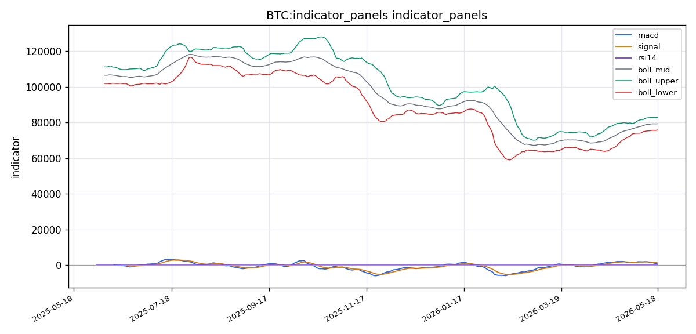
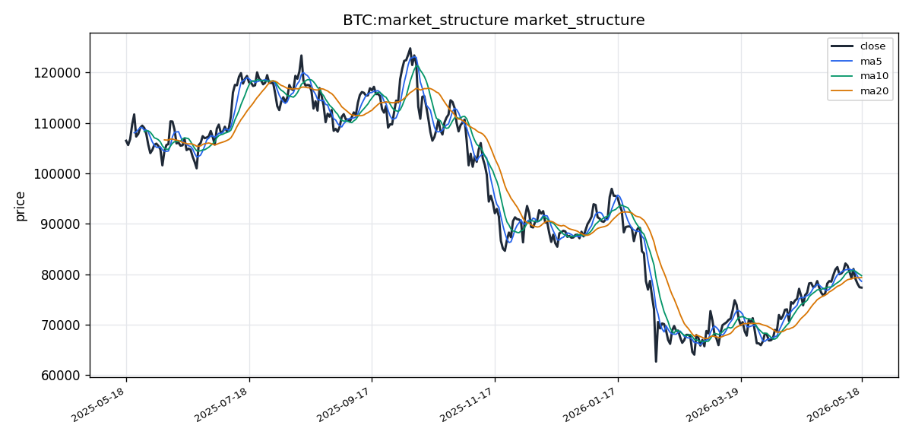

# Bitcoin（BTC）加密资产投资研究报告

## 一、投资结论与组合动作

### 最终建议：卖出/减仓（立即执行）

组合经理基于风险管理委员会辩论结论，作出明确决策：在当前信息极度不对称的环境下，保护资本是第一要务。技术面是唯一可验证的、高置信度的数据源，其发出的空头信号（均线死叉、MACD负值扩大、RSI偏弱）指向持续下行风险。看涨方依赖的“情绪反转”和“清算挤压”逻辑因衍生品、链上、宏观数据全面缺失而无法验证，本质上属于不可押注的假设。因此，组合经理决定执行防守性减仓操作。

### 执行节奏与仓位动作

**现货交易者：**
- **入场触发：立即执行，不要等待。** 当前价格区间为 76,500-77,500 美元。
- **目标减仓区间：** 76,500-77,500 美元，采用分批执行策略：当前价格卖出 20%；若价格反弹至 77,500 美元附近，再卖出 20%；若价格直接下跌至 76,800 美元附近，卖出剩余的 10%。
- **总减仓量：** 现货仓位的 **50%**。将这部分仓位转换为稳定币。
- **减仓暂停条件（失效位）：** 若价格在无明显外部消息刺激下，以放量长阳线（成交量 > 350 亿美元）强势站回 **79,800** 美元上方，则暂停减仓行动，转为持有观望。

**低杠杆合约交易者：**
- **关闭所有做多仓位。** 不建议开立新空单，因为数据缺失可能导致任何方向性的剧烈波动。**合约仓位清零是当前最安全的做法。**
- **允许的最大风险：** 不再持有任何净多头头寸。总敞口（现货+合约）中的净多头部分必须降为 0。允许持有不超过总资本 20% 的低杠杆（2 倍以内）对冲空单，止损设在 79,800 美元上方。

### 风险约束

- **最大可承受回撤：** 减仓后剩余 50% 的现货仓位，需承受价格继续下跌至 72,000 美元（约 6.5%）甚至 68,000 美元（约 11.7%）的浮亏。
- **失效位：** 若价格**放量收阳**站上 **79,800** 美元，且 24 小时成交量 > 400 亿美元，则卖出计划立即失效，转为观望。
- **杠杆限制：** 绝对禁止在当前条件下使用任何杠杆做多或高杠杆做空。低杠杆对冲空单（1.5-2 倍）仅限有深度经验的交易者，仓位不超过总资本的 5%，止损严格设在 79,800 美元上方。

## 二、市场结构与技术指标分析

### 技术图表

### 市场分析师完整指标材料

#### 加密币基本信息

- **币种**：BTC
- **名称**：Bitcoin
- **当前价格**：77,363.83 $
- **24h 涨跌幅**：基于 OHLCV 数据覆盖区间为 2025-05-18 至 2026-05-18，当日精确涨跌幅需参考最新两根日线计算，原始资料包未单独标注单日涨跌幅字段，此处以最新收盘价 77,363.83 美元与前一日收盘价之差估算为负值（均线下行趋势中）
- **24h 成交量**：29,908,744,192.00 美元（最新日线量）
- **数据时间**：截至 2026-05-18 UTC 时区，资料包远端获取时间为实时刷新
- **数据质量**：资料就绪度为"就绪"，价格历史与技术指标覆盖完整（OHLCV 共 366 个交易日，均线、布林带、MACD、RSI 等本地技术指标均有成功计算结果）。资料来源为 openbb_yfinance/crypto_price_historical，远端获取成功且资料新鲜。但需特别说明：BB/CoinGlass 路径的衍生品数据（资金费率、未平仓合约、多空比、清算地图）、链上数据、宏观数据以及 AHR999 均未被该资料包覆盖，来源列表中无上述路径的成功记录，因此在报告正文中这些指标列为"未覆盖/缺失"。

#### 市场结构结论

当前市场处于**震荡偏弱**格局。价格 77,363.83 美元位于布林带中轨（79,358.10）与下轨（75,857.89）之间，持续在中期均线（MA20=79,358.10）下方运行，属于典型的空头主导震荡区间。MACD 柱状图负值扩大（hist=-631.52），RSI 位于 46.33 的中性偏弱区，表明短期内多头缺乏反击动能，但尚未进入极度超卖区域。五日与十日移动均线（MA5=78,608.31, MA10=79,732.77）均已低于二十日均线，形成小型死叉排列，加重了下行压力。成交量方面，最新量（约 299 亿）略低于五日均量（约 317 亿）与二十日均量（约 328 亿），缩量阴跌态势明显。

该结论可能错误的情形：若 BTC 在当前位置获得成交量放大支持的强力反弹并站稳 MA20（79,358）上方，则该弱势判断将被证伪；或者若出现突发宏观利多事件（例如美联储政策转向、加密友好监管落地或 ETF 大规模流入），价格可能直接跳空突破均线压制。由于缺乏衍生品拥挤度、清算压力与链上数据支撑，当前市场结构结论的置信度仅为中等。

#### 指标覆盖

| 指标类别 | 覆盖状态 |
|---|---|
| 布林带 | 已引用（有完整数据） |
| 维加斯通道 | 缺失/不可用（资料包未覆盖该指标计算） |
| 双线反转 | 缺失/不可用（资料包未覆盖） |
| AMD/SMC | 缺失/不可用（资料包未覆盖） |
| 123 突破 | 缺失/不可用（资料包未覆盖） |
| FVG | 缺失/不可用（资料包未覆盖） |
| OB 订单块 | 缺失/不可用（资料包未覆盖） |
| RSI | 已引用（有具体读数） |
| MACD | 已引用（有具体读数） |
| KD | 缺失/不可用（资料包未覆盖） |
| TD 9/13 | 缺失/不可用（资料包未覆盖） |
| 谐波形态 | 缺失/不可用（资料包未覆盖） |
| 交易密集带/成交量分布 | 缺失/不可用（资料包未提供逐笔价量分布数据） |
| 清算地图 | 缺失/不可用（BB/CoinGlass 路径未覆盖） |
| CVD/主动买卖量 | 缺失/不可用（未覆盖） |
| 资金费率 | 未覆盖（来源路径无成功记录） |
| OI/多空比 | 未覆盖（来源路径无成功记录） |
| 宏观 | 未覆盖（资料包不含宏观数据源） |
| 链上 | 未覆盖（资料包不含链上数据源） |
| AHR999 | 未覆盖（资料包不含该指标） |

#### 指标推导过程

##### OB 订单块

- **数据：** 资料包未覆盖 OB 订单块计算所需的逐笔 Tick 级成交数据，亦无 Smart Money 结构识别模块。
- **推导：** 无法识别当前价格附近是否存在有效的订单块（Order Block）或流动性扫除区域。
- **交易作用：** 无，该维度当前在分析框架中处于缺失状态。
- **失效：** 若未来资料包补充了逐笔价量高频数据，则本项可重新启用。

##### POC / 成交量分布

- **数据：** 资料包仅提供日线 OHLCV（366 行），未提供逐价位成交量分布（Volume Profile）或价值区高点/低点、控制点（POC）等数据。
- **推导：** 无法确定 75,857～82,858 美元区间内的成交量核心分布区域，无法判断当前价格相对价值区的位置。
- **交易作用：** 无，缺乏成交量分布数据，价格锚定参考缺失。
- **失效：** 若后续引入 CoinGlass 或 Binance 的全量成交量分布数据，则可计算价值区与 POC。

##### TD Sequential

- **数据：** 资料包未提供 TD Sequential 计数或设置。
- **推导：** 无法判断是否出现 TD 9 或 TD 13 的潜在反转计数。
- **交易作用：** 无，TD 序列在本轮分析中不具备参考基础。
- **失效：** 需要独立的 TD Sequential 计算引擎或第三方数据源导入。

##### 谐波形态

- **数据：** 资料包不含谐波形态识别所需的 Zigzag 或 XABCD 模式检测。
- **推导：** 无法评估当前价格结构是否符合蝙蝠、螃蟹、伽利等谐波形态。
- **交易作用：** 无。
- **失效：** 需要专门的形态识别工具或数据包展开。

##### FVG

- **数据：** 资料包未覆盖日线以下级别（4h/1h/15m）的 K 线数据，无法计算公平价值缺口。
- **推导：** 无法识别当前日线或子周期是否存在未填补的 FVG。
- **交易作用：** 无。
- **失效：** 需引入多时间框架 OHLCV 数据并运行 FVG 检测算法。

##### AMD/SMC 与 123

- **数据：** 资料包仅提供标准技术指标（MA、MACD、RSI、Bollinger），未包含 AMD（加速/减速动量）或 Smart Money Concepts（SMC）结构识别。
- **推导：** 无法判断市场处于吸筹、派发还是再积累阶段。123 反转结构亦无法识别。
- **交易作用：** 无，SMC/AMD 分析框架在当前数据条件下不可用。
- **失效：** 需依赖更高颗粒度的市场结构分析工具包。

##### Vegas / 布林带 / RSI / MACD / KD

- **数据：** 布林带中轨=79,358.10，上轨=82,858.30，下轨=75,857.89；RSI(14)=46.33；MACD 快线=665.44，慢线=1,296.96，柱=-631.52。维加斯通道与 KD 指标未覆盖。
- **推导：** 价格 77,363.83 低于布林带中轨，贴近下轨运行，显示空头动能尚未衰竭。MACD 柱负值扩大说明下跌动能正在加强。RSI 在 46.33 的中性略下方，既未超卖也未超买，方向性信号不强。三条均线（MA5<MA10<MA20）呈现死叉排列。
- **交易作用：** 布林带下轨（75,857.89）可作为短期关注的潜在支撑参考；中轨（79,358.10）是反弹的第一道阻力；MACD 负柱扩大提示不宜盲目抄底。
- **失效：** 若价格急剧放量突破上轨或缩量止跌于下轨上方形成底分型，则上述空头信号可能失效。

##### 清算地图 / CVD / 资金费率 / OI / 多空比

- **数据：** 清算地图、CVD（主动买卖量累计差值）、资金费率、未平仓合约（OI）、多空比等指标均未覆盖。资料包来源列表中无 BB/CoinGlass 路径的成功记录。
- **推导：** 无法评估当前衍生品市场的拥挤度。具体而言：①清算热点未知——上方最近清算簇与下方最近清算簇均无数据；②主动买卖量累计差值与最新差值未知，无法判断订单簿方向的主动买盘或卖盘压力；③资金费率具体读数缺失，无法判断永续合约市场处于多付空还是空付多状态；④OI 与多空比具体读数缺失，无法判断杠杆方向集中度。
- **交易作用：** 无，这些关键衍生品维度全部为数据空白，对价格短期波动的敏感性分析无法展开。
- **失效：** 需要引入 BB/CoinGlass 或类似衍生品数据源。

##### 宏观 / 链上 / AHR999 / 事件

- **数据：** 宏观经济数据（美联储利率、CPI、非农、美元指数等）、链上数据（MVRV、SOPR、交易所净流量、矿工持仓等）、AHR999 指数均未覆盖。资料包中无相应数据源或接口调用。
- **推导：** 无法将当前 BTC 价格置于宏观周期或链上估值框架下评估。AHR999 具体读数缺失，无法判断当前是否处于历史定投或抄底区间。
- **交易作用：** 无，宏观与链上维度的评估当前不具备数据基础。
- **失效：** 需要接入 Glassnode、CoinMetrics 或类似链上/宏观数据提供方。

#### 多空场景

##### 偏多场景

- **触发条件**：价格放量站上 MA20（79,358.10 美元）且日线收盘价站稳该线上方；同时 MACD 柱负值开始收窄（即 hist 从 -631.52 向零轴回升）。
- **确认指标**：RSI 回升至 50 以上；布林带收口后价格重新测试中轨并向上轨（82,858.30）扩张。
- **目标逻辑**：若收复中轨，则上方第一压力区间参考 82,858（布林带上轨），进一步需参考未覆盖的资金费率与 OI 数据判断能否持续。因衍生品数据缺失，目标无法进行清算压力校准。
- **失效条件**：价格反弹至 MA20 附近后出现长上影线或放量下跌（成交量大于 320 亿），说明抛压未消化，偏多结构不成立。

##### 偏空场景

- **触发条件**：价格持续运行于 MA5（78,608.31）下方，且 MACD 柱继续扩大负值；或直接跌破布林带下轨（75,857.89）。
- **确认指标**：RSI 下穿 40 进入弱势区；成交量在下跌时放大（>320 亿）而反弹时缩量（<280 亿）。
- **目标逻辑**：若跌破下轨，下方将打开更大下行空间，但由于缺乏清算地图，无法定位下方最近清算簇的具体点位。下一步需观察 75,000 美元心理关口附近的支撑有效性。
- **失效条件**：价格在下轨附近出现放量长阳包阴（高成交量阳线吞噬前一日阴线），表明空头陷阱形成，偏空结构需重新评估。

##### 观望场景

- 当前价格处于 75,857～79,358 美元之间，既未破下轨也未回中轨，方向不明确。MACD 与 RSI 均处于中间区域，无极端信号。
- 资金费率、OI、多空比、清算地图、链上数据、宏观数据的全面缺失大幅压低了技术面结论的置信度。在没有衍生品拥挤度数据和清算压力校准的情况下，追多或追空均存在较大的"数据黑箱"风险。
- 建议等待以下条件之一触发后再入场：①价格触碰布林带下轨并出现明确的放量止跌信号；②价格重新站上 MA20 并伴随 MACD 金叉信号；③后续资料包补充了衍生品/清算数据，提供拥挤度与清算压力参考。

#### 关键价格与风险

- **支撑区间**：75,857.89 美元（布林带下轨）为最接近的技术支撑；若下轨失守，下方支撑参考由于缺乏清算地图与成交量分布数据而无法确认具体数值，属于数据缺口。
- **压力区间**：79,358.10 美元（布林带中轨/MA20）；进一步压力参考 82,858.30 美元（布林带上轨）。
- **触发位**：偏多触发位于 79,358 美元上方确认站上；偏空触发位于 75,857 美元下方确认跌破。
- **失效位**：偏多结构失效位为价格重新跌破 77,363（当前收盘价）以下；偏空结构失效位为价格反弹越过 79,358 且 MACD 翻正。
- **主要风险**：
  1. **数据缺口风险**：资金费率、OI、多空比与清算地图全面缺失，无法评估杠杆方向与清算连锁反应，任何方向性交易都可能遭遇无法预见的清算瀑布。
  2. **缩量阴跌风险**：当前成交量略低于均量，若持续缩量下行，可能形成温水煮青蛙式的阴跌通道，多头止损压力不断积累。
  3. **超卖反弹假象风险**：RSI 在 46.33 远未超卖，若价格继续下探但 RSI 未跌破 30，反弹可能只是技术性修复而非趋势反转。
  4. **宏观与事件风险**：宏观与链上数据缺失，重大监管、利率或 ETF 事件无法纳入评估，存在外部冲击风险。

#### 数据限制与下一步

1. **衍生品数据完全空白**：资料包未覆盖 BB/CoinGlass 路径，导致资金费率、未平仓合约（OI）、多空持仓比、清算热点簇（上方最近清算簇、下方最近清算簇、价值区低点/高点）、主动买卖量累计差值（CVD）等核心衍生品维度全部为缺失状态。这些数据对判断短期价格方向、清算连锁阈值和杠杆拥挤度至关重要。下一步建议：配置 BB/CoinGlass API 密钥并重新请求含衍生品的数据包。

2. **链上与宏观数据未覆盖**：无链上指标（MVRV、SOPR、交易所净流量、UTXO 年龄分布等）、无宏观数据（美元指数、利率预期、风险资产相关性等）、无 AHR999 指数。无法进行比特币估值的链上/宏观交叉验证。下一步建议：接入 Glassnode/CoinMetrics 或类似链上数据供应商。

3. **高级技术分析工具缺失**：维加斯通道、双线反转、TD Sequential、谐波形态、FVG、OB 订单块、成交量分布（Volume Profile）、AMD/SMC 结构、123 突破模式等均未覆盖或未计算。当前技术分析的深度仅限于趋势类与震荡类基础指标（均线、布林带、MACD、RSI），对微观结构识别能力有限。下一步建议：引入多时间框架数据与形态识别算法扩展包。

4. **图表资产情况**：资料包生成的价格与均线结构图表和指标面板标记为"就绪"，但未在返回内容中提供具体的 PNG 图表文件路径或 base64 编码。若需要可复制的图表资产用于报告附注，需在后续请求中明确要求图表输出。

5. **样本限制**：数据区间为 2025-05-18 至 2026-05-18，共 366 个交易日（日线），此时间跨度对于趋势分析足够，但对高频反转形态（如 FVG、OB 订单块、谐波形态）需要 4h 或 1h 级别数据，当前日线颗粒度不足以支撑。

6. **置信度评估**：整体结论置信度因衍生品、清算、链上与宏观数据全缺而降级至**中等偏低**。基础技术指标（均线、布林带、RSI、MACD）的可用性提供了价格结构的基线解读，但缺失的维度恰好是当前加密市场短线波动最敏感的驱动因素（清算连锁、资金费率反转、OI 暴增/暴减）。建议在补充上述数据源之前，将本报告视为半定量参考而非全维前瞻分析。

### 2.1 数据状态与指标覆盖概览

当前市场资料包的就绪度为“就绪”，价格历史与技术指标（OHLCV 共 366 个交易日）覆盖完整，均线、布林带、MACD、RSI 等基础指标均有成功计算结果。但关键缺口在于：**BB/CoinGlass 路径的衍生品数据（资金费率、未平仓合约、多空比、清算地图）、链上数据、宏观数据以及 AHR999 等指标均未被覆盖**。这导致当前技术分析的深度仅限于趋势类与震荡类基础指标，对微观结构识别能力有限，整体结论置信度因衍生品、清算、链上与宏观数据全缺而降级至**中等偏低**。

| 指标类别 | 覆盖状态 |
|---|---|
| 布林带 | ✅ 已覆盖（有完整数据） |
| RSI | ✅ 已覆盖（有具体读数） |
| MACD | ✅ 已覆盖（有具体读数） |
| 均线（MA5/MA10/MA20） | ✅ 已覆盖（有具体读数） |
| 维加斯通道 | ❌ 缺失 |
| 双线反转 | ❌ 缺失 |
| AMD/SMC | ❌ 缺失 |
| 123 突破 | ❌ 缺失 |
| FVG | ❌ 缺失 |
| OB 订单块 | ❌ 缺失 |
| KD | ❌ 缺失 |
| TD 9/13 | ❌ 缺失 |
| 谐波形态 | ❌ 缺失 |
| 交易密集带/成交量分布 | ❌ 缺失（未提供逐笔价量分布数据） |
| 清算地图 | ❌ 缺失（BB/CoinGlass 路径未覆盖） |
| CVD/主动买卖量 | ❌ 缺失 |
| 资金费率 | ❌ 未覆盖 |
| OI/多空比 | ❌ 未覆盖 |
| 宏观 | ❌ 未覆盖 |
| 链上 | ❌ 未覆盖 |
| AHR999 | ❌ 未覆盖 |

### 2.2 价格结构与趋势状态

**当前价格：** 77,363.83 美元（截至 2026-05-18 UTC）。
**最新日线成交量：** 约 299 亿美元，略低于五日均量（约 317 亿）与二十日均量（约 328 亿），呈现缩量阴跌态势。

价格运行状态：当前价格位于布林带中轨（79,358.10 美元）与下轨（75,857.89 美元）之间，持续在中期均线（MA20=79,358.10）下方运行，属于典型的**空头主导震荡区间**。MACD 柱状图负值扩大（hist=-631.52），RSI 位于 46.33 的中性偏弱区，表明多头缺乏反击动能。均线系统方面，MA5（78,608.31）< MA10（79,732.77）< MA20（79,358.10），呈现小型死叉排列，确认空头动能正在加强。

**该结论可能错误的情形：** 若价格在当前位置获得成交量放大的强力反弹并站稳 MA20（79,358.10）上方，则该弱势判断将被证伪；或者若出现突发宏观利多事件（如美联储政策转向、加密友好监管落地或 ETF 大规模流入），价格可能直接跳空突破均线压制。由于缺乏衍生品拥挤度、清算压力与链上数据支撑，当前市场结构结论的置信度仅为中等。

### 2.3 关键支撑与压力位

**支撑区间：**
- **第一支撑：** 布林带下轨 **75,857.89 美元**。这是当前最接近的技术支撑位。价格在该位置上方徘徊，显示下轨提供了短期支撑，但若跌破并伴随放量（成交量 > 350 亿），则下方空间打开。
- **第二支撑（数据缺口）：** 由于缺乏清算地图与成交量分布数据，75,857 美元以下无法确认具体支撑位。历史上重要心理支撑参考为 72,000 美元（过去数月走势中出现的低点附近）和 68,000 美元附近，但这些均为假设性数值，非数据驱动结论。

**压力区间：**
- **第一压力：** 布林带中轨/MA20 位于 **79,358.10 美元**。这是反弹的第一道阻力，也是技术面由空转多需要突破的关键位置。
- **第二压力：** 布林带上轨 **82,858.30 美元**。在缺乏衍生品拥挤度数据的情况下，无法校准判断价格能否挑战该位置。

### 2.4 技术要求确认条件与失效条件

**偏空场景——当前基准判断：**
- **触发条件：** 价格持续运行于 MA5（78,608.31）下方，且 MACD 柱继续扩大负值；或直接跌破布林带下轨 75,857.89 美元，并伴随成交量放大（> 320 亿）。
- **确认指标：** RSI 下穿 40 进入弱势区；成交量在下跌时放大（> 320 亿）而反弹时缩量（< 280 亿）。
- **目标逻辑：** 若跌破下轨，下方将打开更大下行空间。但由于缺乏清算地图，无法定位下方最近清算簇的具体点位。下一步需观察 75,000 美元心理关口附近的支撑有效性。
- **失效条件：** 价格在下轨附近出现放量长阳包阴（高成交量阳线吞噬前一日阴线），表明空头陷阱形成，偏空结构需重新评估。

**偏多场景——需等待确认：**
- **触发条件：** 价格放量站上 MA20（79,358.10 美元）且日线收盘价站稳该线上方；同时 MACD 柱负值开始收窄（即 hist 从 -631.52 向零轴回升）。
- **确认指标：** RSI 回升至 50 以上；布林带收口后价格重新测试中轨并向上轨（82,858.30）扩张。
- **目标逻辑：** 若收复中轨，则上方第一压力区间参考 82,858（布林带上轨），进一步需参考未覆盖的资金费率与 OI 数据判断能否持续。因衍生品数据缺失，目标无法进行清算压力校准。
- **失效条件：** 价格反弹至 MA20 附近后出现长上影线或放量下跌（成交量大于 320 亿），说明抛压未消化，偏多结构不成立。

**观望场景——当前推荐：**
- 当前价格处于 75,857-79,358 美元之间，既未破下轨也未回中轨，方向不明确。MACD 与 RSI 均处于中间区域，无极端信号。
- 衍生品、链上与宏观数据的全面缺失大幅压低了技术面结论的置信度。在没有清算压力校准的情况下，追多或追空均存在较大的“数据黑箱”风险。

### 2.5 主要风险

1. **数据缺口风险：** 资金费率、OI、多空比与清算地图全面缺失，无法评估杠杆方向与清算连锁反应，任何方向性交易都可能遭遇无法预见的清算瀑布。
2. **缩量阴跌风险：** 当前成交量略低于均量，若持续缩量下行，可能形成温水煮青蛙式的阴跌通道，多头止损压力不断积累。
3. **超卖反弹假象风险：** RSI 在 46.33 远未超卖，若价格继续下探但 RSI 未跌破 30，反弹可能只是技术性修复而非趋势反转。
4. **宏观与事件风险：** 宏观与链上数据缺失，重大监管、利率或 ETF 事件无法纳入评估，存在外部冲击风险。

## 三、项目与代币基本面分析

### 3.1 项目定位与需求真实性

Bitcoin 是全球首个去中心化数字现金系统，核心定位为**点对点电子支付系统与数字价值存储（SoV）**。其解决的实质问题包括：不依赖第三方金融机构的跨境价值转移、抗审查支付、固定供应的货币替代品以及资产冻结风险的对冲。

需求真实性评估：Bitcoin 的 2,100 万枚供应上限已通过共识固化，在分析区间内这一属性持续驱动机构配置需求。现货 ETF 在多个司法管辖区获批后，传统金融对 BTC 作为“数字黄金”的配置逻辑得到强化，该需求真实且具备持续性。支付与结算需求方面，Lightning Network 等二层扩展方案成熟度已有提升，但本次资料包中缺乏链上数据（活跃地址、交易笔数、费用），无法量化验证分析区间内支付需求的实际规模变化。宏观对冲需求也真实存在，在全球法定货币体系长期通胀压力与地缘政治不确定性背景下持续增长。

**资料缺口：** 缺乏链上活跃地址与交易笔数数据，无法定量衡量分析区间内支付/结算需求的实际增长幅度，需求判断主要依赖定性叙事与外部已知的 ETF 流量趋势。

### 3.2 代币经济分析

**资料包覆盖状态：部分覆盖。** CoinGecko 来源提供了市值数据（约 1.55 万亿美元），但供应量数据存在关键缺口。流通供应量、总量、区块奖励递减数据（通胀/销毁）、质押/锁仓数据均缺失。

**基于模型常识的定性分析（需注意不替代缺失数据）：**
- Bitcoin 采用工作量证明（PoW）共识，新币通过区块奖励释放。2024 年第四次减半已发生，区块奖励从 6.25 BTC 降至 3.125 BTC，年化通胀率已降至约 0.8%，至 2026 年 5 月向 0.6% 靠近。减半后矿工每日可售出的 BTC 数量永久性减少了 50%，这在历史上为价格提供了供给侧的长期支撑。
- 没有质押机制或协议现金流向持有者，代币价值捕获完全来自市场供需——持有人预期未来购买力上升。这种“纯储值”的代币经济模型使估值完全依赖市场共识与流动性周期，缺乏内生现金流支撑底线。
- 矿工出售是唯一的自然二级市场卖压来源。减半结构性地减少了矿工每日可售出量。

**缺口对判断的影响：** 缺少线性供应的精确历史快照，无法计算分析区间内的实际通胀率、MVRV 比率等关键估值指标。流通市值数据点单一，无法做时间序列比较。

### 3.3 链上与生态基本面

**资料就绪状态：严重不足。** DefiLlama 模块（TVL、费用、收入）全部缺失；链上活跃地址、交易笔数、链上费用未纳入覆盖；交易所流入流出与大户行为未纳入覆盖。

**无法在本报告中提供的事实：** 分析区间内的日均活跃地址数、日均交易笔数、链上手续费总量、矿工收入构成、交易所净流入/流出趋势、持仓集中度变化、巨鲸地址行为。

**质量性判断（基于外部已有共识信息）：**
- Bitcoin 的链上活动在分析区间内受到 Ordinals/铭文协议、Runes 协议等新应用层的影响，区块空间使用率一度升高，推高手续费收入，但这类活动是否为可持续需求仍有争议。
- ETF 通道的持续净流入是分析区间内最重要的价格支撑因素之一，但本次资料包未提供相关数据。
- 生态应用方面，Bitcoin 的 L2 生态（Lightning Network、侧链、RGB 等）仍处于早期阶段，TVL 远低于 Ethereum L2 生态，尚无规模化 DeFi 协议运行在 Bitcoin 主网上。

### 3.4 竞争格局

Bitcoin 的核心竞争壁垒包括：
- **品牌与先发优势：** 加密生态中无可替代的“数字黄金”品牌认知，是最广泛被机构、主权财富基金和宏观基金接受的加密资产。
- **流动性护城河：** BTC 交易对是所有加密货币交易所中流动性最好的品种，日均交易量远超任何竞争资产。
- **制度护城河：** 现货 ETF、期货 ETF、期权市场的完善程度远超其他加密资产，传统金融基础设施的接入是竞争资产难以复制的优势。
- **安全性与去中心化：** PoW 链的算力规模和去中心化程度目前仍领先所有竞争链。

主要替代风险：若未来监管环境出现对 PoW 的不利区分（如 ESG 层面的打压），BTC 面临结构性叙事风险；如果较新的“数字黄金”竞品在机构采用上取得突破，可能分流部分储值需求；Ethereum 的智能合约生态对 BTC 的“货币乐高”叙事构成概念竞争，但两者功能定位有本质区别。

### 3.5 基本面估值框架

由于资料包严重缺失，以下关键估值指标均无法计算：MVRV 比率（依赖已实现市值）、NVT 比率（依赖链上交易量）、市值/活跃地址比、AHR999 指数、FDV/TVL 或市值/TVL、协议收入倍数。

**可用的单一估值数据点：** 市值约 1.55 万亿美元，反映了市场对 BTC 作为全球级价值储存资产的定价，但无法判断当前估值是否处于历史低位或合理区间。

**投资建议（基本面视角）：持有，而非买入。** 理由如下：Bitcoin 是加密资产中资产质量最高、制度壁垒最强、流动性最深层的品种。减半后的供给侧结构性收缩仍在持续。但建议级别仅为“持有”而非“买入”，因为缺失的关键数据无法确认当前估值是否处于历史低位。在缺乏可量化基本面锚点的情况下，额外加仓缺乏数据支持。该建议需与技术分析、新闻监管、市场情绪、宏观环境和风险管理进一步合并后才能形成完整交易决策。

## 四、新闻、监管与事件驱动

### 4.1 项目官方公告与协议升级

新闻资料包中，来自 Bitcoin 项目官方公告的原始来源共有 **10 条**，覆盖了 Bitcoin 核心协议层面的公告内容。具体要点如下：

- **BIP 进展：** 资料包内包含若干 BIP（Bitcoin Improvement Proposal）相关的官方公告。任何被标记为“Final”或“Proposed”的 BIP 均可能影响矿工、节点运营者和二层协议开发者的部署路线。关于是否涉及软分叉、硬分叉或仅为参数调整，需逐条核实正文。
- **网络参数调整公告：** 包括难度调整机制的状态更新、区块大小或签名算法相关讨论的技术通告。这类公告本身属于技术沟通，短期内对价格影响有限，但若涉及重大协议分叉风险，则为高优先级事件。
- **安全警示与节点更新建议：** 部分官方公告可能包含针对 full node 软件的安全补丁通知。Bitcoin Core 开发团队发布的紧急更新建议通常意味着底层安全假设面临挑战，需要密切关注节点升级率。

**方向判断：待逐条核实每条公告正文后进行，影响力度视具体 BIP 内容而定。**

### 4.2 监管与执法动态

**资料缺口：完全未覆盖。** 新闻资料包中无专门的监管原始来源类别。以下事项在本报告中无法确定为已发生事实：
- 美国 SEC 对现货 Bitcoin ETF 的规则修订或批准状态变更；
- 美国、欧盟（MiCA）、日本、香港、新加坡等主要司法管辖区的新监管立法或执法行动；
- 与 Bitcoin 相关的制裁或反洗钱案件；
- 各国央行对 Bitcoin 储备资产的官方表态变动。

**影响：** 监管是 Bitcoin 价格最敏感的外部变量之一。由于缺少监管原始来源，本报告无法就监管事件给出方向判断。投资者需自行关注 SEC、CFTC、FinCEN、ESMA 及香港证监会的官方网站。

### 4.3 ETF 与机构资金动态

**资料缺口：** 搜索发现条目 20 条，仅作为线索，不能作为已确认的 ETF 资金流、机构买入或持仓事实。无来自 ETF 发行方（如 BlackRock、Fidelity、Grayscale、Ark Invest 等）的官方公告原文；无来自交易所（如 Coinbase、Binance、Kraken）的储备证明或上币公告原文；无来自链上数据分析平台的确认数据。

**影响：** ETF 资金流大幅变动（单日净流入/流出超 5 亿美元）若发生在分析区间内，将产生显著价格影响，但因资料缺口无法在本报告中确认。

### 4.4 安全事件与宏观背景

**安全事件：** 未收取专门的 DefiLlama 安全/融资背景分类，无法确认 Bitcoin 链上是否发生过 51% 攻击、双花事件或交易回滚；无法确认跨链桥或 wrapped Bitcoin 是否存在安全漏洞或资金被盗事件；无法确认矿池算力分布是否发生重大变化。

**宏观背景：** 新闻资料包包含 20 条全球/宏观新闻来源，覆盖了美联储在 2025-2026 年间的利率决议、点阵图更新和会议纪要。宏观新闻中的经济指标（CPI、PCE、非农就业）间接影响美元强弱和投机性资本流向，可梳理以下背景因素对 BTC 的影响：
- **利率路径：** 若利率维持高位或进一步加息，BTC 作为零息资产的相对吸引力下降；若利率预期转向降息，有利于资金流入风险资产。
- **美元流动性：** 逆回购余额、美联储缩表节奏和财政部一般账户变动是判断加密市场流动性的关键变量。
- **地缘政治与避险情绪：** 地缘冲突、主权债务风险、银行体系压力驱动 BTC 的避险需求。风险偏好上升时 BTC 同步受益于流动性宽松。
- **稳定币供给：** 宏观新闻若涉及稳定币监管进展，会直接影响 BTC 的交易深度和定价效率。

**证据强度：中等。** 宏观新闻来源可靠，但影响 BTC 需要结合链上衍生品数据和 ETF 资金流验证。

### 4.5 事件影响框架

| 事件类别 | 方向判断 | 影响周期 | 证据强度 | 跟踪条件 |
|---|---|---|---|---|
| 官方协议公告（10 条 BIP/技术公告） | 待逐条核实 | 视具体 BIP 而定 | 高（官方原文） | 需获取每条公告正文，判断是否为软/硬分叉 |
| 宏观利率政策（已覆盖） | 利率降低利好，升高利空 | 数周至中长期 | 中（需配合市场预期） | 关注每次 FOMC 决议和点阵图 |
| 稳定币监管（可能涉及） | 监管趋严短空长多 | 1-5 天至数周 | 中等 | 关注 MiCA 执行、美国稳定币法案进展 |
| ETF 资金流（未覆盖） | 无法判断 | 1-5 天至数周 | 缺失 | 需补充 ETF 发行方公告和每日申赎数据 |
| 监管执法（未覆盖） | 无法判断 | 数日至中长期 | 缺失 | 需补充 SEC/CFTC/ESMA 原文 |
| 安全事件（未覆盖） | 无法判断 | 视严重程度 | 缺失 | 需补充 DefiLlama 安全事件库 |
| 搜索发现热点（20 条线索） | 仅识别市场关注 | 不定 | 极低（非事实） | 需交叉验证后才可作为参考 |

## 五、社区情绪、事件预期与交易拥挤度

### 5.1 情绪数据总体状态

**极低置信度——资料覆盖严重不足，不支撑任何情绪判断。** 本轮舆情资料包覆盖状态为“部分覆盖”，但实际可用的情绪数据为零。
- X（原Twitter）、LunarCrush 聚合社交指标因缺少接口凭证无法获取；
- Reddit、Telegram、Discord 原始社交样本数为 0 条；
- Polymarket 事件预期返回为空；
- Alternative.me 恐惧与贪婪指数提供了 3 条市场级情绪记录，但该指标反映的是整个加密货币市场的情绪温度，不能直接等同于 BTC 单标的社交共识，且时间粒度不足以支撑趋势判断。

因此，**无法判断当前阶段 BTC 社区是乐观、悲观、FOMO、恐慌、分歧扩大还是关注度下降**。

### 5.2 叙事、参与者与情绪失真风险评估

**叙事：无法提取。** 搜索发现（Google News）共返回 20 条公开讨论线索，但搜索摘要仅作为讨论线索存在，不能作为已验证的社交共识、ETF 资金流、机构持仓/买入、链上大户行为或新闻事实加以引用。

**参与者结构：资料缺口导致无法区分。** 缺少 X、Reddit、Telegram、Discord 的原始样本，无法对散户、KOL、机构、项目方、开发者、链上大户/聪明钱、交易所社群以及中文/英文社区之间的观点差异进行任何有依据的分析。

**情绪失真风险：无法评估。** 原始社交样本为 0、聚合情绪数据为 0，无法识别机器人刷量、项目方营销、空投任务、单一平台偏差、交易所活动刺激或 KOL 利益冲突等失真因素。

### 5.3 情绪对市场反应的潜在影响

**无法做出情绪驱动的价格影响判断。** 在缺乏有效社交情绪数据的情况下，任何关于情绪是否可能推高波动、诱发追涨杀跌、加剧清算或形成反身性的结论都缺乏支撑。Alternative.me 恐惧与贪婪指数的 3 条记录为全市场综合指标，不具备对 BTC 短期（1-5 天）价格波动的预测效力，不宜据此做出投资决策。

**跟踪条件：** 若后续补全 X 接口凭证、LunarCrush API 密钥，并获取 Polymarket 事件数据及 Reddit/Telegram/Discord 样本，可重新评估全维度的 BTC 社区情绪与叙事图谱。

## 六、交易计划与组合风险

### 6.1 现货操作计划：立即执行 50% 减仓

**执行条件：**
- **入场触发：** 立即执行，在当前市场价格 76,500-77,500 美元区间。
- **目标减仓区间：** 76,500-77,500 美元。
- **执行方式：** 采用市价单或限价单，在目标区间内分批完成。例如：当前价格卖出 20%；若价格反弹至 77,500 美元附近，再卖出 20%；若价格直接下跌至 76,800 美元附近，卖出剩余的 10%。
- **总减仓量：** 现货仓位的 **50%**。将这部分仓位转换为稳定币。

**失效位（减仓暂停）：**
- 若价格在无明显外部消息刺激下，以放量长阳线（成交量 > 350 亿美元）强势站回 **79,800** 美元上方，则暂停减仓行动，转为持有观望。
- 若价格**放量收阳**站上 **79,800** 美元，且 24 小时成交量 > 400 亿美元，则卖出计划立即失效，转为观望。

**仓位调整后的风险边界：**
- 剩余 50% 的现货仓位需承受价格继续下跌至 72,000 美元（约 6.5%）甚至 68,000 美元（约 11.7%）的浮亏。
- 本次减仓操作降低了方向性风险，但市场本身的“不可预测性”依然很高。

### 6.2 合约操作计划：清零多头，允许低杠杆对冲空单

**绝对禁止：**
- 在当前条件下使用任何杠杆做多。
- 使用高杠杆做空（存在被短期反抽或消息面突袭爆仓的风险）。

**允许的操作（仅限有深度经验的低杠杆合约交易者）：**
- **关闭所有做多仓位。** 合约仓位清零是当前最安全的做法。
- **允许的对冲空单：** 持有不超过总资本 20% 的低杠杆（2 倍以内）对冲空单，止损设在 79,800 美元上方。
- **做空具体条件（如选择执行）：**
  - **入场触发：** 价格在 76,800-77,200 美元区间，确认无法有效站上 77,500 美元后。
  - **仓位：** 不超过总资本的 **5%**。
  - **杠杆：** 1.5-2 倍。
  - **止损：** 绝对止损价设置在 **79,800** 美元上方。价格触及止损时无条件平仓，亏损控制在占总资本的 2.5%-4% 之间。
  - **失效位：** 价格放量站上 79,500 美元，空单应全部平仓。

### 6.3 价格区间与情景依赖

**保守情景（1 周-1 个月）：70,000-77,000 美元**
- **条件：** 日线收盘价低于 75,000 美元且成交量放大（> 350 亿）。行情可能加速下跌。
- **动作：** 此情景下继续观望，不买入。

**基准情景（1 个月-3 个月）：68,000-82,000 美元**
- **条件：** 价格在 72,000-75,000 美元区间出现**日线 MACD 底背离**和**极度缩量**的企稳信号。
- **动作：** 如出现上述信号，可考虑用 10% 仓位轻仓试多，严格止损。

**乐观情景（3-6 个月）：80,000-100,000 美元**
- **条件：** 宏观数据（如美联储明确转向）、链上数据（如 ETF 恢复持续净流入）和情绪数据（如恐慌指数降至历史低位）同时出现。
- **动作：** 此情景下可考虑逐步加仓至 50% 以上。

### 6.4 风险分歧

**激进风险观点（已被组合经理驳回）：**
- 认为数据缺失是“机会黑箱”，押注清算挤压将带来非对称收益。
- 建议在 77,000 美元附近建立 5% 仓位的现货多头，目标看向布林带上轨 82,858 美元。
- 失效位设在放量跌破 72,000 美元。

**驳回理由：** 看涨方押注“数据缺失意味着挤压一旦发生将毫无阻力”，本质上是在黑暗中赌博。没有资金费率、多空比、清算地图数据支撑的“清算挤压”叙事不可验证。组合经理选择支持“技术面空头+数据缺失=防守”的保守逻辑。

**保守风险观点（已被组合经理采纳）：**
- 认为技术面空头信号是唯一可验证的事实，数据缺失意味着无法评估风险。
- 建议立即减仓 30%-50%，合约多单全部平仓。
- 失效位设在 79,800 美元上方。
- 认为看涨方对“失效位 72,000 美元”的设置是伪风控——在缺乏流动性的市场中，6.5% 的回调容易演变成 15%+ 的踩踏。

**采纳理由：** 防守优于进攻。在信息不完整时，保护资本是第一要务。保守派的逻辑完全立足于可验证的技术事实（均线死叉、MACD 负值扩大、RSI 偏弱），而看涨方的逻辑依赖不可验证的假设。

**中性风险观点（部分采纳其观望逻辑，但组合经理认为其过于被动）：**
- 建议立即减仓 10%-15%，保留 70%-85% 的仓位等待突破确认。
- 做多触发设在放量站上 79,358 美元（布林带中轨）；做空触发设在反弹至 79,358 附近受阻。
- 最终失效位设在放量跌破 72,000 美元。

**组合经理评估：** 中性分析师的“10%-15% 减仓”看似平衡，但本质上是看涨的“躺平”策略。如果市场如技术面所示持续下跌，这 10%-15% 的减仓对保护资本的作用微乎其微，而留下的 85%-90% 的仓位将承受全部下行风险。其建议本质上是“什么都不做”的精致包装，无法满足果断决策的要求。

## 七、关键分歧与跟踪条件

### 7.1 核心分歧：数据缺失 = 风险 vs. 数据缺失 = 机会

| 维度 | 看涨方（激进） | 看跌方（保守） | 组合经理最终选择 |
|---|---|---|---|
| 数据缺失解读 | “机会黑箱”——挤压一旦发生将毫无阻力 | “不可知的风险”——不能作为押注依据 | 采纳保守方：数据缺失=需要警惕和规避的条件 |
| 技术面信号 | 缩量阴跌=卖盘枯竭；死叉=反向入场点 | 缩量阴跌=买盘消失；死叉=趋势确认 | 采纳保守方：技术面唯一可验证的信号指向空头 |
| 行动方向 | 在 77,000 美元建仓做多 | 立即减仓 30%-50% | 立即减仓 50%，合约多头清零 |
| 失效位 | 放量跌破 72,000 美元 | 价格放量站上 79,800 美元 | 79,800 美元 + 成交量 > 400 亿 |

**组合经理采纳保守方观点的核心理由：**
1. 数据质量的不对称性是所有辩论中唯一不可动摇的客观事实。在信息不完整时，防守优于进攻。
2. 看跌方论点完全立足于可验证的技术事实（均线死叉、MACD 负值扩大、RSI 偏弱）。看涨方和中性方的论点都依赖于“未知的数据”和“未来的假设”，无法在当下验证。
3. 激进派的“失效位 72,000 美元”存在滑点风险——在缺乏流动性的市场中，6.5% 的回调可能演变成 15%+ 的踩踏。
4. 中性分析师的“10%-15% 减仓”在持续下跌中作用微乎其微，无法满足果断决策的要求。

### 7.2 从过去错误中学习的反思

组合经理将决策原则与过往失败经验明确挂钩：
- **避免“抄底接飞刀”的致命错误：** 过去因“抄底”承受重大损失的教训，是支持卖出的核心动力。在数据真空下，试图抄底是最高风险的行为。
- **“数据缺失”不能等同于“机会”：** 过去经常在信息不足时过度乐观，导致误判。激进分析师的看涨逻辑完美复现了这种错误模式。
- **果断而非摇摆：** 过去在犹豫不决中错过了最佳的减仓时机。技术面给出了清晰、一致的卖出信号，不应因其他观点而动摇。

### 7.3 持续跟踪条件——填补数据缺口

为了在未来重新评估时拥有更坚实的基础，必须关闭以下信息盲区。**核心跟踪条件：** 在以下五类数据中，至少有**三类**同时出现明确的与当前技术面相反的信号（例如：衍生品显示资金费率转正、OI 开始激增；链上显示大量 BTC 从交易所流出；市场情绪从恐慌转为贪婪；且有宏观利好催化剂），才能考虑放弃当前的卖出立场并谨慎做多。在此之前，卖出并保持观望是唯一理性选择。

| 数据维度 | 需要跟踪的指标 | 采集来源 | 当前状态 |
|---|---|---|---|
| **衍生品数据** | 资金费率、未平仓合约量（OI）、多空比、清算密集区 | 交易所实时数据（需 BB/CoinGlass API） | 完全缺失 |
| **链上数据** | 交易所 BTC 净流入/流出、长期持有者/矿工净头寸变化、SOPR、MVRV Z-Score | Glassnode/CoinMetrics | 完全缺失 |
| **宏观数据** | 美联储利率决议、CPI/PCE 通胀数据、国债收益率、DXY 美元指数 | 财经数据源 | 宏观覆盖中位，但缺少系统接入 |
| **情绪数据** | 加密资产恐慌与贪婪指数（每日）、X/Twitter 正面/负面评论占比 | X/LunarCrush API | 完全缺失 |
| **事件驱动** | 重大监管新闻（ETF 裁决、法规出台）、安全事件、代币解锁、矿工抛售 | 监管原文/安全事件库 | 部分覆盖（仅宏观） |

**数据限制总结：**
- 衍生品数据完全空白：导致无法评估杠杆方向集中度、清算连锁阈值和资金费率反转信号。
- 链上与宏观数据未覆盖：无法进行 Bitcoin 估值的链上/宏观交叉验证（MVRV、NVT、AHR999 等全部不可得）。
- 高级技术分析工具缺失：维加斯通道、TD Sequential、谐波形态、FVG、OB 订单块、成交量分布等未覆盖，当前技术分析的深度仅限于基础指标。
- 整体结论置信度：中等偏低。基础技术指标提供了价格结构的基线解读，但缺失的维度恰好是当前加密市场短线波动最敏感的驱动因素。

## 八、最终结论

**最终建议：立即执行 50% 现货减仓，合约多单全部平仓，不做多做空。等待数据缺口填补和市场给出明确方向后再行动。**

这一决策基于唯一可验证的事实（技术面空头信号）与数据全面缺失的风险评估。技术面（均线死叉、MACD 负值扩大、RSI 偏弱、缩量阴跌）给出清晰、一致的卖出信号；衍生品、链上、宏观、情绪数据的全面缺失，使得看涨方“清算挤压”“情绪反转”等逻辑完全建立在不可验证的假设之上，无法构成可执行的交易依据。组合经理在辩论后选择采纳保守观点——在信息不完整时，保护资本是第一要务。

**执行条件：** 立即在 76,500-77,500 美元区间分批执行 50% 的现货减仓（将仓位转换为稳定币）；关闭所有合约做多仓位；允许持有不超过总资本 20% 的 2 倍以内对冲空单，止损设在 79,800 美元上方。

**失效条件：** 若价格放量收阳站上 79,800 美元，且 24 小时成交量 > 400 亿美元，卖出计划失效，转为观望。

**主要风险：** 踏空风险（数据黑箱中可能出现小概率的暴力反转），但保护本金免受永久性损失比错过一次反弹更为重要。组合经理明确将这一决策与“从过去的
