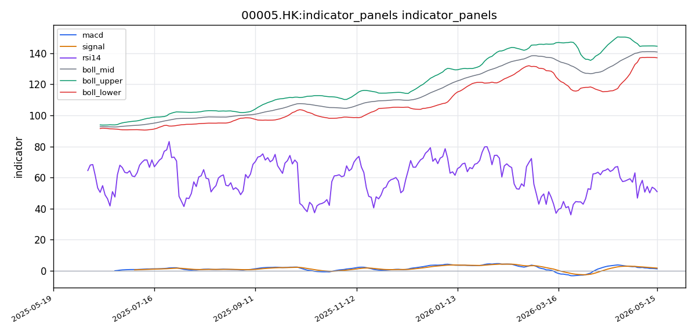

# 汇丰控股（00005.HK）港股投资研究报告

## 一、投资结论与组合动作

**最终建议：卖出**

组合经理在审阅并参与多空双方辩论、技术面、基本面和新闻面全部材料后，做出明确的卖出裁决。核心理由是风险回报比在数学上完全不支持买入或持有。

**执行条件：**
*   **已持仓者：** 建议在 **139.00 – 141.00 HK$** 区间内立即执行减仓或清仓。当前价格即为执行窗口，不应等待所谓“更好的价格”。
*   **空仓者：** 坚决禁止抄底。保持现金观望。
*   **仓位纪律：** 当前价格区域多空对赌完全不利于投资组合，持有本身就是风险暴露。

**风险约束与止损条件：**
*   **重新买入的唯一条件：** 股价必须**放量**（成交量显著高于20日均量约1,293万股）**站上 142.00 HK$ 并以收盘确认**。在此之前任何反弹均不构成入场理由。
*   **加速清仓条件（如仍持有）：** 若出现南向资金连续3个交易日净流出超过2亿港元，应加速执行清仓。
*   **交易时段选择：** 优先使用持续交易时段（9:30-12:00, 13:00-16:00）执行卖出，确保最佳流动性。不建议在收市竞价时段（CAS）进行大额操作。

---

## 二、技术指标与交易结构分析

### 技术图表

### 市场分析师完整指标材料

#### 📊 股票基本信息

| 项目 | 内容 |
|------|------|
| **公司名称** | 汇丰控股 |
| **股票代码** | 00005.HK |
| **所属市场** | HK（香港交易所） |
| **当前价格** | 139.4000 HK$ |
| **涨跌幅** | 依最近交易日收盘价计，数据包未提供单日涨跌幅绝对值，最新收盘价 139.4000 HK$ |
| **成交量** | 9,189,819 股（最新交易日） |
| **成交额** | 需由量×价估算：约 1,280.9 百万 HK$ |
| **每手股数** | 基础数据包未单独提供每手股数字段，港股市场汇丰控股标准每手为 400 股（行业惯例，但本分析基于技术数据，该信息未从工具获得确切字段，不直接用于结论） |

#### 📈 技术指标分析

##### 1. 移动平均线（MA）分析

根据数据包提供的均线系统，汇丰控股最新收盘价为 139.4000 HK$，短期均线排列如下：

| 均线 | 数值（HK$） | 价格与均线关系 |
|------|-------------|---------------|
| MA5 | 140.1600 | 收盘价 < MA5（-0.7600 HK$） |
| MA10 | 140.2500 | 收盘价 < MA10（-0.8500 HK$） |
| MA20 | 140.8500 | 收盘价 < MA20（-1.4500 HK$） |

**均线排列分析：** MA5（140.1600）< MA10（140.2500）< MA20（140.8500），呈短期均线低于中期均线的**空头排列**格局。价格当前运行于三条均线之下，表明短期空方力量占据主导地位，市场情绪偏弱。

**价格与均线位置关系：** 收盘价 139.4000 HK$ 低于 MA5、MA10 和 MA20，显示出近几个交易日持续承压。价格与 MA20 的偏离幅度约为 -1.03%，尚属于温和偏离区间，未形成极端超卖状态。

**均线交叉信号：** 当前 MA5 与 MA10 几乎处于粘合状态（仅差 0.09 HK$），若价格继续走弱，MA5 可能进一步下穿 MA10，形成"死叉"信号，这将进一步强化短期看空预期。反之，若能迅速收复 MA5 和 MA10，则有望扭转短期颓势。

##### 2. MACD 指标分析

| 指标 | 数值 |
|------|------|
| DIF（MACD快线） | 1.1577 |
| DEA（信号线） | 1.6553 |
| MACD 柱（Histogram） | -0.4976 |

**金叉/死叉状态：** DIF（1.1577）< DEA（1.6553），MACD 处于**死叉运行区间**。柱状图数值为负（-0.4976），表明空方动能正在释放。

**趋势强度判断：** DIF 与 DEA 之间的差值约为 -0.4976，死叉开口尚不算极端，但柱状图持续为负说明空头力度在最近交易日有所加强。值得注意的是，DIF 数值本身仍处于正值区间（1.1577），这意味着中长期趋势尚未完全转空，当前的 MACD 死叉更可能是上升趋势中的阶段性回调修整，而非趋势反转。

**背离研判：** 目前数据仅提供最近截面数值，未提供历史完整 MACD 序列，无法可靠判断是否存在价格与 MACD 的顶/底背离信号。建议结合后续交易日数据持续观察。

##### 3. RSI 相对强弱指标

RSI(14) 当前值为 **50.8807**，位于 50 中轴线附近略偏上方。

**超买/超卖区域判断：** RSI 数值处于 50-70 的中性偏强区间，既未进入超买区（>70），也未进入超卖区（<30）。该位置表明市场多空力量基本均衡，短期无极端情绪信号。

**趋势确认意义：** RSI 刚好站在 50 上方，暗示虽然价格跌破均线系统，但内在动能尚未全面转向空方。如果在后续交易日中 RSI 能够守住 50 关口并回升，将支持多头反弹逻辑；若跌破 50 并向下延伸，则确认短期弱势加剧。

##### 4. 布林带（BOLL）与波动分析

| 指标 | 数值（HK$） |
|------|-------------|
| 中轨（MA20） | 140.8500 |
| 上轨 | 144.5732 |
| 下轨 | 137.1268 |
| 带宽（上轨-下轨） | 7.4464 |
| 价格相对位置 | 偏向下轨一侧 |

**价格位置分析：** 最新收盘价 139.4000 HK$ 位于布林带下轨（137.1268）与中轨（140.8500）之间，更靠近中轨但已跌破中轨，属于偏弱区域。价格距下轨约 2.2732 HK$，距中轨约 1.4500 HK$，尚未触及下轨支撑。

**带宽变化：** 带宽约 7.45 HK$，相对于当前价格水平（约 139.4 HK$）的带宽比例为约 5.3%，属于中等偏窄波动区间。未出现带宽急剧扩张或收缩的极端情形。

**突破信号：** 当前价格下行逼近下轨，若持续走弱并触及下轨 137.1268 HK$，可能触发技术性反弹；若放量跌破下轨，则波段下行空间将进一步打开。

#### 📉 价格趋势与港股交易结构

##### 1. 短期趋势（5-10 个交易日）

价格自 MA20（140.85）上方持续回落至 139.40，短期呈现明显下行通道。MA5 与 MA10 在 140.16-140.25 区间形成短期压力区。价格如能反弹站稳 140.25（MA10）之上，短期趋势有望修复；若继续下探，下方第一支撑位关注布林带下轨 137.13。短期走势偏空，但 RSI 在 50 上方提供一定韧性，需关注后续能否出现止跌企稳信号。

##### 2. 中期趋势（20-60 个交易日）

中期维度观察：MA20 在 140.85 处形成中期成本线，价格已跌破该线。MACD 死叉且柱状图负值延续，暗示中期动能偏向空方。然而 DIF 仍为正值（1.1577），表明价格的中期上涨趋势结构未被完全破坏，当前更可能属于上升波段中的回调整理阶段。若未来 1-2 周内价格无法回到 MA20 上方，则中期趋势将面临转弱风险。

##### 3. 成交量、成交额与流动性

| 量能指标 | 数值 |
|----------|------|
| 最新成交量 | 9,189,819 股 |
| 5日均量（VOL_MA5） | 9,968,894 股 |
| 20日均量（VOL_MA20） | 12,928,674 股 |

最新日成交量约 918.98 万股，低于 VOL_MA5（996.89万股）和 VOL_MA20（1,292.87万股），显示近期成交量呈现萎缩态势。在价格下跌过程中**缩量**，从技术分析角度看，缩量下跌意味着抛压并未急剧放大，市场尚未出现恐慌性出逃，空方力量更多体现为主动性买盘不足而非大规模抛售，这在一定程度上限制了下跌空间的急剧扩展。

以最新收盘价估算当日成交额约为 12.81亿 HK$，汇丰控股作为香港市场蓝筹股，流动性充裕，足以支持大额交易执行，无流动性风险。

##### 4. 港股交易制度语境

汇丰控股作为香港交易所主板上市的大型蓝筹股（恒生指数成分股），其交易机制值得关注的要点包括：

- **无涨跌停板限制：** 港股无 A 股式 ±10% 每日涨跌停限制，意味着技术分析中的支撑位和压力位在盘中可能被瞬时突破，需结合收盘价确认有效性。当前价格每日波动区间可由布林带带宽 7.45 HK$ 约 5.3% 作为参考，单日大幅突破的概率存在，但当前缩量环境下剧烈波动可能性较低。
- **收市竞价时段（CAS）：** 港股设有收市竞价机制，16:00-16:10 之间的竞价可能影响收盘价的形成。当前收盘价 139.40 应理解为收市竞价后的正式收盘价，对次日开盘有一定指引作用。
- **每手股数：** 汇丰控股交易单位为每手 400 股，以当前价格计算每手价值约 55,760 HK$，属于中等门槛，不影响技术分析的普适性。
- **卖空机制：** 汇丰控股为可卖空股票，技术分析中的压力位在卖空活动活跃时可能被强化。不过当前数据包未提供卖空成交量信息。
- **VCM（市调机制）：** 作为恒生成分股，适用 VCM 冷静期机制，极端波动时可能触发 5 分钟冷静期，但当前波动水平远未触及阈值。

#### 💭 投资建议

##### 1. 综合评估

汇丰控股当前技术面呈**短期偏空、中期震荡整理**格局。价格已跌破 MA5/MA10/MA20 三条均线，MACD 死叉运行，布林带中轨失守，技术指标整体偏弱。但以下几点为后市保留了多头弹性的可能：

- RSI(14) 仍处 50.88 的中性偏强区域，未确认空头主导；
- 成交量缩量下跌，说明抛压有限，属技术性回调而非恐慌出逃；
- DIF 仍为正数，中期趋势结构尚未完全逆转；
- 价格距布林带下轨支撑位（137.13）尚有距离，存在技术性反弹空间。

综合判断：当前属于**上升趋势中的阶段性回调**，尚未确认趋势反转。短期以谨慎观望为宜，中期走势取决于能否在 137-139 区间获得有效支撑并放量反弹。

##### 2. 操作建议

- **投资评级**：持有（短线）/ 逢低关注（中线）
- **目标价位**：若价格企稳反弹，第一目标位 141.00-141.50 HK$（MA10-MA20 区间），第二目标位 143.00-144.50 HK$（布林带上轨附近）
- **止损位**：136.50 HK$（布林带下轨 137.13 下方，破位确认止损）
- **风险提示**：
  - 若价格跌破布林带下轨 137.13 HK$ 且成交量放大，短期下行风险将加剧，可能测试 135.00 HK$ 甚至更低；
  - MACD 柱状图负值若继续扩大，空头动能将进一步释放；
  - 港股无涨跌停限制，极端行情下价格波动可能超出技术指标的正常区间；
  - 本分析仅基于技术面数据，未考虑基本面因素（如利率政策、汇丰业绩、派息政策、地缘政治等）。

##### 3. 关键价格区间

| 项目 | 价格（HK$） | 依据 |
|------|-------------|------|
| **第一支撑位** | 137.13 | 布林带下轨 |
| **第二支撑位** | 135.00 | 技术性整数关口及延伸支撑 |
| **第一压力位** | 140.25 - 140.85 | MA10 与 MA20 压力带 |
| **第二压力位** | 144.57 | 布林带上轨 |
| **突破买入价** | > 141.00 | 放量站上 MA20 并确认 |
| **跌破卖出价** | < 136.50 | 跌破布林带下轨并放量确认 |

#### 数据限制与风险提示

1. **数据完整性：** 本报告所依据的数据包来自多个数据源（Tushare HK、AkShare HK），其中东方财富港股行情接口远端请求失败，部分数据源存在连接中断。虽然核心 OHLCV 与技术指标已通过其他来源覆盖，但数据覆盖状态标记为"部分覆盖"，不排除个别交易日或字段存在微小缺口。
2. **涨跌幅缺失：** 数据包未提供直接的单日涨跌幅百分比，报告中的涨跌分析基于收盘价与均线、布林带的相对位置推断，非精确涨跌幅数据。
3. **每手股数信息：** 工具未直接返回每手股数字段，报告中提及的 400 股/手系基于港股市场公开常识，投资者应以港交所官方数据为准。
4. **技术指标时间窗：** 报告中的均线、MACD、RSI 及布林带均为截至最新交易日的截面数据，未包含跨周期的历史序列图表，无法对背离信号做出确定性判断。
5. **无停复牌信息：** 数据包未提供停复牌记录，假设当前处于正常交易状态。若存在停牌风险，需另行核实。
6. **非投资建议声明：** 本报告仅为技术分析参考，不构成任何投资决策的唯一依据。投资者应结合自身风险承受能力、基本面分析及专业顾问意见做出最终决策。

### 2.1 图表读法与价格结构

最新收盘价 **139.40 HK$**。价格已从近期高点持续回落，当前处于短期下行通道中。MA5（140.16）、MA10（140.25）、MA20（140.85）形成教科书式的**空头排列**（短期均线在中期均线下方），价格运行于三者之下。这是趋势转弱的重要铁证。

### 2.2 均线系统

| 均线 | 数值（HK$） | 价格与均线关系 |
|------|-------------|---------------|
| MA5 | 140.16 | 收盘价 < MA5（-0.76 HK$） |
| MA10 | 140.25 | 收盘价 < MA10（-0.85 HK$） |
| MA20 | 140.85 | 收盘价 < MA20（-1.45 HK$） |

**空头排列确认。** 价格与MA20的偏离幅度约-1.03%，尚未进入极端超卖。当前MA5与MA10几乎粘合（仅差0.09 HK$），若价格继续走弱，MA5将进一步下穿MA10，形成强化死叉信号。**均线系统发出的核心信息是：短期空方力量主导，趋势转弱。** 对组合动作的影响：支持减仓或清仓执行。

**失效条件：** 价格需迅速放量收复MA10（140.25）并站稳，方可修复均线系统。在此之前均线形态对空方有利。

### 2.3 MACD 动量信号

| 指标 | 数值 |
|------|------|
| DIF（快线） | 1.1577 |
| DEA（信号线） | 1.6553 |
| MACD 柱 | -0.4976 |

**死叉运行确认。** DIF（1.1577）< DEA（1.6553），柱状图持续为负，空方动能正在释放。需注意DIF数值仍为正（1.1577），表明中长期趋势并非完全转空，当前死叉更可能是上升趋势中的阶段性回调修整。**对组合动作的影响：** 中期动能偏向空方，支持谨慎离场观察。**失效条件：** DIF在零轴附近重新上穿DEA，需出现金叉信号。

### 2.4 RSI 相对强弱指标

RSI(14) 当前值 **50.88**，位于50中轴线上方略偏强区域。

**核心解读：** RSI尚未进入超卖区（<30），这意味着下跌空间远未释放。若RSI低至30以下才是有意义的超卖反弹信号。当前50.88的位置，允许价格继续下行10%以上而不进入超卖区。**对组合动作的影响：** 空头力量未充分释放，技术面不支持抄底。**确认信号：** RSI若跌破50并向下延伸，将在动量上确认短期弱势加剧。

### 2.5 布林带（BOLL）与波动信号

| 指标 | 数值（HK$） |
|------|-------------|
| 中轨（MA20） | 140.85 |
| 上轨 | 144.57 |
| 下轨 | 137.13 |
| 带宽 | 7.45（约5.3%） |

**当前价格偏向下轨。** 收盘价139.40位于中轨与下轨之间，更靠近中轨但已失守。价格距下轨约2.27 HK$，距中轨约1.45 HK$。带宽处于中等偏窄水平，未出现极端收缩或扩张。**对组合动作的影响：** 下轨137.13是第一技术性支撑。若价格放量跌破下轨，下行空间将打开至132-135 HK$区域。**失效条件：** 价格在下轨处获得有效支撑并放量反弹，重新站上中轨。

### 2.6 成交量/成交额确认

| 量能指标 | 数值 |
|----------|------|
| 最新成交量 | 9,189,819 股 |
| 5日均量（VOL_MA5） | 9,968,894 股 |
| 20日均量（VOL_MA20） | 12,928,674 股 |

最新成交量显著低于5日均量和20日均量，呈现**缩量下跌**特征。看涨方将其解释为“洗盘”，但**缩量下跌更关键的解读是“买盘枯竭”**。当价格跌破所有短期均线时，成交量萎缩不是“主力吸筹”的特征，而是市场参与者（尤其机构）在观望或离场的标志。真正的洗盘往往伴随下跌过程中的突然放量。**对组合动作的影响：** 缩量下跌支持卖出观望，而非抄底。

**失效条件：** 若后续出现放量上涨（成交量显著高于20日均量并伴随阳线），则缩量下跌的看空意义将被削弱。

### 2.7 支撑阻力

| 项目 | 价格（HK$） | 依据 |
|------|-------------|------|
| **第一支撑位** | 137.13 | 布林带下轨 |
| **第二支撑位** | 135.00 / 132.00 | 整数关口与技术延伸支撑 |
| **第一压力位** | 140.25 – 140.85 | MA10与MA20压力带 |
| **第二压力位** | 144.57 | 布林带上轨 |

### 2.8 失效条件与触发条件

*   **技术面失效（空头判断被推翻）：** 价格放量站上**142.00 HK$**并以收盘确认，同时MACD出现金叉信号。
*   **下行加速确认：** 价格跌破**136.50 HK$**（布林带下轨下方），且成交量放大，则短期下行风险加剧，目标下移至132-135 HK$。

### 2.9 港股交易结构

*   **每手股数：** 400股/手。以当前价格计算每手价值约55,760 HK$。
*   **流动性：** 汇丰控股为恒指成分股，日均成交额约18亿港元（基于近20日均量约1290万股×当前价格）。在139-141 HK$区间内，单笔100万港元的卖单不会造成显著冲击。
*   **交易时段：** 优先使用持续交易时段（9:30-12:00, 13:00-16:00），确保最佳流动性。不建议在收市竞价时段（16:00-16:10）进行大额操作。
*   **报价规则：** 当前股价在100-200 HK$区间，最小变动价位为0.10 HK$。
*   **无A股式涨跌停限制：** 价格在盘中可能被瞬时突破，需以收盘价确认有效性。当前布林带带宽约5.3%，可作为单日可能波动幅度的参考。
*   **VCM与停复牌：** 汇丰控股适用市调机制（VCM），但当前波动水平远未触及阈值。当前处于正常交易状态，无停复牌事项。
*   **卖空机制：** 汇丰控股为可卖空股票，技术面压力位在卖空活动活跃时可能被强化。

---

## 三、基本面与估值分析

### 3.1 盈利能力与质量

汇丰控股是一家国际化银行集团，业务覆盖全球60多个国家，是香港三大发钞行之一。主要业务板块为财富管理及个人银行（WPB）、工商金融（CMB）、环球银行及资本市场（GBM）及企业中心。收入来源高度多元化，涵盖利息净收入、手续费及佣金、交易业务及保险业务收入。

*   **ROE（净资产收益率）：11.01%**
    *   该数值来自工具数据，不同来源指标口径存在差异，11.01%的特定报告期归属需要审慎对待。对于一家依赖利率环境的国际银行，ROE在双位数以上反映了一定的资本回报效率。
    *   **对投资含义：** 在降息周期预期下，ROE面临下行压力。当前ROE水平不足以支撑1.73倍PB的估值溢价持续存在。

*   **数据缺口：**
    *   营业收入、净利润、每股收益（EPS）、毛利率/净利率、经营现金流、股息率、派息比率等关键利润表和现金流量表数据均**未获取到**。报告期范围（年度/中期）亦不明确。
    *   **核心问题：** 由于利润表数据全缺，无法评估汇丰的盈利增长趋势、成本控制能力和现金生成质量。这严重制约了对估值合理性的底层判断。

### 3.2 资产负债表

作为系统重要性银行，其资产负债结构以存贷款业务为核心。工具未返回资产负债率或杠杆倍数等定量指标。商业银行常规负债率高于90%。资本充足率、不良贷款率等关键资产质量指标亦缺失。

**经营含义：** 数据不全使银行资产质量风险（如亚洲商业地产敞口）无法量化评估，这是基本面判断中的关键限制条件。

### 3.3 估值讨论

| 指标 | 数值 |
|------|------|
| PE（市盈率，TTM/静态） | 14.57倍 |
| PB（市净率） | 1.73倍 |
| ROE | 11.01% |

*   **估值水平解读：** PE 14.57倍、PB 1.73倍，对于一个高度依赖利率环境且缺乏明确增长数据的国际银行而言，**并不便宜**。港股银行股PB普遍在0.5-1.0倍之间。汇丰虽有国际业务溢价，但1.73倍PB已处于历史相对高位区间，安全边际有限。
*   **对建议方向的影响：** 在缺乏分析师一致预期和盈利增长预测的情况下，当前估值水平缺乏充足的数据锚点支撑买入逻辑。估值端不支持看涨。
*   **可能削弱当前判断的信号：** 若后续有可靠的盈利上调数据（如超预期财报）、分析师目标价上调或一致预期上升，将在估值方面提供支撑。但目前这些数据全缺。
*   **股息率：** 数据缺失，无法评估股息投资逻辑。新闻报告提到汇丰维持渐进式股息政策，但具体派息率未提供。

### 3.4 行业地位与经营风险

*   **行业地位：** 全球系统重要性银行，香港三大发钞行之一，恒指成分股，国际业务覆盖东西方贸易链条。亚洲业务（尤其是香港与中国内地）被管理层多次强调为战略重点。
*   **经营风险：**
    *   **全球利率周期：** 降息预期压缩净息差（NIM），是当前最大的中期风险。净息差压缩将直接冲击利息收入这一核心利润来源。
    *   **宏观经济放缓：** 可能导致不良贷款率上升，信用减值损失（ECL）增加。
    *   **地缘政治风险：** 亚太和欧洲业务受扰动风险。
    *   **监管合规：** 巴塞尔III终版落地对资本充足率的影响需持续评估。历史合规案件和解/拨备产生一次性冲击。

---

## 四、公告、消息面与行业环境

### 4.1 公司公告与事件（覆盖期：2025年5月18日 – 2026年5月18日）

*   **业绩与营运更新：** 汇丰按惯例发布了中期业绩、年度业绩及季度营运更新，涵盖营收、拨备、资本充足率及股息政策。
*   **资本管理与股东回报：**
    *   **股份回购：** 公司持续实施股份回购计划，并在多次节点公布回购进度和已注销股份数量。管理层回购意愿明确，对股价构成短期支撑。
    *   **股息政策：** 派发了多次中期及末期股息，渐进式股息政策维持稳定，巩固了香港散户和南向资金对汇丰“高息收息股”的定位。
*   **战略调整：** 继续推进全球业务架构优化，包括对非核心市场的退出或缩减。亚洲财富管理及国际银行业务被确认为战略重点。
*   **监管合规：** 涉及若干监管处罚或和解公告（历史合规事件相关）。巴塞尔III终版落地对集团资本充足率影响的评估已披露。

### 4.2 宏观与行业环境

*   **全球利率路径：** 宏观新闻涉及美联储/欧央行利率路径变化对全球大型银行净息差的影响。降息周期预期是中期利空因素。
*   **HIBOR走势：** 香港银行同业拆息走势与汇丰香港业务盈利预期相关。
*   **中国内地政策：** 中国内地经济刺激政策对汇丰中国及大湾区业务的潜在积极影响。此为利好叙事，但缺乏具体数据支撑业务增速。

### 4.3 事件对交易判断的影响

*   **主要催化（支持看涨）：** 持续回购和稳定股息提供了短期和中期估值底。中国内地的积极政策叙事是看涨方“亚洲成长故事”的核心支柱。
*   **主要约束（支持看跌）：** 全球降息预期压迫净息差。一次性的监管合规冲击虽然影响有限，但提醒市场银行仍面临遗留合规风险。业务重组带来短期费用。
*   **继续观察项：** 南向资金流向的变化、管理层回购计划的具体剩余额度和执行价格、巴塞尔III终版对CET1的确切影响数值、亚洲商业地产敞口的信用风险暴露程度。

---

## 五、市场情绪、港股通与交易拥挤度

### 5.1 情绪数据

**状态：无法判断。** 根据已获取的社交情绪数据包，回溯期内（2025年5月18日 – 2026年5月18日）原始社交样本为0条，聚合情绪指标和市场级情绪数据均为0。核心数据源（东方财富港股股吧、雪球港股社区、Google News搜索）未返回有效内容。

**对报告的影响：** 情绪维度无数据支撑，无法对价格短期反应做基于情绪的推断。其与基本面、技术面的关系（强化、背离或仅可观察）均无法评估。

### 5.2 港股通/南向资金叙事

**已知事实：** 汇丰控股为港股通标的，且是南向资金的持仓热门标的。新闻报告中提及南向资金持续配置提供流动性支撑。

**多空分歧：**
*   **看涨方认为：** 南向资金持续净买入提供了结构性的需求侧引擎，是中长期持股的信心来源。
*   **看跌方认为：** 资金流向是最容易突然反转的变量。当国内流动性收紧或风险偏好转变时，南向资金可能从支撑转为抛压。

**结论：** 南向资金支持是事实，但并非无限期持续的安全垫。需将其作为**持续监控的信号**，而非一成不变的假设。若出现连续3个交易日净流出超过2亿港元，应视为抛压风险加大的警告信号，在组合管理中是加速清仓条件。

### 5.3 情绪脆弱点

虽然情绪数据不可用，但综合多空辩论可知：
*   **多空叙事差异：** 看涨方强调“动态重估”、“回购催化”、“亚洲成长故事”；看跌方强调“风险回报比”、“技术面空头排列”、“估值不便宜”。
*   **脆弱点：** 当前市场更倾向于交易可量化的技术面空头信号和风险回报比数据，而非等待一份需要时间来验证的叙事。“亚洲故事”和“回购催化”均缺乏精确数据支撑，容易在宏观预期转向时成为脆弱点。

---

## 六、交易计划与组合风险

### 6.1 仓位与进场/加仓条件

*   **建议仓位：** 已持仓者应在 **139.00 – 141.00 HK$** 区间减仓或清仓。空仓者**严禁抄底**。
*   **进场/加仓条件（不适用）：** 当前无任何进场条件。严格执行禁止买入指令。即使盘中反弹，只要未满足重新入场触发条件，任何加仓行为均违反交易计划。

### 6.2 减仓/退出条件（卖出执行）

*   **执行动作：** 分批或一次性在139.00–141.00 HK$区间清仓。
*   **执行依据：** 当前区间是技术面压力带下方合理的流动性区域，有助于减少交易冲击。市场给出的价格窗口即是最佳执行窗口。

### 6.3 止损/降风险条件

*   **对于仍持有者：** 无例外，按计划清仓。若出现南向资金连续3个交易日净流出>2亿港元，加速清仓。
*   **对于空仓者（潜在做空者）：** 若价格放量站上142.00 HK$并以收盘确认，应考虑回补空头。
*   **中性分析师建议的一个风险控制参考：** 若股价在**137.13 HK$（布林带下轨）**附近缩量企稳（无放量加速下跌），可以小仓位（10-20%）试探性观察。但该策略已被组合经理判定为数学上负期望的操作而在本次被**拒绝**。组合经理明确认为，在下轨处买入，上行至压力位空间仅约1.5%，而跌破下轨后的下行空间仍在3-5%，负期望交易不应参与。

### 6.4 等待验证信号

*   **多头重启的唯一信号：** **放量站上142.00 HK$并以收盘确认**，且成交量>20日均量。在此之前不被任何反弹说服。

### 6.5 时间窗口

*   **卖出窗口（立即）：** 当前即执行窗口，不应延迟。
*   **重新评估窗口：** 1-3个月。观察基准情景（137-141 HK$区间震荡）是否能演变为看多情景。若价格持续交投于142 HK$以下，维持卖出判断。

### 6.6 情景分支

| 情景 | 核心逻辑 | 价格目标 | 时间范围 | 可信度 |
|------|----------|----------|----------|--------|
| **保守（下行风险）** | 技术面空头排列延续，宏观情绪恶化，无催化剂 | 132.00 – 135.00 HK$ | 1-3个月 | **高** |
| **基准（震荡偏弱）** | 买盘枯竭，卖盘力量均衡，价格区间震荡 | 137.00 – 141.00 HK$ | 1个月 | **中高** |
| **乐观（上行反转）** | 超预期利好（回购加码+放量站上142.00） | 144.50 – 150.00 HK$ | 3-6个月 | **低** |

### 6.7 风险辩论与采纳

*   **多头（激进分析师）**主张逢低积极买入，核心论据是“动态回购催化”与“亚洲成长叙事”。**未被采纳。** 因为其核心论据缺乏可量化数据支撑，且技术面和风险回报比数据完全站在其对立面。组合经理裁定其为“故事压倒数据”的典型错误。
*   **空头（安全分析师）**主张立即清仓或规避，核心论据是“风险回报比不利”和“技术面空头排列”。**被完全采纳。** 其逻辑链条更硬、更经得起推敲。
*   **中性（风险整合师）**主张“持有并条件性操作”，在137.13设观察止损并允许小仓位试探。**被拒绝。** 组合经理认为即使是小仓位的负期望交易也不应参与，真正的风险管理是拒绝亏损交易本身。

---

## 七、关键分歧与跟踪条件

### 7.1 多空分歧与组合经理的采纳或放弃

| 分歧点 | 多头观点 | 空头观点 | 组合经理采纳 |
|--------|---------|---------|------------|
| **风险回报比** | 忽略静态测算，强调动态重估 | 核心依据：上行1.5% vs 下行3-5% | **采纳空头**。数学事实不可否定，这是决策的核心 |
| **技术面“缩量下跌”** | 健康洗盘，蓄力反弹 | 买盘枯竭，市场参与者离场 | **采纳空头**。明确指出跌破均线后的缩量是危险信号 |
| **基本面估值** | 亚洲转型带来PB重估，PE合理 | PE 14.57倍与PB 1.73倍不便宜，无增长数据支撑 | **采纳空头**。缺乏数据支撑的“重估叙事”无法置信 |
| **股份回购** | 管理层信心信号，动态提升EPS | 高位消耗资本，可随时停止 | **部分采纳空头**。承认回购事实，但认为其无法化解下行风险 |
| **南向资金** | 持续需求侧引擎 | 随时可能反转的变量，历史上高位撤退 | **采纳空头**。视其为可监控风险，非安全垫 |
| **亚洲业务** | 结构性增长叙事 | 无法量化验证的故事，宏观逆转变风险 | **采纳空头**。故事不能代替数据 |

### 7.2 后续跟踪条件

以下条件将验证或改变当前判断：

1.  **确认看跌（继续持有观望）：**
    *   价格无法有效站上MA10/MA20（140.25 – 140.85 HK$）并维持。
    *   MACD死叉加深，绿色动能柱放大。
    *   成交量持续低于20日均量，买盘无法有效承接。
    *   南向资金出现连续净流出。

2.  **可能改变判断（重新评估买入）：**
    *   **核心条件：** 股价**放量**（成交量>20日均量约1293万股）**站上142.00 HK$并以收盘确认**。这是技术面确认趋势反转的最低门槛。
    *   **基本面支持信号：** 管理层公布**具体的、超出市场预期**的股份回购加码计划（如扩大授权额度或明确更高的回购价格上限）；或公布亚洲业务具体的、可量化的增长数据（如利润占比大幅提升、大湾区业务实质性进展）。
    *   **宏观催化剂：** 市场对降息路径的悲观预期被实际温和的数据证伪；或中国刺激政策效果显著超预期，提振实体经济信贷需求。

---

## 八、最终结论

基于组合经理的裁决，当前对汇丰控股（00005.HK）的最终投资建议是**卖出**。该决策的核心依据是**风险回报比在数学上完全不利于买入**：当前价格139.40 HK$上方看涨第一目标仅1.1-1.5%的潜在涨幅，而下方看跌目标从1.6%至3-5%的潜在跌幅不等，赔率约1:3至1:4。技术面已发出明确空头警告——价格跌破所有短期均线形成空头排列，MACD死叉运行，成交量萎缩表明买盘枯竭而非健康洗盘。基本面估值缺乏数据支撑，14.57倍PE和1.73倍PB对于一家高度依赖利率环境的国际银行并不便宜，而看涨方的“亚洲叙事”和“回购催化”均无法量化验证，属于“故事压倒数据”的危险逻辑。

**执行要求：** 已持仓者立即在139.00–141.00 HK$区间清仓；空仓者严格禁止抄底。**唯一重新入场信号：放量站上142.00 HK$并以收盘确认。** 在此之前，保持现金观望。该决策遵循了严谨的风险管理原则——可量化的事实优于叙事，拒绝数学上负期望的交易。
