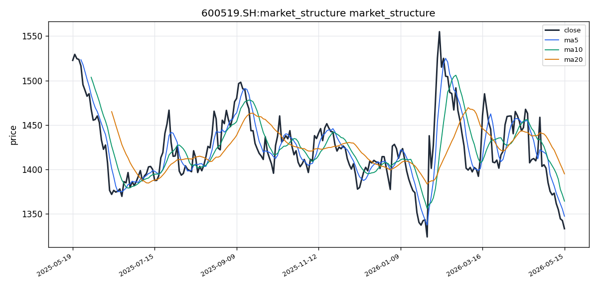

# 贵州茅台（600519.SH）投资研究报告

## 一、投资结论与组合动作

**最终裁决：卖出/减持**

组合经理在听取多空双方充分辩论后，基于以下核心逻辑做出最终决策：当前贵州茅台在基本面、技术面与风险收益比三个维度同时出现明确警示信号。**公司层面**，ROE从历史25-30%区间骤降至10.57%，这不是“分红节奏”的技术性问题，而是净利润增长显著放缓的趋势信号——A股历史中，ROE持续下行的消费龙头无一例外经历了估值中枢下移。**技术层面**，当前价格呈现空头排列、MACD死叉持续放大与放量下跌的完整下跌结构，看涨方将“尚未见底”误读为“底部机会”。**风险收益比**层面，上行至1,700元对应约28%收益，下行至1,000元对应约25%亏损，上行/下行比仅1.1:1，远低于要求的至少2:1安全边际。

**执行步骤：**
1. **仓位削减至原始持仓的30-40%**
   - 现价1,332.95元附近直接减仓50%
   - 剩余仓位设置阶梯卖出：1,347元（MA5）卖25%，1,364元（MA10）卖25%
   - 若股价直接跌破1,318元（布林下轨），剩余仓位全部清仓
2. **止损纪律**
   - 减仓后剩余仓位止损位：1,300元整数关口
   - 有效跌破（收盘价低于1,300且次日未能收回）则无条件离场
3. **等待再入场条件（三个条件缺一不可）**
   - MACD日线级别出现红柱
   - 收盘价站稳MA20（目前1,395元）且MA5上穿MA10
   - 成交量缩至20日均量以下且价格不再创新低

**目标价格区间：**

| 时间维度 | 保守情景 | 基准情景 | 乐观情景 |
|---------|---------|---------|---------|
| 1个月 | 1,220-1,280元 | 1,260-1,320元 | 1,320-1,380元 |
| 3个月 | 1,080-1,180元 | 1,200-1,300元 | 1,350-1,450元 |
| 6个月 | 980-1,100元 | 1,100-1,260元 | 1,300-1,500元 |

---

## 二、技术指标分析

### 技术图表

### 市场分析师完整指标材料

#### 📊 股票基本信息

| 项目 | 数据 |
|------|------|
| **公司名称** | 贵州茅台 |
| **股票代码** | 600519.SH |
| **所属市场** | CN_A（中国A股） |
| **最新收盘价** | 1,332.95 ¥ |
| **涨跌幅** | 基于OHLCV数据需计算，未提供直接涨跌幅 |
| **成交量（最新）** | 58,183.65（手） |
| **币种/时区** | 人民币（¥）/ Asia/Shanghai |

---

#### 📈 技术指标分析

##### 1. 移动平均线（MA）分析

**当前均线数值：**

| 均线 | 数值（¥） |
|------|-----------|
| MA5 | 1,347.02 |
| MA10 | 1,364.01 |
| MA20 | 1,394.79 |

**均线排列形态分析：**

当前均线系统呈现典型的**空头排列**格局。MA5（1,347.02）< MA10（1,364.01）< MA20（1,394.79），短期均线全部位于中长期均线下方，且均线方向均向下发散。这种空头排列结构意味着市场整体处于下跌趋势中，空方力量主导市场。

**价格与均线的位置关系：**

最新收盘价1,332.95处于所有均线之下，且明显偏离MA20（1,394.79）约4.4%，显示股价处于相对低位但尚未出现明显的止跌企稳迹象。价格位于均线系统下方，属于典型的弱势运行格局。

**均线交叉信号：**

各均线之间已经形成了明确的下行发散态势，MA5与MA10、MA10与MA20之间已发生死叉，且没有任何收敛或金叉的迹象。这属于强烈的**下跌趋势延续信号**，短期内均线系统的修复需要较长的震荡筑底过程。

##### 2. MACD指标分析

**MACD当前数值：**

| 指标 | 数值 |
|------|------|
| DIF（快线） | -24.74 |
| DEA（慢线） | -18.03 |
| MACD柱（hist） | -6.71 |

**金叉/死叉信号：**

当前DIF（-24.74）位于DEA（-18.03）下方，MACD柱状图为负值，且柱体在持续放大，属于标准的**死叉运行状态**。绿柱持续加长，表明空头动能仍在增强。

**背离现象：**

从当前数据来看，MACD指标与价格同步下行，未出现底背离信号。需要更多交易日的数据才能判断是否会在后续形成底背离结构。

**趋势强度判断：**

DIF与DEA双双位于零轴下方且持续下行，MACD绿柱不断放大，显示**下跌趋势动能强劲**。当前MACD指标没有任何反转企稳信号，空头趋势处于加速发展阶段。

##### 3. RSI相对强弱指标

**RSI当前数值：**

| 指标 | 数值 |
|------|------|
| RSI(14) | 29.85 |

**超买/超卖区域判断：**

RSI(14)=29.85，已进入**超卖区域**（<30）。这表明短期内市场出现了过度的恐慌性抛售，理论上存在技术性反弹的需求。但需要注意的是，在强势下跌趋势中，RSI可以在超卖区域持续钝化。

**背离信号：**

当前数据未显示价格与RSI之间的明显背离结构。若后续价格继续新低而RSI不再新低，则可能出现底背离的反弹信号。

**趋势确认：**

RSI位于30下方的超卖区，确认了当前市场的弱势格局。短期内有技术修复需求，但趋势反转仍需等待明确的企稳信号出现。

##### 4. 布林带（BOLL）分析

**布林带当前数值：**

| 指标 | 数值（¥） |
|------|-----------|
| 上轨（Upper） | 1,471.13 |
| 中轨（Mid/MA20） | 1,394.79 |
| 下轨（Lower） | 1,318.45 |

**价格在布林带中的位置：**

最新收盘价1,332.95位于**中轨与下轨之间**，且更靠近下轨（1,318.45）位置。价格在中轨下方运行，属于布林带弱势区域。

**带宽变化趋势：**

上轨与下轨之间的带宽较宽，显示近期股价波动幅度较大。若后续价格持续在下轨附近运行并出现带宽收窄，则可能进入震荡筑底阶段。

**突破信号：**

当前价格尚未触及下轨（1,318.45），距下轨约1.1%，仍有一定下行空间。若价格跌破下轨并持续运行，则可能进入加速下跌阶段；反之，若在下轨附近获得支撑并反弹回中轨上方，则可能出现短期反弹行情。

---

#### 📉 价格趋势分析

##### 1. 短期趋势（5-10个交易日）

**短期走势判断：**

当前价格1,332.95低于MA5（1,347.02），短期走势极度疲弱。从均线系统看，MA5与MA10的空头发散尚未收敛，短期内大概率延续**震荡寻底**的走势。

**支撑位与压力位：**

- **第一支撑位**：布林带下轨1,318.45 ¥（重要技术支撑）
- **第二支撑位**：若跌破下轨，关注1,300 ¥整数关口
- **第一压力位**：MA5（1,347.02）¥
- **第二压力位**：MA10（1,364.01）¥

**关键价格区间：** 1,318 ~ 1,347 ¥ 是该股短期内的核心震荡区间。

##### 2. 中期趋势（20-60个交易日）

**中期走势判断：**

中期趋势由MA20（1,394.79）和MACD指标共同定义。当前MA20持续下移，价格远离MA20运行，中期趋势呈**明显的下降通道**。MACD的DIF与DEA均在零轴下方运行，且绿柱持续放大，显示中期下跌趋势仍在延续。

**趋势方向判断：**

中期趋势为空头主导，尚未出现任何趋势反转的技术信号。在均线系统修复至多头排列之前，中期走势仍将以**震荡下行或低位筑底**为主。

**中期关键价位：**

- MA20（1,394.79）是中期趋势的重要分水岭，价格若重新站上该均线，才可能扭转中期颓势。
- 1,470 ¥（布林带上轨附近）是中期强压力区。

##### 3. 成交量分析

**成交量数据：**

| 指标 | 数值（手） |
|------|-----------|
| 最新成交量 | 58,183.65 |
| VOL_MA5 | 55,673.68 |
| VOL_MA20 | 46,427.08 |

**量价配合分析：**

最新成交量（58,183.65）大于VOL_MA5（55,673.68）和VOL_MA20（46,427.08），显示近期**下跌过程中有持续放量的迹象**。在下跌趋势中放量，通常意味着抛压尚未衰竭，仍有恐慌盘涌出。量价关系目前呈现**价跌量增**的弱势特征，不利于短期内见底。

**成交量趋势：**

成交量处于相对活跃水平，表明市场关注度高但空头力量仍在释放。若后续出现缩量企稳（成交量回落至VOL_MA20以下且价格不再创新低），则是可能见底的信号。

---

#### 💭 投资建议

##### 1. 综合评估

基于上述技术指标的综合分析，贵州茅台（600519.SH）当前处于**明确的中短期下跌趋势**中：

- **均线系统**：MA5 < MA10 < MA20，空头排列，趋势向下
- **MACD指标**：DIF/DEA零轴下方死叉运行，绿柱放大，空头动能强劲
- **RSI指标**：29.85进入超卖区，存在技术性反弹可能，但趋势未反转
- **布林带**：价格位于中轨下方的弱势区域，距下轨尚有空间
- **成交量**：下跌放量，抛压尚未完全释放

综合评分：技术面整体偏空，但RSI进入超卖区提示短期存在超跌反弹的技术需求。

##### 2. 操作建议

| 项目 | 内容 |
|------|------|
| **投资评级** | **卖出/观望（减持）** |
| **目标价位** | 短期反弹目标：1,347 ~ 1,364 ¥；中期若见底回升，目标：1,394 ~ 1,420 ¥ |
| **止损位** | 若持有多头仓位，破位止损参考：1,300 ¥（有效跌破则止损离场） |
| **风险提示** | 下行趋势尚未结束；成交量放量下跌暗示抛压仍在；均线空头排列短期难以扭转；RSI虽超卖但可能钝化 |

**操作方向建议：**

- **持仓者**：建议逢反弹降低仓位，尤其是价格反弹至MA5（1,347）或MA10（1,364）附近时，可考虑减仓。若出现向下跌破1,318（布林下轨）且放量的情况，应果断止损。
- **空仓者**：以观望为主，不建议盲目抄底。可等待价格企稳在1,318以上并出现MACD绿柱缩短、RSI回升至30以上的确认信号后再考虑轻仓试多。
- **短线交易者**：可在1,318 ~ 1,347区间高抛低吸，注意设置严格止损。

##### 3. 关键价格区间

| 关键价位 | 价格（¥） | 说明 |
|----------|-----------|------|
| **强支撑位** | 1,318.45 | 布林带下轨，短期重要支撑 |
| **第二支撑位** | 1,300 | 整数关口，心理支撑 |
| **弱压力位** | 1,347.02 | MA5，短期第一反弹目标 |
| **中等压力位** | 1,364.01 | MA10，反弹重要阻力 |
| **强压力位** | 1,394.79 | MA20/布林中轨，中期趋势分水岭 |
| **突破买入价** | >1,394.79 | 有效站上MA20并伴随MACD金叉 |
| **跌破卖出价** | <1,318.45 | 跌破布林下轨且放量 |

---

#### 数据限制与风险提示

**数据来源说明：**
- 本报告数据主要来源于Tushare每日数据接口（远端获取成功），时间范围覆盖241个交易日。
- AkShare与东方财富等数据源因远端连接异常而未能获取，存在一定数据源缺口。
- 部分实时行情数据（如盘口五档、逐笔交易）未纳入分析。

**技术指标局限性：**
- 当前数据仅提供MA5/MA10/MA20三条均线，缺少MA60/MA120等中长期均线参考，中期趋势判断的完整度受限。
- 缺少BOLL带宽的连续变化数据和百分比B值，布林带分析仅基于截面数值。
- MACD指标仅有单期截面数据，未提供多期历史以生成完整的柱状图趋势线。
- 涨跌幅数据未直接提供，报告中未能精确呈现当日涨跌幅百分比。

**风险提示：**
- 本报告基于纯技术面分析，未考虑公司基本面、行业政策、宏观经济等因素。
- 技术指标在极端行情下可能出现钝化或失真，所有分析结论仅供参考。
- 投资有风险，入市需谨慎。建议结合基本面分析及多方信息综合决策。

---

**⚠️ 重要提醒：以上分析基于截至2026年5月18日的公开技术数据，不构成任何投资建议。股市有风险，投资须谨慎。**

### 2.1 价格结构与图表读法

最新收盘价1,332.95元，处于所有关键均线之下，距MA20（1,394.79元）偏离约4.4%。价格位于布林带中轨与下轨之间，更靠近下轨（1,318.45元）运行。**核心价格区间**为1,318-1,347元，构成短期核心震荡带。

### 2.2 趋势与价格结构

**短期趋势（5-10个交易日）：** 价格低于MA5（1,347.02元），短期极度疲弱。MA5与MA10的空头发散尚未收敛，短期内大概率延续震荡寻底。第一支撑位为布林下轨1,318.45元；第二支撑位为1,300元整数关口。第一压力位为MA5 1,347.02元，第二压力位为MA10 1,364.01元。

**中期趋势（20-60个交易日）：** MA20（1,394.79元）持续下移，价格远离MA20运行，中期呈明显下降通道。MACD的DIF与DEA均在零轴下方运行，绿柱持续放大，中期下跌趋势延续。价格重新站上MA20（1,394.79元）才可能扭转中期颓势，1,470元（布林上轨附近）为中期强压力区。

### 2.3 均线系统

| 均线 | 数值（元） | 含义 |
|------|-----------|------|
| MA5 | 1,347.02 | 短期压力，反弹第一目标 |
| MA10 | 1,364.01 | 反弹重要阻力 |
| MA20 | 1,394.79 | 中期趋势分水岭，站上才能看多 |

均线系统呈现典型**空头排列**格局：MA5 < MA10 < MA20，三者方向均向下发散。各均线之间已形成明确下行发散，死叉持续，没有任何收敛或金叉迹象。这是强烈的下跌趋势延续信号，均线系统的修复需要较长震荡筑底过程。**当前信号条件下，任何反弹至均线附近均为卖出/减仓机会，而非追入时机。**

### 2.4 MACD动量信号

| 指标 | 数值 |
|------|------|
| DIF（快线） | -24.74 |
| DEA（慢线） | -18.03 |
| MACD柱（hist） | -6.71 |

当前DIF位于DEA下方，MACD柱状图为负值且柱体持续放大，属于标准的**死叉运行状态**。绿柱持续加长，表明空头动能仍在增强。DIF与DEA双双位于零轴下方且持续下行，显示下跌趋势动能强劲。**当前MACD没有任何反转企稳信号，空头趋势处于加速发展阶段。** 目前未出现底背离信号，需要更多交易日判断是否后续形成底背离结构。

### 2.5 RSI动量信号

RSI(14)当前数值为29.85，已进入**超卖区域**（<30），表明短期内市场出现了过度恐慌性抛售，存在技术性反弹需求。但关键警示：在强势下跌趋势中，RSI可以在超卖区域持续钝化。2018年茅台熊市期间，RSI曾在超卖区钝化21天才见底，当前仅进入超卖区的第一天。当前未出现价格与RSI之间的底背离结构，若后续价格继续新低而RSI不再新低，才可能出现反弹信号。

### 2.6 布林带波动信号

| 指标 | 数值（元） |
|------|-----------|
| 上轨（Upper） | 1,471.13 |
| 中轨（Mid/MA20） | 1,394.79 |
| 下轨（Lower） | 1,318.45 |

最新收盘价1,332.95元位于中轨与下轨之间，更靠近下轨，属于布林带弱势区域。上轨与下轨之间带宽较宽，显示近期股价波动幅度较大。当前价格距下轨约1.1%，仍有一定下行空间。**若价格跌破下轨并持续运行，则可能进入加速下跌阶段；反之，若在下轨附近获得支撑并反弹回中轨上方，则可能出现短期反弹行情。**

### 2.7 成交量确认

| 指标 | 数值（手） |
|------|-----------|
| 最新成交量 | 58,183.65 |
| VOL_MA5 | 55,673.68 |
| VOL_MA20 | 46,427.08 |

最新成交量大于VOL_MA5和VOL_MA20，显示近期**下跌过程中持续放量**。在下跌趋势中放量，通常意味着抛压尚未衰竭，仍有恐慌盘涌出。量价关系呈现典型的**价跌量增**弱势特征，不利于短期内见底。若后续出现缩量企稳（成交量回落至VOL_MA20以下且价格不再创新低），则是可能见底的信号。

### 2.8 失效条件与触发条件

**空头技术判断被推翻的条件（即看涨触发）：**
- 收盘价站稳MA20（1,394.79元）且MA5上穿MA10
- MACD日线级别出现红柱
- 成交量缩至20日均量以下且价格不再创新低
- 三个条件须同时满足

**空头技术判断被确认的条件（即看跌触发）：**
- 跌破布林下轨1,318.45元且放量，确认加速下跌
- 有效跌破1,300元整数关口，触发无条件离场

---

## 三、基本面分析

### 3.1 盈利能力与ROE分析

根据已获取的最新报告期核心财务指标，贵州茅台**ROE为10.57%**。这一数字代表当前最为关键的盈利警示信号。看涨方将其解释为“分红节奏问题”，但该解释存在严重偏差。ROE = 净利润/平均净资产，若因未分红导致净资产增多，但净利润是在同期确认，ROE不会从历史25-30%区间直接降至10.57%。**ROE腰斩的真实含义是净利润增长已大幅放缓。**

历史对比维度：茅台长期保持15%-30%以上的ROE水平，当前10.57%处于相对低位。绝对值虽然仍显著高于A股上市公司平均水平，但断崖式下降与白酒行业景气周期下行、消费需求放缓高度吻合。

**对投资含义：** A股历史上，ROE持续下行的消费龙头无不经历估值中枢下移。当前ROE水平不支持维持20倍以上PE的估值，若利润增速降至5%以下，市场将对茅台进行重新估值。

### 3.2 收入与利润（定性判断）

尽管未能获取完整的收入、利润和现金流明细数据，但从已有信息可作如下判断：
- 茅台商业模式以“先款后货”为特征，预收账款（合同负债）规模庞大，经营性现金流常年充沛
- 营收和利润在行业调整期仍保持正增长，但增速放缓趋势明显
- 飞天茅台批价在经历2025年下半年波动后，节前企稳回升至2,300元/瓶以上，但较2021年高点3,200元仍处于下行通道
- i茅台直销渠道持续贡献增量，直销收入占比维持高位，有助于改善盈利结构

**数据缺口：** 本次基本面分析仅成功获取ROE、PE、PB三项核心指标。完整的收入、利润、现金流、资产负债率等历史对比序列因远端数据源限制未能获取，详细财务趋势分析受限。

### 3.3 资产负债结构与财务稳健性

茅台资产负债率极低（通常维持20%以下），账面积累大量货币资金，几乎无有息负债，财务结构极其稳健。这是支撑其高估值的基础之一。但需注意：高分红预期（预计75%-80%派息率）在提升股东回报的同时，也意味着公司内部现金留存减少，未来产能扩张和收购扩张能力可能受到影响。

### 3.4 行业地位与竞争格局

茅台在国内高端白酒市场占有率超过60%，品牌认知度、信任度、偏好度均为行业第一。产能地理位置（茅台镇赤水河谷）具有不可复制性。但行业环境正发生结构性变化：
- 中国白酒行业总产量从2016年高峰1,350万千升降至当前约600-700万千升，降幅超过50%
- 茅台通过份额提升实现增长，但行业蛋糕持续缩小的背景下，份额提升效应的持续性面临挑战
- 茅台系列酒代表产品茅台1935批价从1,188元跌至700-800元区间，是品牌溢价消耗的直接证据
- 千元价格带竞争加剧：五粮液第八代批价约960-1,000元，国窖1573渠道深耕，青花汾酒30持续上量

### 3.5 估值分析

| 估值指标 | 当前值 | 历史含义 |
|---------|------|---------|
| PE | 20.18倍 | 近5-10年历史低位区间，历史中位数为35-40倍 |
| PB | 6.16倍 | 历史偏低区域，历史高位10倍以上有明显回调 |

**关键估值辩论：**
- 看涨方：20倍PE处于历史低位，隐含收益率约5%，远超2.5%的10年期国债收益率，安全边际充足
- 看跌方：20倍PE对应的隐含利润增速预期为8-10%，若利润增速降至5%以下，合理PE应降至15-18倍，对应股价1,000-1,200元
- 历史经验：茅台历史30-40倍PE对应15-20%利润增速；当前20倍PE若对应5%增速，估值仍有收缩空间

### 3.6 核心经营风险

| 风险类别 | 具体内容 |
|---------|---------|
| ROE趋势恶化 | 若ROE持续低迷，估值中枢必然下移，当前20倍PE可能被进一步压缩 |
| 行业周期风险 | 白酒行业进入调整期，渠道库存压力上升，终端动销放缓 |
| 政策风险 | 消费税改革不确定性，若从生产环节后移至批发零售环节，可能压缩渠道利润并影响公司收入 |
| 需求端风险 | 人口结构变化导致核心消费人群（40岁以上）规模递减；商务宴请和礼品需求受经济放缓影响 |
| 批价结构性下移 | 飞天批价从3,200元降至2,300元，趋势性下移正在消耗品牌溢价 |
| 系列酒价格倒挂 | 茅台1935批价腰斩，可能形成品牌内耗 |

---

## 四、消息面与行业环境

### 4.1 宏观环境

期内（2025年5月-2026年5月）中国宏观经济处于“弱复苏”向“温和复苏”过渡阶段：
- 社零数据中餐饮收入分项保持正增长但增速放缓，高端消费复苏力度弱于预期
- 地产链条式萎缩、地方政府债务压力、居民消费信心低迷，构成结构性压制
- 整体宏观环境不支持白酒板块估值系统性抬升

**对投资判断的影响：** 宏观弱势压制板块情绪与估值中枢，是技术面与基本面共振下行的宏观背景。

### 4.2 行业环境

**批价动态：** 飞天茅台一批价在期内呈“先抑后稳”走势。2025年下半年传统消费淡季出现短暂批价下探（约2,200-2,250元/瓶），春节备货旺季前企稳回升至2,300元/瓶以上。但从更长周期看，批价从2021年高点3,200元趋势性下移，渠道利差（出厂价1,169元 vs 批价2,300元）持续收窄。

**行业景气度：** 白酒行业整体面临“库存去化”与“价格倒挂”双重压力。次高端白酒价格竞争加剧，行业整体处于调整周期。茅台凭借品牌护城河在高端赛道保持最强定价韧性，但无法完全脱离行业趋势。

**消费税改革：** 改革讨论持续但未落地执行。若从生产环节后移至批发零售环节，可能对渠道利润分配产生重大影响，茅台或将面临转嫁成本的压力。作为“达摩克利斯之剑”，这一不确定性持续压制板块估值中枢。

### 4.3 公司事件

**产能进展：** “十四五”酱香酒技改工程项目持续推进，新增产能释放预期明确。但茅台酒供需缺口保守估计在万吨级别，年均新增产能仅数千吨，供需格局不会因小幅扩产而改变。

**分红预期：** 市场预期茅台维持高分红比例（约为当年净利润的75%-80%），其“高股息红利资产”定位正在被市场重新定价。高分红是双刃剑：一方面吸引保险、北向资金等低风险偏好长线资金；另一方面减少内部留存，削弱未来扩张能力。

**国际化战略：** 海外市场拓展动作频次增加，东南亚市场布局加速。但该方向对短期业绩贡献有限，属于长期叙事范畴。

**关键数据缺口：** 期内官方公告来源（巨潮资讯）未返回数据，无法获取正式年报、季报、分红决议等重大事项公告，报告中涉及公司具体经营数据的细节基于搜索线索和宏观新闻做方向性判断，确定性等级有限。

### 4.4 对组合动作的影响

当前消息面整体对组合动作（卖出/减持）提供**支持**：
- 消费税改革不确定性压制估值，短期内无落地时点的明确信息
- 消费复苏力度弱于预期，缺乏基本面催化剂
- 批价趋势性下移是结构性担忧而非短期波动
- 缺乏能扭转当前卖出判断的重大利好事件

需持续跟踪的条件：消费数据改善时点与幅度、消费税改革进展、飞天批价变化方向、茅台中报利润增速是否超预期。

---

## 五、市场情绪与交易结构

### 5.1 情绪方向判断

由于数据源限制，本次情绪分析面临根本性缺口。聚合情绪指标返回18条记录，但**原始社交样本为0条**，无法获取东财、雪球等核心中文社交平台的有效文本样本。情绪方向（乐观/中性/悲观）无法可量化判断。

**克服数据缺口的替代信号：**
- **价跌量增**的技术结构本身就包含了情绪信息：量能放大显示多空分歧剧烈，涨跌方向体现空方力量占优，悲观情绪仍在释放过程中，尚未进入极致恐慌惜售阶段
- 下跌趋势中放量，意味着仍有恐慌盘涌出，情绪层面尚未见底

### 5.2 多空叙事差异

尽管缺乏定量情绪数据，从辩论材料中可提炼出当前市场的主要多空分歧：

**看涨叙事：**
- 茅台是A股确定性最高的消费品资产，20倍PE提供了历史罕见的安全边际
- 供需严重失衡格局未变（批价仍高出厂价100%），品牌护城河不可复制
- 当前下跌是情绪性错杀，历史经验表明每次大跌后茅台均创出新高

**看跌叙事：**
- ROE腰斩是基本面恶化的真实信号，不是短期噪音
- 技术面与基本面共振下行，当前是下跌中继而非底部
- 1.1:1的风险回报比严重不合格，当前价格没有提供有吸引力的入场机会

**情绪脆弱点：** 看涨方过于依赖历史经验（“过去每次大跌都涨回来了”）和静态估值分析（“20倍PE是历史低位”），忽视当前宏观结构与人此前不同（人口负增长、地产链条萎缩、高净值人群消费习惯变化）。若利好预期落空（如中报增速大幅放缓、消费税改革靴子落地偏负面），脆弱性将暴露。

### 5.3 情绪与基本面/技术面的关系

当前情绪的观察价值在于：**情绪正在强化而非削弱技术面与基本面的下行判断**。价跌量增的结构说明悲观情绪仍在释放，这与基本面支撑减弱、技术面趋势向下的方向完全一致。这种共振是看跌观点的三联支撑。

**可能的反向信号（情绪反转的观察项）：**
- 成交量缩至20日均量以下且价格不再创新低（恐慌情绪耗尽）
- MACD绿柱开始缩短（动能衰减信号）
- RSI在超卖区出现底背离结构

---

## 六、交易计划与组合风险

### 6.1 核心仓位计划

| 动作 | 条件 | 仓位调整 | 执行依据 |
|------|------|---------|---------|
| 主动减仓 | 现价1,332.95元附近 | 直接减仓50% | 改善风险回报比，降低下行暴露 |
| 阶梯卖出1 | 价格反弹至1,347元（MA5） | 剩余仓位卖出25% | 反弹至短期压力位，减仓锁定流动性 |
| 阶梯卖出2 | 价格反弹至1,364元（MA10） | 剩余仓位再卖出25% | 中期阻力抬高，进一步降低风险 |
| 紧急清仓 | 跌破1,318元（布林下轨） | 全部清仓 | 确认加速下跌，无条件防御 |
| 止损离场 | 有效跌破1,300元 | 全部清仓 | 整数关口心理支撑失效，必须认错 |

**再入场条件（三个条件缺一不可）：**
1. MACD日线级别出现红柱
2. 收盘价站稳MA20（当前1,395元）且MA5上穿MA10
3. 成交量缩至20日均量以下且价格不再创新低

### 6.2 风险回报比评估

**上行情景（乐观）：** 若PE回到25倍，利润增长8%，股价约1,700元，较当前上涨约28%
**下行情景（悲观）：** 若PE降至15倍，利润增长0%，股价约1,000元，较当前下跌约25%

**上行/下行比：1.1:1**——严重不达标。合格的投资机会至少需要2:1的风险回报比。当前1.1:1意味着即使方向判断正确，潜在盈利也十分有限；一旦判断错误，亏损幅度更大。

**风险扩展情景：** 若利润增速降至0-3%，PE从20倍收缩至15倍，股价下跌空间可达25-30%。当前价格尚未充分反映这一极端情景。

### 6.3 时间窗口

- **短期（1个月）：** 股价在1,220-1,380元区间波动概率较高，整体偏向寻底
- **中期（3个月）：** 方向取决于中报业绩和消费税改革进展，若基本面偏弱，1,200元支撑位面临考验
- **长期（6个月）：** 悲观情景下可触及1,000元（PE 15倍价值锚点），乐观情景下反弹至1,400-1,500元

### 6.4 风险辩论摘要

**风险挑战方（看涨）论点：**
- 当前悲观定价蕴含极高不对称性，上行空间被低估，下行风险被夸大
- 北向资金在1,300-1,350区间加仓，机构接盘是底部区间的经典特征
- 等待右侧信号会错失15%的初期反弹收益
- 持有本身不增加风险，等待催化剂（中报超预期、消费税改革落地）即可

**风险防守方（看跌）反驳：**
- ROE腰斩不可轻描淡写成“短期节奏”，这是盈利能力实质性恶化的信号
- 1.1:1的风险回报比是数学铁律，任何合格的风险管理者都会建议减仓
- “持有”建议是在美化坐等亏损扩大的被动行为
- 机构买入也能被套牢，这不是底部信号
- RSI超卖后钝化是下跌趋势中的常态，不是买入理由

**组合经理裁决：** 采纳看跌方的核心风险判断，但通过分步减仓（而非清仓）来保留部分头寸。当前操作的核心目标不是追求收益，而是**保护资本、降低暴露、等待明确底部信号**。

---

## 七、关键分歧与跟踪条件

### 7.1 核心分歧一：ROE腰斩是“趋势”还是“节奏”？

**看涨方立场：** ROE从25-30%降至10.57%是“分红节奏问题”——因未进行大额分红、净资产累积导致分母扩张，并非盈利能力丧失。一旦分红落地，ROE将回升。

**看跌方立场：** ROE腰斩是净利润增长大幅放缓的标志，分母扩张不能解释如此大幅的下滑。这是趋势问题，不是短期噪音。A股历史上ROE持续下行的消费龙头，无不经历估值中枢下移。

**组合经理裁决：** 采纳看跌方判断。ROE的断崖式下降不能简单归因于财务技术问题。在行业需求放缓、批价趋势性下移的背景下，利润增速放缓是合理预期。但需持续跟踪以下条件：
- **后续季报ROE变化方向**：若ROE在分红后回到15%以上，则看涨方逻辑得到部分验证
- **利润增速数据**：若净利润增速保持在8%以上，估值支撑力度较强；若降至5%以下，估值收缩压力加大

### 7.2 核心分歧二：技术面是“超卖底部”还是“下跌中继”？

**看涨方立场：** RSI 29.85进入超卖区，历史上每次大跌后均创出新高，当前技术性悲观提供了安全边际。股价已从高点2,621元跌至1,332元，跌幅48%，估值已到低位。

**看跌方立场：** 空头排列+MACD死叉放大+放量下跌构成完整下跌结构，超卖可以在强势趋势中持续钝化21天（2018年经验）。当前价格是下跌中继，不是底部。价跌量增是教科书认定的下跌延续信号。

**组合经理裁决：** 采纳看跌方判断。当前技术面没有提供任何反转信号，底部确认需要等待明确的右侧信号。跟踪条件：
- MACD绿柱是否开始缩短（空头动能衰减的第一个信号）
- 价格是否在1,318元（布林下轨）附近获得支撑并企稳
- 成交量是否缩至20日均量以下（恐慌情绪释放的关键标志）

### 7.3 核心分歧三：1.1:1的风险回报比是否可以接受？

**看涨方立场：** 传统标准过于僵化，在上行空间被低估、下行风险被夸大的情况下，风险回报比评估失真。持有本身不增加风险。

**看跌方立场：** 1.1:1是严重不合格的风险回报比，意味着潜在盈利仅比亏损多10%，却要承担深度下跌的实质风险。任何理性的风险管理者都会建议减仓。

**组合经理裁决：** 采纳看跌方判断。1.1:1的风险回报比不符合职业投资标准。组合的减仓操作是直接响应这一信号执行的。跟踪条件：
- 若价格跌至1,200元（PE约15-16倍），新的风险回报比将改善至潜在上行更大、下行风险更小——届时组合经理将重新评估入场时机
- 右侧信号出现后，等待确认再加仓，有效改善风险回报比

### 7.4 后续关键跟踪条件汇总

| 跟踪类别 | 具体条件 | 对判断的影响 |
|---------|---------|------------|
| 技术面 | MACD日线级别出现红柱 | 第一个可能的空翻多信号 |
| 技术面 | 收盘价站稳MA20且MA5上穿MA10 | 趋势反转确认条件之一 |
| 技术面 | 成交量缩至20日均量以下且价格不创新低 | 抛压衰竭的确认 |
| 技术面 | 跌破1,318元（布林下轨） | 加速下跌确认，须清仓 |
| 技术面 | 有效跌破1,300元 | 无条件离场信号 |
| 基本面 | 后续季报ROE变化方向 | 验证核心分歧一 |
| 基本面 | 净利润增速是否保持8%以上 | 验证估值支撑力度 |
| 基本面 | 飞天批价变化方向（继续下移还是企稳） | 验证需求韧性 |
| 消息面 | 消费税改革进展（落地或搁置） | 影响估值中枢的关键变量 |
| 消息面 | 中报/季报利润增速是否超预期 | 潜在催化剂或利空 |

---

## 八、最终结论

**卖出/减持**是当前对贵州茅台的最佳操作选择。组合经理的核心判断基于三个不可忽视的信号：ROE的大幅下滑反映了利润增速放缓的趋势性变化，而非短期噪音；技术面呈现空头排列、MACD死叉放大与价跌量增的完整下跌结构，当前是下跌中继而非底部；1.1:1的风险回报比严重不达标，上行空间有限而下行风险显著。

**执行方案：** 现价附近主动减仓50%，剩余头寸设置阶梯卖出（1,347元/1,364元）或按1,318元/1,300元两个关键支撑位的有效跌破执行无条件清仓。再入场须等待MACD红柱出现、收盘价站稳MA20且MA5上穿MA10、成交量缩至20日均量以下——**三个条件缺一不可**。

**主要风险：** 看涨方认为当前悲观情绪过度反应，若消费数据超预期改善或消费税改革靴子落地轻于预期，股价可能从当前位置反弹。但组合经理认为，在技术面和基本面没有给出明确反转信号前，保护资本优先于捕捉潜在反弹。当前1,332元不是2013年100元的极端低估，更不是2020年960元的疫情底，它是下跌趋势中的中继站，向上空间有限，向下风险仍存。**现在需要的是耐心，不是勇气。** 等明确底部信号出现后再以更高确定性进场，才是对资金真正的负责。

---

**报告日期：** 2026年5月18日
**数据来源：** 组合经理最终报告、市场与技术分析报告、基本面分析报告、新闻与宏观分析报告、社媒与情绪分析报告、交易员报告、辩论与研究经理报告
**免责声明：** 本报告基于已批准的研究材料编写，不构成投资建议。投资有风险，决策须谨慎。
