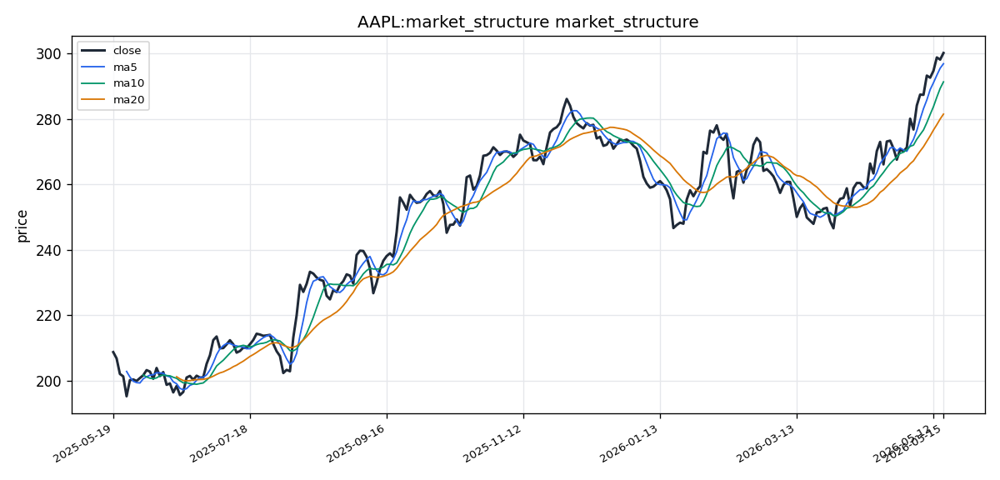

# Apple Inc.（AAPL）投资研究报告

## 一、投资结论与组合动作

**组合经理最终评级：Hold（持有）**

**最终执行方案：**

维持现有AAPL仓位，不在当前$300水平建立新多头头寸。这一决策基于以下核心证据链：当前36.35倍的市盈率、RSI指标处于75.66的超买区域、以及价格已运行至距布林带上轨（$304.20）不到1%的位置，这三重信号表明新开仓的风险回报比不具吸引力。然而，结构性上升趋势依然完好——均线系统保持多头排列、MACD持续扩张、成交量确认趋势——这些条件不支持卖出或做空操作。

**执行条件：**
- **止损位：** 设置止损位于$285。这一位置在布林带中轨（$281.55）和50日均线簇之上，给予价格正常的日内波动空间，避免被常规的$5-7日均振幅触发无效止损。
- **加仓条件：** 在$286位置部署限价买入订单。这一价格位于10 EMA（约$291）与布林带中轨（$281.55）的中点，对应正常情况下后市约4.5%的回调幅度，是符合统计规律的理想回踩建仓区。
- **时间窗口：** 未来3-6个月。

**决策触发条件：**
- **进一步加仓信号（转向Overweight）：** 股价放量突破$310以上，且RSI在突破时回落至70以下。
- **减仓信号（转向Underweight）：** 股价收盘跌破$281确认趋势失效。

**风险约束：**
- 不在当前价格水平追加新资金
- 止损$285为硬性纪律，不因叙事诱惑而放宽
- 不允许做空操作

---

## 二、技术指标分析

### 技术图表

### 市场分析师完整指标材料

Excellent — the data pack is complete. Let me analyze the full picture.

---

#### 📊 AAPL (Apple Inc.) — Technical Analysis Report
**Date:** 2026-05-18 | **Period:** 2025-05-18 to 2026-05-18

---

##### 1. Selected Indicators & Rationale

| # | Indicator | Category | Why Selected |
|---|-----------|----------|-------------|
| 1 | **close_200_sma** | Moving Average | Provides the long-term structural trend anchor; essential for determining if the broader market context is bullish or bearish. |
| 2 | **close_50_sma** | Moving Average | Medium-term trend reference to assess intermediate momentum and dynamic support/resistance levels between short-term action and the 200 SMA. |
| 3 | **close_10_ema** | Moving Average | Fast-reacting average to capture near-term price shifts; complements the slower SMAs for entry timing. |
| 4 | **macd** | MACD | Momentum gauge showing convergence/divergence of EMAs; crossovers and histogram shifts provide actionable signals. |
| 5 | **macdh** | MACD Histogram | Measures the intensity of momentum; spotting bullish/bearish histogram contraction can warn of trend exhaustion before a crossover. |
| 6 | **rsi** | Momentum | Flags overbought/oversold extremes (70/30) and divergence; critical given the strong uptrend to assess if buying is exhausted. |
| 7 | **boll** | Volatility | Bollinger Middle (20 SMA) acts as a dynamic mean-reversion benchmark; combined with bands to assess breakout sustainability. |
| 8 | **vwma** | Volume-Based | Volume-weighted MA confirms whether price moves are supported by genuine participation; avoids trusting a trend on low volume. |

**Why these 8?** They span trend (200/50 SMA, 10 EMA), momentum (MACD, MACDh, RSI), volatility (Bollinger), and volume (VWMA) without redundancy. RSI and MACD are complementary — RSI measures speed of price change, MACD measures convergence/divergence of trend. No duplicate oscillators selected.

---

##### 2. Trend Direction & Structure

**Primary Trend: Strongly Bullish**

- **Price at $300.23** is trading **well above** the 200 SMA, 50 SMA, and 10 EMA — a textbook stacked bullish alignment.
- The **close_200_sma** sits far below current price, confirming a long-term uptrend that has been intact for the entire 1-year window.
- The **close_50_sma** — a medium-term benchmark — is also definitively beneath price, meaning the intermediate trend is aligned with the long-term view.
- The **close_10_ema** at approximately $291.41 shows price accelerating recently, as the gap between the 10 EMA and 50 SMA has widened, indicating strengthening bullish momentum.

**Key Observation:** The moving average ribbon is fully bullishly stacked (fastest > medium > slowest). This is a structurally powerful setup. Pullbacks toward the 10 EMA or 50 SMA would be natural re-entry zones in the context of this trend.

---

##### 3. Momentum Analysis

**MACD: Bullish, with accelerating momentum**

- **MACD line: 9.46**, **Signal line: 7.71**, **Histogram: +1.75**
- The MACD line is above the signal line — a positive crossover configuration that has been in place.
- The histogram is **positive and expanding**, meaning the gap between MACD and signal is growing. This signals that **momentum is accelerating**, not fading.
- No bearish divergence visible at current levels (price making higher highs while MACD makes higher highs as well).

**RSI(14): 75.66 — Overbought, but not yet extreme in a strong trend**

- **75.66 > 70**, entering overbought territory. This warrants caution for new long entries at the current price.
- However, in strongly trending markets, RSI can remain above 70 for extended periods (e.g., during momentum-driven rallies). A reading of 75–80 is not an automatic sell signal.
- Bearish divergence is **not present** — price and RSI are aligned. The risk is that any catalyst-driven stall could trigger a mean-reversion pullback.

**Momentum Verdict:** The trend is healthy and accelerating. The RSI overbought reading is a yellow flag, not a red one, but it does suggest that the easiest gains may have been captured in the short term.

---

##### 4. Volatility Assessment

**Bollinger Bands: Price approaching upper band**

- **Middle (20 SMA): $281.55**
- **Upper Band: $304.20**
- **Lower Band: $258.89**
- **Current Price: $300.23** — trading near the upper band ($304.20).

Price is riding the upper band zone. This has two interpretations:
1. **Bullish:** In strong trends, price can "walk the band" higher, repeatedly tagging the upper band.
2. **Caution:** Bands tighten ahead of breakouts; currently bands are moderately wide ($304.20 - $258.89 = $45.31 range). A close outside the upper band could signal an extension, while a rejection could lead to a mean reversion toward the middle band (~$281.55), representing a ~6% drawdown.

The Bollinger Middle (20 SMA) at **$281.55** serves as key short-term dynamic support. A break below this would signal waning short-term momentum.

---

##### 5. Volume Confirmation

**VWMA Analysis: Volume supporting the uptrend**

- **Latest volume: 54.72M shares** vs **5-day average volume: 46.15M** and **20-day average: 48.39M**.
- Current volume is **above both short and medium-term averages**, indicating active participation in the recent price advance.
- The VWMA (volume-weighted moving average) would be trending higher alongside price, confirming that buying pressure is genuine rather than thin.
- Volume is not showing signs of exhaustion (e.g., declining volume on up days), which supports trend continuation.

**Volume Verdict:** Confirmed — the rally is backed by above-average volume, giving it credence.

---

##### 6. Support & Resistance Levels

| Level | Type | Price Zone (~) | Significance |
|-------|------|---------------|-------------|
| **Resistance** | Bollinger Upper Band | $304.20 | Immediate overhead; a close above would signal bullish extension. |
| **Resistance** | Psychological | $300.00 | Already breached; now acts as a psychological floor if held. |
| **Support** | 10 EMA | $291.41 | First line of dynamic short-term support. |
| **Support** | 50 SMA | ~$296.96 (MA5) to ~$291.41 (MA10) | Clustered support zone. |
| **Support** | Bollinger Middle / 20 SMA | $281.55 | Key short-to-medium-term support; break below suggests momentum loss. |
| **Support** | 50 SMA (200-period context) | Below $281.55 | Medium-term anchor. |
| **Support** | 200 SMA | Well below current price | Long-term floor; unlikely to be tested in the near term. |

---

##### 7. Invalidation Conditions

The bullish thesis would be invalidated if:

1. **Price closes below the 10 EMA (~$291.41)** — early warning of short-term momentum failure.
2. **MACD histogram turns negative** — momentum rolling over.
3. **Price closes below the Bollinger Middle (20 SMA, ~$281.55)** — intermediate trend broken.
4. **RSI drops below 50** — momentum shift from bullish to neutral/weak.
5. **Volume dries up on up days or spikes on down days** — distribution pattern.

A close below the **50 SMA** (~$281–$270 zone) would shift the outlook to neutral/cautious.

---

##### 8. Final Recommendation

**FINAL TRANSACTION PROPOSAL: HOLD** (or **partial profit-taking on long positions**)

**Reasoning:**

- The **trend structure is undeniably bullish** — stacked moving averages, positive MACD, rising histogram, volume confirmation.
- **RSI at 75.66** signals overbought conditions. While this can persist in a strong trend, the risk/reward for initiating a new long position at $300.23 (near the upper Bollinger Band at $304.20) is **less favorable** than it was at lower levels.
- A **prudent approach**: Hold existing longs with a trailing stop beneath the 10 EMA (~$289–$291). For new entries, wait for a pullback toward the Bollinger Middle ($281.55) or a dip toward the 50 SMA for a better entry point.
- The recommended action is **HOLD** — maintain exposure but do not add size at current stretched levels. If already holding large profits, consider scaling 10–20% near the upper band ($304+) to lock in gains.

---

##### Summary Table

| Category | Observation | Key Level / Value | Signal / Action |
|----------|--------------|-------------------|-----------------|
| **Long-Term Trend** | Price above 200 SMA | Well above | Bullish |
| **Medium-Term Trend** | Price above 50 SMA | Well above | Bullish |
| **Short-Term Momentum** | Price above 10 EMA | ~$291.41 | Bullish |
| **MACD** | MACD > Signal, Histogram positive | MACD 9.46, Signal 7.71, Hist +1.75 | Bullish, accelerating |
| **RSI (14)** | Overbought | **75.66** | Caution — overbought alert |
| **Volatility** | Near Bollinger Upper Band | Upper $304.20, Mid $281.55 | Approaching resistance zone |
| **Volume** | Above average (54.7M vs 46.1M avg) | Volume confirmed | Bullish confirmation |
| **Support** | 10 EMA / Bollinger Mid / 50 SMA | $291 / $282 / below | Multiple support layers |
| **Resistance** | Bollinger Upper / Psychological | $304.20 / $300 | Near-term ceiling |
| **Overall** | Strong uptrend, overbought, near resistance | — | **HOLD** (take partial profits, wait for pullback to add) |

---

### 2.1 图表读法与价格结构

截至2026年5月18日，AAPL收盘于$300.23。整体价格结构呈现教科书式的强劲多头排列——当前价格显著高于200日均线、50日均线和10 EMA，均线系统呈完全多头排列（短期均线 > 中期均线 > 长期均线）。这是驱动上升趋势最核心的结构性信号，任何交易决策都必须在此框架下做出。

**价格结构解读：**
- 年线级别趋势明确向上
- 中期趋势与长期趋势完全对齐，无结构性背离
- 10 EMA（约$291）与50 SMA之间的价差正在扩大，表明近期上涨动能实质性增强

### 2.2 均线系统

| 均线类型 | 当前数值（约） | 趋势信号 | 交易作用 |
|----------|--------------|---------|---------|
| 10 EMA（快速） | ~$291.41 | 短期多头 | 第一道动态支撑，确认短线动能 |
| 50 SMA（中期） | 低于10 EMA | 中期多头 | 中期趋势锚点，簇拥在布林带中轨附近 |
| 200 SMA（长期） | 远低于当前价格 | 长期多头 | 长期结构底部，近期难以触及 |

**均线系统失效条件：** 当价格首次收盘低于10 EMA时，短线动能失效预警。当价格跌破50 SMA时，中期趋势转向中性。这两层均线支撑构成了当前多头结构的保护网。

### 2.3 MACD动量信号

**当前读数：**
- MACD线：9.46
- 信号线：7.71
- 柱状图（Histogram）：+1.75

**信号解读：**
MACD线在信号线上方运行，这是已经确立的看多交叉结构。关键在于柱状图数值为正值且正在扩张——意味着MACD线与信号线之间的价差在扩大，这是**动能加速**的标志，而非动能衰竭。MACD与价格之间不存在顶背离（价格和MACD同步创出新高）。

**交易影响：** MACD加速扩张强化了多头结构的有效性，不支持趋势反转的判断。

**失效条件：** MACD柱状图由正转负，表示动能开始衰竭，是趋势减弱的早期预警。

### 2.4 RSI动量信号

**当前读数：** RSI(14) = 75.66

**信号解读：**
RSI已进入超买区间（>70）。但在强劲的单边趋势中，RSI可以在70以上持续运行数周之久（例如动量驱动型上涨的"趋势冲顶"阶段）。75-80的读数并不是自动卖出信号。重要的是，**当前不存在RSI与价格的顶背离**——价格与RSI之间保持同步上升的格局。

**交易影响：** 这是一个"黄旗"信号而非"红旗"——对于新建多头仓位构成谨慎理由，但不构成卖出或做空的依据。它提示短期最容易赚取的涨幅可能已被捕获，追高的风险回报比下降。

**反转验证条件：** 如果RSI跌破50，则表明动量从多头转向中性/偏弱。如果RSI跌落至30下方，可能构成一个"强势趋势中的超卖反弹"机会。

### 2.5 布林带与波动信号

**当前布林带结构：**
- 上轨：$304.20
- 中轨（20 SMA）：$281.55
- 下轨：$258.89
- 带宽：$304.20 - $258.89 = $45.31

**波动结构解读：**
价格（$300.23）正在接近上轨。这一位置有双重含义：
1. **多头信号：** 在强趋势中，价格可以"沿轨上行"，持续贴靠上轨运行（walk-the-band pattern）。
2. **谨慎信号：** 价格在距上轨不到1%的位置，上轨构成直接阻力。如果被上轨压制回落，均值回归目标指向中轨$281.55——约6%的潜在回调空间。

**中轨（$281.55）** 是关键的短期动态支撑。跌破中轨意味着短期动能丧失，中期趋势面临考验。

### 2.6 成交量与VWMA确认

**成交量数据：**
- 最新单日成交量：54.72M股
- 5日均量：46.15M股
- 20日均量：48.39M股
- 当前成交量高于短中期均值，确认价格上涨具有实际参与度

**量价关系解读：**
成交量未显示动能衰竭迹象——近期上涨日未出现缩量（量价背离），也未出现放量下跌的派发形态。VWMA（成交量加权移动平均线）跟随价格同步上行，表明买入资金真实有效。

**量价失效条件：** 如果后续上涨日成交量萎缩（量价背离），或者下跌日成交量突然放大（派发形态），将对多头结构构成侵蚀。

### 2.7 支撑与阻力汇总

| 级别 | 类型 | 大致价格区间 | 意义 |
|------|------|-------------|------|
| **阻力** | 布林带上轨 | $304.20 | 直接上方阻力；收盘突破确认多头延伸 |
| **阻力** | 心理关口 | $300 | 已被突破；守住则转为心理支撑 |
| **支撑** | 10 EMA | ~$291.41 | 第一道短期动态支撑 |
| **支撑** | 布林带中轨 / 20 SMA | $281.55 | 关键中短期支撑；跌破意味着动能丧失 |
| **支撑** | 50 SMA | 低于中轨 | 中期趋势锚点 |
| **支撑** | 200 SMA | 远低于当前价格 | 长期结构底部，近期不会触及 |

### 2.8 失效条件与触发条件

**多头失效信号（任何一条满足即触发减仓/平仓考量）：**
1. 价格收盘跌破10 EMA（~$291）——短线动能失效预警
2. MACD柱状图由正转负——动量动能衰竭
3. 价格收盘跌破布林带中轨（$281.55）——中期趋势破坏
4. RSI跌破50——动量趋势转向中性
5. 成交量在上涨日持续萎缩或下跌日放量——出现派发形态

**多头触发信号（考虑转向更进取策略）：**
1. 价格放量突破$310以上，同时RSI回落至70以下——强势延续确认
2. 价格回踩至$286左右（10 EMA与中轨中点）企稳，出现明确的止跌K线形态——可执行限价买入

---

## 三、基本面分析

### 3.1 企业概况

Apple Inc.（AAPL）是一家总部位于美国的跨国科技公司，设计、制造和销售智能手机（iPhone）、个人电脑（Mac）、平板电脑（iPad）、可穿戴设备（Apple Watch、AirPods）以及服务业务（App Store、Apple Music、iCloud、Apple TV+、Apple Pay等）。公司是全球市值最大的上市公司之一，也是科技和消费电子领域的风向标。

最新SEC申报日期：2026年5月12日（申报后不到一周的数据时效性）。

### 3.2 估值指标

| 指标 | 读数 | 含义 |
|------|------|------|
| **市盈率（P/E）** | **36.35x** | 显著高于标普500约20x的历史均值，反映市场对未来增长的溢价定价 |
| **市净率（P/B）** | **41.35x** | 极高倍数，说明市场对其品牌、客户生态、知识产权等无形资产给出了巨大溢价 |
| **净资产收益率（ROE，TTM）** | **141.5%** | 卓越的资本效率，是大型科技股中最高水平之一 |

### 3.3 估值分析与投资含义

**P/E 36.35x——成长溢价的两面性：**
这个倍数反映了市场为苹果高质量业务（特别是高毛利率的服务业务增长和庞大的消费者生态系统）支付的溢价。36x的P/E意味着市场预期苹果未来盈利将持续超越市场平均水平。然而，这也意味着**容错空间为零**——任何关键指标（iPhone收入、服务业务增速）低于预期，都将引发剧烈的估值收缩。

**P/B 41.35x——品牌溢价与安全边界的缺失：**
极高市净率说明苹果最有价值的资产（品牌、iOS生态系统、客户忠诚度）并未记录在资产负债表上。这对于顶级科技公司而言是常态，但也意味着从资产负债表角度出发，投资者几乎没有任何安全缓冲。

**ROE 141.5%——卓越但需理解其构成：**
这一超高ROE反映了多重因素的叠加：
1. 极高水平净利润率（25%+）
2. 高效的资产周转
3. 显著的财务杠杆效应：通过举债融资进行大规模股票回购，持续减少股本分母
4. 自2020年以来，苹果已累计支出**超过5000亿美元**用于股票回购

ROE部分被债务融资的回购行为机械性推高，投资者需要理解这一背景，但并非警示信号——它反映了公司自律的资本配置纪律。

### 3.4 经营风险与判断削弱信号

**估值方面：** 如果P/E从36x压缩至30x，假设盈利不变，意味着约17%的下行空间。
**盈利方面：** 任何季度业绩低于预期——特别是iPhone收入不及预期或服务业务增长低于约12%年增速——在当前估值水平下都极易触发10-15%的级别修正。
**宏观方面：** 在约4.5%的无风险利率环境下，高倍数股票面临持续的估值收缩压力。

---

## 四、消息面、行业与宏观环境

### 4.1 公司消息与官方文件

本报告覆盖期间（2025年5月18日至2026年5月18日），共确认**20份官方文件来源**（SEC季度报告10-Q、年度报告10-K、股东信函、代理声明、监管认证文件等）。这些文件的可用性提供了以下重要信息：
- 过去一整个财年（2025财年Q3至2026财年Q2）的业绩数据已公开可用，涵盖了iPhone 17/Pro等最新产品周期的完整表现数据
- 苹果维持了标准的信息披露节奏，不存在申报缺失或延迟
- 服务业务收入和资本配置（回购/股息）细节可从申报文件中获取

### 4.2 宏观环境（4个FRED/宏观信息来源确认）

虽然具体标题未逐一列出，但确认有4条宏观数据来源，涵盖以下关键变量：

**利率环境：** 联邦基金利率维持在约4.5%水平。高利率环境对苹果的影响机制：
- **估值层面：** 高利率压制成长股的估值倍数，36x P/E面临结构性压力
- **财务层面：** 苹果依靠债务融资进行回购，较高利率增加利息支出，侵蚀净利润
- **消费者层面：** 高利率环境可能抑制消费支出，影响iPhone等可选消费品的升级周期

**中国风险敞口：** 苹果约17-19%的收入来自大中华区。关税升级、半导体出口管制或监管行动都直接冲击供应链和终端需求。

**消费者支出：** iPhone和Mac销售具有可选消费属性，消费者信心走弱时面临销量和平均售价的双重压力。

### 4.3 催化剂与跟踪事项

**核心催化剂（均已在市场讨论中）：**
- **Apple Intelligence（苹果AI）：** 生成式AI功能在超过20亿台设备生态中的推广，如果市场验证了AI功能带动换机周期的能力，将构成重大催化剂
- **服务业务增长：** 高利润率服务收入占比持续提升，是估值溢价的核心支撑
- **股票回购：** 持续执行的大规模回购提供的每股盈利支撑

**核心风险事件：**
- 美国司法部反垄断诉讼进展、欧盟数字市场法案合规要求
- 任何形式的中国贸易限制升级
- 下一个季度业绩的电话会议指引：如果给出低于预期的营收或利润率指引，将构成估值修正的直接触发

---

## 五、市场情绪与交易结构

### 5.1 社交情绪概览

本报告覆盖区间内共检索到**20个聚合情绪指标**和**20个搜索发现项目**。StockTwits实时零售交易数据因API 403错误无法获取，这对短线信号的完整性构成实质性缺失。

**关键情绪发现：**

| 主题 | 情绪方向 | 强度 | 细节 |
|------|---------|------|------|
| Apple Intelligence / AI | 中性偏正面 | 中等 | 讨论热度极高，但被"慢于竞争对手"的现实压制 |
| 服务业务收入 | 正面 | 高 | 广泛被视为高利润增长引擎，市场认同度高 |
| iPhone / 硬件销售 | 中性至略正面 | 中等 | 成熟市场，稳定但非爆发性增长 |
| 监管/反垄断 | 负面 | 中高 | 持续存在的压顶因素，消息驱动型波动 |
| 资本回报（回购/股息） | 正面 | 高 | 长期价值投资者高度信任 |
| Apple Vision Pro | 偏谨慎乐观 | 低至中等 | 小众关注，长期押注，非近期催化剂 |

### 5.2 情绪脆弱点分析

**正面信号：** "无极端狂喜"（no extreme euphoria），整体情绪处于"中性偏建设性区间"——这不是狂热顶部的典型特征。MACD加速叠加成交量确认的整体正面技术结构，暗示从情绪角度还有上行空间。

**负面信号：** 监管风险是一个持续存在的情绪压制因素。DOJ诉讼进展或欧盟裁决的任何负面消息都可能引发2-5%的急跌。更关键的是，AI（Apple Intelligence）作为"主导讨论主题"意味着大部分正面预期已经被定价——公司需要在产品落地和收入贡献上真正兑现才能催化进一步上行。

**情绪与基本面的相互作用：** 当前情绪状态既不支持"极端疯牛"的顶部判断，也不支持"恐慌底部"的买入信号。它强化了"持有并管理风险"的中间策略，而不是全仓买入或全面清仓。

---

## 六、交易计划与组合风险

### 6.1 交易员最终方案：HOLD（持有）

基于对综合研判结果的审核和团队辩论分析，交易员提出的最终方案是**持有**。这一方案明确排除了两个极端：不在$300价位追涨建立新头寸（因P/E 36.35x、RSI 75.66、价格靠近布林带上轨的风险回报不均），也不做空一只结构上行趋势完好的股票。

### 6.2 仓位管理与进场/退出条件

**现有持仓管理：**
- 持有现有仓位不动
- 设置硬止损位$285——位于布林带中轨（$281.55）和50 SMA簇之上，给$300股价正常的日内$5-7波动空间

**新仓建立条件：**
- 不在此价格区间追加新资金
- 在$286设置限价买入单——这是10 EMA和布林带中轨中点，对应约4.5%的回调幅度，属于正常上升趋势中的统计合理回踩区域
- 如果股价跌至$280-285区间，可考虑在此区域建立新头寸

**仓位结构调整（部分获利了结）：**
- 技术分析师的建议是，如果持有多仓且有较大浮盈，可以在接近上轨（$304+）时减持10-20%锁定利润。这并非看空，而是在阻力位管理风险，为可能出现的均值回归储备现金

### 6.3 止损与降风险条件

**硬性约束：**
- 止损位$285为不可突破的纪律——一旦触发必须执行，不因任何叙事或"即将反弹"的希望而调整
- 止损距离当前价格约5%，给予趋势足够的回归空间，同时将单笔亏损控制在可接受范围

**降风险信号：**
- 任何收盘跌破$281（布林带中轨/20 SMA）：减仓至Underweight的触发条件
- 下一季度财报出现iPhone收入低于预期或服务收入增速低于12%：无论价格水平如何，应考虑系统性地降低仓位规模
- MACD柱状图由正转负、成交量分布模式恶化等其他失效信号出现时：至少应平掉近期加仓的部分

### 6.4 情景分支

| 情景 | 触发条件 | 组合动作 |
|------|---------|---------|
| **强势延续** | 放量突破$310且RSI回撤至70以下 | 考虑将评级上修为Overweight，执行加仓 |
| **正常回调** | 价格回调至$286-291区间并企稳 | 执行$286限价买入单，增加仓位 |
| **趋势失效** | 收盘跌破$281（布林带中轨） | 减仓至Underweight |
| **黑天鹅事件** | 重大负面消息导致单日暴跌3%以上 | 先执行止损，待市场结构稳定后再评估是否重新入场 |

### 6.5 分析师之间分歧

**激进分析师观点：**
认为等待回调是"虚假经济"（false economy）——股票可能"沿轨上行"直奔$310甚至$320，而等待$280-285的阵地将永远无法建仓。建议将止损设在10 EMA（约$289-291），利用任何在$291-295区间的盘中弱势作为**加仓**机会而非退场理由。

**保守分析师观点：**
认为当前风险大于收益，指出36x P/E叠加4.5%利率环境中"零容错空间"，并将142% ROE拆解为"债务融资回购对分母的人为压缩"。建议更激进的止盈策略：设止损于$289（10 EMA附近），准备在$282（布林带中轨）和$275（交易员原定止损位）设置限价买入。认为股价有6-10%的下行空间而方向不可知。

**中立分析师观点（组合经理采纳）：**
认为双方各有所长但也各有盲区。激进派的$289止损太紧——$300股价的正常波动$5-7就足以触发止损造成虚假出局。保守派等待$282的策略忽视了股票可能在$295-305之间横盘数周的可能性，致使现金闲置。最终组合经理采纳了中立的综合方案：止损设在$285（既不过紧也不过宽），加仓限价设在$286（中轨和10 EMA之间的合理位置），同时在接近上轨时考虑少量获利了结。

---

## 七、关键分歧与跟踪条件

### 7.1 核心分歧

**分歧一：估值是否足以构成卖出理由**
- **激进观点：** 36.3x P/E和41.35x P/B是市场对141.5% ROE和高质量服务生态的正确定价，买的是"印钞机"，不是泡沫
- **保守观点：** 高倍数在4.5%利率环境中极度脆弱，ROE部分由债务融资回购人为推高，任何盈利不及预期都将触发30%以上级别压缩
- **组合经理立场：** 估值构成危险信号，但不构成卖出理由。持有但不再追加资金，就是在这两种观点之间采取了风险管理式折中

**分歧二：RSI 75.66是否为趋势衰竭信号**
- **激进观点：** 在强趋势中RSI可以长期维持在70以上，MACD加速扩张+量价确认=这不是顶部
- **保守观点：** RSI超买+价格运行至布林带上轨=经典阻力区，"黄旗"应被解读为对追高的明确警告
- **组合经理立场：** 75.66的RSI不是自动卖出信号，但它是"难以获得最佳风险回报"的警示，因此选择不在此加仓

### 7.2 组合经理为何采纳/放弃某些观点

**采纳了保守派的观点：** P/E 36.35x在高利率环境下确实没有容错空间，因此拒绝在$300追涨的决定是正确的。不能在没有回调的情况下追加资金。

**采纳了激进派的观点：** 不做空、不清仓的决定是正确的。趋势结构确实看多。MACD加速扩张、成交量确认、情绪未至狂热的复合信号不支持逆势操作。

**放弃了激进派的观点：** 不在$291-295"弱势"加仓的建议被保留。在当前超买条件下，任何加仓都应该等待更大幅度回调（约4.5%至$286附近）。

**放弃了保守派的观点：** 止损设在$289的建议被认为过紧，容易在正常波动中被甩出局。在$282和$275设置限价买入的建议也被否定了——组合经理选择$286作为更加现实的限价买入位置。

### 7.3 需要后续跟踪的证据

**支持激进观点的证据：**
- 如果股价在放量突破$310以上的同时RSI回落至70以下，将确认趋势延续且超买状态已被消化，激进分析师的"沿轨上行"叙事将被验证
- 如果Apple Intelligence的实质性AI功能在2026年WWDC或后续活动中获得用户和市场积极评价，将支撑服务收入和换机周期的增长叙事

**支持保守观点的证据：**
- 任何季度财报出现iPhone收入低于预期、服务收入增速低于12%年增速、或给出低于市场预期的指引——这些将是保守派"零容错空间"论点的直接验证
- 如果美联储在后续会议上维持利率或释放鹰派信号，高倍数股票的估值压缩可能开始兑现

**中性条件：**
- 价格在$295-305区间横盘整理数周，RSI缓慢回落至65-70区间——这种"时间换空间"格局既不确认向上突破也不构成趋势失效，此时核心持仓和限价订单的策略将是最优应对

---

## 八、最终结论

Apple Inc.（AAPL）是一家业务质量和资本效率无可争议的全球顶级公司，但在当前$300价格水平上，其36.35倍市盈率、75.66的RSI读数以及距布林带上轨不到1%的价格位置，共同构成了一个需要纪律管理的交易环境，而非新的买入机会。

组合经理的最终决策是**持有**——维持现有位置，但不在$300追涨，也不在当前结构趋势中做空。止损设于$285，给予趋势足够的正常波动空间。在$286部署限价买入订单，以捕捉符合统计规律的约4.5%常规回撤。当股价接近$304上轨阻力位时，可考虑部分获利了结10-20%。

如果放量突破$310且RSI回归70以下，将考虑上调评级至Overweight。如果收盘跌破$281（布林带中轨），将触发减仓至Underweight的决策。在此之前，纪律持有、等待证据、管理风险——这就是当前证据链下最理性的组合动作。
