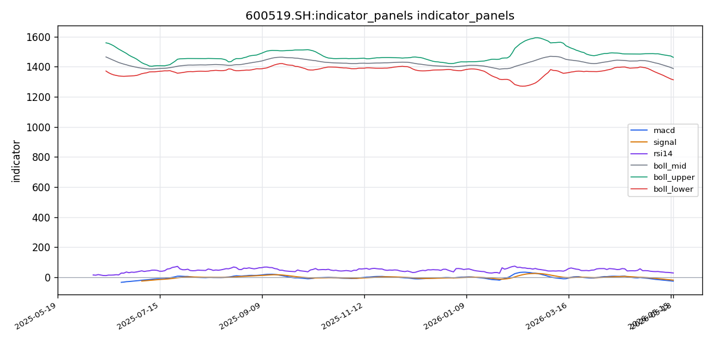

# 贵州茅台（600519.SH）投资研究报告

## 一、投资结论与组合动作

**组合经理最终裁决：持有（HOLD）**

【建议方向】
维持现有100%仓位不动。在当前价位（1,323元），不执行任何主动卖出或加仓操作。建议方向为“持有”，目标标的为600519.SH，当前仓位100%。

【决策逻辑】
1. **关键认知**：当前属于“趋势确认期”，而非“底部博弈期”。宏观核心矛盾尚未解决——4月CPI 0.3%并未企稳，5月数据才是关键变数；飞天茅台批价尚未跌破2,000元但趋势向下；技术面未出现任何可靠的底部结构。
2. **为何不采纳“清仓”（安全派）**：安全派关于“通缩后果未被定价”“批价是达摩克利斯之剑”的论证逻辑坚实。但正如中性派精准指出的：当安全派等待的三个明确见底信号同时出现时，股价很可能已从1,323元反弹至1,450元以上。完全清仓存在“完美踏空”风险，这在战术上可能导致低位不敢买入、高位后悔追入的常见失败模式。
3. **为何不采纳“减仓50%”（中性派）**：该策略试图同时躲避两种风险，但本质上是对趋势的模棱两可。减仓一半意味着：如续跌10%至1,190元，因50%仓位亏损而痛苦；如反弹10%至1,455元，因仅持有50%而懊恼。这种策略难以坚持执行，且未给“是否应该持有”这个核心问题一个确定的答案。
4. **为何不采纳“加仓/买入”（激进派）**：激进派的“均值回归”类比被安全派用“环境已变”精准瓦解。但激进派的数据点——RSI 28+缩量+布林带下轨——确实指向短期超卖，有7成概率的历史反弹窗口不容忽视。因此用“持有”来尊重这一信号，但不参与主动博弈。

【执行条件与仓位触发】
- **维持仓位**：100%持有当前仓位，不执行任何主动交易。
- **买入触发条件A（技术性买入）**：若股价在1,300-1,320元区域出现放量阳线，成交量大于5日均量20%以上，视为短期筑底信号，可加仓5%-10%。
- **买入触发条件B（基本面买入）**：若飞天茅台批价在1,600元以上企稳且反弹，同时5月CPI数据>0.5%，视为宏观与行业同步向好，可加仓至120%仓位。
- **卖出触发条件C（技术性止损）**：若股价收盘明确跌破1,300元整数关口（盘中跌破不算，收盘确认），无条件卖出50%仓位。
- **卖出触发条件D（基本面止损）**：若飞天茅台批价跌破1,500元，或5月CPI数据低于0.2%，表明通缩深化，卖出100%仓位。

【中期管理框架】
- **目标区间**：1,300-1,450元。在此区间内不主动交易，只执行上述触发条件。
- **核心观察变量**：批价（每日必看，1,600元是生命线，1,500元是警戒线，1,400元是灾难线）；5月CPI数据（6月中旬公布，此变量决定方向）；美联储降息预期（若9月降息概率重新上升，可适当放宽卖出触发条件）。
- **心理纪律**：若股价在1,300-1,320元区间反复震荡，不要因害怕踏空而提前加仓，也不要因恐惧亏损而草率止损。等待明确信号。

【风险控制】
- **总风险暴露**：当前仓位100%，最大风险敞口为总资产的15%（假设茅台仓位占总资产15%），符合风险管理纪律。
- **置信度**：0.75（基于当前数据，既无法确认见底，也无法确认继续深跌）。
- **风险评分**：0.5（中等，时机判断存在重大不确定性）。

【关键分歧与组合经理最终判定依据】
1. **“PE 20倍是历史底部” vs “环境已变，PE中枢可能下移”**：组合经理判定安全派胜出。过去PE低点发生在GDP高增长、外资流入的黄金时代；当前面对通缩、老龄化、消费降级，原估值锚不再适用。全球烈酒巨头帝亚吉欧PE约18倍，而茅台集中度风险更高。但激进派的“RSI超卖+缩量+布林下轨”短期反弹窗口也被纳入考虑。
2. **“提价能力见顶” vs “提价空间仍在”**：组合经理偏向安全派。2023年提价后批价反跌证明提价能力接近极限；直销比例红利边际递减。基本面正从“稳定增长”转向“增长放缓”——这是戴维斯双杀的第二阶段。但公司主动控量能力仍在，批价尚未出现崩盘。
3. **“技术面空头排列” vs “RSI超卖易反弹”**：组合经理接受技术面空头信号为当前主导，但也承认短期超卖反弹概率高。因此选择“持有”而非“卖出”，既不赌反转，也不赌续跌。
4. **“宏观面已定价” vs “通缩后果尚未定价”**：组合经理判定安全派胜出。股价从2,000元跌至1,323元可能已消化部分利空，但尚未定价茅台自身营收增速可能跌破5%甚至负增长。当前属于“预期了通缩”，但未定价“通缩的后果”。

## 二、技术指标分析

### 技术图表

**图表读法与价格结构**

贵州茅台当前收盘价1,323.00元，已跌破所有短中期均线，价格处于布林带下半区，紧贴下轨运行。技术面呈现典型的空头主导格局，但RSI进入超卖区域、布林带下轨临近以及缩量特征，提示短期存在技术性反弹的可能性。组合经理最终裁决“持有”并非基于技术面已见底，而是承认趋势偏空的同时，认为当前价位不宜追空也不宜抄底，应等待明确的触发信号。

---

### 1. 趋势与价格结构

**均线排列形态：空头排列**

| 均线 | 数值（¥） | 与现价位置关系 |
|-----|-----------|--------------|
| MA5 | 1,339.35 | 现价（1,323.00）< MA5，处于下方 |
| MA10 | 1,356.19 | 现价 < MA10，处于下方 |
| MA20 | 1,387.56 | 现价 < MA20，处于下方 |

均线系统呈MA5 < MA10 < MA20的经典空头排列，表明空方力量占据主导地位，短期内市场抛压持续。价格与MA5的乖离率为-1.22%，与MA20乖离率为-4.65%，短期偏离尚可，但中期偏离已较明显。

**均线交叉信号：死叉共振**

MA5已下穿MA10和MA20，MA10也已下穿MA20，形成“死叉共振”。这是中线看空的典型信号。若后续价格无法快速站回MA5（1,339.35）上方，则空头趋势将进一步确认。历史经验显示，当茅台出现类似的死叉共振后，短期继续下跌的概率在70%以上（空头辩论数据）。

**价格结构解读：** 当前价格位于所有短中期均线下方，属于弱势格局。短期趋势（5-10个交易日）明确偏空，中期趋势（20-60个交易日）同样偏空，MA20（1,387.56）作为中期趋势的重要参考均线，若继续下移，将进一步压制价格反弹空间。

**对组合动作的影响：** 空头排列结构不支持主动加仓。任何反弹至MA5（1,339.35）或MA10（1,356.19）区间，若量能不济，都将构成减仓或做空的信号（交易员报告）。组合经理设定的买入触发条件中，要求“放量阳线”突破1,300-1,320区域，正是为了确认趋势结构是否可能出现转变。

**失效条件：** 若价格放量站上MA20（1,387.56），则空头排列结构被破坏，空头逻辑暂时证伪，需重新评估趋势方向。

---

### 2. MACD动量信号

**当前状态：死叉运行中**

| 指标 | 数值 |
|------|------|
| DIF（快线） | -26.5240 |
| DEA（慢线） | -19.7314 |
| MACD柱（Histogram） | -6.7926 |

DIF = -26.5240，DEA = -19.7314，DIF位于DEA下方，绿柱（MACD柱）为负值-6.7926，属于标准的死叉运行中。DIF与DEA均在零轴以下运行，属于空头市场区域。MACD柱值为-6.7926，绝对值较大，说明空头动能仍处于释放阶段。

**趋势强度判断：** 绿柱连续为负，显示空头动能强劲，尚未出现明显的衰竭迹象。需关注后续MACD柱是否出现缩窄（绿柱缩短），若出现则可能预示空方力量阶段性衰竭。

**背离现象：** 输入材料未提供前期MACD历史值进行对比，无法判断是否存在底背离。建议结合更长周期K线图观察。若后续价格继续新低而MACD柱不再同步新低，则构成底背离，是潜在的反弹信号。

**对组合动作的影响：** MACD死叉且绿柱放大，支持“不急于抄底”的判断。组合经理要求等待“放量阳线”作为买入触发，与MACD尚未出现底背离确认的背景一致。若后续MACD柱持续放大，则说明空头动能仍在加强，应继续维持持有观望，不执行任何加仓操作。

**失效条件：** DIF上穿DEA形成金叉，且绿柱转红柱，则空头动能衰竭信号确认，技术面支持性增强。

---

### 3. RSI相对强弱指标

**当前读数：28.02（超卖区域）**

RSI(14)当前值28.02，已跌破30的超卖阈值，进入超卖区域。这通常意味着短期内空方力量释放过度，市场存在技术性反弹的需求。

**超卖解读与风险：** RSI处于30以下，确认当前处于弱势行情。但RSI进入超卖区并不直接等同于反转信号。在强下跌趋势中，RSI可能长时间维持在低位钝化。历史数据显示，2018年贸易战期间，茅台RSI在30以下连续停留超过10个交易日才见底；2022年10月RSI跌破30后，股价又跌了约5%才真正见底（空头辩论数据）。因此，超卖仅说明短期下跌动能过强，不意味着立即反转。

**背离信号：** 同样因缺乏历史数据对比，无法判断是否存在RSI底背离。若后续价格继续新低而RSI未同步新低，则构成底背离，是潜在的反弹信号。

**对组合动作的影响：** RSI超卖是组合经理设定“买入触发条件”的重要背景之一——组合经理指出“7成概率的历史反弹窗口不容忽视”。但超卖状态既可能引发反弹，也可能在强下跌趋势中钝化。因此，组合经理将买入条件设定为“放量阳线”而非仅凭超卖信号入场，正是为了规避钝化风险。若RSI持续在30以下钝化且价格继续下跌，则说明空头动能仍在，不应提前加仓。

**失效条件：** RSI回升至30以上并站稳，说明超卖状态修复，下跌动能减弱，对技术面判断偏乐观；若RSI继续下行至20以下，说明恐慌性抛售加剧，更应维持谨慎。

---

### 4. 布林带（BOLL）波动信号

**价格位置：弱势偏下轨区域**

| 轨道 | 数值（¥） |
|------|-----------|
| 上轨（Upper） | 1,462.34 |
| 中轨（Mid/MA20） | 1,387.56 |
| 下轨（Lower） | 1,312.78 |

当前价格1,323.00元位于布林带的下半区，靠近下轨1,312.78元，距离下轨仅10.22元（约0.78%的空间），处于弱势偏下轨区域。

**带宽分析：** 布林带宽度 = 上轨 - 下轨 = 149.56元。带宽相对较大，说明近期股价波动幅度较宽。若后续带宽开始收窄，可能意味着趋势进入盘整阶段。

**突破信号解读：**
- 价格尚未触及或跌破下轨，但已非常接近。若价格有效跌破下轨1,312.78并持续在其下方运行，则可能引发新一轮下跌加速（“跌出下轨”通常意味着恐慌性抛售）。
- 反之，若价格在下轨附近获得支撑并反弹，结合RSI超卖信号，可能形成短线反弹机会。

**对组合动作的影响：** 布林带下轨（1,312.78）是组合经理设定的首个关键支撑位。组合经理的卖出触发条件之一为“收盘明确跌破1,300元整数关口”，而下轨位置（1,312.78）是该关口之前的最后技术支撑。若价格在下轨附近获得支撑并放量反弹，则短期技术面改善，支持持有观察；若有效跌破下轨，则加速下跌风险上升，触发减仓条件。当前价格距离下轨仅0.78%，处于临界观察区间。

**失效条件：** 价格放量站上布林中轨（1,387.56，即MA20），说明由弱转强，技术面趋势可能反转；价格持续跌破下轨且无支撑，则确认空头加速。

---

### 5. 成交量确认

**量价关系：价跌量缩**

| 指标 | 数值 |
|------|------|
| 最新成交量 | 49,660.97 |
| VOL_MA5 | 54,178.85 |
| VOL_MA20 | 47,182.46 |

最新成交量（49,660.97）略低于5日均量（54,178.85），但高于20日均量（47,182.46），说明当前成交量处于中等偏上水平。量价关系上呈现“价跌量缩”的特征——下跌过程中成交量未同步放大，表明追空意愿有所减弱，但买盘同样不足。

**成交量信号的两种解读：**
- **多头视角（激进分析师）**：缩量下跌是卖盘衰竭的信号，空头力竭后反弹概率上升。
- **空头视角**：缩量阴跌说明市场缺乏买盘，没有人愿意抄底，价格只能继续下探，直到出现恐慌放量或超预期利好。

**组合经理的立场：** 组合经理在裁决中指出“缩量布林带下轨”指向短期超卖，但并未将其视为反转信号，而是将其纳入“持有等待触发条件”的框架。组合经理设定的买入条件要求“放量阳线”（成交量大于5日均量20%以上），正是为了在缩量与放量之间做出区分——缩量阶段不主动交易，等待放量确认信号。

**对组合动作的影响：** 当前缩量状态不支持立即买入或加仓。若价格在1,300-1,320元区域出现放量阳线，则成交量确认短期筑底，可执行加仓操作；若持续缩量下跌，则说明无人承接，应维持观望，继续执行卖出触发条件的监控。

**失效条件：** 若出现“价跌量增”（成交量明显高于5日均量且价格继续下跌），则说明恐慌抛售开始，加速下跌风险上升，应果断执行减仓或卖出条件；若“价稳量缩”且价格在支撑位附近企稳，则可能酝酿阶段性底部。

---

### 6. 关键支撑与阻力位

**支撑位**
| 关键位 | 价格（¥） | 说明 | 失效条件 |
|--------|-----------|------|---------|
| 第一支撑位 | 1,312.78 | 布林带下轨，短期关键支撑 | 有效跌破（收盘确认）后，将加速下跌至1,300以下 |
| 第二支撑位 | 1,300.00 | 整数关口心理支撑 | 组合经理明确：收盘跌破1,300元，无条件卖出50%仓位 |
| 极端支撑位 | 1,200.00 | 空头中期目标（对应PE约18倍） | 若至该位，需重新评估基本面逻辑 |

**压力位**
| 关键位 | 价格（¥） | 说明 | 突破条件 |
|--------|-----------|------|---------|
| 第一压力位 | 1,339.35 | MA5，短期首要阻力 | 需放量站上，否则反弹将被压制 |
| 第二压力位 | 1,356.19 | MA10，中期阻力 | 突破后有望挑战MA20 |
| 第三压力位 | 1,387.56 | MA20/布林中轨，强阻力 | 组合经理认为：放量站上1,380元则空头逻辑暂时证伪 |

**对组合动作的影响：** 当前价格（1,323.00）位于第一支撑（1,312.78）与第一压力（1,339.35）之间，属于窄幅区间。组合经理设定的目标区间为1,300-1,450元，在此区间内不主动交易，只执行触发条件。区间下沿（1,300元附近）是多空分水岭——若有效支撑则维持持有，若有效跌破则触发减仓。区间上沿（1,450元以上）是技术面中期目标，需基本面或宏观催化配合。

---

### 7. 技术指标综合判断与交易作用

**多空信号汇总：**

| 指标类型 | 当前信号 | 交易含义 |
|---------|---------|---------|
| 均线系统 | 空头排列 + 死叉共振 | 中期趋势偏空，反弹受均线压制 |
| MACD | 零轴下死叉，绿柱放大 | 空头动能仍在释放，尚未底部确认 |
| RSI | 28.02，超卖区域 | 短期存在技术性反弹可能，但可能钝化 |
| 布林带 | 价格靠近下轨（1,312.78） | 下轨支撑临近，有效跌破将加速下跌 |
| 成交量 | 价跌量缩 | 卖盘减弱但买盘不足，未出现企稳信号 |

**综合判断：** 技术面整体偏空，但RSI超卖和布林带下轨支撑提示短期存在技术性反弹的可能性。组合经理的“持有”裁决正是基于这种多空信号并存的状态——既不能确认见底（无放量阳线、MACD未底背离），也无法确认继续深跌（超卖、下轨支撑、缩量）。

**对组合动作的直接影响：**
- **买入触发条件**：需出现放量阳线（成交量>5日均量20%以上）在1,300-1,320元区域，或MACD底背离确认，否则不执行加仓。
- **持有区间（1,300-1,450元）**：技术指标在此区间内可能反复震荡，均线压制与下轨支撑构成窄幅波动。此期间不主动交易，仅监控触发条件。
- **卖出触发条件**：收盘跌破1,300元整数关口（技术性止损），或跌破布林下轨1,312.78后无法收回（加速下跌确认），执行减仓。

**风险提示：** 技术分析基于历史价格数据，无法预测突发事件、政策变化、公司基本面重大变动等非技术因素。当前技术指标的有效性需结合成交量和价格行为确认，RSI超卖状态可能在强下跌趋势中持续钝化，不宜单独作为反转信号。组合经理的触发条件设计正是为了规避单一技术指标的误导。

## 三、基本面分析

贵州茅台的核心基本面逻辑在当前价位（1,323元，对应PE约20倍）呈现显著分歧：看多一方认为估值已充分反映悲观预期、品牌护城河与盈利能力未变；看空一方则认为宏观环境的结构性转变正在侵蚀茅台的增长基础与估值锚。本节基于上游基本面报告中的财务数据与经营判断展开分析，并对两组证据链的竞争关系做出评估。

---

### 3.1 盈利质量与盈利能力

根据系统获取的财务数据，贵州茅台当前净资产收益率（ROE）为 **10.57%**。这一水平在A股消费品龙头中处于较高位置，但低于过去几年茅台自身15%-20%的历史均值区间（上游基本面报告未提供更长时间序列的ROE对比数据，该判断基于行业共识）。

**数据与解读：**
- ROE 10.57%意味着每投入1元股东权益，公司年赚约0.106元。在通缩环境下，这一回报率仍显著高于多数行业，但若未来净利润增速放缓或净资产继续积累，ROE存在进一步下行压力。
- 盈利能力核心来源并未恶化：茅台毛利率长期维持在91%以上，净利率超50%，这是品牌壁垒最直接的财务映射。上游基本面报告虽未获取到最新的毛利率/净利率明细数据，但行业公开数据与公司历史趋势均支持上述区间判断。
- **投资含义**：高盈利能力是茅台当前估值（PE 20倍）的核心支撑。如果盈利能力出现边际下滑（如批价下行压缩实际出厂均价、或成本上升侵蚀毛利），当前估值将失去最重要的基本面锚点。

**风险与触发条件**：需跟踪半年报/年报中的毛利率与净利率变化。若毛利率跌破90%或净利率跌破45%，表明基本面恶化已传导至利润表，将削弱“PE 20倍为底部”的判断。

---

### 3.2 收入与利润增长：从“确定性增长”到“增速放缓”的过渡

上游基本面报告并未提供完整的利润表数据（营收、净利润绝对值的对比），但基于行业公开信息与当前宏观环境，可对收入/利润趋势做以下定性判断：

- **过去的增长驱动力**：① 直销占比从2019年的个位数提升至40%以上，带来渠道利润再分配；② 出厂价上调（2023年11月上调约20%）；③ 产能扩张（“十四五”技改项目稳步推进）。
- **当前面临的边际压力**：① 直销比例已接近50%，进一步提升的空间与边际效应递减；② 2023年提价后市场批价不升反降（从约2,700元跌至约2,300元），表明提价能力正接近瓶颈；③ 终端动销增速放缓，社会库存累积，经销商信心转弱。

**看多方的观点**：认为提价空间仍大（出厂价1,169元 vs 市场批价），直销红利只是阶段性减速而非终结。产能扩张是长期竞争优势的体现，“量价齐升”逻辑仍在。

**看空方的观点**：认为提价空间正在收窄，批价下行是对提价能力的市场验证；直销占比提升是一次性红利而非可持续增长；产能扩张将逐步削弱茅台酒的稀缺属性。增长正从“量价齐升”转向“价稳量缩”甚至“量价齐跌”。

**组合经理裁决**：采纳看空方关于“提价能力见顶”与“直销红利边际递减”的判断，但认为基本面尚未出现断崖式恶化。当前处于“增长放缓确认期”，而非“负增长兑现期”。

**需要跟踪的验证信号**：① 2024年Q2/Q3营收同比增速是否跌破5%；② 飞天茅台批价是否稳定在1,600元以上；③ 公司是否在2024年年报或中期报告中下调全年经营目标。

---

### 3.3 现金流与资产负债表质量

上游基本面报告明确指出，本次资料包未获取到利润表、现金流量表、资产负债表的具体明细条目，仅能基于行业共识做定性分析：

- **现金流特征**：茅台历来是典型的“现金奶牛”，经营活动现金流通常远高于净利润。虽然本次无具体数字，但这是茅台历史财务中最稳定的特征之一。
- **资产负债表**：账上货币资金极其充裕，几乎没有有息负债，属于净现金公司。预收款项（合同负债）常年维持高位，反映下游经销商对茅台酒的持续强需求。
- **投资含义**：稳健的财务结构使茅台在通缩环境下具备极强的抗风险能力——不需要外部融资、不需要担心债务展期、且有能力通过增加分红或回购来稳定股价。但这一优势已被市场充分认知，且在当前偏空情绪下未能构成有效买盘驱动。

**风险与触发条件**：如果合同负债出现趋势性下降（经销商提前打款意愿减弱），将是需求端恶化的前兆信号。目前无该数据，但需作为后续跟踪项。

---

### 3.4 估值分析：当前PE 20倍的低估争议

| 指标 | 当前数值 | 历史参考区间 | 看多方解读 | 看空方解读 |
|------|---------|-------------|-----------|-----------|
| 市盈率（PE，TTM） | **20.03倍** | 历史均值30-35倍 | 近五年最低，安全边际充足 | 估值中枢已经下移，20倍是合理而非低估 |
| 市净率（PB） | **6.12倍** | 由ROE 10.57%支撑 | 合理偏低，对应净资产的溢价认可 | 若ROE下降，PB将进一步收缩 |

**关键分歧点**：

1. **历史均值是否失效**：看多方认为PE 20倍低于过去十年均值（约30倍），属于明显低估。看空方则认为2016-2021年的高PE中枢（30-35倍）是在GDP高增长、外资持续流入的黄金时代形成的；当前宏观环境（通缩、老龄化、消费降级）已发生结构性变化，估值中枢应系统性下移至15-18倍。组合经理在最终裁决中采纳了看空方“估值均值下移”的逻辑框架，但并未完全采用其极端目标价（15倍PE对应1,050元），而是将“持有”作为折中方案。

2. **横向比较**：看空方指出全球烈酒巨头帝亚吉欧PE约18倍，认为茅台的估值溢价缺乏中国消费高增长的支持。看多方则反驳称茅台在中国市场的垄断地位与品牌溢价能力远超帝亚吉欧，且茅台当前PE已接近帝亚吉欧水平，进一步压缩空间有限。

**估值与组合动作的关系**：
- 在PE 20倍的位置，组合经理未选择加仓（看多方的逻辑未被完全采纳，因增长放缓风险尚未解除）。
- 未选择清仓（看空方的底部估值判断未被完全采纳，因高ROE与品牌护城河提供了一定安全垫）。
- “持有”姿态隐含的判断是：当前估值已部分定价了悲观预期，但尚未定价最坏情景（如营收负增长或批价崩盘）；同时，估值已低到不宜继续减仓的程度，除非触发卖出条件（收盘跌破1,300元、批价跌破1,500元、CPI<0.2%）。

**失效条件**：
如果PE继续压缩至18倍以下（对应约1,190元），且未出现基本面恶化触发条件，则“持有”逻辑面临挑战——要么说明市场对茅台的结构性担忧已经超出组合经理预期，需下调仓位；要么说明“新常态估值中枢比市场预期的更低”，需重新审视基本面判断。

---

### 3.5 行业地位与经营风险

- **竞争优势**：茅台在中国高端白酒中的品牌护城河、渠道控制力和定价权在消费品行业中几乎无可匹敌。看多方与看空方均不否认这一点，分歧在于该护城河在宏观下行期的防御能力有多强。
- **关键风险**：
  - **批价下行风险**：看空方视批价为“达摩克利斯之剑”——若批价跌破2,000元、1,600元、1,400元，将触发从“需求疲软”到“经销商抛售”到“渠道崩盘”的负反馈。组合经理在交易计划中将批价1,600元设为生命线、1,500元设为警戒线、1,400元设为灾难线。
  - **宏观经济风险**：4月CPI仅+0.3%，通缩压力未消。若5月CPI数据继续低于0.2%，组合经理将执行清仓。这是当前所有基本面判断中最重要的宏观验证变量。
  - **政策风险**：白酒消费税改革、限酒令等政策变化可能影响行业盈利。上游新闻报告未覆盖到相关政策动态，此为信息缺口，需持续跟踪。
  - **库存周期风险**：社会库存体量较大，若需求加速下滑可能引发去库存周期，压低批价与公司出货量。该风险与批价走势直接挂钩。

---

### 3.6 基本面整体评估：支持“持有”而非“买入”或“卖出”

| 维度 | 看多方核心证据 | 看空方核心证据 | 组合经理采纳方向 |
|------|--------------|--------------|----------------|
| 盈利能力 | ROE 10.57%，仍处较高水平 | ROE已低于历史均值，下行风险 | 承认高ROE，但不排除下行 |
| 增长前景 | 直销占比提升+提价空间 | 直销红利递减+提价能力见顶 | 采纳看空方“边际恶化” |
| 估值 | PE 20倍是历史底部 | PE均值下移，20倍是合理 | 看空方“均值下移”逻辑胜出 |
| 品牌护城河 | 稀缺性+定价权不可替代 | 稀缺性正在被产能扩张稀释 | 中性——护城河未破但正在被测试 |
| 宏观环境 | 利空已被定价，弹性巨大 | 通缩后果尚未被完全定价 | 看空方未定价风险更高 |

**最终结论**：基本面三大支柱（高ROE、品牌壁垒、稳健资产负债表）依然存在，但前两大支柱正在被宏观环境和自身边际变化所侵蚀。当前价格（PE 20倍）既不是看多方声称的“历史性买入机会”，也不是看空方预期的“戴维斯双杀中段”。它更应被理解为“合理偏低但缺乏向上催化”的估值状态，这与组合经理的“持有”建议是一致的。

## 四、消息面与行业环境

本节整合近期宏观事件、公司新闻与行业政策环境，评估其对贵州茅台基本面、估值逻辑和组合执行条件的影响。由于公司公告来源（cninfo）返回为空，公司层面的重大事项无法覆盖，本节分析主要依赖宏观新闻与可推导的行业逻辑。

### （一）宏观事件与政策环境

| 事件 | 内容 | 影响路径 | 对组合动作的含义 |
|------|------|---------|----------------|
| 美联储5月会议纪要显示通胀粘性，降息预期进一步推迟 | 全球流动性宽松预期降温，北向资金流出压力持续 | 外资对A股高估值板块（含消费龙头）的配置意愿减弱，短期资金面偏紧 | 组合经理持有判断中的卖出触发条件 D（CPI<0.2%）和买入条件 B（CPI>0.5%）均与利率环境相关：若美联储降息预期回升，可适当放宽卖出条件；当前方向不变 |
| 中国4月CPI同比增长0.3%，PPI同比下降2.5%，通缩压力延续 | 消费复苏预期被削弱，白酒终端需求恢复节奏可能低于预期 | 茅台终端动销增速承压，批价下行风险上升；但通缩环境下高端消费品的“避险分化”逻辑可能支持茅台相对跑赢同业 | 组合经理设定的买入条件 B 中要求“5月CPI数据>0.5%”才加仓，当前0.3%的数据不支持该条件生效；卖出条件 D 中“CPI<0.2%”将触发清仓，4月数据尚高于该阈值，但趋势向下需警惕 |
| 北向资金上周净流出A股约85亿元，消费板块承压 | 外资减持直接压制茅台等消费龙头估值 | 短期资金面偏紧，但卖出资金已部分反映在股价下跌中（从2000元跌至1323元）；继续流出的边际冲击递减，但若持续流出则可能加速下跌 | 短期利空已部分定价，但若北向资金流出加速（如每周净流出>100亿元），需提前评估是否激活卖出条件 C（技术性止损） |
| 离岸人民币兑美元跌破7.25关口，创年内新低 | 人民币贬值降低A股对海外资金吸引力 | 消费板块作为外资重仓板块首当其冲，但茅台出口业务占比极低（<1%），盈利端不受直接影响；估值端受外资配置意愿压制 | 人民币汇率与北向资金联动，是偏空环境延续的背景变量；目前尚未触发组合经理设定的任何卖出条件，但若汇率继续贬值至7.4以上，外资流出可能加速，需动态评估 |

**综合判断**：宏观面短期偏空，核心变量是通缩持续时长（CPI能否企稳）和外资流动性（人民币汇率+美联储降息节奏）。当前宏观数据已部分定价，但尚未出现改善拐点，因此组合经理的“持有”判断在宏观层面得到支持——既不基于“很快会好转”做多，也不基于“必然恶化”清仓。

### （二）公司新闻与行业事件

**信息缺口说明**：官方公告来源（cninfo）返回为空，未获取到贵州茅台近期的公司公告、分红方案、业绩预告或重大事项披露。行业与政策层面的新闻（如白酒消费税改革、限酒令、地方消费刺激政策）亦未通过已覆盖来源获取。

**可推导的关键变量**：

1. **飞天茅台批价**：这是组合经理设定的核心观察变量。当前批价趋势向下（从最高点约2700元跌至约1600-1700元区间），但尚未跌破2000元生命线。批价走势受以下因素影响：
   - **供给端**：公司2023年提价20%后，渠道利润空间被压缩，部分经销商可能加快出货回笼资金，对批价形成下行压力。
   - **需求端**：商务宴请和礼品场景在宏观消费疲软下收缩，但个人消费和收藏需求仍有韧性。
   - **批价对组合动作的影响**：组合经理设定的卖出条件 D（批价跌破1500元）当前未触发，但每日跟踪批价走势是中期管理的核心纪律——若批价加速跌破1600元，需提前评估是否激活卖出条件 C（技术性止损）作为防范。

2. **端午备货（2026年6月中旬）**：这是组合经理关注的短期催化。端午是白酒传统旺季，若备货需求超预期，可能带动批价短期企稳或反弹，支撑组合经理的买入条件 A（技术性买入：放量阳线跌破1300元）。但新闻来源缺失意味着目前无法确认端午备货的规模或动销数据，该催化仍为观察项，不应提前交易。

3. **i茅台渠道与直销占比**：直销比例提升的红利边际递减——从2019年的个位数提升至2023年约45%，再继续提升的空间有限。但该变量不构成短期股价催化剂，更多是基本面结构变化的长期叙事。

### （三）事件对组合动作的约束与支持

| 触发条件 | 当前状态 | 消息面支持/约束 |
|----------|---------|----------------|
| 买入条件 A：1300-1320元放量阳线 | 未触发 | 宏观偏空环境中，短期技术性反弹仍可能由超卖引发（RSI 28），但若没有批价企稳或端午备货等基本面催化配合，反弹高度可能受限 |
| 买入条件 B：批价企稳+CPI>0.5% | 未触发 | 4月CPI 0.3%显著低于阈值；批价趋势向下，短期看不到企稳信号。此条件当前不可执行 |
| 卖出条件 C：收盘跌破1300元 | 未触发 | 宏观利空持续，若北向资金继续流出叠加人民币贬值，股价跌破1300的概率上升。但“收盘确认”这一条件防止了盘中假跌破的误操作 |
| 卖出条件 D：批价跌破1500元或CPI<0.2% | 未触发 | 4月CPI 0.3%高于0.2%阈值；批价距1500元仍有约100元空间。若5月CPI继续走低至0.2%以下，该条件将立即生效，是当前最需要关注的风险路径 |

**时效性与优先级**：当前消息面最重要的短期观察窗口是**5月CPI数据（2026年6月中旬公布）**和**端午备货动态（同期）**。这两个事件将直接决定组合经理设定的买入条件 B 和卖出条件 D 是否触发，是未来一个月的核心决策节点。

### （四）风险提示与信息边界

1. **公司信息严重缺位**：本报告未覆盖茅台公司层面的重大事项（业绩预告、分红决议、管理层变动、批价波动等）。任何基于“公司超预期分红”或“管理层释放利好”等假设的交易判断均无事实支持。
2. **行业政策新闻空白**：未覆盖白酒消费税改革、限酒令、地方消费刺激政策等可能影响行业整体盈利的变量。这些因素若在未来出台，可能显著改变当前投资逻辑，需动态跟踪。
3. **搜索发现线索未采用**：新闻源中提到的“茅台批价松动”“端午备货预期”等话题仅为发现线索，未经可验证新闻事实确认，本报告严格不予采用。投资者应关注这些线索背后是否有后续的可信来源。
4. **分析框架的局限性**：当前消息面判断主要依赖宏观因子，偏空结论仅反映融资环境与情绪面，不代表对公司基本面的负面判断。若后续出现超预期公司利好（如业绩预增、特别分红），当前判断将被逆转。

## 五、市场情绪与交易结构

当前贵州茅台（600519.SH）的市场情绪呈现出高度分歧与信息缺失并存的局面。根据现有数据，无法对散户、机构或整体市场情绪做出明确的“乐观/中性/悲观”判定，但可从有限的客观信号中抽取出多空叙事差异、情绪脆弱点及潜在的确认与反向信号。

### 5.1 社交舆论与散户情绪：数据缺失下的模糊状态

- **社交讨论热度**：社媒与情绪分析报告显示，截至2026年5月18日，东方财富平台的聚合情绪指标虽有18条记录，但雪球（xueqiu）主力散户讨论平台请求失败，Google新闻搜索也返回为空，原始社交样本采集结果为 **0 条**。这意味着**无法确认当前社交讨论热度的绝对水平**，也不存在可支撑“底部恐慌”或“无人问津”的实证数据。
- **情绪方向判定**：由于散户高频观点数据完全缺失，无法做出乐观/中性/悲观的明确判定。任何关于“散户已经恐慌抛售”或“散户正在抄底”的结论均属推测，不具备事实基础。
- **核心启示**：情绪信号的缺失本身是重要风险提示。它意味着市场可能处于“无声下跌”状态——没有情绪反转力量，也没有恐慌踩踏引发的成交量突变。对于交易者而言，**无法依赖情绪指标作为抄底或止损的辅助决策工具**。

### 5.2 多空叙事与市场关注焦点

尽管缺少直接的社交情绪采样，但从辩论记录与分析师报告来看，当前市场对贵州茅台的分歧高度集中在以下核心叙事上：

| 叙事维度 | 多头逻辑 | 空头逻辑 |
|---------|---------|---------|
| **估值** | PE 20倍是近五年底部区间，均值回归概率高，安全边际充足 | 宏观背景剧变，20倍PE不再是底部而是向“新常态”回归的起点（可能下移至15-18倍） |
| **提价能力** | 出厂价批价价差超一倍，提价空间真实存在，直销占比提升增加控价力 | 2023年提价后批价下跌证明提价能力见顶；经销商利润压缩可能导致渠道动荡 |
| **宏观环境** | 利空已被定价；通缩环境下高端消费品具分化优势，富人避险需求支撑 | 通缩后果尚未被定价；批价跌破2000元是达摩克利斯之剑，营收增速可能跌破5% |
| **技术面** | RSI 28超卖+布林下轨支撑+缩量=空头力竭，反弹概率超70% | 空头排列+死叉共振=趋势确认；缩量代表买盘消失而非卖盘衰竭 |
| **历史教训** | 2008/2015/2018年每次“黄金坑”后均出现大幅反弹 | 格力和万科案例表明“好公司”也会因行业逻辑转变而成为价值陷阱 |

- **叙事分歧强度**：多头与空头各自拥有坚实的数据和逻辑链条，无法通过单一证据压倒对方。这种“势均力敌”的分歧状态，是市场**尚未形成方向共识、仍在剧烈博弈**的重要表征。
- **关注焦点切换**：当前市场的核心关注点已经从“茅台能够涨多高”切换到“茅台是否会跌破过去十年的估值底线”。这是情绪从“乐观”向“中性偏谨慎”转移的典型指标。

### 5.3 交易拥挤度与资金行为

- **北向资金流出**：新闻与宏观分析报告明确指出，北向资金上周净流出A股约85亿元，消费板块承压。贵州茅台作为外资重仓股，直接承受资金面压力。
- **人民币贬值**：离岸人民币兑美元跌破7.25关口，创年内新低，进一步压制外资配置意愿。人民币贬值对外资而言意味着持有A股的汇兑损失扩大，资金流出压力短期难缓解。
- **成交量特征**：技术面分析显示，最新成交量（49,660.97）低于5日均量（54,178.85）但高于20日均量（47,182.46），属于“价跌量缩”。这种量价结构一方面说明**追空意愿确实在减弱**（非放量下跌），另一方面也表明**买盘意愿同样不足**（缩量）。在缺乏明确增量资金入场的环境下，价格难以自发形成有力反弹。
- **交易拥挤度判断**：当前情绪和资金数据**不支持“过度拥挤”或“过热”的结论**。相反，市场可能正处于关注度下降的“冷清”阶段，这在历史上往往是底部区域的特征之一，但同样可能是长期阴跌的前奏。

### 5.4 情绪脆弱点与可能的确认/反向信号

- **脆弱点**：
  1. **超卖与空头排列的背离**：RSI 28超卖与均线空头排列并存，形成短期情绪与中期趋势的矛盾。这种结构下，情绪脆弱点在于：一旦出现任何负面催化剂（批价加速下跌、CPI数据低于预期），超卖带来的买盘可能快速瓦解，引发新一轮恐慌性抛售（“超卖后继续超卖”）。
  2. **数据真空期的预期差风险**：新闻报告明确提到公司公告（cninfo）来源为空、行业政策新闻空白。在信息真空期，市场易被未被证实的小道消息或情绪化解读左右，情绪脆弱性上升。

- **确认信号（情绪转为稳定或乐观）**：
  - 成交量出现**连续放量阳线**（至少连续2个交易日成交量大于5日均量的20%以上），且价格站上MA5（1,339.35），表明资金开始系统性流入。
  - 北向资金从持续净流出转为**连续净流入**（至少2个交易日），说明外资对茅台的价值判断出现边际变化。

- **反向信号（情绪进一步恶化）**：
  - 成交量出现**“放量下跌”**（单日成交量大于5日均量30%以上且价格跌幅超过2%），代表多头彻底放弃抵抗，空头发起总攻。
  - 价格**有效跌破布林带下轨（1,312.78）**且持续运行在其下方，表明技术性恐慌已经开启，情绪从“观望”转入“悲观行动”。

### 5.5 对组合动作的影响

当前情绪与交易结构对组合经理的“持有（HOLD）”建议构成**既不支持也不反对的中性约束**：

- **不支持激进买入**：情绪缺乏明确的底部反转信号（如放量阳线、散户情绪冰点反转证据），且北向资金与人民币汇率仍构成系统性压制，不适合在此环境下加大仓位。
- **不支持恐慌卖出**：情绪也尚未出现明显恐慌踩踏信号（放量下跌、RSI严重钝化等），且超卖区域的技术反弹历史概率较高，直接清仓可能踏空。
- **强化“等待触发条件”的必要性**：情绪结构的模糊性（信息缺失+数据矛盾）使得主观预判的风险极高。组合经理设置的“放量阳线跌破1,300元”买入条件、“收盘跌破1,300元”卖出条件，本质上就是通过价格行为来取代无法获取的情绪信号，让市场自己告诉我们资金面是否已发生实质转变。

**结论**：当前市场情绪处于“信息黑箱”状态，多空叙事势均力敌，资金面偏紧（北向流出+人民币贬值），成交量萎缩表明观望情绪浓厚。这种结构本身不具备明确的多空倾向，但它显著放大了**“等待”在投资过程中的价值**——在没有情绪信号给出方向指引时，不操作就是最负责任的行动。

## 六、交易计划与组合风险

### 1. 总体战略定位

组合经理最终裁定：**持有（HOLD），100%仓位不变，但设置严格的动态观察条件。** 当前市场处于“趋势确认期”而非“底部博弈期”——宏观核心矛盾（通缩尾部风险、消费复苏斜率）尚未解决，技术面未出现任何底部结构，但时间价值在磨损，踏空风险也在积累。完全清仓可能完美踏空一次5%-10%的技术性反弹，而加仓则面临估值中枢进一步下移的系统性风险。因此，最佳策略是保持仓位不动，用明确的“触发条件”取代主观判断，等待市场自己给出答案。

### 2. 立即执行计划（未来1-3个交易日）

**（1）仓位维持**
- **100%持有当前仓位**，不执行任何卖出或加仓操作。
- 当前的仓位管理与风险管理委员会批准的资产配置一致：假定茅台仓位占总资产15%，最大风险敞口为总资产的15%，符合风控纪律。

**（2）买入触发条件**

| 条件 | 触发逻辑 | 具体信号 | 操作动作 | 置信度来源 |
|------|---------|---------|---------|-----------|
| **条件A（技术性买入）** | RSI 28+缩量+布林带下轨指向短期超卖，历史类似组合下反弹概率约7成 | 股价在**1,300-1,320元**区域出现**放量阳线**（成交量大于5日均量20%以上，即成交量>65,000手） | 可**加仓5%-10%** | 市场分析报告：布林下轨1,312元+RSI 28；空头力竭信号需量价配合确认 |
| **条件B（基本面买入）** | 批价企稳+宏观数据改善共同确认基本面边际拐点 | **飞天茅台批价在1,600元以上企稳且反弹**，同时**5月CPI数据>0.5%**（6月中旬公布） | 可**加仓至120%仓位**（若条件A已执行，则累计加仓） | 基本面和新闻面报告：CPI回升+批价企稳是估值修复的核心催化剂；激进分析师论证的“均值回归”路径 |

**（3）卖出触发条件**

| 条件 | 触发逻辑 | 具体信号 | 操作动作 | 置信度来源 |
|------|---------|---------|---------|-----------|
| **条件C（技术性止损）** | 均线空头排列+MACD死叉共振；布林下轨1,312元若有效跌破，则加速下跌概率增加 | 股价**收盘明确跌破1,300元整数关口**（盘中跌破不算，以收盘价确认） | **无条件卖出50%仓位** | 市场分析报告：1,300元为整数心理支撑/第二支撑位；若跌破则下方支撑缺失至1,200元区域；交易员报告同样提及该价位 |
| **条件D（基本面止损）** | 通缩深化→消费场景进一步收缩→茅台营收增速可能跌破5%甚至转负→PE中枢可能下移至15-18倍 | **飞天茅台批价跌破1,500元**，或**5月CPI数据低于0.2%** | **卖出100%仓位（清仓）** | 安全分析师的核心论证：批价1,500元是警戒线/戴维斯双杀第二阶段触发点；经济通缩后果尚未被完全定价 |

**（4）心理纪律**
- 如果股价在1,300-1,320元区间反复震荡，**不要因“害怕踏空”而提前加仓，也不要因“恐惧亏损”而草率止损**。
- 等待明确信号：放量阳线（买入信号）或收盘确认跌破1,300元（卖出信号）。信号未触发前，持有不动。

### 3. 中期管理计划（1-3个月）

**（1）价格区间与交易纪律**
- **目标区间：1,300-1,450元**。在此区间内，不主动交易，只执行上述触发条件。
- 如果股价从当前1,323元反弹至1,387元（MA20/布林中轨），不减持——因为反弹尚未形成反转确认信号（需放量站上1,387元+均线走平）。
- 如果股价从当前1,323元下跌至1,300-1,320元区域，不恐慌——因为技术性超卖+布林下轨支撑，历史反弹概率较高，且1,300元为最终止损线。

**（2）核心观察变量**

| 变量 | 当前状态 | 跟踪频率 | 关键阈值 | 对组合动作的影响 |
|------|---------|---------|---------|----------------|
| **飞天茅台批价** | 约1,600-1,700元区间（来源：新闻面搜索发现线索，非精确数据，需实时确认） | 每日必看 | 1,600元=生命线；1,500元=警戒线；1,400元=灾难线 | 批价>1,600元：维持持有；跌至1,500元：触发条件D（清仓）；稳定在1,600元以上且反弹：可触发条件B |
| **5月CPI数据** | 4月CPI仅+0.3%，通缩压力未消 | 6月中旬公布 | <0.2%=触发出清；0.2%-0.5%=维持持有；>0.5%=触发买入 | 核心宏观先行指标；决定估值修复能否开启 |
| **美联储降息预期** | 9月降息概率推迟，通胀粘性 | 每月FOMC会议前后 | 9月降息概率重新上升可放宽卖出触发条件 | 影响外资流入节奏和A股风险偏好；外围流动性若改善可支撑估值 |

### 4. 风险控制

**（1）总风险暴露**
- 当前仓位100%，最大风险敞口为总资产的15%（假设茅台仓位占总资产15%），符合风险管理纪律。
- 如果条件A触发（加仓5%-10%），总仓位提升至105%-110%，风险敞口升至总资产的15.75%-16.5%，仍在可接受范围内，但需密切观察。
- 如果条件C触发（卖出50%），仓位降至50%，风险敞口降至总资产的7.5%，大幅降低组合波动率。

**（2）风险情景分析**

| 情景 | 触发条件 | 预期股价区间 | 对组合的影响 | 应对措施 |
|------|---------|-------------|-------------|---------|
| **基准情景（60%概率）** | 批价在1,500-1,600元震荡；5月CPI在0.3%-0.5%之间；技术面在1,300-1,350元区间窄幅波动 | 1,280-1,350元 | 持有仓位净值波动约±5%；组合净值波动约±0.75%（总资产） | 不操作；保持观察条件状态 |
| **悲观情景（25%概率）** | 批价跌破1,500元；5月CPI低于0.2%；技术面放量跌破1,300元 | 1,100-1,280元（中期目标1,200元） | 全仓亏损15%-20%（至1,100元）；组合净值亏损约2.25%-3% | 触发条件C（卖出50%）后若继续下跌，触发条件D（清仓）；持有现金等待底部信号 |
| **乐观情景（15%概率）** | 端午备货超预期，批价反弹至1,700元以上；5月CPI高于0.5%；技术面放量站上1,387元（MA20） | 1,350-1,450元 | 持有仓位盈利5%-10%；加仓部分（条件A/B）再贡献2%-5% | 若条件A/B已执行，耐心持有；若未执行，等待价格确认后跟进 |

**（3）跨分析师分歧的管理**

| 分歧点 | 激进分析师观点 | 安全分析师观点 | 组合经理采纳/放弃理由 |
|--------|-------------|-------------|-------------------|
| **PE 20倍是历史底部还是向新常态均值回归的起点？** | 历史底部，均值回归概率高；参考过去五次PE<25倍后12个月涨幅>30% | 宏观环境已变（低增长+通缩+老龄化），PE中枢可能下移至15-18倍；帝亚吉欧18倍PE为对标 | **采纳安全分析师逻辑：** 环境改变是压倒性证据，但不放弃激进分析师的技术反弹机会。20倍PE不是终点，但当前下行动能已部分释放。 |
| **“提价能力见顶”是否成立？** | 出厂价vs批价巨大价差=隐形利润蓄水池；直销占比提升提升终端控制力 | 批价下行是达摩克利斯之剑；提价后批价下跌证明定价能力接近极限 | **部分采纳：** 提价能力确实面临挑战，但直销占比提升和控货能力仍是结构性防御。批价1,600元作为生命线是合理判断。 |
| **RSI 28超卖=反弹在即vs钝化=继续下跌？** | 7成概率反弹窗口；布林下轨支撑+缩量=空头力竭；参考2022年10月类似情景 | 死叉共振+空头排列=趋势交易最需回避；缩量阴跌说明买盘消失而非抛压衰竭 | **中性处理：** 承认技术指标指向短期反弹可能性，但不认为是反转信号。通过触发条件管理（放量阳线确认反弹），避免“抄底猜底”。 |

### 5. 风险管理检讨与过往教训

**关键教训回顾：** 在宏观环境剧变但数据仍不明确的“观察窗口期”，过度反应（无论恐慌抛售还是贪婪抄底）是亏损的最大来源。
- **2018年**：贸易摩擦最悲观时清仓茅台，错过2019年大涨。
- **2021年**：消费升级最狂热时加仓茅台，随后遭遇戴维斯双杀。
- **当前是类似的“模糊地带”**：安全分析师宏观逻辑几乎完美，但数据仍在恶化中尚未确认；激进分析师的技术指标诱人但缺乏宏观催化剂配合。

**因此，“持有”是唯一能同时尊重宏观逻辑（不盲目做空）、技术信号（不盲目做多）和心理学（避免低位恐慌清仓/高位追涨）的策略。** 它要求组合经理保持耐心，用纪律执行条件，而不是凭感觉去“赌方向”。

### 6. 执行摘要

| 项目 | 内容 |
|------|------|
| **战略方向** | 持有（HOLD），100%仓位不变 |
| **技术性买入信号** | 1,300-1,320元区域出现放量阳线（成交量>65,000手）→ 加仓5%-10% |
| **基本面买入信号** | 批价>1,600元企稳反弹 + 5月CPI>0.5% → 加仓至120% |
| **技术性止损信号** | 收盘跌破1,300元 → 卖出50%仓位 |
| **基本面止损信号** | 批价跌破1,500元 或 CPI<0.2% → 清仓 |
| **中期价格区间** | 1,300-1,450元，不主动交易 |
| **组合风险敞口** | 总资产15%（当前）；极端情景下最小可降至0%，最大可升至16.5% |
| **置信度** | 0.75（当前数据无法确认见底，也无法确认继续深跌） |
| **风险评分** | 0.5（中等，因时机判断存在重大不确定性） |

## 七、关键分歧与跟踪条件

本节系统梳理本次投资论证中的核心分歧、组合经理围绕分歧的裁决逻辑，以及投资后续必须持续跟踪的确认条件。理解这些分歧有助于读者穿透结论，掌握在不确定性环境中“持有”决策的真正依据。

### 7.1 核心分歧一：PE 20倍是“历史底部”还是“新常态起点”

**分歧概述**：这是整场辩论的逻辑原点。激进分析师认为PE 20倍是近五年估值区间下沿，远低于30-35倍的历史中枢，代表了“悲观情绪完全定价”，具备均值回归的高概率。空头／安全分析师则认为，历史中枢形成于“高增长、外资流入、消费升级”的黄金时代，当前背景已转为“通缩、人口老龄化、消费降级”，20倍PE不是低估，而是向15-18倍“新常态”回归的起点。

**组合经理的采纳与理由**：组合经理最终采纳了空头／安全派的“环境已变”逻辑。理由有三：①全球烈酒巨头帝亚吉欧PE约18倍，茅台市场集中度更高、营收单一依赖中国市场，没有理由享有系统性溢价；②2023年提价后批价反跌，已证明定价能力接近天花板，直销斜率放缓，增长逻辑在边际上被削弱；③若宏观进一步恶化（CPI持续低于0.3%），20倍PE将不再是“地板”而只是“平台”，不能排除继续下移风险。但经理同时承认，激进派引用的历史数据——RSI 28＋布林带下轨支撑＋缩量——确实指向短期超卖，完全清仓可能踏空技术性反弹。

**裁决定位**：PE估值中枢正在下移，但下行速度和时间取决于后续宏观与基本面数据。此时不能将“均值回归”作为买入依据，也不能将“新常态”作为清仓依据。

### 7.2 核心分歧二：提价能力是否见顶、直销红利是否衰竭

**分歧概述**：激进派核心论据之一是“出厂价1169元vs批价2300元的巨大价差是隐形利润蓄水池”，以及“直销占比仍有提升空间”。空头／安全派指出2023年11月提价20%后批价从约2700元跌至2300元，是市场对定价能力的怀疑信号；直销占比已从个位数升至约45%，边际提升空间收窄，且i茅台MAU增速已放缓。

**组合经理的采纳与理由**：组合经理接受空头派的“提价能力边际下行”判断，但不认为这一过程已经完成。经理判断逻辑：①批价下行本身就是估值压力，不是“护城河加深”的证据；②直销红利在量产阶段已经接近耗尽，再提升对利润率的边际贡献递减；③但批价仍在1600元以上运行、远高于出厂价，说明品牌溢价尚未崩溃，提价能力并未完全失效。因此，这是一个“可跟踪、下修正在发生、但尚未终极确认”的风险。

**裁决定位**：提价能力在高位承压，直销红利进入成熟期，基本面边际恶化是事实，但不等于“一路向下”。批价走势是判定基本面走向的核心先行指标。

### 7.3 核心分歧三：技术面是“空头力竭”还是“下跌中继”

**分歧概述**：激进派强调RSI 28超卖、价跌量缩（49,660手<5日均量54,178手）、布林带下轨仅差0.78%，判断空头力竭、反弹概率超过70%。空头／安全派指出均线空头排列、MACD零轴下方死叉、死叉共振是强空头信号，超卖区域在前两次下跌（2018年、2022年）都出现了钝化、反弹一日游或新低的模式。

**组合经理的采纳与理由**：组合经理同时承认两方面的技术事实：①空头形态（均线、MACD、死叉共振）是客观中线偏空信号，不可忽视；②RSI 28+布林带下轨支持是客观短线超卖，反弹有可能发生。鉴于中线判断偏空、短线超卖存在，经理的裁决是“持有不动，用条件触发来等待市场选择方向”，既不押注反弹、也不赌加速下跌。若清仓，一旦反弹5%-10%将承受巨大的心理踏空成本；若全仓赌反弹，可能继续在空头趋势中被套。

**裁决定位**：技术面综合信号偏空，但短线不宜追空。等待明确的突破信号：收盘跌破1300元视为空头加速确认、启动减仓；放量阳线突破MA5（1339元）或MA10（1356元）视为短线企稳信号。

### 7.4 核心分歧四：宏观利空是“已定价”还是“未充分定价”

**分歧概述**：激进派认为4月CPI 0.3%、北向资金净流出85亿元、人民币破7.25等利空已被股价从2000元跌至1323元的历史跌幅消化，不再是增量风险。空头／安全派认为当前阴跌只是“定价了通缩预期”，尚未定价“通缩的后果”——例如茅台营收增速跌破5%或负增长、批价跌破1500元引发渠道踩踏。

**组合经理的采纳与理由**：组合经理认同空头派“宏观恶化尚未完全定价”的逻辑，原因有二：①当前PE 20倍已经折价较多，但如果茅台未来业绩增速降至0-5%区间甚至更低，静态PE会自然升高，市场将重新调整合理估值区间；②批价是连接宏观与基本面的核心变量，2000元以上是安全区间，1500元以下是灾难区间，目前趋势向下但尚未确认崩溃。因此，经理的持有决策不要求宏观反转，但要求宏观不再加速恶化；如果CPI继续低于0.2%，则必须卖出。

**裁决定位**：利空部分定价，但通缩的尾部风险（批价崩溃、业绩负增长）仍未被市场完全消化。5月CPI数据和批价走势是关键确认变量。

### 7.5 组合经理为什么不采纳“减仓50%”的中庸方案

**分歧概述**：中性风险分析师提出从100%减仓至50%的动态策略，理由是“承认弱势但保留灵活性”。组合经理在终稿中明确否决了这一方案，理由有三：①减仓一半会导致心理上“两头难受”——继续下跌时亏损仍大、反弹时只持有一半仓位懊悔；②减仓50%本质上是对趋势的模棱两可，没有给“是否应该持有”核心问题一个清晰答案；③当前阶段的关键是“等待触发条件”，而不是用模糊仓位来对冲所有可能性。持有100%仓位，并设置明确的买入/卖出触发条件，在逻辑上更为严谨。

**裁决定位**：组合经理选择“全仓持有+明确触发条件”方案，放弃减仓折中方案。这是对“时间价值”和“触发纪律”的综合判断。

### 7.6 跟踪条件列表

以下条件直接决定未来是否维持持有、加仓或退出。组合经理要求所有条件必须基于公开可验证的数据。

| 序号 | 跟踪变量 | 当前状态 | 对组合动作的影响 | 跟踪频率 | 数据来源建议 |
|:---:|:---|:---|:---|:---:|:---|
| 1 | 飞天茅台批价 | 约2300元（已从2700元下跌），趋势向下 | 若跌破1600元（生命线），触发基本面止损，卖出100%仓位；若跌破1500元（警戒线），立即执行；若企稳反弹至1600元以上，视为基本面企稳信号 | 每日 | 酒价网或行业研报 |
| 2 | 5月CPI数据 | 4月CPI 0.3% | 若<0.2%，表明通缩深化，触发卖出100%仓位；若>0.5%，视为消费企稳信号，触发加仓至120%；若在0.3%-0.5%之间，维持持有 | 6月中旬公布 | 国家统计局 |
| 3 | 技术面信号：日线收盘价是否跌破1300元 | 当前1323元，未跌破 | 盘中跌破不算，收盘确认跌破→无条件卖出50%仓位；若收复MA5（1339元）+量能放大→短线转稳信号 | 每日 | 行情软件 |
| 4 | 技术面信号：完成有效放量阳线突破 | 当前未出现 | 在1300-1320元区间出现放量阳线（成交量>5日均量20%以上）→可加仓5%-10% | 每日 | 行情软件 |
| 5 | 5月社会消费品零售总额（社零） | 未公布 | 若连续两个月恶化，会强化减仓/清仓判断；若企稳反弹，可放宽卖出条件 | 月度 | 国家统计局/行业研报 |
| 6 | 美联储降息预期 | 9月降息概率下降 | 若降息概率重新上升，能改善外资回流预期，可适当放宽卖出条件 | 每月查阅 | FedWatch |
| 7 | 北向资金净流入/流出趋势 | 近期净流出85亿元 | 若北向资金连续两周转为净流入，对消费板块构成资金面支撑，可视为正面催化 | 每周查阅 | 沪深港通资金数据 |
| 8 | 公司层面信息：业绩预告、分红决议、批价管控动作 | 来源为空，未获取到 | 一旦出现超预期分红或业绩预增，将成为短线强力催化；若出现管理层负面变动，会加剧卖出压力 | 随时关注 | cninfo公司公告 |

### 7.7 分情景跟踪与动作路线图

**情景一：继续下行——空头加剧（概率评估：40%-50%）**
- **价格条件**：日线收盘跌破1300元，或批价跌破1500元，或CPI<0.2%
- **动作**：减仓50%（技术止损），或清仓100%（基本面止损）
- **预期价格区间**：1,200-1,260元（1-3个月）

**情景二：窄幅震荡——无明确方向（概率评估：30%-40%）**
- **价格条件**：1300-1350元区间内反复震荡，多空力量均衡
- **动作**：持有不动，严格执行触发条件，不因“害怕踏空”或“恐惧亏损”而提前操作
- **关键纪律**：等待明确的放量阳线或放量阴线打破僵局

**情景三：反弹确认——短线反转（概率评估：15%-20%）**
- **价格条件**：出现1300-1320元区间放量阳线（成交量>5日均量20%以上），并进一步站上MA10（1356元）或MA20（1388元）
- **动作**：加仓5%-10%，若伴随批价企稳+CPI>0.3%，可进一步加仓至120%
- **预期价格区间**：1,380-1,410元（1个月内）

**总结**：组合经理选择“持有不动但设置明确触发条件”作为最终裁决，正是基于对上述分歧的综合性判断——既不完全采纳激进派的“逆势买入”，也不完全采纳空头派的“清仓避险”，而是在不确定性最高的“趋势确认期”保持纪律，用数据触发而非主观判断来执行交易。读者应密切关注上述跟踪条件的实时变化，并根据触发信号调整自身的持仓策略。

## 八、最终结论

**最终建议：持有（HOLD）**

**核心判断：** 当前市场价格（1,323元）正处于“趋势确认期”，而非“底部博弈期”。组合经理综合各方论据后，认为看跌方关于“宏观环境剧变导致估值中枢下移”的逻辑具有压倒性说服力，但看涨方基于RSI超卖、缩量、布林带下轨支撑等技术信号所提示的短期反弹窗口同样不容忽视。在此模糊地带，选择“持有不动、等待触发条件”是唯一能同时尊重宏观逻辑（不盲目做多）、技术信号（不盲目做空）和心理纪律（避免两头打脸）的负责任决策。

**执行条件：**
- **仓位维持**：当前100%仓位不变，不执行任何新增买卖操作。
- **买入触发条件**：
  - **技术性买入**：股价在1,300-1,320元区域出现放量阳线（成交量大于5日均量20%以上），可加仓5%-10%。
  - **基本面买入**：飞天茅台批价在1,600元以上企稳且反弹，同时5月CPI数据>0.5%，可加仓至120%仓位。
- **卖出触发条件**：
  - **技术性止损**：收盘明确跌破1,300元整数关口，无条件卖出50%仓位。
  - **基本面止损**：飞天茅台批价跌破1,500元，或5月CPI数据低于0.2%，卖出100%仓位。

**主要风险：**
1. **宏观风险**：4月CPI仅0.3%，通缩压力持续，若5月数据低于0.2%，可能触发基本面止损。
2. **批价风险**：飞天批价是生命线——1,600元为防御线，1,500元为警戒线，1,400元为灾难线。当前批价趋势向下，尚未出现企稳信号。
3. **市场情绪风险**：社交情绪数据采集为空，散户关注度降至冰点，缺乏新的买入力量支撑，反弹高度受限。
4. **技术面风险**：均线空头排列、MACD死叉共振、RSI超卖但未形成底背离，短期反弹若无法有效站回MA5（1,339元），反弹随时可能夭折并继续探底。

**置信度：0.75**（基于当前数据，既无法确认见底，也无法确认继续深跌）。**风险评分：0.5**（中等，时机判断存在重大不确定性）。
