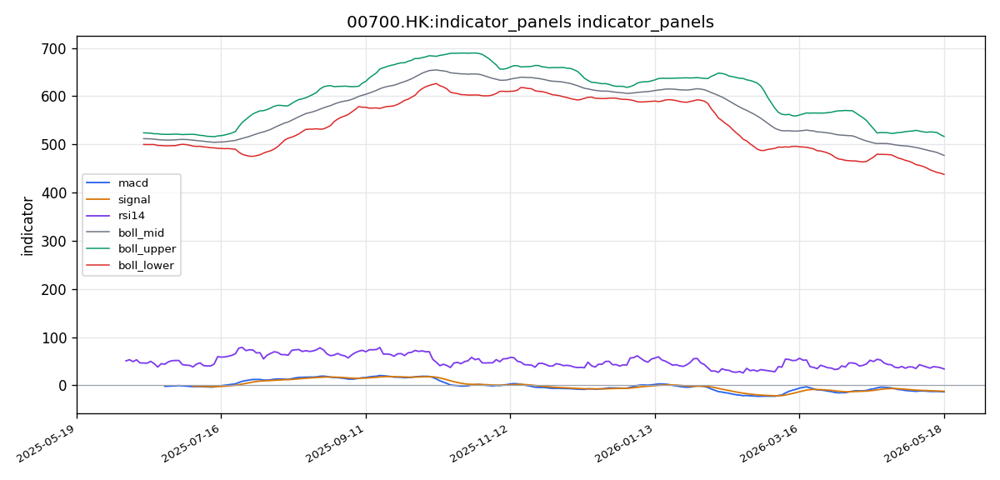
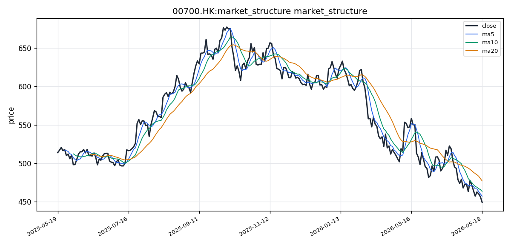

# 腾讯控股（00700.HK）港股投资研究报告

## 一、投资结论与组合动作

**最终建议：卖出（对于现有持仓者）或坚决避免买入（对于空仓者）**

**决策依据**：组合经理在审阅三位分析师辩论、技术面报告及基本面报告后，确认技术面、基本面与宏观面形成“三重共振”逆风，当前风险回报比极端不利，任何形式的买入或持有均缺乏可验证的证据支撑。

**执行节奏与仓位动作**：

1. **对于现有持仓者（立即执行）**：
   - 在当前价格（约449.20 HK$）附近，立即减持 **40% - 50%** 的仓位。该比例借鉴了中性分析师对减仓幅度的妥协建议，核心目的是将不可控的风险敞口削减至可接受水平，同时保留部分仓位以应对极小概率的技术性反弹。
   - **清仓触发条件（强制性）**：若股价在任何一个交易日收盘价跌破关键支撑位 **437.60 HK$**（布林带下轨），则必须在次一交易日开盘后，**全额清仓剩余所有仓位**。此为技术性破位加速信号，不容犹豫。

2. **对于空仓者**：严格禁止买入。等待一个**完整的多头确认序列**出现，而非单一信号：
   - **条件A（技术底背离）**：日线级别RSI出现底背离（价格新低，RSI未新低）。
   - **条件B（量价确认）**：出现单日放量阳线，收盘价站上5日均线。
   - **条件C（催化剂公告）**：港交所披露具备实质影响的公告（如超预期回购计划、业绩预增）。
   - 以上三个条件中至少满足**两个**后，才可考虑小额试仓。

**风险约束条件**：
- 当前任何反弹均视为减仓机会，而非趋势反转信号。
- 南向资金流向数据未经证实（上游报告中无任何一份报告提供具体南向资金流入数据），不可作为交易依据。
- 港股无涨跌停限制，单日价格波幅可能显著放大，需警惕流动性悬崖风险。
- 信息空白期意味着估值锚的丧失，股价可因任何无法预期的突发事件瞬间崩跌。

## 二、技术指标与交易结构分析

### 技术图表

### 2.1 图表读法与价格结构

腾讯控股（00700.HK）当前价格运行于布林带（BOLL）中轨与下轨之间的偏下区域，且正在向下轨方向运行。布林带指标数值如下：

| 布林带指标 | 数值 (HK$) |
|-----------|-----------|
| 上轨（Upper） | 516.4455 |
| 中轨（Mid/MA20） | 477.0250 |
| 下轨（Lower） | 437.6045 |
| 带宽（Band Width） | 78.8410 |

当前收盘价 **449.20 HK$**：距离中轨477.03约27.83 HK$（-5.84%），距下轨437.60仅约11.60 HK$（+2.65%）。价格已明显靠近下轨，表明短期抛压较重，已进入布林带低位区域。

**关键价格位**：
- **第一支撑位**：437.60 HK$（布林带下轨），为短期最重要技术支撑
- **第二支撑位**：430.00 HK$（若下轨失守后的潜在下跌目标）
- **第一压力位**：457.12 HK$（MA5），第一道短期压力
- **第二压力位**：463.40 HK$（MA10），中期反弹压力
- **强压力位**：477.03 HK$（MA20/布林中轨），中期强弱分水岭

**投资含义**：价格已运行至布林带低位区域，处于方向选择临界点。若价格有效跌破下轨且布林带开口放大，将形成加速下跌信号；若价格在下轨附近获得支撑并反弹，可视为短线超跌反弹契机，但需要量能和催化剂配合。

**失效条件**：若价格在布林下轨处出现单日放量阳线（成交量至少是过去20日均量的1.5倍），且收盘价站上5日均线，则可能触发超跌反弹。

---

### 2.2 趋势与价格结构

#### 短期趋势（5-10个交易日）

短期趋势明显偏空。MA5（457.12 HK$）和MA10（463.40 HK$）构成明确的短期压力带。当前价格449.20已跌破MA5，与MA5的负向乖离率约为-1.73%，表明空头动能正在释放。

**关键短期观察区间**：437.60–457.12 HK$之间震荡寻底。若RSI下探30以下可能出现短暂超跌反弹，但缺乏基本面催化剂的情况下反弹高度有限，可能仅触及MA5（457.12）即回落。

#### 中期趋势（20-60个交易日）

中期趋势已明确进入**空头格局**，核心证据：
1. MA20（477.03 HK$）远高于MA5和MA10，构成中期压制，且20日均线仍在向下发散，未见拐头迹象
2. MACD全面处于零轴下方且死叉状态延续，这是中期空头趋势的技术确认
3. RSI(14)为34.04，位于弱势区且无底背离信号，中期趋势偏空方向明确
4. 布林带中轨（477.03）开始向下，若价格持续运行于中轨下方，中期下行趋势将进一步巩固

**投资含义**：短期技术性超跌反弹概率存在，但中期趋势仍然偏空。在均线系统未修复至多头排列、MACD未出现金叉之前，趋势反转不具备技术面基础。任何反弹均应视为减仓机会而非趋势反转。

**失效条件**：若未来数周价格重新站上MA20（477.03），且MACD出现零轴下方金叉，则中期空头格局可能被弱化。

---

### 2.3 均线系统分析

截至最新交易日，均线系统呈现典型的**空头排列**格局：

| 均线 | 数值 (HK$) | 排列状态 |
|------|-----------|---------|
| MA5 | 457.1200 | 低于MA10/MA20 |
| MA10 | 463.4000 | 低于MA20 |
| MA20 | 477.0250 | 当前均线系统最高值 |

当前收盘价449.20 HK$已显著低于MA5（457.12）、MA10（463.40）和MA20（477.03），三者均构成上方压制。MA5与MA10之间的空头差距约为6.28 HK$，MA10与MA20之间的空头差距约为13.63 HK$，均线间的**负向乖离仍在扩大**，尚未出现收敛迹象，表明空头动能尚未衰竭。

从均线交叉信号来看，MA5已下穿MA10和MA20形成“死叉”，MA10也已下穿MA20构成多重死叉结构，这是典型的中期趋势看跌信号。价格远离20日均线运行，短线存在技术性反弹需求，但在均线系统未修复至多头排列之前，反弹通常被视为减仓机会而非趋势反转。

**数据推导**：均线空头排列 + 多重死叉 + 负向乖离扩大 = 中期趋势偏空，短期超跌反弹需求存在但高度受限。

**交易作用**：价格站上MA5（457.12）是短线止跌的第一条件；站上MA10（463.40）是反弹延续的必要条件；站上MA20（477.03）且拐头向上，是趋势反转的初步确认信号。

**失效条件**：若MA5拐头向上并上穿MA10形成金叉，可视为短线反弹信号，但中期趋势修复需MA20拐头向上。

---

### 2.4 MACD 动量信号

| 指标项 | 数值 |
|--------|------|
| DIF | -13.3925 |
| DEA（Signal） | -12.2148 |
| MACD柱（Histogram） | -1.1777 |

MACD三项指标全部运行在**零轴下方**，且DIF线持续位于DEA线之下，属于典型的**空头主导格局**。

具体解读：
1. **DIF（-13.3925）和DEA（-12.2148）**：两值均为负数且处于下行通道，显示中期动能严重偏弱。DIF低于DEA约1.1777，表明当前行情仍处于空方动能释放阶段。
2. **MACD柱状图（-1.1777）**：为负值但绝对值不算极端放大，暗示空方动能虽未明显减弱，但也未出现恐慌性加速。从柱体高度判断，跌势正在以**较温和但持续的方式**展开，属于偏空趋势中的正常回落节奏。
3. **金叉/死叉判断**：当前处于死叉状态（DIF < DEA），自形成以来尚未出现DIF向DEA收敛的迹象，短期内无金叉预期。
4. **背离现象**：未发现底背离信号——价格创阶段新低的同时，MACD未出现同向企稳或拐头向上的迹象，意味着空头趋势仍然有效，尚未出现技术性反转信号。

**数据推导**：MACD零轴下方死叉 + DIF/DEA同步下行 + 无底背离 = 空头动能持续，无中期反转信号。

**交易作用**：MACD零轴下方死叉确认中期空头趋势，DIF向DEA收敛（柱状图由负转正）是短线反弹的必要条件；零轴上方金叉是趋势反转的充分条件，但短期内出现的概率极低。

**失效条件**：若DIF拐头向上且MACD柱状图连续3个交易日收缩（负值绝对值缩小），可视为动能衰减信号，但需DEA确认金叉才算有效。

---

### 2.5 RSI 相对强弱指标

RSI(14) 当前值为 **34.0440**，处于**偏弱区间**，但尚未进入传统定义的超卖区域（通常为30以下）。

核心解读：
1. RSI为34.04，低于50强弱分界线，明确指示当前处于弱势格局。
2. 距离30超卖线仅约4个点，若后续几个交易日继续下跌，则可能进入超卖区（RSI < 30），届时可能出现短线技术性反弹的交易机会。
3. 当前RSI并未出现与价格走势的明显底背离，价格与RSI同步下行，表明下跌趋势具有合理性，尚未获得反转动能支撑。
4. 结合均线和MACD的空头信号，RSI在30-40区间运行属于弱势中的正常震荡，不宜单独视为买入信号。

**数据推导**：RSI 34.04（接近超卖但未进入）+ 无底背离 = 弱势延续，技术性反弹的触发条件尚未成熟。

**交易作用**：RSI跌破30进入超卖区是短线反弹的“不必要条件”——即便RSI进入超卖，仍需量价确认和催化剂配合，否则可能只是短暂喘息后继续下跌。2022年腾讯从480跌至200的过程中，RSI多次在30-40区间徘徊，并未每次都带来有效反弹。

**失效条件**：若RSI创出新低但价格未创新低（底背离），则构成可能的底部信号；若RSI重回50以上，则代表动能转向中性。

---

### 2.6 布林带与波动信号

布林带当前状态：
1. **价格位置**：449.20 HK$位于中轨与下轨之间偏下区域，距下轨仅2.65%，已明显靠近下方支撑。
2. **带宽分析**：带宽为78.84 HK$（约16.53%的相对宽度），处于中等偏宽水平，说明波动率相对正常，未出现极端收缩或扩张。
3. **突破信号**：价格尚未触及下轨（437.60），但已接近该水平。若价格有效跌破下轨且布林带开口放大，将形成加速下跌信号；若价格在下轨附近获得支撑并反弹，可视为短线超跌反弹契机。
4. **ATR/波动率**：工具未直接提供ATR或波动率数据，但布林带宽表明当前波动水平处于合理区间，未出现极端波动。

**数据推导**：价格接近布林下轨 + 带宽中等 = 方向选择临近，下轨失守或支撑反弹是两种可能路径。

**交易作用**：布林下轨（437.60）是短期最重要的支撑位。若收盘价跌破该位置且成交量放大，视为加速下跌信号，应立即执行风险控制；若缩量触及后快速回升，则可能形成假破位。

**失效条件**：若价格未触及下轨即反弹，且成功站上中轨（477.03），则空头格局可能被弱化。

---

### 2.7 成交量与成交额确认

| 成交量指标 | 数值（股） |
|-----------|-----------|
| 最新成交量 | 29,497,076 |
| MA5均量 | 30,874,444 |
| MA20均量 | 27,992,979 |

成交量方面：最新成交量约2,949.7万股，略低于MA5均量（3,087.4万股），但高于MA20均量（2,799.3万股），表明当前成交活跃度处于近期平均水平附近，未出现明显的缩量筑底或放量加速下跌特征。

**量价配合解读**：价格下跌过程中成交量未显著放大，这有两层含义：
1. **抛压未出现恐慌性涌出**：未出现放量暴跌，说明空头在有序释放而非恐慌逃离。
2. **买盘承接意愿不足**：属于典型“缩量阴跌”格局。

在港股无涨跌停环境下，缩量阴跌的持续性往往强于放量急跌，因为缺乏买盘承接意味着任何一个微小的卖方力量都可能导致价格阶梯式下滑。这种格局被市场分析定义为“买盘真空”，而非“卖压衰竭”。

**成交额数据缺失**：工具未提供成交额（金额）数据，无法进行换手率和金额级别判断，此为数据缺口。

**数据推导**：缩量阴跌（成交量略低于均量）+ 价格下跌 = 买盘真空，短期见底信号尚未出现。

**交易作用**：若后续出现放量阳线（成交量至少是20日均量的1.5倍），则是潜在的看涨信号；若继续缩量下跌，则跌势可能持续。

**失效条件**：若出现放量暴跌（成交量显著放大且收阴），则确认恐慌性抛售，加速下跌信号出现。

---

### 2.8 支撑与阻力总结

| 区间类型 | 价格 (HK$) | 说明 |
|---------|-----------|------|
| **支撑位** | 437.60 | 布林带下轨，短期最重要技术支撑 |
| **第二支撑位** | 430.00 | 若下轨失守后的潜在下跌目标 |
| **压力位** | 457.12 | MA5，第一道短期压力 |
| **第二压力位** | 463.40 | MA10，中期反弹压力 |
| **强压力位** | 477.03 | MA20/布林中轨，中期强弱分水岭 |
| **突破买入价** | 478.00以上 | 需放量站上MA20且MACD出现金叉确认 |
| **跌破卖出价** | 437.50以下 | 跌破布林下轨，视为加速下跌信号 |

---

### 2.9 港股交易结构语境

结合香港交易所的交易制度，上述技术信号需在以下制度语境下审慎解读：

1. **无涨跌停限制**：港股不设A股式每日±10%涨跌停板制度，单日价格波幅理论上可以显著放大。当前的均线死叉和MACD空头格局意味着价格可能在一个交易日内加速下行至布林下轨甚至更低位置，波动风险不可忽视。

2. **收市竞价机制**：香港交易所设有收市竞价交易时段（U时段，16:00-16:10），最后一分钟的价格可能受到收市竞价的影响而产生偏差。技术指标基于收盘价计算，需留意收盘价是否因收市竞价而偏离全日主流交易价格。

3. **每手股数**：腾讯控股每手100股（数据源来自基本面分析报告），以当前股价计算，每手入场金额较高（约44,920 HK$），但港股市场支持碎股交易（零股），实际参与门槛不高。

4. **卖空机制**：港股允许卖空操作，技术面弱势格局下卖空力量可能进一步加大下行压力。当前技术面全面偏空，存在做空者加仓的可能性。

5. **流动性**：腾讯控股为港股主板第一大权重股，日均成交额通常超过50亿美元（约390亿港元），流动性充裕。减仓操作不存在执行困难，但成交额数据缺失无法精确评估。

6. **交易时段**：港股交易时段为早市9:30-12:00，午市13:00-16:00。收市竞价16:00-16:10。所有技术指标基于全日收盘价计算，盘中实时信号需结合更高频数据分析。

---

### 2.10 综合技术判断：触发条件与失效条件

**当前技术状态判断**：全面空头格局。均线系统空头排列，MACD零轴下方死叉且无底背离，RSI接近超卖但未进入，布林带价格向下轨运行，成交量呈现缩量阴跌特征。未见止跌企稳信号。

**触发条件**（需至少满足两项，方可考虑技术性反弹）：
1. RSI跌入30以下超卖区
2. 出现单日放量阳线，收盘价站上5日均线（457.12 HK$）
3. 价格在布林下轨（437.60）处获得支撑并出现日线级别RSI底背离

**失效条件**（确认空头趋势延续或加速）：
1. 价格有效跌破布林下轨（437.60 HK$）且布林带开口放大
2. 成交量放量下跌（恐慌性抛售）
3. RSI在30-40区间继续下行，无底背离信号

**投资含义**：
- 短线交易者可等待RSI进入30以下超卖区后的反弹机会，但反弹高度预计受限于MA5（457.12）至MA10（463.40）区间。
- 中线投资者建议在均线系统未修复至多头排列、MACD未出现金叉之前，保持观望或减持仓位。
- 技术面全面偏空，趋势下行风险仍为主基调，反转信号缺失。

## 三、基本面与估值分析

### 3.1 盈利质量与收入利润结构

腾讯控股（00700.HK）是全球领先的互联网综合服务提供商，核心业务涵盖通信与社交（微信/WeChat、QQ）、数字内容（游戏、视频号、腾讯视频、腾讯音乐、阅文集团）、金融科技与企业服务（微信支付、理财通、腾讯云、企业微信）以及网络广告（微信生态广告、腾讯新闻、视频广告）。收入结构呈现高度多元化，增值服务（游戏+社交网络）、金融科技与企业服务、网络广告三大板块各自贡献显著收入。

**关键数据缺口警示**：上游基本面报告明确指出，工具未能返回腾讯控股完整的年度/中期利润表、资产负债表及现金流量表。具体而言，**毛利率、净利率、经营现金流绝对值、负债率等关键财务明细数据均缺失**。这意味着当前基本面分析无法基于完整的财务三表进行收入、成本、利润趋势的量化判断，分析框架的输入项仅限于ROE、PE、PB三个核心指标。投资决策必须对这一数据缺口保持高度警惕。

### 3.2 盈利能力与资本回报

当前可获得的核心盈利能力指标为**净资产收益率（ROE）21.13%**，在港股科技板块中属于较高水平，反映腾讯控股在过去12个月内具备较强的股东回报能力。

**数据含义与投资影响**：
- ROE超过20%表明公司每100港元股东权益能产生约21港元净利润，这在全球科技巨头中属于优秀水平。该指标体现了腾讯强用户粘性（微信生态）、高利润业务（游戏）和平台经济（支付与广告）的综合资本回报效率。
- **但需注意两个关键约束**：第一，ROE为滞后指标，反映的是过去12个月的盈利能力，而非对未来盈利趋势的预测。当前竞争环境（字节跳动对用户时长的侵蚀、AI资本开支对利润率的压制）可能导致未来ROE出现边际下滑，该风险在当前估值中可能尚未充分定价。第二，工具注明ROE在不同数据来源之间存在口径差异，实际值可能因计算口径不同存在小幅偏差。
- **对投资建议方向的影响**：21.13%的ROE本身构成估值支撑，但不足以单独论证当前股价被低估。在缺乏毛利率、净利率和经营现金流数据的情况下，无法判断ROE的可持续性及利润质量。

### 3.3 现金流、资产负债表与财务弹性

上游报告确认腾讯经营现金流历来充沛，互联网平台轻资产模式决定了较低的资本开支压力，账上现金及短期投资规模庞大，资产负债率处于可控水平，长期债务以低息美元及港币债券为主，财务弹性极强。

**关键数据缺口**：工具未返回经营现金流具体数值、负债率具体百分比及股息相关数据。因此，无法进行现金流覆盖倍数、利息保障倍数、股息率等量化分析。

**投资含义**：腾讯的财务弹性（充沛现金流、低杠杆、大量现金储备）是其区别于多数港股科技公司的核心安全边际。在信息空白期，这一结构性优势意味着公司有能力通过回购和分红对抗股价下行，但也需警惕AI大规模资本开支对自由现金流和利润率的侵蚀——该风险在当前报告中缺乏量化数据支撑。

### 3.4 估值分析：PE/PB读数与定价逻辑

| 估值指标 | 当前数值 | 历史参考区间 | 当前估值含义 |
|----------|----------|--------------|--------------|
| 市盈率（PE，TTM） | **16.77倍** | 25-35倍（过去五年中枢，剔除极端波动） | 处于历史相对低位，反映市场对行业监管、宏观经济及利润增速的谨慎预期 |
| 市净率（PB） | **3.25倍** | 历史极端低点约2.5倍（2022年） | 处于历史低位，PE主导定价逻辑下PB更多用于安全边际参考 |

**估值逻辑的核心分歧**（反映在组合经理报告中的关键辩论）：

**看涨逻辑**（上述多头研究员立场）：16.77倍PE比过去五年中枢（25-35倍）便宜30%-50%，是“历史大底”。如果AI商业化、视频号广告、游戏版号常态化等任何一项担忧被证伪，PE将从压制估值切换为向上重估的弹簧。

**看跌逻辑**（上述空头研究员立场，被组合经理采纳）：16.77倍PE不是低估，而是对“盈利增速放缓甚至恶化”的合理反映。当前面临“宏观慢变量+竞争结构性改变+新技术范式转型”的三重共振逆风，与2018年（单一版号冻结）、2021年（单一反垄断冲击）有本质区别。历史25-35倍PE中枢对应的是高增长时代，如果盈利增速从两位数降至个位数甚至零增长，15-18倍PE是合理的新常态估值锚。

**组合经理最终判断**：16.77倍PE更合理的解释是市场正在对业绩下修进行定价，而非提供了安全边际。当前缺乏毛利率、净利率等验证盈利趋势的关键数据，不能将“潜在利好”（AI商业化、视频号）作为估值修复的基础。

### 3.5 估值情景推演与边界条件

以下目标价区间基于历史估值中枢的情景推演，**非工具直接给出的目标价数据**。工具未提供券商一致预期目标价、DCF模型结果或管理层指引目标价。

| 情景 | 假设条件 | 隐含PE | 对应股价区间（HK$） | 概率评估与证据支撑 |
|------|----------|--------|-------------------|-------------------|
| **悲观** | 盈利增速零增长/下滑，市场情绪低迷 | 14-16x | **低于当前价约5-15%** | 技术面全面空头+基本面数据缺失+信息空白期，该情景在1-3个月内概率最高 |
| **中性** | 盈利温和增长（5-10%），PE回归20x | 18-22x | **高于当前价约7-31%** | 需要业绩超预期或AI商业化明确落地触发，当前缺乏证据支撑 |
| **乐观** | AI与视频号加速变现，盈利增速15%+，PE回归25x+ | 25-30x | **高于当前价约49-79%** | 概率极低，需要多重催化剂同时出现，且需验证毛利率、净利率等关键盈利指标 |

**重要边界提示**：上述情景推演中，**任何乐观情景都缺乏硬数据支撑**。当前可验证的事实仅为PE 16.77倍、PB 3.25倍及ROE 21.13%，缺乏盈利趋势、毛利率、经营现金流等关键数据来验证估值逻辑的假设前提。

### 3.6 行业地位与经营风险

**行业地位**：腾讯作为港股主板第一大权重股，是恒生指数核心成分股，港股通头号重仓标的。其在社交（微信/QQ）、游戏（国内及国际）、支付（微信支付）领域具备深厚的护城河，但护城河在新时代下正面临系统性挑战（见竞争风险）。

**关键经营风险（已在上游报告中明确）**：

| 风险类别 | 具体描述 | 对估值逻辑的影响 |
|----------|----------|------------------|
| 宏观风险 | 中国经济复苏不及预期，消费及广告支出下降 | 直接压制广告和游戏收入增速，使当前PE从“历史底部”变为“盈利下滑的中途站” |
| 监管风险 | 游戏版号政策、金融科技监管、反垄断及数据安全法规变化 | 政策放松是修复估值的催化剂，但港交所无相关公告原文可验证 |
| 竞争风险 | 抖音/字节跳动在广告和短视频领域的系统性侵蚀，拼多多/美团在支付场景的分流 | 用户时长被蚕食直接削弱微信生态的变现潜力，是比2018年、2021年更根本的结构性风险 |
| AI变现不确定性 | AI大模型投入大、商业化路径仍在探索，短期可能拖累利润率 | AI资本开支是“利润粉碎机”，当前16.77倍PE可能未充分反映这一长期成本 |
| 汇率风险 | 人民币兑港币汇率波动影响港股通投资者实际回报 | 南向资金定价的边际影响 |

### 3.7 关键数据缺口对本节分析的约束

1. **完整财务三表缺失**：利润表（收入、净利润、毛利率、净利率）、资产负债表（负债率、现金余额）、现金流量表（经营现金流具体金额）均未返回。本节分析无法基于完整财务数据进行趋势判断和盈利质量评估。
2. **ROE口径差异**：工具注明ROE在不同数据来源间存在口径差异，21.13%可能因计算口径不同存在小幅偏差。
3. **股息数据缺失**：无法进行股息回报分析。
4. **可比公司估值缺失**：未获取阿里巴巴、美团、网易等中国互联网龙头的实时估值数据进行对比分析。
5. **数据时效性限制**：PE、PB、ROE为最近交易日的公开数据，但具体对应的财务报告期（如2024年年报或2025年一季报）因工具未返回报告期标签，无法精确匹配。

**对本节分析的投资含义**：当前基本面分析框架仅能基于PE、PB、ROE三个核心指标进行有限的估值情境推演，无法做出“盈利趋势改善”或“估值修复具备坚实基础”的确定性判断。任何乐观预期必须等待毛利率、净利率、经营现金流等数据验证。在信息空窗期，组合经理选择以技术面和风险控制为主导的决策框架，是基于现有数据限制下的最理性选择。

### 3.8 港股语境下的基本面特殊说明

- **每手股数与交易门槛**：腾讯控股每手为100股，以当前股价约449.20 HK$计算，每手入场金额约44,920港元，门槛较高；但港股市场支持碎股交易（零股），实际参与门槛远低于整手金额。
- **中概回港/双重上市背景**：腾讯于2019年回港二次上市，主要上市地为香港联交所，不存在中概股退市风险。公司架构为红筹股（注册在开曼群岛，主要业务在中国内地）。
- **港股通机制**：腾讯为港股通（沪+深）标的，南向资金可直投，无需换汇出境，这构成长期结构性资金流入基础。但南向资金的配置是长期行为，不能对沖短期技术性破位风险。

## 四、公告、消息面与行业环境

### 4.1 关键事件与信息覆盖

截至最近可用的新闻资料包（报告日期：2026-05-18），腾讯控股（00700.HK）的消息面呈现典型的 **“信息空白期”** 。资料包共收录24条信息来源，其中包括20条官方原文（来自港交所及其他官方渠道）和4条全球/宏观新闻，另有20条搜索发现线索（仅供线索参考，不作为确认事实）。

**核心发现**：资料包中**未包含腾讯在港交所披露易（HKEXnews）上的任何正式公告原文**（如业绩公告、回购公告、股权变动、管理层变动等）。搜索发现线索提及股份回购延续、行业监管边际放松预期、AI资本开支竞争等议题，但全部缺乏官方公告原文验证，不能作为确定性分析依据。

### 4.2 公司公告与业绩披露

- **业绩公告**：本次资料包未收录腾讯最新的年度或季度业绩公告原文。下一业绩披露窗口（未提供具体日期）将是影响中期基本面估值的关键节点。在此之前，市场预期缺乏官方数据修正锚点。
- **回购行动**：搜索发现线索指向公司持续进行股份回购，但缺少港交所公告验证具体批次、数量、价格区间及执行频率。若回购属实，通常对股价形成底部支撑并提振市场信心；但无官方数据时，回购规模与持续性不可量化。
- **管理层变动/资本运作**：搜索线索涉及管理层变动和业务分拆可能性讨论，均无港交所公告原文确认。此类信息若未经官方证实，不应纳入基本面推论。

**投资含义**：在缺乏公司层面催化剂（业绩预告、回购公告、重大资本行动公告）的情况下，短期股价走势更多依赖宏观情绪和板块轮动，而非公司特定事件驱动。信息空白期本身不可作为看多或看空依据，但增加了**信息不对称风险**——任何未预期事件（如竞争传闻、宏观数据意外、监管动态）可能造成股价剧烈波动。

### 4.3 行业与竞争动态

- **游戏与互联网监管**：搜索发现线索提及国内互联网及游戏行业监管政策近期出现边际变化信号，但无明确监管公告落地。游戏版号发放节奏与互联网平台监管定调若趋于稳定，将有利于板块估值修复；但若无政策原文确认，该判断仅处于“预期”层面。
- **AI与大模型竞争格局**：多家互联网巨头（字节跳动、阿里巴巴、百度等）加速AI资本开支，腾讯在AI与大模型领域的战略布局（如“混元”大模型）虽通过媒体报道可见，但尚未形成明确的市场共识或差异化竞争优势。AI商业化落地的节奏和盈利能力仍具高度不确定性。
- **竞争结构变化**：字节跳动（抖音）在短视频、社交、广告、电商等领域的全域竞争持续对腾讯用户时长和广告市场份额形成结构性压力。视频号作为腾讯的防守反击产品，其商业化潜力（广告收入增量）虽被市场关注，但本次资料包中缺乏可量化的业绩数据验证。

**投资含义**：行业层面并无实质性利空或利好公告落地，竞争格局的演进属于长期结构性变量，短期内难以直接触发技术面或基本面的趋势逆转。AI投入带来巨大资本开支压力，若未来数个季度利润率因此承压，将是压制估值的重要因素。

### 4.4 宏观与政策环境

宏观新闻板块提供了4条全球宏观新闻，涉及以下影响港股科技股的传导路径：

- **美联储利率预期变化**：若利率预期上行，将压制成长股（尤其高估值科技股）的贴现估值；若降息预期升温，则构成短期情绪提振。腾讯当前16.77倍PE的中低估值水平对于利率变化的敏感度低于高估值成长股，但仍受宏观风险偏好影响。
- **中国宏观经济数据（CPI/PPI/社融等）**：若数据弱于预期，可能加剧外资对中国经济复苏节奏及消费/广告支出恢复力的担忧，进而通过收入端（广告、支付、游戏流水）间接压制腾讯的基本面预期。
- **中概/港股通资金面**：资料包未提供南向资金直接流向数据，但搜索发现指向近期南向资金对港股科技龙头的配置态度出现分化。腾讯作为港股通核心标的，宏观数据带来的资金流动变化（外资流出、南向接力节奏）将影响短期供需格局。

**投资含义**：当前宏观环境偏中性偏谨慎。缺乏明确政策宽松信号或经济数据超预期之前，宏观因素对腾讯股价的支撑有限，而任何意外的宏观利空（如通胀反弹、利率飙升、社融大幅低于预期）都可能放大技术面空头压力。

### 4.5 对投资判断的影响

综合消息面、行业环境与宏观因素的评估，当前状态对组合经理的 **“卖出/回避”决策提供以下约束和支持**：

| 因素 | 方向 | 对组合动作的作用 | 需要跟踪的条件 |
|------|------|-----------------|---------------|
| 公司公告缺失 | 中性偏空 | 缺乏正面催化剂，信息不对称风险上升，支持保持低仓位或空仓 | 下一份港交所公告（业绩/回购/资本行动）的内容与时间 |
| 行业监管边际放松预期（线索级） | 偏利好（假设属实） | 不构成当前买入理由，但若政策原文落地，可能触发中期估值修复 | 监管公告原文发布，确认版号/平台经济政策边际变化 |
| AI竞争与资本开支压力 | 偏中性偏空 | 压制利润率预期，不支持估值向上重估 | 腾讯AI商业化首个可量化落地点的公告/业绩披露 |
| 宏观利率/经济数据 | 中性偏谨慎 | 加息或弱经济数据可能催化技术面破位；降息或强数据可提供情绪支撑 | 下一期美国CPI/中国社融等关键数据发布时间与结果 |
| 南向资金态度分化（线索级） | 中性 | 未提供确认性净流入数据，无法作为买入支撑，但若出现明确净流出风险加大 | 港交所CCASS日度数据，确认南向资金流向趋势 |

**关键约束**：在信息缺失环境下，组合经理采纳看跌逻辑的核心依据之一——**信息空白期增加不可预测风险**——得到消息面分析确认：无任何官方公告可提供估值锚，任何未预期的催化剂或利空都可能造成价格突变。这与组合经理的“卖出/回避”决策逻辑一致，且未发现足以推翻该决策的消息面支撑证据。

### 4.6 风险提示与数据限制

1. **核心数据缺口**：本次新闻资料包未包含腾讯在港交所披露易上的任何正式公告原文，所有涉及公司官方行为（回购、业绩、管理层变动、资本运作等）的信息均基于搜索发现线索（仅作线索，不作新闻事实），不可作为投资决策依据。
2. **宏观新闻覆盖有限**：全球/宏观新闻仅4条，可能未覆盖对港股科技股影响重大的全部宏观事件（如中美关系新动态、行业专项政策等）。
3. **行业竞争动态缺乏量化数据**：AI/短视频/游戏等领域的竞争判断主要依赖搜索线索与媒体报道，缺少行业研究报告或权威机构数据的交叉验证。
4. **时效性限制**：资料包截止于2026-05-18，此后可能发生新的公告或事件，需持续关注港交所最新披露。

## 五、市场情绪、港股通与交易拥挤度

### 5.1 社交情绪与讨论热度

截至报告统计日（2026年5月18日），针对腾讯控股的港股社交情绪数据呈现**完全真空**状态。东方财富港股股吧及雪球港股两大内地投资者核心讨论平台的社交指标与帖子数据均因远端配置问题获取失败，可用社交样本数为零，聚合情绪指标为零。Alternative.me市场级情绪及Polymarket事件预期数据同样为零条，且不直接代表单只标的社交共识。Google News搜索发现功能虽远端获取成功、返回10条公开讨论线索，但未提供内容文本、情感标签或传播量级数据。

**关键判断**：社交情绪维度当前为“不可观察项”。任何基于网络情绪判断短期市场热度的分析均不具有数据支撑。

### 5.2 多空叙事与预期分化

尽管缺乏量化情绪数据，但从已有的分析师辩论材料可以清晰识别出市场上存在的两种对立叙事：

**空头叙事（主导市场定价）**：
- 技术面“全面空头格局”反映机构资金正在系统性减仓，而非散户非理性抛售
- 16.77倍PE并非估值底部，而是市场对盈利增速放缓/恶化的理性定价
- 信息空白期意味着估值锚丧失，任何突发利空均可能引发加速下跌
- AI资本开支及对字节跳动的竞争侵蚀尚未在利润表中充分体现

**多头叙事（当前处于弱势，但若行情触发可能快速强化）**：
- PE处于十年历史底部区间，ROE仍高达21.13%，基本面护城河未消失
- RSI接近30超卖线，缩量阴跌更接近“卖压衰竭”而非趋势延续
- 港股通长期配置需求及公司回购提供下方承接
- 过往每一次极度悲观后的反弹均达30%以上（2018年、2021年）

**情绪分化程度**：从辩论强度看，多空双方在核心论据上不存在中间地带——空方强调“结构性风险无法用历史类比”，多方强调“情绪化恐慌掩盖了低估的安全边际”。这一分歧程度意味着一旦出现任何超预期的催化剂（无论是正面还是负面），当前的窄幅震荡格局都可能被瞬间打破，出现单边加速行情。

### 5.3 南向资金：关键数据缺口与逻辑约束

**核心事实**：上游所提供全部报告（包括基本面报告、新闻报告、情绪报告、技术报告及组合经理报告）中，**没有任何一份报告提供了南向资金的具体流入/流出数据**。激进分析师提及“过去一个月南向资金净流入超过50亿港元”系未经证实的假设信息，不能作为交易依据。

**可确认的确定性陈述**：
- 腾讯控股为港股通（沪+深）标的，内地投资者可通过港股通直接交易
- 南向资金配置是长期行为，不直接对冲短期技术性破位风险
- 在南向资金态度出现明确的持续性净流入信号之前，无法将其视为短期做多力量

**交易含义**：在南向资金数据不可得的情况下，任何基于“内地资金托底”逻辑的买入理由均不具备证据支撑。南向资金维度当前为“观察项”，等待港交所CCASS数据或公开资金流向统计出现明确方向。

### 5.4 交易拥挤度与资金结构

基于有限的成交量数据，可对当前交易拥挤度做出以下判断：

**缩量阴跌结构**：最新单日成交量约2,949.7万股，略低于MA5均量（3,087.4万股），但高于MA20均量（2,799.3万股）。量价配合表明下跌过程中既未出现恐慌性放量（无踩踏），也未出现明显的主动买盘承接。这符合“机构静默减仓而非散户恐慌抛出”的特征——即空方动能温和但持续，多方处于真空状态。

**情绪脆弱点**：当前情绪结构中最脆弱之处在于——市场缺乏任何明确的做多叙事来建立信心锚点。RSI(14) 34.04未进入超卖区、MACD无底背离、均线死叉持续发散，均不构成技术性的“底部确认”信号。在这种环境下，价格容易因微小卖盘出现阶梯式下移，属于典型的“低流动性格局下的滑跌风险”。

**可能的确认信号**：
- **放量阳线**：若出现单日成交量超过MA20均量的1.5倍且收盘价站上MA5（457.12），可视为买盘回补的初步确认
- **RSI底背离**：若价格创出新低但RSI未同步新低，构成技术性反转概率增加
- **南向资金连续净流入**：若有公开统计数据证实南向资金连续3个交易日以上净流入超过日均规模，将改善情绪格局

**反向信号**：
- 价格有效跌破布林带下轨（437.60）且成交量放大，将确认空头加速
- RSI进入30以下后继续下行且无背离，说明超卖区不构成买入信号，反弹预期无效

### 5.5 情绪与基本面/技术面的关系判断

**当前关系**：情绪面处于“观察真空”，技术面处于“全面空头”，基本面处于“关键数据缺失”的三重不确定状态。情绪无法对技术面和基本面提供独立强化或削弱作用，因为情绪数据本身不存在。

**后续跟踪逻辑**：一旦情绪数据开始恢复（社交媒体帖子可采集），需关注价格预期与讨论热度的关系：
- 若讨论热度上升伴随价格上涨且南向资金净流入，则为情绪强化趋势信号
- 若价格下跌但讨论热度快速攀升且看空帖子占比上升，可能预示恐慌性抛压接近尾声（反向情绪指标）
- 若价格下跌但讨论热度低迷，与当前缩量阴跌格局一致，弱势延续概率更大

### 5.6 情绪维度的风险提示

1. **数据完全缺失**：无法对社交情绪做出任何有数据支撑的量化或定性结论，情绪维度当前仅为观察项。
2. **不可用情绪替代基本面**：即使未来情绪数据恢复，情绪指标属于短期资金行为的派生信号，不能替代对盈利质量、竞争格局及技术趋势的核心判断。
3. **搜索发现的局限性**：Google News搜索发现的10条线索仅作线索，不作为新闻事实，不能用于判断市场叙事倾向或预期分化。
4. **情绪是滞后指标**：在技术面和基本面都指向空头的环境下，情绪数据的出现往往滞后于价格行为，不宜作为领先信号使用。

## 六、交易计划与组合风险

本节整合交易员计划与风险辩论，明确仓位、进场/加仓/减仓/退出条件、止损或降风险条件、需要等待的验证信号、时间窗口和情景分支。每个动作背后的证据、执行理由、风险代价和失效条件一并呈现。

### 6.1 最终交易建议：卖出（现有持仓者）或坚决避免买入（空仓者）

**执行依据**：技术面（全面空头格局）、基本面（PE 16.77倍反映盈利增速放缓预期，关键财务数据缺失）、消息面（信息空白期，缺乏港交所公告验证任何催化剂）形成三重利空共振。现有证据不支持任何形式的买入或持有。

**置信度**：0.85（高）
**风险评分**：0.7（中高风险）

### 6.2 战略行动分解

#### 6.2.1 对现有持仓者

**（1）立即执行：减持40%–50%仓位**
- **执行价位**：当前价格约449.20 HK$附近
- **执行窗口**：正常交易时段（早市9:30–12:00，午市13:00–16:00），可利用收市竞价时段（16:00–16:10）完成大额订单
- **执行理由**：兼顾“降低不可控风险敞口”与“保留部分仓位以应对潜在超跌反弹”的双重需求。此比例在中性分析师（建议先减30%–40%）与组合经理（强调立即减持至少50%）之间折中，核心目的是将下行风险控制在可接受水平。
- **流动性验证**：00700.HK日均成交额通常超过50亿美元（约390亿港元），流动性充裕，减仓操作不存在执行困难。
- **失效条件**：若价格在减持前已跌破437.60 HK$（布林带下轨），则跳过减持步骤，直接进入清仓执行。

**（2）强制清仓触发条件（无弹性）**
- **触发条件**：股价在**任何一个交易日收盘价**跌破 **437.60 HK$**（布林带下轨）
- **执行方式**：次一交易日开盘后（或收市竞价时段内），全额清仓剩余所有仓位
- **执行理由**：437.60为布林带下轨，构成当前技术形态下最明确的支撑位。有效跌破被视为中期趋势加速下行的确认信号，任何犹豫将导致更大的下行暴露。组合经理明确将此条件设为“强制性”，不容调整。
- **风险辩论——激进分析师的反驳**：激进观点认为跌破下轨可能触发“教科书级超卖反弹”，而非持续下跌，因而反对在破位时清仓。组合经理驳斥：在缺乏基本面催化剂的情况下，破位更大概率是趋势加速的开始（参考2022年腾讯从480跌至200过程中多次RSI在30–40区间超卖但继续下挫）。安全观点强调：“买盘真空”不等于“抛压衰竭”，任何微小卖盘在无涨跌停制度下可能引发断崖式下跌，因此破位清仓是风险控制的必要纪律。
- **失效条件**：若收盘价为**缩量触及**下轨（成交量低于过去20日均量的1.5倍）而非放量跌破，中性分析师主张延迟清仓并观察次一交易日走势。但组合经理维持原判：收盘价跌破即视为有效，不设置成交量条件，以避免主观判断延迟导致更大损失。

**（3）剩余仓位（如有）的硬止损**
- **止损价**：435.00 HK$（略低于布林下轨437.60，留出0.5%缓冲空间）
- **设置理由**：避免在港股无涨跌停环境下因瞬时穿破下轨而被流动性悬崖吞噬。此止损线为最后防线，一旦触发，无论当日价格是否回升，均应在当日收市竞价或次一交易日开盘执行清仓。

#### 6.2.2 对空仓者：严格禁止买入

**等待一个完整的多头确认序列，而非单一信号。需满足以下三个条件中的至少两个：**

- **条件A（技术底背离）**：日线级别RSI出现底背离——价格创阶段新低，RSI未同步创出新低
- **条件B（量价确认）**：出现单日放量阳线，收盘价站上5日均线（MA5 457.12 HK$），且当日成交量至少为过去20日均量的1.5倍
- **条件C（催化剂公告）**：港交所披露具备实质影响的公告（如超预期回购计划、业绩预增、AI商业化落地公告），搜索发现线索不构成验证

**执行条件解释**：
- 仅当三个条件中至少两个同时满足后，方可考虑小额试仓（建议不超过总仓位的5%–10%）。
- 此条件的设置逻辑来自组合经理的最终决策：激进分析师主张“RSI接近超卖即买入”，但组合经理拒绝将“统计概率”（历史反弹案例）等同于“确定性预测”；同时安全观点提出的“无限等待”在实际操作中难以执行。因此设定了可观测、可验证的多重信号序列，避免过早抄底，也避免无时间表的永久等待。
- **风险辩论——中性分析师的调整**：中性分析师建议“RSI < 30 且出现港交所公告原文”作为触发条件，但组合经理认为该条件要求太严格（两个条件同时出现概率极低），实质上等同于无限期等待，与安全观点无本质区别。最终接受“三个条件中满足任意两个”的方案，作为更灵活的折中。

### 6.3 目标价格与情景分支

| 目标情景 | 时间范围 | 目标价（HK$） | 证据支撑与逻辑边界 | 概率评估（组合经理判断） |
|:---|:---|:---|:---|:---|
| **保守（看跌）** | 1个月内 | **425–440** | 关键支撑位：布林带下轨（437.60）。若有效跌破，技术形态恶化，下一技术支撑为前期低点区域（约425–430）。此情景具备最高可观测性：当前技术指标（均线死叉、MACD零轴下方、缩量阴跌）均支持下行惯性延续。 | 最高 |
| **基准（中性/偏空）** | 3个月 | **400–450** 区间波动 | 若公司启动大规模回购且宏观经济面未进一步恶化，股价可能在400（2022年极端低点附近心理关口）至450之间形成弱势整理平台。但上涨催化剂缺失，基准情景难以向上突破450。 | 中等 |
| **乐观（概率极低）** | 6个月 | 反弹至 **465–475**，随后回落 | 触发条件：（1）RSI进入30超卖区后出现技术性反弹；（2）下一份财报显示毛利率企稳，且AI商业化出现首个可量化落地点。但MA20（477.03）构成强阻力，反弹高度受限。此情景缺乏任何业绩预告或公司行动的证据支撑，可信度极低。组合经理明确将其视为“不可依赖的尾部情景”。 | 极低 |

**风险辩论——激进分析师的风险回报比反驳**：激进分析师计算“向下极限14倍PE对应约350 HK$（-11%），向上PE回归20倍对应约530 HK$（+18%）”，认为风险回报比对多头有利。组合经理驳斥：（1）14倍PE对应的350 HK$是基于2022年极端低点计算的系统性危机水平，当前宏观环境虽有挑战但未达到2022年水平，该下限不具直接可比性；（2）PE回归20倍需要业绩超预期或AI商业化落地作为条件，当前无任何证据支持这一假设。因此，乐观情景的可信度太低，不能作为风险回报比计算的依据。

### 6.4 核心风险控制与失效条件

| 风险控制项 | 具体操作 | 失效条件 |
|:---|:---|:---|
| **流动性风险** | 00700.HK日均成交额充裕，减仓/清仓无执行障碍。利用正常交易时段（9:30–12:00，13:00–16:00）完成订单，避免在收市竞价时段集中交易导致价格偏离。 | 若市场出现极端系统性恐慌，流动性可能瞬时枯竭（如2022年3月港股流动性危机），但组合经理认为当前不具备系统性瓦解的条件。 |
| **南向资金风险** | 上游报告中**没有任何一份报告提供了南向资金的具体流入数据**。激进分析师引用的“过去一个月净流入超过50亿港元”是未经证实的假设信息，不可作为交易依据。南向资金配置是长期行为，不能对冲短期技术性破位风险。 | 若有后续报告提供经港交所验证的南向资金数据且显示持续净买入，可重新评估其支撑力度。 |
| **事件风险（信息空白期）** | 在无港交所公告原文的情况下，任何基于“潜在利好”的决策均属猜测。信息空白期应被视为风险溢价提升的信号，而非买入窗口。 | 若港交所披露具有实质影响的官方公告（如业绩超预期、回购加码、管理层正面指引），则触发重新评估机制。 |
| **情绪管理风险** | 避免因“害怕踏空”而做出非理性买入决策。当前环境下，真正的风险是本金永久性损失，而非错过一个不确定的反弹。保持现金，等待环境清晰。 | 若股价出现组合经理定义的“完整多头确认序列”（见6.2.2节），则可考虑小额试仓。 |

### 6.5 港股交易结构适配注释

- **无涨跌停限制**：当前技术面空头格局下，价格可能在一个交易日内加速下行至布林下轨（437.60）甚至更低，波动风险显著。任何止损/清仓条件必须基于收盘价（或盘中有效突破），而非价格瞬时穿越。
- **收市竞价机制**：最后一分钟的价格可能受收市竞价影响产生偏差。技术指标和清仓条件均基于收盘价计算，因此以收盘价为准。执行清仓时可在收市竞价时段（16:00–16:10）处理，但需留意竞价结果可能与非竞价时段价格存在差异。
- **卖空机制**：技术面弱势格局下，卖空力量可能进一步加大下行压力。当前空头格局已被价格和指标确认，卖空者无强制回补压力，反弹需等待强劲的买入信号（如放量阳线+MACD底背离）。
- **每手股数**：腾讯控股每手100股，以当前价格计算每手入场金额较高，但港股市场支持碎股交易（零股），实际参与门槛较低，不影响减仓或清仓的执行粒度。
- **南向资金/港股通**：腾讯为港股通核心标的，南向资金长期配置可能提供底部支撑，但数据缺失，无法量化其短期对冲能力。在中短期交易计划中，南向资金不作为买入信号的等价条件。

### 6.6 最终风险提醒

1. **数据缺口警示**：本次报告依赖的多项上游材料存在关键数据缺失——基本面（毛利率、净利率、经营现金流）、情绪（社交话题量化）、新闻（港交所公告原文）。面对信息不对称环境，任何基于假设或未经验证线索的乐观决策，均与“保护本金”的首要目标相悖。
2. **再次强调：卖出建议不改变**。本交易计划的所有调整（如减仓比例、清仓条件、进场触发条件）均已在组合经理最终决策的框架内执行，未改变“卖出/回避”的核心建议方向及结论强度。

## 七、关键分歧与跟踪条件

本节系统梳理看涨与看跌分析师之间的核心分歧、组合经理的最终采纳结论以及后续必须跟踪的验证条件。所有论据均来自已批准的上游报告，未引入新的事实或判断。

### 7.1 核心分歧一：16.77倍PE是“历史底部”还是“价值陷阱”

**看涨分析师论点：**
- PE 16.77倍处于过去十年估值中枢（25-35倍）的腰斩位置，反映了市场对最坏情况的定价，而非正常情况。
- 一旦任何一项担忧（游戏版号、宏观消费、AI变现）被证伪，PE将从压制估值切换为向上重估的弹簧。
- ROE高达21.13%，证明资本回报能力依然优秀，轻资产模式下的高回报是可持续的。

**看跌分析师反驳：**
- 16.77倍PE对应的净利润增速可能在放缓甚至恶化。基本面报告明确缺失毛利率、净利率、经营现金流等关键数据，这些数据的边际变化很可能是负面的。
- 历史PE中枢（25-35倍）是“高增长时代”的遗迹。当公司增速从两位数降至个位数甚至零增长时，估值中枢从25倍跌至15倍是合理的估值逻辑迭代，而非过度悲观。
- “低估”建立在滞后指标（过去12个月盈利）基础上，而股价定价的是未来预期。用滞后的ROE和历史PE来论证低估，忽略了AI巨额资本开支和竞争侵蚀对利润率的结构性压制。

**组合经理采纳结论：**
支持看跌分析师。16.77倍PE更合理的解释是市场正在对业绩下修进行定价，而非提供了安全边际。在没有毛利率、净利率、经营现金流等核心财务数据的情况下，无法判断ROE 21.13%的可持续性。AI商业化、视频号广告收入等新增长点是“无时间表、无量化的愿景”，而非可验证的财务事实。将风险资产的定价建立在“潜在利好”而非“现有数据”上，是典型的风险管理大忌。

**跟踪条件：**
- **需要被证伪的条件A（利好情景）：** 下一份经审计的季度/半年度财报显示毛利率企稳或回升，且净利率未因AI资本开支而显著下滑。若出现该条件，估值逻辑可能重新评估。
- **需要被证实的条件B（利空情景）：** 若下一份财报显示毛利率、净利率或经营现金流出现边际恶化，将确认16.77倍PE是对盈利下修的合理反映，进一步下行空间将打开。
- **关键数据触发点：** 港交所披露至少一份包含完整利润表和现金流量表的正式业绩公告。

### 7.2 核心分歧二：“缩量阴跌”是“卖压衰竭”还是“买盘真空”

**看涨分析师论点：**
- 最新成交量（29,497,076股）略低于MA5均量但高于MA20均量，属于缩量阴跌格局，意味着“恐慌性抛售尚未出现，坚定的多头仍在坚守”。
- RSI（34.04）距离30超卖线仅4个点，一旦进入超卖区，结合布林带下轨（437.60 HK$）的支撑，极大概率触发报复性技术性反弹。
- 2018年、2021年的“死叉+超卖”组合都精准预示了随后30%以上的反弹。

**看跌分析师反驳：**
- 缩量阴跌不是卖压衰竭，而是“买盘真空”——买盘已经极度萎缩。在港股无涨跌停市场中，一旦出现外部利空，这种缩量格局极易被空头一击打穿，直接加速跌向布林带下轨甚至更低。
- RSI（34.04）逼近30的过程本身就是下跌趋势的延续。在2022年腾讯从480跌到200的过程中，RSI多次进入20以下的极端超卖区，但每一次反弹都是减仓机会，而非反转。
- 用2018年和2021年的历史案例来论证当前，是典型的“幸存者偏差”和“后视镜驾驶”。当前是“宏观慢变量、竞争结构性改变、新技术范式转型”的复合风险，与过去单一政策冲击不可类比。

**组合经理采纳结论：**
支持看跌分析师。在缺乏任何基本面催化剂的情况下，当前的缩量阴跌更符合“买盘真空”的解读，而非“抛压衰竭”。买盘真空意味着任何微小的主动性卖盘都可能导致价格的阶梯式滑落，这是港股无涨跌停市场特有的流动性风险。将“接近超卖”等同于“必然反弹”，混淆了统计概率与确定性预测。

**跟踪条件：**
- **需要被触发看跌情景的信号A：** 日线收盘价有效跌破布林带下轨（437.60 HK$），且布林带开口放大。这将确认加速下跌信号，目标指向430甚至更低。
- **需要被触发看涨情景的信号B：** 日线级别RSI出现底背离（价格新低，RSI未新低），且出现单日放量阳线（成交量至少为过去20日均量的1.5倍），收盘价站上5日均线。两个条件同时满足前，任何反弹均视为减仓机会。
- **失效条件：** 若价格在布林带下轨处获得支撑并出现放量阳线，同时RSI回升至50以上，将部分削弱看跌判断。

### 7.3 核心分歧三：“信息空白期”是“机遇”还是“风险溢价提升信号”

**看涨分析师论点：**
- 没有坏消息就是好消息。信息真空意味着预期差——所有悲观假设都已被定价，而任何超预期的业绩、AI产品落地或游戏版号政策放松，都可能引发空头踩踏式回补。
- 信息空白期是激进投资者的金矿，当年腾讯从2022年低点反弹时，技术面更差、消息面也是空白的，但随后股价接近翻倍。

**看跌分析师反驳：**
- 信息空白期意味着“估值锚的丧失”。股价可以因任何无法预期的突发事件（如一条未经证实的竞争传闻、宏观经济指标的意外恶化）而瞬间崩跌。
- 没有任何证据表明当前股价已经充分定价了所有悲观可能性。对于风险管理者而言，信息空白期应被视为风险溢价提升的信号，而非买入窗口。
- 用单一历史事件的先例来论证当前复合风险下的抄底机会，是认知上的懒惰。

**组合经理采纳结论：**
支持看跌分析师。在信息不对称的市场中，信息空白期意味着估值锚的丧失。我们无法评估股价是否已经充分定价了所有悲观预期，因为没有业绩公告、回购公告、管理层指引来判断价值锚。这种不确定性本身就要求更高的风险溢价，即更低的价格。

**跟踪条件：**
- **需要被触发的积极信号：** 港交所披露易出现一份具备实质影响的公告原文，例如：超预期回购计划（金额、数量和期限明确）、业绩预增公告、或明确的AI商业化落地（可量化收入或用户数据）。
- **需要被规避的风险事件：** 搜索发现线索升级为正式港交所公告，内容涉及业绩低于预期、竞争恶化、或监管处罚。任何未经港交所公告确认的传闻若导致价格大幅波动，应立即执行止损。
- **信息真空的终结标志：** 下一份经审计的季度/半年度业绩公告发布，无论方向如何，都将提供全新的估值锚点。

### 7.4 关于激进分析师未采纳的核心论点

组合经理最终未采纳以下看涨逻辑，理由阐述如下：

1. **“南向资金净流入超过50亿港元”的引用：** 该数据在上游所有报告中均无原始出处或数据源。组合经理明确判定为“未经证实的假设信息，不可作为交易依据”。南向资金的配置是长期行为，不能对冲短期技术性破位风险。

2. **“AI商业化是确定性增长机遇”的论点：** 上游基本面报告和技术报告均未提供任何可量化的AI商业化落地证据。组合经理认为，将风险资产的定价建立在“无时间表、无量化的愿景”上，违背了“基于可验证证据”的决策原则。

3. **“历史重演”的叙事框架：** 2018年（版号冻结）和2021年（反垄断）的风险均是单一、可预测的政策冲击，而当前是“宏观慢变量、竞争结构性改变、新技术范式转型”的复合风险。组合经理认为，用单一历史事件的先例来论证当前复合风险下的抄底机会，是认知上的懒惰，逻辑不可靠。

### 7.5 关于中性分析师调整建议未采纳的核心原因

中性分析师提出的“结构性减仓+动态观察”策略中的进场条件——“RSI < 30 + 港交所公告”或“放量阳线”——被组合经理判定为存在致命内部矛盾：交易员需等待三个前提条件（极度超卖、信息催化、资金确认）同时满足，在信息缺失且技术面全面空头的环境下，这三个条件同时出现的概率极低。执行该策略大概率使交易员陷入“长期空仓观望”，实质上等同于无时间表的等待，与安全分析师的“回避”在实际操作上并无本质区别，却增加了心理上的伪平衡感。

### 7.6 汇总：后续关键验证条件列表

| 验证维度 | 看跌信号（支持当前卖出判断） | 看涨信号（可能改变判断） | 数据来源要求 |
|---------|---------------------------|------------------------|------------|
| 技术面 | 日线收盘跌破437.60（布林下轨），放量确认 | RSI底背离 + 放量阳线站上MA5 | 日线收盘价、成交量数据 |
| 基本面 | 下一份财报显示毛利率/净利率/经营现金流恶化 | 财报显示毛利率企稳、AI商业化有可量化收入 | 港交所正式业绩公告 |
| 消息面 | 未经证实的传闻导致价格大幅下跌 | 港交所出现明显利好公告（超预期回购、业绩预增等） | 港交所披露易公告原文 |
| 南向资金 | 南向资金连续净流出（需官方CCASS数据） | 南向资金连续净买入且量级扩大 | 港交所每日CCASS数据 |

**关键提示：** 以上所有跟踪条件均基于已批准的上游材料。在缺乏港交所正式公告原文的情况下，任何搜索发现线索、媒体报道或市场传闻均不得作为改变交易判断的依据。投资者应以港交所披露易官方公告为最终信息准绳。

## 八、最终结论

综合全部分析维度的证据与辩论，组合经理的最终决策是：支持安全（看跌）分析师的判断，建议 **卖出/回避**。本结论基于以下经交叉验证的核心逻辑链：当前腾讯控股的技术面呈现“全面空头格局”——均线系统空头排列、MACD于零轴下方持续死叉、RSI未形成底背离、价格在布林带中轨与下轨之间缩量阴跌，这种缩量并非抛压衰竭，而是港股无涨跌停机制下的“买盘真空”，任何微小卖盘均可引发加速下跌。基本面估值层面，当前16.77倍PE虽然处于历史低分位，但该估值更可能是市场对盈利增速放缓（甚至恶化）的前瞻性定价，而非提供安全边际；关键财务数据（毛利率、净利率、经营现金流）的缺失使ROE 21.13%的可持续性无法验证，AI商业化、视频号广告等新增长点均无时间表与可量化证据。消息面处于完全的信息空白期，缺乏港交所公告原文（无业绩公告、无回购公告、无管理层指引），信息不对称下任何未预期的事件（竞争传闻、宏观数据恶化）都可能导致价格瞬间破位。南向资金逻辑虽具结构性支撑，但上游报告中无任何可验证的流入数据，不能作为短期交易依据。

**执行条件：**
- **现有持仓者：** 在当前价格（约449.20 HK$）附近，立即减持 **40%-50%** 仓位。若任一交易日收盘价跌破关键支撑位 **437.60 HK$**（布林带下轨），则次一交易日开盘后全额清仓剩余仓位。
- **空仓者：** 严格禁止买入。等待完整的多头确认序列出现——技术底背离（日线RSI价格新低而RSI未新低）、量价确认（放量阳线收盘站上5日均线）、催化剂公告（港交所披露实质影响公告），以上三个条件至少满足两个后方可考虑小额试仓。

**核心风险与跟踪条件：** 当前风险回报比极度不利——下行风险（技术支撑失效转化为加速破位）的确定性高，而上涨逻辑依赖尚未兑现的“历史重演”与未进入组合经理最终判断范围的乐观情景数据。跟踪条件：股价若有效跌破布林带下轨（437.60 HK$），技术形态将急剧恶化，下一支撑区域指向425-430 HK$附近。若出现港交所正式业绩公告或超预期回购公告，且同时伴随RSI底背离与放量阳线，方可重新评估风险回报状况。在此之前，保持现金、等待环境清晰是唯一负责任的选择。
