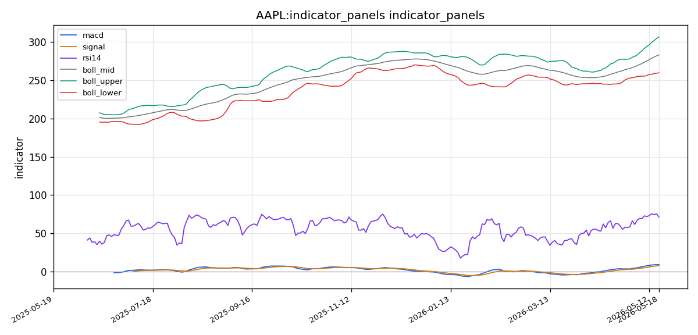
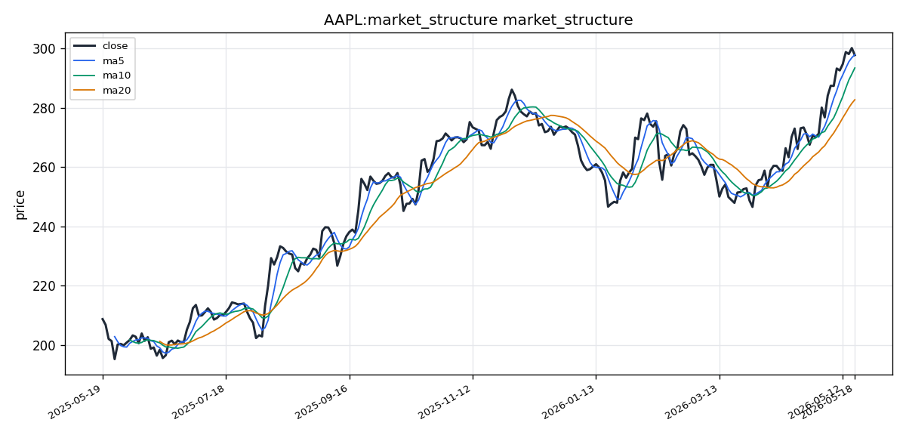

# Apple Inc.（AAPL）投资研究报告

## 一、投资结论与组合动作

**组合经理最终评级：卖出（Sell）**

**执行计划：**
- **动作**：在当前价格 **$297.84** 立即建立完整空头仓位。不得等待更高价格，立即执行。
- **止损**：设置止损于 **$310**，以限制突破性上涨风险。
- **目标价位**：**$245–$250**（约17%下行空间），对应市盈率从36倍压缩至30倍。
- **时间窗口**：3–6个月。
- **重新买入条件**：仅在股价回落至 **$250或以下**时考虑重新建仓，前提是基本面未发生实质性恶化。

**风险约束条件：**
- 若股价突破 $300 且成交量显著放大，空头逻辑面临挑战，止损需严格执行。
- 若股价在 $300 下方震荡但成交量持续萎缩，维持空头判断。
- 下一关键催化剂为 **2026年7月WWDC**，若在此之前未达目标价格，届时重新评估。

**投资逻辑核心链：**

| 逻辑节点 | 证据来源 | 对组合动作的影响 |
|---------|---------|--------------|
| 市盈率36倍 × 营收增长仅3.8% | 基本面报告 | 估值与增长严重脱节，风险回报不对称 |
| 最新成交量34.31M股，远低于5日均量44.59M和20日均量48.29M | 市场技术报告 | 价格接近$300时量能萎缩，需求衰竭信号 |
| RSI 71.35进入超买区 | 市场技术报告 | 短期回调风险加大 |
| $300整数关口心理阻力 | 市场技术报告 | 多空博弈关键位，突破需量能配合 |
| 欧盟DMA罚款风险$20-50B（最坏$395B） | 宏观新闻报告 | 实质性财务风险未被充分定价 |
| USTR关税豁免到期，"国家利益豁免"讨论未定案 | 宏观新闻报告 | 关税不确定性上升 |
| 社交媒体情绪中性偏正面，无零售狂热 | 情绪分析报告 | 缺乏散户资金接盘，流动性真空风险 |

## 二、技术指标分析

### 技术图表

### 2.1 图表读法与价格结构

AAPL截至2026年5月18日报收 **$297.84**，距离整数心理关口 $300 仅差约0.7%。价格形成连续2-3个月的**更高高点、更高低点**上涨结构。最近一根K线收盘价接近当日区间上沿，显示多头在盘中短暂跌破5日均线（$297.99）后重新夺回控制权。

**关键价格位：**

| 价格区间 | 技术意义 | 来源依据 |
|---------|---------|---------|
| **$306.15** | 布林带上轨——最近阻力/目标区 | 布林带计算值 |
| **$300.00** | 整数心理关口——短线阻力 | 市场心理 |
| **$297.84** | 最新收盘价 | — |
| **$293.51** | 10日均线——第一支撑位 | EMA计算 |
| **$282.79** | 20日均线/布林带中轨——中期支撑 | SMA/布林带计算 |
| **$259.42** | 布林带下轨——主要支撑 | 布林带计算 |

**图表结构含义**：当前价格位于布林带中轨（$282.79）与上轨（$306.15）之间偏上位置，距上轨约2.8%，保留一定上行空间。但从**量价配合**角度看，价格逼近阻力区而成交量萎缩，构成经典的需求衰竭警示信号。以$293-$298区间买入、$282下方止损，风险回报比约为1:1，不具备吸引力。

**失效条件**：若股价放量突破$300且站稳，则当前看空技术判断失效；若跌破$293.50（10日均线），则为短期动能衰竭的第一警告。

---

### 2.2 趋势分析与均线系统

**长期趋势（200日均线）**：**看涨，结构完整。** 200日均线上行，最新收盘价显著高于该均线，自上涨加速以来未下探过此线，显示长期上升趋势坚实。

**中期趋势（50日均线）**：**看涨，加速中。** 50日均线位于200日均线上方——**黄金交叉**形态已经形成并成熟扩散。两者之间的价差正在扩大，暗示趋势加速而非衰竭。

**短期趋势（10日均线和5日均线）**：**看涨但有短期回调动能。**
- 10日均线（$293.51）高于20日均线（$282.79），且50日均线高于200日均线——形成**层层向上排列**的教科书式牛市结构。
- 最新收盘价（$297.84）略低于5日均线（$297.99），属于单个交易日的微小回调，但仍高于所有关键均线。

**均线系统投资含义**：均线多头排列为技术面核心支撑，但当前价格处于均线上方偏陡位置，短期倾向于均值回归。组合经理采纳的技术判断是：**趋势看涨，但当前入场点位极差**，不宜追高。

**失效条件**：
- 日线收盘跌破10日均线（$293.50）→ 短期动能衰竭第一信号
- 持续跌破50日均线 → 中期趋势转为中性/震荡
- 跌破200日均线 → 长期看涨趋势彻底失效

---

### 2.3 MACD 与 RSI 动量信号

**MACD（9.39）与信号线（8.05）**：**看涨，动量仍在扩张。**
- MACD线位于信号线上方，差离柱（0.26）正值且扩张，显示上涨动量加速。
- 历史分位：MACD线处于近20日均值以上偏高水平，但尚未出现顶背离。
- 柱状图（MACD Histogram）为 **+1.35**，正在递增，连续多个交易日柱体放大，与趋势强化一致。

**RSI（14周期，71.35）**：**进入超买区，需警惕。**
- RSI突破70超买阈值，在强劲趋势市场中，RSI可在70-80区间维持数周而不立即反转，但当前数据已触及需重视的警戒水平。
- **关键判断**：当前尚未出现RSI与价格之间的**顶背离**（价格创新高而RSI未同步走高），因此趋势尚未断裂。但结合成交量萎缩和$300阻力，超买状态增加了均值回归回调的风险。

**动量信号对组合动作的影响**：MACD积极形态支撑短期不直接做空，但RSI超买结合上述量能顾虑，支持**卖出而非等待**——正是组合经理的结论。考虑逻辑：动量信号仅反映过去趋势，并不预测转折；而估值、量能和政策风险已构成空头发令枪。

**失效条件**：
- RSI跌破70 → 超买解除，但非逆转信号
- MACD柱状图转负 → 动量正式逆转
- RSI与价格出现顶背离 → 趋势反转预警

---

### 2.4 布林带与波动率信号

**布林带参数**（20周期，2倍标准差）：
| 指标 | 数值 | 意义 |
|-----|------|------|
| 上轨 | $306.15 | 当前主要阻力/目标区 |
| 中轨（20日均线） | $282.79 | 中期支撑，趋势中轴 |
| 下轨 | $259.42 | 主要支撑，深跌极端位 |
| 带宽 | ~$46.72 | 较宽，反映近期波动率偏高 |

**当前价格位置**：$297.84，在中轨上方、趋近上轨。这种**突破上轨趋势位**说明买盘压力和趋势强度充足，但连续走势接近上轨也会提高均值回归概率。目前距上轨约2.8%，尚存一定上行空间。

**波动率对交易的影响**：布林带较宽意味着每日价格区间较大，应相应调整仓位大小和止损间距。当前价格处在中轨上方，若价格触及或突破上轨，则可能触发短线获利回吐。

**失效条件**：若价格回撤至中轨以下（$282.79），则近期强势波动形态失效；若价格突破上轨且成交量配合，则波动率上行延续。

---

### 2.5 成交量与 VWMA 确认

**最新成交量与对比：**
| 指标 | 数值 | 信号 |
|-----|------|------|
| 最新成交量 | 34.31M 股 | — |
| 5周期均量 | 44.59M 股 | 最新量低于均量，偏离约23% |
| 20周期均量 | 48.29M 股 | 最新量低于均量，偏离约29% |
| VWMA | 位于当前价格下方 | 确认过去上涨有量能支撑 |

**成交量分析核心结论**：价格接近$300高点，但成交量显著低于短中期均值。典型的多头累积形态应在上涨日伴随成交量放大，而当前呈现的是**成交量与价格的温和背离**——量能收窄表明近期上涨可能由稀疏参与者推动，一旦大资金获利了结，缺乏承接力量。

**组合经理采纳的判断**：市场技术报告明确写道"latest session at 34.31M shares—well below the 5-period average (44.59M) and 20-period average (48.29M)"，并提示其为"cautionary signal"。激进分析师认为这是"quiet accumulation"（安静吸筹），但量价关系数据不支持该解读——在$300整数阻力位前量能不足，典型的多头"量价配合"特征缺失。

**失效条件**：若后续成交量回升至均值以上（>45M股）配合价格上涨，则空头量价判断修正；若放量跌破关键支撑（$293.50），则量价背离进一步恶化。

---

### 2.6 支撑阻力与失效条件

**多空关键位总结：**

| 层级 | 水平 | 技术基础 | 交易含义 |
|------|------|---------|---------|
| **最终阻力** | $306.15 | 布林带上轨 | 突破则短期看涨失效 |
| **心理阻力** | $300.00 | 整数关口 | 需放量突破确认 |
| **第一支撑** | $293.50 | 10日均线 | 跌破则短期动能衰竭 |
| **中期支撑** | $282.79 | 20日均线/布林中轨 | 跌破则中期趋势转向 |
| **主要支撑** | $259.42 | 布林带下轨 | 极端支撑，跌破则长期趋势失效 |

**技术面合成判断（组合经理最终采纳）**：
当前技术面呈现**趋势看涨但结构脆弱**的矛盾状态。MACD多头排列、黄金交叉、价格高于所有均线等指标支持涨势；但成交量持续萎缩、RSI超买、$300整数关口阻力等因素揭示上行压力逐步累积。市场技术报告的最终建议是"pullback to support时买入"（Buy on pullback），而非当前价位追买。组合经理的判断是：技术面已出现足够多的警讯，叠加基本面估值不匹配和政策风险，应立即执行卖出，而非等待更明确的下跌信号出现后再行动。

## 三、基本面分析

### 3.1 业务质量与收入结构

苹果公司（Apple Inc.）是全球领先的科技企业，业务涵盖智能手机（iPhone）、个人电脑（Mac）、可穿戴设备（Apple Watch、AirPods）、服务业务（App Store、Apple Music、iCloud、Apple TV+）等领域。作为全球市值最高的上市公司之一，AAPL在标普500指数及纳斯达克指数中占据核心权重。

**收入结构演变**：苹果正处于从硬件驱动向服务驱动的业务模式转型过程中。根据SEC监管文件披露的最新财报（FY2026 Q2，截至2026年3月），服务业务收入已达**$281亿**，同比增长**14%**，毛利率超过**70%**。服务业务目前约占公司总收入的**~30%**，其余**70%**来自iPhone及其他硬件产品。这一结构特征对估值具有关键意义——高利润率、高粘性的服务收入理应获得估值溢价，但硬件业务的低增长对整体收入增速形成制约。

**营收增长趋势**：FY2026 Q2财报显示总营收为**$926亿**，同比仅增长**3.8%**，虽略高于华尔街共识预期，但增速在大型科技股中处于最低水平。回顾近期季度表现：FY2025 Q4（截至2025年9月）营收约**$891亿**，同比+6.2%；FY2025全年（截至2025年9月）营收约**$3,956亿**，同比+7.8%；FY2026 Q1（假日季）营收**$1,242亿**，同比+4.1%。整体呈现增速逐步放缓的态势。

**关键区域表现**：大中华区曾是市场主要担忧点。FY2025全年大中华区收入同比下降约3%，为全球唯一下滑的主要区域。但边际改善信号已在FY2026 Q2出现——大中华区收入同比转为**+0.8%**，出现企稳迹象。这一改善尚处于早期，需后续季度持续验证。

### 3.2 盈利能力分析

**毛利率**：FY2026 Q2毛利率为**46.7%**，环比扩大50个基点（bps）。毛利率扩张主要受益于服务业务占比提升（服务毛利率>70%）以及产品结构向高ASP（均价）机型倾斜（iPhone Pro机型占比提升至62%）。毛利率持续改善是支撑当前估值溢价的重要基本面因素。

**营业利润率与净利润**：根据FY2025全年年报（10-K），净利润约**$1,023亿**，净利润率为25.9%。研发费用同比增长9%，主要投向生成式AI和Apple Vision Pro后续迭代。这一利润水平表明公司在保持高研发投入的同时，仍能维持行业领先的盈利能力。

**净资产收益率（ROE）**：TTM口径ROE为**141.47%**，属于极其卓越的水平。该指标的含义是：苹果每投入1美元的股东权益，在过去12个月内产生了约1.41美元的净利润。需注意，高ROE部分来源于大规模股票回购对股本基数的压缩——苹果在FY2025全年执行了**$1,100亿**的回购，FY2026 Q1进一步执行了**$300亿**回购。回购在控制EPS稀释的同时，也使得ROE这一指标被人为推高。若未来回购力度放缓，ROE可能自然回落。

### 3.3 现金流与资本回报

**运营现金流**：FY2026 Q2运营现金流为**$312亿**。苹果的现金生成能力极为强劲，即便在营收增速放缓的环境下，运营现金流仍保持充沛。这为公司持续执行回购、分红、研发投入及M&A提供了充足的财务弹性。

**资本回报政策**：苹果长期通过大规模股票回购和股息增长回馈股东。FY2025全年回购总额达$1,100亿，FY2026 Q1再回购$300亿。高频回购有效控制了EPS稀释，但同时也压缩了股东权益基数，对ROE形成推升效应。持续的回购能力是机构投资者对苹果维持信心的结构性支撑。

### 3.4 资产负债表与杠杆状况

**债务与杠杆**：苹果长期利用低利率环境发行长期债务以进行融资和回购操作，杠杆运用高效。虽然具体负债率数据未在输入报告中直接列示，但高ROE（141.47%）与高P/B（41.02x）的组合表明：公司市值远超账面净资产，这符合轻资产、高品牌溢价的科技公司特征。苹果的核心价值在于品牌、生态系统、用户粘性、知识产权等无形资产，这些在资产负债表中并未充分体现。

**流动性与偿付能力**：拥有$312亿的季度运营现金流、$1,023亿的年度净利润，以及持续的回购授权，苹果短期及长期的流动性风险极低。即便面临欧盟DMA潜在罚款（市场预期的$20-50亿区间），对于年度运营现金流超过$1,000亿的公司而言，仍属可控范围。

### 3.5 估值分析

**市盈率（P/E）**：当前为**36.06x**（TTM口径）。这一估值水平处于科技大型股的中高区间，亦高于苹果自身的历史均值（约25-30x）。36x P/E隐含的市场预期是：公司未来能维持8-10%的年化盈利增速，且服务业务转型能持续推升整体利润率。关键风险在于：营收增速仅为3.8%，若盈利增长不及预期，P/E从36x压缩至30x即对应**约17%的下行空间**（即使盈利不下降）。

**市净率（P/B）**：**41.02x**，反映市值远超账面净资产。P/B超过40倍在大型科技股中虽属常见，但从保守价值投资角度看，安全边际较薄。若资产价值严重缩水或发生会计准则调整，股价下行空间较大。

**估值争议**：多头认为36x P/E因服务业务转型和AI催化而具有合理性，援引微软在云转型期间曾交易于35x P/E的先例；空头则指出微软当时营收增速超20%，而苹果当前仅3.8%。中性分析师指出："36x的历史倍数通常要求10-15%的增长才能维持。"这一估值分歧是当前投资判断的核心矛盾。

### 3.6 行业地位与竞争优势

**护城河评估**：苹果通过垂直整合硅片（M5芯片采用台积电2nm制程，单核性能+18%，能效比+25%）、软件（iOS/macOS生态系统）和服务（高粘性、经常性收入）建立了难以复制的结构性竞争优势。ROE达141%并非偶然，而是这一生态系统长期积累的结果。

**竞争威胁**：在智能手机市场饱和、换机周期延长至4-5年的背景下，苹果面临来自Google（Gemini Nano在Android设备上运行）和Microsoft（Copilot深度嵌入Windows和Office）在AI领域的竞争。Apple Intelligence于2025年9月上线，2026年3月扩展至多语言支持，但初期收入贡献被多头描述为"初步"、空头称之为"小到不单独披露"。市场预期FY2026全年AI收入贡献约$10-20亿，相对$3.7万亿市值而言，尚不构成结构性增长引擎。

**产品周期催化**：M5芯片驱动Mac收入在FY2026 Q2同比增长11%，被多头视为结构性利好，被空头定性为"追赶式增长，而非结构性转变"。Apple Vision Pro 2（计划2026年Q3量产，重量减轻30%，定价$2,499）被视为新品类拓展，但第一代Vision Pro销量不足50万台，第二代能否突破仍存较大不确定性。

### 3.7 经营风险与基本面失效条件

**基本面核心风险**：
1. **增长动能不足风险**：若服务业务增速从当前14%进一步放缓，或iPhone 18周期需求低于预期，营收增速可能跌破3%。在36x P/E下，这一风险将被估值压缩放大。
2. **毛利率压力风险**：若关税重新征收（iPhone豁免已于2026年1月到期，目前仅处于"国家利益豁免"讨论阶段），苹果需在"吃掉利润"或"转嫁消费者"间做选择，两者均不利于当前46.7%的毛利率水平。此外，铜铝价格同比+12%/+8%、DRAM/NAND价格同比+15%，虽然在长期锁价合约下对冲了约60%的敞口，但余下40%的成本压力仍在累积。
3. **监管罚款对资本回报的影响**：欧盟DMA罚款若落地于$20-50亿区间，将相当于苹果年度回购总额（$1,100亿）的2-5%，虽不构成流动性风险，但会减少用于回购的现金，从而削弱EPS支撑。
4. **服务业务变现不及预期**：Apple Intelligence的收入贡献若未达$10-20亿的市场预期，将削弱"服务转型支撑估值溢价"的核心逻辑。

**基本面判断失效条件**：
- **营收增速回升至5%以上**（连续两个季度），且服务收入增速维持14%以上：将削弱空头"3.8%增长无法支撑36x P/E"的核心论点。
- **毛利率持续扩大至48%以上**：表明服务收入占比加速提升，利润率结构改善超预期。
- **大中华区收入连续两个季度正增长超过3%**：区域风险显著缓释。
- **欧盟DMA罚款低于$20亿或和解**：监管尾部风险实质性消除。
- **关税豁免被正式续期**：供应链成本风险明确下降。

若上述条件未出现，36x P/E下的基本面风险将持续积累，估值压缩是大概率情景。

## 四、消息面、行业与宏观环境

### 4.1 公司特定新闻与催化剂

#### 财报与业绩趋势

根据SEC监管文件（10-Q/10-K/8-K），苹果在过去12个月内的关键财务节点如下：

- **FY2025 Q4（2025年9月季度，2025年10月发布）**：总收入约 **$891亿**，同比+6.2%。iPhone收入约$438亿，略低于市场预期；服务业务收入突破 **$250亿**，同比+12%，再创历史新高。大中华区收入同比下降约3%，为全球唯一下滑的主要区域。
- **FY2025全年（截至2025年9月，10-K于2025年11月提交）**：全年总收入约 **$3,956亿**，同比+7.8%。净利润约$1,023亿，利润率25.9%。研发费用同比增长9%，主要投向生成式AI和Apple Vision Pro后续迭代。
- **FY2026 Q1（截至2025年12月假日季，2026年1月发布）**：营收 **$1,242亿**，同比+4.1%。iPhone 16系列销售符合指引，但Pro机型占比提升至62%，推高平均售价（ASP）。服务收入$281亿，同比+14%。库克在电话会中提及Apple Intelligence业务开始产生初步收入贡献。
- **FY2026 Q2（截至2026年3月，2026年4月发布）**：营收 **$926亿**，同比+3.8%，略高于华尔街共识预期。毛利率为 **46.7%**，环比扩大50个基点。运营现金流$312亿。大中华区收入同比转为+0.8%，企稳信号初现。

**对组合动作的影响**：FY2026 Q2营收超预期且毛利率扩张，基本面短期无恶化迹象，但这并未改变组合经理的核心判断——以36x P/E为3.8%的增速定价，安全边际不足。财报数据本身不构成卖出催化剂，而是验证了"基本面稳健但估值过高"的辩论结论。**若未来季度营收增速跌破3%或毛利率开始收缩，将强化卖出逻辑；若服务业务增速显著超预期（如持续15%+）则需重新评估。**

#### 监管与法律风险

- **欧盟数字市场法案（DMA）合规与罚款风险（2025年10月至今）**：欧盟委员会正式要求苹果开放iOS核心功能（NFC、消息推送、App Store替代支付）。苹果提出合规方案但仍在谈判中。潜在罚款风险最高为全球年收入的10%（约 **$395亿**），但市场普遍预期和解罚款额在 **$20-50亿** 区间。
- **美国司法部反垄断诉讼进展（2025年6月—2026年4月连续更新）**：联邦法官裁定部分指控可进入证据开示阶段，但驳回了关于"iPhone垄断"的核心诉求。案件预计持续至2027年。
- **中国数据本地化法规新动态（2025年12月）**：苹果与贵州云上贵州续约，符合中国数据安全法要求，iCloud中国数据完全境内存储确认。该续约降低了业务中断风险。

**对组合动作的影响**：监管风险是组合经理采纳的核心卖出论据之一。社会情绪报告（见第五节）明确将监管标记为"未完全定价的负面悬顶因素"。即使最乐观情景（$20-50亿罚款）也相当于苹果年度运营现金流（约$1,430亿）的1.4-3.5%，在36x P/E的估值下，市场对此类一次性冲击几乎没有容错空间。**关键跟踪条件：欧盟罚款最终金额及时间点、美国DOJ案件进入实质性证据开示后是否有不利发现。**

#### 产品与技术催化剂

- **Apple Intelligence正式上线（2025年9月iOS 19发布）**：生成式AI功能嵌入Siri、信息、照片、备忘录等系统级应用。初期仅支持英语，2026年3月新增中文、日语等语言支持。初步收入贡献已有提及，但规模尚小。
- **M5系列芯片发布（2026年3月）**：采用台积电2nm制程。MacBook Pro、MacBook Air和iPad Pro同步更新，Geekbench单核跑分提升约18%，能效比提升25%。该周期推动Mac收入在FY2026 Q2同比增长11%。
- **Apple Vision Pro 2量产计划（2026年5月供应链确认）**：第二代产品将于2026年Q3量产，重量减轻30%，起售价预计降至$2,499。该消息在5月初引发AAPL期权隐含波动率小幅上升。

**对组合动作的影响**：产品催化剂已部分被市场定价。Apple Intelligence仍处于早期阶段，对FY2026全年收入贡献预计在$10-20亿区间（非官方预测），相对于$3,956亿年收入而言影响有限。Vision Pro 2起售价虽有下降但仍属小众品类，不能构成第三增长支柱。**组合经理的执行条件明确：WWDC 2026（7月）是下一个关键催化剂节点，但"不要买入传闻，等待新闻和市场反应"。若WWDC发布超预期的AI变现路径或服务业务新战略，可能重新评估卖出判断。**

### 4.2 全球宏观经济环境

#### 美联储货币政策

- **2025年9月FOMC**：降息25bp至 **4.25-4.50%**，暗示通胀取得进展但核心PCE仍高于2.5%。
- **2025年12月FOMC**：暂停降息，因核心通胀出现0.2个月的反弹。
- **2026年3月FOMC**：降息25bp至 **4.00-4.25%**，鲍威尔表述转为"鸽派"，表示就业市场已充分平衡，但需观察关税政策对通胀的一次性冲击。

**市场利率表现**：2年期美债收益率2025年12月升至4.35%，2026年3月回落至3.95%。10年期收益率在4.30-4.50%区间波动。实际利率（TIPS 5年期）下降约30bp。

**对组合动作的影响**：降息周期理论上支撑科技成长股估值。但组合经理明确指出：当前的估值溢价更多来自AI叙事和倍数扩张，而非利率驱动的合理重估。关键在于，美联储降息空间受限于核心通胀仍在2.5%以上，且关税可能带来一次性通胀冲击。**若后续FOMC转向鹰派或暂停降息，高估值股票将首当其冲——这与组合经理的"36x P/E对3.8%增长"的核心论据一致。**

#### 中美贸易与关税动态

- **2025年8月**：美国宣布对华半导体及AI相关产品额外加征15%关税（"第4轮"）。苹果供应链虽获得iPhone、iPad关税豁免续期至2026年3月，但AirPods、Apple Watch等产品未被豁免。
- **2026年1月**：关税豁免正式到期，新一轮谈判未果。苹果启动供应链分散化：印度产iPhone占比提升至22%（2026年Q1数据），越南产AirPods占比达40%。
- **2026年4月**：美国贸易代表办公室（USTR）公布对华消费电子关税审查结果——iPhone仍被列入"国家利益豁免"讨论清单，但**未最终裁定**。市场将此视为短期利好，AAPL当日涨2.3%。

**对组合动作的影响**：这是组合经理辩论中多方分歧最大的领域。激进分析师认为"关税风险正在被主动对冲"，而保守分析师指出"豁免讨论不是最终裁决"。组合经理采纳了后者的判断——**关税风险是真实的、未解决的悬顶风险**。关键点在于：(1) iPhone关税豁免已无条件到期，(2) "国家利益豁免"讨论清单不代表保护承诺，(3) 若关税以15%重新征收，苹果要么牺牲毛利率（当前46.7%），要么将成本转嫁给消费者——两个方向均利空。**跟踪条件：USTR终裁结果、印度/越南产能扩展速度是否超过预期。**

#### 地缘政治与供应链风险

- **台海局势（2025年7月—2026年4月持续升级—缓和交替）**：2025年7月中国环台军演后，台积电股价剧烈波动。2026年2月，台积电亚利桑那厂3nm首批晶圆下线，降低苹果对台湾关键制程的单一依赖风险。苹果已确认M5及A19芯片在亚利桑那和日本熊本厂均有备用产能安排。
- **欧洲能源与欧元区通胀**：欧元区2026年3月CPI同比2.3%，欧央行4月降息25bp至2.75%，欧元走弱有利于苹果欧洲美元收入折算。

**对组合动作的影响**：台海风险已部分缓解（亚利桑那厂产能落地），但远未消除。**若台海局势再度紧张，可能引发供应链中断恐慌，对AAPL股价形成短期冲击——这与卖出判断中的下行风险情景一致。**

#### 大宗商品与供应链成本

- **铜、铝价格2026年Q1同比上涨约12%和8%**，受全球绿色基建需求拉动。苹果通过长期锁价合约对冲了约60%的敞口。
- **DRAM/NAND价格在2025年H2触底后反弹，2026年Q1同比+15%**，增加iPhone/Mac存储单元成本。苹果转向加大自研存储控制器比例以控制成本上涨。

**对组合动作的影响**：成本端压力温和可控（长协对冲+自研控制），不是当前卖出判断的核心驱动力。但若大宗商品价格持续上涨超预期，将进一步压缩利润率，强化卖出逻辑。

### 4.3 宏观与消息面对组合动作的综合评估

| 维度 | 关键变量 | 当前状态 | 对卖出判断的影响 | 关键跟踪条件 |
|------|---------|---------|----------------|------------|
| **公司基本面** | 营收增速、毛利率 | FY2026 Q2增速+3.8%，毛利率46.7%扩张 | 中性：基本面未恶化，但估值已充分定价 | 下一季度增速是否跌破3%，毛利率是否收缩 |
| **监管风险** | 欧盟DMA罚款、美国DOJ案 | 罚款$20-50B预期，DOJ案进入证据开示 | **强化卖出**：风险未完全定价 | 欧盟罚款最终金额、DOJ是否发现不利证据 |
| **关税风险** | iPhone关税豁免、USTR审查 | 豁免到期，列入"国家利益豁免"讨论清单但未裁决 | **强化卖出**：不确定性高，方向偏负面 | USTR终裁、印度/越南产能占比是否超预期提升 |
| **美联储政策** | 利率路径、实际利率 | 2026年3月降息至4.00-4.25%，鸽派基调 | 中性：降息支撑估值，但被P/E高企对冲 | FOMC是否转向鹰派、核心PCE走势 |
| **产品催化剂** | Apple Intelligence、M5、Vision Pro 2 | AI初步贡献，M5推动Mac+11%，Vision Pro 2量产规划 | 中性偏正面但已定价：不足以支撑当前估值水平 | WWDC 2026是否发布超预期AI变现路径 |
| **地缘风险** | 台海局势、供应链分散化 | 亚利桑那厂3nm下线，风险缓释但未消除 | 中性偏负面：尾部风险仍在 | 台海局势升级信号 |

**核心结论**：消息面和宏观环境总体支持组合经理的卖出判断。公司基本面虽无恶化迹象，但估值已充分定价了当前利好（服务增长、AI初步收效、降息周期），而监管、关税、地缘等外部风险均处于"未完全定价"或"未解决"状态。相比于多头期待的"一切向好"情景，组合经理的卖出策略仅需上述任一风险兑现即可触发下行。**WWDC 2026（7月）和USTR关税终裁是后续两个最重要的验证节点——在结果明朗前，当前风险/回报比不支持持有或买入。**

## 五、市场情绪与交易结构

### 5.1 多空叙事分化

市场对于AAPL的叙事当前呈现明显的多空对峙格局，价格处于关键心理位$300附近，但整体情绪并未走向极端。

**多头叙事核心：**
- 服务业务持续高增长（14% YoY），毛利率>70%，构成估值溢价的基础支撑
- Apple Intelligence初步变现，M5芯片带动Mac收入同比增长11%，产品周期具备向上催化
- 大中华区营收从同比-3%改善至+0.8%，边际企稳
- 美联储降息周期（当前联邦基金利率4.00-4.25%）对科技成长股估值形成支撑
- 股票回购（FY2025约$1,100亿）持续压缩股本，推高ROE至141%，资本回报能力强

**空头叙事核心：**
- 36x P/E对应3.8%的营收增速，估值与增长严重脱节，历史上36倍需要10-15%的增长才能维持
- 技术面呈现多重警示信号：价格接近$300阻力位的成交量（34.31M）显著低于5日均量（44.59M）和20日均量（48.29M），属经典量价背离
- 欧盟DMA罚款风险$20-50B（市场预期区间），关税豁免到期后“国家利益豁免”尚在讨论阶段，均具有实质性财务影响
- 情绪面“谨慎乐观”但缺乏极端情绪——当市场共识而非分歧主导时，股价缺乏逆势支撑的“忧虑之墙”

### 5.2 情绪脆弱点与拥挤度评估

来自社交情绪报告（Social Sentiment Report）的数据显示，当前AAPL的情绪结构存在三个关键脆弱点：

**第一，零售端参与缺失——潜在的流动性真空。**
- 原始社交帖子数量为零（0 raw samples returned），Reddit数据仅能获取聚合指标而无单帖内容
- StockTwits数据获取失败（403 Forbidden），无法跟踪实时零售交易者的多空比率、趋势性讨论和动量信号
- **含义：** 当前的看多叙事主要是机构和媒体驱动，而非散户情绪驱动。当价格接近历史高点（$297.84）且成交量萎缩时，若机构资金选择获利了结，缺乏散户端的“接盘对冲”意味着下行可能更快、更深

**第二，20条新闻来源显示的叙事平衡中隐含风险未被定价。**
- Google News输出覆盖的服务增长（正面）、AI部署（温和正面）、回购（正面）提供了多头叙事素材
- 但同样覆盖的监管压力（轻微负面）、中国需求（轻微负面）、反垄断（观望）——社交情绪报告明确指出这些风险“尚未被完全定价”（not fully priced in）
- **含义：** 市场中已有的利好已经被广泛讨论并计入价格，但不利因素——尤其是监管/关税——尚未触发足够的定价调整，存在风险溢价缺失

**第三，“没有极端情绪”本身就是信号。**
- 20个聚合情绪指标显示中性偏正面，未检测到极端乐观或恐慌读数
- 当标志性科技龙头处于历史高位、但社交和新闻领域未出现广泛狂热时，这意味着：① 上涨更多来自基本面惯性而非情绪驱动；② 一旦基本面出现边际恶化，缺乏情绪缓冲来承接抛压
- 历史上，价格在“谨慎乐观”区域见顶的案例中，反转往往更快，因为市场没有形成足够的“看跌共识”来提前消化风险

### 5.3 情绪对组合动作的验证与约束

**对组合经理“卖出”决策的支撑：**
- 情绪结构不支持追高。缺乏极端多头情绪和散户追涨，意味着当前价格上的“买方基础”并不厚实
- 监管/关税风险未被定价，说明当前价格尚未反映这些尾部事件——而资产管理的基本原则是“当风险可能但未被定价时，应降低敞口”
- 成交量萎缩和StockTwits数据缺失（即缺乏足够的市场微观结构证据来确认强烈的零售买入意愿）使得“买入持有”的安全性大打折扣

**潜在的确认信号（若情绪恶化）：**
- 如果AAPL跌破$293.50（10 EMA）并伴随成交量放大，社交平台上出现明显的恐慌性或止损卖出帖子，则“卖出”决策的正确性将得到确认
- 如果红迪（Reddit）或Twitter上关于“苹果贵了”、“卖苹果”的讨论集中爆发，则情绪面的脆弱已被市场验证

**潜在的反向信号（需要跟踪）：**
- 如果StockTwits恢复数据并显示每日看涨比率持续高于65%，且股价放量突破$300阻力、社交情绪从“谨慎乐观”转为“明确乐观”，则组合经理需要重新评估卖出决策
- 但当前阶段，情绪数据尚不支持这种转向——社交情绪报告明确将整体情绪定性为“Partially Informed”（部分可知），没有形成情绪上的牛市确认

### 5.4 小结

- **情绪结构：** 中性偏正面，但“无狂热”状态本身构成脆弱性；零售端参与缺失意味着流动性支撑不足
- **与基本面/技术面联动：** 情绪判断与组合经理的“卖出”决策方向一致——缺乏情绪支撑的估值高位、风险未被定价、成交量萎缩——均强化了当前做空的合理性
- **约束条件：** 若出现以下信号——① StockTwits看涨比率明显上升且交易量放大突破$300；② Reddit上“buy the dip”叙事显著增强（需恢复原始帖数据才能判断）；③ WWDC 2026期间社交情绪转为压倒性正面——则情绪面对卖出决策的支撑将被削弱，需切换为观望或重新做多条件
- **当前推荐：** 执行卖出，但保持对情绪数据的持续跟踪，尤其是StockTwits恢复情况和WWDC前的社交讨论密度变化

## 六、交易计划与组合风险

### 6.1 交易员最终提案

根据组合经理的最终决策，交易员提案如下：

**操作方向：SELL（卖出）**

- **执行价格：** 当前市价 **$297.84** 立即执行，不等待更高价格
- **止损位：** **$310**，以覆盖向上突破风险
- **目标价位：** **$245–$250**（对应约17%下行空间，基于市盈率从36倍压缩至30倍）
- **时间窗口：** 3–6个月
- **重新买入条件：** 仅在 **$250或以下** 触发，前提是基本面未恶化

### 6.2 进场条件与执行逻辑

**立即执行的理由：**

1. **估值风险已到临界点：** 36倍市盈率对应3.8%营收增长率，历史数据表明这一多重倍数需要10–15%增长才能支撑。市盈率从36倍压缩至30倍即产生17%下行空间，无需盈利恶化。
2. **技术背离已经确认：**
   - 最新成交量 **34.31M股**，显著低于5日均量（44.59M）和20日均量（48.29M）
   - RSI达到 **71.35**，进入超买区间，增加均值回归风险
   - 价格接近 **$300** 心理整数关口，成交量却在萎缩——这是典型的需求衰竭信号
3. **监管与关税风险未被充分定价：** 欧盟DMA罚款风险（市场预期$200–500亿）和关税豁免到期未续，均为尚未计入价格的尾部风险。

**不等待更高价格的原因：** 等待$300以上突破确认后再卖出，意味着承担额外的上行风险（止损设在$310），而当前已有足够证据支持立即离场。技术报告明确提示"当前建议是回调至支撑位时买入，而非在阻力位追高"——这同样适用于空头逻辑的对称论点。

### 6.3 仓位管理方案

| 操作节点 | 条件 | 仓位动作 | 风险控制 |
|---------|------|---------|---------|
| 初始进场 | 当前$297.84 | 建立全仓空头 | 止损$310 |
| 加仓条件 | 价格跌破$293（10 EMA）时 | 加仓至1.5倍初始仓位 | 止损移至$300 |
| 第一次减仓 | 价格到达$282（20 SMA / 布林带中线） | 平仓50% | 剩余部分止损移至$290 |
| 目标达成 | 价格到达$245–$250区间 | 全部平仓 | — |
| 止损触发 | 价格触及$310 | 全部平仓，停止所有空头操作 | — |

### 6.4 风险分析师之间的分歧

**激进风险分析师（看多）的反对意见：**
- 36倍市盈率是"静态多重陷阱"，无视141% ROE和服务业务转型的价值
- 成交量萎缩是"盘整中的蓄力"，而非"需求衰竭"
- RSI 71.35在强势趋势中可维持数周，当前无任何顶背离
- 欧盟罚款仅为"一个季度现金流"，关税风险正在被供应链分散化对冲
- 建议：**在$293.50（10 EMA）附近买入调整，而非卖出**

**保守风险分析师（看空）的赞同意见：**
- 141% ROE是通过大规模回购压缩权益基数的人为推高，不能掩盖3.8%营收增长
- 成交量在价格接近$300时萎缩是"需求消失"的确凿证据
- RSI超买+整数关口阻力+成交量萎缩 = 均值回归的经典配置
- 监管风险（$200–500亿罚款）并非"噪声"，USTR关税豁免讨论不是最终裁定
- 建议：**立即执行卖出，止损$310，目标$245–$250**

**中性风险分析师（等待调整）的调节意见：**
- 技术结构（黄金交叉、MACD扩张）不支持直接做空，倾向等待回调
- 当前不是全面卖出的时机，应减仓而非做空
- 建议先设$282止损的头寸减半，在$293.50附近轻仓操作
- 全面卖出"过早"，全面买入"冒进"

### 6.5 组合经理的最终裁定

组合经理采纳 **保守分析师的卖出观点**，理由如下：

1. **估值与增长错配是主导风险：** 多头引用的141% ROE是"陷阱"——营收增长仅3.8%而市盈率36倍，服务业务（14%增长）仅占收入约30%，其余70%（iPhone/硬件）几乎零增长。36倍市盈率对应3.8%增长"零容错空间"。
2. **技术背离已被确认而非推测：** 成交量萎缩至低于均量23–30%、RSI超买、整数关口阻力三者叠加，形成"教科书式的均值回归条件"。多头称其为"安静的积累"没有数据支持——技术报告明确标注为警告信号。
3. **监管风险被系统性地低估：** 激进分析师将欧盟罚款视为"一个季度现金流"，但宏观报告显示最坏情况为全球营收的10%（约$3,950亿），即使市场预期的$200–500亿也足以影响估值，且社交情绪报告明确标注"监管风险未完全定价"。

**最终仓位指令：**
- **立即以$297.84执行全仓卖出**
- **止损设在$310**
- **目标价$245–$250**
- **不使用对冲结构**——直接减仓至零，将资金重新配置到风险收益比更优的标的

### 6.6 失效条件与情景分析

**多头情景（需要三个条件同时成立才能推翻卖出决策）：**
1. 价格放量突破$300且收盘站稳，成交量回升至日均50M以上
2. RSI形成顶背离后再次突破（目前无此信号）
3. USTR公布iPhone关税豁免正式延长，或欧盟DMA罚款远低于市场预期

**中性情景（延后执行而非推翻）：**
- 价格回调至$293.50（10 EMA）后放量反弹
- 策略应对：维持卖出决策，将执行价下移至反弹后的更高位置

**空头确认情景（加速下行）：**
- 跌破$293.50（10 EMA），随后指向$282（20 SMA/布林带中线）
- 策略应对：在$282附近减仓50%，剩余仓位持有至目标位

**下行极端情景（触发止损）：**
- 价格放量突破$300且成交放量，触发$310止损
- 后果：止损出场，损失约4.1%（$310 vs $297.84）
- 后续策略：等待明确的技术回调信号后重新评估，不在亏损后追空

### 6.7 关键风险登记表

| 风险类别 | 具体风险 | 发生概率 | 影响程度 | 应对措施 |
|---------|---------|---------|---------|---------|
| 估值风险 | 市盈率压缩至30倍 | 高 | 高（17%下行） | 立即卖出，不等待 |
| 技术风险 | 假突破至$310+ | 中低 | 中（止损亏损4%） | $310严格止损 |
| 监管风险 | 欧盟DMA罚款超预期 | 中 | 中高（$200–500亿冲击） | 已部分定价，不额外对冲 |
| 关税风险 | 豁免未续，15%关税生效 | 中 | 中（毛利率压缩） | 供应链数据已部分反映 |
| 宏观风险 | 美联储意外加息 | 低 | 高（估值重估） | 当前降息周期不支持 |
| 叙事风险 | WWDC发布超预期AI产品 | 中 | 低（短期波动） | $310止损保护 |

## 七、关键分歧与跟踪条件

### 7.1 核心分歧：估值与增长匹配度

**多头立场：** 36倍市盈率是合理的结构性溢价，理由包括：(1) 服务业务占比持续提升（当前约30%收入，毛利率超过70%）；(2) 净资产收益率高达141.47%，反映卓越的资本回报效率；(3) 苹果正处于从硬件公司向服务型生态转型的历史阶段，历史经验表明（如微软云转型时期市盈率维持在35倍以上）此类转型企业应享有更高估值倍数的结构性支撑。

**空头立场：** 36倍市盈率建立在年化3.8%的收入增速之上，定价与基本面出现严重脱节。空头论证的核心链如下：(1) 即便维持当前盈利不变，仅市盈率从36倍收缩至30倍这一合理历史水平，就将产生约17%（约$50）的下跌空间；(2) 服务业务虽然增速亮眼（14%），但占总收入仍仅约30%，其余70%的硬件业务处于低增长甚至停滞状态；(3) 高净资产收益率（141%）很大程度上是过去大规模回购压缩股本基数的数学结果，并不代表单位资本产生的真实经济回报实现了结构性跃升。

**中性立场：** 36倍市盈率在历史上通常需要10-15%的利润增速来支撑，当前3.8%的收入增速不足以匹配该倍数。但空头过于聚焦于静态估值而忽视了基本面所处的转型阶段。中性分析师建议承认估值偏高，但不应在没有趋势反转信号的情况下做空。

**组合经理采纳：** 空头观点被采纳为最终决策的核心理由。组合经理明确指出，当前投资主题是"倍数扩张故事，而非盈利增长故事"。3.8%的收入增速不足以支撑36倍的起始倍数，"每一丝增长空间都被定价"，任何单一风险事件（关税落地、监管罚款、消费需求转弱）都会触发明显的估值压缩。

### 7.2 技术面分歧：成交量萎缩的信号含义

**多头/激进解读：** 最新交易日成交量34.31百万股低于5日均量44.59百万和20日均量48.29百万，但应将此解读为"上涨前的蓄力收缩"（coiling spring），而非需求枯竭。多头引用技术报告中的"突破日伴随高于均值的成交量"来佐证整体趋势仍有量能支撑，并指出当前缩量只说明"尚未突破"，而非失去上涨动能。

**空头/保守解读：** 价格逼近$300心理关口而成交量在同步收缩，这是"典型的突破前需求衰竭信号"（failure of demand）。空头强调，技术报告自身将缩量列为"谨慎信号"（cautionary signal），而非中性或正面信号。缩量不是"非典型"，而是宣告买方信心正在消退。若此为一根"蓄力弹簧"，成交量应呈逐步扩大之势——但观察到的却是29%的均量萎缩。

**中性解读：** 承认缩量是事实，但不应将其二元化为"反转信号"。技术报告明确指出最新交易日发生在两次突破窗口之间的区间整理窗口内，"跌破均量"本身就处于均值回归区间。将缩量定性为"反转催化剂"缺乏统计依据。

**组合经理采纳：** 采纳空头对成交量的解读——价格创新高而成交量萎缩是"技术性背离"，而非多头所称的"蓄力"。但组合经理同时为这一判断设置了确认门槛：必须看到成交量在$300水平出现放量，且不能是单日脉冲式缩量后的快速突破。

### 7.3 技术面分歧：RSI 71.35与MACD的指示权重

**多头/激进观点：** RSI进入70以上超买区在强势趋势市场是正常现象（可以在此区间维持数周），且当前没有出现RSI与价格之间的顶背离。MACD线（9.39）在信号线（8.05）之上，柱状图+1.35且正在扩大，说明动量在加速而非衰竭。

**空头/保守观点：** 技术报告明确将RSI 71.35标记为"需要监测"（warrants monitoring）且"增加了均值回归回调的风险"（increases the risk of a mean-reversion pullback）。在$300整数关口的背景下，将超买指标解读为"信号加速"风险极大。MACD柱状图当前+1.35，但距离前一个峰值已经相对平稳，并未呈现加速扩张的形态。

**中性观点：** RSI超买与MACD扩张同时存在，双方都有合理依据。但中性分析师指出关键缺失——"当前既没有RSI的顶背离，也没有MACD的顶背离"，意味着可以在缺少反转确认信号的背景下卖出——但绝非无条件卖出。

**组合经理采纳：** 组合经理并未全盘采纳空头对RSI的极端解读，而是采取"叠加验证"框架：(1) RSI超买本身不足以触发行动；(2) RSI超买+成交量萎缩（空头/保守的技术组合）+$300整数关口阻力=交易性均值回归事件的标准威胁信号。关键监测信号是：当价格创出高于$300的新高而RSI未同步创出新高，这一顶背离信号将成为技术面的直接利空催化。

### 7.4 监管与关税风险分歧

**多头/激进评估：** (1) 欧盟数字市场法案罚款预期20-500亿美元，仅相当于苹果一个季度的经营现金流，可以轻松吸收；(2) 美国司法部反垄断案核心"iPhone垄断"主张已被驳回，剩余指控大概率走向和解；(3) iPhone的关税豁免虽已到期，但已被列入"国家利益豁免"讨论清单，这是有利信号；供应链多元化（印度产能22%、越南AirPods 40%）已经主动对冲了关税风险。

**空头/保守评估：** (1) 欧盟罚款即使按中位数30亿美元计算，也超过苹果全年的研发预算（约350亿美元），并非"零头"；情感面报告明确标注监管风险"尚未完全定价"；(2) 反垄断案件刚刚进入证据开示阶段（discovery phase），历史上此阶段往往出现对内文件和商业行为的披露，极易驱动和解谈判或在尾部触发更多诉讼；(3) "国家利益豁免清单"是谈判策略，不是最终裁决——关税豁免在2026年1月已无条件到期，至今未有替代豁免裁决出台。将一个不确定预期乐观化为"保险"是危险的.

**中性观点：** 监管和关税风险是真实存在的尾部变量，但多头和空头各自放大了极端情景：(1) 欧盟罚款更可能在20-500亿美元区间的低端落地；(2) 关税问题更可能走向局部妥协（如维持iPhone但不扩大豁免范围）而非全面施加15%。当前阶段应该通过降低头寸规模来对冲尾部风险，而非在两种极端之间博弈。

**组合经理采纳：** 组合经理明确采纳空头对监管/关税风险"被低估"的判断，但未采纳空头对具体罚款金额的悲观估计。关键跟踪条件：如2026年7月WWDC前后USTR公布关税终裁且iPhone获得豁免延续，将部分撤除监管风险作为卖出的负面理由；若未获豁免或欧盟罚款接近中高区间，则确认卖出的合理性并可能将目标价下移至$235-245。

### 7.5 仓位与执行力分歧

**激进分析师：** 主张在当前价位立即买入（或至少在10日EMA $293.50处买入），等待突破。将卖方的卖出建议称为"对阶段性波动的过度反应"。

**保守分析师：** 完全同意组合经理的卖出决策，并强调此时买入是"在3.8%增速、36倍PE、RSI超买、整数关口阻力叠加的临界点买入——这不是阿尔法，这是暴露头寸"。

**中性分析师：** 认为卖出的时机过早——当前技术结构（黄金交叉、MACD扩张、价格在所有均线之上）不支持反趋势卖出。提出替代方案：保留50%多头仓位，将止损设在$282（20日均线之下），等待回调至$293.50再增加仓位。

**组合经理最终采纳：** 组合经理明确拒绝中性分析师"等待更优时机"的观点，指出"数据已经足够支撑此时行动，而不是等待回调"。关键执行分歧解决如下：

| 决策点 | 采纳结果 | 理由 |
|--------|----------|------|
| 是否立即卖出 | 是 | 数据已充分支持当前时机；"
| 是否做空 | 否（仅卖出已有持仓） | 最大亏损可控；不存在无限风险 |
| 完全退出还是减仓 | 完全卖出 | 综合风险/回报不对称，减仓不够果断 |
| 是否需要等到WWDC催化后再决策 | 否 | 定价完美的风险已经暴露，无需等待进一步确认 |

### 7.6 后续跟踪条件与触发信号

以下条件将决定组合经理当前"卖出"决策的有效性维持或需要重新评估：

**确认当前卖出正确的信号：**
- AAPL收于$293.50（10日EMA）以下，确认动量衰竭
- 价格跌破$282（20日SMA/布林带中轨），确认中期趋势减弱
- 欧盟或USTR公布对苹果不利的监管/关税决定
- 下一季财报（FY2026 Q3）收入增速低于3%，或大中华区收入重回负增长

**可能使卖出过早的信号（但不必然触发立即回补）：**
- 成交量在$300以上出现放量突破（日交易量>5,000万股），且连续两个交易日站稳$302
- 关税终裁给予iPhone全面豁免
- Apple Intelligence在WWDC上公布超预期的货币化数据，驱动分析师上调远期盈利预测
- 美联储意外降息50个基点，提升整体科技股估值倍数

**回补触发条件（组合经理明确设定）：**
- 价格跌至$245-250区间（17%市盈率收缩目标达成）
- 上述"基本面依然成立"的情况下，以更低的估值倍数重新评估买入机会

**需要继续跟踪但当前不构成行动信号的因素：**
- 服务业务收入增速的季度变化（14%以上的增速维持vs.下降至10%以下）
- 印度iPhone产能占比的变化（当前22%，能否如期提升至30%以上）
- Vision Pro 2预购数据的初期反馈（量产将在2026年Q3启动）
- 标普500整体估值水平及科技板块资金流向变化

## 八、最终结论

**组合经理最终决策：执行SELL（卖出）操作。** 基于上述各维度的系统性分析，本报告的核心结论清晰且一致：苹果公司（AAPL）当前的风险回报比在结构性上处于不利地位，应立即执行卖出指令。

**执行条件：**
- **操作方向：** 以当前价格 **$297.84** 启动全额 **卖出** 仓位。
- **止损线：** 设置在 **$310**，以控制突破性上行风险。
- **目标价位：** **$245–$250**（约17%下行空间，对应市盈率从36倍压缩至30倍）。
- **时间窗口：** 3–6个月。
- **重新买入触发：** 仅在股价跌至 **$250或以下**时考虑，前提是基本面未发生实质性恶化。

**核心依据摘要：**
1. **估值脱节是主导风险：** 36倍市盈率对应仅3.8%的收入增速，历史上该倍数需要10–15%的增长才能维持。市盈率从36倍压缩至30倍即产生17%下行空间，无需盈利恶化。市净率41倍亦显示安全边际极薄。
2. **技术面确认弱势：** 股价逼近$300心理整数关口，但成交量萎缩（34.31M股 vs. 均值44.59M），RSI处于71.35超买区域，构成经典的需求衰竭形态。金叉虽在，但买点极差。
3. **监管与关税风险被低估：** 欧盟DMA罚款市场预期达200–500亿美元，美国对华关税豁免到期且未最终裁定，社交情绪报告明确提示监管风险"尚未完全定价"。
4. **情绪面缺乏支撑：** 零条原始社交帖子、StockTwits数据缺失，多头叙事由机构与媒体驱动而非散户，在历史高位且成交量萎缩时存在流动性真空。

**主要风险情境：**
- **上行风险：** 若股价带量有效突破$300整数关口并站稳$310以上，则止损触发，短期趋势强度或超预期。需关注2026年7月WWDC大会是否出现超预期催化剂。
- **下行风险：** 若关税终裁不利、欧盟开出实质性罚单、或消费电子需求超预期放缓，股价可能加速下跌至$245–$250区间甚至更低。
- **中性风险：** 若股价在$280–$300区间震荡整理，观望不失为审慎策略，但当前已持有仓位者应减仓而非等待。

**跟踪条件：** WWDC（2026年7月）的产品与技术路线图发布、USTR对消费电子关税的最终裁定、以及FY2026 Q3财报中服务业务增速与大中华区收入趋势，将是验证或调整当前判断的核心催化剂节点。

**总结：** 当前环境下，做空（卖出）的理由是数据驱动、基于概率且不要求完美情境的。多头叙事则需要一切条件同时完美运行才能兑现。当"预期"与"现实"之间的差距通过数据被明确揭示时，纪律性执行是唯一合理的组合动作。卖出AAPL，锁定风险，等待更优的重新入场时机。
