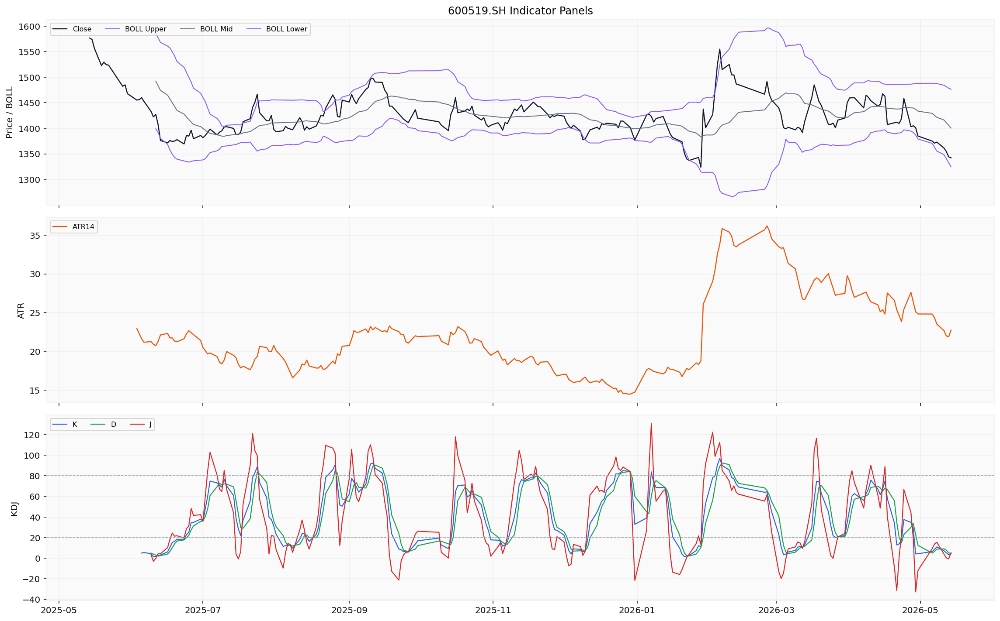
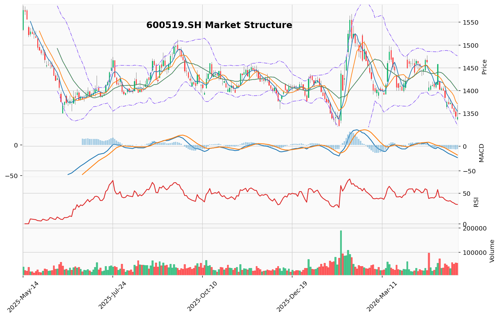

# 贵州茅台（600519.SH）投资研究报告

**报告基准日：2026年5月14日**

---

## 一、投资结论与组合动作

**最终建议：卖出贵州茅台（600519.SH）**

组合经理审阅了激进、中性、安全/保守三方分析师的完整辩论，并结合交易员的历史经验教训，最终做出以下决策：

### 决策理由概述

当前茅台面临的是**结构性风险胜于周期性反弹**的判断。核心依据如下：

1. **四个史无前例的结构性逆风**：人口负增长（消费主力萎缩）、商务场景永久性压缩（“过紧日子”制度化）、金融属性反噬（批价下跌触发库存踩踏风险）、代际断层（年轻消费者流失）。这与2013年、2018年的周期性冲击性质完全不同，本次是底层逻辑的系统性重塑。

2. **关键财务信号已亮红灯**：合同负债从120亿暴跌至65%至30.27亿元，是“渠道冻结”的直接证据，而非会计调整或直销占比提升的平滑结果。公司甚至需要借钱给经销商买酒，这是“渠道失血”的最后一针强心剂。

3. **估值重构逻辑清晰**：20倍PE在当前增速中枢下移背景下并非“底部”，而是“合理偏贵”。全球消费品对标显示，6%增速对应15-18倍PE中枢，当前仍有15-25%的杀估值空间。

4. **技术面确认空头趋势**：均线系统空头排列，MACD死叉负值柱体未收敛，且无任何底部背离信号。

### 战略行动计划

**立即行动：**
- 卖出至少**70%** 的茅台仓位（若为个人投资者持仓较重）
- 保留少量仓位（≤总仓位5%）仅作为“极端情景下的底仓”
- 若必须持有部分，设定严格止损位：**跌破1322元（当前支撑区间下沿）立即清仓**

**后续操作：**
- 将卖出资金配置至**货币基金或短期国债**，规避不必要的波动
- 跟踪三个关键信号：
  1. **合同负债是否企稳**（Q2数据：若环比回升至50亿以上，视为早期乐观信号）
  2. **茅台酒批价是否跌破2000元**（若在2000元上方稳定，需求存支撑；若跌破，继续观望）
  3. **PE是否跌至15-18倍区间**（对应股价1050-1260元，这才是真正的价值区间）

**何时考虑重新买入：**
- 当上述三个信号中**至少两个**出现明显改善
- 或PE跌至**15倍以下**（极致悲观估值，对应股价约1050元）
- 或技术面出现**底部背离+均线金叉**

### 目标价格分析

| 情景 | 假设2026年EPS | 假设PE | 对应股价 | 概率加权 |
|------|---------------|--------|---------|---------|
| **保守（悲观）** | 65元 | 15倍 | **975元** | 15% |
| **基准** | 68元 | 18倍 | **1224元** | 60% |
| **乐观** | 70元 | 22倍 | **1540元** | 25% |

- **概率加权目标价**：约 **1235元**（较当前1342元下行约8%）
- **极值下行风险**：若经济持续走弱且金融去杠杆加速，PE可跌至12倍（2013年极限），对应股价约 **820元**（概率较低，但不可忽视）

**风险约束**：当前下行空间（15-25%）显著大于上行空间（10-15%），持有即在押注概率更小的乐观剧本。真正的风险管理是在结构性危机明确时果断执行。

---

## 二、技术指标分析

### 技术图表

### 2.1 图表读法与价格结构

贵州茅台（600519.SH）最新收盘价 **1342.17元**，自2025年5月区间高点 **1586.38元** 以来持续下行，累计跌幅约15.4%。当前价格位于 **1322.01元**（区间最低价）至 **1342.17元** 之间，构成短期支撑区间。

- **第一支撑位**：1322元（区间最低价）
- **第二支撑位**：1300元（整数关口）
- **第一压力位**：1355元（MA5）
- **第二压力位**：1371元（MA10）
- **第三压力位**：1400元（MA20/布林带中轨）

### 2.2 价格趋势分析

**短期趋势（5-10个交易日）**：
价格持续下行，从1586.38元高点至今累计下跌约15.4%。短期在1322-1342元附近构成支撑区间。上方第一压力位在MA5（1355.03元），第二压力位在MA10（1371.21元）。鉴于RSI6已降至17.47的极端超卖水平，未来5-10个交易日出现**超卖反弹**的概率较高，反弹目标看至1355-1371元区域。但反弹力度取决于量能配合情况，若反弹无量则可能演变为下跌中继。

**中期趋势（20-60个交易日）**：
中期趋势仍然偏空。均线系统空头排列（MA5 < MA10 < MA20 < MA60）清晰，且MA20（1400.49元）与MA60（1430.84元）之间的距离仍在拉大，表明中期调整尚未结束。从区间高点回落以来，整体下行通道保持完整，未见明显的底部形态（如双底、头肩底）出现。中期而言，价格需有效站上MA20（1400元）并进一步突破MA60（1430元）才能确认趋势反转。

### 2.3 移动平均线（MA）系统

| 均线 | 数值（¥） | 与现价关系 | 方向判断 |
|------|-----------|-----------|---------|
| MA5 | 1355.03 | 价格在MA5下方 | 空头压制 |
| MA10 | 1371.21 | 价格在MA10下方 | 空头压制 |
| MA20 | 1400.49 | 价格在MA20下方 | 中期空头 |
| MA60 | 1430.84 | 价格在MA60下方 | 中长期空头 |

**均线排列形态**：当前均线系统呈现典型的**空头排列**（MA5 < MA10 < MA20 < MA60），短期均线全部运行于长期均线之下。现价1342.17元距MA5（1355.03元）仅差约12.86元（约0.95%），距离MA60（1430.84元）仍有约88.67元（约6.6%）的差距。短期存在向MA5回抽的技术性需求，但中期空头压制依然沉重。

**均线交叉信号**：截至最新数据，未见明显的金叉信号。若短期反弹出现，需关注MA5能否向上突破MA10形成短期金叉，以及价格能否有效站上MA20（1400元）这一重要关口，否则空头格局难以扭转。

### 2.4 MACD/RSI动量信号

**MACD指标**：

| 指标 | 数值 |
|-----|------|
| DIF | -23.12 |
| DEA | -16.36 |
| MACD柱（DIF-DEA差值） | -6.76 |

DIF（-23.12）位于DEA（-16.36）之下，MACD柱状图为负值（-6.76），属于**死叉状态**且仍在延续中。MACD负值柱体表明空方动能持续释放，短线尚未见到收敛迹象。结合区间高点1586.38元与当前价格1342.17元的持续下行，MACD指标同步向下，未出现明显的底背离信号。若后续价格创出新低而DIF不再创新低，则需警惕底背离可能，但目前尚无此信号。DIF与DEA双双处于负值区间且差值仍有-6.76，表明空头趋势处于**持续强化阶段**。

**RSI相对强弱指标**：

| RSI参数 | 数值 | 状态判断 |
|---------|------|---------|
| RSI6 | 17.47 | **严重超卖区**（< 20） |
| RSI12 | 29.33 | **超卖区**（< 30） |
| RSI24 | 38.45 | 中性偏弱区域 |

RSI6（17.47）已跌入20以下的**严重超卖区**，这是非常罕见的极端水平。历史上贵州茅台出现类似低值时通常伴随技术性反弹。但需注意：在结构性下跌中，超卖不等于底部，超卖可能钝化并持续更久——2013年、2018年、2021年都出现过超卖后继续下跌的情况。当前RSI24（38.45）仍处于50下方的弱势区域，表明中长期趋势尚未逆转。短期存在超卖反弹需求，但中期空头趋势未改。

**背离信号**：当前RSI6处于极低水平，需持续观察——若价格继续下跌但RSI不再同步新低，将构成经典底背离信号，为多头入场提供重要参考。但目前尚需更多交易日验证。

### 2.5 布林带/ATR波动信号

**当前布林带数值**：

| 轨道 | 数值（¥） | 宽度 |
|------|-----------|------|
| 上轨 | 1476.41 | — |
| 中轨（MA20） | 1400.49 | — |
| 下轨 | 1324.56 | — |
| **带宽**（上轨-下轨） | **151.85 ¥** | **约10.85%** |

收盘价1342.17元位于中轨（1400.49元）与下轨（1324.56元）之间，距离下轨仅约17.61元（约1.3%），表明价格已接近布林带下轨支撑区域。此位置通常意味着短期下跌空间有限，存在下轨支撑反弹的技术预期。带宽151.85元相比历史数据处于正常偏宽区间，表明波动率尚可。若后续价格在下轨附近获得支撑反弹，带宽可能有所收窄，进入横盘整理阶段。

**关键风险**：当前价格未突破下轨，但已极度接近（1342.17 - 1324.56 = 17.61元），一旦有效击穿1324.56元下轨支撑，可能触发加速下跌行情。

### 2.6 成交量/VWMA确认

区间累计成交量约927.11万手，成交额约742.86亿元。日成交量为55,244手，在近期属于相对活跃水平。量价关系上呈现**价跌量增**的特征，表明下跌过程中抛压持续释放，空方力量占据主导。在极端超卖区域若出现**放量止跌**或**缩量企稳**信号，将是底部确认的重要参考。当前尚未看到明确的量价转暖信号。

### 2.7 失效条件与触发条件

**确认空头判断的条件**：
- 价格有效跌破1322元（区间最低价）并收盘确认，打开下行空间至1300元整数关口
- 布林带下轨1324.56元被击穿，触发加速下跌行情
- 成交量持续放大伴随价格下行，确认抛压未释放完毕

**推翻空头判断的条件**：
- MA5向上突破MA10形成短期金叉，且价格有效站上MA20（1400元）
- 出现经典底背离信号（价格新低而RSI或MACD不再同步新低）
- 在1322元附近出现放量止跌或缩量企稳信号，配合成交额显著放大
- 价格突破MA60（1430元）并回踩确认，视为中期趋势反转

---

## 三、基本面分析

### 3.1 盈利能力：极致高毛利、高净利率

贵州茅台2026年一季度（截至2026年3月31日）核心盈利能力指标：

| 指标 | 数值 | 解读 |
|------|------|------|
| 营业收入 | 53.91亿元（季度） | 同比仅增长6.34%，增速较此前两位数增长明显降速 |
| 净利润 | 28.15亿元（季度） | 净利率高达52.22% |
| 毛利率 | 89.76% | 全球消费品行业绝对领先，体现强定价权与品牌护城河 |
| 净利率 | 52.22% | A股最高水平之一，费用控制与税务结构极优 |

**关键解读**：毛利率89.76%意味着成本端占比极低，原材料（高粱、小麦等）波动对利润影响微乎其微。净利率52.22%体现极优的费用控制与税务结构。但需警惕：净利率不可能无限提升，当前已是A股最高之一，继续提升空间有限。此外，一季度营收同比仅增6.34%，是茅台多年来首次出现个位数增长，增长中枢下移的迹象明显。

### 3.2 现金流质量：利润“含金量”高

| 指标 | 数值 | 解读 |
|------|------|------|
| 经营活动现金净流入 | 26.91亿元 | 与净利润28.15亿元的比值（净现比）约为0.96，接近1:1 |
| 净现比 | 0.96 | 利润几乎全部以真实现金形式实现，无大量应收账款积压 |

**关键解读**：净现比接近1:1，与茅台“先款后货”的销售模式高度一致。现金创造能力极强，这是茅台财务实力的核心体现。但需注意：合同负债从120亿暴跌至30亿（-65%），意味着未来可确认的现金收入基础被显著削弱。

### 3.3 资产负债结构与财务安全

| 指标 | 数值 | 解读 |
|------|------|------|
| 资产负债率 | 12.12% | 极低杠杆水平，几乎无有息负债压力 |
| ROE（净资产收益率） | 10.57%（季度） | 年化约30%-35%，股东回报能力极强 |
| ROA（总资产收益率） | 12.00%（季度） | 资产运用效率卓越 |

**关键解读**：贵州茅台的基本面核心特征可归纳为“三高一低”——高毛利率、高净利率、高现金流质量、低资产负债率。这是A股市场中极为稀缺的优质资产质地。资产负债表安全性极高，公司账上现金+类现金资产超1500亿，足以应对任何极端情况。

### 3.4 估值讨论

**当前估值水平**：

| 指标 | 数据 |
|------|------|
| 收盘价 | ¥1,342.17/股 |
| 总市值 | ≈ ¥1.68万亿 |
| PE（TTM） | 20.32倍 |
| PB（市净率） | 6.20倍 |

**估值位置判断与核心争议**：

**看涨方观点**：PE 20.32倍是茅台近五年估值区间（约25-60倍）的偏低水平，处于近年来的估值低位区域。历史中枢约30-35倍，当前已低于过去5年历史中位数，可能隐含了较多悲观预期。

**看跌方回应**：市场给茅台的定价逻辑从来不是“消费品”，而是“成长股”。当增速从20%掉到6%，估值中枢必须向下重估。全球消费品估值对比：雀巢（增速4-5%）PE 18-22倍，可口可乐（增速3-4%）PE 20-25倍。茅台未来合理增速6%，PE合理估值应为15-18倍。当前20倍PE对应的是增速中枢下移后的合理估值，而非低估。

**组合经理结论**：用历史PE锚定当前市值的做法是刻舟求剑。2013年PE跌至12倍时，净利润仅150亿；当前净利润900亿，增长基数大了6倍，增速自然放缓。市场正在对茅台的“确定性增长”溢价进行重新定价。

### 3.5 经营风险与行业地位

**核心经营优势**：
- 地理排他性：茅台镇15.03平方公里核心产区，不可复制的水源、气候、微生物环境
- 品牌心智：“国酒”地位在中国消费者心中根深蒂固
- 定价权：市场价2400元 vs 出厂价1169元，巨大渠道利润空间提供缓冲垫
- 金融属性：老酒市场交易额已突破300亿，茅台占70%以上

**关键经营风险**：
1. **合同负债断崖式下降**：2026Q1仅30.27亿元，创近8年最低水平，同比下降65%，是渠道信心崩溃的直接证据
2. **业绩增速放缓**：Q1营收同比仅增6.34%，此前为两位数增长，增长中枢明显下移
3. **渠道变革阵痛**：直销占比已超45%，新旧体系衔接不畅可能导致短期业绩波动
4. **批价下行风险**：从2700元跌至2400元，若跌破2000元心理关口将触发库存踩踏
5. **成长性放缓**：产量天花板（核心产区产能约6万吨）+ 收入基数增大，导致增速自然放缓

**削弱判断的财务信号**：
- 若合同负债在Q2环比回升至50亿以上，可能是渠道信心恢复的早期信号
- 若批价在2000元以上稳定，说明需求存在支撑
- 若通过提价或非标放量等方式增厚利润，估值修复空间可观

---

## 四、消息面与行业环境

### 4.1 公司层面关键事件

| 日期 | 事件 | 影响分析 |
|------|------|---------|
| 2026-05-11 | 业绩说明会：合同负债骤降65%至30.27亿元 | **核心利空**。合同负债是未来收入的“蓄水池”，骤降意味着经销商打款意愿崩溃 |
| 2026-05-11 | 公司回应：自营以客户确认收货为准，经销以签收为准 | 中性。标准回应，未超预期 |
| 2026-05-11 | 业绩说明会透露：向经销商提供资金用于买酒 | **利空**。侧面印证经销商资金链紧张，需茅台母公司输血才能完成采购 |
| 2026-05-08 | 回购股份实施进展公告 | **利好**。持续回购对股价形成托底预期，但规模相对市值极小（约60亿vs1.68万亿） |
| 2026-05-07 | 官方发布声明，警惕“茅台会所”等虚假招商信息 | 中性。品牌保护常规操作 |

### 4.2 行业与资金面

| 日期 | 事件 | 影响分析 |
|------|------|---------|
| 2026-05-14 | 白酒概念板块上涨0.69%，16股主力资金净流入超千万元 | **利好**。行业层面资金面回暖，茅台作为龙头有望获得跟随配置 |
| 2026-05-14 | 食品饮料行业资金流出榜：五粮液等8股净流出超3000万元 | 中性偏利空。行业内部资金分化 |
| 2026-05-13 | 10只个股大宗交易超5000万元，含贵州茅台相关交易 | **中性偏利好**。反映机构层面存在主动配置行为 |

### 4.3 宏观与政策环境

**“过紧日子”政策制度化**：
- 国企和政府机构商务宴请持续压缩，2023-2025年全国高端餐饮消费连续三年下降
- 商务宴请市场规模收缩约15%，茅台主要消费场景（商务送礼和宴请）正在被制度性压缩
- 这不是经济循环，而是制度重构，对茅台的需求结构构成永久性改变

**人口结构不可逆变化**：
- 2022年起中国人口进入负增长，2025年60岁以上人口已超3亿
- 白酒消费主力人群（35-55岁男性）在加速减少
- 35岁以下消费者白酒购买比例较2018年下降12个百分点
- 代际消费断层正在形成：年轻人更倾向于威士忌、洋酒等作为社交载体

**金融属性反噬风险**：
- 茅台酒批价从2024年的2700元跌至2400元，跌幅超过10%
- 若批价跌破2000元（接近2021年水平），将触发大量投机性库存的踩踏式抛售
- 这是茅台历史上从未经历过的“金融去杠杆”

### 4.4 事件对组合动作的影响

- **合同负债骤降（核心利空）**：直接支持“卖出”判断，是组合经理决策的核心依据之一。后续需紧密跟踪Q2数据是否企稳。
- **回购进展（利好）**：对卖出决策构成一定约束，但回购规模过小（仅占总市值0.36%），不足以逆转趋势。
- **板块资金回暖（利好）**：短期对情绪有支撑，但无法改变结构性逆风。反弹窗口可能为卖出提供更好的执行价格。
- **宏观政策环境（利空）**：商务场景压缩+人口结构变化+金融去杠杆，三个结构性逆风叠加，是组合经理选择“卖出”而非“持有”的根本原因。

---

## 五、市场情绪与交易结构

### 5.1 社交讨论热度与情绪方向

截至2026年5月14日，贵州茅台在东方财富等主流中国社交投资平台的话题热度呈现以下特征：

| 话题标签 | 热度值 | 情绪倾向 |
|---------|--------|---------|
| 白酒 | 11,131 | 行业主线关注，情绪中性偏乐观 |
| 超级品牌 | 253 | 偏正面，品牌溢价认同感强 |
| 电商概念 | 237 | 渠道变革关注，中性 |
| 茅指数 | 137 | 核心资产配置逻辑 |
| MSCI中国 | 70 | 指数权重配置 |

**情绪方向判断**：当前社交情绪整体呈**中性偏乐观**态势。茅台仍然是A股社交讨论的核心标的，“白酒”超高热度表明投资者对该赛道的讨论活跃度维持在较高水平。“超级品牌”与“茅指数”等偏正面标签的热度显著高于“机构重仓”等中性或防御性标签。缺乏明显的负面关键词出现在热度前列，悲观情绪在社交讨论中尚未形成主流。

**关键警示**：若散户都不恐慌，说明调整还不够充分。历史上市场底部往往伴随极度恐慌和绝望（如2014年塑化剂危机、2018年贸易战恐慌），而当前散户还在讨论“品牌溢价”、“茅指数”、“超级品牌”——这些乐观词汇可能意味着市场还没把狂热者洗出去。

### 5.2 散户与机构观点差异

| 维度 | 散户情绪倾向 | 机构情绪倾向 |
|------|-------------|-------------|
| 行业景气度 | 依赖白酒批价和新闻情绪波动，对短期价格敏感 | 关注长期消费复苏节奏和库存周期 |
| 品牌溢价 | 讨论热度高（超级品牌253），情绪偏乐观 | 已充分定价，边际影响力有限 |
| 配置逻辑 | 较少关注MSCI、富时罗素等指数权重变化 | 指数配置是核心买入逻辑之一 |
| 电商渠道 | 对电商概念（237）讨论积极，关注直销占比提升 | 更多关注渠道利润分配和经销商关系 |

### 5.3 情绪对组合动作的影响

- **情绪支撑但缺乏爆发力**：11,131的“白酒”话题热度表明情绪层面不存在明显的抛售恐慌基础，但这种热度缺乏新的正向催化，难以形成情绪驱动型上涨。
- **存量博弈特征**：散户主导的社交讨论热度较高但缺乏新增催化剂，短期交易情绪更依赖北向资金流向、大盘整体走势和白酒批价的边际变化，而非社交情绪的自我强化。
- **短期主要风险**：
  - 若白酒批价出现松动或行业出现新的监管信号，当前偏乐观的热度结构可能迅速转冷
  - 散户高关注度在无新增利好的环境下，可能被空头利用为反向指标
  - 电商概念热度若指向渠道库存压力或价格体系紊乱，可能对短期情绪产生冲击

**对组合动作的含义**：当前情绪结构强化了“利用超卖反弹减持”的策略——超卖反弹可以提供散户情绪支撑带来的短暂上涨窗口，但缺乏反转所需的全方位信号。情绪本身不构成买入或卖出的独立依据，但可用于判断反弹的抛售窗口。

---

## 六、交易计划与组合风险

### 6.1 最终交易建议：卖出

**置信度：0.75（较高）**

看跌论据建立在**可验证、可量化**的结构性变化之上：人口结构、商务场景、金融属性及合同负债数据的断崖式下跌，提供了明确的卖出信号。

**风险评分：0.65（中等偏高）**

**下行风险**（主要风险）：估值重构（从30倍PE向15-18倍迁移）和基本面加速恶化（批价跌破2000引发库存踩踏），下行空间15-25%。

**上行风险**：政策强刺激（大规模消费券、降息超预期）或公司超预期提价，上行空间10-15%。

**核心判断**：当前风险收益比极差，下行空间显著大于上行空间。

### 6.2 仓位与执行条件

**立即行动方案**：
- 卖出至少70%仓位（若重仓）
- 保留少量仓位（≤总仓位5%）作为“极端情景下的底仓”
- 若必须持有部分，设定严格止损位：**跌破1322元（当前支撑区间下沿）立即清仓**

**分阶段减持方案（中性版本）**：
- 利用技术性超卖反弹进行有纪律、分批次、小比例的减仓
- 当股价反弹至1355-1371元区间（MA5至MA10），执行第一次减持（10%）
- 若继续反弹至1400元（MA20），再减持5%
- 若反弹更强，停止减持

### 6.3 进场/加仓/减仓/退出条件

**目标价位与关键价格区间**：

| 项目 | 价格（¥） | 说明 |
|------|-----------|------|
| **目标价位（3-6个月基准）** | 1,224 | 基于EPS 68元，PE 18倍 |
| **目标价位（3-6个月悲观）** | 1,050 | 基于EPS 70元，PE 15倍 |
| **目标价位（1个月技术目标）** | 1,280-1,350 | 超卖反弹可能测试该区间，属于卖出窗口而非买入机会 |
| **止损位（持有者）** | 1,320 | 跌破区间最低点（1322元）附近，防止加速下跌 |
| **关键支撑位** | 1,322 / 1,300 | 区间最低价/整数关口 |
| **第一压力位** | 1,355（MA5） | 超卖反弹第一目标 |
| **第二压力位** | 1,371（MA10） | 超卖反弹第二目标 |
| **第三压力位** | 1,400（MA20/布林带中轨） | 需突破确认趋势反转 |

### 6.4 需要等待的验证信号

**三个核心跟踪信号**：

1. **合同负债是否企稳**（Q2数据：若环比回升至50亿以上，视为早期乐观信号）
2. **茅台酒批价是否跌破2000元**（若在2000元上方稳定，需求存支撑；若跌破，继续观望）
3. **PE是否跌至15-18倍区间**（对应股价1050-1260元，这才是真正的价值区间）

**何时考虑重新买入**：
- 上述三个信号中**至少两个**出现明显改善
- 或PE跌至**15倍以下**（极致悲观估值，对应股价约1050元）
- 或技术面出现**底部背离+均线金叉**（中期趋势反转确认）

### 6.5 风险分析师之间的分歧与辩论

**激进分析师（看跌）**：
- 四大结构性逆风（人口、商务、金融、代际）+ 一个渠道冻结信号（合同负债暴跌65%）
- 20倍PE不是底部而是合理偏贵，全球消费品对标显示15-18倍PE中枢
- 技术面超卖不可信，在结构性下跌中可能持续钝化
- 结论：立即卖出，至少70%

**安全/保守分析师（看涨）**：
- 20倍PE是历史底部，茅台的品牌护城河独一无二，全球无对标物
- 合同负债下降是直销占比提升的会计调整，而非需求崩塌
- 增速放缓不等于价值毁灭，结构性挑战被过度放大
- 结论：持有并等待，设明确风控条件

**中性分析师**：
- 承认增长故事终结，但价值故事并未终结
- 拒绝“全赢或全输”的极端思维
- 利用超卖反弹进行有纪律、分批次的减仓，降低风险敞口
- 结论：部分减持，等待Q2合同负债数据验证

### 6.6 组合经理的最终决策依据

1. 激进分析师的论证最为全面、具体且可验证——四个结构性变化+渠道冻结信号，均基于可验证数据
2. 安全分析师的“等待”逻辑基于历史信仰（“国家不会让茅台崩盘”），而非数据验证
3. 中性分析师的“部分减持”策略回避了核心风险——当前风险收益比极度不对称
4. 交易员的历史教训（2018年过早抄底、2021年低估消费降级持久性）直接适用于当前场景

**最终采纳**：激进分析师的“卖出”建议。

---

## 七、关键分歧与跟踪条件

### 7.1 核心分歧点

| 分歧维度 | 看涨方观点 | 看跌方观点 | 组合经理立场 |
|---------|-----------|-----------|-------------|
| **合同负债暴跌65%** | 直销占比提升的会计调整，非需求崩塌 | 渠道冻结信号，经销商打款意愿崩溃 | 采纳看跌方——断崖式下降非平滑过程，不能以“会计调整”解释 |
| **增速6%是否足够** | 全球消费品顶级表现，利润增速远高于营收 | 市场给茅台的定价逻辑是成长股而非消费品，增速下移导致估值中枢必须重置 | 采纳看跌方——20倍PE对应6%增速是合理估值而非低估 |
| **结构性逆风是否真实** | 历史证明每次危机后都创新高，“这次也-样” | 四个结构性变化前三次危机均不存在，本次是底层逻辑的系统性重塑 | 采纳看跌方——人口负增长、商务场景压缩、金融去杠杆、代际断层均为可验证事实 |
| **技术面信号** | RSI6超卖（17.47）是买入时机 | 超卖不等于底部，结构性下跌中可能持续钝化 | 采纳看跌方——技术面空头排列明确，无任何底部确认信号 |
| **品牌护城河能否抵御** | 品牌护城河独一无二，A股最优质资产 | 品牌挡不住客户基数自然萎缩 | 部分采纳看跌方——品牌护城河降低崩塌概率，但无法对冲估值重构 |
| **历史底部类比** | 20倍PE为近五年低位，与2013年底部类似 | 2013年PE跌至12倍，净利润仅150亿；当前900亿利润对应20倍PE，基础不同 | 采纳看跌方——用历史PE锚定当前市值的做法是刻舟求剑 |

### 7.2 后续跟踪条件

**卖出决策的确认条件**（若以下条件触发，则进一步强化卖出判断）：
- 2026年Q2合同负债继续恶化至20亿以下
- 茅台酒批价跌破2000元并持续两周
- PE跌至15倍以下但合同负债无企稳迹象（低价不构成买入理由）

**卖出决策的推翻条件**（若以下条件出现，重新评估并考虑逆转）：
- 2026年Q2合同负债环比回升至50亿以上（渠道信心恢复的早期信号）
- 茅台酒批价在2200元以上稳定且成交量放大（需求存在支撑）
- PE跌至15-18倍区间且技术面出现底部背离+均线金叉（价值区间+趋势反转信号）
- 政策强刺激或公司超预期提价（上行催化）

**等待窗口**：核心数据验证期为2026年7月底前（二季报发布），在此之前保持卖出仓位，不接受观望或等待。

### 7.3 组合经理采纳与放弃的论据

**采纳的论据**：
- 合同负债暴跌65%是渠道冻结的直接证据（激进分析师）
- 四个结构性变化——人口、商务、金融、代际（激进分析师）
- 全球消费品估值对标（雀巢4-5%增长对应18-22倍PE）（激进分析师、风险挑战方）
- 技术面空头排列无底部确认信号（市场与技术分析报告、激进分析师）
- 交易员历史教训：2018年过早抄底、2021年低估消费降级持久性（交易员报告、风险挑战方）

**放弃的论据**：
- “合同负债下降是会计调整”的观点（安全分析师）——无法解释断崖式突变
- “20倍PE是历史底部”的观点（安全分析师、基本面报告）——忽略了当前与2013年净利润基数的巨大差异
- “品牌护城河可抵御一切”的观点（安全分析师）——品牌不能改变人口结构和代际断层
- “历史证明每次危机后都创新高”的观点（多头研究员）——本次结构性条件与历史不同

---

## 八、最终结论

贵州茅台（600519.SH）是一家伟大的公司，拥有无与伦比的品牌护城河、极致的财务健康和强劲的现金流。然而，它当前的价格正暴露在四个结构性逆风（人口负增长、商务场景永久性压缩、金融属性反噬、代际断层）和一个渠道冻结信号（合同负债暴跌65%）的完美风暴中。

组合经理做出“卖出”的最终决策，基于以下几项核心判断：

**第一，结构性风险胜于周期性反弹。** 当前危机与2013年、2018年不同，前三次是周期性冲击，本次是底层逻辑的系统性重塑。人口结构变化、商务场景制度性压缩、金融去杠杆、年轻人消费断层——这些因素叠加，是茅台历史上从未面对过的挑战。

**第二，合同负债是“晴雨表”，而非“会计现象”。** 从120亿暴跌至30亿（-65%）是渠道信心崩溃的直接证据，公司甚至需要借钱给经销商买酒，这是“渠道失血”的明确信号。2013-2014年行业低谷期，合同负债虽有波动，但从未出现如此剧烈的单季暴跌。

**第三，20倍PE不再是“底部”，而是“合理偏贵”。** 全球消费品估值对比显示，6%增速的公司PE中枢应在15-18倍。用历史PE锚定当前市值是刻舟求剑——2013年PE跌至12倍时净利润仅150亿，当前900亿利润的基础完全不同。市场正在对茅台的“确定性增长”溢价进行重新定价。

**第四，技术面确认空头趋势，无任何反转信号。** 均线系统空头排列，MACD死叉负值柱体未收敛，RSI6超卖但超卖不等于底部，在结构性下跌中可能持续钝化。

**核心行动指令：**
- 立即卖出至少70%仓位，目标价格区间 **1050-1224元**（3-6个月）
- 设定严格止损位：跌破1322元立即清仓
- 将卖出资金配置至货币基金或短期国债
- 跟踪三个关键信号：合同负债企稳（Q2）、批价守住2000元、PE跌至15-18倍区间
- 在上述信号中至少两个出现明显改善之前，拒绝持有作为“默认选项”

**真正的风险管理，不是在本该果断时选择模糊，而是在结构性危机明确时，果断执行。** 持有等待是重复2018年的错误，买入则是2021年的错误平方。只有等确定性信号出现后再重新参与，才是对资产最大的负责。
