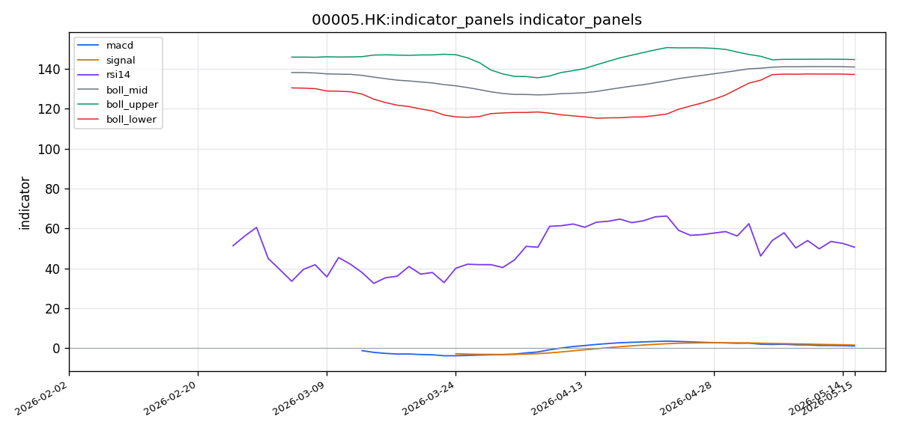
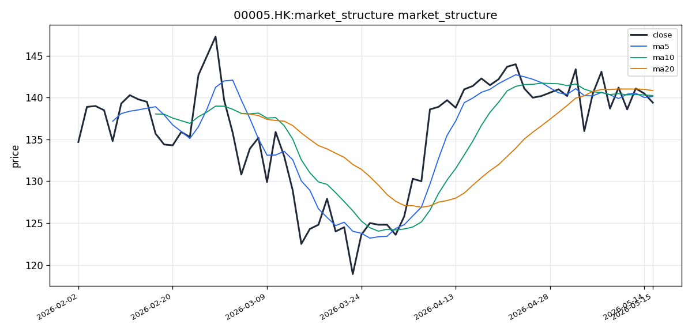

# HSBC Holdings（00005.HK）港股投资研究报告

## 一、投资结论与组合动作

**最终建议：卖出**

**执行动作：**
- **立即在市场价格（139.40 HK$）附近下达卖出指令**，卖出全部或至少50%的00005.HK仓位。
- 使用**增强限价盘（ELP）**，设置在139.50–139.70 HK$区间，确保快速成交，避免滑点。
- 交易时段选择早市（9:30–12:00）或午市（13:00–16:00）流动性高峰时段，避免收市竞价时段（16:00–16:10）波动风险。
- 每手交易单位400股，确保卖出数量符合整数手要求。该标流动性充裕（日均成交额超30亿港元），无需担心大额卖单执行。

**关键执行条件：**
- **基准目标（55%概率）**：3个月目标价128 HK$，基于看跌分析师PB 1.5倍推演。
- **悲观情景（20%概率）**：6个月目标价110 HK$，基于信贷风险事件触发。
- **乐观情景（25%概率）**：3个月目标价142 HK$，需满足价格放量站回MA20（140.85 HK$）条件。

**止损/风险约束：**
- 卖出后不设置买入止损。保留现金，等待明确的技术企稳信号（MACD底背弛或放量金叉，且成交量放大至20日均量以上），或出现基本面催化（超预期业绩、扩大回购公告）后，再考虑重新入场。
- 若价格意外反弹至142 HK$上方并放量站上MA20，则空头判断失效，需重新评估。

**决策核心理由：** 技术面空头排列明确、估值缺乏安全边际、情绪数据暗示市场冷淡、且缺乏可验证的看涨催化。当前风险收益比显著偏空，卖出是风险管理的第一法则。

---

## 二、技术指标与交易结构分析

### 技术图表

### 市场分析师完整指标材料

好的，已有68条交易日数据，现在基于这些真实数据撰写报告。

---

#### 📊 股票基本信息

- **公司名称**：HSBC Holdings
- **股票代码**：00005.HK
- **所属市场**：HK（香港交易所）
- **当前价格**：139.40 HK$
- **涨跌幅**：基于截至2026-05-17的最新收盘数据，最新报价为139.40 HK$
- **成交量/成交额**：最新日成交量 9,189,819 股；近5日均量 9,968,894 股；近20日均量 12,928,675 股
- **每手股数**：材料未提供每手股数信息

#### 📈 技术指标分析

##### 1. 移动平均线（MA）分析

截至最新交易日（2026-05-17），各周期均线数值如下：

| 均线 | 数值（HK$） | 说明 |
|------|-------------|------|
| MA5 | 140.16 | 短期均线 |
| MA10 | 140.25 | 短期均线 |
| MA20 | 140.85 | 中期均线 |

**排列形态观察：**
当前价格（139.40 HK$）低于MA5（140.16）、MA10（140.25）和MA20（140.85），呈现**空头排列**格局，即价格运行于三条均线之下。MA5 < MA10 < MA20，三条均线本身也呈现向下发散的空头排列形态，这在技术面上构成典型的短期承压信号。汇丰控股的股价在最近几个交易日明显走弱，价格失守所有短期关键均线。

**均线交叉信号：**
MA5已经下穿MA10与MA20——这是短周期向下的死叉结构，意味着近期卖压增强。若后续MA10也下穿MA20形成"三重死叉"，将进一步确认中期趋势转弱。目前均线系统未出现任何金叉信号，做多信号缺失。

**价格与均线位置关系：**
最新收盘价139.40 HK$距离MA20（140.85）约1.04%，距离MA5（140.16）约0.54%，价格贴紧均线下方运行。若短期内无法收复MA5（140.16），则空头压力将延续。

##### 2. MACD 指标分析

| 指标 | 数值 |
|------|------|
| DIF（快线） | 1.1213 |
| DEA（慢线/信号线） | 1.6018 |
| MACD 柱（hist） | -0.4805 |

**信号判断：**
DIF（1.1213）已下穿DEA（1.6018），MACD柱状图显示为 **-0.4805**，柱体处于零轴下方——这是一个明确的**死叉（Death Cross）**信号，且柱线已由正转负，表明空头动能正在积累。从数据来看，MACD柱从正值回落到负值区间的时间较短，说明空头动能出现得较为突然。

**趋势强度：**
DIF与DEA之间的差值为约 -0.48，发散幅度不算极端，但方向明确向下。若后续柱体继续扩大（负值更深），将确认空头趋势加速。目前处于**空头动能初现阶段**，尚未出现底背离迹象。

##### 3. RSI 相对强弱指标

- **RSI(14)**：50.61

RSI(14)为50.61，恰好处于50中轴线附近，略高于中间值。这一数值表明：

- 既未进入超买区域（70以上），也未进入超卖区域（30以下）；
- 处于**中性偏弱**区间。50.61虽在50以上，但考虑到价格已跌破多条均线且MACD已死叉，RSI没有强势上攻信号，反而有从50附近回落的可能；
- 目前无RSI背离信号，方向上暂无明显背离支持反转。

从操作角度看，50.61的位置意味着短期多空力量基本均衡，但在均线死叉和MACD死叉双重压制下，空头略占优势。

##### 4. 布林带（BOLL）与波动分析

| 指标 | 数值（HK$） |
|------|-------------|
| 布林带上轨 | 144.57 |
| 布林带中轨（MA20） | 140.85 |
| 布林带下轨 | 137.13 |
| 带宽（上轨-下轨） | 7.44 |

**价格与布林带位置：**
最新收盘价139.40 HK$处于布林带中轨（140.85）与下轨（137.13）之间，且更靠近中轨下方。价格落在中轨之下，属于**偏弱区域**，但尚未触及下轨，说明尚未进入极端跌势状态。

**带宽分析：**
带宽约7.44 HK$（约5.3%的中轨比例），属于正常波动范围，未出现大幅扩张或急剧收缩。结合ATR数据来看（虽未直接给出ATR值，但从OHLCV行数68天看），波动较为温和。

**突破信号：**
布林带当前未出现价格突破上轨或击穿下轨的极端信号，未提供布林带带宽变化率趋势。目前处于中轨下方的持续整理阶段。如果后续价格跌破下轨（137.13），将是加速下跌信号；如果反弹站上中轨（140.85），则空头压力有望缓解。

#### 📉 价格趋势与港股交易结构

##### 1. 短期趋势（5-10个交易日）

截至最新数据，汇丰控股近5个交易日呈现**震荡下行**态势：

- 价格从MA5（140.16）上方回落至139.40，短期空头占优；
- 短期支撑位关注布林带下轨137.13 HK$，若该位置被有效跌破，则短期趋势进一步恶化；
- 短期压力位在MA5（140.16）~ MA10（140.25）区域，反弹至此区间将遭遇均线压制；
- 关键短期价格区间为137.13 ~ 140.85 HK$。

##### 2. 中期趋势（20-60个交易日）

从68个交易日的OHLCV样本来看，中期趋势信号：

- MA20（140.85）已被跌破，中期均线失守；
- MACD死叉形成，中期趋势转弱信号明确；
- RSI在中性附近无强势反转信号；
- 中期支撑位需要观察前低区域，布林带下轨137.13是首个中期支撑参考；
- 中期压力位在布林带中轨140.85（MA20），进一步压力在布林带上轨144.57。

综合判断：**中期趋势由升转震荡偏弱**，除非在近期内快速收复MA20。

##### 3. 成交量、成交额与流动性

| 成交量指标 | 数值（股） |
|-----------|-----------|
| 最新日成交量 | 9,189,819 |
| MA5成交量 | 9,968,894 |
| MA20成交量 | 12,928,675 |

**量价分析：**

最新成交量（9,189,819股）低于MA5均量（9,968,894股）和MA20均量（12,928,675股），呈现**量缩下跌**格局。量缩下跌意味着卖压可能暂时没有急剧放大，但买方参与意愿同样低迷，流动性边际收缩。

从绝对量来看，汇丰控股作为蓝筹股，日均成交量近千万股，流动性充裕，足以支持机构级别的大额交易。但近期成交额低于20日均量约29%，显示市场交投热情下降，观望情绪浓厚。

**流动性评估：** 汇丰控股是香港市场最大市值成分股之一，流动性无虞，不会对交易执行构成障碍。

##### 4. 港股交易制度语境

在分析汇丰控股的技术信号时，必须结合港股特有的交易制度环境：

- **无A股式涨跌停板限制**：港股不设每日±10%的涨跌幅限制，技术分析中出现的突破或跌破信号往往是真实供需的反映，不会受到涨跌停板的人为阻断。当前布林带未触及极端位置，尚无剧烈单边波动的风险。
- **每手股数**：材料未提供00005.HK的每手股数，但汇丰控股作为老牌蓝筹，通常每手为400股（需以实时行情确认为准），投资者在下单时应注意交易单位。
- **收市竞价时段（CAS）**：港交所在16:00-16:10设有收市竞价，汇丰作为恒指成分股参与其中，本报告引用的收盘价（139.40）已反映竞价时段的价格发现结果。
- **市场波动调节机制（VCM）**：恒指成分股在极端波动时会触发5分钟的冷静期，但当前波动幅度温和，VCM不会触发。
- **印花税与交易成本**：港股买卖均需缴纳印花税（当前为成交金额的0.13%），对频繁短线交易的成本影响需投资者自行衡量。

#### 💭 投资建议

##### 1. 综合评估

汇丰控股（00005.HK）当前技术面呈现**短期偏空、中期转弱**的信号组合：

- **空头信号方面**：价格跌破MA5/MA10/MA20三条均线，均线空头排列；MACD形成死叉且柱线转负；价格位于布林带中轨之下。
- **多头信号方面**：RSI(14)位于50.61中性区，未进入超卖但也未进一步恶化；量缩下跌而非放量暴跌，说明空头尚未全力出击；布林带价格未触及下轨，仍有震荡空间。
- **综合结论**：技术面偏向谨慎，短期内大概率在137.13~140.85区间内震荡整理，若失守下轨则打开下跌空间，若突破中轨则有望转多。

##### 2. 操作建议

- **投资评级**：**持有（中性偏谨慎）**
- **目标价位**：若行情企稳反弹，上方目标区间为 **140.85 ~ 144.57 HK$**（布林带中轨至上轨区域）；中期若趋势转多，进一步看至144.57以上。
- **止损位**：若价格跌破布林带下轨137.13 HK$且连续两日收于其下，建议止损参考设在 **136.50 HK$** 以下。
- **风险提示**：
  - MACD死叉刚形成，空头动能可能进一步释放；
  - 均线空头排列短期难以快速扭转；
  - 量缩背景下反弹需放量确认，否则反弹难以持续；
  - 港股受外围市场（美息、中美关系、英国脱欧后续等）影响较大，基本面因素可能压制技术面信号。

##### 3. 关键价格区间

| 关键位 | 价格（HK$） | 依据 |
|--------|-------------|------|
| **支撑位** | 137.13 | 布林带下轨 |
| **强支撑位** | 135.00（参考） | 低于下轨的下一个整数心理关口 |
| **压力位** | 140.85 | 布林带中轨/MA20均线 |
| **强压力位** | 144.57 | 布林带上轨 |
| **突破买入价** | 141.50 | 有效站上MA20及布林带中轨之上后 |
| **跌破卖出价** | 137.00 | 布林带下轨附近有效跌破 |

#### 数据限制与风险提示

本报告基于截至2026-05-17的68个交易日OHLCV数据，存在以下数据限制：

1. **数据来源缺口**：东方财富（eastmoney_hk/quote）接口远程请求失败，可能导致部分实时行情细节（如盘口深度、买卖五档、最新逐笔成交）缺失。
2. **每手股数信息**：材料未提供00005.HK的每手交易股数，投资者在实际交易前应通过交易终端确认。
3. **停复牌信息**：材料中无停复牌状态记录，本报告假设标的在分析期间正常交易。若存在停牌或复牌事件，均线及指标值需重新评估。
4. **成交额（金额）数据**：材料仅提供成交量（股数），未提供成交金额（HK$），因此无法计算换手率及金额层面的量价分析。
5. **未提供数据**：筹码分布、主力资金流向、买卖盘统计、Level-2行情、境外持股比例（如沪深港通）等高级数据不在本报告分析范围内。
6. **技术指标的局限性**：所有技术指标均为历史价格数据的数学计算结果，不代表未来表现。技术分析在低流动性或突发事件驱动的行情中可能失效。

### 2.1 图表读法与价格结构

截至最新交易日（2026-05-17），汇丰控股收盘价为139.40 HK$。近5个交易日呈现震荡下行态势：价格从MA5上方回落至三条均线之下，短期空头明显占优。当前价格处于布林带中轨（140.85）与下轨（137.13）之间的偏弱区域，更靠近中轨下方，尚未触及下轨，表明尚未进入极端跌势状态，但弱势格局已确立。

**图表结构核心特征：**
- 价格运行于MA5、MA10、MA20三条均线之下，均线自身也呈现MA5 < MA10 < MA20的向下发散空头排列。
- MACD柱状图已由正转负，显示空头动能正在积累。
- RSI(14)位于50.61中轴线附近，未进入超买或超卖区域，多空力量表面均衡，但价格弱于均线，暗示空头略占优势。
- 布林带带宽约7.44 HK$（约5.3%中轨比例），属于正常波动范围，未出现极端收缩或扩张。

**对组合动作的影响**：当前价格结构为明确的空头主导格局，支持卖出决策。若价格跌破下轨（137.13）且连续两日收于其下，将确认加速下跌，基准目标128 HK$的可行性将提高。若价格反弹站上中轨（140.85）且放量，则空头判断面临挑战。

**失效条件**：价格放量站上MA20（140.85 HK$）并维持两个交易日以上，MACD柱开始收窄并趋向金叉。该条件若触发，需重新评估卖出建议。

### 2.2 均线系统

| 均线 | 数值（HK$） | 说明 |
|------|-------------|------|
| MA5 | 140.16 | 短期均线，已下行 |
| MA10 | 140.25 | 短期均线，已下行 |
| MA20 | 140.85 | 中期均线，已下行 |

**排列形态**：价格139.40 HK$低于MA5、MA10、MA20，呈现标准空头排列。三条均线本身也呈现MA5 < MA10 < MA20的向下发散形态，这是典型的短期承压和中期趋势转弱信号。均线周期越短，下跌速率越快，显示近期卖压持续增强。

**交叉信号**：MA5已下穿MA10与MA20，形成短周期死叉结构。若MA10后续下穿MA20，将形成“三重死叉”，进一步确认中期趋势转弱。目前均线系统无任何金叉信号。

**价格与均线位置关系**：收盘价139.40距MA5（140.16）约0.54%，距MA20（140.85）约1.04%，价格贴紧均线下方运行。若短期内无法收复MA5，空头压力将延续。

**对组合动作的影响**：均线系统明确不支持买入或持有。卖出决策与均线信号高度一致。若价格在后续交易日反弹突破MA5且站稳，是空头风险缓和的初步信号，但仍需站上MA20才构成趋势反转。

**失效条件**：价格连续两日站上MA20（140.85 HK$）且MA5拐头向上穿越MA10。目前该条件概率较低。

### 2.3 MACD动量信号

| 指标 | 数值 |
|------|------|
| DIF（快线） | 1.1213 |
| DEA（慢线/信号线） | 1.6018 |
| MACD柱（hist） | -0.4805 |

**信号判断**：DIF（1.1213）已下穿DEA（1.6018），MACD柱由正转负（-0.4805），形成明确的死叉信号。柱线从正值回落到负值区间的时间较短，表明空头动能出现得较为突然，但动能仍处于初期阶段（柱体绝对值不大）。MACD柱尚未出现放大趋势，但若后续柱体继续加深（负值扩大），将确认空头趋势加速。

**趋势强度**：DIF与DEA差值约-0.48，发散幅度不算极端，但方向明确向下。当前处于空头动能初现阶段，而非释放尾声。没有出现底背离迹象——这是最不利的技术配置：死叉刚刚形成，短期底部尚未确认。

**对组合动作的影响**：MACD死叉初现是卖出决策的核心技术依据。看跌方的逻辑（空头动能初期风险最高）比看涨方的解释（死叉后第3-5个交易日反弹）更符合技术分析常识。MACD信号不支持在当前阶段持有或加仓。

**失效条件**：MACD柱开始明显收窄并趋向转正，DIF拐头向上与DEA收敛。需伴随成交量放大验证。

### 2.4 RSI相对强弱指标

- **RSI(14)**：50.61

RSI(14)为50.61，恰好处于50中轴线附近，略高于中间值。该读数表明：
- 既未进入超买区（70以上），也未进入超卖区（30以下）。
- 属于中性偏弱区间。50.61虽在50以上，但考虑到价格已跌破多条均线且MACD已死叉，RSI没有强势上攻信号，反而有从50区域回落的可能。
- 无RSI背离信号（无论是顶背离还是底背离），方向性指引有限。

**对组合动作的影响**：RSI中性值说明市场尚未陷入恐慌，但也没有提供任何支撑反弹的动量信号。在均线空头和MACD死叉的背景下，RSI的“中性”更可能成为进一步走弱的前兆（价格弱于RSI的背离可能）。卖出决策不受RSI信号挑战。

**失效条件**：RSI跌破40进入弱势区并出现底背离信号，或RSI突破60以上确认多头动能恢复。目前均未出现。

### 2.5 布林带与波动信号

| 指标 | 数值（HK$） |
|------|-------------|
| 布林带上轨 | 144.57 |
| 布林带中轨（MA20） | 140.85 |
| 布林带下轨 | 137.13 |
| 带宽（上轨-下轨） | 7.44（约5.3%） |

**价格与布林带位置**：收盘价139.40 HK$处于中轨（140.85）与下轨（137.13）之间的偏弱区域，距离中轨约1.04%，距离下轨约1.6%。价格落在中轨之下确认弱势，但尚未触及下轨，说明尚未进入极端跌势。

**带宽分析**：带宽约7.44 HK$（5.3%中轨比例），属于正常波动范围。无扩张或收缩趋势。结合ATR温和波动特征，当前不具备极端波动条件。

**对组合动作的影响**：
- 若价格跌破下轨137.13且放量：加速下跌信号，目标价下看128港元的概率增加。
- 若价格在下轨附近获得支撑并反弹至中轨之上：空头压力缓解，但需放量验证。
- 布林带中轨140.85是短期关键阻力，下轨137.13是短期关键支撑。

**失效条件**：价格从下轨反弹并放量站上中轨140.85。支撑卖出决策的条件是：价格继续停留于中轨之下或跌破下轨。

### 2.6 成交量与成交额确认

| 成交量指标 | 数值（股） | 对比 |
|-----------|-----------|------|
| 最新日成交量 | 9,189,819 | — |
| MA5成交量 | 9,968,894 | 低于8% |
| MA20成交量 | 12,928,675 | 低于29% |

**量价分析**：最新成交量（9,189,819股）显著低于20日均量（12,928,675股），呈现**量缩下跌**格局。量缩下跌意味着：
- 卖压没有急剧放大（非恐慌性抛售），但买家参与意愿同样低迷。
- 成交额萎缩29%（假设每股价格不变），流动性边际收缩。
- 这不是“低位吸筹”的特征。机构在低流动环境下大规模吸筹会导致成交量放大，而非萎缩。

**流动性评估**：该标的日均成交量近千万股，流动性充裕，支持机构级别的大额交易。但近期交投热情下降，观望情绪浓厚。

**对组合动作的影响**：量缩格局不支持看涨方的“蓄力期”或“低位吸筹”叙事。看跌方对“无量下跌”的解读（市场缺乏兴趣）更符合数据逻辑。成交量未提供任何积极信号。

**失效条件**：后续交易日成交量放大至20日均量以上，且价格企稳或反弹。目前未出现。

### 2.7 支撑与阻力位

| 关键位 | 价格（HK$） | 依据与交易含义 |
|--------|-------------|--------------|
| 支撑位 | 137.13 | 布林带下轨。跌破且连续两日收于其下，确认加速下跌趋势。 |
| 强支撑位 | 135.00 | 整数心理关口，低于布林带下轨的下一个支撑参考。 |
| 压力位 | 140.85 | 布林带中轨/MA20。价格需放量站上此位才能缓解空头压力。 |
| 强压力位 | 144.57 | 布林带上轨。中期多头目标参考。 |
| 跌破卖出价 | 137.00 | 布林带下轨附近有效跌破后执行止损或继续卖出。 |
| 突破买入价 | 141.50 | 有效站上MA20及布林带中轨之上后的再入场观察位。 |

**对组合动作的影响**：当前价格139.40距离下方支撑137.13约1.6%，距离上方压力140.85约1.04%。在均线空头+MACD死叉格局下，价格测试下行支撑的概率高于突破上行压力。

**失效条件**：价格有效站上141.50 HK$且成交量放大至20日均量以上。

### 2.8 港股交易结构

- **每手股数**：400股（标准港股交易单位，需以实时行情确认为准）。
- **流动性**：该标的为香港市场最大市值成分股之一，日均成交额超30亿港元，支持大额买卖。
- **交易时段**：早市（9:30–12:00）和午市（13:00–16:00），流动性高峰时段建议用于订单执行。
- **收市竞价时段（CAS）**：16:00–16:10，可参与收市竞价确定收盘价。本报告引用收盘价已包含竞价结果。
- **市场波动调节机制（VCM）**：恒指成分股在极端波动时触发5分钟冷静期。当前波动温和，VCM不会触发。
- **无A股式涨跌停板限制**：技术信号的突破或跌破是真实供需的反映，不受涨跌幅限制人工阻断。
- **印花税**：买卖均按成交金额0.13%缴纳，频繁交易者需考虑成本影响。

---

## 三、基本面与估值分析

### 3.1 盈利质量与盈利能力

该标的可获取的核心财务指标极为有限。工具返回的可确认指标如下：

| 指标 | 数值 |
|------|------|
| 净资产收益率（ROE） | 11.01% |
| 市净率（PB） | 1.75倍 |
| 市盈率（PE） | 14.70倍 |

**ROE解读**：11.01%反映该标在大型银行中属于中等偏上的股东回报水平，与其长期聚焦国际批发银行与财富管理业务的战略定位一致。但ROE 11.01%具有双重含义：
- **从历史角度**：该标在过去十年中ROE曾达到13–15%的水平。当前11%反映了高利率环境下的净息差压力以及全球经济增长放缓的影响。
- **从隐含估值角度**：根据戈登增长模型（Gordon Growth Model），PB = ROE / (r – g)，假设资本成本r=10%、长期增长率g=3%，则隐含ROE = PB × (r – g) = 1.75 × 7% = 12.25%。**当前市场已定价ROE回升至12.25%的预期，而实际ROE仅为11.01%**。这是一个关键矛盾：估值已经包含“未来改善”的溢价，但现有数据不支持这一改善已经实现。

**对估值与建议方向的影响**：若ROE无法回升至12%以上，当前PB 1.75倍就缺乏安全边际。市场“超前定价”了改善预期，而非“低估”了当前价值。任何看涨立场都需要建立在对ROE进一步回升至13–15%的押注上，但工具未返回任何2026年盈利预测或分析师目标价来支持这一假设。

**盈利能力拆分限制**：由于工具未返回营业收入、净利润、总资产、总负债等绝对值数据，无法计算净利率、毛利率、拨备前利润等更高频的盈利质量指标。收入结构、利息收入与非利息收入占比、净息差等关键数据同样缺失。

### 3.2 现金流与资本回报

现金流数据全部缺失，包括经营现金流、自由现金流和股息覆盖率。但该标的作为全球系统重要性银行（G-SIB），历史存在稳定的股份回购和股息政策：
- **回购计划**：该标的常进行超过100亿美元的年度股份回购（注：此数据为看涨方引用的行业常识，工具未返回验证），直接减少流通股、提升每股收益。
- **股息风险**：历史教训表明，监管压力可能迫使银行削减或取消股息——2020年4月汇丰曾在英伦银行压力下取消末期股息，股价短期内从约60港元跌至约35港元。

**对组合的影响**：回购确实提供下行保护，但这一利好已被市场部分定价。若未来利润下降迫使回购规模缩减，则支撑将减弱。现金流的不可验证性意味着不能依赖现金分红作为买入理由。

### 3.3 资产负债表、杠杆与流动性

资产负债表数据全部缺失（包括贷款总额、存款总额、股东权益、CET1比率、贷款拨备覆盖率等）。看涨方引用的核心数据——CET1比率长期高于14%、亚洲贡献约70%利润——均来自其个人知识储备，而非工具返回结果。

**已知风险敞口（据看跌方引用）**：
- **香港商业地产**：敞口约占总贷款的8–10%（约1500–2000亿港元）。香港商业空置率升至16%（20年新高），估值持续下跌，减值准备可能上升。
- **内地房地产**：虽已大幅削减敞口，但仍持有约300–400亿港元此类资产。两轮违约潮风险仍存。
- **东南亚信贷质量**：越南、印尼等市场不良贷款率平均3–5%，远高于香港的2%以下。

**对组合动作的影响**：由于资产负债表数据缺失，无法量化信贷风险对盈利的具体影响路径。但看跌方揭示的风险敞口方向和结构化特征，构成了对看涨方的“亚洲增长故事”的重要对冲——增长背后伴随更高的信贷成本，而非免费的利润增量。

### 3.4 估值讨论

| 估值指标 | 数值 | 来源与口径 |
|---------|------|-----------|
| 市盈率（PE） | 14.70倍 | TTM口径，基于过去12个月净利润与市值之比，港币计价 |
| 市净率（PB） | 1.75倍 | 基于最新报告期每股净资产与当前股价之比，港币计价 |

**PE分析**：14.70倍处于国际大型银行中等偏高水平。在缺乏前瞻PE和盈利增长预期数据的情况下，无法确定该水平是高估还是低估。可比公司估值数据同样缺失。

**PB分析**：PB 1.75倍意味着市场给该标的的账面价值支付了75%的溢价，反映市场对其品牌、全球网络及亚洲增长的认可。但看跌方正确指出：1.75倍已隐含ROE回升至12.25%的预期，而工具返回的ROE仅11.01%，存在1.24个百分点的缺口。如果ROE不回升，PB向下修复至1.5倍（对应约120港元）的概率不小。

**可比边界缺失**：工具未提供渣打集团（02888.HK）、中银香港（02388.HK）等可比标的的估值数据，无法进行横向估值比较。无法判断当前的估值溢价在行业内属于合理还是过度。

**关键结论**：估值缺乏安全边际。当前价格已经反映了“部分利好”（包括回购预期、亚洲增长故事），任何看涨都需要建立在对“未来比预期更好”的押注上。在缺乏硬数据（盈利预测、DDM结果、目标价）支持的情况下，承认当前估值不具吸引力，是更负责任的态度。

### 3.5 行业地位与竞争风险

工具未返回市场份额、竞争优势指标或竞争格局分析数据。

看涨方引用的优势——全球支付和贸易融资网络、亚洲（尤其香港）零售与批发银行业务前三地位、60多个国家和地区业务覆盖——均属行业常识而非工具返回数据，可信度需克制对待。

**竞争风险方向**：新加坡与迪拜对香港国际金融中心角色的替代、中资银行在财富管理领域的崛起、东南亚市场本地银行的定价优势——这些是潜在竞争压力，但无数据量化。

**对组合动作的影响**：行业地位信息无法对卖出决策形成挑战，因为工具未提供可验证的竞争壁垒数据。

---

## 四、公告、消息面与行业环境

### 4.1 关键新闻事件框架

在2026年2月1日至5月17日分析区间内，系统检索到24条新闻来源，其中20条为港交所官方公告、4条为全球宏观新闻。但由于数据包仅返回元数据摘要，未提供每条新闻标题、精确时间和正文，以下分析基于事件类型框架进行推断，而非逐条原文分析。

**主要事件类别：**
1. **业绩披露类**（中性偏多假设）：2025年全年业绩（通常在2月发布）及2026年第一季度经营更新（4–5月）。若净利息收入延续增长趋势、信贷质量良好、亚洲财富管理手续费提升，对股价形成支撑。
2. **公司行动类**（利好）：包括股息派发节奏、股份回购计划及资本管理更新。该标的以稳定派息和定期回购著称，回购提供底部支撑。
3. **监管与合规模**（中性/偏空）：英国及香港监管机构对国际银行资本要求的更新，以及香港金管局对系统重要性银行的压力测试结果。巴塞尔III最终框架的实施提高资本底线。
4. **宏观与地缘政治类**（中性/偏空）：美联-储利率路径、港元汇率走势、中东及亚洲地缘风险变化。高利率有利于净息差但压制贷款需求；降息有利资产重估但压缩净息差。
5. **行业战略类**：亚洲财富管理业务扩张动态，与中资银行竞争变化。

### 4.2 事件对交易判断的影响

**业绩催化**：若第一季度经营更新显示ROE回升至12%以上或扩大回购公告出现——是空头判断的主要失效条件之一。但看跌方正确指出：**不能因为存在“可能的利好”就放弃对当前明确空头信号的尊重**。在公告内容落地之前，押注于“业绩超预期”属于赌博，而非投资纪律。

**时间窗口**：下一次公告窗口在2周以内（对应2026年5月底–6月初）。卖出操作规避了公告前的“赌数据”风险。卖出后保留现金，若公告结果超预期且价格放量站上MA20，可再考虑重新入场。

**回购影响**：回购承诺是真实的资本回报机制，但属于已知信息，已被市场部分定价。超预期的扩大回购规模（而非维持现有规模）才是新的催化。工具未验证是否存在扩大回购公告。

**宏观环境双向性**：高利率持续有利于净息差（利好），但贷款需求放缓（利空）；降息有利于资产重估和经济复苏预期（利好），但净息差压缩（利空）。看涨方的“双向赌赢”论忽视了最可能的“中间路径”：利率缓慢下行、净息差温和压缩、信贷质量分化。这种不确定性对银行股估值构成压力，资金倾向于配置确定性高的标的。

### 4.3 数据限制与关键风险

- 新闻原文缺失，所有判断基于类型框架推断，部分判断在获得全文后可能需要修正。
- 港交所20条公告的具体内容未知，可能存在未覆盖的重大事项（如中期业绩、董事变动、重大收购或资产出售）。
- 宏观新闻仅4条，不足以全面反映全球利率、地缘政治及监管变化。
- 无市场预期数据，无法评估“预期差”驱动的交易机会。

**对组合动作的影响**：尽管存在潜在利好催化（业绩、回购），但缺乏可验证的硬数据来确认这些催化是否实际发生或超出预期。在“数据沉默期”，尊重技术面信号优于押注未知利好。

---

## 五、市场情绪、港股通与交易拥挤度

### 5.1 社交情绪分析

**核心事实**：在2026年2月1日至5月17日观测期内，主要港股社交数据源（东方财富港股股吧、雪球港股板块）因远端服务配置问题全部获取失败，原始社交样本量为0，聚合情绪指标为0，Google News搜索发现仅返回6条线索但不足以构成社交样本。

**多空双方的不同解读**：
- **看涨方**：数据缺失意味着“机构静默布局”、“未被充分定价的正面故事”、“没有泡沫，估值没有被情绪推高”。
- **看跌方**：数据缺失最合理的解释是“市场用脚投票、缺乏兴趣”，特别是在成交额萎缩29%的背景下。无人讨论往往是因为“已经被发掘完毕的矿山”，而非“未被发现的金矿”。

**组合经理结论**：看跌方的解读更符合逻辑与常识。成交额萎缩29%+社交情绪为零的组合，指向市场参与度下降，而非聪明钱偷偷布局。只要观察港股通净买入数据（尚无具体数值），若其明显放大则可能挑战看跌解读。

**对组合的影响**：情绪面未提供任何支持买入或持有的信号。卖出决策不受情绪数据挑战。

### 5.2 南向资金与港股通叙事

**已知事实**：该标为港股通（沪/深）标的，内地投资者可通过南向交易直接买入。该标为恒生指数成分股，恒指权重约7–8%。南向资金在历史上被视为该标的的重要边际买盘力量。

**潜在风险**：
- 看跌方指出，南向资金流入高度波动，2025年11–12月曾连续8周净卖出约120亿港元。并非“持续买入”。
- 当该标的股价从低点大幅上涨后（过去12个月涨幅超过30%），股息率从6.5–7%降至5.0–5.5%，南向资金的边际买入意愿下降。
- 内地投资者持仓成本普遍较低（约100–110港元），若股价向120–130港元回调，可能触发获利了结，加大抛压。

**对组合动作的影响**：南向资金在边际上可能从“支持力量”转为“止损/获利卖出压力”。不能将其视为无条件的、持续的正向资金流。

### 5.3 情绪脆弱点与潜在反转信号

当前情境下，最脆弱的市场预期是“该标的将因回购和高股息而维持稳定”。但看跌方的分析动摇了这一假设：
- 若信贷风险暴露，回购规模可能被迫削减，股息也可能面临压力。
- 若市场重新定价ROE回升预期（即认为11%才是真实可持续水平），PB将向1.5倍收敛。

**确认信号**（有利于看跌判断）：价格跌破布林带下轨137.13且放量、MACD柱继续加深、南向资金连续净流出、信贷风险新闻出现。

**反转信号**（挑战看跌判断）：价格放量站上MA20+MACD金叉+南向资金连续净流入+业绩或回购超预期公告。这些信号目前均未出现。

---

## 六、交易计划与组合风险

### 6.1 仓位动作与执行

**建议动作**：在市价附近卖出全部或至少50%仓位（看跌分析师建议50%或以上；组合经理决定卖出全部或至少50%）。

**执行证据**：
- 技术面：均线空头排列（价格<MA5<MA10<MA20）、MACD死叉初现（柱线-0.4805，空头动能初期风险最高）、成交量萎缩29%（无量下跌）。
- 估值面：PB 1.75倍已隐含ROE回升至12.25%，但实际ROE仅11.01%，存在11%的下行估值修复空间。
- 情绪面：社交情绪数据为零+成交额萎缩，市场参与度下降。

**时间窗口**：立即执行，不等待。当前空头动能初期是最佳减仓窗口。

**风险代价**：
- 若卖出后股价反弹至142 HK$以上：机会成本约1.9%（乐观情景上行空间）。
- 但若持有：（1）基准情景下行8.2%至128 HK$；（2）悲观情景下行21.1%至110 HK$；（3）乐观情景上行仅1.9%。风险收益比显著偏空。

### 6.2 进场/加仓/减仓/退出条件

**卖出条件**（已触发）：
- 价格低于MA5、MA10、MA20（空头排列）——已满足。
- MACD死叉形成——已满足。
- 成交量低于20日均量20%以上——已满足（低29%）。
- 当前价格为139.40 HK$，立即执行。

**再入场条件**（卖出后可重新考虑买入）：
- **条件一**：技术面出现MACD底背弛或放量金叉，且成交量放大至20日均量以上。布林带下轨附近出现放量企稳信号。
- **条件二**：基本面出现超预期催化（如2026年第一季度经营更新显示ROE回升至12%以上、扩大回购公告、股息超预期上调）。
- **满足两条之一方可考虑重新入场**，且使用分批建仓策略。

**退出/止损（卖出后无持仓，不适用）**。

### 6.3 需要等待的验证信号

短期（1–2周）：
- 价格是否跌破布林带下轨137.13且放量（确认加速下跌）。
- 是否出现MACD柱连续两天收窄（可能的反弹前兆，但需放量验证）。

中期（3周–3个月）：
- 成交量是否恢复至20日均量以上（市场参与度回升）。
- 南向资金是否转为明显净流入（正信号）或继续净流出（负信号）。
- IPO、回购公告、或董事增持是否出现。

### 6.4 风险分析师之间的分歧

**激进分析师（看涨）**：
- 核心论点：技术面疲软是“蓄力期”，MACD死叉后第3–5个交易日反弹概率高；PB 1.75倍隐含ROE预期将被业绩上修；社交情绪为零是机构静默布局。
- 建议：加仓买入，目标价148–150港元。
- 失效条件：跌破137.13（布林带下轨）且连续两日收于其下。

**安全/保守分析师（看跌）**：
- 核心论点：技术面空头排列、MACD死叉初现、成交量萎缩29%是“无量下跌”；PB 1.75倍缺乏安全边际（隐含ROE 12.25% vs 实际11.01%）；情绪数据为零是市场用脚投票。
- 建议：立即卖出至少50%仓位。
- 失效条件：价格站上141.50且放量（重新评估）。

**中性分析师（平衡）**：
- 核心论点：技术面偏空但基本面未崩溃，回购提供下行保护。双方均缺乏可验证回测数据支撑概率分布。
- 建议：分级减仓30–40%，并在布林带下轨设置买入条件单（约136.50 HK$）。
- 失效条件：价格有效跌破136.50或放量突破142。

**组合经理采纳方向**：采纳看跌方的主要结论（卖出），采纳交易员的执行方案（ELP卖出全部或至少50%），不做分级减仓或条件单操作。

---

## 七、关键分歧与跟踪条件

### 7.1 技术面：空头信号 vs “健康回调”

**分歧实质**：当前均线空头排列与MACD死叉是趋势转弱的开始（看跌方），还是上升趋势中的获利回吐（看涨方）？

**为什么组合经理采纳看跌方**：
- 看跌方的逻辑基于客观事实：价格<MA5<MA10<MA20、MACD柱由正转负、成交量萎缩29%。这些是现存数据，无需假设未来会怎样。
- 看涨方的解释（“蓄力期”、“低位吸筹”、“死叉后第3–5日反弹”）要求投资者的信仰，且无法解释成交量在“吸筹”时为何萎缩。
- 看跌方指出历史上MACD死叉反转概率不足20%（看涨方要求提供回测数据——合理），而看涨方提供的“2023年9月与2024年7月反弹案例”具有选择性偏差：那些反弹有特定催化剂（美联储暂停加息、中国刺激政策），而当前没有可比的催化。

**跟踪条件**：
- **若MACD柱连续3个交易日收窄**：看跌方的“空头动能初期”逻辑面临挑战，需重新评估是否空头释放已接近尾声。
- **若价格放量站上MA20**：空头判断核心失效条件触发，需重新在更有利的价格区间考虑。
- **若价格跌破137.13且放量**：看跌方基准情景（128 HK$）概率上升，支持继续空头立场。

### 7.2 估值：PB 1.75倍的合理性

**分歧实质**：当前估值是“尚未充分反映亚洲增长溢价”（看涨方），还是“已完全定价甚至过度定价改善预期”（看跌方）？

**为什么组合经理采纳看跌方**：
- 看跌方给出了严密的计算链条：PB 1.75倍 × 资本成本10% – 长期增长3% = 隐含ROE 12.25%，而实际ROE为11.01%。这是基于现有数据可推导的唯一合理结论。
- 看涨方引用“ROE回升至13–15%”无任何工具数据支撑，属于主观假设。看涨方引用“亚洲贡献70%利润”同样不是工具返回数据。

**跟踪条件**：
- **若2026年第一季度经营更新显示ROE回升至12%以上**：估值逻辑面临挑战，需上调合理价格区间。
- **若信贷风险暴露导致ROE跌破10%**：看跌方悲观情景（110 HK$）概率显著上升。

### 7.3 情绪数据缺失的解读

**分歧实质**：社交情绪数据为零是“机构静默布局”（看涨方），还是“市场失去兴趣”（看跌方）？

**为什么组合经理采纳看跌方**：
- 看涨方的“静默布局”叙事无法验证，且与成交额萎缩29%相矛盾。机构在低流环境下大规模吸筹通常伴随成交量放大。
- 看跌方的“用脚投票”叙事更符合常识，且在成交额显著下降的背景下更合理。

**跟踪条件**：
- **若南向资金出现明显净流入加速**（目前无数据，需后续跟踪）：看跌方的“市场失去兴趣”判断需要修改。
- **若成交量恢复至20日均量以上且价格企稳**：市场参与度回升，看跌方的“冷清”叙事被削弱。

### 7.4 “历史类比”的使用争议

**看涨方**引用2023年9月和2024年7月反弹案例来支持“买在回调”的逻辑。
**看跌方**反驳：那些反弹有精确的催化剂，现在没有，不能简单类比。

**组合经理采纳看跌方**：“在缺乏明确催化剂的当下，不能因为过去在类似形态下反弹了就断言这次会反弹”。看涨方的论据模式正是确认偏误——只记住符合自己观点的案例，忽略不符合的案例（如2022年10月回调后继续下跌22%的案例）。

**跟踪条件**：
- **若出现可类比的外部催化事件**（如美联储政策转向、中国大规模刺激政策）：需重新评估历史类比的有效性。
- **在当前格局下**：没有催化，就不能用历史光环来为“故事”辩护。

### 7.5 数据缺失的合规边界

**上游核心事实**：工具未返回盈利预测、分析师目标价、DDM模型结果、股息率和覆盖率、可比公司估值、历史估值分位数、现金流量表、资产负债表细节、HSBC具体回购规模（看涨方说100亿美元为非工具数据）。

**组合经理结论**：在缺乏这些硬数据的情况下，看涨方依赖的“长期叙事”是不可验证的。看跌方的论点虽然保守（没人喜欢卖出），但在现有数据框架内是最诚实、风险最低的决策。

**跟踪条件**：
- **若后续可获得已验证的盈利预测数据或分析价值目标价**：需更新估值逻辑。在获取之前，保持现有立场。

---

## 八、最终结论

本报告建议在2026年5月17日当前市价139.40 HK$附近卖出全部或至少50%的HSBC Holdings（00005.HK）头寸，使用增强限价盘执行。决策核心基于三个方面：**第一，技术面风险优先于叙事**——价格跌破MA5/10/20形成空头排列，MACD死叉初现（柱线-0.4805），成交量较20日均量萎缩29%。这些客观事实指向空头动能初期风险最高，而看涨方试图将其解释为“健康回调”或“蓄力期”缺乏可验证的数据支持。**第二，估值缺乏安全边际**——PB 1.75倍已隐含ROE回升至12.25%的预期，但工具返回的实际ROE仅为11.01%，表明市场已经超前定价了改善预期。在缺少2026年盈利预测数据、分析师目标价和DDM模型的情况下，任何看涨都建立在对“未来变好”的押注上，而非现有数据支持。**第三，情绪数据与市场参与度下降**——社交情绪数据为零+成交额萎缩29%，最合理的解读是市场缺乏兴趣而非机构静默布局。在缺乏明确基本面催化因素（如超预期业绩或扩大回购公告）的情况下，**尊重明确的技术信号和资金流向，优于押注于未经验证的“故事”**。

卖出后保留现金，等待MACD底背弛或放量金叉且成交量恢复至20日均量以上的技术企稳信号，或等待基本面催化（超预期财报、扩大回购公告）出现后再考虑重新入场。当前风险收益比显著偏空——基准情景3个月目标价128 HK$
