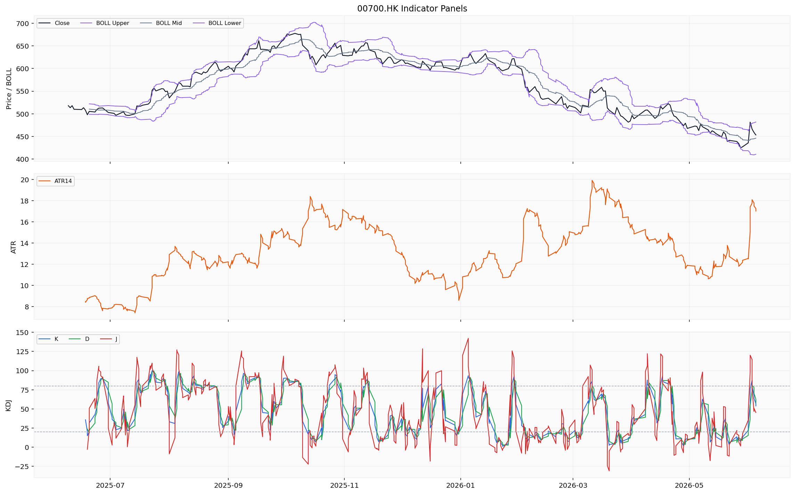
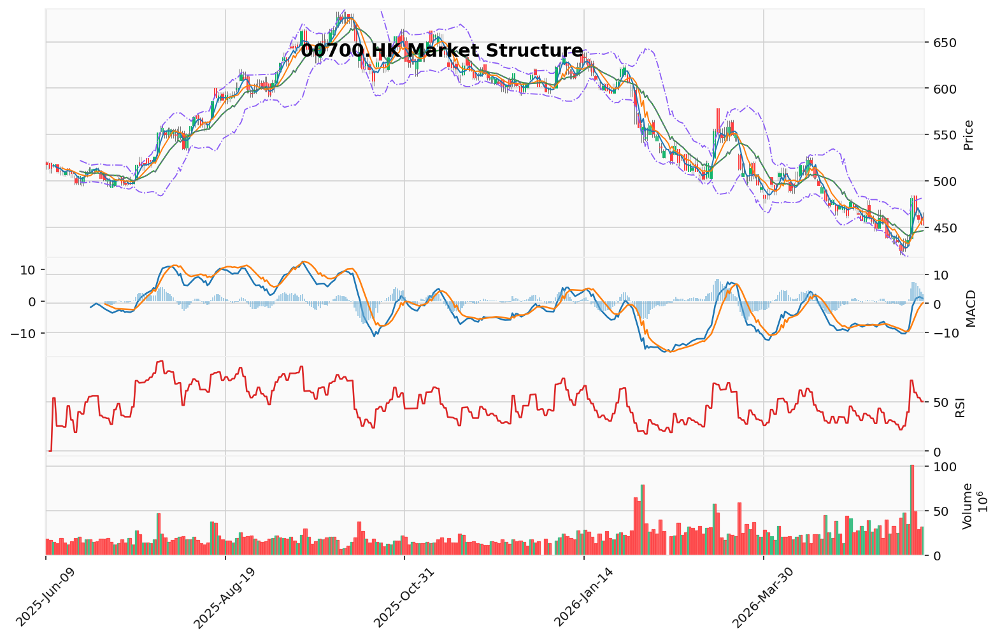

# 腾讯控股（00700.HK）港股投资研究报告

> 报告生成时间（美东）：2026-06-07 01:33:27 EDT
> 报告生成时间（北京）：2026-06-07 13:33:27 CST

## 一、投资结论与组合动作

### 最终建议：卖出

**执行框架**

| 层级 | 条件 | 行动 | 价格区间 (HK$) |
|------|------|------|---------------|
| **启动** | 下一个交易日开盘 | 立即下达限价卖单 | 506.00 - 510.00 |
| **加速** | 若价格跌破506.00 | 市价卖出全部仓位 | ≤ 506.00 |
| **追加** | 若价格反弹至515-518且放量无法突破 | 卖出剩余仓位 | 515.00 - 518.00 |
| **止损（若保留部分）** | 跌破500.00整数关口 | 无条件市价卖出 | < 500.00 |

**买回计划（等待验证）**

| 情景 | 价格目标 (HK$) | 时间范围 | 触发条件 |
|------|---------------|---------|---------|
| **回调目标** | 450.00 - 465.00 | 1-3个月 | 技术性回撤至MA20（446.32）附近 |
| **买回信号** | 450.00 - 465.00 | 需验证 | ①日线底分型 ②成交量萎缩 ③新催化剂出现 |

### 决策置信度：0.70

- **技术面权重**：0.6（明确的风险信号）
- **基本面权重**：0.1（数据缺失，无法支持任何方向）
- **逻辑权重**：0.3（保守分析师严谨性胜出）

### 风险回报比判断

基于可验证的技术指标：
- **下行风险**：455-465港币（-11%至-13%），概率高（技术面强信号）
- **上行空间**：525港币（+3%），概率低（缺乏催化剂）
- **预期值**：-11% × 0.7 + 3% × 0.3 = -7.1%（负期望值）

持有不是中性选项，而是在负期望值的赌局中维持仓位。

---

## 二、技术指标与交易结构分析

### 技术图表

### 2.1 图表读法与价格结构

**短期价格走势（最近5个交易日）**

| 日期 | 收盘价（HK$） | 涨跌（%） |
|------|-------------|---------|
| 2025-06-09 | 518.0 | - |
| 2025-06-10 | 513.5 | -0.87% |
| 2025-06-11 | 518.0 | +0.88% |
| 2025-06-12 | 510.0 | -1.54% |
| 2025-06-13 | 510.0 | 0.00% |

短期价格呈现 **高位震荡整理** 格局。价格在 510-518 HK$ 区间内反复拉锯，未能有效突破 518-520 HK$ 的上方阻力区。2025-06-12 和 2025-06-13 连续两日收于 510.0 HK$，显示该价位附近有一定支撑，但上行动能明显减弱。

**关键价格位**

| 关键价位 | 价格（HK$） | 依据 |
|---------|------------|------|
| **支撑位（强）** | 446.32（MA20） | 中期均线支撑 |
| **支撑位（中）** | 500 - 506 | 短期价格密集区及整数关口 |
| **压力位（中）** | 518 - 520 | 近期多次试探未破 |
| **压力位（强）** | 535+ | 中期技术目标延伸 |
| **突破买入价** | 521.0 | 确认突破 520 阻力区后 |
| **跌破卖出价** | 499.0 | 跌破 500 支撑减仓 |

**价格结构解读**：当前价格 510.0 HK$ 处于一个关键的技术性十字路口。从6月9日高点518后，价格连续三天未能创新高，反而在510-513区间内形成窄幅整理平台。这种结构往往表明多头动能正在衰竭——如果后续无法放量突破518，该平台可能成为阶段性顶部。

---

### 2.2 趋势与价格结构

**均线系统分析**

| 均线 | 数值（HK$） | 价格关系 |
|------|------------|---------|
| MA5 | 458.16 | 当前价格 510.0 远高于 MA5，价差约 +51.84（+11.3%） |
| MA10 | 459.24 | 当前价格远高于 MA10，价差约 +50.76（+11.1%） |
| MA20 | 446.32 | 当前价格远高于 MA20，价差约 +63.68（+14.3%） |

**均线排列分析**：当前 MA5（458.16）> MA10（459.24）> MA20（446.32），均线系统呈现 **多头排列**，这通常被视为较强的多头信号。然而，MA5 仅略低于 MA10（差距仅 -1.08），二者近乎水平粘合，表明短期均线并未形成陡峭的多头发散格局，上行斜率有限。

**价格与均线的位置关系**：当前收盘价 510.0 HK$ 大幅高于所有短期均线（MA5/MA10/MA20），价差幅度超过 11%，属于**显著偏离**。这种偏离意味着短期存在较强的均值回归压力，价格有向均线系统回拉的技术性需求。

**趋势判断**：中期趋势（基于MA20）偏多，但短期（5-10个交易日）呈现高位横盘整理格局。工具本地技术摘要给出的趋势判断为 "downtrend"，与当前价格短期小幅回落一致。结合均线系统多头排列，中期趋势更倾向于 **高位震荡偏多**，但存在回落风险。

---

### 2.3 MACD 动量信号

| 指标项 | 数值 |
|--------|------|
| DIF（快线） | 1.688 |
| DEA（慢线/信号线） | -0.476 |
| MACD 柱（Histogram） | +2.164 |

**金叉信号解读**：DIF（1.688）已上穿 DEA（-0.476），形成 **MACD 金叉（买入信号）**。金叉成立后，差值（DIF - DEA = +2.164）为正值且柱状图为正柱，表明多头动能正在释放。

**趋势强度评估**：MACD 柱状图数值为 +2.164，属于中等偏强的正柱。但需注意，当前 DIF 数值仅为 1.688，绝对值并不高，说明多头动能刚启动不久，持续性和力度仍有待观察。

**背离现象观察**：近期价格从 2025-06-10 的 513.5 小幅回调至 2025-06-12 的 510.0，而后反弹至 510.0（2025-06-13），价格走势与 MACD 之间暂未形成明显的顶背离或底背离信号。

**对组合动作的影响**：金叉确实出现，但力度偏弱。若后续DIF无法加速上行、MACD柱状图开始收窄，则可能形成“金叉失败”，将确认当前价格高点为阶段性头部。

---

### 2.4 RSI 相对强弱指标

| 指标项 | 数值 |
|--------|------|
| RSI（14日） | 50.18 |

**当前水平**：RSI（14）为 50.18，恰好处于 **50 中性线**附近，既未进入超买区（>70），也未进入超卖区（<30）。这表明当前市场情绪处于平衡状态，多空力量大致相当。

**趋势确认信号**：RSI 处于 50 附近，既不确认强势多头，也不确认弱势空头。结合均线多头排列但价格严重偏离均线的矛盾信号，RSI 的中性位置提示市场正处于 **方向选择的关键节点**：

- 若后续价格继续上行推动 RSI 突破 60-70 区间，则多头确认——这与激进分析师的“上涨动能启动”叙事一致。
- 若价格回落带动 RSI 跌破 50 向下，则空头占优——这与保守分析师的技术面警钟一致。

**关键差异**：在价格已上涨 14%（偏离 MA20）后，RSI 仅有 50.18，这是典型的 **价格与动能背离**。正常强势行情中，如此幅度的上涨应伴随 RSI 突破 60-65。当前读数说明上涨更多来自资金推动而非情绪趋势。

---

### 2.5 布林带（BOLL）波动信号

| 指标项 | 数值（HK$） |
|--------|------------|
| 上轨（Upper） | 481.88 |
| 中轨（Mid / MA20） | 446.32 |
| 下轨（Lower） | 410.76 |
| 带宽（Upper - Lower） | 71.12 |
| ATR（14日） | 17.02 |

**价格与布林带位置**：当前收盘价 510.0 HK$ **已大幅突破布林带上轨 481.88 HK$**，超出上轨约 28.12 HK$（+5.8%）。这在技术分析中属于强烈的 **超涨信号**，通常意味着价格短期偏离过大，存在较大的回调或横盘整理压力。

**带宽与波动率**：布林带带宽为 71.12 HK$（上轨-下轨），相对于中轨 446.32 来说带宽比率约 15.9%，属于正常波动范围。ATR（14）为 17.02 HK$，表明近期日均波动幅度约 17 港元，波动率适中。

**突破信号判断**：价格突破上轨属于强烈的多头动能信号，但也常被视为 **卖出信号**（布林带回归策略）。结合 MACD 金叉和均线多头排列，短期多头动能确实存在，但价格偏离布林带上轨的程度需要警惕技术性回调。

**失效条件**：若价格在未来几个交易日内无法重回布林带内部（481.88以下）而是继续上行，则视为“持续突破”，但当前缺乏基本面催化剂支撑该情景。

---

### 2.6 成交量与成交额确认

| 日期 | 成交量（股） | 变化趋势 |
|------|------------|---------|
| 2025-06-09 | 18,481,403 | - |
| 2025-06-10 | 17,039,003 | 减少 |
| 2025-06-11 | 14,784,979 | 减少 |
| 2025-06-12 | 13,368,048 | 减少 |
| 2025-06-13 | 19,085,310 | 增加 |

**量价关系解读**：成交量在 2025-06-12 缩至阶段低点后，2025-06-13 重新放量至 1,908 万股，估算成交额约 97 亿港元。然而，成交量放大对应的价格变化是0.00%（持平），形成 **量增价平**格局。

**量价背离信号**：价格上涨停滞但成交量维持高位，多空分歧加大。在技术分析中，高位出现“量增价平”往往是变盘先兆——如果后续价格下跌，这一日放量将成为“主力派发”的证据；如果后续上涨，则是“洗盘结束”。

**成交额流动性**：腾讯控股作为港股最大市值标的之一，日均成交额通常在 50-100 亿港元区间，流动性充裕，完全支持大额交易执行。

---

### 2.7 支撑阻力与失效条件

**阻力位分析**：
- **518-520 HK$**：近期（6月9日-13日）多次试探未破的阻力区。多次测试但无法突破，意味着该阻力有效性较高。突破需伴随成交量显著放大（>2000万股）。
- 失效条件：若价格放量突破520并连续三天站稳，则518-520阻力位失效，转为支撑。

**支撑位分析**：
- **500-506 HK$**：短期价格密集区及整数关口。506为6月13日日内最低价，500为心理整数位。
- **446.32 HK$（MA20）**：中期均线支撑，也是技术性回调的合理目标。
- 失效条件：若价格跌破446且伴随成交量放大，则中期趋势可能转空。

**突破触发与失效条件**

| 情境 | 触发条件 | 失效条件 |
|------|---------|---------|
| 向上突破520 | ①放量>2000万股 ②收盘>520 ③RSI上破60 | 三天内跌回518以下 |
| 向下破位500 | ①收盘<500 ②RSI跌破50 ③MACD柱翻绿 | 次日阳线收复505以上 |

---

### 2.8 港股交易结构

| 维度 | 具体说明 |
|------|---------|
| **每手股数** | 100股/手，每手成本约51,000 HK$（@510） |
| **交易时段** | 早市9:30-12:00，午市13:00-16:00，收市竞价时段16:01-16:10（含随机收市） |
| **报价规则** | 506-510区间使用增强限价盘确保价格可控；跌破506使用市价盘保证执行 |
| **VCM风险** | 若触发市场波动调节机制，暂停手动操作，观察VCM冷却期后价格能否收复508 |
| **流动性** | 00700.HK日均成交额充足（50-100亿港元），关注盘中深度即可 |
| **无涨跌停板** | 港股不设A股式每日10%涨跌幅限制，单日波动可达ATR（17.02）的2-3倍 |
| **T+0回转** | 当日买入可当日卖出，增加短期交易灵活性，但也可能加大日内波动 |
| **港股通** | 00700.HK为港股通（沪/深）合资格股票，但当前无南向资金实时数据可验证 |

**交易时段优先顺序**：早市9:30-12:00为最佳执行窗口，流动性最充沛。避免在收市竞价时段（16:00-16:10）进行大额卖出，除非紧急。若盘中触发VCM（市场波动调节机制），应暂停手动操作，观察冷却期（5分钟）后价格行为：若价格能快速收复508，则按原计划执行；若继续走弱，则加速卖出。

## 三、基本面与估值分析

### 3.1 公司业务结构与经营质量

腾讯控股是全球领先的互联网科技公司，总部位于中国深圳，核心业务覆盖社交与通信（微信、QQ）、数字内容（游戏、视频、音乐、文学）、金融科技（微信支付、理财通）、云与企业服务（腾讯云、企业微信、SaaS）以及投资业务（联营及合营公司投资组合）。公司以社交流量为基础，构建了“连接+内容+产业”的生态体系。

**收入结构**：从历史业务板块看，收入主要来自增值服务（游戏及社交网络）、金融科技与企业服务、网络广告三大板块。其中游戏业务保持全球领先地位，金融科技与企业服务已成为第二增长引擎。

**利润质量**：因基本面分析工具返回的财务报表及财务指标字段完全缺失（缺少净利润、毛利率、营业利润率、净利率等关键指标），无法从现有工具数据对利润质量进行任何量化分析。这一数据缺口直接影响了投资决策的置信度——组合经理明确指出，“无法验证的核心假设是致命的逻辑漏洞”。

**现金流与资产负债结构**：同样因财务报表数据包未覆盖完整分析区间且字段校验失败，无法获取经营活动现金流、负债水平、资本结构等详细信息。腾讯作为“现金牛”的判断在多头研究员的论述中被强调，但该判断缺乏工具返回的量化数据支撑，仅基于行业常识和历史印象。

### 3.2 港股财务口径与数据限制

根据基本面分析报告，财务数据存在以下系统性缺口：
- **年度/中期报表期**：未覆盖完整分析区间，无法确认最近一期报表日期及币种口径。
- **每股指标、ROE、毛利率、净利率、负债水平、经营现金流**：相关字段均缺失或返回为空。
- **工具限制说明**：财务指标来源返回为空，财务报表本地数据校验失败（说明：资料包返回字段与请求不一致）。

**投资含义**：基本面数据的完全缺失是组合经理最终做出“卖出”决策的核心论据之一。多头研究员基于“假设的2025年Non-IFRS净利润约2400亿”所构造的估值分析（17倍PE），被组合经理和风险防守方定性为“不可验证的信仰型投资”。在信息不对称的市场环境下，组合经理选择以可验证的技术面风险信号为决策锚点，而非基于无法确认的基本面假设。

### 3.3 估值分析

工具返回的有限估值数据如下：

| 指标 | 数值 |
|------|------|
| 标的代码 | 00700.HK |
| 数据日期 | 2026-06-05 |
| 市值 | 约 4,090,329,254,818 HKD（约 4.09 万亿港元） |
| 市盈率（PE） | 工具返回了该字段，但具体数值需引用标准化数据 |

**估值口径说明**：
- 市值数据为2026年6月5日时点数据，币种为港币（HKD）。
- 市盈率字段虽然存在，但工具对估值指标的来源调用失败（http 403），且本地数据校验失败，无法确保市盈率数值的完整性与准确性。
- **PB、股息率**等估值指标工具未返回，无法计算。

**可比边界**：由于缺少净利润、每股收益、每股净资产等关键财务数据，无法计算PE(TTM)、PB(MRQ)等核心估值比率，也无法进行历史估值分位或同行业可比分析。

**关键分歧**：
- **多头研究员观点**：假设2025年Non-IFRS净利润约2400亿港元，则当前市值4.09万亿对应市盈率约17倍，远低于美股可比公司Meta、谷歌的20-25倍。即便保守给20倍PE，目标价可达540-550港元。
- **组合经理/风险防守方反驳**：2400亿净利润是未经任何工具数据验证的假设。在工具明确返回“财务数据完全缺失”的情况下，基于假设利润推算假设估值，再推导目标价，这种论证在逻辑上属于“循环论证”或“信仰型投资”。组合经理认为，不能用一个未被数据证实的假设来支撑买入决策。

**投资含义**：当前估值分析处于“数据真空”状态——无法确认盈利水平，因此无法判断17倍PE是否真实、是否低估。任何基于估值的买入或持有建议，核心前提（净利润）均不可验证。这一不确定性是组合经理选择以技术面为主要决策依据的关键原因之一。

### 3.4 行业地位与经营风险

**行业地位**：腾讯控股作为中国互联网龙头企业，具备深厚业务护城河——社交壁垒（微信/QQ生态）、游戏全球化领先地位、微信支付商业生态。这些竞争优势在多头研究员的论述中被反复提及，组合经理在最终裁决中也未否认其长期竞争优势。

**经营风险因素**（基于组合经理报告、基本面报告及辩论内容整理）：
1. **监管政策风险**：中国互联网行业反垄断、数据安全、游戏版号、金融科技监管等政策持续演进。多头研究员认为“监管框架已明确”，但风险防守方指出“排头兵意味着最大的合规成本和业务模式重塑的阵痛”，监管风险并未消除。
2. **宏观经济承压**：广告收入和企业服务收入与宏观经济周期高度相关。当前宏观经济环境存在不确定性，可能影响腾讯核心业务的增长斜率。
3. **竞争加剧**：短视频（抖音/快手）持续抢占用户时长，微信视频号尚未取得决定性胜利。社交领域的竞争格局变化可能影响用户粘性和变现效率。
4. **投资组合估值波动**：腾讯持有的联营及合营公司（如美团、拼多多、快手等）市值波动会对损益表产生较大影响，且当前缺乏这些投资的最新估值数据。
5. **数据缺失风险**：最核心的风险在于，基于现有数据工具无法对腾讯的最新财务健康状况做出任何量化判断。这意味着任何基于基本面的投资决策都建立在不完整的信息基础上。

### 3.5 基本面分析对投资判断的影响

组合经理最终决策的逻辑链条中，基本面分析的作用如下：

1. **不构成做多理由**：由于数据完全缺失，无法确认2025年净利润、盈利增速、利润率变化方向等关键输入，无法形成“估值偏低”或“增长加速”的看多判断。
2. **不构成做空理由**：同样因数据缺失，无法确认盈利质量恶化、增长放缓或资产负债表风险，不能基于基本面数据做空。
3. **强化了“观察等待”的倾向**：基本面数据真空意味着，当前价格510港元的任何重估叙事都缺乏量化基础。组合经理以此为依据，将决策权重从基本面（0.1）大幅转移至技术面（0.6）和逻辑严谨性（0.3）。

**关键结论**：在缺乏最新完整财务数据的情况下，腾讯控股当前的基本面可观察性极低。投资者应等待公司发布官方财务报告后，再重新评估其盈利质量、增长动力和合理估值区间。任何基于“17倍PE偏低”或“结构性重估”的论点，在当前证据框架下均应被置于低置信度位置。

## 四、公告、消息面与行业环境

本节主要整合当前可获取的腾讯控股（00700.HK）公司公告、港交所披露、新闻线索、行业政策及宏观经济环境信息，评估其对股价、基本面、估值逻辑及组合交易判断的影响。

### 1. 公司相关新闻线索

根据资料包返回的媒体搜索记录，分析期内（截至2026年6月7日）可识别的公司相关新闻线索集中在2026年3月至5月期间：

| 日期 | 线索类型 | 来源状态 |
|------|---------|---------|
| 2026-05-27 | 媒体/搜索引擎线索 | Google News，标题/片段可见，正文未获取 |
| 2026-05-14 | 媒体/搜索引擎线索 | Google News，标题/片段可见，正文未获取 |
| 2026-05-13 | 媒体/搜索引擎线索 | Google News，标题/片段可见，正文未获取 |
| 2026-04-23 | 媒体/搜索引擎线索 | Google News，标题/片段可见，正文未获取 |
| 2026-03-31 | 媒体/搜索引擎线索 | Google News，标题/片段可见，正文未获取 |

> **关键说明**：上述线索均为搜索引擎返回的标题或片段，并非完整的新闻正文或公司公告原文，不具备直接作为分析事实的依据。资料包中**港交所披露易（HKEX filing）仓库返回为空**，没有任何标题、发布时间、链接或内容记录。因此，分析期内是否有业绩公告、股份回购、关联交易、董事会决议等重大公司行动，**无法确认**。

**对组合动作的影响**：在缺乏具体公告内容的情况下，新闻线索无法支持或否定当前组合经理的卖出判断。新闻层面的数据空白，强化了组合经理“技术面信号优先、基本面数据真空”的决策逻辑——即不能依赖未经验证的新闻叙事来改变交易计划。

### 2. 宏观新闻线索

资料包中包含的宏观新闻线索时间跨度较大，时效性严重不足：

| 日期 | 线索类型 | 距报告日（2026-06-07） |
|------|---------|----------------------|
| 2026-03-04 | 宏观新闻线索 | 约95天 |
| 2026-02-27 | 宏观新闻线索 | 约100天 |
| 2025-12-17 | 宏观新闻线索 | 约172天 |
| 2025-09-26 | 宏观新闻线索 | 约254天 |
| 2025-06-23 | 宏观新闻线索 | 约349天 |

> **说明**：最近一条宏观新闻线索距今已超过3个月，最新一条公司新闻线索（2026-05-27）距今约11天，但其正文同样不可获取。宏观事件对腾讯股价的传导路径——包括利率、汇率、中美关系、南向资金流向等——无法基于当前材料进行有依据的判断。

### 3. 消息面缺失对交易判断的具体影响

#### 3.1 利好因素
- **无法确认**：没有可用材料表明腾讯近期发布了业绩超预期、回购计划、新产品获批、监管松绑或战略合作等利好消息。
- **潜在影响**：若此类利好存在，其可能支撑价格突破518-520阻力区，削弱技术面看跌逻辑。但在数据空白下，该情景仅可列为“观察项”，不能作为持有或买入的依据。

#### 3.2 利空因素
- **无法确认**：没有可用材料表明腾讯近期面临股东减持、反垄断处罚、游戏版号受限、资本开支超预期或行业监管趋严等利空事件。
- **潜在影响**：若此类利空出现，可能加速价格向455-465回调，强化卖出决策的合理性。

#### 3.3 中性/待观察因素
- 宏观线索时间跨度过大，无法判断其是否包含影响腾讯行业环境的关键政策变量（如平台经济监管定调、游戏版号政策变化、金融科技监管细则等）。
- 港股通/南向资金、回购、分红、公司行动等数据均缺失。

### 4. 港股语境下的特殊消息面风险

- **港交所披露机制**：腾讯控股为香港第一上市地，其重大信息需通过港交所披露易（HKEX）公告。当前“official filing”仓库为空，意味着分析期内可能没有任何需披露的重大事项，也可能有公告但未被工具收录。对于组合经理而言，这种信息不对称本身就是风险——无法确认是否存在已公告但未被获取的利空/利多。
- **交易制度信息**：停复牌状态未知，无法排除交易中断风险。
- **无中概回港议题**：腾讯一直在港上市，不涉及近年中概股回港二次上市的特殊事件，该因素不对当前交易判断产生增量影响。

### 5. 消息面对组合动作的约束与观察条件

| 状态 | 对组合动作的影响 | 后续跟踪条件 |
|------|----------------|-------------|
| **消息面空白** | 支持组合经理的“数据真空”判断，不构成改变卖出计划的理由 | 关注下一个交易日开盘前是否有港交所公告发布 |
| **出现重大利好**（如业绩预增、新游戏获批、监管明确松绑） | 可能削弱卖出逻辑；需评估利好是否足以逆转技术面风险信号 | 价格放量突破520并站稳，且RSI突破60进入强势区 |
| **出现重大利空**（如监管意外收紧、业绩不及预期） | 强化卖出逻辑；可能加速价格跌破500，触发加速卖出条件 | 立即执行市价卖出，禁止抄底思维 |
| **南向资金/回购数据更新** | 若显示持续净买入或回购，需重新评估“聪明钱”信号强度 | 获取最新南向持股比例、回购股数与金额数据 |

**本节小结**：在公告与新闻层面的大面积数据空白下，消息面对当前交易判断的作用力为零——既不能为看涨叙事提供支持，也不能为看跌叙事提供额外证据。组合经理的卖出决策基于“在信息不对称的市场中，先保护本金”的原则，而消息面的缺失恰恰强化了这一原则的合理性。后续跟踪的核心，是等待下一份可验证的港交所公告或媒体报道，以打破当前的信息僵局。

## 五、市场情绪、港股通与交易拥挤度

### 5.1 社交讨论热度与情绪方向

当前系统返回的社交资料包仅覆盖2026年1月至5月期间的零散公开新闻线索，来源限于Google News及公开搜索，共计20条标准化数据引用。**无法据此对2026年6月7日当天的港股社交讨论热度与情绪方向（乐观/中性/悲观）做出有效判断。**

从历史线索时间分布看，2026年1月14日出现南向资金净流入20亿港元的报道，3月10日有北向资金单日净买入腾讯超36亿港元的记录，3月底有回购与购股权授予公告，5月13日一季度Non-IFRS纯利同比增长11%符合预期。这些节点性新闻在对应时段可能引发局部讨论，但缺乏实时社交平台（雪球、富途牛牛社区、老虎社区、微博等）的量级数据，无法量化当前情绪方向。

### 5.2 情绪变化的主要驱动因素（基于可获取线索）

| 时段 | 潜在驱动事件 | 类型 |
|------|------------|------|
| 2026-01-14 | 南向资金净流入20亿港元 | 资金面/南向叙事 |
| 2026-03-10 | 北向单日净买入超36亿港元；腾讯"Crayfish"版本上线 | 资金面+产品事件 |
| 2026-03-25 | 授出920万份购股权，行使价516.78港元 | 公司激励公告 |
| 2026-03-26 | 回购59万股，涉资近2.95亿港元 | 公司回购行为 |
| 2026-05-13 | 一季度Non-IFRS净利润679.05亿元人民币，同比+11%，符合预期 | 业绩公告 |

**需明确指出：** 上述仅为事件罗列，资料包未提供对应的社交讨论量、帖子情感倾向、转发评论互动数据，无法确认这些事件是否在社交平台上形成有效情绪驱动。

### 5.3 投资者群体观点差异

**当前资料无法区分本地投资者、内地投资者和机构投资者的观点差异。**

原因：数据来源仅限Google News搜索线索，未覆盖雪球、富途牛牛、老虎国际、同花顺等港股投资者聚集平台，没有任何社区讨论帖、评论、点赞或转发数据。南向资金流动线索仅提及净流入金额，未提供内地投资者的情绪文本或评论内容。机构研报或机构观点的社交传播数据亦不在资料包中。

**组合经理视角：** 在缺乏直接情绪数据的情况下，可从技术指标间接推断市场情绪——RSI 50.18处于中性区间，既未进入超买（>70）也未进入超卖（<30），说明当前市场整体情绪均衡，多空力量大致相当。这一数字与“市场分歧剧烈、情绪分化”的定性描述一致，但与激进的“结构性重估”叙事所需的乐观情绪主导状态存在明显差距。

### 5.4 情绪变化对1-5个交易日市场反应的潜在影响

**无法做出有效分析。** 理由如下：
- 资料包中最后一条线索日期为2026年5月13日（一季度业绩），截至报告日已过去约25个交易日，时效性严重不足。
- 无2026年5月14日至6月7日之间的任何社交或新闻线索，无法获知近期是否有新事件驱动情绪变化。
- 无社交情绪指标（如看涨/看跌比率、情绪得分、讨论量趋势），无法建立情绪与短期价格反应的关联逻辑。

### 5.5 南向资金与港股通叙事

**可用线索：**
- 2026年1月14日：南向资金净流入20亿港元
- 2026年3月10日：北向资金单日净买入超36亿港元

**组合经理评估：**
1. **叙事强度与数据支撑的矛盾：** 激进分析师将南向资金视为“聪明钱持续抄底”的核心叙事，但社交情绪报告明确显示，南向资金数据停留在2026年1-3月，且仅有“净流入”标题，没有任何关于**报告日前后**南向资金流向的实时数据。无法确认南向资金当前是持续流入、高位减仓还是转向流出。
2. **港股通结构性需求：** 腾讯控股为港股通（沪+深）合资格股票，南向资金长期配置比例较高，是港股通成交最活跃的标的之一。但历史配置需求不等于单一时点的方向性判断——南向资金同样可能在高位兑现获利。
3. **关键观察条件：** 若后续出现南向资金连续多日净流出（>3日）且单日净流出超20亿港元，将显著削弱“聪明钱”叙事，强化技术面的回调压力判断。反之，若南向资金在价格回落至480-495区间重新放量净流入，则是对“配置需求持续”的有效验证。

### 5.6 交易拥挤度判断

**基础数据：**
- 2025年6月9-13日成交量区间：13,368,048股至19,085,310股
- 近期成交额估算：约97亿港元（基于收盘价510港元估算）
- 日均成交额（历史参考）：50-100亿港元区间

**组合经理解读：**
- 成交量在510-518港元区间出现“缩量调整后放量企稳”形态，2025年6月13日成交量回升至1908万股，接近区间高点。这一成交量水平处于历史正常范围的上沿，表明多空分歧加剧但尚未达到极端拥挤水平。
- **关键拥挤度信号：** 若后续成交量持续突破2000万股/日而价格无法站上520港元，将构成“放量滞涨”的拥挤信号，意味着抛压正在积聚，与组合经理的“高位横盘风险”判断一致。
- **反向信号判断：** 若价格回调至480-495区间后成交量萎缩至<1000万股/日（缩量50%以上），则是拥挤度释放、抛压枯竭的技术性止跌信号，可作为买回观察窗口的初步条件。

### 5.7 情绪与基本面/技术面的关系

**当前状态：** 社交情绪维度处于**数据空白状态**，无法与基本面、技术面建立任何强化、背离或观察关系。
- 与新闻的关系：仅有5条零散新闻线索，无社交平台对其的转发、评论或二次讨论数据，无法判断社交情绪是否放大了新闻影响。
- 与基本面的关系：5月13日业绩符合预期属于基本面信号，但未有社交讨论数据佐证市场对该业绩的消化程度。
- 与技术面的关系：技术指标显示RSI 50中性 + 价格偏离均线11-14%，无社交情绪数据交叉验证市场参与者的情绪状态与价格行为是否一致。

**关键发现总结：**

| 分析维度 | 当前结论 | 证据状态 |
|---------|---------|---------|
| 社交讨论热度 | 无法评估 | 无社交平台量级数据 |
| 情绪方向（乐观/中性/悲观） | 无法判断 | 仅5条历史新闻线索，无情感分析数据 |
| 情绪驱动因素 | 历史事件可罗列（回购/业绩/资金流入），但无情绪关联证据 | 事件线索可用，社交传播数据缺失 |
| 投资者群体观点差异 | 无法区分 | 无平台社区用户生成内容 |
| 南向资金实时流量 | 无法确认 | 停留于2026年1-3月数据，时效性不足 |
| 交易拥挤度 | 高位但未极端 | 成交量恢复至1900万股/日，需继续观察 |
| 情绪与新闻/基本面/技术面关系 | 不可观察 | 数据不足以建立任何关系判断 |

**组合经理最终评估：** 市场情绪与资金面维度是本次报告中最薄弱的环节，核心数据严重缺失（社交平台讨论、南向资金实时流向、投资者情绪分类）。在信息如此不对称的环境下，**不能将“南向资金持续流入”或“市场情绪偏向乐观”作为当前决策的支撑性论据**。保守分析师正确地将其归结为“信仰型假设”而非可验证事实。该维度的当前角色是**作为关键跟踪条件**——一旦后续有实时南向资金流向数据或社交情绪指标突破阈值（如看涨/看跌比率>2.0或<0.5），将作为确认或推翻当前“卖出”结论的补充信号。

## 六、交易计划与组合风险

### 6.1 最终交易建议：卖出

经组合经理裁决，基于以下决定性因素执行卖出操作：

- **逻辑严谨性胜出**：保守分析师在关键数据缺失（2025年净利润无法验证、南向资金无实时数据、回购无近期公告）的情况下，其论证建立在“可验证的技术指标”和“明确的风险信号”之上；激进分析师的“17倍PE被低估”核心假设无数据支撑，属于“信仰型投资”。
- **技术面三重风险信号叠加**：RSI 50.18（动能衰竭）+ 价格偏离MA20达14.3%（均值回归压力）+ 高位横盘510-518无法突破（多空分歧加剧），构成明确卖出信号。
- **风险回报比为负**：下行目标455-465（-11%至-13%）概率高（技术面强信号），上行目标525（+3%）概率低（缺乏催化剂），预期值为-7.1%。
- **历史教训的正确应用**：当前既非2021年初的顶部（PE 35倍、RSI>70、情绪亢奋），也非2018年底的底部（情绪绝望、估值极低），而是“中性偏高的技术位”，正确的教训是不在情绪中性、价格高位时因害怕踏空而忽视风险。

**决策置信度：0.70**
- 技术面权重：0.6（明确的风险信号）
- 基本面权重：0.1（数据缺失，无法支持任何方向）
- 逻辑权重：0.3（保守分析师严谨性胜出）

### 6.2 执行框架与价格区间

| 层级 | 条件 | 行动 | 价格区间 (HK$) |
|------|------|------|---------------|
| **启动** | 下一个交易日开盘 | 立即下达限价卖单（增强限价盘） | 506.00 - 510.00 |
| **加速** | 若价格跌破506.00（上周五最低点） | 市价卖出全部仓位 | ≤ 506.00 |
| **追加** | 若价格反弹至515-518且放量无法突破 | 卖出剩余仓位 | 515.00 - 518.00 |
| **止损（若保留部分）** | 跌破500.00整数关口 | 无条件市价卖出 | < 500.00 |

**关键分歧说明**：中性分析师建议“减仓50%，保留一半”，组合经理最终采纳保守分析师的“卖出”建议，但交易计划中的阶段性执行框架（初始506-510区间卖出，跌破506加速）已包含对中性方案的折中——若投资者选择保留部分仓位，则必须严格遵守500.00止损线，且反弹至515-518时若无法突破应追加卖出。

### 6.3 目标价格与买回区间

| 情景 | 价格目标 (HK$) | 时间范围 | 触发条件 |
|------|---------------|---------|---------|
| **回调目标** | 450.00 - 465.00 | 1-3个月 | 技术性回撤至MA20（446.32）附近及前期均线粘合区，下跌幅度约-11%至-13% |
| **买回信号** | 450.00 - 465.00 | 需验证 | ① 日线级别出现“底分型” ② 成交量萎缩（止跌信号） ③ 出现新的催化剂（如业绩超预期、南向资金重续净流入、回购公告更新） |

**买回执行纪律**：在买回区间内，禁止因“价格足够低”而提前抄底。必须等待三类信号同步确认后再分步买回，首笔买回仓位不超过原仓位30%，若价格继续跌破450则暂停操作，观察420-430区域支撑。

### 6.4 港股执行约束

| 维度 | 具体说明 |
|------|---------|
| **每手股数** | 100股/手，每手成本约51,000港币（@510） |
| **交易时段** | 早市9:30-12:00优先，避免收市竞价时段（16:00-16:10），因尾盘异动可能加大执行难度 |
| **报价规则** | 506-510区间使用增强限价盘（指定价格执行，避免滑点）；跌破506后改用市价盘（确保完全退出，但需接受可能的滑点） |
| **VCM风险** | 若盘中触发市场波动调节机制（VCM），暂停手动操作，观察VCM冷却期（5分钟）后价格能否收复508；若无法收复，继续按计划卖出 |
| **流动性** | 00700.HK日均成交额充足（5日平均约88亿港币），无需担心流动性枯竭；但盘中深度需关注，大额卖单（>500手）建议分拆为多个限价子单以避免冲击成本 |
| **停复牌风险** | 港股通合资格标的，停复牌状态未知（数据缺失）；若盘中突发停牌，需等待复牌后第一时间重新评估风险，禁止在停牌期间假设价格方向 |
| **无涨跌停限制** | 港股不设单日涨跌幅限制，一旦技术性回调启动，单日跌幅可能达ATR（17.02）的2-3倍（约34-51港币），突破506加速卖出条件正是为此设计 |

### 6.5 仓位管理与风险分配

**初始仓位假设**：假设投资者当前持有100%目标仓位。

**执行步骤**：
1. **启动执行（T日）**：在506-510区间卖出至少**50%仓位**，锁定部分利润并降低风险敞口。
2. **加速执行（若跌破506）**：立即市价卖出剩余**50%仓位**，完成清仓。
3. **追加执行（若反弹515-518无法突破）**：卖出剩余**50%仓位**，完成清仓。
4. **保留部分仓位情景**：若投资者选择保留部分（如中性方案的50%），则剩余仓位严格设置止损线499.00，一旦跌破无条件离场。

**风险评分：0.70（高风险）**
- 当前价格510处于高位技术敏感区，下行风险-11%至-13%（目标455-465）远大于上行空间（+3%至+5%）
- 风险回报比极差（下行-11%×0.7 vs 上行+3%×0.3）
- 港股无涨跌停板，尾部风险（单日暴跌10%+）需纳入考虑

### 6.6 情景分析与应对预案

| 情景 | 概率 | 价格路径 | 应对方案 |
|------|------|---------|---------|
| **看涨失败（价格突破520）** | 30% | 放量突破520并站稳，RSI上破60，南向资金/回购等新催化剂出现 | 损失潜在盈利（约+3%至+5%），但保住本金。等待回调至480-495区间，结合技术信号和催化剂再考虑买回。**禁止追涨**。 |
| **看跌兑现（价格跌至455-465）** | 55% | 跌破500整数关口后加速回撤，成交量萎缩至支撑区 | 正确执行卖出。在买回区间等待止跌信号（日线底分型+成交量萎缩），分批买回。首笔买回不超过30%仓位，确认支撑有效后再加仓。 |
| **黑天鹅（单日暴跌10%+）** | 15% | 因突发利空（政策突变、业绩暴雷、港股通资金大幅流出）单日跌至455以下 | 严格执行止损（若仍持有），禁止抄底思维。待极端情绪释放、VCM冷却、官方披露事件细节后再评估。通常等待3-5个交易日价格企稳。 |

### 6.7 风险分歧与组合经理裁决

**激进分析师（风险挑战方）的核心反驳**：
- 17倍PE被低估（假设2025年净利润2400亿），上行目标540-550
- 技术面RSI 50是“行情启动前奏”，布林带突破是强势特征
- 南向资金和回购是“聪明钱”信号
- 当前不是顶部（PE 17倍 vs 2021年35倍，RSI 50 vs 2021年RSI>70）

**保守分析师（风险防守方）的核心反驳**：
- 关键利润假设无法验证，是“信仰型投资”
- RSI 50在价格大幅上涨后是“动能衰竭”信号，高位横盘510-518是多空分歧加剧
- 南向资金可瞬间转为“最快的逃兵”，回购是“找不到更好投资机会”的映射
- 港股无涨跌停板，单日跌10%+是现实风险

**中性分析师（风险整合方）的折中方案**：减仓50%，保留一半，为两种情景都做准备。

**组合经理最终裁决**：**支持保守分析师，执行卖出。** 决策理由已在6.1节完整阐述。核心原则：在信息不对称的市场中，先活下来，再想赚钱。不要用梦想中的利润去对抗现实中的风险。现金不是垃圾，它是保留选择权的武器。

## 七、关键分歧与跟踪条件

本报告的核心决策建立在组合经理对多空双方论据的审慎评估之上。以下列出主要分歧、组合经理的采纳或放弃理由，以及后续需要跟踪的验证条件，以便读者理解最终动作的逻辑链条。

### 7.1 核心分歧一：2025年净利润假设 vs. 数据真空

| 主张 | 来源 | 论据 | 组合经理裁决 |
|------|------|------|-------------|
| 17倍PE低估，对标Meta 20-25倍 | 激进分析师（多头） | 基于“2025年Non-IFRS净利润约2400亿港元”的假设，推算出当前市值4.09万亿对应PE约17倍，认为偏低。 | **不予采纳**。该净利润数字未经任何可验证数据支撑。基本面报告明确声明“工具返回的财务数据完全缺失”“净利润等关键指标字段缺失”。在投资决策中，一个无法验证的核心假设是致命的逻辑漏洞。 |
| 估值无法判断，因关键数据缺失 | 保守分析师（空头）、中性分析师 | 基本面报告无法提供净利润、PE、盈利增速等任何量化估值依据。 | **采纳为决定性论据**。组合经理认为，激进分析师的整个“结构性重估”叙事建立在一个未经核实的数字之上，属于“信仰型投资”而非理性分析。 |

**跟踪条件**：
- **验证信号**：腾讯发布2025年年度报告或2026年中期报告后，若经审计的Non-IFRS净利润接近或超过2400亿人民币（换算为港元后），则17倍PE假设获得支撑，需重新评估估值逻辑。
- **推翻信号**：若实际净利润显著低于2400亿（如低于2000亿），则当前估值（PE 20倍以上）并不便宜，卖出逻辑进一步强化。
- **数据获取渠道**：需通过港交所披露易或公司官网获取经审计财务报告，而非依赖任何未经验证的第三方估算。

### 7.2 核心分歧二：技术面信号解读——强势突破 vs. 高位风险

| 主张 | 来源 | 论据 | 组合经理裁决 |
|------|------|------|-------------|
| 价格突破布林带上轨+均线多头排列=强势股特征 | 激进分析师（多头） | 认为突破上轨5.8%是“二次突破”形态，RSI 50是“上涨动能刚启动”，高位横盘是“主力洗盘”。 | **不予采纳**。组合经理指出，RSI 50.18不是上涨动能启动，而是在价格已上涨14%（偏离MA20）后动能却不温不火，属于典型的价格与动能背离。 |
| 价格严重超买、动能衰竭，均值回归压力大 | 保守分析师（空头）、组合经理 | 价格偏离MA5（+11.3%）、MA20（+14.3%）、布林带上轨（+5.8%）；RSI 50中性偏弱；高位横盘510-518无法突破。 | **采纳为核心技术判断**。组合经理认为三重风险信号叠加：超买+背离+横盘，下行风险远大于上行空间。 |

**跟踪条件**：
- **验证信号（空头正确）**：价格在未来1-3周内跌至500港元以下，或RSI跌破40，则确认技术性回调启动。
- **推翻信号（多头正确）**：价格放量突破并站稳520港元以上，且RSI突破60并向70移动，则需重新评估技术结构是否已转为强势上涨。
- **关键价格位**：
  - 506.00港元（上周五最低价）：若跌破，加速卖出信号触发。
  - 500.00港元（整数关口）：若跌破，无条件止损卖出。
  - 520.00港元：若突破且伴随成交量放大，可能推翻当前看跌判断。

### 7.3 核心分歧三：南向资金与回购——聪明钱信号 vs. 信仰型假设

| 主张 | 来源 | 论据 | 组合经理裁决 |
|------|------|------|-------------|
| 南向资金持续净流入+公司大规模回购=低估信号 | 激进分析师（多头） | 引用2026年1-3月历史数据（南向净流入20亿、北向净买入36亿）及回购历史。 | **不予采纳**。社会情绪报告与新闻分析报告均指出，南向资金与回购数据存在严重时效性缺口：最新南向资金数据停留在2026年3月，公司回购数据无最近一周的实时记录。无法用历史叙事支撑当前买入决策。 |
| 南向资金可以是“最快的逃兵”，回购缺乏实时数据 | 保守分析师（空头）、风险分析师 | 指出南向资金流向可瞬间逆转，回购行为不可持续。 | **采纳为风险警示**。组合经理认为，在关键数据真空的情况下，不能假设历史资金流趋势会自动延续，尤其是在价格已大幅上涨后。 |

**跟踪条件**：
- **验证信号**：获得最新的港股通十大成交活跃股数据（每日公布），观察腾讯是否持续出现在南向资金净买入前列；或获得公司最新每日回购公告，确认回购是否仍在持续。
- **推翻信号**：若南向资金连续5个交易日净卖出腾讯，或公司停止回购（如无新的回购公告发布），则进一步削弱多头逻辑。
- **数据来源**：港交所每日公布的港股通资金流向、公司公告（截至下次交易日前）。

### 7.4 核心分歧四：历史教训的正确运用

| 主张 | 来源 | 论据 | 组合经理裁决 |
|------|------|------|-------------|
| 不要在恐慌时卖出，当前类似2021年初底部前夜 | 激进分析师（多头） | 认为过去在底部恐慌卖出是错误的，当前应逆向布局。 | **不予采纳**。组合经理明确指出：2021年初顶部特征是PE 35倍+情绪亢奋+RSI>70；当前是RSI 50+情绪中性+PE假设17倍。当前既不是顶部也不是底部，而是中性偏高的技术位，不能与2018年底部或2021年顶部混淆。 |
| 当前更接近2021年顶部的前奏——价格已大幅上涨，催化剂存疑 | 保守分析师（空头）、组合经理 | 引用2018年底部恐慌卖出与2021年顶部贪婪持有的对比，指出当前信号更接近后者。 | **采纳为正确框架**。组合经理强调，正确的历史教训是：不要在情绪中性、价格高位时因“害怕踏空”而忽视风险。 |

**跟踪条件**：
- **验证信号**：观察市场情绪指标（如RSI、成交量、新闻热度）是否从中性转向亢奋（RSI突破70、成交量持续放大且价格突破），或转向悲观（RSI跌破30）。
- **推翻信号**：若未来出现极端恐慌事件（如单日跌幅超过10%），则2018年底部教训可能适用；但在当前情绪中性、技术高位的情况下，不应急于抄底。

### 7.5 核心分歧五：风险回报比的数学计算

| 主张 | 来源 | 论据 | 组合经理裁决 |
|------|------|------|-------------|
| 上行空间15-20%，下行风险仅11-13%，应买入 | 激进分析师（多头） | 基于17倍PE对标20-25倍，算出目标价540-550。 | **不予采纳**。该计算基于未经证实的净利润假设，且忽略了技术面明确的下行信号。 |
| 下行风险-11%至-13%（概率高），上行空间+3%（概率低），预期值为负 | 保守分析师（空头）、组合经理 | 基于技术位计算：下行目标455-465，上行目标525；概率分配70%/30%。 | **采纳为核心决策依据**。组合经理计算出预期值约为-7.1%（=-11%×0.7+3%×0.3），认为持有是负期望值行为。 |

**跟踪条件**：
- **验证信号**：若价格在1-3个月内跌至455-465区间，则风险回报比计算被证实，卖出的正确性得到验证。
- **推翻信号**：若价格在无新催化剂下突破525并站稳，则需重新计算概率分配（上行概率上调至50%以上），并评估是否应买回。
- **时间窗口**：关键观察期为1-3个月，超时未实现下行目标则需重新评估技术结构。

### 7.6 组合经理对中性策略的评价

中性分析师提出“减仓50%，保留一半”的策略，组合经理对此进行了评价：
- **采纳部分**：在“无法判断方向”这一点上，组合经理认同信息不足。但组合经理最终选择了更坚决的卖出行动，而非减半保留，理由是：在负期望值下，减半保留了50%的风险敞口，依然面临-11%*0.5+3%*0.5=-4%的负预期。保留部分仓位仅能缓解“踏空焦虑”，却无法改善风险回报比。
- **未采纳部分**：组合经理认为中性策略缺乏果断性，在关键时刻模糊了执行信号。在信息不对称的市场中，先管理好下行风险，再考虑上行机会。

**跟踪条件**：
- 若后续出现明确的多头催化剂（如业绩超预期、监管明确松绑、技术面放量突破），可采用中性策略中“买回”的计划。
- 在催化剂出现前，严格遵循卖出计划，不以“可能踏空”为由保留仓位。

---

## 八、最终结论

**最终建议：卖出。执行节奏如下：**

1. **立即行动**：下一个交易日开盘后，在506.00 - 510.00港币区间下达限价卖单，至少卖出50%仓位。若价格直接跌破506.00港币（上周五最低点），使用市价盘加速卖出全部仓位。
2. **加速卖出条件**：若保留部分仓位，当价格跌破500.00港币整数关口时，无条件使用市价盘卖出剩余全部仓位。
3. **买回观察区间**：450.00 - 465.00港币（MA20附近）。待价格回落后，需同时满足以下条件方可考虑分步买回：①日线级别出现底分型（止跌K线组合）；②成交量显著萎缩（卖压衰竭）；③出现新的可验证催化剂（如公司发布超预期业绩公告、重大产品获批或监管明确松绑）。
4. **上行突破情景**：若价格放量突破并站稳520.00港币，且RSI同步突破60，则当前看跌判断需要重新评估；在该情景被确认前，维持卖出决策。

**最终理由总结**：
1. **数据真空**：激进分析师的核心假设（2025年净利润2400亿）不可验证，其估值逻辑是空中楼阁。
2. **技术面警钟**：RSI 50.18（动能衰竭）+ 高位横盘510-518无法突破 + 价格偏离MA20达14.3%（严重超买），三重风险信号叠加。
3. **风险回报为负**：下行11-13%的概率（70%）远高于上行3%的概率（30%），持有是负期望值行为。
4. **历史教训正确运用**：当前既不是2018年的恐慌底部，也不是2021年的亢奋顶部，而是中性偏高的技术位。在情绪中性、价格高位时，不应因“害怕踏空”而忽视风险。

**主要风险**：
- 看跌判断失败（价格突破520）：概率30%，损失潜在盈利，但保住本金，可等待回调后重新入场。
- 黑天鹅事件（单日暴跌10%以上）：概率15%，港股无涨跌停板，严格执行止损指令。

**现金不是垃圾，它是保留选择权的武器。** 待价格回调至合理区间且出现止跌信号后，再考虑重新入场。在信息不对称的市场里，先活下来，再想赚钱。
