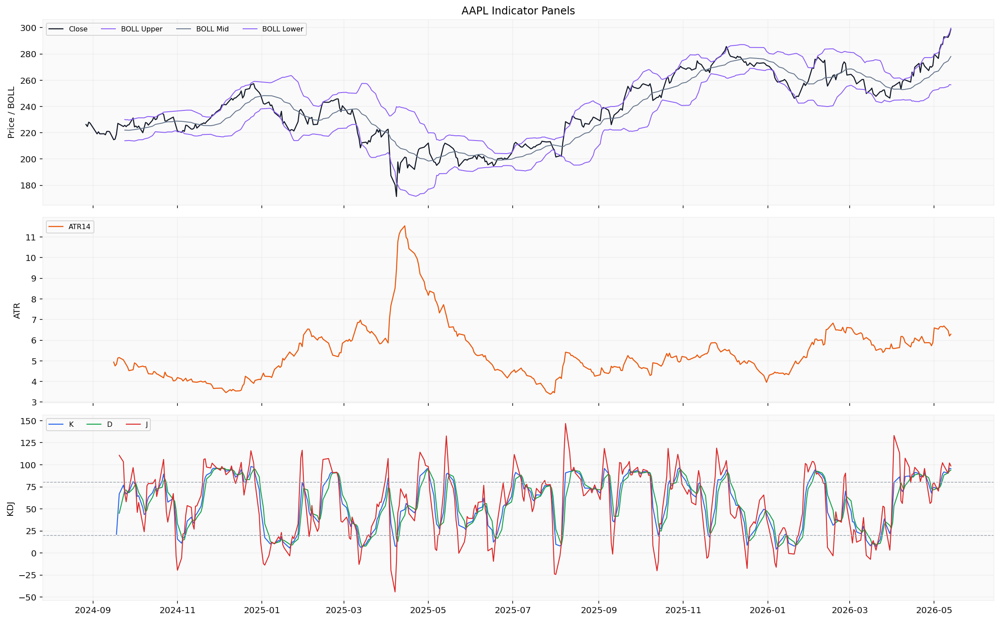
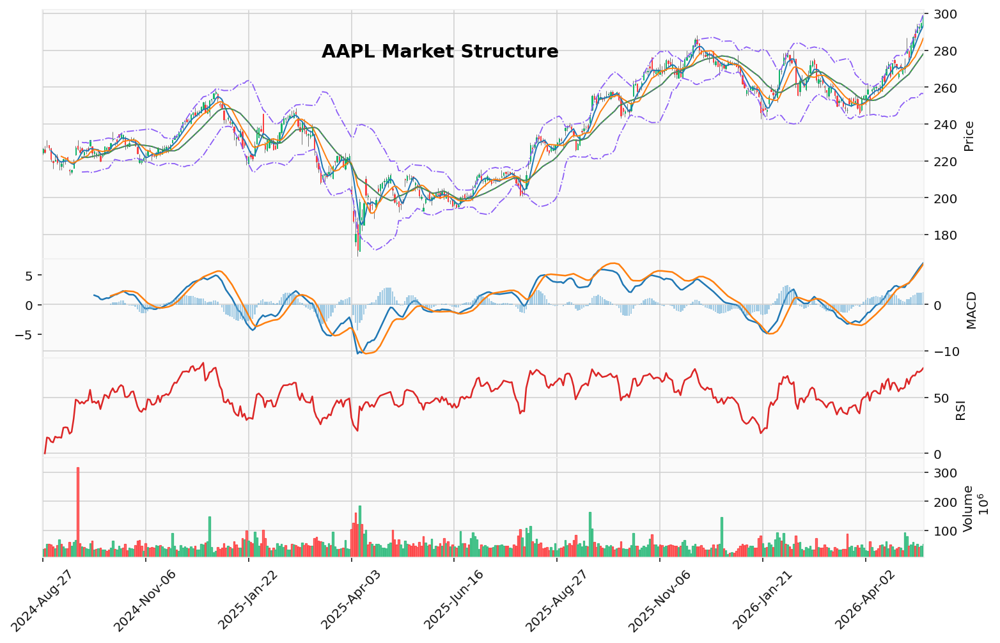

# Apple Inc.（AAPL）投资研究报告

## 一、投资结论与组合动作

**评级：卖出（Sell）**

**组合经理最终决定：**
于$299–$300区间卖出全部AAPL持仓。这是基于风险收益比的决策：自由现金流同比下降（较上年减少100亿美元，降至988亿美元）、回购速度放缓（上季度减半至123亿美元）、以及技术面极端超买（RSI 77.99，触及布林带上轨$299），这些因素压过了看涨动能和尚未确认的峰会催化事件。宏观环境——高于预期的CPI和攀升的债券收益率——正在压缩高倍数股票。

**执行计划：**
1. **立即执行：** 在$299–$300的任何强势中卖出全部持仓。不要等待催化剂确认。市场在事件发生前已提前定价。
2. **回购条件：** 在$254–$260区间设置限价买入订单（约15%折价，对应50日均线支撑位）。时间窗口：预计2–4周内若出现回调。
3. **替代方案（如需保留核心仓位）：** 卖出80%，保留20%，并设置7%的移动止损。

**风险约束条件：**
- 若10年期国债收益率突破4.5%，加速卖出——AAPL的高倍数将迅速压缩。
- 若RSI形成看跌背离或MACD柱状图在后续上涨中收缩，应立即减少持仓。
- 若特朗普-习峰会未能产生具体关税减免成果，"卖出消息"事件可能触发快速回调。

---

## 二、技术指标分析

### 技术图表

### 1. 图表结构与价格形态

截至2026年5月13日，AAPL收盘于**$298.87**，距历史高点$300.92仅一步之遥。过去一年的价格结构可分为六个阶段：

- **2025年5–7月：** 横盘整理，$200–$213区间
- **2025年8–9月：** 强劲突破，从$202至$256（财报后跳空上涨）
- **2025年10–12月：** $244–$288上涨趋势延续，创历史新高
- **2026年1–3月：** 从$288回调至~$246，跌幅约14.6%（约$42），在200日均线（~$244–248）获得支撑
- **2026年3月底–4月：** 在$246–$272区间构建底部
- **2026年5月（当前）：** 爆炸性突破——从4月30日的~$271涨至5月13日的$298.87，10个交易日内上涨约$28（+10.3%）

**当前价格结构判断：** 这是过去一年中最猛烈的突破行情。价格已突破50日均线、布林带中轨，正在挑战布林带上轨$299和心理整数关口$300。

### 2. 趋势与均线系统

| 均线 | 当前值 | 价格溢价 | 趋势方向 |
|------|--------|---------|---------|
| 10日EMA | $287.78 | +3.85% | 急剧上升 |
| 50日SMA | $264.45 | +13.0% | 上升 |
| 200日SMA | $257.75 | +15.9% | 稳步上升 |

**均线结构：** 价格（$298.87）> 10日EMA（$287.78）> 50日SMA（$264.45）> 200日SMA（$257.75）

这是教科书式的**看涨排列**——所有均线均为正向排列且向上倾斜。10日EMA与200日SMA之间的价差为$30.03（+11.7%），表明趋势强劲、动能充沛。

**趋势含义：** 长期趋势（200日SMA）自2025年10月以来持续上升，从~$221.66升至$257.75。全年仅一次（2026年1月）短暂跌破200日SMA，彼时构成重要支撑并催生了后续强劲反弹。当前价格处于200日均线上方15.9%，这是非常强势的多头姿态。然而，价格对50日均线的溢价已达到13.0%，短期趋势已明显延伸，均值回归压力正在积累。

### 3. MACD与RSI动量信号

**MACD：**
- MACD线：8.89（正数且上升）
- MACD信号线：6.82（同样上升）
- MACD柱：2.07（正数且扩张）

MACD线自2026年4月20日金叉穿越信号线（MACD 2.87 > 信号线0.76）以来始终保持在上方。MACD柱从4月30日的0.48持续扩张至5月13日的2.07，**两周内增长331%**，动能正在加速。当前**不存在看跌背离**——MACD随价格上涨创出新高。

**RSI（14日）：**
- 当前值：**77.99**（5月13日），连续5个交易日处于超买区域（>70）
- 此前读数：75.99（5月12日）、78.49（5月11日）、68.94（5月8日）

RSI连续位于70以上表明买盘强劲，但在强劲上涨趋势中，超买状态可能持续，并不自动意味着立即反转。然而，**需要高度警惕**：2026年1月类似的超买条件（RSI ~75）后，股价从$288回调至$246，跌幅达14.6%。当前RSI尚未形成看跌背离，但若后续价格上涨时RSI无法创出新高，将构成重大预警信号。

**动量信号对组合动作的影响：** 加速的MACD支撑短期看涨，但RSI超买和2026年1月的历史先例均提示，当前水平追涨的风险收益比极差。若MACD柱在价格上涨中开始收缩，将构成趋势衰竭的早期信号，应立即减持。

### 4. 布林带与ATR波动信号

**布林带（20,2）：**
| 日期 | 中轨 | 上轨 | 下轨 | 带宽 |
|------|------|------|------|------|
| 5月13日 | $278.09 | $299.12 | $257.06 | 42.06 |
| 5月12日 | $276.46 | $295.78 | $257.13 | 38.65 |
| 5月11日 | $274.65 | $293.54 | $255.75 | 37.78 |
| 5月8日 | $272.96 | $291.12 | $254.80 | 36.32 |

**核心观察：** 5月13日收盘价（$298.87）几乎**精确触及上轨（$299.12）**。这是极端延伸的信号。上轨本身从5月8日的$291.12快速扩张至5月13日的$299.12（3个交易日+2.7%），这通常出现在趋势加速阶段——但也是动能开始衰竭的高危区域。带宽从36.32扩张至42.06，确认波动率正在放大。

**ATR（14日）：** 当前值为**6.52**（5月13日），较4月30日的5.90上升约10.5%。ATR上升确认日均波动范围正在扩大，适用于设置更宽的止损距离。当前正常日均波动约±$6.50。

**波动信号含义：** 价格触及上轨+ATR扩张的组合，在强势趋势中是看涨确认；但当价格已连续大幅上涨后，这更接近短期动能顶点。若价格开始低于上轨运行，将是动能减弱的信号。

### 5. 成交量与VWMA确认

**VWMA（20日）：** 当前值$285.04（5月13日），价格（$298.87）位于其上方+4.85%。VWMA自4月24日的$267.10快速上升至当前水平，确认成交量正在支撑上涨趋势。

**成交量特征：**
- 4月30日成交量飙升至**9180万股**（远超日均约4000万股），标志着突破行情启动
- 5月1日成交量**7990万股**，进一步确认突破有效性
- 5月13日成交量**5260万股**——高于均值但未达到极端水平，表明市场仍有信念但尚未进入狂热阶段

**成交量确认强度：** 中等偏强。突破初期有巨量配合，后续涨势中的成交量合理，未出现缩量上涨的危险信号。

### 6. 支撑与阻力

**动态支撑（由近及远）：**
- 10日EMA（~$287.78）—— 短期趋势多空分界线
- VWMA（~$285.04）—— 成交量加权支撑
- 布林带中轨/20日均线（~$278.09）—— 均值回归关键位
- 50日SMA（~$264.45）—— 中期趋势支撑
- 200日SMA（~$257.75）—— 长期牛市底线

**阻力：**
- 布林带上轨（~$299.12）—— 短期技术阻力，当前价格已触及
- **心理整数关口$300** —— 重大心理阻力位
- 52周高点$300.92 —— 绝对历史高点

### 7. 失效条件与触发条件

**看涨逻辑失效条件：**
1. **收盘价跌破10日EMA（~$287.78）** —— 短期趋势衰竭的首个信号
2. **MACD柱在价格创新高时开始收缩** —— 看跌背离，动能衰竭
3. **RSI无法维持在70以上，跌破60** —— 动量确认失效
4. **价格跌破布林带中轨（~$278）** —— 中期趋势转弱
5. **收盘跌破50日SMA（~$264）** —— 突破宣告失败

**确认卖出决策的技术信号：**
- 价格在$300附近受阻且RSI形成看跌背离 → 立即执行全部卖出
- 收盘价低于VWMA（$285）→ 减持至核心仓位的20%
- 峰会结束后两个交易日内价格未能有效突破$300 → 按计划全部卖出

---

## 三、基本面分析

### 1. 业务质量与收入趋势

**收入增长全景：**

| 财年 | 总收入（十亿） | 同比增长 |
|------|-------------|---------|
| FY2021 | $394.33 | — |
| FY2022 | $383.29 | -2.8% |
| FY2023 | $391.04 | +2.0% |
| FY2024 | $416.16 | +6.4% |
| FY2025 | $416.16 | 持平 |

**四年收入CAGR：约1.4%** —— 在庞大基数上增长温和。FY2025收入与FY2024持平，表明增长动力正在减弱。

**TTM收入：$4514.4亿**（最近四个季度：FY2025 Q3–FY2026 Q2）。

**收入质量分析：** 苹果的收入增长极其依赖产品周期（特别是iPhone）和服务业务的扩张。FY2025年度收入未能增长是一个警示信号——这发生在全球AI投资热潮和消费电子需求恢复的背景下。**1.4%的四年度复合增长率意味着，当前36倍市盈率主要应被归因于市场对服务业务增长和持续回购的预期，而非核心收入的有机扩张。**

**季度收入趋势（最近五个季度）：**

| 季度 | 收入（十亿） | 关键解读 |
|------|-------------|---------|
| FY2025 Q2（2025年3月） | $95.36 | 正常季节性低谷 |
| FY2025 Q3（2025年6月） | $94.04 | 继续季节性低迷 |
| FY2025 Q4（2025年9月） | $102.47 | 秋季新品周期启动 |
| FY2026 Q1（2025年12月） | **$143.76** | 假日季度高峰，创纪录收入 |
| FY2026 Q2（2026年3月） | $111.18 | 节后季节性回落，正常 |

**投资含义：** FY2026 Q1的$1437.6亿收入异常强劲（假期+新品周期），但FY2026 Q2回落至$1111.8亿符合预期。关键在于，收入增长的可持续性——若即将到来的FY2026 Q3（2026年6月）季度同比出现下滑，将是增长动能减弱的明确信号。

### 2. 盈利能力分析

**毛利率趋势（FY2021–FY2025）：**

| 财年 | 毛利率 | 趋势解读 |
|------|--------|---------|
| FY2021 | 43.3% | 基准水平 |
| FY2022 | 44.1% | 改善 |
| FY2023 | 46.2% | 显著提升 |
| FY2024 | 46.9% | 持续扩张 |
| FY2025 | 46.9% | 持平 |

**近期季度毛利率（FY2026）：**
- FY2026 Q1（2025年12月）：48.2%
- **FY2026 Q2（2026年3月）：49.3%** —— 近五个季度最高

毛利率从43.3%提升至49.3%，是苹果盈利能力改善的核心驱动力。原因包括：产品组合向高端硬件和服务业务倾斜、供应链效率提升、规模效应。**毛利率49.3%是极端水平，进一步扩张空间有限。**

**营业利润率趋势：**
- FY2021：30.3% → FY2025：32.0%
- TTM营业利润率：32.3%

营业利润率稳定在32%左右，表明运营效率持续改善。但扩张速度已明显放缓（从FY2023的31.5%到FY2025的32.0%，两年仅提升0.5个百分点）。

**净利润率：** TTM为27.2%（实现$1225.8亿净利润）。在科技行业中属高利润率水平，但低于FY2026 Q1的29.3%峰值，表明利润率在季节性淡季有所回落。

**投资含义：** 盈利能力已达到历史峰值区间。毛利率49.3%已接近消费电子行业的理论上限，营业利润率扩张空间有限。**当前估值隐含的利润增长预期主要依赖于收入增长或更大规模的回购，而非利润率进一步提高。**

### 3. 现金流与资本回报

**自由现金流趋势：**

| 财年 | 经营现金流（十亿） | 资本支出（十亿） | 自由现金流（十亿） |
|------|-----------------|----------------|-----------------|
| FY2022 | $122.15 | -$10.71 | $111.44 |
| FY2023 | $110.54 | -$10.96 | $99.58 |
| FY2024 | $118.25 | -$9.45 | **$108.81** |
| FY2025 | $111.48 | -$12.72 | **$98.77** |

**TTM自由现金流（FY2025 Q3–FY2026 Q2）：~$1011亿**

**核心观察：** 自由现金流从FY2024的$1088亿降至FY2025的$987.7亿，**同比下降9.2%**，降幅约$100亿。这是资本市场最关注的指标之一。原因分析：资本支出从$94.5亿增至$127.2亿（+34.6%），而经营现金流从$1182.5亿降至$1114.8亿（-5.7%）。现金生成能力正在放缓。

**每股收益增长与回购的关系：**
- FY2021–FY2025期间，净利润增长12.2%（$998亿→$1120亿）
- 同期稀释每股收益增长22.1%（$6.11→$7.46）
- 差额完全由回购驱动：流通股从约163亿股降至约150亿股（五年减少约9.6%）

**投资含义：** 每股收益增长在很大程度上是**会计工程**的结果，而非运营业绩的提升。若回购速度放缓（证据见下文），每股收益增长将更接近净利润实际增速——即低至中个位数。

**股票回购趋势：**

| 时间段 | 回购金额（十亿） | 解读 |
|--------|----------------|------|
| FY2025全年 | -$90.71 | 正常年化水平 |
| FY2026 Q1（2025年12月） | -$24.70 | 假日现金充裕时的高峰 |
| **FY2026 Q2（2026年3月）** | **-$12.29** | 较上季**减少50%** |

**Q2 FY2026回购减速是重大信号。** 从$247亿降至$123亿的季度回购规模，意味着管理层在当前价格水平上可能不再认为股票是"极具吸引力的价值"。这是苹果内部估值判断的隐性信号，与组合经理的卖出判断高度一致。

**股份补偿（SBC）：**
- FY2022：$90.4亿 → FY2025：$128.6亿（增长42.3%）
- 当前SBC占经营现金流的约11.5%

**分析：** SBC的持续增长正在侵蚀回购的部分效益。净SBC后，"实际"回购每年约$780亿（$907亿–$129亿），仍很庞大但已显著缩水。

### 4. 资产负债表与杠杆

**最新数据（截至2026年3月31日）：**

| 指标 | 数值 |
|------|------|
| 总资产 | $3711亿 |
| 现金及短期投资 | $685.1亿 |
| 总负债 | $847.1亿（短期$103亿 + 长期$744亿） |
| **净负债** | **$391.4亿** |
| 股东权益 | $1064.9亿 |
| 负债权益比 | 79.5% |
| 流动比率 | 1.07 |

**资产负债表解读：**
- 净负债从FY2022的$964亿降至$391.4亿，**三年降幅59%**——资产负债表处于近五年最强健状态
- 股东权益从FY2022的$506.7亿回升至$1064.9亿，驱动因素为留存收益和回购会计处理
- 流动比率1.07，为近五年首次转正，短期流动性健康
- 可售证券$781亿提供额外流动性缓冲

**投资含义：** 资产负债表是坚实的支撑，但并非当前估值的主要驱动力。净负债降低至$391亿、可售证券充裕，意味着苹果有充足的财务灵活性——但管理层已在放缓回购，暗示他们对当前股价水平的资本配置保持谨慎。

### 5. 估值讨论

| 估值指标 | 当前值 | 分析含义 |
|---------|--------|---------|
| **TTM市盈率** | **36.23x** | 相对于1.4%的收入增速极为昂贵 |
| 远期市盈率 | 31.23x | 隐含EPS增长预期为约16% |
| **PEG比率** | **2.58** | 显著高于1.0，定价高于增长 |
| 市净率 | 41.17x | 极端水平，反映轻资产+高ROE特征 |
| FCF收益率 | ~2.3% | FCF/市值，低收益率但绝对额大 |
| 股息收益率 | 0.36% | 极低，股票总回报主要依赖资本增值 |

**核心估值争议：**
- **多头逻辑：** 36x市盈率是对苹果生态系统锁定效应、服务业务持续扩张和行业领先自由现金流的合理溢价。
- **空头逻辑：** 36x市盈率适用于收入增速1.4%、FCF同比下滑9.2%的公司，没有任何安全边际。PEG比率2.58明确表明股价定价高于实际增长。若债券收益率上升，多重压缩将直接冲击股价。

**估值敏感性分析（基于输入数据）：**
- 若市盈率压缩至30x（约三年均值上沿），对应股价约$247（EPS $8.25 x 30）
- 若市盈率压缩至25x（市场正常估值），对应股价约$206
- 距当前价格$299的下行空间：17%至31%

**组合经理采纳的判断：** 苹果的估值处于历史高位，且自由现金流下降和回购减速正在削弱估值支撑。在宏观环境（高通胀、债券收益率上升）下，36x市盈率的高倍数是脆弱的。

### 6. 经营风险

1. **增长停滞风险：** 1.4%的收入CAGR意味着苹果已从增长型公司转变为价值型品类的现金流机器。市场对其估值已完全脱离增长锚点，若服务收入增长放缓或产品周期弱于预期，将面临估值重构。

2. **回购引擎减速风险：** 回购一直是每股收益增长的主要驱动力。Q2 FY2026回购减半可能预示管理层对当前价格的疑虑，这可能是一个领先指标。

3. **产品集中风险：** 收入高度依赖iPhone（约占50%+）。服务业务（App Store、Apple Music、iCloud等）提供了一定的多元化，但本质上是iPhone生态系统的衍生物，而非独立增长引擎。

4. **中国地缘政治风险：** 苹果在中国拥有大量制造和销售敞口。任何关税升级或监管变化都将直接冲击供应链和约20%的收入来源。

5. **创新节奏风险：** 苹果在AI领域的进展尚未兑现为可衡量的财务业绩。市场正在为一项尚未实现的产品策略支付溢价。

---

## 四、消息面、行业与宏观环境

### 1. 公司新闻与事件

**特朗普-习峰会（2026年5月13–14日）—— 当前最重要的催化剂**

苹果CEO蒂姆·库克作为美国科技CEO代表团成员随特朗普总统访问中国。中国国家主席习近平向包括库克在内的美国CEO们表示："**中国的大门只会越开越大**"。

- **机制与影响：** 这一表态直接针对供应链和市场准入风险。苹果是中国最大的外资科技企业之一，高度依赖中国的制造产能和消费者市场。习的讲话降低了关税进一步升级的概率，提升了苹果生产和收入来源的稳定性。
- **对组合动作的影响：** 这是当前股价15.3%月度涨幅的核心催化剂。但组合经理判断，乐观情绪已部分（或全部）反映在价格中。峰会尚未结束，目前缺乏具体关税减免的约束性框架。"开放大门"的表述是外交辞令而非贸易协议。若最终联合声明缺乏具体细节，将触发"卖出消息"行情。
- **跟踪条件：** 峰会结束后72小时内是否有宣布具体关税减免措施；若无，判断为催化剂被"卖出"。

**iPhone需求保持强劲：** 多家来源确认iPhone需求依然坚挺。苹果最大代工商富士康报告**Q1净利润同比增长19%、收入增长29%**，主要由AI服务器和消费设备需求驱动。这是苹果生产和供应链健康的领先指标。

**富士康Q1业绩（2026年Q1）：**
- 净利润：新台币499.2亿元（+19% YoY）
- 收入：新台币2.12万亿元（+29% YoY）
- 驱动因素：AI服务器机架生产和消费设备

**苹果AI策略（未定价但预期中）：** 市场广泛预期苹果将在设备端AI（on-device AI）领域取得进展。目前缺乏明确的产品路线图和时间表。AI主题是对估值的间接支撑，但尚未在财务报表中体现。

### 2. 行业与竞争环境

**AI主题扩散：**
- Cerebras Systems（CBRS）于2026年5月14日IPO，定价$185/股，获得超大规模认购——显示投资者对AI芯片敞口的强烈需求
- 思科（Cisco）因AI订单推动的强劲财报而大涨
- 欧洲芯片股因富士康业绩和特朗普访华消息上涨
- 英伟达（NVDA）持续上涨带动科技板块

**行业趋势对苹果的影响：** AI建设加速对整个消费电子供应链产生溢出效应（苹果是富士康的最大客户之一）。但苹果在AI领域的定位是"跟随者"而非"领导者"，这一主题对苹果的传导机制是通过生态系统和可能的服务收入增长，而非直接贡献产品营收。市场对此的定价可能过于乐观。

### 3. 宏观环境

**通胀数据（2026年5月13日）：**
- CPI高于预期，市场收盘涨跌互现
- 特朗普总统称通胀为"短期现象"，但市场对此存疑
- **对苹果的影响：** 持续高通胀将推迟美联储降息预期，使高估值成长股面临估值压缩压力。苹果36x市盈率对利率敏感度高。

**债券收益率上升：**
- 标普500的盈利增长正在与债券争夺资本
- 若债券收益率持续上升，高倍数股票将首当其冲
- **组合经理跟踪条件：** 若10年期国债收益率突破4.5%，加速卖出

**VIX指数快速下降：**
- 从3月27日的峰值31.05降至~17，月度降幅约28%
- VIX处于15–20的正常区间，表明恐惧情绪消退
- 但对组合决策的含义：低波动环境可能滋生自满情绪，而非基本面改善

**标普500创历史新高（7,400+）：**
- 2026年5月7日，标普500首次突破7,300
- 随后迅速突破7,400，由科技股领涨
- **对苹果的影响：** 宏观经济背景积极，但创纪录的估值水平意味着市场对负面消息的脆弱性增加

### 4. 地缘政治

- **中美贸易关系：** 特朗普-习峰会是当前首要变量。市场定价乐观情景，但结果仍不确定。苹果CEO库克亲自参与，凸显苹果在中美科技供应链中的核心地位。
- **美伊和平谈判：** 进展顺利，推动VIX下降和原油价格稳定，消除了一项风险溢价来源。

---

## 五、市场情绪与交易结构

### 1. 多头叙事 vs 空头叙事

**多头核心论点（激进分析师的论据）：**
- 技术面完美向上趋势排列，MACD加速，价格在成交量配合下突破数月底部
- 特朗普-习峰会正在提供"确认的"催化剂——习主席向库克承诺"开放大门"
- 基本面的绝对规模（$1000亿+自由现金流、$1437.6亿单季收入）证明了高估值的合理性
- 回购虽然减速但仍在每年$740亿以上的高水平运行

**空头核心论点（保守分析师的论据）：**
- 收入增长停滞（1.4% CAGR），自由现金流同比下降9.2%，回购减半——基本面正在恶化
- 36x市盈率对1.4%收入增长的公司没有任何安全边际
- RSI 77.99+上轨价格+6.8%周涨幅=极端延伸，2026年1月类似条件后下跌14.6%
- 峰会催化剂是"双边外交辞令"，而非具体贸易框架
- 宏观环境（高CPI、债券收益率上升）正在压缩高倍数股票

### 2. 情绪脆弱点与拥挤度

**情绪评估：**
- 价格动量压倒性积极。记录高点头条（"record peak"）和15.3%的月度涨幅正在助长FOMO（害怕错过）情绪
- 社交舆论（基于新闻语调推断）：积极报道占主导，投资者情绪普遍乐观
- **情绪脆弱点：** 乐观情绪已高度集中，价格接近$300心理阻力位，可能面临"卖出消息"风险
- **拥挤度：** 无法从输入数据直接获取（缺乏头寸和资金流数据），但15.3%的30天涨幅和创纪录价格暗示持仓拥挤度较高

**确认情绪过热的信号：**
- 后续若出现关于苹果AI路线图的盈利预期上调而价格上涨乏力→过度定价
- 峰会结束后两个交易日内价格无法突破$300→乐观情绪已充分反映

**反向信号（若空头逻辑被证伪）：**
- 若峰会产生具体关税减免协议，且苹果宣布加速回购→空头叙事的基础被削弱
- 但即使在反转情景下，组合经理的卖出决策依然合理——锁定15.3%的月度涨幅收益，等待更好的风险收益比重新入场

### 3. 对组合动作的影响

当前情绪状态**强化**了卖出判断：
- 近期涨幅是组合经理决定卖出时机会成本最低的场景
- 极端乐观情绪在峰会结束后可能迅速消散，届时卖出将面临更低的价格和更大的损失
- 组合经理的判断本质上是逆向操作：在情绪最高点时卖出，在情绪低迷时重新入场（$254–$260附近的回购计划）

---

## 六、交易计划与组合风险

### 1. 仓位与进出场条件

**当前持仓：** 全部AAPL多头持仓

**卖出计划：**
- **执行动作：** 在$299–$300区间卖出全部持仓
- **执行理由：** 价格处于技术面和估值面的极端高位，自由现金流向下的趋势与回购减速构成基本面隐患。15.3%的月度涨幅提供了锁定利润的窗口
- **执行证据：** RSI 77.99、价格触及布林带上轨$299.12、FCF同比下降$100亿、Q2回购减至$123亿
- **触发条件：** 即刻执行。无需等待催化剂。市场已为峰会定价

**买入计划（后续）：**
- **执行动作：** 在$254–$260区间设置限价买入订单
- **执行理由：** 此价格对应约15%的折价，与50日SMA和200日SMA接近，形成技术面和基本面的坚实底部
- **失效条件：** 若股价在$254–$260水平出现放量下跌，且MACD柱在支撑位以下仍为负值，取消买入订单
- **时间窗口：** 预计2–4周内若回调到位

**替代方案（保留核心仓位）：**
- 卖出80%的持仓，保留20%
- 保留部分设置7%的移动止损（当前约$278）
- 若股价跌破移动止损，立即清仓

### 2. 确认信号

**卖出确认信号：**
- 价格在$300附近受阻且RSI形成看跌背离 → 立即执行卖出
- 收盘低于VWMA（$285）→ 减持至20%
- 峰会结束48小时内价格未能有效突破$300 → 全部卖出

**买入确认信号（回购计划）：**
- 价格接近$254–$260区间且MACD柱开始收缩/转正 → 执行买入
- 价格在$254–$260区间成交量萎缩至均值以下 → 支撑确认
- 价格跌破$250并放量 → 取消买入计划，等待200日SMA（~$257.75）附近的重新评估

### 3. 风险条件与情景分析

**情景一：峰会成功，宣布关税减免（概率约30–40%估计）**
- 价格可能突破$300并测试$310–$320
- 当前卖出将损失约3–7%的潜在涨幅
- **风险对冲：** 卖出后立即在$305–$310设置小仓位（10%原仓位）的"追逐买回"止损，以防极端上行
- **组合经理评估：** 即使在此情景下，卖出决策仍然是谨慎的。峰会成功后市场已提前反映大部分利好，$300–$320区间的风险收益比仍然较差

**情景二：峰会结果平淡，无具体协议（概率约40–50%）**
- "卖出消息"行情，价格快速回调至$280–$290区间
- 10日EMA（$287.78）将受到考验
- 当前卖出获得$299–$300的平仓价，后续可在更低价位重新进场

**情景三：峰会失败、关税升级（概率约10–20%）**
- 引发大幅回调，价格可能跌至$250–$260
- 均线系统可能被击穿（200日SMA $257.75是关键）
- 买入订单的$254–$260目标区间将测试市场底部有效性
- **风险控制：** 若价格跌破$250，取消所有买入订单，重新评估基本面和地缘政治前景

### 4. 风险分析师分歧与交易员整合

**激进分析师（Agressive Risk Analyst）主张：** 买入，认为当前是"代际性机会"——技术面强劲、峰会催化剂"已确认"、基本面现金流巨大。认为$264目标价是"幻想"，需要灾难性事件才能跌破五个支撑层级。

**保守分析师（Conservative Risk Analyst）主张：** 完全卖出，认为基本面恶化（FCF下降、回购减速）、技术面极端延伸、峰会催化剂是"外交辞令"。强调上一轮类似超买条件（2026年1月）导致14.6%回调。认为卖出后$254–$260的回购计划是合理且有数据支持的。

**中立分析师（Neutral Risk Analyst）主张：** 减仓一半（$299–$300卖出50%），设置分层回购（25%在$285、25%在$278）。认为两种极端都过于冒险，建议在确认安全的同时保留部分敞口。

**组合经理采纳的判断：** 完全采纳保守分析师的逻辑链，拒绝中立分析师"折中方案"。组合经理认为，中立方的"减半+分层回购"虽然在风险管理上均衡，但在操作层面弱化了执行纪律——它既没有充分保护资本，也没有充分配置于反转信号。从2021年持有的高倍数股票在类似条件下下跌20%的历史教训来看，**当前情景的每一个警告信号都与过去完全相同**：垂直拉升、RSI超买、回购放缓、单一地缘政治事件驱动乐观情绪。组合经理选择"全仓卖出"而不是"减半"，因为这避免了在后续下跌中被迫在更差的价格上做决策。

---

## 七、关键分歧与跟踪条件

### 1. 核心分歧：动能 vs 基本面的可衡量恶化

| 维度 | 多头观点（激进分析师） | 空头观点（保守分析师） | 组合经理采纳 |
|------|----------------------|----------------------|-------------|
| **自由现金流** | $1011亿TTM FCF证明现金流强劲，同比下降是资本支出增长的副作用 | FCF同比下降9.2%（$1088亿→$987亿），绝对下降$100亿，这是实质性恶化 | **空头胜出**。FCF下降趋势明确，且发生在回购减半的背景下，管理层的资本配置行为是隐性信号 |
| **回购** | FY2026上半年已回购$370亿，年化仍超$740亿；减速是平衡表优化" | Q2回购减半（$247亿→$123亿），表明管理层对当前价格失去激进信心 | **空头胜出**。Q2回购减半是关键的隐性估值判断信号，不应被忽视 |
| **技术面** | 均线完美排列、MACD加速、成交量确认；RSI超买在上涨趋势中是常态 | RSI 77.99连续5天超买、价格触上轨、6.8%周涨幅等条件在2026年1月引发14.6%回调 | **空头胜出**。历史先例和数据表明当前阶段的尾部风险远大于持续上涨的概率 |
| **特朗普-习峰会** | 习承诺"开放大门"，峰会正在进行中，催化效果"已确认" | 外交辞令，非约束性贸易框架；股价已提前上涨15.3%，"卖出消息"风险高 | **空头胜出**。在无具体约束性协议前，不应将口头表态视为基本面改善 |

### 2. 组合经理采纳空头逻辑的理由

组合经理做出卖出决策的核心依据是**可量化、已实现的指标恶化**：
- FCF同比下降$100亿：这是现金生成能力下降的硬证据
- Q2回购减半：这不只是数字变化，而是管理层对当前价格水平的隐性估值判断
- 36x市盈率 + 1.4%收入CAGR：这是公式上的不可持续

多头提出的最有力论据——特朗普-习峰会——被认为是**二元赌注**而非可推论的投资逻辑。峰会若成功，市场可能再涨3-5%，但若失败（或"配合"程度的约束性不足），"卖出消息"行情将导致10-15%的下跌。在基本面恶化的背景下，后者的概率更高。

### 3. 多空分歧中未被采纳的证据

**未被采纳的多头核心证据：**
- 毛利率从43.3%扩张至49.3%（近期高峰）：组合经理认为毛利率已接近行业极限，进一步上行空间有限
- TTM收入$4514.4亿的绝对规模：组合经理认为规模大不等于可持续，尤其是在收入增长停滞的背景下
- $1011亿TTM FCF的绝对额：组合经理认为"下降趋势"比"绝对额大"更具决策相关性

**未被采纳的空头延伸论据：**
- "跌至$200"的极端空头情景：组合经理认为基于206日SMA上升趋势（$257.75），$254-$260是合理目标，非$200
- "苹果是下一个诺基亚"的类比：组合经理承认生态系统壁垒，但
