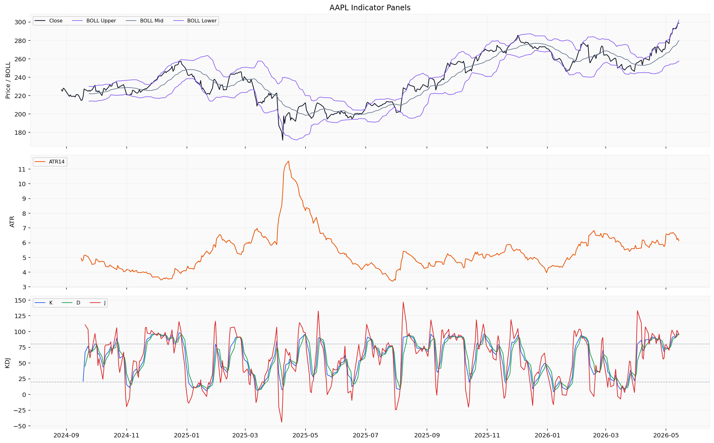
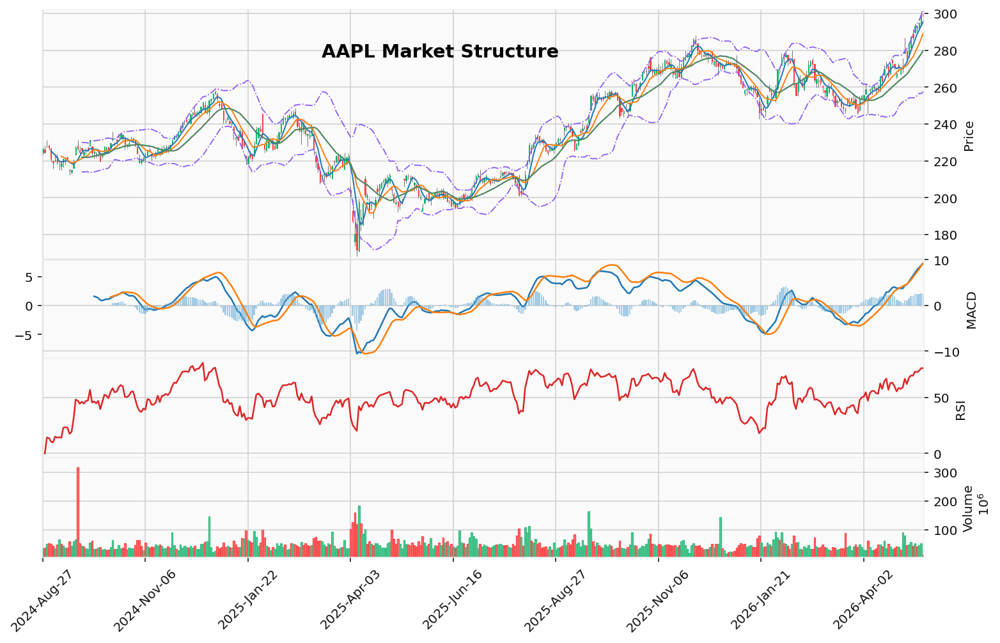

# Apple Inc.（AAPL）投资研究报告

## 一、投资结论与组合动作

**组合经理最终评级：Sell（卖出）**

**核心决策：** 本周内趁价格走强清仓全部AAPL多头头寸，目标退出区间 **$300–$305**。该决策基于三重收敛风险：极端估值（36.2倍市盈率、2.58倍PEG）、技术性衰竭信号（RSI 82、价格高于200日均线15.8%）、以及二元事件风险（特朗普-习峰会、CEO过渡）。在出现向 **$250–$260** 区间的修正之前不重建头寸——该区间与200日均线（$258）和历史回调低点重合。

**执行条件：**
- **卖出时间窗口：** 本周内完成退出，利用特朗普-习峰会前的流动性。
- **卖出方式：** 限价单设在 $300–$305，分批执行以降低滑点成本。
- **重新入场条件：** 等待价格回调至 $250–$260 区间，该位置提供约30–31倍前瞻市盈率，同时200日均线提供动态支撑。重新入场需要两个条件同时满足：(1) 技术指标正常化（RSI回落至中性水平）；(2) 基本面出现具体证据证明已安装设备基数仍在增长（如下季度财报显示设备激活量稳定或服务收入加速）。
- **重新入场时间预估：** 修正后1–3个月内，取决于催化剂和市场演变速度。

**仓位动作详解：**
- 如果持有完整多头头寸：本周内全部清仓。
- 如果因任何原因无法完全清仓：将止损收紧至 $279（布林带中轨）。收盘价低于该位置确认技术性破位，触发剩余仓位的防御性卖出。
- **不使用对冲替代策略：** 组合经理已明确拒绝"持有+对冲"的中间路线，原因在于（a）成本效益考量——$285行权价的看跌期权成本加上阶梯建仓计划，仍使核心仓位暴露于潜在13–16%的下跌风险；（b）历史教训——在过去相似的估值和技术条件下持有并对冲已经验证为无效策略。

**风险条件：**
- 不被视为长期持有的买入机会。组合经理明确警告"不要买入$285–$290的下跌"——那只是5%的修正，不提供安全边际。
- 对"这次不一样"叙事的明确拒绝。组合经理引用过去错误："上一次我在36倍市盈率、高于2.0的PEG且面临CEO过渡时持有，结果经历了15%的修正，因为我相信'这次不一样'。实际上并非如此。"
- 如果以上判断错误且股价突破 $310 而不回调，组合经理承认"可能错过一部分上行"，但认为当前风险/回报在组合层面上不支持持有。

**关键执行条件：**
- 卖出指令类型：限价单，目标 $300–$305
- 不可撤销条件：在特朗普-习峰会结果公布前完成卖出执行
- 再评估触发点：价格修正至 $250–$260 区间，且出现已安装设备基数增长的证据

---

## 二、技术指标分析

### 技术图表

### 2.1 图表结构与价格位置

截至2026年5月14日，AAPL收盘于 **$298.87**，略低于52周高点 $300.92。价格目前处于明确的多头排列结构之上：10 EMA（$289.78）> 50 SMA（$265.18）> 200 SMA（$258.19），金叉结构完整。但关键问题在于价格的**极端偏离程度**：

- 价格高于200日均线 **15.8%**（$298.87 vs $258.19）
- 价格高于50日均线 **12.7%**（$298.87 vs $265.18）
- 价格高于10 EMA **3.9%**（$298.87 vs $289.78）

**历史含义：** 在2025年7月、10月和2026年2月的最近三次超过80的RSI事件中，类似的极端偏离程度后均出现6–10%的回调。当前偏离程度处于同一区间，且正在加速。

### 2.2 均线系统

| 均线 | 当前值 | 趋势 | 状态 |
|---|---|---|---|
| **10 EMA** | $289.78 | 从3月低点$253上涨14.6%，火箭式上升 | 短期极度强势，但延伸过度 |
| **50 SMA** | $265.18 | 3月低点$262小幅回调后重新向上 | 维持金叉结构，但远低于现价 |
| **200 SMA** | $258.19 | 2025年9月$220至2026年5月$258，稳定上涨 | 长期牛市确认，但价格严重偏离 |

**关键观察：** 10 EMA从 $253 火箭式升至 $290 仅用不到两个月，历史上此类加速斜率不可持续。50 SMA 目前处于 $265，但价格已经大幅脱离该均线，意味着即使出现修正，50 SMA提供的支撑距离当前价格仍有约 $34 的空间（约11.4%的修正幅度）。

### 2.3 MACD动量信号

**当前读数（2026-05-14）：**
- MACD线：**9.256**
- MACD信号线：**7.306**
- MACD直方图：**1.950**

MACD在4月中旬形成金叉（约4月13-14日）。两条线均已转正并快速上升。直方图从4月初接近零的水平扩张至1.95，确认动能加速。

**风险信号：** MACD虽在上涨，但直方图1.95尚未达到2025年9月峰值（~1.64是当时高点）。这意味着动能仍有上行空间，但扩张速度极快——这种快速扩张通常不可持续。如果未来1-2周内直方图开始收缩或走平，将是动能耗竭的早期信号。

**失效条件：** MACD出现死叉将确认趋势反转。在2026年2月初的死叉后，股价从~$275跌至$248。

### 2.4 RSI动量信号

**当前RSI（2026-05-14）：82.08**

这是本次分析中最重要的警告信号：
- 5月11日：78.49
- 5月12日：76.00
- 5月13日：77.99
- **5月14日：82.08**

RSI已连续4天高于75，其中一天突破80。历史模式显示：
- **2025年7月：** RSI达到80-84后，股价从~$213回撤至~$200（-6%）
- **2025年10月底：** RSI达到84后，股价从~$270急跌至~$248（-8%）
- **2026年2月初：** RSI达到84后，股价从~$275跌至~$248（-10%）

**本次与前三次的关键差异：** 前三次RSI在80附近时，MACD已经走平或开始收缩。而当前MACD仍在加速上升。这意味着动能结构优于前三次，但RSI本身已进入历史极值区间。**组合经理判断：** 即使多头趋势未被破坏，RSI>80后的6-10%回调模式在当前情况下仍大概率重复。

**确认信号：** RSI跌破70将确认多头动能丧失，将是技术判断从"超买看跌"转为"趋势转弱"的关键信号。

### 2.5 布林带与波动率信号

**当前布林带值（2026-05-14）：**
- 上轨：**$301.57**
- 中轨（20 SMA）：**$279.87**
- 下轨：**$258.17**

当前收盘价 $298.87 位于上轨内。5月8日曾收于上轨上方（收盘$293.05 > 上轨~$291.12），随后回落到轨内，但上轨仍在向上扩展。

布林带宽度从3月20日的~30.85扩张至当前的 **43.40**。这种剧烈扩展确认了突破性上涨行情。当布林带在压缩后（3月底至4月初的窄幅区间）急剧扩张时，通常标志着强劲趋势运动的开始。但价格接近或触及上轨时要求谨慎。

**ATR（真实波幅）：6.54**

ATR从3月低点5.07上升至5月上旬的6.92，当前微降至6.54。相比2025年12月至2026年1月的~4.0，当前波动率仍处于高位。高ATR支持更宽的止损放置，但也意味着潜在的日均价格波动更大。

### 2.6 成交量与VWMA确认

**当前VWMA（2026-05-14）：288.03**

- **收盘价 vs VWMA：** $298.87 比 VWMA 高 $10.84（+3.8%溢价）
- **VWMA vs 50 SMA：** 288.03 远高于 265.18，确认高成交量日集中在上行方向
- **VWMA vs 10 EMA：** 288.03 略低于 289.78，属于快速上涨行情中的正常现象

**关键信号：** 5月1日的成交量突破（7990万股 vs 平均3700万股）发生在股价突破$280时，这是典型的机构建仓行为。但随后的交易日（5月5-13日）成交量在4500-5800万区间，低于突破日的峰值。**组合经理判断：** 这意味着突破后的跟进买盘正在减弱，是潜在的派发信号，而非机构持续建仓。

**看跌背离：** 收盘价与VWMA之间的差距在扩大，表明价格涨幅超过了成交量加权买盘，这是一种经典的衰竭信号。

### 2.7 支撑与阻力位

| 水平 | 价格 | 描述 |
|---|---|---|
| **即时阻力** | ~$300.92–301.57 | 52周高点 / 布林带上轨 |
| **短期支撑** | ~$289.78–288.03 | 10 EMA / VWMA簇 |
| **中期支撑** | ~$279.87 | 布林带中轨（20 SMA） |
| **主要支撑** | ~$265.18 | 50 SMA |
| **终极支撑** | ~$258.19 | 200日均线 |

### 2.8 失效条件

1. **收盘低于10 EMA（~$290）**：短期动能衰竭信号，确认超买后的回调开始
2. **MACD死叉**：趋势反转确认，此前两次死叉后均有8-10%的下跌
3. **收盘低于50 SMA（~$265）**：中期多头结构失效，标志着趋势从看涨转为震荡
4. **RSI跌破70**：多头动能丧失，确认前三次历史模式将继续重复

**技术判断总结：**
- 结构趋势：**强劲看涨**（金叉完整，MACD加速）
- 短期动量：**极度超买**（RSI 82+，价格偏离均线严重）
- 成交量：**确认但衰减**（突破后有跟进不足迹象）
- 波动率：**扩张中**（布林带宽度43.40，ATR 6.54）
- 组合经理采纳的技术立场：**看跌（极端延伸后的均值回归）**，目标回调至$250–$260区间

---

## 三、基本面分析

### 3.1 业务质量与收入趋势

苹果公司TTM营收 **$4514.4亿**，FY2025全年营收 **$4161.6亿**（yoy +6.4%）。收入结构正在经历从硬件向服务的结构性转变，这一转变对利润率有直接提升作用。

**季度营收趋势：**
- Q1 2026（12月季度）：**$1437.6亿** —— 苹果史上最大季度营收
- Q2 2026（3月季度）：**$1111.8亿** —— 季节性回落，但仍为历史第三高
- Q3 2025（6月季度）：**$940.4亿**
- Q4 2025（9月季度）：**$1024.7亿**

**组合经理评注：** 营收数据强劲，但市场已将这种强劲定价入内。真正的问题是**营收增长率是否足以支撑当前36倍市盈率**。苹果FY2025营收增长6.4%，而股价自FY2025年初以来上涨约40%，意味着估值扩张是推动股价的主要因素，而非盈利增长。

### 3.2 盈利能力与利润率

| 指标 | 最新读数 | 趋势 | 经营含义 |
|---|---|---|---|
| **毛利率** | 49.3%（Q2 2026） | 从FY2025 Q3的46.5%逐步上升 | 服务业务占比提升驱动利润率扩张，是一种结构性改善 |
| **营业利润率** | 32.3%（TTM） | 从30.0%提升 | 经营杠杆效应显著，收入增长额外贡献利润 |
| **净利润率** | 27.2%（TTM） | 全球科技巨头中最高的之一 | 代表强大的定价能力和成本控制 |
| **ROE** | 141.5% | 极高水平 | 受大规模股票回购推动，但也是盈利质量的证明 |
| **ROA** | 26.2% | 科技行业领先 | 资产使用效率极高 |

**毛利率趋势的核心意义：** 毛利率从FY2025 Q3的46.5%逐步上升至49.3%，这是由高利润服务业务占比提升驱动的结构性改善。服务业务毛利率超过70%，而硬件毛利率约49%。只要服务收入增速持续快于硬件，毛利率将持续上行。

**组合经理评注：** 毛利率扩张是真实的，但这个利好已经被市场充分认知并定价。2.58倍的PEG比率表明，投资者以当前价格买入时，已经假设未来几年的EPS增速将持续超过14%（36.2倍 / 2.58 ≈ 14%）。这是一个相当高的增长预期。

### 3.3 现金流与资本回报

- **TTM自由现金流：$1010.9亿** —— 全球科技公司中最高
- **经营性现金流TTM：~$1402亿**（Q2 2026 $287亿 + Q1 2026 $539亿 + Q4 2025 $297亿 + Q3 2025 $279亿）
- **资本开支（FY2025）：$127.2亿** —— 仅占营收的3%，极其资本轻便
- **股票回购（TTM）：约$790亿**（H1 FY2026 $370亿 + H2 FY2025 $420亿）
- **股息支付（TTM）：约$155亿**

**组合经理评注：** 苹果的现金产生能力是毋庸置疑的世界级。但关键问题在于：**$1010亿的自由现金流是否能支撑当前$4.388万亿的市值？** FCF收益率仅为2.3%（1010亿/43880亿），对于一个增长约14%的生意来说，这并不便宜。以历史标准衡量，苹果在2015-2019年期间FCF收益率通常在3-4%之间。

### 3.4 资产负债表与杠杆

| 指标 | 最新值 | 上年同期 | 变化 |
|---|---|---|---|
| **现金及短期投资** | $685.1亿 | $485.0亿 | +41.3% |
| **总债务** | $847.1亿 | $981.9亿 | -13.7% |
| **净债务** | $391.4亿 | $700.2亿 | -44.1% |
| **股东权益** | $1064.9亿 | $668.0亿 | +59.4% |
| **流动比率** | 1.07 | 0.82 | 显著改善 |
| **负债权益比** | 79.5% | 147.0% | 大幅改善 |

苹果在过去一年显著改善了资产负债表质量：现金储备增加了200亿美元，净债务减少了308亿美元，流动比率从负值转为正值。这在当前的宏观经济不确定性中提供了重要的财务缓冲。

**组合经理评注：** 资产负债表改善是一个真实的安全垫，但它不能单独支撑股价。苹果在2021年时净债务更高（约$700亿），但当时股价在$150左右。当前净债务更少（$391亿），但股价接近$300。这说明股价驱动因素已从资产负债表转向了对未来增长的预期——而增长预期正是当前最脆弱的一环。

### 3.5 估值讨论

| 估值指标 | 当前值 | 历史/行业参考 |
|---|---|---|
| **TTM P/E** | 36.22x | 5年历史中位数约28x |
| **前瞻P/E** | 31.22x | 基于FY2026预期EPS $9.57 |
| **PEG比率** | 2.58 | 行业均值通常1.0-2.0 |
| **市净率** | 41.15x | 极端高，反映无形资产主导 |
| **FCF收益率** | 2.3% | 2015-2019年通常在3-4% |
| **股息收益率** | 0.36% | 远低于10年期国债收益率 |

**组合经理结论：** TTM P/E 36.22倍处于苹果历史的顶部区间（过去10年最高约38倍），PEG比率2.58倍明确提示估值已超过盈利增速。市场已经为服务业务复合增长多年的完美情形定价。KeyBanc的专有数据表明硬件需求出现"初步裂痕"，这一信号直接威胁服务业务的驱动力——没有新设备就没有新订阅。

**削弱当前估值判断的经营信号：**
- 如果KeyBanc的硬件需求裂痕扩大，导致未来12个月设备销售低于预期 → 服务收入增长将放缓 → P/E将从36倍重新评级至30-32倍 → 对应股价$240-$260
- 如果Q3 2026（7月）财报显示服务收入增速降至15%以下 → 高估值的基础受到侵蚀

### 3.6 行业地位与经营风险

**竞争优势：**
- 全球超过20亿台活跃苹果设备，生态系统锁定效应极强
- 服务业务收入已超$1000亿年化收入规模，毛利率>70%
- 在智能手机行业中，苹果占据约85%的行业利润
- 品牌价值和用户忠诚度在全球消费者品牌中排名前列

**经营风险：**
1. **硬件收入集中度：** Q1（12月季度）占全年营收比重过高（约34%），一旦该季度表现不佳，全年业绩将严重承压
2. **产品周期依赖：** iPhone仍然是营收核心，创新节奏放缓可能导致升级周期延长
3. **中国制造依赖：** 虽然正在向印度和越南多元化，但iPhone组装仍高度集中在富士康的中国工厂
4. **台积电集中风险：** 苹果M系列和A系列芯片在台湾代工，任何台海地缘政治风险都是系统性威胁
5. **竞争加剧：** Google的AI生态（Gemini）正在成熟，可能对苹果的服务生态系统构成长期威胁

---

## 四、消息面、行业与宏观环境

### 4.1 CEO过渡——关键催化事件

**事件：** 苹果宣布CEO蒂姆·库克将于2026年9月1日卸任，由硬件工程高级副总裁约翰·特努斯（John Ternus）接任。

**机制与影响：**
- **领导不确定性：** 库克在任期间是全球最好的供应链管理者和资本配置者。特努斯是硬件工程师出身，从未担任过CEO，缺乏应对国会听证会、贸易战升级或全球供应链危机的实践经验。
- **对收入和成本的影响：** 短期（当前至9月）内，市场可能对苹果的战略连续性持观望态度，尤其关注特努斯在AI战略和资本配置方面的立场。中期来看，如果特努斯在9月iPhone 18发布会上表现稳健，不确定性溢价将消退。
- **对估值的冲击：** CEO过渡期间的执行风险溢价可能使P/E倍数收缩1-2倍。如果9月过渡不顺利，影响可能更大。

**组合经理采纳：** 组合经理明确拒绝"连续性"叙事，引用迪士尼CEO交接（鲍勃·伊格尔→鲍勃·查佩克）的教训，认为内部继任并非零风险。

### 4.2 特朗普-习北京峰会

**事件：** 美国总统特朗普与中国国家主席习近平在北京举行峰会，议程涵盖贸易、AI和关税。时间：2026年5月14-15日。

**机制与影响：**
- **对中国收入的直接影响：** 苹果约 **18-20%** 的营收来自大中华区（接近$800亿）。如果贸易谈判破裂导致关税升级，将直接侵蚀苹果在中国的定价能力和利润率。
- **对供应链的影响：** 苹果虽已向印度和越南多元化制造，但iPhone组装仍然高度依赖富士康中国工厂。任何供应链中断将影响产品交付。
- **当前市场定价：** VIX从3月高点31.05回落至约17，标准普尔500指数突破7300，纳斯达克创历史新高。市场正在为"建设性结果"定价。美财政部长贝森特暗示中国将下大额波音订单，也传递了积极信号。

**组合经理判断：** 这是一个真正的二元催化事件，而VIX 17的代价远未充分对冲这一风险。卖出全仓可以完全规避这一风险，而如果结果积极，损失的仅是峰会后的跳涨空间。

### 4.3 行业与AI竞争格局

- **Evercore ISI**（看多）：将目标价从$330上调至**$365**，牛市情景**$500**。核心逻辑：服务业务复合增长（App Store、Apple Music、iCloud、Apple Pay、Apple Intelligence订阅）。
- **KeyBanc**（谨慎）：基于专有消费数据，认为苹果估值"过于紧张"，且硬件需求出现"初步裂痕"。
- **Google "复仇"叙事：** 媒体报道指出，经过19年后，Google凭借Gemini AI生态可能对苹果移动霸主地位发起更积极挑战。Google不需要卖出更多手机，只需卖出更多AI订阅。如果Google的AI助手成为主导平台，苹果的生态系统护城河将面临真正的侵蚀。
- **苹果AI节奏争议：** 苹果更注重隐私的AI策略被一部分人视为战略差异点，被另一部分人视为落后。在NVDA、MSFT和GOOGL因AI执行受到市场重奖的同时，苹果仍在追赶。

**对组合动作的影响：** 这些事件对当前判断是**支持性**的——它们加剧了市场对苹果估值可持续性的质疑，强化了卖出决策的合理性。

### 4.4 宏观背景

- **美国股市：** 标准普尔500指数首次突破7300，道指重回50000以上，纳斯达克创历史新高。6个连续季度的盈利增长为市场提供了强劲基本面支撑。
- **波动率：** VIX从3月31.05降至约17（-28%），受益于伊朗和平谈判、油价下跌和强劲财报季。
- **债券市场警告：** 尽管股票市场表现强劲，但债券收益率仍然足够高，为无风险回报提供了竞争。部分宏观投资者正在对冲过高估值。

---

## 五、市场情绪与交易结构

### 5.1 多空叙事差异

| 叙事 | 核心逻辑 | 情绪强度 |
|---|---|---|
| **多头（服务复合增长）** | 服务业务收入>$1000亿，毛利率>70%，FCF>$1000亿，Evercore目标价$365-$500 | 强烈乐观（共识级别） |
| **空头（估值与硬件疲软）** | 36.2x P/E，2.58x PEG，KeyBanc数据表明硬件需求裂痕，CEO过渡风险 | 谨慎但占比小 |
| **中性（持有+对冲着陆）** | 承认多头结构性逻辑，但建议对冲和阶梯建仓 | 战术性谨慎 |

**组合经理判断：** 多头叙事已完全成为市场共识，这正是危险所在。组合经理引用历史上Cisco（2000年，100倍PE）和Amazon（2021年，300倍PE）的例子，说明"共识变成自满"的经典模式。

### 5.2 情绪脆弱点

1. **$300技术阻力位：** 52周高点$300.92是一个关键心理关口。多次试图突破但未能站稳的情绪累积，本身就是一种脆弱信号。
2. **RSI >80的第三次重复：** 前两次RSI>80后均发生6-10%回调，市场可能对"这次不一样"产生自我怀疑。
3. **二元峰会结果不确定性：** 市场已经为"积极结果"定价，一旦结果偏向负面，情绪反转将非常剧烈。
4. **CEO过渡叙事分歧：** 社交媒体和投资圈对特努斯的能力存在真实分歧，这种分歧在9月过渡完成前将持续。

### 5.3 可能的确认信号
- 收盘突破$301，成交量高于均值（>5000万股），确认突破 → 可能触发追涨买盘至$310+
- 峰会结果积极，贸易协议签署 → AAPL可能跳涨至$305-$310

### 5.4 反向信号
- 峰会结束后无协议，关税升级 → 立即跌至$280-$285
- 特努斯做出任何被认为是战略方向性调整的言论（如削减资本回报、改变中国战略） → 执行风险溢价上升

**对组合经理立场的强化：** 当前情绪处于"共识乐观但脆弱"的状态，这与组合经理卖出决策高度一致——在市场情绪最乐观、同时存在多重脆弱点的情况下退出，是风险管理的最佳时机。

---

## 六、交易计划与组合风险

### 6.1 仓位与进场/退出计划

**核心动作：** 清仓全部AAPL多头头寸（组合经理决策，已由汇报阶段确认）。

**执行细节：**
- **卖出工具：** 市价单或限价单设在 **$300-$305**
- **执行窗口：** 本周内（2026年5月第3周），优先在特朗普-习峰会结果公布前完成
- **分批计划：** 分2-3批执行，减少市场冲击成本
- **头寸规模：** 全额卖出，不保留任何核心头寸

**执行理由：** 组合经理讨论中明确解释——在当前$300附近退出，组合可以锁定过去数月的涨幅，避免在"估值极端、技术上过度延伸、二元风险事件前"持有。过去在类似条件下的持有经验（经历15%回调）证明了当前决策的审慎性。

**风险代价：** 如果峰会结果积极且市场继续上涨至$310甚至更高，组合将错失这部分收益。组合经理已明确承认这个可能，但是责任是管理风险/回报，不是追求最后1%的收益。

### 6.2 止损与降风险条件

**如果无法完全退出（仅适用于遗留头寸）：**
- 止损设在 **$279**（布林带中轨）
- 止损逻辑：收盘低于布林带中轨确认技术性破位，标志中期多头结构受到威胁，且距200日均线（$258）还有约8%的空间，需要风险控制

### 6.3 重新入场条件

| 条件 | 具体标准 | 触发动作 |
|---|---|---|
| **价格修正** | 股价回调至$250-$260区域 | 启动重新入场评估 |
| **技术正常化** | RSI回落至50-60区间，价格回到200日均线附近 | 确认技术风险释放 |
| **基本面确认** | 后续财报显示设备激活量稳定或服务收入加速 | 确认服务业务增长动力未破 |
| **催化剂** | 峰会结果明朗、CEO过渡平稳 | 降低不确定性溢价 |

**重新入场方式：**
- 考虑在$250-$260区间分批建仓，先建立约50%的目标头寸
- 剩余50%待股价在该支撑区企稳后加仓
- 不使用杠杆，初始仓位规模为原头寸的60-70%（因市场环境变化）

**失效条件：** 如果股价在$250-$260未出现止跌信号（如持续放量下跌、财报显示硬件收入加速恶化、或CEO过渡出现严重问题），则放弃重新入场，等待更低水平或更强证据。

### 6.4 时间窗口与情景分支

| 情景 | 概率评估（组合经理隐含） | 应对 |
|---|---|---|
| **峰会积极 + 技术回调至$280** | 中等 | 已经退出，等待$250-$260重入 |
| **峰会积极 + 突破$310** | 低但存在 | 接受错过部分上行，不追涨 |
| **峰会消极 + 跌至$260-$270** | 中等 | 验证卖出决策的正确性，考虑在$250-$260重新评估 |
| **峰会结果模糊 + 横盘$280-$300** | 中高 | 持币观察，等待更明确的催化剂 |
| **CEO过渡出现意外变动** | 低 | 视具体变化重新评估苹果的战略方向和风险溢价 |

### 6.5 争议点整理

**保守派风险分析师 vs 激进派风险分析师的辩论：**
- **保守派（与组合经理一致）：** 卖出是纪律的体现，保护资本免受二元风险和极端技术延伸的影响。$250-$260的重入目标并非"幻想"，而是前三次RSI>80后6-10%回调的实际历史均值。激进派的"持有并买入下跌"策略忽视了过去三个周期顶部的模式。
- **激进派：** 卖出是错失69%上行空间（以Evercore $500牛市目标计算）的错误。估值过高是"短视"的，忽略了苹果服务业务的结构性变化。RSI>80在强势行情中不是卖出信号，而前三次回调后最终都创下新高。
- **中性派：** 建议持有70-80%核心头寸，买入$285行权价的看跌期权对冲峰会风险，并设置阶梯式买入计划（$290买入25%、$279再买25%、$265买入50%）——这个中间路线组合经理拒绝采用，认为成本高且核心仓位仍暴露于风险。

**组合经理最终采纳：** 保守派风险分析师的立场。中性派的对冲成本（$285看跌期权）加上阶梯计划，仍使核心头寸暴露于6-10%的修正中。在36倍PE、PEG 2.58、RSI 82+的背景下，持有等待的风险不值得冒。

---

## 七、关键分歧与跟踪条件

### 7.1 核心分歧：服务业务估值合理还是过度？

| 视角 | 观点 | 论据 | 组合经理立场 |
|---|---|---|---|
| **多头研究员** | 36.2x PE合理，因为$1010亿FCF和27.2%净利润率支持高估值 | 服务收入>$1000亿、15%+增速、>70%毛利率、Evercore $365目标价 | 拒绝 |
| **空头研究员** | 估值已反映多年的完美执行，2.58倍PEG明确显示估值超过增速 | KeyBanc数据初步裂痕、服务增长依赖硬件基数扩张、营收增速仅6.4% | 采纳 |

**采纳原因：** 组合经理判定，多头研究员的论据本质上是**叙述驱动**：服务业务确实优秀，但市场已经在定价中完全反映甚至过度反映了这种优秀。KeyBanc专有数据是一个无法忽视的"硬数据"，直指服务增长引擎的燃料（新硬件设备销售）正在减速。这就是为什么组合经理称"多头是对的，但市场已经将这种完美定价"。

### 7.2 技术信号：高位衰竭还是仍有空间？

| 视角 | 观点 | 论据 | 组合经理立场 |
|---|---|---|---|
| **多头** | 金叉完整，MACD加速，突破日成交确认机构建仓 | 5月1日超量成交7990万股、VWMA上升、MACD直方图1.95未达前高 | 拒绝 |
| **激进派** | RSI>80后每次回调都是买入机会 | 前三次RSI>80后股价最终创下新高 | 拒绝 |
| **空头** | 这轮是第三次重复衰竭模式，不例外 | 前三次RSI>80后6-10%回调、价格偏离均线极端值、成交量衰减 | 采纳 |

**采纳原因：** 关键论据是**历史模式的三次验证**：每次RSI>80后1-3周内都出现可观回调。激进派"每次回调后创新高"的说法正确，但那是**长期**视角。对于**交易**决策，6-10%的回调风险在当前36倍PE和二元风险背景下是不可接受的。

### 7.3 CEO过渡：风险还是连续性？

| 视角 | 观点 | 论据 | 组合经理立场 |
|---|---|---|---|
| **多头** | 连续性，特努斯是M芯片架构师 | 库克是内部继任者、M系列芯片成功经验、稳定过渡 | 拒绝 |
| **空头** | 执行风险被忽略 | 硬件工程师未测试CEO、迪士尼查佩克先例、$4.4万亿公司的一次失误代价巨大 | 采纳 |

**采纳原因：** 组合经理援引迪士尼CEO交接失败的经典案例来支撑这一判断。即使内部继任者通常有更高的成功率，"一次失败的代价"对于$4.4万亿市值的公司来说过于巨大，在36倍PE下任何不确定性溢价的上升都将对股价造成显着影响。

### 7.4 分歧未解决：中国峰会最终结果

所有分析师都认同峰会是一个二元事件，但对结果概率没有一致意见。组合经理选择用**完全退出来规避这个不确定性**，而不是押注任何一方：

- 多头研究员相信"市场正在定价积极结果"，且供应链多元化（印度、越南）降低了风险
- 空头研究员警告"18-20%的中国收入无法一夜之间替代"，且台积电集中度风险是系统性的
- 组合经理不判断结果，但评估风险/回报不偏向持有

### 7.5 跟踪条件——什么会改变当前判断

**可能使当前卖出判断失效的数据：**
1. **峰会成功后签订贸易协议：** 降低中国收入风险溢价，但如果股价已执行卖出，需要新的P/E重评证据重组
2. **FQ3 2026财报（7月）显示服务收入增速超18%：** 证明服务业务增长独立于硬件，削弱KeyBanc"裂痕导致服务放缓"的假设
3. **特努斯在9月前做出明确的战略承诺（如保持或增加回购规模）：** 降低CEO过渡不确定性溢价
4. **股价修正至$250-$260区间后企稳走强：** 符合组合经理重新入场框架，届时将重新评估

**可能进一步强化卖出判断的数据：**
1. **峰会结束后无积极成果或关税升级：** 直接打击$800亿中国收入的前景
2. **KeyBanc或其他数据源显示设备需求裂痕扩大至欧洲或亚太市场：** 确认硬件放缓是全球性而非区域性
3. **特努斯在过渡期间做出任何被认为是"方向性偏离"的声明**（如削减服务业务投资回报、改变中国战略等）
4. **FQ3 2026财报显示服务收入增速降至12%以下：** 直接打击高估值的基础

---

## 八、最终结论

**组合经理最终决策：卖出，卖出，卖出。**

苹果（AAPL）当前在 $298.87 附近的交易价格，代表了一个无法长久维持的风险/回报失衡状态。三重风险——36.2倍市盈率且PEG 2.58的极端估值、RSI 82+且价格高于200日均线15.8%的技术衰竭、以及特朗普-习峰会结果与CEO过渡的双重不确定性——汇聚成一个不可忽视的信号。

组合经理没有选择看似合理的"对冲+持有"路线，而是做出了明确的撤退决定。背后的逻辑来自两个方向的证据链：空头研究员用KeyBanc专有数据和历史技术模式构建了一个扎实的风险论据，而多头即使拥有令人信服的服务业务增长叙事，其核心问题在于"市场已经将一切完美定价"——而完美在金融市场上几乎不存在。过去的教训——在一个同理情形下持有并通过15%的修正——已经验证了"故事"不能抵挡"数字"。

执行路径同样清晰：本周内以 $300-$305 的限价单出售全部AAPL头寸。之后保持耐心，等待价格修正至 $250-$260 区间——在那里，200日均线（$258）提供动态支撑，市盈率重回30-31倍水平，RSI已回归中性，且峰会结果和CEO过渡情况都更加明朗——再重新评估是否重新入场。

这不是对苹果长期投资价值的质疑。它是一个关于风险管理的决策：在价格已经完美反映了一切美好事物的时候，选择退出，避免为一个不必要的风险集中支付代价。
