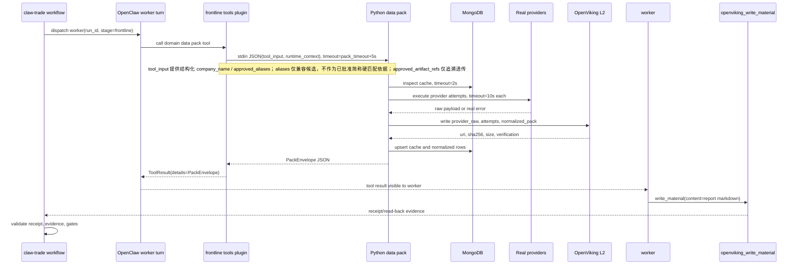
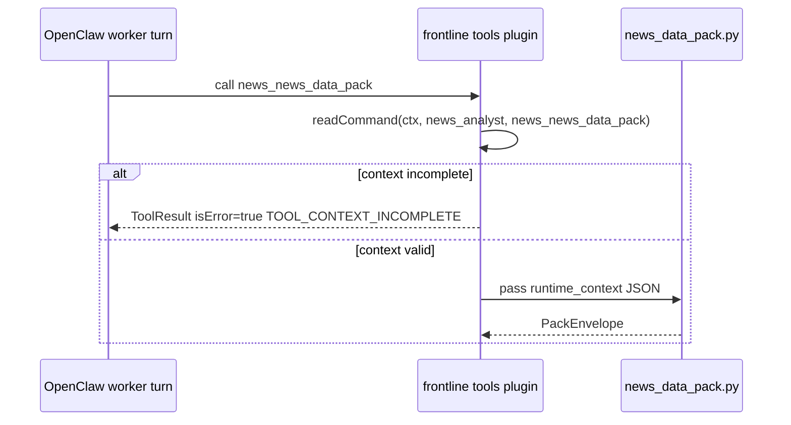
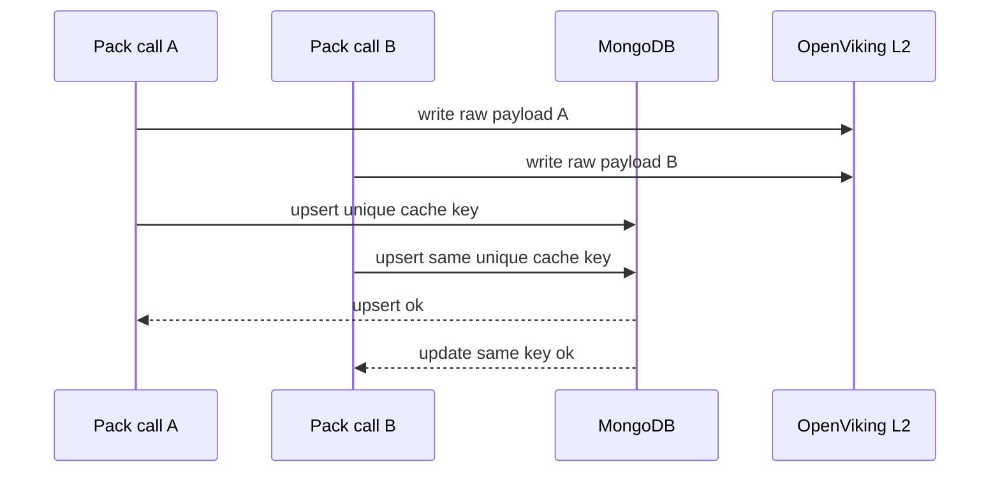

# CN_A frontline provider 矩阵资料层详细设计

## 1. 文档元信息

对应 HLD：`docs/CN_A_frontline_provider矩阵资料层落地方案.md`

对应 HLD 版本：`v0.1`

详细设计版本：`DLD v0.1`

日期：`2026-05-08`

适用范围：CN_A `/report` 前线四个 worker 的资料获取链路：

- `market_analyst`
- `fundamental_analyst`
- `news_analyst`
- `social_analyst`

变更历史：

| 版本 | 日期 | 变更 | 作者 |
|---|---|---|---|
| DLD v0.1 | 2026-05-08 | Initial | Codex |
| DLD v0.2 | 2026-05-08 | Close architecture review blockers | Codex |
| DLD v0.2.1 | 2026-05-08 | 接口签名补正：`insert_provider_attempt` 增加 `domain/worker_id` 入参 | Codex |
| DLD v0.3 | 2026-05-10 | 明确 workflow handoff 禁止 JSON：worker 之间只传自然语言材料或 report | Codex |

设计边界：

- `claw-trade` 控制 workflow 顺序、dispatch、artifact approval、hard gate 和导出。
- OpenClaw 只执行单 worker turn、可见工具收窄、最终 provider payload capture、工具调用。
- 四个前线 worker 只看到本领域资料包工具和 `openviking_write_material`。
- 底层 provider 只在资料包内部被调用，不暴露给 worker。
- Python 数据层只供料、结构化、记录证据和诊断，不写报告、不评级、不改 PM 决策。
- MongoDB 只做结构化缓存和去重；OpenViking 只做 L1/L2 证据和材料流转；下游读取仍以 `claw-trade` approved manifest 为准。
- 2026-05-10 起，正式 workflow handoff 不允许使用 JSON/pack/provider attempts 作为 worker 之间的材料中转。worker prompt、工具返回正文、OpenViking L1 正式材料和下游 handoff 必须是自然语言材料或自然语言 report。JSON 只允许作为工具协议、provider 内部处理、MongoDB/cache、evidence/log 使用，不进入 worker 可见正文，也不得作为 worker 之间的主材料。

## 2. 术语表与约定

对应 HLD §1-§20

### 2.1 延用 HLD 术语

| 术语 | 含义 | 对应 HLD |
|---|---|---|
| CN_A | 中国 A 股市场 profile | §1 |
| `/report` | 投研报告 workflow 入口；普通 chat 不自动进入前线资料流程 | §1, §4, §15.4 |
| frontline | 前线分析阶段，包含 market、fundamental、news、social 四个 worker | §1, §4 |
| worker | OpenClaw 唤醒的一次真实 agent turn；不是 Python 函数 | §3.1, §4 |
| 资料包工具 | worker 可见的单入口供料工具，例如 `market_market_data_pack` | §1, §4, §5 |
| provider | 资料包内部真实数据源适配层，例如 AkShare、EastMoney direct、Bocha | §3.2, §6-§9 |
| provider 矩阵 | 每个领域按 P0/P1/P2 顺序尝试的 provider 集合 | §6.3, §7.2, §8.2, §9.2 |
| provider attempt | 每次 provider 调用或缓存检查的审计记录 | §5.2 |
| MongoDB cache | 结构化缓存、去重、新鲜度与 schema 校验层 | §3.3, §11 |
| OpenViking L1 | worker 正式报告材料层 | §3.3, §12 |
| OpenViking L2 | provider raw payload、pack、charts、attempts 的证据层 | §3.3, §12 |
| approved manifest | `claw-trade` 批准给下游读取的材料清单 | §3.3 |
| `reader_brief` | 面向 worker 的中文事实材料正文，只能写自然语言事实、来源说明和缺口，不写 JSON、URI 主体或投资结论 | §5, §6.5, §9.3 |
| `quality.status` | 资料包质量状态：`complete`、`partial`、`failed` | §5.1 |
| field sources | 字段级来源索引，绑定 provider、endpoint、payload hash 和 L2 ref | §5 |
| raw payload refs | provider 原始返回写入 OpenViking L2 后的 URI 列表 | §5, §12 |
| AlphaEar | 可拆零件复用的金融 skill 集合，不是正式资料层权威 | §3.4, §6.4 |
| Tushare | 矩阵内权限型资料源；默认进入启用目标，缺 token、缺权限或合同不完整时必须显式失败，不得静默关闭或伪装成功 | §1, §9.1, §19 |

### 2.2 详细设计新增内部术语

| 术语 | 含义 |
|---|---|
| 资料包编排器 | 一个领域内负责输入规范化、缓存检查、provider 计划、provider 执行、证据写入、质量计算和 brief 生成的模块 |
| 运行上下文 | OpenClaw 传入工具的 `run_id/stage/worker_id/call_id/tool_name/evidence_root/current_date` |
| 查询指纹 | 对规范化查询参数做稳定 JSON 序列化后的 SHA-256 值 |
| 证据指针 | 指向 raw payload、attempt、chart 或 pack 的 URI、sha256、size bytes 和来源字段集合 |
| 当前主线 provider | HLD 明确列为 P0/P1 且仓库依赖或运行配置已存在的 provider |
| 增强源 | HLD 列为 P2、商业搜索、需登录来源或权限型来源；2026-05-09 人工裁决后不再默认关闭，矩阵内来源均进入启用目标；缺 endpoint/auth/params/response/rate limit/contract 时必须显式失败，不得用关闭状态隐藏缺口 |

### 2.3 2026-05-09 人工裁决：Tushare 主源与矩阵源默认打开

本裁决覆盖本文旧版中所有“增强源关闭、disabled、只写 `config_blocked`、不参与成功判定”的主线口径。

- CN_A 所有可由 Tushare 覆盖的数据域，默认以 Tushare 为第一主源；免费源（AkShare、EastMoney direct、Sina、Tencent、Baostock、efinance 等）是备源、补源或交叉校验源，不再反过来以免费源为主。
- Tushare 初始化统一使用 `src/claw_trade/providers/tushare_client.py`。默认走 Tushare SDK 标准地址，不设置 `pro._DataApi__http_url`；只有显式配置 `TUSHARE_HTTP_URL` 或 `CN_A_TUSHARE_HTTP_URL` 时才设置私有 HTTP URL。token 只允许来自环境变量或函数参数，不得写入代码、文档或日志。
- 若出现 `token invalid`，先检查运行环境实际生效的 `TUSHARE_TOKEN`，再确认当前环境是否需要显式私有代理 URL 配置。
- provider 矩阵内列出的来源均为应启用目标；不能因为是 P1/P2、搜索源、雪球/股吧、Tushare、Baostock、efinance 或商业搜索就默认关闭。
- 缺密钥、缺权限、缺 endpoint 合同、缺响应字段合同、缺 rate limit 策略、未实现调用器时，必须在 preflight 或 attempt 中显式暴露为失败证据，并影响 `quality.status`；不得伪装成成功，也不得让 `complete` 绕过这些缺口。
- `config_blocked/PROVIDER_NOT_ENABLED` 仅保留为旧证据兼容状态；新实现不得把它作为“默认关闭增强源”的正常路径。
- 打开来源不等于让 Python 写结论。provider 只提供证据；worker 报告仍只能基于可见资料包，PM 决策仍归 portfolio manager。

### 2.4 通用约定

- 目标语言：Python 3.12 typed pseudocode；仓库实际 `requires-python` 为 `>=3.12`。
- Node 插件：只负责 OpenClaw 工具注册、运行上下文传递、Python 子进程调用和协议错误返回。
- 日期：`YYYY-MM-DD`；时间：UTC ISO 8601，带 `Z` 或明确 offset。
- 股票代码：输入允许 `600519`、`600519.SH`、`SH600519`；内部规范化为 `600519.SH`。
- schema 版本：统一外壳为 `cn_a_frontline_pack.v1`；领域 pack 可在 `domain_data.schema_version` 标注细分版本。
- `ok=true` 只表示工具返回可解析资料包；资料是否足够由 `quality.status` 决定。
- 不在 report、日志、attempt、brief 中输出 token、API key、完整连接串或带认证信息的 URL。

## 3. 系统上下文与部署视图（对齐 HLD）

对应 HLD §1、§3、§4、§10、§11、§12、§13、§15、§17、§18

### 3.1 部署拓扑

```text
UI / CLI / test /report
  |
  v
claw-trade workflow controller
  |
  | 同步 dispatch，一个 dispatch 唤醒一个 worker
  v
OpenClaw single worker turn
  |
  | stage/profile 收窄后的可见工具
  v
openclaw_plugins/claw-trade-frontline-tools/index.js
  |
  | stdin/stdout JSON 调用 Python 资料包脚本
  v
agents/{worker}/skills/cn-a-*-data/scripts/{domain}_data_pack.py
  |
  +--> MongoDB 结构化缓存
  +--> provider 真实远端来源
  +--> OpenViking L2 证据写入
  +--> 本地 run evidence 审计副本
  |
  v
worker 基于资料包写中文 Markdown 报告
  |
  v
openviking_write_material(content=...)
  |
  v
claw-trade receipt/evidence/gate validation
```

HLD 明确“不修改 OpenClaw 源码”，因此本设计不新增 OpenClaw 内部服务、协议或端口。

### 3.2 节点与资源预估

| 节点 | 进程/容器 | 入站端口 | 网络分区 | CPU | 内存 | 磁盘 | 连接池/并发 |
|---|---|---:|---|---:|---:|---:|---|
| `claw-trade` workflow | 现有 Python 进程 | 不新增 | 可访问 OpenClaw runtime | 1 vCPU | 512 MiB | run evidence 索引 10-200 MiB/run | dispatch 串行或由 workflow 控制 |
| OpenClaw runtime | 现有 Node/TS runtime | 沿用现有配置 | 可执行 plugin tool | 1 vCPU | 1 GiB | session/provider payload evidence | 单 worker turn |
| frontline tools plugin | OpenClaw plugin Node 模块 | 不新增 | 可启动 Python 子进程 | 0.5 vCPU | 256 MiB | stderr/stdout 临时缓冲小于 5 MiB | 每个 worker turn 1 次资料包 |
| Python 资料包脚本 | OpenClaw 工具执行环境内子进程 | 不新增 | 出站 HTTPS、MongoDB、OpenViking | 1 vCPU | 512 MiB | raw JSON/chart 5-100 MiB/run | provider 并发最大 3 |
| MongoDB | 部署环境提供 | 由 `CN_A_MONGODB_URI` 指定 | 仅受控网络访问 | 2 vCPU | 4 GiB | 初始 20 GiB，按 TTL 清理 | `maxPoolSize=5` |
| OpenViking | 现有材料存储能力 | 沿用现有配置 | 工具执行环境可写 L2/L1 | 1 vCPU | 1 GiB | 原始证据和材料按 run 增长 | client pool 5 |
| 真实 provider | 外部 HTTPS 来源 | 不适用 | 仅出站访问 | 不适用 | 不适用 | 不适用 | 单 endpoint timeout 10s |

本 DLD 不新增入站端口；OpenClaw 监听端口沿用仓库现有运行时配置；MongoDB 数据库名必须来自 `CN_A_MONGODB_URI` 的 path；OpenViking L2 访问参数由 §4.5.3 与 §7.1 的环境变量固定；每日 run 数不参与资料包编码合同，容量阈值按 §4.12 运维指标执行。

### 3.3 网络与安全边界

- worker 只能通过 stage policy 看到本领域资料包工具与 `openviking_write_material`。
- provider 原子能力不注册为 worker 可见工具。
- Python 资料包可访问 MongoDB、OpenViking L2 写入能力和已启用 provider。
- MongoDB URI 必须由环境注入；带认证信息时必须在 URI 中显式提供认证库。
- provider API key 只允许由环境变量注入；缺 key 的 provider 必须记录 `auth_missing` 或等价显式失败，不能假装成功，也不能被当作“默认关闭”。
- `claw-trade` gate 可读取 L2 evidence、attempts、cache refs 和 pack；worker 不读取 raw payload。

## 4. 模块详细设计

### 4.1 工具注册与运行上下文模块（对应 HLD §1、§4、§7.1、§13、§14 M3、§15.2、§16）

#### 4.1.1 职责与边界

MUST：

- 在 `openclaw_plugins/claw-trade-frontline-tools/index.js` 注册四个资料包工具：
  - `market_market_data_pack`
  - `fundamental_fundamentals_data_pack`
  - `news_news_data_pack`
  - `social_social_sentiment_pack`
- 从 `ctx.singleWorkerCommand` 读取并校验 `run_id/stage/worker_id/call_id/evidence_dir/runtime_vars`。
- 将 `tool_input` 与 `runtime_context` 通过 stdin JSON 传给 Python 资料包入口。
- 子进程 timeout 后返回结构化协议错误，并保留 stderr 脱敏摘要。
- 保持 worker 可见工具为本领域资料包工具与 `openviking_write_material`。

MUST NOT：

- 不在 Node 插件中选择 provider。
- 不在 Node 插件中生成报告正文、评级、目标价或 PM 决策。
- 不把 provider 原子接口注册为 worker tool。
- 不修改 OpenClaw 源码。

依赖关系：

| 上游 | 本模块 | 下游 | 调用方式 |
|---|---|---|---|
| OpenClaw runtime | 工具注册模块 | Python 资料包入口 | 同步，stdin/stdout JSON |
| 工具注册模块 | OpenClaw runtime | ToolResult | 同步返回 |

#### 4.1.2 核心数据结构

```ts
// Language: TypeScript
type FrontlineToolName =
  | "market_market_data_pack"
  | "fundamental_fundamentals_data_pack"
  | "news_news_data_pack"
  | "social_social_sentiment_pack";

type FrontlineWorkerID =
  | "market_analyst"
  | "fundamental_analyst"
  | "news_analyst"
  | "social_analyst";

interface PackToolParams {
  ticker?: string;                // 可空；工具 schema 允许为空，但 Python 会按领域校验必填
  market?: string;                // 可空；CN_A 主线必须解析为 CN_A
  company_name?: string;          // 可空；优先使用 runtime_vars 或 approved artifact 解析
  industry?: string;              // 可空；news/social 匹配可用
  start_date?: string;            // 可空；YYYY-MM-DD；为空由领域默认窗口生成
  end_date?: string;              // 可空；YYYY-MM-DD；为空使用 current_date
  aliases?: string[];             // 可空；不得信任为 approved aliases，必须经 profile 模块确认
  approved_artifact_refs?: unknown[]; // 可空；只允许传引用，不传未批准全文
}

interface ToolRuntimeContext {
  run_id: string;         // 非空；workflow run id
  stage: string;          // 非空；frontline
  worker_id: FrontlineWorkerID; // 非空；必须匹配 tool_name
  call_id: string;        // 非空；OpenClaw tool call id
  dispatch_id: string;    // 非空；当前等于 call_id，后续如有独立 dispatch id 由 workflow 注入
  tool_name: FrontlineToolName; // 非空
  evidence_root: string;  // 非空；位于当前 run evidence_dir 下
  current_date?: string;  // 可空；YYYY-MM-DD
  current_time: string;   // UTC ISO 8601
}

interface PythonToolPayload {
  tool_input: PackToolParams;        // JSON object，不允许为数组
  runtime_context: ToolRuntimeContext; // JSON object
}
```

#### 4.1.3 接口定义

内部接口：

```ts
function readCommand(
  ctx: unknown,
  expectedWorkerId: FrontlineWorkerID,
  toolName: FrontlineToolName,
): RuntimeCommand;

function buildToolInput(
  runtimeVars: Record<string, unknown>,
  params: Record<string, unknown>,
  requiredFields: string[],
): PackToolParams;

function buildRuntimeContext(
  runtime: RuntimeCommand,
  toolName: FrontlineToolName,
): ToolRuntimeContext;

async function runPythonJson(
  args: string[],
  payload: PythonToolPayload,
  options: { pythonPathDirs?: string[]; timeoutMs?: number },
): Promise<{ exitCode: number; stdout: string; stderr: string; parsed?: unknown }>;
```

参数验证：

- `ctx.singleWorkerCommand` 必须存在且为 object。
- `worker_id` 必须等于该工具绑定 worker。
- `run_id/call_id/stage/evidence_dir` 均为非空字符串。
- `params` 必须是 object；非 object 直接返回 `TOOL_PARAMS_INVALID`，不得套用默认输入。
- `timeoutMs` 必须为正整数；未配置时按领域默认值。

外部接口：

| 工具 | 协议 | 请求 schema | 响应 schema | 幂等性 | 限流 | 调用频次 |
|---|---|---|---|---|---|---|
| `market_market_data_pack` | OpenClaw tool | `PackToolParams` | `PackEnvelope` | 同一 `call_id` 的 evidence 目录不可覆盖 | 每 worker turn 1 次 | 每个 CN_A market turn 1 次 |
| `fundamental_fundamentals_data_pack` | OpenClaw tool | `PackToolParams` | `PackEnvelope` | 同上 | 同上 | 每个 CN_A fundamental turn 1 次 |
| `news_news_data_pack` | OpenClaw tool | `PackToolParams` | `PackEnvelope` | 同上 | 同上 | 每个 CN_A news turn 1 次 |
| `social_social_sentiment_pack` | OpenClaw tool | `PackToolParams` | `PackEnvelope` | 同上 | 同上 | 每个 CN_A social turn 1 次 |

错误码：

| code | 含义 | 可恢复 | 传播路径 |
|---|---|---|---|
| `TOOL_RUNTIME_CONTEXT_MISSING` | 缺 single worker runtime context | 否 | ToolResult `isError=true` |
| `TOOL_PARAMS_INVALID` | 工具参数不是 JSON object 或字段类型非法 | 否 | ToolResult `isError=true` |
| `TOOL_WORKER_MISMATCH` | worker 与工具不匹配 | 否 | ToolResult `isError=true` |
| `TOOL_CONTEXT_INCOMPLETE` | run/stage/call/evidence 字段缺失 | 否 | ToolResult `isError=true` |
| `TOOL_SUBPROCESS_TIMEOUT` | Python 子进程超时 | 可重跑当前 worker | ToolResult `isError=true` |
| `TOOL_PROTOCOL_ERROR` | stdout 不含合法 JSON | 否 | ToolResult `isError=true` |

#### 4.1.4 核心算法与业务流程（伪码级）

```text
FUNCTION ExecuteFrontlineTool(ctx, params, tool_name, expected_worker, script_path):
    runtime = ReadCommand(ctx, expected_worker, tool_name)
    IF runtime IS ERROR:
        RETURN ToolError(runtime.code)

    tool_input = BuildToolInput(runtime.runtime_vars, params, RequiredFields(tool_name))
    runtime_context = BuildRuntimeContext(runtime, tool_name)
    payload = {"tool_input": tool_input, "runtime_context": runtime_context}

    result = RunPythonJson(script_path, payload, timeout=ToolTimeout(tool_name))
    IF result.exit_code == 124:
        RETURN ToolError("TOOL_SUBPROCESS_TIMEOUT", stderr=Redact(result.stderr))
    IF result.parsed IS NULL:
        RETURN ToolError("TOOL_PROTOCOL_ERROR", stderr=Redact(result.stderr))

    RETURN ToolResult(details=result.parsed, isError=false)
```

复杂度：输入校验 O(1)，stdout 解析 O(n)，n 为 stdout 字节数。

并发边界：单次工具调用只启动一个 Python 子进程；provider 并发在 Python 资料包内部控制。

#### 4.1.5 状态机

| 状态 | 触发 | 下一状态 | 失败处理 |
|---|---|---|---|
| `registered` | OpenClaw plugin 加载 | `context_checked` | 注册失败则 worker 不可调用工具 |
| `context_checked` | runtime context 合法 | `python_started` | 返回 `TOOL_CONTEXT_INCOMPLETE` |
| `python_started` | 子进程启动成功 | `json_returned` | 返回 `TOOL_SUBPROCESS_TIMEOUT` 或启动错误 |
| `json_returned` | stdout JSON 合法 | `tool_returned` | 返回 `TOOL_PROTOCOL_ERROR` |
| `tool_returned` | ToolResult 返回 worker | 终态 | 不改写 pack 语义 |

#### 4.1.6 错误处理策略

- 可恢复错误：子进程 timeout、provider 内部 timeout。由 workflow 决定是否重跑 worker。
- 不可恢复错误：worker mismatch、context 缺失、stdout 非 JSON、工具注册缺失。
- 重试：本模块不做自动重试，避免重复写同一 `call_id` 证据；重试必须由 workflow 生成新 dispatch 或新 call。
- 熔断：当前主线不启用跨请求熔断；本 DLD 仅定义单次 timeout 和并发限制。跨请求熔断属于后续架构变更，不能影响当前编码。
- 错误传播：Node 插件返回 `isError=true`，OpenClaw 记录 tool call 失败；Python 返回的失败 pack 保持 `isError=false` 但 `quality.status=failed`。

#### 4.1.7 数据存储设计

- 本模块不写业务数据库。
- stderr/stdout 不持久化为权威证据；OpenClaw tool call evidence 仍由 OpenClaw runtime 捕获。
- Python 子进程写入的 L2、pack、attempts 由 §4.5 与 §4.4 负责。

#### 4.1.8 非功能性设计

| 项 | 目标 |
|---|---|
| 响应时间 | plugin 包装开销 P95 < 500ms，不含 Python/provider 执行 |
| 超时 | 子进程 timeout 必须大于领域 pack 总 timeout 5s 以上 |
| 日志 | 记录 tool_name、worker_id、run_id、call_id、exit_code、elapsed_ms；stderr 脱敏截断到 2000 字符 |
| trace | span：`frontline_tool.execute`、`frontline_tool.python_subprocess` |
| 安全 | 不打印 env secret；不把 stderr 原样给 report；不接受 worker 上送的 provider 名作为执行计划 |

### 4.2 统一资料包外壳与质量状态模块（对应 HLD §5、§5.1、§5.2、§6.5、§8.3、§9.3、§16）

#### 4.2.1 职责与边界

MUST：

- 定义四个领域统一返回外壳。
- 定义 `quality.status`、`provider_attempts`、`field_sources`、L2 refs、Mongo refs、diagnostic flags 的字段级结构。
- 将领域内容限定在 `domain_data`。
- 在质量状态中区分“工具返回可解析”和“资料完整”。

MUST NOT：

- 不在统一外壳里写投资评级、目标价或 PM 结论。
- 不把 partial/failed 包装为 complete。
- 不在 `reader_brief` 中制造 provider 未返回的事实。

依赖关系：

| 上游 | 本模块 | 下游 | 调用方式 |
|---|---|---|---|
| 各领域编排器 | 统一外壳模块 | worker tool result | 同步构造 |
| 质量规则模块 | 统一外壳模块 | gate 与 worker | 同步传递 |

#### 4.2.2 核心数据结构

```python
# Language: Python
from dataclasses import dataclass, field
from typing import Any, Literal

Domain = Literal["market", "fundamental", "news", "social"]
QualityStatus = Literal["complete", "partial", "failed"]
FreshnessStatus = Literal["fresh", "stale", "unknown"]
AttemptStatus = Literal[
    "success", "empty", "timeout", "error", "cache_hit",
    "cache_miss", "cache_stale", "schema_invalid", "config_blocked",
    "auth_missing", "contract_missing", "not_implemented"
]

@dataclass(frozen=True)
class PackInput:
    ticker: str              # 规范化后如 600519.SH；非空
    market: Literal["CN_A"]  # 当前只允许 CN_A
    company_name: str | None # 可空；来自 runtime 或 approved artifact
    industry: str | None     # 可空
    start_date: str          # YYYY-MM-DD；非空
    end_date: str            # YYYY-MM-DD；非空且 >= start_date

@dataclass(frozen=True)
class Quality:
    status: QualityStatus        # complete/partial/failed
    coverage_score: float        # [0.0, 1.0]，按领域规则计算
    freshness_status: FreshnessStatus # fresh/stale/unknown
    warnings: list[str]          # 脱敏中文警告，最多 20 条

@dataclass(frozen=True)
class ProviderAttempt:
    provider: str                # provider 标识，非空
    endpoint: str                # endpoint 或能力名，非空
    role: str                    # 矩阵角色，如 p0_price_history
    status: AttemptStatus        # 每次尝试的状态
    started_at: str              # UTC ISO 8601
    finished_at: str             # UTC ISO 8601
    elapsed_ms: int              # >=0
    timeout_ms: int              # >0
    query_fingerprint: str       # sha256:<hex>
    raw_count: int               # >=0，provider 原始条数
    accepted_count: int          # >=0，进入领域数据的条数
    payload_hash: str | None     # 成功或非空响应时为 sha256:<hex>
    raw_payload_ref: str | None  # OpenViking L2 URI；写入失败时为空并记录错误
    error_code: str | None       # 失败时非空
    error_message_redacted: str | None # 脱敏错误，最长 500 字符

@dataclass(frozen=True)
class FieldSource:
    field_path: str              # 如 domain_data.price_history.recent_rows[0].close
    provider: str                # 来源 provider
    endpoint: str                # 来源 endpoint
    payload_hash: str            # sha256:<hex>
    raw_payload_ref: str         # OpenViking L2 URI
    observed_at: str             # UTC ISO 8601
    source_time: str | None      # provider 给出的业务时间，可空

@dataclass(frozen=True)
class EvidenceRef:
    uri: str                     # viking://resources/workflow/... 或本地审计相对路径
    sha256: str                  # sha256:<hex>
    size_bytes: int              # >0
    kind: str                    # provider_raw/provider_attempts/normalized_pack/chart
    readback_verified: bool      # OpenViking 写后读回或 stat 校验结果

@dataclass(frozen=True)
class PackEnvelope:
    ok: bool  # 只表示返回外壳可解析，不表示 quality complete
    schema_version: Literal["cn_a_frontline_pack.v1"]
    domain: Domain
    run_id: str
    stage: Literal["frontline"]
    worker_id: str
    call_id: str
    tool_name: str
    input: PackInput
    quality: Quality
    provider_attempts: list[ProviderAttempt]
    field_sources: dict[str, FieldSource]
    raw_payload_refs: list[EvidenceRef]
    mongo_cache_refs: list[str]
    openviking_l2_refs: list[EvidenceRef]
    diagnostic_flags: list[str]
    reader_brief: str
    domain_data: dict[str, Any]
```

字段约束：

- `provider_attempts` 至少包含一次 cache inspection 或 provider attempt；如果工具在 context 校验前失败，可返回结构化 tool error 而非 pack。
- `field_sources` 只允许指向已写入且校验过的 raw payload ref。
- `reader_brief` 必须是中文事实摘要，最长 3000 字，不含 URI 主体噪音；可提证据类别和缺口。
- `domain_data` 必须可 JSON 序列化，不包含 secret，不包含 worker prompt。
- `ok=true` 只表示工具返回 `cn_a_frontline_pack.v1` 可解析外壳；报告章节能否正常展开只看 `quality.status` 与 hard gate。

#### 4.2.3 接口定义

```python
def build_pack_envelope(
    *,
    domain: Domain,
    context: ToolRuntimeContext,
    input: PackInput,
    quality: Quality,
    provider_attempts: list[ProviderAttempt],
    field_sources: dict[str, FieldSource],
    raw_payload_refs: list[EvidenceRef],
    mongo_cache_refs: list[str],
    openviking_l2_refs: list[EvidenceRef],
    diagnostic_flags: list[str],
    reader_brief: str,
    domain_data: dict[str, Any],
) -> PackEnvelope:
    """校验统一外壳并返回 JSON 可序列化对象。"""
```

参数验证：

- `domain/context/input/quality` 非空。
- `quality.coverage_score` 在 `[0, 1]`。
- `ok` 在成功构造 `PackEnvelope` 时固定为 `true`；context 缺失、stdout 非 JSON、schema 不能构造时返回 ToolError 而不是 pack。
- `provider_attempts` 中同一 `(provider, endpoint, query_fingerprint, started_at)` 不得重复。

外部接口：无独立外部 API；作为四个资料包工具响应 schema。

调用频次：每个资料包工具调用 1 次。

错误码：

| code | 含义 | 可恢复 |
|---|---|---|
| `PACK_SCHEMA_INVALID` | 外壳字段缺失或类型错误 | 否 |
| `PACK_FIELD_SOURCE_INVALID` | field source 指向缺失 ref | 否 |

#### 4.2.4 核心算法与业务流程（伪码级）

```text
FUNCTION BuildPackEnvelope(args):
    REQUIRE args.schema_version == "cn_a_frontline_pack.v1"
    REQUIRE args.input.market == "CN_A"
    REQUIRE args.quality.coverage_score BETWEEN 0 AND 1

    ok = true

    FOR EACH attempt IN args.provider_attempts:
        ValidateAttempt(attempt)

    FOR EACH field_path, source IN args.field_sources:
        IF source.raw_payload_ref NOT IN raw_payload_refs.uri:
            RAISE PACK_FIELD_SOURCE_INVALID

    IF ContainsSecret(args.reader_brief) OR ContainsRawUriNoise(args.reader_brief):
        RAISE PACK_SCHEMA_INVALID

    RETURN PackEnvelope(ok=ok, ...)
```

复杂度：O(a + f)，a 为 attempts 数，f 为 field sources 数。

#### 4.2.5 状态机

| 输入条件 | `quality.status` | `ok` | 说明 |
|---|---|---:|---|
| 核心字段齐全、核心证据可审计、新鲜度满足领域规则 | `complete` | true | 可支撑正常报告章节 |
| 有可用证据但关键字段、时间、图表或部分 provider 存在缺口 | `partial` | true | worker 必须写明限制 |
| 核心 provider 全失败、无 accepted target signal、关键 L2 写入失败、领域 schema 可构造但不可用 | `failed` | true | 外壳可解析，但不支撑目标分析结论；context 缺失直接 ToolError |

合法转换：

- `complete -> partial`：任一关键证据写入失败、关键 provider 部分失败、数据过期。
- `partial -> failed`：核心证据不可审计、目标信号为 0、核心字段为空。
- 不允许 `failed -> partial/complete` 在同一工具调用内发生；如需重跑，必须生成新 call。

#### 4.2.6 错误处理策略

- schema 校验错误为不可恢复错误；如果无法构造合法外壳，工具返回 tool protocol error；如果可构造诊断外壳，则 `ok=true` 且 `quality.status=failed`。
- provider 失败不直接抛出到 OpenClaw，先写 attempt，再由质量规则判定 status。
- 关键 L2 写入失败会把 status 至少降到 `partial`；若核心证据不可审计则 `failed`。
- 不做跨请求熔断；单次调用内只做 timeout、并发限制、attempt 记录。

#### 4.2.7 数据存储设计

- 外壳本身写入 OpenViking L2：`normalized_pack.json`。
- attempts 写入 OpenViking L2：`provider_attempts.json`。
- 结构化摘要可写入 MongoDB `cn_a_provider_attempts`，字段见 §4.4.7。

#### 4.2.8 非功能性设计

| 项 | 目标 |
|---|---|
| 序列化 | JSON dump P95 < 100ms，pack 小于 2 MiB；chart 不内联 |
| 可观测性 | metrics：`pack_build_total`、`pack_quality_status_total`、`pack_schema_error_total` |
| 日志 | 每次构造记录 domain、status、attempt_count、l2_ref_count、diagnostic_count |
| 安全 | `reader_brief`、warnings、errors 全部走 secret/URI 噪音扫描 |

### 4.3 Provider 计划、尝试与真实调用模块（对应 HLD §3.2、§6.3、§7.2、§8.2、§9.2、§15.1、§17）

#### 4.3.1 职责与边界

MUST：

- 根据领域 provider 矩阵、配置开关、缓存状态和运行上下文生成 provider plan。
- 执行真实 provider 调用或真实缓存检查。
- 每次尝试都生成 `ProviderAttempt`，包含成功、空响应、超时、错误、配置阻塞。
- 对 provider 返回做最小 schema 校验，失败不得进入 normalized data。

MUST NOT：

- 不由 worker 选择 provider。
- 不把 provider 失败静默隐藏。
- 不用硬编码本地数据冒充远端 provider 结果。
- 不把 Search API 摘要直接当作新闻事实；必须保留原始链接和 raw payload。

依赖关系：

| 上游 | 本模块 | 下游 | 调用方式 |
|---|---|---|---|
| 领域编排器 | Provider 模块 | AkShare/EastMoney/Search 等 | 同步，有限并发 |
| Provider 模块 | Evidence 模块 | raw payload 写入 | 同步写入 |
| Provider 模块 | MongoDB 模块 | cache read/upsert | 同步 |

#### 4.3.2 核心数据结构

```python
# Language: Python
from dataclasses import dataclass
from typing import Any, Literal

ProviderPriority = Literal["P0", "P1", "P2"]
ProviderMode = Literal["cache", "remote"]
ProviderParamSource = Literal[
    "ticker_code_6",
    "ticker_exchange_suffix",
    "ticker_secid",
    "start_date_yyyymmdd",
    "end_date_yyyymmdd",
    "adjust_qfq",
    "market_cn_a",
    "company_name",
    "industry",
    "page_size",
    "locale_zh_cn",
]

@dataclass(frozen=True)
class ProviderQueryParameter:
    name: str
    source: ProviderParamSource
    required: bool
    fixed_value: str | int | None

@dataclass(frozen=True)
class ProviderSpec:
    domain: Domain                  # market/fundamental/news/social
    priority: ProviderPriority      # P0/P1/P2
    provider: str                   # akshare/eastmoney_direct/mongodb/...
    endpoint: str                   # 真实 endpoint 或能力名
    role: str                       # 领域角色
    enabled: bool                   # 配置与前置条件共同决定
    mode: ProviderMode              # cache 或 remote
    timeout_ms: int                 # [1000, 30000]
    required_for_complete: bool     # complete 判定是否需要该角色
    query_parameters: list[ProviderQueryParameter] # 只允许 runtime 变量替换，不允许 worker 注入 provider 名

@dataclass(frozen=True)
class ProviderQuery:
    market: Literal["CN_A"]
    ticker: str
    company_name: str | None
    industry: str | None
    start_date: str
    end_date: str
    adjust: str | None              # market 默认为 qfq；其他领域为空
    query_fingerprint: str          # sha256:<hex>

@dataclass(frozen=True)
class ProviderResult:
    spec: ProviderSpec
    attempt: ProviderAttempt
    raw_payload: Any | None         # JSON 可序列化；失败为空
    normalized_rows: list[dict[str, Any]]
    field_sources: dict[str, FieldSource]

def replace_attempt_evidence(
    result: ProviderResult,
    *,
    payload_hash: str,
    raw_payload_ref: str,
) -> ProviderResult:
    """ProviderAttempt 为 frozen dataclass；写入 L2 后返回新 result，不原地赋值。"""
```

#### 4.3.3 接口定义

```python
def build_provider_plan(
    domain: Domain,
    query: ProviderQuery,
    config: FrontlineProviderConfig,
    cache_inspection: list[ProviderAttempt],
) -> list[ProviderSpec]:
    """返回按 priority 与 role 排序后的 provider spec。"""

def execute_provider_attempt(
    spec: ProviderSpec,
    query: ProviderQuery,
    context: ToolRuntimeContext,
) -> ProviderResult:
    """执行真实 provider 调用或真实缓存检查，永远返回 attempt。"""

def normalize_provider_payload(
    spec: ProviderSpec,
    query: ProviderQuery,
    raw_payload: Any,
    raw_ref: EvidenceRef,
) -> tuple[list[dict[str, Any]], dict[str, FieldSource]]:
    """将 provider payload 转为领域 rows 与字段来源。"""
```

参数验证：

- `query.market == "CN_A"`。
- 矩阵内 provider 默认进入启用目标；不得因“增强源”身份直接 `enabled=false`。
- 缺密钥、缺权限、缺 endpoint 合同、缺响应 schema、缺 rate limit 策略或调用器未注册时，必须返回显式失败 attempt；不得静默跳过。
- `timeout_ms` 必须小于等于领域 pack 总 timeout。
- `provider` 必须在 HLD 矩阵允许集合内。

外部接口：

| provider | 协议 | endpoint | 请求 | 响应 | 幂等性 | 调用频次 |
|---|---|---|---|---|---|---|
| AkShare | Python 包调用/底层 HTTPS | HLD 指定 endpoint | 见 §4.13.1 对应 endpoint 参数行 | DataFrame/JSON rows | 查询指纹去重，缓存可复用 | 每 pack 0-N 次 |
| EastMoney direct | HTTPS GET | `push2his.eastmoney.com/api/qt/stock/kline/get` | 见 §4.13.2 对应 endpoint 参数行 | JSON | 查询指纹去重 | market pack 最多 1 次 |
| Bocha/Tavily/Jina | HTTPS API | §4.13 合同规定的 URL | query/date/market | JSON | 查询指纹去重 | 默认进入执行目标；缺合同或密钥时显式失败 |
| MongoDB | MongoDB wire protocol | collection query | cache key | BSON document | unique key | 每 provider role 至少 1 次检查 |

Bocha/Tavily/Jina/MiniMax 属于增强源，但不再默认关闭。`BuildProviderPlan` 必须生成 spec 并进入执行目标；若运行环境缺密钥、缺合同或缺调用器，`ExecuteProviderAttempt` 必须返回可审计失败 attempt，并进入 `provider_attempts`。该失败不得被算作成功，也不得被当作“正常关闭”绕过质量判定。

#### 4.3.4 核心算法与业务流程（伪码级）

```text
FUNCTION BuildProviderPlan(domain, query, config, cache_attempts):
    specs = LoadApprovedSpecs(domain)
    plan = []
    FOR EACH spec IN specs ORDER BY priority, role:
        IF spec.provider NOT IN HLD_ALLOWED_PROVIDERS[domain]:
            RAISE PROVIDER_NOT_APPROVED
        enabled = ResolveProviderEnabled(spec, config)
        plan.ADD(spec WITH enabled=enabled)
    RETURN plan

FUNCTION ExecuteProviderAttempt(spec, query, context, call_context):
    started_at = NowUTC()
    IF MissingAuthOrContract(spec, config):
        RETURN Result(attempt=Attempt(status=AuthOrContractFailureStatus(spec), raw_count=0))

    TRY:
        call_context.RaiseIfCancelled()
        IF spec.mode == "cache":
            payload = MongoInspect(spec, query)
        ELSE:
            payload = CallRemoteProvider(spec, query, timeout_ms=call_context.RemainingTimeoutMs())
        schema_ok = ValidateProviderSchema(spec, payload)
        IF schema_ok IS FALSE:
            RETURN Attempt(status="schema_invalid", raw_count=CountRows(payload))
        raw_ref = EvidenceWriter.WriteRawPayload(spec, query, payload, context)
        rows, sources = NormalizeProviderPayload(spec, query, payload, raw_ref)
        status = "success" IF rows IS NOT EMPTY ELSE "empty"
        RETURN Result(attempt=Attempt(status=status, raw_count=CountRows(payload), accepted_count=Len(rows)), rows=rows)
    CATCH TimeoutError:
        RETURN Result(attempt=Attempt(status="timeout", error_code="PROVIDER_TIMEOUT"))
    CATCH ProviderRateLimit:
        RETURN Result(attempt=Attempt(status="error", error_code="PROVIDER_RATE_LIMITED"))
    CATCH Exception AS error:
        RETURN Result(attempt=Attempt(status="error", error_code="PROVIDER_ERROR", error_message=Redact(error)))
    FINALLY:
        FillElapsedMs(started_at, NowUTC())

FUNCTION ExecuteProviderPlan(specs, query, context, max_concurrency, total_timeout_ms):
    plan_deadline = MonotonicNow() + total_timeout_ms
    cancel_signal = NewCancelSignal()
    submit up to max_concurrency provider calls with call_context(deadline=min(spec.timeout_ms, plan_deadline), cancel_signal)
    WHEN total_timeout reached:
        cancel_signal.SET()
        stop submitting new specs
        pending/running but unfinished specs => timeout + PROVIDER_TIMEOUT
        not-submitted specs => timeout + PROVIDER_TIMEOUT
        finished specs keep original success/empty/error/schema_invalid/config_blocked
```

复杂度：O(p + r)，p 为 provider 数，r 为 raw rows 数；并发后 wall time 受最慢 provider 和 total timeout 约束。

#### 4.3.5 状态机

| 状态 | 条件 | 是否进入 normalized data |
|---|---|---|
| `cache_hit` | MongoDB 命中且 fresh/schema/hash 合格 | 是 |
| `cache_miss` | 无缓存记录 | 否，继续远端 |
| `cache_stale` | 缓存过期 | 否，继续远端 |
| `schema_invalid` | payload 字段不满足 spec | 否 |
| `success` | provider 返回且 accepted_count > 0 | 是 |
| `empty` | provider 返回但 accepted_count = 0 | 否，但保留 attempt |
| `timeout` | 超过 timeout_ms | 否 |
| `error` | 真实异常或速率限制 | 否 |
| `auth_missing` | 需要密钥、token、登录态或权限但运行环境未提供 | 否 |
| `contract_missing` | endpoint、参数、响应字段、单位或 rate limit 合同未闭合 | 否 |
| `not_implemented` | 矩阵已批准但当前仓库没有真实调用器 | 否 |
| `config_blocked` | 旧证据兼容状态；新实现不得作为默认关闭增强源路径 | 否 |

#### 4.3.6 错误处理策略

- 单 provider 失败：写 attempt，继续同领域其他 enabled provider，除非 pack total timeout 到期。
- total timeout 到期：设置协作式取消信号并停止提交新任务；已完成 attempt 保留原状态；未完成和未提交 spec 统一记为 `timeout/PROVIDER_TIMEOUT`。
- 所有核心 role 失败：质量状态为 `failed`。
- 部分 role 失败：质量状态最高为 `partial`，除非领域规则允许该 role 非核心。
- provider 自动重跑：当前主线不做。一次 spec 在一个 call 内最多产生一个 attempt；再次请求必须由 workflow 生成新 dispatch 或新 call，避免重复证据写入和来源顺序不清。
- 跨请求熔断：当前主线不启用，不保存跨 run 熔断状态，避免引入隐藏权威。
- 当前主线不引入进程级 kill 或跨进程 supervisor；若 provider 适配器不遵守取消合同导致持续运行，视为适配器缺陷并在实现层修复，不通过隐藏 fallback 掩盖。

#### 4.3.7 数据存储设计

- 每次 provider raw payload 写入 OpenViking L2。
- 每次 attempt upsert 到 MongoDB `cn_a_provider_attempts`。
- 成功 normalized rows 写入领域 normalized collection。
- cache key 由 §4.4.2 的 `ProviderCacheKey` 生成。

#### 4.3.8 非功能性设计

| 项 | 目标 |
|---|---|
| provider 并发 | `CN_A_PROVIDER_MAX_CONCURRENCY` 默认 3，范围 1-6 |
| 单 provider timeout | `CN_A_PROVIDER_DEFAULT_TIMEOUT_MS` 默认 10000，范围 1000-30000 |
| 整包 timeout | `CN_A_PROVIDER_TOTAL_TIMEOUT_MS` 默认 30000，必须大于单 provider timeout |
| 协作式取消合同 | provider callable 必须接收 `deadline/cancel_signal`，并在到期时主动停止或把剩余预算下发到底层请求 timeout；不依赖私有 daemon 线程池强行提前返回 |
| metrics | `provider_attempt_total{domain,provider,endpoint,status}`、`provider_elapsed_ms`、`provider_rows_total` |
| logs | 每次 attempt 只记 provider、endpoint、status、elapsed_ms、row_count、error_code |
| 安全 | request params 脱敏；搜索 API key 不进入 query fingerprint 明文 |

### 4.4 MongoDB 结构化缓存模块（对应 HLD §3.3、§5、§6.6、§10、§11、§11.1、§11.2、§11.3、§17、§18）

#### 4.4.1 职责与边界

MUST：

- 对 provider raw payload、normalized rows、attempts 做结构化缓存。
- 检查 freshness、schema_version、query_fingerprint 和 payload_hash。
- 以 unique index 防止同一查询重复写入多份当前缓存。
- MongoDB 不可用时记录 `cache_unavailable` 诊断，并按 HLD 允许继续尝试远端 provider。

MUST NOT：

- 不把 MongoDB 记录当作 approved artifact。
- 不直接给 worker 暴露 MongoDB 查询结果。
- 不用 MongoDB 代替 OpenViking L2 raw evidence。

依赖关系：

| 上游 | 本模块 | 下游 | 调用方式 |
|---|---|---|---|
| Provider 模块 | MongoDB 模块 | MongoDB | 同步 |
| 质量模块 | MongoDB 模块 | cache refs/freshness | 同步读取 |

#### 4.4.2 核心数据结构

```python
# Language: Python
@dataclass(frozen=True)
class ProviderCacheKey:
    market: Literal["CN_A"]     # 固定 CN_A
    domain: Domain              # market/fundamental/news/social
    ticker: str                 # 600519.SH
    provider: str               # provider 标识
    endpoint: str               # endpoint 标识
    query_fingerprint: str      # sha256:<hex>
    schema_version: str         # 领域 schema version

@dataclass(frozen=True)
class ProviderCacheDocument:
    _id: str                    # sha256(cache key stable json)
    key: ProviderCacheKey
    fetched_at: str             # UTC ISO 8601
    expires_at: str             # UTC ISO 8601；TTL index 使用
    payload_hash: str           # sha256:<hex>
    raw_payload_ref: str        # OpenViking L2 URI
    raw_payload_size_bytes: int # >0
    normalized_ref: str | None  # normalized collection document id 或 pack ref
    raw_count: int              # >=0
    accepted_count: int         # >=0
    schema_validated_at: str    # UTC ISO 8601

@dataclass(frozen=True)
class CacheInspection:
    key: ProviderCacheKey
    status: AttemptStatus       # cache_hit/cache_miss/cache_stale/schema_invalid/error
    cache_ref: str | None       # cn_a_provider_cache:_id
    freshness_age_seconds: int | None
    reason: str | None          # 脱敏原因
```

#### 4.4.3 接口定义

```python
def inspect_provider_cache(
    key: ProviderCacheKey,
    *,
    now_utc: str,
) -> CacheInspection:
    """检查缓存是否可复用。"""

def upsert_provider_cache(
    document: ProviderCacheDocument,
) -> str:
    """按 unique key upsert provider cache，返回 mongo_cache_ref。"""

def insert_provider_attempt(
    attempt: ProviderAttempt,
    *,
    run_id: str,
    call_id: str,
    ticker: str,
    domain: Domain,
    worker_id: str,
) -> str:
    """写入 attempt 审计记录，返回 mongo ref。stage/market 可按 DLD 固定默认值写入。"""
```

`insert_provider_attempt` 参数说明：

- `domain`、`worker_id` 来自 runtime context / domain pack 编排上下文。
- `domain`、`worker_id` 仅用于 attempt 审计记录，不代表 approval 权威或状态决定权。
- `stage="frontline"`、`market="CN_A"` 可作为实现默认值或参数说明，写入值需与本 DLD 合同一致。

参数验证：

- `CN_A_MONGODB_URI` 必须以 `mongodb://` 或 `mongodb+srv://` 开头。
- 数据库名必须从 URI path 读取；URI path 为空返回 `MONGO_CONFIG_INVALID`。本设计不设置隐式数据库名。
- collection 名固定为 HLD §11.1 所列名称。

错误码：

| code | 含义 | 可恢复 |
|---|---|---|
| `MONGO_CONFIG_INVALID` | URI 或 database 缺失/非法 | 否 |
| `MONGO_UNAVAILABLE` | 连接失败或 ping 失败 | 可继续远端 provider |
| `MONGO_SCHEMA_INVALID` | 记录 schema 不匹配 | 可继续远端 provider |
| `MONGO_WRITE_FAILED` | upsert 失败 | 可返回 pack，但必须记录诊断 |

#### 4.4.4 核心算法与业务流程（伪码级）

```text
FUNCTION InspectProviderCache(key, now):
    IF MongoConfigMissing:
        RETURN CacheInspection(status="error", reason="MONGO_CONFIG_INVALID")
    TRY:
        doc = Collection("cn_a_provider_cache").FindOne(key)
        IF doc IS NULL:
            RETURN CacheInspection(status="cache_miss")
        IF doc.schema_version != key.schema_version:
            RETURN CacheInspection(status="schema_invalid", cache_ref=doc._id)
        IF doc.expires_at <= now:
            RETURN CacheInspection(status="cache_stale", cache_ref=doc._id)
        IF doc.payload_hash IS EMPTY OR doc.raw_payload_ref IS EMPTY:
            RETURN CacheInspection(status="schema_invalid", cache_ref=doc._id)
        RETURN CacheInspection(status="cache_hit", cache_ref=doc._id)
    CATCH MongoError AS error:
        RETURN CacheInspection(status="error", reason=Redact(error))

FUNCTION UpsertProviderCache(doc):
    REQUIRE doc.key.market == "CN_A"
    REQUIRE doc.payload_hash STARTS WITH "sha256:"
    REQUIRE doc.raw_payload_ref STARTS WITH "viking://"
    Collection("cn_a_provider_cache").UpdateOne(
        filter=UniqueKey(doc.key),
        update={"$set": doc},
        upsert=true,
    )
    RETURN "mongo://cn_a_provider_cache/" + doc._id
```

复杂度：单 key 查询 O(log n)，n 为 collection 文档数。

事务边界：provider raw L2 写入成功后再 upsert cache；MongoDB upsert 失败不得反向删除 L2 证据。

#### 4.4.5 状态机

| 状态 | 触发 | 下一步 |
|---|---|---|
| `cache_miss` | 未命中 | 继续远端 provider |
| `cache_hit` | fresh/schema/hash/ref 合格 | 复用 raw ref 或 normalized rows |
| `cache_stale` | `expires_at <= now` | 继续远端 provider |
| `schema_invalid` | schema/hash/ref 缺失或版本不匹配 | 继续远端 provider，写诊断 |
| `error` | MongoDB 不可用 | 继续远端 provider，若 `CN_A_PROVIDER_CACHE_REQUIRED=true` 则 pack failed |

#### 4.4.6 错误处理策略

- `CN_A_PROVIDER_CACHE_REQUIRED=false`：MongoDB 不可用时记录 `cache_unavailable`，继续真实 provider。
- `CN_A_PROVIDER_CACHE_REQUIRED=true`：MongoDB 不可用时返回 failed pack，避免在要求缓存审计的环境里绕过缓存要求。
- 写入失败不改变 provider raw payload 的真实性，但会把质量状态最高限制为 `partial`。
- 不做跨 collection 事务；一致性由 content hash、raw ref 和 attempt ref 交叉校验。

#### 4.4.7 数据存储设计

MongoDB collections：

```javascript
// Language: JavaScript MongoDB schema comment
cn_a_provider_cache {
  _id: string,                  // sha256(cache key)
  market: "CN_A",
  domain: string,
  ticker: string,
  provider: string,
  endpoint: string,
  query_fingerprint: string,
  schema_version: string,
  fetched_at: ISODate,
  expires_at: ISODate,
  payload_hash: string,
  raw_payload_ref: string,
  raw_payload_size_bytes: number,
  normalized_ref: string | null,
  raw_count: number,
  accepted_count: number,
  schema_validated_at: ISODate
}

cn_a_provider_attempts {
  _id: string,                  // sha256(run_id + call_id + provider + endpoint + started_at)
  run_id: string,
  stage: "frontline",
  worker_id: string,
  call_id: string,
  market: "CN_A",
  ticker: string,
  domain: string,
  provider: string,
  endpoint: string,
  role: string,
  status: string,
  started_at: ISODate,
  finished_at: ISODate,
  elapsed_ms: number,
  timeout_ms: number,
  query_fingerprint: string,
  raw_count: number,
  accepted_count: number,
  payload_hash: string | null,
  raw_payload_ref: string | null,
  error_code: string | null,
  error_message_redacted: string | null
}

cn_a_normalized_market_prices {
  _id: string,
  market: "CN_A",
  ticker: string,
  trade_date: string,
  adjust: string,
  open: number,
  high: number,
  low: number,
  close: number,
  volume: number,
  amount: number | null,
  provider: string,
  endpoint: string,
  payload_hash: string,
  raw_payload_ref: string,
  fetched_at: ISODate,
  expires_at: ISODate
}

cn_a_normalized_news_items {
  _id: string,
  market: "CN_A",
  ticker: string,
  bucket: string,
  title: string,
  summary: string | null,
  source: string,
  publish_time: string | null,
  url: string | null,
  match_type: string,
  match_evidence_span: string,
  provider: string,
  endpoint: string,
  payload_hash: string,
  raw_payload_ref: string,
  fetched_at: ISODate,
  expires_at: ISODate
}

cn_a_normalized_social_signals {
  _id: string,
  market: "CN_A",
  ticker: string,
  signal_type: string,
  signal_time: string | null,
  rank: number | null,
  heat_value: number | null,
  keyword: string | null,
  related_ticker: string | null,
  match_evidence_span: string,
  provider: string,
  endpoint: string,
  payload_hash: string,
  raw_payload_ref: string,
  fetched_at: ISODate,
  expires_at: ISODate
}

cn_a_normalized_fundamental_fields {
  _id: string,
  market: "CN_A",
  ticker: string,
  field_name: string,
  field_value: string | number | null,
  unit: string | null,
  report_period: string | null,
  source_time: string | null,
  provider: string,
  endpoint: string,
  payload_hash: string,
  raw_payload_ref: string,
  fetched_at: ISODate,
  expires_at: ISODate
}
```

索引：

```javascript
db.cn_a_provider_cache.createIndex(
  { market: 1, domain: 1, ticker: 1, provider: 1, endpoint: 1, query_fingerprint: 1, schema_version: 1 },
  { unique: true }
)
db.cn_a_provider_cache.createIndex({ market: 1, domain: 1, ticker: 1, fetched_at: -1 })
db.cn_a_provider_cache.createIndex({ expires_at: 1 }, { expireAfterSeconds: 0 })
db.cn_a_provider_cache.createIndex({ payload_hash: 1 })

db.cn_a_provider_attempts.createIndex({ run_id: 1, call_id: 1, provider: 1, endpoint: 1 })
db.cn_a_provider_attempts.createIndex({ market: 1, domain: 1, ticker: 1, started_at: -1 })
db.cn_a_provider_attempts.createIndex({ status: 1, started_at: -1 })

db.cn_a_normalized_market_prices.createIndex({ market: 1, ticker: 1, adjust: 1, trade_date: 1 }, { unique: true })
db.cn_a_normalized_market_prices.createIndex({ expires_at: 1 }, { expireAfterSeconds: 0 })
db.cn_a_normalized_news_items.createIndex({ market: 1, ticker: 1, publish_time: -1 })
db.cn_a_normalized_news_items.createIndex({ expires_at: 1 }, { expireAfterSeconds: 0 })
db.cn_a_normalized_social_signals.createIndex({ market: 1, ticker: 1, signal_type: 1, signal_time: -1 })
db.cn_a_normalized_social_signals.createIndex({ expires_at: 1 }, { expireAfterSeconds: 0 })
db.cn_a_normalized_fundamental_fields.createIndex({ market: 1, ticker: 1, field_name: 1, report_period: -1 })
db.cn_a_normalized_fundamental_fields.createIndex({ expires_at: 1 }, { expireAfterSeconds: 0 })
```

TTL 初值：

| domain | TTL |
|---|---|
| market OHLCV | 交易日内 1 天；历史窗口可按 30 天设置 |
| news | 6 小时 |
| social | 1 小时 |
| fundamental | 7 天到 90 天，按字段族区分 |

#### 4.4.8 非功能性设计

| 项 | 目标 |
|---|---|
| 查询延迟 | cache inspect P95 < 100ms |
| 写入延迟 | upsert P95 < 200ms |
| 容量 | 初始 20 GiB；TTL 清理后保留近期证据索引 |
| metrics | `mongo_cache_inspect_total{status}`、`mongo_upsert_total{status}`、`mongo_latency_ms` |
| 日志 | 不打印 URI 中认证信息；只打印 collection、domain、status、elapsed_ms |
| 审计 | 每个 cache doc 可通过 raw_payload_ref + payload_hash 回查 L2 |

### 4.5 OpenViking L2 证据写入模块（对应 HLD §3.3、§5、§6.6、§8.1、§12、§15.3、§15.4、§16、§17）

#### 4.5.1 职责与边界

MUST：

- 将 provider raw payload、provider_attempts、normalized_pack、chart manifest/reference 写入 HLD 指定 L2 路径。
- 不将图像本体写入 OpenViking；OpenViking 只保存 chart manifest/reference 与 cleanup receipt/status。
- 最终报告导出阶段必须把需要展示的图像复制到 `reports/assets/`（或等价报告资产目录），Markdown 仅引用该目录相对路径。
- 写入后记录 URI、content hash、size bytes、provider、endpoint、attempt seq、query fingerprint、write receipt/read-back verification。
- 报告生成后清理本地临时 chart image 时，必须同步覆写对应 chart manifest 为 `lifecycle=cleared`，并从下游可见 refs 移除可用 chart 引用。
- L2 写入失败必须影响质量状态，不得声称证据链完整。

MUST NOT：

- 不用本地文件替代 OpenViking L2 权威证据。
- 不把 L2 JSON 直接给 downstream worker 当交接材料。
- 不在写入失败时生成成功 ref。

依赖关系：

| 上游 | 本模块 | 下游 | 调用方式 |
|---|---|---|---|
| Provider 模块 | L2 写入模块 | OpenViking client | 同步 |
| Market techlab adapter | L2 写入模块 | OpenViking chart manifest path | 同步 |
| Pack builder | L2 写入模块 | normalized_pack path | 同步 |

#### 4.5.2 核心数据结构

```python
# Language: Python
@dataclass(frozen=True)
class L2WriteTarget:
    run_id: str             # 非空
    stage: Literal["frontline"]
    worker_id: str          # 四个 frontline worker 之一
    call_id: str            # 非空
    relative_path: str      # provider_raw/.../1.json 等，不允许 ..
    content_type: str       # 当前主线固定 application/json

@dataclass(frozen=True)
class L2WriteRequest:
    target: L2WriteTarget
    content_bytes: bytes    # 非空
    metadata: dict[str, str]# provider/endpoint/query_fingerprint 等

@dataclass(frozen=True)
class L2WriteReceipt:
    uri: str                # viking://resources/workflow/...
    sha256: str             # sha256:<hex>
    size_bytes: int         # >0
    write_receipt_id: str | None
    readback_verified: bool
    stat_verified: bool
    written_at: str         # UTC ISO 8601
```

#### 4.5.3 接口定义

```python
def build_l2_uri(target: L2WriteTarget) -> str:
    """生成 HLD §12 的 viking URI。"""

def write_l2_evidence(request: L2WriteRequest) -> L2WriteReceipt:
    """写 OpenViking L2，并执行 stat 或 read-back 校验。"""

def write_pack_evidence(
    pack: PackEnvelope,
    context: ToolRuntimeContext,
) -> L2WriteReceipt:
    """写 normalized_pack.json。"""
```

路径规则：

```text
viking://resources/workflow/{run_id}/frontline/{worker_id}/{call_id}/evidence/
  provider_raw/{provider}/{endpoint}/{attempt_seq}.json
  provider_attempts.json
  normalized_pack.json
  charts/{chart_kind}.manifest.json
```

错误码：

| code | 含义 | 可恢复 |
|---|---|---|
| `L2_TARGET_INVALID` | path 越界或字段缺失 | 否 |
| `L2_WRITE_FAILED` | OpenViking 写入失败 | 可重跑 call |
| `L2_READBACK_FAILED` | 写后校验失败 | 可重跑 call |
| `L2_HASH_MISMATCH` | 写入后 sha/size 不一致 | 否 |

外部接口：

- 协议：HTTP(S) 或仓库现有 OpenViking client/runtime 能力；client 由配置选择，不在 DLD 中新增存储产品。
- endpoint：`CLAW_TRADE_OPENVIKING_BASE_URI`，必须是 `http://`、`https://` 或仓库 runtime 支持的 `viking://` base；为空时返回 `OPENVIKING_CONFIG_INVALID`。
- 认证方式：`CLAW_TRADE_OPENVIKING_AUTH_MODE` 只允许 `none` 或 `bearer`；`bearer` 时必须提供 `CLAW_TRADE_OPENVIKING_TOKEN`，token 只进 Authorization header，不写入日志、attempt、pack 或 evidence。
- 环境行为：dev 可用 `auth_mode=none` 指向本机受控服务；staging/prod 必须使用 `auth_mode=bearer` 或运行时等价身份；prod 禁止把 token 放入命令行参数。
- QPS：每个 pack 通常写 `provider_attempts.json` 1 次、`normalized_pack.json` 1 次、每个成功 provider raw payload 1 次、market chart manifest 1-N 次。

#### 4.5.4 核心算法与业务流程（伪码级）

```text
FUNCTION WriteL2Evidence(request):
    ValidateTarget(request.target)
    sha = Sha256(request.content_bytes)
    size = Len(request.content_bytes)
    uri = BuildL2Uri(request.target)

    TRY:
        receipt = OpenVikingClient.Write(uri, request.content_bytes, content_type=request.target.content_type)
        stat = OpenVikingClient.Stat(uri)
        IF stat.size != size OR stat.sha256 != sha:
            RAISE L2_HASH_MISMATCH
        RETURN L2WriteReceipt(uri, sha, size, receipt.id, readback_verified=true, stat_verified=true)
    CATCH OpenVikingError AS error:
        RAISE L2_WRITE_FAILED WITH Redact(error)

FUNCTION WriteRawPayload(provider_result):
    attempt_seq = NextAttemptSeq(provider, endpoint)
    target.relative_path = "provider_raw/{provider}/{endpoint}/{attempt_seq}.json"
    content = CanonicalJsonBytes(provider_result.raw_payload)
    receipt = WriteL2Evidence(target, content)
    updated_result = ReplaceAttemptEvidence(
        provider_result,
        raw_payload_ref=receipt.uri,
        payload_hash=receipt.sha256,
    )
    RETURN updated_result, receipt
```

复杂度：O(n)，n 为 content bytes。

并发边界：每个 provider raw payload 写入可随 provider attempt 同步执行；`provider_attempts.json` 和 `normalized_pack.json` 必须在 pack 结束后写入。

#### 4.5.5 状态机

| 状态 | 条件 | 对质量影响 |
|---|---|---|
| `write_pending` | raw payload 已返回，尚未写 L2 | 不进入 field sources |
| `write_succeeded` | write 成功 | 等待读回校验 |
| `verified` | sha/size 校验通过 | 可进入 field sources |
| `failed` | write/stat/read-back 失败 | 核心证据失败则 pack failed，否则最高 partial |

#### 4.5.6 错误处理策略

- provider raw payload 写入失败：attempt 仍记录 provider status 和 `L2_WRITE_FAILED`；该 payload 不进入 field sources。
- `provider_attempts.json` 或 `normalized_pack.json` 写入失败：pack 质量必须 hard fail 为 `failed`，不能保留 `partial/complete`。
- chart manifest 写入失败：market 质量最高 `partial`，reader_brief 写明图表证据缺口。
- chart 清理失败：不得保留“可用 chart 引用”；如需保留审计信息，只能保留 cleanup receipt/status，不能继续暴露旧 chart ref。
- chart 清理与报告资产边界：清理动作只能删除临时图像并清理 Viking chart 引用，不能删除 `reports/assets/` 中已复制的最终报告图像副本。
- 写入执行：单个 L2 target 在一个 call 内只写一次；失败后返回错误，不能生成 ref。再次写入必须来自 workflow 新 call，以保持证据序列清晰。

#### 4.5.7 数据存储设计

- L2 URI 路径由 HLD §12 固定。
- 本地 evidence 目录只保存审计副本和错误诊断，不作为权威 ref。
- 每个 L2 entry 写入 `openviking_l2_refs`，并在 MongoDB cache doc 中保存 raw payload ref。

#### 4.5.8 非功能性设计

| 项 | 目标 |
|---|---|
| 写入延迟 | 单 JSON payload P95 < 500ms；chart manifest P95 < 1000ms |
| 校验 | 每个 L2 写入必须有 sha256 和 size 校验 |
| metrics | `l2_write_total{kind,status}`、`l2_write_bytes_total`、`l2_readback_failed_total` |
| 日志 | 记录 relative_path、sha、size、status；不打印 content |
| 安全 | path normalize 后必须位于当前 run/call evidence prefix |

### 4.6 Market 资料包模块（对应 HLD §1、§2、§3.4、§6、§6.1、§6.2、§6.3、§6.4、§6.5、§6.6、§14 M1、§14 M2、§15.1、§16、§17）

#### 4.6.1 职责与边界

MUST：

- 将 `market_market_data_pack` 从当前 AlphaEar 独立取数路径收束到 CN_A provider 矩阵。
- worker 可见工具名保持 `market_market_data_pack`。
- 生成 normalized OHLCV、技术指标、chart refs、support/resistance、volume profile 和 provider evidence。
- `alphaear-techlab` 只承担指标与图表计算。

MUST NOT：

- 不让 `alphaear-stock` 决定正式取数权。
- 不让 worker 直接使用 AkShare、EastMoney direct、Sina、Tencent 等原子工具。
- 不在资料包内生成投资结论、买卖建议或目标价。

依赖关系：

| 上游 | 本模块 | 下游 | 调用方式 |
|---|---|---|---|
| OpenClaw 工具注册 | Market pack | Provider/Mongo/L2/Techlab | 同步 |
| Market pack | `market_analyst` | PackEnvelope | ToolResult |

HLD §6.2 推荐目录文件级落地映射：

| 文件 | 职责 | 主要函数/类型 | 测试文件 |
|---|---|---|---|
| `agents/market_analyst/skills/cn-a-market-data/SKILL.md` | 声明 worker 可见资料包能力、输入 schema 与证据边界 | tool description、usage contract | `tests/test_market_data_pack.py` |
| `scripts/market_data_pack.py` | OpenClaw 工具 Python 入口与 market 编排 | `run_market_data_pack`、`build_market_data_pack` | `tests/test_market_data_pack.py` |
| `scripts/profile.py` | CN_A ticker、公司名、日期窗口规范化 | `normalize_market_input`、`normalize_ticker` | `tests/test_market_data_pack.py` |
| `scripts/config.py` | 读取并校验 market provider 配置 | `load_frontline_provider_config`、`validate_market_config` | `tests/test_provider_specs.py` |
| `scripts/provider_specs.py` | 固定 HLD §6.3 provider 矩阵与增强源关闭规则 | `load_market_provider_specs`、`resolve_provider_enabled` | `tests/test_provider_specs.py` |
| `scripts/providers.py` | AkShare、EastMoney、Sina、Tencent 的真实调用适配 | `call_akshare_stock_zh_a_hist`、`call_eastmoney_push2his_kline`、`call_akshare_sina_daily`、`call_akshare_tencent_hist_tx` | `tests/test_providers.py` |
| `scripts/cache.py` | MongoDB cache inspect/upsert 与 normalized OHLCV 写入 | `inspect_provider_cache`、`upsert_provider_cache`、`upsert_market_prices` | `tests/test_cache.py` |
| `scripts/evidence.py` | OpenViking L2 raw payload、attempts、pack、chart manifest/reference 写入（不写整图） | `write_l2_evidence`、`write_pack_evidence`、`replace_attempt_evidence` | `tests/test_evidence.py` |
| `scripts/normalizer.py` | OHLCV 字段映射、复权口径、行级校验和合并 | `normalize_market_rows`、`validate_ohlcv_rows`、`merge_market_rows` | `tests/test_providers.py` |
| `scripts/quality.py` | HLD §6.6 成功标准与质量状态计算 | `compute_market_quality` | `tests/test_quality.py` |
| `scripts/reader_brief.py` | market 中文事实 brief 与缺口说明 | `build_market_reader_brief`、`validate_reader_brief` | `tests/test_market_data_pack.py` |
| `scripts/techlab_adapter.py` | 用 normalized OHLCV 调 `alphaear-techlab` 指标和图表 | `compute_market_techlab_outputs`、`validate_techlab_input` | `tests/test_techlab_adapter.py` |

#### 4.6.2 核心数据结构

```python
# Language: Python
@dataclass(frozen=True)
class MarketToolInput:
    ticker: str              # 必填；600519/600519.SH/SH600519
    market: Literal["CN_A"]  # 必填或从 runtime_vars 解析
    company_name: str | None # 可空
    start_date: str | None   # 可空；默认 end_date 前 60 个自然日
    end_date: str | None     # 可空；默认 current_date

@dataclass(frozen=True)
class MarketPriceRow:
    trade_date: str          # YYYY-MM-DD
    open: float              # >0
    high: float              # >= max(open, close, low)
    low: float               # >0
    close: float             # >0
    volume: float            # >=0
    amount: float | None     # >=0 或空
    adjust: Literal["qfq"]   # HLD 默认 qfq
    source_ref: str          # FieldSource key

@dataclass(frozen=True)
class MarketDateRange:
    start_date: str           # YYYY-MM-DD，等于实际 rows 最小日期或请求起点
    end_date: str             # YYYY-MM-DD，等于实际 rows 最大日期或请求终点

@dataclass(frozen=True)
class MarketPriceHistory:
    ticker: str               # 600519.SH
    adjust: Literal["qfq"]
    row_count: int            # >= len(recent_rows)
    date_range: MarketDateRange
    recent_rows: list[MarketPriceRow] # 最多 10 条，按 trade_date 升序
    source_refs: list[str]    # price_history 使用到的 FieldSource key

@dataclass(frozen=True)
class MovingAverageIndicators:
    ma5: float | None
    ma10: float | None
    ma20: float | None
    ma60: float | None

@dataclass(frozen=True)
class MacdIndicators:
    dif: float | None
    dea: float | None
    macd: float | None

@dataclass(frozen=True)
class RsiIndicators:
    rsi6: float | None
    rsi12: float | None
    rsi24: float | None

@dataclass(frozen=True)
class BollIndicators:
    mid: float | None
    upper: float | None
    lower: float | None

@dataclass(frozen=True)
class KdjIndicators:
    k: float | None
    d: float | None
    j: float | None

@dataclass(frozen=True)
class AtrIndicators:
    atr14: float | None

@dataclass(frozen=True)
class MarketIndicators:
    ma: MovingAverageIndicators
    macd: MacdIndicators
    rsi: RsiIndicators
    boll: BollIndicators
    kdj: KdjIndicators
    atr: AtrIndicators

@dataclass(frozen=True)
class ChartRef:
    kind: Literal["market_structure", "volume", "indicator"]
    path: str                 # 本地临时渲染资产路径（报告导出复制到 reports/assets 后可删除）
    openviking_ref: str       # viking://.../charts/{chart_kind}.manifest.json
    sha256: str               # 图像 hash，仅作索引，不表示图像已入 L2

@dataclass(frozen=True)
class SupportResistanceLevel:
    kind: Literal["support", "resistance"]
    price: float              # >0
    basis: Literal["high_low_window", "moving_average", "bollinger_band"]
    window_days: int          # >0
    source_refs: list[str]    # 参与计算的 FieldSource key

@dataclass(frozen=True)
class MarketSupportResistance:
    levels: list[SupportResistanceLevel]
    calculation_window_days: int
    diagnostics: list[str]

@dataclass(frozen=True)
class MarketVolumeProfileBucket:
    price_low: float          # >0
    price_high: float         # >= price_low
    volume: float             # >=0
    amount: float | None      # >=0 或空
    trade_days: int           # >0

@dataclass(frozen=True)
class MarketVolumeProfile:
    buckets: list[MarketVolumeProfileBucket]
    dominant_price_low: float | None
    dominant_price_high: float | None
    source_refs: list[str]
    diagnostics: list[str]

@dataclass(frozen=True)
class MarketDomainData:
    schema_version: Literal["cn_a_market_pack.v1"]
    price_history: MarketPriceHistory
    technical_indicators: MarketIndicators
    chart_refs: list[ChartRef]
    support_resistance: MarketSupportResistance
    volume_profile: MarketVolumeProfile
```

#### 4.6.3 接口定义

```python
def run_market_data_pack(
    tool_input: MarketToolInput,
    runtime_context: ToolRuntimeContext,
) -> PackEnvelope:
    """OpenClaw 工具入口，返回 cn_a_frontline_pack.v1。"""

def build_market_data_pack(
    request: MarketToolInput,
    context: ToolRuntimeContext,
    config: FrontlineProviderConfig,
) -> PackEnvelope:
    """Market 编排器。"""

def compute_market_quality(
    rows: list[MarketPriceRow],
    indicators: MarketIndicators | None,
    chart_refs: list[ChartRef],
    attempts: list[ProviderAttempt],
    l2_refs: list[EvidenceRef],
) -> Quality:
    """按 HLD §6.6 计算 complete/partial/failed。"""
```

`complete` 的窗口覆盖标准为至少 20 条有效 OHLCV；少于 20 条时即使其他条件满足，状态最高只能是 `partial`。

Provider specs：

| 优先级 | provider | endpoint | role | 默认 |
|---|---|---|---|---|
| P0 | MongoDB | fresh normalized OHLCV cache | p0_price_cache | enabled |
| P0 | AkShare | `stock_zh_a_hist` | p0_price_history | enabled |
| P0 | EastMoney direct | `push2his_kline` | p0_price_history_backup | enabled |
| P1 | Sina via AkShare | `stock_zh_a_daily` | p1_price_history | enabled |
| P1 | Tencent via AkShare | `stock_zh_a_hist_tx` | p1_price_history | enabled |
| P2 | Baostock | 日线历史行情 | p2_candidate | enabled_target |
| P2 | efinance | 行情历史 | p2_candidate | enabled_target |
| 可选增强 | Tushare | 日线/估值 | optional_enrichment | enabled_target |

Baostock、efinance、Tushare 为矩阵内来源，默认进入执行目标。若缺 token、权限、endpoint 合同或真实调用器，必须写入显式失败 attempt；不得用“增强源关闭”隐藏缺口。Market `complete` 仍以已批准核心行情证据为准，但增强源失败必须进入诊断与质量说明。

#### 4.6.4 核心算法与业务流程（伪码级）

```text
FUNCTION BuildMarketDataPack(input, context, config):
    ValidateContext(context, expected_worker="market_analyst", tool="market_market_data_pack")
    normalized = NormalizeTickerAndDateWindow(input, default_window_days=60)
    query = BuildMarketProviderQuery(normalized, adjust="qfq")

    cache_attempt = InspectProviderCache(market, query)
    plan = BuildProviderPlan("market", query, config, cache_attempt)

    provider_results = RunBoundedParallel(plan, max_concurrency=config.max_concurrency)
    accepted_rows = MergeMarketRows(provider_results)
    IF accepted_rows IS EMPTY:
        quality = Quality(status="failed", coverage_score=0, freshness_status="unknown")
        RETURN FailedPack(...)

    validated_rows = ValidateOHLCV(accepted_rows)
    IF validated_rows IS EMPTY:
        quality = Quality(status="failed", ...)
        RETURN FailedPack(...)

    techlab_result = TechlabAdapter.Compute(validated_rows)
    IF techlab_result.indicators_failed:
        AddDiagnostic("market_indicators_failed")
    IF techlab_result.charts_failed:
        AddDiagnostic("market_chart_failed")

    l2_refs = WriteRawAttemptsPackAndChartManifest(...)
    # chart manifest 的 L2 evidence ref 必须进入 pack.openviking_l2_refs，
    # 同时在 domain_data.chart_refs 保留图表引用；
    # 图像文件本体属于本地临时渲染资产，不进入 L2。
    # 报告导出阶段消费 chart_refs.path，将图像复制到 reports/assets 并以相对路径写入 final-report.md。
    # 报告完成并清理图像后，必须同步清理 chart 引用：
    # domain_data.chart_refs 置空，openviking_l2_refs 移除 chart_manifest，
    # 如需审计仅追加 chart_manifest_cleanup receipt；已复制到 reports/assets 的副本保留。
    UpsertMarketCache(validated_rows, field_sources)
    quality = ComputeMarketQuality(validated_rows, techlab_result, attempts, l2_refs)
    brief = BuildMarketReaderBrief(validated_rows, techlab_result, quality, attempts)
    RETURN BuildPackEnvelope(domain="market", quality=quality, domain_data=MarketDomainData(...))

FUNCTION MergeMarketRows(results):
    rows_by_date = OrderedMap()
    FOR priority IN ["P0", "P1"]:
        FOR result IN results WHERE result.spec.priority == priority AND result.rows NOT EMPTY:
            FOR row IN result.rows:
                IF row.trade_date NOT IN rows_by_date:
                    rows_by_date[row.trade_date] = row
    RETURN SortByTradeDate(rows_by_date.values)
```

复杂度：O(p + r log r)，p 为 provider 数，r 为行情行数。

并发边界：provider 并发最大 3；techlab 计算在 provider 完成后串行执行，避免 chart 写入竞争。

#### 4.6.5 状态机

| 状态 | 条件 |
|---|---|
| `complete` | 至少一个 P0/P1 行情源成功；至少 20 条有效 OHLCV；raw L2 写入成功；techlab 指标和至少一个 chart 成功，且 chart manifest L2 evidence ref 进入 `openviking_l2_refs` |
| `partial` | 有可用 OHLCV，但部分 provider 失败、chart 缺失、指标失败、Mongo upsert 失败或 freshness 不足 |
| `failed` | P0/P1 行情源全失败、OHLCV 为空、核心 raw L2 写入失败、schema/context 错误 |

#### 4.6.6 错误处理策略

- AkShare timeout：记录 attempt，继续 EastMoney direct/Sina/Tencent。
- EastMoney schema 变更：记录 `schema_invalid`，不进入 rows。
- MongoDB 不可用：记录 `cache_unavailable`；若 cache required 则 failed，否则继续 provider。
- Techlab chart 失败：不阻断行情 rows，但质量最高 `partial`，brief 写明图表证据缺口。
- provider 自动重跑：当前主线不做；chart 生成失败只记录一次诊断，workflow 新 call 才能再次执行。

#### 4.6.7 数据存储设计

- `cn_a_normalized_market_prices` 保存规范化 OHLCV。
- `cn_a_provider_cache` 保存 raw ref/hash。
- chart manifest 写入 HLD §12 `charts/{chart_kind}.manifest.json`；图像文件保留在本地临时目录，仅供报告渲染阶段消费。
- 最终报告图像副本存放于 `runs/<run_id>/reports/assets/`；报告内只允许引用该目录相对路径，不允许引用临时图路径或 Viking URI。
- market cache key 包含 `adjust=qfq`、date range、ticker、endpoint、schema_version。

#### 4.6.8 非功能性设计

| 项 | 目标 |
|---|---|
| P95 | 单个 market pack 小于 30s |
| 数据量 | 默认 60 自然日窗口，recent rows 最多 10 条进入 pack |
| metrics | `market_rows_total`、`market_chart_total{status}`、`market_provider_attempt_total` |
| 日志 | 不打印 raw rows 全量；只记录 row_count/date_range/provider/status |
| 安全 | chart path normalize；provider URL 不含 secret |

### 4.7 News 资料包模块（对应 HLD §1、§2、§7、§7.1、§7.2、§7.3、§14 M3、§15.1、§16、§17）

#### 4.7.1 职责与边界

MUST：

- 修复并验证 `news_news_data_pack` runtime context 传递链路。
- 生成公司新闻、行业/宏观背景、公告/快讯等事实型新闻资料包。
- 对公司新闻执行硬匹配：股票代码、公司全称、已批准简称或公告主体。
- 保留每条 accepted news 的匹配片段、来源、时间、链接和 provider payload 证据。

MUST NOT：

- 不把行业词命中冒充公司新闻。
- 不把 Search API 摘要直接当作事实。
- 不由 Python 写新闻分析报告。

依赖关系：

| 上游 | 本模块 | 下游 | 调用方式 |
|---|---|---|---|
| OpenClaw 工具注册 | News pack | Provider/Mongo/L2/匹配/brief | 同步 |
| News pack | `news_analyst` | PackEnvelope | ToolResult |

#### 4.7.2 核心数据结构

```python
# Language: Python
@dataclass(frozen=True)
class NewsToolInput:
    ticker: str
    market: Literal["CN_A"]
    company_name: str | None
    industry: str | None
    start_date: str | None
    end_date: str | None
    approved_artifact_refs: list[str] | None

@dataclass(frozen=True)
class NewsTargetProfile:
    ticker: str                  # 600519.SH
    company_name: str            # 贵州茅台；来自 approved profile 或 runtime
    approved_aliases: list[str]  # 经 profile resolver 批准的简称
    industry: str | None

NewsMatchType = Literal[
    "code",
    "company_name",
    "approved_alias",
    "announcement_subject",
    "industry_keyword",
]

@dataclass(frozen=True)
class NewsItem:
    news_id: str                 # sha256(title|url|publish_time)
    title: str                   # 非空
    summary: str | None
    source: str                  # 非空
    publish_time: str | None     # provider 时间，可空但会降质量
    url: str | None              # 搜索 provider 必须有
    bucket: Literal["company_news", "industry_macro", "announcement", "rejected"]
    match_type: NewsMatchType
    match_evidence_span: str     # 非空，进入 accepted 时必须有
    provider: str
    endpoint: str
    raw_payload_ref: str
    payload_hash: str

@dataclass(frozen=True)
class NewsDomainData:
    schema_version: Literal["cn_a_news_pack.v1"]
    company_news: list[NewsItem]
    industry_macro_news: list[NewsItem]
    announcements: list[NewsItem]
    rejected_count: int
```

#### 4.7.3 接口定义

```python
def run_news_data_pack(
    tool_input: NewsToolInput,
    runtime_context: ToolRuntimeContext,
) -> PackEnvelope:
    """校验 context，构造 news pack。"""

def resolve_news_target_profile(
    tool_input: NewsToolInput,
) -> NewsTargetProfile:
    """只从 runtime/tool input 结构化字段解析公司名与 approved aliases。"""

def classify_news_item(
    raw_item: dict[str, Any],
    profile: NewsTargetProfile,
) -> NewsItem:
    """执行公司/行业/宏观分桶和硬匹配。"""
```

Provider specs：

| 优先级 | provider | endpoint / 能力 | role | 默认 |
|---|---|---|---|---|
| P0 | AkShare | `stock_news_em` | company_news | enabled |
| P0 | AkShare | `stock_info_global_cls` | macro_flash | enabled |
| P1 | AkShare | `stock_info_global_em` | macro_flash | enabled |
| P1 | AkShare | `news_cctv` | macro_background | enabled |
| P0/P1 | Bocha Web Search | 中文搜索增强 | search_company_news | enabled_target |
| P1 | Tavily | 新闻/网页搜索增强 | search_company_news | enabled_target |
| P1 | Jina Search/Reader | 搜索与正文提取 | search_and_read | enabled_target |
| P1 | NewsNow / alphaear-news source list | 热点聚合 | hot_topics | enabled_target |
| P2 | MiniMax structured search | 候选 | structured_search | enabled_target |
| 可选增强 | Tushare `anns_d` | 公告增强 | announcement | enabled_target |

Bocha、Tavily、Jina、NewsNow、MiniMax、Tushare 公告源为矩阵内来源，默认进入执行目标。缺密钥、缺权限、缺合同或未实现调用器时必须写入显式失败 attempt；不得用“关闭增强源”让新闻覆盖看起来完整。

`approved_artifact_refs` 仅作为追溯字段透传与记录，不在 Python 内解引用，不参与 alias 推断，也不把 MongoDB 当 approved artifact 权威。

News 输入中的 `aliases` 仅为兼容候选字段，不是已批准简称来源；`company_news` 的 approved alias 硬匹配只允许使用 `approved_aliases`。

#### 4.7.4 核心算法与业务流程（伪码级）

```text
FUNCTION BuildNewsDataPack(input, context, config):
    ValidateContext(context, expected_worker="news_analyst", tool="news_news_data_pack")
    normalized = NormalizeTickerAndDateWindow(input, default_window_days=7)
    profile = ResolveNewsTargetProfile(input)
    query_plan = BuildNewsQueryPlan(profile, normalized)

    cache_attempts = InspectNewsCache(query_plan)
    plan = BuildProviderPlan("news", query_plan, config, cache_attempts)
    provider_results = RunBoundedParallel(plan, max_concurrency=config.max_concurrency)

    accepted = []
    rejected_count = 0
    FOR EACH raw_item IN FlattenRawNews(provider_results):
        item = ClassifyNewsItem(raw_item, profile)
        IF item.bucket == "rejected":
            rejected_count += 1
            CONTINUE
        IF item.endpoint == "stock_info_global_cls" AND item.match_evidence_span IS EMPTY:
            rejected_count += 1
            CONTINUE
        IF item.bucket == "company_news" AND item.match_type NOT IN ApprovedCompanyMatchTypes:
            rejected_count += 1
            CONTINUE
        IF item.match_evidence_span IS EMPTY:
            rejected_count += 1
            CONTINUE
        accepted.ADD(item)

    deduped = DeduplicateByTitleUrlTime(accepted)
    quality = ComputeNewsQuality(deduped, provider_attempts, profile)
    brief = BuildNewsReaderBrief(deduped, rejected_count, quality)
    WritePackEvidence(...)
    RETURN BuildPackEnvelope(domain="news", domain_data=NewsDomainData(...))
```

复杂度：O(r log r)，r 为 raw news items 数；去重需要排序或哈希。

#### 4.7.5 状态机

| 状态 | 条件 |
|---|---|
| `complete` | 至少一个公司新闻源或公告/搜索源成功；公司新闻硬匹配有效；L2 证据完整 |
| `partial` | 只有行业/宏观背景或公司新闻数量不足，但有真实来源和缺口说明 |
| `failed` | runtime context 缺失、P0/P1 全失败、公司新闻无硬命中且无可用背景、关键 L2 失败 |

#### 4.7.6 错误处理策略

- `invalid tool runtime context`：作为 context 错误，直接失败，不归因于 provider。
- AkShare 空结果：记录 `empty`；若搜索 provider 缺密钥/合同/调用器导致不可用，则以显式失败进入 quality，状态最高 `partial` 或 `failed`。
- 搜索 provider 返回无 URL：不得进入 accepted company news。
- `stock_info_global_cls`：仅当标题或正文真实命中公司词/行业词/宏观词规则时可进入背景；无命中必须 rejected，不得按来源自动兜底进 `industry_macro`。
- 时间缺失：可进入背景，但 freshness 为 `unknown`，质量降级。
- `provider_attempts.json` 或 `normalized_pack.json` 属于核心 L2 证据；任一写入或 read-back 失败，`quality.status` 必须 hard fail 为 `failed`，不能仅追加 diagnostic 后保留 `partial/complete`。

#### 4.7.7 数据存储设计

- `cn_a_normalized_news_items` 保存 accepted items。
- provider raw payload、attempts、pack 写 L2。
- cache TTL：6 小时。
- unique news id：`sha256(title|url|publish_time|provider)`。

#### 4.7.8 非功能性设计

| 项 | 目标 |
|---|---|
| P95 | 单个 news pack 小于 30s |
| 条数 | pack 中每个 bucket 最多 20 条，brief 最多列 8 条 |
| metrics | `news_raw_total`、`news_accepted_total{bucket}`、`news_context_error_total` |
| 日志 | 记录 bucket count，不打印正文全量 |
| 安全 | URL 保留域名和路径；query 中 key 脱敏 |

### 4.8 Social 资料包模块（对应 HLD §1、§2、§8、§8.1、§8.2、§8.3、§14 M4、§15.1、§16、§17）

#### 4.8.1 职责与边界

MUST：

- 修复 target matching、provider 结构变化和 evidence 写入失败。
- 生成目标热度、关键词热度、相关热门标的和事实型舆情线索。
- 没有 accepted target signals 时返回 `failed`。
- 只有平台热度、无正文舆情时最高 `partial`。

MUST NOT：

- 不生成 KOL 观点、具体用户观点、散户机构分歧，除非 provider 返回可审计原文。
- 不把泛市场热榜冒充目标情绪。
- 不让搜索增强源直接生成情绪结论。

依赖关系：

| 上游 | 本模块 | 下游 | 调用方式 |
|---|---|---|---|
| OpenClaw 工具注册 | Social pack | Provider/Mongo/L2/匹配/brief | 同步 |
| Social pack | `social_analyst` | PackEnvelope | ToolResult |

#### 4.8.2 核心数据结构

```python
# Language: Python
@dataclass(frozen=True)
class SocialToolInput:
    ticker: str
    market: Literal["CN_A"]
    company_name: str | None
    industry: str | None
    start_date: str | None
    end_date: str | None
    aliases: list[str] | None            # 兼容输入，不自动升级为 approved
    approved_aliases: list[str] | None   # 仅该字段可作为已批准简称硬匹配依据

SocialSourcePlatform = Literal[
    "eastmoney",
    "akshare",
    "bocha",
    "jina",
    "tavily",
    "alphaear_news_source_list",
    "xueqiu_guba",
]

@dataclass(frozen=True)
class SocialSignal:
    signal_id: str                 # sha256(provider|endpoint|ticker|signal_type|time|value)
    signal_type: Literal["attention", "topic_keyword", "related_symbol", "narrative"]
    source_platform: SocialSourcePlatform
    observed_at: str               # UTC ISO 8601
    target_ticker: str             # 600519.SH
    matched_target: bool           # accepted 必须为 true
    match_evidence_span: str       # 非空
    rank: int | None               # >0 或空
    heat_value: float | None       # >=0 或空
    keyword: str | None
    related_ticker: str | None
    text_excerpt: str | None       # provider 有正文时保留短片段
    provider: str
    endpoint: str
    raw_payload_ref: str
    payload_hash: str

@dataclass(frozen=True)
class SocialDomainData:
    schema_version: Literal["cn_a_social_pack.v1"]
    attention_signals: list[SocialSignal]
    topic_keyword_signals: list[SocialSignal]
    related_symbol_signals: list[SocialSignal]
    narrative_signals: list[SocialSignal]
    rejected_count: int
    social_judgment_allowed: bool  # 数据层证据强度标记，不是最终情绪结论
```

#### 4.8.3 接口定义

```python
def run_social_sentiment_pack(
    tool_input: SocialToolInput,
    runtime_context: ToolRuntimeContext,
) -> PackEnvelope:
    """校验 context，构造 social pack。"""

def match_social_signal(
    raw_signal: dict[str, Any],
    target: NewsTargetProfile,
) -> SocialSignal | None:
    """返回 accepted signal 或 None。"""

def compute_social_quality(
    signals: list[SocialSignal],
    attempts: list[ProviderAttempt],
    l2_refs: list[EvidenceRef],
) -> Quality:
    """按 HLD §8.3 计算质量。"""
```

Provider specs：

| 优先级 | provider | endpoint / 能力 | role | 默认 |
|---|---|---|---|---|
| P0 | EastMoney/AkShare | hot rank latest | target_attention | enabled |
| P0 | EastMoney/AkShare | hot keyword | target_keyword | enabled |
| P0 | EastMoney/AkShare | related hot rank | related_symbols | enabled |
| P1 | EastMoney full hot rank board | full_board_validation | board_check | enabled |
| P1 | Bocha/Jina/Tavily search | 舆情线索增强 | search_public_pages | enabled_target |
| P1 | alphaear-news source list | 热点辅助 | market_background | enabled_target |
| P2 | 雪球/股吧专门 provider | 候选 | post_level_sentiment | enabled_target |

Bocha/Jina/Tavily 搜索、alphaear-news source list、雪球/股吧专门来源为矩阵内来源，默认进入执行目标。缺密钥、缺登录态、缺反爬/授权边界、缺响应合同或未实现调用器时，必须写入显式失败 attempt；不得用关闭状态让社交覆盖看起来完整。

#### 4.8.4 核心算法与业务流程（伪码级）

```text
FUNCTION BuildSocialSentimentPack(input, context, config):
    ValidateContext(context, expected_worker="social_analyst", tool="social_social_sentiment_pack")
    target = ResolveTargetProfile(input)
    # ResolveTargetProfile 仅使用 input.approved_aliases 填充 target.approved_aliases；
    # input.aliases 仅保留兼容，不得作为已批准简称硬匹配依据。
    query = BuildSocialQuery(target, date_window=input.window)
    cache_attempts = InspectSocialCache(query)
    plan = BuildProviderPlan("social", query, config, cache_attempts)
    provider_results = RunBoundedParallel(plan, max_concurrency=config.max_concurrency)

    accepted = []
    rejected_count = 0
    FOR EACH raw_signal IN FlattenRawSignals(provider_results):
        signal = MatchSocialSignal(raw_signal, target)
        IF signal IS NULL:
            rejected_count += 1
            CONTINUE
        IF signal.matched_target IS FALSE OR signal.match_evidence_span IS EMPTY:
            rejected_count += 1
            CONTINUE
        accepted.ADD(signal)

    buckets = BucketSocialSignals(accepted)
    IF CountTargetSignals(buckets) == 0:
        quality = Quality(status="failed", coverage_score=0, freshness_status="unknown")
    ELSE IF HasOnlyPlatformHeatNoText(buckets):
        quality = Quality(status="partial", coverage_score=Score(buckets), freshness_status=Freshness(buckets))
    ELSE:
        quality = ComputeSocialQuality(buckets, attempts, l2_refs)

    social_judgment_allowed = HasTextEvidence(buckets) AND quality.status == "complete"
    brief = BuildSocialReaderBrief(buckets, rejected_count, quality)
    WritePackEvidence(...)
    RETURN BuildPackEnvelope(domain="social", domain_data=SocialDomainData(...))
```

复杂度：O(r)，r 为 raw signals 数；匹配使用 ticker/company/approved_aliases 哈希集合。

#### 4.8.5 状态机

| 状态 | 条件 |
|---|---|
| `complete` | 有目标 accepted signals，且包含可审计正文或足够明确的热度/关键词证据，L2 完整 |
| `partial` | 有目标 accepted signals，但只有平台热度或来源过窄 |
| `failed` | target accepted signal 为 0、泛市场热榜无目标命中、关键 L2 失败、provider 全失败 |

#### 4.8.6 错误处理策略

- 东方财富/AkShare timeout：记录 attempt，继续其他 social endpoint。
- provider 结构变化：schema guard 返回 `schema_invalid`，该 payload 不进入 signals。
- evidence 写入失败：核心 signals 不可审计则 failed。
- `provider_attempts.json` 或 `normalized_pack.json` 属于核心 L2 证据；任一写入或 read-back 失败，`quality.status` 必须 hard fail 为 `failed`，不能仅追加 diagnostic 后保留 `partial/complete`。
- 搜索线索无原文链接：不得进入 narrative signals。

#### 4.8.7 数据存储设计

- `cn_a_normalized_social_signals` 保存 accepted signals。
- TTL：热度 1 小时，关键词 1 小时，相关标的 1 小时。
- unique id：`sha256(provider|endpoint|target|signal_type|observed_at|value)`。

#### 4.8.8 非功能性设计

| 项 | 目标 |
|---|---|
| P95 | 单个 social pack 小于 20s |
| 条数 | 每个 signal bucket 最多 50 条；brief 最多列 8 条 |
| metrics | `social_signal_accepted_total`、`social_signal_rejected_total`、`social_evidence_write_failed_total` |
| 日志 | 记录 accepted/rejected 数；不打印用户原文全量 |
| 安全 | 搜索 URL 和摘要不含 secret；私人或需登录内容不进入主线 |

### 4.9 Fundamental 资料包模块（对应 HLD §1、§2、§9、§9.1、§9.2、§9.3、§14 M5、§15.1、§16、§17）

#### 4.9.1 职责与边界

MUST：

- 矩阵内基本面来源默认进入启用目标；Tushare、EastMoney direct、Baostock、efinance 不再因“增强源”身份默认关闭。
- 使用 MongoDB cache、AkShare company info、AkShare financial abstract、AkShare realtime、EastMoney direct 估值备源及候选财务源共同补齐证据；缺合同/密钥/调用器时显式失败。
- PE/PB/ROE/营收/净利润/现金流缺失时保留缺口，不让 worker 编造。
- 字段冲突时保留冲突诊断，不自动覆盖。

MUST NOT：

- 不生成估值结论、目标价、买入/卖出建议。
- 不把 Tushare 权限失败表现为主源成功。
- 不以空字段支撑 report 中的财务指标断言。

依赖关系：

| 上游 | 本模块 | 下游 | 调用方式 |
|---|---|---|---|
| OpenClaw 工具注册 | Fundamental pack | Provider/Mongo/L2/字段映射/brief | 同步 |
| Fundamental pack | `fundamental_analyst` | PackEnvelope | ToolResult |

#### 4.9.2 核心数据结构

```python
# Language: Python
@dataclass(frozen=True)
class FundamentalToolInput:
    ticker: str
    market: Literal["CN_A"]
    company_name: str | None
    start_date: str | None
    end_date: str | None

FundamentalFieldName = Literal[
    "company_profile.industry",
    "company_profile.main_business",
    "valuation.pe_ttm",
    "valuation.pb",
    "valuation.total_mv",
    "price_context.close",
    "price_context.trade_date",
    "price_context.volume",
    "financial_indicators.roe",
    "income_statement.revenue",
    "income_statement.net_profit",
    "income_statement.eps",
    "cash_flow.operating_cash_flow",
]

FundamentalUnit = Literal[
    "text",
    "raw",
    "ratio",
    "cny",
    "cny_per_share",
    "share",
    "%",
    "date",
]

@dataclass(frozen=True)
class FundamentalField:
    field_name: FundamentalFieldName
    value: str | float | None   # 原始语义保留；数值字段单位明确
    unit: FundamentalUnit | None
    report_period: str | None   # YYYYMMDD 或财报期
    source_time: str | None
    provider: str
    endpoint: str
    raw_payload_ref: str
    payload_hash: str
    conflict_group: str | None  # 字段冲突时标记同组

@dataclass(frozen=True)
class FundamentalDomainData:
    schema_version: Literal["cn_a_fundamental_pack.v1"]
    company_profile: dict[str, FundamentalField]
    valuation_fields: dict[str, FundamentalField]
    financial_fields: dict[str, FundamentalField]
    cash_flow_fields: dict[str, FundamentalField]
    missing_core_fields: list[str]
    conflict_diagnostics: list[str]
```

#### 4.9.3 接口定义

```python
def run_fundamentals_data_pack(
    tool_input: FundamentalToolInput,
    runtime_context: ToolRuntimeContext,
) -> PackEnvelope:
    """校验 context，构造 fundamental pack。"""

def map_fundamental_fields(
    provider_results: list[ProviderResult],
) -> tuple[dict[str, FundamentalField], list[str]]:
    """映射字段并返回冲突诊断。"""

def compute_fundamental_quality(
    fields: dict[str, FundamentalField],
    missing_core_fields: list[str],
    attempts: list[ProviderAttempt],
) -> Quality:
    """按核心字段覆盖计算质量。"""
```

Provider specs：

| 优先级 | provider | endpoint / 能力 | role | 默认 |
|---|---|---|---|---|
| P0 | MongoDB | fresh cache | fundamental_cache | enabled |
| P0 | AkShare | company info | company_profile | enabled |
| P0 | AkShare | financial abstract | financial_summary | enabled |
| P1 | AkShare | `stock_zh_a_spot_em` | valuation_market_cap | enabled |
| P1 | EastMoney direct | `quote_valuation_snapshot` | valuation_market_cap_backup | enabled_target |
| P1 | Baostock | 财务/行情候选 | candidate_financials | enabled_target |
| P2 | efinance | 候选补充 | candidate_enrichment | enabled_target |
| 可选增强 | Tushare Pro | 高质量增强 | optional_enrichment | enabled_target |

EastMoney direct 估值备源、Baostock、efinance、Tushare Pro 为矩阵内来源，默认进入执行目标。若 AkShare realtime 拿不到 PE/PB，必须继续尝试估值备源；若备源缺合同、缺密钥、缺权限或未实现调用器，必须写入显式失败 attempt，并让 PE/PB 缺口进入质量判定。

#### 4.9.4 核心算法与业务流程（伪码级）

```text
FUNCTION BuildFundamentalDataPack(input, context, config):
    ValidateContext(context, expected_worker="fundamental_analyst", tool="fundamental_fundamentals_data_pack")
    normalized = NormalizeTicker(input)
    # start_date/end_date 为空时：end_date=current_date，start_date=end_date 往前 89 天（默认窗口 90 天）
    query = BuildFundamentalQuery(normalized)

    cache_attempts = InspectFundamentalCache(query)
    plan = BuildProviderPlan("fundamental", query, config, cache_attempts)
    provider_results = RunBoundedParallel(plan, max_concurrency=config.max_concurrency)

    fields, conflicts = MapFundamentalFields(provider_results)
    missing = []
    FOR field IN ["pe_ttm", "pb", "roe", "revenue", "net_profit", "operating_cash_flow"]:
        IF fields[field] IS NULL OR fields[field].value IS NULL:
            missing.ADD(field)

    quality = ComputeFundamentalQuality(fields, missing, attempts)
    brief = BuildFundamentalReaderBrief(fields, missing, conflicts, quality)
    WritePackEvidence(...)
    UpsertFundamentalCache(fields)
    RETURN BuildPackEnvelope(domain="fundamental", domain_data=FundamentalDomainData(...))

FUNCTION MapFundamentalFields(results):
    mapped = {}
    conflicts = []
    FOR result IN results ORDER BY ProviderPriority:
        FOR raw_field IN result.normalized_rows:
            canonical = CanonicalFieldName(raw_field.name)
            IF canonical IN mapped AND ValuesConflict(mapped[canonical], raw_field):
                conflicts.ADD(BuildConflictDiagnostic(canonical, mapped[canonical], raw_field))
                CONTINUE
            IF canonical NOT IN mapped:
                mapped[canonical] = BuildField(raw_field)
    RETURN mapped, conflicts
```

复杂度：O(p + f)，p 为 provider 数，f 为字段数。

#### 4.9.5 状态机

| 状态 | 条件 |
|---|---|
| `complete` | 公司基本信息可确认；估值核心（PE+PB+ROE）均有可审计来源；且（财务组：营收+净利润均有可审计来源，或现金流组：经营现金流有可审计来源） |
| `partial` | 公司基本信息可确认，但不满足 `complete`（例如 PE/PB/ROE 任一缺失，或财务组与现金流组均不齐）；缺失字段进入 `missing_core_fields` |
| `failed` | 核心 provider 全失败、公司主体无法确认、关键字段全部缺失、核心 L2 失败 |

#### 4.9.6 错误处理策略

- Tushare 缺 token、权限不足或合同不完整：记录显式失败 attempt，不伪装成正常关闭；是否影响 `complete` 由字段覆盖和质量规则决定。
- AkShare timeout/RemoteDisconnected：记录 attempt，继续 EastMoney direct、Baostock、efinance、Tushare 等矩阵来源补充；若备源未实现或缺合同，必须如实暴露。
- 字段冲突：不自动覆盖；保留 `conflict_diagnostics` 并降低 coverage。
- PE/PB/ROE 缺失：不构造该字段；brief 明确缺口。

#### 4.9.7 数据存储设计

- `cn_a_normalized_fundamental_fields` 保存字段级事实。
- TTL：估值/市值 7 天；财报字段 90 天；公司基本信息 90 天。
- unique key：`market+ticker+field_name+report_period+provider+endpoint+payload_hash`。

#### 4.9.8 非功能性设计

| 项 | 目标 |
|---|---|
| P95 | 单个 fundamental pack 小于 30s |
| 字段数 | pack 核心字段不超过 200 个，brief 最多列 20 个事实点 |
| metrics | `fundamental_field_mapped_total`、`fundamental_missing_core_total`、`fundamental_conflict_total` |
| 日志 | 记录字段覆盖和缺口，不打印 secret 或 token |
| 安全 | 估值字段必须有 source ref；目标价字段禁止由资料包生成 |

### 4.10 Reader Brief、报告边界与 hard gate 输入模块（对应 HLD §3.1、§3.3、§5、§6.6、§8.3、§9.3、§15.5、§16、§17、§18）

#### 4.10.1 职责与边界

MUST：

- 为四个领域生成事实型中文 `reader_brief`。
- 把缺口、来源范围、时间窗口、质量状态写清楚。
- 向 `claw-trade` gate 提供结构化输入：quality、attempts、field_sources、L2 refs、diagnostic flags。
- 若图像本体未持久化，brief 仅可基于 OHLCV/指标数值与可审计文本证据描述，不得写“图表显示/图中可见”等依赖图片本体的断言。
- 若 chart 生命周期已清理，brief 与下游材料不得再把已清理 chart manifest 当作可用图片引用。
- 最终报告若包含图像，引用路径必须是 `reports/assets/...` 相对路径；若无可复制图像，导出必须失败，不得生成“成功报告+无图占位文案”。

MUST NOT：

- 不写投资评级、买卖建议、目标价。
- 不把 URI、JSON、provider 内部字段堆砌到面向读者的 brief。
- 不替 worker 改写报告。
- 不把临时图像文件当作长期证据向下游传递。

依赖关系：

| 上游 | 本模块 | 下游 | 调用方式 |
|---|---|---|---|
| 领域 pack | Brief/gate input | worker 与 `claw-trade` gate | 同步 |

#### 4.10.2 核心数据结构

```python
# Language: Python
@dataclass(frozen=True)
class BriefInput:
    domain: Domain
    input: PackInput
    quality: Quality
    provider_attempts: list[ProviderAttempt]
    accepted_counts: dict[str, int]
    missing_items: list[str]
    conflict_diagnostics: list[str]
    evidence_summary: list[str]  # 不含 URI 主体，只含来源类别和数量

@dataclass(frozen=True)
class GateInput:
    run_id: str
    worker_id: str
    call_id: str
    domain: Domain
    quality_status: QualityStatus
    provider_attempt_count: int
    l2_verified_count: int
    missing_core_fields: list[str]
    unsupported_claim_risk_fields: list[str]
    diagnostic_flags: list[str]
```

#### 4.10.3 接口定义

```python
def build_reader_brief(input: BriefInput) -> str:
    """生成中文事实型 brief，禁止投资结论。"""

def build_gate_input(pack: PackEnvelope) -> GateInput:
    """从 pack 中提取 hard gate 所需结构化信息。"""

def validate_reader_brief(text: str) -> None:
    """检查 secret、URI 噪音、投资结论和 JSON 堆砌。"""
```

错误码：

| code | 含义 | 可恢复 |
|---|---|---|
| `BRIEF_UNSUPPORTED_CONCLUSION` | brief 含评级/目标价/买卖建议 | 否 |
| `BRIEF_SECRET_LEAK` | brief 含疑似 secret | 否 |
| `BRIEF_MACHINE_NOISE` | brief 含大量 JSON/URI | 可重建 brief |

#### 4.10.4 核心算法与业务流程（伪码级）

```text
FUNCTION BuildReaderBrief(input):
    lines = []
    lines.ADD("资料范围：" + DomainHumanName(input.domain) + DateWindow(input.input))
    lines.ADD("质量状态：" + input.quality.status + "，覆盖分：" + Round(input.quality.coverage_score, 2))
    lines.ADD("来源概况：" + SummarizeAttempts(input.provider_attempts))

    IF input.missing_items NOT EMPTY:
        lines.ADD("证据缺口：" + JoinHuman(input.missing_items))
    IF input.conflict_diagnostics NOT EMPTY:
        lines.ADD("冲突诊断：" + SummarizeConflicts(input.conflict_diagnostics))

    text = JoinParagraphs(lines)
    ValidateReaderBrief(text)
    RETURN text

FUNCTION BuildGateInput(pack):
    RETURN GateInput(
        quality_status=pack.quality.status,
        provider_attempt_count=Len(pack.provider_attempts),
        l2_verified_count=Count(ref.readback_verified FOR ref IN pack.openviking_l2_refs),
        missing_core_fields=ExtractMissingCore(pack),
        unsupported_claim_risk_fields=ExtractUnsupportedRisk(pack),
        diagnostic_flags=pack.diagnostic_flags,
    )
```

复杂度：O(a + d)，a 为 attempts 数，d 为 diagnostics 数。

#### 4.10.5 状态机

| brief 输入状态 | 输出 |
|---|---|
| `complete` | 写来源、时间范围和核心事实摘要 |
| `partial` | 写可用事实，并明确不能支撑哪些章节 |
| `failed` | 写失败原因和不可使用边界，不生成事实扩展 |

#### 4.10.6 错误处理策略

- brief 校验失败：重建一次；仍失败则 pack failed。
- gate input 构造失败：pack failed，因为下游无法审计。
- report 中出现 unsupported claim：由 `claw-trade` hard gate 拒绝，不由资料包重写 report。

#### 4.10.7 数据存储设计

- brief 作为 pack 字段写入 `normalized_pack.json`。
- gate input 可作为 pack 派生视图，不单独建 collection。

#### 4.10.8 非功能性设计

| 项 | 目标 |
|---|---|
| 长度 | brief 500-3000 中文字符 |
| metrics | `brief_build_total{domain,status}`、`brief_validation_failed_total` |
| 安全 | secret regex、URI 噪音比例、投资结论词扫描 |
| 可读性 | 中文自然语言，面向 worker 阅读，不暴露机器字段为主体 |

### 4.11 AlphaEar 技术指标与图表适配模块（对应 HLD §3.4、§6.4、§6.6、§14 M1、§14 M2、§16、§17）

#### 4.11.1 职责与边界

MUST：

- 复用 `alphaear-techlab` 的 `indicator_engine.py` 与 `chart_engine.py` 计算能力。
- 输入只能来自 CN_A market provider matrix 的 normalized OHLCV。
- 输出指标数据、chart 文件、chart L2 refs 和诊断。

MUST NOT：

- 不调用 `alphaear-stock` 取数作为 market 正式路径。
- 不接 `alphaear-reporter` 或 `alphaear-predictor`。
- 不让 AlphaEar 接管报告链路或 PM final authority。

依赖关系：

| 上游 | 本模块 | 下游 | 调用方式 |
|---|---|---|---|
| Market pack | Techlab adapter | alphaear-techlab indicator/chart functions | 同步 |
| Techlab adapter | L2 写入模块 | chart refs | 同步 |

#### 4.11.2 核心数据结构

```python
# Language: Python
@dataclass(frozen=True)
class TechlabInputFrame:
    ticker: str
    rows: list[MarketPriceRow]       # 按 trade_date 升序；至少 20 行时可计算大部分指标
    output_dir: str                  # 当前 call 本地审计目录

@dataclass(frozen=True)
class TechlabResult:
    indicators: MarketIndicators | None
    chart_paths: list[str]
    chart_refs: list[ChartRef]
    chart_evidence_refs: list[EvidenceRef]
    diagnostics: list[str]
    failed: bool
```

#### 4.11.3 接口定义

```python
def compute_market_techlab_outputs(
    frame: TechlabInputFrame,
    context: ToolRuntimeContext,
) -> TechlabResult:
    """用 normalized OHLCV 计算指标和图表。"""

def validate_techlab_input(rows: list[MarketPriceRow]) -> None:
    """校验日期升序、OHLCV 正数、最少行数。"""
```

错误码：

| code | 含义 | 可恢复 |
|---|---|---|
| `TECHLAB_INPUT_INVALID` | OHLCV 不满足计算条件 | 可返回 partial |
| `TECHLAB_INDICATOR_FAILED` | 指标计算失败 | 可返回 partial |
| `TECHLAB_CHART_FAILED` | 图表生成或写入失败 | 可返回 partial |

调用频次：每个 market pack 1 次；chart 数量 1-3 张。

#### 4.11.4 核心算法与业务流程（伪码级）

```text
FUNCTION ComputeMarketTechlabOutputs(frame, context):
    TRY:
        ValidateTechlabInput(frame.rows)
        dataframe = ConvertRowsToDataFrame(frame.rows)
        indicators = IndicatorEngine.Compute(dataframe)
    CATCH Exception AS error:
        diagnostics.ADD("market_indicator_failed:" + Redact(error))
        indicators = NULL

    TRY:
        chart_paths = ChartEngine.Render(dataframe, indicators, output_dir=frame.output_dir)
        chart_refs = []
        chart_evidence_refs = []
        FOR EACH path IN chart_paths:
            receipt = WriteL2Evidence(kind="chart", bytes=ReadBytes(path))
            chart_refs.ADD(BuildChartRef(path, receipt))
            chart_evidence_refs.ADD(BuildEvidenceRef(receipt))
    CATCH Exception AS error:
        diagnostics.ADD("market_chart_failed:" + Redact(error))

    failed = indicators IS NULL AND chart_refs IS EMPTY
    RETURN TechlabResult(indicators, chart_paths, chart_refs, chart_evidence_refs, diagnostics, failed)
```

复杂度：O(r)，r 为行情行数；图表渲染受 matplotlib 后端影响。

#### 4.11.5 状态机

| 状态 | 条件 |
|---|---|
| `computed` | 指标与至少一张图生成，且其 chart manifest 写入 L2 |
| `indicator_only` | 指标成功但图表失败 |
| `chart_only` | 图表成功但指标部分失败 |
| `failed` | 指标和图表都失败 |

#### 4.11.6 错误处理策略

- 输入行数不足：不调用 chart，返回 partial 诊断。
- 图表写入 L2 失败：chart ref 不进入 pack，market quality 最高 partial。
- `alphaear-techlab` 抛异常：捕获并脱敏，不能影响 OHLCV raw evidence 真实性。

#### 4.11.7 数据存储设计

- chart manifest 写入 HLD §12 `charts/{chart_kind}.manifest.json`；图像文件仅保留在本地临时目录用于报告渲染，报告生成后可删除。
- 指标 JSON 内联在 `domain_data.technical_indicators`，同时包含 field source 指向 OHLCV raw refs。

#### 4.11.8 非功能性设计

| 项 | 目标 |
|---|---|
| 渲染时间 | chart 渲染 P95 < 5s |
| 图像大小 | 单张 PNG 小于 2 MiB |
| metrics | `techlab_indicator_total{status}`、`techlab_chart_total{status}` |
| 安全 | output_dir normalize；不允许写出当前 call evidence 目录 |

### 4.12 可观测性与运维模块（对应 HLD §15、§16、§17）

#### 4.12.1 Health check

| 检查项 | 入口 | 健康条件 | 不健康行为 |
|---|---|---|---|
| 工具注册 | `frontline_tool.health` | 四个资料包工具均注册，stage policy 只暴露本领域工具和 `openviking_write_material` | health 返回 `tool_registration_error`，部署阻断 |
| MongoDB | `frontline_data_pack.health` | `ping` 小于 200ms，目标 database 可读，关键索引存在 | `CN_A_PROVIDER_CACHE_REQUIRED=true` 时 pack failed；否则记录 `cache_unavailable` |
| OpenViking L2 | `frontline_l2.health` | base URI 可达，认证通过，小 JSON 写入与 stat 校验成功 | L2 不健康时核心证据 pack failed |
| provider 配置 | `frontline_provider.health` | 矩阵内 provider 的开关、密钥、endpoint 合同、响应字段合同和调用器注册状态可审计 | 配置非法返回 `PROVIDER_CONFIG_INVALID`；缺密钥/合同/调用器返回显式失败 |
| 磁盘审计目录 | `frontline_evidence_dir.health` | evidence_root 位于当前 run 目录且可写 | tool error，避免写错 run |

#### 4.12.2 Metrics 与阈值

| metric | 标签 | 阈值 | 处理 |
|---|---|---|---|
| `pack_build_total` | domain,status | `failed` 比例 15 分钟内超过 20% | 告警 `frontline_pack_failed_rate_high` |
| `pack_latency_ms` | domain | P95 超过 35s 连续 3 个窗口 | 告警 `frontline_pack_latency_high` |
| `provider_attempt_total` | domain,provider,endpoint,status | 主线 P0 `timeout/error/schema_invalid` 比例超过 30% | 告警并在 run report 记录 provider 类别缺口 |
| `provider_elapsed_ms` | domain,provider,endpoint | P95 超过 `timeout_ms * 0.8` | 告警 `provider_near_timeout` |
| `mongo_cache_inspect_total` | status | `error` 比例超过 10% | 告警 `mongo_cache_unhealthy` |
| `mongo_latency_ms` | operation | P95 超过 200ms | 告警 `mongo_latency_high` |
| `l2_write_total` | kind,status | 任一核心 kind 出现 failure | 告警 `openviking_l2_write_failed` |
| `l2_readback_failed_total` | kind | 大于 0 | 告警 `openviking_l2_integrity_failed` |
| `brief_validation_failed_total` | domain | 大于 0 | 告警 `reader_brief_policy_failed` |

#### 4.12.3 日志、span 与告警字段

结构化日志字段：

```text
run_id, dispatch_id, call_id, stage, worker_id, tool_name,
domain, ticker, provider, endpoint, role, attempt_status,
quality_status, elapsed_ms, timeout_ms, raw_count, accepted_count,
error_code, evidence_kind, l2_ref_present, mongo_ref_present
```

必须脱敏字段：Authorization header、API key、MongoDB user/password、OpenViking token、带签名 URL query。

span：

| span | 子 span |
|---|---|
| `frontline_tool.execute` | `frontline_tool.python_subprocess` |
| `frontline_pack.build` | `provider.plan`、`provider.execute`、`mongo.inspect`、`l2.write`、`pack.quality` |
| `market.techlab` | `market.techlab.indicators`、`market.techlab.chart` |

告警 payload 只包含 run/call/provider/error_code/metric/value/threshold，不包含 raw payload、secret、数据库内部结构。

#### 4.12.4 优雅停机、部署与回滚

- Python pack 收到 SIGTERM 时停止启动新的 provider 调用，已完成的 attempt 写入 `provider_attempts`，未开始的主线 spec 写入 `error_code=PACK_TERMINATED` attempt。
- 单个 call 的 OpenViking L2 路径带 `call_id`，部署回滚不会覆盖既有证据。
- 部署前检查：索引创建成功、health check 通过、四个工具注册与 stage policy 合同通过。
- 回滚策略：代码回滚到上一版本，MongoDB collections 保留；新旧 pack 通过 schema_version 区分，gate 只接受当前版本或显式允许的上一版本。
- 打开矩阵来源不需要迁移旧证据；旧 run 的 `config_blocked` 仅作历史状态保留，新 run 必须使用显式失败状态暴露缺密钥、缺合同或缺调用器。

### 4.13 Provider 外部调用参数合同（对应 HLD §6.3、§7.2、§8.2、§9.2、§10、§11、§12）

#### 4.13.1 AkShare

| domain | endpoint | 参数 | 参数来源 | 成功判定 |
|---|---|---|---|---|
| market | `stock_zh_a_hist` | `symbol`=6 位代码，`period=daily`，`start_date=YYYYMMDD`，`end_date=YYYYMMDD`，`adjust=qfq` | `ProviderQuery.ticker/start_date/end_date/adjust` | DataFrame 含日期、开盘、收盘、最高、最低、成交量，accepted_count > 0 |
| market | `stock_zh_a_daily` | `symbol`=交易所前缀代码，`start_date/end_date`，`adjust=qfq` | 同上 | 可映射到 OHLCV |
| market | `stock_zh_a_hist_tx` | `symbol`=交易所前缀代码，`start_date/end_date`，`adjust=qfq` | 同上 | 可映射到 OHLCV |
| news | `stock_news_em` | `symbol`=6 位代码 | `ProviderQuery.ticker` | 含 `标题`、`来源`、`发布时间`、`链接` 字段，至少一条通过硬匹配 |
| news | `stock_info_global_cls` | 无 ticker 参数；按日期窗口过滤 | `start_date/end_date` | 快讯含 title/time/source，作为宏观/行业背景 |
| fundamental | `stock_individual_info_em` | `symbol`=6 位代码 | `ticker` | 公司名称、行业或上市信息至少一项可映射 |
| fundamental | `stock_financial_abstract_ths` | `symbol`=6 位代码，`indicator`=最新报告期 `YYYYMMDD` | `ticker/latest_report_period` | 含 `报告期`、`净利润`、`营业总收入`、`每股收益`、`净资产收益率` 中至少 2 项 |
| fundamental | `stock_zh_a_spot_em` | 无参数，返回全 A 股快照后按 6 位代码过滤 | `ticker` | 目标行含 `代码`、`最新价`、`总市值`、`市盈率-动态`、`市净率` 中至少 3 项 |
| social | `stock_hot_rank_latest_em` | `symbol`=AkShare 官方带市场代码，沪市如 `SH600519`，深市如 `SZ000665` | `ticker` 派生 | 目标热度行含可映射的排名、热度或 key/value 数据 |
| social | `stock_hot_keyword_em` | `symbol`=AkShare 官方带市场代码，沪市如 `SH600519`，深市如 `SZ000665` | `ticker` 派生 | 至少一条关键词行含 `关键词` 或 `keyword`；若 AkShare 上游缺 `flag` 等内部列，必须归类为 schema/provider 兼容错误 |
| social | `stock_hot_rank_relate_em` | `symbol`=AkShare 官方带市场代码，沪市如 `SH600519`，深市如 `SZ000665` | `ticker` 派生 | 至少一条相关标的行含代码或名称；上游空 data 不得被 pandas 列数错误掩盖 |
| social | `stock_hot_rank_em` | 无参数，返回全市场热榜后按 6 位代码过滤 | `ticker` | 目标行存在，且含排名字段 |
| social | `stock_hot_up_em` | 无参数，返回全市场飙升榜后按 6 位代码过滤 | `ticker` | 目标行存在时记录排名变化；目标缺失时仅作背景，不算 accepted target signal |

错误码：AkShare 抛异常为 `PROVIDER_ERROR`；超时为 `PROVIDER_TIMEOUT`；字段缺失为 `PROVIDER_SCHEMA_INVALID`；空 DataFrame 为 `PROVIDER_EMPTY`。

#### 4.13.2 EastMoney direct

| domain | endpoint | HTTP 方法 | 参数 | 成功判定 |
|---|---|---|---|---|
| market | `https://push2his.eastmoney.com/api/qt/stock/kline/get` | GET | `secid`、`fields1`、`fields2`、`klt=101`、`fqt=1`、`beg=YYYYMMDD`、`end=YYYYMMDD` | JSON `data.klines` 可解析为 OHLCV |
| fundamental | `quote_valuation_snapshot` | GET | 必须固定 base URL、path、fields、secid、响应字段和单位映射；未闭合前返回 `contract_missing`，不得关闭 | 作为 PE/PB/市值备源参与字段补齐 |
| social | EastMoney direct hot endpoints | GET | 必须固定 base URL、path、headers/params、响应字段和反爬边界；未闭合前返回 `contract_missing`，不得关闭 | 作为 AkShare hot endpoints 的备源或校验源 |

`secid` 生成规则：沪市代码 `1.{code}`，深市代码 `0.{code}`。所有 URL query 进入日志前移除 token、签名与客户端身份字段。HTTP 4xx 为 `PROVIDER_HTTP_CLIENT_ERROR`，HTTP 5xx 为 `PROVIDER_HTTP_SERVER_ERROR`，JSON 结构变更为 `PROVIDER_SCHEMA_INVALID`。

#### 4.13.3 MongoDB

| 操作 | collection | 参数 | 成功判定 |
|---|---|---|---|
| cache inspect | `cn_a_provider_cache` | `market/domain/ticker/provider/endpoint/query_fingerprint/schema_version` | 命中且 `expires_at > now`、hash/ref/schema 合格 |
| attempt insert | `cn_a_provider_attempts` | `run_id/stage/worker_id/call_id/market/ticker/domain/provider/endpoint/role/status` 与计数字段 | insert acknowledged |
| normalized upsert | 领域 normalized collection | 领域 unique key 与 raw ref/hash | upsert acknowledged |

连接参数：`CN_A_MONGODB_URI` 必须包含 database path；`maxPoolSize=5`；connect timeout 2s；server selection timeout 2s。URI 进入日志前必须隐藏 user/password 与 query secret。

#### 4.13.4 OpenViking L2

| 操作 | 参数 | 成功判定 |
|---|---|---|
| write raw payload | `run_id/stage/worker_id/call_id/provider/endpoint/attempt_seq/content_type/content_bytes/metadata` | write receipt 存在，stat sha/size 一致 |
| write attempts | `provider_attempts.json`、canonical JSON bytes | write receipt 存在，stat sha/size 一致 |
| write normalized pack | `normalized_pack.json`、canonical JSON bytes | write receipt 存在，stat sha/size 一致 |
| write chart | chart kind、PNG bytes、sha | write receipt 存在，stat sha/size 一致 |

配置见 §4.5.3；认证失败为 `OPENVIKING_AUTH_FAILED`；base URI 非法为 `OPENVIKING_CONFIG_INVALID`；stat 不一致为 `L2_HASH_MISMATCH`。

#### 4.13.5 搜索/增强源合同

Bocha、Tavily、Jina、NewsNow、MiniMax、social 搜索增强、雪球/股吧、Baostock、efinance、Tushare 均默认进入矩阵执行目标。

未闭合时的行为：

- 缺 API key、token、登录态或权限：返回 `auth_missing` 或等价错误码。
- 缺 endpoint、参数、响应字段、单位、分页、rate limit 或授权边界合同：返回 `contract_missing` 或等价错误码。
- 矩阵已批准但仓库没有真实调用器：返回 `not_implemented` 或等价错误码。
- 不得把上述情况写成 `PROVIDER_NOT_ENABLED` 正常关闭。
- `raw_payload_ref=null`、`payload_hash=null`、`raw_count=0`、`accepted_count=0`，并进入 provider attempts 与质量诊断。
- 不得伪造 accepted news、narrative signals、fundamental fields 或 quality complete 计分。

实现前必须由同一变更补齐：

| 项 | 要求 |
|---|---|
| endpoint | 固定 base URL、path、HTTP method |
| auth | 环境变量名、header/query 放置规则、脱敏规则 |
| params | query、ticker/company aliases、date window、locale、page size、timeout |
| response | title/url/source/time/body/excerpt 字段映射 |
| rate limit | QPS、burst、429 错误码处理 |
| contract test | 使用真实 provider 低频调用或录制自有授权响应，证明字段映射与 hard match |

### 4.14 安全设计（对应 HLD §10、§16、§17、§18）

#### 4.14.1 输入校验入口

| 入口 | 校验 |
|---|---|
| OpenClaw tool params | 必须为 object；ticker/market/date/company/industry/aliases 类型校验；worker 传入 provider 名无效 |
| runtime context | `run_id/stage/worker_id/call_id/tool_name/evidence_root/current_time` 非空；worker/tool/stage 匹配 |
| ProviderQuery | `market=CN_A`；ticker 规范为 `NNNNNN.SH/SZ`；日期合法且 `end_date >= start_date` |
| MongoDB URI | scheme 与 database path 合法；连接串脱敏后才进入日志 |
| L2 target path | 禁止 `..`、绝对路径、空 path；必须位于当前 run/call evidence prefix |

#### 4.14.2 Secret 脱敏与敏感配置

- secret 只从环境变量读取，不写入代码、文档样例、pack、attempt、reader brief、MongoDB 或 L2 metadata。
- 脱敏规则覆盖：`Authorization`、`api_key`、`token`、`password`、MongoDB user/password、URL query 中的 key/signature。
- 错误信息进入 `error_message_redacted` 前截断到 500 字符并执行脱敏。
- API 返回 body 不进入应用日志；只进入 OpenViking L2 raw payload，且 raw payload path 不暴露给 worker。

#### 4.14.3 API 错误响应边界

- ToolResult 对外只返回错误码、脱敏摘要、run/call/domain/provider 维度，不暴露 Python stack、MongoDB collection 内部异常、连接串、SQL/NoSQL 查询结构或 OpenViking token。
- `reader_brief` 不出现内部路径、URI 主体、trace id 堆砌或 provider 原始 JSON。
- provider schema 错误只说明字段不可映射，不把完整响应结构塞入报告。

## 5. 模块间交互设计

对应 HLD §4、§5、§6.6、§7.1、§8.3、§9.3、§12、§13、§15.4、§17

### 5.1 正常流程



超时：

- MongoDB inspect：2s。
- 单 provider：默认 10s。
- 整包 provider 总预算：默认 30s；到期后触发协作式取消信号，停止提交新任务，并将未完成/未提交 spec 归档为 `timeout/PROVIDER_TIMEOUT`。
- plugin 子进程：领域 pack timeout + 5s，最低 25s。

失败处理：

- provider 失败进入 attempts；pack 继续收集其他 provider。
- L2 核心证据失败影响 quality。
- worker 报告仍必须由 `openviking_write_material` 写入；资料包不代写。
- News pack 不在 Python 侧解引用 approved artifact URI；approved_artifact_refs 仅用于追溯链路。
- Fundamental pack 在 `start_date/end_date` 缺失时使用默认 90 天窗口（`end_date=current_date`，`start_date=end_date-89 天`）；`complete` 判定为估值核心三项齐且（财务组齐或现金流组齐），否则按证据状态进入 `partial/failed`。

### 5.2 核心异常流程：News runtime context 缺失



失败处理：context 错误不是 provider 错误；测试必须覆盖 worker_id、tool_name、stage、market mismatch。context 正常时，News 仍按公司/行业/宏观真实文本命中规则分桶，`stock_info_global_cls` 不允许来源兜底。

### 5.3 并发竞争流程：同一 ticker 同一 query cache upsert



并发规则：

- unique index 以 query fingerprint 防重复。
- OpenViking L2 path 包含 call_id，不发生覆盖。
- MongoDB cache doc 可被后写更新，但 payload hash 必须对应其 raw ref。

### 5.4 L2 写入失败流程

```text
1. provider 返回 raw payload。
2. EvidenceWriter 计算 sha256。
3. OpenViking write 或 read-back 失败。
4. ProviderAttempt 保留 provider status 和 error_code=L2_WRITE_FAILED。
5. raw_payload_ref 为空，该 payload 不进入 field_sources。
6. Quality 重新计算：
   - 核心证据不可审计：failed
   - 非核心 chart manifest 或增强证据失败：partial
7. reader_brief 写明证据链缺口。
8. 报告后 chart 生命周期清理：
   - 覆写 chart manifest 为 `lifecycle=cleared`
   - 下游 pack 移除 chart ref 和 `chart_manifest` L2 ref
   - 仅保留 `chart_manifest_cleanup` 审计记录（可选）
   - 已复制到 `reports/assets/` 的最终报告图像副本必须保留，不能被 cleanup 删除
```

## 6. 数据库总体设计

对应 HLD §3.3、§5、§11、§12、§13、§17、§18

### 6.1 ER / 关联关系

```text
cn_a_provider_cache
  1 --- n cn_a_provider_attempts (via query_fingerprint, provider, endpoint)
  1 --- n cn_a_normalized_market_prices (via payload_hash/raw_payload_ref)
  1 --- n cn_a_normalized_news_items (via payload_hash/raw_payload_ref)
  1 --- n cn_a_normalized_social_signals (via payload_hash/raw_payload_ref)
  1 --- n cn_a_normalized_fundamental_fields (via payload_hash/raw_payload_ref)

OpenViking L2 provider_raw
  1 --- n field_sources
  1 --- n normalized rows

OpenViking L2 normalized_pack
  1 --- n provider_attempts
  1 --- n raw_payload_refs
```

MongoDB 不保存 approval 状态；approval 状态仍在 `claw-trade` manifest 与 OpenViking L1/L2 index 中。

### 6.2 跨模块一致性方案

- Provider raw payload 先写 OpenViking L2，校验成功后才写 MongoDB cache 和 normalized rows。
- MongoDB upsert 失败不删除 L2；pack 质量降为 `partial` 并写诊断。
- `field_sources` 必须同时具备 `payload_hash` 与 `raw_payload_ref`。
- `claw-trade` gate 读取 pack 时按 hash 校验 L2 refs；不信任 MongoDB 单独存在。
- 不使用跨 MongoDB 与 OpenViking 的分布式事务；一致性由可追踪 ref/hash 和 gate 校验保证。

### 6.3 数据迁移策略

本 HLD 是新资料包矩阵落地，不要求迁移旧 SQLite 或 AlphaEar 本地数据为权威缓存。

迁移步骤：

1. 创建 HLD §11 collections 与索引。
2. 新 market pack 运行成功后写入新 MongoDB collections。
3. 旧 `alphaear-stock` 取数路径仅在验证前保留，不作为新 cache 数据来源。
4. 当 M2 验收 `rg alphaear-stock` 证明 market 运行路径不依赖其取数后，再移除运行依赖。

历史 evidence 不迁移为新权威证据；新 run 从新 schema 开始。旧 SQLite 或 AlphaEar 本地证据只能作为人工审计背景，不能进入新 pack、cache、approved manifest 或质量计分。

## 7. 配置与环境管理

对应 HLD §10、§11、§12、§13、§17、§18

### 7.1 可配置项清单

| key | 类型 | 默认值 | 含义 | 热更新 |
|---|---|---|---|---|
| `CN_A_MONGODB_URI` | secret string | 无 | MongoDB 连接串；URI path 提供 database 名 | 否 |
| `CN_A_PROVIDER_CACHE_REQUIRED` | bool | false | MongoDB cache 不可用时是否直接 failed | 否 |
| `CN_A_PROVIDER_DEFAULT_TIMEOUT_MS` | int | 10000 | 单 provider 默认超时 | 否 |
| `CN_A_PROVIDER_TOTAL_TIMEOUT_MS` | int | 30000 | 单 pack provider 总预算 | 否 |
| `CN_A_PROVIDER_MAX_CONCURRENCY` | int | 3 | provider 并发上限 | 否 |
| `CN_A_MARKET_ENABLE_AKSHARE` | bool | true | 启用 AkShare market P0 | 否 |
| `CN_A_MARKET_ENABLE_EASTMONEY_DIRECT` | bool | true | 启用 EastMoney direct market P0 | 否 |
| `CN_A_MARKET_ENABLE_SINA` | bool | true | 启用 Sina market P1 | 否 |
| `CN_A_MARKET_ENABLE_TENCENT` | bool | true | 启用 Tencent market P1 | 否 |
| `CN_A_MARKET_ENABLE_BAOSTOCK` | bool | true | 启用 Baostock candidate；缺合同/依赖时显式失败 | 否 |
| `CN_A_MARKET_ENABLE_EFINANCE` | bool | true | 启用 efinance candidate；缺合同/依赖时显式失败 | 否 |
| `CN_A_MARKET_ENABLE_TUSHARE` | bool | true | 启用 market Tushare optional enrichment；缺 token/权限时显式失败 | 否 |
| `CN_A_NEWS_ENABLE_BOCHA` | bool | true | 启用 Bocha news search；缺 key 时显式失败 | 否 |
| `CN_A_NEWS_BOCHA_API_KEY` | secret string | 无 | Bocha key | 否 |
| `CN_A_NEWS_ENABLE_TAVILY` | bool | true | 启用 Tavily；缺 key 时显式失败 | 否 |
| `CN_A_NEWS_TAVILY_API_KEY` | secret string | 无 | Tavily key | 否 |
| `CN_A_NEWS_ENABLE_JINA` | bool | true | 启用 Jina；缺 key 时显式失败 | 否 |
| `JINA_API_KEY` | secret string | 无 | Jina key | 否 |
| `CN_A_NEWS_ENABLE_NEWSNOW` | bool | true | 启用 NewsNow 类热点聚合；缺 key/合同/endpoint 时显式失败 | 否 |
| `CN_A_NEWS_NEWSNOW_API_KEY` | secret string | 无 | NewsNow key；若实际服务无需 key，调用器必须显式记录合同口径 | 否 |
| `CN_A_NEWS_ENABLE_MINIMAX` | bool | true | 启用 MiniMax structured search；缺 key/权限时显式失败 | 否 |
| `CN_A_NEWS_MINIMAX_API_KEY` | secret string | 无 | MiniMax 国内 API key | 否 |
| `CN_A_NEWS_MINIMAX_BASE_URL` | string | `https://api.minimaxi.com/v1` | MiniMax 国内 API base URL | 否 |
| `CN_A_NEWS_MINIMAX_MODEL` | string | `MiniMax-M2.7` | MiniMax 搜索/结构化查询使用的 2.7 模型口径 | 否 |
| `CN_A_SOCIAL_ENABLE_SEARCH_ENRICHMENT` | bool | true | 启用 social 搜索增强；缺 key/合同/授权边界时显式失败 | 否 |
| `CN_A_FUNDAMENTAL_ENABLE_TUSHARE` | bool | true | 允许 Tushare 作为矩阵来源；缺 token/权限时显式失败 | 否 |
| `CN_A_FUNDAMENTAL_DISABLE_TUSHARE` | bool | false | 历史兼容开关；新实现不得用它默认关闭 Tushare | 否 |
| `CLAW_TRADE_OPENVIKING_BASE_URI` | string | 无 | OpenViking L2 base URI | 否 |
| `CLAW_TRADE_OPENVIKING_AUTH_MODE` | enum | `none` | `none` 或 `bearer` | 否 |
| `CLAW_TRADE_OPENVIKING_TOKEN` | secret string | 无 | `bearer` 认证 token | 否 |
| `CLAW_TRADE_FRONTLINE_TOOL_PYTHON` | string | `.venv/bin/python` 或 `python3` | frontend plugin 启动 Python 的解释器 | 否 |

配置校验：

- bool 只接受 `true/false/1/0/yes/no/on/off`。
- timeout 范围：单 provider `[1000, 30000]`；总 timeout `[5000, 60000]` 且大于单 provider timeout。
- concurrency 范围 `[1, 6]`。
- 启用 key provider 时缺 key：返回 `PROVIDER_KEY_MISSING` 配置错误，不调用远端。

### 7.2 环境差异处理

| 环境 | 配置方式 | 约束 |
|---|---|---|
| dev | `.env.local` 或 shell env | 可关闭 cache required；可使用本地 MongoDB |
| staging | secret 注入 + staging MongoDB/OpenViking | 必须开启 L2 read-back 校验 |
| prod | secret manager 注入 | 禁止在日志、report、evidence 中出现 secret；cache required 由部署策略决定 |

敏感配置由部署环境的 secret 注入机制提供；本 DLD 不引入新产品，只要求环境变量注入、启动期校验和日志脱敏。

### 7.3 敏感配置管理

- API key、MongoDB URI、OpenViking token 只从环境变量读取。
- 任何错误信息进入 attempt 前必须调用 `redact_secret(text)`。
- query fingerprint 使用参数稳定 JSON；secret 字段必须先替换为 `<redacted>` 再 hash。
- evidence 文档不得复制具体 secret 值。

## 8. 测试策略指引

对应 HLD §14、§15、§15.1、§15.2、§15.3、§15.4、§15.5、§16

### 8.1 Unit tests

Market：

- ticker normalization：`600519` / `600519.SH` / `SH600519`。
- provider plan：矩阵 provider 默认 enabled target，缺密钥/合同/调用器时显式失败。
- provider timeout、empty、schema invalid 均记录 attempt。
- OHLCV normalization：日期、复权口径、数值关系。
- quality：complete/partial/failed。
- Mongo cache hit/stale/schema invalid。
- OpenViking L2 write success/failure。
- techlab adapter：normalized OHLCV 输入，指标和 chart refs 输出。

News：

- runtime context complete/missing/mismatch。
- 公司硬匹配、行业/宏观分桶、rejected 分桶。
- search provider result normalization。
- provider 全失败。
- URL 缺失不得进入公司新闻 accepted。

Social：

- target accepted signal exact code/company alias。
- no accepted signal -> failed。
- hot board raw rows but target absent。
- evidence write failed -> failed/partial。
- 搜索增强无原文链接不得生成 narrative signal。

Fundamental：

- Tushare 缺 token/权限/合同时显式失败，不得默认 disabled。
- AkShare field mapping。
- PE/PB/ROE/营收/净利润/现金流缺失进入 missing_core_fields。
- provider conflict diagnostics。

### 8.2 Contract tests

- skill manifest 只导出本 worker 资料包工具。
- stage policy 只暴露资料包工具 + `openviking_write_material`。
- provider 原子接口不出现在 visible tools。
- `openviking_write_material` schema 对普通 worker 只暴露 `content`。
- Node plugin `readCommand` 对 worker_id/tool_name/stage/run_id/call_id/evidence_dir 做完整校验。

### 8.3 Integration tests

- 资料包 CLI stdin/stdout contract。
- MongoDB local integration：创建索引、cache inspect/upsert、TTL 字段。
- OpenViking L2 write/read-back：raw payload、attempts、normalized pack、chart manifest/reference（read-back 内容不得包含整图 bytes/base64）。
- chart 生命周期清理集成测试：清理后 pack 与 `openviking_l2_refs` 不暴露 stale chart ref；若保留审计记录，只能是 cleanup receipt/status。
- final report 图像导出集成测试：导出阶段将临时 chart 图复制到 `reports/assets/`，`final-report.md` 仅使用 `assets/...` 相对路径；若无可复制图像则导出失败；cleanup 后报告资产副本仍可用，且 cleanup 失败必须显式暴露为失败结果。
- OpenClaw plugin tool execution：四个工具都能收到 runtime_context。

### 8.4 Live gate

默认 `/report`，CN_A，`600519.SH`：

```text
run -> frontline_ready stop point
capture:
  final_prompt
  llm_back
  report
  assistant_return_after_submit
  visible_tools
  tool_calls
  openviking_receipts
  provider_attempts
  l2 refs
```

Collect-first compliance：

- batch scope：market、fundamental、news、social 四个 frontline worker。
- completed items：运行后逐项列出。
- failures collected：记录 terminal stage、artifact path、logs、root component guess、evidence。
- early-stop exception used：仅在 provider/runtime/root alignment 不可信、数据真实性边界、PM final authority 边界或 destructive/security 风险时使用。
- batch fix grouping：按 context、provider、evidence、quality 分组。

### 8.5 Eval / report quality

对比 TradingAgents-CN：

- 是否有传统中文投研报告结构。
- 是否有证据驱动。
- 是否没有工具日志、JSON、URI 噪音。
- 是否明确缺口但不过度防御。
- 是否没有 unsupported PE/PB/ROE/目标价/新闻/情绪。
- 若报告包含图像，是否只引用 `reports/assets/...`；是否不存在临时图路径或 Viking chart manifest URI 的图片引用。

测试中允许使用测试替身隔离远端不可控因素；生产实现不得使用测试替身或硬编码本地数据替代真实 provider。

## 9. 覆盖矩阵

| 总体设计条目编号 | 总体设计条目摘要 | 详细设计对应章节 | 覆盖状态 |
|---|---|---|---|
| HLD §1 | 采用一 worker 一个资料包工具、provider 矩阵、MongoDB cache、OpenViking L2 | DLD §1, §3, §4.1-§4.5 | ✅ 已覆盖 |
| HLD §2 | 背景问题：四 worker 已提交报告，资料包证据链拖累质量，market 架构偏差 | DLD §1, §4.6-§4.9, §8 | ✅ 已覆盖 |
| HLD §3 | 设计原则总览 | DLD §1, §2, §4.1-§4.11 | ✅ 已覆盖 |
| HLD §3.1 | worker 保持纯粹 | DLD §1, §4.1, §4.10 | ✅ 已覆盖 |
| HLD §3.2 | provider 转源允许但必须可审计 | DLD §4.2, §4.3, §4.4, §4.5 | ✅ 已覆盖 |
| HLD §3.3 | MongoDB 与 OpenViking 权威不同 | DLD §1, §3.3, §4.4, §4.5, §6 | ✅ 已覆盖 |
| HLD §3.4 | AlphaEar 只拆零件复用 | DLD §4.6, §4.11 | ✅ 已覆盖 |
| HLD §4 | 总体架构流程 | DLD §3, §5 | ✅ 已覆盖 |
| HLD §5 | 统一资料包外壳 | DLD §4.2 | ✅ 已覆盖 |
| HLD §5.1 | `quality.status` 规则 | DLD §4.2.5 | ✅ 已覆盖 |
| HLD §5.2 | `provider_attempts` 最小字段 | DLD §4.2.2, §4.3.2 | ✅ 已覆盖 |
| HLD §6 | Market 落地方案总览 | DLD §4.6, §4.11 | ✅ 已覆盖 |
| HLD §6.1 | Market 目标 | DLD §4.6.1 | ✅ 已覆盖 |
| HLD §6.2 | Market 推荐目录 | DLD §4.6, §4.11 | ✅ 已覆盖 |
| HLD §6.3 | Market provider 矩阵 | DLD §4.6.3 | ✅ 已覆盖 |
| HLD §6.4 | AlphaEar 拆分方式 | DLD §4.6.1, §4.11 | ✅ 已覆盖 |
| HLD §6.5 | Market `domain_data` | DLD §4.6.2 | ✅ 已覆盖 |
| HLD §6.6 | Market 成功标准 | DLD §4.6.5, §8.4 | ✅ 已覆盖 |
| HLD §7 | News 落地方案总览 | DLD §4.7 | ✅ 已覆盖 |
| HLD §7.1 | 修复 runtime context blocker | DLD §4.1, §4.7.4, §5.2 | ✅ 已覆盖 |
| HLD §7.2 | News provider 矩阵 | DLD §4.7.3 | ✅ 已覆盖 |
| HLD §7.3 | 新闻匹配硬规则 | DLD §4.7.2, §4.7.4 | ✅ 已覆盖 |
| HLD §8 | Social 落地方案总览 | DLD §4.8 | ✅ 已覆盖 |
| HLD §8.1 | Social 当前问题 | DLD §4.8.1, §4.8.6 | ✅ 已覆盖 |
| HLD §8.2 | Social provider 矩阵 | DLD §4.8.3 | ✅ 已覆盖 |
| HLD §8.3 | Social 质量规则 | DLD §4.8.5 | ✅ 已覆盖 |
| HLD §9 | Fundamental 落地方案总览 | DLD §4.9 | ✅ 已覆盖 |
| HLD §9.1 | Tushare 降级 | DLD §4.9.1, §4.9.4, §7.1 | ✅ 已覆盖 |
| HLD §9.2 | Fundamental provider 矩阵 | DLD §4.9.3 | ✅ 已覆盖 |
| HLD §9.3 | 基本面硬规则 | DLD §4.9.4, §4.10 | ✅ 已覆盖 |
| HLD §10 | 配置与环境变量 | DLD §7 | ✅ 已覆盖 |
| HLD §11 | MongoDB 设计 | DLD §4.4, §6 | ✅ 已覆盖 |
| HLD §11.1 | 通用 collection | DLD §4.4.7 | ✅ 已覆盖 |
| HLD §11.2 | 通用 cache key | DLD §4.4.2 | ✅ 已覆盖 |
| HLD §11.3 | 索引建议与 TTL | DLD §4.4.7 | ✅ 已覆盖 |
| HLD §12 | OpenViking L2 设计 | DLD §4.5 | ✅ 已覆盖 |
| HLD §13 | 工具注册与 OpenClaw 边界 | DLD §4.1, §3.3 | ✅ 已覆盖 |
| HLD §14 | 实施阶段 | DLD §8, §9, §10 | ✅ 已覆盖 |
| HLD §14 M0 | 文档与任务冻结 | DLD §1, §9, §10 | ✅ 已覆盖 |
| HLD §14 M1 | market pack 最小闭环 | DLD §4.6, §4.11, §8 | ✅ 已覆盖 |
| HLD §14 M2 | market provider 扩展与旧依赖剥离 | DLD §4.6, §4.11, §6.3 | ✅ 已覆盖 |
| HLD §14 M3 | news 修复与 provider 增强 | DLD §4.7, §5.2, §8 | ✅ 已覆盖 |
| HLD §14 M4 | social provider 与 evidence 修复 | DLD §4.8, §8 | ✅ 已覆盖 |
| HLD §14 M5 | fundamental 去 Tushare 主路径 | DLD §4.9, §7.1, §8 | ✅ 已覆盖 |
| HLD §14 M6 | frontline 统一验收 | DLD §8.4, §8.5 | ✅ 已覆盖 |
| HLD §15 | 测试计划 | DLD §8.1, §8.2, §8.3, §8.4, §8.5 | ✅ 已覆盖 |
| HLD §15.1 | Unit tests | DLD §8.1 | ✅ 已覆盖 |
| HLD §15.2 | Contract tests | DLD §8.2 | ✅ 已覆盖 |
| HLD §15.3 | Integration tests | DLD §8.3 | ✅ 已覆盖 |
| HLD §15.4 | Live gate | DLD §8.4 | ✅ 已覆盖 |
| HLD §15.5 | Eval / report quality | DLD §8.5 | ✅ 已覆盖 |
| HLD §16 | 验收清单 | DLD §8, §9, §11 | ✅ 已覆盖 |
| HLD §17 | 风险与缓解 | DLD §4.3-§4.10, §10 | ✅ 已覆盖 |
| HLD §18 | Not in scope | DLD §1, §3, §4.1, §4.10, §10 | ✅ 已覆盖 |
| HLD §19 | 未来方向清单 | DLD §4.3, §4.6-§4.9, §10 | ✅ 已覆盖 |
| HLD §20 | 参考资料 | DLD §1, §2, §4.7-§4.9 | ✅ 已覆盖 |

主线覆盖说明：HLD 条目 `56 / 56` 均有 DLD 落地章节。增强源关闭，不参与当前编码成功条件；关闭行为、attempt 状态和启用前合同已在 §4.13 固定。

## 10. 主线决策闭合表

对应 HLD §3.2、§7.2、§8.2、§9.2、§10、§11、§12、§17、§19

| 决策项 | 当前主线决定 | 编码影响 | 覆盖章节 |
|---|---|---|---|
| 生产端口与部署拓扑 | DLD 不新增入站端口；OpenClaw 端口沿用现有 runtime；资料包只依赖出站 HTTPS、MongoDB、OpenViking L2 | 工具注册、Python pack、provider client 不新增服务监听 | §3.2, §4.1, §4.12 |
| OpenViking endpoint/auth | 使用 `CLAW_TRADE_OPENVIKING_BASE_URI`、`CLAW_TRADE_OPENVIKING_AUTH_MODE`、`CLAW_TRADE_OPENVIKING_TOKEN`；不硬编码 secret | L2 client 可直接按环境变量实现 | §4.5.3, §4.13.4, §7 |
| 跨请求 provider 熔断 | 当前主线不启用；一次 provider spec 在一个 call 内最多一个 attempt；再次执行由 workflow 新 call 负责 | 不实现跨 run 状态，不引入隐藏调度权威 | §4.1.6, §4.3.6 |
| MongoDB database | 必须来自 `CN_A_MONGODB_URI` path；URI path 为空返回 `MONGO_CONFIG_INVALID` | 初始化和 health check 可直接校验 | §4.4.3, §4.13.3 |
| 历史 AlphaEar/SQLite evidence | 不迁移为新权威证据；新 run 使用新 schema | 旧 evidence 不进入新 pack、cache、approved manifest 或质量计分 | §6.3 |
| Baostock/efinance/Tushare | 默认进入执行目标；缺合同/依赖/token/权限时显式失败 | 失败进入 attempts、diagnostics 和质量判定，不伪装关闭 | §4.6.3, §4.9.3, §4.13.5 |
| Bocha/Tavily/Jina/NewsNow/MiniMax | 默认进入执行目标；缺 endpoint/auth/params/response/rate limit/contract test 时显式失败 | 失败进入 attempts、diagnostics 和质量判定，不伪装关闭 | §4.7.3, §4.13.5 |
| 雪球/股吧专门来源 | 默认进入执行目标；缺登录态、授权边界或调用器时显式失败 | 失败进入 attempts、diagnostics 和质量判定，不伪装关闭 | §4.8.3, §4.13.5 |

## 11. 自检报告

### 11.1 名词/概念覆盖检查

| HLD 名词/概念 | DLD 覆盖章节 | 状态 |
|---|---|---|
| `market_analyst` | §1, §2, §4.6 | 已覆盖 |
| `fundamental_analyst` | §1, §2, §4.9 | 已覆盖 |
| `news_analyst` | §1, §2, §4.7 | 已覆盖 |
| `social_analyst` | §1, §2, §4.8 | 已覆盖 |
| `market_market_data_pack` | §4.1, §4.6 | 已覆盖 |
| `fundamental_fundamentals_data_pack` | §4.1, §4.9 | 已覆盖 |
| `news_news_data_pack` | §4.1, §4.7 | 已覆盖 |
| `social_social_sentiment_pack` | §4.1, §4.8 | 已覆盖 |
| `openviking_write_material` | §1, §3, §4.1, §5 | 已覆盖 |
| provider attempts | §4.2, §4.3 | 已覆盖 |
| MongoDB cache refs | §4.4, §6 | 已覆盖 |
| OpenViking L2 raw payload refs | §4.5 | 已覆盖 |
| field-level sources | §4.2, §4.3, §4.5 | 已覆盖 |
| `quality.status` | §4.2.5 | 已覆盖 |
| `reader_brief` | §4.10 | 已覆盖 |
| AlphaEar 技术指标/图表 | §4.11 | 已覆盖 |
| AlphaEar reporter/predictor 禁止接管 | §1, §4.11 | 已覆盖 |
| Tushare 非主力 | §4.9, §7, §10 | 已覆盖 |
| Bocha/Tavily/Jina/NewsNow/MiniMax | §4.3, §4.7, §10 | 已覆盖，默认进入执行目标 |
| Baostock/efinance | §4.6, §4.9, §10 | 已覆盖，默认进入执行目标 |
| 600519.SH live gate | §8.4 | 已覆盖 |
| TradingAgents-CN 报告感 | §8.5 | 已覆盖 |
| NOT in scope | §1, §4.1, §4.10, §10 | 已覆盖 |

### 11.2 禁用关键词检查

实际扫描命令：

```bash
python3 -c 'import base64,json,pathlib,sys; terms=json.loads(base64.b64decode("WyJtb2NrIiwgIk1vY2siLCAiTU9DSyIsICJzdHViIiwgIlN0dWIiLCAiU1RVQiIsICJmYWtlIiwgIkZha2UiLCAiRkFLRSIsICJkdW1teSIsICJEdW1teSIsICJEVU1NWSIsICJwbGFjZWhvbGRlciIsICJQbGFjZWhvbGRlciIsICJmYWxsYmFjayDliLDmnKzlnLAiLCAiZmFsbGJhY2sg5Yiw6buY6K6k5YC8IiwgImZhbGxiYWNrIOWIsOehrOe8lueggSIsICJUT0RPIiwgIkZJWE1FIiwgIkhBQ0siLCAiWFhYIiwgIuaaguS4jeWunueOsCIsICLlkI7nu63ooaXlhYUiLCAi5q2k5aSE55yB55WlIiwgIuW+heWumiIsICLlvoXnoa7orqQiLCAiVEJEIiwgIueugOWNlei1t+ingSIsICLkuLrkuobmvJTnpLoiLCAi56S65L6L5pWw5o2uIiwgIuaooeaLnyJd").decode()); text=pathlib.Path("docs/CN_A_frontline_provider矩阵资料层详细设计.md").read_text(); hits=[(i,t) for t in terms for i,line in enumerate(text.splitlines(),1) if t in line]; print("\\n".join(f"{i}:{t}" for i,t in hits)); sys.exit(1 if hits else 0)'
```

实际结果：退出码 `0`，输出为空。

### 11.3 模块伪码/算法覆盖检查

| 模块 | 伪码/算法章节 | 状态 |
|---|---|---|
| 工具注册与运行上下文 | §4.1.4 | 已覆盖 |
| 统一资料包外壳与质量状态 | §4.2.4 | 已覆盖 |
| Provider 计划、尝试与真实调用 | §4.3.4 | 已覆盖 |
| MongoDB 结构化缓存 | §4.4.4 | 已覆盖 |
| OpenViking L2 证据写入 | §4.5.4 | 已覆盖 |
| Market 资料包 | §4.6.4 | 已覆盖 |
| News 资料包 | §4.7.4 | 已覆盖 |
| Social 资料包 | §4.8.4 | 已覆盖 |
| Fundamental 资料包 | §4.9.4 | 已覆盖 |
| Reader Brief 与 gate 输入 | §4.10.4 | 已覆盖 |
| AlphaEar 技术指标与图表适配 | §4.11.4 | 已覆盖 |

### 11.4 数据结构字段级定义检查

| 数据结构类别 | 字段级定义章节 | 状态 |
|---|---|---|
| Tool params 与 runtime context | §4.1.2 | 已覆盖 |
| PackEnvelope / Quality / ProviderAttempt / FieldSource / EvidenceRef | §4.2.2 | 已覆盖 |
| ProviderSpec / ProviderQuery / ProviderResult | §4.3.2 | 已覆盖 |
| ProviderCacheKey / ProviderCacheDocument / CacheInspection | §4.4.2 | 已覆盖 |
| L2WriteTarget / L2WriteRequest / L2WriteReceipt | §4.5.2 | 已覆盖 |
| MarketToolInput / MarketPriceRow / MarketIndicators / ChartRef / MarketDomainData | §4.6.2 | 已覆盖 |
| NewsToolInput / NewsTargetProfile / NewsItem / NewsDomainData | §4.7.2 | 已覆盖 |
| SocialToolInput / SocialSignal / SocialDomainData | §4.8.2 | 已覆盖 |
| FundamentalToolInput / FundamentalField / FundamentalDomainData | §4.9.2 | 已覆盖 |
| BriefInput / GateInput | §4.10.2 | 已覆盖 |
| TechlabInputFrame / TechlabResult | §4.11.2 | 已覆盖 |
| MongoDB collections | §4.4.7 | 已覆盖 |

### 11.5 自检清单

- [x] 总体设计中的每个模块都有对应的详细设计章节。
- [x] 文档正文未设计硬编码本地数据替代真实 provider。
- [x] 所有重要模块的核心逻辑都有伪码。
- [x] 所有重要数据结构都有字段级定义。
- [x] 所有接口都有签名、参数约束、返回结构或错误码。
- [x] 主线编码决策已在 §10 闭合。
- [x] 增强源已在 §4.13 明确默认进入执行目标；缺合同/密钥/调用器时显式失败。
- [x] 覆盖矩阵无空行。
- [x] 一个中级工程师可按模块开始编码；候选 provider 不得默认关闭，阻塞项必须表现为显式失败证据。

最终自检结论：

- HLD 条目主线映射：`56 / 56`
- 当前主线未闭合编码决策：`0`
- 增强源：默认进入执行目标；缺合同/密钥/调用器时显式失败，旧 `config_blocked` 仅作历史兼容
