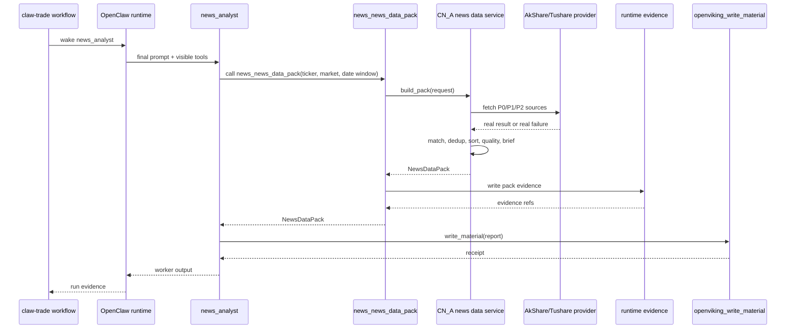
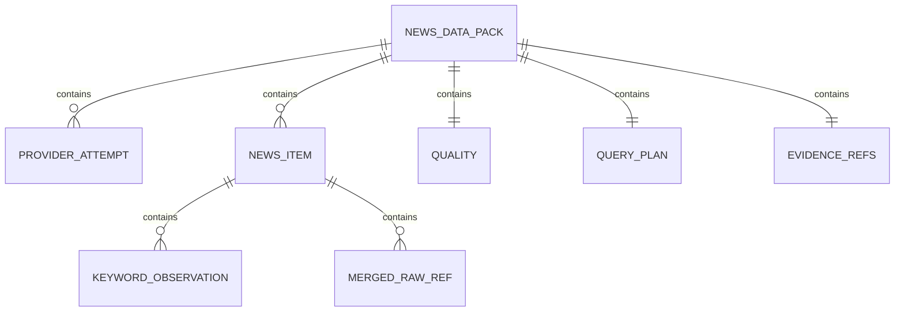

# CN_A news 数据服务层详细设计

## 1. 文档元信息

对应 HLD：`docs/CN_A_news数据服务层设计方案.md`

HLD 版本：HLD v0.3

详细设计版本：DLD v0.2

变更历史：

| 版本 | 日期 | 变更 | 作者 |
|---|---|---|---|
| v0.1 | 2026-05-06 | 初版 | Codex |
| v0.2 | 2026-05-06 | 按严格评审补齐 provider 实调映射、profile 信任边界、skill 挂载与运维设计 | Codex |

## 2. 术语表与约定

对应 HLD §1-§18

| 术语 | 含义 | 对应 HLD |
|---|---|---|
| `news_news_data_pack` | `news_analyst` 在 OpenClaw turn 内调用的新闻资料包工具，只供料，不写报告 | §1, §2, §5, §6 |
| `news_analyst` | 新闻分析 worker，负责读取资料包并写正式新闻分析报告 | §2, §5, §11, §13 |
| provider | 真实新闻数据源的访问适配层，例如 AkShare、Tushare | §5, §7, §12 |
| P0 数据源 | 第一阶段必须优先尝试的核心来源：AkShare `stock_news_em` 与 `stock_info_global_cls` | §7, §12 |
| P1/P2 数据源 | 增强来源，不得在 P0 全失败时把资料包包装成正式成功 | §7, §12 |
| 公司直连新闻 | 由股票代码、公司全称、已批准简称、公告主体硬匹配命中的公司新闻 | §4, §8 |
| 行业新闻 | 只由行业关键词命中的背景材料，不得冒充公司直连新闻 | §4, §8 |
| 政策/宏观新闻 | 只由宏观或政策关键词命中的背景材料 | §2, §8 |
| `reader_brief` | 事实型中文资料摘要，只总结数量、来源、时间、匹配原因和缺口 | §2, §11 |
| OpenViking receipt | `news_analyst` 写正式报告后的写入回执，不等同于资料包证据 | §13, §15 |
| 资料包证据 | 工具原始输出、provider 尝试、原始材料路径、内容校验值等运行证据 | §13, §15 |
| 中性关键词分类 | 只标记主题类别，不表达利好、利空、情绪或投资含义 | §4, §9 |

内部约定：

- 目标语言：Python 3.11+。
- 时间：内部统一使用带时区 ISO 8601 字符串；无法确认时区的 provider 时间按来源说明记录到 `evidence_gap`。
- 日期窗口：默认最近 7 天；具体起止日期由调用参数或运行上下文给出。
- 已批准实现位置为 `agents/news_analyst/skills/cn-a-news-data/`，该能力作为独立 skill 挂给 `news_analyst`。
- 本设计不新增独立服务协议、外部中间件或额外数据库。

## 3. 系统上下文与部署视图

对应 HLD §1, §5, §6, §13, §17

### 3.1 部署拓扑

```text
claw-trade workflow 进程
  |
  | 唤醒 worker
  v
OpenClaw 单 worker turn
  |
  | 可见工具：news_news_data_pack, openviking_write_material
  v
news_analyst skill adapter
  |
  | 同进程或子进程内调用 Python 服务层
  v
CN_A news data service
  |
  | 出站 HTTPS
  v
AkShare / Tushare 对应远端来源
  |
  | 结构化资料包返回
  v
news_analyst 报告
  |
  | openviking_write_material
  v
OpenViking 材料存储
```

节点说明：

| 节点 | 进程/容器 | 端口 | 网络 | 职责 |
|---|---|---|---|---|
| claw-trade workflow | 现有 Python 进程 | 不新增端口 | 可访问 OpenClaw runtime | 控制 workflow 顺序，不预取新闻 |
| OpenClaw worker runtime | 现有 OpenClaw 执行环境 | 不新增端口 | 可访问工具执行环境 | 执行 `news_analyst` 单 turn |
| news skill adapter | OpenClaw 工具执行环境内 | 不新增端口 | 可出站访问数据源 | 暴露 `news_news_data_pack` |
| CN_A news data service | `news_analyst` 独立 skill 内 Python 模块 | 不新增端口 | 出站 HTTPS | provider 调度、清洗、匹配、质量评估 |
| 远端数据源 | AkShare/Tushare 背后来源 | 外部服务 | 出站 HTTPS | 返回真实新闻或真实错误 |
| evidence workspace | 本地运行证据目录 | 不新增端口 | 本地文件系统 | 保存资料包原始输出和 provider 证据 |
| OpenViking | 现有材料存储能力 | 沿用现有配置 | 由 OpenClaw 工具访问 | 写正式报告材料 |

已批准代码落点：

- skill 根目录：`agents/news_analyst/skills/cn-a-news-data/`
- 工具入口：`agents/news_analyst/skills/cn-a-news-data/scripts/news_data_pack.py`
- provider：`agents/news_analyst/skills/cn-a-news-data/scripts/providers.py`
- 匹配：`agents/news_analyst/skills/cn-a-news-data/scripts/matching.py`
- 去重：`agents/news_analyst/skills/cn-a-news-data/scripts/dedup.py`
- brief：`agents/news_analyst/skills/cn-a-news-data/scripts/reader_brief.py`
- 证据：`agents/news_analyst/skills/cn-a-news-data/scripts/evidence.py`
- 证据根目录：沿用 claw-trade runtime 当前 run evidence 根路径

### 3.2 资源预估

对应 HLD §5, §7, §8, §12

HLD 没有规定资源预算。以下是建议值，实施前应由运行环境确认：

| 节点 | CPU | 内存 | 磁盘 | 连接池 |
|---|---:|---:|---:|---:|
| 单个 `news_news_data_pack` 调用 | 1 vCPU | 512 MiB | 单 run 10-50 MiB | provider 有限并行，`max_concurrency=3` |
| 证据落地 | 共享 workflow 磁盘 | 无额外常驻内存 | 单 run 原始 JSON/文本 10-50 MiB | 不适用 |

已批准 provider 调度默认值：

- 启用 provider 全部调用、全部记录，不早停。
- `max_concurrency=3`。
- 单 provider timeout 为 10 秒。
- 整包 timeout 为 20 秒。
- 单 provider 默认请求 1 次；失败原因进入 `provider_attempts`。

## 4. 模块详细设计

### 4.1 OpenClaw 工具适配模块

对应 HLD §1, §3, §5, §6, §13, §15

建议路径：

- `agents/news_analyst/skills/cn-a-news-data/`
- `agents/news_analyst/skills/cn-a-news-data/scripts/news_data_pack.py`

#### 4.1.1 职责与边界

MUST：

- 在 OpenClaw turn 内向 `news_analyst` 暴露 `news_news_data_pack`。
- 接收 worker 传入的股票代码、市场、日期窗口、公司名、行业等参数。
- 通过 `ApprovedProfileResolver` 从已批准 artifact 解析公司名、行业、已批准简称、历史名称。
- 调用 CN_A news data service。
- 将服务层返回值原样作为工具结果返回给 worker。
- 把 `run_id`、`stage`、`worker_id`、`call_id` 等运行上下文传给证据模块。

MUST NOT：

- 不拉取新闻后塞进 worker prompt。
- 不替 `news_analyst` 写报告。
- 不输出投资结论。
- 不在工具内部调用 LLM。
- 不暴露底层 provider 原子接口给 worker。
- 不写 OpenViking 正式报告；正式报告由 `news_analyst` 调用 `openviking_write_material`。
- 不信任 worker 直接上送的 `approved_aliases`。

依赖关系：

| 上游 | 下游 | 方向 | 方式 |
|---|---|---|---|
| OpenClaw worker runtime | 工具适配模块 | 调用 | 同步 |
| 工具适配模块 | CN_A news data service | 调用 | 同步 |
| 工具适配模块 | 证据模块 | 调用 | 同步写入 |

#### 4.1.2 核心数据结构

```python
# Language: Python
from dataclasses import dataclass
from typing import Any

@dataclass(frozen=True)
class ToolRuntimeContext:
    run_id: str          # 非空；workflow run 标识
    stage: str           # 非空；本次应为 frontline 或 news 对应 stage
    worker_id: str       # 非空；必须为 news_analyst
    call_id: str         # 非空；OpenClaw tool call 标识
    tool_name: str       # 非空；必须为 news_news_data_pack
    evidence_root: str   # 非空；运行证据根目录

@dataclass(frozen=True)
class ToolInput:
    ticker: str              # 非空；A 股代码，例如 600519；只允许数字代码或交易所后缀代码
    market: str              # 非空；本模块只接受 CN_A
    start_date: str | None   # 可空；YYYY-MM-DD；为空时由 end_date 往前 7 天
    end_date: str | None     # 可空；YYYY-MM-DD；为空时使用运行日期
    profile_artifact_ref: str | None      # 可空；已批准 profile artifact 引用
    fundamentals_artifact_ref: str | None # 可空；已批准 fundamentals artifact 引用
    market_artifact_ref: str | None       # 可空；已批准 market artifact 引用
```

#### 4.1.3 接口定义

内部接口：

```python
def run_news_data_pack(tool_input: ToolInput, context: ToolRuntimeContext) -> dict[str, Any]:
    """
    参数约束：
    - context.worker_id == "news_analyst"
    - context.tool_name == "news_news_data_pack"
    - tool_input.market == "CN_A"
    - tool_input.ticker 非空，长度 6 或带合法交易所后缀
    返回：
    - NewsDataPack 的 JSON 可序列化 dict
    错误：
    - NewsDataError(code="E_INVALID_INPUT")
    - NewsDataError(code="E_UNSUPPORTED_MARKET")
    - NewsDataError(code="E_PROFILE_RESOLVE_FAILED")
    - NewsDataError(code="E_EVIDENCE_WRITE_FAILED")
    """
```

外部可见工具：

| 工具名 | 协议 | 请求 | 响应 | 幂等性 | 限流 | 调用频次 |
|---|---|---|---|---|---|---|
| `news_news_data_pack` | OpenClaw skill tool | `ToolInput` 字段对应 JSON | `NewsDataPack` JSON | 同一 `run_id/call_id` 只写一次证据；重复调用生成新 call 证据 | 单 worker 单 turn 1 次 | 每个 news_analyst turn 1 次 |

错误码：

| code | 含义 | 可恢复 | 传播 |
|---|---|---|---|
| `E_INVALID_INPUT` | 入参缺少 ticker 或日期非法 | 否 | 工具返回失败 JSON，并写证据 |
| `E_UNSUPPORTED_MARKET` | market 不是 CN_A | 否 | 工具返回失败 JSON |
| `E_PROFILE_RESOLVE_FAILED` | 已批准 profile 解析失败且无法形成 request | 否 | 工具返回失败 JSON，并写缺口证据 |
| `E_CONTEXT_MISMATCH` | worker/tool 上下文不匹配 | 否 | 抛给 OpenClaw runtime |
| `E_EVIDENCE_WRITE_FAILED` | 资料包证据无法落地 | 否 | 抛给 OpenClaw runtime |

#### 4.1.4 核心算法与业务流程

```text
FUNCTION run_news_data_pack(tool_input, context):
    IF context.worker_id != "news_analyst":
        RAISE E_CONTEXT_MISMATCH
    IF context.tool_name != "news_news_data_pack":
        RAISE E_CONTEXT_MISMATCH
    IF tool_input.market != "CN_A":
        RETURN failed_pack(code=E_UNSUPPORTED_MARKET)
    IF ticker invalid:
        RETURN failed_pack(code=E_INVALID_INPUT)

    resolved_profile = ApprovedProfileResolver.resolve(
        ticker=tool_input.ticker,
        run_id=context.run_id,
        stage=context.stage,
        profile_ref=tool_input.profile_artifact_ref,
        fundamentals_ref=tool_input.fundamentals_artifact_ref,
        market_ref=tool_input.market_artifact_ref,
    )
    request = normalize_tool_input(tool_input, context, resolved_profile)
    pack = NewsDataService.build_pack(request)

    evidence_result = EvidenceWriter.write_pack(pack, context)
    IF evidence_result.failed:
        RAISE E_EVIDENCE_WRITE_FAILED

    pack.evidence = evidence_result.refs
    RETURN pack.to_dict()
```

时间复杂度：主要由 provider 返回条数 `n` 决定；适配层自身为 `O(1)`。

并发边界：单次 tool call 内不共享可变全局状态；证据写入路径包含 `run_id/call_id`，避免覆盖。

#### 4.1.5 状态机

| 状态 | 触发 | 下一状态 |
|---|---|---|
| `RECEIVED` | OpenClaw 调用工具 | `VALIDATED` 或 `FAILED` |
| `VALIDATED` | 入参和上下文通过 | `SERVICE_CALLED` |
| `SERVICE_CALLED` | 服务层返回资料包 | `EVIDENCE_WRITTEN` 或 `FAILED` |
| `EVIDENCE_WRITTEN` | 证据落地成功 | `RETURNED` |
| `FAILED` | 上下文、入参或证据错误 | 终态 |
| `RETURNED` | 工具结果返回 worker | 终态 |

#### 4.1.6 错误处理策略

- 可恢复错误：provider 返回空、超时、权限不足；由服务层写入 `provider_attempts`。
- 不可恢复错误：上下文不匹配、证据无法落地、市场不支持。
- 不做业务降级；失败必须如实进入 pack 或向 runtime 抛出。
- 工具适配层 timeout 为 25 秒，必须大于整包 timeout。

#### 4.1.7 数据存储设计

本模块不建立数据库表。

写入文件：

| 文件 | 内容 | 主键 |
|---|---|---|
| `{evidence_root}/{run_id}/{stage}/{worker_id}/{call_id}/news_data_pack.json` | 完整工具返回资料包 | `run_id/stage/worker_id/call_id` |
| `{evidence_root}/{run_id}/{stage}/{worker_id}/{call_id}/provider_attempts.json` | provider 尝试记录 | `run_id/stage/worker_id/call_id` |

#### 4.1.8 非功能性设计

- P95：单次 tool call 在 provider 正常响应时 20 秒内返回。
- 日志：记录 `run_id/stage/worker_id/call_id/tool_name/status/error_code`，不记录完整正文到普通日志。
- trace：span 名称 `news_data_pack.tool_adapter`。
- 安全：Tushare token 只从环境或密钥管理读取，不写入证据、不进入 reader_brief。
- 审计：每次调用必须有 evidence 文件或 runtime 错误。

#### 4.1.9 OpenClaw skill 注册与部署细节

- `SKILL.md` 必填：
  - `name: cn-a-news-data`
  - `version: x.y.z`
  - `tool: news_news_data_pack`
  - `entrypoint: scripts/news_data_pack.py`
- manifest 挂载：
  - worker 绑定：仅 `news_analyst`
  - tool 导出：仅 `news_news_data_pack`
  - stage policy 额外暴露：`openviking_write_material`
- 脚本 I/O 协议：
  - stdin：单个 JSON 请求对象（包含 tool_input + runtime_context）
  - stdout：单个 JSON 响应对象（成功为 `NewsDataPack`，失败为结构化错误）
  - exit code：`0` 成功，非 `0` 失败；失败仍需在 stderr 输出可审计短错误
- 可见工具验收：运行证据里的 visible tools 必须只含 `news_news_data_pack` 与 `openviking_write_material`。

### 4.2 CN_A news data service 编排模块

对应 HLD §2, §4, §5, §7, §8, §10, §12, §15

建议路径：`agents/news_analyst/skills/cn-a-news-data/scripts/news_data_pack.py`

#### 4.2.1 职责与边界

MUST：

- 根据 request 生成查询计划。
- 按有限并行策略调用全部启用 provider，并收集全部结果。
- 收集真实成功、真实失败、空结果、权限问题、结构变化等结果。
- 调用匹配、去重、排序、裁剪、质量评估、资料摘要模块。
- 返回完整 `NewsDataPack`。

MUST NOT：

- 不调用 LLM。
- 不生成新闻影响判断。
- 不把 P1/P2 结果包装成 P0 成功。
- 不读取本地样本作为远端结果。
- 不扩展日期窗口来掩盖公司直连新闻不足。

依赖关系：

| 上游 | 下游 | 方向 | 方式 |
|---|---|---|---|
| 工具适配模块 | 编排模块 | 调用 | 同步 |
| 编排模块 | provider 模块 | 调用 | 有限并行，等待全部 provider 返回或超时 |
| 编排模块 | 匹配/去重/质量/摘要模块 | 调用 | 同步 |

#### 4.2.2 核心数据结构

```python
# Language: Python
from dataclasses import dataclass, field
from typing import Literal

QualityStatus = Literal["complete", "partial", "failed"]
EmptyReason = Literal[
    "no_result",
    "provider_error",
    "permission_missing",
    "rate_limited",
    "timeout",
    "schema_changed",
    "not_configured",
]

@dataclass(frozen=True)
class NewsDataPackRequest:
    ticker: str              # 非空；例如 600519
    exchange_ticker: str     # 非空；例如 600519.SH
    market: Literal["CN_A"]  # 固定 CN_A
    company_name: str | None # 来自 ApprovedProfileResolver；可空但必须记录 missing_fields
    industry: str | None     # 来自 ApprovedProfileResolver；可空但必须记录 missing_fields
    start_date: str          # YYYY-MM-DD；闭区间起点
    end_date: str            # YYYY-MM-DD；闭区间终点
    approved_aliases: list[str] = field(default_factory=list) # 来自 ApprovedProfileResolver
    approved_historical_names: list[str] = field(default_factory=list) # 来自 ApprovedProfileResolver
    profile_missing_fields: list[str] = field(default_factory=list) # resolver 缺口

@dataclass(frozen=True)
class ResolvedProfile:
    company_name: str | None
    industry: str | None
    approved_aliases: list[str]
    approved_historical_names: list[str]
    missing_fields: list[str]  # 只能由 resolver 产出

@dataclass
class QueryPlan:
    ticker: str              # 原始股票代码
    exchange_ticker: str     # 带交易所后缀代码
    company_name: str | None # 公司全称
    industry: str | None     # 行业
    start_date: str          # YYYY-MM-DD
    end_date: str            # YYYY-MM-DD
    company_keywords: list[str] # 可进入公司直连匹配的词
    industry_keywords: list[str] # 只能进入行业背景匹配
    macro_keywords: list[str] # 只能进入政策/宏观背景匹配

@dataclass
class ProviderAttempt:
    provider: str            # 例如 akshare 或 tushare
    endpoint: str            # 例如 stock_news_em
    query: str               # 实际查询参数摘要，不含密钥
    ok: bool                 # provider 调用是否成功返回可解析结果
    elapsed_ms: int          # 非负；真实耗时，超时/取消也必须填写
    raw_count: int           # 原始条数，>=0
    accepted_count: int      # 进入 accepted pool 的条数，>=0
    empty_reason: EmptyReason | None # ok=false 或 raw_count=0 时必填
    error: str | None        # 错误摘要；不得包含密钥
    cancelled: bool          # 总超时取消时为 true

@dataclass
class Quality:
    status: QualityStatus
    company_direct_news_count: int
    industry_background_count: int
    policy_macro_count: int
    total_raw_count: int
    after_dedup_count: int
    accepted_count: int
    missing_fields: list[str]
    directional_judgment_allowed: bool
    warnings: list[str]

@dataclass
class NewsDataPack:
    schema_version: str     # 固定 "cn_a_news_pack.v1"
    ok: bool
    profile: dict[str, str | None]
    query_plan: QueryPlan
    provider_attempts: list[ProviderAttempt]
    data: dict[str, list["NewsItem"]]
    quality: Quality
    reader_brief: str
    evidence: dict[str, str] | None = None
```

#### 4.2.3 接口定义

```python
class NewsDataService:
    def build_pack(self, request: NewsDataPackRequest) -> NewsDataPack:
        """
        参数约束：
        - request.market == "CN_A"
        - request.start_date <= request.end_date
        - 默认窗口不超过 7 天；若上游显式传更长窗口，必须记录到 query_plan
        返回：
        - 结构化 NewsDataPack
        - NewsDataPack.schema_version 必须固定为 "cn_a_news_pack.v1"
        错误：
        - E_INVALID_INPUT：入参非法
        - E_PROVIDER_LAYER_FAILED：provider 层整体异常且无法形成失败资料包
        """
```

调用频次：每个 `news_analyst` turn 1 次。

输出 schema 关键约束：

```json
{
  "schema_version": "cn_a_news_pack.v1",
  "ok": true,
  "profile": {},
  "query_plan": {},
  "provider_attempts": [],
  "data": {},
  "quality": {},
  "reader_brief": ""
}
```

#### 4.2.4 核心算法与业务流程

```text
FUNCTION build_pack(request):
    validate_request(request)
    query_plan = build_query_plan(request)

    attempts = []
    raw_items = []

    provider_results = run_bounded_parallel(
        providers=enabled_providers(P0 and P1),
        max_concurrency=3,
        per_provider_timeout=10s,
        total_timeout=20s,
    )

    # 为所有 provider 生成 attempt；超时或取消的 provider 不得缺失 attempt
    FOR result IN provider_results:
        attempts.append(result.attempt)
        IF result.ok:
            raw_items.extend(result.raw_items)

    attempts = ensure_attempts_for_all_enabled_providers(
        attempts=attempts,
        provider_results=provider_results,
        mark_timeout_cancelled=True,
    )

    matched_items = []
    rejected_count = 0
    FOR item IN raw_items:
        match = MatchEngine.classify(item, query_plan)
        IF match.bucket IS rejected:
            rejected_count += 1
            CONTINUE
        matched_items.append(apply_match(item, match))

    deduped_items, dedup_stats = Deduplicator.deduplicate(matched_items)
    trimmed = SortTrimProcessor.sort_and_trim(deduped_items, request)
    quality = QualityGate.evaluate(
        attempts=attempts,
        items=trimmed,
        raw_count=len(raw_items),
        after_dedup_count=len(deduped_items),
        rejected_count=rejected_count,
        request=request,
    )

    reader_brief = ReaderBriefBuilder.build(quality, attempts, trimmed, query_plan)
    ok = quality.status != "failed"

    RETURN NewsDataPack(
        schema_version="cn_a_news_pack.v1",
        ok=ok,
        profile=profile_from_request(request),
        query_plan=query_plan,
        provider_attempts=attempts,
        data=group_by_bucket(trimmed),
        quality=quality,
        reader_brief=reader_brief,
    )
```

分支条件：

- P0 两个来源都失败：`quality.status="failed"`。
- P0 至少一个成功但公司直连新闻为 0，且行业/宏观有材料：`quality.status="partial"`。
- 有公司直连新闻且 provider 证据可用：`quality.status="complete"`，但缺少行业或公告时仍写 `missing_fields`。
- 所有 provider 都失败：`quality.status="failed"`。

时间复杂度：`O(n log n)`，其中 `n` 为 provider 原始新闻总条数；排序为主要成本。

并发边界：provider 有限并行，最大并发为 3；每个 provider 必须返回 attempt，不能因为其他 provider 成功而跳过。

#### 4.2.5 状态机

| 状态 | 条件 | 下一状态 |
|---|---|---|
| `INIT` | 收到 request | `QUERY_PLANNED` |
| `QUERY_PLANNED` | 查询计划生成 | `PROVIDER_FETCHING` |
| `PROVIDER_FETCHING` | provider 调用结束 | `MATCHING` |
| `MATCHING` | 新闻分桶完成 | `DEDUPING` |
| `DEDUPING` | 去重完成 | `QUALITY_EVALUATING` |
| `QUALITY_EVALUATING` | 质量状态确定 | `BRIEF_BUILDING` |
| `BRIEF_BUILDING` | brief 生成 | `PACK_READY` |
| `PACK_READY` | 返回适配层 | 终态 |
| `FAILED` | 入参非法或无法形成 pack | 终态 |

#### 4.2.6 错误处理策略

- provider 单点错误：记录到 `provider_attempts`，继续尝试同批次其他来源。
- P0 全失败：返回失败资料包，不抛普通异常。
- 服务层自身代码错误：抛 `E_PROVIDER_LAYER_FAILED`，由工具适配层写 runtime 错误。
- 不做业务降级；状态只允许 `complete/partial/failed`。
- 同进程 provider 冷却策略：同一 endpoint 在 60 秒内连续失败达到阈值（默认 3 次）后进入冷却；冷却期 attempt 记为 `rate_limited`，并保留 `elapsed_ms=0`。

#### 4.2.7 数据存储设计

本模块不直接持久化数据库。所有持久化由证据模块负责。

#### 4.2.8 非功能性设计

- 可观测性：
  - `news_provider_attempt_total{provider,endpoint,status}`
  - `news_pack_status_total{status}`
  - `news_pack_company_direct_count`
  - `news_pack_provider_raw_count`
- trace：
  - `news_data_pack.service`
  - `news_data_pack.provider.<endpoint>`
  - `news_data_pack.match`
  - `news_data_pack.quality`
- 安全：不得把 token、cookie、完整环境变量写入 pack。

### 4.3 Provider 访问模块

对应 HLD §7, §12, §15, §16

建议路径：`agents/news_analyst/skills/cn-a-news-data/scripts/providers.py`

#### 4.3.1 职责与边界

MUST：

- 封装 AkShare `stock_news_em`。
- 封装 AkShare `stock_info_global_cls`。
- 封装 AkShare `stock_info_global_em`。
- 封装 AkShare `news_cctv`。
- 封装 Tushare `anns_d`。
- 将来源结果统一转换为 `RawNewsItem`。
- 将真实错误转换为 `ProviderAttempt.empty_reason`。

MUST NOT：

- 不让 worker 直接调用原子 provider。
- 不吞掉错误。
- 不把权限缺失记录成成功。
- 不使用本地样本替代远端返回。
- 不在 provider 层做投资解释。

#### 4.3.2 核心数据结构

```python
# Language: Python
from dataclasses import dataclass

@dataclass(frozen=True)
class ProviderQuery:
    endpoint: str          # provider endpoint 名称
    ticker: str            # 600519
    exchange_ticker: str   # 600519.SH
    company_name: str | None
    keywords: list[str]    # 本 endpoint 使用的关键词
    start_date: str        # YYYY-MM-DD
    end_date: str          # YYYY-MM-DD

@dataclass
class RawNewsItem:
    raw_id: str              # provider 内部唯一 id；无 id 时由 endpoint+url/title/time 派生
    title: str               # 非空；原始标题
    summary: str | None      # 可空；原始摘要或正文截断
    source: str | None       # 可空；来源媒体
    publish_time: str | None # 可空；原始发布时间，尽力标准化
    url: str | None          # 可空；原文链接
    data_source: str         # 例如 akshare.stock_news_em
    raw_payload_ref: str | None # 可空；原始 provider 输出证据引用
    source_fetch_time: str   # 工具拉取时间

@dataclass
class ProviderFetchResult:
    ok: bool
    attempt: ProviderAttempt
    raw_items: list[RawNewsItem]
```

#### 4.3.3 接口定义

```python
class NewsProvider:
    name: str
    endpoint: str
    priority: str  # P0, P1, P2

    def fetch(self, query: ProviderQuery) -> ProviderFetchResult:
        """
        返回：
        - ProviderFetchResult
        错误处理：
        - provider 内部异常必须转换为 ProviderFetchResult(ok=False)
        - 只有无法构造 attempt 的代码错误才抛异常
        """
```

Provider 清单：

| 类 | 来源 | endpoint | 优先级 | query | 频次 |
|---|---|---|---|---|---|
| `AkshareStockNewsEmProvider` | AkShare | `stock_news_em` | P0 | ticker | 每 pack 1 次 |
| `AkshareStockInfoGlobalClsProvider` | AkShare | `stock_info_global_cls` | P0 | symbol="全部" 后本地硬匹配 | 每 pack 1 次 |
| `AkshareStockInfoGlobalEmProvider` | AkShare | `stock_info_global_em` | P1 | 本地关键词过滤 | 每 pack 1 次 |
| `AkshareNewsCctvProvider` | AkShare | `news_cctv` | P1 | end_date 对应 YYYYMMDD | 每 pack 1 次 |
| `TushareAnnouncementsProvider` | Tushare | `anns_d` | P1 | ts_code/date window | token 和权限存在时每 pack 1 次；未配置也必须记录 attempt |

第一版不启用 Tushare `news` / `major_news` / `cctv_news` 新闻族作为主路径。Tushare 在本设计里只承担公告增强。

#### 4.3.4 逐 provider 调用与字段映射

1) `AkshareStockNewsEmProvider`

- 真实调用：`ak.stock_news_em(symbol=query.ticker)`。
- 输入参数：`symbol` 使用 6 位股票代码，例如 `600519`。
- 行字段映射：
  - `新闻标题 -> RawNewsItem.title`
  - `新闻内容 -> RawNewsItem.summary`
  - `发布时间 -> RawNewsItem.publish_time`
  - `文章来源 -> RawNewsItem.source`
  - `新闻链接 -> RawNewsItem.url`
  - `关键词 -> RawNewsItem.summary` 附加片段（仅作为后续匹配参考，不直接下结论）
- 空结果判断：DataFrame 为空，或标题列不存在且无法恢复。
- empty_reason：
  - 空表：`no_result`
  - 超时：`timeout`
  - 接口字段缺失：`schema_changed`
  - 其他异常：`provider_error`

2) `AkshareStockInfoGlobalClsProvider`

- 真实调用：`ak.stock_info_global_cls(symbol="全部")`。
- 输入参数固定：`symbol="全部"`。
- 行字段映射：
  - `标题 -> RawNewsItem.title`
  - `内容 -> RawNewsItem.summary`
  - `发布日期 + 发布时间 -> RawNewsItem.publish_time`（优先拼接完整时间）
  - 来源字段缺失时 `RawNewsItem.source="财联社电报"`
  - 该接口无稳定 URL 时 `RawNewsItem.url=None`
- 空结果判断：DataFrame 为空。
- 分桶前处理：先本地硬匹配 ticker/company_name/approved_aliases/historical_names，再决定进入 `company_news` 或背景桶。
- empty_reason：
  - 空表：`no_result`
  - 超时：`timeout`
  - 接口字段缺失：`schema_changed`
  - 其他异常：`provider_error`

3) `AkshareStockInfoGlobalEmProvider`

- 真实调用：`ak.stock_info_global_em()`。
- 输入参数：无。
- 行字段映射：
  - `标题 -> RawNewsItem.title`
  - `摘要 -> RawNewsItem.summary`
  - `发布时间 -> RawNewsItem.publish_time`
  - `链接 -> RawNewsItem.url`
  - 来源字段缺失时 `RawNewsItem.source="东方财富快讯"`
- 空结果判断：DataFrame 为空。
- 分桶前处理：按 query_plan 的公司/行业/宏观关键词过滤，无命中则拒收。
- empty_reason：
  - 空表：`no_result`
  - 超时：`timeout`
  - 接口字段缺失：`schema_changed`
  - 其他异常：`provider_error`

4) `AkshareNewsCctvProvider`

- 真实调用：`ak.news_cctv(date=end_date_yyyymmdd)`。
- 输入参数：`date` 由 `request.end_date` 转换为 `YYYYMMDD`。
- 行字段映射：
  - `date -> RawNewsItem.publish_time`
  - `title -> RawNewsItem.title`
  - `content -> RawNewsItem.summary`
  - `RawNewsItem.source="新闻联播"`
  - `RawNewsItem.url=None`
- 空结果判断：DataFrame 为空。
- 分桶限制：该 provider 结果只能进入 `policy_macro_news`。
- empty_reason：
  - 空表：`no_result`
  - 超时：`timeout`
  - 接口字段缺失：`schema_changed`
  - 其他异常：`provider_error`

5) `TushareAnnouncementsProvider`

- 真实调用顺序：
  - 若 `CN_A_NEWS_TUSHARE_TOKEN` 缺失：不发远端请求，直接记录 `not_configured`。
  - token 存在：`pro = ts.pro_api(token)`；`pro.anns_d(ts_code=exchange_ticker, start_date=YYYYMMDD, end_date=YYYYMMDD)`。
- 行字段映射：
  - `ann_date -> RawNewsItem.publish_time`
  - `ts_code/name -> RawNewsItem.summary` 中可审计字段段落
  - `title -> RawNewsItem.title`
  - `url -> RawNewsItem.url`
  - `rec_time -> RawNewsItem.publish_time` 的后备值（`ann_date` 缺失时）
  - `RawNewsItem.source="tushare.anns_d"`
- 空结果判断：DataFrame 为空。
- empty_reason：
  - token 缺失：`not_configured`
  - 无权限/积分不足：`permission_missing`
  - 超时：`timeout`
  - 接口字段缺失：`schema_changed`
  - 其他异常：`provider_error`

#### 4.3.5 核心算法与业务流程

```text
FUNCTION provider.fetch(query):
    start timer
    TRY:
        raw_table = call_real_provider_endpoint(query)
        IF raw_table is empty:
            RETURN ProviderFetchResult(
                ok=false,
                attempt.elapsed_ms=elapsed(timer),
                attempt.empty_reason="no_result",
                raw_items=[],
            )
        raw_items = normalize_rows(raw_table)
        RETURN ProviderFetchResult(
            ok=true,
            attempt.elapsed_ms=elapsed(timer),
            attempt.raw_count=len(raw_items),
            raw_items=raw_items,
        )
    CATCH PermissionError OR provider says permission denied:
        RETURN failed_attempt("permission_missing", sanitized_error)
    CATCH TimeoutError:
        RETURN failed_attempt("timeout", sanitize_error(e), elapsed(timer), cancelled=false)
    CATCH RateLimitSignal:
        RETURN failed_attempt("rate_limited", sanitize_error(e), elapsed(timer), cancelled=false)
    CATCH SchemaMismatch:
        RETURN failed_attempt("schema_changed", sanitized_error)
    CATCH Exception AS e:
        RETURN failed_attempt("provider_error", sanitize_error(e), elapsed(timer), cancelled=false)

FUNCTION ensure_attempt_on_total_timeout(provider, elapsed_ms):
    RETURN failed_attempt(
        reason="timeout",
        error="total_timeout_cancelled",
        elapsed_ms=elapsed_ms,
        cancelled=true,
    )
```

时间复杂度：`O(r)`，`r` 为 provider 返回行数。

#### 4.3.6 状态机

| 状态 | 触发 | 下一状态 |
|---|---|---|
| `READY` | 收到 query | `CALLING_REMOTE` |
| `CALLING_REMOTE` | 真实来源返回 | `NORMALIZING` 或 `FAILED` |
| `NORMALIZING` | 字段映射完成 | `RETURNED` |
| `FAILED` | 来源错误、权限、限流、超时、结构变化 | `RETURNED` |
| `RETURNED` | 返回 `ProviderFetchResult` | 终态 |

#### 4.3.7 错误处理策略

- 超时：写 `empty_reason="timeout"`。
- 权限不足：写 `empty_reason="permission_missing"`。
- 接口字段变化：写 `empty_reason="schema_changed"`。
- 速率限制：写 `empty_reason="rate_limited"`。
- 未配置 token：写 `empty_reason="not_configured"`。
- 不重写 provider 的真实含义。

已批准：每个 provider 单次请求，timeout 10 秒；整包 timeout 20 秒；失败进入 `provider_attempts`。

#### 4.3.8 数据存储设计

Provider 模块不直接写数据库。

Provider 原始输出由证据模块保存：

| 证据 | 内容 |
|---|---|
| raw provider payload | provider 返回的原始表格/JSON 的安全版本 |
| normalized raw items | `RawNewsItem` 列表 |
| provider attempt | 成功/失败/空结果/错误摘要 |

#### 4.3.9 非功能性设计

- 普通日志只写 endpoint、状态、数量、错误类型。
- 原始内容写 evidence，不写普通日志。
- token 不进入日志、pack、evidence。
- provider 调用必须可被单独复现：记录 endpoint、query、时间窗口。

### 4.4 查询计划与匹配模块

对应 HLD §4, §8, §9, §10, §15

建议路径：`agents/news_analyst/skills/cn-a-news-data/scripts/matching.py`

#### 4.4.1 职责与边界

MUST：

- 生成公司关键词、行业关键词、宏观关键词。
- 对每条新闻进行硬匹配分桶。
- 生成 `match_type`、`match_evidence_span`、`match_confidence`、`bucket`。
- 保证公司直连新闻必须有硬匹配证据。

MUST NOT：

- 不凭 Python 常识补公司简称。
- 不把行业词命中放进 `company_news`。
- 不输出方向性情绪字段。
- 不自由改写命中片段。

#### 4.4.2 核心数据结构

```python
# Language: Python
from typing import Literal

MatchType = Literal[
    "ticker_exact",
    "company_full_name",
    "approved_alias",
    "announcement_subject",
    "industry_keyword",
    "macro_keyword",
    "unknown",
]

Bucket = Literal[
    "company_news",
    "industry_news",
    "policy_macro_news",
    "announcements",
    "rejected",
]

MatchConfidence = Literal["high", "medium", "low"]

@dataclass
class MatchResult:
    match_type: MatchType
    match_evidence_span: str | None # 必须来自标题或摘要原文；unknown 时可空
    match_confidence: MatchConfidence
    bucket: Bucket
    matched_keywords: list[str] # 实际命中的关键词列表
```

#### 4.4.3 接口定义

```python
class QueryPlanBuilder:
    def build(self, request: NewsDataPackRequest) -> QueryPlan:
        """
        参数约束：
        - ticker 必须进入 company_keywords
        - exchange_ticker 必须进入 company_keywords
        - company_name 非空时进入 company_keywords
        - approved_aliases 只使用 ApprovedProfileResolver 输出
        返回：
        - QueryPlan
        """

class MatchEngine:
    def classify(self, item: RawNewsItem, query_plan: QueryPlan) -> MatchResult:
        """
        返回：
        - MatchResult
        错误：
        - 不抛业务错误；无法匹配时返回 bucket="rejected"
        """
```

调用频次：每条 raw news 1 次。

#### 4.4.4 核心算法与业务流程

```text
FUNCTION build_query_plan(request):
    # request 必须来自 ApprovedProfileResolver，不能直接信任 worker 自报 alias
    company_keywords = [request.ticker, request.exchange_ticker]
    IF request.company_name not empty:
        company_keywords.append(request.company_name)
    FOR alias IN request.approved_aliases:
        IF alias not empty and alias not conflict_blacklist:
            company_keywords.append(alias)
    FOR old_name IN request.approved_historical_names:
        IF old_name not empty:
            company_keywords.append(old_name)

    industry_keywords = []
    IF request.industry not empty:
        industry_keywords.append(request.industry)

    macro_keywords = configured_cn_a_macro_terms()
    RETURN QueryPlan(...)

FUNCTION classify(item, query_plan):
    text = item.title + "\n" + item.summary_or_empty

    IF exact_contains(text, query_plan.ticker):
        RETURN MatchResult("ticker_exact", span_from_text(text, ticker), "high", company_or_announcement_bucket(item), [ticker])

    IF exact_contains(text, query_plan.exchange_ticker):
        RETURN MatchResult("ticker_exact", span_from_text(text, exchange_ticker), "high", company_or_announcement_bucket(item), [exchange_ticker])

    IF company_name exists AND exact_contains(text, company_name):
        RETURN MatchResult("company_full_name", span_from_text(text, company_name), "high", company_or_announcement_bucket(item), [company_name])

    FOR alias IN approved_aliases:
        IF exact_contains(text, alias) AND alias not conflict_blacklist:
            RETURN MatchResult("approved_alias", span_from_text(text, alias), "medium", company_or_announcement_bucket(item), [alias])

    IF item.data_source indicates announcement AND subject matches company keyword:
        RETURN MatchResult("announcement_subject", span_from_text(text, matched), "high", "announcements", [matched])

    FOR keyword IN industry_keywords:
        IF exact_contains(text, keyword):
            RETURN MatchResult("industry_keyword", span_from_text(text, keyword), "medium", "industry_news", [keyword])

    FOR keyword IN macro_keywords:
        IF exact_contains(text, keyword):
            RETURN MatchResult("macro_keyword", span_from_text(text, keyword), "low", "policy_macro_news", [keyword])

    RETURN MatchResult("unknown", null, "low", "rejected", [])
```

约束：

- `span_from_text` 必须返回原始标题或摘要中的连续片段。
- `approved_alias` 必须来自 request，不允许模块自行生成。
- `industry_keyword` 永远不得进入 `company_news`。

时间复杂度：`O(n * k * m)`，`n` 为新闻条数，`k` 为关键词数量，`m` 为文本长度；第一版数据量较小可接受。

#### 4.4.5 状态机

| 状态 | 条件 | 下一状态 |
|---|---|---|
| `UNMATCHED` | 收到 raw item | `COMPANY_MATCHED` / `INDUSTRY_MATCHED` / `MACRO_MATCHED` / `REJECTED` |
| `COMPANY_MATCHED` | 命中公司硬证据 | `ACCEPTED` |
| `INDUSTRY_MATCHED` | 只命中行业词 | `ACCEPTED` |
| `MACRO_MATCHED` | 只命中宏观词 | `ACCEPTED` |
| `REJECTED` | 未命中可接受证据 | 终态 |
| `ACCEPTED` | 进入后续去重 | 终态 |

#### 4.4.6 错误处理策略

- 文本为空：返回 `rejected`，记录缺字段。
- 公司名为空：仍可用 ticker 匹配，并在 `missing_fields` 记录公司名缺失。
- 行业为空：不做行业关键词匹配，并记录缺字段。
- 不做业务降级，不把低证据命中抬高为公司直连。

#### 4.4.7 数据存储设计

不直接存储。匹配结果写入 `NewsItem` 并随 pack 进入 evidence。

#### 4.4.8 非功能性设计

- metrics：
  - `news_match_bucket_total{bucket}`
  - `news_match_type_total{match_type}`
  - `news_match_rejected_total`
- 安全：匹配只处理公开新闻文本。
- 可复核：每条 accepted item 必须有 `match_evidence_span`。

### 4.5 去重、排序与裁剪模块

对应 HLD §8.2, §8.3, §10, §16

建议路径：`agents/news_analyst/skills/cn-a-news-data/scripts/dedup.py`

#### 4.5.1 职责与边界

MUST：

- 规范化标题、URL、来源、时间桶。
- 按 HLD 顺序去重。
- 保留合并来源与合并原因。
- 按发布时间倒序。
- 控制 worker 可读摘要和 JSON 列表上限。

MUST NOT：

- 不删除唯一公司直连新闻来追求数量更少。
- 不改写新闻标题含义。
- 不扩大日期窗口。

#### 4.5.2 核心数据结构

```python
# Language: Python

@dataclass
class KeywordObservations:
    matched_terms: list[str]          # 实际命中的中性主题词
    keyword_categories: list[str]     # 经营、财报、政策、风险、渠道、价格等
    method: str                       # 固定 keyword_match
    is_sentiment_judgment: bool       # 固定 False

@dataclass
class NewsItem:
    news_id: str
    title: str
    summary: str | None
    source: str | None
    publish_time: str | None
    url: str | None
    data_source: str
    matched_keywords: list[str]
    match_type: MatchType
    match_evidence_span: str
    match_confidence: MatchConfidence
    bucket: Bucket
    keyword_observations: KeywordObservations
    source_fetch_time: str
    content_hash: str
    is_primary_source: bool
    merged_from: list[str]
    evidence_gap: str | None

@dataclass
class DedupStats:
    removed_count: int          # 被合并或删除的条数
    merged_raw_ids: list[str]   # 被合并的 raw_id
    merge_reasons: list[str]    # url_exact/title_exact/title_source_time/title_similarity
```

字段约束：

- `news_id` 非空；由 data_source、raw_id 或规范化字段生成。
- `match_evidence_span` 对 accepted item 非空。
- `content_hash` 基于 title、summary、source、publish_time、url 生成。
- `merged_from` 可以为空，但合并时必须记录原始 id。

#### 4.5.3 接口定义

```python
class Deduplicator:
    def deduplicate(self, items: list[NewsItem]) -> tuple[list[NewsItem], DedupStats]:
        """
        参数约束：
        - items 中每条必须已有 bucket 和 match_evidence_span
        返回：
        - 去重后的列表
        - DedupStats
        """

class SortTrimProcessor:
    def sort_and_trim(self, items: list[NewsItem], request: NewsDataPackRequest) -> list[NewsItem]:
        """
        排序：
        - publish_time 可解析者按时间倒序
        - publish_time 缺失者排在同 bucket 后部，并写 evidence_gap
        裁剪：
        - worker reader_brief 最多引用 20 条
        - pack JSON 上限 100 条
        """
```

调用频次：每个 pack 1 次。

#### 4.5.4 核心算法与业务流程

```text
FUNCTION deduplicate(items):
    seen_url = {}
    seen_title = {}
    seen_title_source_bucket = {}
    output = []
    stats = empty_stats()

    FOR item IN items:
        normalized_url = normalize_url(item.url)
        normalized_title = normalize_title(item.title)
        time_bucket = bucket_publish_time(item.publish_time)

        IF normalized_url not empty AND normalized_url IN seen_url:
            merge_item(seen_url[normalized_url], item, "url_exact")
            stats.add(item.raw_id, "url_exact")
            CONTINUE

        IF normalized_title IN seen_title:
            merge_item(seen_title[normalized_title], item, "title_exact")
            stats.add(item.raw_id, "title_exact")
            CONTINUE

        key = normalized_title + "|" + source_or_empty(item.source) + "|" + time_bucket
        IF key IN seen_title_source_bucket:
            merge_item(seen_title_source_bucket[key], item, "title_source_time")
            stats.add(item.raw_id, "title_source_time")
            CONTINUE

        similar = find_similar_title(output, normalized_title)
        IF similar exists AND similarity >= configured_threshold:
            merge_item(similar, item, "title_similarity")
            stats.add(item.raw_id, "title_similarity")
            CONTINUE

        output.append(item)
        index item

    RETURN output, stats

FUNCTION sort_and_trim(items, request):
    in_window = []
    FOR item IN items:
        IF item.publish_time missing:
            item.evidence_gap += "publish_time_missing"
            in_window.append(item)
        ELSE IF request.start_date <= date(item.publish_time) <= request.end_date:
            in_window.append(item)

    sorted_items = sort by bucket priority then publish_time desc
    RETURN cap_json_items(sorted_items)
```

时间复杂度：精确去重 `O(n)`；相似标题朴素比较 `O(n^2)`。第一版使用确定性字符相似度，阈值为 0.92，并用 100 条 JSON 上限避免大数据成本。

#### 4.5.5 状态机

| 状态 | 条件 | 下一状态 |
|---|---|---|
| `RAW_ACCEPTED` | 匹配后进入 | `NORMALIZED` |
| `NORMALIZED` | 字段规范化完成 | `DEDUPED` |
| `DEDUPED` | 合并重复项 | `SORTED` |
| `SORTED` | 时间倒序完成 | `TRIMMED` |
| `TRIMMED` | 达到输出上限 | 终态 |

#### 4.5.6 错误处理策略

- URL 缺失：跳过 URL 去重，不失败。
- 时间缺失：保留但写 `evidence_gap`。
- 标题缺失：该条不可进入 accepted pool。
- 不因相似度算法不确定而合并；达不到阈值就保留。

#### 4.5.7 数据存储设计

去重统计随 pack 写入 evidence；不建表。

#### 4.5.8 非功能性设计

- `news_dedup_removed_total`
- `news_dedup_reason_total{reason}`
- `news_trimmed_total`
- 相似度比较必须有最大输入条数保护，上限 100 条。

### 4.6 中性关键词观察模块

对应 HLD §4, §9, §10, §11

建议路径：`agents/news_analyst/skills/cn-a-news-data/scripts/keyword_observations.py`

#### 4.6.1 职责与边界

MUST：

- 基于确定性词表给新闻添加中性主题分类。
- 标记 `method="keyword_match"`。
- 标记 `is_sentiment_judgment=false`。

MUST NOT：

- 不输出利好、利空、上涨、下跌、买入、持有、卖出等方向结论字段。
- 不用 LLM 判断情绪。
- 不替 `news_analyst` 判断影响。

#### 4.6.2 核心数据结构

```python
# Language: Python

@dataclass(frozen=True)
class KeywordRule:
    term: str              # 非空；中性关键词
    category: str          # 经营/财报/政策/风险/渠道/价格等
    markets: list[str]     # 必须包含 CN_A

@dataclass
class KeywordObservationResult:
    matched_terms: list[str]
    keyword_categories: list[str]
    method: str
    is_sentiment_judgment: bool
```

第一版中性主题分类配置路径：`agents/news_analyst/skills/cn-a-news-data/config/keyword_categories.yaml`。

批准分类：

- 财报
- 公告
- 分红
- 经营
- 渠道
- 价格
- 产能
- 政策
- 风险
- 行业竞争
- 宏观消费

#### 4.6.3 接口定义

```python
class KeywordObservationExtractor:
    def extract(self, item: RawNewsItem | NewsItem, rules: list[KeywordRule]) -> KeywordObservationResult:
        """
        参数约束：
        - rules 必须来自已审查配置
        返回：
        - KeywordObservationResult(method="keyword_match", is_sentiment_judgment=False)
        """
```

调用频次：每条 accepted news 1 次。

#### 4.6.4 核心算法与业务流程

```text
FUNCTION extract(item, rules):
    text = title + "\n" + summary_or_empty
    matched_terms = []
    categories = []

    FOR rule IN rules:
        IF exact_contains(text, rule.term):
            matched_terms.append(rule.term)
            categories.append(rule.category)

    RETURN {
        matched_terms=unique_keep_order(matched_terms),
        keyword_categories=unique_keep_order(categories),
        method="keyword_match",
        is_sentiment_judgment=false,
    }
```

时间复杂度：`O(k*m)`，`k` 为规则数量，`m` 为文本长度。

#### 4.6.5 状态机

| 状态 | 条件 | 下一状态 |
|---|---|---|
| `NO_OBSERVATION` | 收到 item | `OBSERVED` |
| `OBSERVED` | 主题词处理完成 | 终态 |

#### 4.6.6 错误处理策略

- 词表为空：返回空主题列表，不失败。
- 文本为空：返回空主题列表，item 是否保留由匹配模块决定。

#### 4.6.7 数据存储设计

无数据库。结果嵌入 `NewsItem.keyword_observations`。

#### 4.6.8 非功能性设计

- metrics：`news_keyword_category_total{category}`。
- 安全：不处理敏感数据。
- 审计：词表配置变更应进入代码 review。

### 4.7 质量门与失败分类模块

对应 HLD §4, §10, §12, §15, §16

建议路径：`agents/news_analyst/skills/cn-a-news-data/scripts/quality.py`

#### 4.7.1 职责与边界

MUST：

- 依据 HLD 的 `complete/partial/failed` 规则给出状态。
- 判断 `directional_judgment_allowed`。
- 填写 `missing_fields` 和 `warnings`。
- 保证 P0 全失败时 `ok=false`。

MUST NOT：

- 不把行业/宏观资料当成公司直连新闻。
- 不降低失败等级来让流程看起来成功。
- 不输出投资方向。

#### 4.7.2 核心数据结构

```python
# Language: Python

@dataclass(frozen=True)
class QualityInput:
    provider_attempts: list[ProviderAttempt]
    items: list[NewsItem]
    total_raw_count: int
    after_dedup_count: int
    rejected_count: int
    request: NewsDataPackRequest

@dataclass(frozen=True)
class QualityDecision:
    ok: bool
    quality: Quality
```

#### 4.7.3 接口定义

```python
class QualityGate:
    def evaluate(self, quality_input: QualityInput) -> QualityDecision:
        """
        返回：
        - QualityDecision
        规则：
        - 两个 P0 均失败 => failed
        - 公司直连为 0 且行业/宏观存在 => partial
        - 公司直连 > 0 且 P0 至少一个成功 => complete
        """
```

调用频次：每个 pack 1 次。

#### 4.7.4 核心算法与业务流程

```text
FUNCTION evaluate(input):
    p0_stock = find_attempt("akshare", "stock_news_em")
    p0_cls = find_attempt("akshare", "stock_info_global_cls")
    p0_all_failed = attempt_failed(p0_stock) AND attempt_failed(p0_cls)

    company_count = count(items where bucket == "company_news" or bucket == "announcements")
    industry_count = count(items where bucket == "industry_news")
    macro_count = count(items where bucket == "policy_macro_news")

    missing_fields = []
    FOR field IN request.profile_missing_fields:
        missing_fields.append(field)
    IF request.company_name is empty:
        missing_fields.append("company_name")
    IF request.industry is empty:
        missing_fields.append("industry")
    IF company_count == 0:
        missing_fields.append("company_direct_news")

    IF p0_all_failed:
        RETURN failed_quality(
            directional_judgment_allowed=false,
            warning="P0 数据源均失败，不能形成正式新闻判断资料包",
        )

    IF company_count == 0 AND (industry_count > 0 OR macro_count > 0):
        RETURN partial_quality(
            directional_judgment_allowed=false,
            warning="不可用于公司方向性新闻判断",
        )

    IF company_count == 0 AND industry_count == 0 AND macro_count == 0:
        RETURN failed_quality(
            directional_judgment_allowed=false,
            warning="没有可接受新闻",
        )

    RETURN complete_quality(
        directional_judgment_allowed=true,
        counts=...
    )
```

时间复杂度：`O(n)`。

#### 4.7.5 状态机

| 状态 | 条件 | 输出 |
|---|---|---|
| `P0_ALL_FAILED` | 两个 P0 均失败 | `failed` |
| `NO_COMPANY_DIRECT_WITH_BACKGROUND` | 公司直连为 0，行业/宏观 > 0 | `partial` |
| `NO_ACCEPTED_NEWS` | accepted 总数为 0 | `failed` |
| `HAS_COMPANY_DIRECT` | 公司直连或公告 > 0 | `complete` |

#### 4.7.6 错误处理策略

- `provider_attempts` 缺 P0 记录：视为 `provider_error`，状态按失败规则计算。
- `items` 中发现方向性字段：返回失败资料包并记录 `warnings`。
- 状态计算必须确定性，不依赖 LLM。

#### 4.7.7 数据存储设计

质量结果嵌入 pack；不建表。

#### 4.7.8 非功能性设计

- metrics：`news_quality_status_total{status}`。
- 普通日志：只记录状态与计数。
- 审计：质量状态和 warnings 必须进入 evidence。

### 4.8 reader_brief 生成模块

对应 HLD §2, §10, §11, §12, §15

建议路径：`agents/news_analyst/skills/cn-a-news-data/scripts/reader_brief.py`

#### 4.8.1 职责与边界

MUST：

- 生成事实型中文资料摘要。
- 只使用 pack 内的计数、来源、时间、匹配原因、缺口。
- 对 partial/failed 明确说明限制。

MUST NOT：

- 不写报告正文。
- 不写投资建议。
- 不写新闻影响方向。
- 不自由创造新闻标题、来源、时间。

#### 4.8.2 核心数据结构

```python
# Language: Python

@dataclass(frozen=True)
class BriefInput:
    quality: Quality
    provider_attempts: list[ProviderAttempt]
    items: list[NewsItem]
    query_plan: QueryPlan

@dataclass(frozen=True)
class BriefSection:
    title: str        # 固定模板标题
    lines: list[str]  # 每行由 pack 字段确定性生成
```

#### 4.8.3 接口定义

```python
class ReaderBriefBuilder:
    def build(self, brief_input: BriefInput) -> str:
        """
        参数约束：
        - 只能读取 BriefInput
        - 不能访问 provider 或 LLM
        返回：
        - 中文事实摘要
        """
```

调用频次：每个 pack 1 次。

#### 4.8.4 核心算法与业务流程

```text
FUNCTION build(input):
    lines = []
    lines.append("本资料包覆盖 {start_date} 至 {end_date}。")
    lines.append("共获取 {total_raw_count} 条原始新闻，去重后 {after_dedup_count} 条，接受 {accepted_count} 条。")
    lines.append("公司直连新闻 {company_count} 条，行业背景 {industry_count} 条，政策/宏观背景 {macro_count} 条。")

    FOR attempt IN provider_attempts:
        IF attempt.ok:
            lines.append("{provider}.{endpoint} 返回 {raw_count} 条，接受 {accepted_count} 条。")
        ELSE:
            lines.append("{provider}.{endpoint} 未形成可用结果，原因：{empty_reason}。")

    IF quality.status == "partial":
        lines.append("该资料包不可用于公司方向性新闻判断，只能作为受限背景材料。")
    IF quality.status == "failed":
        lines.append("该资料包未形成正式新闻判断材料，只能用于诊断数据缺口。")

    FOR item IN top_items_by_time(items, max=20):
        lines.append("{publish_time}，{source}，{title}；匹配原因：{match_type}/{match_evidence_span}。")

    RETURN join_lines(lines)
```

时间复杂度：`O(n)`。

#### 4.8.5 状态机

| 状态 | 条件 | 下一状态 |
|---|---|---|
| `START` | 收到 BriefInput | `COUNTS_WRITTEN` |
| `COUNTS_WRITTEN` | 计数写入 | `PROVIDERS_WRITTEN` |
| `PROVIDERS_WRITTEN` | provider 状态写入 | `LIMITS_WRITTEN` |
| `LIMITS_WRITTEN` | 限制说明写入 | `TIMELINE_WRITTEN` |
| `TIMELINE_WRITTEN` | 时间线写入 | 终态 |

#### 4.8.6 错误处理策略

- items 为空且 failed：只写失败原因和缺口。
- publish_time 缺失：写“发布时间缺失”，不编造时间。
- source 缺失：写“来源字段缺失”，不编造来源。

#### 4.8.7 数据存储设计

brief 嵌入 pack 并随 evidence 保存。

#### 4.8.8 非功能性设计

- brief 长度控制在 4000 中文字符以内。
- 普通日志不记录全文；全文在 evidence。

### 4.9 证据落地模块

对应 HLD §13, §15

建议路径：`agents/news_analyst/skills/cn-a-news-data/scripts/evidence.py`

#### 4.9.1 职责与边界

MUST：

- 保存 `news_news_data_pack` 原始输出。
- 保存 provider attempts。
- 保存可审计的 raw output path 和内容校验值。
- 返回 evidence refs 给工具适配层。

MUST NOT：

- 不用 `news_analyst` 报告反推资料包。
- 不把 OpenViking receipt 当作资料包证据。
- 不保存密钥。

#### 4.9.2 核心数据结构

```python
# Language: Python

@dataclass(frozen=True)
class EvidenceWriteRequest:
    context: ToolRuntimeContext
    pack: NewsDataPack
    provider_raw_refs: list[str] # 每个 provider 原始输出路径；可空但必须解释原因

@dataclass(frozen=True)
class EvidenceRefs:
    pack_path: str
    provider_attempts_path: str
    provider_raw_paths: list[str]
    content_hash: str
```

字段约束：

- `pack_path` 非空，指向 JSON 文件。
- `provider_attempts_path` 非空。
- `content_hash` 基于 pack JSON 正文计算。
- 路径必须包含 `run_id/stage/worker_id/call_id`。

#### 4.9.3 接口定义

```python
class EvidenceWriter:
    def write_pack(self, request: EvidenceWriteRequest) -> EvidenceRefs:
        """
        参数约束：
        - request.context.run_id/stage/worker_id/call_id 均非空
        - request.pack 可 JSON 序列化
        返回：
        - EvidenceRefs
        错误：
        - E_EVIDENCE_WRITE_FAILED
        """
```

调用频次：每个 tool call 1 次。

#### 4.9.4 核心算法与业务流程

```text
FUNCTION write_pack(request):
    base = evidence_root / run_id / stage / worker_id / call_id
    create_directory(base)

    sanitized_pack = remove_secrets(request.pack)
    pack_json = stable_json(sanitized_pack)
    content_hash = hash(pack_json)

    write_atomic(base / "news_data_pack.json", pack_json)
    write_atomic(base / "provider_attempts.json", stable_json(pack.provider_attempts))

    FOR raw_ref IN provider_raw_refs:
        verify_path_under_evidence_root(raw_ref)

    RETURN EvidenceRefs(
        pack_path=...,
        provider_attempts_path=...,
        provider_raw_paths=provider_raw_refs,
        content_hash=content_hash,
    )
```

时间复杂度：`O(s)`，`s` 为 pack JSON 字节数。

并发边界：写入目录包含 `call_id`；同 call 重写必须失败，避免覆盖已有证据。

#### 4.9.5 状态机

| 状态 | 条件 | 下一状态 |
|---|---|---|
| `READY` | 收到 pack | `SANITIZED` |
| `SANITIZED` | 密钥清理完成 | `PACK_WRITTEN` |
| `PACK_WRITTEN` | pack 文件写入 | `ATTEMPTS_WRITTEN` |
| `ATTEMPTS_WRITTEN` | attempts 文件写入 | `REFS_RETURNED` |
| `REFS_RETURNED` | refs 返回 | 终态 |
| `FAILED` | 文件写入失败 | 终态 |

#### 4.9.6 错误处理策略

- 写文件失败：抛 `E_EVIDENCE_WRITE_FAILED`，不能让 worker 继续使用无证据资料包。
- 路径越界：抛 `E_EVIDENCE_WRITE_FAILED`。
- 序列化失败：抛 `E_EVIDENCE_WRITE_FAILED`。

#### 4.9.7 数据存储设计

文件结构：

```text
{evidence_root}/
  {run_id}/
    {stage}/
      news_analyst/
        {call_id}/
          news_data_pack.json
          provider_attempts.json
          provider_raw/
            {provider}_{endpoint}_{index}.json
```

数据生命周期：

证据生命周期：沿用 claw-trade 现有运行证据生命周期，本模块不单独删除。

#### 4.9.8 非功能性设计

- P95 写入：100 MiB 以下 1 秒内。
- 日志：只记录路径、大小、状态，不记录正文。
- 审计：每个 pack 必须能从 evidence refs 追溯到 provider attempts。

### 4.10 ApprovedProfileResolver 模块

对应 HLD §8.1, §8.4, §10, §12

建议路径：`agents/news_analyst/skills/cn-a-news-data/scripts/profile_resolver.py`

#### 4.10.1 职责与边界

MUST：

- 从已批准 runtime profile / fundamentals / market artifact refs 读取 `company_name`、`industry`、`approved_aliases`、`approved_historical_names`。
- 输出 `missing_fields`，供质量门和 brief 使用。
- 不可访问 Python 运行内存中的历史缓存作为权威来源。

MUST NOT：

- 不接受 worker 自带的任意 alias 作为权威输入。
- 不在字段缺失时自行补写公司名或简称。

#### 4.10.2 接口定义

```python
class ApprovedProfileResolver:
    def resolve(
        self,
        ticker: str,
        run_id: str,
        stage: str,
        profile_ref: str | None,
        fundamentals_ref: str | None,
        market_ref: str | None,
    ) -> ResolvedProfile:
        """
        只读取已批准 artifact；缺失字段进入 missing_fields。
        """
```

#### 4.10.3 解析优先级

字段级抽取映射（仅允许从已批准 artifact 读取）：

| 目标字段 | runtime profile artifact 可读字段名 | fundamentals artifact 可读字段名 | market artifact 可读字段名 |
|---|---|---|---|
| `company_name` | `company_name`、`company`、`name` | `company_name`、`company`、`name` | `company_name`、`company`、`name` |
| `industry` | `industry`、`sector`、`sw_industry` | `industry`、`sector`、`sw_industry` | `industry`、`sector`、`sw_industry` |
| `approved_aliases` | `approved_aliases`、`aliases` | `approved_aliases`、`aliases` | `approved_aliases`、`aliases` |
| `approved_historical_names` | `approved_historical_names`、`historical_names` | `approved_historical_names`、`historical_names` | `approved_historical_names`、`historical_names` |

#### 4.10.4 决策顺序、冲突处理与空值规则

来源优先级固定为：

1. runtime profile artifact。
2. fundamentals artifact。
3. market artifact。

同字段决策：

- 标量字段（`company_name`、`industry`）：
  - 按来源优先级依次读取；
  - 在单一来源内按字段名顺序取第一个非空字符串；
  - 已选中高优来源的非空值后，低优来源不得覆盖；
  - 空字符串、全空白字符串、`null` 均视为无值，不得覆盖已选值。
- 列表字段（`approved_aliases`、`approved_historical_names`）：
  - 按来源优先级拼接；
  - 单来源内按字段名顺序读取；
  - 只接收非空字符串项；
  - 空列表或空项不得覆盖已有列表内容。

同字段冲突处理：

- 若同一字段在多个来源存在不同非空值，采用最高优先级来源值。
- 冲突详情写入 resolver 运行日志（`run_id/stage/ticker/field/chosen_source/chosen_value/rejected_values`），不改变最终字段决策。

#### 4.10.5 alias 去重、黑名单时机与 worker 输入边界

- worker 传入请求中的任意 alias 不进入 resolver 决策，resolver 只读取 approved artifact。
- 别名处理顺序固定：
  1. 合并来源列表；
  2. 去首尾空白并删除空项；
  3. 稳定去重（保留首次出现顺序）；
  4. 应用 `alias_rules.yaml` 冲突黑名单；
  5. 输出到 `approved_aliases` 与 `approved_historical_names`。
- 黑名单应用发生在 resolver 输出前；被拦截别名不得进入 `QueryPlan.company_keywords`。

#### 4.10.6 missing_fields 归档规则

- `missing_fields` 只允许包含以下键：`company_name`、`industry`、`approved_aliases`、`approved_historical_names`。
- 标量字段在三类 artifact 均未得到非空值时，加入 `missing_fields`。
- 列表字段在去重与黑名单处理后为空时，加入 `missing_fields`。
- `missing_fields` 的写入时机在 resolver 输出阶段完成，后续模块只消费，不回写。

### 4.11 配置加载与 schema 校验模块

对应 HLD §8.1, §9, §12, §15

建议路径：`agents/news_analyst/skills/cn-a-news-data/scripts/config_loader.py`

#### 4.11.1 `keyword_categories.yaml` schema

- 顶层：`version`(string)、`rules`(list)。
- `rules[*]` 字段：
  - `term`(非空 string)
  - `category`(枚举：财报/公告/分红/经营/渠道/价格/产能/政策/风险/行业竞争/宏观消费)
  - `markets`(list，必须包含 `CN_A`)
  - `enabled`(bool，默认 true)

#### 4.11.2 `alias_rules.yaml` schema

- 顶层：`version`(string)、`aliases`(list)、`conflicts`(list)。
- `aliases[*]` 字段：
  - `ticker`(非空 string)
  - `company_name`(非空 string)
  - `approved_aliases`(list[string])
  - `approved_historical_names`(list[string])
- `conflicts[*]` 字段：
  - `alias`(非空 string)
  - `blocked_terms`(list[string])

#### 4.11.3 加载失败行为

- YAML 语法错误、字段缺失、枚举越界：本次工具调用直接返回失败资料包（`ok=false`，`quality.status=failed`，`empty_reason=schema_changed`）。
- 不允许跳过配置校验继续运行。

### 4.12 timeout、取消与同进程冷却模块

对应 HLD §7.2, §12.1, §12.3

建议路径：`agents/news_analyst/skills/cn-a-news-data/scripts/provider_scheduler.py`

规则：

- provider 级 timeout：10 秒；总 timeout：20 秒。
- 任一 provider 未在截止前完成，必须生成 attempt（`ok=false`、`empty_reason=timeout`、`elapsed_ms` 实测值）。
- 总超时触发时，未结束 provider 统一标记 `cancelled=true`。
- 冷却/限流：
  - 进程内维护 `provider_fail_counter[(provider, endpoint)]` 与 `cooldown_until`。
  - 连续失败阈值默认 3，冷却窗口默认 60 秒。
  - 冷却期内不发远端请求，直接写 attempt：`empty_reason=rate_limited`、`elapsed_ms=0`、`cancelled=false`。

### 4.13 `sanitize_error` 与 URL 校验模块

对应 HLD §13, §15

建议路径：`agents/news_analyst/skills/cn-a-news-data/scripts/security.py`

脱敏规则：

- 屏蔽 token/cookie/header/query 中的密钥值：`token`、`api_key`、`authorization`、`cookie`、`passwd` 等键统一替换为 `***`。
- URL 中 `?` 后查询串按键脱敏并保留键名。
- 错误串最长 512 字符，超长截断并追加 `[truncated]`。

外部 URL 校验：

- 仅允许 `http` / `https`。
- 拒绝包含控制字符（`\x00-\x1f`、`\x7f`）的 URL。
- 非法 URL 不进入 `NewsItem.url`，并写 `evidence_gap="invalid_url"`。

### 4.14 metrics、告警与健康诊断

对应 HLD §15, §16

metrics（计数器/直方图/仪表）：

- `news_provider_attempt_total{provider,endpoint,status,empty_reason}`
- `news_provider_elapsed_ms_bucket{provider,endpoint}`
- `news_pack_status_total{status}`
- `news_pack_missing_field_total{field}`
- `news_pack_company_direct_count`（gauge）

告警规则：

- 10 分钟窗口内 `news_pack_status_total{status="failed"}` 比例 > 30% 告警。
- 任一 P0 endpoint 连续 5 次 `timeout` 告警。
- `schema_changed` 在 30 分钟内出现 >= 3 次告警。

健康诊断脚本与命令：

- `agents/news_analyst/skills/cn-a-news-data/scripts/health_check.py`
- 命令：
  - `python scripts/health_check.py --provider akshare.stock_news_em --ticker 600519`
  - `python scripts/health_check.py --provider akshare.stock_info_global_cls`
  - `python scripts/health_check.py --provider tushare.anns_d --ts-code 600519.SH`

`health_check` 输出 JSON schema：

```json
{
  "schema_version": "cn_a_news_health_check.v1",
  "check_time": "2026-05-06T09:30:00+08:00",
  "provider": "akshare",
  "endpoint": "stock_news_em",
  "request": {
    "ticker": "600519",
    "ts_code": null
  },
  "attempt": {
    "ok": true,
    "elapsed_ms": 1320,
    "raw_count": 12,
    "empty_reason": null,
    "error": null,
    "cancelled": false
  },
  "exit_code": 0,
  "diagnosis": "provider_ok"
}
```

输出保存路径（设计路径，按运行环境二选一）：

- `{evidence_root}/{run_id}/{stage}/news_analyst/{call_id}/provider-health-check.json`
- `docs/evidence/cn_a_news/provider-health-check/{yyyy-mm-dd}/{provider}_{endpoint}.json`

exit code 语义：

- `0`：诊断脚本执行成功，provider 返回可解析结果（`attempt.ok=true`）。
- `1`：诊断脚本执行成功，但 provider 结果不可用于通过（`attempt.ok=false`，含 `timeout`、`permission_missing`、`schema_changed`、`provider_error`、`no_result`、`rate_limited`、`not_configured`）。
- `2`：诊断脚本参数错误或运行异常，未形成有效诊断结果 JSON。

### 4.15 skill 版本发布与回滚

对应 HLD §6, §15

版本字段：

- `SKILL.md`：`version`、`tool_name`、`entrypoint`、`schema_version`。
- manifest：`skill_id`、`skill_version`、`tool_exports`、`workers`。

发布步骤：

1. 更新 `SKILL.md` 与 manifest 版本。
2. 在 staging 跑单标的验收，保存 evidence。
3. 合并后发布到 runtime，确认 `news_news_data_pack` 可见且 provider_attempts 完整。

回滚步骤：

1. 将 manifest `skill_version` 回指上一个稳定版本。
2. 重启 skill 装载进程。
3. 运行 `health_check.py` 与单标的最小验证，确认回滚生效。

## 5. 模块间交互设计

### 5.1 正常流程

对应 HLD §5, §6, §7, §8, §10, §13, §15



超时与失败：

- provider timeout：10 秒。
- service 总 timeout：20 秒。
- evidence 写失败：停止本次 tool call。

### 5.2 P0 全失败流程

对应 HLD §4.5, §12.3, §12.4

```text
1. news_analyst 调用 news_news_data_pack。
2. stock_news_em 返回失败 attempt。
3. stock_info_global_cls 返回失败 attempt。
4. P1/P2 可继续用于诊断 attempts，但 QualityGate 判断 P0 全失败。
5. pack.ok=false，quality.status=failed。
6. reader_brief 只说明失败原因和缺口。
7. 工具返回失败资料包并写 evidence。
8. news_analyst 不得写公司方向性新闻结论。
```

### 5.3 公司直连新闻缺失但背景资料存在

对应 HLD §4.5, §8, §12.2

```text
1. P0 至少一个 provider 成功。
2. 匹配模块只找到 industry_news 或 policy_macro_news。
3. company_direct_news_count=0。
4. QualityGate 输出 partial。
5. directional_judgment_allowed=false。
6. reader_brief 写明“不可用于公司方向性新闻判断”。
7. news_analyst 只能写受限报告。
```

### 5.4 并发竞争场景

对应 HLD §13

场景：同一 run 中 worker 因重试产生两个 tool call。

```text
1. 每次 OpenClaw tool call 必须有不同 call_id。
2. EvidenceWriter 使用 run_id/stage/worker_id/call_id 建目录。
3. 两次调用写入不同目录。
4. workflow 只接受当前 dispatch 对应 call_id 的资料包。
```

由 claw-trade workflow 依据 dispatch_id/call_id 选择有效证据，本模块只保证证据不互相覆盖。

## 6. 数据库总体设计

对应 HLD §13

本设计不新增数据库。

等效数据实体：



一致性方案：

- provider attempts、pack、evidence refs 必须在同一 tool call 目录下写入。
- 写入采用先写临时文件再原子替换。
- evidence 写失败时，工具适配层不得返回成功资料包。

数据迁移策略：

- 当前无 schema 迁移。
- pack schema 必须包含 `schema_version="cn_a_news_pack.v1"`；schema 变更时版本号必须递增。

## 7. 配置与环境管理

对应 HLD §7, §8, §12, §16, §17

| key | 类型 | 默认值 | 含义 | 热更新 |
|---|---|---|---|---|
| `CN_A_NEWS_ENABLED_PROVIDERS` | string list | `akshare.stock_news_em,akshare.stock_info_global_cls,akshare.stock_info_global_em,akshare.news_cctv,tushare.anns_d` | 启用 provider 清单 | 否 |
| `CN_A_NEWS_TUSHARE_TOKEN` | secret string | 无 | Tushare token；无则 Tushare provider 记录 `not_configured` | 否 |
| `CN_A_NEWS_TIMEOUT_SECONDS` | int | 10 | 单 provider timeout | 否 |
| `CN_A_NEWS_TOTAL_TIMEOUT_SECONDS` | int | 20 | 单 pack 总 timeout | 否 |
| `CN_A_NEWS_MAX_CONCURRENCY` | int | 3 | provider 最大并行数 | 否 |
| `CN_A_NEWS_MAX_JSON_ITEMS` | int | 100 | pack JSON 最大新闻条数 | 否 |
| `CN_A_NEWS_MAX_BRIEF_ITEMS` | int | 20 | reader_brief 最多列出的高相关条数 | 否 |
| `CN_A_NEWS_TITLE_SIMILARITY_THRESHOLD` | float | 0.92 | 标题相似合并阈值 | 否 |
| `CN_A_NEWS_KEYWORD_RULES_PATH` | path | `agents/news_analyst/skills/cn-a-news-data/config/keyword_categories.yaml` | 中性主题词配置路径 | 否 |
| `CN_A_NEWS_ALIAS_CONFLICT_BLACKLIST_PATH` | path | `agents/news_analyst/skills/cn-a-news-data/config/alias_rules.yaml` | 简称冲突黑名单路径 | 否 |

环境差异：

- dev：允许只启用 AkShare P0，但必须记录真实 provider attempts。
- staging：启用与 prod 相同 provider 清单，Tushare 是否启用取决于真实 token 权限。
- prod：密钥从环境或密钥管理读取，不进入代码和证据。

## 8. 测试策略指引

对应 HLD §15, §16

测试中可以使用受控输入替身验证纯算法，但正式实现不得依赖替身数据源。

### 8.1 工具适配模块

必须覆盖：

- `worker_id` 不是 `news_analyst` 时拒绝。
- `market` 不是 `CN_A` 时返回失败资料包。
- evidence 写失败时不返回成功。
- visible tools 只包含 `news_news_data_pack` 和 `openviking_write_material` 的运行证据检查。

### 8.2 服务编排模块

必须覆盖：

- P0 至少一个成功、公司直连新闻存在 => `complete`。
- P0 至少一个成功、只有行业/宏观背景 => `partial`。
- P0 全失败 => `failed`。
- 所有 provider 失败 => `failed`。
- provider 成功但 raw_count=0 => `no_result`。

### 8.3 Provider 模块

必须覆盖：

- AkShare `stock_news_em` 字段映射。
- AkShare `stock_info_global_cls` 字段映射。
- AkShare `stock_info_global_em` 字段映射。
- AkShare `news_cctv` 字段映射。
- Tushare 未配置 token => `not_configured`。
- 权限、限流、超时、结构变化的错误分类。

### 8.4 匹配模块

必须覆盖：

- 股票代码命中进入 `company_news`。
- 公司全称命中进入 `company_news`。
- 已批准简称命中进入 `company_news`。
- 行业词命中只进入 `industry_news`。
- 宏观词命中只进入 `policy_macro_news`。
- unknown 进入 rejected 统计。
- `match_evidence_span` 必须来自原文。

### 8.5 去重排序模块

必须覆盖：

- URL 精确合并。
- 标题精确合并。
- 标题 + 来源 + 时间桶合并。
- 标题相似合并。
- 缺时间项保留并写 `evidence_gap`。
- 不自动扩大日期窗口。

### 8.6 reader_brief 模块

必须覆盖：

- complete brief 包含计数、来源、时间线。
- partial brief 明确不可用于公司方向性新闻判断。
- failed brief 只写失败原因和缺口。
- 不出现投资建议或方向性结论。

### 8.7 集成验证

必须覆盖 HLD 指定样本：

```text
ticker=600519
company_name=贵州茅台
market=CN_A
date=2026-05-06
window=最近 7 天
```

必须保存：

- `news_news_data_pack` raw output
- provider attempts
- accepted news list
- missing fields
- `news_analyst` final prompt
- LLM back
- report
- tool calls
- visible tools
- OpenViking receipt

## 9. 覆盖矩阵

| 总体设计条目编号 | 总体设计条目摘要 | 详细设计对应章节 | 覆盖状态 |
|---|---|---|---|
| HLD v0.3 决策 | 独立 skill、AkShare 主线、有限并行、接口名校正、profile 解析边界、冷却限流、运维发布 | DLD §3, §4.1, §4.2, §4.3, §4.10-§4.15, §7 | 已覆盖 |
| HLD §1 | skill-first，`news_news_data_pack`，不部署独立 MCP | DLD §3, §4.1 | 已覆盖 |
| HLD §2 | 资料包目标：取数、聚合、去重、证据、缺口、brief | DLD §4.2, §4.5, §4.8 | 已覆盖 |
| HLD §3 | 非目标：不内部 LLM、不绕过 worker、不做分析 agent 等 | DLD §4.1, §4.2, §4.8 | 已覆盖 |
| HLD §4.1 | 禁止工具内部 LLM | DLD §4.1, §4.2, §4.6, §8 | 已覆盖 |
| HLD §4.2 | 禁止 Python 代调后绕过 worker | DLD §4.1, §5.1 | 已覆盖 |
| HLD §4.3 | 公司直连新闻必须有硬匹配证据 | DLD §4.4, §8.4 | 已覆盖 |
| HLD §4.4 | 关键词字段必须中性 | DLD §4.6, §8.6 | 已覆盖 |
| HLD §4.5 | partial/failed 门槛写死 | DLD §4.7, §5.2, §5.3, §8.2 | 已覆盖 |
| HLD §5 | 架构和边界 | DLD §3, §4.1, §4.2, §5 | 已覆盖 |
| HLD §6 | worker 只看到两个工具 | DLD §4.1, §5.1, §8.1 | 已覆盖 |
| HLD §6（挂载要求） | SKILL/manifest/脚本 JSON I/O/可见工具 | DLD §4.1.9, §4.15, §8.1 | 已覆盖 |
| HLD §7.1 | 第一版数据源：AkShare 主线、Tushare 公告增强 | DLD §4.3, §7, §8.3 | 已覆盖 |
| HLD §7.1（字段映射基线） | 五个 provider 参数、字段映射、空结果判断 | DLD §4.3.4, §8.3 | 已覆盖 |
| HLD §7.2 | provider 有限并行、全部收集、不早停 | DLD §4.2, §4.3, §7 | 已覆盖 |
| HLD §7.2（timeout/取消/冷却） | timeout attempt、cancelled、同进程冷却 | DLD §4.2.4, §4.3.5, §4.12 | 已覆盖 |
| HLD §7.3 | 接口依据 | DLD §4.3 | 已覆盖 |
| HLD §7.4 | 不使用 pywencai | DLD §4.3, §8.3 | 已覆盖 |
| HLD §8.1 | 查询关键词与批准 profile 来源 | DLD §4.2, §4.4 | 已覆盖 |
| HLD §8.1（resolver） | 不信任 worker 直传 alias，缺失字段入 missing_fields | DLD §4.10, §4.4 | 已覆盖 |
| HLD §8.2 | 去重顺序与统计 | DLD §4.5 | 已覆盖 |
| HLD §8.3 | 排序与裁剪 | DLD §4.5, §7 | 已覆盖 |
| HLD §8.4 | `match_type`、证据片段、bucket 规则 | DLD §4.4, §8.4 | 已覆盖 |
| HLD §9 | 情绪与影响边界 | DLD §4.6, §4.8 | 已覆盖 |
| HLD §10 | 输出 schema（含 `schema_version`） | DLD §4.2.2, §4.2.3, §4.5, §4.7, §4.9, §6 | 已覆盖 |
| HLD §10（provider_attempt 扩展） | `elapsed_ms`、`cancelled` 字段 | DLD §4.2.2, §4.3.5 | 已覆盖 |
| HLD §11 | `reader_brief` 边界 | DLD §4.8, §8.6 | 已覆盖 |
| HLD §12.1 | provider 失败记录与 empty_reason | DLD §4.3, §4.7 | 已覆盖 |
| HLD §12.2 | 部分成功规则 | DLD §4.7, §5.3, §8.2 | 已覆盖 |
| HLD §12.3 | P0 全失败规则 | DLD §4.7, §5.2, §8.2 | 已覆盖 |
| HLD §12.4 | 全部失败规则 | DLD §4.7, §4.8, §8.2 | 已覆盖 |
| HLD §13 | 证据落地要求 | DLD §4.9, §5, §6 | 已覆盖 |
| HLD §13（安全脱敏） | `sanitize_error` 与 URL 合规校验 | DLD §4.13 | 已覆盖 |
| HLD §14 | 与参考文档取舍 | DLD §4.1-§4.8, §8 | 已覆盖 |
| HLD §15 | 验证计划与验收标准 | DLD §8 | 已覆盖 |
| HLD §15（运维验收） | metrics/告警、健康诊断命令、发布回滚 | DLD §4.14, §4.15, §8 | 已覆盖 |
| HLD §16.1 | 数据源风险 | DLD §4.3, §8.3 | 已覆盖 |
| HLD §16.2 | 架构风险 | DLD §4.1, §4.2, §5 | 已覆盖 |
| HLD §16.3 | 产品风险 | DLD §4.7, §4.8 | 已覆盖 |
| HLD §17 | 三阶段演进 | DLD §3, §4.3, §7 | 已覆盖 |
| HLD §18 | 最终建议：资料包工具，不是分析 agent | DLD §4.1, §4.8 | 已覆盖 |

## 10. 开放问题与未决项

当前无需要人类继续批准的阻塞项。下表记录本轮已经确认的实现默认值，供后续编码和评审引用。

| 标记 | 问题 | 影响范围 | 建议方案 | 建议决策时间 |
|---|---|---|---|---|
| 已确认 | 独立 skill 目录 | 编码落点 | `agents/news_analyst/skills/cn-a-news-data/` | 已确认 |
| 已确认 | evidence 根路径 | 证据落地 | 沿用 claw-trade runtime evidence 根路径 | 已确认 |
| 已确认 | provider 调度策略 | 运行稳定性 | 有限并行、全部收集、`max_concurrency=3`、单 provider 10 秒、整包 20 秒 | 已确认 |
| 已确认 | AkShare 主线接口 | P0/P1 数据源 | `stock_news_em`、`stock_info_global_cls`、`stock_info_global_em`、`news_cctv` | 已确认 |
| 已确认 | Tushare 公告增强接口 | 公告数据源 | `anns_d`，无 token 或权限时记录 `not_configured` | 已确认 |
| 已确认 | 中性关键词词表 | 关键词观察 | 使用 `config/keyword_categories.yaml` 中的已批准分类 | 已确认 |
| 已确认 | JSON 新闻条数上限 | prompt 体积 | pack JSON 100 条，brief 20 条 | 已确认 |
| 已确认 | 标题相似算法和阈值 | 去重一致性 | 确定性字符相似度，阈值 0.92 | 已确认 |
| 已确认 | evidence 生命周期 | 磁盘管理 | 沿用全局运行证据清理策略 | 已确认 |

## 11. 自检报告

### 11.1 HLD 名词/概念覆盖

对应 HLD §1-§18

| HLD 名词/概念 | DLD 覆盖位置 |
|---|---|
| skill-first | §3, §4.1 |
| `news_news_data_pack` | §4.1, §4.2, §5 |
| 独立 MCP | §3, §9 |
| `news_analyst` | §3, §4.1, §5 |
| OpenClaw turn | §3, §4.1, §5 |
| claw-trade workflow | §3, §5 |
| provider | §4.2, §4.3 |
| P0/P1/P2 | §4.3, §4.7 |
| AkShare `stock_news_em` | §4.3 |
| AkShare `stock_info_global_cls` | §4.3 |
| AkShare `stock_info_global_em` | §4.3, §10 |
| AkShare `news_cctv` | §4.3, §10 |
| Tushare `anns_d` | §4.3 |
| pywencai | §4.3, §9 |
| 公司直连新闻 | §4.4, §4.7 |
| 行业新闻 | §4.4, §4.7 |
| 政策/宏观新闻 | §4.4, §4.7 |
| 查询关键词 | §4.2, §4.4 |
| 批准 profile/fundamentals/market artifact | §4.4 |
| 已批准简称 | §4.4 |
| 历史名称 | §4.4 |
| 冲突黑名单 | §4.4, §7, §10 |
| 去重 | §4.5 |
| 排序裁剪 | §4.5 |
| `match_type` | §4.4 |
| `match_evidence_span` | §4.4, §8.4 |
| `match_confidence` | §4.4 |
| `bucket` | §4.4 |
| 中性关键词分类 | §4.6 |
| `reader_brief` | §4.8 |
| `schema_version` | §4.2.2, §4.2.3, §6 |
| `provider_attempts` | §4.2, §4.3 |
| `empty_reason` | §4.2, §4.3 |
| `quality.status` | §4.7 |
| `directional_judgment_allowed` | §4.7 |
| runtime evidence | §4.9 |
| ApprovedProfileResolver | §4.10 |
| keyword_categories.yaml schema | §4.11, §7 |
| alias_rules.yaml schema | §4.11, §7 |
| sanitize_error | §4.13 |
| provider 冷却与限流 | §4.12 |
| skill manifest/version | §4.1.9, §4.15 |
| OpenViking receipt | §3, §5, §8 |
| final prompt / LLM back / report / tool calls / visible tools | §8.7 |

### 11.2 禁用词检查

对本 DLD 正文执行禁用词检查：通过，未发现用户指定禁用词。

### 11.3 模块伪码覆盖

| 模块 | 伪码位置 | 覆盖 |
|---|---|---|
| OpenClaw 工具适配模块 | §4.1.4 | 已覆盖 |
| CN_A news data service 编排模块 | §4.2.4 | 已覆盖 |
| Provider 访问模块 | §4.3.4 | 已覆盖 |
| 查询计划与匹配模块 | §4.4.4 | 已覆盖 |
| 去重、排序与裁剪模块 | §4.5.4 | 已覆盖 |
| 中性关键词观察模块 | §4.6.4 | 已覆盖 |
| 质量门与失败分类模块 | §4.7.4 | 已覆盖 |
| reader_brief 生成模块 | §4.8.4 | 已覆盖 |
| 证据落地模块 | §4.9.4 | 已覆盖 |

### 11.4 数据结构字段级覆盖

| 数据结构 | 字段级定义位置 | 覆盖 |
|---|---|---|
| `ToolRuntimeContext` | §4.1.2 | 已覆盖 |
| `ToolInput` | §4.1.2 | 已覆盖 |
| `NewsDataPackRequest` | §4.2.2 | 已覆盖 |
| `QueryPlan` | §4.2.2 | 已覆盖 |
| `ProviderAttempt` | §4.2.2 | 已覆盖 |
| `Quality` | §4.2.2 | 已覆盖 |
| `NewsDataPack` | §4.2.2 | 已覆盖 |
| `NewsDataPack.schema_version` | §4.2.2, §4.2.3, §6 | 已覆盖 |
| `ProviderQuery` | §4.3.2 | 已覆盖 |
| `RawNewsItem` | §4.3.2 | 已覆盖 |
| `ProviderFetchResult` | §4.3.2 | 已覆盖 |
| `MatchResult` | §4.4.2 | 已覆盖 |
| `KeywordObservations` | §4.5.2 | 已覆盖 |
| `NewsItem` | §4.5.2 | 已覆盖 |
| `DedupStats` | §4.5.2 | 已覆盖 |
| `KeywordRule` | §4.6.2 | 已覆盖 |
| `KeywordObservationResult` | §4.6.2 | 已覆盖 |
| `QualityInput` | §4.7.2 | 已覆盖 |
| `QualityDecision` | §4.7.2 | 已覆盖 |
| `BriefInput` | §4.8.2 | 已覆盖 |
| `BriefSection` | §4.8.2 | 已覆盖 |
| `EvidenceWriteRequest` | §4.9.2 | 已覆盖 |
| `EvidenceRefs` | §4.9.2 | 已覆盖 |

### 11.5 最终覆盖率

- HLD 条目映射：见 §9 覆盖矩阵，含 v0.3 新增决策。
- 模块伪码覆盖：见 §11.3。
- 数据结构字段级覆盖：见 §11.4。
- 设计未决项：0 项。
