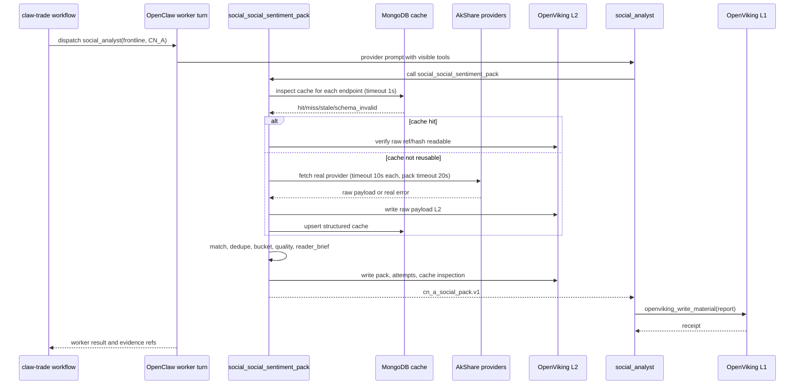
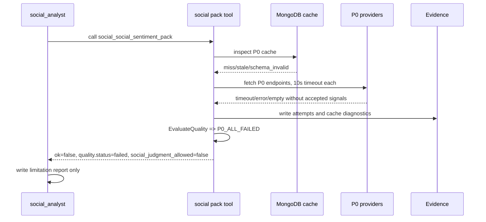
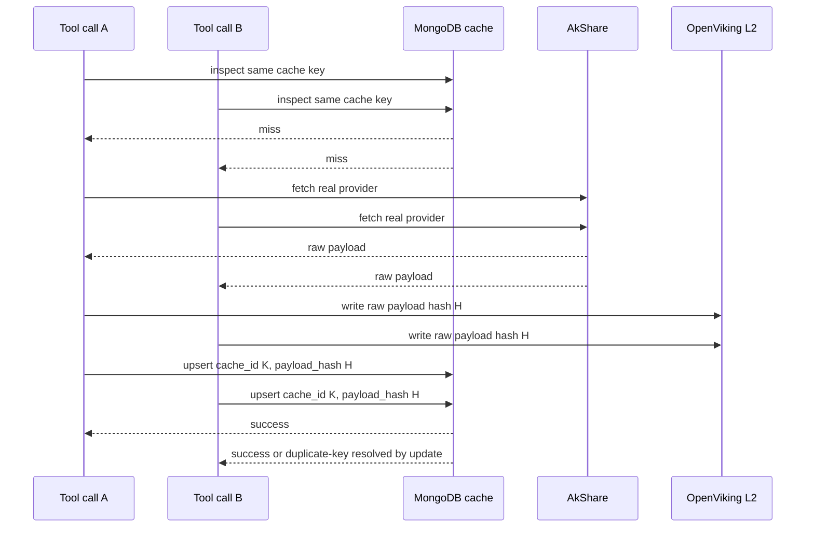
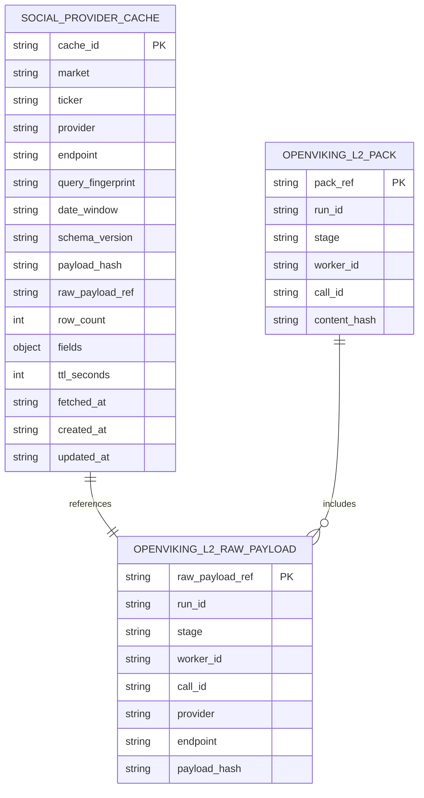

# CN_A social 数据服务层详细设计

## 1. 文档元信息

对应 HLD §1-§19。

对应总体设计文档：`docs/CN_A_social数据服务层设计方案.md`

总体设计版本：HLD v0.2

详细设计版本：DLD v0.1

变更历史：

| 版本 | 日期 | 变更 | 作者 |
|---|---|---|---|
| v0.1 | 2026-05-07 | Initial | Codex |

设计边界：

- 本 DLD 只覆盖 CN_A `social_social_sentiment_pack` 数据服务层。
- 不修改 `claw-trade` workflow authority。
- 不让 Python 代写 `social_analyst` 报告、情绪结论、投资建议、价格影响判断、KOL 观点或散户机构分歧。
- 不暴露底层 AkShare provider 原子接口给 worker。
- MongoDB 只作为 provider payload 结构化缓存与去重层，不作为材料批准权威。
- OpenViking 作为正式材料、L1/L2 证据、approved manifest 与下游读取权威。
- worker 之间的交接材料必须是 OpenViking L1 已批准自然语言文档或 approved summary 自然语言文档；不得把 JSON、raw payload、provider attempts、cache inspection 或结构化 evidence DTO 作为 worker 可读交接材料。
- 本 DLD 默认目标态覆盖 HLD M1-M5；HLD 未规定项统一写为“按 HLD 补充决议后启用”，并明确是否属于 M1/M2 验收范围。

## 2. 术语表与约定

对应 HLD §1-§19。

| 术语 | 含义 | 对应 HLD |
|---|---|---|
| CN_A | 中国 A 股市场 profile | §1, §3, §7 |
| `social_analyst` | OpenClaw 唤醒的 frontline 社交分析 worker，负责写正式 `social_sentiment_report` | §1, §2, §5, §13 |
| `social_social_sentiment_pack` | `social_analyst` 可见的唯一 social 资料包工具，只供给热度、关键词、相关标的和事实型线索 | §1, §2, §6 |
| skill-first | social 数据能力先作为 `social_analyst` 独立 skill 暴露，不新增独立 MCP | §1 |
| 单一资料包工具 | worker 只调用一个资料包入口，不直接拼底层 provider 结果 | §1, §6 |
| provider | 真实数据源适配层，例如 AkShare 东方财富热度相关接口 | §7 |
| P0 provider | 第一版核心数据源：目标热度、关键词、相关热股、全市场人气榜校验 | §7.1 |
| P1 provider | 增强数据源：热度飙升榜与雪球热度增强 | §7.1 |
| provider attempt | 每个 provider endpoint 的一次尝试记录，包含成功、失败、空结果、缓存状态、条数、错误原因和证据引用 | §2, §7.2, §10 |
| MongoDB cache | provider 原始结果的结构化缓存与去重层 | §1, §4.6, §8 |
| cache inspection | 每个 provider 调用前对缓存新鲜度、schema、字段完整性、hash 与 raw ref 的检查 | §7.2, §8.3 |
| OpenViking L1 | `social_analyst` 正式报告材料层 | §4.6 |
| OpenViking L2 | social 资料包、provider attempts、provider raw payload、hash 与来源说明的证据层 | §4.6, §8.4, §15 |
| approved manifest | 已批准 worker 材料给下游读取的权威清单 | §1, §4.6, §5 |
| worker 交接材料 | 下游 worker 可读取的已批准自然语言文档，包括 L1 正式报告和 approved summary；不包括 JSON、raw payload、provider attempts、cache inspection 或结构化 evidence DTO | §1, §4.6, §5, §15 |
| accepted signal | 经过目标匹配与证据回源检查，可进入目标相关资料包的线索 | §4.4, §9, §10 |
| rejected signal | 未匹配目标、来源不合格、字段缺失或证据不可追溯的线索 | §9 |
| `attention_signals` | 热度排名、热度值、排名变化、人气榜命中 | §9 |
| `topic_keyword_signals` | 热门关键词、关键词热度、关键词变化 | §9 |
| `related_symbol_signals` | 相关热门股票、主题联动和行业关联，只作关联线索 | §9 |
| `narrative_signals` | 由关键词、热度变化、可见文本组合出的事实型叙事线索 | §9 |
| `reader_brief` | 事实型中文摘要，只总结数量、来源、时间、匹配原因、线索类型和缺口 | §2, §12 |
| `quality.status` | 资料包质量状态，取值为 `complete`、`partial`、`failed` | §4.5, §11 |
| `social_judgment_allowed` | 数据层给 worker 的证据强弱标记，不是最终情绪结论 | §10, §11 |
| raw payload ref | 可追溯到 provider 原始返回的 OpenViking L2 URI | §8.3, §8.4, §15 |
| content hash | 对资料包、attempts 或 raw payload 的 SHA-256 指纹 | §8, §10, §15 |

详细设计新增内部术语：

| 术语 | 含义 |
|---|---|
| 资料包编排器 | 接收工具请求，生成查询计划，调度缓存、provider、证据、匹配、质量门和 brief 的模块 |
| 目标画像 | 由 ticker、公司名、行业、已批准简称组成的匹配输入 |
| 查询指纹 | 对 endpoint 与规范化参数做稳定序列化后生成的 SHA-256 |
| 证据指针 | 单条 signal 指向 raw payload 或 payload hash 的最小可复核信息 |
| 运行审计副本 | 与 OpenViking L2 同步落地的本地 evidence 文件，只供排障，不作为权威 |
| 自然语言交接文档 | 面向下游 worker 的中文 Markdown 正文，必须包含材料来源、时间范围、证据缺口和使用限制，不暴露机器结构作为主要阅读对象 |

约定：

- 目标语言：Python 3.12 typed pseudocode；实际实现可使用 Python 3.11+，但类型约束必须等价。
- 时间统一为带时区 ISO 8601 字符串；只返回日期的 provider 以 `as_of_date` 保存，并在 `source_time` 为空时记录 `evidence_gap`。
- 股票代码输入允许 `600519`、`600519.SH`、`SH600519`；内部规范化为 `600519.SH`，AkShare 东方财富接口按 endpoint 需要转换为 `100.600519` 或 `600519`。
- `schema_version` 固定为 `cn_a_social_pack.v1`，schema 变更必须走显式版本升级。
- `ok=true` 只表示资料包能给 worker 写限制内报告，不表示完整社交舆情覆盖。
- `quality.status=complete` 不得由缓存命中单独推出。
- 所有 provider 成败都必须进入 `provider_attempts`；成功、失败、空结果和取消都必须可追溯。

## 3. 系统上下文与部署视图

对应 HLD §1、§4.2、§4.6、§5、§6、§7、§8、§13、§15、§16。

### 3.1 部署拓扑

```text
claw-trade workflow 进程
  | 同步 dispatch，控制 worker 顺序
  v
OpenClaw 单 worker turn
  | 当前 turn 可见工具：
  | - social_social_sentiment_pack
  | - openviking_write_material
  v
social_analyst 独立 skill
  | 同进程工具调用或子进程脚本调用
  v
CN_A social data service
  | 先检查结构化缓存
  v
MongoDB provider cache
  | 命中新鲜且 schema 合格时返回 raw ref/hash
  v
CN_A social data service
  | 未命中或不可复用时调用真实 provider
  v
AkShare / 东方财富热度来源
  | raw payload
  v
OpenViking L2 evidence
  | raw ref/hash 回填
  v
CN_A social data service
  | 匹配、分桶、质量门、brief
  v
social_social_sentiment_pack tool result
  | worker 基于工具证据写报告
  v
openviking_write_material -> OpenViking L1 report
```

HLD 未规定 OpenClaw、OpenViking、MongoDB 的生产端口、容器编排方式、MongoDB 认证方式和具体数据库名。本 DLD 不新增服务端口；所有端口和凭据由现有运行环境配置注入。生产部署前按 §7 的部署清单执行。

### 3.2 节点资源预估

对应 HLD §5、§7.2、§8、§15。

| 节点 | 进程/容器 | 入站端口 | CPU | 内存 | 磁盘 | 连接池/并发 |
|---|---|---:|---:|---:|---:|---|
| `claw-trade` workflow | 现有 Python 进程 | 不新增 | 1 vCPU | 512 MiB | 运行证据按 run 增长 | OpenClaw client 1-4 |
| OpenClaw worker runtime | 现有 OpenClaw runtime | 沿用现有配置 | 1 vCPU | 1 GiB | OpenClaw state dir | 单 worker turn 并发由 workflow 控制 |
| `social_analyst` skill | OpenClaw 工具执行环境内 Python 模块 | 不新增 | 1 vCPU | 512 MiB | 单次工具 5-50 MiB 审计副本 | provider 并发最多 3 |
| MongoDB cache | 运行环境提供 | 由部署环境注入 | 2 vCPU | 4 GiB | 初始 20 GiB | `maxPoolSize=5` |
| OpenViking L2/L1 | 现有 OpenViking 能力 | 沿用现有配置 | 1 vCPU | 1 GiB | raw payload、pack、report | HTTP 或 runtime client pool 5 |
| AkShare / 东方财富来源 | 外部真实来源 | 不适用 | 不适用 | 不适用 | 不适用 | 单 endpoint 超时 10s |

性能预算：

- 单 provider timeout：10 秒。
- 整包 timeout：20 秒。
- provider 并发：最多 3。
- 单次 `social_social_sentiment_pack` 目标 P95：小于 20 秒。
- 单 run 证据磁盘预算：5-50 MiB，取决于 raw payload 行数。

HLD 未规定 QPS 与日调用量。本 DLD 按每个 `social_analyst` turn 1 次工具调用估算；生产容量评审按每日 run 数与并发 run 数给出容量结论。

### 3.3 网络分区与安全边界

对应 HLD §3、§4.1、§4.2、§4.6、§5、§6、§7.3。

- worker 只通过 OpenClaw stage policy 看到两个工具，不直接访问 MongoDB、OpenViking L2 写入接口或底层 provider。
- CN_A social data service 可访问 MongoDB、OpenViking L2 写入能力和 AkShare 真实来源。
- MongoDB 只允许 workflow/skill 所在受控网络访问；凭据不得写入代码、日志、资料包正文或 provider attempts。
- OpenViking approved manifest 是下游读取权威；social 数据服务不得扫描 OpenViking 目录猜测最新材料。
- 下游 worker 只能通过 approved manifest 读取自然语言交接文档；L2 JSON 证据、raw payload、provider attempts 与 cache inspection 只允许被 control、hard gate、审计或数据服务读取，不得作为 worker 交接输入。
- CN_A social 禁止使用 Stocktwits、Reddit、Yahoo、Google News 或非 CN_A profile 社交源作为主路径。

## 4. 模块详细设计

### 4.1 OpenClaw 工具暴露与 skill 挂载模块

对应 HLD §1、§3、§4.2、§5、§6、§13、§16、§17 M3、§18。

建议路径：

- `agents/social_analyst/STAGES.yaml`
- `agents/social_analyst/skills/manifest.yaml`
- `agents/social_analyst/skills/cn-a-social-data/SKILL.md`
- `agents/social_analyst/skills/cn-a-social-data/scripts/social_data_pack.py`

#### 4.1.1 职责与边界

MUST：

- 只向 CN_A `social_analyst` turn 暴露 `social_social_sentiment_pack` 与 `openviking_write_material`。
- 保持 worker 在 OpenClaw 中真实运行；工具调用必须发生在 worker turn 内。
- 将运行上下文传给资料包编排器，包括 `run_id`、`stage`、`worker_id`、`call_id`、`ticker`、`company_name`、`market`、`date_range` 和 approved artifact refs。
- 返回资料包编排器产生的 JSON，不在适配层改写质量状态和投资含义。

MUST NOT：

- 不暴露 `stock_hot_rank_latest_em`、`stock_hot_keyword_em`、`stock_hot_rank_relate_em`、`stock_hot_rank_em`、`stock_hot_follow_xq`、`stock_hot_tweet_xq`、`stock_hot_deal_xq` 给 worker。
- 不由 control plane 或 Python 预取 social 数据后塞入 prompt。
- 不写正式报告；正式报告只由 worker 调用 `openviking_write_material` 写入。
- 不调用 LLM、agent runner、chat completion 或 prompt template。
- 不使用 MongoDB cache 命中证明报告已批准。

依赖关系：

| 上游 | 下游 | 调用方向 | 同步性 |
|---|---|---|---|
| `claw-trade` workflow | OpenClaw worker runtime | workflow 唤醒 worker | 同步 dispatch |
| OpenClaw worker runtime | 工具暴露模块 | worker 调用 tool | 同步 |
| 工具暴露模块 | 资料包编排器 | Python 函数调用 | 同步 |
| worker | `openviking_write_material` | worker 写正式报告 | 同步 |

#### 4.1.2 核心数据结构

```python
# Language: Python 3.12 typed pseudocode
from dataclasses import dataclass
from typing import Literal

@dataclass(frozen=True)
class VisibleToolPolicy:
    worker_id: str                         # 必须为 "social_analyst"
    market_profile: str                    # 必须为 "CN_A"
    tool_names: tuple[str, ...]            # 必须精确等于 ("social_social_sentiment_pack", "openviking_write_material")
    openviking_access: Literal["write"]    # 只允许写正式报告

@dataclass(frozen=True)
class SocialToolRuntimeContext:
    run_id: str             # 非空；workflow run 标识
    stage: str              # 非空；必须为 frontline
    worker_id: str          # 非空；必须为 social_analyst
    call_id: str            # 非空；OpenClaw tool call 标识，每次调用唯一
    tool_name: str          # 非空；必须为 social_social_sentiment_pack
    evidence_root: str      # 非空；运行审计副本根目录
    current_time: str       # 非空；ISO 8601，带时区

@dataclass(frozen=True)
class SocialToolInput:
    ticker: str                         # 非空；A 股代码，允许 600519、600519.SH、SH600519
    market: str                         # 非空；必须为 CN_A
    company_name: str | None            # 可空；为空时只能依赖 ticker 与 approved profile
    industry: str | None                # 可空；仅用于背景线索归类，不得直接命中目标情绪
    start_date: str | None              # 可空；YYYY-MM-DD；为空时由 end_date 往前推 7 天
    end_date: str | None                # 可空；YYYY-MM-DD；为空时使用运行日期
    approved_artifact_refs: tuple[str, ...]  # 可空；只接收 workflow 传入的 approved refs
```

字段约束：

- `VisibleToolPolicy.tool_names` 必须集合精确相等；多一个或少一个都阻断 dispatch。
- `SocialToolInput.market != "CN_A"` 时返回失败资料包，错误码为 `SOCIAL_UNSUPPORTED_MARKET`。
- `ticker` 规范化失败时返回失败资料包，错误码为 `SOCIAL_INVALID_TICKER`。

#### 4.1.3 接口定义

内部接口：

```python
def resolve_social_visible_tools(worker_id: str, market_profile: str) -> VisibleToolPolicy
```

参数验证：

- `worker_id == "social_analyst"`。
- `market_profile == "CN_A"`。

返回：

- `VisibleToolPolicy`。

错误码：

| 错误码 | 条件 | 可恢复 | 传播 |
|---|---|---|---|
| `SOCIAL_TOOL_POLICY_WORKER_MISMATCH` | worker 不是 `social_analyst` | 否 | control 阻断 dispatch |
| `SOCIAL_TOOL_POLICY_PROFILE_MISMATCH` | profile 不是 CN_A | 否 | profile policy 显式失败 |
| `SOCIAL_TOOL_POLICY_LEAK` | 可见工具包含非批准工具 | 否 | control 阻断 dispatch |
| `SOCIAL_TOOL_POLICY_MISSING_WRITE` | 缺 `openviking_write_material` | 否 | control 阻断 dispatch |

外部可见工具：

| 工具名 | 协议 | 请求 schema | 响应 schema | 幂等性 | 限流 | 调用频次 |
|---|---|---|---|---|---|---|
| `social_social_sentiment_pack` | OpenClaw skill tool | `SocialToolInput` JSON | `SocialSentimentPack` JSON | 同一 `call_id` 的 evidence 目录只写一次；重复工具调用生成新 `call_id` | 单 worker turn 1 次；并发由 workflow 限制 | 每个 CN_A social turn 1 次 |

#### 4.1.4 核心算法与业务流程

```text
FUNCTION ResolveSocialVisibleTools(worker_id, profile):
    IF worker_id != "social_analyst":
        RAISE SOCIAL_TOOL_POLICY_WORKER_MISMATCH
    IF profile != "CN_A":
        RAISE SOCIAL_TOOL_POLICY_PROFILE_MISMATCH

    tools = StagePolicy.Resolve(worker_id, profile)
    expected = {"social_social_sentiment_pack", "openviking_write_material"}
    IF Set(tools) != expected:
        IF Any(tool IN tools FOR tool IN DISALLOWED_PROVIDER_TOOL_NAMES):
            RAISE SOCIAL_TOOL_POLICY_LEAK
        RAISE SOCIAL_TOOL_POLICY_MISSING_WRITE

    RETURN VisibleToolPolicy(worker_id, profile, Tuple(tools), "write")
```

时间复杂度：O(n)，n 为 stage policy 返回工具数。

#### 4.1.5 状态机

| 状态 | 触发 | 下一状态 | 失败处理 |
|---|---|---|---|
| `policy_loaded` | 读取 worker/profile policy | `tool_set_validating` | policy 不存在则阻断 dispatch |
| `tool_set_validating` | 对比批准工具集合 | `tool_set_ready` | 泄露 provider 工具则阻断 dispatch |
| `tool_set_ready` | OpenClaw 构建 provider request | `worker_turn_running` | request evidence 记录失败则阻断验收 |
| `worker_turn_running` | worker 调用 social 工具 | `pack_call_running` | 未调用工具则 prompt/contract gate 失败 |
| `pack_call_running` | 工具返回资料包 | `worker_writes_report` | 工具异常返回 failed pack，worker 写限制说明 |
| `worker_writes_report` | worker 调用 OpenViking 写报告 | `report_written` | 写入失败则 worker 如实停止 |

#### 4.1.6 错误处理策略

- 可恢复错误：工具返回 `quality.status=partial` 或 `failed`，worker 仍可写限制说明报告；例如某个 provider 超时。
- 不可恢复错误：工具泄露、worker 被绕过、profile 错误、底层 provider 工具直接暴露、Python 代写结论。
- 重试策略：工具暴露模块不重试 worker turn；provider 重试由 §4.3 控制。
- 熔断策略：不设置跨 run provider 熔断；同一次工具调用内超时的 endpoint 标为失败，不继续等待。
- 错误传播：policy 错误向 control 抛出；工具运行错误进入 `provider_attempts.error`、`quality.warnings` 和 evidence。

#### 4.1.7 数据存储设计

本模块不创建持久表。必须保存的运行证据由 §4.5 负责：

- visible tools evidence。
- final provider request。
- tool call 与 tool result。
- OpenViking report receipt。

#### 4.1.8 非功能性设计

- 性能：policy 解析 P99 小于 50ms。
- metrics：`social.tool_policy.resolve.count`、`social.tool_policy.violation.count`。
- 日志：记录 `run_id`、`worker_id`、`stage`、`tool_names`、错误码；不记录密钥。
- trace span：`social.tool_policy.resolve`、`social.tool.call`。
- 安全：工具集合必须白名单精确匹配；底层 provider 名称不得出现在 worker visible tools。

### 4.2 资料包编排模块

对应 HLD §1、§2、§3、§4.1、§4.2、§4.5、§5、§7.2、§8.4、§10、§11、§16、§17 M1-M2。

建议路径：

- `agents/social_analyst/skills/cn-a-social-data/scripts/social_data_pack.py`

#### 4.2.1 职责与边界

MUST：

- 接收工具输入和运行上下文。
- 规范化 ticker、市场、日期窗口与目标画像。
- 生成 provider 查询计划。
- 对每个 provider 执行 cache inspection，再决定是否复用 raw payload 或调用真实 provider。
- 收集所有 provider attempts，不因单个 provider 成功而停止整体资料包。
- 调用匹配、分桶、质量门、brief 和证据模块。
- 返回 `cn_a_social_pack.v1` JSON。

MUST NOT：

- 不直接调用 LLM。
- 不写正式社交分析报告。
- 不输出买入、卖出、持有、看多、看空或价格影响判断。
- 不把 related symbol 直接写成目标公司情绪。
- 不把 cache hit 当作 `complete` 的充分条件。

依赖关系：

| 上游 | 下游 | 调用方向 | 同步性 |
|---|---|---|---|
| 工具暴露模块 | 资料包编排器 | 调用 | 同步 |
| 资料包编排器 | profile/config 模块 | 调用 | 同步 |
| 资料包编排器 | MongoDB cache 模块 | 调用 | 同步 |
| 资料包编排器 | provider 模块 | 调用 | 并发受控 |
| 资料包编排器 | evidence 模块 | 调用 | 同步写入 |
| 资料包编排器 | matching/quality/brief 模块 | 调用 | 同步 |

#### 4.2.2 核心数据结构

```python
# Language: Python 3.12 typed pseudocode
from dataclasses import dataclass
from typing import Any, Literal

QualityStatus = Literal["complete", "partial", "failed"]
CacheStatus = Literal["hit", "miss", "stale", "schema_invalid", "write_failed", "not_configured"]
ProviderStatus = Literal["success", "empty", "error", "timeout", "cancelled"]

@dataclass(frozen=True)
class DateWindow:
    start_date: str       # YYYY-MM-DD；包含
    end_date: str         # YYYY-MM-DD；包含
    as_of_date: str       # YYYY-MM-DD；无日期 provider 使用

@dataclass(frozen=True)
class SocialTargetProfile:
    ticker: str                  # 规范化代码，例如 600519.SH
    ticker_plain: str            # 6 位数字代码，例如 600519
    eastmoney_symbol: str        # 东方财富格式，例如 100.600519
    company_name: str | None     # 公司全称；来自运行变量或 approved profile
    market: Literal["CN_A"]      # 固定 CN_A
    industry: str | None         # 行业；只作背景归类
    approved_aliases: tuple[str, ...]  # 已批准简称；不得信任 worker 自报

@dataclass(frozen=True)
class ProviderQuery:
    provider: str             # 固定为 akshare，或 HLD 批准的 P1 provider 名
    endpoint: str             # HLD §7.1 列出的 endpoint
    priority: Literal["P0", "P1"]
    query: dict[str, Any]     # endpoint 参数；必须可稳定序列化
    query_fingerprint: str    # sha256:<hex>
    date_window: DateWindow   # 查询窗口
    timeout_seconds: int      # 默认 10

@dataclass
class ProviderAttempt:
    provider: str
    endpoint: str
    priority: Literal["P0", "P1"]
    query: str
    ok: bool
    status: ProviderStatus
    elapsed_ms: int
    raw_count: int
    accepted_count: int
    cache_status: CacheStatus
    cache_key: str | None
    payload_hash: str | None
    raw_payload_ref: str | None
    empty_reason: str | None
    error: dict[str, str] | None
    cancelled: bool

@dataclass(frozen=True)
class PublicSocialProfile:
    ticker: str                  # 例如 600519.SH
    company_name: str | None
    market: Literal["CN_A"]
    industry: str | None

@dataclass
class ProviderExecutionResult:
    query: ProviderQuery
    attempt: ProviderAttempt
    raw_rows: list[NormalizedProviderRow]
    raw_payload_ref: str | None
    payload_hash: str | None
    cache_inspection: CacheInspectionResult

@dataclass
class SocialQuality:
    status: QualityStatus
    attention_signal_count: int
    topic_keyword_count: int
    related_symbol_count: int
    narrative_signal_count: int
    accepted_count: int
    missing_fields: list[str]
    social_judgment_allowed: bool
    warnings: list[dict[str, str]]

@dataclass
class SocialEvidence:
    pack_path: str
    provider_attempts_path: str
    cache_inspection_path: str
    raw_payload_refs: list[str]
    content_hash: str

@dataclass
class SocialSentimentPack:
    schema_version: str
    ok: bool
    profile: PublicSocialProfile
    query_plan: dict[str, Any]
    provider_attempts: list[ProviderAttempt]
    data: dict[str, list[dict[str, Any]]]
    quality: SocialQuality
    reader_brief: str
    evidence: SocialEvidence
```

#### 4.2.3 接口定义

内部接口：

```python
def build_social_sentiment_pack(
    tool_input: SocialToolInput,
    context: SocialToolRuntimeContext,
    config: SocialDataConfig,
) -> SocialSentimentPack

def serialize_public_profile(profile: SocialTargetProfile) -> PublicSocialProfile
```

参数验证：

- `tool_input.market == "CN_A"`。
- `context.worker_id == "social_analyst"`。
- `context.stage == "frontline"`。
- `context.tool_name == "social_social_sentiment_pack"`。
- `ticker` 必须规范化为 CN_A 股票代码。
- `start_date <= end_date`。

返回：

- 成功、部分成功或失败都返回 `SocialSentimentPack`；运行环境异常才抛出 `SocialDataFatalError`。
- `serialize_public_profile` 只返回 HLD 约定字段，不暴露 `ticker_plain`、`eastmoney_symbol`、`approved_aliases`。

错误码：

| 错误码 | 条件 | 资料包状态 |
|---|---|---|
| `SOCIAL_INVALID_INPUT` | 入参缺少必填字段或日期非法 | `failed` |
| `SOCIAL_UNSUPPORTED_MARKET` | market 不是 CN_A | `failed` |
| `SOCIAL_INVALID_TICKER` | ticker 无法规范化 | `failed` |
| `SOCIAL_PROFILE_RESOLVE_FAILED` | 无法形成目标画像 | `failed` |
| `SOCIAL_PACK_TIMEOUT` | 整包超过 20 秒 | `partial` 或 `failed`，取决于已完成 signals |
| `SOCIAL_EVIDENCE_WRITE_FAILED` | pack/attempts/OpenViking L2 证据写入失败 | `failed`，如果 accepted signals 无可追溯 ref |
| `SOCIAL_PROVIDER_PLAN_EMPTY` | 无任何启用 provider | `failed` |

调用频次：

- 每个 CN_A `social_analyst` turn 1 次。
- QPS 目标：HLD 未规定；按 workflow 并发 run 数评估，单进程最多 3 个 provider 并发。

#### 4.2.4 核心算法与业务流程

```text
FUNCTION BuildSocialSentimentPack(input, context, config):
    started_at = Now()
    execution_results = []
    cache_inspections = []

    IF context.worker_id != "social_analyst" OR context.stage != "frontline":
        RETURN FailedPack(SOCIAL_INVALID_INPUT)
    IF input.market != "CN_A":
        RETURN FailedPack(SOCIAL_UNSUPPORTED_MARKET)

    profile_result = ResolveSocialTargetProfile(input, context, config)
    IF profile_result.failed:
        RETURN FailedPack(SOCIAL_PROFILE_RESOLVE_FAILED)

    date_window = ResolveDateWindow(input.start_date, input.end_date, context.current_time)
    IF date_window.invalid:
        RETURN FailedPack(SOCIAL_INVALID_INPUT)

    provider_plan = BuildProviderPlan(profile_result.profile, date_window, config)
    IF provider_plan IS EMPTY:
        RETURN FailedPack(SOCIAL_PROVIDER_PLAN_EMPTY)

    BEGIN TOOL CALL DEADLINE timeout=config.pack_timeout_seconds:
        FOR EACH query IN provider_plan WITH concurrency <= config.provider_max_concurrency:
            cache_result = InspectProviderCache(query, config)
            cache_inspections.APPEND(cache_result)
            WriteCacheInspectionAudit(cache_result)

            IF cache_result.status == "hit":
                cached_raw_rows = load_rows_by_raw_payload_ref(
                    ref=cache_result.raw_payload_ref,
                    expected_hash=cache_result.payload_hash
                )
                cached_raw_result = RawProviderResultFromCacheHit(
                    query=query,
                    raw_rows=cached_raw_rows,
                    payload_hash=cache_result.payload_hash
                )
                rows = normalize_provider_payload(
                    query=query,
                    raw_result=cached_raw_result,
                    raw_payload_ref=cache_result.raw_payload_ref
                )
                attempt = ProviderAttemptFromCacheHit(query, cache_result, RowCount(rows))
                execution_results.APPEND(
                    ProviderExecutionResult(
                        query=query,
                        attempt=attempt,
                        raw_rows=rows,
                        raw_payload_ref=cache_result.raw_payload_ref,
                        payload_hash=cache_result.payload_hash,
                        cache_inspection=cache_result,
                    )
                )
            ELSE:
                provider_result = FetchProvider(query, timeout=config.provider_timeout_seconds)
                IF provider_result.ok:
                    raw_evidence_result = try_write_raw_payload_evidence(
                        target=BuildEvidenceTarget(context),
                        provider=query.provider,
                        endpoint=query.endpoint,
                        raw_payload=provider_result.raw_payload
                    )
                    IF raw_evidence_result.ok IS FALSE:
                        attempt = ProviderAttemptEvidenceFailed(query, provider_result)
                        execution_results.APPEND(
                            ProviderExecutionResult(
                                query=query,
                                attempt=attempt,
                                raw_rows=[],
                                raw_payload_ref=None,
                                payload_hash=None,
                                cache_inspection=cache_result,
                            )
                        )
                    ELSE:
                        raw_evidence = raw_evidence_result.evidence
                        cache_write = UpsertProviderCache(
                            query,
                            provider_result,
                            raw_evidence.raw_payload_ref
                        )
                        rows = normalize_provider_payload(
                            query=query,
                            raw_result=provider_result,
                            raw_payload_ref=raw_evidence.raw_payload_ref
                        )
                        attempt = ProviderAttemptFromLiveResult(
                            query=query,
                            provider_result=provider_result,
                            raw_ref=raw_evidence.raw_payload_ref,
                            cache_write=cache_write,
                            row_count=RowCount(rows)
                        )
                        execution_results.APPEND(
                            ProviderExecutionResult(
                                query=query,
                                attempt=attempt,
                                raw_rows=rows,
                                raw_payload_ref=raw_evidence.raw_payload_ref,
                                payload_hash=raw_evidence.payload_hash,
                                cache_inspection=cache_result,
                            )
                        )
                ELSE:
                    attempt = ProviderAttemptFromError(query, provider_result)
                    execution_results.APPEND(
                        ProviderExecutionResult(
                            query=query,
                            attempt=attempt,
                            raw_rows=[],
                            raw_payload_ref=None,
                            payload_hash=None,
                            cache_inspection=cache_result,
                        )
                    )

    IF deadline_exceeded:
        MarkUnfinishedQueriesCancelled(execution_results, provider_plan)

    attempts = [result.attempt FOR result IN execution_results]
    normalized_rows = normalize_provider_rows(execution_results)
    bucketed = MatchDeduplicateAndBucket(normalized_rows, profile_result.profile, config)
    quality_input = QualityInput(
        attempts=Tuple(attempts),
        buckets=bucketed,
        required_p0_endpoints=RequiredP0Endpoints(provider_plan)
    )
    quality = evaluate_social_quality(quality_input)
    brief_input = ReaderBriefInput(
        profile=profile_result.profile,
        attempts=Tuple(attempts),
        buckets=bucketed,
        quality=quality,
        date_window=date_window
    )
    brief = build_reader_brief(brief_input)

    pack_body = BuildPackBody(
        schema_version="cn_a_social_pack.v1",
        ok=(quality.status != "failed"),
        profile=serialize_public_profile(profile_result.profile),
        query_plan=RenderQueryPlan(provider_plan, profile_result.profile, date_window),
        provider_attempts=attempts,
        data=bucketed,
        quality=quality,
        reader_brief=brief,
    )
    pack_body_hash = Sha256(CanonicalJson(pack_body))
    evidence = WritePackEvidence(
        target=BuildEvidenceTarget(context),
        pack_body=pack_body,
        attempts=attempts,
        cache_inspections=cache_inspections,
        pack_body_hash=pack_body_hash
    )
    final_content_hash = Sha256(CanonicalJson({
        "pack_body_hash": pack_body_hash,
        "pack_path": evidence.pack_path,
        "provider_attempts_path": evidence.provider_attempts_path,
        "cache_inspection_path": evidence.cache_inspection_path
    }))

    pack = SocialSentimentPack(
        schema_version=pack_body["schema_version"],
        ok=pack_body["ok"],
        profile=pack_body["profile"],
        query_plan=pack_body["query_plan"],
        provider_attempts=pack_body["provider_attempts"],
        data=pack_body["data"],
        quality=pack_body["quality"],
        reader_brief=pack_body["reader_brief"],
        evidence=SocialEvidence(
            pack_path=evidence.pack_path,
            provider_attempts_path=evidence.provider_attempts_path,
            cache_inspection_path=evidence.cache_inspection_path,
            raw_payload_refs=evidence.raw_payload_refs,
            content_hash=final_content_hash
        )
    )

    IF pack.quality.status != "failed" AND AnyAcceptedSignalMissingEvidenceRef(pack.data):
        pack = DowngradeToFailed(pack, SOCIAL_EVIDENCE_REF_MISSING)

    RETURN pack
```

分支要求：

- `cache hit` 只跳过同 endpoint 网络请求，不跳过质量门。
- `cache stale/schema_invalid` 必须继续调用真实 provider；真实 provider 失败时不得使用不可复用 cache 作为当前事实。
- P1 成功但 P0 全失败时不得生成 `complete`。
- 没有 accepted signals 时必须 `ok=false`。
- accepted signals 无 raw ref/hash 时必须 `failed`。

时间复杂度：

- Provider 调度 O(p)，p 为启用 provider 数。
- 去重排序 O(s log s)，s 为 provider 返回候选 signal 数。

#### 4.2.5 状态机

| 状态 | 触发 | 下一状态 | 失败处理 |
|---|---|---|---|
| `input_received` | 工具被调用 | `profile_resolved` | 入参错误返回 failed pack |
| `profile_resolved` | 目标画像形成 | `provider_plan_built` | 无画像返回 failed pack |
| `provider_plan_built` | provider plan 非空 | `cache_inspecting` | plan 为空返回 failed pack |
| `cache_inspecting` | 每个 provider 先查 cache | `provider_fetching` 或 `payload_reused` | cache 不可复用继续真实 provider |
| `provider_fetching` | 调用真实 provider | `raw_evidence_writing` | provider 失败写 attempt |
| `raw_evidence_writing` | OpenViking L2 写入 raw | `cache_upserting` | raw 证据失败则该 provider 不产生 accepted signals |
| `cache_upserting` | MongoDB upsert | `signal_processing` | cache 写失败写 warning，不改变 raw 证据事实 |
| `signal_processing` | 归一化、匹配、分桶 | `quality_evaluating` | 无可解析结构则 failed |
| `quality_evaluating` | 质量门判断 | `brief_building` | failed 仍生成限制说明 brief |
| `brief_building` | 生成事实型 brief | `pack_evidence_writing` | brief 失败返回 failed pack |
| `pack_evidence_writing` | 写 pack/attempts | `pack_returned` | evidence 失败返回 failed pack |

#### 4.2.6 错误处理策略

- 可恢复：单 provider 超时、空结果、部分字段缺失、cache miss、cache stale、MongoDB upsert 失败。
- 不可恢复：输入 market 非 CN_A、ticker 规范化失败、所有 P0 失败、无 accepted signals、accepted signals 无证据 ref。
- 重试：provider 默认 1 次真实请求；HLD 未批准跨 provider 重排，不做额外补救。
- 熔断：单次调用内到达整包 deadline 后取消未开始或未完成 provider，写 `cancelled=true`。
- 错误传播：所有 provider 级错误进入 `provider_attempts.error`；资料包级错误进入 `quality.warnings`。

#### 4.2.7 数据存储设计

本模块不直接持久化业务表；它通过：

- §4.4 写 MongoDB cache。
- §4.5 写 OpenViking L2 与运行审计副本。

#### 4.2.8 非功能性设计

- P50：cache hit 场景小于 2 秒。
- P95：真实 provider 场景小于 20 秒。
- metrics：`social.pack.call.count`、`social.pack.duration_ms`、`social.pack.status.count`、`social.pack.timeout.count`。
- 日志字段：`run_id`、`call_id`、`ticker`、`provider`、`endpoint`、`cache_status`、`quality.status`、`content_hash`。
- trace span：`social.pack.build`、`social.provider.plan`、`social.signal.process`、`social.quality.evaluate`。
- 安全：日志和资料包不得包含 MongoDB URI、provider token、OpenViking credential。

### 4.3 Provider 调度与真实数据适配模块

对应 HLD §2、§4.1、§7.1、§7.2、§7.3、§10、§16、§17 M1。

建议路径：

- `agents/social_analyst/skills/cn-a-social-data/scripts/providers.py`

#### 4.3.1 职责与边界

MUST：

- 封装 HLD §7.1 批准的数据源调用。
- 为每个 endpoint 生成标准 raw payload、row_count、elapsed_ms、error 和 payload_hash。
- 支持 P0 全部尝试，P1 按配置启用后尝试。
- 将 provider 返回结构归一化为候选 rows，不做最终情绪判断。

MUST NOT：

- 不调用 CN_A 禁止来源。
- 不把 provider 失败包装为成功。
- 不调用 news 公司新闻接口补 social 线索。
- 不生成未返回的帖子正文、用户评论、KOL 观点或散户机构分歧。

依赖关系：

| 上游 | 下游 | 调用方向 | 同步性 |
|---|---|---|---|
| 资料包编排器 | provider 调度模块 | 调用 | 并发受控 |
| provider 调度模块 | AkShare | 函数调用并访问真实来源 | 同步，带 timeout |
| provider 调度模块 | evidence 模块 | 传递 raw payload | 同步 |

#### 4.3.2 核心数据结构

```python
# Language: Python 3.12 typed pseudocode
@dataclass(frozen=True)
class ProviderSpec:
    provider: str                  # "akshare"
    endpoint: str                  # HLD §7.1 endpoint
    priority: Literal["P0", "P1"]
    role: str                      # 目标热度快照、目标热门关键词、相关热门股票等
    enabled: bool                  # 默认 P0 true；P1 由配置控制
    required_for_complete: bool    # P0 true；P1 false
    timeout_seconds: int           # 默认 10
    max_rows: int                  # latest/keyword/related 默认 20，rank 默认 100

@dataclass
class RawProviderResult:
    provider: str
    endpoint: str
    query: dict[str, Any]
    ok: bool
    status: ProviderStatus
    raw_payload: Any | None
    raw_count: int
    elapsed_ms: int
    empty_reason: str | None
    error: dict[str, str] | None
    payload_hash: str | None

@dataclass(frozen=True)
class NormalizedProviderRow:
    provider: str
    endpoint: str
    platform: str                 # 东方财富、雪球等 provider 可见平台名
    source_kind: Literal["heat_rank", "heat_keyword", "related_symbol", "narrative_text"]
    raw_index: int                 # raw payload 中的行号
    fields: dict[str, Any]         # 归一化字段，不删除 raw payload
    payload_hash: str              # raw payload hash
    raw_payload_ref: str           # OpenViking L2 URI
```

Endpoint 映射：

| 优先级 | endpoint | AkShare 调用 | 查询参数 | 最多行数 | 输出用途 |
|---|---|---|---|---:|---|
| P0 | `stock_hot_rank_latest_em` | `ak.stock_hot_rank_latest_em(symbol=eastmoney_symbol)` | `symbol=100.600519`（示例） | 20 | `attention_signals` |
| P0 | `stock_hot_keyword_em` | `ak.stock_hot_keyword_em(symbol=eastmoney_symbol)` | `symbol=100.600519`（示例） | 20 | `topic_keyword_signals` |
| P0 | `stock_hot_rank_relate_em` | `ak.stock_hot_rank_relate_em(symbol=eastmoney_symbol)` | `symbol=100.600519`（示例） | 20 | `related_symbol_signals` |
| P0 | `stock_hot_rank_em` | `ak.stock_hot_rank_em()` | 无 ticker 参数，后续按代码精确过滤 | 100 | 全市场人气榜校验 |
| P1 | `stock_hot_up_em` | `ak.stock_hot_up_em()` | 无 ticker 参数，后续按代码精确过滤 | 100 | 升温线索增强 |
| P1 | 雪球热度接口 | HLD 仅给“AkShare 雪球热度接口”能力描述 | 第一阶段禁用，不在 M1/M2 验收范围；启用需 HLD 增补 endpoint 与字段 | 不适用 | 关注/讨论/交易热度增强 |

`ToEastmoneySymbol` 规则（可编码）：

- 输入 `600519` -> 先规范化为 `600519.SH`，输出 `100.600519`。
- 输入 `600519.SH` -> 输出 `100.600519`。
- 输入 `SH600519` -> 先规范化为 `600519.SH`，输出 `100.600519`。
- 输入 `000001.SZ` -> 输出 `0.000001`。
- 输入 `SZ000001` -> 先规范化为 `000001.SZ`，输出 `0.000001`。
- 若无法从代码或后缀判定交易所（例如仅有 `12345`、后缀未知），抛出 `SOCIAL_INVALID_TICKER_MARKET_PREFIX` 并使资料包 `failed`；不得猜测市场前缀。

#### 4.3.3 接口定义

内部接口：

```python
def build_provider_plan(
    profile: SocialTargetProfile,
    date_window: DateWindow,
    config: SocialDataConfig,
) -> list[ProviderQuery]

def fetch_provider_payload(query: ProviderQuery) -> RawProviderResult

def normalize_provider_payload(
    query: ProviderQuery,
    raw_result: RawProviderResult,
    raw_payload_ref: str,
) -> list[NormalizedProviderRow]

def load_rows_by_raw_payload_ref(
    ref: str,
    expected_hash: str | None,
) -> list[dict[str, Any]]

def normalize_provider_rows(
    execution_results: list[ProviderExecutionResult],
) -> list[NormalizedProviderRow]
```

参数验证：

- `query.provider` 必须在批准 provider 集合中。
- `query.endpoint` 必须在 HLD §7.1 批准 endpoint 集合中。
- P1 雪球热度接口在 HLD 补充 endpoint/字段前保持 `enabled=false`。

错误码：

| 错误码 | 条件 | attempt.status |
|---|---|---|
| `SOCIAL_PROVIDER_TIMEOUT` | endpoint 超过 10 秒 | `timeout` |
| `SOCIAL_PROVIDER_EXCEPTION` | provider library 抛异常 | `error` |
| `SOCIAL_PROVIDER_EMPTY` | 返回可解析但无行 | `empty` |
| `SOCIAL_PROVIDER_SCHEMA_INVALID` | 返回结构缺少必要字段且无法归一化 | `error` |
| `SOCIAL_PROVIDER_FORBIDDEN_SOURCE` | endpoint 属于禁用来源 | `error` |
| `SOCIAL_PROVIDER_DISABLED_BY_POLICY` | endpoint 未进入当前阶段批准清单 | `cancelled` |
| `SOCIAL_RAW_REF_NOT_READABLE` | cache hit 的 raw_payload_ref 无法读取 | `error` |
| `SOCIAL_RAW_HASH_MISMATCH` | cache hit 的 raw rows 计算 hash 与 expected_hash 不一致 | `error` |
| `SOCIAL_ROW_EVIDENCE_INCOMPLETE` | rows 缺 `raw_payload_ref/payload_hash/raw_index` | `error` |

调用频次：

- 每个 pack 默认 4 个 P0 endpoint。
- P1 开启后最多增加 2 个 endpoint。
- 每个 endpoint 每次 pack 至多调用一次；cache hit 时不发起同 endpoint 网络请求。

接口约束：

- cache-hit：`load_rows_by_raw_payload_ref(ref, expected_hash)` 返回“已脱敏 canonical raw rows”。
- live-provider：先通过 `normalize_provider_payload(...)` 生成 normalized rows，再写入 `ProviderExecutionResult.raw_rows`。
- `normalize_provider_rows(execution_results)` 不重复做 endpoint 字段映射；只执行汇总、证据指针补齐校验与一致性检查。

#### 4.3.4 核心算法与业务流程

```text
FUNCTION BuildProviderPlan(profile, date_window, config):
    specs = LoadApprovedProviderSpecs(config)
    plan = []
    FOR EACH spec IN specs:
        IF spec.enabled IS FALSE:
            CONTINUE
        IF spec.endpoint == "xueqiu_heat" AND spec.enabled IS FALSE:
            CONTINUE
        query = BuildEndpointQuery(spec, profile, date_window)
        fingerprint = Sha256(CanonicalJson(query))
        plan.APPEND(ProviderQuery(spec.provider, spec.endpoint, spec.priority, query, fingerprint, date_window, spec.timeout))
    RETURN plan

FUNCTION FetchProviderPayload(query):
    start = MonotonicNow()
    TRY WITH timeout=query.timeout_seconds:
        IF query.endpoint == "stock_hot_rank_latest_em":
            payload = ak.stock_hot_rank_latest_em(symbol=query.query["symbol"])
        ELSE IF query.endpoint == "stock_hot_keyword_em":
            payload = ak.stock_hot_keyword_em(symbol=query.query["symbol"])
        ELSE IF query.endpoint == "stock_hot_rank_relate_em":
            payload = ak.stock_hot_rank_relate_em(symbol=query.query["symbol"])
        ELSE IF query.endpoint == "stock_hot_rank_em":
            payload = ak.stock_hot_rank_em()
        ELSE IF query.endpoint == "stock_hot_up_em":
            payload = ak.stock_hot_up_em()
        ELSE:
            RETURN Error(SOCIAL_PROVIDER_FORBIDDEN_SOURCE)

        rows = DataFrameToRecords(payload)
        IF rows IS EMPTY:
            RETURN EmptyResult(query, elapsed_ms)
        payload_hash = Sha256(CanonicalJson(rows))
        RETURN Success(query, rows, payload_hash, elapsed_ms)
    CATCH Timeout:
        RETURN TimeoutResult(query, elapsed_ms)
    CATCH Exception AS exc:
        RETURN ErrorResult(query, SOCIAL_PROVIDER_EXCEPTION, Redact(exc), elapsed_ms)

FUNCTION load_rows_by_raw_payload_ref(ref, expected_hash):
    payload = ReadOpenVikingL2Json(ref)
    IF payload.read_failed:
        RAISE SOCIAL_RAW_REF_NOT_READABLE
    canonical_rows = DataToCanonicalRows(payload)
    actual_hash = Sha256(CanonicalJson(canonical_rows))
    IF expected_hash IS NOT EMPTY AND actual_hash != expected_hash:
        RAISE SOCIAL_RAW_HASH_MISMATCH
    RETURN canonical_rows

FUNCTION normalize_provider_rows(execution_results):
    normalized_rows = []
    FOR EACH result IN execution_results:
        FOR EACH row IN result.raw_rows:
            IF Missing(row.raw_payload_ref) OR Missing(row.payload_hash) OR Missing(row.raw_index):
                RAISE SOCIAL_ROW_EVIDENCE_INCOMPLETE
            normalized_rows.APPEND(row)
    RETURN normalized_rows
```

归一化规则：

- 保留 raw payload 完整证据，不在 raw 层删除字段。
- `stock_hot_rank_latest_em` 返回的 `item/value` 组合归一化为 `source_kind=heat_rank`。
- `stock_hot_keyword_em` 返回的关键词字段归一化为 `source_kind=heat_keyword`。
- `stock_hot_rank_relate_em` 返回的代码/名称/热度字段归一化为 `source_kind=related_symbol`。
- `stock_hot_rank_em` 和 `stock_hot_up_em` 必须按目标代码精确过滤，未命中目标时进入 rejected 或统计缺口。
- 字段名不稳定时只允许通过 endpoint 专属字段映射解析；缺必需字段则 schema invalid。

时间复杂度：O(r)，r 为 endpoint 返回行数。

#### 4.3.5 状态机

| 状态 | 触发 | 下一状态 | 失败处理 |
|---|---|---|---|
| `planned` | provider query 建立 | `cache_inspection_required` | endpoint 未批准则不进入 plan |
| `cache_inspection_required` | 编排器请求 cache 检查 | `cache_hit` 或 `live_fetch_required` | cache 异常写诊断后走真实 provider |
| `live_fetch_required` | cache 不可复用 | `fetching` | provider 未启用则 cancelled |
| `fetching` | 发起真实调用 | `fetched`、`empty`、`timeout`、`error` | 写 attempt |
| `fetched` | raw payload 可解析 | `raw_evidence_required` | raw 写入失败则该 provider 不产生 accepted signals |
| `raw_evidence_required` | OpenViking L2 写入 raw | `normalizable` | 失败写 evidence error |
| `normalizable` | raw ref/hash 存在 | `rows_normalized` | schema invalid 写 attempt |

#### 4.3.6 错误处理策略

- 可恢复：单 endpoint empty、timeout、provider exception、schema invalid；其它 endpoint 继续。
- 不可恢复：所有 P0 provider 均失败；由质量门输出 `failed`。
- 重试：单 endpoint 默认 1 次；HLD 未批准多次重试预算。
- 熔断：整包 deadline 触发后取消未完成 endpoint，写 `cancelled=true`。
- 错误传播：每个错误进入 `ProviderAttempt.error`，包括 `code`、`message`、`provider`、`endpoint`；异常消息必须脱敏。

#### 4.3.7 数据存储设计

Provider 模块不直接存储；它返回 raw result 给：

- §4.5 写 OpenViking L2 raw payload。
- §4.4 upsert MongoDB cache。

#### 4.3.8 非功能性设计

- provider timeout：10 秒。
- 最大行数：latest/keyword/related 20；rank/up 100。
- metrics：`social.provider.call.count`、`social.provider.duration_ms`、`social.provider.status.count`、`social.provider.rows.count`。
- 日志：记录 endpoint、elapsed_ms、row_count、error code；不记录认证信息。
- trace span：`social.provider.fetch.<endpoint>`。
- 安全：禁用来源在 plan 阶段拒绝；返回错误不能含 cookie、token、MongoDB URI。

### 4.4 MongoDB cache inspector 与 cache repository 模块

对应 HLD §1、§2.8、§3、§4.6、§7.2、§8.1、§8.2、§8.3、§10、§11、§16、§17 M2、§18、§19。

建议路径：

- `agents/social_analyst/skills/cn-a-social-data/scripts/cache.py`

#### 4.4.1 职责与边界

MUST：

- 对每个 provider query 先做 cache inspection。
- 按 `market/ticker/provider/endpoint/query_fingerprint/date_window/schema_version` 查询可复用 provider payload。
- 验证 `fetched_at`、schema version、字段完整性、`payload_hash`、`raw_payload_ref` 和 TTL。
- 命中新鲜合格记录时返回 raw payload ref/hash，不调用同 endpoint 网络请求。
- 新 provider payload 写入 OpenViking L2 后，再 upsert MongoDB cache。
- 记录 `hit`、`miss`、`stale`、`schema_invalid`、`write_failed`、`not_configured` 诊断。

MUST NOT：

- 不用 MongoDB 证明 worker report 已批准。
- 不把 stale/schema invalid cache 当作当前事实线索。
- 不扫描 OpenViking 目录获取最新材料。
- 不用 cache hit 直接提升 `quality.status`。

依赖关系：

| 上游 | 下游 | 调用方向 | 同步性 |
|---|---|---|---|
| 资料包编排器 | cache inspector | 调用 | 同步 |
| cache inspector | MongoDB | 查询/写入 | 同步，带 timeout |
| cache inspector | evidence 模块 | 输出 inspection 结果 | 同步 |

#### 4.4.2 核心数据结构

```python
# Language: Python 3.12 typed pseudocode
@dataclass(frozen=True)
class CacheKey:
    market: str                 # 固定 CN_A
    ticker: str                 # 规范化代码，例如 600519.SH
    provider: str               # akshare
    endpoint: str               # HLD §7.1 endpoint
    query_fingerprint: str      # sha256:<hex>
    date_window: str            # start:end 或 as_of_date
    schema_version: str         # cn_a_social_pack.v1

@dataclass
class SocialProviderCacheRecord:
    cache_id: str               # sha256(CacheKey canonical json)
    market: str                 # CN_A，索引字段
    ticker: str                 # 600519.SH，索引字段
    provider: str               # akshare，索引字段
    endpoint: str               # endpoint，索引字段
    query_fingerprint: str      # sha256:<hex>，索引字段
    date_window: str            # YYYY-MM-DD 或 start:end，索引字段
    as_of_date: str             # YYYY-MM-DD，用于无日期接口
    fetched_at: str             # ISO 8601，带时区
    schema_version: str         # cn_a_social_pack.v1
    payload_hash: str           # sha256:<hex>
    raw_payload_ref: str        # viking://... OpenViking L2 URI
    row_count: int              # >= 0
    fields: dict[str, Any]      # endpoint 必需字段摘要，不保存凭据
    ttl_seconds: int            # endpoint TTL
    created_at: str             # ISO 8601
    updated_at: str             # ISO 8601

@dataclass
class CacheInspectionResult:
    status: CacheStatus
    cache_key: str
    record: SocialProviderCacheRecord | None
    reason: str | None
    payload_hash: str | None
    raw_payload_ref: str | None
```

TTL 规则：

| endpoint 类别 | TTL | 原因 |
|---|---:|---|
| 目标热度快照 | 1800 秒 | 热度变化快 |
| 关键词 | 3600 秒 | 关键词变化较快 |
| 相关热股 | 3600 秒 | 主题联动变化较快 |
| 全市场人气榜 | 1800 秒 | 榜单变化快 |
| 热度飙升榜 | 1800 秒 | 升温线索变化快 |
| 雪球热度增强 | 第一阶段未启用 | 启用需 HLD 补充 endpoint 与字段 |

`fields` 必需字段摘要（用于 `EndpointRequiredFieldsMissing`）：

| endpoint | required fields 摘要 | 提取规则 | 验证规则 |
|---|---|---|---|
| `stock_hot_rank_latest_em` | `{"symbol","rank","heat","as_of_date"}` | `symbol` 来自查询；`rank/heat` 取首条目标命中；`as_of_date` 取 provider 返回日期或运行日 | 任一字段缺失即 `schema_invalid` |
| `stock_hot_keyword_em` | `{"symbol","top_keywords","keyword_count","as_of_date"}` | `top_keywords` 为前 N 关键词数组；`keyword_count` 为数组长度 | `top_keywords` 为空或无日期即 `schema_invalid` |
| `stock_hot_rank_relate_em` | `{"symbol","related_symbols","related_count","as_of_date"}` | `related_symbols` 为代码数组；`related_count` 为数组长度 | `related_symbols` 非数组或为空即 `schema_invalid` |
| `stock_hot_rank_em` | `{"target_present","target_rank","sample_size","as_of_date"}` | 对全榜按 `ticker_plain` 精确过滤；命中则写 `target_rank`；未命中 `target_present=false` | `sample_size<=0` 或无日期即 `schema_invalid` |
| `stock_hot_up_em` | `{"target_present","target_rank_change","sample_size","as_of_date"}` | 对飙升榜按 `ticker_plain` 过滤；命中取 `rank_change` | `sample_size<=0` 或 `target_present=true` 但 `target_rank_change` 缺失即 `schema_invalid` |

#### 4.4.3 接口定义

内部接口：

```python
def inspect_provider_cache(
    key: CacheKey,
    now_iso: str,
    config: SocialDataConfig,
) -> CacheInspectionResult

def upsert_provider_cache(
    key: CacheKey,
    raw_result: RawProviderResult,
    raw_payload_ref: str,
    ttl_seconds: int,
    now_iso: str,
) -> CacheInspectionResult
```

参数验证：

- `schema_version == "cn_a_social_pack.v1"`。
- `raw_payload_ref` 必须以 `viking://` 开头。
- `payload_hash` 必须为 `sha256:<hex>`。
- `row_count >= 0`。

错误码：

| 错误码 | 条件 | cache_status |
|---|---|---|
| `SOCIAL_CACHE_NOT_CONFIGURED` | MongoDB 未配置且当前运行模式允许无缓存 | `not_configured` |
| `SOCIAL_CACHE_REQUIRED_MISSING` | MongoDB 必需但配置缺失 | `not_configured`，资料包级 `failed` |
| `SOCIAL_CACHE_MISS` | 无匹配记录 | `miss` |
| `SOCIAL_CACHE_STALE` | `fetched_at + ttl < now` | `stale` |
| `SOCIAL_CACHE_SCHEMA_INVALID` | schema version 或必需字段不合格 | `schema_invalid` |
| `SOCIAL_CACHE_REF_MISSING` | 缺 `payload_hash` 或 `raw_payload_ref` | `schema_invalid` |
| `SOCIAL_CACHE_WRITE_FAILED` | upsert 失败 | `write_failed` |
| `SOCIAL_CACHE_INSPECTION_BYPASSED` | 同次调用 MongoDB 已连续失败，后续 endpoint 跳过查询 | `not_configured` |

调用频次：

- 每个 provider query 1 次 inspection。
- 每个真实 provider 成功且 raw L2 写入成功后 1 次 upsert。

#### 4.4.4 核心算法与业务流程

```text
FUNCTION InspectProviderCache(key, now, config):
    IF config.mongo_unavailable_for_call IS TRUE:
        RETURN CacheInspection(status="not_configured", reason=SOCIAL_CACHE_INSPECTION_BYPASSED)
    IF config.cache_required IS TRUE AND config.mongodb_uri IS EMPTY:
        RETURN CacheInspection(status="not_configured", reason=SOCIAL_CACHE_REQUIRED_MISSING)
    IF config.cache_required IS FALSE AND config.mongodb_uri IS EMPTY:
        RETURN CacheInspection(status="not_configured", reason=SOCIAL_CACHE_NOT_CONFIGURED)

    record = Mongo.FindOne({
        market: key.market,
        ticker: key.ticker,
        provider: key.provider,
        endpoint: key.endpoint,
        query_fingerprint: key.query_fingerprint,
        date_window: key.date_window,
        schema_version: key.schema_version
    })

    IF record IS NULL:
        RETURN CacheInspection("miss")
    IF Missing(record.fetched_at):
        RETURN CacheInspection("miss", reason="missing_fetched_at")
    IF record.schema_version != key.schema_version:
        RETURN CacheInspection("schema_invalid")
    IF Missing(record.payload_hash) OR Missing(record.raw_payload_ref):
        RETURN CacheInspection("schema_invalid", reason="missing_evidence_ref")
    IF NotStartsWith(record.raw_payload_ref, "viking://"):
        RETURN CacheInspection("schema_invalid", reason="invalid_raw_payload_ref")
    IF now > Parse(record.fetched_at) + record.ttl_seconds:
        RETURN CacheInspection("stale")
    IF EndpointRequiredFieldsMissing(record.endpoint, record.fields):
        RETURN CacheInspection("schema_invalid", reason="missing_required_fields")

    RETURN CacheInspection("hit", record=record, payload_hash=record.payload_hash, raw_payload_ref=record.raw_payload_ref)

FUNCTION UpsertProviderCache(key, raw_result, raw_payload_ref, ttl_seconds, now):
    IF raw_result.ok IS FALSE:
        RETURN CacheInspection("write_failed", reason="raw_result_not_success")
    IF Missing(raw_result.payload_hash) OR Missing(raw_payload_ref):
        RETURN CacheInspection("write_failed", reason="missing_evidence_ref")

    record = BuildCacheRecord(key, raw_result, raw_payload_ref, ttl_seconds, now)
    TRY:
        Mongo.UpdateOne({cache_id: record.cache_id}, {"$set": record}, upsert=True)
        RETURN CacheInspection("miss", record=record)
    CATCH Exception AS exc:
        RETURN CacheInspection("write_failed", reason=Redact(exc))
```

时间复杂度：单键查询 O(log n)，n 为 collection 中 cache 记录数；upsert O(log n)。

#### 4.4.5 状态机

| 状态 | 触发 | 下一状态 | 失败处理 |
|---|---|---|---|
| `cache_key_built` | provider query 已生成 | `cache_lookup` | key 缺字段则 schema_invalid |
| `cache_lookup` | 查询 MongoDB | `hit`、`miss`、`stale`、`schema_invalid` | MongoDB 不可用写 `not_configured` 或 error |
| `hit` | 新鲜且证据完整 | `payload_reusable` | 仍进入质量门 |
| `miss` | 无记录 | `live_provider_required` | 调真实 provider |
| `stale` | 过期 | `live_provider_required` | 禁止复用过期 payload |
| `schema_invalid` | schema/ref 不合格 | `live_provider_required` | 禁止复用不合格 payload |
| `write_failed` | upsert 失败 | `pack_continues_with_raw_ref` | 不影响 raw ref 真实性，但写 warning |

#### 4.4.6 错误处理策略

- 可恢复：miss、stale、schema invalid、write failed；继续真实 provider 或继续资料包。
- 不可恢复：MongoDB 配置缺失且 `cache_required=true`，资料包直接 failed。
- 重试：MongoDB 单次查询不重试；连接池由 driver 管理，异常写 diagnostics。
- 熔断：同一次工具调用内 MongoDB 连续失败后，编排器设置 `mongo_unavailable_for_call=true`；后续每个 provider 仍生成一条 cache inspection（`status=not_configured`，`reason=SOCIAL_CACHE_INSPECTION_BYPASSED`），再继续真实 provider 调用。
- 错误传播：cache 状态进入 `provider_attempts.cache_status` 与 `cache_inspection.json`。

#### 4.4.7 数据存储设计

MongoDB collection：`social_provider_cache`

JSON schema：

```json
{
  "bsonType": "object",
  "required": [
    "cache_id",
    "market",
    "ticker",
    "provider",
    "endpoint",
    "query_fingerprint",
    "date_window",
    "as_of_date",
    "fetched_at",
    "schema_version",
    "payload_hash",
    "raw_payload_ref",
    "row_count",
    "fields",
    "ttl_seconds",
    "created_at",
    "updated_at"
  ],
  "properties": {
    "cache_id": {"bsonType": "string"},
    "market": {"enum": ["CN_A"]},
    "ticker": {"bsonType": "string"},
    "provider": {"bsonType": "string"},
    "endpoint": {"bsonType": "string"},
    "query_fingerprint": {"bsonType": "string"},
    "date_window": {"bsonType": "string"},
    "as_of_date": {"bsonType": "string"},
    "fetched_at": {"bsonType": "string"},
    "schema_version": {"enum": ["cn_a_social_pack.v1"]},
    "payload_hash": {"bsonType": "string"},
    "raw_payload_ref": {"bsonType": "string"},
    "row_count": {"bsonType": "int"},
    "fields": {"bsonType": "object"},
    "ttl_seconds": {"bsonType": "int"},
    "created_at": {"bsonType": "string"},
    "updated_at": {"bsonType": "string"}
  }
}
```

Indexes：

| 索引 | 类型 | 查询场景 |
|---|---|---|
| `{cache_id: 1}` | unique | 幂等 upsert |
| `{market: 1, ticker: 1, provider: 1, endpoint: 1, query_fingerprint: 1, date_window: 1, schema_version: 1}` | unique | cache inspection 主查询 |
| `{updated_at: 1}` | non-unique | 清理与审计 |
| `{payload_hash: 1}` | non-unique | raw payload 复核 |

生命周期：

- TTL 不由 MongoDB 自动删除决定有效性；有效性由 `fetched_at + ttl_seconds` 计算。
- 清理任务可删除超过 30 天的 cache 记录，但不得删除 OpenViking L2 证据。
- schema 升级时新版本写新 `schema_version`，旧记录不参与新版本 hit。

#### 4.4.8 非功能性设计

- cache inspection P95 小于 200ms。
- upsert P95 小于 300ms。
- metrics：`social.cache.inspect.count`、`social.cache.status.count`、`social.cache.upsert.count`、`social.cache.upsert_error.count`。
- 日志：记录 cache key hash、status、reason；不记录 MongoDB URI。
- trace span：`social.cache.inspect`、`social.cache.upsert`。
- 安全：MongoDB credential 只通过 secret 注入；cache record 不保存 provider 密钥或用户隐私。

### 4.5 OpenViking L2 evidence 与运行审计模块

对应 HLD §1、§2.9、§4.6、§8.1、§8.4、§10、§15、§16、§17 M2、§18。

建议路径：

- `agents/social_analyst/skills/cn-a-social-data/scripts/evidence.py`

#### 4.5.1 职责与边界

MUST：

- 每次工具调用落地 social pack、provider attempts、cache inspection、provider raw payload 或 raw payload refs。
- raw payload ref 优先采用 OpenViking L2 URI。
- 为 pack、attempts 和 raw payload 计算 content hash。
- 每条 accepted signal 能回源到 raw payload ref 或 payload hash。
- 每个 `call_id` 使用独立 evidence 目录，避免覆盖。
- provider raw payload 写入前脱敏。

MUST NOT：

- 不把本地审计副本当作下游读取权威。
- 不用 OpenViking compact read 作为资料包主路径。
- 不扫描 OpenViking 目录猜最新材料。
- 不在证据失败时生成 accepted signals。

依赖关系：

| 上游 | 下游 | 调用方向 | 同步性 |
|---|---|---|---|
| 资料包编排器 | evidence 模块 | 写 raw/pack/attempts | 同步 |
| evidence 模块 | OpenViking L2 | 写证据 | 同步，带 timeout |
| evidence 模块 | 本地 evidence root | 写审计副本 | 同步 |
| quality 模块 | evidence result | 校验证据完整性 | 同步 |

#### 4.5.2 核心数据结构

```python
# Language: Python 3.12 typed pseudocode
@dataclass(frozen=True)
class EvidenceWriteTarget:
    run_id: str             # workflow run id
    stage: str              # frontline
    worker_id: str          # social_analyst
    call_id: str            # 每次 tool call 唯一
    evidence_root: str      # 本地审计副本根目录

@dataclass(frozen=True)
class RawPayloadEvidence:
    provider: str
    endpoint: str
    raw_index: int
    raw_payload_ref: str        # viking://... OpenViking L2 URI
    local_audit_path: str       # 本地审计副本路径
    payload_hash: str           # sha256:<hex>
    redacted: bool              # true 表示已脱敏
    row_count: int

@dataclass(frozen=True)
class RawPayloadEvidenceResult:
    ok: bool
    evidence: RawPayloadEvidence | None
    error_code: str | None

@dataclass(frozen=True)
class SignalEvidencePointer:
    signal_id: str
    provider: str
    endpoint: str
    raw_payload_ref: str
    payload_hash: str
    raw_index: int

@dataclass(frozen=True)
class OpenVikingWriteRequest:
    uri: str
    content_type: Literal["application/json"]
    content_sha256: str
    body: bytes
    run_id: str
    stage: str
    worker_id: str
    call_id: str
    timeout_ms: int

@dataclass(frozen=True)
class OpenVikingWriteReceipt:
    ok: bool
    uri: str
    receipt_id: str | None
    persisted_sha256: str | None
    status_code: int | None
    error_code: str | None
    error_message: str | None
    retryable: bool

class OpenVikingEvidenceWriter(Protocol):
    def write_json(self, req: OpenVikingWriteRequest) -> OpenVikingWriteReceipt
```

#### 4.5.3 接口定义

内部接口：

```python
def write_raw_payload_evidence(
    target: EvidenceWriteTarget,
    provider: str,
    endpoint: str,
    raw_payload: Any,
) -> RawPayloadEvidence

def try_write_raw_payload_evidence(
    target: EvidenceWriteTarget,
    provider: str,
    endpoint: str,
    raw_payload: Any,
) -> RawPayloadEvidenceResult

def write_pack_evidence(
    target: EvidenceWriteTarget,
    pack_body: dict[str, Any],
    attempts: list[ProviderAttempt],
    cache_inspections: list[CacheInspectionResult],
    pack_body_hash: str,
) -> SocialEvidence

def validate_signal_evidence(signal: dict[str, Any]) -> bool
```

参数验证：

- `target.run_id/stage/worker_id/call_id` 必须非空。
- `worker_id == "social_analyst"`。
- raw payload 写入成功后才能返回 `raw_payload_ref`。
- `OpenVikingEvidenceWriter` 生产实现绑定现有 OpenViking 写材料/证据能力；接口不引入新协议。
- `OpenVikingWriteReceipt.persisted_sha256` 必须等于请求 `content_sha256`，否则视为写入失败。
- `validate_signal_evidence` 要求 signal 同时具备 `content_hash` 与可用 `raw_payload_ref`，或有 HLD 批准的等价可校验证据引用。

错误码：

| 错误码 | 条件 | 处理 |
|---|---|---|
| `SOCIAL_EVIDENCE_TARGET_INVALID` | target 字段缺失 | 资料包 failed |
| `SOCIAL_RAW_PAYLOAD_WRITE_FAILED` | OpenViking L2 raw 写入失败 | 当前 provider 不产生 accepted signals |
| `SOCIAL_PACK_EVIDENCE_WRITE_FAILED` | pack/attempts/cache inspection 写入失败 | 资料包 failed |
| `SOCIAL_SIGNAL_EVIDENCE_MISSING` | accepted signal 无 ref/hash | 质量门 failed |
| `SOCIAL_EVIDENCE_REDACTION_FAILED` | raw payload 脱敏失败 | 当前 raw 不写入，provider attempt error |
| `SOCIAL_OPENVIKING_TIMEOUT` | OpenViking 写入超时 | 当前写入失败，按 retryable 处理 |
| `SOCIAL_OPENVIKING_AUTH_FAILED` | 认证或授权失败 | 资料包 failed |
| `SOCIAL_OPENVIKING_RECEIPT_HASH_MISMATCH` | receipt hash 与请求 hash 不一致 | 资料包 failed |
| `SOCIAL_OPENVIKING_SERVICE_ERROR` | 服务端 5xx 或不可用 | 当前写入失败，可重试 1 次 |

调用频次：

- 每个真实 provider 成功后写 raw payload 1 次。
- 每个 pack 调用结束写 pack、attempts、cache inspection 各 1 次。

#### 4.5.4 核心算法与业务流程

```text
FUNCTION WriteRawPayloadEvidence(target, provider, endpoint, raw_payload):
    IF target invalid:
        RAISE SOCIAL_EVIDENCE_TARGET_INVALID
    redacted = RedactSensitiveFields(raw_payload)
    IF redacted.failed:
        RAISE SOCIAL_EVIDENCE_REDACTION_FAILED

    payload_hash = Sha256(CanonicalJson(redacted.payload))
    l2_uri = BuildOpenVikingL2Uri(target, "provider_raw", provider, endpoint, payload_hash)
    req = OpenVikingWriteRequest(
        uri=l2_uri,
        content_type="application/json",
        content_sha256=payload_hash,
        body=Utf8Bytes(CanonicalJson(redacted.payload)),
        run_id=target.run_id,
        stage=target.stage,
        worker_id=target.worker_id,
        call_id=target.call_id,
        timeout_ms=3000
    )
    writer = ResolveOpenVikingEvidenceWriter()
    receipt = writer.write_json(req)
    IF receipt.ok IS FALSE:
        IF receipt.status_code IN {401, 403}:
            RAISE SOCIAL_OPENVIKING_AUTH_FAILED
        IF receipt.error_code == "timeout":
            RAISE SOCIAL_OPENVIKING_TIMEOUT
        RAISE SOCIAL_RAW_PAYLOAD_WRITE_FAILED
    IF receipt.persisted_sha256 != payload_hash:
        RAISE SOCIAL_OPENVIKING_RECEIPT_HASH_MISMATCH

    local_path = BuildLocalAuditPath(target, "provider_raw", provider, endpoint, payload_hash)
    WriteLocalAuditCopy(local_path, redacted.payload, payload_hash)

    RETURN RawPayloadEvidence(
        provider=provider,
        endpoint=endpoint,
        raw_index=-1,
        raw_payload_ref=l2_uri,
        local_audit_path=local_path,
        payload_hash=payload_hash,
        redacted=true,
        row_count=RowCount(redacted.payload)
    )

FUNCTION WritePackEvidence(target, pack_body, attempts, cache_inspections, pack_body_hash):
    pack_hash = pack_body_hash
    attempts_hash = Sha256(CanonicalJson(attempts))
    cache_hash = Sha256(CanonicalJson(cache_inspections))

    pack_uri = WriteOpenVikingL2AndAudit(target, "social_sentiment_pack.json", pack_body, pack_hash)
    attempts_uri = WriteOpenVikingL2AndAudit(target, "provider_attempts.json", attempts, attempts_hash)
    cache_uri = WriteOpenVikingL2AndAudit(target, "cache_inspection.json", cache_inspections, cache_hash)

    content_hash = Sha256(CanonicalJson({"pack": pack_hash, "attempts": attempts_hash, "cache": cache_hash}))
    RETURN SocialEvidence(
        pack_path=pack_uri,
        provider_attempts_path=attempts_uri,
        cache_inspection_path=cache_uri,
        raw_payload_refs=List(RawRefsFromAttempts(attempts)),
        content_hash=content_hash
    )
```

时间复杂度：O(b)，b 为序列化 payload 总字节数。

#### 4.5.5 状态机

| 状态 | 触发 | 下一状态 | 失败处理 |
|---|---|---|---|
| `target_ready` | call context 已形成 | `raw_redacting` | target 无效则 failed |
| `raw_redacting` | provider raw payload 成功 | `l2_writing` | 脱敏失败则 provider error |
| `l2_writing` | 写 OpenViking L2 | `local_audit_writing` | L2 失败则 provider 不产生 accepted signals |
| `local_audit_writing` | 写本地审计副本 | `raw_ref_ready` | 本地失败写 warning；L2 仍为权威 |
| `raw_ref_ready` | raw ref/hash 可用 | `signal_evidence_validatable` | ref 缺失则 rejected |
| `pack_writing` | pack 完成 | `pack_receipt_ready` | pack 证据失败则资料包 failed |

#### 4.5.6 错误处理策略

- 可恢复：本地审计副本写入失败，但 OpenViking L2 已成功；写 warning。
- 不可恢复：OpenViking L2 raw 写入失败且该 provider payload 无可校验证据引用；该 provider 不产生 accepted signals。
- 重试：OpenViking L2 写入最多 1 次；HLD 未批准额外写入预算。
- 熔断：同一次工具调用内 L2 连续失败后，不再接受新的 provider signals，最终质量门按证据缺失判断。
- 错误传播：evidence error 进入 `provider_attempts.error` 与 `quality.warnings`。

#### 4.5.7 数据存储设计

目录结构：

```text
{evidence_root}/{run_id}/{stage}/social_analyst/{call_id}/
  social_sentiment_pack.json
  provider_attempts.json
  cache_inspection.json
  provider_raw/
    {provider}_{endpoint}_{payload_hash}.json
```

OpenViking L2 URI：

```text
viking://resources/workflow/{run_id}/{stage}/social_analyst/{call_id}/l2/{kind}/{name}
```

OpenViking L2 写入采用 `OpenVikingEvidenceWriter.write_json` 适配层。生产实现绑定现有 OpenViking 写材料/证据能力；如果运行环境未绑定该实现，M2/M5 验收阻断，M1 不启用 L2-required 验收项。

#### 4.5.8 非功能性设计

- raw payload 写入 P95 小于 1 秒，单 payload 上限由 §7 配置控制。
- metrics：`social.evidence.write.count`、`social.evidence.write_error.count`、`social.evidence.bytes`。
- 日志：记录 `run_id`、`call_id`、`kind`、`content_hash`、`uri`；不记录 raw payload 大字段正文。
- trace span：`social.evidence.write_raw`、`social.evidence.write_pack`。
- 安全：脱敏字段包括 credential、cookie、token、authorization、session、用户标识；脱敏失败时不写 raw。

### 4.6 目标匹配、去重与信号分桶模块

对应 HLD §2.1-§2.4、§4.3、§4.4、§8.4、§9、§10、§12、§13、§14、§16、§18。

建议路径：

- `agents/social_analyst/skills/cn-a-social-data/scripts/matching.py`
- `agents/social_analyst/skills/cn-a-social-data/config/alias_rules.yaml`
- `agents/social_analyst/skills/cn-a-social-data/config/keyword_categories.yaml`

#### 4.6.1 职责与边界

MUST：

- 按 HLD 允许的命中类型判断 accepted signals。
- 将行业词、主题词、相关股票放入背景或关联线索，不冒充目标情绪。
- 对候选信号做去重、排序、裁剪和分桶。
- 将无法匹配、来源不合格、字段缺失、证据缺失的线索放入 `rejected_signals`。
- 为每个 signal 写明 `match_type`、`match_evidence_span`、`evidence_type`、`content_hash` 和 `evidence_gap`。

MUST NOT：

- 不因关键词看似相关就判定目标公司情绪。
- 不把相关股票直接写入 `attention_signals` 或 `topic_keyword_signals`。
- 不从行业、主题或关联标的推导看多看空。
- 不生成 provider 未返回的原帖、评论、KOL 或用户观点。

依赖关系：

| 上游 | 下游 | 调用方向 | 同步性 |
|---|---|---|---|
| provider 模块 | matching 模块 | 传入 normalized rows | 同步 |
| profile/config 模块 | matching 模块 | 提供公司名、代码、已批准简称 | 同步 |
| matching 模块 | quality 模块 | 输出 bucketed signals | 同步 |

#### 4.6.2 核心数据结构

```python
# Language: Python 3.12 typed pseudocode
MatchType = Literal[
    "exact_ticker",
    "exchange_ticker",
    "company_name",
    "approved_alias",
    "provider_target_symbol",
    "related_symbol_only",
    "industry_or_topic_only",
    "unmatched"
]

SignalType = Literal["keyword", "heat_rank", "related_symbol", "narrative"]

@dataclass
class SocialSignal:
    signal_id: str
    signal_type: SignalType
    platform: str
    provider: str
    endpoint: str
    title: str | None
    keyword: str | None
    symbol: str | None
    value: int | float | None
    rank: int | None
    rank_change: int | None
    source_time: str | None
    source_fetch_time: str
    matched_target: bool
    match_type: MatchType
    match_evidence_span: str | None
    evidence_type: str
    content_hash: str
    raw_payload_ref: str
    raw_index: int
    evidence_gap: str | None

@dataclass
class BucketedSignals:
    attention_signals: list[SocialSignal]
    topic_keyword_signals: list[SocialSignal]
    related_symbol_signals: list[SocialSignal]
    narrative_signals: list[SocialSignal]
    rejected_signals: list[SocialSignal]
```

字段约束：

- accepted signal 必须满足 `raw_payload_ref` 非空、`content_hash` 非空。
- `match_type in {"related_symbol_only", "industry_or_topic_only", "unmatched"}` 的 signal 不得进入 `attention_signals` 或 `topic_keyword_signals`。
- `rank_change` 只表达机械变化；不得解释为利好或利空。

#### 4.6.3 接口定义

内部接口：

```python
def match_deduplicate_and_bucket(
    rows: list[NormalizedProviderRow],
    profile: SocialTargetProfile,
    config: SocialDataConfig,
) -> BucketedSignals

def classify_match(row: NormalizedProviderRow, profile: SocialTargetProfile) -> MatchType

def deduplicate_signals(signals: list[SocialSignal]) -> list[SocialSignal]
```

错误码：

| 错误码 | 条件 | 处理 |
|---|---|---|
| `SOCIAL_MATCH_PROFILE_INCOMPLETE` | 目标画像无 ticker 且无公司名 | 资料包 failed |
| `SOCIAL_SIGNAL_EVIDENCE_MISSING` | row 缺 raw ref/hash | 进入 rejected |
| `SOCIAL_SIGNAL_SOURCE_FORBIDDEN` | 来源属于 CN_A 禁止来源 | 进入 rejected 并写 warning |
| `SOCIAL_SIGNAL_UNMATCHED` | 无目标命中 | 进入 rejected |

调用频次：

- 每个 pack 1 次。

#### 4.6.4 核心算法与业务流程

```text
FUNCTION ClassifyMatch(row, profile):
    text = JoinNonEmpty(row.fields.symbol, row.fields.code, row.fields.name, row.fields.keyword, row.fields.title)

    IF row.endpoint IN TARGET_SYMBOL_ENDPOINTS AND row.query.symbol == profile.eastmoney_symbol:
        RETURN provider_target_symbol
    IF ExactCode(text, profile.ticker_plain):
        RETURN exact_ticker
    IF ExactCode(text, profile.ticker):
        RETURN exchange_ticker
    IF profile.company_name IS NOT EMPTY AND ContainsExactName(text, profile.company_name):
        RETURN company_name
    FOR EACH alias IN profile.approved_aliases:
        IF ContainsApprovedAlias(text, alias):
            RETURN approved_alias
    IF row.source_kind == "related_symbol":
        RETURN related_symbol_only
    IF ContainsIndustryOrTopicOnly(text, profile.industry, keyword_categories):
        RETURN industry_or_topic_only
    RETURN unmatched

FUNCTION MatchDeduplicateAndBucket(rows, profile, config):
    buckets = EmptyBuckets()
    seen = Set()

    FOR EACH row IN rows:
        match_type = ClassifyMatch(row, profile)
        signal = BuildSignal(row, match_type)

        IF signal.raw_payload_ref IS EMPTY OR signal.content_hash IS EMPTY:
            signal.evidence_gap = "missing_raw_ref_or_hash"
            buckets.rejected_signals.APPEND(signal)
            CONTINUE

        dedupe_key = Sha256(CanonicalJson({
            provider, endpoint, signal_type, keyword, symbol, rank, value, source_time, content_hash
        }))
        IF dedupe_key IN seen:
            CONTINUE
        seen.ADD(dedupe_key)

        IF match_type IN {"exact_ticker", "exchange_ticker", "company_name", "approved_alias", "provider_target_symbol"}:
            IF row.source_kind == "heat_rank":
                buckets.attention_signals.APPEND(signal)
            ELSE IF row.source_kind == "heat_keyword":
                buckets.topic_keyword_signals.APPEND(signal)
            ELSE IF row.source_kind == "narrative_text":
                buckets.narrative_signals.APPEND(signal)
            ELSE:
                buckets.rejected_signals.APPEND(signal WITH evidence_gap="unexpected_target_signal_kind")
        ELSE IF match_type == "related_symbol_only":
            buckets.related_symbol_signals.APPEND(signal)
        ELSE:
            buckets.rejected_signals.APPEND(signal)

    Sort(buckets.attention_signals BY rank ASC NULLS_LAST, value DESC NULLS_LAST)
    Sort(buckets.topic_keyword_signals BY value DESC NULLS_LAST)
    Sort(buckets.related_symbol_signals BY value DESC NULLS_LAST)
    Sort(buckets.narrative_signals BY source_time DESC NULLS_LAST)
    TrimEachBucket(config.max_signals_per_bucket)
    RETURN buckets
```

时间复杂度：O(s log s)，s 为候选 signal 数。

#### 4.6.5 状态机

| 状态 | 触发 | 下一状态 | 失败处理 |
|---|---|---|---|
| `rows_received` | provider rows 已归一化 | `matching` | rows 为空进入 quality failed |
| `matching` | 对每行判断 match_type | `evidence_validating` | profile 不完整 failed |
| `evidence_validating` | 检查 raw ref/hash | `deduplicating` | 缺证据进入 rejected |
| `deduplicating` | 计算 dedupe key | `bucketing` | 重复信号跳过 |
| `bucketing` | 按 HLD 分桶 | `sorting` | 未匹配或不合格进入 rejected |
| `sorting` | 排序裁剪 | `bucketed_ready` | 不改变业务含义 |

#### 4.6.6 错误处理策略

- 可恢复：单条 signal 无法匹配、字段缺失、证据缺失；进入 rejected。
- 不可恢复：目标画像无法形成；资料包 failed。
- 重试：不重试匹配。
- 熔断：候选 signal 超过配置上限时按 provider 原始顺序和排序规则裁剪，记录 warning。
- 错误传播：rejected 统计进入 `quality.missing_fields` 和 `warnings`。

#### 4.6.7 数据存储设计

本模块不写持久表。输出 signal 进入 pack evidence 与 OpenViking L2。

#### 4.6.8 非功能性设计

- 单 pack 处理 1000 条候选 signal P95 小于 500ms。
- metrics：`social.signal.candidate.count`、`social.signal.accepted.count`、`social.signal.rejected.count`、`social.signal.bucket.count`。
- 日志：记录 bucket count、reject reason 聚合，不记录 raw payload 全文。
- trace span：`social.signal.match`、`social.signal.bucket`。
- 安全：匹配只使用 approved aliases；worker 传入 alias 不直接信任。

### 4.7 质量门模块

对应 HLD §2.5、§2.6、§3、§4.3、§4.5、§4.6、§10、§11、§16、§18。

建议路径：

- `agents/social_analyst/skills/cn-a-social-data/scripts/quality.py`

#### 4.7.1 职责与边界

MUST：

- 严格执行 `complete`、`partial`、`failed` 门槛。
- 判断 P0 provider 是否至少一个成功，是否 P0 全失败。
- 判断 accepted signals 数量、类别、来源集中、趋势字段、证据 ref/hash 完整性。
- 输出 `ok`、`quality.status`、`social_judgment_allowed`、`missing_fields`、`warnings`。

MUST NOT：

- 不把 provider 失败包装为 `complete`。
- 不因 P1 成功把 P0 全失败改成 `complete`。
- 不输出最终情绪方向或投资结论。
- 不将 cache hit 作为质量通过的充分条件。

依赖关系：

| 上游 | 下游 | 调用方向 | 同步性 |
|---|---|---|---|
| matching 模块 | quality 模块 | 传入 bucketed signals | 同步 |
| provider/cache/evidence 模块 | quality 模块 | 传入 attempts 与证据状态 | 同步 |
| quality 模块 | brief/pack 模块 | 输出质量结果 | 同步 |

#### 4.7.2 核心数据结构

```python
# Language: Python 3.12 typed pseudocode
@dataclass(frozen=True)
class QualityInput:
    attempts: tuple[ProviderAttempt, ...]
    buckets: BucketedSignals
    required_p0_endpoints: tuple[str, ...]

@dataclass(frozen=True)
class QualityWarning:
    code: str                  # 例如 source_concentrated、trend_missing
    message: str               # 中文事实说明
    evidence_ref: str | None   # 可选证据 ref

@dataclass(frozen=True)
class QualityDecision:
    ok: bool
    status: QualityStatus
    social_judgment_allowed: bool
    missing_fields: tuple[str, ...]
    warnings: tuple[QualityWarning, ...]
    reason_codes: tuple[str, ...]
```

#### 4.7.3 接口定义

内部接口：

```python
def evaluate_social_quality(input: QualityInput) -> QualityDecision
```

错误码/原因码：

| 原因码 | 条件 | 输出状态 |
|---|---|---|
| `P0_ALL_FAILED` | 所有 P0 provider 均未成功 | `failed` |
| `NO_ACCEPTED_SIGNALS` | accepted signal 总数为 0 | `failed` |
| `EVIDENCE_REF_MISSING` | accepted signals 缺 raw ref/hash | `failed` |
| `ONLY_ONE_SIGNAL_BUCKET` | 只有一类有效线索 | `partial` |
| `ONLY_RELATED_SYMBOLS` | 只有相关股票，没有目标热度或目标关键词 | `partial` |
| `SOURCE_CONCENTRATED` | accepted signals 只来自一个 provider/platform | `partial` |
| `TREND_FIELD_MISSING` | 热度线索缺少趋势字段 | `partial` |
| `PROVIDER_PARTIAL_FAILURE` | 部分 provider 失败但仍有可用目标线索 | `partial` |
| `CACHE_REF_PARTIAL` | cache hit 中部分 raw refs 缺失，且剩余 signals 足够写限制报告 | `partial` 或 `failed` |
| `COMPLETE_CONDITIONS_MET` | complete 条件全部满足 | `complete` |

调用频次：

- 每个 pack 1 次。

#### 4.7.4 核心算法与业务流程

```text
FUNCTION evaluate_social_quality(input):
    p0_attempts = Filter(input.attempts, priority == "P0")
    p0_success_count = Count(p0_attempts WHERE ok == true AND status == "success")

    attention_count = Count(input.buckets.attention_signals)
    keyword_count = Count(input.buckets.topic_keyword_signals)
    related_count = Count(input.buckets.related_symbol_signals)
    narrative_count = Count(input.buckets.narrative_signals)
    accepted_count = attention_count + keyword_count + related_count + narrative_count

    warnings = []
    missing_fields = []

    IF p0_success_count == 0:
        RETURN Decision(ok=false, status="failed", social_judgment_allowed=false, reason=P0_ALL_FAILED)
    IF accepted_count == 0:
        RETURN Decision(ok=false, status="failed", social_judgment_allowed=false, reason=NO_ACCEPTED_SIGNALS)
    IF AnyAcceptedSignalMissingRefOrHash(input.buckets):
        RETURN Decision(ok=false, status="failed", social_judgment_allowed=false, reason=EVIDENCE_REF_MISSING)

    bucket_count = CountNonEmpty(attention_count, keyword_count, related_count, narrative_count)
    source_count = CountDistinctAcceptedSources(input.buckets)
    has_trend = AnyAcceptedSignalHasRankChangeOrSourceTime(input.buckets)
    provider_failures = Count(input.attempts WHERE ok == false OR status IN {"error", "timeout"})

    IF bucket_count == 1:
        warnings.APPEND(ONLY_ONE_SIGNAL_BUCKET)
    IF related_count > 0 AND attention_count == 0 AND keyword_count == 0:
        warnings.APPEND(ONLY_RELATED_SYMBOLS)
    IF source_count == 1:
        warnings.APPEND(SOURCE_CONCENTRATED)
    IF has_trend IS FALSE:
        warnings.APPEND(TREND_FIELD_MISSING)
        missing_fields.APPEND("rank_change_or_source_time")
    IF provider_failures > 0:
        warnings.APPEND(PROVIDER_PARTIAL_FAILURE)

    IF warnings NOT EMPTY:
        judgment_allowed = attention_count > 0 OR keyword_count > 0
        IF warnings ONLY contains ONLY_RELATED_SYMBOLS:
            judgment_allowed = false
        RETURN Decision(ok=true, status="partial", social_judgment_allowed=judgment_allowed, warnings=warnings)

    IF attention_count >= 1 AND (keyword_count >= 1 OR related_count >= 1) AND accepted_count > 0:
        RETURN Decision(ok=true, status="complete", social_judgment_allowed=true, reason=COMPLETE_CONDITIONS_MET)

    RETURN Decision(ok=true, status="partial", social_judgment_allowed=false, warnings=["weak_social_evidence"])
```

时间复杂度：O(a+s)，a 为 attempts 数，s 为 accepted signals 数。

#### 4.7.5 状态机

| 状态 | 条件 | 输出 |
|---|---|---|
| `failed` | P0 全失败、无 accepted signals、输入无效、ticker 无效、结构不可解析、cache 不可复用且真实 provider 失败、accepted signal 无证据 | `ok=false`，`social_judgment_allowed=false` |
| `partial` | 只有单一弱线索、来源集中、缺趋势字段、部分 provider 失败但仍有线索、只有相关股票 | `ok=true`，worker 写限制性报告 |
| `complete` | P0 至少一个成功、有目标热度、还有关键词或相关标的一类、accepted signals 证据完整、cache hit 体检通过 | `ok=true`，worker 可写较完整线索报告 |

#### 4.7.6 错误处理策略

- 可恢复：partial 状态；worker 必须说明证据限制。
- 不可恢复：failed 状态；worker 只能写失败根因和缺口，不得写完整情绪判断。
- 重试：质量门不重试。
- 熔断：遇到 stop condition 类错误时直接 failed，不进入 complete/partial 调整。
- 错误传播：质量结果进入 tool result、pack evidence、hard gate 输入。

#### 4.7.7 数据存储设计

质量结果存入 pack JSON，不单独建表。质量门输入、输出随 pack evidence 写入 OpenViking L2。

#### 4.7.8 非功能性设计

- P99 小于 100ms。
- metrics：`social.quality.status.count`、`social.quality.warning.count`、`social.quality.failed_reason.count`。
- 日志：记录 status、reason_codes、counts。
- trace span：`social.quality.evaluate`。
- 安全：质量门不得改写 PM 或 worker 最终结论。

### 4.8 `reader_brief` 生成模块

对应 HLD §2.6、§2.7、§4.1、§4.3、§10、§11、§12、§13、§16、§18。

建议路径：

- `agents/social_analyst/skills/cn-a-social-data/scripts/reader_brief.py`

#### 4.8.1 职责与边界

MUST：

- 生成事实型中文摘要。
- 只总结 provider 数量、成功/失败/空结果、来源、时间、匹配原因、线索类型、cache 状态和数据缺口。
- 在 partial/failed 时明确说明证据限制。

MUST NOT：

- 不写买入、持有、卖出。
- 不写最终利好、利空。
- 不写完整社交分析报告。
- 不写未返回的原帖、评论、KOL、用户观点或散户机构分歧。
- 不写 Python 自己推导的最终情绪方向。

依赖关系：

| 上游 | 下游 | 调用方向 | 同步性 |
|---|---|---|---|
| quality 模块 | brief 模块 | 传入质量结果 | 同步 |
| provider/matching 模块 | brief 模块 | 传入统计与 buckets | 同步 |
| brief 模块 | pack 模块 | 返回中文 brief | 同步 |

#### 4.8.2 核心数据结构

```python
# Language: Python 3.12 typed pseudocode
@dataclass(frozen=True)
class ReaderBriefInput:
    profile: SocialTargetProfile
    attempts: tuple[ProviderAttempt, ...]
    buckets: BucketedSignals
    quality: QualityDecision
    date_window: DateWindow

@dataclass(frozen=True)
class ReaderBrief:
    text: str                  # 事实型中文摘要，非空
    included_counts: dict[str, int]
    included_sources: tuple[str, ...]
    limitation_codes: tuple[str, ...]
```

#### 4.8.3 接口定义

内部接口：

```python
def build_reader_brief(input: ReaderBriefInput) -> ReaderBrief
```

参数验证：

- `quality.status` 必须已计算。
- `attempts` 可为空，但为空时 brief 必须说明未形成 provider attempts。
- 输出 `text` 长度建议 120-500 个中文字符。

错误码：

| 错误码 | 条件 | 处理 |
|---|---|---|
| `SOCIAL_BRIEF_INPUT_INVALID` | quality 或 profile 缺失 | 资料包 failed |
| `SOCIAL_BRIEF_FORBIDDEN_CLAIM` | brief 含禁止结论词 | 重新生成模板化限制摘要；仍不调用 LLM |

调用频次：

- 每个 pack 1 次。

#### 4.8.4 核心算法与业务流程

```text
FUNCTION build_reader_brief(input):
    provider_total = Count(input.attempts)
    success_count = Count(input.attempts WHERE ok == true)
    empty_count = Count(input.attempts WHERE status == "empty")
    failed_count = Count(input.attempts WHERE status IN {"error", "timeout"})
    cache_hit_count = Count(input.attempts WHERE cache_status == "hit")
    live_count = Count(input.attempts WHERE cache_status IN {"miss", "stale", "schema_invalid"})

    attention_count = Count(input.buckets.attention_signals)
    keyword_count = Count(input.buckets.topic_keyword_signals)
    related_count = Count(input.buckets.related_symbol_signals)
    narrative_count = Count(input.buckets.narrative_signals)

    sentences = []
    sentences.APPEND("本次 social 资料包覆盖 {provider_total} 个 provider endpoint，{success_count} 个成功，{empty_count} 个空结果，{failed_count} 个失败或超时。")
    sentences.APPEND("资料来自东方财富热度、关键词、相关热股或全市场人气榜等热度线索。")
    sentences.APPEND("目标相关线索包括热度 {attention_count} 条、关键词 {keyword_count} 条、相关标的 {related_count} 条、事实型叙事 {narrative_count} 条。")
    sentences.APPEND("缓存复用 {cache_hit_count} 次，真实请求 {live_count} 次，所有可用线索需以 raw payload ref 或 hash 回源。")

    IF input.quality.status == "partial":
        sentences.APPEND("当前资料可用于限制性讨论关注度、关键词和主题联动，但必须说明来源集中、趋势字段或文本样本缺口。")
    ELSE IF input.quality.status == "failed":
        sentences.APPEND("当前资料不足以支持社交情绪判断，只能说明 provider 失败、目标匹配失败或证据缺失原因。")

    text = Join(sentences)
    IF ContainsForbiddenInvestmentOrTextSentimentClaim(text):
        RETURN DeterministicLimitedBrief(input)
    RETURN ReaderBrief(text, counts, sources, limitation_codes)
```

时间复杂度：O(a+s)。

#### 4.8.5 状态机

| 状态 | 触发 | 下一状态 | 失败处理 |
|---|---|---|---|
| `stats_ready` | attempts 与 buckets 已生成 | `brief_composing` | 缺输入 failed |
| `brief_composing` | 拼接事实句 | `claim_checking` | 无 |
| `claim_checking` | 检查禁止结论 | `brief_ready` | 命中禁止词则输出限制摘要 |
| `brief_ready` | 返回 pack | 完成 | 无 |

#### 4.8.6 错误处理策略

- 可恢复：禁止结论词检查命中，改用固定限制摘要。
- 不可恢复：profile 和 quality 缺失。
- 重试：不调用 LLM，不做外部重试。
- 熔断：无。
- 错误传播：brief 错误进入 `quality.warnings` 与 `provider_attempts.error`。

#### 4.8.7 数据存储设计

`reader_brief` 存入 pack JSON；随 pack evidence 写入 OpenViking L2。

#### 4.8.8 非功能性设计

- P99 小于 50ms。
- metrics：`social.brief.build.count`、`social.brief.forbidden_claim.count`。
- 日志：记录 limitation codes，不记录完整 raw payload。
- trace span：`social.reader_brief.build`。
- 安全：brief 模板禁止投资建议、最终情绪结论和未返回来源声明。

### 4.9 目标画像、已批准简称与配置模块

对应 HLD §1、§2.1、§4.4、§7.2、§8.2、§12、§14、§17 M3、§19。

建议路径：

- `agents/social_analyst/skills/cn-a-social-data/config/alias_rules.yaml`
- `agents/social_analyst/skills/cn-a-social-data/config/keyword_categories.yaml`
- `agents/social_analyst/skills/cn-a-social-data/scripts/profile.py`
- `agents/social_analyst/skills/cn-a-social-data/scripts/config.py`

#### 4.9.1 职责与边界

MUST：

- 从运行变量和 approved artifact refs 形成目标画像。
- 只接受已批准简称，不信任 worker 临时上送的任意 alias。
- 生成 query keywords：股票代码、交易所代码、公司全称、已批准简称。
- 管理 provider timeout、整包 timeout、TTL、行数上限和 P1 启用状态。
- 维护行业/主题词分类，用于背景归类和 rejected reason。

MUST NOT：

- 不从未批准材料读取 alias。
- 不通过扫描 OpenViking 目录猜测 profile。
- 不自动把 news artifact 正文塞入 social 资料包。
- 不把行业词或主题词当作目标匹配。

依赖关系：

| 上游 | 下游 | 调用方向 | 同步性 |
|---|---|---|---|
| 资料包编排器 | profile/config 模块 | 调用 | 同步 |
| profile/config 模块 | approved artifact refs | 只读已批准引用 | 同步 |
| profile/config 模块 | matching/provider/cache 模块 | 输出 profile/config | 同步 |

#### 4.9.2 核心数据结构

```python
# Language: Python 3.12 typed pseudocode
@dataclass(frozen=True)
class ApprovedAlias:
    alias: str                 # 非空；已批准简称
    source_ref: str            # approved artifact ref
    source_hash: str           # sha256:<hex>

@dataclass(frozen=True)
class SocialDataConfig:
    schema_version: str                         # cn_a_social_pack.v1
    provider_timeout_seconds: int               # 默认 10
    pack_timeout_seconds: int                   # 默认 20
    provider_max_concurrency: int               # 默认 3
    max_signals_per_bucket: int                 # 默认 50
    mongodb_uri: str | None                     # secret 注入
    mongodb_database: str                       # 默认 claw_trade
    mongodb_cache_collection: str               # 默认 social_provider_cache
    cache_required: bool                        # prod/M2/M3 true；M1 需显式批准 false
    ttl_by_endpoint: dict[str, int]             # endpoint -> seconds
    p1_hot_up_enabled: bool                     # 默认 true
    p1_xueqiu_enabled: bool                     # 默认 false；启用需 HLD 补充 endpoint 与字段

@dataclass(frozen=True)
class QueryPlanView:
    start_date: str
    end_date: str
    keywords: tuple[str, ...]
    provider_endpoints: tuple[str, ...]
```

#### 4.9.3 接口定义

内部接口：

```python
def load_social_data_config(env: Mapping[str, str]) -> SocialDataConfig

def resolve_social_target_profile(
    tool_input: SocialToolInput,
    context: SocialToolRuntimeContext,
    config: SocialDataConfig,
) -> SocialTargetProfile

def build_query_keywords(profile: SocialTargetProfile) -> tuple[str, ...]

def ToEastmoneySymbol(ticker_norm: NormalizedCnATicker) -> str
```

参数验证：

- `schema_version == "cn_a_social_pack.v1"`。
- `provider_timeout_seconds` 范围 [1, 30]。
- `pack_timeout_seconds` 范围 [5, 60]，且大于单 provider timeout。
- `provider_max_concurrency` 范围 [1, 6]。
- `max_signals_per_bucket` 范围 [1, 200]。
- `p1_xueqiu_enabled == true` 时必须提供 HLD 批准的 endpoint 与字段映射，否则配置校验失败。

错误码：

| 错误码 | 条件 | 处理 |
|---|---|---|
| `SOCIAL_CONFIG_INVALID` | 配置类型或范围错误 | 资料包 failed |
| `SOCIAL_CONFIG_SECRET_MISSING` | 必需 secret 缺失 | 资料包 failed |
| `SOCIAL_ALIAS_UNAPPROVED` | alias 无 approved source | 不加入 query keywords |
| `SOCIAL_PROFILE_REF_INVALID` | approved ref 无法读取或 hash 不匹配 | 资料包 failed |
| `SOCIAL_NEWS_APPROVED_SCHEMA_UNKNOWN` | social 请求读取 news summary 但 schema 未定义 | 资料包 failed |

调用频次：

- 每个 pack 读取 config 1 次。
- 每个 pack 解析 profile 1 次。

#### 4.9.4 核心算法与业务流程

```text
FUNCTION ResolveSocialTargetProfile(input, context, config):
    ticker_norm = NormalizeCnATicker(input.ticker)
    IF ticker_norm.failed:
        RAISE SOCIAL_INVALID_TICKER

    approved_aliases = []
    FOR EACH ref IN input.approved_artifact_refs:
        IF ref.kind == "profile" OR ref.kind == "company_identity":
            material = ReadApprovedArtifact(ref)
            IF material.approved != true OR Hash(material) != ref.content_hash:
                RAISE SOCIAL_PROFILE_REF_INVALID
            approved_aliases.ADD(material.approved_aliases)

    company_name = input.company_name
    IF company_name IS EMPTY:
        company_name = CompanyNameFromApprovedProfileRefs(approved_artifact_refs)

    IF company_name IS EMPTY AND approved_aliases IS EMPTY:
        warnings.ADD("company_name_and_alias_missing")

    RETURN SocialTargetProfile(
        ticker=ticker_norm.full,
        ticker_plain=ticker_norm.plain,
        eastmoney_symbol=ToEastmoneySymbol(ticker_norm),
        company_name=company_name,
        market="CN_A",
        industry=input.industry,
        approved_aliases=UniqueSorted(approved_aliases)
    )

FUNCTION ToEastmoneySymbol(ticker_norm):
    IF ticker_norm.exchange == "SH":
        RETURN "100." + ticker_norm.plain
    IF ticker_norm.exchange == "SZ":
        RETURN "0." + ticker_norm.plain
    RAISE SOCIAL_INVALID_TICKER_MARKET_PREFIX
```

关于 news 线索：

- 第一版默认不读取 news 内容。
- 若工具输入带 approved `news_analyst` summary ref，profile/config 模块只验证 ref 的批准状态和 hash，不把新闻正文注入 provider 查询。
- HLD 规定 social 如需使用 news 线索应读取 approved artifact 或 approved summary。该 approved summary 必须是自然语言交接文档；JSON summary、raw provider result 或 L2 evidence DTO 不得作为 worker 之间的交接材料。当前未定义 news approved summary 的自然语言章节要求、字段级信任边界和是否允许进入 `narrative_signals`，因此第一阶段 social pack 不读取 news summary 内容。

时间复杂度：O(r+a)，r 为 approved refs 数，a 为 alias 数。

#### 4.9.5 状态机

| 状态 | 触发 | 下一状态 | 失败处理 |
|---|---|---|---|
| `config_loading` | 工具调用开始 | `config_ready` | 配置错误 failed |
| `profile_refs_validating` | 输入含 approved refs | `aliases_resolved` | ref 无效 failed |
| `aliases_resolved` | approved aliases 生成 | `target_profile_ready` | alias 缺失只写 warning |
| `target_profile_ready` | ticker/company 可用 | `query_keywords_ready` | ticker 无效 failed |

#### 4.9.6 错误处理策略

- 可恢复：公司名或 alias 缺失；只用 ticker/provider_target_symbol 匹配，并写 warning。
- 不可恢复：ticker 无效、approved ref hash 不匹配、配置 secret 缺失且当前阶段要求该能力。
- 重试：不重试 approved artifact 读取。
- 熔断：发现未批准 artifact ref 被请求读取时停止读取该 ref，并写错误。
- 错误传播：profile/config 错误进入 `quality.warnings` 与 `provider_attempts.error`。

#### 4.9.7 数据存储设计

配置文件：

```yaml
# alias_rules.yaml
profile: CN_A
rules:
  normalize_full_width: true
  trim_suffixes:
    - 股份有限公司
    - 有限公司
  approved_aliases_source: approved_artifact_refs_only
```

```yaml
# keyword_categories.yaml
profile: CN_A
categories:
  attention:
    - 人气
    - 热度
  topic:
    - 分红
    - 业绩
    - 政策
  forbidden_as_target_match:
    - 白酒
    - 消费
    - 国企改革
```

这些文件只定义规则，不保存 provider payload 或 worker 报告。

#### 4.9.8 非功能性设计

- config load P95 小于 50ms。
- metrics：`social.config.load.count`、`social.profile.resolve.count`、`social.profile.alias.count`。
- 日志：记录配置版本、alias 数量、profile source refs；不记录 secret。
- trace span：`social.config.load`、`social.profile.resolve`。
- 安全：approved artifact hash 必须验证；未批准材料不得进入 query keywords。

### 4.10 Prompt、guard 与验收约束模块

对应 HLD §4.1、§4.2、§4.3、§4.4、§4.5、§6、§13、§16、§17 M4-M5、§18。

建议路径：

- `agents/social_analyst/prompts/CN_A.md`
- `tests/contracts/test_frontline_prompt_write_contract.py`
- `tests/contracts/test_stage_tool_policy_contract.py`
- `tests/contracts/test_tool_registry_contract.py`
- 新增 social pack contract tests 时放在 `tests/contracts/` 或 `tests/unit/`。

#### 4.10.1 职责与边界

MUST：

- CN_A social prompt 明确接受热度、关键词、相关标的和可见线索作为 social evidence。
- prompt 明确没有原帖/KOL/散户机构分层样本时不得声称已读取。
- guard 检查 worker 可见工具、tool result schema、provider attempts、quality status、证据 ref/hash、报告禁止声明。
- guard 的来源校验字段统一使用 `provider_attempts[].provider` 与 `provider_attempts[].endpoint`。
- 600519 fresh run 验收必须保存 final prompt、visible tools、tool calls、tool result、report、receipt 和 provider evidence。

MUST NOT：

- 不让 prompt 要求 worker 必须读取 HLD 未提供的正文级社交平台内容。
- 不允许报告编造未返回来源。
- 不允许 `quality.status=failed` 时报告写成完整情绪判断。
- 不允许 CN_A social 使用禁用来源主路径。

依赖关系：

| 上游 | 下游 | 调用方向 | 同步性 |
|---|---|---|---|
| OpenClaw runtime evidence | guard | 读取 provider request/tool evidence | 同步检查 |
| tool result | guard | schema 与质量检查 | 同步 |
| worker report | guard | 禁止声明检查 | 同步 |
| guard | control artifact approval | 输出通过/拒绝 | 同步 |

#### 4.10.2 核心数据结构

```python
# Language: Python 3.12 typed pseudocode
@dataclass(frozen=True)
class SocialPromptContract:
    worker_id: str                    # social_analyst
    profile: str                      # CN_A
    required_tool: str                 # social_social_sentiment_pack
    required_write_tool: str           # openviking_write_material
    allowed_evidence_types: tuple[str, ...]
    forbidden_claim_patterns: tuple[str, ...]

@dataclass(frozen=True)
class SocialPackContractResult:
    ok: bool
    schema_version: str | None
    visible_tools_ok: bool
    provider_attempts_ok: bool
    evidence_refs_ok: bool
    quality_gate_ok: bool
    forbidden_sources_absent: bool
    reason_codes: tuple[str, ...]
```

#### 4.10.3 接口定义

内部接口：

```python
def validate_social_visible_tools(evidence: dict[str, Any]) -> SocialPackContractResult

def validate_social_pack_schema(pack: dict[str, Any]) -> SocialPackContractResult

def validate_social_report_against_pack(report: str, pack: dict[str, Any]) -> SocialPackContractResult
```

错误码：

| 错误码 | 条件 | 处理 |
|---|---|---|
| `SOCIAL_VISIBLE_TOOL_SET_INVALID` | visible tools 不是批准集合 | hard gate fail |
| `SOCIAL_PACK_SCHEMA_INVALID` | `schema_version` 或必需字段缺失 | hard gate fail |
| `SOCIAL_PROVIDER_ATTEMPTS_MISSING` | 缺 provider attempts | hard gate fail |
| `SOCIAL_FORBIDDEN_SOURCE_USED` | Stocktwits/Reddit/Yahoo/Google News 进入 CN_A social 主路径 | hard gate fail |
| `SOCIAL_REPORT_UNSUPPORTED_SOURCE_CLAIM` | 报告声称读取未返回原帖/KOL/分层观点 | hard gate fail |
| `SOCIAL_FAILED_PACK_OVERSTATED` | failed pack 被写成完整社交情绪判断 | hard gate fail |

调用频次：

- 每个 CN_A social fresh run 验收至少 1 次。
- 合同测试在 CI 或本地验证中运行。

#### 4.10.4 核心算法与业务流程

```text
FUNCTION ValidateSocialPackSchema(pack):
    required_fields = ["schema_version", "ok", "profile", "query_plan", "provider_attempts", "data", "quality", "reader_brief", "evidence"]
    IF pack.schema_version != "cn_a_social_pack.v1":
        FAIL SOCIAL_PACK_SCHEMA_INVALID
    IF AnyMissing(pack, required_fields):
        FAIL SOCIAL_PACK_SCHEMA_INVALID
    IF pack.provider_attempts IS EMPTY:
        FAIL SOCIAL_PROVIDER_ATTEMPTS_MISSING
    FOR EACH attempt IN pack.provider_attempts:
        IF IsForbiddenProviderSource(attempt.provider, attempt.endpoint):
            FAIL SOCIAL_FORBIDDEN_SOURCE_USED
        IF attempt.ok AND (attempt.payload_hash IS EMPTY OR attempt.raw_payload_ref IS EMPTY):
            FAIL SOCIAL_SIGNAL_EVIDENCE_MISSING
    RETURN PASS

FUNCTION ValidateSocialReportAgainstPack(report, pack):
    IF pack.quality.status == "failed" AND ReportContainsCompleteSentimentJudgment(report):
        FAIL SOCIAL_FAILED_PACK_OVERSTATED
    IF ReportClaimsUnavailablePostOrKolOrRetailInstitutionSplit(report, pack):
        FAIL SOCIAL_REPORT_UNSUPPORTED_SOURCE_CLAIM
    IF ReportClaimsBuySellHoldOrFinalInvestmentAdvice(report):
        FAIL SOCIAL_REPORT_UNSUPPORTED_INVESTMENT_CLAIM
    RETURN PASS
```

时间复杂度：O(t+s)，t 为报告文本长度，s 为 signals 数。

#### 4.10.5 状态机

| 状态 | 触发 | 下一状态 | 失败处理 |
|---|---|---|---|
| `runtime_evidence_collected` | OpenClaw run 完成 | `tool_policy_validating` | 缺 final prompt/tool evidence fail |
| `tool_policy_validating` | visible tools 检查 | `pack_schema_validating` | 工具泄露 fail |
| `pack_schema_validating` | tool result 检查 | `report_validating` | schema/attempt 缺失 fail |
| `report_validating` | 报告文本检查 | `receipt_validating` | unsupported claim fail |
| `receipt_validating` | OpenViking receipt 检查 | `acceptance_ready` | receipt 缺失 fail |

#### 4.10.6 错误处理策略

- 可恢复：contract test 失败后修正 prompt、tool schema 或质量门，再重新运行 focused tests。
- 不可恢复：stop condition 命中时停止当前路径并重新评审。
- 重试：验收不重试 provider；需 fresh run 时由测试计划显式发起。
- 熔断：同一 gate 类别连续两次 focused fix 后仍失败，停止并请求人工决策。
- 错误传播：guard failure 进入 hard gate result，不进入 approved manifest。

#### 4.10.7 数据存储设计

Guard 结果写入现有 run evidence 与 hard gate result：

- visible tools raw。
- final prompt raw。
- tool calls/tool result。
- report。
- OpenViking receipt。
- provider evidence refs。

不新增业务数据库表。

#### 4.10.8 非功能性设计

- focused contract test P95 小于 5 秒。
- 600519 fresh run 受 provider 和 LLM runtime 影响，需单独报告耗时。
- metrics：`social.guard.result.count`、`social.guard.failure_reason.count`。
- 日志：记录 fail reason、artifact path、run_id、call_id。
- 安全：guard 不改写报告内容，只批准或拒绝 artifact。

## 5. 模块间交互设计

对应 HLD §5、§7.2、§8、§9、§10、§11、§15、§16、§18。

### 5.1 正常流程



失败处理：

- cache miss/stale/schema invalid：继续真实 provider。
- provider timeout：该 endpoint attempt `timeout`，其它 provider 继续。
- raw L2 写入失败：该 provider 不产生 accepted signals。
- quality failed：worker 写失败根因与证据缺口，不写完整情绪判断。

### 5.2 核心异常流程：P0 全失败



每一步超时：

- cache inspection：建议 1 秒；失败写诊断。
- provider endpoint：10 秒。
- whole pack：20 秒。
- evidence 写入：建议单文件 3 秒；失败进入 pack error。

### 5.3 并发竞争场景：两个 run 同时请求同一 provider



并发规则：

- cache unique index 保护同一 key 幂等。
- 两个 run 同时 miss 时允许各自真实拉取；不得用锁阻塞超过整包 timeout。
- 如果 payload hash 相同，后写 upsert 更新 `updated_at`。
- 如果 payload hash 不同，保留最新 fetched_at 的记录；两次 raw payload 均在 OpenViking L2 可追溯。

## 6. 数据库总体设计

对应 HLD §4.6、§8.1、§8.2、§8.3、§8.4、§10、§15、§16。

### 6.1 ER 图



### 6.2 跨模块数据一致性

一致性策略：

- Provider raw payload 先写 OpenViking L2，成功后才 upsert MongoDB cache。
- MongoDB cache 只保存 raw ref/hash，不保存批准状态。
- Pack evidence 写入失败时，资料包状态为 failed；不得让无 pack evidence 的 accepted signals 进入下游。
- Worker report 写入 OpenViking L1 后，是否进入 approved manifest 由 control hard gate 决定，不由 social data service 决定。
- Worker 之间的交接只允许引用 approved manifest 中的自然语言文档 URI；结构化 JSON 证据只作为门禁、审计、去重和溯源输入，不能作为下游 worker 的阅读材料或 prompt 注入内容。

事务边界：

- MongoDB upsert 与 OpenViking L2 写入不做分布式事务。
- 顺序保证为 `provider fetch -> L2 raw write -> MongoDB upsert -> pack evidence`。
- 若 MongoDB upsert 失败，raw L2 仍保留，attempt 写 `cache_status=write_failed`，质量门只按 signal 和证据完整性判断。
- 若 L2 raw 写入失败，MongoDB 不写入该 raw payload，相关 rows 不进入 accepted signals。

### 6.3 数据迁移策略

对应 HLD §17 M1-M3。

- M1：把现有 AkShare 东方财富热度、关键词、相关热股输出整理为 `cn_a_social_pack.v1`，并产生 provider attempts、quality、reader_brief。
- M2：新增 MongoDB cache collection、索引、TTL 配置和 OpenViking L2 raw refs；迁移后 provider attempts 必须含 cache 状态。
- M3：将 provider、schema、quality、brief 从 `alphaear-stock` 迁移到 `agents/social_analyst/skills/cn-a-social-data/`，manifest 只绑定 `social_analyst`。
- schema 升级：新版本必须使用新的 `schema_version`，旧 cache 不参与新版本 hit。
- 回滚策略：若 M2 cache schema 验证失败，阻断 cache hit 并走真实 provider；不得使用不合格缓存作为当前事实。

## 7. 配置与环境管理

对应 HLD §1、§7.2、§8.2、§8.3、§11、§15、§17、§19。

| key | 类型 | 默认值 | 含义 | 热更新 |
|---|---|---|---|---|
| `CN_A_SOCIAL_SCHEMA_VERSION` | string | `cn_a_social_pack.v1` | 输出 schema version | 否 |
| `CN_A_SOCIAL_PROVIDER_TIMEOUT_SECONDS` | int | `10` | 单 provider 超时 | 否 |
| `CN_A_SOCIAL_PACK_TIMEOUT_SECONDS` | int | `20` | 整包超时 | 否 |
| `CN_A_SOCIAL_PROVIDER_MAX_CONCURRENCY` | int | `3` | provider 并发上限 | 否 |
| `CN_A_SOCIAL_MAX_SIGNALS_PER_BUCKET` | int | `50` | 每个 signal bucket 裁剪上限 | 否 |
| `CN_A_SOCIAL_MONGODB_URI` | secret string | 无 | MongoDB 连接串 | 否 |
| `CN_A_SOCIAL_MONGODB_DATABASE` | string | `claw_trade` | MongoDB database | 否 |
| `CN_A_SOCIAL_MONGODB_CACHE_COLLECTION` | string | `social_provider_cache` | cache collection | 否 |
| `CN_A_SOCIAL_CACHE_REQUIRED` | bool | `true` | M2/M3 目标态要求 MongoDB cache 可用 | 否 |
| `CN_A_SOCIAL_TTL_HEAT_SECONDS` | int | `1800` | 热度快照、人气榜、飙升榜 TTL | 否 |
| `CN_A_SOCIAL_TTL_KEYWORD_SECONDS` | int | `3600` | 关键词 TTL | 否 |
| `CN_A_SOCIAL_TTL_RELATED_SECONDS` | int | `3600` | 相关热股 TTL | 否 |
| `CN_A_SOCIAL_P1_HOT_UP_ENABLED` | bool | `true` | 是否启用热度飙升榜增强 | 否 |
| `CN_A_SOCIAL_P1_XUEQIU_ENABLED` | bool | `false` | 是否启用雪球热度增强 | 否，启用需 HLD 补充 endpoint 与字段 |
| `CN_A_SOCIAL_EVIDENCE_ROOT` | path | run evidence root | 本地审计副本根目录 | 否 |
| `OPENVIKING_L2_WRITE_TARGET_ROOT` | string | 由 runtime 注入 | OpenViking L2 写入根 URI | 否 |

环境差异：

| 环境 | 配置策略 |
|---|---|
| dev | 可使用本地 MongoDB 与本地 OpenViking；若 `CACHE_REQUIRED=false` 必须标记运行阶段为 M1，并在 attempts 中写 `not_configured` |
| staging | `CACHE_REQUIRED=true`；必须使用真实 MongoDB 与 OpenViking L2；允许较低 QPS |
| prod | `CACHE_REQUIRED=true`；MongoDB、OpenViking、provider 网络、secret 注入都必须通过部署检查 |

敏感配置：

- MongoDB URI、OpenViking credentials、provider credentials 只通过环境变量或 secret store 注入。
- 不写入代码、配置样例正文、日志、provider attempts、reader_brief 或 worker report。
- 配置加载失败返回 `SOCIAL_CONFIG_SECRET_MISSING` 并使资料包 failed，不得使用硬编码连接串。

### 7.1 运行依赖与运维约束

依赖版本（不引入新外部依赖）：

- Python：`3.11+`（与当前工程一致，目标实现按 3.12 typed pseudocode 对齐）。
- `akshare`：使用仓库现有锁定版本（以项目锁文件为准）。
- `pymongo`：使用仓库现有锁定版本（以项目锁文件为准）。
- OpenClaw/OpenViking runtime：使用当前仓库已集成版本，不新增协议或中间件。

认证与授权：

- MongoDB 使用最小权限账号（仅 `social_provider_cache` 读写）。
- OpenViking 写入使用 runtime 注入凭据；调用失败区分 `401/403` 与 `5xx`。
- provider 凭据仅在进程内存使用，不落盘、不出现在 tool result。

健康检查：

- 启动检查：MongoDB 连通、OpenVikingEvidenceWriter 绑定状态、AkShare 基础调用可达性。
- 运行检查：连续错误计数（MongoDB/OpenViking/provider）与最近一次成功时间。
- 失败阈值：连续 3 次 MongoDB 查询异常时进入本次调用 `mongo_unavailable_for_call=true`。

告警：

- `SOCIAL_OPENVIKING_AUTH_FAILED`、`SOCIAL_OPENVIKING_RECEIPT_HASH_MISMATCH`、`P0_ALL_FAILED` 触发高优先级告警。
- `SOCIAL_CACHE_WRITE_FAILED`、单 endpoint timeout 触发中优先级告警。

优雅停机：

- 接收停机信号后停止接收新工具调用。
- 已开始的 pack 允许在 `pack_timeout_seconds` 内完成写证据；超时后将未完成 endpoint 标记 `cancelled=true` 并返回。

日志格式：

- 统一 JSON lines，字段最少包含 `ts`,`level`,`run_id`,`call_id`,`worker_id`,`endpoint`,`event`,`code`。
- 明确区分 `cache_inspection`,`provider_attempt`,`evidence_write`,`quality_decision` 四类事件。

## 8. 测试策略指引

对应 HLD §4、§6、§7、§8、§9、§10、§11、§12、§13、§15、§16、§17 M5、§18。

### 8.1 模块关键测试场景

| 模块 | 必须覆盖的场景 |
|---|---|
| 工具暴露与 skill 挂载 | CN_A `social_analyst` 只看到 `social_social_sentiment_pack` 与 `openviking_write_material`；底层 provider 工具不可见 |
| 资料包编排器 | cache hit、cache miss、cache stale、provider success、provider timeout、pack timeout、P0 全失败、partial、complete、failed |
| Provider 模块 | 4 个 P0 endpoint 都生成 attempt；P1 热度飙升榜可启停；禁用来源被拒绝 |
| MongoDB cache | cache key 唯一性、新鲜度、schema version、缺 raw ref/hash、write_failed、并发 upsert |
| OpenViking evidence | raw payload 写入 L2、pack/attempts/cache inspection 写入、每条 accepted signal 回源 |
| 匹配与分桶 | exact ticker、exchange ticker、company name、approved alias、provider target symbol、related only、topic only、unmatched |
| 质量门 | complete 全条件、partial 各条件、failed 各条件、cache hit 不直接 complete |
| reader_brief | 只含事实统计和缺口；不含投资建议、最终情绪结论、未返回来源声明 |
| prompt/guard | 600519 fresh run 保存 final prompt、visible tools、tool calls、tool result、report、receipt、provider evidence |

### 8.2 集成测试依赖和环境要求

- AkShare 真实 provider 可访问。
- MongoDB 可连接并创建 `social_provider_cache` collection。
- OpenViking L2 写入 API 已确认并可写 raw payload、pack、attempts、cache inspection。
- OpenClaw 能唤醒 `social_analyst`，并按 stage policy 暴露两个工具。
- 600519 fresh run 必须使用真实 runtime evidence，不使用固定文件冒充 provider 成功路径。

### 8.3 验收测试顺序

1. focused unit：ticker 规范化、cache key、质量门、brief 禁止声明检查。
2. provider focused：逐 endpoint 真实调用；单元测试允许隔离 provider 调用以验证 schema 解析，生产路径与验收路径必须使用真实 provider。
3. integration：MongoDB cache miss -> provider -> L2 raw -> cache upsert -> pack evidence。
4. OpenClaw fresh：600519 CN_A social worker turn。
5. guard：报告不得声称未返回原帖/KOL/散户机构分歧。

单元测试可隔离 provider 调用，生产路径必须真实 provider。

## 9. 覆盖矩阵

对应 HLD §1-§19。

| 总体设计条目编号 | 总体设计条目摘要 | 详细设计对应章节 | 覆盖状态 |
|---|---|---|---|
| HLD §1 | skill-first、单一资料包工具、代码落点、资料共享原则、不做独立 MCP | DLD §1、§2、§3、§4.1、§4.2、§4.4、§4.5、§4.9 | ✅ 已覆盖 |
| HLD §2.1 | 按代码、公司名、已批准简称获取目标相关线索 | DLD §4.2、§4.6、§4.9 | ✅ 已覆盖 |
| HLD §2.2 | 聚合热度、关键词、相关股票、排名变化、来源信息 | DLD §4.2、§4.3、§4.6 | ✅ 已覆盖 |
| HLD §2.3 | 目标匹配、分桶、去重、排序、裁剪 | DLD §4.6 | ✅ 已覆盖 |
| HLD §2.4 | 标明来源、时间、provider、匹配原因、证据类型 | DLD §4.3、§4.5、§4.6 | ✅ 已覆盖 |
| HLD §2.5 | 记录 provider 成功、失败、空结果、错误原因、返回条数 | DLD §4.2、§4.3 | ✅ 已覆盖 |
| HLD §2.6 | 明确数据缺口、来源集中、延迟、线索限制 | DLD §4.7、§4.8 | ✅ 已覆盖 |
| HLD §2.7 | 返回事实型中文 `reader_brief` | DLD §4.8 | ✅ 已覆盖 |
| HLD §2.8 | 复用 MongoDB 新鲜且 schema 合格的 provider cache | DLD §4.4、§5、§6、§7 | ✅ 已覆盖 |
| HLD §2.9 | raw provider payload 或可校验证据引用写入 OpenViking L2 | DLD §4.5、§6 | ✅ 已覆盖（`OpenVikingEvidenceWriter` + receipt hash 校验） |
| HLD §3 | 非目标：正文级采集、登录态、LLM、Python 结论、绕过 worker、禁用来源、artifact 权威边界 | DLD §1、§3.3、§4.1、§4.2、§4.3、§4.4、§4.10 | ✅ 已覆盖 |
| HLD §4.1 | 禁止工具内部 LLM；允许字段清洗、匹配、统计、质量评估、事实型 brief | DLD §4.1、§4.2、§4.8、§4.10 | ✅ 已覆盖 |
| HLD §4.2 | 禁止绕过 worker | DLD §3、§4.1、§5、§4.10 | ✅ 已覆盖 |
| HLD §4.3 | 热度排名、热度值、排名变化、关键词、相关标的、榜单关联、可见文本可作 social evidence | DLD §4.3、§4.6、§4.7 | ✅ 已覆盖 |
| HLD §4.4 | 目标匹配必须可审计；行业词/主题词/相关股票不得冒充目标情绪 | DLD §4.6、§4.9、§4.10 | ✅ 已覆盖 |
| HLD §4.5 | partial/failed 门槛写死 | DLD §4.7 | ✅ 已覆盖 |
| HLD §4.6 | MongoDB/OpenViking 权威边界 | DLD §3、§4.4、§4.5、§6 | ✅ 已覆盖 |
| HLD §5 | 架构数据流与关键边界 | DLD §3、§4.1、§4.2、§5 | ✅ 已覆盖 |
| HLD §6 | 工具暴露面只含 social pack 与 OpenViking write，不暴露 provider 原子接口 | DLD §4.1、§4.10 | ✅ 已覆盖 |
| HLD §7.1 | 第一版数据源：AkShare P0/P1 | DLD §4.3、§7 | ✅ 已覆盖；雪球热度为第一阶段禁用，不在 M1/M2 验收范围，启用需 HLD 变更 |
| HLD §7.2 | provider 调度规则：先查 cache、全部生成 attempt、timeouts、失败不包装成功 | DLD §4.2、§4.3、§4.4、§5 | ✅ 已覆盖 |
| HLD §7.3 | 禁止来源 | DLD §3.3、§4.3、§4.10 | ✅ 已覆盖 |
| HLD §8.1 | 共享目标与非目标 | DLD §4.4、§4.5、§6 | ✅ 已覆盖 |
| HLD §8.2 | MongoDB cache key | DLD §4.4、§6 | ✅ 已覆盖 |
| HLD §8.3 | cache record 最小字段与体检规则 | DLD §4.4、§6 | ✅ 已覆盖 |
| HLD §8.4 | OpenViking L2 证据内容 | DLD §4.5、§6 | ✅ 已覆盖（接口签名、错误码、receipt 校验齐备） |
| HLD §9 | signal 分桶与规则 | DLD §4.6 | ✅ 已覆盖 |
| HLD §10 | 输出 schema 和单条 signal schema | DLD §4.2、§4.3、§4.5、§4.6、§4.7 | ✅ 已覆盖 |
| HLD §11 complete | complete 条件 | DLD §4.7 | ✅ 已覆盖 |
| HLD §11 partial | partial 条件 | DLD §4.7 | ✅ 已覆盖 |
| HLD §11 failed | failed 条件 | DLD §4.7 | ✅ 已覆盖 |
| HLD §12 | `reader_brief` 边界 | DLD §4.8 | ✅ 已覆盖 |
| HLD §13 | Prompt 调整要求 | DLD §4.10、§8 | ✅ 已覆盖 |
| HLD §14 | 与 CN_A news 资料包关系 | DLD §4.9、§6、§8 | ✅ 已覆盖；第一阶段不读取 news summary 内容，启用需 HLD 定义 summary schema |
| HLD §15 | evidence 设计 | DLD §4.5、§5、§6 | ✅ 已覆盖 |
| HLD §16 | 验收标准 1-13 | DLD §4.10、§8 | ✅ 已覆盖 |
| HLD §17 M1 | 包装现有能力 | DLD §4.2、§4.3、§6.3、§8 | ✅ 已覆盖 |
| HLD §17 M2 | 接入资料共享 | DLD §4.4、§4.5、§6.3、§7、§8 | ✅ 已覆盖；运行环境未注入凭据时验收失败 |
| HLD §17 M3 | 迁移到 social 独立 skill | DLD §4.1、§4.9、§6.3 | ✅ 已覆盖 |
| HLD §17 M4 | prompt 与 guard 对齐 | DLD §4.10、§8 | ✅ 已覆盖 |
| HLD §17 M5 | 集成验收 | DLD §4.10、§8 | ✅ 已覆盖 |
| HLD §18 | Stop Conditions | DLD §4.1、§4.2、§4.3、§4.4、§4.7、§4.10、§10 | ✅ 已覆盖 |
| HLD §19 | 开放问题 | DLD §4.3、§4.4、§4.9、§7、§10 | ✅ 已覆盖（已列出启用前置条件与验收边界） |

覆盖率：

- HLD 条目映射覆盖率：100%（40/40）。
- 无空行：是。
- 含“第一阶段禁用”并要求 HLD 变更后启用的条目：1/40（雪球热度增强）。

## 10. 开放问题与决议输入项

对应 HLD §7.1、§8.4、§14、§17、§19。

| 类型 | 问题 | 影响范围 | 建议方案 | 决策截止时间建议 |
|---|---|---|---|---|
| HLD 未规定 | OpenClaw、OpenViking、MongoDB 生产端口、容器编排、认证方式、数据库名未规定 | 部署、配置、验收 | 在进入 M2 编码前确认部署清单，并写入环境配置文档 | 2026-05-10 |
| HLD 未规定 | HLD 未规定 QPS、日调用量、并发 run 数 | 容量评估、超时策略 | 以当前 workflow 预计并发数做容量表；超过单机能力时再评审 | 2026-05-10 |
| 已在 DLD 解决 | OpenViking L2 写入 API 需具备签名、receipt schema、错误码 | evidence 模块、验收标准 8/12 | 已定义 `OpenVikingEvidenceWriter`；实现期按现有 runtime 适配 | 2026-05-10 |
| 第一阶段禁用 | HLD 写“AkShare 雪球热度接口”，未给精确函数和字段 | Provider 模块、P1 增强 | M1/M2 不启用雪球热度；启用需 HLD 变更并补 endpoint 字段映射 | 2026-05-12 |
| HLD 未规定 | approved news summary schema 未定义 | 与 news 资料包复用、narrative_signals | 第一版 social 默认不读取 news summary；复用前先定义 summary schema 与字段边界 | 2026-05-12 |
| 运行前置条件 | MongoDB 生产配置（URI、认证、database、collection 权限） | M2/M3 cache required | M2/M3 前必须提供真实 MongoDB 配置；否则验收失败 | 2026-05-10 |
| HLD 决议项 | 是否第一阶段强制接入 MongoDB | M1 验收范围 | 按 HLD 建议，M1 保留 cache 字段；M2 起强制 `cache_required=true` | 2026-05-08 |
| HLD 决议项 | social 情绪评分是否由 worker 给出，以及评分约束 | Prompt/guard | 数据层不输出最终评分；worker 若评分必须引用 pack 证据并在证据不足时写无法量化 | 2026-05-12 |

Stop conditions：

- Python 在 social pack 内写最终看多/看空、买入/卖出结论。
- provider 失败但 `quality.status=complete`。
- 无目标匹配的相关股票被写成目标公司情绪。
- CN_A social 使用禁用来源作为主路径。
- 报告声称读取未返回的雪球、股吧、微博原帖。
- 报告编造 KOL、散户机构分歧或具体平台观点。
- provider attempts 缺失。
- `social_analyst` 被绕过。
- stale/schema invalid cache 被当作当前事实线索。
- OpenViking 中未批准材料被读取。
- social 为补线索重新抓 news 公司新闻接口，且没有 approved artifact 或 cache 复用策略。
