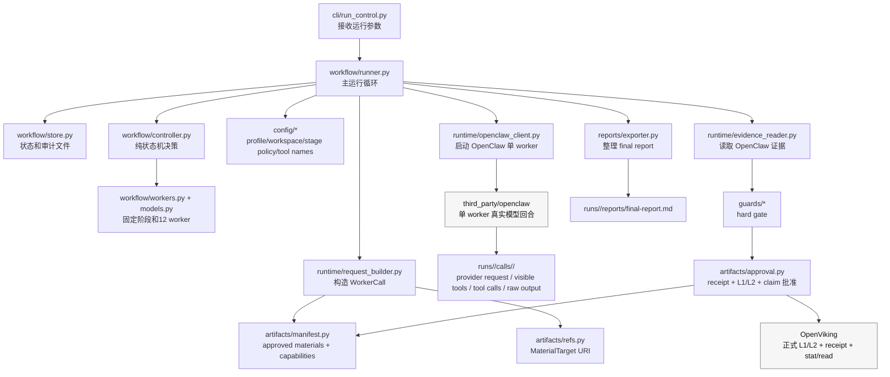
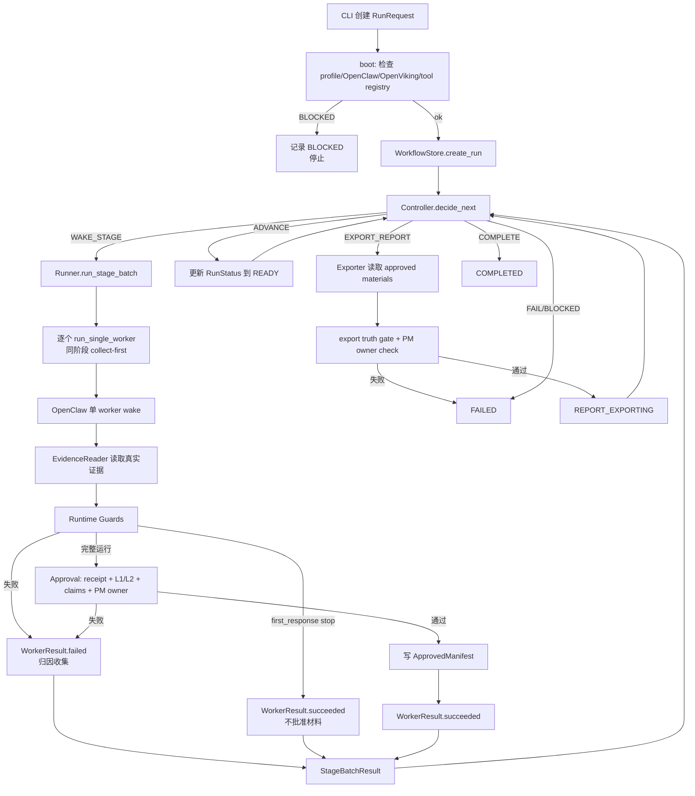
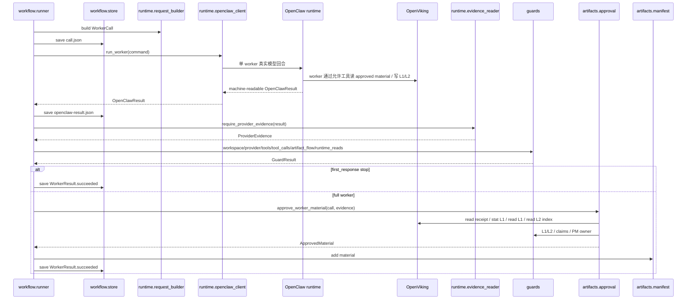
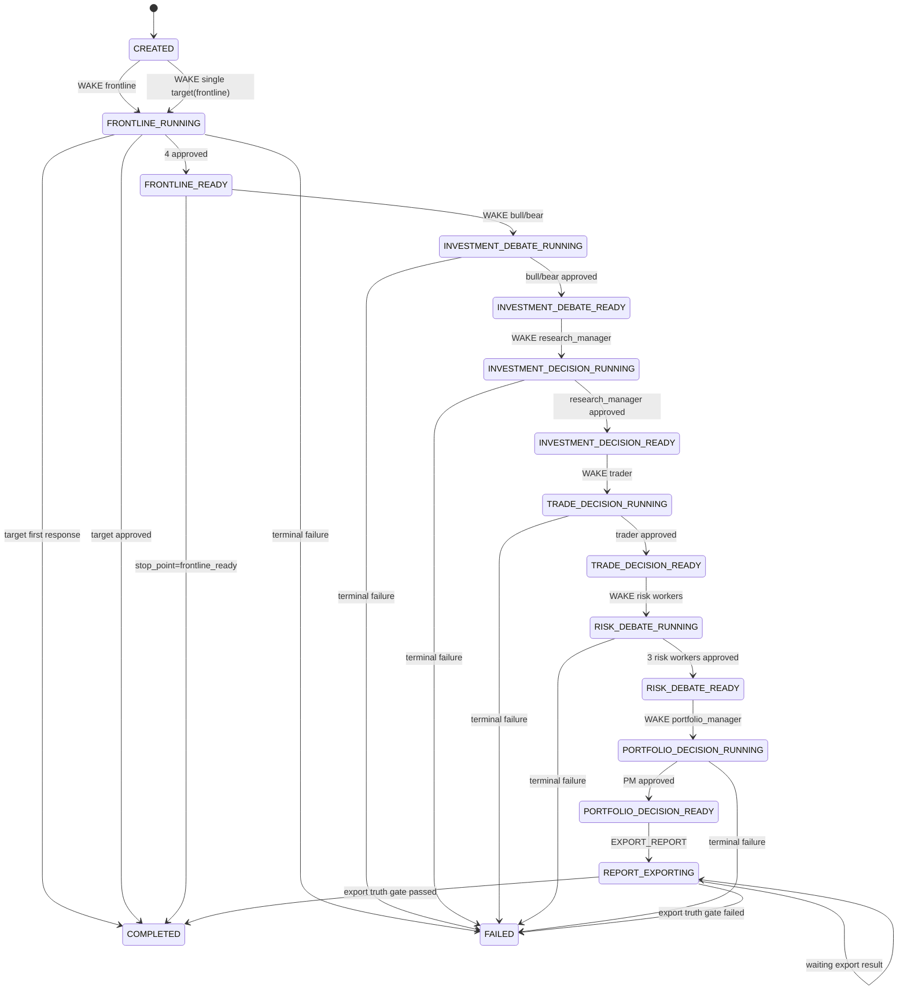

# control 详细设计方案

> 来源：`AGENTS.md`、`docs/control迁移方案.md`、`docs/control迁移任务清单.md`，以及 `src-bak` 结构参考、`agents`、`third_party/openclaw` 的目录结构。
>
> 本文档用于指导真实实现。它不是验证计划，也不是代码评审报告。设计顺序是：先在已有工程根目录下重建 `./src/`，再补真实链路；代码评审和补充验证放在真实链路之后。
>
> 文件名、类名、字段名保留英文；解释先说人话，再给标识符。伪码只用于说明接口和数据流，不作为执行纪律。

## 1. 设计结论

这次 control 迁移的结论很简单：三方各管一块，不能互相越权。

- `claw-trade` 管“流程怎么走”：创建 run、固定 12 个 worker 顺序、调度、批准材料、执行 hard gate、维护 approved manifest、导出最终报告。
- OpenClaw 管“一个 worker 的一次真实模型回合”：加载 worker workspace，组装最终 provider request，暴露本回合允许的工具，执行模型回合和工具调用，并保存真实运行证据。
- OpenViking 管“正式材料和上下文”：保存 L1/L2 正式材料、URI、receipt、内容指纹、manifest capability 支持的受限读取，以及后续上下文能力。

必须守住的边界：

- 12 个 worker 固定，由 `claw-trade` 调度；LLM 不决定下一步 worker。
- Python 不写业务分析正文，不替 worker 调工具，不改写 portfolio manager 的评级、最终结论、执行条件或风险条件。
- 后八个 worker 不能走 `direct_llm` 或 Python materializer。
- OpenClaw 不能接管 12 worker DAG、批准、hard gate、报告导出或投资逻辑。
- OpenViking 不能接管流程推进、批准、重试或最终结论。
- final report 只能整理 approved materials，不能新增 unsupported 投资结论、评级、交易动作、风险条件、估值、新闻、情绪、图表、来源或工具成功声明。

所有新增代码在关键业务边界、hard gate、越权防线和非显然控制逻辑处必须有中文注释。注释要说明“为什么这里必须阻断”和“防止谁越权”，不能写空泛解释。

## 2. 从零重建的实现策略

本设计采用真实链路优先。原因是这次迁移最危险的不是少一个类或少一个检查，而是假成功：看起来有输出，实际没有真实 provider request、没有真实 OpenViking receipt、没有真实 worker wake，或者 Python 在中间替 worker 写了正文。

执行顺序必须是：

1. 先在已有工程目录 `/home/frank/src/claw-trade` 下重建 `./src/` 和 `./src/claw_trade/`。
2. `./src-bak/` 只能作为结构参考，不能作为实现目录、导入路径、成功路径或整体复制来源。
3. 先补真实流程骨架。
4. 再补 OpenViking 材料合同。
5. 再补 OpenClaw 单 worker runtime 接缝。
6. 再接 `claw-trade` 到 OpenClaw。
7. 再接 hard gate 和 approved manifest。
8. 再执行单 worker。
9. 再执行前线四 worker。
10. 再执行 12 worker 全链路。
11. 最后做代码评审和补验证。

这种顺序换来两个好处：

- 能在干净 `./src/` 上建立控制面，避免旧代码路径污染新的权责边界。
- 能尽早发现真实依赖缺口，比如 OpenClaw 入口、provider payload 捕获点、OpenViking read/stat/receipt 能力是否存在。
- 能避免把实现写成只满足本地断言的样子，却没有证明运行时真的发生过 worker wake、工具收窄和材料写入。

代价是早期会遇到更多 `BLOCKED`。如果真实 provider、OpenClaw 入口或 OpenViking 能力不可用，就记录阻塞和证据，不能用 fake provider、fake OpenViking receipt、本地材料或 fallback 路径冒充完成。

## 3. 模块划分与结构框架

本节先说明模块怎么分、模块之间怎么连、一次运行怎么流动，再列物理目录。后面的对象和伪码都按这里的模块边界落地。

### 3.1 逻辑模块划分

`claw-trade` 的 control 路径按职责拆成七个模块。每个模块只做自己的事，不能越过边界替别的模块做决定。

| 模块 | 人话职责 | 主要文件 | 输入 | 输出 | 禁止做的事 |
| --- | --- | --- | --- | --- | --- |
| CLI 模块 | 接收人类运行参数，启动一次真实 run | `cli/run_control.py` | 命令行参数、环境配置 | `RunRequest`、最终状态摘要 | 不提供跳过 OpenClaw/OpenViking 的成功模式 |
| workflow 模块 | 固定 12 worker 流程，保存 run 状态，决定下一步 | `workflow/models.py`、`workers.py`、`controller.py`、`store.py`、`runner.py` | `RunRequest`、`WorkflowState`、`WorkerResult`、`ApprovedManifest` | `Decision`、`StageBatch`、状态文件 | 不写业务正文，不调用模型，不读写正式材料正文 |
| config 模块 | 校验 market/profile、worker workspace、stage policy、工具注册 | `config/profiles.py`、`workspace.py`、`stage_policy.py`、`tool_names.py`、`openviking_config.py` | run 参数、`agents/`、工具注册 | profile、阶段工具集合、OpenViking 配置 | 不生成 worker 文案，不做 market fallback |
| runtime 模块 | 把 `WorkerCall` 翻译成 OpenClaw 单 worker 命令，读取运行证据 | `runtime/request_builder.py`、`openclaw_client.py`、`evidence_reader.py` | `WorkerCall`、OpenClaw result | `OpenClawCommand`、`OpenClawResult`、`ProviderEvidence` | 不直接调用 provider，不伪造 evidence，不替 worker 调工具 |
| artifacts 模块 | 管 OpenViking URI、receipt、approved manifest、下游 capability | `artifacts/refs.py`、`openviking_client.py`、`manifest.py`、`approval.py`、`claims.py` | material target、receipt、L1/L2、guard result | `ApprovedMaterial`、manifest capability | receipt 不等于批准，不扫描 latest/list，不把本地文件当正式材料 |
| guards 模块 | 执行 truthfulness 和越权 hard gate | `guards/*.py` | OpenClaw evidence、OpenViking stat/read、manifest、final report | `GuardResult`、失败原因 | 不降级 hard fail，不用 fallback 绕过 |
| reports 模块 | 把 approved materials 整理成读者报告 | `reports/exporter.py` | approved manifest、OpenViking L1/L2 | final report、export guard result | 不新增 unsupported claim，不改写 PM 决策 |

模块边界规则：

- `workflow.controller` 是纯决策，不依赖 `runtime`、`openviking_client`、`guards`、`reports`。
- `workflow.runner` 是编排器，可以调用 config/runtime/artifacts/guards/reports，但不能写业务正文。
- `runtime` 可以启动 OpenClaw，但不能直接调用模型供应商，也不能自己生成 OpenClaw 成功证据。
- `artifacts` 可以封装 OpenViking read/stat/receipt 和 manifest，但批准权仍由 `claw-trade` 的 approval/guards 决定。
- `reports` 只能读 approved materials，不能成为新的分析 worker。

### 3.2 模块结构框架图



图中最重要的方向是：controller 不碰 OpenClaw/OpenViking；OpenClaw 不回头接管 controller；OpenViking 不回头接管 approval。

### 3.3 允许依赖方向图

```text
cli
  -> workflow.runner

workflow.runner
  -> workflow.controller
  -> workflow.store
  -> config
  -> runtime
  -> artifacts
  -> guards
  -> reports

workflow.controller
  -> workflow.models
  -> workflow.workers
  -> artifacts.manifest 的只读接口

runtime
  -> workflow.models
  -> artifacts.manifest 的 capability 数据结构
  -> artifacts.refs 的 material target
  -> third_party/openclaw 单 worker 命令

guards
  -> workflow.models
  -> runtime evidence 数据结构
  -> artifacts manifest/openviking client 的只读能力

reports
  -> artifacts.manifest
  -> artifacts.openviking_client 的 read/stat
  -> guards.export_claims / guards.pm_owner
```

禁止依赖方向：

```text
workflow.controller -X-> runtime/openclaw_client
workflow.controller -X-> OpenViking client
workflow.controller -X-> reports/exporter
third_party/openclaw -X-> claw_trade.workflow.controller
third_party/openclaw -X-> claw_trade.artifacts.approval
third_party/openclaw -X-> claw_trade.reports
OpenViking adapter -X-> workflow 推进 / retry / final decision
reports/exporter -X-> provider / OpenClaw / worker execution
```

### 3.4 总控制流程图



### 3.5 单 worker 时序图



### 3.6 单 worker 时序图参与者职责

这张时序图里的名字都是模块角色，不是同一种东西。有的是控制器，有的是本地审计存储，有的是 OpenClaw 适配层，有的是外部运行时。

| 参与者 | 人话角色 | 被谁调用 | 它调用谁 | 主要输入 | 主要输出 | 不能做什么 |
| --- | --- | --- | --- | --- | --- | --- |
| `workflow.runner` | 总执行员。按 controller 的决定推进一次 run，串起 store、runtime、guards、approval、manifest、exporter | CLI / run loop | controller、store、request_builder、openclaw_client、evidence_reader、guards、approval、manifest、reports | `RunRequest`、`WorkflowState`、`Decision` | `WorkerResult`、`StageBatchResult`、状态推进 | 不写投研正文，不决定 worker 业务结论，不绕过 guard |
| `workflow.store` | 本地状态和审计文件柜。保存 run 状态、call.json、OpenClawResult、worker result 和本地审计副本 | runner | 本地文件系统 | run_id、call_id、状态对象、结果对象 | `runs/<run_id>/...` 下的状态和审计文件路径 | 不保存 OpenViking 正式材料正文作为权威，不批准材料，不读写模型 |
| `runtime.request_builder` | 出发前的打包员。把当前状态、worker、profile、stage policy、approved manifest 打包成 `WorkerCall` | runner | config、manifest、refs 的只读接口 | `WorkflowState`、worker spec、stage policy、approved manifest | `WorkerCall`、`MaterialTarget` | 不启动 OpenClaw，不写文件，不调用工具，不把 Python 分析正文塞给 worker |
| `runtime.openclaw_client` | OpenClaw 启动适配器。负责把命令交给 OpenClaw 进程或服务，并拿回机器可读结果 | runner | OpenClaw runtime | `OpenClawCommand` | `OpenClawResult` | 不直接调用 provider，不重构 provider request，不伪造成功结果 |
| `OpenClaw runtime` | 单 worker 真实模型运行时。加载 worker workspace，把可见工具发给 LLM，执行 LLM 返回的 tool call，写运行证据 | openclaw_client | LLM provider、OpenViking worker tools、其他允许工具 | agent id、runtime vars、allowed tools、evidence_dir、material target、read capabilities | provider request、visible tools、first response、tool-calls、raw output、receipt | 不接管 12 worker DAG，不维护 manifest，不做 hard gate，不导出 final report |
| `OpenViking` | 正式材料和证据存储。保存 worker 写入的 L1/L2，提供 receipt、stat、read | OpenClaw tools、approval/read client、reports | 存储后端 | material target、read capability、URI | L1/L2 内容、receipt、stat/read 结果 | 不决定材料是否 approved，不推进 workflow，不生成投资结论 |
| `runtime.evidence_reader` | 证据取件员。按 `OpenClawResult` 读取证据路径并组装成 guard 输入 | runner | 本地文件系统 | `OpenClawResult`、call evidence dir | `ProviderEvidence` | 不批准材料，不修补缺失证据，不用日志替代 provider request |
| `guards` | 硬门禁。检查 provider request、visible tools、tool-calls、artifact flow、runtime reads、L1/L2、claims、PM owner | runner、approval、reports | manifest/read client 的只读能力 | call、evidence、manifest、OpenViking stat/read | `GuardResult` | 不降级 hard fail，不写材料，不生成 fallback |
| `artifacts.approval` | 材料批准员。runtime guards 通过后，读回 receipt/L1/L2，跑 L1/L2、claim、PM owner 检查，产出 approved material | runner | OpenViking approval client、guards | `WorkerCall`、`ProviderEvidence`、receipt、raw output | `ApprovedMaterial` 或拒绝原因 | 不把 receipt 当批准，不允许 raw output 或本地文件冒充 L1 |
| `artifacts.manifest` | 已批准材料清单。记录哪些材料能给下游读，并生成 manifest-scoped read capability | runner、request_builder、guards、reports | 无外部运行时 | `ApprovedMaterial` | manifest entry、`MaterialReadRef`、`OpenVikingReadCapability` | 不扫描 OpenViking latest/list，不批准材料，不保存正文 |

单 worker 中最容易混淆的三个模块：

- `workflow.store` 只负责“保存本地运行状态和证据路径”，不是正式材料仓库。
- `runtime.request_builder` 只负责“出发前组装调用参数”，不是 runner，也不是 OpenClaw client。
- `runtime.evidence_reader` 只负责“回来后读取证据文件”，不是 guard，也不是 approval。

单 worker 的最小调用链：

```text
runner
  -> request_builder 生成 WorkerCall
  -> store 保存 call.json
  -> openclaw_client 启动 OpenClaw
  -> OpenClaw 运行 worker、调用工具、写证据
  -> evidence_reader 读取证据
  -> guards 检查运行证据和材料读取边界
  -> approval 批准 L1/L2
  -> manifest 记录 approved material
  -> store 保存 WorkerResult
```

### 3.7 状态机框架图



### 3.8 物理目录结构

本工程根目录已经是 `/home/frank/src/claw-trade`，不要再创建、移动、嵌套或重命名工程目录。代码从零重建在这个工程根目录下的 `./src/` 子目录里。`./src-bak/` 只作为结构参考，不能作为实现目录、导入路径、成功路径或整体复制来源。

目标 `./src/claw_trade/` 先按这些主要模块重建：

```text
src/claw_trade/
  workflow/
    models.py
    workers.py
    controller.py
    store.py
  config/
    profiles.py
    workspace.py
    stage_policy.py
    tool_names.py
    openviking_config.py
  artifacts/
    refs.py
    manifest.py
    openviking_client.py
    claims.py
  runtime/
    request_builder.py
  guards/
    artifact_flow.py
    l1_l2.py
    openviking_access.py
```

允许创建和修改的 `claw-trade` 文件边界：

```text
src/claw_trade/
  workflow/
    models.py
    workers.py
    controller.py
    store.py
    runner.py
  config/
    profiles.py
    workspace.py
    stage_policy.py
    tool_names.py
    openviking_config.py
  artifacts/
    refs.py
    openviking_client.py
    manifest.py
    approval.py
    claims.py
  runtime/
    request_builder.py
    openclaw_client.py
    evidence_reader.py
  guards/
    workspace_evidence.py
    provider_request.py
    visible_tools.py
    tool_calls.py
    artifact_flow.py
    openviking_receipt.py
    openviking_access.py
    l1_l2.py
    pm_owner.py
    export_claims.py
  reports/
    exporter.py
  cli/
    run_control.py
```

`agents` 目录已经按 12 个 worker 展开。本文只约定 control 需要读取的 worker 身份、阶段策略和技能边界；worker 文案内容由人工另行维护，不在本详细方案里设计或改写。

```text
agents/<worker>/
  AGENTS.md
  IDENTITY.md
  STAGES.yaml
  SKILLS.md
  skills/manifest.yaml
  skills/<skill-name>/SKILL.md
```

有些 worker 有额外的人工维护资产。它们可以继续由人工维护或被 OpenClaw workspace 读取；`claw-trade` 不设计、不生成、不改写这些 worker 文案资产。

OpenClaw 允许修改的范围只限通用单 worker runtime 接缝。实现时需要优先定位这些入口或等价入口：

```text
third_party/openclaw/openclaw.mjs
third_party/openclaw/packages/memory-host-sdk/src/host/openclaw-runtime-cli.ts
third_party/openclaw/packages/memory-host-sdk/src/host/openclaw-runtime-agent.ts
third_party/openclaw/packages/memory-host-sdk/src/host/openclaw-runtime.ts
third_party/openclaw/packages/memory-host-sdk/src/host/openclaw-runtime-session.ts
third_party/openclaw/packages/memory-host-sdk/src/host/openclaw-runtime-io.ts
third_party/openclaw/src/agents/cli-runner/
third_party/openclaw/src/agents/pi-embedded-runner.ts
third_party/openclaw/src/agents/provider-request-config.ts
third_party/openclaw/src/agents/provider-transport-stream.ts
third_party/openclaw/src/agents/tool-allowlist-guard.ts
```

如果实际入口不在这些文件里，先用 `rg` 定位等价位置，并在实现记录里说明定位依据。不能为了方便把 `claw-trade` 的业务流程写进 OpenClaw。

## 4. 核心数据对象

这些对象不是为了让 Python 变成 worker，而是为了让流程、证据、材料批准和失败归因都能被代码直接表达。第一版可以把这些对象放在现有文件里，不必为了名字完全一致而拆很多小文件；关键是字段含义和边界一致。

对象分层：

```text
用户请求层：RunRequest
流程状态层：WorkflowState / StagePlan / StageBatch
调用层：WorkerCall / OpenClawCommand
结果层：OpenClawResult / WorkerResult / StageBatchResult / ExportResult
材料层：MaterialTarget / MaterialReceipt / ApprovedMaterial / ApprovedManifest
失败层：FailureRecord / GuardResult
```

### 4.1 RunRequest

`RunRequest` 表示一次报告请求的外部事实。它只保存标的、公司、市场、profile、货币和日期范围。

建议结构：

```python
class StopPoint(str, Enum):
    NONE = "none"
    FIRST_RESPONSE = "first_response"
    SINGLE_WORKER_COMPLETE = "single_worker_complete"
    FRONTLINE_READY = "frontline_ready"
    COMPLETED = "completed"


@dataclass(frozen=True)
class RunRequest:
    ticker: str
    company_name: str
    market: str
    profile: str
    currency: str
    currency_symbol: str
    current_date: str
    start_date: str
    end_date: str
    stop_point: StopPoint = StopPoint.NONE
    target_worker_id: str | None = None
    target_stage: Stage | None = None
```

规则：

- 这些字段可以进入 OpenClaw runtime vars。
- 不能在这里写任何业务分析正文。
- HK 或 CRYPTO profile 未批准时，必须在调用 OpenClaw 前失败，不能 fallback 到 US 或 CN_A。
- `stop_point` 只控制运行停在哪里，不改变 worker 顺序，不跳过 OpenClaw，不跳过 OpenViking。
- `FIRST_RESPONSE` 和 `SINGLE_WORKER_COMPLETE` 是单 worker 运行模式，必须提供 `target_worker_id`；`target_stage` 可以显式提供，也可以由固定 worker 表推导。
- 单 worker 运行模式只叫醒目标 worker，不启动整个前线阶段，也不推进到下游阶段。

### 4.2 WorkflowState

`WorkflowState` 表示 run 当前走到哪里。它回答“下一步该叫谁”，不回答“股票该不该买”。

建议结构：

```python
class RunStatus(str, Enum):
    CREATED = "created"
    FRONTLINE_RUNNING = "frontline_running"
    FRONTLINE_READY = "frontline_ready"
    INVESTMENT_DEBATE_RUNNING = "investment_debate_running"
    INVESTMENT_DEBATE_READY = "investment_debate_ready"
    INVESTMENT_DECISION_RUNNING = "investment_decision_running"
    INVESTMENT_DECISION_READY = "investment_decision_ready"
    TRADE_DECISION_RUNNING = "trade_decision_running"
    TRADE_DECISION_READY = "trade_decision_ready"
    RISK_DEBATE_RUNNING = "risk_debate_running"
    RISK_DEBATE_READY = "risk_debate_ready"
    PORTFOLIO_DECISION_RUNNING = "portfolio_decision_running"
    PORTFOLIO_DECISION_READY = "portfolio_decision_ready"
    REPORT_EXPORTING = "report_exporting"
    COMPLETED = "completed"
    FAILED = "failed"
    CANCELLED = "cancelled"


class Stage(str, Enum):
    FRONTLINE = "frontline"
    INVESTMENT_DEBATE = "investment_debate"
    INVESTMENT_DECISION = "investment_decision"
    TRADE_DECISION = "trade_decision"
    RISK_DEBATE = "risk_debate"
    PORTFOLIO_DECISION = "portfolio_decision"


@dataclass(frozen=True)
class WorkflowState:
    run_id: str
    request: RunRequest
    status: RunStatus
    run_dir: Path
    openviking_namespace: str
    created_at: str
    updated_at: str
    active_stage: Stage | None = None
    completed_workers: tuple[str, ...] = ()
    failed_workers: tuple[str, ...] = ()
    failure_reason: str | None = None
    last_decision_path: Path | None = None
```

规则：

- 状态里可以保存 worker 完成情况、失败原因、证据路径。
- 状态里不能保存正式材料正文作为权威。
- 阶段推进只能看 run state 和 approved manifest，不能看 LLM 自述。
- `active_stage` 只是当前状态的冗余索引，不能作为独立权威；权威仍是 `status`、worker results 和 approved manifest。

### 4.3 StagePlan 和 StageBatch

`StagePlan` 是固定流程表。它让 controller 不需要靠字符串散落判断。

```python
@dataclass(frozen=True)
class StagePlan:
    stage: Stage
    workers: tuple[str, ...]
    running_status: RunStatus
    ready_status: RunStatus
    next_stage: Stage | None
    required_upstream_stage: Stage | None
    collect_first: bool


STAGE_PLANS = (
    StagePlan(
        stage=Stage.FRONTLINE,
        workers=("market_analyst", "fundamental_analyst", "news_analyst", "social_analyst"),
        running_status=RunStatus.FRONTLINE_RUNNING,
        ready_status=RunStatus.FRONTLINE_READY,
        next_stage=Stage.INVESTMENT_DEBATE,
        required_upstream_stage=None,
        collect_first=True,
    ),
    StagePlan(
        stage=Stage.INVESTMENT_DEBATE,
        workers=("bull_researcher", "bear_researcher"),
        running_status=RunStatus.INVESTMENT_DEBATE_RUNNING,
        ready_status=RunStatus.INVESTMENT_DEBATE_READY,
        next_stage=Stage.INVESTMENT_DECISION,
        required_upstream_stage=Stage.FRONTLINE,
        collect_first=True,
    ),
    StagePlan(
        stage=Stage.INVESTMENT_DECISION,
        workers=("research_manager",),
        running_status=RunStatus.INVESTMENT_DECISION_RUNNING,
        ready_status=RunStatus.INVESTMENT_DECISION_READY,
        next_stage=Stage.TRADE_DECISION,
        required_upstream_stage=Stage.INVESTMENT_DEBATE,
        collect_first=False,
    ),
    StagePlan(
        stage=Stage.TRADE_DECISION,
        workers=("trader",),
        running_status=RunStatus.TRADE_DECISION_RUNNING,
        ready_status=RunStatus.TRADE_DECISION_READY,
        next_stage=Stage.RISK_DEBATE,
        required_upstream_stage=Stage.INVESTMENT_DECISION,
        collect_first=False,
    ),
    StagePlan(
        stage=Stage.RISK_DEBATE,
        workers=("risk_challenger", "risk_guardian", "risk_moderator"),
        running_status=RunStatus.RISK_DEBATE_RUNNING,
        ready_status=RunStatus.RISK_DEBATE_READY,
        next_stage=Stage.PORTFOLIO_DECISION,
        required_upstream_stage=Stage.TRADE_DECISION,
        collect_first=True,
    ),
    StagePlan(
        stage=Stage.PORTFOLIO_DECISION,
        workers=("portfolio_manager",),
        running_status=RunStatus.PORTFOLIO_DECISION_RUNNING,
        ready_status=RunStatus.PORTFOLIO_DECISION_READY,
        next_stage=None,
        required_upstream_stage=Stage.RISK_DEBATE,
        collect_first=False,
    ),
)
```

`StageBatch` 是 controller 输出给 runner 的阶段派发计划。它只包含阶段、worker id 和批次策略；完整 `WorkerCall` 必须由 runner 调 `runtime.request_builder` 构造，不能在 controller 中构造。

```python
class BatchScope(str, Enum):
    FULL_STAGE = "full_stage"
    SINGLE_WORKER = "single_worker"


@dataclass(frozen=True)
class StageBatch:
    run_id: str
    stage: Stage
    worker_ids: tuple[str, ...]
    scope: BatchScope
    collect_first: bool
    stop_point: StopPoint
```

规则：

- `FULL_STAGE` 用于完整阶段执行，`worker_ids` 必须等于 `StagePlan.workers`。
- `SINGLE_WORKER` 只用于 `FIRST_RESPONSE` 或 `SINGLE_WORKER_COMPLETE` 单 worker 运行，`worker_ids` 只能有一个。
- controller 只能构造 `StageBatch`，不能读取 profile、workspace、stage policy、tool registry，也不能生成 `WorkerCall`。

### 4.4 WorkerCall

`WorkerCall` 表示 `claw-trade` 准备叫醒一个 worker 的控制请求。

建议结构：

```python
@dataclass(frozen=True)
class ReadPolicy:
    default_layer: str = "L1"
    allow_l2_when: tuple[str, ...] = (
        "specific_number_required",
        "chart_required",
        "source_text_required",
        "conflict_resolution_required",
        "hard_gate_field_required",
    )
    forbid_compact_as_writing_source: bool = True


@dataclass(frozen=True)
class WorkerCall:
    call_id: str
    run_id: str
    worker_id: str
    stage: Stage
    profile: str
    ticker: str
    company_name: str
    market: str
    currency: str
    currency_symbol: str
    current_date: str
    start_date: str
    end_date: str
    allowed_tools: tuple[str, ...]
    upstream_materials: tuple[MaterialReadRef, ...]
    openviking_read_capabilities: tuple[OpenVikingReadCapability, ...]
    material_target: MaterialTarget
    read_policy: ReadPolicy
    evidence_dir: Path
    stop_after_first_response: bool
```

规则：

- `allowed_tools` 来自 worker/stage/profile 策略和 OpenClaw 工具注册。
- `upstream_materials` 只能来自 approved manifest。
- `openviking_read_capabilities` 是下游读取能力，不是裸 URI 权限。
- `material_target` 由 `claw-trade` 派发前生成，限定本次 worker 可写 L1 和 L2 前缀。
- 不能包含 Python 写出的市场分析、投资建议、风险结论、未批准上游全文、未经批准的 worker 文案回退或 fallback market profile。
- `allowed_tools` 为空时不能调用 OpenClaw，因为空工具集合无法证明阶段策略。
- `call_id` 必须每次重跑都不同，避免覆盖旧材料和旧证据。

worker 不是自己发现材料参数。`claw-trade` 在唤醒 worker 前，把同一批材料参数放到两个地方：

- 给模型看的本轮任务说明：列出可读材料清单，包含来源 worker、stage、`material_id`、`capability_id`、`l1_uri`、`l1_sha256` 和允许的 L2 前缀。
- 给工具层校验的 OpenClaw command：放入同一批 `upstream_materials` 和 `openviking_read_capabilities`，worker 不能修改。

worker 调 OpenViking 读取材料时，只能在本轮任务说明给定的 material/layer 范围内选择。`capability_id/material_id/uri` 由 runtime manifest 映射并校验；不开放裸 URI、latest/list/compact read 成功路径。

写入材料时还没有 `material_id` 和 `capability_id`。worker 只写到本次 `material_target`；材料写入、有真实 receipt、hard gate 通过后，`claw-trade` 才生成 `ApprovedMaterial.material_id`。下游 worker 要读这份 approved material 时，manifest 再生成本轮专用的 `capability_id`。

如果同一个 worker 在不同 stage 或同一 stage 重跑，必须当成不同调用处理。区分键是 `run_id + stage + worker_id + call_id`，不能只靠 worker 名称。每次调用都有自己的 `material_target`、可读材料清单、读取 capability 和证据目录。

### 4.5 OpenClawCommand

`OpenClawCommand` 是适配层传给 OpenClaw 的命令形态。它只翻译 `WorkerCall`，不新增业务内容。

```python
@dataclass(frozen=True)
class OpenClawCommand:
    agent: str
    worker_id: str
    profile: str
    stage: str
    run_id: str
    call_id: str
    runtime_vars: dict[str, str]
    allowed_tools: tuple[str, ...]
    upstream_materials: tuple[dict[str, str], ...]
    openviking_read_capabilities: tuple[dict[str, str], ...]
    material_target: dict[str, str]
    read_policy: dict[str, object]
    evidence_dir: Path
    stop_after_first_response: bool
```

`agent` 是 OpenClaw workspace 名，`worker_id` 是 `claw-trade` 的 worker 身份；两者在 control 迁移里必须相等，证据文件也必须带同一个值。

构造规则：

```python
def build_openclaw_command(call: WorkerCall) -> OpenClawCommand:
    return OpenClawCommand(
        agent=call.worker_id,
        worker_id=call.worker_id,
        profile=call.profile,
        stage=call.stage.value,
        run_id=call.run_id,
        call_id=call.call_id,
        runtime_vars={
            "ticker": call.ticker,
            "company_name": call.company_name,
            "market": call.market,
            "currency": call.currency,
            "currency_symbol": call.currency_symbol,
            "current_date": call.current_date,
            "start_date": call.start_date,
            "end_date": call.end_date,
        },
        allowed_tools=call.allowed_tools,
        upstream_materials=serialize_material_refs(call.upstream_materials),
        openviking_read_capabilities=serialize_capabilities(call.openviking_read_capabilities),
        material_target=serialize_material_target(call.material_target),
        read_policy=serialize_read_policy(call.read_policy),
        evidence_dir=call.evidence_dir,
        stop_after_first_response=call.stop_after_first_response,
    )
```

### 4.6 OpenClawResult

`OpenClawResult` 表示 OpenClaw 单 worker 回合返回给 `claw-trade` 的机器可读结果。

完整运行至少要包含：

```python
@dataclass(frozen=True)
class OpenClawResult:
    status: str
    openclaw_run_id: str | None
    provider_request_id: str | None
    provider_request_id_status: str | None
    workspace_evidence_path: Path | None
    provider_request_path: Path | None
    visible_tools_path: Path | None
    first_response_path: Path | None
    tool_calls_status: str | None
    tool_calls_path: Path | None
    raw_output_path: Path | None
    openviking_receipt_path: Path | None
    failure_reason: str | None
```

规则：

- `provider_request_path` 必须是真实发给 provider 的请求，不能来自日志、renderer output、export report 或 Python 重构文本。
- `visible_tools_path` 必须从同一份 provider request 派生，不能从 `allowed_tools` 反推。
- `tool_calls_status` 必须能区分 `recorded` 和 `none`。无法判断是否调用工具时不能算成功。
- 完整 worker 缺 `raw_output_path` 或 `openviking_receipt_path` 时不能批准材料。

### 4.7 WorkerResult、StageBatchResult 和 ExportResult

`WorkerResult` 是 `claw-trade` 对一次 worker 调用的终态记录。它不是 worker 正文。

```python
class WorkerStatus(str, Enum):
    SUCCEEDED = "succeeded"
    FAILED = "failed"
    BLOCKED = "blocked"


@dataclass(frozen=True)
class FailureRecord:
    run_id: str
    call_id: str | None
    worker_id: str | None
    stage: Stage | None
    category: str
    reason: str
    evidence_paths: tuple[Path, ...]
    early_stop: bool
    human_action_required: str | None


@dataclass(frozen=True)
class WorkerResult:
    run_id: str
    call_id: str
    worker_id: str
    stage: Stage
    status: WorkerStatus
    openclaw_result_path: Path | None
    approved_material_id: str | None
    failure: FailureRecord | None


@dataclass(frozen=True)
class StageBatchResult:
    run_id: str
    stage: Stage
    worker_results: tuple[WorkerResult, ...]
    failures: tuple[FailureRecord, ...]
    early_stop_used: bool
    collect_first_report_path: Path


@dataclass(frozen=True)
class ExportResult:
    run_id: str
    status: str
    final_report_path: Path | None
    export_guard_result_path: Path | None
    pm_owner_guard_result_path: Path | None
    unsupported_claims: tuple[str, ...]
    failure: FailureRecord | None

    @classmethod
    def passed(cls, state: WorkflowState, final_report_path: Path, guard_path: Path) -> "ExportResult": ...

    @classmethod
    def failed(
        cls,
        state: WorkflowState,
        category: str,
        reason: str,
        paths: tuple[Path, ...],
        unsupported_claims: tuple[str, ...] = (),
    ) -> "ExportResult": ...
```

规则：

- `WorkerResult.status=SUCCEEDED` 必须意味着 OpenClaw 证据、hard gate、OpenViking receipt 和材料批准都已完成，除非本次是 `FIRST_RESPONSE` stop point。
- `BLOCKED` 表示缺真实依赖或人类决策，不能写成成功。
- `FailureRecord.category` 用于 collect-first 归因，例如 `provider_evidence`、`openviking_receipt`、`artifact_flow`、`pm_owner`、`config_blocked`。
- `ExportResult.status=passed` 才允许 run 进入 `COMPLETED`；只有 `REPORT_EXPORTING` 状态本身不代表报告已经验真。

`StageBatchResult.collect_first_report_path` 指向批次归因报告，格式见第 11.3 节。

### 4.8 OpenViking 材料引用与证据对象

这些对象定义正式材料目标、下游读取能力、L2 索引和 L1 高风险声明。

```python
VikingUri = str


@dataclass(frozen=True)
class MaterialTarget:
    run_id: str
    call_id: str
    worker_id: str
    stage: Stage
    target_name: str
    l1_uri: VikingUri
    l2_prefix: VikingUri


@dataclass(frozen=True)
class MaterialReadRef:
    material_id: str
    capability_id: str
    worker_id: str
    stage: Stage
    l1_uri: VikingUri
    l1_sha256: str
    l2_index_uri: VikingUri | None
    l2_allowed_prefix: VikingUri | None
    call_id: str


@dataclass(frozen=True)
class OpenVikingReadCapability:
    capability_id: str
    material_id: str
    allowed_l1_uri: VikingUri
    allowed_l1_sha256: str
    allowed_l2_prefix: VikingUri | None
    allowed_l2_index_sha256: str | None
    manifest_entry_sha256: str


@dataclass(frozen=True)
class L2Entry:
    evidence_id: str
    uri: VikingUri
    kind: str
    source: str
    sha256: str
    size_bytes: int


@dataclass(frozen=True)
class L2Index:
    entries: tuple[L2Entry, ...]
    empty_reason: str | None
    index_uri: VikingUri | None
    index_sha256: str | None
    index_size_bytes: int | None


@dataclass(frozen=True)
class L1Claim:
    claim_id: str
    kind: str
    text: str
    value: str | None
    required_evidence_kinds: tuple[str, ...]
    evidence_ids: tuple[str, ...]
```

`OpenVikingReadCapability` 是下游读取材料的唯一正式入口。worker 实际读到的 URI 和 `result_sha256` 必须能回到 capability 和 `L2Index`。

OpenViking URI 形状保持不变。正式材料完整性口径统一为 OpenViking `content/download` 原始字节：`l1_sha256`、`allowed_l1_sha256`、`allowed_l2_index_sha256`、`L2Entry.sha256`、`MaterialReceipt.sha256`、`result_sha256` 以及对应 `size_bytes` 都按 download 字节计算并记录为审计字段。
`content/read` 只用于 worker 文本读取和展示，不作为 write receipt、approved manifest、downstream capability、PM/export truth gate 的正式 hash/size 阻断依据。展示层的末尾换行差异和 canonical download bytes mismatch 都不再单独阻断 T62；T62 阻断条件保持在 URI/身份/权限/可读性/非空/PM owner/export truthfulness。

`L1Claim`、`PMDecision` 这类机器可读对象由工具审计记录与 control evidence 生成、校验、落盘。L1 正文是读者报告，不要求也不允许 worker 在正文末尾手拼 fenced JSON 机器块来声明 `run_id/call_id/material_id/claim_id/evidence_ids/source_worker_id`。

OpenViking 读写参数流转规则：

1. `material_target` 由 `claw-trade` 在派发 worker 前生成，写入 URI 形如 `viking://resources/workflow/<run_id>/<stage>/<worker_id>/<call_id>/<target_name>.md`，L2 只能写到同一调用的 `evidence/` 前缀下。
2. worker 写材料时不提供 `material_id` 或 `capability_id`；OpenViking 写工具必须从本次 command 的 `material_target` 校验写入目标。
3. 适配层在真实 OpenViking write + stat/read-back 校验通过后生成并返回 `adapter verified receipt`（非 OpenViking 原生 receipt）；approval 再复核 receipt、stat/read、L1/L2 和 hard gate，通过后才生成 `ApprovedMaterial` 和 `material_id`。
4. 下游 worker 构建 `WorkerCall` 时，request builder 从 approved manifest 取 `MaterialReadRef`，同时生成 `OpenVikingReadCapability`。
5. request builder 必须把可读材料清单渲染到本轮 worker 可见任务说明里，并把同一批 capability 放入 OpenClaw command，形成“模型可见清单”和“工具强校验授权表”。
6. worker 调 `openviking_read_with_capability` 时优先按“选 material + 选 layer(L1/L2)”表达读取意图；runtime/manifest 负责把意图映射到 `capability_id/material_id/uri`，工具层校验 capability id、material id 和 URI 范围。L1/L2 SHA 可记录审计，但不再作为 runtime read 阻断条件。
7. 禁止提供 `read(uri)`、`read_latest`、`latest_material`、`compact_read`、目录扫描或裸 URI read 成功路径。

### 4.9 OpenViking Receipt

OpenViking receipt 表示材料服务承认写入过某份材料。receipt 是事实，不是批准。

建议结构：

```python
@dataclass(frozen=True)
class MaterialReceipt:
    uri: VikingUri
    run_id: str
    call_id: str
    worker_id: str
    stage: Stage
    target_name: str
    sha256: str
    size_bytes: int
    written_at: str
    receipt_id: str | None
```

规则：

- receipt 必须和本次 `WorkerCall.material_target` 一致。
- receipt 里的 URI、run/call/worker/stage 必须用 OpenViking stat/read 复核；SHA/size 仍按 `content/download` 原始字节记录为审计信息，不再因为不一致单独阻断。
- `content/read` 仅用于文本读取/展示，不是 receipt 或 capability 的正式完整性口径。
- receipt 通过后，仍要经过 L1/L2、claim、PM owner 等 hard gate，才能进入 approved manifest。

### 4.10 ApprovedManifest

`ApprovedManifest` 是 `claw-trade` 批准后的材料清单。下游 worker 只能通过它拿材料引用和读取能力。

每条记录至少包含：

```python
@dataclass(frozen=True)
class ApprovedMaterial:
    material_id: str
    run_id: str
    call_id: str
    worker_id: str
    stage: Stage
    target_name: str
    l1_uri: VikingUri
    l1_sha256: str
    l1_size_bytes: int
    l2_index_uri: VikingUri | None
    l2_index: L2Index
    l1_claims: tuple[L1Claim, ...]
    approved_at: str
    hard_gate_result_path: Path


class ApprovedManifest:
    def add(material: ApprovedMaterial) -> None: ...
    def required_workers_for(stage: Stage) -> tuple[str, ...]: ...
    def has_worker(worker_id: str, stage: Stage) -> bool: ...
    def for_downstream_stage(stage: Stage) -> tuple[MaterialReadRef, ...]: ...
    def capabilities_for_downstream_stage(stage: Stage) -> tuple[OpenVikingReadCapability, ...]: ...
```

规则：

- manifest 不能通过目录扫描、latest/list、compact read 或裸 URI read 生成。
- hard gate 未通过的材料不能进入 manifest。
- 下游缺任一必需上游 worker 的 approved material 时，流程不能推进。

### 4.11 证据和通用结果对象

这些对象跨 runtime、guards、artifacts、reports 使用，必须字段一致。

```python
@dataclass(frozen=True)
class ProviderEvidence:
    run_id: str
    call_id: str
    worker_id: str
    stage: Stage
    openclaw_run_id: str
    provider_request_id: str | None
    provider_request_id_status: str
    workspace_evidence_path: Path
    provider_request_path: Path
    visible_tools_path: Path
    first_response_path: Path
    tool_calls_status: str
    tool_calls_path: Path
    raw_output_path: Path | None
    openviking_receipt_path: Path | None


@dataclass(frozen=True)
class GuardResult:
    ok: bool
    category: str
    reason: str | None
    paths: tuple[Path, ...]
    early_stop: bool = False

    @classmethod
    def passed(cls, category: str = "ok") -> "GuardResult": ...
    @classmethod
    def failed(cls, category: str, reason: str, paths: tuple[Path, ...], early_stop: bool = False) -> "GuardResult": ...


@dataclass(frozen=True)
class ApprovalResult:
    ok: bool
    material: ApprovedMaterial | None
    category: str | None
    reason: str | None
    paths: tuple[Path, ...]

    @classmethod
    def ok_result(cls, material: ApprovedMaterial) -> "ApprovalResult": ...

    @classmethod
    def failed(cls, category: str, reason: str, paths: tuple[Path, ...]) -> "ApprovalResult": ...


@dataclass(frozen=True)
class BootResult:
    ok: bool
    category: str | None
    reason: str | None
    failure: FailureRecord | None

    @classmethod
    def ok_result(cls) -> "BootResult": ...

    @classmethod
    def blocked(cls, category: str, reason: str) -> "BootResult": ...


@dataclass(frozen=True)
class OpenVikingStat:
    ok: bool
    uri: VikingUri
    sha256: str | None
    size_bytes: int | None
    exists: bool
    checked_at: str
    error_category: str | None
    error_message: str | None


@dataclass(frozen=True)
class OpenVikingReadResult:
    ok: bool
    uri: VikingUri
    content: bytes | None
    sha256: str | None
    size_bytes: int | None
    error_category: str | None
    error_message: str | None
```

`OpenVikingStat.error_category` 和 `OpenVikingReadResult.error_category` 只允许这些值：

```text
not_found
permission_denied
capability_mismatch
hash_mismatch
size_mismatch
backend_unavailable
invalid_uri
unknown
```

这些结果对象不能携带 worker 业务正文；正文只存在于 OpenClaw raw output 或 OpenViking L1/L2 正式材料中。

## 5. 固定 12 worker 流程

流程固定写在 `claw-trade`，不是模型协商出来的。控制流程要拆成三层：静态流程表、纯状态机决策、执行循环。状态机只决定“下一步做什么”，不调用 OpenClaw，不读写 OpenViking，不导出报告。

```text
frontline:
  market_analyst
  fundamental_analyst
  news_analyst
  social_analyst

investment_debate:
  bull_researcher
  bear_researcher

investment_decision:
  research_manager

trade_decision:
  trader

risk_debate:
  risk_challenger
  risk_guardian
  risk_moderator

portfolio_decision:
  portfolio_manager
```

### 5.1 阶段推进规则

- 前线四个 worker 可以并行；第一版也可以串行执行，但必须等四份 approved material 都齐，才能进入投资辩论。
- `bull_researcher` 和 `bear_researcher` 可以并行；必须等两份 approved material 都齐，才能进入 `research_manager`。
- `research_manager`、`trader`、`portfolio_manager` 是顺序节点。
- 三个风险 worker 可以并行；必须等三份 approved material 都齐，才能进入 `portfolio_manager`。
- 每次 dispatch 对应一次 OpenClaw wake。wake 是一次 session turn，不是常驻 worker 进程。

状态转移表：

```text
CREATED
  if stop_point in [first_response, single_worker_complete]:
      WAKE_SINGLE(target_worker)
      -> <target_stage>_RUNNING
  else:
      WAKE(frontline)
      -> FRONTLINE_RUNNING

FRONTLINE_RUNNING
  if stop_point == first_response and target worker first response ready:
      COMPLETE
  if stop_point == single_worker_complete and target worker approved:
      COMPLETE
  if all frontline workers approved:
      ADVANCE -> FRONTLINE_READY
  if recoverable workers still running:
      WAIT
  if stage has terminal failure:
      FAIL

FRONTLINE_READY
  if stop_point == frontline_ready:
      COMPLETE
  else:
      WAKE(investment_debate) -> INVESTMENT_DEBATE_RUNNING

INVESTMENT_DEBATE_RUNNING
  if bull_researcher and bear_researcher approved:
      ADVANCE -> INVESTMENT_DEBATE_READY
  if recoverable workers still running:
      WAIT
  if stage has terminal failure:
      FAIL

INVESTMENT_DEBATE_READY
  -> WAKE(investment_decision)
  -> INVESTMENT_DECISION_RUNNING

INVESTMENT_DECISION_RUNNING
  if research_manager approved:
      ADVANCE -> INVESTMENT_DECISION_READY
  else WAIT or FAIL

INVESTMENT_DECISION_READY
  -> WAKE(trade_decision)
  -> TRADE_DECISION_RUNNING

TRADE_DECISION_RUNNING
  if trader approved:
      ADVANCE -> TRADE_DECISION_READY
  else WAIT or FAIL

TRADE_DECISION_READY
  -> WAKE(risk_debate)
  -> RISK_DEBATE_RUNNING

RISK_DEBATE_RUNNING
  if risk_challenger, risk_guardian, risk_moderator approved:
      ADVANCE -> RISK_DEBATE_READY
  if recoverable workers still running:
      WAIT
  if stage has terminal failure:
      FAIL

RISK_DEBATE_READY
  -> WAKE(portfolio_decision)
  -> PORTFOLIO_DECISION_RUNNING

PORTFOLIO_DECISION_RUNNING
  if portfolio_manager approved:
      ADVANCE -> PORTFOLIO_DECISION_READY
  else WAIT or FAIL

PORTFOLIO_DECISION_READY
  -> EXPORT_REPORT
  -> REPORT_EXPORTING

REPORT_EXPORTING
  if no ExportResult:
      WAIT
  if ExportResult.status == passed and truth gate evidence exists:
      COMPLETE -> COMPLETED
  if ExportResult.status == failed:
      FAIL
```

### 5.2 Decision 对象

`Decision` 是 controller 的唯一输出。runner 根据它执行真实动作。

```python
class DecisionKind(str, Enum):
    WAKE_STAGE = "wake_stage"
    WAIT = "wait"
    ADVANCE = "advance"
    EXPORT_REPORT = "export_report"
    COMPLETE = "complete"
    FAIL = "fail"
    BLOCKED = "blocked"


@dataclass(frozen=True)
class Decision:
    kind: DecisionKind
    stage: Stage | None = None
    batch: StageBatch | None = None
    next_status: RunStatus | None = None
    reason: str | None = None
    failure: FailureRecord | None = None
```

规则：

- `WAKE_STAGE` 必须带 `batch` 和 `next_status`。
- `ADVANCE` 必须带 `next_status`。
- `EXPORT_REPORT` 只能从 `PORTFOLIO_DECISION_READY` 产生。
- `FAIL` 和 `BLOCKED` 必须带 `failure`。
- `Decision` 不携带 worker 正文。
- `Decision.batch` 只能包含 worker id 计划，不能包含 `WorkerCall`。

### 5.3 Controller 输入

controller 需要的输入固定为状态、结果和批准清单。

```python
@dataclass(frozen=True)
class ControllerInput:
    state: WorkflowState
    worker_results: tuple[WorkerResult, ...]
    manifest: ApprovedManifest
    export_result: ExportResult | None
    now: str
```

它不需要 OpenClaw client、OpenViking client、工具 client 或 report exporter。

### 5.4 controller 主函数伪码

```python
def decide_next(input: ControllerInput) -> Decision:
    state = input.state

    if state.status in (RunStatus.COMPLETED, RunStatus.FAILED, RunStatus.CANCELLED):
        return Decision(DecisionKind.WAIT, reason="运行已经终止")

    if state.status == RunStatus.CREATED:
        if state.request.stop_point in (StopPoint.FIRST_RESPONSE, StopPoint.SINGLE_WORKER_COMPLETE):
            return decide_wake_single_worker(state, input.manifest)
        stage = Stage.FRONTLINE
        return decide_wake_stage(state, stage, input.manifest)

    if is_running_status(state.status):
        stage = stage_for_running_status(state.status)
        return decide_running_stage(state, stage, input.worker_results, input.manifest)

    if is_ready_status(state.status):
        stage = stage_for_ready_status(state.status)
        return decide_ready_stage(state, stage, input.manifest)

    if state.status == RunStatus.REPORT_EXPORTING:
        return decide_report_exporting(state, input.export_result)

    return Decision(
        DecisionKind.FAIL,
        next_status=RunStatus.FAILED,
        failure=FailureRecord(
            run_id=state.run_id,
            call_id=None,
            worker_id=None,
            stage=None,
            category="workflow_state",
            reason=f"未知状态: {state.status}",
            evidence_paths=(state.run_dir / "state.json",),
            early_stop=True,
            human_action_required=None,
        ),
    )
```

### 5.5 叫醒阶段的伪码

`decide_wake_stage()` 只构造 `StageBatch`，不执行，也不构造 `WorkerCall`。

```python
def decide_wake_stage(state: WorkflowState, stage: Stage, manifest: ApprovedManifest) -> Decision:
    plan = stage_plan(stage)

    upstream_check = require_upstream_ready(plan, manifest)
    if not upstream_check.ok:
        return Decision(
            DecisionKind.BLOCKED,
            next_status=RunStatus.FAILED,
            failure=FailureRecord(
                run_id=state.run_id,
                call_id=None,
                worker_id=None,
                stage=stage,
                category="artifact_flow",
                reason=upstream_check.reason,
                evidence_paths=(state.run_dir / "openviking" / "approved-manifest.json",),
                early_stop=True,
                human_action_required=None,
            ),
        )

    batch = StageBatch(
        run_id=state.run_id,
        stage=stage,
        worker_ids=plan.workers,
        scope=BatchScope.FULL_STAGE,
        collect_first=plan.collect_first,
        stop_point=state.request.stop_point,
    )
    return Decision(
        kind=DecisionKind.WAKE_STAGE,
        stage=stage,
        batch=batch,
        next_status=plan.running_status,
    )
```

`require_upstream_ready()` 规则：

```python
def require_upstream_ready(plan: StagePlan, manifest: ApprovedManifest) -> GuardResult:
    if plan.required_upstream_stage is None:
        return GuardResult.passed()

    required_workers = stage_plan(plan.required_upstream_stage).workers
    missing = [worker for worker in required_workers if not manifest.has_worker(worker, plan.required_upstream_stage)]
    if missing:
        return GuardResult.failed("artifact_flow", f"上游 approved material 缺失: {missing}", paths=())
    return GuardResult.passed()
```

单 worker 派发只输出目标 worker id：

```python
def decide_wake_single_worker(state: WorkflowState, manifest: ApprovedManifest) -> Decision:
    target_result = resolve_single_worker_target(state)
    if not target_result.ok:
        return Decision(
            DecisionKind.BLOCKED,
            next_status=RunStatus.FAILED,
            failure=target_result.failure,
        )
    target = target_result.worker
    assert target is not None
    plan = stage_plan(target.stage)
    upstream_check = require_upstream_ready(plan, manifest)
    if not upstream_check.ok:
        return Decision(
            DecisionKind.BLOCKED,
            next_status=RunStatus.FAILED,
            failure=FailureRecord(
                run_id=state.run_id,
                call_id=None,
                worker_id=target.id,
                stage=target.stage,
                category="artifact_flow",
                reason=upstream_check.reason,
                evidence_paths=(state.run_dir / "openviking" / "approved-manifest.json",),
                early_stop=True,
                human_action_required=None,
            ),
        )

    batch = StageBatch(
        run_id=state.run_id,
        stage=target.stage,
        worker_ids=(target.id,),
        scope=BatchScope.SINGLE_WORKER,
        collect_first=False,
        stop_point=state.request.stop_point,
    )
    return Decision(
        kind=DecisionKind.WAKE_STAGE,
        stage=target.stage,
        batch=batch,
        next_status=stage_plan(target.stage).running_status,
    )


@dataclass(frozen=True)
class TargetWorkerResult:
    ok: bool
    worker: WorkerSpec | None
    failure: FailureRecord | None

    @classmethod
    def failed(cls, state: WorkflowState, category: str, reason: str) -> "TargetWorkerResult":
        return TargetWorkerResult(
            ok=False,
            worker=None,
            failure=FailureRecord(
                run_id=state.run_id,
                call_id=None,
                worker_id=state.request.target_worker_id,
                stage=state.request.target_stage,
                category=category,
                reason=reason,
                evidence_paths=(state.run_dir / "request.json",),
                early_stop=True,
                human_action_required=None,
            ),
        )

def resolve_single_worker_target(state: WorkflowState) -> TargetWorkerResult:
    request = state.request
    if request.target_worker_id is None:
        return TargetWorkerResult.failed(state, "single_worker_target", "单 worker 运行必须提供 target_worker_id")
    worker = worker_by_id_or_none(request.target_worker_id)
    if worker is None:
        return TargetWorkerResult.failed(state, "single_worker_target", f"未知 target_worker_id: {request.target_worker_id}")
    if request.target_stage is not None and request.target_stage != worker.stage:
        return TargetWorkerResult.failed(state, "single_worker_target", "target_stage 与 target_worker_id 所属阶段不一致")
    return TargetWorkerResult(ok=True, worker=worker, failure=None)
```

`resolve_single_worker_target()` 只查固定 worker 表，不读取 profile、workspace、stage policy 或工具注册。`decide_wake_single_worker()` 只额外检查 approved manifest 是否满足目标阶段上游条件。

### 5.6 running 阶段决策伪码

running 阶段只根据 worker result 和 manifest 判断是否推进。

```python
def decide_running_stage(
    state: WorkflowState,
    stage: Stage,
    results: tuple[WorkerResult, ...],
    manifest: ApprovedManifest,
) -> Decision:
    plan = stage_plan(stage)
    stage_results = results_for_stage(results, stage)
    expected_workers = expected_workers_for_state(state, plan)
    failures = terminal_failures(stage_results)

    if failures:
        grouped = group_failures_by_category(failures)
        return Decision(
            DecisionKind.FAIL,
            next_status=RunStatus.FAILED,
            failure=merge_stage_failures(state.run_id, stage, grouped),
        )

    if state.request.stop_point == StopPoint.FIRST_RESPONSE:
        if first_response_ready(stage_results, expected_workers):
            return Decision(DecisionKind.COMPLETE, next_status=RunStatus.COMPLETED)
        return Decision(DecisionKind.WAIT, reason=f"等待 {stage.value} first response")

    if state.request.stop_point == StopPoint.SINGLE_WORKER_COMPLETE:
        if all_workers_have_result(stage_results, expected_workers) and all_workers_approved(expected_workers, stage, manifest):
            return Decision(DecisionKind.COMPLETE, next_status=RunStatus.COMPLETED)
        return Decision(DecisionKind.WAIT, reason=f"等待 {stage.value} 单 worker 完整材料批准")

    if not all_workers_have_result(stage_results, expected_workers):
        return Decision(DecisionKind.WAIT, reason=f"等待 {stage.value} worker result")

    if not all_workers_approved(expected_workers, stage, manifest):
        return Decision(DecisionKind.WAIT, reason=f"等待 {stage.value} approved material")

    return Decision(
        DecisionKind.ADVANCE,
        stage=stage,
        next_status=plan.ready_status,
    )
```

辅助函数语义：

```python
def terminal_failures(results):
    return tuple(result.failure for result in results if result.status in (WorkerStatus.FAILED, WorkerStatus.BLOCKED))

def all_workers_have_result(results, workers):
    return set(workers).issubset({result.worker_id for result in results})

def all_workers_approved(workers, stage, manifest):
    return all(manifest.has_worker(worker, stage) for worker in workers)

def first_response_ready(results, workers):
    return set(workers).issubset({result.worker_id for result in results if result.status == WorkerStatus.SUCCEEDED})

def expected_workers_for_state(state, plan):
    if state.request.stop_point in (StopPoint.FIRST_RESPONSE, StopPoint.SINGLE_WORKER_COMPLETE):
        target = resolve_single_worker_target(state)
        if not target.ok:
            return ()
        return (target.worker.id,)
    return plan.workers
```

### 5.7 ready 阶段决策伪码

```python
def decide_ready_stage(state: WorkflowState, stage: Stage, manifest: ApprovedManifest) -> Decision:
    if stage == Stage.FRONTLINE and state.request.stop_point == StopPoint.FRONTLINE_READY:
        return Decision(DecisionKind.COMPLETE, next_status=RunStatus.COMPLETED)

    if stage == Stage.PORTFOLIO_DECISION:
        if not manifest.has_worker("portfolio_manager", Stage.PORTFOLIO_DECISION):
            return Decision(
                DecisionKind.FAIL,
                next_status=RunStatus.FAILED,
                failure=FailureRecord(
                    run_id=state.run_id,
                    call_id=None,
                    worker_id="portfolio_manager",
                    stage=Stage.PORTFOLIO_DECISION,
                    category="pm_owner",
                    reason="portfolio_manager approved material 缺失",
                    evidence_paths=(state.run_dir / "openviking" / "approved-manifest.json",),
                    early_stop=True,
                    human_action_required=None,
                ),
            )
        return Decision(DecisionKind.EXPORT_REPORT, next_status=RunStatus.REPORT_EXPORTING)

    next_stage = stage_plan(stage).next_stage
    if next_stage is None:
        return Decision(
            DecisionKind.FAIL,
            next_status=RunStatus.FAILED,
            failure=FailureRecord(
                run_id=state.run_id,
                call_id=None,
                worker_id=None,
                stage=stage,
                category="workflow_state",
                reason="缺少下一阶段",
                evidence_paths=(state.run_dir / "state.json",),
                early_stop=True,
                human_action_required=None,
            ),
        )

    return decide_wake_stage(state, next_stage, manifest)
```

REPORT_EXPORTING 只能在导出结果已持久化并通过 truth gate 后完成：

```python
def decide_report_exporting(state: WorkflowState, export_result: ExportResult | None) -> Decision:
    if export_result is None:
        return Decision(DecisionKind.WAIT, reason="等待 export result")
    if export_result.status == "passed":
        return Decision(DecisionKind.COMPLETE, next_status=RunStatus.COMPLETED)
    return Decision(
        DecisionKind.FAIL,
        next_status=RunStatus.FAILED,
        failure=export_result.failure,
    )
```

### 5.8 WorkerCall 构造边界

`WorkerCall` 由 runner 调 `runtime.request_builder` 构造，不在 controller 里构造。下面伪码属于 `runtime/request_builder.py` 或 runner 的调用边界。

```python
@dataclass(frozen=True)
class RequestBuildResult:
    ok: bool
    call: WorkerCall | None
    failure: FailureRecord | None

    @classmethod
    def failed(
        cls,
        state: WorkflowState,
        worker_id: str,
        stage: Stage,
        category: str,
        reason: str,
        paths: tuple[Path, ...] = (),
    ) -> "RequestBuildResult":
        return RequestBuildResult(
            ok=False,
            call=None,
            failure=FailureRecord(
                run_id=state.run_id,
                call_id=None,
                worker_id=worker_id,
                stage=stage,
                category=category,
                reason=reason,
                evidence_paths=paths or (state.run_dir / "request.json",),
                early_stop=True,
                human_action_required=None,
            ),
        )


def build_worker_call(
    state: WorkflowState,
    worker_id: str,
    stage: Stage,
    manifest: ApprovedManifest,
) -> RequestBuildResult:
    profile = require_profile(state.request.profile)
    worker = worker_by_id(worker_id)
    if worker.stage != stage:
        return RequestBuildResult.failed(state, worker_id, stage, "config_blocked", f"worker 阶段不匹配: {worker_id}")

    workspace = validate_worker_workspace_for_control(agents_root, worker_id)
    if not workspace.ok:
        return RequestBuildResult.failed(state, worker_id, stage, "config_blocked", workspace.reason)

    policy = load_stage_policy(agents_root, worker_id, profile.name)
    if policy.stage != stage:
        return RequestBuildResult.failed(state, worker_id, stage, "config_blocked", f"stage policy 不匹配: {worker_id}")

    allowed_tools = resolve_tools(policy, openclaw_tool_registry)
    if not allowed_tools:
        return RequestBuildResult.failed(state, worker_id, stage, "config_blocked", f"阶段工具为空: {worker_id}")

    upstream_refs = manifest.for_downstream_stage(stage)
    upstream_caps = manifest.capabilities_for_downstream_stage(stage)
    call_id = make_call_id(state.run_id, stage, worker_id)
    evidence_dir = state.run_dir / "calls" / call_id
    material_target = make_material_target(
        run_id=state.run_id,
        stage=stage,
        worker_id=worker_id,
        call_id=call_id,
        target_name="report",
    )

    # 这里是控制事实装配边界：只传运行变量和 approved capability，禁止 Python 生成业务正文。
    call = WorkerCall(
        call_id=call_id,
        run_id=state.run_id,
        worker_id=worker_id,
        stage=stage,
        profile=profile.name,
        ticker=state.request.ticker,
        company_name=state.request.company_name,
        market=state.request.market,
        currency=state.request.currency,
        currency_symbol=state.request.currency_symbol,
        current_date=state.request.current_date,
        start_date=state.request.start_date,
        end_date=state.request.end_date,
        allowed_tools=allowed_tools,
        upstream_materials=upstream_refs,
        openviking_read_capabilities=upstream_caps,
        material_target=material_target,
        read_policy=ReadPolicy(),
        evidence_dir=evidence_dir,
        stop_after_first_response=state.request.stop_point == StopPoint.FIRST_RESPONSE,
    )
    return RequestBuildResult(ok=True, call=call, failure=None)
```

`make_call_id()` 规则：

```python
def make_call_id(run_id: str, stage: Stage, worker_id: str) -> str:
    nonce = monotonic_or_uuid()
    return f"{run_id}-{stage.value}-{worker_id}-{nonce}"
```

`call_id` 必须可排序、可追踪、不可覆盖旧调用。

## 6. Worker workspace 和 stage policy

worker 的身份、技能、阶段工具策略在 `agents/<worker>/`。worker 文案内容由人工逐个维护，本文不设计、不迁移、不要求自动改写。

control 侧需要关心的 workspace 文件：

- `AGENTS.md`：worker 局部规则。
- `IDENTITY.md`：worker 是谁。
- `STAGES.yaml`：阶段、profile、工具意图和 OpenViking 读写策略。
- `SKILLS.md` 与 `skills/manifest.yaml`：worker 可挂载的技能说明和技能清单。

worker 文案边界：

- 本文不规定任何 worker 文案文件的内容。
- Python 不能生成、拼接、改写或补全 worker 文案。
- HK 和 CRYPTO 需要人工明确批准其 market profile 策略；未批准时必须失败，不能静默 fallback。
- Python 只替换运行变量，例如 ticker、company name、market、currency、date range。
- Python 不能把上游材料无边界塞进 worker 输入；下游材料只能通过 approved manifest capability 读取。

工具策略：

- 前线 worker 根据各自职责暴露行情、基本面、新闻、情绪和 OpenViking 写入能力。
- news analyst 必须覆盖公司新闻和全球/宏观新闻。如果现有工具注册无法明确表达全球/宏观新闻能力，状态应为 `BLOCKED`，不能靠模糊命名蒙混。
- 后八个 worker 默认不直接取外部数据，主要通过 approved manifest capability 读取上游 L1，必要时按策略读取 L2。
- OpenViking read/write 工具也要按 stage/profile 收窄。

## 7. OpenClaw 单 worker runtime 接缝

OpenClaw 需要补的是通用单回合能力，不是 `claw-trade` 业务流程。

单 worker 命令需要接收：

```text
run_id
call_id
worker_id
stage
profile
runtime_vars
allowed_tools
evidence_dir
upstream_materials
openviking_read_capabilities
material_target
read_policy
stop_after_first_response
```

OpenClaw runtime 必须输出：

- per-turn tool narrowing：本回合只让模型看到 `allowed_tools`。
- evidence dir：本回合证据写到 `claw-trade` 指定目录。
- run/call/worker/stage/profile runtime context：所有证据都带同一组身份字段。
- workspace evidence：证明实际加载了 worker identity、skills、stage policy，以及 OpenClaw 本回合使用的 workspace 根目录。
- provider request capture：保存真实发给 provider 的最终请求。
- visible tools capture：从同一份 provider request 保存模型可见工具。
- first response capture：保存第一条模型文本或第一条工具调用。
- tool calls capture：保存模型工具调用事件；没有调用时也写明 `none`。
- raw output capture：完整运行时保存 worker 最终原始输出。
- machine-readable result：stdout 或结果文件返回上述证据路径、OpenClaw run id、provider/request id、receipt 路径和失败原因。

### 7.1 模型工具调用记录

这里的 tool calls 不是发给 LLM 的工具，也不是让 LLM 写审计文件。

人话定义：

- LLM 只看到本轮 worker 可用的业务工具列表，例如“读取已批准上游材料”。
- LLM 可以返回 tool call，表示“我要调用某个工具和这些参数”。
- OpenClaw 负责执行这个 tool call。
- OpenClaw 在工具执行层记录这次真实调用，并写入 `tool-calls.json`。
- `tool-calls.json` 是 OpenClaw 的运行证据，不是 worker 文案内容，也不是 LLM 输出内容。

调用方向固定：

```text
claw-trade
  -> build OpenClawCommand(evidence_dir, allowed_tools, openviking_read_capabilities)
  -> OpenClaw single worker runtime
    -> provider request 带 tools 发给 LLM
    -> LLM 返回 tool call
    -> OpenClaw tool executor 执行工具
    -> OpenClaw tool-call recorder 写 tool-calls.json
  -> claw-trade 读取 tool-calls.json 并执行 runtime guard
```

函数级接口：

```ts
type SingleWorkerCommand = {
  agent: string
  run_id: string
  call_id: string
  worker_id: string
  stage: string
  profile: string
  runtime_vars: Record<string, string>
  allowed_tools: string[]
  evidence_dir: string
  upstream_materials: MaterialReadRef[]
  openviking_read_capabilities: OpenVikingReadCapability[]
  material_target: MaterialTarget
  read_policy: ReadPolicy
  stop_after_first_response: boolean
}

async function runSingleWorkerCommand(command: SingleWorkerCommand): Promise<OpenClawResult> {
  const recorder = createToolCallRecorder(command)
  const tools = buildVisibleTools(command, recorder)
  const providerRequest = buildProviderRequest(command, tools)

  await writeProviderRequest(command.evidence_dir, providerRequest)
  await runProviderTurn(providerRequest, tools)
  await recorder.flush()

  return buildOpenClawResult(command, recorder)
}
```

OpenClaw 命令 JSON 必须和 Python `OpenClawCommand` 一一对应：

```json
{
  "agent": "market_analyst",
  "worker_id": "market_analyst",
  "profile": "US",
  "stage": "frontline",
  "run_id": "run-...",
  "call_id": "run-frontline-market_analyst-...",
  "runtime_vars": {
    "ticker": "AAPL",
    "company_name": "Apple",
    "market": "US",
    "currency": "USD",
    "currency_symbol": "$",
    "current_date": "2026-05-03",
    "start_date": "2026-05-03",
    "end_date": "2026-05-03"
  },
  "allowed_tools": ["market.stock_price", "market.techlab_analyze", "openviking_write_material"],
  "upstream_materials": [],
  "openviking_read_capabilities": [],
  "material_target": {
    "run_id": "run-...",
    "call_id": "run-frontline-market_analyst-...",
    "worker_id": "market_analyst",
    "stage": "frontline",
    "target_name": "report",
    "l1_uri": "viking://resources/workflow/run-.../frontline/market_analyst/call-.../report.md",
    "l2_prefix": "viking://resources/workflow/run-.../frontline/market_analyst/call-.../evidence/"
  },
  "read_policy": {
    "default_layer": "L1",
    "allow_l2_when": ["specific_number_required", "chart_required", "source_text_required", "conflict_resolution_required", "hard_gate_field_required"],
    "forbid_compact_as_writing_source": true
  },
  "evidence_dir": "runs/run-.../calls/call-...",
  "stop_after_first_response": false
}
```

OpenClaw stdout 或 result 文件必须返回：

```json
{
  "status": "succeeded",
  "openclaw_run_id": "openclaw-...",
  "provider_request_id": "provider-...",
  "provider_request_id_status": "returned",
  "workspace_evidence_path": "runs/run-.../calls/call-.../workspace-evidence.json",
  "provider_request_path": "runs/run-.../calls/call-.../provider-request.json",
  "visible_tools_path": "runs/run-.../calls/call-.../visible-tools.json",
  "first_response_path": "runs/run-.../calls/call-.../first-response.json",
  "tool_calls_status": "recorded",
  "tool_calls_path": "runs/run-.../calls/call-.../tool-calls.json",
  "raw_output_path": "runs/run-.../calls/call-.../raw-output.md",
  "openviking_receipt_path": "runs/run-.../calls/call-.../openviking-receipt.json",
  "failure_reason": null
}
```

失败时 `status="failed"`，证据路径能写多少写多少，`failure_reason` 必须非空。不能因为证据不全把失败包装成成功。

workspace evidence JSON 至少包含：

```json
{
  "source": "openclaw_workspace_runtime",
  "run_id": "run-...",
  "call_id": "call-...",
  "worker_id": "market_analyst",
  "stage": "frontline",
  "profile": "US",
  "openclaw_run_id": "openclaw-...",
  "agent_workspace_path": "agents/market_analyst",
  "identity_source": "agents/market_analyst/IDENTITY.md",
  "identity_sha256": "...",
  "worker_text_asset_sources": ["agents/market_analyst/..."],
  "worker_text_asset_sha256": {"agents/market_analyst/...": "..."},
  "skill_manifest_source": "agents/market_analyst/skills/manifest.yaml",
  "skill_manifest_sha256": "...",
  "loaded_skill_names": ["claw-trade-stage"],
  "loaded_skill_sources": ["agents/market_analyst/skills/claw-trade-stage/SKILL.md"],
  "stage_policy_source": "agents/market_analyst/STAGES.yaml",
  "stage_policy_sha256": "..."
}
```

`worker_text_asset_sources` 只证明 OpenClaw 实际加载了哪些人工维护资产和内容指纹；control 文档不规定这些资产的内容，也不要求 Python 修改它们。

provider request evidence 至少包含：

```json
{
  "source": "provider_request_capture",
  "runtime_marker": "openclaw_single_agent_turn",
  "run_id": "run-...",
  "call_id": "call-...",
  "worker_id": "market_analyst",
  "stage": "frontline",
  "openclaw_run_id": "openclaw-...",
  "provider": "openai",
  "request_id": "provider-...",
  "payload": {
    "messages": [],
    "tools": []
  }
}
```

visible tools evidence 必须和 provider request 同源：

```json
{
  "source": "provider_request",
  "provider_request_path": "runs/run-.../calls/call-.../provider-request.json",
  "run_id": "run-...",
  "call_id": "call-...",
  "worker_id": "market_analyst",
  "stage": "frontline",
  "openclaw_run_id": "openclaw-...",
  "tools": ["market.stock_price", "market.techlab_analyze", "openviking_write_material"]
}
```

first response evidence 至少包含：

```json
{
  "source": "openclaw_first_model_event",
  "run_id": "run-...",
  "call_id": "call-...",
  "worker_id": "market_analyst",
  "stage": "frontline",
  "openclaw_run_id": "openclaw-...",
  "event_kind": "assistant_text",
  "text_path": "runs/run-.../calls/call-.../first-response.txt",
  "tool_call_id": null,
  "captured_at": "2026-05-03T00:00:00Z"
}
```

tool calls evidence 至少包含：

```json
{
  "source": "model_tool_events",
  "status": "recorded",
  "run_id": "run-...",
  "call_id": "call-...",
  "worker_id": "market_analyst",
  "stage": "frontline",
  "openclaw_run_id": "openclaw-...",
  "calls": [
    {
      "tool_call_id": "tool-...",
      "tool_name": "openviking_write_material",
      "action": "write",
      "capability_id": null,
      "material_id": "mat-...",
      "uri": "viking://resources/workflow/run-.../frontline/market_analyst/call-.../report.md",
      "result_sha256": "...",
      "status": "succeeded",
      "started_at": "2026-05-03T00:00:00Z",
      "finished_at": "2026-05-03T00:00:01Z"
    }
  ]
}
```

工具列表构造：

```ts
function buildVisibleTools(
  command: SingleWorkerCommand,
  recorder: ToolCallRecorder,
): ToolDefinition[] {
  const tools = loadWorkerTools(command.allowed_tools)
  return tools.map((tool) => wrapToolWithAudit(tool, command, recorder))
}
```

工具执行包裹层：

```ts
function wrapToolWithAudit(
  tool: ToolDefinition,
  command: SingleWorkerCommand,
  recorder: ToolCallRecorder,
): ToolDefinition {
  return {
    ...tool,
    async execute(toolCallId, args, signal) {
      const startedAt = now()
      try {
        const result = await tool.execute(toolCallId, args, signal)
        recorder.record(successRecord(command, tool, toolCallId, args, result, startedAt))
        return result
      } catch (error) {
        recorder.record(failureRecord(command, tool, toolCallId, args, error, startedAt))
        throw error
      }
    },
  }
}
```

OpenViking 读取工具的记录必须从工具返回或工具适配层补齐；其中 `result_sha256` 与 `size_bytes`（如有）按 `content/download` 原始字节口径计算，不用 `content/read` 展示文本口径：

```ts
function successRecord(command, tool, toolCallId, args, result, startedAt): ToolCallRecord {
  if (tool.name === "openviking_read_with_capability") {
    return {
      tool_call_id: toolCallId,
      tool_name: tool.name,
      action: "read",
      capability_id: args.capability_id,
      material_id: result.material_id,
      uri: result.uri,
      result_sha256: result.sha256,
      status: "succeeded",
      started_at: startedAt,
      finished_at: now(),
    }
  }

  return {
    tool_call_id: toolCallId,
    tool_name: tool.name,
    action: "execute",
    uri: null,
    capability_id: null,
    material_id: null,
    result_sha256: null,
    status: "succeeded",
    started_at: startedAt,
    finished_at: now(),
  }
}
```

审计文件写入：

```ts
function createToolCallRecorder(command: SingleWorkerCommand): ToolCallRecorder {
  const records: ToolCallRecord[] = []
  return {
    record(record) {
      records.push(record)
    },
    async flush() {
      await writeJson(`${command.evidence_dir}/tool-calls.json`, {
        status: records.length > 0 ? "recorded" : "none",
        calls: records,
        source: "model_tool_events",
        run_id: command.run_id,
        call_id: command.call_id,
        worker_id: command.worker_id,
        stage: command.stage,
        openclaw_run_id: currentOpenClawRunId(),
      })
    },
  }
}
```

实现要求：

- recorder 必须挂在 OpenClaw 的统一工具执行入口，例如 `tool.execute(toolCallId, args, signal)` 或 harness 的 `handleToolCall(...)` 外层。
- LLM 不知道也不能控制 `tool-calls.json` 的写入。
- `tool-calls.json` 缺失、来源不是 `model_tool_events`、身份字段不匹配，`claw-trade` 必须 hard fail。
- `openviking_read_with_capability` 是模型可见的读取资料工具；写审计文件不是模型可见工具。
- OpenViking read 成功记录必须带 `capability_id`、`material_id`、`uri`、`result_sha256` 和 `status=success`，并继续做 manifest capability/URI 范围校验。
- OpenViking read 失败记录必须带 `status=error` 和可审计错误信息（`error` 或等价字段）；允许缺少 `capability_id` 或 `uri`，但必须保留当次已提供输入审计，禁止伪造成功授权字段。

OpenClaw 不能包含：

- `claw-trade` 的 12 worker 流程。
- 阶段推进和重试策略。
- approved manifest 维护。
- hard gate 决策。
- 报告导出。
- 投资业务正文或 Python materializer。
- portfolio manager 结论改写。

OpenClaw 新增代码的关键注释要求：

- 工具收窄处说明“模型实际可见工具必须来自本回合策略，防止 worker 越权调用工具”。
- provider request 捕获处说明“这是发给 provider 前的真实请求，不能由上层重构”。
- visible tools 捕获处说明“工具清单必须和 provider request 同源，不能复制输入 allowlist”。
- OpenViking tool adapter 处说明“只能使用 manifest capability，不能开放裸 URI read”。

## 8. OpenViking 材料合同

OpenViking 是正式材料底座。它负责保存材料和上下文，不负责批准。

URI 形状：

```text
viking://resources/workflow/<run_id>/<stage>/<worker>/<call_id>/<artifact>.md
viking://resources/workflow/<run_id>/<stage>/<worker>/<call_id>/evidence/<evidence_id>
```

L1 是完整正式 Markdown 报告：

- 下游默认读 L1。
- 即使结论是“无法判断”或“证据不足”，L1 也要完整说明结论、证据边界、已尝试证据、缺失项和影响。
- L1 不能是 compact 摘要，不能只有一句结论，不能缺少证据边界。

L2 是支撑 L1 的原始或近原始证据：

- 包括工具原始响应、行情行、新闻原文和元数据、API 响应、图表资产、指标输出、引用文件和长材料。
- L2 可以是附件或索引，但必须能回源、能校验。
- L2 为空时必须记录原因。
- L1 里出现估值、目标价、新闻、情绪、图表、来源、工具成功、投资结论、评级、交易动作或风险条件时，必须能映射到 L2 evidence。

receipt 规则：

- receipt 只说明写入发生过。
- control 迁移阶段当前接受的 receipt 是 `adapter verified receipt`：由适配层在真实 OpenViking write + stat/read-back 校验通过后生成，必须明确标注“非 OpenViking 原生 receipt”。
- receipt 不是批准。
- `claw-trade` 必须用 OpenViking stat/read 复核 URI、run/call/worker/stage 和可读性/非空；SHA/size 继续按 `content/download` 原始字节记录，但 mismatch 只进审计，不单独阻断流程。
- `content/read` 仅作为文本读取/展示能力，不是 receipt/manifest/capability/PM/export 的正式 hash 口径。
- 复核失败时，材料不能进入 approved manifest，不能给下游读取，不能进入 final report。

downstream capability：

- 下游拿到的是 manifest-scoped capability，不是任意 URI。
- capability 至少绑定 material id、L1 URI、L1 SHA、L2 allowed prefix、manifest entry SHA。
- worker 实际读取材料时，OpenViking read 工具必须校验 capability id、material id、URI 范围和结果指纹。

明确禁止：

- compact/latest/list/目录扫描/裸 URI read 作为正式材料路径。
- 本地文件冒充 OpenViking L1。
- fake OpenViking receipt。
- OpenViking 接管流程推进、批准、重试或最终结论。

## 9. `claw-trade` 调 OpenClaw

这一层只做翻译和收证据，不写业务分析。

`runtime/request_builder.py` 负责：

- 把 `WorkflowState`、worker spec、stage policy、approved manifest 转成 `WorkerCall`。
- 生成 `allowed_tools`、runtime vars、material target、read policy。
- 从 approved manifest 生成 upstream material refs 和 OpenViking read capabilities。
- 拒绝未经批准的 worker 文案/配置回退、fallback market profile、未批准 URI、空工具策略和临时成功路径。

`runtime/openclaw_client.py` 负责：

- 把 `WorkerCall` 翻译成 OpenClaw 单 worker 命令。
- 启动 OpenClaw。
- 解析机器可读结果。
- OpenClaw 退出失败、结果缺字段或证据路径缺失时，返回明确失败。

`runtime/evidence_reader.py` 负责：

- 读取 OpenClaw 返回的 workspace evidence、provider request、visible tools、first response、tool calls、raw output、receipt。
- 检查路径都在本次 run/call 证据范围内。
- 把证据交给 guards，不自行批准材料。

适配层禁止：

- 直接调用模型供应商。
- 用日志、renderer output、export report 或 Python 重构文本冒充 provider request。
- 从 `allowed_tools` 反推出 visible tools。
- OpenClaw 失败时伪造成功。
- 替 worker 调用行情、新闻、基本面、社交或 OpenViking 工具。
- 改写 worker raw output。

## 10. hard gate 设计

hard gate 是 `claw-trade` 的越权防线。检查失败时要停在当前材料，不准降级成 warning，不准用 fallback 绕过。

检查项：

| 检查 | 干什么 | 失败时 |
| --- | --- | --- |
| provider request | 证明真实请求发给了 provider，并带 run/call/worker/stage/runtime marker | 当前 call 失败 |
| workspace evidence | 证明 OpenClaw 真实加载了 worker workspace、identity、skills、stage policy | 当前 call 失败 |
| visible tools | 证明模型实际看到的工具等于本阶段允许工具，且与 provider request 同源 | 当前 call 失败 |
| tool calls | 证明工具调用事件被记录，OpenViking read/write 可审计 | 当前 call 失败 |
| OpenViking receipt | 校验 URI、身份字段、stat/read 可读且非空；SHA/size 口径固定为 `content/download` 原始字节并仅用于审计 | 材料拒绝 |
| runtime reads | 检查 worker 实际读取的 OpenViking URI 都来自 manifest capability | 当前 call 失败 |
| L1/L2 | 检查 L1 完整性、raw output 关系、L2 index、L2 entry 回源和指纹 | 材料拒绝 |
| claim | 检查高风险声明是否有 L2 evidence | 材料拒绝 |
| PM owner | 检查 PM 评级、最终结论、执行条件、风险条件只来自 PM | PM 材料拒绝或导出失败 |
| export truthfulness | 检查 final report 没有新增 unsupported claim，且未改写 PM 决策 | 导出失败 |

高风险声明包括：

```text
valuation_metric
target_price
investment_conclusion
rating_claim
trade_action_claim
risk_condition_claim
news_claim
sentiment_claim
chart_claim
tool_success_claim
source_claim
```

缺图表、缺指标、缺新闻或缺来源时，也必须有真实缺失原因和证据路径。不能把缺失内容写成已经存在。

PM owner 和导出声明检查的结构化输入：

```python
@dataclass(frozen=True)
class PMDecision:
    rating: str
    final_conclusion: str
    execution_conditions: tuple[str, ...]
    risk_conditions: tuple[str, ...]
    source_material_id: str
    source_l1_sha256: str


@dataclass(frozen=True)
class ExportClaim:
    claim_id: str
    kind: str
    text: str
    source_material_ids: tuple[str, ...]
    source_claim_ids: tuple[str, ...]
    evidence_ids: tuple[str, ...]
```

`validate_pm_owner()` 输出 `PMDecision`，`validate_export_does_not_rewrite_pm()` 必须逐字段比较 PM L1 和 final report 中的 rating、final conclusion、execution conditions、risk conditions。`validate_export_claims_are_supported()` 必须把 final report 的高风险 `ExportClaim` 映射回 approved material 的 `L1Claim` 和 L2 evidence。

PM 仍然拥有 `rating/final_conclusion/execution_conditions/risk_conditions` 的最终权威，但提交方式是通过结构化工具字段，不是 L1 正文手写 JSON decision block。工具与 control evidence 负责补齐 run/call/worker/stage/material_id/l1_sha 等机器字段；Python 只校验与比对，不改写 PM 结论。

## 11. 运行循环

运行循环从创建 run 开始，到 final report 导出结束。runner 是唯一会调用 OpenClaw、OpenViking、guards 和 exporter 的地方；controller 只给决策。

### 11.1 Store 接口

第一版使用文件存储。store 保存状态、调用、结果、失败和审计索引，不保存正式材料正文作为权威。

```python
class WorkflowStore:
    def create_run(request: RunRequest) -> WorkflowState: ...
    def load_state(run_id: str) -> WorkflowState: ...
    def save_state(state: WorkflowState) -> None: ...
    def save_decision(run_id: str, decision: Decision) -> Path: ...
    def save_call(call: WorkerCall) -> Path: ...
    def save_openclaw_result(call: WorkerCall, result: OpenClawResult) -> Path: ...
    def save_worker_result(result: WorkerResult) -> Path: ...
    def list_worker_results(run_id: str) -> tuple[WorkerResult, ...]: ...
    def save_failure(failure: FailureRecord) -> Path: ...
    def save_stage_batch_result(result: StageBatchResult) -> Path: ...
    def save_export_result(result: ExportResult) -> Path: ...
    def load_export_result(run_id: str) -> ExportResult | None: ...
    def run_dir(run_id: str) -> Path: ...
    def call_dir(run_id: str, call_id: str) -> Path: ...
```

目录写入规则：

```python
def create_run(request):
    run_id = make_run_id(request)
    run_dir = root / run_id
    mkdir(run_dir / "calls")
    mkdir(run_dir / "openviking")
    mkdir(run_dir / "reports")

    state = WorkflowState(
        run_id=run_id,
        request=request,
        status=RunStatus.CREATED,
        run_dir=run_dir,
        openviking_namespace=f"workflow/{run_id}",
        created_at=now_text(),
        updated_at=now_text(),
    )
    write_json(run_dir / "request.json", request)
    write_json(run_dir / "state.json", state)
    write_json(run_dir / "openviking" / "approved-manifest.json", {"audit_only": True, "materials": []})
    write_json(run_dir / "openviking" / "receipts.json", {"audit_only": True, "receipts": []})
    write_json(run_dir / "openviking" / "access-audit.json", {"audit_only": True, "events": []})
    return state
```

新增代码注释要求：`create_run()` 初始化本地 `openviking/` 文件时必须注释清楚“这些只是审计副本，不是正式材料权威”。

### 11.2 Runner 入口

`ControlRunner.run()` 是完整运行入口。

```python
class ControlRunner:
    def run(self, request: RunRequest) -> WorkflowState:
        boot = self.boot(request)
        if not boot.ok:
            return self.fail_before_run(request, boot)

        state = self.store.create_run(request)
        self.openviking.ensure_namespace(state.openviking_namespace)

        while True:
            state = self.store.load_state(state.run_id)
            results = self.store.list_worker_results(state.run_id)
            manifest = self.manifest_store.load(state.run_id)
            export_result = self.store.load_export_result(state.run_id)

            decision = decide_next(ControllerInput(
                state=state,
                worker_results=results,
                manifest=manifest,
                export_result=export_result,
                now=now_text(),
            ))
            decision_path = self.store.save_decision(state.run_id, decision)

            if decision.kind == DecisionKind.WAIT:
                return replace(state, last_decision_path=decision_path)

            if decision.kind in (DecisionKind.FAIL, DecisionKind.BLOCKED):
                return self.fail_run(state, decision.failure, decision_path)

            if decision.kind == DecisionKind.ADVANCE:
                next_state = replace(
                    state,
                    status=decision.next_status,
                    active_stage=None,
                    updated_at=now_text(),
                    last_decision_path=decision_path,
                )
                self.store.save_state(next_state)
                continue

            if decision.kind == DecisionKind.WAKE_STAGE:
                running_state = replace(
                    state,
                    status=decision.next_status,
                    active_stage=decision.stage,
                    updated_at=now_text(),
                    last_decision_path=decision_path,
                )
                self.store.save_state(running_state)
                batch_result = self.run_stage_batch(running_state, decision.batch)
                self.store.save_stage_batch_result(batch_result)
                if batch_result.early_stop_used:
                    failure = merge_stage_failures(state.run_id, decision.stage, batch_result.failures)
                    return self.fail_run(running_state, failure, decision_path)
                continue

            if decision.kind == DecisionKind.EXPORT_REPORT:
                exporting_state = replace(
                    state,
                    status=RunStatus.REPORT_EXPORTING,
                    updated_at=now_text(),
                    last_decision_path=decision_path,
                )
                self.store.save_state(exporting_state)
                exported = self.export_final_report(exporting_state, manifest)
                self.store.save_export_result(exported)
                if exported.status != "passed":
                    return self.fail_run(exporting_state, exported.failure, decision_path)
                continue

            if decision.kind == DecisionKind.COMPLETE:
                completed = replace(
                    state,
                    status=RunStatus.COMPLETED,
                    active_stage=None,
                    updated_at=now_text(),
                    last_decision_path=decision_path,
                )
                self.store.save_state(completed)
                return completed
```

`boot()` 在创建 run 前检查真实依赖：

```python
def boot(self, request: RunRequest) -> BootResult:
    profile_result = require_profile(request.profile)
    if not profile_result.ok:
        return BootResult.blocked("profile", profile_result.reason)

    openclaw_result = self.openclaw.probe()
    if not openclaw_result.ok:
        return BootResult.blocked("openclaw", openclaw_result.reason)

    openviking_result = self.openviking.probe_read_stat_receipt()
    if not openviking_result.ok:
        return BootResult.blocked("openviking", openviking_result.reason)

    registry_result = self.tool_registry.probe()
    if not registry_result.ok:
        return BootResult.blocked("tool_registry", registry_result.reason)

    return BootResult.ok_result()
```

`boot()` 不能创建 fake provider、fake receipt 或本地材料替身。真实依赖缺失时返回 `BLOCKED`。
`BootResult.blocked()` 只记录依赖类别和原因；`fail_before_run()` 负责把这个阻塞写成可审计状态，不能创建任何假 OpenClaw 或 OpenViking 证据。

### 11.3 Stage batch 执行

阶段批次执行支持 collect-first。第一版可以串行执行每个 call，但语义仍然是同阶段批次。

```python
def run_stage_batch(self, state: WorkflowState, batch: StageBatch) -> StageBatchResult:
    worker_results: list[WorkerResult] = []
    failures: list[FailureRecord] = []
    early_stop_used = False

    for worker_id in batch.worker_ids:
        call_result = self.request_builder.build_worker_call(
            state=state,
            worker_id=worker_id,
            stage=batch.stage,
            manifest=self.manifest_store.load(batch.run_id),
        )
        if not call_result.ok:
            result = blocked_worker_result(batch.run_id, worker_id, batch.stage, call_result.failure)
            self.store.save_worker_result(result)
            worker_results.append(result)
            failures.append(result.failure)
            early_stop_used = True
            break

        call = call_result.call
        result = self.run_single_worker(call)
        self.store.save_worker_result(result)
        worker_results.append(result)

        if result.failure is None:
            continue

        failures.append(result.failure)
        if should_early_stop(result.failure):
            early_stop_used = True
            break

        if not batch.collect_first:
            early_stop_used = True
            break

    return StageBatchResult(
        run_id=batch.run_id,
        stage=batch.stage,
        worker_results=tuple(worker_results),
        failures=tuple(failures),
        early_stop_used=early_stop_used,
        collect_first_report_path=self.write_collect_first_report(batch, worker_results, failures, early_stop_used),
    )
```

collect-first 失败归因：

```python
def merge_stage_failures(run_id: str, stage: Stage, failures: tuple[FailureRecord, ...]) -> FailureRecord:
    grouped = group_by(failures, key=lambda failure: failure.category)
    reason_lines = []
    evidence_paths = []
    for category, items in grouped.items():
        workers = [item.worker_id for item in items]
        reason_lines.append(f"{category}: workers={workers}; reasons={[item.reason for item in items]}")
        for item in items:
            evidence_paths.extend(item.evidence_paths)

    return FailureRecord(
        run_id=run_id,
        call_id=None,
        worker_id=None,
        stage=stage,
        category="stage_batch",
        reason="\n".join(reason_lines),
        evidence_paths=tuple(evidence_paths),
        early_stop=any(item.early_stop for item in failures),
        human_action_required=first_human_action(failures),
    )
```

collect-first 报告结构必须满足项目批量报告要求：

```json
{
  "collect_first_compliance": {
    "batch_scope": {
      "run_id": "run-...",
      "stage": "frontline",
      "scope": "full_stage",
      "worker_ids": ["market_analyst", "fundamental_analyst", "news_analyst", "social_analyst"]
    },
    "completed_items": [
      {
        "worker_id": "market_analyst",
        "call_id": "call-...",
        "status": "succeeded",
        "approved_material_id": "mat-..."
      }
    ],
    "failures_collected": [
      {
        "worker_id": "news_analyst",
        "call_id": "call-...",
        "category": "provider_evidence",
        "reason": "provider request 缺失",
        "evidence_paths": ["runs/run-.../calls/call-.../openclaw-result.json"]
      }
    ],
    "early_stop_exception_used": false,
    "exception_evidence": [],
    "batch_fix_grouping": [
      {
        "category": "provider_evidence",
        "workers": ["news_analyst"],
        "root_component_guess": "OpenClaw provider request capture"
      }
    ]
  }
}
```

如果 `early_stop_exception_used=true`，`exception_evidence` 必须写明早停类别、证据路径和为什么继续执行会污染证据或扩大越权。

允许早停：

```python
def should_early_stop(failure: FailureRecord) -> bool:
    return failure.category in {
        "provider_evidence_untrusted",
        "openviking_integrity",
        "artifact_flow_overreach",
        "pm_owner",
        "python_overreach",
        "openclaw_overreach",
        "openviking_overreach",
        "fake_success_path",
        "security_or_data_loss",
    } or failure.early_stop
```

这些早停类别必须在代码里有中文注释，说明继续跑会污染证据或扩大越权。

### 11.4 单 worker 执行

`run_single_worker()` 是一次 OpenClaw wake 的完整闭环。

```python
def run_single_worker(self, call: WorkerCall) -> WorkerResult:
    self.store.save_call(call)

    command = build_openclaw_command(call)
    openclaw_result = self.openclaw.run_worker(command)
    openclaw_result_path = self.store.save_openclaw_result(call, openclaw_result)

    evidence_result = self.evidence_reader.require_provider_evidence(
        call=call,
        result=openclaw_result,
        full_run=not call.stop_after_first_response,
    )
    if not evidence_result.ok:
        return failed_worker_result(call, "provider_evidence", evidence_result.reason, evidence_result.paths)

    guard_result = self.run_runtime_guards(call, evidence_result.evidence)
    if not guard_result.ok:
        return failed_worker_result(call, guard_result.category, guard_result.reason, guard_result.paths)

    if call.stop_after_first_response:
        return WorkerResult(
            run_id=call.run_id,
            call_id=call.call_id,
            worker_id=call.worker_id,
            stage=call.stage,
            status=WorkerStatus.SUCCEEDED,
            openclaw_result_path=openclaw_result_path,
            approved_material_id=None,
            failure=None,
        )

    approval_result = self.approve_worker_material(call, evidence_result.evidence)
    if not approval_result.ok:
        return failed_worker_result(call, approval_result.category, approval_result.reason, approval_result.paths)

    self.manifest_store.add(call.run_id, approval_result.material)
    return WorkerResult(
        run_id=call.run_id,
        call_id=call.call_id,
        worker_id=call.worker_id,
        stage=call.stage,
        status=WorkerStatus.SUCCEEDED,
        openclaw_result_path=openclaw_result_path,
        approved_material_id=approval_result.material.material_id,
        failure=None,
    )
```

### 11.5 runtime guards 执行顺序

runtime guards 检查 OpenClaw 运行证据和材料读取边界。顺序不能随意调整，因为后面的检查依赖前面的证据可信。

```python
def run_runtime_guards(self, call: WorkerCall, evidence: ProviderEvidence) -> GuardResult:
    checks = (
        validate_workspace_evidence(call, evidence, self.agents_root),
        validate_provider_request(call, evidence),
        validate_visible_tools(call, evidence),
        validate_tool_calls(call, evidence),
        validate_artifact_flow(call, self.manifest_store.load(call.run_id)),
        validate_openviking_runtime_reads(call, evidence, self.manifest_store.load(call.run_id)),
    )
    return combine_guard_results(checks)
```

检查失败分类：

```python
def failed_worker_result(call, category, reason, paths):
    return WorkerResult(
        run_id=call.run_id,
        call_id=call.call_id,
        worker_id=call.worker_id,
        stage=call.stage,
        status=WorkerStatus.FAILED if category != "blocked" else WorkerStatus.BLOCKED,
        openclaw_result_path=None,
        approved_material_id=None,
        failure=FailureRecord(
            run_id=call.run_id,
            call_id=call.call_id,
            worker_id=call.worker_id,
            stage=call.stage,
            category=category,
            reason=reason,
            evidence_paths=tuple(paths),
            early_stop=category in EARLY_STOP_CATEGORIES,
            human_action_required=human_action_for(category),
        ),
    )
```

### 11.6 材料批准顺序

材料批准在 runtime guards 之后执行。receipt 不是批准，raw output 不是正式材料权威。

```python
def approve_worker_material(self, call: WorkerCall, evidence: ProviderEvidence) -> ApprovalResult:
    receipt = self.openviking.read_receipt(evidence.openviking_receipt_path)
    receipt_guard = validate_openviking_receipt(call, receipt, self.openviking)
    if not receipt_guard.ok:
        return ApprovalResult.failed("openviking_receipt", receipt_guard.reason, receipt_guard.paths)

    l1_read = self.openviking.read_for_receipt_verification(receipt, call.material_target)
    l1_stat = self.openviking.stat(receipt.uri)
    if not l1_read.ok or not l1_stat.ok:
        return ApprovalResult.failed("openviking_integrity", "L1 read/stat 失败", (evidence.openviking_receipt_path,))
    if l1_read.sha256 != receipt.sha256 or l1_stat.sha256 != receipt.sha256:
        return ApprovalResult.failed("openviking_integrity", "L1 内容指纹与 receipt/stat 不一致", (evidence.openviking_receipt_path,))

    raw_output = read_text(evidence.raw_output_path)
    l1_text = decode_utf8(l1_read.content)
    l2_index = self.openviking.read_l2_index(call.material_target.l2_prefix)

    l2_guard = validate_l2_entries(self.openviking, l2_index, call.material_target.l2_prefix)
    if not l2_guard.ok:
        return ApprovalResult.failed("l1_l2", l2_guard.reason, l2_guard.paths)

    claims, l1_l2_guard = validate_l1_l2_contract(call, l1_text, raw_output, l2_index)
    if not l1_l2_guard.ok:
        return ApprovalResult.failed("l1_l2", l1_l2_guard.reason, l1_l2_guard.paths)

    claim_guard = validate_claims(claims, l2_index)
    if not claim_guard.ok:
        return ApprovalResult.failed("claim", claim_guard.reason, claim_guard.paths)

    if call.worker_id == "portfolio_manager":
        pm_guard = validate_pm_owner(l1_text, evidence)
        if not pm_guard.ok:
            return ApprovalResult.failed("pm_owner", pm_guard.reason, pm_guard.paths)

    material = ApprovedMaterial(
        material_id=make_material_id(call, receipt),
        run_id=call.run_id,
        call_id=call.call_id,
        worker_id=call.worker_id,
        stage=call.stage,
        target_name=call.material_target.target_name,
        l1_uri=receipt.uri,
        l1_sha256=receipt.sha256,
        l1_size_bytes=receipt.size_bytes,
        l2_index_uri=l2_index.index_uri,
        l2_index=l2_index,
        l1_claims=claims,
        approved_at=now_text(),
        hard_gate_result_path=call.evidence_dir / "guard-results.json",
    )
    return ApprovalResult.ok_result(material)
```

### 11.7 状态保存顺序

每个 call 的持久化顺序必须稳定，便于失败后复盘：

```text
1. save call.json
2. run OpenClaw
3. save openclaw-result.json
4. read evidence files
5. save guard-results.json
6. approve material if full run
7. append approved-manifest audit copy
8. save result.json
9. after batch, save stage-batch-result.json
10. controller next loop decides advance / fail / wait
```

禁止在第 4 步之前写 approved manifest。禁止在第 6 步失败后把材料塞给下游。

报告导出的持久化顺序：

```text
1. controller 返回 EXPORT_REPORT
2. runner save state=REPORT_EXPORTING
3. exporter render final-report.md
4. export guards 写 export-guard-results.json
5. runner save export-result.json
6. controller 下一轮读取 ExportResult
7. ExportResult.status == passed 才 save state=COMPLETED
```

## 12. 报告导出

final report 是读者报告，不是新的投资分析 worker。

导出层只能做：

- 从 approved manifest 读取 12 个 worker 的 L1。
- 整理为中文读者可读结构。
- 保留 evidence index，列出 worker、stage、L1 URI、L1 SHA、L2 index 或 empty reason。
- 把 PM 的评级、最终结论、执行条件、风险条件放入报告。
- 对报告新增内容跑 export truthfulness hard gate。

导出层不能做：

- 新增 unsupported 投资结论、评级、交易动作、风险条件、估值、新闻、情绪、图表、来源或工具成功声明。
- 改写 PM 评级、最终结论、执行条件或风险条件。
- 用其他 worker 的内容覆盖 PM 最终决策。
- 把缺失图表、指标、新闻或来源写成已经存在。
- 用 export report 反过来冒充 provider request、worker raw output 或 OpenViking L1。

如果缺任何一个 required approved material，不能导出成功报告。

导出函数必须返回并持久化 `ExportResult`：

```python
def export_final_report(state: WorkflowState, manifest: ApprovedManifest) -> ExportResult:
    materials = manifest.all_for_run(state.run_id)
    missing = required_report_workers() - {material.worker_id for material in materials}
    if missing:
        return ExportResult.failed(state, "export_missing_material", f"缺少 approved materials: {sorted(missing)}", paths=())

    pm_material = require_material("portfolio_manager", materials)
    pm_text = openviking.read_text(pm_material.l1_uri, expected_sha256=pm_material.l1_sha256)
    final_text = render_final_report(materials, pm_text)
    final_report_path = state.run_dir / "reports" / "final-report.md"
    write_text(final_report_path, final_text)

    pm_guard = validate_export_does_not_rewrite_pm(pm_text, final_text)
    claim_guard = validate_export_claims_are_supported(final_text, materials)
    guard_path = state.run_dir / "reports" / "export-guard-results.json"
    write_json(guard_path, {"pm_guard": pm_guard, "claim_guard": claim_guard})

    if not pm_guard.ok:
        return ExportResult.failed(state, "pm_owner", pm_guard.reason, (guard_path, final_report_path))
    if not claim_guard.ok:
        return ExportResult.failed(state, "export_truthfulness", claim_guard.reason, (guard_path, final_report_path))

    return ExportResult.passed(state, final_report_path, guard_path)
```

runner 必须先把 run 状态写成 `REPORT_EXPORTING`，再执行导出，随后保存 `reports/export-result.json`。controller 下一轮只有看到 `ExportResult.status == "passed"` 才能把 run 改成 `COMPLETED`。

## 13. CLI 和运行证据目录

CLI 入口负责启动真实 control run，不提供跳过 OpenClaw 或 OpenViking 的成功模式。

建议入口：

```text
uv run python -m claw_trade.cli.run_control \
  --ticker AAPL \
  --company-name Apple \
  --market US \
  --profile US \
  --currency USD \
  --currency-symbol '$' \
  --current-date 2026-05-03 \
  --start-date 2026-04-03 \
  --end-date 2026-05-03 \
  --run-dir runs
```

CLI 参数：

- ticker
- company name
- market
- profile
- currency
- currency symbol
- current date
- start date
- end date
- stop point
- target worker id
- target stage
- run dir

运行证据目录：

```text
runs/<run_id>/
  request.json
  state.json
  calls/
    <call_id>/
      call.json
      openclaw-result.json
      workspace-evidence.json
      provider-request.json
      visible-tools.json
      first-response.json
      tool-calls.json
      raw-output.md
      guard-results.json
  openviking/
    receipts.json
    approved-manifest.json
    l1-index.json
    l2-index.json
    access-audit.json
  reports/
    final-report.md
    export-guard-results.json
    export-result.json
```

本地 `openviking/` 目录保存审计副本和索引，不是正式材料正文的权威位置。正式 L1/L2 以 OpenViking URI、stat/read、receipt 和内容指纹为准，其中 SHA/size 口径固定为 OpenViking `content/download` 原始字节，但 mismatch 仅作为审计记录；`content/read` 展示差异（例如末尾换行）和 SHA mismatch 都不能单独构成 T62 阻断理由。

## 14. 真实执行顺序

这些步骤按顺序执行。每一步都基于真实实现和真实证据；命令不可用或依赖不可用时，记录 `BLOCKED`，不能补假成功。

### 14.1 重建 `./src/` 和控制面骨架

目的：在已有工程根目录 `/home/frank/src/claw-trade` 下重建 `./src/` 和 `./src/claw_trade/`，先形成最小可导入的 control 包和目录骨架。`./src-bak/` 只能作为结构参考，不能作为实现目录、导入路径、成功路径或整体复制来源。

建议命令：

```bash
test -d src/claw_trade
rg --files src/claw_trade
uv run python -c "import claw_trade; print(claw_trade.__file__)"
```

产出：

- `./src/claw_trade/` 目录存在，且包名来自 `./src-bak/claw_trade/` 的结构参考。
- Python 能从新的 `./src/` 导入 `claw_trade`。
- workflow/config/artifacts/runtime/guards/reports/cli 的空骨架和依赖方向已经建立。
- 没有把 `./src-bak/` 放进导入路径、运行成功路径或材料成功路径。

### 14.2 单 worker first response

目的：先证明一个 worker 是 OpenClaw 真实 wake，并拿到 provider request、visible tools、workspace evidence 和 first response。

建议命令：

```bash
uv run python -m claw_trade.cli.run_control --ticker AAPL --company-name Apple --market US --profile US --currency USD --currency-symbol '$' --current-date 2026-05-03 --start-date 2026-05-03 --end-date 2026-05-03 --stop-point first_response --target-worker-id market_analyst --target-stage frontline
```

### 14.3 单 worker 完整 OpenViking 写入

目的：证明一个前线 worker 可以完整输出 raw output，写入 OpenViking L1/L2，拿到 receipt，并通过批准进入 manifest。

建议命令：

```bash
uv run python -m claw_trade.cli.run_control --ticker AAPL --company-name Apple --market US --profile US --currency USD --currency-symbol '$' --current-date 2026-05-03 --start-date 2026-05-03 --end-date 2026-05-03 --stop-point single_worker_complete --target-worker-id market_analyst --target-stage frontline
```

### 14.4 前线四 worker

目的：执行 market、fundamental、news、social 四份材料的 OpenClaw wake、OpenViking 写入、hard gate 和 approved manifest。

建议命令：

```bash
uv run python -m claw_trade.cli.run_control --ticker AAPL --company-name Apple --market US --profile US --currency USD --currency-symbol '$' --current-date 2026-05-03 --start-date 2026-05-03 --end-date 2026-05-03 --stop-point frontline_ready
```

### 14.5 12 worker 全链路

目的：执行完整 TradingAgents 风格流程，证明后八个 worker 不走 direct LLM 或 Python materializer，只通过 OpenClaw 和 approved manifest capability 工作。

建议命令：

```bash
uv run python -m claw_trade.cli.run_control --ticker AAPL --company-name Apple --market US --profile US --currency USD --currency-symbol '$' --current-date 2026-05-03 --start-date 2026-05-03 --end-date 2026-05-03
```

### 14.6 final report truth gate

目的：在完整链路后导出报告，并检查 final report 没有新增 unsupported claim，也没有改写 PM 决策。

建议命令：

```bash
uv run pytest tests/contracts/test_export_claims_guard.py tests/unit/test_report_exporter.py -q
```

### 14.7 代码评审和越权扫描

目的：真实链路执行后，再系统性查越权、假实现、fallback、材料路径和中文注释覆盖。

建议命令：

```bash
rg -n "direct_llm|materializer|fake|stub|fallback|latest|list_latest|compact|bare_uri|provider_request.*reconstruct|final.*rewrite|portfolio.*rewrite" src agents third_party/openclaw tests
uv run pytest tests/unit tests/contracts tests/integration -q
```

## 15. 代码评审清单

代码评审放在真实链路之后。评审先找风险，不先写总结。

必须检查：

- 是否存在 `direct_llm` 报告路径。
- 是否存在 Python materializer 生成后八个 worker 或 final report 投资正文。
- 是否存在 fake provider、fake OpenViking receipt、mock/stub/fake/fallback 成功路径。
- 是否存在未经批准的 worker 文案/配置回退或 fallback market profile。
- 是否存在 compact/latest/list/目录扫描/裸 URI read 作为正式材料路径。
- 是否用日志、renderer output、export report 或 Python 重构文本冒充 provider request。
- OpenClaw 是否出现 12 worker DAG、批准、hard gate、报告导出或投资逻辑。
- OpenViking 是否接管流程推进、批准、重试或最终结论。
- 后八个 worker 是否仍可能绕过 OpenClaw。
- Python 是否替 worker 调工具、查数据或写业务分析正文。
- approved manifest 是否是下游材料唯一入口。
- OpenViking receipt 是否被当成批准。
- PM owner 是否被破坏，exporter 是否改写 PM 评级、最终结论、执行条件或风险条件。
- final report 是否新增 unsupported 投资结论、评级、交易动作、风险条件、估值、新闻、情绪、图表、来源或工具成功声明。
- 关键业务边界、hard gate、越权防线是否有中文注释。

评审输出状态只能基于证据写：

- 达到预期
- 未达到预期
- 无法判断
- BLOCKED

## 16. 停止条件

遇到下面情况必须停下来问人类：

- 需要改变 OpenClaw 修改范围，超出通用单 worker runtime 接缝。
- 需要让 OpenClaw 接管 12 worker DAG、批准、hard gate 或报告导出。
- 需要让 OpenViking 接管流程推进、批准、重试或最终结论。
- 需要改变 PM owner。
- 需要 Python 改写 PM 投资结论、评级、执行条件或风险条件。
- 需要保留或新增 direct LLM report path。
- 需要新增未经批准的 worker 文案回退、fallback tool、fallback market profile、fake provider result 或 fake artifact success。
- 需要 mock/stub/fake/fallback 成功路径才能让链路看起来通过。
- 需要放松 unsafe/fabrication/chart hard gate。
- provider payload 需要作为证据但 OpenClaw 不能提供真实 provider request capture。
- visible tools 不能证明来自同一份 provider request。
- OpenViking 不能提供正式 read/stat/receipt 或内容指纹。
- OpenViking 只能提供 compact/latest/list/目录扫描/裸 URI read。
- HK 或 CRYPTO market profile 策略未批准，但实现需要继续跑。
- 需要改变 worker 调度、执行权、重试 owner、重试预算或 Python/OpenClaw 责任边界。
- 同一类 gate 在 focused fix 后仍重复失败，且根因无法确认。

## 17. 完成判定

完成只能基于真实证据判断，不能基于“看起来有报告”判断。

每个阶段收口时必须能回答：

1. 这一步是否经过 OpenClaw 真实 worker wake？
2. 真实 provider request 在哪里？
3. provider request 是否带本次 run/call/worker/stage/openclaw_run_id？
4. visible tools 是否来自同一份 provider request？
5. workspace evidence 是否证明 OpenClaw 真实加载了 worker identity、skills、stage policy 和本回合 workspace 根目录？
6. first response 在哪里？
7. tool calls 是 recorded 还是 none？证据文件在哪里？
8. 完整 worker raw output 在哪里？
9. L1 正式材料写到了哪个 OpenViking URI？
10. OpenViking receipt 是否通过 URI、大小、SHA 和身份字段校验？
11. L1 和 raw output 的关系是否可证明？
12. L2 index 在哪里？为空时原因是什么？
13. L1 高风险 claim 对应哪些 L2 evidence id？
14. 下游实际 OpenViking read URI 是否全部来自 approved manifest capability？
15. 是否存在 compact/latest/list/目录扫描/裸 URI read 正式路径？
16. Python 有没有写 worker 文案、业务分析正文或替 worker 调工具？
17. 后八个 worker 有没有绕过 OpenClaw？
18. final report 有没有新增 unsupported claim？
19. PM 评级、最终结论、执行条件、风险条件有没有被 exporter 改写？
20. 关键业务边界、hard gate、越权防线是否有中文注释？

状态只能使用：

- 达到预期：真实证据齐全，设计要求的边界没有被破坏。
- 未达到预期：证据存在但不满足设计要求，或发现越权/假成功/unsupported claim。
- 无法判断：缺少足够证据判断，且不能合理归类为达到或未达到。
- BLOCKED：真实依赖缺失或人类决策缺失，继续实现会引入假成功或越权。

不能用 happy path 输出、日志摘要、渲染结果、导出报告或本地重构文本声明完成。只要关键证据缺一项，就不能把该阶段写成达到预期。
