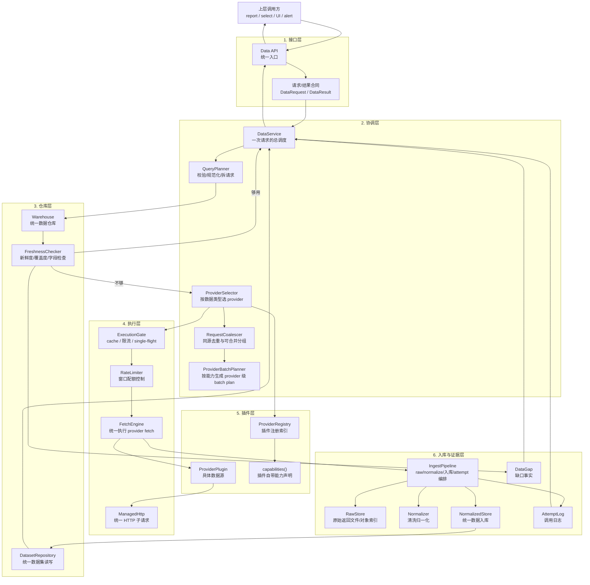
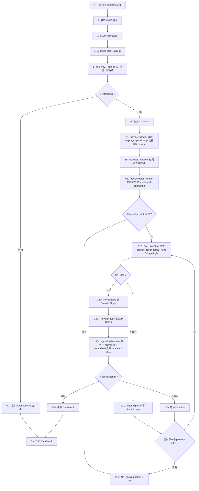
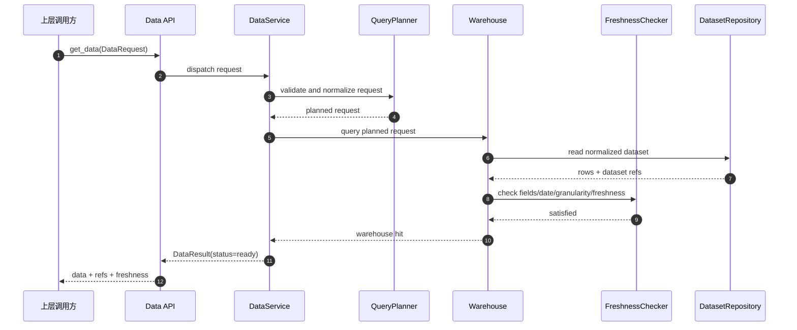
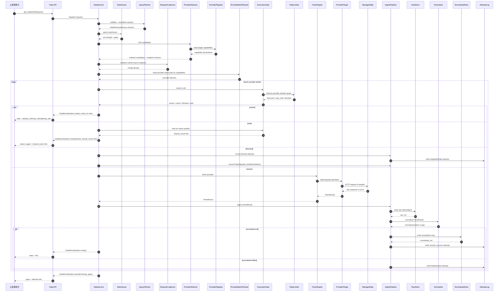
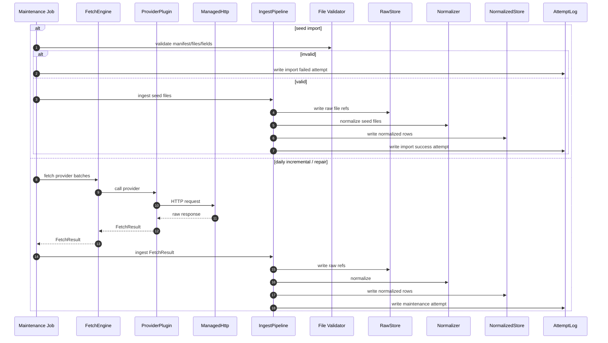

# 数据层总体设计

状态：目标设计。当前代码不代表已经全部完成。

本文定义数据层框架。它不定义 report 怎么写、不定义 select 策略怎么算、不定义 UI 怎么展示 provider。

## 1. 一句话结论

数据层运行时分 6 层：

```text
接口层
  -> 协调层
  -> 仓库层
  -> 执行层
  -> 插件层
  -> 入库与证据层
```

上层只调接口。

数据层负责返回数据、证据、缺口。

Provider 能力不是独立大模块。它是 provider 插件自己的声明。

已删除数据网关 本体已删除，不是目标运行时依赖。当前只继承它曾经参考过的思想：provider 插件、fetcher、统一字段。

后台还有一个数据维护入口，用来做 seed 导入、每日增量、数据修复。它不是 report/select 运行时路径。

## 2. 核心边界

上层负责提出请求：

```text
我要哪个市场、哪个标的、哪类数据、哪些字段、哪个时间段、什么新鲜度。
```

数据层负责处理请求：

```text
查仓库。
不够就调 provider。
保存 raw。
清洗成统一数据。
写调用日志。
返回数据和缺口。
```

上层负责解释结果：

```text
report 决定缺数据是否继续写。
select 决定缺字段是否失败。
UI 决定怎么展示。
```

数据层不写报告，不生成 worker 资料包，不决定策略成败。

市场不能写死成 A 股。

首批目标市场：

| 市场 | 运行形态 |
| --- | --- |
| A 股 | report + select，select 需要全市场仓库 |
| 美股 | report，后续可扩展 select |
| 港股 | report，后续可扩展 select |
| 加密币 | report，select 是目标能力 |

同一套数据层接口服务所有市场。差异只进入 provider 插件、数据集字段、交易日历和市场配置。

## 3. 总体架构图

这张图只说明分层关系，不表示完整执行顺序。



## 4. 端到端流程图

这张图说明一次数据请求的完整顺序。



## 5. 仓库命中时序图

这是最快路径，不出网。



## 6. 仓库不足补数时序图

这是需要 provider 的路径。



## 7. 后台维护时序图

后台维护是作业路径，不是运行时查询路径。

它覆盖三类任务：

- seed 导入；
- 每日增量更新；
- 数据修复回填。

三类任务复用同一套插件调用、IngestPipeline 入库与 AttemptLog 证据链。



## 8. 第 1 层：接口层

接口层是数据层唯一入口。

目标：所有上层都走同一套接口，不允许 report/select/UI 各自绕开 provider。

### 8.1 Data API

职责：

- 接收数据请求。
- 返回统一结果。
- 不暴露 provider 细节。

接口形态：

```text
get_data(request) -> result
```

批量接口：

```text
get_data_batch(requests) -> results
```

### 8.2 DataRequest

人话：调用方说“我要什么数据”。

字段：

| 字段 | 说明 |
| --- | --- |
| market | 市场，例如 A 股、美股、港股、加密币 |
| symbol | 单个标的，例如 `600519.SH`、`AAPL`、`BTC/USDT` |
| universe | 一组标的，主要给 select 用 |
| data_type | 数据类型，例如日线、财报、公告、新闻 |
| granularity | 粒度，例如日、分钟、实时、季度、事件 |
| fields | 必要字段，例如 open、close、roe |
| date_range | 时间范围 |
| freshness | 新鲜度要求，例如当天、5 分钟、盘后、不可变 seed |
| source_role | 来源角色，例如官方、行情、新闻线索 |
| consumer | 审计标签，例如 report、select、ui_probe、price_alert |

`consumer` 只做审计标签。数据层不能因为 consumer 不同而走不同 provider 框架。

数据层接口合同固定为：

```text
输入 DataRequest，输出 DataResult。
```

### 8.3 DataResult

人话：数据层说“我拿到了什么，还缺什么”。

字段：

| 字段 | 说明 |
| --- | --- |
| status | ready、partial、missing、error |
| rows | 返回的数据行 |
| dataset_refs | 归一化数据引用 |
| raw_refs | 原始返回证据引用 |
| attempt_refs | provider 调用日志引用 |
| gaps | 数据缺口 |
| freshness | 命中数据的新鲜度 |
| source_summary | 数据来源摘要 |

DataResult 不包含投资结论。

## 9. 第 2 层：协调层

协调层负责“一次请求怎么被完成”。

它不直接调 HTTP，也不直接写 Mongo。

### 9.1 DataService

职责：

- 接收 DataRequest。
- 调用仓库层检查数据。
- 不够时调用 provider 执行层。
- 汇总数据、证据、缺口。
- 返回 DataResult。

DataService 是流程总管，不是业务判断者。

它不能做：

- 写报告。
- 生成 worker 资料包。
- 决定 select 策略失败。
- 手写某个 provider 特殊路径。

### 9.2 QueryPlanner

职责：

- 校验请求。
- 合并重复请求。
- 把大请求拆成可执行的小请求。
- 区分仓库已有历史数据和需要补取的新增数据。
- 生成 `DataPlan`，说明这次请求的规范化需求、仓库检查范围与目标覆盖要求。

`DataPlan` 内容：

| 内容 | 说明 |
| --- | --- |
| normalized_requests | 规范化后的数据需求（market/symbol/data_type/granularity/fields/date_range/freshness） |
| warehouse_checks | 先查哪些数据集和时间段 |
| logical_missing_intents | 仓库不足时的缺口意图（缺字段/缺时间段/缺粒度/过期） |
| required_coverage | 满足本次请求所需的最小覆盖要求 |
| expected_outputs | 最终应返回哪些数据集 |

例子：

```text
select 要 5000 只股票的日线
-> 拆成按数据集和日期范围查询
```

```text
report 同时要日线和技术指标
-> 先查 daily_bar
-> 技术指标可以由 daily_bar 派生
```

report 或 select 可以在启动时一次提交完整需求清单。

```text
report: 一个标的，需要行情、财务、公告、新闻、舆情
select: 一个市场，需要全市场日线、基础信息、策略字段
```

数据层拿到清单后，先统一查仓库，再把缺口合并成 provider 批量调用。

### 9.3 RequestCoalescer

职责：

- 合并同一次业务请求里的同源数据请求。
- 在已知候选 provider + endpoint 后，做同源请求去重和可合并分组。
- 把同一 provider、同一 endpoint、同一数据类型、相近时间范围的请求归并为 merge group。
- 减少 HTTP 次数。

例子：

```text
report 需要同一标的的日线、复权因子、成交额
如果同一个 provider 一个接口能一次返回
-> 合成一次 provider call
```

```text
select 需要同一市场 5000 只股票的日线
provider 支持批量 symbol
-> 按 provider 限制拆成多个 batch
```

不能合并的情况：

- source_role 不同，例如官方公告不能和搜索线索合并成事实源。
- 粒度不同，例如日线和分钟线不能冒充同一数据。
- 授权策略不同，例如某源 raw 只能 metadata_only。
- provider 接口不支持批量。

说明：RequestCoalescer 只输出“可合并分组”，不直接生成 provider batch。真正的批量切分要等 `ProviderPlugin.capabilities()` 返回后再由 ProviderBatchPlanner 生成。

### 9.4 ProviderBatchPlanner

职责：

- 根据 provider 插件能力和 merge group 生成批量调用计划。
- 控制每批 symbol 数、时间范围、字段集合。
- 把历史缺口和新增数据分开。

执行顺序固定为：

```text
接口层校验/规范化
-> 仓库检查
-> 对缺口选择 provider
-> 读取 ProviderPlugin.capabilities()
-> RequestCoalescer 去重/分组
-> ProviderBatchPlanner 生成 provider 级 batch plan
-> ExecutionGate
-> FetchEngine
-> IngestPipeline
-> DataResult
```

例子：

```text
仓库已有 2020-01 到 2026-05-30 日线
请求需要到 2026-05-31
-> 只补 2026-05-31
```

```text
仓库缺 2024-01 到 2024-03
-> 只补缺失区间
```

### 9.5 ProviderSelector

职责：

- 当仓库不够时，选择可用 provider。
- 只按数据类型、市场、字段、粒度、source_role 选。

ProviderSelector 不保存 provider 能力。它只读取 provider 插件声明。

Provider 能力来源：

```text
ProviderPlugin.capabilities()
```

所以能力目录不是顶层模块。它只是插件注册后的索引。

## 10. 第 3 层：仓库层

仓库层负责“已有数据能不能满足请求”。

默认主仓库是 Mongo。

### 10.1 Warehouse

职责：

- 查归一化数据。
- 按请求过滤 market、symbol、data_type、granularity、date_range、fields。
- 返回命中数据。
- 返回缺口。

仓库判断必须精确。

错误：

```text
有 A 股日线 seed
-> 就认为行情、财报、新闻都够
```

正确：

```text
日线 seed 只能满足日线数据。
不能冒充实时行情、公告、新闻、财报、舆情。
```

### 10.2 FreshnessChecker

职责：

- 判断数据是否过期。
- 判断时间范围是否覆盖。
- 判断字段是否足够。
- 判断粒度是否匹配。

例子：

```text
请求分钟线
仓库只有日线
-> granularity_mismatch
```

```text
请求 2024-01 到 2024-12
仓库只有 2024-06 以后
-> date_range_missing
```

```text
请求 roe
仓库只有 revenue/profit
-> field_missing
```

### 10.3 DatasetRepository

职责：

- 读写统一数据集。
- 不关心数据来自哪个 provider。
- provider 只存在 lineage 里。

建议表名：

```text
normalized_datasets
```

现有代码如有旧表名，可以先做兼容映射，但目标语义是：

```text
统一归一化数据表
```

不要把来源写进业务数据集名。

错误：

```text
baostock.qfq_daily
tushare.daily_basic
yfinance.crypto_price
```

正确：

```text
daily_bar
valuation_metric
crypto_derivative_metric
```

## 11. 第 4 层：执行层

执行层负责“怎么安全地出网”。

它包住 provider 插件。

### 11.1 ExecutionGate

职责：

- provider-result cache（数据层内部缓存，不是 OpenViking 缓存）。
- rate limit。
- cooldown。
- single-flight。
- 等待和重试调度。

人话：

```text
同一个请求别重复打远端。
限流了就别继续撞。
别人正在拉同一份数据，就等结果。
```

cache 最小语义：

- `fresh`：命中且在 TTL 内，直接 `cache_hit`。
- `stale`：超过 TTL 但未超过 stale 窗口，可按策略走后台刷新。
- `empty`：确认空结果，写 `cached_empty` 并带空结果 TTL。
- freshness 判断以 DataRequest 的 `freshness` 为准，不能把旧缓存伪装成新鲜远端结果。

状态语义：

| 状态 | 意思 |
| --- | --- |
| remote_success | 真实远端成功 |
| cache_hit | 命中缓存，不是远端成功 |
| shared_result | 复用别人的结果，不是远端成功 |
| rate_limited | 被限流，不是远端成功 |
| cooldown_skipped | 冷却中跳过，不是远端成功 |
| cached_empty | 缓存里记着空结果，不是远端成功 |

### 11.2 RateLimiter

职责：

- 按 provider、endpoint、api key、window 控制请求数。
- 在出网前原子申请配额。
- 超额时等待下一个窗口，或返回 rate_limited。

限流策略来自用户在 UI / `.env.local` / Mongo 数据源设置中的配置，不来自 provider 插件硬编码。provider 插件只负责声明能力和命名空间；如果用户没有设置限流，本地不主动限流，只记录调用计数。若远端返回 429 / quota 类限流，当前 provider 记为 `rate_limited`，本次需求继续尝试下一个可用 provider。

```text
rate_limit_policy = {
  window_seconds: 60,
  max_requests: 10,
  safety_margin: 1,
  overflow: "wait"
}
```

人话：

```text
如果用户配置的规则是 1 分钟 10 次。
safety_margin=1 时，系统 1 分钟最多主动发 9 次。
第 10 次先等下一个窗口。
```

如果 `safety_margin=0`：

```text
1 分钟允许发满 10 次。
第 11 次等待下一个窗口。
```

必须支持两种超额处理：

| overflow | 行为 |
| --- | --- |
| wait | 等到下一个窗口再发 |
| fail_fast | 不等待，返回 rate_limited 缺口 |

RateLimiter 必须持久化状态，不能只靠进程内计数。

建议状态表：

```text
provider_rate_limits
```

核心字段：

| 字段 | 说明 |
| --- | --- |
| provider | provider 名 |
| endpoint | 接口 |
| credential_scope | key 或账号维度的脱敏标识 |
| window_start | 当前窗口开始时间 |
| window_seconds | 窗口长度 |
| max_requests | 最大次数 |
| used_requests | 已占用次数 |
| reset_at | 下个窗口时间 |

### 11.3 SingleFlight

职责：

- 同一个请求同一时间只能有一个 owner 出网。
- 其它相同请求等待 owner 结果。
- owner 成功后，consumer 拿 shared_result。
- owner 失败后，consumer 共享失败，不自己撞远端。

SingleFlight key 必须包含：

```text
provider
endpoint
data_type
market
symbol/universe
date_range
fields
provider_config_version
```

建议状态表：

```text
single_flight_calls
```

最小字段合同：

| 字段 | 说明 |
| --- | --- |
| key_hash | single-flight key 哈希，唯一约束 |
| status | pending、published_success、published_error、expired |
| owner_id | 当前 owner 调用标识 |
| lease_expires_at | owner 租约截止时间 |
| result_refs | owner 发布的 dataset_refs/raw_refs/attempt_refs |
| gap_or_error | owner 发布的 gaps 或 error 摘要 |
| created_at | 创建时间 |
| updated_at | 更新时间 |

持久化状态机：

```text
1) acquire owner/waiter
   - 第一个请求原子写入(key_hash, status=pending, owner_id, lease_expires_at)，成为 owner。
   - 后续相同请求成为 waiter，不得直接出网。
2) publish
   - owner 完成 fetch+ingest 后，写 published_success 或 published_error，并写 result_refs 或 gap_or_error。
3) waiter 读取
   - waiter 轮询或订阅同 key_hash；看到 published_* 后返回 shared_result，不重复出网。
4) 租约过期
   - 若 pending 且 lease_expires_at 超时，下一请求可 CAS 抢占 owner_id 并续租；
     旧 owner 结果不得覆盖新 owner 已发布结果。
```

### 11.4 FetchEngine

职责：

- 调 provider 插件。
- 统一捕获异常。
- 统一返回 FetchResult。
- 不让 provider 自己写仓库。
- 不负责 raw/normalized/attempt 持久化。

FetchResult 包含：

| 字段 | 说明 |
| --- | --- |
| status | success、empty、error、rate_limited |
| payload | provider 原始返回 |
| content_type | json、csv、html、binary |
| source_url | 来源 URL |
| provider_request_id | provider 请求 ID，如有 |
| error | 错误信息 |

### 11.5 IngestPipeline

职责：

- 接收 FetchResult 或 seed 文件输入。
- 写 RawStore。
- 调 Normalizer。
- 写 NormalizedStore。
- 写 AttemptLog。
- 产出 dataset_refs/raw_refs/attempt_refs/gaps 供 DataService 汇总 DataResult。

IngestPipeline 才是入库与证据写入 owner；DataService 只做编排，FetchEngine 只做拉取。

### 11.6 ManagedHttp

职责：

- 显式 HTTP 请求统一走这里。
- 稳定生成 request key。
- 不把 token/api key 写进 key。
- 捕获 429、quota、timeout、5xx。

如果某个 SDK 内部 HTTP 不可见，不能伪造 HTTP 证据。

## 12. 第 5 层：插件层

插件层负责“具体源怎么接”。

这层参考 已删除数据网关 的 provider/fetcher 思想。

### 12.1 ProviderPlugin

每个源一个插件。

例子：

```text
tushare
baostock
akshare
eastmoney
yfinance
sec
fred
coinglass
```

市场不是只有 A 股。

插件可以按市场拆：

| 市场 | 常见插件例子 |
| --- | --- |
| A 股 | tushare、baostock、akshare、eastmoney、cninfo、mootdx |
| 美股 | yfinance、sec、fred、fmp、tiingo |
| 港股 | hkexnews、akshare_hk、eastmoney_hk、longport、futu |
| 加密币 | binance、okx、coinglass、coingecko、defillama |

插件职责：

- 声明能力。
- 校验凭证。
- 构造请求。
- 调真实数据源。
- 返回原始 payload。

插件不负责：

- 判断是否进 report。
- 判断 select 是否失败。
- 写 normalized 仓库。
- 写 worker 资料包。

### 12.2 Capability 是插件属性

Provider 能力不是单独大模块。

它是插件自己的声明：

```text
ProviderPlugin.capabilities()
```

能力声明包括：

| 字段 | 说明 |
| --- | --- |
| provider_id | provider 名称 |
| endpoints | endpoint 级能力映射，键是 endpoint 名 |
| endpoints[*].data_type | 该 endpoint 能提供哪类数据 |
| endpoints[*].market | 该 endpoint 支持哪个市场 |
| endpoints[*].granularity | 该 endpoint 支持什么粒度 |
| endpoints[*].fields | 该 endpoint 能提供哪些字段 |
| endpoints[*].source_role | 该 endpoint 来源角色 |
| endpoints[*].batch_policy.supports_batch | 是否支持批量 |
| endpoints[*].batch_policy.batch_by | 批量维度（symbol/date_range/field 等） |
| endpoints[*].batch_policy.max_symbols_per_call | 单次最多 symbols |
| endpoints[*].batch_policy.max_days_per_call | 单次最多天数 |
| endpoints[*].batch_policy.mergeable_fields | 可合并字段集合 |
| endpoints[*].batch_policy.pagination_policy | 分页策略 |
| endpoints[*].batch_policy.split_policy | 超限拆分策略 |
| credentials | 需要哪些 key |
| priority | 默认优先级 |
| license_policy | raw 能不能存 |
| rate_limit_policy | 限流规则 |

启动时可以把这些声明建成索引。

这个索引只是缓存，不是独立业务模块。

批量能力必须由插件明确声明。数据层不能猜某 endpoint 是否可批量、可按什么维度批量、以及超限怎么拆分。

### 12.3 ProviderRegistry

职责：

- 注册插件。
- 根据插件声明建立内存索引。
- 给 ProviderSelector 查询。

ProviderRegistry 不定义业务规则。

业务规则来自：

```text
请求要求 + provider capability + 配置优先级
```

## 13. 第 6 层：入库与证据层

入库与证据层负责“拉到的数据怎么可信地留下来”。

### 13.1 RawStore

人话：保存 provider 原始返回的证据。

目标：

```text
raw 正文放文件/对象。
Mongo 只存索引。
```

索引字段：

| 字段 | 说明 |
| --- | --- |
| raw_ref | raw 引用 |
| payload_hash | 原始内容 hash |
| request_hash | 请求 hash |
| provider | 数据源 |
| endpoint | 接口 |
| params_summary | 参数摘要 |
| object_path | 文件/对象路径 |
| content_type | 内容类型 |
| license_policy | 授权策略 |
| created_at | 时间 |

建议表名：

```text
raw_payloads
```

但目标语义是 raw 索引表。

### 13.2 Normalizer

人话：把每个 provider 不同字段翻译成统一字段。

例子：

```text
trade_date / date / Date -> date
vol / volume / Volume -> volume
```

Normalizer 职责：

- 字段改名。
- 类型转换。
- 单位转换。
- 时间和时区统一。
- 代码格式统一。
- 缺字段检查。
- 复权、币种、交易对等口径标记。

Normalizer 不应该把来源名字写成数据集名字。

### 13.3 NormalizedStore

人话：保存清洗后的统一数据。

建议表名：

```text
normalized_datasets
```

核心字段：

| 字段 | 说明 |
| --- | --- |
| dataset | 统一数据集名 |
| market | 市场 |
| symbol | 标的 |
| granularity | 粒度 |
| period_start | 覆盖开始 |
| period_end | 覆盖结束 |
| rows | 数据行 |
| field_units | 字段单位 |
| source_raw_ref | raw 证据引用 |
| provider | 原始来源 |
| created_at | 入库时间 |

### 13.4 AttemptLog

人话：记录每次 provider 调用事实。

建议表名：

```text
provider_attempts
```

字段：

| 字段 | 说明 |
| --- | --- |
| provider | 调了谁 |
| endpoint | 调哪个接口 |
| status | 成功、失败、限流、空结果 |
| latency_ms | 耗时 |
| row_count | 行数 |
| error_code | 错误码 |
| error_message | 错误信息 |
| raw_ref | raw 证据 |
| normalized_ref | 清洗数据引用 |
| request_hash | 请求 hash |

AttemptLog 不是业务决策表。

它只记录事实。

### 13.5 DataGap

人话：明确告诉上层“缺什么”。

常见缺口：

| 缺口 | 说明 |
| --- | --- |
| warehouse_missing | 仓库没有 |
| warehouse_stale | 仓库有，但过期 |
| field_missing | 字段缺 |
| date_range_missing | 时间范围不全 |
| granularity_mismatch | 粒度不匹配 |
| credential_missing | 缺 key |
| provider_error | provider 报错 |
| rate_limited | 被限流 |
| empty_result | 返回空 |
| license_blocked | 授权不允许保存或使用 |

DataGap 不决定上层怎么处理。

它只陈述事实。

### 13.6 IngestPipeline 在本层的所有权

本层组件所有权如下：

- `FetchEngine`：只负责调 provider 并返回 `FetchResult`。
- `IngestPipeline`：负责 raw 保存、normalize、normalized 入库、attempt 写入。
- `DataService`：只编排，不直接写 RawStore/NormalizedStore/AttemptLog。

## 14. 统一数据集

统一数据集是“业务看得懂的数据类型”。

不是 provider 名字。

统一数据集跨市场复用。

例子：

```text
daily_bar 可以用于 A 股、美股、港股、加密币。
差异放在 market、symbol_id、exchange、currency、timezone、calendar、base_asset、quote_asset、provider_lineage、as_of 字段里。
```

不要为每个市场重复造同义数据集：

```text
不要：cn_a_daily_bar / us_daily_bar / hk_daily_bar
优先：daily_bar + market 字段
```

如需 crypto 专属数据集，只用于链上或衍生品指标；现货 K 线仍优先复用 `daily_bar`。

### 14.1 多市场基础合同字段

统一数据集至少要有以下公共字段：

| 字段 | 说明 |
| --- | --- |
| market | 市场标识（CN_A/US/HK/CRYPTO） |
| symbol_id | 统一标的 ID（股票代码或交易对） |
| exchange | 交易所 |
| currency | 计价币种 |
| timezone | 时区 |
| calendar | 交易日历标识 |
| provider_lineage | 来源链路（provider+endpoint+version） |
| as_of | 数据生效时间点 |

约束：

- 交易日历不能写死 A 股日历。
- 币种不能写死 CNY。
- 时区不能写死 Asia/Shanghai。
- 复权口径（前复权/后复权/不复权）与交易对口径（base/quote）必须显式字段化。

### 14.2 行情类

| 数据集 | 中文含义 | 用途 | 关键字段 |
| --- | --- | --- | --- |
| daily_bar | 日线行情 | 技术分析、历史走势、选股基础特征 | date、open、high、low、close、volume、amount |
| intraday_bar | 分钟/小时行情 | 短周期走势、盘中观察 | timestamp、open、high、low、close、volume |
| quote_snapshot | 实时报价快照 | 当前价格、涨跌幅、成交额 | price、change、change_pct、volume、amount、timestamp |
| order_book_snapshot | 盘口快照 | 买卖盘、流动性 | bid_price、bid_size、ask_price、ask_size、timestamp |
| corporate_action | 复权和公司行为 | 复权、分红、拆股 | ex_date、split_ratio、dividend、adjust_factor |

### 14.3 财务类

| 数据集 | 中文含义 | 用途 | 关键字段 |
| --- | --- | --- | --- |
| financial_statement | 三大表 | 基本面分析 | period、revenue、net_income、assets、liabilities、cash_flow |
| financial_metric | 财务指标 | 盈利能力、成长性、偿债能力 | roe、roa、gross_margin、debt_ratio、eps |
| valuation_metric | 估值指标 | PE/PB/PS、市值判断 | pe、pb、ps、market_cap、ev_ebitda |

### 14.4 事件和文本类

| 数据集 | 中文含义 | 用途 | 关键字段 |
| --- | --- | --- | --- |
| official_filing | 官方公告/披露 | 正式事实来源 | title、published_at、url、source、body_ref |
| company_news | 公司新闻 | 新闻分析 | title、published_at、source、summary、url |
| macro_news | 宏观新闻 | 宏观背景 | title、published_at、region、summary、url |
| social_signal | 社交/情绪信号 | 舆情分析 | score、mentions、sentiment、source、timestamp |
| event_calendar | 事件日历 | 财报、解禁、分红、会议等 | event_type、event_date、title、source |

### 14.5 资金和市场结构类

| 数据集 | 中文含义 | 用途 | 关键字段 |
| --- | --- | --- | --- |
| capital_flow | 资金流 | 主力、北向、行业资金 | inflow、outflow、net_inflow、period |
| sector_snapshot | 行业/概念快照 | 板块强弱 | sector、change_pct、turnover、leader_symbols |
| hot_money_event | 龙虎榜/游资事件 | 短线资金分析 | trade_date、seat、buy_amount、sell_amount、symbol |
| lockup_event | 解禁事件 | 供给压力 | unlock_date、shares、market_value、holder |

### 14.6 宏观和加密扩展类

| 数据集 | 中文含义 | 用途 | 关键字段 |
| --- | --- | --- | --- |
| macro_series | 宏观时间序列 | 利率、通胀、就业、汇率 | date、indicator、value、unit、region |
| crypto_derivative_metric | 加密衍生品指标 | 资金费率、OI、多空、清算 | timestamp、funding_rate、open_interest、long_short_ratio |
| crypto_onchain_metric | 链上指标 | 活跃地址、交易量、交易所流入流出 | timestamp、metric、value、chain |
| defi_metric | DeFi 指标 | TVL、费用、收入 | protocol、date、tvl、fees、revenue |

## 15. 已删除数据网关 关系

已删除数据网关 本体已删除，不是目标运行时依赖。

保留思想：

- provider 插件。
- fetcher 统一流程。
- 标准字段。
- provider 能力声明。

不用的部分：

- 已删除数据网关 全量 MCP。
- 已删除数据网关 Workspace / Excel / CLI。
- 已删除数据网关 user_settings 作为主配置。
- 旧外部对象作为仓库数据结构。
- 已删除数据网关 runtime 作为唯一执行核心。

## 16. OpenViking 边界

OpenViking 不属于数据层核心。它属于材料层/证据展示层。

数据层职责到 `DataResult` 为止，且只产出：

- `dataset_refs`
- `raw_refs`
- `attempt_refs`
- `gaps`

材料层/资料包/报告层在此之上再决定是否写入 OpenViking。

OpenViking 明确不做：

- provider cache；
- 限流状态存储；
- raw/normalized 主仓库；
- provider 调用执行。

## 17. Stop Conditions

遇到这些必须停：

- report/select 绕过 DataService 直接调 provider。
- provider 失败被写成成功。
- cache/shared/rate-limit 被写成 remote success。
- 搜索结果被当正式事实。
- 本地 CSV 成为长期运行时主查询。
- OpenViking 被改成 provider cache。
- 数据层开始生成 worker 投资内容。
- SDK 或 provider 无法区分失败原因，却要写成成功。

## 18. 一句话版本

数据层 6 层：

```text
接口层 -> 协调层 -> 仓库层 -> 执行层 -> 插件层 -> 入库与证据层
```

Provider 能力是插件属性，不是独立大模块。

数据集必须按业务语义命名，不按来源命名。
