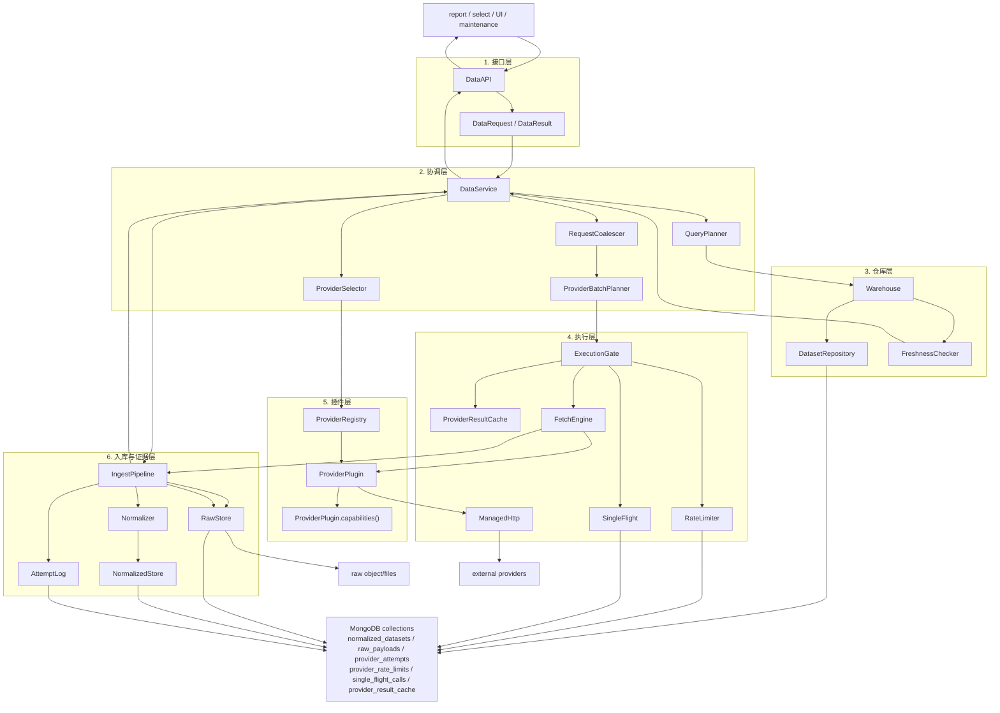
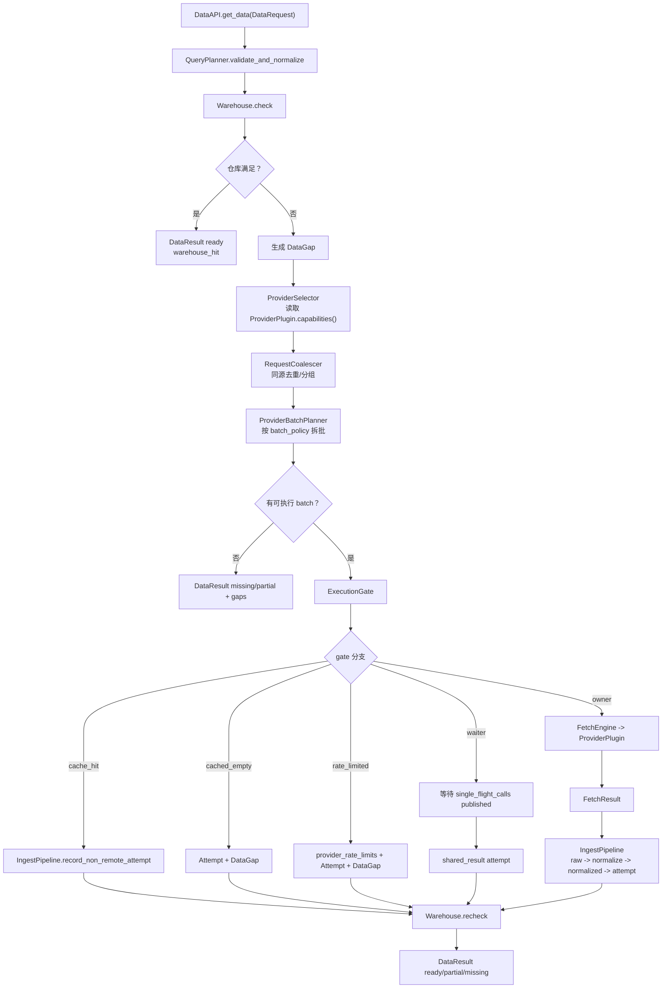
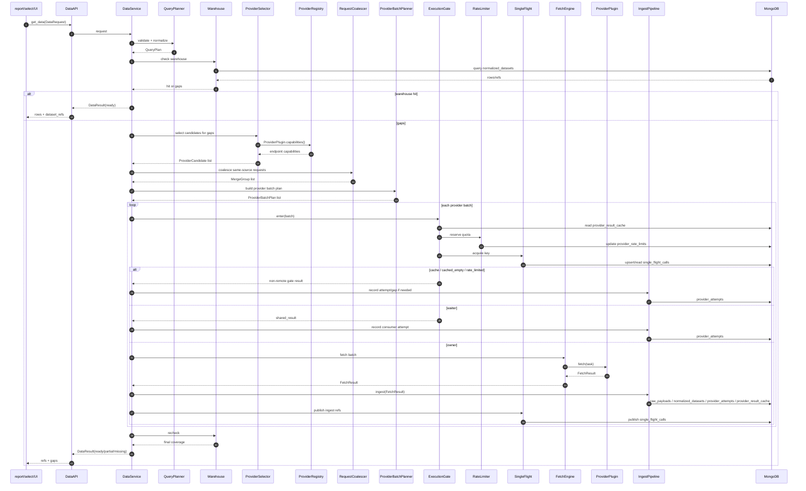

# 数据层详细设计

状态：目标详细设计，供后续编码直接落地；不声明当前实现已经完成。

基准来源：`AGENTS.md`、`docs/数据层总体设计.md`、`docs/架构设计.md`。本文只改写数据层目标合同，不改 report/select/UI/worker 的权责。

核心结论：数据层只接收 `DataRequest`，返回 `DataResult`。它负责查仓库、补数据、写 raw/normalized/attempt 证据、返回缺口；它不生成 worker 资料包，不决定 report 是否继续，不决定 select 是否失败。

## 1. 设计目标与边界

### 目标

- 用一套数据接口服务 A 股、美股、港股、加密币。
- 让上层只描述需要什么数据：市场、标的、数据集、字段、时间范围、粒度、新鲜度。
- 先查统一数据仓库，仓库不足时再按数据缺口选择 provider。
- Provider 能力来自 `ProviderPlugin.capabilities()`，不是独立顶层能力模块。
- Provider 支持批量时必须合并请求；是否支持批量只能由插件能力声明决定，数据层不能猜。
- 所有限流、single-flight、provider-result cache 状态必须持久化。
- 返回可追溯结果：`dataset_refs`、`raw_refs`、`attempt_refs`、`gaps`。
- 数据集按业务语义命名，例如 `daily_bar`、`financial_metric`、`official_filing`，不按 provider 命名。

### 非目标

- 不实现代码。
- 不新增 runtime guard。
- 不写报告。
- 不生成 worker 资料包。
- 不决定 report 继续、中止或重跑。
- 不决定 select 成功、失败或候选策略。
- 不把 cache、shared、rate-limit、cached empty 写成远端成功。
- 不用 mock、stub、fake、fallback 作为设计路径。
- 不把搜索线索当正式事实源。
- 不引入 OpenBB 本体运行时作为主依赖。

### 与 report/select/UI/worker 的边界

| 调用方 | 可以做 | 不可以做 |
| --- | --- | --- |
| report | 提交单标的 `DataRequest`，消费 `DataResult` 和缺口事实 | 直接调 provider；要求数据层生成 worker 资料包；让数据层决定报告是否继续 |
| select | 提交全市场或候选池 `DataRequest`，消费仓库数据和缺口 | 让数据层决定策略失败；绕过仓库直接读本地文件作为长期主路径 |
| UI | 展示数据源状态、结果和缺口 | 把 probe 成功当主链路可用证明；要求数据层写 OpenViking |
| worker | 通过工具层间接触发数据请求，阅读材料层生成的自然语言材料 | 直接选择 provider；直接读 provider 插件；看到内部 attempt/cache 协议 |

`consumer` 只是审计标签。它可以帮助追踪“这次数据请求来自 report/select/UI/维护任务”，但不能改变 provider 选择框架、执行闸门、证据写入路径或失败语义。

### 与 OpenBB 的关系

OpenBB 本体可以不用。本文继承的只有三类思想：

- provider 插件化；
- fetcher 统一调用流程；
- 统一字段和能力声明。

不用的部分：

- OpenBB 全量应用、CLI、Workspace、Excel；
- OpenBB 运行时作为数据层核心；
- OpenBB 的对象模型作为仓库结构；
- 旧 OpenBB 前缀作为目标表名、模块名或证据链名。

### 与 OpenViking 的关系

OpenViking 不属于数据层核心。它属于材料层/证据展示层。

数据层不调用 OpenViking，不写 approved material，不保存 worker 可读材料。数据层只返回 `DataResult`；材料层和报告层在其上决定是否把材料写入 OpenViking。

OpenViking 明确不做：

- provider cache；
- provider 限流；
- raw/normalized 主仓库；
- 外部 provider 调用；
- 数据层 single-flight 状态。

## 2. 模块总览

### 6 层模块图



### 每层职责

| 层 | 职责 | 不负责 | 主要输入 | 主要输出 |
| --- | --- | --- | --- | --- |
| 接口层 | 接收请求、校验基础合同、返回统一结果 | 选择 provider、写库、写报告 | `DataRequest` | `DataResult` |
| 协调层 | 编排一次请求的完整流程 | 直接 HTTP、直接写 Mongo、生成资料包 | 规范化请求、仓库缺口 | `DataPlan`、`ProviderBatchPlan`、汇总结果 |
| 仓库层 | 判断已有数据是否满足请求 | 出网、选择 provider | `DataRequest`/仓库检查项 | 命中 refs、`DataGap` |
| 执行层 | cache、限流、single-flight、真实 fetch | normalized 入库、attempt 写入 | `ProviderBatchPlan` | gate 结果、`FetchResult` |
| 插件层 | 声明 provider 能力、构造并执行 provider 请求 | 决定 report/select 业务结果、写仓库 | `FetchTask` | `FetchResult` |
| 入库与证据层 | raw 保存、normalize、normalized 写入、attempt 记录、gap 归档 | 出网、写 OpenViking、写投资结论 | `FetchResult` 或 seed 输入 | `IngestResult` |

### 禁止越界事项

- `QueryPlanner` 不生成 provider candidate，不生成 provider batch plan。
- `ProviderSelector` 不猜 batch 能力；只读取插件能力后筛选候选。
- `FetchEngine` 不写库，只返回 `FetchResult`。
- `IngestPipeline` 不出网，只写 raw/normalized/attempt/gap 证据。
- `DatasetRepository` 不按 provider 建业务数据集名。
- `OpenViking` 不进入数据层核心。
- `consumer` 不允许导致 report/select/UI 三套数据框架分叉。

## 3. 核心数据流

### 仓库命中流程

```text
DataRequest
  -> DataAPI 校验
  -> QueryPlanner 规范化请求
  -> Warehouse 查询 normalized_datasets
  -> FreshnessChecker 检查字段/时间/粒度/新鲜度
  -> 命中
  -> DataResult(status=ready, dataset_refs=..., gaps=[])
```

### 仓库不足补数流程

```text
DataRequest
  -> QueryPlanner 规范化
  -> Warehouse 产出 DataGap
  -> ProviderSelector 读取 ProviderPlugin.capabilities() 并选择候选
  -> RequestCoalescer 同源去重/分组
  -> ProviderBatchPlanner 按 batch_policy 生成 ProviderBatchPlan
  -> ExecutionGate 检查 cache / rate-limit / single-flight
  -> FetchEngine 调 ProviderPlugin
  -> IngestPipeline 写 raw / normalized / attempt / gaps
  -> Warehouse recheck
  -> DataResult(status=ready|partial|missing)
```

### cache/shared/rate-limit 分支

| 分支 | 出网 | 是否远端成功 | 写什么证据 | 返回语义 |
| --- | --- | --- | --- | --- |
| `cache_hit` | 否 | 否 | attempt 引用 cache refs | 有可复用数据，但不是本次远端成功 |
| `cached_empty` | 否 | 否 | attempt + empty cache ref + gap | 已知空结果，不能当数据成功 |
| `shared_result` | 否 | 否 | consumer attempt + owner attempt refs | 复用 owner 结果；owner 失败则共享失败 |
| `rate_limited` | 否 | 否 | rate-limit decision + attempt + gap | 配额不足或等待超时 |
| `remote_success` | 是 | 是 | raw + normalized + attempt + cache | 真实 provider 成功 |
| `provider_error` | 是或未完成 | 否 | attempt + http/raw refs 如有 + gap | provider 失败或不可判断 |

### 后台 seed/增量/修复流程

后台维护不是 report/select runtime。它只复用同一条执行和入库链路。

```text
MaintenanceJob(seed/import/daily_incremental/repair)
  -> 生成 DataRequest、FetchTask 或 SeedInput
  -> 可选仓库检查
  -> ExecutionGate / FetchEngine 或本地文件 FetchResult
  -> IngestPipeline
  -> normalized_datasets / raw_payloads / provider_attempts
  -> dataset_manifests / maintenance_jobs 更新
```

### Mermaid 流程图



### Mermaid 时序图



## 4. 接口定义

### `DataAPI.get_data(request) -> result`

职责：单个数据需求入口。

不负责：业务策略判断、报告生成、OpenViking 写入、provider 直连。

输入：`DataRequest`。

输出：`DataResult`。

伪码：

```python
class DataAPI:
    def get_data(self, request: DataRequest) -> DataResult:
        validation = DataRequestValidator.validate(request)
        if not validation.ok:
            return DataResult.error(
                request_id=request.request_id,
                gaps=[DataGap.invalid_request(request, validation.errors)],
            )
        return self.data_service.get_data(validation.normalized_request)
```

### `DataAPI.get_data_batch(requests) -> results`

职责：批量入口，复用同一协调层。它可以合并请求，但不能绕过单个请求的合同。

输入：`Sequence[DataRequest]`。

输出：`Sequence[DataResult]`，顺序与输入 request 对应。

伪码：

```python
class DataAPI:
    def get_data_batch(self, requests: Sequence[DataRequest]) -> list[DataResult]:
        validated, invalid_results = validate_many(requests)
        batch_plan = self.data_service.plan_batch(validated)
        batch_result = self.data_service.execute_plan(batch_plan)
        return restore_input_order(batch_result, invalid_results)
```

### 请求校验

| 校验项 | 规则 | 失败 reason |
| --- | --- | --- |
| 市场 | 只能是 `CN_A`、`US`、`HK`、`CRYPTO` | `invalid_request` |
| 标的 | `symbol_id` 与 `universe_ref` 必须二选一 | `invalid_request` |
| 加密币交易对 | `CRYPTO` 必须有 `base_asset`、`quote_asset` | `invalid_request` |
| 股票市场交易对字段 | 非 `CRYPTO` 不允许填写 `base_asset`、`quote_asset` | `invalid_request` |
| 字段 | `fields` 非空 | `field_missing` 或 `invalid_request` |
| 时间范围 | 起始时间不能晚于结束时间 | `invalid_request` |
| 粒度 | 必须是数据集支持的粒度枚举 | `granularity_mismatch` |
| 新鲜度 | 必须指定，例如 `trading_day`、`ttl_5m`、`utc_daily`、`immutable_seed` | `invalid_request` |
| consumer | 只能是审计标签 | `invalid_request` |

### 错误语义

- `DataResult.status="ready"`：数据满足请求；可带 `info` 级 gap。
- `DataResult.status="partial"`：有部分数据，但字段、时间、粒度或 freshness 有缺口。
- `DataResult.status="missing"`：没有可满足请求的数据，必须有 gap。
- `DataResult.status="error"`：请求非法、证据写失败、仓库不可用等数据层错误。

`DataResult.status` 不代表 report/select 成败。上层可以依据 gaps 和自己的业务规则决定继续、停止、降级显示或提示用户。

## 5. 核心数据结构

### 枚举

| 枚举 | 值 |
| --- | --- |
| `Market` | `CN_A`、`US`、`HK`、`CRYPTO` |
| `DataResultStatus` | `ready`、`partial`、`missing`、`error` |
| `GapSeverity` | `blocker`、`warn`、`info` |
| `GapReason` | `credential_missing`、`rate_limited`、`provider_error`、`empty_result`、`warehouse_missing`、`warehouse_stale`、`field_missing`、`date_range_missing`、`granularity_mismatch`、`license_blocked`、`evidence_write_failed`、`cached_empty`、`cooldown_skipped`、`not_applicable`、`invalid_request` |
| `FetchStatus` | `success`、`empty`、`error`、`rate_limited`、`credential_missing`、`not_applicable`、`sdk_http_unknown` |
| `SourceRole` | `official`、`paid_data`、`built_in_public`、`discovery`、`sentiment`、`event_expectation` |
| `RequiredLevel` | `required`、`optional`、`expensive`、`not_applicable` |
| `HttpVisibility` | `managed_http`、`sdk_internal_unknown`、`no_http` |

### `DataRequest`

字段表：

| 字段 | 类型 | 必填 | 说明 |
| --- | --- | --- | --- |
| `request_id` | `str` | 是 | 调用方生成或接口层生成的稳定 ID |
| `market` | `Market` | 是 | 市场 |
| `symbol_id` | `str | None` | 条件 | 单标的请求 |
| `universe_ref` | `str | None` | 条件 | 全市场/候选池请求 |
| `exchange` | `str | None` | 否 | 交易所 |
| `currency` | `str | None` | 否 | 计价币种 |
| `timezone` | `str` | 是 | 数据时区 |
| `calendar` | `str` | 是 | 交易日历 |
| `base_asset` | `str | None` | 条件 | 加密币基础资产 |
| `quote_asset` | `str | None` | 条件 | 加密币计价资产 |
| `data_type` | `str` | 是 | 业务数据集类型 |
| `granularity` | `str` | 是 | `daily`、`intraday`、`realtime`、`quarterly`、`event` 等 |
| `fields` | `tuple[str, ...]` | 是 | 必要字段 |
| `date_range_start` | `date | datetime | None` | 否 | 起始 |
| `date_range_end` | `date | datetime | None` | 否 | 结束 |
| `freshness_policy` | `str` | 是 | 新鲜度策略 |
| `source_role_required` | `SourceRole | None` | 否 | 官方源/情绪源等要求 |
| `consumer` | `str` | 是 | 审计标签 |
| `consumer_id` | `str` | 是 | worker/strategy/UI/job 标识 |
| `as_of` | `datetime` | 是 | 请求基准时间 |

伪码：

```python
class DataRequest(BaseModel):
    request_id: str
    market: Literal["CN_A", "US", "HK", "CRYPTO"]
    symbol_id: str | None = None
    universe_ref: str | None = None
    exchange: str | None = None
    currency: str | None = None
    timezone: str
    calendar: str
    base_asset: str | None = None
    quote_asset: str | None = None
    data_type: str
    granularity: str
    fields: tuple[str, ...]
    date_range_start: date | datetime | None = None
    date_range_end: date | datetime | None = None
    freshness_policy: str
    source_role_required: SourceRole | None = None
    consumer: Literal["report", "select", "ui_probe", "price_alert", "maintenance"]
    consumer_id: str
    as_of: datetime

    @model_validator(mode="after")
    def validate_contract(self) -> "DataRequest":
        if bool(self.symbol_id) == bool(self.universe_ref):
            raise ValueError("symbol_id 与 universe_ref 必须二选一")
        if not self.fields:
            raise ValueError("fields 不能为空")
        if self.date_range_start and self.date_range_end and self.date_range_start > self.date_range_end:
            raise ValueError("date_range_start 不能晚于 date_range_end")
        if self.market == "CRYPTO" and (not self.base_asset or not self.quote_asset):
            raise ValueError("CRYPTO 必须提供 base_asset/quote_asset")
        if self.market != "CRYPTO" and (self.base_asset or self.quote_asset):
            raise ValueError("非 CRYPTO 不允许 base_asset/quote_asset")
        return self
```

### `DataResult`

字段表：

| 字段 | 类型 | 说明 |
| --- | --- | --- |
| `request_id` | `str` | 对应请求 |
| `status` | `DataResultStatus` | 数据可用性 |
| `rows` | `tuple[Mapping[str, Any], ...]` | 可选轻量行；大数据只返回 refs |
| `dataset_refs` | `tuple[str, ...]` | normalized 数据引用 |
| `raw_refs` | `tuple[str, ...]` | raw 索引引用 |
| `attempt_refs` | `tuple[str, ...]` | provider attempt 引用 |
| `gaps` | `tuple[DataGap, ...]` | 缺口事实 |
| `freshness` | `Mapping[str, Any]` | 新鲜度快照 |
| `source_summary` | `str | None` | 人类可读来源摘要，不含投资结论 |
| `as_of` | `datetime` | 结果生成时间 |

伪码：

```python
class DataResult(BaseModel):
    request_id: str
    status: Literal["ready", "partial", "missing", "error"]
    rows: tuple[dict[str, Any], ...] = ()
    dataset_refs: tuple[str, ...] = ()
    raw_refs: tuple[str, ...] = ()
    attempt_refs: tuple[str, ...] = ()
    gaps: tuple["DataGap", ...] = ()
    freshness: dict[str, Any] = Field(default_factory=dict)
    source_summary: str | None = None
    as_of: datetime

    @model_validator(mode="after")
    def validate_status(self) -> "DataResult":
        if self.status == "ready" and not self.dataset_refs:
            raise ValueError("ready 必须有 dataset_refs")
        if self.status == "missing" and not self.gaps:
            raise ValueError("missing 必须有 gaps")
        if self.status == "error" and not self.gaps:
            raise ValueError("error 必须有 gaps")
        return self
```

### `DataGap`

字段表：

| 字段 | 类型 | 说明 |
| --- | --- | --- |
| `gap_id` | `str` | 缺口 ID |
| `request_id` | `str` | 对应请求 |
| `severity` | `GapSeverity` | 严重度，不等于上层业务裁决 |
| `reason` | `GapReason` | 缺口原因 |
| `market` | `Market` | 市场 |
| `symbol_id` | `str | None` | 标的 |
| `exchange` | `str | None` | 交易所 |
| `currency` | `str | None` | 币种 |
| `timezone` | `str | None` | 时区 |
| `calendar` | `str | None` | 日历 |
| `base_asset` | `str | None` | 加密币基础资产 |
| `quote_asset` | `str | None` | 加密币计价资产 |
| `data_type` | `str` | 数据集类型 |
| `granularity` | `str` | 粒度 |
| `required_fields` | `tuple[str, ...]` | 缺失字段 |
| `provider_ids_tried` | `tuple[str, ...]` | 已尝试 provider |
| `evidence_refs` | `tuple[str, ...]` | 证据引用 |
| `human_readable` | `str` | 上层可展示的缺口说明 |
| `as_of` | `datetime` | 缺口记录时间 |

伪码：

```python
class DataGap(BaseModel):
    gap_id: str
    request_id: str
    severity: Literal["blocker", "warn", "info"]
    reason: GapReason
    market: Market
    symbol_id: str | None = None
    exchange: str | None = None
    currency: str | None = None
    timezone: str | None = None
    calendar: str | None = None
    base_asset: str | None = None
    quote_asset: str | None = None
    data_type: str
    granularity: str
    required_fields: tuple[str, ...] = ()
    provider_ids_tried: tuple[str, ...] = ()
    evidence_refs: tuple[str, ...] = ()
    human_readable: str
    as_of: datetime

    @model_validator(mode="after")
    def validate_gap(self) -> "DataGap":
        if self.reason == "field_missing" and not self.required_fields:
            raise ValueError("field_missing 必须列出 required_fields")
        if self.reason in {"rate_limited", "cooldown_skipped"} and not self.evidence_refs:
            raise ValueError("限流/冷却缺口必须带 evidence_refs")
        return self
```

### `DataPlan`

`DataPlan` 是 DataService 逐步组装的一次请求执行计划。`QueryPlanner` 只生成其中的 query 部分，不生成 provider candidate 和 batch plan。

字段表：

| 字段 | 类型 | 说明 |
| --- | --- | --- |
| `plan_id` | `str` | 计划 ID |
| `request_ids` | `tuple[str, ...]` | 输入请求 |
| `normalized_requests` | `tuple[DataRequest, ...]` | 规范化请求 |
| `warehouse_checks` | `tuple[WarehouseCheck, ...]` | 仓库检查项 |
| `required_coverage` | `CoverageRequirement` | 满足请求所需覆盖度 |
| `warehouse_decisions` | `tuple[FreshnessDecision, ...]` | 仓库判断 |
| `gaps` | `tuple[DataGap, ...]` | 当前缺口 |
| `provider_candidates` | `tuple[ProviderCandidate, ...]` | ProviderSelector 产出 |
| `merge_groups` | `tuple[MergeGroup, ...]` | RequestCoalescer 产出 |
| `provider_batch_plans` | `tuple[ProviderBatchPlan, ...]` | ProviderBatchPlanner 产出 |
| `created_at` | `datetime` | 创建时间 |

伪码：

```python
class QueryPlan(BaseModel):
    normalized_requests: tuple[DataRequest, ...]
    warehouse_checks: tuple[WarehouseCheck, ...]
    required_coverage: CoverageRequirement
    expected_outputs: tuple[str, ...]

class DataPlan(BaseModel):
    plan_id: str
    request_ids: tuple[str, ...]
    query_plan: QueryPlan
    warehouse_decisions: tuple[FreshnessDecision, ...] = ()
    gaps: tuple[DataGap, ...] = ()
    provider_candidates: tuple[ProviderCandidate, ...] = ()
    merge_groups: tuple[MergeGroup, ...] = ()
    provider_batch_plans: tuple["ProviderBatchPlan", ...] = ()
    created_at: datetime
```

### `ProviderCapability`

`ProviderCapability` 是 `ProviderPlugin.capabilities()` 返回值的一部分，不是独立业务模块。

字段表：

| 字段 | 类型 | 说明 |
| --- | --- | --- |
| `provider_id` | `str` | provider |
| `plugin_version` | `str` | 插件版本 |
| `endpoint_id` | `str` | endpoint |
| `market` | `Market` | 市场 |
| `data_type` | `str` | 数据类型 |
| `source_role` | `SourceRole` | 来源角色 |
| `supported_granularities` | `tuple[str, ...]` | 支持粒度 |
| `coverage_fields` | `tuple[str, ...]` | 可提供字段 |
| `priority_rank` | `int` | 插件声明的 endpoint 选择优先级，数字越小越优先 |
| `credential_required` | `bool` | 是否需要凭证 |
| `credential_scope` | `str | None` | 限流凭证维度 |
| `http_visibility` | `HttpVisibility` | HTTP 可见性 |
| `can_be_formal_fact_source` | `bool` | 是否可作正式事实源 |
| `license_policy` | `LicensePolicy` | raw/normalized 保存策略 |
| `rate_limit_policy` | `RateLimitPolicy` | 限流策略 |
| `batch_policy` | `EndpointBatchPolicy` | endpoint 级批量策略 |

伪码：

```python
class ProviderCapability(BaseModel):
    provider_id: str
    plugin_version: str
    endpoint_id: str
    market: Market
    data_type: str
    source_role: SourceRole
    supported_granularities: tuple[str, ...]
    coverage_fields: tuple[str, ...]
    priority_rank: int
    credential_required: bool
    credential_scope: str | None = None
    http_visibility: HttpVisibility
    can_be_formal_fact_source: bool
    license_policy: LicensePolicy
    rate_limit_policy: RateLimitPolicy
    batch_policy: EndpointBatchPolicy

    @model_validator(mode="after")
    def validate_capability(self) -> "ProviderCapability":
        if self.priority_rank < 0:
            raise ValueError("priority_rank 必须非负")
        if self.source_role in {"discovery", "event_expectation"} and self.can_be_formal_fact_source:
            raise ValueError("discovery/event_expectation 不能作正式事实源")
        return self
```

### `ProviderBatchPlan`

字段表：

| 字段 | 类型 | 说明 |
| --- | --- | --- |
| `batch_id` | `str` | batch ID |
| `plan_id` | `str` | 所属计划 |
| `provider_id` | `str` | provider |
| `endpoint_id` | `str` | endpoint |
| `market` | `Market` | 市场 |
| `data_type` | `str` | 数据类型 |
| `granularity` | `str` | 粒度 |
| `request_ids` | `tuple[str, ...]` | 覆盖请求 |
| `symbol_ids` | `tuple[str, ...]` | 标的集合 |
| `date_range_start` | `date | datetime | None` | 起始 |
| `date_range_end` | `date | datetime | None` | 结束 |
| `fields_union` | `tuple[str, ...]` | 合并字段 |
| `params_redacted` | `Mapping[str, Any]` | 脱敏参数 |
| `priority_rank` | `int` | 同数据类型内排序 |
| `required_level` | `RequiredLevel` | 必要性 |
| `cache_key` | `str` | provider-result cache key |
| `rate_limit_key` | `str` | 限流 key |
| `single_flight_key` | `str` | single-flight key |
| `provider_config_version` | `str` | 插件能力/运行配置快照版本，用于复现 provider 选择，不依赖独立配置 collection |
| `as_of` | `datetime` | 计划时间 |

伪码：

```python
class ProviderBatchPlan(BaseModel):
    batch_id: str
    plan_id: str
    provider_id: str
    endpoint_id: str
    market: Market
    data_type: str
    granularity: str
    request_ids: tuple[str, ...]
    symbol_ids: tuple[str, ...]
    date_range_start: date | datetime | None = None
    date_range_end: date | datetime | None = None
    fields_union: tuple[str, ...]
    params_redacted: dict[str, Any]
    priority_rank: int
    required_level: RequiredLevel
    cache_key: str
    rate_limit_key: str
    single_flight_key: str
    provider_config_version: str
    as_of: datetime

    @model_validator(mode="after")
    def validate_batch(self) -> "ProviderBatchPlan":
        if not self.request_ids:
            raise ValueError("ProviderBatchPlan.request_ids 不能为空")
        if self.required_level == "not_applicable":
            raise ValueError("not_applicable batch 不得进入真实出网计划")
        return self
```

### `FetchResult`

字段表：

| 字段 | 类型 | 说明 |
| --- | --- | --- |
| `fetch_id` | `str` | fetch ID |
| `batch_id` | `str` | batch |
| `provider_id` | `str` | provider |
| `endpoint_id` | `str` | endpoint |
| `status` | `FetchStatus` | 抓取状态 |
| `payload` | `Any | None` | 原始返回；可为空 |
| `payload_hash` | `str | None` | raw hash |
| `content_type` | `str | None` | json/csv/html/binary |
| `http_observations` | `tuple[HttpObservation, ...]` | 显式 HTTP 观测 |
| `row_count` | `int | None` | 行数 |
| `error_code` | `str | None` | 错误码 |
| `error_message` | `str | None` | 错误 |
| `provider_request_id` | `str | None` | provider 请求 ID |
| `fetched_at` | `datetime` | 抓取时间 |

伪码：

```python
class FetchResult(BaseModel):
    fetch_id: str
    batch_id: str
    provider_id: str
    endpoint_id: str
    market: Market
    symbol_ids: tuple[str, ...]
    status: FetchStatus
    payload: Any | None = None
    payload_hash: str | None = None
    content_type: str | None = None
    http_observations: tuple[HttpObservation, ...] = ()
    row_count: int | None = None
    error_code: str | None = None
    error_message: str | None = None
    provider_request_id: str | None = None
    fetched_at: datetime

    @model_validator(mode="after")
    def validate_fetch(self) -> "FetchResult":
        if self.status == "success" and not (self.payload is not None or self.payload_hash):
            raise ValueError("success FetchResult 必须有 payload 或 payload_hash")
        if self.status == "empty" and self.row_count not in (0, None):
            raise ValueError("empty FetchResult row_count 必须为 0 或 None")
        return self
```

### `IngestResult`

字段表：

| 字段 | 类型 | 说明 |
| --- | --- | --- |
| `ingest_id` | `str` | 入库 ID |
| `batch_id` | `str` | batch |
| `status` | `str` | `ingested`、`partial`、`failed`、`non_remote_recorded` |
| `dataset_refs` | `tuple[str, ...]` | normalized refs |
| `raw_refs` | `tuple[str, ...]` | raw refs |
| `attempt_refs` | `tuple[str, ...]` | attempt refs |
| `gaps` | `tuple[DataGap, ...]` | 入库产生的缺口 |
| `remote_success` | `bool` | 是否真实远端成功 |
| `created_at` | `datetime` | 时间 |

伪码：

```python
class IngestResult(BaseModel):
    ingest_id: str
    batch_id: str
    status: Literal["ingested", "partial", "failed", "non_remote_recorded"]
    dataset_refs: tuple[str, ...] = ()
    raw_refs: tuple[str, ...] = ()
    attempt_refs: tuple[str, ...] = ()
    gaps: tuple[DataGap, ...] = ()
    remote_success: bool
    created_at: datetime

    @model_validator(mode="after")
    def validate_ingest(self) -> "IngestResult":
        if self.status == "ingested" and not self.attempt_refs:
            raise ValueError("入库成功也必须写 attempt")
        if self.remote_success and not self.raw_refs:
            raise ValueError("真实远端成功必须有 raw_refs 或 metadata-only raw_ref")
        return self
```

## 6. 协调层详细设计

### `DataService`

职责：

- 串联固定 10 步流程；
- 对 batch 进行 collect-first 执行；
- 汇总 `dataset_refs/raw_refs/attempt_refs/gaps`；
- 最终 recheck 仓库覆盖，返回 `DataResult`。

不负责：

- 不直接调 provider；
- 不直接写 raw/normalized/attempt；
- 不生成 worker 资料包；
- 不决定 report/select 成败。

主要函数：

```python
class DataService:
    def get_data(self, request: DataRequest) -> DataResult: ...
    def get_data_batch(self, requests: Sequence[DataRequest]) -> list[DataResult]: ...
    def plan_batch(self, requests: Sequence[DataRequest]) -> DataPlan: ...
    def execute_plan(self, plan: DataPlan) -> DataResultSet: ...
```

输入输出：

| 输入 | 输出 |
| --- | --- |
| `DataRequest` | `DataResult` |
| `Sequence[DataRequest]` | `list[DataResult]` |
| `DataPlan` | 入库 refs + gaps |

伪码：

```python
def get_data(self, request: DataRequest) -> DataResult:
    query_plan = self.query_planner.validate_and_normalize(request)
    wh = self.warehouse.check(query_plan.warehouse_checks, query_plan.required_coverage)
    if wh.satisfied:
        return DataResult.from_warehouse(request, wh)

    candidates = self.provider_selector.select_candidates(wh.gaps, query_plan)
    capabilities = self.registry.read_capabilities(candidates.provider_ids())
    groups = self.coalescer.coalesce(wh.gaps, candidates, capabilities)
    batches = self.batch_planner.build_batches(groups, capabilities)

    ingest_results = []
    for batch in batches:
        gate = self.execution_gate.enter(batch)
        if gate.kind in {"cache_hit", "cached_empty", "rate_limited", "shared_result"}:
            ingest_results.append(self.ingest.record_gate_result(batch, gate))
            continue

        fetch_result = self.fetch_engine.fetch(batch)
        ingest_result = self.ingest.ingest(fetch_result, batch)
        ingest_results.append(ingest_result)

        # single-flight 发布必须发布已入库 refs，不发布裸 FetchResult。
        if gate.kind == "owner":
            self.execution_gate.publish_shared_result(batch.single_flight_key, gate.owner_token, ingest_result)

        if self.coverage_satisfied_after(ingest_result, query_plan):
            break

    final = self.warehouse.recheck(query_plan.warehouse_checks, query_plan.required_coverage)
    return DataResult.from_recheck(request, final, ingest_results)
```

### `QueryPlanner`

职责：

- 校验请求；
- 规范化 symbol、market、calendar、timezone、date range；
- 生成仓库检查项；
- 定义 required coverage 和 expected outputs。

不负责：

- 不选择 provider；
- 不读取 provider 优先级；
- 不生成 provider candidate；
- 不生成 `ProviderBatchPlan`。

主要函数：

```python
class QueryPlanner:
    def validate_and_normalize(self, request: DataRequest) -> QueryPlan: ...
    def normalize_symbol(self, request: DataRequest) -> DataRequest: ...
    def build_warehouse_checks(self, requests: Sequence[DataRequest]) -> tuple[WarehouseCheck, ...]: ...
    def build_required_coverage(self, requests: Sequence[DataRequest]) -> CoverageRequirement: ...
```

伪码：

```python
def validate_and_normalize(self, request: DataRequest) -> QueryPlan:
    normalized = normalize_market_symbol_calendar(request)
    checks = build_warehouse_checks([normalized])
    coverage = build_required_coverage([normalized])
    return QueryPlan(
        normalized_requests=(normalized,),
        warehouse_checks=checks,
        required_coverage=coverage,
        expected_outputs=(normalized.data_type,),
    )
```

### `ProviderSelector`

职责：

- 对仓库缺口选择 provider candidate；
- 按 market/data_type/granularity/field/source_role 过滤；
- 读取 `ProviderPlugin.capabilities()` 的能力快照；
- 按插件能力中的 `priority_rank` / 默认优先级排序；
- 保持官方源不可被普通数据源替代。

不负责：

- 不生成 provider batch；
- 不合并请求；
- 不执行 provider；
- 不写 attempt。

主要函数：

```python
class ProviderSelector:
    def select_candidates(self, gaps: Sequence[DataGap], plan: QueryPlan) -> tuple[ProviderCandidate, ...]: ...
    def filter_by_gap(self, gap: DataGap, capabilities: Sequence[ProviderCapability]) -> tuple[ProviderCandidate, ...]: ...
    def order_candidates(self, candidates: Sequence[ProviderCandidate]) -> tuple[ProviderCandidate, ...]: ...
```

伪码：

```python
def select_candidates(self, gaps: Sequence[DataGap], plan: QueryPlan) -> tuple[ProviderCandidate, ...]:
    candidates = []
    for gap in gaps:
        request = plan.request_for_gap(gap)
        caps = self.registry.list_capabilities(request.market, request.data_type)
        matched = [
            cap for cap in caps
            if request.granularity in cap.supported_granularities
            and set(request.fields).issubset(set(cap.coverage_fields))
            and source_role_matches(request.source_role_required, cap.source_role)
        ]
        candidates.extend(order_by_official_rules_then_priority(request, matched))
    return tuple(candidates)
```

### `RequestCoalescer`

职责：

- 在 provider candidate 已知后做同源去重；
- 按 provider、endpoint、market、data_type、granularity、source role 分组；
- 合并 fields 和相邻 date range；
- 保留原始 request_id 追踪。

不负责：

- 不猜 provider 是否支持批量；
- 不决定最大 symbols 或最大天数；
- 不执行拆批。

主要函数：

```python
class RequestCoalescer:
    def coalesce(
        self,
        gaps: Sequence[DataGap],
        candidates: Sequence[ProviderCandidate],
        capabilities: CapabilitySnapshot,
    ) -> tuple[MergeGroup, ...]: ...
```

伪码：

```python
def coalesce(self, gaps, candidates, capabilities):
    groups = {}
    for candidate in candidates:
        key = (
            candidate.provider_id,
            candidate.endpoint_id,
            candidate.market,
            candidate.data_type,
            candidate.granularity,
            candidate.source_role,
        )
        groups.setdefault(key, MergeGroup.empty(key)).add(candidate)
    return tuple(group.merge_fields_and_ranges() for group in groups.values())
```

### `ProviderBatchPlanner`

职责：

- 读取 endpoint 级 `batch_policy`；
- 按 `supports_batch`、`batch_by`、`max_symbols_per_call`、`max_days_per_call`、`mergeable_fields`、`pagination_policy`、`split_policy` 拆批；
- 生成 `ProviderBatchPlan`；
- 为每个 batch 生成 cache/rate-limit/single-flight key。

不负责：

- 不改变 provider candidate 排序；
- 不跳过 `capabilities()`；
- 不把 unsupported batch 猜成 supported。

主要函数：

```python
class ProviderBatchPlanner:
    def build_batches(
        self,
        groups: Sequence[MergeGroup],
        capabilities: CapabilitySnapshot,
    ) -> tuple[ProviderBatchPlan, ...]: ...
```

伪码：

```python
def build_batches(self, groups, capabilities):
    batches = []
    for group in groups:
        cap = capabilities.get(group.provider_id, group.endpoint_id)
        policy = cap.batch_policy
        if not policy.supports_batch:
            for item in group.items:
                batches.append(single_item_batch(item, cap))
            continue

        if policy.batch_by == "symbol":
            chunks = chunk_symbols(group, max_symbols=policy.max_symbols_per_call)
        elif policy.batch_by == "date":
            chunks = chunk_dates(group, max_days=policy.max_days_per_call)
        elif policy.batch_by == "symbol_date":
            chunks = chunk_symbols_then_dates(group, policy)
        elif policy.batch_by == "field":
            chunks = chunk_fields(group, mergeable_fields=policy.mergeable_fields)
        else:
            raise CapabilityError(f"supports_batch=True 但 batch_by 不可执行: {policy.batch_by}")

        for chunk in chunks:
            batches.append(build_provider_batch_plan(chunk, cap))
    return tuple(batches)
```

## 7. 仓库层详细设计

### `Warehouse`

职责：

- 接收 `WarehouseCheck`；
- 查询统一数据集；
- 调 `FreshnessChecker` 判断覆盖；
- 返回命中数据和缺口。

不负责：

- 不选择 provider；
- 不出网；
- 不写 OpenViking；
- 不把 A 股日线当成其它数据类型。

主要函数：

```python
class Warehouse:
    def check(self, checks: Sequence[WarehouseCheck], coverage: CoverageRequirement) -> WarehouseResult: ...
    def recheck(self, checks: Sequence[WarehouseCheck], coverage: CoverageRequirement) -> WarehouseResult: ...
```

输入输出：

| 输入 | 输出 |
| --- | --- |
| `WarehouseCheck`、`CoverageRequirement` | `WarehouseResult(dataset_refs, rows, gaps, satisfied)` |

伪码：

```python
def check(self, checks, coverage):
    decisions = []
    for check in checks:
        rows = self.dataset_repository.query_normalized(check)
        decision = self.freshness_checker.evaluate(check, rows, coverage)
        decisions.append(decision)
    return WarehouseResult.from_decisions(decisions)
```

### `DatasetRepository`

职责：

- 封装 Mongo collection 读写；
- 生成 `dataset_ref/raw_ref/attempt_ref/manifest_ref`；
- 计算唯一键和查询索引；
- 为 normalized 数据提供幂等 upsert。

不负责：

- 不做 freshness 业务判断；
- 不调用 provider；
- 不把 provider 名写成数据集名。

主要函数：

```python
class DatasetRepository:
    def query_normalized(self, check: WarehouseCheck) -> DatasetRows: ...
    def upsert_normalized(self, rows: Sequence[NormalizedRow]) -> tuple[str, ...]: ...
    def insert_raw_index(self, record: RawPayloadRecord) -> str: ...
    def insert_attempt(self, attempt: ProviderAttemptRecord) -> str: ...
    def get_cache(self, cache_key: str) -> ProviderCacheRecord | None: ...
    def set_cache(self, record: ProviderCacheRecord) -> str: ...
    def reserve_rate_limit(self, command: RateLimitReserveCommand) -> RateLimitDecision: ...
    def acquire_single_flight(self, command: SingleFlightAcquireCommand) -> SingleFlightDecision: ...
    def publish_single_flight(self, command: SingleFlightPublishCommand) -> bool: ...
    def write_manifest(self, manifest: DatasetManifest) -> str: ...
```

伪码：

```python
def query_normalized(self, check):
    return db.normalized_datasets.find({
        "dataset": check.dataset,
        "market": check.market,
        "symbol_id": {"$in": check.symbol_ids},
        "granularity": check.granularity,
        "period_start": {"$lte": check.required_end},
        "period_end": {"$gte": check.required_start},
    }).sort("as_of", -1)
```

### `FreshnessChecker`

职责：

- 判断字段覆盖；
- 判断时间覆盖；
- 判断粒度匹配；
- 判断 TTL/交易日/UTC 日新鲜度；
- 输出 `DataGap`。

不负责：

- 不出网；
- 不写库；
- 不决定 report/select 业务成败。

主要函数：

```python
class FreshnessChecker:
    def evaluate(self, check: WarehouseCheck, rows: DatasetRows, coverage: CoverageRequirement) -> FreshnessDecision: ...
    def fields_missing(self, rows: DatasetRows, required_fields: tuple[str, ...]) -> tuple[str, ...]: ...
    def date_ranges_missing(self, rows: DatasetRows, start: date, end: date) -> tuple[DateRange, ...]: ...
    def granularity_matches(self, rows: DatasetRows, granularity: str) -> bool: ...
    def freshness_satisfied(self, rows: DatasetRows, policy: str, as_of: datetime) -> bool: ...
```

伪码：

```python
def evaluate(self, check, rows, coverage):
    if rows.empty:
        return FreshnessDecision.missing(gap_reason="warehouse_missing")
    if not self.granularity_matches(rows, check.granularity):
        return FreshnessDecision.partial(gap_reason="granularity_mismatch")
    missing_fields = self.fields_missing(rows, check.fields)
    if missing_fields:
        return FreshnessDecision.partial(gap_reason="field_missing", fields=missing_fields)
    missing_ranges = self.date_ranges_missing(rows, check.start, check.end)
    if missing_ranges:
        return FreshnessDecision.partial(gap_reason="date_range_missing", ranges=missing_ranges)
    if not self.freshness_satisfied(rows, check.freshness_policy, check.as_of):
        return FreshnessDecision.stale(gap_reason="warehouse_stale")
    return FreshnessDecision.fresh(dataset_refs=rows.refs)
```

### 查询策略

- 按 `dataset + market + symbol_id/universe + granularity + date_range` 精确查询。
- 先返回最新 schema/version 和最新 `as_of`。
- 对实时快照使用 TTL 索引；对历史日线、财务、公告等默认长期保存。
- 同一请求可命中多个 `dataset_ref`，由 `dataset_manifests` 装订覆盖声明。

### 覆盖度判断

覆盖度必须同时满足：

- 标的覆盖；
- 字段覆盖；
- 时间范围覆盖；
- 粒度匹配；
- freshness 策略；
- 数据质量标记未阻断；
- 官方源要求未被普通源替代。

### 字段/时间/粒度/新鲜度判断

| 判断 | 例子 | 不满足 reason |
| --- | --- | --- |
| 字段 | 请求 `roe`，仓库只有 `revenue` | `field_missing` |
| 时间 | 请求 2024 全年，仓库只有 2024-06 以后 | `date_range_missing` |
| 粒度 | 请求分钟线，仓库只有日线 | `granularity_mismatch` |
| 仓库为空 | 请求日线，仓库没有该标的/数据集记录 | `warehouse_missing` |
| 新鲜度 | 请求 5 分钟内快照，仓库是昨日快照 | `warehouse_stale` |

## 8. 执行层详细设计

### `ExecutionGate`

职责：

- provider-result cache；
- 持久化限流；
- 持久化 single-flight；
- 决定是否允许 FetchEngine 出网；
- 记录 gate 分支所需的非远端状态。

不负责：

- 不 normalize；
- 不写 raw/normalized；
- 不把非远端状态写成远端成功；
- 不发布未入库的裸 fetch 结果。

主要函数：

```python
class ExecutionGate:
    def enter(self, batch: ProviderBatchPlan) -> GateDecision: ...
    def publish_shared_result(self, single_flight_key: str, owner_token: str, ingest: IngestResult) -> None: ...
```

伪码：

```python
def enter(self, batch):
    cache = self.cache.get(batch.cache_key)
    if cache and cache.is_fresh_success():
        return GateDecision.cache_hit(cache.refs)
    if cache and cache.is_fresh_empty():
        return GateDecision.cached_empty(cache.refs)

    quota = self.rate_limiter.reserve(batch.rate_limit_key, batch.rate_limit_policy)
    if quota.blocked:
        return GateDecision.rate_limited(quota)

    flight = self.single_flight.acquire(batch.single_flight_key, batch.lease_ttl_seconds)
    if flight.shared:
        return GateDecision.shared_result(flight.published_refs)
    if flight.waiter:
        shared = self.single_flight.wait(batch.single_flight_key, batch.wait_timeout_seconds)
        return GateDecision.shared_result(shared)
    return GateDecision.owner(flight.owner_token)
```

### `RateLimiter`

职责：

- 按 provider、endpoint、credential scope、window 持久化计数；
- 支持 `safety_margin`；
- 支持 `overflow=wait/fail_fast`；
- 支持 429/quota 后冷却。

不负责：

- 不吞掉 provider 错误；
- 不把 blocked 写成 success；
- 不只在内存计数。

主要函数：

```python
class RateLimiter:
    def reserve(self, key: str, policy: RateLimitPolicy, cost: int = 1) -> RateLimitDecision: ...
    def mark_cooldown(self, key: str, until: datetime, reason: str) -> None: ...
```

伪码：

```python
def reserve(self, key, policy, cost=1):
    while True:
        now = utcnow()
        window_start = floor_to_window(now, policy.window_seconds)
        rec = repo.get_or_init_rate_limit(key, window_start, policy)

        if rec.cooldown_until and now < rec.cooldown_until:
            return RateLimitDecision.blocked("cooldown_active", retry_after=rec.cooldown_until)

        if policy.max_requests is None:
            if repo.cas_inc_used(rec, cost):
                return RateLimitDecision.reserved()
            continue

        effective_limit = max(policy.max_requests - policy.safety_margin, 0)
        if rec.used_requests + cost <= effective_limit:
            if repo.cas_inc_used(rec, cost):
                return RateLimitDecision.reserved()
            continue

        retry_after = rec.window_start + timedelta(seconds=policy.window_seconds)
        if policy.overflow == "fail_fast":
            return RateLimitDecision.blocked("rate_limited", retry_after=retry_after)

        if retry_after > policy.wait_deadline:
            return RateLimitDecision.blocked("wait_timeout", retry_after=retry_after)
        sleep_until_with_jitter(retry_after)
```

### `SingleFlight`

职责：

- 同一真实出网请求只有一个 owner；
- waiter 等待 owner 发布；
- owner 成功或失败都发布 refs/gaps；
- lease 超时后允许 CAS 抢占；
- 旧 owner 不得覆盖新 owner 发布结果。

不负责：

- 不判断 provider 成功；
- 不写 normalized；
- 不把 shared consumer 写成远端成功。

主要函数：

```python
class SingleFlight:
    def acquire(self, key: str, lease_ttl_seconds: int) -> SingleFlightDecision: ...
    def wait(self, key: str, timeout_seconds: int) -> PublishedFlightResult: ...
    def publish(self, key: str, owner_token: str, result: IngestResult) -> bool: ...
```

伪码：

```python
def acquire(self, key, lease_ttl_seconds):
    owner_token = uuid4_hex()
    now = utcnow()
    if repo.try_insert_flight(key, owner_token, now + seconds(lease_ttl_seconds)):
        return SingleFlightDecision.owner(owner_token)

    row = repo.get_flight(key)
    if row.status in {"published_success", "published_error"}:
        return SingleFlightDecision.shared(row.result_refs, row.gap_summary)

    if row.status == "pending" and row.lease_expires_at > now:
        return SingleFlightDecision.waiter(row.owner_token)

    if repo.cas_takeover_expired(key, row.owner_token, row.version, owner_token, now + seconds(lease_ttl_seconds)):
        return SingleFlightDecision.owner(owner_token)

    latest = repo.get_flight(key)
    return SingleFlightDecision.waiter(latest.owner_token)
```

```python
def publish(self, key, owner_token, ingest_result):
    status = "published_success" if ingest_result.dataset_refs and not has_blocker(ingest_result.gaps) else "published_error"
    return repo.cas_publish_if_owner(
        key=key,
        owner_token=owner_token,
        status=status,
        result_dataset_refs=ingest_result.dataset_refs,
        result_raw_refs=ingest_result.raw_refs,
        result_attempt_refs=ingest_result.attempt_refs,
        gap_summary=[g.model_dump() for g in ingest_result.gaps],
    )
```

### `FetchEngine`

职责：

- 根据 `ProviderBatchPlan` 找到插件；
- 调 `ProviderPlugin.fetch()`；
- 捕获异常；
- 返回 `FetchResult`。

不负责：

- 不写库；
- 不写 attempt；
- 不 normalize；
- 不写 cache。

主要函数：

```python
class FetchEngine:
    def fetch(self, batch: ProviderBatchPlan) -> FetchResult: ...
```

伪码：

```python
def fetch(self, batch):
    plugin = registry.get(batch.provider_id)
    task = FetchTask.from_batch(batch)
    try:
        return plugin.fetch(task, FetchContext(managed_http=self.managed_http))
    except CredentialMissing as exc:
        return FetchResult.from_error(batch, status="credential_missing", error=exc)
    except ProviderRateLimited as exc:
        return FetchResult.from_error(batch, status="rate_limited", error=exc)
    except ProviderEmpty as exc:
        return FetchResult.from_empty(batch, error=exc)
    except Exception as exc:
        return FetchResult.from_error(batch, status="error", error=exc)
```

### `ManagedHttp`

职责：

- 显式 HTTP 子请求统一执行；
- 生成不含 secret 的稳定 request key；
- 捕获 429、quota、timeout、5xx、空结果；
- 返回 HTTP observation 给 `FetchResult`。

不负责：

- 不写 Mongo；
- 不保存 secret；
- 不伪造 SDK 内部不可见 HTTP 证据。

主要函数：

```python
class ManagedHttp:
    def send(self, request: HttpRequestSpec) -> HttpObservation: ...
    def stable_key(self, request: HttpRequestSpec) -> str: ...
```

伪码：

```python
def stable_key(self, request):
    return sha256_json({
        "method": request.method,
        "host": request.host,
        "path": request.path,
        "query_hash": hash_without_secrets(request.query),
        "body_hash": hash_without_secrets(request.body),
        "provider_config_version": request.provider_config_version,
    })

def send(self, request):
    redacted = redact_for_evidence(request)
    started = monotonic()
    try:
        response = http_client.send(request.with_secrets_for_send_only())
        return HttpObservation.from_response(redacted, response, elapsed_ms=elapsed(started))
    except TimeoutError as exc:
        return HttpObservation.from_error(redacted, error_code="timeout", elapsed_ms=elapsed(started))
```

### cache、限流、single-flight 状态机

provider-result cache：

```text
miss -> owner fetch -> remote_success -> fresh -> stale -> expired
miss -> owner fetch -> empty -> cached_empty -> expired
fresh -> cache_hit
stale -> remote refresh required
```

限流：

```text
window record absent -> create
reserved -> used_requests += cost
budget exceeded + wait -> sleep until reset
budget exceeded + fail_fast -> rate_limited
429/quota -> cooldown_until set
cooldown active -> cooldown_skipped/rate_limited
```

single-flight：

```text
absent -> pending(owner)
pending + lease valid -> waiter
pending + lease expired -> CAS takeover
pending owner ingest complete -> published_success/published_error
published_* -> shared_result
expired -> new owner may create new row
```

非远端成功断言：

```python
NON_REMOTE_STATUSES = {"cache_hit", "shared_result", "rate_limited", "cached_empty", "cooldown_skipped"}
assert not (result.status in NON_REMOTE_STATUSES and result.remote_success)
```

## 9. 插件层详细设计

### `ProviderPlugin`

职责：

- 声明 provider 能力；
- 构造 fetch task；
- 执行真实 provider 调用；
- 返回 `FetchResult`。

不负责：

- 不写仓库；
- 不决定 report/select 业务结果；
- 不生成 worker 资料包；
- 不隐藏失败；
- 不绕过 `ManagedHttp`。

HTTP 边界：

- 插件自己构造的显式 HTTP 请求必须走 `ctx.managed_http.send()`，这样 request key、脱敏参数、状态码、错误和耗时都能落到 `HttpObservation`。
- 如果第三方 SDK 把 HTTP 请求完全藏在内部，且插件拿不到可审计的请求/响应证据，插件不能把 SDK 结果包装成可审计 `remote_success`；必须返回 `FetchResult(status="sdk_http_unknown")` 或 `provider_error`，由入库层写 attempt 和 `DataGap(provider_error)`。

主要函数：

```python
class ProviderPlugin(Protocol):
    plugin_id: str
    version: str

    def capabilities(self) -> ProviderCapabilities: ...
    def build_fetch_tasks(self, batch: ProviderBatchPlan) -> tuple[FetchTask, ...]: ...
    def fetch(self, task: FetchTask, ctx: FetchContext) -> FetchResult: ...
```

伪码：

```python
class ExampleProviderPlugin:
    plugin_id = "example_provider"
    version = "1.0.0"

    def capabilities(self):
        return ProviderCapabilities(
            provider_id=self.plugin_id,
            plugin_version=self.version,
            endpoints=(EndpointCapability(...),),
        )

    def fetch(self, task, ctx):
        request = self.build_http_request(task)
        observation = ctx.managed_http.send(request)
        if observation.status_code == 429:
            return FetchResult.from_http_error(task, observation, status="rate_limited")
        if observation.empty_body:
            return FetchResult.from_empty(task, observation)
        return FetchResult.from_payload(task, observation.payload, http_observations=(observation,))
```

### `ProviderRegistry`

职责：

- 注册插件；
- 调 `plugin.capabilities()`；
- 校验能力 schema；
- 建立 `market + data_type` 索引；
- 供 selector 和 fetch engine 查询。

不负责：

- 不定义业务优先级；
- 不生成 batch；
- 不执行 provider。

主要函数：

```python
class ProviderRegistry:
    def register(self, plugin: ProviderPlugin) -> None: ...
    def get(self, provider_id: str) -> ProviderPlugin: ...
    def list_capabilities(self, market: Market, data_type: str) -> tuple[ProviderCapability, ...]: ...
    def read_capabilities(self, provider_ids: Iterable[str]) -> CapabilitySnapshot: ...
```

伪码：

```python
def register(self, plugin):
    caps = plugin.capabilities()
    validate_provider_capabilities(caps)
    for endpoint in caps.endpoints:
        key = (caps.provider_id, endpoint.endpoint_id, endpoint.market, endpoint.data_type)
        if key in self.endpoint_index:
            raise CapabilityError(f"duplicate endpoint capability: {key}")
        self.endpoint_index[key] = endpoint
        self.market_data_type_index[(endpoint.market, endpoint.data_type)].append(endpoint)
    self.plugins[caps.provider_id] = plugin
```

### `capabilities()` schema

```python
class ProviderCapabilities(BaseModel):
    provider_id: str
    plugin_version: str
    endpoints: tuple[EndpointCapability, ...]
    credentials: CredentialPolicy
    license_policy: LicensePolicy
    default_rate_limit_policy: RateLimitPolicy
    default_priority_rank: int = 100
```

```python
class EndpointCapability(BaseModel):
    endpoint_id: str
    market: Market
    data_type: str
    source_role: SourceRole
    supported_granularities: tuple[str, ...]
    coverage_fields: tuple[str, ...]
    freshness_supported: tuple[str, ...]
    http_visibility: HttpVisibility
    priority_rank: int | None = None
    batch_policy: EndpointBatchPolicy
    rate_limit_policy: RateLimitPolicy | None = None
    license_policy: LicensePolicy | None = None
```

`ProviderRegistry` 把插件能力展平成 `ProviderCapability` 时，`priority_rank` 取 `EndpointCapability.priority_rank`；如果 endpoint 未声明，则取 `ProviderCapabilities.default_priority_rank`。因此 provider 选择优先级仍归插件能力声明所有，不外移到独立配置表。

### batch policy

必须包含：

| 字段 | 类型 | 说明 |
| --- | --- | --- |
| `supports_batch` | `bool` | 是否支持批量 |
| `batch_by` | `none/symbol/date/symbol_date/field` | 批量维度 |
| `max_symbols_per_call` | `int | None` | 单次最大 symbols |
| `max_days_per_call` | `int | None` | 单次最大天数 |
| `mergeable_fields` | `tuple[str, ...]` | 可合并字段 |
| `pagination_policy` | `PaginationPolicy` | 分页方式和停止条件 |
| `split_policy` | `SplitPolicy` | 超限拆分策略 |

伪码：

```python
class EndpointBatchPolicy(BaseModel):
    supports_batch: bool
    batch_by: Literal["none", "symbol", "date", "symbol_date", "field"]
    max_symbols_per_call: int | None = None
    max_days_per_call: int | None = None
    mergeable_fields: tuple[str, ...] = ()
    pagination_policy: PaginationPolicy
    split_policy: SplitPolicy

    @model_validator(mode="after")
    def validate_policy(self):
        if not self.supports_batch:
            if self.batch_by != "none" or self.mergeable_fields:
                raise ValueError("不支持批量时 batch_by 必须为 none 且 mergeable_fields 为空")
        if self.supports_batch and self.batch_by == "none":
            raise ValueError("支持批量时必须声明 batch_by")
        return self
```

### credential policy

| 字段 | 说明 |
| --- | --- |
| `credential_required` | 是否必须有凭证 |
| `credential_names` | 需要的 key 名称 |
| `credential_scope` | 限流维度，例如 user/account/token |
| `missing_behavior` | 缺凭证时返回 `credential_missing`，不得假调用 |

凭证缺失时：

- 不出网；
- 写 `provider_attempts`；
- 产生 `DataGap(reason=credential_missing)`；
- 不显示为 provider 成功。

### license policy

| 字段 | 说明 |
| --- | --- |
| `raw_storage_mode` | `store_full`、`metadata_only`、`no_store` |
| `normalized_storage_allowed` | 是否允许 normalized 入库 |
| `redistribution_allowed` | 是否允许向材料层展示正文 |
| `retention_days` | raw/ref 保留时间 |

授权阻断时：

- 能写 metadata-only 就写 hash/ref；
- 不能保存或不能使用时返回 `license_blocked` gap；
- 不能用未授权数据填充 normalized 主仓库。

### market support

插件能力必须显式声明市场，不允许默认跨市场复用：

```python
EndpointCapability(
    market="CN_A",
    data_type="daily_bar",
    supported_granularities=("daily",),
)
```

如果某 provider 同时支持 US/HK/CRYPTO，必须分别声明 endpoint capability 或声明清晰的 `market_scope`，并在 normalizer 中字段化差异。

## 10. 入库与证据层详细设计

### `IngestPipeline`

职责：

- 接收 `FetchResult` 或非远端 gate 结果；
- 调 `RawStore` 保存 raw 索引；
- 调 `Normalizer` 生成统一行；
- 调 `NormalizedStore` 入库；
- 调 `AttemptLog` 记录所有分支；
- 返回 `IngestResult`。

不负责：

- 不出网；
- 不写 OpenViking；
- 不生成 worker 资料包；
- 不决定 report/select 业务结果。

主要函数：

```python
class IngestPipeline:
    def ingest(self, result: FetchResult, batch: ProviderBatchPlan) -> IngestResult: ...
    def record_gate_result(self, batch: ProviderBatchPlan, gate: GateDecision) -> IngestResult: ...
    def ingest_seed(self, seed: SeedInput, ctx: MaintenanceContext) -> IngestResult: ...
```

伪码：

```python
def ingest(self, result, batch):
    gaps = []
    raw_refs = ()
    dataset_refs = ()

    if result.status == "success":
        raw_refs = self.raw_store.save(result, batch)
        normalized = self.normalizer.normalize(result, batch, raw_refs)
        if normalized.gaps:
            gaps.extend(normalized.gaps)
        if normalized.rows:
            dataset_refs = self.normalized_store.upsert(normalized.rows)
    else:
        gaps.extend(gaps_from_fetch_result(result, batch))

    attempt_refs = self.attempt_log.record(
        batch=batch,
        fetch_result=result,
        raw_refs=raw_refs,
        dataset_refs=dataset_refs,
        gaps=tuple(gaps),
        remote_success=(result.status == "success"),
    )
    if result.status == "success" and not attempt_refs:
        return IngestResult.failed("evidence_write_failed")
    return IngestResult.from_refs(batch, dataset_refs, raw_refs, attempt_refs, gaps)
```

### `RawStore`

职责：

- 保存原始 payload 正文到文件/对象；
- Mongo 只写索引、hash、URI、license、脱敏摘要；
- 对 metadata-only/no-store 策略写可审计记录。

不负责：normalize、attempt、业务判断。

主要函数：

```python
class RawStore:
    def save(self, result: FetchResult, batch: ProviderBatchPlan) -> tuple[str, ...]: ...
```

伪码：

```python
def save(self, result, batch):
    policy = license_policy_for(batch.provider_id, batch.endpoint_id)
    payload_hash = hash_payload(result.payload)
    if policy.raw_storage_mode == "store_full":
        object_uri = object_store.put(payload_hash, result.payload)
    elif policy.raw_storage_mode == "metadata_only":
        object_uri = None
    else:
        object_uri = None
    raw_ref = repo.insert_raw_index(RawPayloadRecord(
        payload_hash=payload_hash,
        object_uri=object_uri,
        storage_mode=policy.raw_storage_mode,
        provider=batch.provider_id,
        endpoint=batch.endpoint_id,
    ))
    return (raw_ref,)
```

### `Normalizer`

职责：

- 字段映射；
- 类型转换；
- 单位转换；
- 时区和交易日历统一；
- symbol 规范化；
- 复权口径和交易对口径字段化；
- 生成 field/date/granularity gaps。

不负责：出网、写 Mongo、写 attempt。

主要函数：

```python
class Normalizer:
    def normalize(self, result: FetchResult, batch: ProviderBatchPlan, raw_refs: tuple[str, ...]) -> NormalizedBatch: ...
```

伪码：

```python
def normalize(self, result, batch, raw_refs):
    mapper = schema_registry.mapper(batch.provider_id, batch.endpoint_id, batch.data_type)
    rows = []
    gaps = []
    for item in parse_payload(result.payload, result.content_type):
        row = mapper.map(item)
        row["market"] = batch.market
        row["symbol_id"] = normalize_symbol(row.get("symbol_id"), batch.market)
        row["provider_lineage"] = build_provider_lineage(batch, raw_refs)
        row["as_of"] = result.fetched_at
        rows.append(row)
    missing = required_fields_missing(rows, batch.fields_union)
    if missing:
        gaps.append(DataGap.field_missing(batch, missing))
    return NormalizedBatch(rows=tuple(rows), gaps=tuple(gaps))
```

### `NormalizedStore`

职责：

- 幂等写 `normalized_datasets`；
- 生成 `dataset_ref`；
- 维护 schema version、field units、coverage window；
- 保持业务语义数据集命名。

不负责：raw 正文保存、provider 选择。

主要函数：

```python
class NormalizedStore:
    def upsert(self, rows: Sequence[NormalizedRow]) -> tuple[str, ...]: ...
```

伪码：

```python
def upsert(self, rows):
    refs = []
    for group in group_by_dataset_key(rows):
        doc = normalized_document_from_rows(group)
        ref = repo.upsert_normalized(doc)
        refs.append(ref)
    return tuple(refs)
```

### `AttemptLog`

职责：

- 每个 provider 尝试和非远端 gate 分支都写事实；
- 明确 `remote_attempted`、`remote_success`；
- 记录 cache/shared/rate-limit/cached-empty 等状态；
- 关联 raw/dataset/gap refs。

不负责：修改业务结论、决定上层是否失败。

主要函数：

```python
class AttemptLog:
    def record(
        self,
        batch: ProviderBatchPlan,
        fetch_result: FetchResult | None,
        gate: GateDecision | None = None,
        raw_refs: tuple[str, ...] = (),
        dataset_refs: tuple[str, ...] = (),
        gaps: tuple[DataGap, ...] = (),
        remote_success: bool = False,
    ) -> tuple[str, ...]: ...
```

伪码：

```python
def record(self, batch, fetch_result=None, gate=None, raw_refs=(), dataset_refs=(), gaps=(), remote_success=False):
    status = status_from(fetch_result, gate)
    if status in {"cache_hit", "shared_result", "rate_limited", "cached_empty", "cooldown_skipped"}:
        assert remote_success is False
    attempt = ProviderAttemptRecord(
        provider=batch.provider_id,
        endpoint=batch.endpoint_id,
        status=status,
        remote_attempted=fetch_result is not None,
        remote_success=remote_success,
        dataset_refs=dataset_refs,
        raw_refs=raw_refs,
        gap_codes=tuple(g.reason for g in gaps),
    )
    return (repo.insert_attempt(attempt),)
```

### `DataGap`

入库层产生 gaps 的场景：

- provider 返回空；
- normalize 缺字段；
- license 阻断；
- evidence 写失败；
- cache 为空；
- rate limit/cooldown；
- SDK 内部 HTTP 不可判断；
- not applicable。

失败如何落证据：

```python
def gaps_from_fetch_result(result, batch):
    if result.status == "credential_missing":
        return [DataGap.credential_missing(batch)]
    if result.status == "rate_limited":
        return [DataGap.rate_limited(batch, result.http_observations)]
    if result.status == "empty":
        return [DataGap.empty_result(batch)]
    if result.status == "sdk_http_unknown":
        return [DataGap.provider_error(batch, "sdk_http_unknown")]
    if result.status == "error":
        return [DataGap.provider_error(batch, result.error_code)]
    return []
```

### raw/normalized/attempt refs 如何生成

| ref | 来源 | 格式建议 | 指向 |
| --- | --- | --- | --- |
| `raw_ref` | `raw_payloads` | `raw:<market>:<provider>:<hash>` | raw 索引和对象 URI |
| `dataset_ref` | `normalized_datasets` | `dataset:<dataset>:<market>:<hash>` | normalized 数据文档 |
| `attempt_ref` | `provider_attempts` | `attempt:<provider>:<endpoint>:<uuid>` | provider 调用事实 |
| `manifest_ref` | `dataset_manifests` | `manifest:<hash>` | 覆盖声明 |

### seed 导入、每日增量、数据修复复用链路

| 任务 | 任务生成 | 执行 | 入库 |
| --- | --- | --- | --- |
| seed 导入 | `SeedPlanner` 从 manifest/文件生成 `FetchResult` 或 `SeedInput` | 不一定出网 | `IngestPipeline.ingest_seed` |
| 每日增量 | `IncrementalPlanner` 按 calendar/freshness 生成缺口 batch | 走 `ExecutionGate` | 同 `IngestPipeline.ingest` |
| 数据修复 | `RepairPlanner` 从 gaps/attempts 定位坏分片 | 走同一 provider 或 seed 重放 | 同 `IngestPipeline.ingest` |

三者差异只在任务生成策略，不在写库路径。

维护路径可以使用 `SeedInput` 或本地文件作为入库输入，但这只属于 seed/import/repair 作业。report/select 的公共运行时合同仍然是 `DataRequest -> DataResult`：它们只能读已入库的 warehouse 数据、按缺口触发 provider 补数，并消费 refs/gaps；不能把本地文件读取当作绕过 DataRequest/DataResult 的第二套公共接口。

## 11. 数据库设计

说明：以下是目标 MongoDB collections。raw 正文放文件或对象存储，Mongo 只放索引、hash、URI 和脱敏摘要。

### `normalized_datasets`

- collection 名：`normalized_datasets`
- 用途：统一后的结构化数据主仓库。
- 字段：`_id`、`dataset_ref`、`dataset_key_hash`、`dataset`、`market`、`symbol_id`、`exchange`、`currency`、`timezone`、`calendar`、`base_asset`、`quote_asset`、`granularity`、`period_start`、`period_end`、`as_of`、`schema_id`、`schema_version`、`field_set`、`field_units`、`rows` 或 `rows_ref`、`row_count`、`provider_lineage`、`source_raw_refs`、`source_attempt_refs`、`quality_flags`、`created_at`、`expires_at`。
- 索引：`(dataset, market, symbol_id, granularity, period_start, period_end)`、`(market, dataset, as_of)`、`(provider_lineage.provider_id, provider_lineage.endpoint_id)`、`(expires_at)` TTL 可选。
- 唯一约束：`dataset_key_hash`，由 `dataset + market + symbol_id + granularity + period + schema_version + field_set` 生成。
- TTL：历史/财务/公告默认无；实时快照可按 `expires_at` TTL。
- 示例 document：

```json
{
  "dataset_ref": "dataset:daily_bar:CN_A:600519.SH:20260531",
  "dataset_key_hash": "sha256:dataset001",
  "dataset": "daily_bar",
  "market": "CN_A",
  "symbol_id": "600519.SH",
  "exchange": "SSE",
  "currency": "CNY",
  "timezone": "Asia/Shanghai",
  "calendar": "CN_A_SSE_SZSE",
  "granularity": "daily",
  "period_start": "2026-05-01",
  "period_end": "2026-05-31",
  "as_of": "2026-05-31T20:00:00Z",
  "schema_id": "daily_bar.v1",
  "field_set": ["date", "open", "high", "low", "close", "volume", "amount"],
  "rows_ref": "object://normalized/daily_bar/CN_A/600519.SH/20260531.parquet",
  "row_count": 20,
  "provider_lineage": [{"provider_id": "baostock", "endpoint_id": "daily_bar", "attempt_ref": "attempt:baostock:daily_bar:abc"}],
  "source_raw_refs": ["raw:CN_A:baostock:abc"],
  "source_attempt_refs": ["attempt:baostock:daily_bar:abc"],
  "quality_flags": []
}
```

- 典型读写路径：Warehouse 读；NormalizedStore 幂等 upsert；dataset_manifests 装订。

### `raw_payloads`

- collection 名：`raw_payloads`
- 用途：raw payload 索引，不保存大正文。
- 字段：`raw_ref`、`payload_hash`、`request_hash`、`provider`、`endpoint`、`market`、`symbol_ids`、`params_fingerprint`、`object_uri`、`storage_mode`、`content_type`、`payload_size_bytes`、`license_policy`、`redaction_meta`、`created_at`、`expires_at`。
- 索引：`(provider, endpoint, created_at)`、`(request_hash)`、`(payload_hash)`、`(expires_at)` TTL。
- 唯一约束：`raw_ref`；可对 `payload_hash` 去重。
- TTL：按 license policy；metadata-only 可长期保留。
- 示例 document：

```json
{
  "raw_ref": "raw:US:sec:edgar-001",
  "payload_hash": "sha256:001",
  "request_hash": "sha256:req001",
  "provider": "sec",
  "endpoint": "company_filings",
  "market": "US",
  "symbol_ids": ["AAPL"],
  "object_uri": "object://raw/sec/AAPL/001.json",
  "storage_mode": "store_full",
  "content_type": "application/json",
  "license_policy": {"raw_storage_mode": "store_full", "retention_days": 3650},
  "created_at": "2026-05-31T20:01:00Z"
}
```

- 典型读写路径：RawStore 写；Normalizer 读 raw object；审计按 raw_ref 回查。

### `provider_attempts`

- collection 名：`provider_attempts`
- 用途：记录每次 provider 远端调用或非远端分支事实。
- 字段：`attempt_ref`、`plan_id`、`request_ids`、`consumer`、`consumer_id`、`provider`、`endpoint`、`provider_config_version`、`market`、`data_type`、`status`、`remote_attempted`、`remote_success`、`single_flight_role`、`owner_attempt_ref`、`latency_ms`、`row_count`、`error_code`、`error_message`、`dataset_refs`、`raw_refs`、`gap_codes`、`rate_limit_ref`、`cache_key`、`started_at`、`finished_at`、`created_at`。
- 索引：`(plan_id, created_at)`、`(provider, endpoint, status, started_at)`、`(consumer, consumer_id)`、`(owner_attempt_ref)`。
- 唯一约束：`attempt_ref`。
- TTL：默认无。
- 示例 document：

```json
{
  "attempt_ref": "attempt:coinglass:futures_metric:001",
  "request_ids": ["req-btc-oi"],
  "consumer": "report",
  "consumer_id": "market_analyst",
  "provider": "coinglass",
  "endpoint": "futures_metric",
  "provider_config_version": "cap:coinglass:1.0.0:sha256cfg001",
  "market": "CRYPTO",
  "data_type": "crypto_derivative_metric",
  "status": "rate_limited",
  "remote_attempted": false,
  "remote_success": false,
  "single_flight_role": "none",
  "gap_codes": ["rate_limited"],
  "rate_limit_ref": "rate:coinglass:futures_metric:202605312000",
  "created_at": "2026-05-31T20:02:00Z"
}
```

- 典型读写路径：AttemptLog 写；上层审计读取；UI 展示 provider 状态。

### `provider_rate_limits`

- collection 名：`provider_rate_limits`
- 用途：持久化限流窗口和冷却状态。
- 字段：`rate_limit_ref`、`rate_key_hash`、`provider`、`endpoint`、`credential_scope`、`window_start`、`window_seconds`、`max_requests`、`used_requests`、`safety_margin`、`overflow_policy`、`wait_until`、`reset_at`、`cooldown_until`、`version`、`updated_at`、`expires_at`。
- 索引：`(provider, endpoint, credential_scope, window_start)`、`(cooldown_until)`、`(expires_at)` TTL。
- 唯一约束：`provider + endpoint + credential_scope + window_start`。
- TTL：窗口结束后保留短期审计，例如 7 天。
- 示例 document：

```json
{
  "rate_limit_ref": "rate:coinglass:futures_metric:202605312000",
  "rate_key_hash": "sha256:rate001",
  "provider": "coinglass",
  "endpoint": "futures_metric",
  "credential_scope": "acct:hash001",
  "window_start": "2026-05-31T20:00:00Z",
  "window_seconds": 60,
  "max_requests": 10,
  "used_requests": 9,
  "safety_margin": 1,
  "overflow_policy": "wait",
  "reset_at": "2026-05-31T20:01:00Z",
  "cooldown_until": null,
  "version": 12,
  "expires_at": "2026-06-07T20:00:00Z"
}
```

- 典型读写路径：RateLimiter reserve CAS 更新；429 后 mark cooldown；attempt 引用。

### `single_flight_calls`

- collection 名：`single_flight_calls`
- 用途：持久化并发去重租约和 owner 发布结果。
- 字段：`call_key_hash`、`run_scope`、`provider`、`endpoint`、`request_fingerprint`、`key_material_redacted`、`status`、`owner_id`、`owner_attempt_ref`、`lease_expires_at`、`result_dataset_refs`、`result_raw_refs`、`result_attempt_refs`、`gap_summary`、`error_summary`、`version`、`created_at`、`updated_at`、`expires_at`。
- 索引：`(run_scope, call_key_hash)`、`(status, lease_expires_at)`、`(owner_id, updated_at)`、`(expires_at)` TTL。
- 唯一约束：`run_scope + call_key_hash`。
- 可审计 key 组成：`provider + endpoint + market + data_type + granularity + source_role + symbol_ids/universe_ref + date_range + fields_union + params_redacted + provider_config_version`；`call_key_hash` 是该结构脱敏后的哈希，`key_material_redacted` 保留非 secret 组成以便复核。
- TTL：短期，例如 1 到 7 天。
- 示例 document：

```json
{
  "run_scope": "report:run-001",
  "call_key_hash": "sha256:flight001",
  "provider": "sec",
  "endpoint": "company_filings",
  "key_material_redacted": {
    "market": "US",
    "data_type": "official_filing",
    "granularity": "event",
    "symbol_ids": ["AAPL"],
    "fields_union": ["title", "published_at", "url"],
    "provider_config_version": "cap:sec:1.0.0:sha256cfg002"
  },
  "status": "published_success",
  "owner_id": "owner-001",
  "lease_expires_at": "2026-05-31T20:03:00Z",
  "result_dataset_refs": ["dataset:official_filing:US:AAPL:001"],
  "result_raw_refs": ["raw:US:sec:edgar-001"],
  "result_attempt_refs": ["attempt:sec:company_filings:001"],
  "version": 3,
  "expires_at": "2026-06-02T20:03:00Z"
}
```

- 典型读写路径：ExecutionGate acquire/wait/publish；waiter 读取 shared refs。

### `provider_result_cache`

- collection 名：`provider_result_cache`
- 用途：provider-call 级结果缓存。
- 字段：`cache_key_hash`、`provider`、`endpoint`、`request_fingerprint`、`status`、`dataset_refs`、`raw_refs`、`attempt_refs`、`empty_reason`、`fresh_until`、`stale_until`、`expires_at`、`created_at`、`updated_at`。
- 索引：`(cache_key_hash)`、`(provider, endpoint, request_fingerprint)`、`(fresh_until)` 普通索引、`(expires_at)` TTL。
- 唯一约束：`cache_key_hash`。
- TTL：只能按 `expires_at`（或实现时直接按 `stale_until`）删除。`fresh_until` 只表达“可直接 cache_hit 的新鲜边界”，不能作为 TTL 删除字段。
- 示例 document：

```json
{
  "cache_key_hash": "sha256:cache001",
  "provider": "fred",
  "endpoint": "macro_series",
  "request_fingerprint": "sha256:reqmacro",
  "status": "remote_success",
  "dataset_refs": ["dataset:macro_series:US:FEDFUNDS:001"],
  "raw_refs": ["raw:US:fred:001"],
  "attempt_refs": ["attempt:fred:macro_series:001"],
  "fresh_until": "2026-06-01T00:00:00Z",
  "stale_until": "2026-06-08T00:00:00Z",
  "expires_at": "2026-06-08T00:00:00Z"
}
```

- 典型读写路径：ExecutionGate 出网前读；IngestPipeline 成功或空结果后写。

### `dataset_manifests`

- collection 名：`dataset_manifests`
- 用途：记录一组 dataset refs 对某个请求的覆盖声明。
- 字段：`manifest_ref`、`request_ids`、`dataset_refs`、`requirement_fingerprint`、`coverage_window`、`required_fields`、`present_fields`、`freshness_snapshot`、`source_summary`、`raw_refs`、`attempt_refs`、`gaps`、`manifest_hash`、`created_at`。
- 索引：`(manifest_ref)`、`(request_ids)`、`(dataset_refs)`、`(requirement_fingerprint)`。
- 唯一约束：`manifest_hash`。
- TTL：默认无。
- 示例 document：

```json
{
  "manifest_ref": "manifest:daily_bar:CN_A:600519.SH:001",
  "request_ids": ["req-001"],
  "dataset_refs": ["dataset:daily_bar:CN_A:600519.SH:20260531"],
  "coverage_window": {"start": "2026-05-01", "end": "2026-05-31"},
  "required_fields": ["date", "open", "close", "volume"],
  "present_fields": ["date", "open", "close", "volume", "amount"],
  "freshness_snapshot": {"status": "fresh", "as_of": "2026-05-31T20:00:00Z"},
  "raw_refs": ["raw:CN_A:baostock:abc"],
  "attempt_refs": ["attempt:baostock:daily_bar:abc"],
  "gaps": [],
  "manifest_hash": "sha256:manifest001"
}
```

- 典型读写路径：DataService recheck 后写；材料层可读取摘要但不写回数据层。

### `maintenance_jobs`

- collection 名：`maintenance_jobs`
- 用途：seed 导入、每日增量、修复、清理任务状态。
- 字段：`job_id`、`job_type`、`market`、`dataset_scope`、`status`、`cursor`、`stats`、`error`、`requested_by`、`scheduled_at`、`started_at`、`finished_at`、`lock_owner`、`lock_expires_at`、`next_run_at`、`expire_at`。
- 索引：`(status, next_run_at)`、`(market, dataset_scope, status)`、`(lock_expires_at)`、`(expire_at)` TTL。
- 唯一约束：`job_id`。
- TTL：仅 completed/canceled 任务按 `expire_at` 清理；失败任务按审计要求保留更久。
- 示例 document：

```json
{
  "job_id": "job:seed:CN_A:daily_bar:20260531",
  "job_type": "seed_import",
  "market": "CN_A",
  "dataset_scope": "daily_bar",
  "status": "succeeded",
  "cursor": {"file": "baostock_daily_20260531.csv", "offset": 120000},
  "stats": {"raw_refs": 1, "dataset_refs": 5000, "attempt_refs": 1},
  "scheduled_at": "2026-05-31T01:00:00Z",
  "started_at": "2026-05-31T01:00:10Z",
  "finished_at": "2026-05-31T01:10:00Z",
  "expire_at": "2026-08-31T00:00:00Z"
}
```

- 典型读写路径：MaintenanceScheduler 获取 pending；Seed/Incremental/Repair 更新状态；失败重跑读取 cursor。

## 12. 统一数据集设计

### 统一数据集命名原则

- 使用业务语义，不使用 provider 名。
- 能跨市场复用就复用同一 dataset，以 `market` 字段区分。
- 只有链上、衍生品、DeFi 等确实加密币专属语义才单独命名。
- 字段差异通过 schema version、field_set、provider_lineage 表达。

错误示例：

```text
baostock_daily
tushare_basic
yfinance_price
```

正确示例：

```text
daily_bar
valuation_metric
official_filing
crypto_derivative_metric
```

### 公共字段

| 字段 | 说明 |
| --- | --- |
| `dataset` | 业务数据集名 |
| `market` | `CN_A/US/HK/CRYPTO` |
| `symbol_id` | 标准标的 ID |
| `exchange` | 交易所 |
| `currency` | 计价币种 |
| `timezone` | 数据时区 |
| `calendar` | 交易日历 |
| `base_asset` | 加密币基础资产 |
| `quote_asset` | 加密币计价资产 |
| `provider_lineage` | provider、endpoint、version、attempt refs |
| `as_of` | 数据生效/抓取时间 |
| `schema_id` | schema |
| `quality_flags` | 质量标记 |

### A 股/美股/港股/加密币差异如何字段化

| 差异 | 字段化方式 |
| --- | --- |
| 市场 | `market` |
| 交易所 | `exchange` |
| 时区 | `timezone` |
| 日历 | `calendar` |
| 币种 | `currency` |
| 股票代码格式 | `symbol_id` + `exchange` |
| 加密交易对 | `base_asset` + `quote_asset` + `symbol_id` |
| 复权 | `adjustment`、`adjust_factor`、`corporate_action` |
| 官方披露源 | `source_role=official` + `provider_lineage` |
| 情绪/线索 | `source_role=sentiment/discovery` |

### 行情类

| 数据集 | 用途 | 关键字段 |
| --- | --- | --- |
| `daily_bar` | 日线行情、技术分析、select 基础特征 | `date`、`open`、`high`、`low`、`close`、`volume`、`amount`、`adjustment` |
| `intraday_bar` | 分钟/小时行情 | `timestamp`、`open`、`high`、`low`、`close`、`volume` |
| `quote_snapshot` | 实时报价 | `price`、`change`、`change_pct`、`volume`、`amount`、`timestamp` |
| `order_book_snapshot` | 盘口 | `bid_price`、`bid_size`、`ask_price`、`ask_size`、`timestamp` |
| `corporate_action` | 分红、拆股、复权 | `ex_date`、`split_ratio`、`dividend`、`adjust_factor` |

### 财务类

| 数据集 | 用途 | 关键字段 |
| --- | --- | --- |
| `financial_statement` | 三大表 | `period`、`revenue`、`net_income`、`assets`、`liabilities`、`cash_flow` |
| `financial_metric` | 盈利、成长、偿债 | `roe`、`roa`、`gross_margin`、`debt_ratio`、`eps` |
| `valuation_metric` | 估值 | `pe`、`pb`、`ps`、`market_cap`、`ev_ebitda` |

### 事件文本类

| 数据集 | 用途 | 关键字段 |
| --- | --- | --- |
| `official_filing` | 官方公告/披露 | `title`、`published_at`、`url`、`source`、`body_ref` |
| `company_news` | 公司新闻 | `title`、`published_at`、`source`、`summary`、`url` |
| `macro_news` | 宏观新闻 | `title`、`published_at`、`region`、`summary`、`url` |
| `social_signal` | 舆情/情绪 | `score`、`mentions`、`sentiment`、`source`、`timestamp` |
| `event_calendar` | 财报、解禁、分红、会议 | `event_type`、`event_date`、`title`、`source` |

### 资金和市场结构类

| 数据集 | 用途 | 关键字段 |
| --- | --- | --- |
| `capital_flow` | 主力、北向、行业资金 | `inflow`、`outflow`、`net_inflow`、`period` |
| `sector_snapshot` | 行业/概念强弱 | `sector`、`change_pct`、`turnover`、`leader_symbols` |
| `hot_money_event` | 龙虎榜/游资 | `trade_date`、`seat`、`buy_amount`、`sell_amount`、`symbol_id` |
| `lockup_event` | 解禁压力 | `unlock_date`、`shares`、`market_value`、`holder` |

### 宏观和加密扩展类

| 数据集 | 用途 | 关键字段 |
| --- | --- | --- |
| `macro_series` | 利率、通胀、就业、汇率 | `date`、`indicator`、`value`、`unit`、`region` |
| `crypto_derivative_metric` | 资金费率、OI、多空、清算 | `timestamp`、`funding_rate`、`open_interest`、`long_short_ratio` |
| `crypto_onchain_metric` | 链上指标 | `timestamp`、`metric`、`value`、`chain` |
| `defi_metric` | TVL、费用、收入 | `protocol`、`date`、`tvl`、`fees`、`revenue` |

## 13. 多市场策略

### CN_A

- `symbol_id`：`600519.SH`、`000001.SZ`。
- `exchange`：`SSE`、`SZSE`、`BSE`。
- `currency`：`CNY`。
- `timezone`：`Asia/Shanghai`。
- `calendar`：`CN_A_SSE_SZSE`。
- 复权：`adjustment=qfq/hfq/none` 必须显式。
- 官方披露：CNInfo 类官方源优先，普通行情/财务源不能替代。
- select：A 股支持 report + select；select 查询 Mongo 全市场仓库。

### US

- `symbol_id`：`AAPL`、`MSFT`。
- `exchange`：`NASDAQ`、`NYSE` 等。
- `currency`：通常 `USD`，不得写死。
- `timezone`：通常 `America/New_York`，按交易所配置。
- `calendar`：`US_NYSE_NASDAQ`。
- 官方披露：SEC 类官方源优先。
- select：当前目标只服务 report，后续扩展 select 需另行定义 universe/历史包/维护任务。

### HK

- `symbol_id`：`00700.HK`。
- `exchange`：`HKEX`。
- `currency`：`HKD` 或 provider 返回币种。
- `timezone`：`Asia/Hong_Kong`。
- `calendar`：`HK_HKEX`。
- 官方披露：HKEXNews 类官方源优先。
- select：当前目标只服务 report，后续扩展 select 需另行批准。

### CRYPTO

- `symbol_id`：建议 `BTC/USDT` 或标准内部交易对 ID。
- `exchange`：`BINANCE`、`OKX`、`COINBASE` 等；市场级指标可为空或 `GLOBAL`。
- `currency`：通常为 quote asset，例如 `USDT`、`USD`。
- `timezone`：默认 `UTC`。
- `calendar`：`CRYPTO_24_7`。
- `base_asset`、`quote_asset` 必填。
- 交易对口径：必须记录 spot/perp、contract type、quote asset、exchange。
- select：是目标能力；历史包未准备好时按实际原因返回明确 `warehouse_missing`、`date_range_missing` 或 `not_applicable` gap，不伪装可用。

### symbol 规范化

```python
def normalize_symbol(market, symbol, exchange=None, base_asset=None, quote_asset=None):
    if market == "CN_A":
        return normalize_cn_a_symbol(symbol, exchange)
    if market == "US":
        return normalize_us_symbol(symbol)
    if market == "HK":
        return normalize_hk_symbol(symbol)
    if market == "CRYPTO":
        assert base_asset and quote_asset
        return f"{base_asset.upper()}/{quote_asset.upper()}"
```

### 交易日历

- 股票市场按交易所日历判断交易日、半日市、节假日。
- 加密币按 24/7 UTC 日历。
- freshness 的“当天”必须绑定市场日历，不得统一按服务器日期。

### 时区

- 存储时建议 `timestamp_utc` + `timezone`。
- 展示或报告材料由上层按 market timezone 格式化。
- provider 返回本地时间时，Normalizer 必须转换并记录来源时区。

### 币种

- `currency` 必须来自 provider 或市场配置。
- 财务报表币种、交易币种、报价币种可能不同，要字段化。
- 加密币必须区分 `base_asset` 与 `quote_asset`。

### 复权/交易对口径

- 股票 K 线必须记录 `adjustment`。
- 复权因子来自 `corporate_action` 或 provider lineage。
- 加密币必须记录 spot/perp、exchange、contract unit、quote asset。

## 14. 后台维护设计

### seed 导入

职责：

- 把批准的历史文件/对象导入 raw + normalized；
- 写 `maintenance_jobs`、`raw_payloads`、`normalized_datasets`、`provider_attempts`、`dataset_manifests`；
- 生成可重放 evidence。

不负责：触发 report/select 业务结果；写 OpenViking。

伪码：

```python
def run_seed_import(job):
    mark_running(job)
    for seed_file in seed_manifest.files:
        seed_input = validate_seed_file(seed_file)
        result = ingest_pipeline.ingest_seed(seed_input, MaintenanceContext(job_id=job.job_id))
        collect_stats(job, result)
    write_dataset_manifest(job)
    mark_succeeded_or_failed(job)
```

### 每日增量

职责：

- 按市场日历找出需要补的日期和字段；
- 生成 `DataRequest`/`ProviderBatchPlan`；
- 复用 ExecutionGate、FetchEngine、IngestPipeline。

伪码：

```python
def run_daily_incremental(job):
    gaps = warehouse.find_incremental_gaps(job.market, job.dataset_scope, job.as_of)
    for gap in gaps:
        request = DataRequest.from_gap(gap, consumer="maintenance", consumer_id=job.job_id)
        result = data_api.get_data(request)
        collect_stats(job, result)
    mark_job(job)
```

### 数据修复

职责：

- 从 `provider_attempts`、`dataset_manifests`、质量标记中定位坏分片；
- 重跑对应 DataRequest；
- 保留旧失败 attempt，不覆盖历史事实。

伪码：

```python
def run_repair(job):
    slices = repair_planner.find_slices(job.criteria)
    for s in slices:
        request = request_from_slice(s, consumer="maintenance", consumer_id=job.job_id)
        result = data_api.get_data(request)
        record_repair_result(job, s, result)
```

### job 状态

```text
pending -> running -> succeeded
pending -> running -> failed
running + lock expired -> pending 或 failed
pending/running -> canceled
```

### 幂等性

- normalized upsert 使用 `dataset_key_hash`。
- raw 使用 `payload_hash` 去重。
- attempt 不去重，记录每次尝试事实。
- maintenance job 使用 cursor 支持断点续跑。
- single-flight 避免同一维护任务并发重复出网。

### 与 report/select runtime 的隔离

- 后台维护可提前补仓库，但不能替代 report/select runtime 的仓库 freshness 检查。
- report/select runtime 不等待长任务完成；只能读取已有仓库或按当前请求补缺口。
- 维护任务失败只写 gaps/attempts，不伪装数据可用。

## 15. 失败语义与停止条件

### 失败语义

| reason/status | 数据层行为 | 是否远端成功 | 返回 |
| --- | --- | --- | --- |
| `credential_missing` | 不出网，写 attempt 和 gap | 否 | `missing/partial` |
| `rate_limited` | 不出网或等待超时，写限流状态和 gap | 否 | `missing/partial` |
| `provider_error` | 写 attempt、HTTP/raw refs 如有、gap | 否 | `missing/partial/error` |
| `empty_result` | 写 empty attempt，可写 empty cache | 否 | `missing/partial` |
| `warehouse_missing` | 仓库没有该标的/数据集记录，后续可按缺口选 provider | 否 | `missing/partial` |
| `warehouse_stale` | 仓库有数据但不满足 freshness，后续可按缺口刷新 | 否 | `partial/missing` |
| `field_missing` | raw 可保存，normalized 不满足请求，写 gap | 否 | `partial/missing` |
| `date_range_missing` | 仓库或 provider 覆盖不足，写 gap | 否 | `partial/missing` |
| `granularity_mismatch` | 不用错误粒度冒充，写 gap | 否 | `missing/partial` |
| `license_blocked` | 按 license 写 metadata-only 或 gap | 否 | `missing/partial/error` |
| `evidence_write_failed` | fail closed，不返回可审计成功 | 否 | `error` |
| `cache_hit` | 记录非远端 attempt | 否 | 可 `ready` |
| `shared_result` | 记录 consumer attempt，引用 owner | 否 | 跟随 owner 数据/缺口 |
| `cached_empty` | 不出网，写 empty gap | 否 | `missing/partial` |

### 不得伪成功的情况

- cache hit 不能写成本次远端成功。
- shared result 不能写成 consumer 远端成功。
- rate limited 不能写成 provider 成功。
- cached empty 不能写成有数据。
- provider 返回 200 但字段缺失不能写成满足请求。
- SDK 内部 HTTP 无法判断且缺少替代证据时，不能伪造 HTTP evidence。
- 搜索线索不能写成正式事实源。
- license 不允许保存/使用时不能入 normalized 主仓库。
- evidence 写失败时不能把数据当作可审计成功。

### 停止条件

遇到以下情况必须停下来请人确认：

- 需要把 OpenViking 改成 provider cache、限流存储或 raw/normalized 主仓库。
- 需要让数据层生成 worker 资料包或投资结论。
- 需要让数据层决定 report 继续或 select 失败。
- 需要引入 OpenBB 本体运行时作为主依赖。
- 需要用旧 OpenBB 前缀作为目标表名、模块名或证据链名。
- 需要把 cache/shared/rate-limit/cached-empty 写成 `remote_success`。
- 需要用 fallback 掩盖 provider 失败。
- 需要把搜索结果当正式事实源。
- 需要为 HK/US select 或 Crypto 全量历史包扩展当前目标范围，但没有新批准设计。
- 需要新增 runtime guard 来阻断 analyst 表达，而不是修复数据/证据事实。

## 16. 编码落地建议

### 推荐目录结构

```text
src/claw_trade/data_gateway/
  api.py                  # DataAPI
  models.py               # DataRequest/DataResult/DataGap 等合同
  coordination/
    service.py            # DataService
    query_planner.py      # QueryPlanner
    provider_selector.py  # ProviderSelector
    coalescer.py          # RequestCoalescer
    batch_planner.py      # ProviderBatchPlanner
  warehouse/
    warehouse.py
    repository.py
    freshness.py
  execution/
    gate.py
    rate_limiter.py
    single_flight.py
    fetch_engine.py
    managed_http.py
  providers/
    base.py               # ProviderPlugin Protocol
    registry.py
    plugins/
      cn_a/
      us/
      hk/
      crypto/
  ingest/
    pipeline.py
    raw_store.py
    normalizer.py
    normalized_store.py
    attempt_log.py
  maintenance/
    jobs.py
    seed.py
    incremental.py
    repair.py
```

目录名可按现有代码迁移节奏调整，但目标边界要保持：接口、协调、仓库、执行、插件、入库证据六层不能混成一个模块。

### 文件划分

| 文件 | 最小内容 |
| --- | --- |
| `models.py` | `DataRequest`、`DataResult`、`DataGap`、`DataPlan`、`ProviderCapability`、`ProviderBatchPlan`、`FetchResult`、`IngestResult` |
| `api.py` | `DataAPI.get_data`、`get_data_batch` |
| `coordination/service.py` | 10 步主流程 |
| `coordination/query_planner.py` | 规范化和仓库检查计划 |
| `coordination/provider_selector.py` | provider candidate 选择 |
| `coordination/coalescer.py` | 同源去重/分组 |
| `coordination/batch_planner.py` | batch policy 拆批 |
| `warehouse/repository.py` | Mongo collection 访问 |
| `execution/gate.py` | cache/rate-limit/single-flight |
| `providers/base.py` | `ProviderPlugin` 协议和 capabilities schema |
| `ingest/pipeline.py` | raw/normalize/normalized/attempt 编排 |

### 先实现哪些最小闭环

1. 模型合同闭环：`DataRequest -> DataResult`，请求校验和错误 gap。
2. 仓库命中闭环：`normalized_datasets` 查询、FreshnessChecker、ready/partial/missing。
3. 非远端状态闭环：`provider_result_cache`、`provider_rate_limits`、`single_flight_calls` 的状态机和 attempt 记录。
4. 单 provider fetch 闭环：`ProviderPlugin.capabilities()`、`FetchEngine`、`IngestPipeline`、raw/normalized/attempt refs。
5. 批量闭环：`RequestCoalescer` + `ProviderBatchPlanner` 按 endpoint batch policy 合并和拆批。
6. 后台维护闭环：seed 导入走同一 IngestPipeline。
7. 四市场合同闭环：CN_A/US/HK/CRYPTO symbol、calendar、timezone、currency、base/quote 字段校验。

### 单元测试/合同测试建议

- `DataRequest` 校验：symbol/universe 二选一、CRYPTO base/quote、fields 非空。
- `consumer` 合同：不同 consumer 不改变 provider selection framework。
- `QueryPlanner` 合同：不生成 provider candidate，不生成 batch plan。
- Provider capabilities 合同：batch policy 必填；不支持批量时不能声明 batch_by。
- 批量合并合同：provider 支持批量时必须合并；不支持时不合并。
- RateLimiter 合同：`safety_margin`、`wait/fail_fast`、持久化 CAS。
- SingleFlight 合同：owner/waiter/publish/lease timeout/CAS 抢占。
- Cache 合同：fresh/stale/empty；`cache_hit/cached_empty` 不等于 remote success。
- Ingest 合同：FetchEngine 不写库；IngestPipeline 写 raw/normalized/attempt。
- Database 合同：collection 名不使用 provider 命名；数据集名按业务语义。
- OpenViking 边界合同：数据层不调用 OpenViking。
- 多市场合同：A 股、美股、港股、加密币字段齐全。
- 失败语义合同：credential_missing、rate_limited、provider_error、empty_result、warehouse_missing、warehouse_stale、field_missing、date_range_missing、granularity_mismatch、license_blocked、evidence_write_failed。

### 不需要写真实代码，但要具体到函数和模块

本设计已经把编码入口压到以下函数级闭环：

```python
DataAPI.get_data(request) -> DataResult
DataAPI.get_data_batch(requests) -> list[DataResult]
QueryPlanner.validate_and_normalize(request) -> QueryPlan
Warehouse.check(checks, coverage) -> WarehouseResult
ProviderSelector.select_candidates(gaps, plan) -> tuple[ProviderCandidate, ...]
RequestCoalescer.coalesce(gaps, candidates, capabilities) -> tuple[MergeGroup, ...]
ProviderBatchPlanner.build_batches(groups, capabilities) -> tuple[ProviderBatchPlan, ...]
ExecutionGate.enter(batch) -> GateDecision
FetchEngine.fetch(batch) -> FetchResult
IngestPipeline.ingest(result, batch) -> IngestResult
```

编码时先让这些函数形成最小真实闭环，再扩展 provider 数量和市场覆盖。
